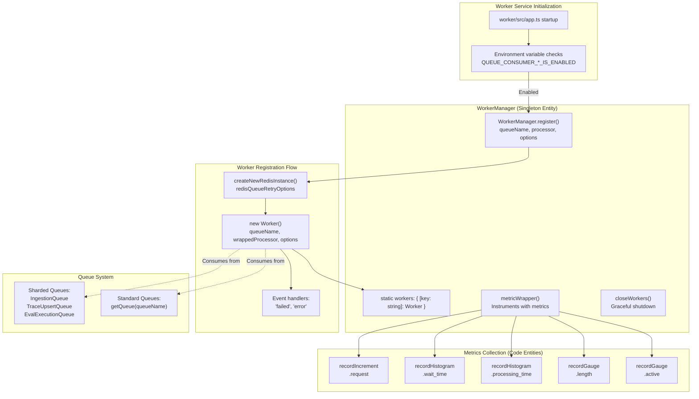
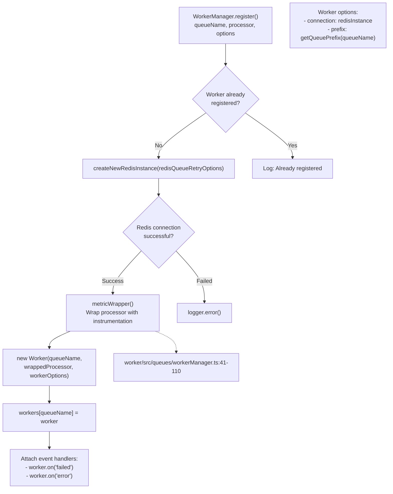

The `WorkerManager` is the central orchestration layer for background job processing in the Langfuse worker service. It manages the lifecycle, registration, and instrumentation of BullMQ workers that consume jobs from Redis-backed queues. For information about the queue architecture itself, see [Queue Architecture (7.1)](). For details on individual queue processors, see [Queue Processors (7.3)]().

## Purpose and Responsibilities

The `WorkerManager` class serves as a singleton registry that:

1.  **Registers workers** for each queue with their corresponding processor functions [worker/src/queues/workerManager.ts:127-131]().
2.  **Instruments all queue processing** with comprehensive metrics (request counts, wait times, processing times, queue lengths, and active counts) [worker/src/queues/workerManager.ts:41-110]().
3.  **Manages worker lifecycle** including graceful shutdown [worker/src/queues/workerManager.ts:112-117]().
4.  **Handles errors** with centralized logging and exception tracking [worker/src/queues/workerManager.ts:161-184]().
5.  **Configures worker options** such as concurrency, rate limits, and connection prefixes [worker/src/queues/workerManager.ts:145-153]().

Sources: [worker/src/queues/workerManager.ts:20-186]()

## Architecture Overview



**Worker Manager System Architecture**

The `WorkerManager` acts as a central coordination point between the application startup logic and the BullMQ worker instances. Each queue consumer is conditionally registered based on environment variables in `app.ts` [worker/src/app.ts:125-280]().

Sources: [worker/src/queues/workerManager.ts:20-186](), [worker/src/app.ts:125-280]()

## Worker Registration Process

### Registration Method

The `WorkerManager.register()` static method is the primary interface for creating and registering workers. It ensures that a worker is not registered multiple times for the same queue [worker/src/queues/workerManager.ts:132-135]().

Sources: [worker/src/queues/workerManager.ts:127-186]()

### Registration Flow



**Worker Registration Flow Diagram**

The registration process includes validation, Redis connection setup using `createNewRedisInstance` [worker/src/queues/workerManager.ts:138](), processor wrapping with instrumentation [worker/src/queues/workerManager.ts:147](), and error handler attachment [worker/src/queues/workerManager.ts:161-184]().

Sources: [worker/src/queues/workerManager.ts:127-186]()

### Example Registrations from app.ts

| Queue Name | Processor | Concurrency | Rate Limiter |
| :--- | :--- | :--- | :--- |
| `TraceUpsert` (sharded) | `evalJobTraceCreatorQueueProcessor` | `env.LANGFUSE_TRACE_UPSERT_WORKER_CONCURRENCY` | None |
| `CreateEvalQueue` | `evalJobCreatorQueueProcessor` | `env.LANGFUSE_EVAL_CREATOR_WORKER_CONCURRENCY` | `max: concurrency, duration: env.LANGFUSE_EVAL_CREATOR_LIMITER_DURATION` |
| `TraceDelete` | `traceDeleteProcessor` | `env.LANGFUSE_TRACE_DELETE_CONCURRENCY` | `max: concurrency, duration: 2 min` |
| `IngestionQueue` | `ingestionQueueProcessorBuilder(true)` | `env.LANGFUSE_INGESTION_QUEUE_PROCESSING_CONCURRENCY` | None |

Sources: [worker/src/app.ts:125-193](), [worker/src/env.ts:104-116]()

## Metrics Instrumentation

### Metrics Wrapper

The `metricWrapper()` private static method wraps every processor function to automatically collect comprehensive metrics [worker/src/queues/workerManager.ts:41-110]().

```mermaid
graph LR
    JobReceived["Job received from queue"]
    
    StartTimer["startTime = Date.now()"]
    
    CalcWait["waitTime = now - job.timestamp"]
    
    RecordRequest["recordIncrement()<br/>.request"]
    
    RecordWait["recordHistogram()<br/>.wait_time"]
    
    ExecuteProcessor["await processor(job)"]
    
    GetQueue["resolveQueueInstance(queueName)"]
    
    GetCounts["Promise.allSettled:<br/>- getWaitingCount()<br/>- getFailedCount()<br/>- getActiveCount()"]
    
    RecordGauges["recordGauge:<br/>- .length<br/>- .dlq_length<br/>- .active"]
    
    CalcProcessing["processingTime = now - startTime"]
    
    RecordProcessing["recordHistogram()<br/>.processing_time"]
    
    JobReceived --> StartTimer
    StartTimer --> CalcWait
    CalcWait --> RecordRequest
    RecordRequest --> RecordWait
    RecordWait --> ExecuteProcessor
    ExecuteProcessor --> GetQueue
    GetQueue --> GetCounts
    GetCounts --> RecordGauges
    RecordGauges --> CalcProcessing
    CalcProcessing --> RecordProcessing
```



**Metrics Collection Flow**

Every job execution is wrapped with instrumentation that captures timing, throughput, and queue depth metrics using `recordIncrement`, `recordHistogram`, and `recordGauge` [worker/src/queues/workerManager.ts:52-91](). It uses a sampling mechanism for sharded queues via `env.LANGFUSE_QUEUE_METRICS_SAMPLE_RATE` to reduce metric volume [worker/src/queues/workerManager.ts:71-72]().

Sources: [worker/src/queues/workerManager.ts:41-110]()

### Collected Metrics

The `WorkerManager` generates metrics using both legacy and sharded naming conventions to support transition periods [worker/src/queues/workerManager.ts:45-46]().

| Metric Name Pattern | Type | Purpose |
| :--- | :--- | :--- |
| `{queueName}.request` | Counter | Total number of jobs processed [worker/src/queues/workerManager.ts:52]() |
| `{queueName}.wait_time` | Histogram | Time job waited in queue before processing [worker/src/queues/workerManager.ts:58-60]() |
| `{queueName}.processing_time` | Histogram | Time taken to process job [worker/src/queues/workerManager.ts:99-101]() |
| `{queueName}.length` | Gauge | Number of waiting jobs in queue [worker/src/queues/workerManager.ts:78-81]() |
| `{queueName}.dlq_length` | Gauge | Number of failed jobs in dead letter queue [worker/src/queues/workerManager.ts:83-86]() |
| `{queueName}.active` | Gauge | Number of jobs currently being processed [worker/src/queues/workerManager.ts:88-91]() |

Sources: [worker/src/queues/workerManager.ts:41-110]()

## Worker Lifecycle Management

### Initialization

Workers are initialized during application startup in `worker/src/app.ts`. The initialization is conditional based on environment flags [worker/src/app.ts:125-280]().

Example initialization for sharded queues:
```typescript
if (env.QUEUE_CONSUMER_TRACE_UPSERT_QUEUE_IS_ENABLED === "true") {
  // Register workers for all trace upsert queue shards
  const traceUpsertShardNames = TraceUpsertQueue.getShardNames();
  traceUpsertShardNames.forEach((shardName) => {
    WorkerManager.register(
      shardName as QueueName,
      evalJobTraceCreatorQueueProcessor,
      {
        concurrency: env.LANGFUSE_TRACE_UPSERT_WORKER_CONCURRENCY,
      },
    );
  });
}
```
Sources: [worker/src/app.ts:125-137]()

### Graceful Shutdown

The `closeWorkers()` static method provides graceful shutdown functionality by calling `.close()` on all registered workers [worker/src/queues/workerManager.ts:112-117](). This is invoked by the `onShutdown` handler in the worker process [worker/src/utils/shutdown.ts:56]().

Sources: [worker/src/queues/workerManager.ts:112-117](), [worker/src/utils/shutdown.ts:56]()

## Error Handling

### Error Event Handlers

The `WorkerManager` attaches two error event handlers to each worker during registration [worker/src/queues/workerManager.ts:161-184]():

1.  **Failed Job Handler**: Triggered when a job fails. It logs the failure, traces the exception via `traceException`, and increments the `{queueName}.failed` metric [worker/src/queues/workerManager.ts:161-172]().
2.  **Worker Error Handler**: Triggered when the worker itself encounters an error. It logs the error and increments the `{queueName}.error` metric [worker/src/queues/workerManager.ts:173-184]().

Sources: [worker/src/queues/workerManager.ts:161-184]()

## Configuration

### Environment Variables

Queue consumer behavior is controlled by environment variables defined in `worker/src/env.ts`.

| Environment Variable | Default | Purpose |
| :--- | :--- | :--- |
| `QUEUE_CONSUMER_INGESTION_QUEUE_IS_ENABLED` | `"true"` | Toggle ingestion queue workers [worker/src/env.ts:188-190]() |
| `QUEUE_CONSUMER_TRACE_UPSERT_QUEUE_IS_ENABLED` | `"true"` | Toggle trace upsert workers [worker/src/env.ts:206-208]() |
| `LANGFUSE_TRACE_UPSERT_WORKER_CONCURRENCY` | `25` | Concurrency for trace upsert [worker/src/env.ts:112-115]() |
| `LANGFUSE_INGESTION_QUEUE_PROCESSING_CONCURRENCY` | `20` | Concurrency for ingestion [worker/src/env.ts:74-77]() |
| `LANGFUSE_QUEUE_METRICS_SAMPLE_RATE` | `0.1` (example) | Sampling rate for sharded queue gauges [worker/src/queues/workerManager.ts:72]() |

Sources: [worker/src/env.ts:4-210](), [worker/src/queues/workerManager.ts:72]()

### Redis Connection Configuration

All workers use a shared Redis configuration strategy:
- **Connection**: Created via `createNewRedisInstance(redisQueueRetryOptions)` [worker/src/queues/workerManager.ts:138]().
- **Retry Logic**: Uses `redisQueueRetryOptions` for connection stability [worker/src/queues/workerManager.ts:11]().
- **Prefix**: Uses `getQueuePrefix(queueName)` to ensure correct Redis key isolation [worker/src/queues/workerManager.ts:150]().

Sources: [worker/src/queues/workerManager.ts:11-150]()

## Integration with Queue System

### Queue Discovery

The `WorkerManager` interacts with both sharded and standard queues to report metrics:

1.  **Sharded Queues**: High-throughput queues like `IngestionQueue` and `TraceUpsertQueue`. Shard names are retrieved and handled specifically for metric reporting using `resolveMetricInfo` [worker/src/queues/workerManager.ts:23-39]().
2.  **Standard Queues**: Single-instance queues resolved via `resolveQueueInstance(queueName)` [worker/src/queues/workerManager.ts:69]().

Sources: [worker/src/queues/workerManager.ts:23-69](), [packages/shared/src/server/redis/getQueue.ts]()

### Worker Discovery API

The admin API at `/api/admin/bullmq` allows inspection of job counts across all registered queues and shards by instantiating the relevant queue instances [web/src/pages/api/admin/bullmq/index.ts:68-132]().

Sources: [web/src/pages/api/admin/bullmq/index.ts:68-132]()