# langfuse/langfuse — DeepWiki Notes

Source: https://deepwiki.com/langfuse/langfuse


# langfuse Documentation Index

This file contains links to all extracted documents.
Please refer to the files below for detailed information.

- [Introduction](langfuse/Introduction.md)
- [Overview](langfuse/Overview.md)
- [System Architecture](langfuse/System_Architecture.md)
- [Monorepo Structure](langfuse/Monorepo_Structure.md)
- [Technology Stack](langfuse/Technology_Stack.md)
- [Getting Started](langfuse/Getting_Started.md)
- [1. Install dependencies](langfuse/1._Install_dependencies.md)
- [2. Bootstrap infrastructure and databases Destructive](langfuse/2._Bootstrap_infrastructure_and_databases_Destructive.md)
- [Generate Prisma Client artifacts in packagesshareddist](langfuse/Generate_Prisma_Client_artifacts_in_packagesshareddist.md)
- [Apply migrations to local Postgres](langfuse/Apply_migrations_to_local_Postgres.md)
- [Running Services](langfuse/Running_Services.md)
- [Start all infrastructure services](langfuse/Start_all_infrastructure_services.md)
- [Stop services preserves data](langfuse/Stop_services_preserves_data.md)
- [Stop services and remove volumes clean slate](langfuse/Stop_services_and_remove_volumes_clean_slate.md)
- [Seed PostgreSQL with base data Orgs Projects Users API Keys](langfuse/Seed_PostgreSQL_with_base_data_Orgs_Projects_Users_API_Keys.md)
- [Seed with example tracesobservationsscores](langfuse/Seed_with_example_tracesobservationsscores.md)
- [Database Overview](langfuse/Database_Overview.md)
- [PostgreSQL Schema](langfuse/PostgreSQL_Schema.md)
- [ClickHouse Schema](langfuse/ClickHouse_Schema.md)
- [Events Table  Dual-Write Architecture](langfuse/Events_Table__Dual-Write_Architecture.md)
- [Repository Pattern](langfuse/Repository_Pattern.md)
- [Query Optimization](langfuse/Query_Optimization.md)
- [Authentication  Authorization](langfuse/Authentication__Authorization.md)
- [Multi-tenant SSO](langfuse/Multi-tenant_SSO.md)
- [RBAC  Permissions](langfuse/RBAC__Permissions.md)
- [Public REST API](langfuse/Public_REST_API.md)
- [API Authentication  Rate Limiting](langfuse/API_Authentication__Rate_Limiting.md)
- [Data Ingestion Pipeline](langfuse/Data_Ingestion_Pipeline.md)
- [Ingestion Overview](langfuse/Ingestion_Overview.md)
- [Event Enrichment  Masking](langfuse/Event_Enrichment__Masking.md)
- [Event Propagation System](langfuse/Event_Propagation_System.md)
- [OpenTelemetry Ingestion](langfuse/OpenTelemetry_Ingestion.md)
- [Queue  Worker System](langfuse/Queue__Worker_System.md)
- [Worker Manager](langfuse/Worker_Manager.md)
- [Queue Processors](langfuse/Queue_Processors.md)
- [Error Handling  Retries](langfuse/Error_Handling__Retries.md)
- [Background Services](langfuse/Background_Services.md)
- [Table Components System](langfuse/Table_Components_System.md)
- [UI State Management](langfuse/UI_State_Management.md)
- [Trace  Session Views](langfuse/Trace__Session_Views.md)
- [Virtualization  Performance](langfuse/Virtualization__Performance.md)
- [Filter  View System](langfuse/Filter__View_System.md)
- [Batch Actions  Selection](langfuse/Batch_Actions__Selection.md)
- [Scores  Scoring](langfuse/Scores__Scoring.md)
- [Sessions](langfuse/Sessions.md)
- [Prompts  Templates](langfuse/Prompts__Templates.md)
- [Evaluation System](langfuse/Evaluation_System.md)
- [LLM API Key Management](langfuse/LLM_API_Key_Management.md)
- [LLM Playground](langfuse/LLM_Playground.md)
- [Development  Operations](langfuse/Development__Operations.md)
- [CICD Pipeline](langfuse/CICD_Pipeline.md)
- [Testing Strategy](langfuse/Testing_Strategy.md)
- [Observability  Monitoring](langfuse/Observability__Monitoring.md)
- [Glossary](langfuse/Glossary.md)

pnpm install
pnpm run dx
```

**What `pnpm run dx` Does:**
The `dx` script performs a full reset and bootstrap of the local environment [CLAUDE.md:103](). It prunes existing containers, resets PostgreSQL and ClickHouse databases, and seeds example data.

For subsequent sessions, use:
- `pnpm run dev`: Starts all services (Web + Worker) [CLAUDE.md:96]().
- `pnpm run dev:web`: Starts only the Next.js application [CLAUDE.md:97]().
- `pnpm run dev:worker`: Starts only the background worker [CLAUDE.md:98]().

Sources: [CLAUDE.md:93-103](), [turbo.json:32-46]()

---

## Key Scripts Reference

Orchestrated by Turbo, these scripts manage the lifecycle of the monorepo:

| Command | Action |
|---------|--------|
| `pnpm run db:generate` | Regenerates Prisma client based on the shared schema [turbo.json:47-51]() |
| `pnpm run db:migrate` | Deploys PostgreSQL migrations [turbo.json:14-16]() |
| `pnpm run db:seed` | Seeds the database with default data [turbo.json:26-28]() |
| `pnpm run typecheck` | Runs `tsc` across all packages in the workspace [CLAUDE.md:100](), [turbo.json:56-60]() |
| `pnpm run lint` | Executes ESLint across the monorepo [CLAUDE.md:99](), [turbo.json:52-55]() |

Sources: [turbo.json:5-75](), [CLAUDE.md:93-103]()

---

## Sub-pages

| Page | Contents |
|------|----------|
| [Installation & Setup](#2.1) | Detailed prerequisites, dependency installation with pnpm, and initial database setup. |
| [Environment Configuration](#2.2) | Full documentation of environment variables for web and worker services, including DB URLs, Redis, and S3. |
| [Running Services](#2.3) | Instructions for starting services, running migrations, and seeding data. |

# Installation & Setup


## Purpose & Scope

This document provides technical instructions for setting up a local development environment for the Langfuse monorepo. It covers prerequisites, dependency management with `pnpm`, infrastructure orchestration via Docker, and the initialization of the dual-database architecture (PostgreSQL and ClickHouse). For environment variable details, see **Environment Configuration (2.2)**.

## System Requirements

### Node.js Runtime
Langfuse requires **Node.js version 24**. This is enforced across the monorepo configuration to ensure compatibility with Next.js and modern OpenTelemetry instrumentations used in the services [package.json:7-9]().

| Component | Requirement | Source |
| :--- | :--- | :--- |
| Node Version | `24` | [package.json:7-9]() |
| Web Engine | `node: 24` | [web/package.json:6-8]() |
| Worker Engine | `node: 24` | [worker/package.json:11-13]() |

**Sources:** [package.json:7-9](), [web/package.json:6-8](), [worker/package.json:11-13]()

### Package Manager
The project uses **pnpm version 10.33.0**. Usage of `pnpm` is strictly enforced via `only-allow` to maintain lockfile integrity and efficient workspace linking [package.json:14-14]().

```bash
# Corepack is used to manage the pinned version
corepack enable
corepack prepare pnpm@10.33.0 --activate
```

**Sources:** [package.json:100-100](), [package.json:14-14](), [web/Dockerfile:13-14]()

### Core Technology Stack
The development environment relies on the following core tools:
*   **Turbo**: Orchestrates tasks (build, lint, test) across the monorepo [package.json:51-51]().
*   **Docker**: Required for running the local infrastructure stack defined in `docker-compose.dev.yml` [package.json:15-17]().
*   **ClickHouse Migrate CLI**: Used for managing ClickHouse database migrations [web/Dockerfile:33-34]().

## Dependency Installation

### Workspace Architecture
Langfuse is structured as a `pnpm` workspace. This allows the `web` and `worker` services to consume shared logic from `@langfuse/shared` and enterprise features from `@langfuse/ee` without manual publishing [CONTRIBUTING.md:99-108]().

**Workspace Dependency Graph**

```mermaid
graph TD
    subgraph "Monorepo_Structure"
        Root["Root: langfuse/package.json"]
        
        subgraph "Applications"
            Web["web/ (Next.js)<br/>UI & Ingestion API"]
            Worker["worker/ (Express/BullMQ)<br/>Async Processing"]
        end
        
        subgraph "Internal_Packages"
            Shared["packages/shared/<br/>@langfuse/shared"]
            EE["ee/<br/>@langfuse/ee"]
            ESLint["packages/config-eslint/"]
            TSConfig["packages/config-typescript/"]
        end
    end

    Web -- "workspace:*" --> Shared [web/package.json:45-45]
    Web -- "workspace:*" --> EE [web/package.json:44-44]
    Worker -- "workspace:*" --> Shared [worker/package.json:35-35]
    EE -- "workspace:*" --> Shared [ee/package.json:29-29]
    
    Shared -- "exports" --> DB["Prisma/ClickHouse Clients"] [packages/shared/package.json:17-50]
```

**Sources:** [CONTRIBUTING.md:99-108](), [web/package.json:44-45](), [worker/package.json:35-35](), [ee/package.json:29-29](), [packages/shared/package.json:17-50]()

### Installation Command
To install all dependencies and link internal workspace packages, run:
```bash
pnpm install
```
The root `package.json` includes a `postinstall` hook that triggers additional repository helpers [package.json:13-13]().

## Infrastructure Setup

### Local Services
Langfuse requires four primary infrastructure components. These are managed via `docker-compose.dev.yml` [package.json:15-17]().

| Service | Technology | Port | Usage |
| :--- | :--- | :--- | :--- |
| **Database** | PostgreSQL | 5432 | Transactional data (Users, Projects, API Keys) |
| **Analytics** | ClickHouse | 8123/9000 | OLAP data (Traces, Observations, Scores) |
| **Cache/Queue** | Redis | 6379 | BullMQ job coordination and caching |
| **Storage** | Minio (S3) | 9090/9091 | Raw event storage and multi-modal attachments |

**Sources:** [docker-compose.yml:6-145](), [CONTRIBUTING.md:64-89]()

### Management Commands
Infrastructure is controlled via root-level scripts:
*   `pnpm run infra:dev:up`: Starts the infrastructure containers and waits for health checks [package.json:15-15]().
*   `pnpm run infra:dev:down`: Stops the infrastructure [package.json:16-16]().
*   `pnpm run infra:dev:prune`: Stops and removes volumes (destructive) [package.json:17-17]().

## Database Initialization

### PostgreSQL & Prisma
PostgreSQL initialization involves generating the Prisma client and applying migrations. These tasks are orchestrated via Turbo [package.json:18-21]().

```bash
This page explains how incoming public REST API requests are authenticated, how the `ApiAuthService` resolves and caches credentials, and how rate limiting is applied per project scope using Redis. It covers the runtime enforcement layer that sits at the boundary of every `POST /api/public/*` and `GET /api/public/*` endpoint.

- For how API keys are created, hashed, and stored in the database, see [4.3]().
- For the full public REST API surface, see [5.1]().
- For tRPC internal authentication (session-based), see [4.1]().
- For RBAC enforced after authentication, see [4.4]().

---

## Overview

Every public REST API request goes through a multi-stage gate. The ingestion endpoint, for example, validates permissions, rate limits, and request structure before dispatching events to the processing pipeline [web/src/pages/api/public/ingestion.ts:34-49]().

1.  **CORS & Method Validation**: Handled by `runMiddleware` with `cors` and basic method checks [web/src/pages/api/public/ingestion.ts:55-73]().
2.  **Authentication**: The `ApiAuthService` decodes the `Authorization` header, resolves the API key against PostgreSQL (with a Redis cache layer), and produces an `AuthHeaderVerificationResult` [web/src/features/public-api/server/apiAuth.ts:86-198]().
3.  **Rate Limiting**: The `RateLimitService` checks the resolved scope against configurable limits (based on the organization's plan or custom overrides) before the request is processed [web/src/features/public-api/server/RateLimitService.ts:63-82]().

**Request lifecycle diagram for Public API**

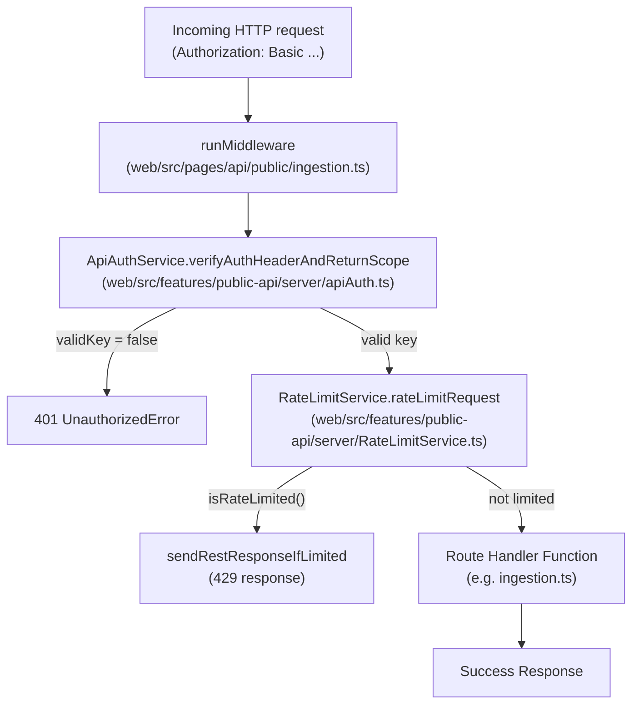

Sources: [web/src/pages/api/public/ingestion.ts:50-139](), [web/src/features/public-api/server/apiAuth.ts:86-198](), [web/src/features/public-api/server/RateLimitService.ts:63-82]()

---

## Authentication Methods

The Langfuse Public API supports multiple authentication mechanisms depending on the environment and the required access level.

### Basic Authentication
Primarily used for full project/org access. The client base64-encodes `publicKey:secretKey` and sends it as `Authorization: Basic <encoded>` [web/src/features/public-api/server/apiAuth.ts:102-104]().

| Field | Value |
|---|---|
| Username | Langfuse **Public Key** (prefix `pk-lf-...`) |
| Password | Langfuse **Secret Key** (prefix `sk-lf-...`) |

### Bearer Authentication (Public Key)
Used for limited public access (e.g., scoring or prompt fetching from client-side environments) using only the public key [web/src/features/public-api/server/apiAuth.ts:200-201]().

Sources: [web/src/features/public-api/server/apiAuth.ts:102-201](), [web/src/__tests__/server/prompts.v2.servertest.ts:134-139]()

---

## ApiAuthService

`ApiAuthService` (at `web/src/features/public-api/server/apiAuth.ts`) is the central class for verifying credentials.

### Credential Resolution Flow

The service uses a "fast-hash" strategy. It first checks for a SHA-256 hash of the secret key in Redis/PostgreSQL. If not found, it performs a "slow" verification against the legacy `bcrypt` hashed key and then upgrades the record to include the `fastHashedSecretKey` for future requests [web/src/features/public-api/server/apiAuth.ts:107-161]().

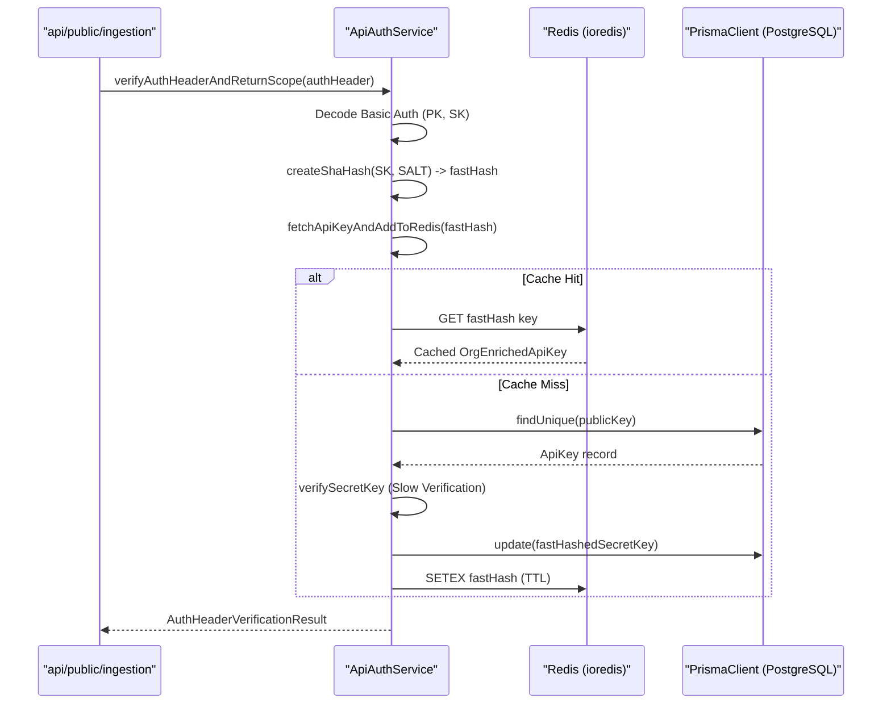

Sources: [web/src/features/public-api/server/apiAuth.ts:86-161](), [web/src/features/public-api/server/apiAuth.ts:107-112]()

### API Key Caching & Invalidation

Redis caching is used to avoid expensive database lookups on every API call.
- **Invalidation**: Methods like `invalidateCachedOrgApiKeys` and `invalidateCachedProjectApiKeys` purge keys from Redis when projects move, plans change, or keys are deleted [web/src/features/public-api/server/apiAuth.ts:41-51]().
- **Deletion**: When an API key is deleted via `deleteApiKey`, it is removed from the database and invalidated in Redis for consistency [web/src/features/public-api/server/apiAuth.ts:59-84]().

---

## Rate Limiting with Redis

`RateLimitService` (at `web/src/features/public-api/server/RateLimitService.ts`) implements rate limiting using the `rate-limiter-flexible` library backed by Redis [web/src/features/public-api/server/RateLimitService.ts:3-33]().

### Strategy & Configuration

Limits are applied per **Organization ID** for specific **Resources**. The system distinguishes between different operation types via the `RateLimitResource` enum.

| Resource Type | Description |
|---|---|
| `ingestion` | Main event ingestion endpoint (`/api/public/ingestion`) [web/src/pages/api/public/ingestion.ts:106](). |
| `public-api` | General GET/POST CRUD operations on traces, scores, etc. |

### Plan-Based Limits

Limits are determined by the organization's plan (e.g., `cloud:hobby`, `cloud:pro`, `oss`).
- **Cloud**: Rate limits are strictly enforced using Redis if the `NEXT_PUBLIC_LANGFUSE_CLOUD_REGION` is set [web/src/features/public-api/server/RateLimitService.ts:68-70]().
- **Self-Hosted/OSS**: Rate limiting is disabled by default (`fail open`) or if Redis is unavailable [web/src/features/public-api/server/RateLimitService.ts:68-79]().
- **Overrides**: The `ApiAccessScope` can contain `rateLimitOverrides` which take precedence over plan defaults [web/src/features/public-api/server/apiAuth.ts:191]().

### Fail-Open Design

The service is designed to be resilient. If Redis is down or a connection fails, the system logs an error and allows the request to proceed [web/src/features/public-api/server/RateLimitService.ts:143-147]().

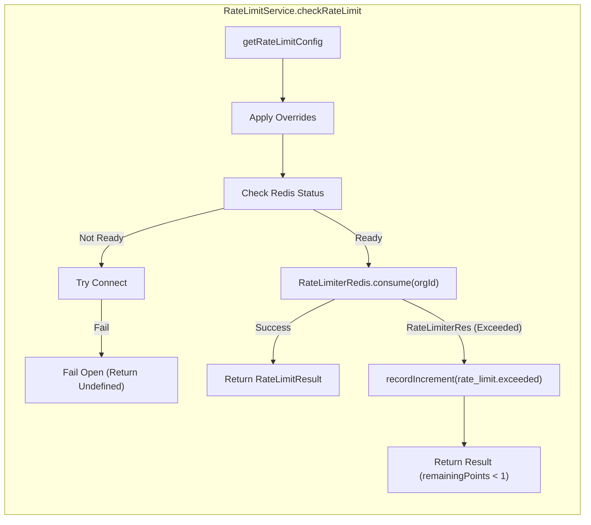

Sources: [web/src/features/public-api/server/RateLimitService.ts:84-159](), [web/src/features/public-api/server/apiAuth.ts:191]()

---

## Implementation Details

### Error Handling

The ingestion handler and `withMiddlewares` wrapper provide unified error formatting for the Public API:
- **BaseError**: Returns mapped HTTP codes for known internal errors [web/src/pages/api/public/ingestion.ts:146-151]().
- **UnauthorizedError**: Thrown if the API key is invalid or missing `projectId` [web/src/pages/api/public/ingestion.ts:81-88]().
- **ZodError**: Returns `400 Bad Request` with validation details if the request body is incorrect [web/src/pages/api/public/ingestion.ts:159-165]().
- **ClickHouseResourceError**: Returns `422 Unprocessable Content` if analytical query limits are hit [web/src/features/public-api/server/withMiddlewares.ts:125-138]().

### tRPC Authentication Middleware

tRPC uses a different stack for authentication, primarily relying on `getServerAuthSession` to resolve `next-auth` sessions [web/src/server/api/trpc.ts:57-61](). It includes global error handling that masks 5xx errors in cloud environments to prevent leaking internal details [web/src/server/api/trpc.ts:174-187]().

### Observability & Instrumentation

Authentication and Redis operations are instrumented using OpenTelemetry.
- **ioredisRequestHook**: Redacts credentials from `AUTH` and `HELLO` commands and masks API key values in Redis traces [packages/shared/src/server/instrumentation/index.ts:16-35]().
- **addUserToSpan**: Enriches telemetry spans with `userId`, `projectId`, `orgId`, and `plan` during the authentication phase [packages/shared/src/server/instrumentation/index.ts:190-243]().
- **instrumentAsync**: Wraps authentication logic in `api-auth-verify` spans [web/src/features/public-api/server/apiAuth.ts:89-91]().

---

## Environment Variable Summary

| Variable | Description |
|---|---|
| `SALT` | Used for SHA-256 hashing of API secret keys [web/src/features/public-api/server/apiAuth.ts:106](). |
| `LANGFUSE_RATE_LIMITS_ENABLED` | Global toggle for the RateLimitService [web/src/features/public-api/server/RateLimitService.ts:72](). |
| `NEXT_PUBLIC_LANGFUSE_CLOUD_REGION` | Enables cloud-specific behaviors like strict rate limiting [web/src/features/public-api/server/RateLimitService.ts:68](). |

Sources: [web/src/features/public-api/server/apiAuth.ts:106](), [web/src/features/public-api/server/RateLimitService.ts:68-72](), [packages/shared/src/server/instrumentation/index.ts:16-35]()

# MCP Server


The Langfuse MCP (Model Context Protocol) Server enables AI assistants (such as Claude Desktop, Claude Code, or Cursor) to interact directly with Langfuse resources. It provides a standardized interface for LLMs to fetch prompts, manage versions, and understand the context of managed templates within a Langfuse project.

## Overview

The MCP implementation in Langfuse follows a **stateless per-request architecture** integrated into the Next.js web application layer. It exposes specific "tools" that allow an AI agent to query and manage the Langfuse Prompt Management system.

### Key Characteristics
- **Stateless Architecture**: Each MCP request creates a fresh server instance. Authentication context is captured in handler closures, and no state is maintained between requests [web/src/features/mcp/README.md:94-106]().
- **Tool-Based Interface**: Functionality is exposed as discrete tools with metadata hints like `readOnly` or `destructive` to help clients manage user permissions [web/src/features/mcp/README.md:47-56](), [web/src/features/mcp/README.md:137-148]().
- **Unified Authentication**: Uses the same `ApiAuthService` as the Public REST API, requiring project-scoped API keys (Public Key + Secret Key) [web/src/features/mcp/README.md:107-123]().

## Architecture & Data Flow

The MCP server acts as a bridge between the Model Context Protocol and the internal `PromptService`. When an AI assistant requests a prompt, the flow transitions from the protocol layer to the database/cache layer.

### Request Flow Diagram

Title: MCP Tool Execution Flow
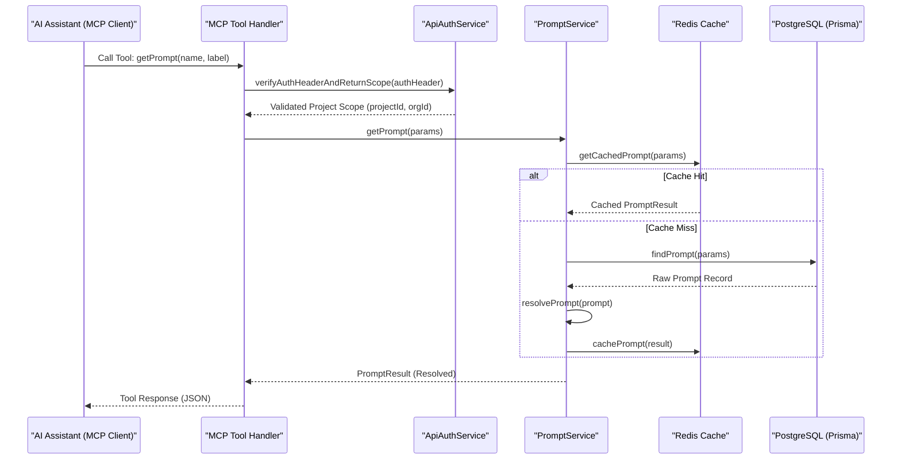

**Sources:** [packages/shared/src/server/services/PromptService/index.ts:47-80](), [web/src/pages/api/public/prompts.ts:31-45](), [web/src/features/mcp/README.md:109-123]().

## Prompt Management Tools

The MCP server provides 6 primary tools for prompt management. These tools leverage the `PromptService` and server actions to handle complex logic like prompt nesting and metadata filtering.

### Available Tools

| Tool Name | Type | Description |
| :--- | :--- | :--- |
| `getPrompt` | Read | Fetches a specific prompt by name and label/version. Recursively resolves all dependency tags [web/src/features/mcp/README.md:49-50](), [web/src/features/mcp/README.md:62-69](). |
| `getPromptUnresolved` | Read | Fetches a prompt WITHOUT resolving dependencies. Returns raw content with `@@@langfusePrompt:...@@@` tags intact [web/src/features/mcp/README.md:51-52](), [web/src/features/mcp/README.md:72-80](). |
| `listPrompts` | Read | Lists and filters prompts in the project by name, label, tag, or `updatedAt` range with pagination [web/src/features/mcp/features/prompts/tools/listPrompts.ts:74-87](). |
| `createTextPrompt` | Write | Creates a new text prompt version [web/src/features/mcp/README.md:52](). |
| `createChatPrompt` | Write | Creates a new chat prompt version (OpenAI-style messages) [web/src/features/mcp/README.md:53](). |
| `updatePromptLabels` | Write | Adds or moves labels across prompt versions [web/src/features/mcp/README.md:54](). |

### Prompt Resolution Logic
The `PromptService` handles the resolution of prompts. If a prompt contains dependencies (nested prompts via tags), the service builds a `PromptGraph` and resolves it up to a maximum depth of 5 [packages/shared/src/server/services/PromptService/index.ts:18-20](), [packages/shared/src/server/services/PromptService/index.ts:242-251]().

Title: Natural Language to Prompt Resolution
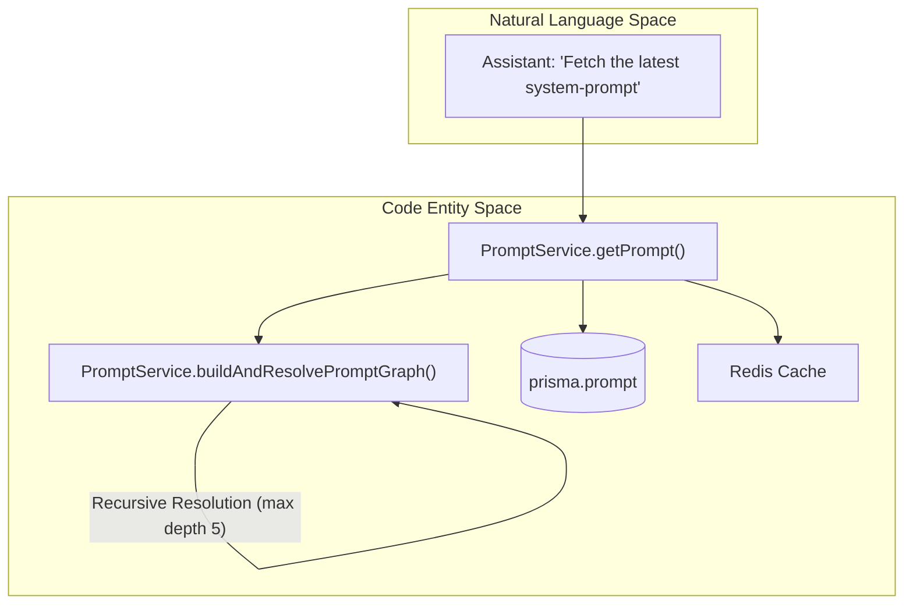

**Sources:** [packages/shared/src/server/services/PromptService/index.ts:18-20](), [packages/shared/src/server/services/PromptService/index.ts:130-145](), [packages/shared/src/server/services/PromptService/index.ts:234-249]().

## Authentication & Authorization

MCP requests are authenticated via the `ApiAuthService`. The server expects standard Langfuse API credentials (Public Key and Secret Key) provided via Basic Authentication in the HTTP header [web/src/features/mcp/README.md:157-169]().

1.  **Header Verification**: The server validates the `Authorization: Basic {base64}` header [web/src/features/mcp/README.md:36-38]().
2.  **Scope Validation**: It ensures the API key has `project` level scope. Organization-level keys are not supported for MCP [web/src/features/mcp/README.md:15-18](), [web/src/pages/api/public/prompts.ts:37-44]().
3.  **Context Injection**: Authenticated metadata (projectId, orgId, apiKeyId) is injected into a `ServerContext` which is passed to tool handlers [web/src/features/mcp/README.md:125-134]().
4.  **Audit Logging**: All destructive write operations (create, update, delete) automatically create audit log entries with before/after snapshots using `auditLog` [web/src/features/prompts/server/handlers/promptNameHandler.ts:88-99](), [web/src/features/mcp/README.md:149-152](), [web/src/features/prompts/server/handlers/promptVersionHandler.ts:34-42]().

**Sources:** [web/src/pages/api/public/prompts.ts:31-44](), [web/src/features/mcp/README.md:107-134](), [web/src/features/prompts/server/handlers/promptNameHandler.ts:88-99](), [web/src/features/prompts/server/handlers/promptVersionHandler.ts:34-42]().

## Implementation Details

### PromptService Caching
To ensure high performance for MCP tool calls, the `PromptService` implements a two-tier caching strategy:
- **Redis Cache**: Resolved prompts are stored in Redis with a TTL defined by `LANGFUSE_CACHE_PROMPT_TTL_SECONDS` [packages/shared/src/server/services/PromptService/index.ts:40-45]().
- **Epoch-based Invalidation**: When a prompt is updated or deleted, the service rotates a project-specific "epoch" token in Redis via `invalidateCache`. This moves all subsequent reads to a fresh namespace, effectively invalidating the cache for that project [packages/shared/src/server/services/PromptService/index.ts:177-190](), [web/src/features/prompts/server/actions/deletePrompt.ts:125-127](), [web/src/features/prompts/server/actions/updatePrompts.ts:138]().

### Tool Definition
Tools are defined using `defineTool`, which pairs a name and description with Zod-based input schemas and an async handler [web/src/features/mcp/features/prompts/tools/listPrompts.ts:74-90](). Read-only tools for prompts use standard retrieval logic via `getPromptByName` [web/src/features/prompts/server/actions/getPromptByName.ts:21-29]().

Title: MCP Tool to Code Entity Bridge
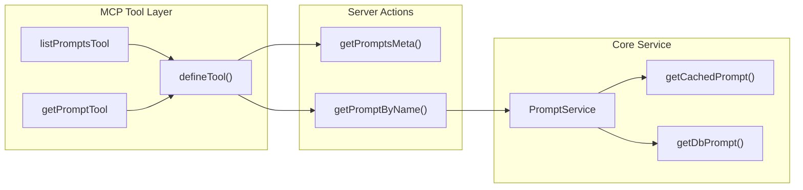

**Sources:** [packages/shared/src/server/services/PromptService/index.ts:147-175](), [web/src/features/mcp/features/prompts/tools/listPrompts.ts:74-132](), [web/src/features/prompts/server/actions/getPromptByName.ts:21-29](), [web/src/features/prompts/server/actions/updatePrompts.ts:22-25]().
pnpm run db:migrate
```

**Sources:** [package.json:18-19](), [packages/shared/package.json:58-64]()

### ClickHouse Migrations
ClickHouse schema management is handled using a dedicated migration CLI and initialization scripts located in the shared package [packages/shared/package.json:67-71]().

**Database Initialization Sequence**

```mermaid
graph LR
    subgraph "Postgres_Path"
        PrismaSchema["packages/shared/prisma/schema.prisma"]
        PrismaClient["@prisma/client"]
    end

    subgraph "ClickHouse_Path"
        CHScripts["packages/shared/clickhouse/scripts/"]
        CHMigrateCLI["migrate (golang-migrate)"]
    end

    Root_DX["'pnpm run dx'"] -- "triggers" --> DB_Gen["'turbo run db:generate'"] [package.json:18-18]
    DB_Gen -- "reads" --> PrismaSchema
    DB_Gen -- "emits" --> PrismaClient [packages/shared/package.json:64-64]
    
    Root_DX -- "executes" --> CHMigrateCLI [web/Dockerfile:151-151]
    CHMigrateCLI -- "applies" --> CHScripts [packages/shared/package.json:67-71]
```

**Sources:** [package.json:18-25](), [packages/shared/package.json:58-74](), [web/Dockerfile:151-151]()

## Streamlined Onboarding: The `dx` Command

For a "one-command" setup, Langfuse provides the `dx` script. This script performs a full reset and bootstrap of the environment, including seeding example data [package.json:23-23]().

```bash
pnpm run dx
```

**Sequence of operations performed by `dx`:**
1.  `pnpm i`: Install dependencies [package.json:23-23]().
2.  `infra:dev:prune`: Clean existing infrastructure [package.json:17-17]().
3.  `infra:dev:up`: Start fresh containers [package.json:15-15]().
4.  `db:reset`: Reset and migrate PostgreSQL [packages/shared/package.json:60-60]().
5.  `ch:reset`: Reset and migrate ClickHouse [packages/shared/package.json:71-71]().
6.  `db:seed:examples`: Seed the database with example traces and data [package.json:21-21]().
7.  `pnpm run dev`: Start the development servers for `web` and `worker` [package.json:31-31]().

**Sources:** [package.json:23-25](), [packages/shared/package.json:60-71]()

# Environment Configuration


## Purpose and Scope

This document describes the environment variable configuration system used to configure Langfuse services. It covers how environment variables are validated, loaded, and used across the web and worker applications. The system ensures that both the Next.js web service and the Express-based worker service have access to consistent infrastructure configuration while maintaining service-specific tuning parameters.

---

## Configuration Architecture

### Validation System

Langfuse uses [t3-oss/env-nextjs](https://github.com/t3-oss/env-nextjs) for the web service and Zod schemas for the worker and shared packages to validate environment variables at startup. This prevents runtime errors caused by missing or malformed configuration.

**Environment Validation Flow**

```mermaid
graph TB
    ["process.env / .env file"] --> WebEnv["web/src/env.mjs<br/>createEnv()"]
    ["process.env / .env file"] --> WorkerEnv["worker/src/env.ts<br/>EnvSchema.parse()"]
    ["process.env / .env file"] --> SharedEnv["packages/shared/src/env.ts<br/>EnvSchema.parse()"]
    
    subgraph "Web Service"
        WebEnv --> WebValidation["Zod Schema Validation<br/>(Server + Client)"]
        WebValidation -->|Valid| WebApp["Next.js Application"]
    end
    
    subgraph "Worker Service"
        WorkerEnv --> WorkerValidation["Zod Schema Validation"]
        WorkerValidation -->|Valid| WorkerApp["Express Application"]
    end
    
    subgraph "Shared Package"
        SharedEnv --> SharedValidation["Zod Schema Validation"]
        SharedValidation -->|Valid| SharedExports["Exported env object"]
    end
    
    WebValidation -->|Invalid| Error["Startup Error<br/>Descriptive validation message"]
    WorkerValidation -->|Invalid| Error
    SharedValidation -->|Invalid| Error
    
    SharedExports --> WebApp
    SharedExports --> WorkerApp
```

**Sources:** [web/src/env.mjs:40-45](), [worker/src/env.ts:4-222](), [packages/shared/src/env.ts:4-346]()

### Configuration Files

| File | Purpose | Validation Library |
|------|---------|-------------------|
| `web/src/env.mjs` | Web-specific configuration (Auth providers, UI flags, Public API) | `@t3-oss/env-nextjs` [web/src/env.mjs:2-40]() |
| `worker/src/env.ts` | Worker-specific configuration (Queue concurrency, Batch limits) | `zod` [worker/src/env.ts:4-222]() |
| `packages/shared/src/env.ts` | Shared infra (PostgreSQL, ClickHouse, Redis, S3, Queues) | `zod` [packages/shared/src/env.ts:4-346]() |
| `.env.prod.example` | Production reference template | N/A |

**Docker Build Skip Validation:** Both web and worker environments skip validation when `DOCKER_BUILD=1` is set [web/src/env.mjs:800](), [worker/src/env.ts:428](), allowing the container to be built without all runtime secrets present.

**Sources:** [web/src/env.mjs:1-800](), [worker/src/env.ts:1-431](), [packages/shared/src/env.ts:1-346]()

---

## Core Infrastructure Configuration

### Database Configuration

**PostgreSQL (Metadata Store)**

Langfuse uses Prisma as its ORM for PostgreSQL. The `DATABASE_URL` is used for general application queries, while `DIRECT_URL` is recommended for migrations if a connection pooler like PgBouncer is used.

| Variable | Required | Default | Description |
|----------|----------|---------|-------------|
| `DATABASE_URL` | Yes | - | PostgreSQL connection string [web/src/env.mjs:46]() |
| `DIRECT_URL` | No | `DATABASE_URL` | Direct connection for migrations [.env.prod.example:10]() |
| `LANGFUSE_AUTO_POSTGRES_MIGRATION_DISABLED` | No | `false` | Disable automatic migrations on container start [.env.prod.example:13]() |

**ClickHouse (Analytics & Events)**

ClickHouse stores high-volume event data. The configuration supports cluster mode and asynchronous inserts for performance.

| Variable | Required | Default | Description |
|----------|----------|---------|-------------|
| `CLICKHOUSE_URL` | Yes | - | ClickHouse HTTP endpoint [packages/shared/src/env.ts:74]() |
| `CLICKHOUSE_USER` | Yes | - | ClickHouse username [packages/shared/src/env.ts:79]() |
| `CLICKHOUSE_PASSWORD` | Yes | - | ClickHouse password [packages/shared/src/env.ts:80]() |
| `CLICKHOUSE_CLUSTER_ENABLED` | No | `true` | Enable cluster mode [worker/src/env.ts:103]() |
| `CLICKHOUSE_ASYNC_INSERT_BUSY_TIMEOUT_MS` | No | - | Timeout for async inserts [packages/shared/src/env.ts:85]() |
| `CLICKHOUSE_USE_LIGHTWEIGHT_UPDATE` | No | `false` | Use lightweight updates for deletions [packages/shared/src/env.ts:94]() |

**Sources:** [packages/shared/src/env.ts:74-97](), [worker/src/env.ts:98-103]()

### Redis Configuration

Redis is critical for BullMQ queues and distributed caching. Langfuse supports Standalone, Cluster, and Sentinel modes.

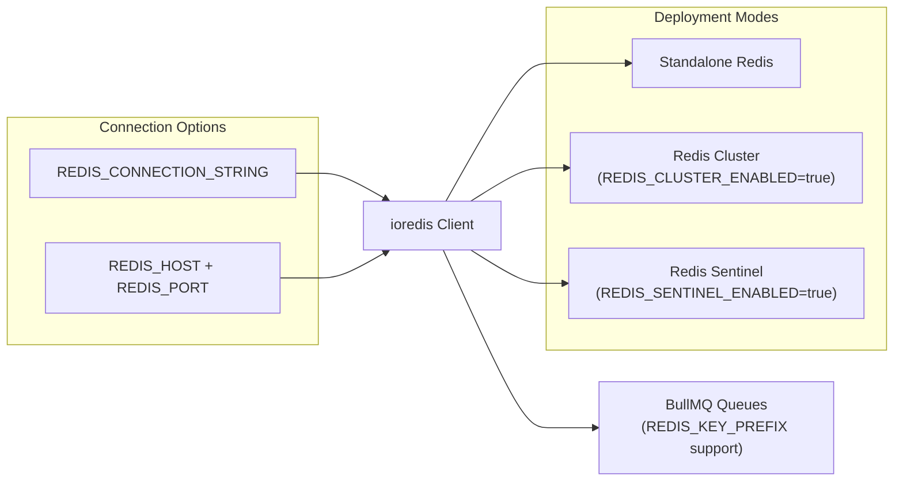

| Variable | Default | Description |
|----------|---------|-------------|
| `REDIS_CONNECTION_STRING` | - | Full connection URL (takes precedence) [packages/shared/src/env.ts:22]() |
| `REDIS_HOST` | - | Redis host [packages/shared/src/env.ts:13]() |
| `REDIS_KEY_PREFIX` | - | Prefix for multi-tenant Redis isolation [packages/shared/src/env.ts:25]() |
| `REDIS_TLS_ENABLED` | `false` | Enable TLS [packages/shared/src/env.ts:26]() |
| `REDIS_CLUSTER_ENABLED` | `false` | Enable Cluster mode [packages/shared/src/env.ts:39]() |
| `REDIS_SENTINEL_ENABLED` | `false` | Enable Sentinel mode [packages/shared/src/env.ts:46]() |

**Sources:** [packages/shared/src/env.ts:13-50](), [.env.dev.example:113-124]()

### S3 and Blob Storage

Langfuse uses S3-compatible storage for three distinct purposes: ingestion events, multimodal media, and batch exports.

| Feature | Bucket Variable | Prefix Variable |
|---------|-----------------|-----------------|
| **Events** | `LANGFUSE_S3_EVENT_UPLOAD_BUCKET` | `LANGFUSE_S3_EVENT_UPLOAD_PREFIX` |
| **Media** | `LANGFUSE_S3_MEDIA_UPLOAD_BUCKET` | `LANGFUSE_S3_MEDIA_UPLOAD_PREFIX` |
| **Exports** | `LANGFUSE_S3_BATCH_EXPORT_BUCKET` | `LANGFUSE_S3_BATCH_EXPORT_PREFIX` |

**Common S3 Settings:**
- `LANGFUSE_S3_*_ENDPOINT`: Custom endpoint for MinIO/S3-compatible services [worker/src/env.ts:46]().
- `LANGFUSE_S3_*_FORCE_PATH_STYLE`: Required for MinIO [worker/src/env.ts:49]().
- `LANGFUSE_S3_*_SSE`: Server-side encryption (`AES256` or `aws:kms`) [worker/src/env.ts:52]().

**Sources:** [worker/src/env.ts:27-53](), [packages/shared/src/env.ts:152-186]()

---

## Authentication Configuration

### Static OAuth Providers

Langfuse integrates with NextAuth.js to support various identity providers. These are configured via environment variables and loaded into the `staticProviders` array in the web service [web/src/server/auth.ts:89-160]().

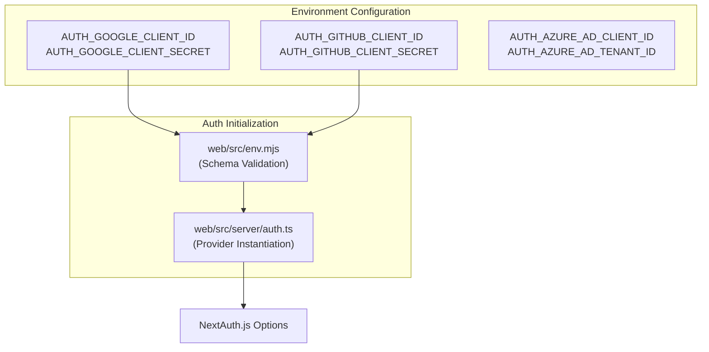

| Provider | Key Variables |
|----------|---------------|
| **Google** | `AUTH_GOOGLE_CLIENT_ID`, `AUTH_GOOGLE_CLIENT_SECRET` [web/src/env.mjs:113-114]() |
| **GitHub** | `AUTH_GITHUB_CLIENT_ID`, `AUTH_GITHUB_CLIENT_SECRET` [web/src/env.mjs:120-121]() |
| **Azure AD** | `AUTH_AZURE_AD_CLIENT_ID`, `AUTH_AZURE_AD_TENANT_ID` [web/src/env.mjs:141-143]() |
| **Okta** | `AUTH_OKTA_CLIENT_ID`, `AUTH_OKTA_ISSUER` [web/src/env.mjs:148-150]() |
| **Custom OIDC** | `AUTH_CUSTOM_CLIENT_ID`, `AUTH_CUSTOM_ISSUER`, `AUTH_CUSTOM_NAME` [web/src/env.mjs:199-202]() |

**Global Auth Variables:**
- `NEXTAUTH_SECRET`: Secret for signing session cookies [web/src/env.mjs:49]().
- `SALT`: Used for hashing API keys [web/src/env.mjs:70]().
- `ENCRYPTION_KEY`: 256-bit key for sensitive data [packages/shared/src/env.ts:51]().
- `AUTH_DISABLE_SIGNUP`: Disables new user registration [web/src/env.mjs:228]().

**Sources:** [web/src/env.mjs:94-230](), [web/src/server/auth.ts:89-523]()

---

## Service Tuning (Worker)

The worker service is tuned via concurrency and batching parameters to handle different workloads.

### Queue Concurrency

Workers are registered in the `WorkerManager` with specific concurrency limits [worker/src/app.ts:125-200]().

| Variable | Default | Description |
|----------|---------|-------------|
| `LANGFUSE_INGESTION_QUEUE_PROCESSING_CONCURRENCY` | `20` | Standard ingestion jobs [worker/src/env.ts:74]() |
| `LANGFUSE_TRACE_UPSERT_WORKER_CONCURRENCY` | `25` | Trace metadata updates [worker/src/env.ts:112]() |
| `LANGFUSE_EVAL_EXECUTION_WORKER_CONCURRENCY` | `5` | LLM-as-a-judge execution [worker/src/env.ts:120]() |
| `LANGFUSE_OTEL_INGESTION_QUEUE_PROCESSING_CONCURRENCY` | `5` | OTel span processing [worker/src/env.ts:70]() |

### ClickHouse Write Performance

The worker optimizes high-volume writes to ClickHouse through configurable batch sizes and intervals.

| Variable | Default | Description |
|----------|---------|-------------|
| `LANGFUSE_INGESTION_CLICKHOUSE_WRITE_BATCH_SIZE` | `1000` | Records per batch [worker/src/env.ts:83]() |
| `LANGFUSE_INGESTION_CLICKHOUSE_WRITE_INTERVAL_MS` | `1000` | Flush interval [worker/src/env.ts:87]() |
| `LANGFUSE_INGESTION_CLICKHOUSE_MAX_ATTEMPTS` | `3` | Retries for transient errors [worker/src/env.ts:91]() |

**Sources:** [worker/src/env.ts:70-134](), [worker/src/app.ts:125-200]()

---

## Feature Flags and Operational Controls

| Variable | Default | Description |
|----------|---------|-------------|
| `LANGFUSE_ENABLE_EXPERIMENTAL_FEATURES` | `false` | Enables unreleased UI/API features [web/src/env.mjs:69]() |
| `LANGFUSE_ENABLE_BACKGROUND_MIGRATIONS` | `true` | Allows ClickHouse schema updates in background [worker/src/env.ts:155]() |
| `LANGFUSE_ENABLE_REDIS_SEEN_EVENT_CACHE` | `false` | Deduplication of ingestion events [worker/src/env.ts:159]() |
| `LANGFUSE_SKIP_INGESTION_CLICKHOUSE_READ_PROJECT_IDS` | `""` | Performance optimization to skip reads during ingestion [worker/src/env.ts:143]() |
| `LANGFUSE_LOG_LEVEL` | `info` | Logging verbosity [packages/shared/src/env.ts:139]() |
| `LANGFUSE_ENABLE_BLOB_STORAGE_FILE_LOG` | `true` | Tracks S3 uploads in ClickHouse `blob_storage_file_log` table [worker/src/env.ts:163]() |

**Sources:** [web/src/env.mjs:69](), [worker/src/env.ts:143-165](), [packages/shared/src/env.ts:139-142]()
This page provides an overview of how users and API clients are authenticated and how access is controlled throughout the Langfuse platform. It covers the web UI authentication stack built on NextAuth.js, the enterprise multi-tenant SSO system, API key authentication, and the role-based access control (RBAC) model.

For detailed coverage of specific sub-systems, see:
- [Authentication System](#4.1) — Document NextAuth.js configuration, session callback that enriches JWT with user/org/project data, and provider setup.
- [Multi-tenant SSO](#4.2) — Explain domain-based SSO provider detection, SsoConfig table for per-organization OAuth credentials, and credential encryption.
- [API Key Management](#4.3) — Document API key creation, scopes (ORGANIZATION vs PROJECT), hashed secret storage, and verification flow.
- [RBAC & Permissions](#4.4) — Describe the role system (OrganizationMembership, ProjectMembership), role resolution, and scope-based access control.

---

## High-Level Architecture

There are two distinct authentication paths in Langfuse:

1.  **Browser sessions** — users signing into the web UI via NextAuth.js (credentials, OAuth, or SSO).
2.  **API clients** — SDK or HTTP clients authenticating with project-scoped or organization-scoped API keys.

**Authentication paths overview**

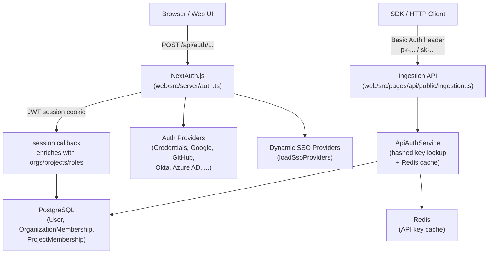

Sources: [web/src/server/auth.ts:1-100](), [web/src/ee/features/multi-tenant-sso/utils.ts:102-115](), [web/src/features/projects/server/projectsRouter.ts:173-176]()

---

## Session Authentication (NextAuth.js)

The web application uses [NextAuth.js](https://next-auth.js.org/) with a **JWT session strategy**. The main configuration is assembled in `web/src/server/auth.ts`.

### Session Strategy

Sessions are stored as signed JWTs (`strategy: "jwt"`) with a configurable lifetime via `AUTH_SESSION_MAX_AGE` [web/src/env.mjs:220-220](). The JWT is refreshed periodically, and the session is enriched with application-specific metadata.

### Session Enrichment

Every request that touches a NextAuth session executes the `session` callback, which re-fetches the user from PostgreSQL and attaches:

*   User identity fields (`id`, `name`, `email`, `image`, `admin`) [web/types/next-auth.d.ts:29-35]()
*   Feature flags (`featureFlags`) [web/src/server/auth.ts:152-152]()
*   `canCreateOrganizations` flag (controlled by `LANGFUSE_ALLOWED_ORGANIZATION_CREATORS` allowlist [web/src/server/auth.ts:69-87]())
*   All `organizations` the user belongs to, including nested `projects` with per-project roles [web/types/next-auth.d.ts:40-57]()
*   `environment` metadata (`selfHostedInstancePlan`, `enableExperimentalFeatures`) [web/types/next-auth.d.ts:21-26]()

**Session data shape**

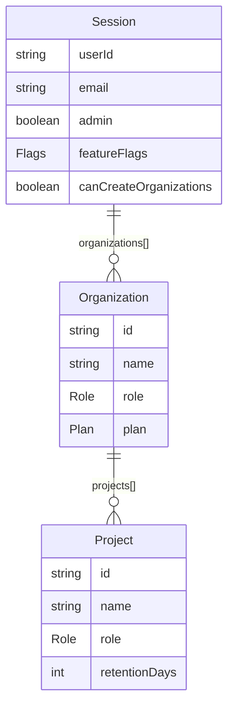

Sources: [web/src/server/auth.ts:69-87](), [web/types/next-auth.d.ts:18-59](), [web/src/env.mjs:78-105]()

---

## Authentication Providers

### Static Providers

Providers are registered in `web/src/server/auth.ts` and are activated at startup if their corresponding environment variables are set in `env.mjs`.

| Provider | Environment Variables Required | Notes |
| :--- | :--- | :--- |
| `CredentialsProvider` | _(always enabled unless `AUTH_DISABLE_USERNAME_PASSWORD=true`)_ | Email + password [web/src/server/auth.ts:89-159]() |
| `EmailProvider` | `SMTP_CONNECTION_URL`, `EMAIL_FROM_ADDRESS` | OTP-based password reset [web/src/server/auth.ts:162-175]() |
| `GoogleProvider` | `AUTH_GOOGLE_CLIENT_ID`, `AUTH_GOOGLE_CLIENT_SECRET` | [web/src/env.mjs:113-114]() |
| `GitHubProvider` | `AUTH_GITHUB_CLIENT_ID`, `AUTH_GITHUB_CLIENT_SECRET` | [web/src/env.mjs:120-121]() |
| `AzureADProvider` | `AUTH_AZURE_AD_CLIENT_ID`, `AUTH_AZURE_AD_TENANT_ID` | [web/src/env.mjs:141-143]() |
| `OktaProvider` | `AUTH_OKTA_CLIENT_ID`, `AUTH_OKTA_ISSUER` | [web/src/env.mjs:148-150]() |
| `AuthentikProvider` | `AUTH_AUTHENTIK_CLIENT_ID`, `AUTH_AUTHENTIK_ISSUER` | [web/src/env.mjs:155-157]() |
| `Auth0Provider` | `AUTH_AUTH0_CLIENT_ID`, `AUTH_AUTH0_ISSUER` | [web/src/env.mjs:176-178]() |
| `CustomSSOProvider` | `AUTH_CUSTOM_CLIENT_ID`, `AUTH_CUSTOM_ISSUER` | Generic OIDC [web/src/server/auth.ts:177-198]() |

Sources: [web/src/server/auth.ts:89-198](), [web/src/env.mjs:113-205](), [packages/shared/src/server/auth/customSsoProvider.ts:15-35]()

### Dynamic (Multi-tenant) SSO Providers

At request time, `loadSsoProviders()` reads `SsoConfig` rows from PostgreSQL and converts them to NextAuth `Provider` instances. This is an Enterprise Edition feature [web/src/ee/features/multi-tenant-sso/utils.ts:102-115]().

### Credentials Flow

The `CredentialsProvider.authorize` function [web/src/server/auth.ts:100-158]() performs:
1.  Checks `AUTH_DISABLE_USERNAME_PASSWORD` flag [web/src/server/auth.ts:102-105]().
2.  Checks if the email domain is in the SSO-blocked-domains list [web/src/server/auth.ts:107-113]().
3.  Calls `getSsoAuthProviderIdForDomain` for enterprise SSO enforcement [web/src/server/auth.ts:116-120]().
4.  Looks up the user in PostgreSQL and verifies the password hash via `verifyPassword` [web/src/server/auth.ts:140-144]().

Sources: [web/src/server/auth.ts:100-158](), [web/src/ee/features/multi-tenant-sso/utils.ts:132-142]()

---

## Multi-tenant SSO (Enterprise Edition)

Multi-tenant SSO allows organizations to configure domain-specific SSO providers stored in the database via the `SsoConfig` table [web/src/ee/features/multi-tenant-sso/utils.ts:51-61]().

**Multi-tenant SSO flow**

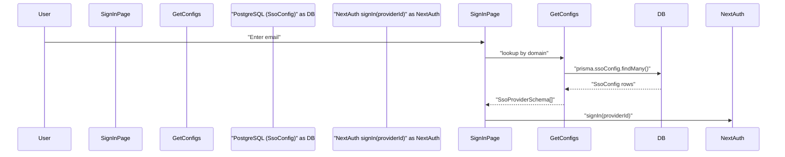

Sources: [web/src/ee/features/multi-tenant-sso/utils.ts:38-95](), [web/src/pages/auth/sign-in.tsx:97-182]()

### Key Functions

| Function | File | Description |
| :--- | :--- | :--- |
| `getSsoConfigs()` | [web/src/ee/features/multi-tenant-sso/utils.ts:38-95]() | Fetches and caches `SsoConfig` rows (TTL 1 hour). |
| `loadSsoProviders()` | [web/src/ee/features/multi-tenant-sso/utils.ts:102-115]() | Converts `SsoProviderSchema` objects to NextAuth `Provider` instances. |
| `getSsoAuthProviderIdForDomain()` | [web/src/ee/features/multi-tenant-sso/utils.ts:132-142]() | Returns the provider ID for a given domain to block password login. |

Sources: [web/src/ee/features/multi-tenant-sso/utils.ts](), [web/src/ee/features/multi-tenant-sso/types.ts:228-240]()

---

## API Key Management

SDK and HTTP clients authenticate using project-scoped or organization-scoped API key pairs.

### Authentication Flow

API authentication is handled by the `ApiAuthService`. It validates the `Authorization` header and returns the scope (e.g., `projectId`) associated with the key. Secret verification uses the `SALT` environment variable [web/src/env.mjs:70-75](). API keys are cached in Redis to minimize database lookups [web/src/features/projects/server/projectsRouter.ts:173-176]().

Sources: [web/src/features/projects/server/projectsRouter.ts:173-176](), [web/src/env.mjs:70-75]()

---

## RBAC & Permissions

### Role Hierarchy

The `Role` enum applies at both the organization and project level: `OWNER`, `ADMIN`, `MEMBER`, `VIEWER`, `NONE` [web/src/env.mjs:89-105]().

### Membership Model

-   **`OrganizationMembership`**: Assigns a user an org-level role.
-   **`ProjectMembership`**: Optionally overrides the org role for a specific project [web/types/next-auth.d.ts:55-55]().
-   **Default Access**: New users can be auto-assigned to default organizations and projects via `LANGFUSE_DEFAULT_ORG_ID` and `LANGFUSE_DEFAULT_PROJECT_ID` [web/src/env.mjs:78-105]().

### Enforcement

Langfuse uses a scope-based access control system. Access is checked using utility functions like `throwIfNoProjectAccess` or `throwIfNoOrganizationAccess` [web/src/features/projects/server/projectsRouter.ts:31-35]().

| Scope Example | Description | Roles with Access |
| :--- | :--- | :--- |
| `projects:create` | Create new projects in org | `OWNER`, `ADMIN` [web/src/features/projects/server/projectsRouter.ts:31-35]() |
| `project:update` | Modify project settings | `OWNER`, `ADMIN` [web/src/features/projects/server/projectsRouter.ts:82-86]() |
| `project:delete` | Delete a project | `OWNER`, `ADMIN` [web/src/features/projects/server/projectsRouter.ts:166-170]() |

Sources: [web/src/features/projects/server/projectsRouter.ts:22-224](), [web/types/next-auth.d.ts:40-57]()

---

## Key Environment Variables Summary

| Category | Variable | Description |
| :--- | :--- | :--- |
| NextAuth | `NEXTAUTH_SECRET` | JWT signing secret (required in production) [web/src/env.mjs:49-52]() |
| NextAuth | `NEXTAUTH_URL` | Canonical URL for callback URLs [web/src/env.mjs:54-63]() |
| API Keys | `SALT` | Required for hashing API secret keys [web/src/env.mjs:70-75]() |
| SSO (EE) | `ENCRYPTION_KEY` | Hex key for encrypting SSO client secrets [.env.prod.example:26]() |
| Defaults | `LANGFUSE_DEFAULT_ORG_ID` | Auto-enroll new users into this org [web/src/env.mjs:78-88]() |
| Defaults | `LANGFUSE_DEFAULT_PROJECT_ID` | Auto-enroll new users into this project [web/src/env.mjs:92-105]() |

Sources: [web/src/env.mjs:40-230](), [.env.prod.example:1-180]()

# Authentication System


This page documents the web application's authentication layer: how NextAuth.js is configured, which providers are supported, how the Prisma adapter is extended, and how the session is enriched with organization and project membership data. It also covers the sign-in and sign-up UI pages.

For API key authentication (used by the public REST API), see [API Key Management](#4.3). For multi-tenant SSO configuration management, see [Multi-tenant SSO](#4.2). For role-based access control enforcement, see [RBAC & Permissions](#4.4).

---

## Overview

Authentication is implemented with **NextAuth.js** and is configured entirely in `web/src/server/auth.ts`. The configuration is produced by the async function `getAuthOptions`, which merges a static list of providers with providers loaded dynamically from the database at request time.

Sessions use the **JWT strategy** and are validated against the database on every request to the session callback. The session object is augmented with the user's full organization and project membership tree, making RBAC data available everywhere in the application without additional queries.

**Authentication Flow Summary:**

Title: Authentication Sequence
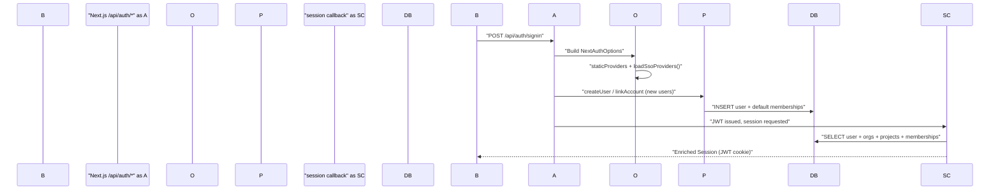

Sources: [web/src/server/auth.ts:654-660](), [web/src/server/auth.ts:500-633]()

---

## `getAuthOptions` and Provider Loading

`getAuthOptions` is an async factory that is called on each NextAuth route request. It:

1. Calls `loadSsoProviders()` to fetch enterprise SSO providers stored in the database [web/src/ee/features/multi-tenant-sso/utils.ts:102-115]().
2. Concatenates them with the module-level `staticProviders` array [web/src/server/auth.ts:646-648]().
3. Returns the full `NextAuthOptions` object.

**Provider Architecture:**

Title: Provider Resolution Architecture
```mermaid
flowchart TD
    getAuthOptions["getAuthOptions()"] --> staticProviders["staticProviders (module-level array)"]
    getAuthOptions --> loadSsoProviders["loadSsoProviders() — from DB via getSsoConfigs()"]

    staticProviders --> CP["CredentialsProvider (email/password)"]
    staticProviders --> EP["EmailProvider (SMTP password reset)"]
    staticProviders --> GP["GoogleProvider"]
    staticProviders --> GHP["GitHubProvider"]
    staticProviders --> GHEP["GitHubEnterpriseProvider"]
    staticProviders --> GLP["GitLabProvider"]
    staticProviders --> AP["AzureADProvider"]
    staticProviders --> OP["OktaProvider"]
    staticProviders --> A0P["Auth0Provider"]
    staticProviders --> COGP["CognitoProvider"]
    staticProviders --> KP["KeycloakProvider"]
    staticProviders --> AUP["AuthentikProvider"]
    staticProviders --> OLP["OneLoginProvider"]
    staticProviders --> JCP["JumpCloudProvider"]
    staticProviders --> WOP["WorkOSProvider"]
    staticProviders --> WPP["WordPressProvider"]
    staticProviders --> CSSO["CustomSSOProvider"]

    loadSsoProviders --> dbToNextAuthProvider["dbToNextAuthProvider() per SsoConfig row"]
    dbToNextAuthProvider --> dynProv["Dynamic provider — id format: getAuthProviderIdForSsoConfig(provider)"]
```

Sources: [web/src/server/auth.ts:88-648](), [web/src/ee/features/multi-tenant-sso/utils.ts:102-115]()

### Static Providers

All static providers are conditionally added to the `staticProviders` array based on whether the corresponding environment variables are set in `env.mjs`.

| Provider | Env Vars Required | Notes |
|---|---|---|
| `CredentialsProvider` | _(always present)_ | Disabled by `AUTH_DISABLE_USERNAME_PASSWORD=true` [web/src/server/auth.ts:102]() |
| `EmailProvider` | `SMTP_CONNECTION_URL`, `EMAIL_FROM_ADDRESS` | Used for password-reset OTP flow; 3-minute token TTL [web/src/server/auth.ts:163-175]() |
| `GoogleProvider` | `AUTH_GOOGLE_CLIENT_ID`, `AUTH_GOOGLE_CLIENT_SECRET` | Optional domain allowlist via `AUTH_GOOGLE_ALLOWED_DOMAINS` [web/src/env.mjs:113-115]() |
| `GitHubProvider` | `AUTH_GITHUB_CLIENT_ID`, `AUTH_GITHUB_CLIENT_SECRET` | [web/src/env.mjs:120-121]() |
| `GitHubEnterpriseProvider` | `AUTH_GITHUB_ENTERPRISE_CLIENT_ID`, `AUTH_GITHUB_ENTERPRISE_CLIENT_SECRET`, `AUTH_GITHUB_ENTERPRISE_BASE_URL` | [web/src/env.mjs:125-127]() |
| `GitLabProvider` | `AUTH_GITLAB_CLIENT_ID`, `AUTH_GITLAB_CLIENT_SECRET` | Self-hosted via `AUTH_GITLAB_URL` [web/src/env.mjs:133-140]() |
| `AzureADProvider` | `AUTH_AZURE_AD_CLIENT_ID`, `AUTH_AZURE_AD_CLIENT_SECRET`, `AUTH_AZURE_AD_TENANT_ID` | [web/src/env.mjs:141-143]() |
| `OktaProvider` | `AUTH_OKTA_CLIENT_ID`, `AUTH_OKTA_CLIENT_SECRET`, `AUTH_OKTA_ISSUER` | [web/src/env.mjs:148-150]() |
| `Auth0Provider` | `AUTH_AUTH0_CLIENT_ID`, `AUTH_AUTH0_CLIENT_SECRET`, `AUTH_AUTH0_ISSUER` | [web/src/env.mjs:176-178]() |
| `CognitoProvider` | `AUTH_COGNITO_CLIENT_ID`, `AUTH_COGNITO_CLIENT_SECRET`, `AUTH_COGNITO_ISSUER` | [web/src/env.mjs:186-188]() |
| `KeycloakProvider` | `AUTH_KEYCLOAK_CLIENT_ID`, `AUTH_KEYCLOAK_CLIENT_SECRET`, `AUTH_KEYCLOAK_ISSUER` | Custom display name via `AUTH_KEYCLOAK_NAME` [web/src/env.mjs:195-202]() |
| `AuthentikProvider` | `AUTH_AUTHENTIK_CLIENT_ID`, `AUTH_AUTHENTIK_CLIENT_SECRET`, `AUTH_AUTHENTIK_ISSUER` | [web/src/env.mjs:155-163]() |
| `OneLoginProvider` | `AUTH_ONELOGIN_CLIENT_ID`, `AUTH_ONELOGIN_CLIENT_SECRET`, `AUTH_ONELOGIN_ISSUER` | [web/src/env.mjs:169-171]() |
| `JumpCloudProvider` | `AUTH_JUMPCLOUD_CLIENT_ID`, `AUTH_JUMPCLOUD_CLIENT_SECRET`, `AUTH_JUMPCLOUD_ISSUER` | [web/src/env.mjs:223-225]() |
| `WorkOSProvider` | `AUTH_WORKOS_CLIENT_ID`, `AUTH_WORKOS_CLIENT_SECRET` | [web/src/env.mjs:212-213]() |
| `WordPressProvider` | `AUTH_WORDPRESS_CLIENT_ID`, `AUTH_WORDPRESS_CLIENT_SECRET` | [web/src/env.mjs:235-236]() |
| `CustomSSOProvider` | `AUTH_CUSTOM_CLIENT_ID`, `AUTH_CUSTOM_CLIENT_SECRET`, `AUTH_CUSTOM_ISSUER`, `AUTH_CUSTOM_NAME` | [web/src/env.mjs:241-244]() |

Sources: [web/src/server/auth.ts:88-498](), [web/src/env.mjs:113-244]()

### Dynamic SSO Providers

Enterprise multi-tenant SSO providers are stored in the `SsoConfig` Prisma table and loaded at runtime by `loadSsoProviders()` [web/src/ee/features/multi-tenant-sso/utils.ts:102-115](). These are converted to NextAuth `Provider` instances by `dbToNextAuthProvider()` [web/src/ee/features/multi-tenant-sso/utils.ts:195-201](). Their provider IDs are domain-specific to handle multiple organizations using the same provider type.

The SSO config list is cached in memory for 1 hour (or 1 minute on fetch failure) via the module-level `cachedSsoConfigs` variable [web/src/ee/features/multi-tenant-sso/utils.ts:25-95]().

---

## Extended Prisma Adapter

The standard `PrismaAdapter` is wrapped and extended into `extendedPrismaAdapter` at [web/src/server/auth.ts:500-633](). Three methods are overridden:

### `createUser`

Called when a new user signs up via an OAuth provider for the first time.

- Checks `AUTH_DISABLE_SIGNUP` — throws if `true` [web/src/server/auth.ts:510-514]().
- Requires a non-null email on the profile [web/src/server/auth.ts:516]().
- Delegates to the base `prismaAdapter.createUser` [web/src/server/auth.ts:519]().
- Calls `createProjectMembershipsOnSignup(user)` to assign default org/project memberships configured via `LANGFUSE_DEFAULT_ORG_ID` / `LANGFUSE_DEFAULT_PROJECT_ID` [web/src/server/auth.ts:522]().

### `linkAccount`

Called when an existing user links an OAuth account (e.g., first sign-in via SSO on an existing email-only account).

- Strips incompatible fields from Keycloak payloads (`refresh_expires_in`, `not-before-policy`) [web/src/server/auth.ts:543-547]().
- Strips `profile` from WorkOS payloads [web/src/server/auth.ts:548]().
- Strips any fields listed in `AUTH_IGNORE_ACCOUNT_FIELDS` [web/src/server/auth.ts:553-559]().
- Calls `createProjectMembershipsOnSignup` — this is idempotent and ensures SSO users also get default memberships [web/src/server/auth.ts:566]().

### `useVerificationToken`

Used by the `EmailProvider` for OTP-based password reset.

- On success: logs the event and returns the token [web/src/server/auth.ts:586-590]().
- On failure or missing token: deletes all tokens for the identifier (anti-enumeration measure) and returns `null` [web/src/server/auth.ts:592-598]().

Sources: [web/src/server/auth.ts:500-633]()

---

## NextAuth Callbacks

### `session` Callback

**Called on every session access**. This re-fetches the user from the database to expand the stateless JWT into a rich `Session` object.

**Database query fields:**
The query retrieves the user along with their full organization membership hierarchy, including associated projects and project memberships [web/src/server/auth.ts:661-683]().

**Session enrichment diagram:**

Title: Session Object Construction
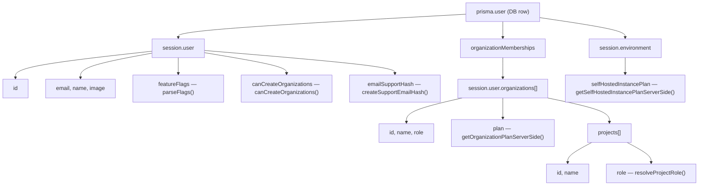

The project role for each project is computed by `resolveProjectRole()`, which considers both the project-level `ProjectMembership` and the organization-level role [web/src/server/auth.ts:756-764]().

Sources: [web/src/server/auth.ts:656-782](), [web/types/next-auth.d.ts:18-68]()

### `signIn` Callback

**Called on every sign-in attempt**, before the session is created.

Validation steps in order:
1. **Email presence** — throws if `user.email` is missing [web/src/server/auth.ts:786]().
2. **Multi-tenant SSO enforcement** — calls `getSsoAuthProviderIdForDomain(userDomain)`. If a domain-specific SSO provider is configured *and* the user is signing in with a different provider, the sign-in is blocked [web/src/server/auth.ts:805-812]().
3. **Google domain allowlist** — if `AUTH_GOOGLE_ALLOWED_DOMAINS` is set and the provider is `google`, the user's email domain must be in the allowlist [web/src/server/auth.ts:835-847]().

Sources: [web/src/server/auth.ts:783-850]()

---

## Sign-In & Sign-Up UI

### Sign-In Page
**File:** `web/src/pages/auth/sign-in.tsx`

The sign-in page dynamically renders provider buttons based on server-side configuration.

- **`getServerSideProps`**: Builds the `PageProps` object by inspecting environment variables and database configuration (via `isAnySsoConfigured()`) [web/src/pages/auth/sign-in.tsx:97-182]().
- **Two-Step Login Flow**: When `authProviders.sso` is `true`, the sign-in form implements a two-step flow where the email is entered first to detect domain-specific SSO [web/src/pages/auth/sign-in.tsx:187-203]().

### Sign-Up Page
**File:** `web/src/pages/auth/sign-up.tsx`

- Uses the same `getServerSideProps` as the sign-in page [web/src/pages/auth/sign-up.tsx:36]().
- **SSO Detection**: The `handleContinue` function checks for Enterprise SSO via the `/api/auth/check-sso` endpoint. If found, it redirects immediately to the provider [web/src/pages/auth/sign-up.tsx:81-131]().
- **Credential Registration**: If no SSO is found, it reveals the name and password fields to complete registration via the `/api/auth/signup` endpoint [web/src/pages/auth/sign-up.tsx:157-187]().

---

## Password Reset System

Langfuse provides a secure password reset flow for users using the credentials provider.

1. **Request Reset**: Users can request a reset via `RequestResetPasswordEmailButton`. This uses the NextAuth `EmailProvider` to send a 6-digit one-time passcode (OTP) [web/src/features/auth-credentials/components/ResetPasswordButton.tsx:31-57]().
2. **Verification**: The OTP is verified against the database. If valid, the user is redirected to the reset page [web/src/features/auth-credentials/components/ResetPasswordButton.tsx:59-77]().
3. **Password Update**: The `ResetPasswordPage` allows users to set a new password, validated against `passwordSchema` [web/src/features/auth-credentials/components/ResetPasswordPage.tsx:30-39]().

Sources: [web/src/features/auth-credentials/components/ResetPasswordButton.tsx:1-126](), [web/src/features/auth-credentials/components/ResetPasswordPage.tsx:1-107]()

---

## Key Environment Variables

| Variable | Purpose | Default |
|---|---|---|
| `NEXTAUTH_SECRET` | JWT signing secret | Required in production [web/src/env.mjs:49-52]() |
| `NEXTAUTH_URL` | Base URL for NextAuth callbacks | Required [web/src/env.mjs:54-63]() |
| `SALT` | Salt used for hashing API keys | Required [web/src/env.mjs:70-75]() |
| `AUTH_DISABLE_USERNAME_PASSWORD` | Disable credentials provider | `false` [web/src/env.mjs:275]() |
| `AUTH_DISABLE_SIGNUP` | Prevent new user registration | `false` [web/src/env.mjs:276]() |
| `LANGFUSE_DEFAULT_ORG_ID` | Org(s) to auto-add new users to | — [web/src/env.mjs:78-88]() |
| `LANGFUSE_DEFAULT_PROJECT_ID` | Project(s) to auto-add new users to | — [web/src/env.mjs:92-102]() |

Sources: [web/src/env.mjs:49-276](), [.env.prod.example:21-143]()
This page documents the background services that start alongside the worker process at application startup. These are long-running, in-process loops and one-time initializations that run independently of the BullMQ queue system. They operate continuously on timers or as one-shot initialization routines.

For **scheduled and repeating BullMQ jobs** (such as the `CloudUsageMeteringJob`), see [Scheduled Jobs](). For the queue workers themselves, see [Queue Architecture]() and [Worker Manager](). For background database migrations specifically, see [Database Migrations]().

---

## Startup Sequence

All background services are started from `worker/src/app.ts` immediately after the Express app is configured and before queue workers are registered. Each service starts unconditionally or behind a feature flag.

**Figure: Worker Startup — Background Service Initialization**

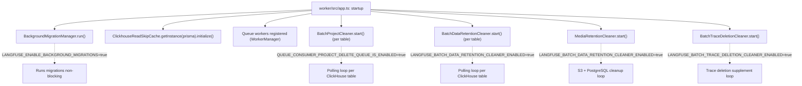

Sources: `[worker/src/app.ts:109-122]`, `[worker/src/app.ts:584-636]`

---

## Background Migration System

### Purpose

The background migration system allows for large-scale data moves or schema updates (particularly between PostgreSQL and ClickHouse) without blocking application startup or queue processing. It is managed by `BackgroundMigrationManager` and controlled by the `LANGFUSE_ENABLE_BACKGROUND_MIGRATIONS` environment variable.

### Implementation

Migrations implement the `IBackgroundMigration` interface, which defines methods for validation, execution, and abortion.

**Figure: Background Migration Entity Mapping**

```mermaid
flowchart LR
    subgraph "Code Entity Space"
        Interface["IBackgroundMigration"]
        Manager["BackgroundMigrationManager"]
        ObsMig["MigrateObservationsFromPostgresToClickhouse"]
        ScoreMig["MigrateScoresFromPostgresToClickhouse"]
        TraceMig["MigrateTracesFromPostgresToClickhouse"]
        CostMig["AddGenerationsCostBackfill"]
    end

    subgraph "Data Space"
        PG_Table[("PostgreSQL: background_migrations")]
        CH_Table[("ClickHouse Tables")]
    end

    Interface <|-- ObsMig
    Interface <|-- ScoreMig
    Interface <|-- TraceMig
    Interface <|-- CostMig

    Manager --> ObsMig
    ObsMig --> PG_Table : "updates 'state' JSON"
    ObsMig --> CH_Table : "INSERT INTO observations"
    ScoreMig --> PG_Table : "persists 'maxDate'"
    ScoreMig --> CH_Table : "INSERT INTO scores"
```

Sources: `[worker/src/backgroundMigrations/IBackgroundMigration.ts:1-8]`, `[worker/src/backgroundMigrations/migrateObservationsFromPostgresToClickhouse.ts:14-16]`, `[worker/src/backgroundMigrations/migrateScoresFromPostgresToClickhouse.ts:14-16]`, `[worker/src/backgroundMigrations/migrateTracesFromPostgresToClickhouse.ts:14-16]`, `[worker/src/backgroundMigrations/addGenerationsCostBackfill.ts:50-51]`

### Key Migration Patterns

1.  **State Persistence**: Migrations store their progress in the `background_migrations` table's `state` column. For example, `MigrateObservationsFromPostgresToClickhouse` uses `updateMaxDate` to store the timestamp of the last processed record, allowing resume-on-restart `[worker/src/backgroundMigrations/migrateObservationsFromPostgresToClickhouse.ts:18-38]`.
2.  **Batching**: Records are fetched in batches (defaulting to 1000) using `Prisma.sql` raw queries to optimize performance and memory usage `[worker/src/backgroundMigrations/migrateScoresFromPostgresToClickhouse.ts:100-108]`.
3.  **Validation**: Before running, migrations verify prerequisites. `MigrateScoresFromPostgresToClickhouse` checks for ClickHouse credentials and the existence of the destination table `[worker/src/backgroundMigrations/migrateScoresFromPostgresToClickhouse.ts:18-59]`.
4.  **Cost Backfilling**: `AddGenerationsCostBackfill` performs complex calculations in PostgreSQL to update `calculated_input_cost` and `calculated_output_cost` based on model prices and token counts `[worker/src/backgroundMigrations/addGenerationsCostBackfill.ts:121-151]`.

---

## ClickhouseReadSkipCache

### Purpose

`ClickhouseReadSkipCache` is an optimization for the ingestion pipeline. During event ingestion, the system normally reads from ClickHouse to merge updates. For newer projects where data is exclusively handled via the S3-staging path, these reads are unnecessary. This cache tracks which project IDs can safely skip the read operation.

### Configuration

The cache is initialized at startup and considers:
-   **Static IDs**: Provided via `LANGFUSE_SKIP_INGESTION_CLICKHOUSE_READ_PROJECT_IDS`.
-   **Creation Date**: Projects created after the date in `LANGFUSE_SKIP_INGESTION_CLICKHOUSE_READ_MIN_PROJECT_CREATE_DATE`.

Sources: `[worker/src/app.ts:116-122]`

---

## Batch Cleaner Services

Langfuse employs several "cleaner" services that inherit from `PeriodicExclusiveRunner`. These services use a `RedisLock` to ensure that only one worker instance processes a specific cleanup task at a time.

### MediaRetentionCleaner

Handles the deletion of media files (S3/PostgreSQL) and blob storage entries based on per-project `retention_days`.

-   **Workflow**:
    1.  Queries PostgreSQL to find the project with the most expired media via `getTopProjectWorkload` `[worker/src/features/media-retention-cleaner/index.ts:116-155]`.
    2.  Calculates a `cutoffDate` using `getRetentionCutoffDate` `[worker/src/features/media-retention-cleaner/index.ts:152]`.
    3.  Deletes files from S3 and removes PostgreSQL metadata via `deleteMediaFiles` `[worker/src/features/media-retention-cleaner/index.ts:177-209]`.
    4.  Cleans up blob storage if `LANGFUSE_ENABLE_BLOB_STORAGE_FILE_LOG` is enabled by calling `removeIngestionEventsFromS3AndDeleteClickhouseRefsForProject` `[worker/src/features/media-retention-cleaner/index.ts:164-169]`.

### BatchDataRetentionCleaner

Bulk deletes expired data from ClickHouse tables (`traces`, `observations`, `scores`, `events_full`, `events_core`).

-   **Implementation**:
    -   It uses hashed project IDs (`toParamKey`) in ClickHouse queries to prevent index mismatch bugs and handle `OR` conditions efficiently `[worker/src/features/batch-data-retention-cleaner/index.ts:53-96]`.
    -   It targets specific timestamp columns per table (e.g., `start_time` for `observations`, `timestamp` for `traces`) defined in `TIMESTAMP_COLUMN_MAP` `[worker/src/features/batch-data-retention-cleaner/index.ts:34-40]`.

### BatchProjectCleaner

Handles data deletion for projects that have been soft-deleted (where `deleted_at` is set in PostgreSQL).

-   **Workflow**:
    1.  Fetches deleted projects from PostgreSQL via `getDeletedProjects` `[worker/src/features/batch-project-cleaner/index.ts:93-95]`.
    2.  Checks ClickHouse for existing counts to determine if work is needed `[worker/src/features/batch-project-cleaner/index.ts:107-109]`.
    3.  Executes a `DELETE` command in ClickHouse under a distributed lock `[worker/src/features/batch-project-cleaner/index.ts:133-148]`.

---

## Redis Distributed Locking

The `RedisLock` class provides the coordination mechanism for background services.

**Figure: RedisLock Acquisition Flow**

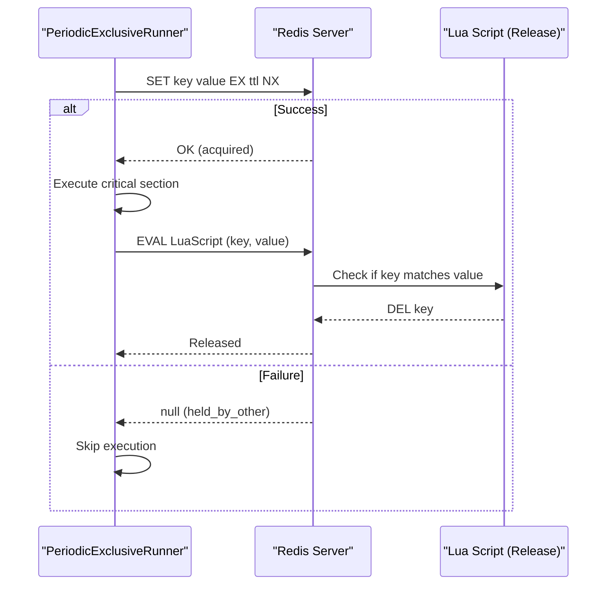

Sources: `[worker/src/utils/RedisLock.ts:54-60]`, `[worker/src/utils/RedisLock.ts:117-152]`

### Locking Behaviors

-   **Unique Ownership**: Each lock attempt uses a `randomUUID` as the value to ensure a worker only releases a lock it actually owns `[worker/src/utils/RedisLock.ts:77]`.
-   **Atomic Release**: Uses a Lua script to check the value before deleting, preventing race conditions where a worker might delete a lock that has already expired and been re-acquired by another instance `[worker/src/utils/RedisLock.ts:54-60]`.
-   **Unavailable Behavior**: Configurable via `OnUnavailableBehavior` to either `proceed` (optimistic) or `fail` (pessimistic) if Redis is down `[worker/src/utils/RedisLock.ts:7-11]`.

Sources: `[worker/src/features/media-retention-cleaner/index.ts:42-50]`, `[worker/src/features/batch-project-cleaner/index.ts:54-61]`

---

## Summary Table

| Service | Class | Purpose | Data Store |
| :--- | :--- | :--- | :--- |
| **Migration** | `BackgroundMigrationManager` | Resumable data moves | PG & ClickHouse |
| **Read Cache** | `ClickhouseReadSkipCache` | Ingestion performance | In-memory |
| **Media Cleanup** | `MediaRetentionCleaner` | Retention enforcement | S3 & PG |
| **Batch Retention** | `BatchDataRetentionCleaner` | Bulk row expiry | ClickHouse |
| **Project Cleanup** | `BatchProjectCleaner` | Soft-delete cleanup | ClickHouse |

Sources: `[worker/src/app.ts:109-636]`, `[worker/src/features/batch-data-retention-cleaner/index.ts:18-24]`, `[worker/src/features/batch-project-cleaner/index.ts:10-17]`

# Scheduled Jobs


This page documents the recurring and scheduled jobs that run in the Langfuse worker process. These are time-driven jobs as opposed to event-driven queue processors. For documentation of one-off queue processors triggered by user actions (eval creation, batch export, trace delete, etc.), see page [7.3](). For background services that start at worker boot and run continuously, see page [7.5]().

---

## Scheduled Job Inventory

All scheduled jobs are implemented as BullMQ repeating jobs. The schedule is registered when the queue singleton is initialized, typically at worker startup.

| Queue Class | Queue Name Constant | Cron Pattern | Frequency | Schedule Registered In |
|---|---|---|---|---|
| `EventPropagationQueue` | `QueueName.EventPropagationQueue` | `* * * * *` | Every minute | [packages/shared/src/server/redis/eventPropagationQueue.ts:13-68]() |
| `PostHogIntegrationQueue` | `QueueName.PostHogIntegrationQueue` | `30 * * * *` | Hourly at :30 | [packages/shared/src/server/redis/postHogIntegrationQueue.ts:15-85]() |
| `MixpanelIntegrationQueue` | `QueueName.MixpanelIntegrationQueue` | `30 * * * *` | Hourly at :30 | [packages/shared/src/server/redis/mixpanelIntegrationQueue.ts:15-85]() |
| `BlobStorageIntegrationQueue` | `QueueName.BlobStorageIntegrationQueue` | hourly | Hourly | [packages/shared/src/server/redis/blobStorageIntegrationQueue.ts:1-30]() |
| `CloudUsageMeteringQueue` | `QueueName.CloudUsageMeteringQueue` | hourly | Hourly | [packages/shared/src/server/redis/cloudUsageMeteringQueue.ts:1-30]() |

**Concurrency notes:** `EventPropagationQueue` sets a global concurrency of 1 to enforce sequential partition processing. The analytics integration queues use separate per-project processing queues (`PostHogIntegrationProcessingQueue`, `MixpanelIntegrationProcessingQueue`) for fan-out.

Sources: [packages/shared/src/server/redis/eventPropagationQueue.ts:13-68](), [packages/shared/src/server/redis/postHogIntegrationQueue.ts:15-85](), [packages/shared/src/server/redis/mixpanelIntegrationQueue.ts:15-85](), [packages/shared/src/server/redis/blobStorageIntegrationQueue.ts:1-30]()

---

## Cloud Usage Metering Cron

**Purpose:** Calculates organization-level usage metrics (traces, observations, scores) and reports them to Stripe for billing. This job is exclusive to the Langfuse Cloud (EE) environment.

**Implementation:** The `handleCloudUsageMeteringJob` function manages a custom cron state within the `CronJobs` table in PostgreSQL to ensure exactly-once processing per hour [worker/src/ee/cloudUsageMetering/handleCloudUsageMeteringJob.ts:27-42]().

### Execution Flow

1. **State Management:** Checks the `CronJobs` table for `cloud-usage-metering`. It ensures the `lastRun` was on a full hour and that no other job is currently `Processing` [worker/src/ee/cloudUsageMetering/handleCloudUsageMeteringJob.ts:34-72]().
2. **Data Collection:** Queries ClickHouse for usage counts within the last full hour interval:
    - `getObservationCountsByProjectInCreationInterval` [worker/src/ee/cloudUsageMetering/handleCloudUsageMeteringJob.ts:138-141]()
    - `getTraceCountsByProjectInCreationInterval` [worker/src/ee/cloudUsageMetering/handleCloudUsageMeteringJob.ts:142-145]()
    - `getScoreCountsByProjectInCreationInterval` [worker/src/ee/cloudUsageMetering/handleCloudUsageMeteringJob.ts:146-149]()
3. **Stripe Reporting:** For each organization with a `stripe.customerId`, it sends `meterEvents` to Stripe [worker/src/ee/cloudUsageMetering/handleCloudUsageMeteringJob.ts:162-211]().
    - **Legacy Meter:** `tracing_observations` (counts observations) [worker/src/ee/cloudUsageMetering/handleCloudUsageMeteringJob.ts:199-206]().
    - **Unified Meter:** `events` (sum of traces + observations + scores) [worker/src/ee/cloudUsageMetering/handleCloudUsageMeteringJob.ts:220-238]().
4. **Completion:** Updates the `CronJobs` record with the new `lastRun` timestamp and sets state back to `Queued` [worker/src/ee/cloudUsageMetering/handleCloudUsageMeteringJob.ts:275-285]().

**Cloud Usage Metering — Code Entities**

```mermaid
graph TD
    subgraph "PostgreSQL Space"
        DB_CRON["prisma.cronJobs"]
        DB_ORG["prisma.organization\n(cloudConfig.stripe.customerId)"]
    end

    subgraph "Code Space"
        METER_JOB["handleCloudUsageMeteringJob\n(worker/src/ee/cloudUsageMetering/handleCloudUsageMeteringJob.ts)"]
        STRIPE_CLIENT["Stripe SDK\n(stripe.billing.meterEvents.create)"]
    end

    subgraph "ClickHouse Space"
        CH_OBS["getObservationCountsByProjectInCreationInterval"]
        CH_TRC["getTraceCountsByProjectInCreationInterval"]
        CH_SCR["getScoreCountsByProjectInCreationInterval"]
    end

    METER_JOB -->|"1. upsert/update"| DB_CRON
    METER_JOB -->|"2. findMany"| DB_ORG
    METER_JOB -->|"3. Aggregate Usage"| CH_OBS
    METER_JOB -->|"3. Aggregate Usage"| CH_TRC
    METER_JOB -->|"3. Aggregate Usage"| CH_SCR
    METER_JOB -->|"4. meterEvents.create"| STRIPE_CLIENT
    METER_JOB -->|"5. Update lastRun"| DB_CRON
```

Sources: [worker/src/ee/cloudUsageMetering/handleCloudUsageMeteringJob.ts:27-285](), [worker/src/queues/cloudUsageMeteringQueue.ts:14-70]()

---

## Blob Storage Integration Job

**Purpose:** Periodic export of project data (traces, observations, scores, events) to customer-managed blob storage (S3, Azure, or GCS).

**Implementation:** The `handleBlobStorageIntegrationProjectJob` handles the actual data transfer for a specific project and table [worker/src/features/blobstorage/handleBlobStorageIntegrationProjectJob.ts:188-204]().

1. **Timestamp Resolution:** Determines the `minTimestamp` based on `lastSyncAt` or `exportMode` (FULL_HISTORY, FROM_TODAY, FROM_CUSTOM_DATE) [worker/src/features/blobstorage/handleBlobStorageIntegrationProjectJob.ts:68-143](). It also implements a `BLOB_STORAGE_LAG_BUFFER_MS` (20 minutes) to account for eventual consistency in ClickHouse [worker/src/features/blobstorage/handleBlobStorageIntegrationProjectJob.ts:34-34]().
2. **Data Fetching:** Streams data from ClickHouse using specialized functions like `getTracesForBlobStorageExport`, `getObservationsForBlobStorageExport`, or `getEventsForBlobStorageExport` [worker/src/features/blobstorage/handleBlobStorageIntegrationProjectJob.ts:11-15]().
3. **Model Enrichment:** For observations, the stream is enriched with model pricing data using `createModelCache` and `enrichObservationWithModelData` [worker/src/features/blobstorage/handleBlobStorageIntegrationProjectJob.ts:36-66]().
4. **Compression:** Optionally pipes the stream through `zlib.createGzip()` if the integration is configured as `compressed` [worker/src/features/blobstorage/handleBlobStorageIntegrationProjectJob.ts:2-2]().
5. **Upload:** Uses `StorageService.uploadFileBuffered` to stream data directly to the destination [worker/src/features/blobstorage/handleBlobStorageIntegrationProjectJob.ts:209-211]().

**Blob Storage Export — Code Entities**

```mermaid
graph LR
    subgraph "Worker Logic"
        B_JOB["handleBlobStorageIntegrationProjectJob\n(worker/src/features/blobstorage/handleBlobStorageIntegrationProjectJob.ts)"]
        ENRICH["enrichObservationStream"]
    end

    subgraph "Data Access"
        CH_TRACES["getTracesForBlobStorageExport"]
        CH_OBS["getObservationsForBlobStorageExport"]
        CH_EVENTS["getEventsForBlobStorageExport"]
    end

    subgraph "Storage Layer"
        STORE_FACTORY["StorageServiceFactory\n(packages/shared/src/server/services/StorageService.ts)"]
        S3_SVC["S3StorageService"]
        AZ_SVC["AzureBlobStorageService"]
    end
    
    B_JOB --> ENRICH
    B_JOB --> CH_TRACES
    B_JOB --> CH_OBS
    B_JOB --> CH_EVENTS
    B_JOB --> STORE_FACTORY
    STORE_FACTORY --> S3_SVC
    STORE_FACTORY --> AZ_SVC
```

Sources: [worker/src/features/blobstorage/handleBlobStorageIntegrationProjectJob.ts:34-260](), [worker/src/__tests__/blobStorageIntegrationProcessing.test.ts:22-29]()

---

## Analytics Integration Schedulers

Both the PostHog and Mixpanel integrations use a two-tier pattern:

1. **Scheduler queue** (cron-driven, runs hourly at :30) — queries Postgres for all enabled integrations, then fans out one job per project to the **processing queue**.
2. **Processing queue** (event-driven) — each job handles one project: fetches data from ClickHouse, streams it to the external service, updates `lastSyncAt`.

**Two-tier Analytics Scheduler Architecture**

```mermaid
graph TD
    PHQ["PostHogIntegrationQueue\n(postHogIntegrationQueue.ts)\ncron: '30 * * * *'"]
    MXQ["MixpanelIntegrationQueue\n(mixpanelIntegrationQueue.ts)\ncron: '30 * * * *'"]

    PHSCHED["handlePostHogIntegrationSchedule"]
    MXSCHED["handleMixpanelIntegrationSchedule"]

    PHPROCQ["PostHogIntegrationProcessingQueue"]
    MXPROCQ["MixpanelIntegrationProcessingQueue"]

    PHPROCJOB["handlePostHogIntegrationProjectJob\n(worker/src/features/posthog/handlePostHogIntegrationProjectJob.ts)"]
    MXPROCJOB["handleMixpanelIntegrationProjectJob"]

    PHQ -->|"triggers"| PHSCHED
    MXQ -->|"triggers"| MXSCHED

    PHSCHED -->|"enqueues per-project jobs"| PHPROCQ
    MXSCHED -->|"enqueues per-project jobs"| MXPROCQ

    PHPROCQ -->|"processed by"| PHPROCJOB
    MXPROCQ -->|"processed by"| MXPROCJOB
```

Sources: [packages/shared/src/server/redis/postHogIntegrationQueue.ts:15-85](), [packages/shared/src/server/redis/mixpanelIntegrationQueue.ts:15-85](), [worker/src/features/posthog/handlePostHogIntegrationProjectJob.ts:230-240]()

---

## Batch Export Job

**Purpose:** Handles user-initiated exports of large datasets from the UI to CSV or JSON formats. While often triggered by a user, these are background tasks processed by the worker.

**Implementation:**
- The `batchExportQueueProcessor` receives a `batchExportId` [worker/src/queues/batchExportQueue.ts:14-16]().
- It calls `handleBatchExportJob` to perform the heavy lifting [worker/src/queues/batchExportQueue.ts:19-19]().
- On failure, it updates the `batchExport` record in PostgreSQL with a `FAILED` status and the error log [worker/src/queues/batchExportQueue.ts:34-44]().

Sources: [worker/src/queues/batchExportQueue.ts:1-53]()

---

## Queue Registration Pattern

All scheduled queues follow the same singleton registration pattern. The cron job is added inside `getInstance()` so it is registered once per process lifetime:

```typescript
// Typical registration pattern in Queue classes
public static getInstance(): TQueue | null {
  if (!this.instance) {
    this.instance = new BullMQ.Queue(QueueName.X, { connection });
    this.instance.add(
      QueueJobs.ScheduledJob,
      {},
      { repeat: { pattern: "0 * * * *" } } // Hourly example
    );
  }
  return this.instance;
}
```

Sources: [packages/shared/src/server/redis/eventPropagationQueue.ts:13-67](), [packages/shared/src/server/redis/postHogIntegrationQueue.ts:15-85](), [packages/shared/src/server/redis/blobStorageIntegrationQueue.ts:1-30]()

# Web Application


The web application is Langfuse's primary user interface, implemented as a Next.js application. It provides the UI for observability dashboards, trace exploration, prompt management, evaluation configuration, and system administration. The application communicates with the backend through a type-safe tRPC API and renders data from both PostgreSQL (metadata) and ClickHouse (observability data).

**Relationship to the larger system:**

```mermaid
graph TB
    Browser["Web Browser<br/>(User)"]
    NextJS["Next.js Web Service<br/>(web package)<br/>Port 3000"]
    TRPC["TRPC API<br/>appRouter"]
    Postgres["PostgreSQL<br/>Prisma Client"]
    ClickHouse["ClickHouse<br/>Repositories"]
    Redis["Redis<br/>BullMQ & Cache"]
    Worker["Worker Service<br/>Background processing"]
    
    Browser -->|"HTTPS requests"| NextJS
    NextJS -->|"Session-based auth"| TRPC
    TRPC -->|"Prisma queries"| Postgres
    TRPC -->|"Kysely/ClickHouse queries"| ClickHouse
    TRPC -->|"Cache & Queues"| Redis
    Redis -->|"Job consumption"| Worker
```
Sources: [web/src/pages/api/trpc/[trpc].ts:1-54](), [web/src/utils/api.ts:178-216]()

This page provides a high-level overview of the web architecture. For details on specific subsystems, see the following child pages:

- [Application Structure](#8.1) — Next.js App Router usage, middleware, and page organization.
- [Table Components System](#8.2) — Reusable `DataTable` and specialized table definitions.
- [UI State Management](#8.3) — Custom hooks for pagination, ordering, and URL persistence.
- [Trace & Session Views](#8.4) — Trace tree visualization, timelines, and the V4 Beta viewer.
- [Virtualization & Performance](#8.5) — `@tanstack/react-virtual` strategies for large datasets.
- [Filter & View System](#8.6) — `PopoverFilterBuilder` and saved `TableViewPresets`.
- [Batch Actions & Selection](#8.7) — `useSelectAll` hook and bulk data operations.

---

## Technology Stack

The web application resides in the `web/` workspace. It utilizes the Next.js Pages Router for the majority of its interface, while integrating modern React features and Tailwind CSS for styling.

| Category | Library / Version |
|---|---|
| Framework | Next.js 15 (Pages Router) |
| UI runtime | React 19 |
| Styling | Tailwind CSS |
| Data Fetching | tRPC 11 + `@tanstack/react-query` 5 |
| State Persistence | `use-query-params` with `NextAdapterPages` |
| Tables | `@tanstack/react-table` 8 + `@tanstack/react-virtual` 3 |
| Authentication | NextAuth.js 4 |
| Error Tracking | Sentry (`@sentry/nextjs`) |
| Analytics | PostHog JS |

Sources: [web/src/pages/_app.tsx:1-30](), [web/src/utils/api.ts:178-230](), [web/next.config.mjs:49-56]()

---

## Core Architecture & Initialization

### Client-Side Entrypoint
The application is wrapped in several providers in `_app.tsx` to handle theming, tooltips, command menus, and session management. A notable polyfill is implemented in `_app.tsx` to prevent React crashes caused by Google Translate modifying the DOM by wrapping text nodes in `<font>` elements. This polyfill catches `NotFoundError` exceptions in `removeChild` and `insertBefore`.

```mermaid
graph TD
    App["MyApp (_app.tsx)"]
    TRPC["api.withTRPC"]
    QPP["QueryParamProvider"]
    SP["SessionProvider (NextAuth)"]
    TP["ThemeProvider"]
    AL["AppLayout"]
    UT["UserTracking"]
    
    TRPC --> App
    App --> QPP
    QPP --> SP
    SP --> TP
    TP --> AL
    AL --> Component["Page Component"]
    AL --> UT
```
Sources: [web/src/pages/_app.tsx:39-70](), [web/src/pages/_app.tsx:108-171]()

### Instrumentation & Observability
Server-side initialization scripts (OpenTelemetry and system initialization) are handled in `instrumentation.ts`. Client-side error tracking is managed via Sentry in `instrumentation-client.ts`. It filters out benign errors like malformed URLs passed to the router or React DevTools internal access errors. It also manages Sentry Replays, masking sensitive data based on the cloud region (`NEXT_PUBLIC_LANGFUSE_CLOUD_REGION`).

Sources: [web/src/instrumentation.ts:1-15](), [web/instrumentation-client.ts:8-90]()

---

## Navigation & Layout System

### Route Definitions
Routes are statically defined in `ROUTES`, which includes metadata for RBAC scopes, feature flags, and enterprise entitlements. The navigation structure is divided into `Main` and `Secondary` sections and grouped into logical categories like `Observability` and `Evaluation`.

| Route Property | Description |
|---|---|
| `pathname` | The Next.js path (e.g., `/project/[projectId]/traces`) |
| `projectRbacScopes` | Array of required project permissions (OR logic) |
| `featureFlag` | Gate for experimental features (e.g., `experimentsV4Enabled`) |
| `productModule` | Enterprise module categorization for UI customization |

Sources: [web/src/components/layouts/routes.tsx:47-65](), [web/src/components/layouts/routes.tsx:67-238]()

### Resizable Layouts
The application extensively uses resizable panels to manage sidebars (filters, support chat, or trace details) without remounting the main content.

*   **`ResizableDesktopLayout`**: A base component that preserves child state by maintaining a consistent DOM tree even when panels are collapsed. It uses `sessionStorage` for persistence if a `persistId` is provided.
*   **`ResizableFilterLayout`**: Specialized for data tables, placing the `DataTableControls` in a collapsible left sidebar.
*   **`ResizableContent`**: Used for the support drawer on the right side, falling back to a mobile-friendly drawer on small screens.

Sources: [web/src/components/layouts/ResizableDesktopLayout.tsx:36-148](), [web/src/components/layouts/app-layout/components/ResizableContent.tsx:49-69](), [web/src/components/table/resizable-filter-layout.tsx:12-58]()

### Command Menu (Cmd+K)
The `CommandMenu` provides a global search and navigation interface. It indexes:
*   Main navigation items and projects.
*   Project and Organization settings pages via `useProjectSettingsPages` and `useOrganizationSettingsPages`.
*   User dashboards fetched via tRPC using `api.dashboard.allDashboards.useQuery`.

Sources: [web/src/features/command-k-menu/CommandMenu.tsx:24-56](), [web/src/features/command-k-menu/CommandMenu.tsx:151-230](), [web/src/features/command-k-menu/CommandMenu.tsx:93-149]()

---

## API & Error Handling

### tRPC Integration
The application uses a `splitLink` in its tRPC configuration. It currently defaults to skipping batching for all requests (`alwaysSkipBatch = true`) to optimize performance for specific query patterns, routing requests through `httpLink` to `/api/trpc`.

Sources: [web/src/utils/api.ts:194-216]()

### Global Error Management
Errors are handled via `handleTrpcError`, which:
1. Reports system errors to Sentry via `captureException`.
2. Displays user-facing toasts via `trpcErrorToast`.
3. Debounces repeated errors using `recentErrorCache` (with a 20s TTL) to prevent toast spam.
4. Detects version mismatches by comparing `x-build-id` headers from the server with the client's `NEXT_PUBLIC_BUILD_ID` to prompt users to refresh when the client cache is stale.

Sources: [web/src/utils/api.ts:105-133](), [web/src/utils/api.ts:136-160](), [web/src/pages/api/trpc/[trpc].ts:20-44]()

### Notification System
The application includes a sidebar notification system (`SidebarNotifications`) for community engagement (e.g., GitHub stars). These are persisted in `localStorage` when dismissed and can have an optional time-to-live (TTL).

Sources: [web/src/components/nav/sidebar-notifications.tsx:48-140]()

# Application Structure


## Purpose and Scope

This document describes the Next.js web application structure, including the organization of pages, components, API routes, and server-side code. It explains how the web service is architected as a Next.js application using the Pages Router pattern, how code is organized into directories, and how the application is built and deployed.

For information about the overall system architecture including the worker service and data layer, see [System Architecture](#1.1). For tRPC API implementation details, see [tRPC Internal API](#5.2). For component-specific implementations like tables and forms, see [Table Components System](#8.2).

---

## Next.js Architecture

Langfuse uses Next.js with the **Pages Router** pattern. The application entry point is `web/src/pages/_app.tsx`, which wraps the component tree with global providers for authentication, state management, and UI context [web/src/pages/_app.tsx:108-171]().

### Application Bootstrap (`_app.tsx`)

The `MyApp` component initializes the client-side environment, including polyfills for modern JavaScript features like `array/to-reversed` [web/src/pages/_app.tsx:23-29]() and a DOM manipulation patch to prevent React crashes caused by Google Translate wrapping text nodes in `<font>` elements [web/src/pages/_app.tsx:39-70]().

#### Global Provider Stack

```mermaid
graph TD
    subgraph "Global Providers Stack (web/src/pages/_app.tsx)"
        QueryParam["QueryParamProvider (URL State)"]
        Tooltip["TooltipProvider (Radix UI)"]
        CommandMenu["CommandMenuProvider (Cmd+K)"]
        PostHog["PostHogProvider (Analytics)"]
        Session["SessionProvider (NextAuth)"]
        DetailPages["DetailPageListsProvider (Navigation)"]
        Markdown["MarkdownContextProvider"]
        Theme["ThemeProvider (Dark/Light)"]
        ScoreCache["ScoreCacheProvider"]
        CorrectionCache["CorrectionCacheProvider"]
        Support["SupportDrawerProvider"]
    end

    AppLayout["AppLayout (web/src/components/layouts/app-layout)"]
    Component["Page Component (pages/*)"]
    UserTracking["UserTracking (PostHog/Sentry)"]

    QueryParam --> Tooltip
    Tooltip --> CommandMenu
    CommandMenu --> PostHog
    PostHog --> Session
    Session --> DetailPages
    DetailPages --> Markdown
    Markdown --> Theme
    Theme --> ScoreCache
    ScoreCache --> CorrectionCache
    CorrectionCache --> Support
    Support --> AppLayout
    AppLayout --> Component
    AppLayout --> UserTracking
```

**Sources:** [web/src/pages/_app.tsx:130-168](), [web/src/pages/_app.tsx:108-111]()

### Instrumentation and Monitoring

The application uses a dual-instrumentation strategy for observability:
1.  **Sentry**: Initialized in `web/instrumentation-client.ts` to capture exceptions, browser profiling, and session replays [web/instrumentation-client.ts:8-90](). It includes filters to ignore benign errors like browser extension failures or invalid Next.js router hrefs [web/instrumentation-client.ts:13-33]().
2.  **PostHog**: Initialized in `_app.tsx` for product analytics [web/src/pages/_app.tsx:83-106](). It tracks page views via `router.events` [web/src/pages/_app.tsx:114-127]() and identifies users upon successful authentication in the `UserTracking` component [web/src/pages/_app.tsx:173-200]().
3.  **Server-side Init**: The `web/src/instrumentation.ts` file handles Node.js runtime initialization using the `register` function, which imports `observability.config` and `initialize` scripts if `isInitLoadingEnabled` is true [web/src/instrumentation.ts:2-15]().

**Sources:** [web/instrumentation-client.ts:1-94](), [web/src/pages/_app.tsx:83-106](), [web/src/pages/_app.tsx:173-200](), [web/src/instrumentation.ts:1-15]()

---

## Page and Layout Organization

### Layout Management (`AppLayout`)

The `AppLayout` component serves as the primary structural controller. It utilizes navigation filters to determine route visibility based on project context, organization context, feature flags, and RBAC permissions [web/src/components/layouts/app-layout/utils/navigationFilters.ts:19-174]().

#### Navigation Filters logic

| Filter Function | Description |
| :--- | :--- |
| `projectScope` | Hides routes requiring `[projectId]` if none is available [web/src/components/layouts/app-layout/utils/navigationFilters.ts:23-28](). |
| `organizationScope` | Hides routes requiring `[organizationId]` if none is available [web/src/components/layouts/app-layout/utils/navigationFilters.ts:33-44](). |
| `featureFlags` | Gates routes based on experimental features or specific user flags (e.g., `experimentsV4Enabled`) [web/src/components/layouts/app-layout/utils/navigationFilters.ts:72-93](). |
| `projectRbac` | Validates user has required project-level scopes using `hasProjectAccess` [web/src/components/layouts/app-layout/utils/navigationFilters.ts:119-135](). |
| `organizationRbac` | Validates organization-level access using `hasOrganizationAccess` [web/src/components/layouts/app-layout/utils/navigationFilters.ts:141-157](). |

**Sources:** [web/src/components/layouts/app-layout/utils/navigationFilters.ts:1-230]()

### Feature Rollouts (V4 Beta)

The application includes a rollout system for "V4 Beta" features. Users can opt-in to experimental features if they meet criteria defined in `canToggleV4` [web/src/server/api/routers/userAccount.ts:172-183](). Access is managed via the `useExperimentAccess` hook, which combines cloud region checks, V4 beta status, and local storage persistence [web/src/features/experiments/hooks/useExperimentAccess.ts:13-52]().

The `userAccountRouter` provides the `setV4BetaEnabled` procedure to update the user's opt-in status in the database [web/src/server/api/routers/userAccount.ts:131-203]().

**Sources:** [web/src/server/api/routers/userAccount.ts:131-203](), [web/src/features/experiments/hooks/useExperimentAccess.ts:13-52](), [web/src/features/events/lib/v4Rollout.ts:1-20]()

---

## API and Middleware Structure

### API Routes Structure

API routes are located in `web/src/pages/api/`. The internal tRPC handler is the primary communication channel for the web UI.

#### tRPC Handler (`/api/trpc/[trpc]`)
This route maps incoming requests to the `appRouter` [web/src/pages/api/trpc/[trpc].ts:17-19]().
*   **Body Limit**: Configured at 4.5mb via `bodyParser.sizeLimit` [web/src/pages/api/trpc/[trpc].ts:11]().
*   **Error Handling**: Differentiates between user errors (logged as info) and system errors (reported to Sentry via `traceException`) [web/src/pages/api/trpc/[trpc].ts:20-44]().
*   **Build ID**: The handler attaches `x-build-id` from `env.NEXT_PUBLIC_BUILD_ID` to response headers to ensure client-server version alignment [web/src/pages/api/trpc/[trpc].ts:45-51]().

**Sources:** [web/src/pages/api/trpc/[trpc].ts:1-54]()

### tRPC Client Configuration (`web/src/utils/api.ts`)

The `api` object is built on `createTRPCNext` using the `AppRouter` type [web/src/utils/api.ts:178-179]().
*   **Links**: Uses `splitLink` to decide between `httpLink` and `httpBatchLink`. It currently defaults to `alwaysSkipBatch = true` for performance experimentation [web/src/utils/api.ts:194-215]().
*   **Error Debouncing**: Implements `shouldShowToast` to prevent flooding the UI with multiple toasts for the same recurring error within a 20-second window (`ERROR_DEBOUNCE_MS`) [web/src/utils/api.ts:86-103]().
*   **Version Management**: The `buildIdLink` tracks `x-build-id` from server responses [web/src/utils/api.ts:136-160](). If the client's `NEXT_PUBLIC_BUILD_ID` differs from the server's ID during a 404/400 error, it triggers `showVersionUpdateToast` [web/src/utils/api.ts:113-122]().

**Sources:** [web/src/utils/api.ts:1-230]()

---

## Code Entity Mapping

The following diagrams bridge the natural language concepts to specific code entities within the web application.

### Navigation and Access Control Flow

```mermaid
graph TD
    subgraph "Navigation Logic (web/src/components/layouts/app-layout/utils/)"
        Filters["applyNavigationFilters"]
        ProjScope["filters.projectScope"]
        OrgScope["filters.organizationScope"]
        RbacCheck["filters.projectRbac"]
    end

    subgraph "RBAC Utilities (web/src/features/rbac/utils/)"
        HasProjAccess["hasProjectAccess"]
        HasOrgAccess["hasOrganizationAccess"]
    end

    Filters --> ProjScope
    Filters --> OrgScope
    Filters --> RbacCheck
    RbacCheck --> HasProjAccess
    OrgScope --> HasOrgAccess
```

**Sources:** [web/src/components/layouts/app-layout/utils/navigationFilters.ts:19-157](), [web/src/components/layouts/app-layout/utils/navigationFilters.ts:230-233]()

### API Communication Mapping

```mermaid
graph TD
    subgraph "Frontend Client (web/src/utils/api.ts)"
        TRPCNext["api (createTRPCNext)"]
        SplitLink["splitLink (Batch vs Single)"]
        HandleError["handleTrpcError"]
        BuildIdLink["buildIdLink (Version Tracking)"]
    end

    subgraph "Backend API (web/src/pages/api/trpc/)"
        NextHandler["[trpc].ts (createNextApiHandler)"]
        Ctx["createTRPCContext"]
    end

    subgraph "Routers (web/src/server/api/routers/)"
        UserRouter["userAccountRouter"]
    end

    TRPCNext -- "Request" --> BuildIdLink
    BuildIdLink -- "Request" --> SplitLink
    SplitLink -- "HTTP POST" --> NextHandler
    NextHandler -- "Uses" --> Ctx
    NextHandler -- "Routes to" --> UserRouter
    NextHandler -- "Error" --> HandleError
```

**Sources:** [web/src/utils/api.ts:136-216](), [web/src/pages/api/trpc/[trpc].ts:17-19](), [web/src/server/api/routers/userAccount.ts:74-204]()
This page documents the batch action system used in Langfuse's data tables: row selection state management, the "select all" pattern, and bulk operations such as deletion, annotation, and adding items to datasets.

---

## Selection Model

Tables that support batch actions maintain two independent selection states to handle both local (page-level) and global (filter-level) selection.

| State | Type | Source | Scope |
|---|---|---|---|
| `selectedRows` | `RowSelectionState` | `useState` in table component | Explicitly checked rows on the current page. |
| `selectAll` | `boolean` | `useSelectAll` hook | All rows matching the current filter across all pages. |

`TableSelectionManager` is a generic component used in tables (Traces, Observations, Sessions, Experiments) to produce a selection checkbox column [web/src/features/table/components/TableSelectionManager.tsx:16-21](). It provides the `selectActionColumn` definition, which includes logic for toggling page-level rows and clearing global selection [web/src/features/table/components/TableSelectionManager.tsx:23-69]().

### Selection UI Components

- **`DataTableSelectAllBanner`**: Appears when all items on the current page are selected. It offers the user the option to "Select all X items across Y pages", which sets the `selectAll` state to `true` [web/src/components/table/data-table-multi-select-actions/data-table-select-all-banner.tsx:5-52]().
- **`TableActionMenu`**: A floating bar that appears when `selectedCount > 0`. It displays the count of selected items and renders available `TableAction` buttons [web/src/features/table/components/TableActionMenu.tsx:64-116]().

### Selection Data Flow

Title: Selection State Logic
```mermaid
flowchart LR
  HC["Header checkbox click\n(TableSelectionManager)"] --> SA["setSelectAll(true)\n(useSelectAll)"]
  RC["Individual row checkbox"] --> SR["selectedRows state update\n(TanStack Table)"]
  SA --> AM["TableActionMenu shows totalCount"]
  SR --> AM2["TableActionMenu shows selectedRows.length"]
```

Sources: [web/src/features/table/components/TableSelectionManager.tsx:30-51](), [web/src/components/table/data-table-multi-select-actions/data-table-select-all-banner.tsx:15-50](), [web/src/features/table/components/TableActionMenu.tsx:67-72]()

---

## Batch Action Pipeline

The system bridges UI selection to background processing via tRPC mutations and BullMQ workers. UI components like `TableActionMenu` and `TableActionDialog` manage the transition from user intent to execution.

Title: Batch Action Pipeline (Natural Language to Code Entities)
```mermaid
flowchart TD
  subgraph "Browser (React Space)"
    TAM["TableActionMenu\n(TableActionMenu.tsx)"]
    TAD["TableActionDialog\n(TableActionDialog.tsx)"]
    USA["useSelectAll\nhook"]
    TSM["TableSelectionManager\n(TableSelectionManager.tsx)"]
    TAM --> TAD
    USA --> TAD
    TSM --> TAM
  end

  subgraph "API Layer (tRPC Space)"
    TAI["table.getIsBatchActionInProgress\n(TableActionDialog.tsx:59)"]
    BA["api.table.executeBatchAction\n(tableRouter.ts)"]
  end

  TAD --> BA
  TAD -.-> TAI

  subgraph "Processing (Worker Space)"
    HBA["handleBatchActionJob\n(handleBatchActionJob.ts)"]
    DRS["getDatabaseReadStreamPaginated\n(getDatabaseReadStream.ts)"]
    PAC["processActionChunk\n(handleBatchActionJob.ts:57)"]
    TDP["traceDeletionProcessor\n(shared/server)"]
  end

  BA --> HBA
  HBA --> DRS
  HBA --> PAC
  PAC --> TDP
```

Sources: [web/src/features/table/components/TableActionMenu.tsx:35-42](), [web/src/features/table/components/TableActionDialog.tsx:44-51](), [worker/src/features/batchAction/handleBatchActionJob.ts:141-144](), [worker/src/features/batchAction/handleBatchActionJob.ts:65-67]()

### `TableAction` Type

Each table component assembles a `TableAction[]` array. `TableActionMenu` reads this to render the action buttons [web/src/features/table/components/TableActionMenu.tsx:83-113]().

| Field | Type | Purpose |
|---|---|---|
| `id` | `ActionId` | String identifying the operation (e.g., `trace-delete`, `score-delete`) [worker/src/features/batchAction/handleBatchActionJob.ts:64-95](). |
| `type` | `BatchActionType` | Determines UI styling (`create` or `delete`) [worker/src/features/batchAction/handleBatchActionJob.ts:172-174](). |
| `execute` | `async function` | Mutation trigger; receives `{ projectId, targetId? }`. |
| `accessCheck` | `object` | Defines required RBAC `scope` (e.g., `batchExports:create`) [web/src/components/BatchExportTableButton.tsx:53-56](). |

---

## Batch Exports

Batch exports utilize a streaming architecture to handle large datasets from ClickHouse or PostgreSQL.

### Export Pipeline
1. **Trigger**: `BatchExportTableButton` initiates a `create` mutation [web/src/components/BatchExportTableButton.tsx:60-71]().
2. **Job Handling**: `handleBatchExportJob` validates the job and transitions status to `PROCESSING` [worker/src/features/batchExport/handleBatchExportJob.ts:115-123]().
3. **Streaming**: Depending on the table, it calls `getTraceStream`, `getObservationStream`, or `getEventsStream` [worker/src/features/batchExport/handleBatchExportJob.ts:174-202]().
4. **Formatting**: Data is piped through format-specific transformers (CSV, JSONL) and uploaded to S3/Blob Storage [worker/src/features/batchExport/handleBatchExportJob.ts:220-223]().

### ClickHouse Streaming
`getObservationStream` and `getTraceStream` construct complex ClickHouse queries that join metadata with aggregated scores using CTEs [worker/src/features/database-read-stream/observation-stream.ts:130-177](). They use `queryClickhouseStream` to fetch data without loading the entire result set into memory [worker/src/features/database-read-stream/trace-stream.ts:183-225]().

Sources: [worker/src/features/batchExport/handleBatchExportJob.ts:34-40](), [worker/src/features/database-read-stream/observation-stream.ts:34-50](), [worker/src/features/database-read-stream/trace-stream.ts:29-44]()

---

## Add to Dataset Mapping

Adding items to datasets involves a mapping system that extracts specific fields from traces or observations using JSONPath.

### Field Mapping Configuration
The mapping logic is defined in `applyFieldMapping.ts` and supports three modes:
- **`full`**: Maps the entire source field (input, output, or metadata) [packages/shared/src/features/batchAction/applyFieldMapping.ts:138-139]().
- **`none`**: Sets the dataset item field to null [packages/shared/src/features/batchAction/applyFieldMapping.ts:141-143]().
- **`custom`**: Uses `root` extraction or `keyValueMap` [packages/shared/src/features/batchAction/applyFieldMapping.ts:145-208]().

### JSONPath Evaluation
The system uses `jsonpath-plus` to evaluate selectors against observation data [packages/shared/src/features/batchAction/applyFieldMapping.ts:1-62]().
- `evaluateJsonPath`: Extracts values from a JSON object [packages/shared/src/features/batchAction/applyFieldMapping.ts:62-72]().
- `testJsonPath`: Validates the syntax of a JSONPath string [packages/shared/src/features/batchAction/applyFieldMapping.ts:42-57]().

Title: Field Mapping Data Flow
```mermaid
flowchart TD
  OBS["Observation Data\n(Input/Output/Metadata)"] --> MAP["applyFullMapping\n(applyFieldMapping.ts)"]
  CFG["AddToDatasetMapping\n(Config)"] --> MAP
  MAP --> EJP["evaluateJsonPath\n(jsonpath-plus)"]
  EJP --> RES["Dataset Item Fields\n(input, expectedOutput, metadata)"]
  MAP --> ERR["MappingError[]\n(json_path_miss, json_path_error)"]
```

Sources: [packages/shared/src/features/batchAction/applyFieldMapping.ts:101-105](), [packages/shared/src/features/batchAction/applyFieldMapping.ts:221-232]()

---

## Worker-Side Execution

When a batch action is triggered for a large set of data (via `selectAll`), the worker processes it in chunks.

1.  **Job Processing**: `handleBatchActionJob` receives the job payload containing the query and action type [worker/src/features/batchAction/handleBatchActionJob.ts:141-148]().
2.  **Streaming**: It initializes a `dbReadStream` using `getDatabaseReadStreamPaginated` or specialized streams for traces/observations [worker/src/features/batchAction/handleBatchActionJob.ts:176-202]().
3.  **Chunking**: The stream is read into batches of `CHUNK_SIZE` (default 1000) [worker/src/features/batchAction/handleBatchActionJob.ts:42, 214-216]().
4.  **Execution**: `processActionChunk` dispatches the batch to the specific processor (e.g., `traceDeletionProcessor` or `processClickhouseScoreDelete`) [worker/src/features/batchAction/handleBatchActionJob.ts:57-100]().
5.  **Idempotency**: All operations are designed to be idempotent to allow for safe retries in case of worker failure [worker/src/features/batchAction/handleBatchActionJob.ts:53-56]().

Sources: [worker/src/features/batchAction/handleBatchActionJob.ts:214-222](), [worker/src/features/database-read-stream/getDatabaseReadStream.ts:99-114](), [worker/src/features/batchAction/handleBatchActionJob.ts:64-91]()

# Core Domain Features


This page describes the core domain entities in Langfuse's observability platform. These entities form the foundation for tracing LLM applications, evaluating their outputs, and analyzing performance. For detailed information on each entity type, refer to the sub-pages [Traces & Observations](#9.1) through [Automation System](#9.8).

For information about how these entities are ingested and stored, see [Data Ingestion Pipeline](#6). For details on the database architecture, see [Data Architecture](#3).

## Domain Model Overview

The following diagram illustrates the relationships between the primary domain entities. It bridges the natural language concepts to the specific code entities used in the repository layer and database schemas.

```mermaid
graph TB
    subgraph "Project Scope (PostgreSQL & ClickHouse)"
        Trace["Trace Record<br/>(TraceRecordReadType)"]
        Session["TraceSession<br/>(Prisma: TraceSession)"]
        Observation["Observation Record<br/>(ObservationRecordReadType)"]
        Score["Score Record<br/>(ScoreRecordReadType)"]
        Dataset["Dataset<br/>(Prisma: Dataset)"]
        Prompt["Prompt<br/>(Prisma: Prompt)"]
        Model["Model<br/>(Prisma: Model)"]
        User["User<br/>(Prisma: User)"]
    end
    
    subgraph "Hierarchical Structure"
        Session -->|"groups"| Trace
        Trace -->|"contains"| Observation
        Observation -->|"parent_observation_id"| Observation
    end
    
    subgraph "Evaluation & Metrics"
        Score -->|"trace_id"| Trace
        Score -->|"observation_id"| Observation
        ScoreConfig["ScoreConfig<br/>(dataType, categories)"]
        ScoreConfig -.->|"defines schema"| Score
    end
    
    subgraph "Experimentation"
        Dataset -->|"contains"| DatasetItem["DatasetItem"]
        DatasetRun["DatasetRun"] -->|"executes"| Dataset
        DatasetRunItem["DatasetRunItem"] -->|"links"| DatasetItem
        DatasetRunItem -->|"references"| Trace
    end
    
    subgraph "Configuration & Pricing"
        Observation -->|"uses"| Prompt
        Observation -->|"matched to"| Model
        User -->|"attributes"| Trace
    end
```

**Sources:**
- [packages/shared/src/server/repositories/definitions.ts:18-20]()
- [packages/shared/src/server/repositories/traces.ts:198-204]()
- [packages/shared/src/server/repositories/observations.ts:11-105]()
- [packages/shared/src/server/repositories/scores.ts:151-166]()

## Entity Storage and Access Patterns

Langfuse utilizes a dual-database architecture. Metadata and configurations are stored in PostgreSQL via Prisma, while high-volume telemetry data (traces, observations, scores) is stored in ClickHouse for analytical performance. The UI layer fetches this data through specialized tRPC routers and repository services.

```mermaid
graph LR
    subgraph "PostgreSQL (Prisma)"
        PG_Session["TraceSession<br/>(metadata)"]
        PG_Prompt["Prompt<br/>(content, version)"]
        PG_ScoreConfig["ScoreConfig"]
    end
    
    subgraph "ClickHouse (Telemetry)"
        CH_Traces["traces table"]
        CH_Observations["observations table"]
        CH_Scores["scores table"]
    end
    
    subgraph "Repository Services (packages/shared/src/server)"
        TracesService["traces.ts<br/>getTracesTable"]
        SessionsService["sessions-ui-table-service.ts<br/>getSessionsTable"]
        ScoresRepo["repositories/scores.ts<br/>getScoresForTraces"]
    end
    
    TracesService --> CH_Traces
    SessionsService --> CH_Traces
    SessionsService -.->|"JOIN"| PG_Session
    ScoresRepo --> CH_Scores
```

**Sources:**
- [packages/shared/src/server/repositories/traces.ts:1-50]()
- [web/src/server/api/routers/sessions.ts:172-198]()
- [packages/shared/src/server/repositories/scores.ts:168-182]()
- [packages/shared/src/server/services/sessions-ui-table-service.ts:65-86]()

## Traces

**Primary Entity:** `TraceRecordReadType` represents the raw ClickHouse trace record [packages/shared/src/server/repositories/definitions.ts:18]().

Traces represent the top-level execution unit. Each trace captures a complete workflow, such as a single user request or an autonomous agent run. Traces track latency, total cost, and token usage across all nested observations via the `getTracesTableMetrics` function [web/src/server/api/routers/traces.ts:225-237](). In the analytics engine, traces are queried via the `traceView` declaration [web/src/features/query/dataModel.ts:13-155]().

### Key Attributes
- `id`: Unique trace identifier [packages/shared/src/server/repositories/traces.ts:159]().
- `timestamp`: Start time of the trace [packages/shared/src/server/repositories/traces.ts:161]().
- `metadata`: Flexible JSON storage for custom attributes [packages/shared/src/server/repositories/traces.ts:26]().
- `tags`: Array of strings for categorization [web/src/features/query/dataModel.ts:31-36]().

**Detailed coverage:** See [Traces & Observations](#9.1)

## Observations

**Primary Entity:** `ObservationRecordReadType` represents the telemetry record in ClickHouse [packages/shared/src/server/repositories/observations.ts:11]().

Observations represent individual steps within a trace. They include generic spans and specific `GENERATION` types that track LLM usage. The `getObservationsForTrace` function retrieves the hierarchy for a specific trace [packages/shared/src/server/repositories/observations.ts:136-150]().

### Observation Types
- `SPAN`: Generic operation with duration.
- `GENERATION`: LLM completion calls, tracking `usage_details` and `cost_details` [packages/shared/src/server/repositories/observations.ts:168-172]().
- `EVENT`: Point-in-time event.
- `TOOL`: External tool or function execution.

**Detailed coverage:** See [Traces & Observations](#9.1)

## Scores

**Primary Entity:** `ScoreDomain` represents the score entity in the domain layer [packages/shared/src/domain/scores.ts:3]().

Scores represent evaluations of traces or observations. They are categorized by `dataType` (NUMERIC, CATEGORICAL, BOOLEAN) and `source` (API, ANNOTATION, EVAL) [packages/shared/src/server/repositories/scores.ts:1-10](). Scores are often aggregated by name to provide high-level metrics [web/src/server/api/routers/traces.ts:33-36](). Special scores like `CORRECTION_NAME` are used for output correction [web/src/server/api/routers/scores.ts:34-35]().

**Detailed coverage:** See [Scores & Scoring](#9.2)

## Sessions

**Dual Storage:** Metadata in PostgreSQL (`TraceSession` model) and aggregated trace data in ClickHouse.

Sessions group related traces (e.g., a multi-turn chat). The `getSessionsTable` function fetches metrics like `trace_count` and `min_timestamp` by aggregating trace data associated with a `session_id` [packages/shared/src/server/services/sessions-ui-table-service.ts:65-86](). In V4, session metrics can be derived from the events table via `getSessionMetricsFromEvents` [web/src/server/api/routers/sessions.ts:33-34]().

**Detailed coverage:** See [Sessions](#9.3)

## Users

**Primary Entity:** `User` (PostgreSQL) and `userId` (ClickHouse).

Langfuse tracks end-users of LLM applications. Users are identified by a `userId` string in traces [web/src/features/query/dataModel.ts:37-42](). The system aggregates metrics per user, including token usage and total cost, via functions like `getTracesGroupedByUsers` [web/src/server/api/routers/traces.ts:49]().

**Detailed coverage:** See [Sessions](#9.3) (User tracking is covered within the Sessions and User management context).

## Prompts & Templates

Langfuse provides a Prompt Management system where prompts are versioned and can be organized into folders.
- `Prompt`: PostgreSQL model storing the prompt string, type (`text` or `chat`), and version.
- `PromptLabel`: Used for version management (e.g., "production", "staging").
- `Folder`: Virtual organization of prompts based on name prefixes.

**Detailed coverage:** See [Prompts & Templates](#9.5)

## Models & Pricing

Models are defined in PostgreSQL to enable cost calculation. The system matches `provided_model_name` from observations to internal model definitions to calculate `usage_details` and `cost_details` [packages/shared/src/server/repositories/observations.ts:165-172](). Pricing calculations utilize `sumMap(cost_details)` in ClickHouse for efficient aggregation [packages/shared/src/server/repositories/traces.ts:117]().

**Detailed coverage:** See [Models & Pricing](#9.6)

## Dashboard & Analytics

The dashboard provides a high-level view of project performance. It uses the `QueryBuilder` [web/src/features/query/server/queryBuilder.ts:55]() to translate UI selections into ClickHouse SQL based on the `ViewDeclarationType` [web/src/features/query/types.ts:9](). It aggregates data across traces, observations, and scores to calculate metrics like `totalCost` and `latency` [web/src/features/query/dataModel.ts:112-136]().

**Detailed coverage:** See [Dashboard & Analytics](#9.7)

## Automation System

Automations allow for event-driven workflows, such as triggering webhooks or Slack notifications when specific criteria are met in traces or scores. These are managed via the `Automation` and `JobConfiguration` models.

**Detailed coverage:** See [Automation System](#9.8)

# Traces & Observations


## Purpose and Scope

This document describes the core observability data model in Langfuse, focusing on **Traces** and **Observations**. These are the primary entities that capture execution flows and function calls within applications being monitored.

- **Traces** represent complete execution contexts (e.g., a single API request, a batch job, or an agent session).
- **Observations** represent individual operations within a trace (e.g., LLM calls, function executions, tool invocations).

For information about how traces are ingested and processed, see [Data Ingestion Pipeline](#6). For scoring and evaluation of traces and observations, see [Scores & Scoring](#9.2). For grouping traces into conversations, see [Sessions](#9.3).

## Data Model

### Trace Structure

A trace is the top-level container for an execution flow. Traces are stored primarily in ClickHouse and have the following key attributes:

| Field | Type | Description |
|-------|------|-------------|
| `id` | String | Unique identifier |
| `project_id` | String | Project ownership |
| `timestamp` | DateTime | Trace start time |
| `name` | String (optional) | User-defined trace name |
| `user_id` | String (optional) | End-user identifier |
| `session_id` | String (optional) | Groups related traces |
| `input` | JSON (optional) | Trace input data |
| `output` | JSON (optional) | Trace output data |
| `metadata` | JSON (optional) | Custom metadata |
| `tags` | Array[String] | Classification tags |
| `release` | String (optional) | Application version |
| `version` | String (optional) | Trace version |
| `public` | Boolean | Public visibility flag |
| `bookmarked` | Boolean | User bookmark flag |
| `environment` | String | Environment identifier |

**Sources**: [packages/shared/src/server/repositories/traces.ts:198-206](), [packages/shared/src/server/services/traces-ui-table-service.ts:33-47](), [packages/shared/src/server/repositories/definitions.ts:127-143]()

### Observation Structure and Types

Observations are hierarchical spans within traces. Each observation has a type that defines its semantic meaning:

**Trace and Observation Hierarchy**
```mermaid
graph TD
    Trace["Trace (Root)"]
    Trace --> Chain["Observation: CHAIN<br/>name: 'main-workflow'"]
    Chain --> LLM1["Observation: GENERATION<br/>name: 'gpt-4-summary'"]
    Chain --> Retriever["Observation: RETRIEVER<br/>name: 'vector-search'"]
    Chain --> LLM2["Observation: GENERATION<br/>name: 'gpt-4-response'"]
    Retriever --> Tool["Observation: TOOL<br/>name: 'database-lookup'"]
```

**Observation Types** ([packages/shared/src/domain/observations.ts:1-15]()):

| Type | Purpose | Typical Use Case |
|------|---------|------------------|
| `GENERATION` | LLM completions | OpenAI, Anthropic API calls |
| `SPAN` | Generic operations | Function execution, processing steps |
| `EVENT` | Point-in-time events | Logging, state changes |
| `TOOL` | Tool invocations | Function calling, API calls |
| `RETRIEVER` | Document retrieval | Vector search, database queries |

**Key Observation Fields**:

| Field | Type | Description |
|-------|------|-------------|
| `id` | String | Unique identifier |
| `trace_id` | String | Parent trace reference |
| `parent_observation_id` | String (optional) | Parent observation for nesting |
| `type` | ObservationType | Semantic type |
| `name` | String (optional) | Operation name |
| `start_time` | DateTime | Start timestamp |
| `end_time` | DateTime (optional) | Completion timestamp |
| `input` | JSON (optional) | Operation input |
| `output` | JSON (optional) | Operation output |
| `metadata` | JSON (optional) | Custom metadata |
| `level` | Enum | Log level: DEBUG, DEFAULT, WARNING, ERROR |
| `status_message` | String (optional) | Status or error message |
| `usage_details` | Map[String, Number] | Token/credit usage by type |
| `cost_details` | Map[String, Number] | Cost breakdown |
| `total_cost` | Decimal (optional) | Total calculated cost |

**Sources**: [packages/shared/src/server/repositories/observations.ts:151-182](), [packages/shared/src/server/repositories/definitions.ts:34-61](), [packages/shared/src/server/repositories/observations_converters.ts:150-220]()

### Relationships

**Core Entity Relationships**
```mermaid
erDiagram
    "Project" ||--o{ "TraceSession" : "contains"
    "Project" ||--o{ "Trace" : "contains"
    "TraceSession" ||--o{ "Trace" : "groups"
    "Trace" ||--o{ "Observation" : "contains"
    "Observation" ||--o{ "Observation" : "parent-child"
    "Trace" ||--o{ "Score" : "evaluated_by"
    "Observation" ||--o{ "Score" : "evaluated_by"
    
    "Trace" {
        string id PK
        string project_id FK
        string session_id FK
        datetime timestamp
        string name
        string user_id
    }
    
    "Observation" {
        string id PK
        string trace_id FK
        string parent_observation_id FK
        string type
        datetime start_time
        datetime end_time
    }
    
    "Score" {
        string id PK
        string trace_id FK
        string observation_id FK
        string name
        float value
    }
```

**Key Relationships**:

1. **Trace → Session**: Traces can optionally belong to a session, enabling multi-turn conversation grouping ([web/src/server/api/routers/sessions.ts:92-95]()).
2. **Trace → Observations**: One-to-many relationship where observations are contained within traces ([packages/shared/src/server/repositories/observations.ts:151-185]()).
3. **Observation → Observation**: Parent-child hierarchy for nested operations ([packages/shared/src/server/repositories/observations.ts:156]()).
4. **Trace/Observation → Scores**: Both can be evaluated with multiple scores ([packages/shared/src/server/repositories/scores.ts:168-182]()).

**Sources**: [packages/shared/src/server/repositories/observations.ts:151-189](), [packages/shared/src/server/repositories/scores.ts:168-182]()

## Storage Architecture

### Dual-Database Design

Langfuse uses a hybrid storage approach optimized for different access patterns:

**Storage Layer and Table Association**
```mermaid
graph TB
    subgraph "Data_Sources"
        SDK["SDKs_&_Ingestion_API"]
        UI["Web_UI_Queries_tRPC"]
    end
    
    subgraph "Storage_Layer"
        CH["ClickHouse_Analytical"]
        PG["PostgreSQL_Transactional"]
    end
    
    subgraph "ClickHouse_Tables"
        TracesTable["traces"]
        ObservationsTable["observations"]
        ScoresTable["scores"]
        EventsTable["events"]
    end
    
    subgraph "PostgreSQL_Tables"
        TraceSession["TraceSession"]
        Project["Project"]
        Model["Model"]
    end
    
    SDK --> CH
    UI --> CH
    UI --> PG
    
    CH --> TracesTable
    CH --> ObservationsTable
    CH --> ScoresTable
    CH --> EventsTable
    
    PG --> TraceSession
    PG --> Project
    PG --> Model
```

**ClickHouse (Primary Storage)**:
- **Purpose**: High-volume analytical queries, trace/observation data.
- **Tables**: `traces`, `observations`, `scores`, and `events` (for V4/OTel data).
- **Deduplication**: Uses `LIMIT 1 BY id, project_id ORDER BY event_ts DESC` to get the latest version ([packages/shared/src/server/repositories/observations.ts:187-188]()).
- **Performance**: Optimized for time-series queries with partition pruning.

**PostgreSQL (Metadata)**:
- **Purpose**: ACID-compliant metadata, relationships, and configuration.
- **Tables**: `TraceSession`, `Project`, `Model`.
- **Key Fields**: `bookmarked`, `public`, `environment` flags stored here for sessions ([web/src/server/api/routers/sessions.ts:200-213]()).

**Sources**: [packages/shared/src/server/repositories/traces.ts:1-40](), [packages/shared/src/server/repositories/observations.ts:1-49](), [web/src/server/api/routers/sessions.ts:200-213](), [packages/shared/src/server/repositories/definitions.ts:1-160]()

### Deduplication Strategy

ClickHouse tables support **upserts** through a deduplication pattern where multiple versions of a record are stored, but only the latest is queried:

**Deduplication Pattern**
```mermaid
sequenceDiagram
    participant SDK as SDK_Client
    participant API as Ingestion_API
    participant CH as ClickHouse_traces_table
    
    SDK->>API: Send Trace V1 (event_ts: T1)
    API->>CH: INSERT (id: X, event_ts: T1)
    
    SDK->>API: Send Trace V2 Update (event_ts: T2)
    API->>CH: INSERT (id: X, event_ts: T2)
    
    Note over CH: Both rows exist physically
    
    API->>CH: SELECT * FROM traces WHERE id=X ORDER BY event_ts DESC LIMIT 1
    CH->>API: Returns V2 (T2)
```

**Optimization for OTel Projects**: Projects using OpenTelemetry produce immutable spans, so deduplication can be skipped entirely via `shouldSkipObservationsFinal()` ([packages/shared/src/server/repositories/observations.ts:148-188](), [packages/shared/src/server/services/traces-ui-table-service.ts:220]()).

**Sources**: [packages/shared/src/server/repositories/observations.ts:148-189](), [packages/shared/src/server/repositories/traces.ts:198-206]()

## Repository Layer

### Trace Repository Functions

The trace repository ([packages/shared/src/server/repositories/traces.ts]()) provides core CRUD operations:

| Function | Purpose | Return Type |
|----------|---------|-------------|
| `upsertTrace()` | Insert or update trace | `Promise<void>` |
| `checkTraceExistsAndGetTimestamp()` | Validate existence and get time | `{ exists: boolean, timestamp?: Date }` |
| `getTraceById()` | Fetch single trace | `TraceDomain \| undefined` |

**Timestamp Filtering Optimization**: Queries use time windows like `TRACE_TO_OBSERVATIONS_INTERVAL` (2 days) to scope searches and prune partitions ([packages/shared/src/server/repositories/traces.ts:166-168]()).

**Sources**: [packages/shared/src/server/repositories/traces.ts:58-192](), [packages/shared/src/server/repositories/traces.ts:198-206]()

### Observation Repository Functions

The observation repository ([packages/shared/src/server/repositories/observations.ts]()) manages the observation lifecycle:

| Function | Purpose | Key Features |
|----------|---------|--------------|
| `upsertObservation()` | Insert or update observation | Validates required core fields |
| `getObservationsForTrace()` | Get all observations in trace | Supports `includeIO` flag |
| `checkObservationExists()` | Validate observation presence | Filters with lookback window |

**Input/Output Handling**: Observations can be fetched with or without input/output fields to optimize payload size. The system enforces a size limit (`env.LANGFUSE_API_TRACE_OBSERVATIONS_SIZE_LIMIT_BYTES`) to prevent memory issues ([packages/shared/src/server/repositories/observations.ts:207-236]()).

**Sources**: [packages/shared/src/server/repositories/observations.ts:64-97](), [packages/shared/src/server/repositories/observations.ts:103-126](), [packages/shared/src/server/repositories/observations.ts:136-252]()

## UI Integration & Aggregations

### Table Services

Table views use specialized service functions that construct optimized ClickHouse queries with joins for metrics:

**`getTracesTableMetrics`** ([packages/shared/src/server/services/traces-ui-table-service.ts:65-84]()):
- Constructs a CTE `observations_agg` to aggregate metrics per trace ([packages/shared/src/server/repositories/traces.ts:102-126]()).
- **Latency**: Computed as `date_diff('millisecond', least(min(start_time), min(end_time)), greatest(max(start_time), max(end_time)))` ([packages/shared/src/server/repositories/traces.ts:115]()).
- **Cost/Usage**: Aggregated via `sumMap(usage_details)` and `sumMap(cost_details)` ([packages/shared/src/server/repositories/traces.ts:116-117]()).
- **Level Aggregation**: Uses `multiIf` to determine the highest severity level across all observations in a trace (`ERROR` > `WARNING` > `DEFAULT` > `DEBUG`) ([packages/shared/src/server/repositories/traces.ts:105-110]()).

**Sources**: [packages/shared/src/server/repositories/traces.ts:102-126](), [packages/shared/src/server/services/traces-ui-table-service.ts:65-84]()

### Filter System

The UI uses `FilterState` arrays that map to ClickHouse SQL filters via factory functions:

**Filter Transformation**
```mermaid
graph TD
    UI["UI FilterState Array"]
    Factory["createFilterFromFilterState"]
    Defs["tracesTableUiColumnDefinitions"]
    CHSql["ClickHouse SQL WHERE Clause"]
    
    UI --> Factory
    Defs --> Factory
    Factory --> CHSql
```

**Sources**: [packages/shared/src/server/repositories/traces.ts:82-94](), [packages/shared/src/server/services/traces-ui-table-service.ts:225-231]()

### Cost & Usage Aggregation

Langfuse aggregates costs and token usage from individual observations up to the trace level:

1. **Observation Level**: `usage_details` and `cost_details` are stored as maps in ClickHouse ([packages/shared/src/server/repositories/observations.ts:168-171]()).
2. **Aggregation**: ClickHouse `sumMap` aggregates these details across all observations linked to a `trace_id` ([packages/shared/src/server/repositories/traces.ts:116-117]()).
3. **UI Conversion**: `convertToUITableMetrics` transforms these maps into structured decimals and bigints for the frontend ([packages/shared/src/server/services/traces-ui-table-service.ts:105-145]()).

**Sources**: [packages/shared/src/server/repositories/traces.ts:116-117](), [packages/shared/src/server/services/traces-ui-table-service.ts:105-145](), [packages/shared/src/server/repositories/observations.ts:168-171]()
## Purpose and Scope

This document describes the continuous integration and continuous deployment (CI/CD) pipeline for the Langfuse monorepo. The pipeline is implemented using GitHub Actions and orchestrates building, testing, and releasing the web application, worker service, and associated SDKs.

The relevant workflow files are:

| File | Purpose |
|------|---------|
| `.github/workflows/pipeline.yml` | Main CI/CD pipeline: lint, test, Docker build validation, and image publish [ .github/workflows/pipeline.yml:1-15]() |
| `.github/workflows/deploy.yml` | Orchestrates deployment to AWS ECS across staging and production environments [ .github/workflows/deploy.yml:1-38]() |
| `.github/workflows/_deploy_ecs_service.yml` | Reusable workflow for building and pushing Docker images to ECR and updating ECS task definitions [ .github/workflows/_deploy_ecs_service.yml:1-22]() |
| `.github/workflows/release.yml` | Promotes the `main` branch to `production` upon semantic version tag pushes [ .github/workflows/release.yml:1-10]() |
| `.github/workflows/sdk-api-spec.yml` | Automatically generates and updates Python and TypeScript SDKs from Fern API specs [ .github/workflows/sdk-api-spec.yml:1-19]() |
| `.github/workflows/codeql.yml` | Semantic code analysis and security scanning [ .github/workflows/codeql.yml:12-21]() |
| `.github/workflows/snyk-web.yml` / `snyk-worker.yml` | Container vulnerability scanning for Web and Worker images [ .github/workflows/snyk-web.yml:1-10](), [ .github/workflows/snyk-worker.yml:1-10]() |

Sources: [ .github/workflows/pipeline.yml:1-15](), [ .github/workflows/deploy.yml:1-38](), [ .github/workflows/sdk-api-spec.yml:1-19]()

---

## Workflow Triggers and Concurrency Control

The main CI/CD workflow (`.github/workflows/pipeline.yml`) triggers on multiple events:

| Trigger Type | Branches/Conditions | Purpose |
|--------------|---------------------|---------|
| `workflow_dispatch` | Manual | On-demand execution |
| `push` | `main` branch, `v*` tags | Automated deployment and release |
| `merge_group` | All | Queue validation for merge queues |
| `pull_request` | All branches | Pre-merge validation |

**Concurrency Strategy:**
- Workflow runs are grouped by `${{ github.workflow }}-${{ github.ref }}` [ .github/workflows/pipeline.yml:19]()
- Pull request runs automatically cancel previous runs (`cancel-in-progress: true`) [ .github/workflows/pipeline.yml:20]()
- Non-PR runs (e.g., main branch) do not cancel previous runs to ensure deployment completion.

**Tree SHA Skip Check:**
The `pre-job` includes a custom optimization that checks if the current Git tree SHA has already been successfully tested in a prior run of `pipeline.yml`. If a match is found, the workflow sets `should_skip=true` to save compute resources [ .github/workflows/pipeline.yml:35-54]().

Sources: [ .github/workflows/pipeline.yml:3-20](), [ .github/workflows/pipeline.yml:35-54]()

---

## Pipeline Job Orchestration

The main pipeline is defined in `.github/workflows/pipeline.yml` and consists of multiple jobs that validate code quality, build artifacts, and run the test suite across a matrix of environments.

### Pipeline Job Dependency Graph

```mermaid
graph TB
    subgraph "Preflight"
        PreJob["pre-job\n(Tree SHA Skip Check)"]
        Filter["paths-filter\n(llm_connections changes)"]
    end

    subgraph "Code Quality"
        Lint["lint\n(pnpm run lint)"]
        Prettier["prettier-check\n(Changed files only)"]
        Codespell["codespell\n(Spelling check)"]
        License["license-check\n(Compliance)"]
    end

    subgraph "Build Validation"
        DockerBuild["test-docker-build\n(Docker Compose Build)"]
    end

    subgraph "Tests"
        WebTests["tests-web\n(Matrix: PG 12/15, Modes, Shards)"]
        WorkerTests["tests-worker\n(Matrix: PG 12/15, Modes)"]
        LLMTests["test-worker-llm-connections\n(Conditional: fetchLLMCompletion)"]
    end

    subgraph "Gate"
        AllCI["all-ci-passed\n(Branch Protection Target)"]
    end

    PreJob --> Filter
    Filter --> Lint
    Filter --> Prettier
    Filter --> Codespell
    Filter --> License
    Filter --> DockerBuild
    Filter --> WebTests
    Filter --> WorkerTests
    Filter --> LLMTests

    Lint --> AllCI
    Prettier --> AllCI
    Codespell --> AllCI
    License --> AllCI
    DockerBuild --> AllCI
    WebTests --> AllCI
    WorkerTests --> AllCI
    LLMTests --> AllCI
```

Sources: [ .github/workflows/pipeline.yml:22-148](), [ .github/workflows/codespell.yml:19-21]()

---

## Deployment Architecture

Langfuse uses a dual-track deployment strategy: internal cloud deployments via AWS ECS and open-source releases via Docker Hub/GHCR.

### Cloud Deployment Flow (AWS ECS)

The deployment is managed by `deploy.yml`, which maps GitHub branches to specific AWS environments. It uses a `workflow_call` to the reusable `_deploy_ecs_service.yml` [ .github/workflows/deploy.yml:101-102]().

```mermaid
graph LR
    PushMain["Push to main"] --> Staging["Deploy to Staging"]
    PushProd["Push to production"] --> ProdEU["Deploy to prod-eu"]
    PushProd --> ProdUS["Deploy to prod-us"]
    PushProd --> ProdHIPAA["Deploy to prod-hipaa"]
    PushProd --> ProdJP["Deploy to prod-jp"]

    subgraph "ECS Services"
        web["web"]
        web_ingestion["web-ingestion"]
        web_iso["web-iso"]
        worker["worker"]
        worker_cpu["worker-cpu"]
    end

    Staging -.-> web
```

**Service Matrix:**
The deployment matrix covers specialized instances of the web and worker services [ .github/workflows/deploy.yml:112-115]():
- `web`: Standard application server.
- `web-ingestion`: Optimized for high-throughput API ingestion.
- `web-iso`: Isolated environment for specific compliance needs.
- `worker`: Standard background job processor.
- `worker-cpu`: CPU-optimized worker for intensive evaluation tasks.

Sources: [ .github/workflows/deploy.yml:8-28](), [ .github/workflows/deploy.yml:82-89](), [ .github/workflows/deploy.yml:112-118]()

---

## SDK and API Specification Pipeline

The `sdk-api-spec.yml` workflow ensures that client SDKs remain synchronized with the server's API definitions. It triggers on changes to the `fern/` directory [ .github/workflows/sdk-api-spec.yml:7-8]().

### Automated SDK Generation Flow

```mermaid
graph TD
    Trigger["Push to main (fern/**)"]
    FernGen["npx fern-api generate\n(server spec)"]
    
    subgraph "Python SDK Sync"
        ClonePy["Clone langfuse-python"]
        CopyPy["Copy generated files to langfuse/api/"]
        FormatPy["uv run ruff format"]
        PRPy["Create PR to langfuse-python"]
    end

    subgraph "TypeScript SDK Sync"
        CloneJS["Clone langfuse-js"]
        CopyJS["Copy generated files to packages/core/src/api/"]
        PatchJS["Apply TS1205 Patch (isolatedModules)"]
        PRJS["Create PR to langfuse-js"]
    end

    Trigger --> FernGen
    FernGen --> ClonePy
    FernGen --> CloneJS
    ClonePy --> CopyPy --> FormatPy --> PRPy
    CloneJS --> CopyJS --> PatchJS --> PRJS
```

**Key Code Entities:**
- `fern-api`: Tool used to generate SDKs from OpenAPI/Fern definitions [ .github/workflows/sdk-api-spec.yml:45]().
- `uv`: Used for Python dependency management and formatting in the `langfuse-python` repository [ .github/workflows/sdk-api-spec.yml:48-78]().
- `corepack`: Enables `pnpm` for TypeScript SDK formatting and installation in `langfuse-js` [ .github/workflows/sdk-api-spec.yml:133-136]().
- `ruff`: Python formatter used to ensure code quality in the generated SDK [ .github/workflows/sdk-api-spec.yml:77]().

Sources: [ .github/workflows/sdk-api-spec.yml:42-45](), [ .github/workflows/sdk-api-spec.yml:56-101](), [ .github/workflows/sdk-api-spec.yml:108-160]()

---

## Security and Compliance

### Vulnerability Scanning
- **Snyk Container Scanning**: Runs on every push to `main` and `production`. It tests the `web/Dockerfile` and `worker/Dockerfile` for OS-level and dependency vulnerabilities [ .github/workflows/snyk-web.yml:32-34](), [ .github/workflows/snyk-worker.yml:32-34]().
- **CodeQL**: Performs static analysis for `javascript-typescript` to identify common coding vulnerabilities. It is scheduled to run weekly on Sundays [ .github/workflows/codeql.yml:19-20](), [ .github/workflows/codeql.yml:46-47]().
- **Codespell**: Checks for spelling errors in the codebase on every push and pull request [ .github/workflows/codespell.yml:19-30]().

### Dependabot Configuration
Dependabot is configured for daily updates of `npm` dependencies and weekly updates for `github-actions` [ .github/dependabot.yml:12-13](), [ .github/dependabot.yml:55-56]().

**Dependency Groups:**
To reduce PR noise, dependencies are grouped [ .github/dependabot.yml:24-52]():
- `prisma`: Includes `prisma` and `@prisma/client`.
- `next`: Includes `next` and `eslint-config-next`.
- `observability`: Includes `dd-trace`, `@opentelemetry/*`, and `@sentry/*`.

**Auto-Rebase:**
The `dependabot-rebase-stale.yml` workflow automatically rebases open Dependabot PRs when `main` is updated to prevent merge conflicts [ .github/workflows/dependabot-rebase-stale.yml:1-21]().

Sources: [ .github/workflows/snyk-web.yml:1-10](), [ .github/workflows/codeql.yml:12-21](), [ .github/dependabot.yml:24-52](), [ .github/workflows/dependabot-rebase-stale.yml:1-21]()

---

## Docker Build Process

### Multi-Stage Builds
The project uses multi-stage Dockerfiles to minimize image size and security surface area.

**Web Build Strategy (`_deploy_ecs_service.yml`):**
1. **Build Arguments**: Injects environment-specific variables like `NEXT_PUBLIC_LANGFUSE_CLOUD_REGION`, `NEXT_PUBLIC_BUILD_ID` (set to `github.sha`), and `SENTRY_AUTH_TOKEN` [ .github/workflows/_deploy_ecs_service.yml:73-86]().
2. **Registry**: Images are pushed to AWS ECR (Elastic Container Registry) using the registry output from `aws-actions/amazon-ecr-login` [ .github/workflows/_deploy_ecs_service.yml:48-52](), [ .github/workflows/_deploy_ecs_service.yml:88]().
3. **Task Definition**: The workflow renders a new ECS task definition using `aws-actions/amazon-ecs-render-task-definition` and updates the service [ .github/workflows/_deploy_ecs_service.yml:91-102]().

**Test Build (`pipeline.yml`):**
The `test-docker-build` job uses `docker buildx bake` with a `docker-compose.build.yml` file to validate that the images are functional before they are considered for release. It specifically checks the health of the worker and server via `curl` to `/api/health` [ .github/workflows/pipeline.yml:171-183]().

Sources: [ .github/workflows/_deploy_ecs_service.yml:70-102](), [ .github/workflows/pipeline.yml:148-183]()

# Docker & Deployment


This document describes the containerization and deployment architecture for Langfuse's web and worker services, including multi-stage Docker builds, build optimization strategies, multi-architecture support (AMD64/ARM64), and container orchestration.

## Overview

Langfuse provides production-ready Docker images for two core services that form the backbone of the platform:
- **Web Service**: A Next.js application serving the UI, the public Ingestion API, and the internal tRPC API (port 3000) [[docker-compose.yml:71-76]]().
- **Worker Service**: An Express-based application handling asynchronous background job processing via BullMQ (port 3030) [[docker-compose.yml:7-20]]().

Both services utilize multi-stage builds to minimize image size and maximize security by running as non-root users (`nextjs` for web, `expressjs` for worker) [[web/Dockerfile:137-169]](), [[worker/Dockerfile:86-91]]().

Sources: [[docker-compose.yml:7-87]](), [[web/Dockerfile:1-176]](), [[worker/Dockerfile:1-101]]()

## Docker Build Architecture

### Multi-Stage Build Pipeline

Langfuse uses a sophisticated multi-stage pipeline to ensure that build tools like `pnpm` and `turbo` are not included in the final runtime image. The build process leverages `turbo prune` to create a subset of the monorepo for each service.

**Build Pipeline Visualization**

```mermaid
graph TD
    subgraph "Base Layer"
        alpine["node:24-alpine<br/>Security Patches"]
    end
    
    subgraph "Build Infrastructure"
        build_base["build-base<br/>Turbo 2.9.5 & pnpm 10.33.0"]
    end

    subgraph "Migration Tooling"
        migrate_builder["migrate-builder<br/>golang:1.24<br/>Builds clickhouse migrate CLI"]
    end
    
    subgraph "Pruning & Dependency Management"
        pruner["pruner<br/>turbo prune --scope=web/worker --docker"]
        builder["builder<br/>pnpm install --frozen-lockfile"]
    end
    
    subgraph "Application Build"
        web_build["Web Build<br/>next build (standalone)"]
        worker_build["Worker Build<br/>tsc"]
    end
    
    subgraph "Final Runtime"
        runner["runner<br/>Non-root User<br/>dumb-init<br/>golang-migrate binary"]
    end
    
    alpine --> build_base
    build_base --> pruner
    pruner --> builder
    builder --> web_build
    builder --> worker_build
    migrate_builder --> runner
    web_build --> runner
    worker_build --> runner
```

**Build Stages Description**

1.  **pruner**: Executes `turbo prune --scope=<service> --docker`. This command extracts only the code and `package.json` files necessary for the specific service (web or worker) and its internal workspace dependencies like `@langfuse/shared` [[web/Dockerfile:36-41]](), [[worker/Dockerfile:21-26]]().
2.  **builder**: Performs `pnpm install --frozen-lockfile`. It also bakes in build-time arguments (`ARG`) into environment variables (`ENV`) required for the Next.js frontend bundle, such as `NEXT_PUBLIC_POSTHOG_KEY` [[web/Dockerfile:43-79]]().
3.  **migrate-builder**: A Go-based stage that compiles the `migrate` CLI with ClickHouse support to avoid CVEs associated with prebuilt binaries [[web/Dockerfile:22-34]]().
4.  **runner**: The final production image. It copies only the standalone output (for Web) or the compiled `dist` folder (for Worker), installs runtime-only tools like `prisma`, and switches to a non-root user [[web/Dockerfile:111-169]](), [[worker/Dockerfile:67-91]]().

Sources: [[web/Dockerfile:1-176]](), [[worker/Dockerfile:1-101]](), [[package.json:100]]()

### Web Service Optimization

The Web service leverages Next.js "standalone" mode to significantly reduce the image size by only including files detected during the build's dependency tracing [[web/Dockerfile:156-158]]().

**Code to Container Mapping**

```mermaid
graph LR
    subgraph "Code Entity Space"
        package_json["web/package.json"]
        dockerfile["web/Dockerfile"]
        entrypoint["web/entrypoint.sh"]
    end

    subgraph "Container Runtime Space"
        standalone["/app/.next/standalone"]
        static["/app/web/.next/static"]
        public["/app/web/public"]
        prisma["/app/packages/shared/prisma"]
    end

    package_json -- "build script: next build" --> standalone
    dockerfile -- "COPY --from=builder ... /app/web/.next/standalone ./" --> standalone
    dockerfile -- "COPY --from=builder ... /app/web/.next/static ./web/.next/static" --> static
    dockerfile -- "COPY --from=builder ... /app/web/public ./web/public" --> public
    dockerfile -- "COPY --from=builder ... /app/packages/shared/prisma" --> prisma
    entrypoint -- "exec node web/server.js" --> standalone
```

Key optimizations in the deployment flow:
- **Dependency Pruning**: The worker Dockerfile uses a specific `pnpm deploy --legacy --prod` step to isolate production dependencies [[worker/Dockerfile:51-65]]().
- **Multi-Arch Support**: Both Dockerfiles use `--platform=${TARGETPLATFORM:-linux/amd64}` to support building for multiple architectures like ARM64 [[web/Dockerfile:2]](), [[worker/Dockerfile:2]]().

Sources: [[web/Dockerfile:111-165]](), [[worker/Dockerfile:51-67]](), [[web/package.json:10]]()

## Container Orchestration & Configuration

### Docker Compose
The primary orchestration method for self-hosting is Docker Compose. The standard stack includes:
- `langfuse-web`: Main application (Next.js) [[docker-compose.yml:71]]().
- `langfuse-worker`: Background processor (Express/BullMQ) [[docker-compose.yml:7]]().
- `postgres`: Metadata storage [[docker-compose.yml:147]]().
- `clickhouse`: Observability data storage [[docker-compose.yml:90]]().
- `redis`: Queue backend (BullMQ) and caching [[docker-compose.yml:132]]().
- `minio`: S3-compatible blob storage for event bodies and exports [[docker-compose.yml:111]]().

Sources: [[docker-compose.yml:6-160]]()

### Environment Variable Management
Variables are split between build-time (static) and runtime (dynamic).

| Category | Key Variables | Purpose |
| :--- | :--- | :--- |
| **Database** | `DATABASE_URL`, `CLICKHOUSE_URL` | Connectivity to Postgres and ClickHouse [[docker-compose.yml:23-29]]() |
| **Security** | `NEXTAUTH_SECRET`, `SALT`, `ENCRYPTION_KEY` | JWT signing, password hashing, and data encryption [[docker-compose.yml:24-25]](), [[docker-compose.yml:79]]() |
| **Storage** | `LANGFUSE_S3_EVENT_UPLOAD_BUCKET` | S3/Minio bucket for ingestion events [[docker-compose.yml:36]]() |
| **Cloud Metering** | `NEXT_PUBLIC_LANGFUSE_CLOUD_REGION` | Enables cloud-specific features and Datadog tracing [[web/Dockerfile:141-145]]() |

Sources: [[docker-compose.yml:21-88]](), [[web/Dockerfile:58-92]]()

## Deployment Initialization Flow

When a Langfuse container starts, it follows a specific sequence defined in the entrypoint scripts to ensure the environment is ready.

```mermaid
sequenceDiagram
    participant OS as Container OS
    participant EP as entrypoint.sh
    participant PG as PostgreSQL
    participant CH as ClickHouse
    participant APP as Node.js Process

    OS->>EP: Execute Entrypoint (dumb-init)
    Note over EP: web/entrypoint.sh
    EP->>EP: Construct DATABASE_URL if missing
    EP->>PG: prisma migrate deploy
    EP->>CH: migrate -path ... up
    EP->>APP: exec node web/server.js
```

**Key Implementation Details:**
- **PostgreSQL Migrations**: Executed via `prisma migrate deploy` (referenced in entrypoint flow) during the web container lifecycle to ensure the schema is up to date [[web/Dockerfile:176]]().
- **ClickHouse Migrations**: Managed via the `migrate` CLI compiled in the `migrate-builder` stage and copied to the runner [[web/Dockerfile:151]]().
- **Signal Handling**: Containers use `dumb-init` to properly handle signals and `NEXT_MANUAL_SIG_HANDLE=true` to allow Next.js to handle graceful shutdowns [[web/Dockerfile:176]](), [[web/package.json:19]]().
- **Cleanup**: A `cleanup.sql` script is provided for database maintenance tasks [[packages/shared/package.json:10]](), [[web/Dockerfile:166]]().

Sources: [[web/Dockerfile:151-176]](), [[worker/Dockerfile:96-101]](), [[web/package.json:19]](), [[packages/shared/package.json:10-11]]()
This document describes the ClickHouse schema used for storing high-volume observability data in Langfuse. ClickHouse serves as the analytical database for traces, observations, scores, and dataset run items, complementing PostgreSQL which stores configuration and metadata.

For information about the dual-database architecture and when each database is used, see [Database Overview](3.1). For details on the event-sourcing ingestion pattern and write paths, see [Events Table & Dual-Write Architecture](3.4).

---

## Core Tables Overview

ClickHouse stores four primary entity types as tables, each optimized for high-volume writes and analytical queries.

### Data Flow and Table Relationships

The following diagram illustrates how ingestion events flow into ClickHouse tables and the relationships between them, including the batch staging and event propagation path used for unified event construction.

**ClickHouse Ingestion and Propagation Flow**
```mermaid
graph TD
    subgraph "Ingestion_Service_Logic"
        IS["IngestionService.mergeAndWrite"]
        CW["ClickhouseWriter"]
    end

    subgraph "Staging_&_Processing"
        OBS_STAGING["observations_batch_staging<br/>(3-min partitions)"]
        EPJ["handleEventPropagationJob"]
        EXP_BF["handleExperimentBackfill"]
    end

    subgraph "Core_ClickHouse_Tables"
        TRACES["traces<br/>(Trace metadata)"]
        OBSERVATIONS["observations<br/>(Spans/Generations)"]
        SCORES["scores<br/>(Evaluations)"]
        EVENTS_FULL["events_full<br/>(Unified Event Table)"]
    end

    IS --> CW
    CW --> TRACES
    CW --> OBSERVATIONS
    CW --> SCORES
    CW --> OBS_STAGING

    OBS_STAGING --> EPJ
    TRACES --> EPJ
    EPJ --> EVENTS_FULL
    
    OBSERVATIONS --> EXP_BF
    EXP_BF --> EVENTS_FULL

    SCORES -.->|trace_id| TRACES
    OBSERVATIONS -.->|trace_id| TRACES
```

**Table Engines and Strategy:**
- `traces`, `observations`, `scores`: Use `ReplacingMergeTree` with `event_ts` and `is_deleted` for deduplication and soft deletes.
- `observations_batch_staging`: Optimized for short-term storage with a 12-hour TTL and 3-minute partitioning to facilitate batch propagation. It uses `ReplacingMergeTree(event_ts, is_deleted)` [packages/shared/clickhouse/scripts/dev-tables.sh:81-120]().
- `events_full`: A unified table designed to replace the split traces/observations architecture, containing denormalized trace metadata alongside span data [packages/shared/clickhouse/scripts/dev-tables.sh:135-158]().

**Sources:** [packages/shared/clickhouse/scripts/dev-tables.sh:75-130](), [worker/src/features/eventPropagation/handleEventPropagationJob.ts:58-72]()

---

## The Unified Events Schema (`events_full`)

Langfuse is migrating toward a unified `events_full` table that combines trace-level context with observation-level data to eliminate expensive joins during analysis.

### Schema Structure

| Field | Type | Description |
|-------|------|-------------|
| `project_id` | String | Primary partition key |
| `trace_id` | String | Trace identifier |
| `span_id` | String | Unique identifier for this event/span |
| `parent_span_id` | String | Parent span identifier for tree structure |
| `start_time` | DateTime64(6) | Start of the event |
| `end_time` | Nullable(DateTime64(6)) | End of the event |
| `name` | String | Event/Span name |
| `type` | LowCardinality(String) | SPAN, GENERATION, EVENT, TOOL |
| `trace_name` | String | Denormalized name of the parent trace |
| `user_id` | String | Denormalized user identifier |
| `session_id` | String | Denormalized session identifier |
| `input` | String | Event input (ZSTD compressed) |
| `output` | String | Event output (ZSTD compressed) |
| `metadata_names` | Array(String) | Flattened metadata keys for optimized search |
| `metadata_values` | Array(String) | Flattened metadata values |

**Sources:** [packages/shared/clickhouse/scripts/dev-tables.sh:135-200]()

### Materialized Columns
The `events_full` table utilizes ClickHouse `MATERIALIZED` columns to calculate metrics at write-time, reducing query-time overhead:
- `calculated_input_cost`: Sum of costs filtered by 'input' key [packages/shared/clickhouse/scripts/dev-tables.sh:178-178]().
- `calculated_output_cost`: Sum of costs filtered by 'output' key [packages/shared/clickhouse/scripts/dev-tables.sh:179-179]().
- `calculated_total_cost`: Sum of both input and output costs [packages/shared/clickhouse/scripts/dev-tables.sh:180-180]().
- `input_length` / `output_length`: Character lengths of I/O strings [packages/shared/clickhouse/scripts/dev-tables.sh:193-195]().

---

## Partitioning and TTL Strategy

Langfuse uses a sophisticated partitioning strategy to manage high-volume ingestion and event propagation.

### Staging Partitioning
The `observations_batch_staging` table is partitioned by `toStartOfInterval(s3_first_seen_timestamp, INTERVAL 3 MINUTE)` [packages/shared/clickhouse/scripts/dev-tables.sh:121-121](). This allows the `handleEventPropagationJob` to process data in small, sequential chunks. The job tracks the `LAST_PROCESSED_PARTITION_KEY` in Redis to ensure sequential processing [worker/src/features/eventPropagation/handleEventPropagationJob.ts:15-24]().

### TTL Management
- **Staging Data**: Automatically expired after 12 hours via `TTL s3_first_seen_timestamp + INTERVAL 12 HOUR` [packages/shared/clickhouse/scripts/dev-tables.sh:129-129]().
- **Partition Cleanup**: The setting `ttl_only_drop_parts = 1` is used to ensure ClickHouse drops entire partitions efficiently rather than performing row-by-row deletes [packages/shared/clickhouse/scripts/dev-tables.sh:130-130]().

**Sources:** [packages/shared/clickhouse/scripts/dev-tables.sh:120-130](), [worker/src/features/eventPropagation/handleEventPropagationJob.ts:94-109]()

---

## Event Propagation and Backfill

The system provides mechanisms to populate the unified `events_full` table from existing staging data and historic records.

### Event Propagation Job
The `handleEventPropagationJob` performs a join between `observations_batch_staging` and the `traces` table to enrich span data with trace-level metadata (like `user_id` and `session_id`) before inserting into `events_full` [worker/src/features/eventPropagation/handleEventPropagationJob.ts:140-210](). Sequential processing is enforced via a global concurrency limit of 1 on the `EventPropagationQueue` [packages/shared/src/server/redis/eventPropagationQueue.ts:44-50]().

### Experiment Backfill
For data originating from experiments or dataset runs, `handleExperimentBackfill.ts` provides logic to fetch `DatasetRunItem` records and enrich relevant observations into the events schema [worker/src/features/eventPropagation/handleExperimentBackfill.ts:110-169](). This logic is also used by background migrations like `BackfillExperimentsHistoric` to process large volumes of historical experiment data [worker/src/backgroundMigrations/backfillExperimentsHistoric.ts:17-19]().

### Historic Backfill
Large-scale historic migrations are managed by the `ConcurrentQueryManager` which handles parallel ClickHouse queries. It uses a polling mechanism to monitor the status of long-running backfill queries in `system.query_log` [worker/src/backgroundMigrations/backfillEventsHistoric.ts:72-161](). Variations include backfilling from specific partitions or parts using `BackfillEventsHistoricFromParts` [worker/src/backgroundMigrations/backfillEventsHistoricFromParts.ts:149-181]().

**Sources:** [worker/src/features/eventPropagation/handleEventPropagationJob.ts:58-134](), [worker/src/features/eventPropagation/handleExperimentBackfill.ts:110-169](), [worker/src/backgroundMigrations/backfillEventsHistoric.ts:72-161](), [packages/shared/src/server/redis/eventPropagationQueue.ts:44-50]()

---

## ClickhouseWriter Implementation

The `ClickhouseWriter` class acts as a singleton buffer that batches inserts to ClickHouse to optimize throughput and handle transient errors.

**Writer Architecture**
```mermaid
graph LR
    subgraph "Application_Logic"
        BGM["BackgroundMigrations"]
        EPJ["EventPropagationJob"]
    end

    subgraph "ClickhouseWriter_Buffer"
        CW["ClickhouseWriter.getInstance()"]
        Q_TR["Queue: Traces"]
        Q_OBS["Queue: Observations"]
        Q_SCR["Queue: Scores"]
        Q_EV["Queue: EventsFull"]
    end

    subgraph "ClickHouse_Server"
        CH_S["ClickHouse Client"]
    end

    BGM --> CW
    EPJ --> CW
    CW --> Q_TR
    CW --> Q_OBS
    CW --> Q_SCR
    CW --> Q_EV
    Q_TR -->|flushAll| CH_S
    Q_OBS -->|flushAll| CH_S
    Q_SCR -->|flushAll| CH_S
    Q_EV -->|flushAll| CH_S
```

### Batching and Flushing
- **Queues**: Maintains separate arrays for `Traces`, `Scores`, `Observations`, `ObservationsBatchStaging`, `DatasetRunItems`, and `EventsFull` [worker/src/services/ClickhouseWriter.ts:11-12]().
- **Background Migrations**: The `BackfillExperimentsHistoric` migration uses `writeEnrichedSpans` to push data into the `ClickhouseWriter` during large-scale operations [worker/src/backgroundMigrations/backfillExperimentsHistoric.ts:18-19]().

**Sources:** [worker/src/services/ClickhouseWriter.ts:11-12](), [worker/src/backgroundMigrations/backfillExperimentsHistoric.ts:18-19]()

---

## Best Practices and Constraints

The schema design follows strict ClickHouse best practices to ensure performance at scale:
- **Index Management**: Clustered migrations use `SETTINGS alter_sync = 2` and `mutations_sync = 2` to ensure metadata changes and data mutations are synchronized across the cluster [.agents/skills/clickhouse-best-practices/SKILL.md:35-41]().
- **Query Restrictions**: The `FINAL` keyword is prohibited on the `events` table as it is designed for high performance without requiring collapsing during query time [.agents/skills/clickhouse-best-practices/SKILL.md:33-34]().
- **Bloom Filters**: Bloom filters are applied to high-cardinality columns like `user_id` to accelerate point lookups [packages/shared/clickhouse/migrations/clustered/0006_add_user_id_index.up.sql:1-2]().

**Sources:** [.agents/skills/clickhouse-best-practices/SKILL.md:30-41](), [packages/shared/clickhouse/migrations/clustered/0006_add_user_id_index.up.sql:1-2]()
## Purpose and Scope

This document describes the data ingestion system responsible for receiving, validating, and storing observability events in Langfuse. The ingestion pipeline handles two primary input formats: native Langfuse SDK events and OpenTelemetry (OTLP) traces, converting both into a unified event format for storage and querying.

The pipeline is designed for high-volume data processing using a decoupled architecture where the web layer handles initial acceptance and durability (S3), while background workers handle heavy processing, model cost calculation, and persistence.

**Scope:**
- HTTP API endpoints for event ingestion (`/api/public/ingestion`) [web/src/pages/api/public/ingestion.ts:50-53]()
- Event validation and multi-tenant authentication via `ApiAuthService` [web/src/pages/api/public/ingestion.ts:76-88]()
- S3-based durability layer and deduplication logic [web/src/pages/api/public/ingestion.ts:42-45]()
- Queue-based asynchronous processing via BullMQ [web/src/pages/api/public/ingestion.ts:44-45]()
- OpenTelemetry span conversion and mapping via `OtelIngestionProcessor`
- Event propagation from staging tables to the final ClickHouse tables [worker/src/services/IngestionService/index.ts:155-156]()

## Architecture Overview

The ingestion architecture spans from the public API handlers in the `web` service to background workers that process and persist data. Langfuse utilizes an event-sourcing pattern where raw observations are staged and then propagated to a unified events table.

### System Flow Diagram
The following diagram illustrates the flow from external SDKs to internal code entities and storage.

```mermaid
graph TB
    subgraph "Ingestion Endpoints [web/src/pages/api/public]"
        [SDK] -->|"POST /ingestion"| [ingestion.ts_handler]
        [OTel_Collector] -->|"POST /otel/v1/traces"| [otel_traces_handler]
    end
    
    subgraph "Validation & Auth [web/src/features/public-api/server]"
        [ingestion.ts_handler] --> [ApiAuthService_verifyAuthHeaderAndReturnScope]
        [ApiAuthService_verifyAuthHeaderAndReturnScope] --> [RateLimitService_rateLimitRequest]
    end
    
    subgraph "Shared Processing [packages/shared/src/server]"
        [ingestion.ts_handler] --> [processEventBatch]
        [processEventBatch] --> [S3_StorageService]
    end
    
    subgraph "Queue Layer [Redis/BullMQ]"
        [processEventBatch] --> [IngestionQueue]
    end
    
    subgraph "Worker Processing [worker/src/services]"
        [IngestionQueue] --> [IngestionWorker]
        [IngestionWorker] --> [IngestionService_mergeAndWrite]
        [IngestionService_mergeAndWrite] --> [IngestionService_createEventRecord]
    end

    subgraph "ClickHouse Storage"
        [IngestionService_mergeAndWrite] --> [TableName_Observations]
        [IngestionService_mergeAndWrite] --> [TableName_Traces]
        [IngestionService_mergeAndWrite] --> [TableName_Scores]
    end
```

**Sources:**
- [web/src/pages/api/public/ingestion.ts:50-138]()
- [worker/src/services/IngestionService/index.ts:149-195]()
- [worker/src/services/IngestionService/index.ts:212-218]()
- [web/src/features/public-api/server/apiAuth.ts:86-102]()

## Ingestion Endpoints

### Native SDK Ingestion Endpoint
**Route:** `POST /api/public/ingestion`
The native ingestion endpoint accepts batches of Langfuse events. It uses `ApiAuthService` to verify project-level API keys and `RateLimitService` to enforce ingestion quotas [web/src/pages/api/public/ingestion.ts:76-111](). The `bodyParser` is configured to handle up to 4.5mb payloads [web/src/pages/api/public/ingestion.ts:26-32]().

### OpenTelemetry (OTLP) Endpoint
**Route:** `POST /api/public/otel/v1/traces`
This endpoint (detailed in child pages) accepts OTLP traces. The system is instrumented with OpenTelemetry internally to monitor this pipeline, using a `NodeSDK` configuration that includes instrumentations for `Http`, `Express`, `Prisma`, `IORedis`, and `BullMQ` [worker/src/instrumentation.ts:26-69]().

## Event Processing and Validation

### processEventBatch
This function is the primary entry point for processing event batches in the web layer. It performs initial validation, uploads the raw events to S3 for durability, and dispatches jobs to the asynchronous ingestion queue [web/src/pages/api/public/ingestion.ts:42-49]().

### IngestionService
The `IngestionService` in the worker layer is responsible for the final transformation of loose event data into strict ClickHouse records. It performs:
- **Prompt Lookups:** Matching events to prompt versions [worker/src/services/IngestionService/index.ts:221-233]().
- **Model Enrichment:** Identifying models and calculating costs [worker/src/services/IngestionService/index.ts:234-236]().
- **Usage Normalization:** Converting various usage formats (e.g., OpenAI tokens) into the standard Langfuse `Usage` schema [packages/shared/src/server/ingestion/types.ts:45-69]().

### Data Validation
Ingestion data is strictly validated using Zod schemas. Key schemas include:
- `idSchema`: Validates IDs (1-800 characters) for S3 compatibility [packages/shared/src/server/ingestion/types.ts:10-16]().
- `Usage`: Validates token and cost metrics [packages/shared/src/server/ingestion/types.ts:20-28]().
- `UsageDetails`: Handles complex token breakdowns from providers like OpenAI [packages/shared/src/server/ingestion/types.ts:217-223]().

## Event Propagation System

Langfuse utilizes a dual-write and propagation architecture to manage high-throughput writes and eventual consistency.

1.  **Direct Write:** The `IngestionService` writes processed records directly to ClickHouse tables such as `traces`, `observations`, and `scores` [worker/src/services/IngestionService/index.ts:161-194]().
2.  **Staging:** Some event types are written to staging tables before being merged into the primary `events` table to support the V4 "events-first" architecture [worker/src/services/IngestionService/index.ts:176-177]().
3.  **Deduplication:** The system uses `eventBodyId` and `id` within the event envelope to ensure that updates to existing entities (like updating a span's end time) are handled correctly [worker/src/services/IngestionService/index.ts:152-159]().

### Data Entity Association Diagram
This diagram shows how code entities interact with the ingestion and storage layers.

```mermaid
graph TD
    subgraph "Ingestion Logic"
        [processEventBatch]
        [IngestionService]
        [PromptService]
    end

    subgraph "Storage & Queues"
        [S3_Bucket]
        [Redis_BullMQ_Queue]
        [ClickhouseWriter]
    end

    [processEventBatch] -->|"uploadJson"| [S3_Bucket]
    [processEventBatch] -->|"add to queue"| [Redis_BullMQ_Queue]
    [Redis_BullMQ_Queue] --> [IngestionService]
    [IngestionService] -->|"getPrompt"| [PromptService]
    [IngestionService] -->|"flush"| [ClickhouseWriter]
```

**Sources:**
- [worker/src/services/IngestionService/index.ts:137-147]()
- [worker/src/services/IngestionService/index.ts:149-195]()
- [web/src/pages/api/public/ingestion.ts:134-137]()

## Child Pages
For detailed implementation specifics, refer to the following sub-pages:
- [Ingestion Overview](#6.1) — Detailed flow from API request through S3 and Queue.
- [Ingestion API Endpoints](#6.2) — Documentation of `/api/public/ingestion` and event types.
- [Event Processing & Validation](#6.3) — Details on `processEventBatch`, deduplication, and Zod validation.
- [Event Enrichment & Masking](#6.4) — PII masking, tokenization, and cost calculation logic.
- [Event Propagation System](#6.5) — The staging-to-events propagation mechanics and consistency guarantees.
- [OpenTelemetry Ingestion](#6.6) — Mapping OTLP spans to Langfuse entities.
This page explains the dual-database architecture used in Langfuse, detailing the purpose and structure of PostgreSQL, ClickHouse, and Redis. It covers their respective schemas, data flow patterns, and how they interact to support high-volume LLM observability.

## Architecture Purpose

Langfuse employs a **split-database architecture** to optimize for different workload characteristics:

- **PostgreSQL**: The primary transactional store for relational metadata, configuration, and multi-tenant entity management. It is accessed via Prisma [web/src/features/datasets/server/dataset-router.ts:6-6]().
- **ClickHouse**: An OLAP database for high-volume observability data (traces, observations, scores) optimized for analytical queries and time-series aggregations. [packages/shared/src/server/repositories/clickhouse.ts:119-126]()
- **Redis**: An in-memory store used for BullMQ queue management, rate limiting, and deduplication caching. [worker/src/queues/ingestionQueue.ts:16-20]()
- **S3/Blob Storage**: Used as an intermediate buffer for ingestion events and for long-term storage of large trace payloads. [packages/shared/src/server/repositories/clickhouse.ts:87-101]()

### System Data Flow

The following diagram bridges the high-level ingestion flow to the specific code entities responsible for data persistence.

```mermaid
graph TB
    subgraph "Ingestion Layer"
        API["/api/public/ingestion"]
    end

    subgraph "Storage & Queue"
        S3["S3 StorageService"]
        Redis["Redis (BullMQ)"]
    end

    subgraph "Compute (Worker Service)"
        QueueProc["ingestionQueueProcessor"]
        IngestionSvc["IngestionService"]
        CHWriter["ClickhouseWriter"]
    end

    subgraph "Persistence"
        Postgres[("PostgreSQL (Prisma)")]
        ClickHouse[("ClickHouse Client")]
    end

    API -->|"Upload JSON"| S3
    API -->|"Enqueue Job"| Redis
    
    Redis -.->|"Job Pickup"| QueueProc
    QueueProc --> IngestionSvc
    IngestionSvc -->|"fetchDatasetItems"| Postgres
    QueueProc -->|"addToQueue()"| CHWriter
    CHWriter -->|"Batch Insert"| ClickHouse
```
**Diagram: Data Flow from Ingestion to Code Persistence Entities**

Sources: [worker/src/queues/ingestionQueue.ts:29-80](), [packages/shared/src/server/repositories/clickhouse.ts:119-126](), [worker/src/services/ClickhouseWriter/index.ts:32-62](), [web/src/features/datasets/server/service.ts:58-93]()

## Database Responsibilities

### PostgreSQL (Transactional & Metadata)
PostgreSQL handles strongly-typed relational data. It is the source of truth for administrative entities and configuration.

| Category | Key Models/Tables | Purpose |
|----------|-------------------|---------|
| **Identity** | `User`, `Organization`, `Project` | Core multi-tenancy and auth hierarchy. |
| **Config** | `Prompt`, `Model`, `ScoreConfig` | Versioned templates, pricing metadata, and score definitions. |
| **Datasets** | `Dataset`, `DatasetItem` | Metadata and inputs for evaluation sets. [web/src/features/datasets/server/dataset-router.ts:154-161]() |
| **Orchestration**| `JobConfiguration`, `JobExecution` | State management for background eval jobs. |

### ClickHouse (Analytics & Observability)
ClickHouse stores the high-cardinality event stream. The architecture uses raw tables and optimized repositories to manage observability data.

| Table/View | Purpose |
|------------|---------|
| `events_full` | The primary destination for consolidated observability events. [worker/src/services/ClickhouseWriter/index.ts:58]() |
| `traces` | Stores trace-level metadata. [packages/shared/src/server/repositories/clickhouse.ts:122]() |
| `observations` | Stores spans, generations, and events. [packages/shared/src/server/repositories/clickhouse.ts:122]() |
| `scores` | Stores evaluation results. [packages/shared/src/server/repositories/clickhouse.ts:122]() |
| `blob_storage_file_log` | Tracks ingestion files in S3 for retention and deletion. [packages/shared/src/server/repositories/clickhouse.ts:151-171]() |
| `dataset_run_items_rmt` | Materialized view for dataset run item metrics. [packages/shared/src/server/repositories/dataset-run-items.ts:202-202]() |

### Redis (Coordination & Caching)
Redis is critical for background task coordination and ingestion performance.

- **Queue Management**: Stores job data for BullMQ processors like `ingestionQueueProcessor`. [worker/src/queues/ingestionQueue.ts:29-36]()
- **Deduplication Cache**: `langfuse:ingestion:recently-processed` prevents re-processing the same S3 event file within a short window. [worker/src/queues/ingestionQueue.ts:84-106]()
- **Connection Handling**: Supports standalone, Sentinel, and Cluster modes with TLS configuration. [packages/shared/src/server/redis/redis.ts:183-222]()

## Ingestion and Write Path

Langfuse uses a batched write strategy via the `ClickhouseWriter` to maintain high throughput and minimize the number of small inserts into ClickHouse.

```mermaid
graph TD
    subgraph "worker/src/services/ClickhouseWriter"
        Writer["ClickhouseWriter (Singleton)"]
        Queue["Internal Memory Queue"]
        Flush["flushAll() Loop"]
    end

    subgraph "Persistence"
        CH[("ClickHouse Client")]
    end

    Input["ingestionQueueProcessor"] -->|"addToQueue(TableName, Data)"| Queue
    Flush -->|"Pop Batch"| CH
    CH -->|"JSONEachRow Insert"| CH
```
**Diagram: ClickhouseWriter Batched Write Flow**

Sources: [worker/src/services/ClickhouseWriter/index.ts:32-62](), [worker/src/services/ClickhouseWriter/index.ts:111-132](), [worker/src/queues/ingestionQueue.ts:68-80]()

## Implementation Details

### ClickhouseWriter
The `ClickhouseWriter` is a singleton service that buffers records in memory and flushes them to ClickHouse based on `batchSize` or `writeInterval`. [worker/src/services/ClickhouseWriter/index.ts:32-62]()

- **Batching**: Managed via `batchSize` and `writeInterval` parameters (configurable via `LANGFUSE_INGESTION_CLICKHOUSE_WRITE_BATCH_SIZE`). [worker/src/services/ClickhouseWriter/index.ts:44-46]()
- **Error Handling**: Implements `handleStringLengthError` to split oversized batches that exceed Node.js string limits during JSON serialization. [worker/src/services/ClickhouseWriter/index.ts:172-206]()
- **Truncation**: `truncateOversizedRecord` automatically truncates fields exceeding 1MB to prevent insert failures. [worker/src/services/ClickhouseWriter/index.ts:208-213]()
- **Retry Logic**: Records are retried up to `maxAttempts` before being dropped. [worker/src/services/ClickhouseWriter/index.ts:134-141]()

### ClickHouse Client Management
The `ClickHouseClientManager` provides pooled connections, supporting different service URLs for read-write vs. read-only operations. [packages/shared/src/server/clickhouse/client.ts:21-38]()

- **Service Routing**: Routes queries to `ReadWrite`, `ReadOnly`, or `EventsReadOnly` endpoints to isolate ingestion traffic from UI analytical traffic. [packages/shared/src/server/clickhouse/client.ts:71-87]()
- **Async Inserts**: Configures `async_insert: 1` and `wait_for_async_insert: 1` to leverage ClickHouse's internal buffering while ensuring error visibility. [packages/shared/src/server/clickhouse/client.ts:158-159]()

### Repository Pattern
The repository layer abstracts complex SQL and provides a clean interface for data operations.

- **ClickHouse Repository**: The `upsertClickhouse` function provides a unified interface for writing to observability tables. It handles the generation of `eventId`, writes to the `blob_storage_file_log`, and uploads the raw event body to S3 before performing the ClickHouse insert. [packages/shared/src/server/repositories/clickhouse.ts:119-185]()
- **Dataset Repository**: Handles complex joins between PostgreSQL (dataset metadata) and ClickHouse (run metrics like latency and cost). [packages/shared/src/server/repositories/dataset-run-items.ts:231-250]()
- **Legacy Protection**: The system explicitly forbids reads from the legacy `events` table via `assertNoLegacyEventsRead`, requiring usage of `events_core` or `events_full`. [packages/shared/src/server/repositories/clickhouse.ts:111-117]()

Sources: [worker/src/services/ClickhouseWriter/index.ts:1-216](), [packages/shared/src/server/clickhouse/client.ts:1-204](), [packages/shared/src/server/repositories/clickhouse.ts:1-205](), [web/src/features/datasets/server/service.ts:58-93](), [packages/shared/src/server/redis/redis.ts:1-225]()
This page documents the development workflows, testing strategies, deployment processes, and operational monitoring for the Langfuse platform. It covers the CI/CD pipeline configuration, Docker containerization, test execution patterns, observability instrumentation, and database migration procedures.

For information about the monorepo structure and package organization, see [Monorepo Structure](#1.2). For technology stack details, see [Technology Stack](#1.3).

---

## CI/CD Pipeline

The CI/CD pipeline is implemented using GitHub Actions and executes comprehensive validation checks. The primary workflow is defined in `pipeline.yml`, which manages a complex matrix of tasks including linting, formatting checks, and service health validation within Docker environments.

### Pipeline Architecture

```mermaid
graph TB
    subgraph "Trigger Events [.github/workflows/pipeline.yml]"
        Push["Push to main"]
        PR["Pull Request"]
        Tag["Version Tag (v*)"]
        Manual["workflow_dispatch"]
    end
    
    subgraph "Validation & Build [pipeline.yml]"
        Lint["lint [pnpm run lint]"]
        Format["prettier-check [pnpm prettier --check]"]
        DockerBuild["test-docker-build [docker buildx bake]"]
    end
    
    subgraph "Specialized Workflows"
        SDKGen["SDK API Spec Generation [sdk-api-spec.yml]"]
        SnykWeb["Snyk Container - Web [snyk-web.yml]"]
        SnykWorker["Snyk Container - Worker [snyk-worker.yml]"]
        CodeQL["CodeQL Analysis [codeql.yml]"]
        LicenseCheck["License Compliance Check [licencecheck.yml]"]
    end
    
    subgraph "Release & Deploy"
        Release["Release [release.yml]"]
        Deploy["Deploy to ECS [deploy.yml]"]
    end
    
    Push --> Lint
    PR --> Lint
    Tag --> Release
    Manual --> DockerBuild
    
    Push --> SDKGen
    Push --> SnykWeb
    Push --> SnykWorker
    Push --> LicenseCheck
    
    Release --> Deploy
    DockerBuild --> HealthCheck["Health Checks [curl /api/health]"]
```

**Sources:** [.github/workflows/pipeline.yml:1-183](), [.github/workflows/sdk-api-spec.yml:1-9](), [.github/workflows/deploy.yml:1-38](), [.github/workflows/snyk-web.yml:1-4](), [.github/workflows/licencecheck.yml:1-10]()

### Automated SDK Generation
The pipeline includes an automated SDK generation step triggered by changes to the Fern API definitions in the `fern/` directory. The `sdk-api-spec.yml` workflow uses the `fern-api` CLI to generate updated TypeScript and Python SDKs and automatically opens Pull Requests in the respective `langfuse-js` and `langfuse-python` repositories. It also performs specific patches, such as fixing TypeScript re-export errors in the generated `AuthProvider` types.

**Sources:** [.github/workflows/sdk-api-spec.yml:42-101](), [.github/workflows/sdk-api-spec.yml:123-130]()

For details, see [CI/CD Pipeline](#11.1).

---

## Docker & Deployment

The system utilizes multi-stage Dockerfiles to optimize image size and security. Deployment is primarily targeted at AWS ECS via a reusable workflow architecture.

### Deployment Flow to AWS ECS

```mermaid
graph LR
    subgraph "GitHub Actions [deploy.yml]"
        AffSvc["affected-services"]
        AffEnv["affected-environments"]
        ECSCall["_deploy_ecs_service.yml"]
    end

    subgraph "Build & Registry"
        DockerBuild["docker build"]
        ECR["AWS ECR"]
    end

    subgraph "Runtime Environment [AWS ECS]"
        TaskDef["ECS Task Definition"]
        Cluster["ECS Cluster"]
        WebSvc["web / web-ingestion"]
        WorkerSvc["worker / worker-cpu"]
    end

    AffSvc --> ECSCall
    AffEnv --> ECSCall
    ECSCall --> DockerBuild
    DockerBuild --> ECR
    ECR --> TaskDef
    TaskDef --> Cluster
    Cluster --> WebSvc
    Cluster --> WorkerSvc
```

**Sources:** [.github/workflows/deploy.yml:38-118](), [.github/workflows/_deploy_ecs_service.yml:1-102]()

### Deployment Configuration
The `deploy.yml` workflow supports multiple environments (staging, prod-eu, prod-us, prod-hipaa, prod-jp) and services (web, worker, web-ingestion, web-iso, worker-cpu). It leverages `docker buildx bake` for local testing and standard `docker build` for ECS deployments, passing various build arguments for Sentry, PostHog, and Langfuse Cloud regions.

**Sources:** [.github/workflows/deploy.yml:19-28](), [.github/workflows/_deploy_ecs_service.yml:70-87]()

For details, see [Docker & Deployment](#11.2).

---

## Testing Strategy

Langfuse employs a multi-layered testing strategy. The `pipeline.yml` uses a `skip_check` step to avoid redundant testing of identical git trees by comparing the current tree SHA with prior successful runs.

### Test Environment
Local development and testing are supported via:
- **Docker Compose**: Running the full stack locally via `docker-compose.build.yml` for health check validation.
- **Turbo Cache**: Tasks like `test`, `typecheck`, and `lint` are optimized via `turbo.json` caching and global dependencies on `.env` files.
- **LLM Connection Tests**: Triggered specifically when `fetchLLMCompletion.ts` or related shared logic changes.
- **Playwright**: The `scripts/codex/setup.sh` includes `playwright:install` to ensure Chromium is available for frontend browser review and E2E testing.

**Sources:** [.github/workflows/pipeline.yml:35-54](), [.github/workflows/pipeline.yml:62-69](), [.github/workflows/pipeline.yml:154-183](), [turbo.json:3-69](), [scripts/codex/setup.sh:31-32]()

For details, see [Testing Strategy](#11.3).

---

## Observability & Monitoring

The platform is instrumented for deep observability using OpenTelemetry (OTEL) for distributed tracing and Snyk/CodeQL for security monitoring.

### Security Scanning
- **Snyk**: Scans Docker images for `web` and `worker` for vulnerabilities, outputting SARIF files to GitHub Code Scanning.
- **CodeQL**: Performs static analysis for JavaScript and TypeScript on every push to main and production.
- **Claude Review**: An automated workflow `claude-review-maintainer-prs.yml` triggers AI-powered reviews on maintainer Pull Requests.

**Sources:** [.github/workflows/snyk-web.yml:11-54](), [.github/workflows/codeql.yml:12-95](), [.github/workflows/claude-review-maintainer-prs.yml:1-17]()

For details, see [Observability & Monitoring](#11.4).

---

## Database Migrations

Database management involves dual schemas: PostgreSQL for relational metadata and ClickHouse for high-volume observability data.

### Migration Management
- **PostgreSQL**: Managed via Prisma. The `turbo.json` defines tasks like `db:migrate`, `db:deploy`, and `db:generate` for client synchronization.
- **ClickHouse**: Managed via specialized schema management scripts and migration helpers.
- **Release Promotion**: Changes are promoted from `main` to `production` branches via `release.yml`, which triggers the deployment of the updated schema and application code.

**Sources:** [turbo.json:14-51](), [.github/workflows/release.yml:1-25]()

For details, see [Database Migrations](#11.5).

---

## Version Management

Version synchronization is maintained across the monorepo using `pnpm` workspaces. The CI pipeline explicitly enforces specific versions of core tools to ensure reproducibility:
- **Node.js**: Version 24
- **pnpm**: Version 10.33.0

The `scripts/codex/setup.sh` script automates the environment setup by enabling `corepack`, preparing the specific `pnpm` version, and ensuring `.env` files exist before running `pnpm install`.

**Sources:** [.github/workflows/pipeline.yml:79-84](), [.github/workflows/sdk-api-spec.yml:28-36](), [scripts/codex/setup.sh:21-27]()
This document describes the error handling and retry mechanisms in Langfuse's queue-based worker system and API layer. It covers retry strategies used across different failure modes, error classification, and the management of failed jobs.

## Overview

Langfuse implements multiple layers of retry logic to handle transient failures while failing fast on unrecoverable errors. The system distinguishes between four main categories of failures:

1.  **Data Availability Issues**: Missing observations or traces due to eventual consistency in ClickHouse when evaluations are triggered.
2.  **External Service Rate Limits**: LLM provider 429/5xx responses during evaluations or Stripe API limits during metering.
3.  **Validation & Logic Errors**: Invalid request data, missing project IDs, or incorrect evaluation configurations.
4.  **Infrastructure Errors**: Redis connection loss, ClickHouse connection issues, S3 timeouts, or tokenization memory errors.

Each category uses a distinct retry strategy optimized for its failure characteristics, primarily managed within the `WorkerManager`, specific queue processors, and API handlers.

Sources: [worker/src/queues/workerManager.ts:161-185](), [packages/shared/src/server/llm/errors.ts:1-10](), [worker/src/features/tokenisation/usage.ts:51-54]()

## Error Classification and Retry Decision Flow

The system uses a hierarchical decision tree to determine if a failed job should be retried, delayed, or marked as a permanent error.

### Job Failure Decision Logic
The following diagram illustrates how individual processors handle different error types using specialized retry utilities and BullMQ worker listeners.

Title: "Job Failure Decision Logic"
```mermaid
graph TD
    ["Job Fails in Worker"] --> CheckObsNotFound["Is it ObservationNotFoundError?"]
    CheckObsNotFound -->|Yes| CheckRetryObs["retryObservationNotFound()"]
    CheckRetryObs -->|Scheduled| CompleteSuccess["Complete Job (Success)"]
    CheckRetryObs -->|Max Attempts| CompleteWarn["Complete Job (Log Warning)"]
    
    CheckObsNotFound -->|No| CheckLLMRetryable{"Is it LLMCompletionError with isRetryable=true?"}
    
    CheckLLMRetryable -->|Yes| CallRetryLLM["retryLLMRateLimitError()"]
    CallRetryLLM -->|Outcome: scheduled| SetDelayed["Set Status: DELAYED"]
    CallRetryLLM -->|Outcome: skipped (too_old)| SetErrorTimeout["Set Status: ERROR (Job Timeout)"]
    
    CheckLLMRetryable -->|No| CheckUnrecoverable{"Is it UnrecoverableError?"}
    CheckUnrecoverable -->|Yes| SetError["Set Status: ERROR (No Retry)"]
    CheckUnrecoverable -->|No| BullMQRetry["BullMQ Default Retry (WorkerManager Listener)"]
```
Sources: [worker/src/queues/workerManager.ts:161-184](), [packages/shared/src/server/llm/errors.ts:1-10](), [worker/src/app.ts:179-193]()

## Error Type Definitions

The system defines custom error classes and uses standard exceptions to enable fine-grained control:

| Error Type | Retryable | Strategy | Use Case |
| :--- | :--- | :--- | :--- |
| `ObservationNotFoundError` | Yes | Custom Exponential Backoff | Observation not yet available in ClickHouse due to propagation delay. |
| `LLMCompletionError` (429/5xx) | Yes | Custom Delay Function | LLM provider rate limiting or temporary service outage. |
| `UnrecoverableError` | No | Immediate Failure | Configuration errors that cannot be fixed by retrying (e.g. invalid JSONPath). |
| `LangfuseNotFoundError` | No | Skip Job | Resources (like a Batch Export) deleted before the worker processed them. |
| `ZodError` | No | 400 Bad Request | Schema validation failures for incoming API payloads (e.g. Ingestion API). |
| `S3SlowDownError` | Yes | Project-level Tracking | Detected during event batch processing to apply backpressure. |

Sources: [packages/shared/src/server/llm/errors.ts:1-10](), [packages/shared/src/server/ingestion/processEventBatch.ts:151-167](), [packages/shared/src/server/ingestion/processEventBatch.ts:34-36]()

## Retry Strategies

### 1. LLM Rate Limits (429s)
LLM evaluations and judge executions often hit provider rate limits. These are treated as transient failures.

*   **Implementation**: Centralized in `retryLLMRateLimitError`.
*   **Maximum Job Age**: Typically 24 hours. If a job exceeds this, it is skipped to prevent stale processing.
*   **Mechanism**: It adds a new job to the specified queue with a calculated delay and increments an attempt counter in the metadata.

### 2. S3 Backpressure (SlowDown)
During high-volume ingestion, S3 may return `SlowDown` errors. Langfuse tracks these per project to mitigate impact.

*   **Implementation**: `markProjectS3Slowdown` is called when `isS3SlowDownError` is true during `processEventBatch`.
*   **Mechanism**: Uses Redis to track slowdown state for specific projects [packages/shared/src/server/ingestion/processEventBatch.ts:34-36]().

### 3. Queue-Level Retries (BullMQ)
The `WorkerManager` configures the underlying BullMQ workers.

*   **Implementation**: Configured in `WorkerManager.register` [worker/src/queues/workerManager.ts:127-131]().
*   **Trace Upsert**: Uses `LANGFUSE_TRACE_UPSERT_QUEUE_ATTEMPTS` (default 2) for trace upsert operations [packages/shared/src/env.ts:129]().
*   **Concurrency Control**: Different queues have specific concurrency and rate limits to prevent cascading failures, such as `LANGFUSE_EVAL_CREATOR_WORKER_CONCURRENCY` [worker/src/env.ts:108-111]().

### 4. Runtime Timeouts
For LLM operations, Langfuse enforces runtime timeouts to prevent hung requests from blocking worker slots indefinitely.

*   **Mechanism**: `fetchLLMCompletion` handles internal timeouts and maps them to retryable errors where appropriate [packages/shared/src/server/index.ts:28-29]().

## Dead Letter Queue (DLQ) Management

Langfuse monitors failed jobs through metrics and provides administrative tools for retry management.

*   **Monitoring**: `WorkerManager` records `failed` and `error` metrics via `recordIncrement` whenever a job fails [worker/src/queues/workerManager.ts:161-184]().
*   **Manual Retries**: An internal API endpoint `/api/admin/bullmq` allows Langfuse Cloud administrators to bulk retry or remove failed jobs from specific queues [web/src/pages/api/admin/bullmq/index.ts:32-47]().
*   **DLQ Service**: The `DlqRetryService` handles specialized dead letter retry logic [worker/src/app.ts:74]().

## Monitoring and Observability

All errors are instrumented for tracking and alerting:

*   **Exception Tracking**: `traceException(err)` is called in the `WorkerManager` failure listeners to report errors to Sentry/OpenTelemetry [worker/src/queues/workerManager.ts:166-178]().
*   **Logging**: `logger.error` provides detailed context including job ID and queue name [worker/src/queues/workerManager.ts:162-174]().
*   **Queue Lengths**: `WorkerManager` samples queue depth gauges (`length`, `dlq_length`, `active`) to provide visibility into backlog and failure rates [worker/src/queues/workerManager.ts:70-96]().

Title: "Error Handling Code Entity Mapping"
```mermaid
graph LR
    subgraph "Worker Infrastructure"
        ["WorkerManager (worker/src/queues/workerManager.ts)"]
        ["DlqRetryService (worker/src/services/dlq/dlqRetryService.ts)"]
    end

    subgraph "Retry Logic"
        ["retryLLMRateLimitError (retry-handler.ts)"]
        ["ingestionQueueProcessor (worker/src/queues/ingestionQueue.ts)"]
    end

    subgraph "Error Types"
        ["LLMCompletionError (packages/shared/src/server/llm/errors.ts)"]
        ["S3SlowDownError (packages/shared/src/server/redis/s3SlowdownTracking.ts)"]
    end

    ["WorkerManager (worker/src/queues/workerManager.ts)"] -- "listens for" --> ["LLMCompletionError (packages/shared/src/server/llm/errors.ts)"]
    ["ingestionQueueProcessor (worker/src/queues/ingestionQueue.ts)"] -- "handles" --> ["S3SlowDownError (packages/shared/src/server/redis/s3SlowdownTracking.ts)"]
    ["DlqRetryService (worker/src/services/dlq/dlqRetryService.ts)"] -- "retries jobs in" --> ["WorkerManager (worker/src/queues/workerManager.ts)"]
```
Sources: [worker/src/queues/workerManager.ts:161-184](), [packages/shared/src/server/llm/errors.ts:1-10](), [worker/src/app.ts:74-79](), [packages/shared/src/server/ingestion/processEventBatch.ts:34-36]()

Sources:
- [worker/src/queues/workerManager.ts:1-187]()
- [packages/shared/src/server/llm/errors.ts:1-10]()
- [worker/src/env.ts:70-138]()
- [packages/shared/src/env.ts:125-130]()
- [web/src/pages/api/admin/bullmq/index.ts:1-180]()
- [worker/src/app.ts:125-200]()
- [packages/shared/src/server/ingestion/processEventBatch.ts:1-120]()
## Purpose and Scope

This document describes the evaluation system in Langfuse, which implements automated LLM-as-a-Judge evaluations for traces, observations, and dataset items. The system enables users to configure evaluation jobs that automatically score incoming data using LLM models.

For information about dataset management and experimentation workflows, see [Datasets & Experiments](#9.4). For details about the scoring data model and score configurations, see [Scores & Scoring](#9.2). For queue infrastructure and background job processing, see [Queue & Worker System](#7).

---

## System Overview

The evaluation system follows a three-stage pipeline: **Configuration → Job Creation → Job Execution**. Jobs are triggered by trace creation, dataset run item creation, or manual execution from the UI. The system uses BullMQ queues for asynchronous processing and supports multiple LLM providers through a unified adapter interface.

### Evaluation System Architecture

```mermaid
graph TB
    subgraph "Trigger Sources"
        TraceUpsert["QueueName.TraceUpsert<br/>(Live traces)"]
        DatasetItem["QueueName.DatasetRunItemUpsert<br/>(Dataset items)"]
        UITrigger["QueueName.CreateEvalQueue<br/>(Manual/Historical)"]
    end
    
    subgraph "Job Creation Stage"
        CreateEval["createEvalJobs()<br/>evalService.ts"]
        JobConfigs["JobConfiguration<br/>(PostgreSQL)"]
        EvalTemplates["EvalTemplate<br/>(PostgreSQL)"]
    end
    
    subgraph "Job Execution Stage"
        EvalExecQueue["QueueName.EvaluationExecution<br/>Queue"]
        Evaluate["evaluate()<br/>evalService.ts"]
        FetchLLM["fetchLLMCompletion()<br/>shared/server"]
    end
    
    subgraph "LLM Integration"
        LLMApiKeys["LlmApiKey<br/>(Encrypted credentials)"]
        Adapters["LLMAdapter Adapters<br/>OpenAI, Anthropic,<br/>Bedrock, VertexAI, etc."]
        Providers["LLM Providers<br/>(External APIs)"]
    end
    
    subgraph "Results Storage"
        JobExec["JobExecution<br/>(Status tracking)"]
        Scores["Scores<br/>(ClickHouse)"]
        InternalTrace["Evaluation Trace<br/>(LLM call recorded)"]
    end
    
    TraceUpsert --> CreateEval
    DatasetItem --> CreateEval
    UITrigger --> CreateEval
    
    CreateEval --> JobConfigs
    CreateEval --> EvalTemplates
    CreateEval --> EvalExecQueue
    
    EvalExecQueue --> Evaluate
    Evaluate --> FetchLLM
    
    FetchLLM --> LLMApiKeys
    FetchLLM --> Adapters
    Adapters --> Providers
    
    Evaluate --> JobExec
    Evaluate --> Scores
    FetchLLM -.-> InternalTrace
```

**Sources:** [worker/src/features/evaluation/evalService.ts:81-144](), [worker/src/queues/evalQueue.ts:25-116](), [worker/src/features/evaluation/evalService.ts:16-16]()

---

## Job Configuration Entities

Evaluation jobs are defined by two PostgreSQL entities: `JobConfiguration` and `EvalTemplate`.

### JobConfiguration

The `JobConfiguration` entity defines when and how evaluation jobs should be created.

| Field | Type | Purpose |
|-------|------|---------|
| `id` | string | Unique identifier |
| `projectId` | string | Project scope |
| `evalTemplateId` | string | References `EvalTemplate` |
| `status` | `JobConfigState` | ACTIVE/PAUSED/INACTIVE |
| `targetObject` | `EvalTargetObject` | TRACE/DATASET/EVENT/EXPERIMENT |
| `filter` | `singleFilter[]` | Filtering conditions (traces/dataset items) |
| `variableMapping` | JSON | Maps template variables to data sources |
| `timeScope` | `JobTimeScope[]` | NEW/EXISTING - controls historical execution |
| `sampling` | `Decimal` | Percentage of matching items to evaluate |
| `delay` | number | Milliseconds to wait before job execution |

**Sources:** [worker/src/features/evaluation/evalService.ts:3-9](), [worker/src/features/evaluation/evalService.ts:43-62](), [web/src/features/evals/server/router.ts:75-96]()

### EvalTemplate

The `EvalTemplate` entity defines the LLM evaluation prompt and scoring schema.

| Field | Type | Purpose |
|-------|------|---------|
| `id` | string | Unique identifier |
| `name` | string | Template name |
| `prompt` | string | Mustache template with variables |
| `outputDefinition` | JSON | `PersistedEvalOutputDefinitionSchema` |
| `provider` | string | LLM provider |
| `model` | string | Model name |
| `modelParams` | JSON | Model configuration (temperature, etc.) |

The `prompt` field uses Mustache syntax for variable substitution (e.g., `{{input}}`, `{{output}}`). The `outputDefinition` defines the expected structure of the LLM response, typically containing reasoning and score fields.

**Sources:** [worker/src/features/evaluation/evalService.ts:3-9](), [worker/src/features/evaluation/evalService.ts:44-62](), [worker/src/__tests__/evalService.test.ts:75-83](), [web/src/features/evals/server/router.ts:97-113]()

---

## Job Creation Pipeline

Job creation is triggered by three sources: trace upserts, dataset run item upserts, and manual execution from the UI. The `createEvalJobs` function handles all three cases.

### Job Creation Flow

```mermaid
flowchart TD
    Start["Trigger Event<br/>(trace/dataset/manual)"] --> FetchConfigs["Fetch Active JobConfigurations<br/>WHERE targetObject IN ('TRACE', 'DATASET')<br/>AND status = 'ACTIVE'"]
    
    FetchConfigs --> CheckInternal{"Is internal trace?<br/>(environment starts with 'langfuse')"}
    CheckInternal -->|Yes| Skip["Skip job creation<br/>(Prevents infinite loops)"]
    CheckInternal -->|No| FilterConfigs
    
    FilterConfigs["Filter by JobTimeScope<br/>(NEW/EXISTING)"] --> CacheTrace["Fetch trace data<br/>(Optimization for multiple configs)"]
    
    CacheTrace --> LoopConfigs["For each JobConfiguration"]
    
    LoopConfigs --> EvalFilter["Evaluate filter conditions<br/>(InMemoryFilterService or DB lookup)"]
    
    EvalFilter --> CheckTrace{"Trace matches<br/>filter?"}
    CheckTrace -->|No| NextConfig
    CheckTrace -->|Yes| CheckDataset{"Is dataset<br/>config?"}
    
    CheckDataset -->|Yes| FetchDatasetItem["Fetch matching DatasetItem"]
    CheckDataset -->|No| CheckObservation
    
    FetchDatasetItem --> CheckObsLevel{"Dataset item linked<br/>to observation?"}
    CheckObsLevel -->|Yes & trace-upsert| SkipObs["Skip (handled at<br/>observation level)"]
    CheckObsLevel -->|No| CheckObservation
    
    CheckObservation{"observationId<br/>set?"}
    CheckObservation -->|Yes| ValidateObs["checkObservationExists()"]
    CheckObservation -->|No| CheckDuplicate
    
    ValidateObs --> ObsExists{"Exists?"}
    ObsExists -->|No| RetryObs["Throw ObservationNotFoundError<br/>(Exponential backoff retry)"]
    ObsExists -->|Yes| CheckDuplicate
    
    CheckDuplicate["Check for existing JobExecution<br/>(Deduplication)"] --> Exists{"Already<br/>exists?"}
    
    Exists -->|Yes| Cancel["Cancel if no longer matches"]
    Exists -->|No| CreateJob["Create JobExecution<br/>Enqueue EvaluationExecution job"]
    
    CreateJob --> NextConfig["Next config"]
    Cancel --> NextConfig
    SkipObs --> NextConfig
    NextConfig --> LoopConfigs
```

**Sources:** [worker/src/features/evaluation/evalService.ts:81-144](), [worker/src/queues/evalQueue.ts:25-116]()

### Trace Filter Evaluation

The system supports two filter evaluation strategies:

1. **In-memory filtering**: When all filter conditions can be checked against cached trace data, the system uses `InMemoryFilterService` for fast evaluation.
2. **Database lookup**: When filters reference fields requiring database joins (e.g., specific tags or complex metadata), the system falls back to `checkTraceExistsAndGetTimestamp()`.

The `requiresDatabaseLookup()` function determines which strategy to use based on the filter columns defined in `traceFilterUtils`.

**Sources:** [worker/src/features/evaluation/evalService.ts:23-41](), [worker/src/__tests__/evalService.test.ts:35-35]()

---

## Job Execution Pipeline

Job execution is handled by the `evaluate()` function, which processes `EvaluationExecution` queue jobs.

### Execution Flow

```mermaid
flowchart TD
    Start["EvaluationExecution Job"] --> FetchJob["Fetch JobExecution<br/>& JobConfiguration<br/>& EvalTemplate"]
    
    FetchJob --> UpdateStart["Update JobExecution<br/>status = JobExecutionStatus.PENDING"]
    
    UpdateStart --> ExtractVars["extractVariablesFromTracingData()<br/>Pull values from trace/observation/dataset"]
    
    ExtractVars --> CompilePrompt["compileEvalPrompt()<br/>Substitute variables into template"]
    
    CompilePrompt --> BuildMessages["buildEvalMessages()<br/>Convert to ChatMessage array"]
    
    BuildMessages --> FetchLLMKey["Fetch LlmApiKey<br/>(provider + model)"]
    
    FetchLLMKey --> HasKey{"Key<br/>found?"}
    HasKey -->|No| Error1["Throw error:<br/>'No API key found'"]
    
    HasKey -->|Yes| CallLLM["fetchLLMCompletion()<br/>with structured output"]
    
    CallLLM --> Validate["validateEvalOutputResult()<br/>Check against outputDefinition"]
    
    Validate --> Valid{"Valid?"}
    Valid -->|No| Error2["Throw error:<br/>'Invalid response format'"]
    
    Valid -->|Yes| BuildScore["buildEvalScoreWritePayloads()<br/>Create score ingestion event"]
    
    BuildScore --> Enqueue["Enqueue score ingestion<br/>(IngestionSecondaryQueue)"]
    
    Enqueue --> UpdateSuccess["Update JobExecution<br/>status = JobExecutionStatus.COMPLETED"]
    
    Error1 --> UpdateError["Update JobExecution<br/>status = JobExecutionStatus.ERROR"]
    Error2 --> UpdateError
```

**Sources:** [worker/src/features/evaluation/evalService.ts:16-16](), [worker/src/features/evaluation/evalService.ts:60-74](), [worker/src/queues/evalQueue.ts:176-176]()

### Variable Extraction

The `extractVariablesFromTracingData()` function pulls values from multiple data sources based on `variableMapping`. It supports `trace`, `dataset_item`, and various observation types like `generation`, `span`, and `tool`.

**Variable Sources:**
- `trace.*`: Trace-level fields (input, output, metadata).
- `observation[name='x'].*`: Observation fields filtered by name.
- `dataset_item.*`: Dataset item fields (input, expected_output).

The system returns `ExtractedVariable` objects which are then used by `compileEvalPrompt` to populate the Mustache template.

**Sources:** [worker/src/features/evaluation/evalService.ts:33-34](), [worker/src/features/evaluation/evalService.ts:69-79](), [worker/src/__tests__/evalService.test.ts:33-34]()

---

## LLM Integration Layer

The evaluation system integrates with LLM providers through a unified abstraction, supporting encryption and structured outputs.

### LLM API Key Management

LLM credentials are stored in the `LlmApiKey` table with encryption. The system validates model configurations before job execution. If an LLM call fails with a non-retryable error, `blockEvaluatorConfigs` can be used to prevent further executions of that configuration.

**Sources:** [worker/src/features/evaluation/evalService.ts:34-36](), [worker/src/queues/evalQueue.ts:14-15]()

---

## Queue Architecture

The evaluation system uses a sharded queue architecture to handle high volumes of evaluations.

| Queue Name | Processor | Purpose |
|------------|-----------|---------|
| `QueueName.TraceUpsert` | `evalJobTraceCreatorQueueProcessor` | Triggers evals for live traces |
| `QueueName.DatasetRunItemUpsert` | `evalJobDatasetCreatorQueueProcessor` | Triggers evals for dataset items |
| `QueueName.CreateEvalQueue` | `evalJobCreatorQueueProcessor` | Triggers evals for historical data |
| `QueueName.EvaluationExecution` | `evalJobExecutorQueueProcessorBuilder` | Executes LLM calls |
| `QueueName.EvaluationExecutionSecondaryQueue` | Same as above | Secondary queue for specific projects |

**Sources:** [worker/src/queues/evalQueue.ts:25-155](), [worker/src/queues/evalQueue.ts:118-121]()

---

## Error Handling and Retries

The system implements sophisticated retry logic, distinguishing between rate limits, missing data, and unrecoverable configuration errors.

### Retry Logic

- **LLM Rate Limits**: If a 429 or 5xx error occurs, `retryLLMRateLimitError` reschedules the job with a manual delay if the job is less than 24 hours old.
- **Observation Not Found**: If an observation isn't yet available, `retryObservationNotFound` implements an exponential backoff.
- **Unrecoverable Errors**: Errors like invalid schemas or missing API keys mark the `JobExecution` as `ERROR` and stop retries.
- **Config Blocking**: Repeated failures can lead to the `JobConfiguration` being blocked via `blockEvaluatorConfigs` to prevent resource waste.

**Sources:** [worker/src/queues/evalQueue.ts:19-21](), [worker/src/queues/evalQueue.ts:178-223](), [worker/src/features/evaluation/evalService.ts:34-36]()

---

## Annotation Queues

Human-in-the-loop evaluations are managed via `AnnotationQueue` and `AnnotationQueueItem`. These allow manual scoring of traces and observations by assigned users. Items track status and can be filtered and managed through the web UI.

**Sources:** [web/src/components/session/index.tsx:35-41](), [web/src/features/evals/components/evaluator-table.tsx:132-145]()

# Evaluation Overview


The Langfuse evaluation system enables automated assessment of LLM outputs using the LLM-as-Judge pattern. The system allows users to define evaluation criteria, configure when evaluations run, and automatically execute evaluations against traces, observations, and dataset experiments.

This page provides a high-level overview of the evaluation workflow. For detailed information on specific components:
- Configuration settings and filters: see page 10.2 Job Configuration
- Job creation pipeline and deduplication: see page 10.3 Job Creation Pipeline
- Job execution lifecycle and error handling: see page 10.4 Job Execution
- LLM provider integration and calling logic: see page 10.5 LLM Integration
- Human-in-the-loop annotation workflows: see page 10.6 Annotation Queues
- LLM API key management and encryption: see page 10.7 LLM API Key Management
- Playground UI for testing evaluations: see page 10.8 LLM Playground

**Sources:** [worker/src/features/evaluation/evalService.ts:81-105](), [web/src/features/evals/server/router.ts:75-114]()

---

## Core Components

The evaluation system operates through three primary database entities defined in the Prisma schema and synchronized with ClickHouse for analytical scoring.

**Diagram: Database Entity Relationships**

```mermaid
graph LR
    subgraph "PostgreSQL_prisma"
        EvalTemplate["EvalTemplate<br/>(prompt, model, output_schema)"]
        JobConfiguration["JobConfiguration<br/>(filter, sampling, variable_mapping)"]
        JobExecution["JobExecution<br/>(status, inputs, outputs)"]
    end
    
    subgraph "ClickHouse"
        Traces["traces"]
        DatasetRunItems["dataset_run_items"]
        Scores["scores<br/>(source=EVAL)"]
    end
    
    JobConfiguration -->|"uses"| EvalTemplate
    JobConfiguration -->|"filters"| Traces
    JobConfiguration -->|"filters"| DatasetRunItems
    
    JobExecution -->|"created_from"| JobConfiguration
    JobExecution -->|"evaluates"| Traces
    JobExecution -->|"evaluates"| DatasetRunItems
    JobExecution -->|"produces"| Scores
```

**Sources:** [worker/src/features/evaluation/evalService.ts:3-9](), [web/src/features/evals/server/router.ts:75-114]()

| Component | Purpose | Key Code Symbols |
|-----------|---------|------------|
| `EvalTemplate` | Defines the evaluation logic (LLM prompt, model parameters, and output schema) | `EvalTemplate` [worker/src/features/evaluation/evalService.ts:8]() |
| `JobConfiguration` | Defines when and how evaluations run (filters, sampling, mapping) | `JobConfiguration` [worker/src/features/evaluation/evalService.ts:7]() |
| `JobExecution` | Tracks individual evaluation instances and their status | `JobExecution` [worker/src/features/evaluation/evalService.ts:6]() |

The template defines *what* to evaluate, the configuration defines *when* and *where* to evaluate, and the execution tracks each evaluation run.

**Sources:** [worker/src/features/evaluation/evalService.ts:3-9](), [web/src/features/evals/server/router.ts:75-114]()

---

## Evaluation Workflow

The evaluation system follows a four-stage workflow: configuration → job creation → execution → scoring.

**Diagram: End-to-End Evaluation Workflow**

```mermaid
sequenceDiagram
    participant User as "web/src/features/evals/components/evaluator-form.tsx"
    participant Router as "web/src/features/evals/server/router.ts"
    participant DB as "PostgreSQL_prisma"
    participant Worker as "worker/src/features/evaluation/evalService.ts"
    participant Redis as "BullMQ_Redis"
    participant LLM as "LLM Provider API"
    participant CH as "ClickHouse_Scores"
    
    User->>Router: "1. Create JobConfiguration via UI Form"
    Router->>DB: "Persist JobConfiguration"
    
    Note over Worker, Redis: 2. Job Creation Pipeline
    Worker->>Worker: "createEvalJobs() triggered by TraceUpsert"
    Worker->>DB: "Fetch matching JobConfigurations"
    Worker->>DB: "Create JobExecution (status=PENDING)"
    Worker->>Redis: "Enqueue to EvaluationExecution Queue"
    
    Note over Worker, LLM: 3. Execution Phase
    Redis->>Worker: "evalJobExecutorQueueProcessor picks up job"
    Worker->>Worker: "evaluate() -> extractVariablesFromTracingData()"
    Worker->>Worker: "compileEvalPrompt()"
    Worker->>LLM: "fetchLLMCompletion() with prompt"
    LLM-->>Worker: "Structured LLM response"
    
    Note over Worker, CH: 4. Scoring & Persistence
    Worker->>Worker: "validateEvalOutputResult()"
    Worker->>CH: "Persist score via buildEvalScoreWritePayloads()"
    Worker->>DB: "Update JobExecution (status=COMPLETED)"
```

**Sources:** [worker/src/features/evaluation/evalService.ts:81-144](), [worker/src/queues/evalQueue.ts:127-176](), [web/src/features/evals/server/router.ts:155-170]()

### Stage 1: Configuration

Users create a `JobConfiguration` via the `EvaluatorForm` [web/src/features/evals/components/evaluator-form.tsx:53](). This configuration includes:
- **Target**: Whether to evaluate a `TRACE`, `DATASET`, `OBSERVATION`, or `EXPERIMENT` [web/src/features/evals/server/router.ts:28]().
- **Filters**: Criteria matching specific traces or observations [web/src/features/evals/server/router.ts:160]().
- **Variable Mapping**: Mapping trace/observation fields to prompt variables using `variableMapping` or `observationVariableMapping` [web/src/features/evals/server/router.ts:162-165]().
- **Sampling**: A value between 0 and 1 for randomized evaluation [web/src/features/evals/server/router.ts:166]().

**Sources:** [web/src/features/evals/server/router.ts:155-170](), [worker/src/features/evaluation/evalService.ts:44-51]()

### Stage 2: Job Creation

The `createEvalJobs` function [worker/src/features/evaluation/evalService.ts:29]() is the entry point for the pipeline. It is triggered by three main queue processors:
1. `evalJobTraceCreatorQueueProcessor`: Handles live trace ingestion (`QueueName.TraceUpsert`) [worker/src/queues/evalQueue.ts:25-34]().
2. `evalJobDatasetCreatorQueueProcessor`: Handles dataset run items (`QueueName.DatasetRunItemUpsert`) [worker/src/queues/evalQueue.ts:46-55]().
3. `evalJobCreatorQueueProcessor`: Handles manual/historical batch creation from the UI (`QueueName.CreateEvalQueue`) [worker/src/queues/evalQueue.ts:98-106]().

The pipeline performs filter matching and creates `JobExecution` records in PostgreSQL before enqueuing to the `EvaluationExecution` queue [worker/src/queues/evalQueue.ts:127]().

**Sources:** [worker/src/queues/evalQueue.ts:25-127](), [worker/src/features/evaluation/evalService.ts:81-144]()

### Stage 3: Job Execution

The `evalJobExecutorQueueProcessorBuilder` [worker/src/queues/evalQueue.ts:118]() generates processors for execution jobs. The core logic resides in the `evaluate` function [worker/src/features/evaluation/evalService.ts:176]():
1. **Data Extraction**: `extractVariablesFromTracingData` [worker/src/__tests__/evalService.test.ts:33]() retrieves the necessary inputs from tracing data.
2. **Prompt Compilation**: `compileEvalPrompt` [worker/src/features/evaluation/evalService.ts:69]() injects variables into the `EvalTemplate`.
3. **LLM Call**: Uses `fetchLLMCompletion` [worker/src/__tests__/evalService.test.ts:49]() to get a response from configured providers.
4. **Validation**: `validateEvalOutputResult` [worker/src/features/evaluation/evalService.ts:61]() ensures the LLM output conforms to the expected `ScoreDataTypeEnum` [worker/src/features/evaluation/evalService.ts:60]().

**Sources:** [worker/src/features/evaluation/evalService.ts:61-73](), [worker/src/queues/evalQueue.ts:118-177]()

### Stage 4: Scoring

Once evaluated, the system creates score payloads using `buildEvalScoreWritePayloads` [worker/src/features/evaluation/evalService.ts:74](). These scores are eventually written to ClickHouse and appear in the `EvalLogTable`.

**Sources:** [worker/src/features/evaluation/evalService.ts:74]()

---

## Integration with Traces and Datasets

The evaluation system supports multiple `EvalTargetObject` types to allow granular assessment:

| Target | Description | Code Constant |
|--------|-------------|---------------|
| `TRACE` | Evaluates an entire trace context | `EvalTargetObject.TRACE` [web/src/features/evals/server/router.ts:28]() |
| `DATASET` | Evaluates a single `dataset_item` | `EvalTargetObject.DATASET` [web/src/features/evals/server/router.ts:28]() |
| `OBSERVATION` | Evaluates individual spans/generations | `EvalTargetObject.OBSERVATION` [web/src/features/evals/server/router.ts:28]() |

### Live vs Historical Evaluation

The `timeScope` parameter determines the execution timing:
- **NEW**: Triggered immediately upon ingestion of new data (live evaluation) [worker/src/queues/evalQueue.ts:33]().
- **EXISTING**: Triggered manually via the UI for historical backfills [worker/src/queues/evalQueue.ts:103]().

**Sources:** [worker/src/queues/evalQueue.ts:33-103](), [web/src/features/evals/server/router.ts:168]()

---

## Error Handling & Reliability

The system implements robust error handling for LLM calls:
- **Retryable Errors**: `isLLMCompletionError` [worker/src/features/evaluation/evalService.ts:34]() identifies 429 (Rate Limit) and 5xx (Server Error) to trigger re-enqueuing with exponential backoff [worker/src/queues/evalQueue.ts:185-201]().
- **Unrecoverable Errors**: `UnrecoverableError` [worker/src/features/evaluation/evalService.ts:66]() marks the `JobExecution` as `ERROR` and stops retries.
- **Config Blocking**: If an evaluator consistently fails (e.g., due to invalid model parameters), it is blocked using `blockEvaluatorConfigs` [worker/src/features/evaluation/evalService.ts:35]() with a specific `EvaluatorBlockReason` [worker/src/features/evaluation/evalService.ts:55]().

**Sources:** [worker/src/queues/evalQueue.ts:178-201](), [worker/src/features/evaluation/evalService.ts:34-36](), [worker/src/features/evaluation/evalService.ts:55-57]()

# Job Configuration


## Purpose and Scope

Job configurations define when and how LLM-as-a-judge evaluations are triggered in response to traces, observations, and dataset runs. A job configuration specifies filtering criteria, variable mapping, sampling rates, execution delays, and target objects for automated evaluation.

The system uses a dual-service architecture where the Web service manages configuration via a tRPC API, and the Worker service orchestrates job creation and execution via BullMQ queues.

---

## Database Schema

### JobConfiguration Table

The `JobConfiguration` model in Prisma defines the structure for evaluation triggers. The configuration is validated and stored via the `evals` router:

| Field | Type | Description |
|-------|------|-------------|
| `id` | String | Unique identifier (cuid) |
| `projectId` | String | Project this config belongs to |
| `jobType` | JobType | Currently always `EVAL` |
| `status` | JobConfigState | `ACTIVE`, `INACTIVE`, or `PAUSED` [[web/src/features/evals/components/evaluator-table.tsx:133-133]]() |
| `evalTemplateId` | String | References the LLM prompt template |
| `scoreName` | String | Name of the resulting score in Langfuse [[web/src/features/evals/utils/evaluator-form-utils.ts:16-16]]() |
| `filter` | Json | Array of `singleFilter` objects [[web/src/features/evals/utils/evaluator-form-utils.ts:18-18]]() |
| `targetObject` | String | Entity to evaluate (e.g., "trace", "event") [[packages/shared/src/features/evals/types.ts:3-8]]() |
| `variableMapping` | Json | Maps trace/observation data to template variables [[packages/shared/src/features/evals/types.ts:63-84]]() |
| `sampling` | Decimal | Probability (0.0 to 1.0) [[web/src/features/evals/utils/evaluator-form-utils.ts:20-20]]() |
| `delay` | Int | Seconds to wait before execution (default 10s) [[web/src/features/evals/utils/evaluator-form-utils.ts:21-21]]() |
| `timeScope` | JobTimeScope[] | `NEW` (live) or `EXISTING` (backfill) [[packages/shared/src/features/evals/types.ts:199-202]]() |

**Sources:** [[packages/shared/src/features/evals/types.ts:3-13]](), [[web/src/features/evals/utils/evaluator-form-utils.ts:15-24]]()

---

## Target Objects

Job configurations specify which entity type to evaluate via the `EvalTargetObject` enum.

| Target | Description | Code Entity |
|--------|-------------|-------------|
| `trace` | Evaluates the entire trace context. | `EvalTargetObject.TRACE` [[packages/shared/src/features/evals/types.ts:4-4]]() |
| `dataset` | Evaluates dataset run items. | `EvalTargetObject.DATASET` [[packages/shared/src/features/evals/types.ts:5-5]]() |
| `event` | Evaluates specific observations (spans/generations). | `EvalTargetObject.EVENT` [[packages/shared/src/features/evals/types.ts:6-6]]() |
| `experiment` | Evaluates items within an experiment run. | `EvalTargetObject.EXPERIMENT` [[packages/shared/src/features/evals/types.ts:7-7]]() |

**Sources:** [[packages/shared/src/features/evals/types.ts:3-13]](), [[web/src/features/evals/utils/evaluator-form-utils.ts:53-66]]()

---

## Configuration Lifecycle

The following diagram maps the UI interaction in the "Natural Language Space" to the underlying "Code Entity Space" in the Web application, specifically focusing on the form validation and submission.

Title: Evaluator Configuration Data Flow
```mermaid
graph TD
    subgraph "Natural Language Space (UI)"
        Form["Evaluator Form"]
        TargetSelect["Select Target (e.g. Observations)"]
        FilterBuilder["Add Filters (e.g. name = 'Chat')"]
        MappingUI["Map Variables (e.g. {{input}} -> Input)"]
    end

    subgraph "Code Entity Space (Web)"
        Schema["evalConfigFormSchema"]
        Validation["validateAndTransformVariableMapping"]
        SyncHook["useVariableMappingSync"]
        Router["web/src/features/evals/server/router.ts"]
        Prisma["prisma.jobConfiguration.upsert"]
    end

    Form --> TargetSelect
    TargetSelect --> FilterBuilder
    FilterBuilder --> MappingUI
    MappingUI --> Schema
    Schema --> Validation
    Validation --> Router
    Router --> Prisma
    Form -.-> SyncHook
```

**Sources:** [[web/src/features/evals/utils/evaluator-form-utils.ts:15-24]](), [[web/src/features/evals/utils/variable-mapping-validation.ts:1-5]](), [[web/src/features/evals/hooks/useVariableMappingSync.ts:1-5]]()

---

## Variable Mapping

Variable mapping bridges Langfuse's internal data (traces/observations) and the input variables required by an `EvalTemplate`.

### Mapping Types
1.  **Standard Mapping (`variableMapping`):** Used for Traces and Datasets. Requires `langfuseObject` (e.g., "span", "generation") and `objectName` to identify which specific observation within a trace to extract from [[packages/shared/src/features/evals/types.ts:63-82]]().
2.  **Observation Mapping (`observationVariableMapping`):** Simplified for `EVENT` and `EXPERIMENT` targets. Since the observation is already targeted directly, `objectName` and `langfuseObject` are omitted [[packages/shared/src/features/evals/types.ts:207-211]]().

### Available Columns
Extraction columns are categorized by the source object:
- **Observation Columns:** `input`, `output`, `metadata` [[packages/shared/src/features/evals/types.ts:97-106]]().
- **Trace Columns:** `input`, `output`, `metadata` [[packages/shared/src/features/evals/types.ts:162-171]]().
- **Dataset Item Columns:** `input`, `expected_output`, `metadata` [[packages/shared/src/features/evals/types.ts:177-192]]().

JSON selectors can be used to extract nested fields from these columns [[packages/shared/src/features/evals/types.ts:71-71]]().

**Sources:** [[packages/shared/src/features/evals/types.ts:63-82]](), [[packages/shared/src/features/evals/types.ts:97-173]](), [[packages/shared/src/features/evals/types.ts:207-211]]()

---

## Filtering and Sampling

### Filter Implementation
Filters are defined using `singleFilter` and are applied to the target object [[web/src/features/evals/utils/evaluator-form-utils.ts:18-18]](). In the UI, `PopoverFilterBuilder` is used to configure these [[web/src/features/filters/components/filter-builder.tsx:81-100]](). Certain filters (like those requiring attribute propagation) show warnings if the project's SDK version is insufficient [[web/src/features/evals/components/inner-evaluator-form.tsx:110-144]]().

### Sampling Logic
Sampling is a number between 0 and 1 representing the probability of a match being evaluated [[web/src/features/evals/utils/evaluator-form-utils.ts:20-20]]().

Title: Evaluation Filtering and Sampling Pipeline
```mermaid
graph LR
    subgraph "Natural Language Space"
        Ingest["New Observation/Trace"]
        Matches["Matches Filters?"]
        Sample["Sampled In? (e.g. 10%)"]
    end

    subgraph "Code Entity Space (Worker)"
        Sched["createEvalJobs (Worker)"]
        Filter["InMemoryFilterService"]
        Math["Math.random() < sampling"]
        Queue["BullMQ: evaluation-queue"]
    end

    Ingest --> Sched
    Sched --> Filter
    Filter --> Matches
    Matches --> Math
    Math --> Sample
    Sample --> Queue
```

**Sources:** [[web/src/features/evals/utils/evaluator-form-utils.ts:20-20]](), [[web/src/features/evals/components/inner-evaluator-form.tsx:41-41]](), [[web/src/features/filters/components/filter-builder.tsx:137-142]]()

---

## Operational Controls

### Status and Callouts
Evaluators can be `ACTIVE`, `INACTIVE`, or `PAUSED`.
- **Legacy Callouts:** The UI displays `EvalVersionCallout` or `LegacyEvalCallout` to encourage users to migrate from trace-level evaluations to more granular observation-level evaluations [[web/src/features/evals/components/eval-version-callout.tsx:113-130]]() [[web/src/features/evals/components/legacy-eval-callout.tsx:1-5]]().
- **SDK Verification:** For `EVENT` targets, the system checks for SDK compatibility (JS SDK v4+, Python SDK v3+) [[web/src/features/evals/components/eval-version-callout.tsx:36-53]]().

### Time Scope
The `timeScope` determines if the job runs for:
- `NEW`: Live incoming data [[packages/shared/src/features/evals/types.ts:199-202]]().
- `EXISTING`: Historical data (backfill) [[packages/shared/src/features/evals/types.ts:199-202]]().

### UI Previews
The configuration form includes a `TracesPreview` or `ObservationsPreview` component that samples the last 24 hours of data matching the current filter state to help users verify their configuration before saving [[web/src/features/evals/components/inner-evaluator-form.tsx:158-204]]().

**Sources:** [[web/src/features/evals/components/eval-version-callout.tsx:1-130]](), [[packages/shared/src/features/evals/types.ts:199-202]](), [[web/src/features/evals/components/inner-evaluator-form.tsx:158-204]]()

# Job Creation Pipeline


This page documents how evaluation jobs are created when traces, observations, or dataset run items are ingested. It covers the queue processors that receive trigger events, the `createEvalJobs` function that determines which evaluators apply, the filtering and validation logic, and how `JobExecution` records are created and handed off to the execution queue.

For how evaluators are configured in the first place, see [Job Configuration](10.2). For how the created `JobExecution` records are actually run (LLM calls, score writing), see [Job Execution](10.4).

---

## Overview

The evaluation job creation pipeline activates whenever a new trace, observation, or dataset run item is processed. It answers the question: *given this new data, which active evaluator configurations should produce a job execution?*

The pipeline is fully asynchronous. It runs inside the worker process, driven by BullMQ queues. The main entry point is the `createEvalJobs` function in `worker/src/features/evaluation/evalService.ts` [[worker/src/features/evaluation/evalService.ts:81-93]]().

**Trigger sources**

| Source Queue | Event Type | Processor Function | Enforced Time Scope |
|---|---|---|---|
| `TraceUpsert` | `TraceQueueEventType` | `evalJobTraceCreatorQueueProcessor` | `NEW` |
| `DatasetRunItemUpsert` | `DatasetRunItemUpsertEventType` | `evalJobDatasetCreatorQueueProcessor` | `NEW` |
| `CreateEvalQueue` | `CreateEvalQueueEventType` | `evalJobCreatorQueueProcessor` | none |

The `CreateEvalQueue` is used when a user configures a new evaluator via the UI and selects "run on existing data" — this bypasses the `NEW`-only restriction [[worker/src/queues/evalQueue.ts:98-116]]().

Sources: [worker/src/queues/evalQueue.ts:25-116]()

---

## End-to-End Flow

**Diagram: Job Creation Pipeline — Queue to Database**

```mermaid
flowchart TD
    TU["TraceUpsertQueue\n(sharded BullMQ)"]
    DR["DatasetRunItemUpsertQueue\n(BullMQ)"]
    CE["CreateEvalQueue\n(BullMQ)"]

    P1["evalJobTraceCreatorQueueProcessor"]
    P2["evalJobDatasetCreatorQueueProcessor"]
    P3["evalJobCreatorQueueProcessor"]

    CEJ["createEvalJobs()\nevalService.ts"]

    CFG["JobConfiguration\n(PostgreSQL)"]
    JEX["JobExecution\n(PostgreSQL)"]
    EEQ["EvaluationExecutionQueue\n(BullMQ)"]

    TU --> P1
    DR --> P2
    CE --> P3

    P1 -- "sourceEventType: trace-upsert\nenforcedJobTimeScope: NEW" --> CEJ
    P2 -- "sourceEventType: dataset-run-item-upsert\nenforcedJobTimeScope: NEW" --> CEJ
    P3 -- "sourceEventType: ui-create-eval" --> CEJ

    CEJ -- "SELECT ACTIVE configs" --> CFG
    CFG -- "configs[]" --> CEJ
    CEJ -- "INSERT JobExecution (PENDING)" --> JEX
    CEJ -- "add EvaluationExecution job" --> EEQ
```

Sources: [worker/src/queues/evalQueue.ts:25-116](), [worker/src/features/evaluation/evalService.ts:81-685]()

---

## Queue Processors

Three processors in `worker/src/queues/evalQueue.ts` bridge the BullMQ jobs to the `createEvalJobs` function.

### `evalJobTraceCreatorQueueProcessor`

Consumes jobs from the `TraceUpsert` queue. Passes `enforcedJobTimeScope: "NEW"` so that evaluator configurations restricted to historical data (`EXISTING` only) are skipped [[worker/src/queues/evalQueue.ts:25-35]](). Any error is logged and re-thrown so BullMQ can retry [[worker/src/queues/evalQueue.ts:36-43]]().

### `evalJobDatasetCreatorQueueProcessor`

Consumes jobs from the `DatasetRunItemUpsert` queue. Also enforces `NEW` time scope [[worker/src/queues/evalQueue.ts:46-56]](). Includes special handling for `ObservationNotFoundError`: when an observation linked to a dataset item has not yet propagated to ClickHouse, the processor schedules a manual delayed retry via `retryObservationNotFound` rather than failing [[worker/src/queues/evalQueue.ts:59-86]]().

### `evalJobCreatorQueueProcessor`

Consumes jobs from the `CreateEvalQueue`. Does **not** enforce a time scope, allowing historical evaluations to proceed. This queue is triggered when a user saves a new evaluator configuration via the UI [[worker/src/queues/evalQueue.ts:98-116]]().

Sources: [worker/src/queues/evalQueue.ts:25-116]()

---

## `createEvalJobs` — Detailed Logic

The function signature accepts a union type covering all three source event types:

```typescript
createEvalJobs({
  event,
  sourceEventType,
  jobTimestamp,
  enforcedJobTimeScope?,
})
```

[[worker/src/features/evaluation/evalService.ts:81-172]]()

### Step 1: Fetch Active Configurations

A Kysely query fetches all `ACTIVE` `JobConfiguration` rows for the project with `job_type = 'EVAL'` and `target_object IN ('TRACE', 'DATASET', 'EXPERIMENT')` [[worker/src/features/evaluation/evalService.ts:179-205]]().

If `configId` is present on the event (UI-triggered path), only that specific configuration is fetched. If `enforcedJobTimeScope` is set, the query adds a filter for `time_scope @> ARRAY['NEW']` [[worker/src/features/evaluation/evalService.ts:218-220]]().

If no active configurations exist, the project ID is written to a Redis no-config cache (`setNoEvalConfigsCache`) to avoid redundant database lookups on subsequent events [[worker/src/features/evaluation/evalService.ts:211-217]]().

### Step 2: Skip Internal Traces

For `trace-upsert` events, any trace whose environment matches the `LangfuseInternalTraceEnvironment` (e.g., traces generated by the evaluation system itself) is skipped [[worker/src/features/evaluation/evalService.ts:240-250]](). This prevents infinite evaluation loops.

### Step 3: Batch Optimization Fetches

Before iterating over configurations, the function performs optional batch fetches to reduce per-config database queries:

| Condition | Fetch | Cache Variable |
|---|---|---|
| More than 1 config total | `getTraceById(traceId, projectId)` | `cachedTrace` [[worker/src/features/evaluation/evalService.ts:257-272]]() |
| More than 1 dataset config | `getDatasetItemIdsByTraceIdCh(traceId)` | `cachedDatasetItemIds` [[worker/src/features/evaluation/evalService.ts:303-317]]() |

It also fetches all existing `job_executions` for the trace across all config IDs in a single query, stored in `allExistingJobs` [[worker/src/features/evaluation/evalService.ts:322-351]]().

### Step 4: Per-Configuration Loop

For each active configuration, the following logic runs:

**Diagram: Per-Config Decision Tree**

```mermaid
flowchart TD
    Start["for each config"]
    Inactive{"status ==\nINACTIVE?"}
    Skip1["skip"]

    TraceCheck{"cachedTrace &&\n!requiresDatabaseLookup(filter)?"}
    InMemory["InMemoryFilterService.evaluateFilter()\ntraceExists = result"]
    DBLookup["checkTraceExistsAndGetTimestamp()\n(ClickHouse)"]

    DatasetConfig{"target_object ==\nDATASET?"}
    FetchDatasetItem["query dataset_items\n(PostgreSQL / ClickHouse)"]

    ObsCheck{"observationId\nset?"}
    ObsExists["checkObservationExists()\n(ClickHouse)"]
    ObsNotFound["throw ObservationNotFoundError\n(triggers retry)"]

    DedupCheck{"existingJob\nfound?"}
    Skip2["skip (dedup)"]

    SampleCheck{"sampling < 1.0?\nMath.random() > sampling?"}
    Skip3["skip (sampled out)"]

    CreateExec["prisma.jobExecution.create()\nstatus: PENDING"]
    Enqueue["EvaluationExecutionQueue.add()\nwith config.delay"]

    NoMatch{"traceExists?\nOR datasetItem?"}
    Cancel["jobExecution.updateMany()\nstatus: CANCELLED"]

    Start --> Inactive
    Inactive -- "yes" --> Skip1
    Inactive -- "no" --> TraceCheck

    TraceCheck -- "yes (in-memory)" --> InMemory
    TraceCheck -- "no" --> DBLookup

    InMemory --> DatasetConfig
    DBLookup --> DatasetConfig

    DatasetConfig -- "yes" --> FetchDatasetItem
    DatasetConfig -- "no" --> ObsCheck
    FetchDatasetItem --> ObsCheck

    ObsCheck -- "yes" --> ObsExists
    ObsCheck -- "no" --> DedupCheck
    ObsExists -- "not found" --> ObsNotFound
    ObsExists -- "found" --> DedupCheck

    DedupCheck -- "yes" --> Skip2
    DedupCheck -- "no" --> SampleCheck

    SampleCheck -- "sampled out" --> Skip3
    SampleCheck -- "passes" --> NoMatch

    NoMatch -- "matched" --> CreateExec
    CreateExec --> Enqueue
    NoMatch -- "no match" --> Cancel
```

Sources: [worker/src/features/evaluation/evalService.ts:371-684]()

#### 4a. Trace Existence Check

For each config, the function verifies that the referenced trace exists and matches the config's filter conditions.

- **In-memory path**: If `cachedTrace` is available and all filter columns can be evaluated in memory (via `requiresDatabaseLookup()` in `worker/src/features/evaluation/traceFilterUtils.ts` [[worker/src/features/evaluation/traceFilterUtils.ts:35-41]]()), `InMemoryFilterService.evaluateFilter()` is called [[worker/src/features/evaluation/evalService.ts:391-419]]().
- **Database path**: Falls back to `checkTraceExistsAndGetTimestamp()`, a ClickHouse query that applies filter conditions and returns the trace timestamp [[worker/src/features/evaluation/evalService.ts:421-444]]().

#### 4b. Dataset Item Lookup (Dataset Configs Only)

If `target_object === 'DATASET'`:
- When the event contains a `datasetItemId`, the function queries `dataset_items` in PostgreSQL using filter conditions [[worker/src/features/evaluation/evalService.ts:474-508]]().
- Otherwise, it resolves from `cachedDatasetItemIds` or queries ClickHouse [[worker/src/features/evaluation/evalService.ts:510-532]]().

#### 4c. Observation Existence Check

When an `observationId` is present, `checkObservationExists()` queries ClickHouse. If not found, an `ObservationNotFoundError` is thrown, triggering a delayed retry in the processor [[worker/src/features/evaluation/evalService.ts:551-573]]().

#### 4d. Deduplication

The function checks `allExistingJobs` for a matching `(job_configuration_id, job_input_trace_id, job_input_dataset_item_id, job_input_observation_id)` tuple. If a match exists, the config is skipped [[worker/src/features/evaluation/evalService.ts:576-595]]().

#### 4e. Sampling

If the config's `sampling` value is less than `1.0`, a random number is drawn. If `Math.random() > sampling`, the job is skipped [[worker/src/features/evaluation/evalService.ts:598-607]]().

#### 4f. Job Execution Creation and Enqueueing

When all checks pass:
1. `prisma.jobExecution.create()` inserts a record with `status: "PENDING"` [[worker/src/features/evaluation/evalService.ts:613-633]]().
2. `EvaluationExecutionQueue.getInstance()?.add(...)` enqueues the job with `config.delay` [[worker/src/features/evaluation/evalService.ts:636-655]]().

Sources: [worker/src/features/evaluation/evalService.ts:371-684]()

---

## Variable Extraction for Observation Evaluations

When an evaluation is targeted at an individual observation (LLM-as-a-judge), the system must extract specific fields from the observation to populate the evaluation prompt. This is handled by `extractObservationVariables` [[worker/src/features/evaluation/observationEval/extractObservationVariables.ts:40-43]]().

### JSON Selector Logic
The system supports complex extraction using JSONPath selectors. This is particularly useful for extracting specific keys from `input`, `output`, or `metadata` blobs.
- **Lazy Parsing**: Fields are only parsed as JSON if a selector is present [[worker/src/features/evaluation/observationEval/extractObservationVariables.ts:47-53]]().
- **Multi-Encoded JSON**: The utility `extractValueFromObject` handles cases where data might be double-encoded as a JSON string [[packages/shared/src/features/evals/utilities.ts:35-53]]().
- **JSONPath Results**: If a selector matches a single element, it returns the unwrapped value; if it matches multiple (e.g., using a wildcard `[*].role`), it returns the full array [[packages/shared/src/features/evals/utilities.ts:71-73]]().

Sources: [worker/src/features/evaluation/observationEval/extractObservationVariables.ts:40-111](), [packages/shared/src/features/evals/utilities.ts:76-114]()

---

## Data Model: JobExecution Record

The `JobExecution` record created at the end of the pipeline contains:

| Field | Description |
|---|---|
| `id` | Random UUID [[worker/src/features/evaluation/evalService.ts:614]]() |
| `projectId` | From source event [[worker/src/features/evaluation/evalService.ts:615]]() |
| `jobConfigurationId` | Linked evaluator configuration [[worker/src/features/evaluation/evalService.ts:616]]() |
| `jobInputTraceId` | The trace being evaluated [[worker/src/features/evaluation/evalService.ts:617]]() |
| `status` | Initialized to `PENDING` [[worker/src/features/evaluation/evalService.ts:620]]() |
| `jobInputDatasetItemId` | Dataset item ID (if applicable) [[worker/src/features/evaluation/evalService.ts:626]]() |
| `jobInputObservationId` | Observation ID (if applicable) [[worker/src/features/evaluation/evalService.ts:627]]() |

Sources: [worker/src/features/evaluation/evalService.ts:613-633]()

---

## Relationship to Other Queues

**Diagram: Queue Topology Around Eval Job Creation**

```mermaid
flowchart LR
    IngQ["Ingestion (web/api/public/ingestion.ts)"]
    TUQ["TraceUpsertQueue\n(sharded BullMQ)"]
    DRIUQ["DatasetRunItemUpsertQueue\n(BullMQ)"]
    CEQ["CreateEvalQueue\n(BullMQ)"]
    EEQ["EvaluationExecutionQueue\n(BullMQ)"]
    EE2Q["SecondaryEvalExecutionQueue\n(BullMQ)"]

    evalP1["evalJobTraceCreatorQueueProcessor"]
    evalP2["evalJobDatasetCreatorQueueProcessor"]
    evalP3["evalJobCreatorQueueProcessor"]
    evalExec["evalJobExecutorQueueProcessorBuilder()"]

    IngQ -- "processEventBatch" --> TUQ
    TUQ --> evalP1
    DRIUQ --> evalP2
    CEQ --> evalP3

    evalP1 --> EEQ
    evalP2 --> EEQ
    evalP3 --> EEQ

    EEQ --> evalExec
    evalExec -- "redirect for selected projects" --> EE2Q
    EE2Q --> evalExec
```

Sources: [worker/src/queues/evalQueue.ts:118-265](), [worker/src/features/evaluation/evalService.ts:636-655](), [worker/src/queues/evalQueue.ts:25-116]()

The `EvaluationExecutionQueue` consumer picks up the created `JobExecution` records and runs the actual LLM-as-judge logic. The `SecondaryEvalExecutionQueue` provides throughput isolation for high-volume projects [[worker/src/queues/evalQueue.ts:122-157]]().

---

## Error Handling Summary

| Error Type | Handling |
|---|---|
| No active configs | Cache miss written to Redis; returns early [[worker/src/features/evaluation/evalService.ts:211-217]]() |
| Internal Langfuse trace | Skipped silently [[worker/src/features/evaluation/evalService.ts:240-250]]() |
| Trace not found in ClickHouse | `traceExists = false`; existing job cancelled [[worker/src/features/evaluation/evalService.ts:657-679]]() |
| Observation not found | `ObservationNotFoundError` caught; scheduled for retry [[worker/src/queues/evalQueue.ts:59-86]]() |
| General error | Re-thrown to BullMQ for standard exponential backoff [[worker/src/queues/evalQueue.ts:42]]() |

Sources: [worker/src/queues/evalQueue.ts:36-96](), [worker/src/features/evaluation/evalService.ts:207-217](), [worker/src/features/evaluation/evalService.ts:240-250](), [worker/src/features/evaluation/evalService.ts:563-573]()

# Job Execution


This page documents the execution phase of evaluation jobs in Langfuse's LLM-as-a-judge evaluation system. It covers how queued evaluation jobs are processed, variables are extracted from tracing data, prompts are compiled, LLM calls are made, and errors are handled.

## Job Execution Lifecycle

Evaluation jobs progress through several states during their lifecycle, managed by the `JobExecution` model in PostgreSQL.

Title: Job Execution State Machine
```mermaid
stateDiagram-v2
    [*] --> PENDING: "Job created"
    PENDING --> DELAYED: "LLM rate limit (429/5xx)"
    DELAYED --> PENDING: "Retry scheduled (exp. backoff)"
    PENDING --> COMPLETED: "Successful execution"
    PENDING --> ERROR: "Unrecoverable/Max retries"
    PENDING --> CANCELLED: "Trace deselected/Deleted"
    COMPLETED --> [*]
    ERROR --> [*]
    CANCELLED --> [*]
```

**Job Execution Lifecycle States**

| State | Description |
|-------|-------------|
| `PENDING` | Job is queued and waiting to be processed by a worker. |
| `DELAYED` | Job encountered a retryable error (e.g., LLM rate limit) and is scheduled for retry. |
| `COMPLETED` | Job executed successfully and the resulting score was persisted. |
| `ERROR` | Job failed with an unrecoverable error or exceeded maximum retry attempts. |
| `CANCELLED` | Job was cancelled, typically because the underlying trace no longer matches filters. |

Sources: `[worker/src/features/evaluation/evalService.ts:4-9]()`, `[worker/src/queues/evalQueue.ts:178-201]()`

## Queue Processors

The worker service uses BullMQ processors to handle the execution of evaluation jobs. The system differentiates between job creation (triggered by ingestion) and job execution (the LLM call).

Title: Evaluation Queue Processing Flow
```mermaid
graph LR
    subgraph "BullMQ_Queues"
        EEQ["EvaluationExecutionQueue"]
        SEEQ["SecondaryEvalExecutionQueue"]
    end

    subgraph "Worker_Logic"
        Processor["evalJobExecutorQueueProcessorBuilder"]
        EvalFunc["evaluate()"]
        CoreFunc["executeLLMAsJudgeEvaluation()"]
    end

    EEQ --> Processor
    SEEQ --> Processor
    Processor --> EvalFunc
    EvalFunc --> CoreFunc
```

### Execution Routing
The `evalJobExecutorQueueProcessorBuilder` creates the processor for evaluation execution. It supports a secondary queue for high-volume projects to prevent "noisy neighbor" issues.

- **Redirection Logic**: If `enableRedirectToSecondaryQueue` is true and the `projectId` is in the `LANGFUSE_SECONDARY_EVAL_EXECUTION_QUEUE_ENABLED_PROJECT_IDS` environment variable, the job is moved to the `SecondaryEvalExecutionQueue` via `SecondaryEvalExecutionQueue.getInstance()`. `[worker/src/queues/evalQueue.ts:132-157]()`
- **Instrumentation**: Each job execution is wrapped in OpenTelemetry spans using `instrumentAsync`, capturing `jobExecutionId` and `projectId` as attributes. `[worker/src/queues/evalQueue.ts:159-174]()`, `[worker/src/features/evaluation/evalService.ts:26-26]()`

Sources: `[worker/src/queues/evalQueue.ts:118-157]()`, `[worker/src/queues/evalQueue.ts:176-177]()`, `[worker/src/features/evaluation/evalService.ts:26-26]()`

## Trace-Level Evaluation Execution

The `evaluate()` function in `evalService.ts` is the primary entry point for trace-level evaluations.

1.  **Validation**: It fetches the `JobExecution` and `JobConfiguration`. If the job is already cancelled or the configuration is no longer executable (e.g., missing model config), it stops execution. `[worker/src/features/evaluation/evalService.ts:57-58]()`
2.  **Variable Extraction**: It calls `extractVariablesFromTracingData()` to resolve all template variables defined in the job configuration. `[worker/src/__tests__/evalService.test.ts:33-34]()`
3.  **Core Execution**: It manages the interaction with LLM providers using compiled prompts and extracted data. `[worker/src/features/evaluation/evalService.ts:69-73]()`

Sources: `[worker/src/features/evaluation/evalService.ts:16-16]()`, `[worker/src/__tests__/evalService.test.ts:31-34]()`, `[worker/src/features/evaluation/evalService.ts:57-58]()`

## Observation-Level Evaluation (LLM-as-Judge)

In addition to trace-level evaluations, Langfuse supports `observationEval` (LLM-as-Judge on individual spans). This is handled by the `processObservationEval` function.

### Data Flow for Observation Eval
The system extracts variables specifically from observation data (like `input`, `output`, and `metadata`) using `extractObservationVariables`.

Title: Observation Evaluation System Mapping
```mermaid
graph TD
    subgraph "Natural Language Space"
        UserReq["'Evaluate this LLM span'"]
    end

    subgraph "Code Entity Space"
        Ingest["IngestionService.ts"]
        ObsEval["processObservationEval()"]
        ExtrVar["extractObservationVariables()"]
        Schema["ObservationForEval"]
        JSONP["JSONPath"]
    end

    UserReq --> Ingest
    Ingest --> ObsEval
    ObsEval --> ExtrVar
    ExtrVar --> Schema
    ExtrVar --> JSONP
```

- **Variable Extraction**: `extractObservationVariables` uses `JSONPath` to pull specific fields from the observation's payload. It supports lazy JSON parsing where fields are only parsed if a `jsonSelector` is present. `[worker/src/features/evaluation/observationEval/extractObservationVariables.ts:40-67]()`, `[packages/shared/src/features/evals/utilities.ts:61-73]()`
- **Mapping**: Variables are extracted based on `ObservationVariableMapping`, which identifies the `selectedColumnId` (e.g., `input`, `output`, `metadata`) and an optional `jsonSelector`. `[worker/src/features/evaluation/observationEval/extractObservationVariables.ts:69-83]()`
- **OTEL Integration**: Spans ingested via OpenTelemetry are converted into `ObservationForEval` compatible records to support these evaluations. `[worker/src/queues/__tests__/otelToObservationForEval.test.ts:10-19]()`

Sources: `[worker/src/queues/evalQueue.ts:17-17]()`, `[worker/src/features/evaluation/observationEval/extractObservationVariables.ts:13-53]()`, `[packages/shared/src/features/evals/utilities.ts:76-84]()`, `[worker/src/queues/__tests__/otelToObservationForEval.test.ts:102-106]()`

## Variable Extraction

The `extractVariablesFromTracingData()` function pulls values from traces, observations, and dataset items based on the `variableMapping` defined in the `JobConfiguration`.

### Supported Object Types

| Target Object | Data Source | Extraction Method |
| :--- | :--- | :--- |
| `trace` | ClickHouse | JSONPath extraction from `input`, `output`, or `metadata`. |
| `observation` | ClickHouse | Matches by `objectName` (e.g., "MyRetriever") and extracts from `input`/`output`. |
| `dataset_item` | PostgreSQL | Direct lookup from the `DatasetItem` table for `input` or `expected_output`. |

### Performance Optimization
The system utilizes `InMemoryFilterService` for efficient matching of target objects. `[worker/src/features/evaluation/evalService.ts:23-23]()`. During extraction, `extractValueFromObject` handles multi-encoded JSON strings to ensure robust data retrieval. `[packages/shared/src/features/evals/utilities.ts:75-113]()`

Sources: `[worker/src/features/evaluation/evalService.ts:23-23]()`, `[packages/shared/src/features/evals/utilities.ts:75-113]()`

## Prompt Compilation

Prompts are compiled using a Mustache-style syntax. The `compileEvalPrompt` utility substitutes extracted variables into the `EvalTemplate`.

- **Logic**: The `compileTemplateString` function handles variable replacement. `[worker/src/__tests__/evalService.test.ts:76-83]()`
- **Data Types**: The compilation logic handles various data types via `parseUnknownToString`:
    - `null`/`undefined` are converted to empty strings. `[packages/shared/src/features/evals/utilities.ts:7-10]()`
    - Objects are stringified via `JSON.stringify`. `[packages/shared/src/features/evals/utilities.ts:18-20]()`
    - Arrays are joined by commas. `[worker/src/__tests__/evalService.test.ts:185-191]()`
    - Numbers and Booleans are converted to their string representations. `[packages/shared/src/features/evals/utilities.ts:11-17]()`

Sources: `[worker/src/features/evaluation/evalService.ts:69-73]()`, `[worker/src/__tests__/evalService.test.ts:76-199]()`, `[packages/shared/src/features/evals/utilities.ts:7-26]()`

## Core LLM-as-Judge Pipeline

The execution pipeline manages the flow from variable resolution to final score persistence.

Title: LLM Evaluation Execution Pipeline
```mermaid
graph TD
    A["executeLLMAsJudgeEvaluation()"] --> B["compileEvalPrompt()"]
    B --> C["fetchLLMCompletion()"]
    C --> D["validateEvalOutputResult()"]
    D --> E["buildEvalScoreWritePayloads()"]
    E --> F["processEventBatch()"]
    F --> G["Update JobExecution to COMPLETED"]
```

### LLM Response Validation
The LLM output is validated against the `PersistedEvalOutputDefinitionSchema`. This ensures the LLM returned the expected score type (numeric, categorical, or boolean). Validation is performed by `validateEvalOutputResult`. `[worker/src/features/evaluation/evalService.ts:61-61]()`

Sources: `[worker/src/features/evaluation/evalService.ts:69-74]()`, `[worker/src/features/evaluation/evalService.ts:61-61]()`

## Error Handling and Config Blocking

Langfuse implements a "fail-fast" mechanism for evaluators that consistently fail due to configuration issues to prevent resource waste.

### Automatic Blocking
If an evaluation job fails with a non-retryable error (e.g., invalid model parameters), the system blocks the `JobConfiguration`.
- **Reasoning**: Uses `getBlockReasonForInvalidModelConfig` to identify specific failure causes. `[worker/src/features/evaluation/evalService.ts:57-57]()`
- **Effect**: The `JobConfiguration` state is set to `DISABLED` via `blockEvaluatorConfigs`, preventing further job creation. `[worker/src/features/evaluation/evalService.ts:35-36]()`

### Retry Logic for Rate Limits
For `429` (Rate Limit) or `5xx` (Server Error) from LLM providers, the system implements specialized retry logic:
1. **Check Age**: If the job is < 24 hours old, it is scheduled for retry. `[worker/src/queues/evalQueue.ts:191-192]()`
2. **Backoff**: Uses exponential backoff (e.g., via `delayInMs`). `[worker/src/queues/evalQueue.ts:18-19]()`
3. **State**: Job is set to `DELAYED` or re-queued with a delay. `[worker/src/queues/evalQueue.ts:196-197]()`

Sources: `[worker/src/features/evaluation/evalService.ts:34-36]()`, `[worker/src/queues/evalQueue.ts:185-210]()`, `[worker/src/queues/evalQueue.ts:18-19]()`

## Score Persistence

Once the LLM returns a valid judgment, the worker creates a `score-create` event using `buildEvalScoreWritePayloads`. `[worker/src/features/evaluation/evalService.ts:74-74]()`
This event is processed by the standard ingestion pipeline, ensuring the score is written to ClickHouse and becomes visible in the Langfuse UI.

Sources: `[worker/src/features/evaluation/evalService.ts:74-74]()`, `[worker/src/features/evaluation/evalService.ts:61-61]()`

# LLM Integration


This page documents the LLM integration layer: the `fetchLLMCompletion` abstraction, the `LLMAdapter` enum and supported providers, the message type system, structured output and tool-call handling, and the internal tracing of evaluation and experiment executions.

- For how LLM-as-judge evaluation jobs *invoke* this layer, see [10.4]().
- For how LLM provider API keys are stored, encrypted, and managed through the UI, see [10.7]().

---

## Overview

All LLM calls within Langfuse (evaluations, playground, experiments) route through a single shared function, `fetchLLMCompletion`, defined in `packages/shared/src/server/llm/fetchLLMCompletion.ts` [packages/shared/src/server/llm/fetchLLMCompletion.ts:171-205](). It selects the appropriate [LangChain](https://js.langchain.com/) chat model class based on the adapter type, builds a normalized message list, and dispatches the call, returning a streaming byte stream, a plain string, a `CompletionWithReasoning`, a structured JSON object, or a `ToolCallResponse` depending on the overload called [packages/shared/src/server/llm/fetchLLMCompletion.ts:171-196]().

The following diagram shows the high-level call path:

**Diagram: LLM Integration Call Path**

```mermaid
flowchart TD
    A["Evaluation Job\n(evalExecutionDeps.ts)"] --> C["fetchLLMCompletion\n(fetchLLMCompletion.ts)"]
    B["Playground\n(validateChatCompletionBody.ts)"] --> C
    EX["Experiment Job\n(experimentServiceClickhouse.ts)"] --> C
    C --> D{"LLMAdapter\ndispatch"}
    D -->|"openai"| E["ChatOpenAI\n(@langchain/openai)"]
    D -->|"azure"| F["AzureChatOpenAI\n(@langchain/openai)"]
    D -->|"anthropic"| G["ChatAnthropic\n(@langchain/anthropic)"]
    D -->|"bedrock"| H["ChatBedrockConverse\n(@langchain/aws)"]
    D -->|"google-vertex-ai"| I["ChatVertexAI\n(@langchain/google-vertexai)"]
    D -->|"google-ai-studio"| J["ChatGoogleGenerativeAI\n(@langchain/google-genai)"]
    E & F & G & H & I & J --> K["LangChain output\nparsers / structured output"]
    K --> L["Return: string | CompletionWithReasoning\n| IterableReadableStream | ToolCallResponse"]
```

Sources: [packages/shared/src/server/llm/fetchLLMCompletion.ts:3-19](), [packages/shared/src/server/llm/fetchLLMCompletion.ts:171-205](), [packages/shared/src/server/llm/types.ts:335-343]()

---

## `LLMAdapter` and Supported Providers

The `LLMAdapter` enum in `packages/shared/src/server/llm/types.ts` is the discriminant used everywhere to select provider-specific behavior [packages/shared/src/server/llm/types.ts:335-343]():

| `LLMAdapter` value | LangChain class | Auth mechanism |
|---|---|---|
| `openai` | `ChatOpenAI` | API key (`secretKey`) |
| `azure` | `AzureChatOpenAI` | API key + deployment base URL |
| `anthropic` | `ChatAnthropic` | API key |
| `bedrock` | `ChatBedrockConverse` | AWS credentials or default provider chain |
| `google-vertex-ai` | `ChatVertexAI` | GCP service account JSON or ADC |
| `google-ai-studio` | `ChatGoogleGenerativeAI` | API key |

Each adapter has a hardcoded list of known model names in `types.ts` [packages/shared/src/server/llm/types.ts:384-550](). These drive the model dropdowns in the UI and the default model selection for connection testing in the `llmApiKeyRouter` [web/src/features/llm-api-key/server/router.ts:104-108](). 

Sources: [packages/shared/src/server/llm/types.ts:335-550](), [packages/shared/src/server/llm/fetchLLMCompletion.ts:3-19](), [web/src/features/llm-api-key/server/router.ts:100-169]()

---

## Type System

### Message Types

**Diagram: Chat Message Type Hierarchy**

```mermaid
classDiagram
    class "ChatMessageRole" {
        <<enum>>
        "System"
        "Developer"
        "User"
        "Assistant"
        "Tool"
        "Model"
    }
    class "ChatMessageType" {
        <<enum>>
        "System"
        "Developer"
        "User"
        "AssistantText"
        "AssistantToolCall"
        "ToolResult"
        "ModelText"
        "PublicAPICreated"
        "Placeholder"
    }
    class "SystemMessageSchema" {
        "type: system"
        "role: system"
        "content: string"
    }
    class "UserMessageSchema" {
        "type: user"
        "role: user"
        "content: string"
    }
    class "AssistantToolCallMessageSchema" {
        "type: assistant-tool-call"
        "role: assistant"
        "content: string"
        "toolCalls: LLMToolCall[]"
    }
    class "ToolResultMessageSchema" {
        "type: tool-result"
        "role: tool"
        "content: string"
        "toolCallId: string"
    }
    class "PlaceholderMessageSchema" {
        "type: placeholder"
        "name: string"
    }
    "ChatMessageSchema" --> "SystemMessageSchema"
    "ChatMessageSchema" --> "UserMessageSchema"
    "ChatMessageSchema" --> "AssistantToolCallMessageSchema"
    "ChatMessageSchema" --> "ToolResultMessageSchema"
    "ChatMessageSchema" --> "PlaceholderMessageSchema"
```

Sources: [packages/shared/src/server/llm/types.ts:126-233]()

The union type `ChatMessage` is the standard input to `fetchLLMCompletion` [packages/shared/src/server/llm/types.ts:214-235](). Messages are mapped to LangChain `BaseMessage` subclasses: `HumanMessage`, `SystemMessage`, `AIMessage`, and `ToolMessage` [packages/shared/src/server/llm/fetchLLMCompletion.ts:8-13]().

### Model Parameters

`ModelParams` is the combination of provider identity plus `ModelConfig` (inference parameters) [packages/shared/src/server/llm/types.ts:366-375]():

```typescript
ModelParams = {
  provider: string   // identifies the LLM API key record in the database
  adapter: LLMAdapter
  model: string
} & ModelConfig
```

`ModelConfig` contains fields like `max_tokens`, `temperature`, `top_p`, and `maxReasoningTokens` [packages/shared/src/server/llm/types.ts:352-364](). `UIModelParams` wraps each field in `{ value: T; enabled: boolean }` for the settings UI [packages/shared/src/server/llm/types.ts:378-382]().

Sources: [packages/shared/src/server/llm/types.ts:352-382](), [web/src/components/ModelParameters/index.tsx:40-55]()

---

## `fetchLLMCompletion` Implementation

The function is declared with several overloads to support different return types based on input parameters [packages/shared/src/server/llm/fetchLLMCompletion.ts:171-196]().

**Parameters:**

| Parameter | Type | Purpose |
|---|---|---|
| `messages` | `ChatMessage[]` | Normalized message list |
| `modelParams` | `ModelParams` | Provider/model/config |
| `llmConnection` | `{ secretKey, extraHeaders?, baseURL?, config? }` | Encrypted connection details |
| `structuredOutputSchema` | `ZodSchema \| LLMJSONSchema` | Forces structured output mode |
| `tools` | `LLMToolDefinition[]` | Tool definitions for function calling |
| `traceSinkParams` | `TraceSinkParams` | Controls internal trace ingestion |

The `secretKey` stored in the database is AES-encrypted. `fetchLLMCompletion` calls `decrypt(llmConnection.secretKey)` internally [packages/shared/src/server/llm/fetchLLMCompletion.ts:219]().

**Diagram: fetchLLMCompletion Dispatch Logic**

```mermaid
flowchart TD
    Start["fetchLLMCompletion(params)"] --> Dec["decrypt(secretKey)\ndecryptAndParseExtraHeaders(extraHeaders)"]
    Dec --> BuildMsgs["Map ChatMessage[] to BaseMessage[]\n(HumanMessage, SystemMessage, AIMessage, ToolMessage)"]
    BuildMsgs --> ProvCheck{"modelParams.adapter"}
    ProvCheck -->|"Anthropic"| A["new ChatAnthropic(...)"]
    ProvCheck -->|"OpenAI"| B["new ChatOpenAI(...)"]
    ProvCheck -->|"Azure"| C["new AzureChatOpenAI(...)"]
    ProvCheck -->|"Bedrock"| D["new ChatBedrockConverse(...)"]
    ProvCheck -->|"VertexAI"| E["new ChatVertexAI(...)"]
    ProvCheck -->|"GoogleAIStudio"| F["new ChatGoogleGenerativeAI(...)"]
    A & B & C & D & E & F --> ModeCheck{"invocation mode"}
    ModeCheck -->|"structuredOutputSchema"| SO["chatModel.withStructuredOutput(...).invoke(...)"]
    ModeCheck -->|"tools[]"| TC["chatModel.bindTools(...).invoke(...)"]
    ModeCheck -->|"streaming=true"| ST["chatModel.pipe(BytesOutputParser).stream(...)"]
    ModeCheck -->|"streaming=false, thinking adapter"| TH["chatModel.invoke(...)\nextractCompletionWithReasoning(...)"]
    ModeCheck -->|"streaming=false"| NS["chatModel.pipe(StringOutputParser).invoke(...)"]
    SO & TC & ST & TH & NS --> Fin["finally: processTracedEvents()"]
    Fin --> Ret["Return result"]
```

Sources: [packages/shared/src/server/llm/fetchLLMCompletion.ts:171-583]()

---

## Reasoning / Thinking Block Extraction

For `VertexAI` and `GoogleAIStudio` adapters, responses may include reasoning/thinking content blocks alongside the primary text [packages/shared/src/server/llm/fetchLLMCompletion.ts:69-72](). `fetchLLMCompletion` identifies these by `THINKING_BLOCK_TYPES` [packages/shared/src/server/llm/fetchLLMCompletion.ts:69-72]().

The return type `CompletionWithReasoning` is `{ text: string; reasoning?: string }` [packages/shared/src/server/llm/fetchLLMCompletion.ts:55](). Extraction is handled by `extractCompletionWithReasoning` which separates thinking blocks from standard text blocks in the `AIMessage` [packages/shared/src/server/llm/fetchLLMCompletion.ts:605-631]().

Sources: [packages/shared/src/server/llm/fetchLLMCompletion.ts:55-76](), [packages/shared/src/server/llm/fetchLLMCompletion.ts:605-631]()

---

## Structured Output

When `structuredOutputSchema` is passed (a Zod schema or a raw JSON schema object), the function calls `chatModel.withStructuredOutput(schema, options)` [packages/shared/src/server/llm/fetchLLMCompletion.ts:460-476](). This is the primary path used by the evaluation system — the eval template defines the expected output schema (e.g., `{ score: number, reasoning: string }`), and the result is directly parsed.

Sources: [packages/shared/src/server/llm/fetchLLMCompletion.ts:460-476](), [packages/shared/src/server/llm/types.ts:18-42]()

---

## Tool Calling

When `tools` is non-empty, `fetchLLMCompletion` converts each `LLMToolDefinition` to LangChain format and calls `chatModel.bindTools(langchainTools).invoke(...)` [packages/shared/src/server/llm/fetchLLMCompletion.ts:478-512](). The raw result is parsed with `ToolCallResponseSchema` [packages/shared/src/server/llm/types.ts:117-124]().

Sources: [packages/shared/src/server/llm/fetchLLMCompletion.ts:478-512](), [packages/shared/src/server/llm/types.ts:71-125]()

---

## Internal Tracing of Eval and Experiment Executions

When `traceSinkParams` is provided, `fetchLLMCompletion` calls `getInternalTracingHandler(traceSinkParams)` which returns a LangChain `BaseCallbackHandler` that ingests the LLM call as a Langfuse internal trace [packages/shared/src/server/llm/fetchLLMCompletion.ts:238-242](). 

A safeguard prevents infinite eval loops: the `environment` field in `traceSinkParams` must start with `"langfuse"` [packages/shared/src/server/llm/fetchLLMCompletion.ts:229-236](). This mechanism is used in:
- **Evaluations**: To trace the LLM-as-judge call.
- **Experiments**: In `worker/src/features/experiments/experimentServiceClickhouse.ts`, `processLLMCall` sets the environment to `LangfuseInternalTraceEnvironment.PromptExperiments` to trace experiment runs [worker/src/features/experiments/experimentServiceClickhouse.ts:181-185]().

Sources: [packages/shared/src/server/llm/fetchLLMCompletion.ts:225-243](), [packages/shared/src/server/llm/getInternalTracingHandler.ts:1-50](), [worker/src/features/experiments/experimentServiceClickhouse.ts:181-227]()

---

## LLM API Key Management

API keys for LLM providers are managed via the `llmApiKeyRouter` [web/src/features/llm-api-key/server/router.ts:192](). 

- **Creation**: `create` procedure encrypts the `secretKey` using the system `ENCRYPTION_KEY` before storing it in PostgreSQL [web/src/features/llm-api-key/server/router.ts:193-248]().
- **Testing**: The `testLLMConnection` function attempts a simple completion using `fetchLLMCompletion` to verify the provided credentials before they are saved [web/src/features/llm-api-key/server/router.ts:100-169]().
- **Sentinels**: For self-hosted deployments, sentinel strings like `BEDROCK_USE_DEFAULT_CREDENTIALS` and `VERTEXAI_USE_DEFAULT_CREDENTIALS` allow using environment-based authentication (IAM roles, ADC) instead of explicit keys [packages/shared/src/interfaces/customLLMProviderConfigSchemas.ts:26-27]().
- **Base URL Validation**: All custom base URLs are validated via `validateLlmConnectionBaseURL` to prevent SSRF and access to internal hostnames [web/src/features/llm-api-key/server/router.ts:171-190]().

Sources: [web/src/features/llm-api-key/server/router.ts:1-248](), [web/src/features/public-api/components/CreateLLMApiKeyForm.tsx:85-178](), [packages/shared/src/server/llm/utils.ts:33-103]()

# Annotation Queues


## Purpose and Scope

Annotation Queues provide a human-in-the-loop workflow system for manually reviewing and scoring traces, observations, or sessions in Langfuse. This system enables teams to organize items requiring manual review into named queues, assign specific users, and track progress through a structured lifecycle.

Key features include:
- **User Assignments**: Restrict queue access to specific team members via `AnnotationQueueAssignment`. [[packages/shared/prisma/schema.prisma:566-579]]()
- **Locking Mechanism**: Prevent concurrent editing by locking items during active review for a period (typically 5 minutes). [[web/src/features/annotation-queues/server/annotationQueueItemsRouter.ts:30-36]]()
- **Status Tracking**: Monitor progress with `PENDING` and `COMPLETED` states. [[packages/shared/prisma/schema.prisma:556-559]]()
- **Schema Standardization**: Associate `ScoreConfig` definitions with queues to ensure consistent manual evaluation criteria. [[packages/shared/prisma/schema.prisma:517-517]]()
- **Integrated Feedback**: Support for internal comments and mentions during the annotation process. [[web/src/server/api/routers/comments.ts:25-138]]()

**Sources:** [[packages/shared/prisma/schema.prisma:511-579]](), [[web/src/features/annotation-queues/server/annotationQueueItemsRouter.ts:30-36]]()

---

## Core Data Model

The annotation queue system consists of three primary models in PostgreSQL, managed via Prisma.

### Entity Relationship Diagram

```mermaid
erDiagram
    "AnnotationQueue" ||--o{ "AnnotationQueueItem" : "contains"
    "AnnotationQueue" ||--o{ "AnnotationQueueAssignment" : "has assignments"
    "AnnotationQueue" }o--|| "Project" : "belongs to"
    "AnnotationQueueItem" }o--|| "Project" : "belongs to"
    "AnnotationQueueItem" }o--o| "User" : "locked by (lockedByUserId)"
    "AnnotationQueueItem" }o--o| "User" : "annotated by (annotatorUserId)"
    "AnnotationQueueAssignment" }o--|| "User" : "assigns"
    "AnnotationQueueAssignment" }o--|| "Project" : "scoped to"
    
    "AnnotationQueue" {
        string id PK
        string name
        string description
        string_array scoreConfigIds
        string projectId FK
        timestamp createdAt
        timestamp updatedAt
    }
    
    "AnnotationQueueItem" {
        string id PK
        string queueId FK
        string objectId
        AnnotationQueueObjectType objectType
        AnnotationQueueStatus status
        timestamp lockedAt
        string lockedByUserId FK
        string annotatorUserId FK
        timestamp completedAt
        string projectId FK
        timestamp createdAt
        timestamp updatedAt
    }
    
    "AnnotationQueueAssignment" {
        string id PK
        string projectId FK
        string userId FK
        string queueId FK
        timestamp createdAt
        timestamp updatedAt
    }
```

**Sources:** [[packages/shared/prisma/schema.prisma:511-579]]()

---

## AnnotationQueue Model

The `AnnotationQueue` table defines a named queue for organizing items that require annotation.

### Schema

| Field | Type | Description |
|-------|------|-------------|
| `id` | string (cuid) | Primary key |
| `name` | string | Queue name (unique per project) |
| `description` | string (nullable) | Optional description |
| `scoreConfigIds` | string[] | Array of `ScoreConfig` IDs defining the annotation schema |
| `projectId` | string | Foreign key to `Project` |
| `createdAt` | timestamp | Creation timestamp |
| `updatedAt` | timestamp | Last update timestamp |

### Key Characteristics

- **Unique Constraint**: `@@unique([projectId, name])` ensures queue names are unique within a project. [[packages/shared/prisma/schema.prisma:526-526]]()
- **Score Configuration**: The `scoreConfigIds` array defines which scores should be created during annotation, standardizing the evaluation process. [[packages/shared/prisma/schema.prisma:517-517]]()

**Sources:** [[packages/shared/prisma/schema.prisma:511-527]]()

---

## AnnotationQueueItem Model

The `AnnotationQueueItem` table represents individual items (traces, observations, or sessions) within a queue.

### Schema [[packages/shared/prisma/schema.prisma:529-553]]()

| Field | Type | Description |
|-------|------|-------------|
| `id` | string (cuid) | Primary key |
| `queueId` | string | Foreign key to `AnnotationQueue` |
| `objectId` | string | ID of the trace/observation/session being annotated |
| `objectType` | enum | Type of object: `TRACE`, `OBSERVATION`, or `SESSION` |
| `status` | enum | `PENDING` or `COMPLETED` (default: `PENDING`) |
| `lockedAt` | timestamp (nullable) | When the item was locked for annotation |
| `lockedByUserId` | string (nullable) | User who currently has the item locked |
| `annotatorUserId` | string (nullable) | User who completed the annotation |
| `completedAt` | timestamp (nullable) | When annotation was completed |
| `projectId` | string | Foreign key to `Project` |

### Status Flow

```mermaid
stateDiagram-v2
    [*] --> PENDING: "Item added to queue"
    PENDING --> PENDING: "Item locked\n(lockedAt, lockedByUserId set)"
    PENDING --> COMPLETED: "Annotation completed\n(completedAt, annotatorUserId set)"
    COMPLETED --> [*]
    
    note right of PENDING
        lockedAt: null -> timestamp
        lockedByUserId: null -> userId
    end note
    
    note right of COMPLETED
        annotatorUserId: set
        completedAt: set
        status: COMPLETED
    end note
```

**Sources:** [[packages/shared/prisma/schema.prisma:529-553]](), [[packages/shared/prisma/schema.prisma:556-559]]()

---

## Annotation Workflow

### Implementation and Data Flow

The frontend implementation uses `AnnotationQueueItemPage` to manage the annotation lifecycle through various tRPC routers.

**Title: Annotation Workflow Code Interaction**

```mermaid
sequenceDiagram
    participant UI as "AnnotationQueueItemPage"
    participant tRPC_AQ as "annotationQueuesRouter"
    participant tRPC_AQI as "annotationQueueItemsRouter"
    participant DB as "PostgreSQL (Prisma)"
    participant CH as "ClickHouse (Scores)"

    UI->>tRPC_AQ: "fetchAndLockNext(queueId, seenItemIds)"
    tRPC_AQ->>DB: "Update AnnotationQueueItem (set lockedAt, lockedByUserId)"
    DB-->>UI: "Return AnnotationQueueItem data"
    
    UI->>UI: "Render TraceAnnotationProcessor or SessionAnnotationProcessor"
    UI->>CH: "Create scores via AnnotationForm"
    
    UI->>tRPC_AQI: "complete(itemId)"
    tRPC_AQI->>DB: "Update status=COMPLETED, set annotatorUserId, completedAt"
    DB-->>UI: "Success"
    UI->>tRPC_AQ: "Fetch next item"
```

### Step-by-Step Process

1.  **Item Retrieval & Locking**: The UI calls `fetchAndLockNext` via the `annotationQueuesRouter`. This procedure finds a `PENDING` item and sets the `lockedByUserId`. [[web/src/features/annotation-queues/components/AnnotationQueueItemPage.tsx:51-66]]()
2.  **Object Data Fetching**: The `useAnnotationObjectData` hook resolves the underlying trace, observation, or session data based on the `objectType`. It supports both legacy ClickHouse paths and the V4 Beta `events` table. [[web/src/features/annotation-queues/components/shared/hooks/useAnnotationObjectData.ts:16-135]]()
3.  **Annotation UI**: Depending on the type, the system renders a `TraceAnnotationProcessor` or `SessionAnnotationProcessor`. [[web/src/features/annotation-queues/components/AnnotationQueueItemPage.tsx:213-225]]()
4.  **Scoring**: Users provide feedback via the `AnnotationForm`. Scores are persisted and associated with the `queueId` via the `scoreMetadata`. [[web/src/features/annotation-queues/components/shared/AnnotationDrawerSection.tsx:38-52]]()
5.  **Completion**: The `complete` mutation in `annotationQueueItemsRouter` updates the item status to `COMPLETED` and records the `annotatorUserId`. [[web/src/features/annotation-queues/components/AnnotationQueueItemPage.tsx:83-104]]()

**Sources:** [[web/src/features/annotation-queues/components/AnnotationQueueItemPage.tsx:22-188]](), [[web/src/features/annotation-queues/components/shared/AnnotationDrawerSection.tsx:25-71]](), [[web/src/features/annotation-queues/components/shared/hooks/useAnnotationObjectData.ts:16-135]]()

---

## Locking Mechanism

The locking mechanism prevents multiple users from annotating the same item concurrently.

### Lock States [[packages/shared/prisma/schema.prisma:529-553]]()

| State | `lockedAt` | `lockedByUserId` | `status` | Description |
| :--- | :--- | :--- | :--- | :--- |
| **Unlocked** | `null` | `null` | `PENDING` | Item is available for annotation |
| **Locked** | `timestamp` | `userId` | `PENDING` | Item is being annotated by a specific user |
| **Completed** | `timestamp` | `userId` | `COMPLETED` | Annotation finished |

A lock is considered valid if it was created within the last 5 minutes. [[web/src/features/annotation-queues/server/annotationQueueItemsRouter.ts:30-36]]() If an item is locked by another user, the `AnnotationDrawerSection` displays a `TriangleAlertIcon` warning identifying the current editor. [[web/src/features/annotation-queues/components/shared/AnnotationDrawerSection.tsx:53-61]]()

**Sources:** [[packages/shared/prisma/schema.prisma:529-553]](), [[web/src/features/annotation-queues/components/shared/AnnotationDrawerSection.tsx:53-61]](), [[web/src/features/annotation-queues/server/annotationQueueItemsRouter.ts:30-36]]()

---

## Integration with Score System

Annotation queues are integrated with the scoring system through the `scoreConfigIds` array and the `queueId` field on scores.

### Score Configuration Linkage

The `AnnotationQueue` defines which `ScoreConfig` objects are relevant. When an annotator submits a score, the `AnnotationForm` uses these configurations to define the UI fields. [[web/src/features/annotation-queues/components/shared/AnnotationDrawerSection.tsx:42-42]]()

### Score Fields for Annotation Queues

When creating scores from annotation queues, specific metadata is attached:

| Field | Value | Description |
| :--- | :--- | :--- |
| `source` | `ANNOTATION` | Indicates manual human input. [[packages/shared/prisma/schema.prisma:464-464]]() |
| `queueId` | `AnnotationQueue.id` | Tracks which queue generated the score. [[packages/shared/prisma/schema.prisma:469-469]]() |
| `authorUserId` | Annotator user ID | Identifies the human evaluator. [[packages/shared/prisma/schema.prisma:467-467]]() |

**Sources:** [[packages/shared/prisma/schema.prisma:439-470]](), [[packages/shared/prisma/schema.prisma:511-527]]()

---

## Session Annotation Processor

When `objectType = SESSION`, the system uses `SessionAnnotationProcessor` to handle multi-trace context.

- **Pagination**: To handle large sessions, it paginates trace rendering (default `PAGE_SIZE = 10`). [[web/src/features/annotation-queues/components/processors/SessionAnnotationProcessor.tsx:32-32]]()
- **V4 Beta Support**: It fetches traces separately via `api.sessions.tracesFromEvents` when the V4 events table path is enabled. [[web/src/features/annotation-queues/components/processors/SessionAnnotationProcessor.tsx:45-58]]()
- **Trace Visualization**: Uses `LazyTraceEventsRow` for deferred loading of traces and their associated comments. [[web/src/features/annotation-queues/components/processors/SessionAnnotationProcessor.tsx:159-171]]()
- **Contextual Data**: Displays session-level metadata, environment information, and total trace counts. [[web/src/features/annotation-queues/components/processors/SessionAnnotationProcessor.tsx:116-122]]()

**Sources:** [[web/src/features/annotation-queues/components/processors/SessionAnnotationProcessor.tsx:1-171]]()

---

## Comments and Mentions

During the annotation process, users can collaborate using the comment system integrated into the annotation processors.

- **Mention System**: Users can mention other project members using `@` prefix. [[web/src/features/comments/CommentList.tsx:50-50]]() The `useMentionAutocomplete` hook provides UI support for member selection. [[web/src/features/comments/CommentList.tsx:171-176]]()
- **Notification Queue**: Mentioning a user triggers a background job via `NotificationQueue` using `QueueJobs.NotificationJob` to alert the user. [[web/src/server/api/routers/comments.ts:113-136]]()
- **Validation**: Server-side validation ensures mentions are only permitted if the author has `projectMembers:read` permissions and the mentioned users are valid project members. [[web/src/server/api/routers/comments.ts:54-87]]()
- **Audit Logging**: Creating or deleting comments on objects within the queue triggers audit logs. [[web/src/server/api/routers/comments.ts:104-110]](), [[web/src/server/api/routers/comments.ts:179-185]]()

**Sources:** [[web/src/features/comments/CommentList.tsx:171-176]](), [[web/src/server/api/routers/comments.ts:113-136]](), [[web/src/server/api/routers/comments.ts:179-185]](), [[web/src/server/api/routers/comments.ts:54-87]]()
This page describes event processing, enrichment, and masking logic within the Langfuse ingestion pipeline. After events are ingested via the API and retrieved from S3, they undergo transformation, validation, and enrichment before being written to ClickHouse. This process is primarily handled by the `IngestionService` and specialized processors for OpenTelemetry data.

## Processing Flow Overview

Event processing transforms raw ingestion events into enriched records. The `ingestionQueueProcessorBuilder` (for standard API events) and `otelIngestionQueueProcessor` (for OpenTelemetry events) retrieve payloads from S3 and process them through the enrichment layer.

**Diagram: Event Processing Pipeline**

```mermaid
graph TB
    subgraph "Queue Processing"
        IngestionJob["ingestionQueueProcessorBuilder<br/>(BullMQ Job)"]
        OtelJob["otelIngestionQueueProcessor<br/>(BullMQ Job)"]
        S3Download["S3 Download<br/>getS3EventStorageClient()"]
    end
    
    subgraph "Enrichment & Logic"
        OtelProcessor["OtelIngestionProcessor<br/>processToEvent()"]
        TypeMapper["ObservationTypeMapperRegistry<br/>mapToObservationType()"]
        Masking["applyIngestionMasking()<br/>(Enterprise Feature)"]
        FindModel["findModel()"]
        Tokenize["tokenCount()<br/>tokenCountAsync()"]
    end
    
    subgraph "IngestionService"
        MergeWrite["IngestionService.mergeAndWrite()"]
        ProcessObs["IngestionService.processObservationEventList()"]
        CreateRecord["IngestionService.createEventRecord()"]
    end
    
    subgraph "Storage Layer"
        CHWriter["ClickhouseWriter<br/>(Singleton)"]
        CHInsert["clickhouseClient().insert()"]
    end
    
    IngestionJob --> S3Download
    OtelJob --> S3Download
    S3Download --> OtelProcessor
    OtelProcessor --> TypeMapper
    OtelProcessor --> Masking
    Masking --> MergeWrite
    MergeWrite --> ProcessObs
    ProcessObs --> CreateRecord
    CreateRecord --> FindModel
    CreateRecord --> Tokenize
    ProcessObs --> CHWriter
    CHWriter --> CHInsert
```

**Sources:**
- [worker/src/services/IngestionService/index.ts:149-195]()
- [worker/src/services/IngestionService/index.ts:212-236]()

## Ingestion Masking (Enterprise)

Langfuse supports masking sensitive data during the ingestion phase before it is persisted to ClickHouse.

1. **Header Propagation**: The API layer extracts specific headers defined in `LANGFUSE_INGESTION_MASKING_PROPAGATED_HEADERS` and propagates them to the worker via the queue payload.
2. **Execution**: If masking is enabled for a project, the `applyIngestionMasking` function (from `@langfuse/shared/src/server/ee/ingestionMasking`) is applied to the event body. This allows for redacting PII or sensitive inputs/outputs based on organization-level configurations before the data reaches the storage layer.

**Sources:**
- [packages/shared/AGENTS.md:59-60]()
- [worker/src/services/IngestionService/index.ts:155-156]()

## Event Record Enrichment

The `IngestionService.createEventRecord` function serves as the single point of transformation from loose `EventInput` to strict `EventRecordInsertType` [worker/src/services/IngestionService/index.ts:212-215](). It performs several critical enrichment steps:

*   **Prompt Lookup**: Resolves prompt references by name and version using the `PromptService` [worker/src/services/IngestionService/index.ts:221-233]().
*   **Model & Usage**: Resolves the model via `findModel` and calculates tokenization or cost if not provided by the SDK [worker/src/services/IngestionService/index.ts:235-236]().
*   **Metadata Flattening**: Metadata is converted to a string-record format for storage [worker/src/services/IngestionService/index.ts:60-61]().

**Sources:**
- [worker/src/services/IngestionService/index.ts:212-236]()
- [worker/src/services/IngestionService/utils.ts:26-43]()

## Model Matching & Pricing

The system resolves model names provided in events to internal `Model` definitions to calculate costs.

### Model Resolution Flow
`findModel` is the primary entry point for resolving a model name to a database record and its associated pricing tiers [packages/shared/src/server/ingestion/modelMatch.ts:45-157]().

1. **Local L1 Cache**: Uses `modelMatchLocalCache` (LRU) to store `ModelWithPrices` objects for a short duration (default 10s) [packages/shared/src/server/ingestion/modelMatch.ts:32-43]().
2. **Redis L2 Cache**: If not in L1, it checks Redis using `getModelWithPricesFromRedis` [packages/shared/src/server/ingestion/modelMatch.ts:179-200]().
3. **Postgres Lookup**: If both caches miss, it queries Postgres via `findModelInPostgres`, matching the model name against regex patterns [packages/shared/src/server/ingestion/modelMatch.ts:76-94]().

**Diagram: Model Matching Logic**

```mermaid
graph TD
    Start["findModel(projectId, modelName)"]
    L1["LocalCache (L1)<br/>modelMatchLocalCache"]
    Redis["Redis (L2)<br/>getModelWithPricesFromRedis()"]
    Postgres["Postgres (L3)<br/>findModelInPostgres()"]
    Match["Regex Match<br/>matchPattern"]
    Pricing["findPricingTiersForModel()"]
    
    Start --> L1
    L1 -- "Miss" --> Redis
    Redis -- "Miss" --> Postgres
    Postgres --> Match
    Match -- "Found" --> Pricing
    Pricing --> SetCaches["Update L1 & Redis Caches"]
```

### Pricing Tiers & Cost Calculation
Models can have multiple `pricingTiers`. Each tier contains `prices` for different usage types (input, output, total) [packages/shared/src/server/ingestion/modelMatch.ts:222-230]().

The `IngestionService` calculates usage costs by comparing user-provided costs against calculated costs based on resolved pricing [worker/src/services/IngestionService/tests/calculateTokenCost.unit.test.ts:143-152](). User-provided costs (in `provided_cost_details`) always take precedence over system-calculated ones [worker/src/services/IngestionService/tests/calculateTokenCost.unit.test.ts:180-183]().

**Sources:**
- [packages/shared/src/server/ingestion/modelMatch.ts:45-157]()
- [packages/shared/src/server/ingestion/modelMatch.ts:179-200]()
- [worker/src/services/IngestionService/tests/calculateTokenCost.unit.test.ts:143-184]()

## Event Attribute Extraction

During enrichment, specific domain-level attributes are extracted and transformed:

- **Tool Extraction**: `extractToolsFromObservation` parses tool definitions and calls from the observation payload [worker/src/services/IngestionService/index.ts:49-49]().
- **JSON Deep Parsing**: `deepParseJson` and `deepParseJsonIterative` handle nested stringified JSON in inputs/outputs, including special handling for Python-style dictionaries (e.g., from LangChain) [packages/shared/src/utils/json.ts:61-134]().
- **Python Dict Parsing**: `tryParsePythonDict` converts Python literals (`True`, `False`, `None`) and single quotes to standard JSON format [packages/shared/src/utils/json.ts:9-41]().
- **Usage Schema Transformation**: The system handles various usage formats (OpenAI completion vs. OpenAI response vs. standard Langfuse) and maps them to a unified internal schema via Zod transforms [packages/shared/src/server/ingestion/types.ts:45-69]().

**Sources:**
- [worker/src/services/IngestionService/index.ts:47-53]()
- [packages/shared/src/utils/json.ts:7-41]()
- [packages/shared/src/server/ingestion/types.ts:45-215]()

## Data Normalization & Validation

Before insertion into ClickHouse, records are normalized to ensure strict type compatibility.

| Function | Role |
| :--- | :--- |
| `parseUInt16` | Ensures numeric values fit within ClickHouse `UInt16` range (0–65535) [worker/src/services/IngestionService/index.ts:72-77](). |
| `convertRecordValuesToString` | Flattens metadata objects into string records [worker/src/services/IngestionService/utils.ts:45-54](). |
| `overwriteObject` | Merges new event data with existing records while respecting `immutableEntityKeys` like `project_id` and `id` [worker/src/services/IngestionService/utils.ts:56-97](). |
| `Usage.transform` | Normalizes OpenAI-style token counts (`promptTokens`) into the standard `Usage` model [packages/shared/src/server/ingestion/types.ts:45-69](). |

**Sources:**
- [worker/src/services/IngestionService/index.ts:72-135]()
- [worker/src/services/IngestionService/utils.ts:45-97]()
- [packages/shared/src/server/ingestion/types.ts:45-69]()
## Purpose and Scope

The Event Propagation System manages the flow of observability events from initial ingestion through validation, storage, and eventual persistence in the ClickHouse events table. This system implements a dual-write architecture that routes events through different paths based on SDK version compatibility and utilizes a staging-to-events propagation mechanism for high-volume data consistency.

In the V4 Beta events-first architecture, traces are no longer just static metadata; they can be synthetically derived from observations stored in the `events_full` table.

This document covers:
- Event flow from API ingestion to final storage.
- Dual write path architecture (staging tables vs. direct writes).
- The `observations_batch_staging` mechanism and the `EventPropagationQueue`.
- ClickHouse propagation logic and partition-based processing.
- Synthetic trace derivation in the events-first architecture.

Sources: [worker/src/features/eventPropagation/handleEventPropagationJob.ts:58-71](), [packages/shared/src/server/repositories/events.ts:84-93]()

## Architecture Overview

The following diagram bridges the natural language concepts of ingestion to the specific code entities responsible for propagation.

### Ingestion to Storage Data Flow
```mermaid
graph TB
    subgraph "Ingestion Layer (Code Space)"
        IngestionService["IngestionService.mergeAndWrite"]
        ClickhouseWriter["ClickhouseWriter.getInstance"]
    end
    
    subgraph "ClickHouse Storage (Database Space)"
        StagingTable[("observations_batch_staging<br/>(3-min partitions)")]
        EventsFull[("events_full<br/>(Final Storage)")]
        TracesTable[("traces<br/>(Metadata Source)")]
    end
    
    subgraph "Propagation Worker (Code Space)"
        PropJob["handleEventPropagationJob"]
        CH_Command["commandClickhouse"]
    end

    IngestionService -->|"Direct Write"| ClickhouseWriter
    ClickhouseWriter -->|"TableName.ObservationsBatchStaging"| StagingTable
    
    PropJob -->|"1. Fetch Next Partition"| StagingTable
    PropJob -->|"2. Join with Traces"| TracesTable
    PropJob -->|"3. INSERT INTO"| EventsFull
    
    subgraph "State Management"
        Redis[("Redis<br/>LAST_PROCESSED_PARTITION_KEY")]
        PropJob <--- Redis
    end
```
Sources: [packages/shared/clickhouse/scripts/dev-tables.sh:81-130](), [worker/src/features/eventPropagation/handleEventPropagationJob.ts:15-57]()

## Dual Write Architecture

Langfuse utilizes a dual-write pattern to transition from legacy observation structures to a unified, immutable events schema.

1.  **Direct Path**: Events can be written directly to the `events_full` table when SDK requirements are met. This is controlled by internal routing flags in the ingestion service.
2.  **Staging Path**: Events are written to the `observations_batch_staging` table in ClickHouse via `ClickhouseWriter`. This table acts as a buffer, allowing for high-throughput ingestion without immediate heavy joins.

### Staging Table Schema (`observations_batch_staging`)
The staging table is designed for temporary storage with the following characteristics:
- **Partitioning**: Partitioned by `s3_first_seen_timestamp` at a 3-minute interval using `toStartOfInterval(s3_first_seen_timestamp, INTERVAL 3 MINUTE)` [packages/shared/clickhouse/scripts/dev-tables.sh:121-121]().
- **TTL**: Data is automatically expired after 12 hours `TTL s3_first_seen_timestamp + INTERVAL 12 HOUR` with `ttl_only_drop_parts = 1` to ensure efficient partition drops [packages/shared/clickhouse/scripts/dev-tables.sh:129-130]().
- **Engine**: `ReplacingMergeTree(event_ts, is_deleted)` to handle potential deduplication during the staging phase [packages/shared/clickhouse/scripts/dev-tables.sh:120-120]().

Sources: [packages/shared/clickhouse/scripts/dev-tables.sh:81-130]()

## Propagation Mechanism

The `handleEventPropagationJob` is responsible for moving data from staging to the final `events_full` table.

### Sequential Partition Processing
To ensure consistency and avoid missing data, the system processes partitions sequentially using a cursor stored in Redis.

1.  **Cursor Retrieval**: The worker fetches the `LAST_PROCESSED_PARTITION_KEY` (`"langfuse:event-propagation:last-processed-partition"`) from Redis [worker/src/features/eventPropagation/handleEventPropagationJob.ts:15-29]().
2.  **Partition Discovery**: It queries `system.parts` for the next available partition in `observations_batch_staging` that is active and older than the configured delay `LANGFUSE_EXPERIMENT_EVENT_PROPAGATION_PARTITION_DELAY_MINUTES` [worker/src/features/eventPropagation/handleEventPropagationJob.ts:94-109]().
3.  **Data Propagation**: A complex `INSERT INTO events_full` query joins the staging data with the `traces` table to enrich events with trace-level metadata (user IDs, session IDs, tags, releases) [worker/src/features/eventPropagation/handleEventPropagationJob.ts:185-201]().
4.  **State Update**: Upon successful completion, the Redis cursor is updated to the processed partition timestamp via `updateLastProcessedPartition` [worker/src/features/eventPropagation/handleEventPropagationJob.ts:35-50]().

### Event Enrichment Logic
During propagation, the system performs a "Point-in-Time" join with the `traces` table. It limits the join scope by:
- Filtering traces within a time window relative to the observation's `start_time` (using `min_start_time` and `max_start_time` from `batch_stats`) [worker/src/features/eventPropagation/handleEventPropagationJob.ts:142-148]().
- Using a fallback condition that limits activity to the last 7 days to prevent unbounded scans [worker/src/features/eventPropagation/handleEventPropagationJob.ts:178-178]().
- Using `LIMIT 1 BY t.project_id, t.id` ordered by `event_ts DESC` to ensure only the latest version of trace metadata is propagated [worker/src/features/eventPropagation/handleEventPropagationJob.ts:181-182]().

Sources: [worker/src/features/eventPropagation/handleEventPropagationJob.ts:74-201]()

## V4 Beta: Events-First Architecture

In the updated architecture, the `events_full` table becomes the primary source of truth. This allows for **synthetic traces**, where trace data is derived directly from observation events if a dedicated trace record does not exist.

### Synthetic Trace Derivation
The `EventsQueryBuilder` and associated repository logic support querying traces directly from the events table.
- **Trace Aggregation**: Queries like `eventsTracesAggregation` and `eventsSessionsAggregation` compute trace-level metrics (total cost, latency, start/end times) by aggregating over events [packages/shared/src/server/repositories/events.ts:30-36]().
- **Denormalization**: The `events_full` table contains denormalized fields such as `trace_name`, `user_id`, `session_id`, and `tags` to allow these aggregations without constant joins [packages/shared/clickhouse/scripts/dev-tables.sh:151-154]().
- **Experiment Backfill**: The `handleExperimentBackfill` job identifies dataset run items that lack corresponding event records and performs a backfill by fetching relevant observations and traces, then inserting them into the events system [worker/src/features/eventPropagation/handleExperimentBackfill.ts:110-169]().

Sources: [packages/shared/src/server/repositories/events.ts:30-42](), [packages/shared/clickhouse/scripts/dev-tables.sh:135-210](), [worker/src/features/eventPropagation/handleExperimentBackfill.ts:19-93]()

## Event Consistency Guarantees

The system provides **eventual consistency** with the following parameters:

| Component | Guarantee / Behavior |
| :--- | :--- |
| **Ingestion Delay** | Configurable via `PARTITION_DELAY_MINUTES` (ensures ClickHouse has finished writing the partition) [worker/src/features/eventPropagation/handleEventPropagationJob.ts:100-100](). |
| **Ordering** | Guaranteed sequential processing via Redis cursor [worker/src/features/eventPropagation/handleEventPropagationJob.ts:102-102](). |
| **Deduplication** | Handled by `ReplacingMergeTree` in staging and `INSERT INTO events_full` logic [packages/shared/clickhouse/scripts/dev-tables.sh:120-120](). |
| **Trace Metadata** | Maximum propagation interval is 7 days; metadata older than this may not be joined [worker/src/features/eventPropagation/handleEventPropagationJob.ts:178-178](). |

### Propagation Sequence Diagram
```mermaid
sequenceDiagram
    participant Worker as "EventPropagation Worker"
    participant Redis as "Redis Store"
    participant CH_Staging as "CH: observations_batch_staging"
    participant CH_Traces as "CH: traces"
    participant CH_Events as "CH: events_full"

    Worker->>Redis: getLastProcessedPartition()
    Redis-->>Worker: "2024-01-01 12:00:00"
    Worker->>CH_Staging: Query next partition > last_processed
    CH_Staging-->>Worker: "2024-01-01 12:03:00"
    
    Note over Worker: Execute commandClickhouse (INSERT INTO events_full)
    Worker->>CH_Staging: SELECT batch_stats (min/max time)
    Worker->>CH_Traces: JOIN relevant_traces (metadata)
    Worker->>CH_Events: INSERT enriched records
    
    Worker->>Redis: updateLastProcessedPartition("2024-01-01 12:03:00")
```
Sources: [worker/src/features/eventPropagation/handleEventPropagationJob.ts:22-50](), [worker/src/features/eventPropagation/handleEventPropagationJob.ts:141-201]()

## Implementation Details

### Key Classes and Functions

-   **`handleEventPropagationJob`**: The BullMQ processor that executes the ClickHouse migration logic [worker/src/features/eventPropagation/handleEventPropagationJob.ts:58-60]().
-   **`EventsQueryBuilder`**: A repository-level utility for constructing queries against the `events_full` table, providing unified access to propagated data [packages/shared/src/server/queries/clickhouse-sql/event-query-builder.ts:65-72]().
-   **`enrichObservationsWithModelData`**: Enriches raw observation records from ClickHouse with model pricing data from PostgreSQL [packages/shared/src/server/repositories/events.ts:94-113]().
-   **`convertEventsObservation`**: Converter that maps ClickHouse records to the `EventsObservation` domain model, including user and session IDs [packages/shared/src/server/repositories/events.ts:63-63]().

### Background Migrations
For historical data, the system includes background migration scripts like `BackfillEventsHistoric` that use a `ConcurrentQueryManager` to manage parallel ClickHouse `INSERT INTO ... SELECT` operations across different data chunks [worker/src/backgroundMigrations/backfillEventsHistoric.ts:72-161](). These migrations track progress in the `background_migrations` table by storing state including processed chunks and active query IDs [worker/src/backgroundMigrations/backfillEventsHistoric.ts:182-212]().

Sources: [worker/src/features/eventPropagation/handleEventPropagationJob.ts:58-71](), [packages/shared/src/server/queries/clickhouse-sql/event-query-builder.ts:65-72](), [worker/src/backgroundMigrations/backfillEventsHistoric.ts:72-212](), [packages/shared/src/server/repositories/events.ts:94-113]()
This page covers the design and implementation of the `events` table family in ClickHouse, the dual-write mechanism that populates it from the existing `observations` pipeline, real-time partition propagation via `EventPropagationQueue`, and the repository patterns used to query this data.

---

## Purpose and Context

Langfuse's traditional `observations` table stores spans and generations independently of their parent trace metadata. The `events` table architecture introduces a denormalized layer that merges observation data with trace properties (`user_id`, `session_id`, `tags`, `trace_name`, etc.) at write time. This allows for significantly faster analytical queries by eliminating expensive joins during read operations.

The system uses a **dual-write** approach to ensure backward compatibility:
1. Data is written to the legacy `observations` table.
2. Simultaneously, data is written to a staging table (`observations_batch_staging`).
3. An asynchronous worker propagates and denormalizes this data into the final `events_full` table.

Sources: [worker/src/features/eventPropagation/handleEventPropagationJob.ts:58-72](), [packages/shared/clickhouse/scripts/dev-tables.sh:75-80]()

---

## Table Family Overview

The architecture consists of several ClickHouse tables with specific roles defined in the development schema scripts.

| Table | Engine | Purpose |
| :--- | :--- | :--- |
| `observations_batch_staging` | `ReplacingMergeTree` | Short-lived buffer for raw observations; partitioned by 3-minute intervals. |
| `events_full` | `ReplacingMergeTree` | The primary denormalized table containing full I/O and trace metadata. |
| `events_core` | `ReplacingMergeTree` | A lightweight projection (via Materialized View) for high-performance list views. |

### `observations_batch_staging`
This table acts as a temporary landing zone. It uses a fine-grained partitioning strategy: `PARTITION BY toStartOfInterval(s3_first_seen_timestamp, INTERVAL 3 MINUTE)` [packages/shared/clickhouse/scripts/dev-tables.sh:121](). 

*   **TTL**: Data is automatically expired after 12 hours (`TTL s3_first_seen_timestamp + INTERVAL 12 HOUR`) [packages/shared/clickhouse/scripts/dev-tables.sh:129]().
*   **Settings**: `ttl_only_drop_parts = 1` ensures ClickHouse only drops complete partitions, maintaining data integrity during propagation [packages/shared/clickhouse/scripts/dev-tables.sh:130]().

### `events_full`
`events_full` is the source of truth for the denormalized event-sourcing pattern [packages/shared/clickhouse/scripts/dev-tables.sh:135-198](). It stores full `input` and `output` strings using `ZSTD(3)` compression [packages/shared/clickhouse/scripts/dev-tables.sh:192-195](). It also includes denormalized experiment fields such as `experiment_id` and `experiment_item_id` [packages/shared/src/server/queries/clickhouse-sql/event-query-builder.ts:121-135]().

Sources: [packages/shared/clickhouse/scripts/dev-tables.sh:81-130](), [packages/shared/clickhouse/scripts/dev-tables.sh:135-198](), [packages/shared/src/server/queries/clickhouse-sql/event-query-builder.ts:121-135]()

---

## Dual-Write Architecture

The system maintains a dual-write path where data is directed both to the historical observation tables and the new events-first staging tables.

### Ingestion Flow
When an event (Trace or Observation) arrives:
1.  **Staging Write**: Data is written to `observations_batch_staging`. This table uses `s3_first_seen_timestamp` for its partitioning logic [packages/shared/clickhouse/scripts/dev-tables.sh:121-122]().
2.  **Experiment Backfill**: A secondary process, `handleExperimentBackfill`, ensures that observations belonging to traces referenced by dataset run items are enriched with experiment metadata and inserted into the events table [worker/src/features/eventPropagation/handleExperimentBackfill.ts:80-93]().

### ClickhouseWriter
The `ClickhouseWriter` class (used in background jobs and ingestion) handles the physical batching of these writes into ClickHouse [worker/src/features/eventPropagation/handleExperimentBackfill.ts:11-12]().

**Diagram: Data Ingestion & Dual-Write Path**

```mermaid
graph TD
    subgraph "Ingestion Logic"
        API["/api/public/ingestion"] --> IS["IngestionService"]
    end

    subgraph "Dual-Write Routing"
        IS -- "Legacy Path" --> OBS[("Table: observations")]
        IS -- "New Path" --> STAGE[("Table: observations_batch_staging")]
    end

    subgraph "Propagation Worker"
        STAGE --> EPJ["handleEventPropagationJob.ts"]
        EPJ --> EF[("Table: events_full")]
    end
```

Sources: [packages/shared/clickhouse/scripts/dev-tables.sh:81-130](), [worker/src/features/eventPropagation/handleEventPropagationJob.ts:58-72]()

---

## Real-Time Propagation: `EventPropagationQueue`

The `handleEventPropagationJob` moves data from the staging table to the final `events_full` table by performing the denormalization join.

### Propagation Logic
The worker executes a sequential, partition-based migration [worker/src/features/eventPropagation/handleEventPropagationJob.ts:53-57]():

1.  **Cursor Check**: It reads the `LAST_PROCESSED_PARTITION_KEY` (`langfuse:event-propagation:last-processed-partition`) from Redis to determine the last successful 3-minute window processed [worker/src/features/eventPropagation/handleEventPropagationJob.ts:15-29]().
2.  **Partition Selection**: It identifies partitions in `observations_batch_staging` older than a configurable delay (`LANGFUSE_EXPERIMENT_EVENT_PROPAGATION_PARTITION_DELAY_MINUTES`) [worker/src/features/eventPropagation/handleEventPropagationJob.ts:94-103]().
3.  **The Denormalization Join**: It executes an `INSERT INTO events_full` that joins `observations_batch_staging` with the `traces` table [worker/src/features/eventPropagation/handleEventPropagationJob.ts:140-182]().
    *   It selects the latest trace metadata for each `trace_id` in the batch using `limit 1 by t.project_id, t.id` [worker/src/features/eventPropagation/handleEventPropagationJob.ts:181-182]().
    *   It merges trace fields like `user_id`, `session_id`, and `tags` into the event record [worker/src/features/eventPropagation/handleEventPropagationJob.ts:185-198]().
4.  **Cursor Update**: Upon success, it updates the cursor in Redis via `updateLastProcessedPartition` [worker/src/features/eventPropagation/handleEventPropagationJob.ts:35-50]().

**Diagram: Propagation and Denormalization [Code Entity Space]**

```mermaid
flowchart LR
    subgraph "Worker Service"
        HPJ["handleEventPropagationJob.ts"]
        HEB["handleExperimentBackfill.ts"]
    end

    subgraph "Redis State"
        REDIS[("Key: langfuse:event-propagation:last-processed-partition")]
    end

    subgraph "ClickHouse Tables"
        STAGE[("observations_batch_staging")]
        TRACES[("traces")]
        EF[("events_full")]
    end

    HPJ -- "queryClickhouse(system.parts)" --> STAGE
    HPJ -- "getLastProcessedPartition()" --> REDIS
    HPJ -- "JOIN relevant_traces" --> TRACES
    HPJ -- "INSERT INTO events_full" --> EF
    HPJ -- "updateLastProcessedPartition()" --> REDIS
    HEB -- "ClickhouseWriter.insert(TableName.Events)" --> EF
```

Sources: [worker/src/features/eventPropagation/handleEventPropagationJob.ts:15-50](), [worker/src/features/eventPropagation/handleEventPropagationJob.ts:94-103](), [worker/src/features/eventPropagation/handleEventPropagationJob.ts:140-210](), [worker/src/features/eventPropagation/handleExperimentBackfill.ts:11-12]()

---

## Querying the Events Table

Data access is abstracted through the `events` repository and a dedicated query builder.

### Repository Pattern
The `events.ts` repository provides functions like `enrichObservationsWithModelData` to fetch hydrated event data [packages/shared/src/server/repositories/events.ts:94-105](). 
*   **V1/V2 API Support**: It handles different field groups requested by the Public API [packages/shared/src/server/repositories/events.ts:114-121]().
*   **Latency Calculation**: It prefers ClickHouse-calculated latency (calculated via `date_diff` in the query builder) over application-side calculations [packages/shared/src/server/repositories/events.ts:167-172]().

### EventsQueryBuilder
The `EventsQueryBuilder` defines the mapping between application-level field names and ClickHouse SQL expressions [packages/shared/src/server/queries/clickhouse-sql/event-query-builder.ts:53-141]().

*   **Field Sets**: Common query patterns use predefined sets like `base`, `calculated`, and `io` [packages/shared/src/server/queries/clickhouse-sql/event-query-builder.ts:147-225]().
*   **Calculated Expressions**: Latency and `time_to_first_token` are derived using `date_diff('millisecond', e.start_time, e.end_time)` [packages/shared/src/server/queries/clickhouse-sql/event-query-builder.ts:137-140]().

Sources: [packages/shared/src/server/repositories/events.ts:94-113](), [packages/shared/src/server/queries/clickhouse-sql/event-query-builder.ts:53-141](), [packages/shared/src/server/queries/clickhouse-sql/event-query-builder.ts:147-225]()
## Purpose & Scope

The Filter & View System provides a comprehensive filtering and view management infrastructure for all data tables in the Langfuse web application. It enables users to interactively filter table data, save filter configurations as reusable views (presets), and persist filter state across sessions. This system is used across traces, observations, scores, sessions, prompts, and user tables.

For information about the underlying table components that render filtered data, see [Table Components System](8.2). For state management patterns used by filters, see [UI State Management](8.3).

---

## Architecture Overview

The filter system operates as a coordinated client-server architecture where filter state is managed on the client, persisted to URLs and session storage, transformed for backend consumption, and executed as SQL queries on the server.

### System Data Flow

The following diagram bridges the Natural Language UI concepts to the Code Entities that implement them.

**Title: Filter Data Flow: UI to Database**
```mermaid
graph TB
    subgraph "Client (Browser)"
        UI["DataTableControls<br/>(data-table-controls.tsx)"]
        AIFilter["DataTableAIFilters<br/>(data-table-ai-filters.tsx)"]
        WipState["useSidebarFilterState<br/>(Internal State)"]
        FilterState["FilterState<br/>(@langfuse/shared)"]
        StateManager["useQueryFilterState<br/>(useFilterState.ts)"]
        
        AIFilter -->|"onFiltersGenerated"| UI
        UI -->|"setFilterState"| StateManager
        UI -->|"expanded"| WipState
        
        subgraph "Persistence"
            URLParams["URL Query Params<br/>(?filter=...)"]
            SessionStorage["sessionStorage<br/>(useSessionStorage.ts)"]
        end
        
        StateManager --> URLParams
        StateManager --> SessionStorage
    end
    
    subgraph "Transformation & API"
        FilterState -->|"transformFiltersForBackend"| BackendFilters["Backend Filter Format"]
        BackendFilters -->|"tRPC"| APIEndpoint["tRPC Router<br/>(TableViewPresetsRouter)"]
    end
    
    subgraph "Server (Node.js)"
        APIEndpoint --> SQLBuilder["tableColumnsToSqlFilterAndPrefix<br/>(sql-utils)"]
        SQLBuilder --> SQLQuery["Prisma.sql / ClickHouse SQL"]
    end
    
    SQLQuery --> DB[("PostgreSQL / ClickHouse")]
    
    style FilterState fill:#fff
    style BackendFilters fill:#fff
    style SQLQuery fill:#fff
```
**Sources:** [web/src/features/filters/hooks/useFilterState.ts:127-171](), [web/src/features/filters/hooks/useSidebarFilterState.tsx:42-89](), [web/src/server/api/routers/tableViewPresets.ts:26-26]()

---

## Filter State Management

### Core State Hook: `useQueryFilterState`

The system's primary mechanism for filter persistence is the `useQueryFilterState` hook. It synchronizes the table's filter state across three locations:
1.  **React State**: For immediate UI reactivity.
2.  **URL Query Parameters**: Using `use-query-params` for shareable links via the `filter` key [web/src/features/filters/hooks/useFilterState.ts:157-160]().
3.  **Session Storage**: To preserve filters when navigating between pages within a project, using keys like `${table}FilterState-${projectId}` [web/src/features/filters/hooks/useFilterState.ts:134-138]().

### Encoding & Decoding
Filters are serialized into a semicolon-delimited format for the URL to keep them compact.
**Format**: `columnId;type;key;operator;value`
**Multiple Filters**: Separated by commas [web/src/features/filters/hooks/useFilterState.ts:40-76]().
**Array Values**: Joined with `|` (pipes) [web/src/features/filters/hooks/useFilterState.ts:63-63]().

The `decodeAndNormalizeFilters` function ensures that filters from URLs are validated against `columnDefinitions` and that legacy display names are normalized to canonical column IDs [web/src/features/filters/hooks/useSidebarFilterState.tsx:42-89](). To handle literal pipe characters within values (e.g., in tags), the system uses `escapePipeInValue` and `splitOnUnescapedPipe` [web/src/features/filters/lib/filter-query-encoding.ts:11-43]().

**Sources:** [web/src/features/filters/hooks/useFilterState.ts:39-124](), [web/src/features/filters/lib/filter-query-encoding.ts:11-43](), [web/src/features/filters/hooks/useSidebarFilterState.tsx:42-89]()

---

## Filter Components & Configuration

### Filter Types and Operators
The system supports several facet types defined in `FilterConfig` [web/src/features/filters/lib/filter-config.ts:52-59]():

| Type | Operators | Description |
| :--- | :--- | :--- |
| `categorical` | `any of`, `none of`, `all of` | Checkbox selection with counts [web/src/features/filters/hooks/useSidebarFilterState.tsx:137-178](). |
| `numeric` | `=`, `>`, `<`, `>=`, `<=` | Range sliders or direct input [web/src/features/filters/hooks/useSidebarFilterState.tsx:180-187](). |
| `string` | `contains`, `does not contain`, `=`, `!=` | Free text filtering [web/src/features/filters/hooks/useSidebarFilterState.tsx:189-193](). |
| `boolean` | `=` | Toggle for true/false values [web/src/features/filters/lib/filter-config.ts:18-23](). |
| `keyValue` | `any of`, `none of` | Key-based filtering for metadata/scores [web/src/features/filters/hooks/useSidebarFilterState.tsx:197-201](). |
| `numericKeyValue` | `=`, `>`, `<`, `>=`, `<=` | Numeric filtering for specific keys [web/src/features/filters/hooks/useSidebarFilterState.tsx:205-209](). |

### Filter Configurations
Each table defines its filterable facets via a `FilterConfig` object:
- **Observations/Events**: `observationEventsFilterConfig` defines facets for `latency`, `inputTokens`, `scores_avg`, and `metadata` [web/src/features/events/config/filter-config.ts:28-253]().
- **Observations**: `observationFilterConfig` maps UI columns to backend keys (e.g., `tags` to `traceTags`) [web/src/features/filters/config/observations-config.ts:15-191]().
- **Sessions**: `sessionFilterConfig` includes facets for `sessionDuration` and `bookmarked` status [web/src/features/filters/config/sessions-config.ts:16-134]().

**Sources:** [web/src/features/events/config/filter-config.ts:28-253](), [web/src/features/filters/config/observations-config.ts:15-191](), [web/src/features/filters/config/sessions-config.ts:16-134](), [web/src/features/filters/lib/filter-config.ts:52-67]()

---

## Natural Language Filter Generation (Cloud-Only)

On Langfuse Cloud, the `DataTableControls` component includes a `DataTableAIFilters` popover [web/src/components/table/data-table-controls.tsx:161-179](). This feature allows users to describe filters in natural language.

1. **Input**: User enters a prompt (e.g., "show me all traces with latency over 5s").
2. **Generation**: The AI generates a `FilterState` based on the query. This is handled by the `naturalLanguageFilters` tRPC router which uses LLMs to map text to structured filters [web/src/features/natural-language-filters/server/router.ts:1-50]().
3. **Application**: The `handleFiltersGenerated` callback applies the new filters and automatically expands the corresponding accordion sections in the sidebar [web/src/components/table/data-table-controls.tsx:115-134]().

**Sources:** [web/src/components/table/data-table-controls.tsx:115-179](), [web/src/features/natural-language-filters/server/router.ts:1-50]()

---

## Saved Views (TableViewPresets)

The View System allows users to save a specific combination of filters, sorting, and column visibility as a "Preset".

### View Preset Logic
**Title: View Preset Management Entities**
```mermaid
graph LR
    subgraph "Code Entities"
        Drawer["TableViewPresetsDrawer<br/>(data-table-view-presets-drawer.tsx)"]
        Mutations["useViewMutations<br/>(hooks/useViewMutations.ts)"]
        DefaultMutations["useDefaultViewMutations<br/>(hooks/useDefaultViewMutations.ts)"]
        Router["TableViewPresetsRouter<br/>(tableViewPresets.ts)"]
        Manager["useTableViewManager<br/>(hooks/useTableViewManager.ts)"]
    end

    subgraph "Data Storage"
        DB_Presets[("PostgreSQL:<br/>TableViewPreset Table")]
        SystemPresets["SYSTEM_PRESET_ID_PREFIX<br/>(__langfuse_)"]
    end

    Drawer --> Mutations
    Drawer --> DefaultMutations
    Manager -->|"fetchById"| Router
    Mutations -->|"tRPC"| Router
    DefaultMutations -->|"tRPC"| Router
    Router -->|"Prisma"| DB_Presets
    Drawer -.->|"Check ID"| SystemPresets
```

### TableViewPresetsDrawer
The `TableViewPresetsDrawer` component manages the UI for creating, updating, and selecting views [web/src/components/table/table-view-presets/components/data-table-view-presets-drawer.tsx:172-176]():
- **System Presets**: Identified by `SYSTEM_PRESET_ID_PREFIX` (`__langfuse_`). These are hardcoded (e.g., `__langfuse_default__`) and not stored in the database [web/src/components/table/table-view-presets/components/data-table-view-presets-drawer.tsx:93-97]().
- **System Filter Presets**: Page-specific presets can be injected via `systemFilterPresets` to provide quick filters for specific contexts [web/src/components/table/table-view-presets/components/data-table-view-presets-drawer.tsx:152-154]().
- **Default Views**: Users can set a specific view as the default for a project/table using `setViewAsDefault` [web/src/components/table/table-view-presets/components/data-table-view-presets-drawer.tsx:209-210](). This involves the `DefaultViewService` which manages user-level and project-level view assignments [packages/shared/src/server/services/DefaultViewService/DefaultViewService.ts:1-100]().

### View Lifecycle & Bootstrapping
The `useTableViewManager` hook coordinates the application of saved views upon page load [web/src/components/table/table-view-presets/hooks/useTableViewManager.ts:53-60](). It follows a strict priority list for bootstrapping:
1. **URL Parameters**: If `viewId` is present in the URL [web/src/components/table/table-view-presets/hooks/useTableViewManager.ts:73-77]().
2. **Session Storage**: Restores the last used view for that specific table and project via `useSessionStorage` [web/src/components/table/table-view-presets/hooks/useTableViewManager.ts:69-72]().
3. **Database Default**: Fetches the user's or project's designated default view via `api.TableViewPresets.getDefault` [web/src/components/table/table-view-presets/hooks/useTableViewManager.ts:84-91]().

**Sources:** [web/src/components/table/table-view-presets/components/data-table-view-presets-drawer.tsx:89-215](), [web/src/components/table/table-view-presets/hooks/useTableViewManager.ts:53-186](), [web/src/server/api/routers/tableViewPresets.ts:195-208](), [packages/shared/src/server/services/DefaultViewService/DefaultViewService.ts:1-100]()
pnpm run db:generate
This page is the entry point for developers setting up a local Langfuse development environment. It covers the prerequisites, the overall service topology, and points to sub-pages for detailed installation ([Installation & Setup](#2.1)), environment configuration ([Environment Configuration](#2.2)), and running services ([Running Services](#2.3)).

For background on what Langfuse is and how the system is architected, see [Overview](#1) and [System Architecture](#1.1). For the monorepo layout and package structure, see [Monorepo Structure](#1.2).

---

## Prerequisites

Before starting, ensure the following tools are installed and at the correct versions:

| Tool | Required Version | Notes |
|------|-----------------|-------|
| Node.js | 24 | Specified in `.nvmrc` and `CONTRIBUTING.md` [CONTRIBUTING.md:113]() |
| pnpm | 10.33.0 | Specified in `CONTRIBUTING.md` and setup scripts [CONTRIBUTING.md:114](), [scripts/codex/setup.sh:22]() |
| Docker | Any recent version | Required to run the database and infrastructure locally [CONTRIBUTING.md:115]() |
| Clickhouse client | Latest | Required for manual database interaction [CONTRIBUTING.md:116]() |

The repository uses [pnpm](https://pnpm.io/) workspaces to manage dependencies [CONTRIBUTING.md:99](). You can also run the environment in a **GitHub Codespace** via the provided `.devcontainer` [CONTRIBUTING.md:118](), or an **OpenAI Codex** cloud environment using the provided bootstrap scripts [CONTRIBUTING.md:120-124]().

Sources: [CONTRIBUTING.md:111-124](), [scripts/codex/setup.sh:22](), [.devcontainer/Dockerfile:19]()

---

## Repository Overview

The codebase is a monorepo managed with `pnpm` and `turbo` [CONTRIBUTING.md:99]().

**Monorepo Package Dependency Graph:**

```mermaid
graph TB
    ["web (Next.js App)"] -- "depends on" --> ["@langfuse/shared"]
    ["web (Next.js App)"] -- "depends on" --> ["@langfuse/ee"]
    ["worker (Async Processing)"] -- "depends on" --> ["@langfuse/shared"]
    ["@langfuse/ee"] -- "depends on" --> ["@langfuse/shared"]
    
    subgraph "Packages"
        ["@langfuse/shared"]
        ["@langfuse/ee"]
    end
    
    subgraph "Applications"
        ["web (Next.js App)"]
        ["worker (Async Processing)"]
    end
```

**Package Roles:**

| Package | Purpose | Key Technologies |
|---------|---------|------------------|
| `web` | Main application: Frontend, tRPC, and Public REST APIs [CONTRIBUTING.md:101]() | Next.js, NextAuth.js, tRPC, Prisma [CONTRIBUTING.md:45-48]() |
| `worker` | Asynchronous task processing and queue consumption [CONTRIBUTING.md:102]() | BullMQ, Express, Node.js [CLAUDE.md:68](), [CONTRIBUTING.md:69,71]() |
| `shared` | Shared domain logic, Prisma schema, and DB contracts [CONTRIBUTING.md:104]() | Prisma, ClickHouse migrations [CONTRIBUTING.md:95,104]() |
| `ee` | Enterprise Edition features [CONTRIBUTING.md:107]() | Consumed by `web` [CLAUDE.md:70,77]() |

Sources: [CONTRIBUTING.md:45-52, 99-107](), [CLAUDE.md:63-80]()

---

## Infrastructure Services

A local environment requires several infrastructure services. The dual-service architecture (Web and Worker) communicates with transactional and analytical databases.

**Development Environment Topology:**

```mermaid
flowchart TB
    subgraph "Local Node Processes"
        ["web (Next.js Server)"]
        ["worker (BullMQ Worker)"]
    end

    subgraph "Infrastructure (External Services)"
        ["postgres (PostgreSQL 17)"]
        ["clickhouse (ClickHouse Server)"]
        ["redis (Redis 7)"]
        ["minio (S3 Blob Storage)"]
    end

    ["web (Next.js Server)"] --> ["postgres (PostgreSQL 17)"]
    ["web (Next.js Server)"] --> ["clickhouse (ClickHouse Server)"]
    ["web (Next.js Server)"] --> ["redis (Redis 7)"]
    ["web (Next.js Server)"] --> ["minio (S3 Blob Storage)"]
    
    ["worker (BullMQ Worker)"] --> ["postgres (PostgreSQL 17)"]
    ["worker (BullMQ Worker)"] --> ["clickhouse (ClickHouse Server)"]
    ["worker (BullMQ Worker)"] --> ["redis (Redis 7)"]
    ["worker (BullMQ Worker)"] --> ["minio (S3 Blob Storage)"]
```

**Service Details:**

| Service | Code Entity / Identifier | Purpose |
|---------|--------------------------|---------|
| `Postgres` | `DATABASE_URL` | OLTP: Transactional data (Users, Orgs, Projects) [CONTRIBUTING.md:70](), [docker-compose.yml:23]() |
| `Clickhouse` | `CLICKHOUSE_URL` | OLAP: Observability data (Traces, Observations, Scores) [CONTRIBUTING.md:72](), [docker-compose.yml:29]() |
| `Redis` | `REDIS_HOST` | Cache and `BullMQ` Queue management [CONTRIBUTING.md:71](), [docker-compose.yml:61]() |
| `Minio` | `LANGFUSE_S3_EVENT_UPLOAD_ENDPOINT` | S3-compatible storage for raw events and media [CONTRIBUTING.md:73](), [docker-compose.yml:40]() |

Sources: [CONTRIBUTING.md:64-89](), [docker-compose.yml:7-154]()

---

## First-Run Quickstart

To initialize the development environment from scratch:

```bash
This page defines codebase-specific terms, abbreviations, and domain concepts used within the Langfuse platform. It serves as a technical reference for onboarding engineers to navigate the dual-database architecture and event-driven pipeline.

## Core Domain Entities

The primary data models are defined in the Prisma schema and mirrored in ClickHouse for high-performance analytics.

| Term | Definition | Key Code Reference |
| :--- | :--- | :--- |
| **Trace** | The top-level container for a single request or execution flow. It tracks the overall latency and metadata for an LLM interaction. | `TraceRecordReadType` [packages/shared/src/server/repositories/definitions.ts:18-18]() |
| **Observation** | A granular event within a trace. Types include `SPAN`, `GENERATION`, `EVENT`, and `TOOL`. | `ObservationRecordReadType` [packages/shared/src/server/repositories/definitions.ts:22-22]() |
| **Generation** | A specific type of Observation that tracks LLM calls, including prompt input, completion output, and token usage. | `ObservationType` [packages/shared/src/domain/observations.ts:14-14]() |
| **Score** | An evaluation metric attached to a Trace or Observation (e.g., accuracy, sentiment, user feedback). | `ScoreDomain` [packages/shared/src/domain/scores.ts:3-10]() |
| **Session** | A collection of multiple traces belonging to a single user interaction or conversation thread. | `getTracesGroupedBySessionId` [web/src/server/api/routers/traces.ts:50-50]() |
| **Prompt** | A versioned template for LLM inputs, supporting ChatML and text formats. | `prompt_id` [packages/shared/src/server/repositories/observations.ts:176-176]() |
| **Dataset** | A collection of items used for benchmarking and evaluation. | `DatasetService` [packages/shared/src/server/index.ts:17-17]() |

**Sources:** [packages/shared/src/server/repositories/definitions.ts:1-40](), [packages/shared/src/domain/observations.ts:1-20](), [web/src/server/api/routers/traces.ts:1-60](), [packages/shared/src/server/repositories/observations.ts:170-180]()

## Data Architecture Jargon

### Dual-Write / Event Sourcing
Langfuse uses an event-sourcing pattern where incoming data is first written to a staging area before being propagated to final analytical tables.

*   **Events Table**: The primary landing table in ClickHouse for all raw ingestion data. [packages/shared/src/server/repositories/events.ts:75-75]()
*   **Final Tables**: Tables like `traces`, `observations`, and `scores` in ClickHouse that use the `ReplacingMergeTree` engine to handle updates. [packages/shared/src/server/repositories/traces.ts:162-162](), [packages/shared/src/server/repositories/observations.ts:183-183]()
*   **Event Propagation**: The process of moving data from the `events` table to final analytical tables via the `eventPropagationProcessor`. [worker/src/app.ts:79-79]()

### ClickHouse Repository Pattern
The codebase abstracts complex ClickHouse SQL behind repository functions that handle deduplication (using `FINAL` or `LIMIT 1 BY id`) and time-window filtering.

*   **`checkTraceExistsAndGetTimestamp`**: A critical utility that validates if a trace exists within a window of a given timestamp to ensure eventual consistency during evaluation jobs. [packages/shared/src/server/repositories/traces.ts:58-72]()
*   **`upsertClickhouse`**: A shared utility to insert or update records in ClickHouse. [packages/shared/src/server/repositories/observations.ts:115-115]()
*   **`measureAndReturn`**: A wrapper used across repositories to instrument ClickHouse queries with OpenTelemetry and performance metrics. [packages/shared/src/server/repositories/traces.ts:128-155]()
*   **`queryClickhouseStream`**: Utility for streaming large datasets from ClickHouse, used in batch exports. [packages/shared/src/server/repositories/traces.ts:5-5]()

**Sources:** [packages/shared/src/server/repositories/traces.ts:58-192](), [packages/shared/src/server/repositories/observations.ts:64-126](), [worker/src/app.ts:70-80](), [packages/shared/src/server/repositories/events.ts:1-100]()

## Ingestion & Processing

### Ingestion Pipeline
The flow of data from external SDKs into the Langfuse storage layer.

**Diagram: Ingestion Data Flow**
```mermaid
graph TD
    subgraph "Natural Language Space (Public API)"
        API["/api/public/ingestion"] -- "batch: IngestionEvent[]" --> PEB["processEventBatch()"]
    end

    subgraph "Code Entity Space (Worker & DB)"
        PEB -- "Events" --> IS["IngestionService.process()"]
        IS -- "records" --> CW["upsertClickhouse()"]
        CW --> CH_E[("ClickHouse: events table")]
        IS -- "QueueJobs" --> IQ["IngestionQueue (BullMQ)"]
        IQ --> EPP["eventPropagationProcessor()"]
        EPP --> CH_F[("ClickHouse: traces/observations/scores")]
    end
```
**Sources:** [packages/shared/src/server/ingestion/processEventBatch.ts:1-20](), [worker/src/app.ts:47-47](), [worker/src/app.ts:79-79]()

### OTel (OpenTelemetry) Ingestion
Langfuse supports native OTel traces. The `OtelIngestionProcessor` maps OTel resource spans to Langfuse entities.

*   **`OtelIngestionProcessor`**: Handles the conversion of OTel spans, including extraction of attributes and mapping to Langfuse models. [packages/shared/src/server/otel/OtelIngestionProcessor.ts:142-169]()
*   **`ObservationTypeMapperRegistry`**: Registry that maps OTel span kinds and attributes to Langfuse observation types. [packages/shared/src/server/otel/OtelIngestionProcessor.ts:115-115]()
*   **`publishToOtelIngestionQueue`**: Uploads raw OTel spans to S3 and queues a job for asynchronous processing. [packages/shared/src/server/otel/OtelIngestionProcessor.ts:183-220]()

**Sources:** [packages/shared/src/server/otel/OtelIngestionProcessor.ts:1-200](), [packages/shared/src/server/otel/ObservationTypeMapper.ts:1-20]()

## Evaluation System

### Eval Jobs
Automated processes that run LLM-based evaluations on traces or dataset items.

**Diagram: Evaluation Lifecycle**
```mermaid
graph LR
    subgraph "Code Entity Space"
        JC["JobConfiguration (Prisma)"]
        T["traces (ClickHouse)"]
        FLLM["fetchLLMCompletion()"]
        EEQ["EvalExecutionQueue (BullMQ)"]
    end

    subgraph "System Logic"
        T --> EEQ
        JC --> EEQ
        EEQ --> FLLM
        FLLM -- "Score" --> US["upsertScore()"]
    end
```
**Sources:** [packages/shared/src/server/repositories/traces.ts:58-72](), [worker/src/app.ts:42-44](), [packages/shared/src/server/repositories/scores.ts:151-166]()

## Pricing & Models

*   **Model Match Pattern**: A regex or string match used to link the `provided_model_name` from an ingestion event to a known model definition. [worker/src/constants/default-model-prices.json:5-5]()
*   **`UsageDetails`**: A record containing token counts (input, output, total) or other usage metrics. [packages/shared/src/server/repositories/observations.ts:169-169]()
*   **`PricingTier`**: A specific pricing configuration for a model, supporting different costs based on conditions. [worker/src/constants/default-model-prices.json:14-28]()

**Sources:** [worker/src/constants/default-model-prices.json:1-100](), [packages/shared/src/server/repositories/observations.ts:160-180]()

## Technical Abbreviations

| Abbreviation | Full Term | Description |
| :--- | :--- | :--- |
| **RBAC** | Role-Based Access Control | Managed via project and organization membership roles. [web/src/server/api/routers/traces.ts:3-3]() |
| **tRPC** | Typed RPC | Used for internal API communication between the Next.js frontend and backend routers. [web/src/server/api/routers/traces.ts:97-97]() |
| **CTE** | Common Table Expression | Used extensively in ClickHouse queries (e.g., `observations_agg`) to optimize aggregations. [packages/shared/src/server/repositories/traces.ts:102-126]() |
| **DLQ** | Dead Letter Queue | A BullMQ queue for failed jobs that require manual or automated retry. [worker/src/app.ts:74-74]() |
| **OTel** | OpenTelemetry | Standard for observability data ingestion. [packages/shared/src/server/otel/OtelIngestionProcessor.ts:1-20]() |

**Sources:** [web/src/server/api/routers/traces.ts:1-150](), [packages/shared/src/server/repositories/traces.ts:102-126](), [worker/src/app.ts:1-100]()
This document describes the high-level architecture of Langfuse's data ingestion system, which processes observability events from SDK clients and OpenTelemetry integrations. It covers the request flow from initial API authentication through asynchronous processing and eventual storage in ClickHouse.

## Purpose and Architecture

The ingestion system is designed to handle high-volume telemetry data with the following objectives:

- **Durability**: Events are persisted to S3 immediately upon receipt as an event cache and for long-term storage [web/src/pages/api/public/ingestion.ts:42-45]().
- **Scalability**: Asynchronous queue-based processing enables horizontal scaling via BullMQ and Redis [web/src/pages/api/public/ingestion.ts:44-44]().
- **Reliability**: The system supports fallback to synchronous processing on errors and utilizes a dual-write architecture for eventual consistency [web/src/pages/api/public/ingestion.ts:45-45]().
- **Flexibility**: Supports both native Langfuse SDK events and OpenTelemetry OTLP traces.

The system uses a **dual-database architecture** where PostgreSQL stores metadata and configuration, while ClickHouse stores high-volume event data.

## Ingestion Flow: Request to Storage

The following diagram associates high-level system components with specific code entities responsible for the ingestion flow.

```mermaid
sequenceDiagram
    participant SDK as "SDK Client"
    participant API as "Next.js Web App<br/>/api/public/ingestion.ts"
    participant Auth as "ApiAuthService"
    participant RateLimit as "RateLimitService<br/>(Redis)"
    participant ProcessBatch as "processEventBatch()"
    participant S3 as "S3 Storage"
    participant Queue as "IngestionQueue<br/>(BullMQ/Redis)"
    participant Worker as "Worker Process<br/>ingestionQueue.ts"
    participant IngestionService as "IngestionService"
    participant CHW as "ClickhouseWriter"
    participant CH as "ClickHouse<br/>events_full table"

    SDK->>API: POST /api/public/ingestion<br/>{ batch: [...], metadata: {...} }
    
    API->>Auth: verifyAuthHeaderAndReturnScope()
    Auth-->>API: { validKey: true, scope: {...} }
    
    API->>RateLimit: rateLimitRequest(scope, "ingestion")
    RateLimit-->>API: isRateLimited: false
    
    API->>ProcessBatch: processEventBatch(batch, authCheck)
    
    ProcessBatch->>S3: Upload event by eventBodyId
    S3-->>ProcessBatch: S3 key
    
    ProcessBatch->>Queue: Add to IngestionQueue<br/>(sharded by projectId)
    Queue-->>ProcessBatch: Job queued
    
    ProcessBatch-->>API: 207 Multi-Status response
    API-->>SDK: Response with event statuses
    
    Note over Queue,Worker: Asynchronous Processing
    
    Queue->>Worker: Dequeue ingestion job
    Worker->>S3: Fetch event from S3
    S3-->>Worker: Event data
    
    Worker->>IngestionService: mergeAndWrite()
    
    alt Trace Processing
        IngestionService->>IngestionService: processTraceEventList()
    else Observation Processing
        IngestionService->>IngestionService: processObservationEventList()
    end

    IngestionService->>CHW: addToQueue(TableName, record)
    Note over CHW: Buffers records until batchSize<br/>or writeInterval elapsed
    CHW->>CH: clickhouseClient.insert()
```

**Sources:** [web/src/pages/api/public/ingestion.ts:50-139](), [worker/src/services/IngestionService/index.ts:149-195](), [web/src/pages/api/public/ingestion.ts:20-20]()

## Dual Ingestion Pathways

Langfuse supports two distinct ingestion mechanisms, each with its own endpoint and processing logic:

| Pathway | Endpoint | Event Format | Use Case |
|---------|----------|--------------|----------|
| **Native SDK** | `/api/public/ingestion` | Langfuse event schema (trace-create, span-create, score-create, etc.) | Applications using Langfuse Python/JS SDKs |
| **OpenTelemetry** | `/api/public/otel/v1/traces` | OTLP (OpenTelemetry Protocol) format | Applications using standard OpenTelemetry instrumentation |

### Native SDK Ingestion Path

The native path validates incoming batches against Zod schemas before persisting them to S3 and dispatching to the worker queue.

```mermaid
graph TB
    subgraph "Native SDK Ingestion"
        SDKClient["SDK Client<br/>(Python/JS/TS)"]
        IngestionAPI["POST /api/public/ingestion<br/>handler()"]
        
        SDKClient -->|"{ batch: [events], metadata: {...} }"| IngestionAPI
        
        IngestionAPI --> Auth["ApiAuthService<br/>verifyAuthHeaderAndReturnScope()"]
        Auth --> RateLimit["RateLimitService<br/>rateLimitRequest()"]
        RateLimit --> ParseBatch["Parse batch schema<br/>z.object({ batch, metadata })"]
        ParseBatch --> ProcessBatch["processEventBatch()<br/>@langfuse/shared/src/server"]
        
        ProcessBatch --> Validation["Event Validation<br/>- Schema validation<br/>- Type checking<br/>- Deduplication"]
        Validation --> S3Upload["S3 Upload<br/>by eventBodyId"]
        S3Upload --> QueueDispatch["Dispatch to<br/>IngestionQueue"]
        
        QueueDispatch --> IngestionWorker["IngestionWorker"]
    end
    
    subgraph "Event Types"
        EventTypes["trace-create<br/>trace-update<br/>span-create<br/>span-update<br/>generation-create<br/>generation-update<br/>event-create<br/>score-create<br/>sdk-log"]
    end
    
    Validation -.->|validates against| EventTypes
```

**Sources:** [web/src/pages/api/public/ingestion.ts:118-138](), [worker/src/services/IngestionService/index.ts:17-52](), [packages/shared/src/server/ingestion/types.ts:10-16]()

## Authentication and Rate Limiting

Before any event processing occurs, the ingestion endpoint enforces authentication and rate limiting using `ApiAuthService` and `RateLimitService`.

```mermaid
graph LR
    Request["Incoming Request"] --> AuthCheck{"API Key Valid?"}
    AuthCheck -->|No| Unauthorized["401 Unauthorized"]
    AuthCheck -->|Yes| ScopeCheck{"Has Project Scope?"}
    ScopeCheck -->|No| UnauthorizedScope["401 Unauthorized<br/>'Missing projectId in scope'"]
    ScopeCheck -->|Yes| SuspendCheck{"Ingestion Suspended?"}
    SuspendCheck -->|Yes| Forbidden["403 Forbidden<br/>'Usage threshold exceeded'"]
    SuspendCheck -->|No| RateLimitCheck{"Rate Limit OK?"}
    RateLimitCheck -->|No| RateLimited["429 Too Many Requests"]
    RateLimitCheck -->|Yes| Process["Process Events"]
    
    style Unauthorized fill:#ffcccc
    style UnauthorizedScope fill:#ffcccc
    style Forbidden fill:#ffcccc
    style RateLimited fill:#ffcccc
```

**Sources:** [web/src/pages/api/public/ingestion.ts:76-111](), [web/src/features/public-api/server/apiAuth.ts:86-198]()

## Core Component: processEventBatch

The `processEventBatch` function is the central orchestrator for event ingestion. It is imported from `@langfuse/shared/src/server` and handles:

1. **Event validation** - Schema validation for each event type.
2. **Deduplication** - Skip events that have already been processed.
3. **S3 persistence** - Upload each event to S3 for long-term storage and as an event cache [web/src/pages/api/public/ingestion.ts:43-43]().
4. **Queue dispatch** - Route events to the queue for async processing [web/src/pages/api/public/ingestion.ts:44-44]().

**Sources:** [web/src/pages/api/public/ingestion.ts:20-20](), [web/src/pages/api/public/ingestion.ts:134-137]()

## Storage and Processing: IngestionService

The `IngestionService` is responsible for transforming raw ingestion events into strict database records and performing necessary enrichments.

- **Merge and Write**: The entry point `mergeAndWrite` routes events to specific processors like `processTraceEventList`, `processObservationEventList`, or `processScoreEventList` [worker/src/services/IngestionService/index.ts:149-195]().
- **Enrichment**: The `createEventRecord` function performs complex lookups including prompt resolution (via `PromptService`) and model/usage enrichment (including tokenization and cost calculation) [worker/src/services/IngestionService/index.ts:212-236]().
- **Immutability**: The service enforces immutability for certain fields (e.g., `project_id`, `id`, `timestamp`) during updates to ensure data integrity [worker/src/services/IngestionService/index.ts:86-135]().

### Data Transformation Mapping

The system uses specific mapping functions to convert "read" schemas (what comes from the API) to "insert" schemas (what goes into ClickHouse):

| Entity | Mapping Function | Source |
|--------|------------------|--------|
| Trace | `convertTraceReadToInsert` | [worker/src/services/IngestionService/index.ts:15-15]() |
| Observation | `convertObservationReadToInsert` | [worker/src/services/IngestionService/index.ts:13-13]() |
| Score | `convertScoreReadToInsert` | [worker/src/services/IngestionService/index.ts:14-14]() |

**Sources:** [worker/src/services/IngestionService/index.ts:10-53](), [worker/src/services/IngestionService/index.ts:149-236]()

## The ClickhouseWriter Component

The `ClickhouseWriter` class manages buffered writes to ClickHouse to reduce connection overhead and improve throughput.

- **Batching**: It maintains internal queues for different tables (e.g., `traces`, `scores`, `observations`).
- **Flush Cycle**: It automatically flushes queues based on configurable batch sizes or time intervals.
- **Table Targets**: Common targets include `TableName.Traces`, `TableName.Scores`, and `TableName.Observations` [worker/src/services/IngestionService/index.ts:86-91]().

**Sources:** [worker/src/services/IngestionService/index.ts:57-57](), [worker/src/services/IngestionService/index.ts:86-91]()

## Error Handling and Retries

The ingestion pipeline implements multiple layers of error handling:
- **Request Validation**: Zod schemas catch malformed requests early [web/src/pages/api/public/ingestion.ts:123-131]().
- **Rate Limiting**: Redis-backed limits prevent API abuse; the system "fails open" if the rate limiter itself encounters an error [web/src/pages/api/public/ingestion.ts:103-116]().
- **API Error Responses**: The endpoint returns a `207 Multi-Status` response, allowing the caller to see individual successes and failures within a batch [web/src/pages/api/public/ingestion.ts:138-138]().
- **Exception Tracking**: Errors are captured and tracked via `traceException` and OpenTelemetry [web/src/pages/api/public/ingestion.ts:140-144](), [packages/shared/src/server/instrumentation/index.ts:141-188]().

**Sources:** [web/src/pages/api/public/ingestion.ts:140-173](), [packages/shared/src/server/instrumentation/index.ts:141-188]()

# Ingestion API Endpoints


This page documents the HTTP API endpoints that receive tracing data from external clients (SDKs, integrations, OpenTelemetry instrumentation). These endpoints serve as the entry point to Langfuse's data ingestion pipeline and are responsible for authentication, validation, and rate limiting before forwarding events to the asynchronous processing system.

For information about the internal processing logic after events are received, see [Ingestion Overview (6.1)]() and [Event Processing & Validation (6.3)]().

## Overview

The ingestion API provides two primary endpoints:

| Endpoint | Purpose | Auth Method | Max Body Size |
|----------|---------|-------------|---------------|
| `POST /api/public/ingestion` | Main batch ingestion endpoint for traces, spans, generations, and scores | Basic Auth (Public Key + Secret Key) | 4.5 MB |
| `POST /api/public/otel/v1/traces` | OpenTelemetry-specific ingestion endpoint | Basic Auth | 4.5 MB |

Both endpoints follow a similar authentication and rate-limiting pattern but handle different event formats. The main ingestion endpoint accepts Langfuse-native event schemas, while the OTel endpoint handles OpenTelemetry span data.

Sources: [web/src/pages/api/public/ingestion.ts:26-32](), [web/src/pages/api/public/ingestion.ts:50-53]()

## Main Ingestion Endpoint Architecture

The `/api/public/ingestion` endpoint is a high-throughput entry point designed for asynchronous processing. It performs minimal synchronous work (validation and auth) before offloading data to S3 and Redis-backed queues.

### Ingestion Request Flow

```mermaid
graph TB
    subgraph "Client Layer"
        "SDK"["SDK Client<br/>(Python/JS/TS)"]
        "CURL"["Direct HTTP Client<br/>(cURL/Postman)"]
    end
    
    subgraph "API Gateway (Next.js)"
        "Endpoint"["/api/public/ingestion<br/>POST only<br/>4.5 MB limit"]
        "CORS"["cors / runMiddleware()"]
    end
    
    subgraph "Validation & Auth"
        "Auth"["ApiAuthService<br/>verifyAuthHeaderAndReturnScope()"]
        "RateLimit"["RateLimitService<br/>rateLimitRequest()"]
        "Schema"["Zod Schema Validation<br/>batchType.safeParse()"]
    end
    
    subgraph "Shared Processing Layer"
        "Process"["processEventBatch()<br/>@langfuse/shared/src/server"]
        "S3Upload"["S3 Event Upload<br/>(EventBodyId partitioning)"]
        "QueueAdd"["BullMQ Dispatch<br/>(Ingestion Queue)"]
    end
    
    subgraph "Response"
        "MultiStatus"["207 Multi-Status Response<br/>Individual event results"]
        "ErrorResponse"["4xx/5xx Error Response"]
    end
    
    "SDK" --> "Endpoint"
    "CURL" --> "Endpoint"
    
    "Endpoint" --> "CORS"
    "CORS" --> "Auth"
    
    "Auth" -->|Invalid| "ErrorResponse"
    "Auth" -->|Valid| "RateLimit"
    
    "RateLimit" -->|Limited| "ErrorResponse"
    "RateLimit" -->|OK| "Schema"
    
    "Schema" -->|Invalid| "ErrorResponse"
    "Schema" -->|Valid| "Process"
    
    "Process" --> "S3Upload"
    "Process" --> "QueueAdd"
    "Process" --> "MultiStatus"
```

Sources: [web/src/pages/api/public/ingestion.ts:1-20](), [web/src/pages/api/public/ingestion.ts:34-49](), [web/src/pages/api/public/ingestion.ts:50-139]()

## Request Format

### HTTP Method and Headers
The ingestion endpoint only accepts `POST` requests. Authentication uses Basic Auth where the username is the `Public Key` and the password is the `Secret Key`.

Optional headers prefixed with `x-langfuse-` or `x_langfuse_` are captured and added to the OpenTelemetry span attributes for observability via `currentSpan?.setAttributes`.

Sources: [web/src/pages/api/public/ingestion.ts:73](), [web/src/pages/api/public/ingestion.ts:61-71]()

### Request Body Schema
The request body must contain a `batch` array and optional `metadata`.

```typescript
{
  batch: Array<IngestionEvent>,
  metadata?: any
}
```

The `batch` is validated using Zod at runtime to ensure it is an array of objects. Each object in the array is a discriminated union based on the `type` field.

Sources: [web/src/pages/api/public/ingestion.ts:118-131]()

### Event Types
The ingestion API supports several event types within a single batch.

| Type | Description |
|------|-------------|
| `trace-create` | Creates or updates a trace |
| `span-create` | Creates a new span observation |
| `span-update` | Updates an existing span |
| `generation-create` | Creates a generation (LLM call) |
| `generation-update` | Updates a generation |
| `score-create` | Creates a new evaluation score |
| `event-create` | Creates a basic event observation |
| `sdk-log` | SDK internal logging for debugging |

Sources: [web/src/pages/api/public/ingestion.ts:118-139](), [packages/shared/src/server/ingestion/validateAndInflateScore.ts:15]()

## Authentication and Rate Limiting

### API Key Verification
Authentication is handled by `ApiAuthService.verifyAuthHeaderAndReturnScope()`. This service validates the key against PostgreSQL (using `prisma`) and checks if the project has exceeded its usage threshold. The service utilizes `createShaHash` to compare provided credentials against stored `fastHashedSecretKey` values.

If `authCheck.scope.isIngestionSuspended` is true, the API returns a `403 Forbidden` error with the message "Ingestion suspended: Usage threshold exceeded. Please upgrade your plan."

Sources: [web/src/pages/api/public/ingestion.ts:76-94](), [web/src/features/public-api/server/apiAuth.ts:86-108](), [web/src/features/public-api/server/apiAuth.ts:186-197]()

### Rate Limit Enforcement
Rate limits are checked via `RateLimitService` using Redis as the backend. The service tracks "ingestion" specific limits per project. If a request is rate-limited, it returns a response via `sendRestResponseIfLimited`.

The system "fails open" for rate limiting: if the Redis check fails, the error is logged via `logger.error` but the request is allowed to proceed to ensure data availability.

Sources: [web/src/pages/api/public/ingestion.ts:103-116]()

## Processing and Response

### The 207 Multi-Status Response
Because a single request contains a batch of events, Langfuse uses HTTP `207 Multi-Status`. The response body contains two arrays: `successes` and `errors`, generated by `processEventBatch`.

```json
{
  "successes": [
    { "id": "event-1", "status": 201 }
  ],
  "errors": [
    { "id": "event-2", "status": 400, "message": "Invalid startTime" }
  ]
}
```

Sources: [web/src/pages/api/public/ingestion.ts:134-138]()

### Error Handling Flow

```mermaid
graph TD
    "Error"["Error Occurs"] --> "CheckType"["Check Error Type"]
    
    "CheckType" -->|UnauthorizedError| "E401"["401 Unauthorized"]
    "CheckType" -->|ForbiddenError| "E403"["403 Forbidden<br/>'Ingestion suspended'"]
    "CheckType" -->|ZodError| "E400"["400 Bad Request<br/>'Invalid request data'"]
    "CheckType" -->|BaseError| "EGeneric"["error.httpCode<br/>Structured JSON"]
    "CheckType" -->|PrismaException| "E500"["500 Internal Server Error"]
    
    "E401" --> "Return"
    "E403" --> "Return"
    "E400" --> "Return"
    "EGeneric" --> "Return"
    "E500" --> "Return"
    
    subgraph "Logging Side Effects"
        "E403" --> "Log"["logger.error() + traceException()"]
        "EGeneric" --> "Log"
        "E500" --> "Log"
    end
```

Sources: [web/src/pages/api/public/ingestion.ts:140-174](), [web/src/features/public-api/server/withMiddlewares.ts:114-164]()

## Score Ingestion Validation
When a `score-create` event is ingested, it undergoes specific validation via `validateAndInflateScore`. This ensures that scores comply with any linked `scoreConfig` (e.g., checking `maxValue`, `minValue`, or `categories`).

- **Annotation Scores**: If the source is `ANNOTATION`, a `configId` is mandatory.
- **Correction Scores**: `CORRECTION` type scores are mapped to a specific internal name and are restricted from being associated with sessions or dataset runs.
- **Data Type Inference**: If `dataType` is missing, it is inferred from the value (numeric vs categorical).

Sources: [packages/shared/src/server/ingestion/validateAndInflateScore.ts:23-81](), [packages/shared/src/server/ingestion/validateAndInflateScore.ts:130-151]()

## Technical Constraints

- **Batch Size Limit**: Requests are limited to **4.5 MB** via the Next.js `bodyParser` config in the API route.
- **Deduplication**: The system uses the `id` field within events to prevent duplicate processing.
- **Async Workflow**: The `processEventBatch` function uploads each event to S3 and adds the batch to a BullMQ queue for async processing.

Sources: [web/src/pages/api/public/ingestion.ts:26-32](), [web/src/pages/api/public/ingestion.ts:34-49]()

## Code Entity Reference

| Entity | Source File | Role |
|--------|-------------|------|
| `handler` | [web/src/pages/api/public/ingestion.ts:50]() | Entry point for `/api/public/ingestion` |
| `processEventBatch` | [web/src/pages/api/public/ingestion.ts:20]() | Orchestrates S3 upload and queue dispatch |
| `ApiAuthService` | [web/src/features/public-api/server/apiAuth.ts:29]() | Verifies Basic Auth and project scope |
| `validateAndInflateScore` | [packages/shared/src/server/ingestion/validateAndInflateScore.ts:23]() | Validates score events against configs |
| `instrumentAsync` | [packages/shared/src/server/instrumentation/index.ts:53]() | Wraps logic for OpenTelemetry tracing |

Sources: [web/src/pages/api/public/ingestion.ts:1-175](), [packages/shared/src/server/ingestion/validateAndInflateScore.ts:1-168](), [packages/shared/src/server/instrumentation/index.ts:53-93]()

# Event Processing & Validation


## Purpose and Scope

Event Processing & Validation is the critical entry stage of the Langfuse ingestion pipeline. It handles the transition of raw data from the Public API (REST or OpenTelemetry) into a structured, validated format suitable for storage and asynchronous processing. This stage is responsible for synchronous validation, deduplication using S3 as a durable buffer, and dispatching events to BullMQ queues.

This page details the implementation of `processEventBatch`, the event transformation logic in `IngestionService`, and the propagation system that ensures data consistency between staging tables and the modern ClickHouse events schema.

---

## Ingestion Flow Overview

The ingestion process follows two primary paths depending on the source: the standard Ingestion API and the OpenTelemetry (OTEL) collector. Both converge on S3 storage and BullMQ dispatch.

### High-Level Ingestion Architecture

```mermaid
graph TD
    subgraph "Entry Points (Web Service)"
        API["/api/public/ingestion"]
        OTEL["/api/public/otel/v1/traces"]
    end

    subgraph "Processing Logic"
        PEB["processEventBatch()"]
        OIP["OtelIngestionProcessor"]
    end

    subgraph "Durable Storage & Queuing"
        S3[("AWS S3 / Blob Storage")]
        Redis[("Redis / BullMQ")]
    end

    subgraph "Worker Service"
        Worker["IngestionWorker"]
        IS["IngestionService"]
    end

    API --> PEB
    OTEL --> OIP
    OIP -- "publishToOtelIngestionQueue" --> S3
    OIP -- "publishToOtelIngestionQueue" --> Redis
    PEB -- "Upload JSON" --> S3
    PEB -- "Add Job" --> Redis
    Redis --> Worker
    Worker --> IS
    IS --> ClickHouse[("ClickHouse")]
```

**Sources:** [packages/shared/src/server/ingestion/processEventBatch.ts:104-125](), [web/src/pages/api/public/otel/v1/traces/index.ts:172-187](), [worker/src/app.ts:47-47]()

---

## Event Validation & Deduplication

### processEventBatch
The `processEventBatch` function is the core utility for handling incoming event arrays. It performs several critical steps:

1.  **Schema Validation**: It uses `createIngestionEventSchema` to validate every event in the batch. Invalid events are collected into an `errors` array and returned with a `207 Multi-Status` response. [packages/shared/src/server/ingestion/processEventBatch.ts:154-169]()
2.  **Authorization**: Checks if the API key scope permits the specific project ID referenced in the event. [packages/shared/src/server/ingestion/processEventBatch.ts:170-176]()
3.  **Grouping by eventBodyId**: Events are grouped by `eventBodyId` (typically the ID of the trace or observation). This allows Langfuse to batch multiple updates to the same entity into a single S3 object and queue job. [packages/shared/src/server/ingestion/processEventBatch.ts:192-209]()
4.  **S3 Upload**: Raw events are uploaded to S3. The path is constructed using the `eventBodyId` to ensure updates to the same entity are co-located. [packages/shared/src/server/ingestion/processEventBatch.ts:241-255]()
5.  **Queue Dispatch**: After successful upload, a job is added to the `IngestionQueue` via `IngestionQueue.getInstance().add()`. [packages/shared/src/server/ingestion/processEventBatch.ts:285-300]()

**Sources:** [packages/shared/src/server/ingestion/processEventBatch.ts:104-116](), [packages/shared/src/server/ingestion/types.ts:10-16]()

### OpenTelemetry Processing
The `OtelIngestionProcessor` handles the conversion of OTLP (OpenTelemetry Line Protocol) resource spans into Langfuse ingestion events.

-   **Parsing**: Supports both Protobuf and JSON formats for OTel traces. [web/src/pages/api/public/otel/v1/traces/index.ts:89-113]()
-   **Trace Deduplication**: It manages trace and observation mapping while ensuring that large payloads (up to 16MB) are logged and handled correctly. [web/src/pages/api/public/otel/v1/traces/index.ts:119-134]()
-   **Async Processing**: It uploads raw `resourceSpans` to S3 and triggers an `OtelIngestionJob`. [web/src/pages/api/public/otel/v1/traces/index.ts:187-187]()

**Sources:** [web/src/pages/api/public/otel/v1/traces/index.ts:33-47](), [packages/shared/src/server/queues.ts:30-47]()

---

## Implementation Details

### IngestionService Entity Routing
When a worker picks up an ingestion job, the `IngestionService.mergeAndWrite` method determines how to process the batch based on the `eventType`.

| Method | Role | Source |
| :--- | :--- | :--- |
| `processTraceEventList` | Merges trace updates and writes to `traces` table. | [worker/src/services/IngestionService/index.ts:163-169]() |
| `processObservationEventList` | Validates spans/generations and writes to staging. | [worker/src/services/IngestionService/index.ts:171-177]() |
| `processScoreEventList` | Validates and inflates scores (categorical/boolean). | [worker/src/services/IngestionService/index.ts:178-185]() |
| `processDatasetRunItemEventList` | Processes dataset run items for experiments. | [worker/src/services/IngestionService/index.ts:186-193]() |

### Event Record Creation & Enrichment
The `createEventRecord` method is the single point of transformation from loose `EventInput` to strict `EventRecordInsertType`. It performs:
-   **Prompt Lookup**: Resolves prompt IDs by name and version using `PromptService`. [worker/src/services/IngestionService/index.ts:223-233]()
-   **Model Enrichment**: Matches provided model names to calculate costs and token usage via `findModel` and `matchPricingTier`. [worker/src/services/IngestionService/index.ts:235-245]()
-   **Metadata Processing**: Metadata is processed using `convertPostgresJsonToMetadataRecord` to ensure compatibility with ClickHouse schemas. [worker/src/services/IngestionService/index.ts:60-60]()

### Usage and Cost Calculation
Langfuse supports both user-provided costs and automatic calculation based on model prices. The logic handles unit conversions (Tokens, Characters, Milliseconds, etc.) and prioritizes user-provided `costDetails` when available.

**Sources:** [worker/src/services/IngestionService/index.ts:212-220](), [packages/shared/src/server/ingestion/types.ts:20-41](), [worker/src/services/IngestionService/tests/IngestionService.integration.test.ts:108-125]()

---

## Code Entity Space Mapping

The following diagrams map the natural language concepts of "Processing" and "Storage" to specific code entities within the Langfuse repository.

### Processing Logic Mapping
```mermaid
graph TD
    subgraph "Public API Layer"
        R1["/api/public/ingestion"] -- "calls" --> F1["processEventBatch()"]
        R2["/api/public/otel/v1/traces"] -- "instantiates" --> C1["OtelIngestionProcessor"]
    end

    subgraph "Validation & Transformation"
        F1 -- "uses" --> S1["createIngestionEventSchema"]
        C1 -- "uses" --> S2["OtelIngestionEvent"]
    end

    subgraph "Service Layer"
        W1["IngestionQueueProcessor"] -- "calls" --> S3["IngestionService.mergeAndWrite()"]
        S3 -- "calls" --> S4["IngestionService.createEventRecord()"]
    end

    style F1 stroke-dasharray: 5 5
    style C1 stroke-dasharray: 5 5
```
**Sources:** [packages/shared/src/server/ingestion/processEventBatch.ts:104-107](), [web/src/pages/api/public/otel/v1/traces/index.ts:172-183](), [worker/src/services/IngestionService/index.ts:137-149]()

### Queue & Storage Mapping
```mermaid
graph LR
    subgraph "Redis / BullMQ"
        Q1["IngestionQueue"]
        Q2["OtelIngestionQueue"]
        Q3["TraceUpsertQueue"]
    end

    subgraph "Persistence"
        S3["StorageService (S3)"]
        CH["ClickhouseWriter"]
    end

    F1["processEventBatch"] -- "Uploads to" --> S3
    F1 -- "Adds to" --> Q1
    OIP["OtelIngestionProcessor"] -- "Adds to" --> Q2
    IS["IngestionService"] -- "Writes via" --> CH
```
**Sources:** [packages/shared/src/server/ingestion/processEventBatch.ts:21-22](), [worker/src/app.ts:35-38](), [worker/src/services/IngestionService/index.ts:57-57]()
---
extraction_url: https://deepwiki.com/langfuse/langfuse
---
## Purpose and Scope

The LLM API key management system in Langfuse allows users to securely store and manage credentials for various Large Language Model (LLM) providers. These keys enable features such as automated evaluations, the LLM Playground, and prompt testing directly within the Langfuse interface. By using their own API keys, projects maintain control over their LLM usage, data privacy, and provider-specific configurations.

The system supports a wide range of adapters including OpenAI, Anthropic, Azure OpenAI, AWS Bedrock, and Google Vertex AI.

---

## Data Architecture

The management system relies on the `LlmApiKeys` model in PostgreSQL to store connection metadata and encrypted credentials.

### LlmApiKeys Model

Each record represents a unique connection between a Langfuse project and an LLM provider.

| Field | Type | Purpose |
|-------|------|---------|
| `id` | String | Unique identifier (CUID). |
| `projectId` | String | Foreign key to the Project. |
| `provider` | String | User-defined name for the connection (e.g., "MyOpenRouter"). [web/src/features/llm-api-key/types.ts:11-14]() |
| `adapter` | LLMAdapter | The technical interface used (OpenAI, Anthropic, etc.). [packages/shared/src/server/llm/types.ts:318-326]() |
| `secretKey` | String | The AES-256 encrypted API key or service account JSON. [web/src/features/llm-api-key/server/router.ts:29]() |
| `displaySecretKey` | String | A masked version for UI display (e.g., "...a1b2"). [web/src/features/llm-api-key/server/router.ts:44-54]() |
| `baseURL` | String? | Optional override for the API endpoint (e.g., for Azure or local LLMs). [web/src/features/llm-api-key/types.ts:16]() |
| `config` | Json? | Adapter-specific settings like AWS Region or GCP Location. [packages/shared/src/interfaces/customLLMProviderConfigSchemas.ts:11-41]() |
| `customModels` | String[] | List of model IDs available for this connection. [web/src/features/llm-api-key/types.ts:18]() |
| `extraHeaders` | String? | Encrypted JSON of additional HTTP headers to send with requests. [web/src/features/llm-api-key/server/router.ts:29-40]() |

Sources: [web/src/features/llm-api-key/types.ts:9-21](), [web/src/features/llm-api-key/server/router.ts:44-54](), [packages/shared/src/server/llm/types.ts:318-326]()

---

## System Entities and Logic Flow

The following diagram illustrates the relationship between the UI components, the server-side router, and the encryption layer.

### API Key Management Flow

```mermaid
graph TD
    subgraph "Web_UI_Next.js"
        UI_Form["CreateLLMApiKeyForm"]
        UI_Dialog["CreateLLMApiKeyDialog"]
    end

    subgraph "Backend_tRPC_Router"
        Router["llmApiKeyRouter"]
        TestFunc["testLLMConnection"]
        AuthCheck["throwIfNoProjectAccess"]
    end

    subgraph "Shared_Utilities"
        Encrypt["encrypt"]
        Decrypt["decrypt"]
        FetchLLM["fetchLLMCompletion"]
    end

    subgraph "Storage"
        DB[("PostgreSQL_LlmApiKeys_Prisma")]
    end

    UI_Dialog -->|"Renders"| UI_Form
    UI_Form -->|"Calls mutation"| Router
    Router -->|"Validates Access"| AuthCheck
    Router -->|"Protects Key"| Encrypt
    Encrypt -->|"Saves"| DB
    UI_Form -->|"Tests Connection"| TestFunc
    TestFunc -->|"Uses"| FetchLLM
    FetchLLM -->|"Calls"| ExternalAPI["LLM_Provider_API"]

    style UI_Form stroke-dasharray: 5 5
    style UI_Dialog stroke-dasharray: 5 5
```

Sources: [web/src/features/llm-api-key/server/router.ts:100-169](), [web/src/features/public-api/components/CreateLLMApiKeyForm.tsx:1-50](), [packages/shared/src/server/llm/fetchLLMCompletion.ts:171-205](), [web/src/features/public-api/components/CreateLLMApiKeyDialog.tsx:15-54]()

---

## Provider Adapters and Configuration

Langfuse uses a repository of adapters to normalize requests across different LLM providers.

### Supported Adapters
The `LLMAdapter` enum defines the supported interfaces:
- `OpenAI`: Standard OpenAI-compatible API.
- `Anthropic`: Anthropic Messages API.
- `Azure`: Azure OpenAI Service.
- `Bedrock`: AWS Bedrock (supports Access Keys, Bearer Tokens, and Default Credentials). [packages/shared/src/server/llm/fetchLLMCompletion.ts:103-146]()
- `VertexAI`: Google Cloud Vertex AI.
- `GoogleAIStudio`: Google AI Studio (Gemini).

Sources: [packages/shared/src/server/llm/types.ts:318-326](), [web/src/features/public-api/components/CreateLLMApiKeyForm.tsx:9-12]()

### Specialized Configuration
Certain adapters require complex configuration objects stored in the `config` field:
- **AWS Bedrock**: Validated via `BedrockConfigSchema`, requiring a `region`. [packages/shared/src/interfaces/customLLMProviderConfigSchemas.ts:11]()
- **Google Vertex AI**: Validated via `VertexAIConfigSchema`, requiring a `location`. [packages/shared/src/interfaces/customLLMProviderConfigSchemas.ts:35-41]()

### Default Credentials (Self-Hosted)
In self-hosted environments, Langfuse supports using the host's environment credentials (e.g., IAM roles or Application Default Credentials) using sentinel values:
- `BEDROCK_USE_DEFAULT_CREDENTIALS`: `__BEDROCK_DEFAULT_CREDENTIALS__` [packages/shared/src/interfaces/customLLMProviderConfigSchemas.ts:4-5]()
- `VERTEXAI_USE_DEFAULT_CREDENTIALS`: `__VERTEXAI_DEFAULT_CREDENTIALS__` [packages/shared/src/interfaces/customLLMProviderConfigSchemas.ts:8-9]()

These are strictly prohibited in Langfuse Cloud to ensure multi-tenant isolation. [web/src/features/llm-api-key/server/router.ts:208-234]()

Sources: [packages/shared/src/interfaces/customLLMProviderConfigSchemas.ts:4-9](), [web/src/features/llm-api-key/server/router.ts:44-50]()

---

## Credential Security and Encryption

### Encryption at Rest
API keys and extra headers are never stored in plaintext. The `llmApiKeyRouter` uses the shared `encrypt` function before persisting data to the database. This requires a valid `ENCRYPTION_KEY` environment variable. [web/src/features/llm-api-key/server/router.ts:29]()

Sources: [web/src/features/llm-api-key/server/router.ts:29](), [web/src/__tests__/server/llm-api-key.servertest.ts:15-16]()

### Base URL Validation
To prevent SSRF (Server-Side Request Forgery), Langfuse validates `baseURL` inputs via `validateLlmConnectionBaseURL`. It blocks local hostnames (e.g., `localhost`, `127.0.0.1`) and enforces HTTPS on Langfuse Cloud. [web/src/features/llm-api-key/server/router.ts:171-190]()

Sources: [web/src/features/llm-api-key/server/router.ts:171-190]()

### Masking in UI
The `getDisplaySecretKey` utility generates a safe string for display by showing only the last few characters of the key. For complex keys like JSON service accounts, it extracts a small identifying slice. [web/src/features/llm-api-key/server/router.ts:44-54]()

---

## Playground Integration

The managed API keys are utilized by the `fetchLLMCompletion` function, which acts as the central gateway for all LLM interactions within Langfuse, including the Playground.

### Data Flow for LLM Completion

```mermaid
sequenceDiagram
    participant UI as "ModelParameters (web/src/components/ModelParameters/index.tsx)"
    participant Router as "llmApiKeyRouter (web/src/features/llm-api-key/server/router.ts)"
    participant DB as "PostgreSQL (Prisma)"
    participant Shared as "fetchLLMCompletion (packages/shared/src/server/llm/fetchLLMCompletion.ts)"
    participant Provider as "LLM_Provider_API"

    UI->>Router: Request Completion (ProjectID, ModelParams)
    Router->>DB: Query LlmApiKeys (ProjectID, Provider)
    DB-->>Router: Encrypted Key + Config
    Router->>Shared: Call with Decrypted Key
    Shared->>Shared: Map to LangChain Adapter (e.g. ChatOpenAI, ChatAnthropic)
    Shared->>Provider: HTTP Request (API Key in Headers)
    Provider-->>Shared: Completion Response
    Shared-->>Router: Normalized Result
    Router-->>UI: Display Text/Tool Calls
```

Sources: [packages/shared/src/server/llm/fetchLLMCompletion.ts:171-205](), [web/src/components/ModelParameters/index.tsx:93-110]()

### Implementation Details
- **Decryption**: The `fetchLLMCompletion` function decrypts the `secretKey` and `extraHeaders` immediately before the request is dispatched using `decrypt`. [packages/shared/src/server/llm/fetchLLMCompletion.ts:219-220]()
- **Model Selection**: The UI filters available models based on configured `customModels` and `withDefaultModels`. [web/src/components/ModelParameters/index.tsx:57-89]()
- **Thinking/Reasoning**: For Gemini 2.5+ models, the system supports `maxReasoningTokens` to control model "thinking" budgets and reasoning extraction. [web/src/components/ModelParameters/index.tsx:179-194](), [packages/shared/src/server/llm/fetchLLMCompletion.ts:69-76]()
- **Structured Output**: The system uses `structuredOutputSchema` to enforce JSON formats for evaluations and playground testing. [packages/shared/src/server/llm/fetchLLMCompletion.ts:183-189]()

Sources: [packages/shared/src/server/llm/fetchLLMCompletion.ts:171-220](), [web/src/components/ModelParameters/index.tsx:140-195]()
The LLM Playground is an interactive web interface for testing and experimenting with large language model (LLM) calls within Langfuse. It provides a multi-window chat-based UI where users can configure model parameters, send messages, and view responses in real-time. The playground supports multiple LLM providers (OpenAI, Anthropic, Azure, Bedrock, Vertex AI, Google AI Studio), advanced features like tool calling and structured output, and both streaming and non-streaming modes.

---

## Architecture Overview

The playground follows a client-server architecture where React components handle user interactions, a Next.js API route processes requests, and the shared `fetchLLMCompletion` function provides a unified interface to multiple LLM providers.

### System Components and Data Flow

The playground state is managed by the `PlaygroundProvider` which coordinates model parameters, chat messages, and tools across one or more windows.

**Diagram: Playground System Architecture**

```mermaid
graph TB
    subgraph "Frontend_React_Components"
        PlaygroundUI["PlaygroundPage [web/src/features/playground/page/index.tsx]"]
        MultiWindow["MultiWindowPlayground [web/src/features/playground/page/components/MultiWindowPlayground.tsx]"]
        PlaygroundProvider["PlaygroundProvider [web/src/features/playground/page/context/index.tsx]"]
        ModelParams["ModelParameters [web/src/components/ModelParameters/index.tsx]"]
        ChatInterface["Messages [web/src/features/playground/page/components/Messages.tsx]"]
        
        PlaygroundUI --> MultiWindow
        MultiWindow --> PlaygroundProvider
        PlaygroundProvider --> ModelParams
        PlaygroundProvider --> ChatInterface
    end
    
    subgraph "API_Layer"
        ChatHandler["chatCompletionHandler [web/src/features/playground/server/chatCompletionHandler.ts]"]
        Validator["validateChatCompletionBody [web/src/features/playground/server/validateChatCompletionBody.ts]"]
        Authorize["authorizeRequestOrThrow [web/src/features/playground/server/authorizeRequest.ts]"]
        
        ChatHandler --> Validator
        ChatHandler --> Authorize
    end
    
    subgraph "LLM_Integration_Layer"
        FetchCompletion["fetchLLMCompletion [packages/shared/src/server/llm/fetchLLMCompletion.ts]"]
    end
    
    subgraph "Data_Storage"
        LLMKeys[("LlmApiKeys_Table [PostgreSQL]")]
        PlaygroundCache["usePlaygroundCache [LocalStorage]"]
    end
    
    PlaygroundProvider -->|POST| ChatHandler
    ChatHandler -->|prisma.llmApiKeys.findFirst| LLMKeys
    ChatHandler --> FetchCompletion
    PlaygroundProvider <--> PlaygroundCache
```

Sources: `[web/src/features/playground/page/context/index.tsx:96-138]()`, `[web/src/features/playground/server/chatCompletionHandler.ts:24-55]()`, `[web/src/features/playground/page/components/MultiWindowPlayground.tsx:105-136]()`, `[web/src/features/playground/page/index.tsx:136-150]()`

---

## Request Flow

When a user submits a message in the playground, the following sequence occurs:

**Diagram: Playground Request Flow**

```mermaid
sequenceDiagram
    participant UI as Playground UI
    participant Handler as chatCompletionHandler
    participant Auth as authorizeRequestOrThrow
    participant DB as PostgreSQL (LlmApiKeys)
    participant Fetch as fetchLLMCompletion
    participant Provider as LLM Provider

    UI->>Handler: POST /api/chat-completion
    Handler->>Handler: validateChatCompletionBody()
    Handler->>Auth: authorizeRequestOrThrow(projectId)
    Auth-->>Handler: userId
    
    Handler->>DB: prisma.llmApiKeys.findFirst()
    DB-->>Handler: LLMApiKey record
    
    Handler->>Fetch: fetchLLMCompletion(params)
    Fetch->>Provider: LLM API Call
    Provider-->>Fetch: Response
    
    alt Streaming
        Fetch-->>UI: Streaming Response (text/plain)
    else Non-streaming
        Fetch-->>Handler: Completion Result
        Handler-->>UI: NextResponse.json()
    end
```

Sources: `[web/src/features/playground/server/chatCompletionHandler.ts:24-154]()`, `[web/src/features/playground/page/context/index.tsx:238-300]()`

---

## Chat Interface and Message Management

The playground utilizes a specialized chat interface that supports various message types, template variable highlighting, and placeholder management.

### Message Types and Roles
The playground supports standard LLM roles defined in `ChatMessageRole`: `System`, `Developer`, `User`, `Assistant`, and `Tool` `[web/src/features/playground/page/context/index.tsx:19-32]()`.

Messages are managed via the `MessagesContext` provided by `PlaygroundProvider` `[web/src/features/playground/page/context/index.tsx:78-82]()`. The system handles:
- **Assistant Tool Calls**: Specialized message types for representing model-generated tool requests `[web/src/utils/chatml/playgroundConverter.ts:105-111]()`.
- **Tool Results**: Messages containing the output of tool executions, linked via `toolCallId` `[web/src/utils/chatml/playgroundConverter.ts:115-132]()`.
- **Placeholder Messages**: Dynamic slots that can be filled with arrays of messages for testing complex prompt compositions `[web/src/features/playground/page/context/index.tsx:60-62]()`.

### Template Variables and Placeholders
The playground supports mustache-style variables (e.g., `{{variable_name}}`). 
- **Variable Extraction**: The `updatePromptVariables` callback in `PlaygroundProvider` uses `extractVariables` from `@langfuse/shared` to parse message content and identify active variables `[web/src/features/playground/page/context/index.tsx:210-217]()`.
- **Placeholder Management**: Users can define `messagePlaceholders` which allow injecting lists of `ChatMessage` objects into the prompt flow `[web/src/features/playground/page/context/index.tsx:105-107]()`.

Sources: `[web/src/features/playground/page/context/index.tsx:105-128]()`, `[web/src/utils/chatml/playgroundConverter.ts:52-140]()`

---

## Multi-Window Testing

The playground allows for side-by-side comparison of different models or prompts through a multi-window interface managed by `MultiWindowPlayground`.

- **State Isolation**: Each window is wrapped in its own `PlaygroundProvider` with a unique `windowId` `[web/src/features/playground/page/components/MultiWindowPlayground.tsx:124-132]()`.
- **Window Coordination**: Global actions like "Run All" are coordinated via the `useWindowCoordination` hook, which triggers execution across all active providers `[web/src/features/playground/page/index.tsx:51-56]()`.
- **Persistence**: Active window IDs are persisted in local storage via `usePersistedWindowIds` to maintain the workspace across page refreshes `[web/src/features/playground/page/hooks/usePersistedWindowIds.ts:1-50]()`.
- **Copying Windows**: Users can clone an existing window's state to a new window for rapid iteration on model parameters or prompt text `[web/src/features/playground/page/components/MultiWindowPlayground.tsx:94-99]()`.

Sources: `[web/src/features/playground/page/components/MultiWindowPlayground.tsx:47-138]()`, `[web/src/features/playground/page/index.tsx:136-230]()`

---

## Tool Calling and Structured Output

### Tool Calling Implementation
The playground supports complex tool-calling workflows. Tools are managed as `PlaygroundTool` objects `[web/src/features/playground/page/types.ts:21]()`.
- **Schema Management**: Tools can be selected from saved project tools (`api.llmTools.getAll`) or created via the `CreateOrEditLLMToolDialog` `[web/src/features/playground/page/components/PlaygroundTools/index.tsx:28-69]()`.
- **Request Handling**: If a message sequence contains `tool-result` types with missing IDs, the `chatCompletionHandler` attempts to "fix" them by mapping the result back to the most recent `assistant-tool-call` with a matching name `[web/src/features/playground/server/chatCompletionHandler.ts:91-116]()`.

### Structured Output
When a `structuredOutputSchema` is selected in the UI, it is passed to the backend. The `chatCompletionHandler` forces `streaming: false` when a schema is present, as structured output requires full completion parsing `[web/src/features/playground/server/chatCompletionHandler.ts:77-84]()`. Schemas are managed via the `StructuredOutputSchemaSection` component and can be persisted as `LlmSchema` records `[web/src/features/playground/page/components/StructuredOutputSchemaSection.tsx:154-195]()`.

Sources: `[web/src/features/playground/server/chatCompletionHandler.ts:86-125]()`, `[web/src/features/playground/page/components/PlaygroundTools/index.tsx:144-189]()`, `[web/src/features/playground/page/components/StructuredOutputSchemaSection.tsx:23-87]()`

---

## Testing Workflows

### Jump to Playground
Users can transition from existing tracing data to the playground using the `JumpToPlaygroundButton`. This feature normalizes data from different sources:

- **From Prompts**: Captures the prompt text and resolved variables `[web/src/features/playground/page/components/JumpToPlaygroundButton.tsx:127-128]()`.
- **From Generations**: Uses `normalizeInput` and `normalizeOutput` adapters (e.g., `openAIAdapter`, `langgraphAdapter`) to convert various framework formats into standard ChatML `[web/src/features/playground/page/components/JumpToPlaygroundButton.tsx:129-133]()`.
- **Format Conversion**: The `convertChatMlToPlayground` utility transforms normalized ChatML messages into the playground's internal `ChatMessage` or `PlaceholderMessage` types, handling nested tool calls and content parts like images or audio `[web/src/utils/chatml/playgroundConverter.ts:52-140]()`.

### LLM API Key Management
The playground utilizes keys stored in the `llmApiKeys` table. The `chatCompletionHandler` retrieves the appropriate key for the selected provider before making the external API call `[web/src/features/playground/server/chatCompletionHandler.ts:50-67]()`. It also filters available models based on the configured providers and custom model definitions `[web/src/features/playground/page/components/JumpToPlaygroundButton.tsx:102-120]()`.

Sources: `[web/src/features/playground/page/components/JumpToPlaygroundButton.tsx:73-186]()`, `[web/src/utils/chatml/playgroundConverter.ts:1-140]()`, `[web/src/features/playground/server/chatCompletionHandler.ts:50-75]()`
This document describes the pnpm workspace-based monorepo structure of the Langfuse codebase, including the organization of applications, shared packages, configuration packages, dependency management, and the `.agents/` AI agent skills system for developer tooling. For information about the overall system architecture and how these components interact at runtime, see [System Architecture]().

## Workspace Organization

The Langfuse repository is organized as a pnpm workspace monorepo managed by Turborepo for build orchestration. The workspace contains two primary deployable applications (`web` and `worker`) and several shared packages providing common functionality and configuration.

### Workspace Structure

The following diagram illustrates the dependency flow between workspace members and the central role of the root configuration.

Title: Langfuse Monorepo Dependency Graph
```mermaid
graph TB
    subgraph "Root_Workspace"
        Root["package.json<br/>pnpm workspace root<br/>Turbo 2.9.5"]
    end
    
    subgraph "Applications"
        Web["web/<br/>Next.js 16.2.4<br/>React 19.2.4<br/>Port 3000"]
        Worker["worker/<br/>Express 5.2.1<br/>Port 3030"]
    end
    
    subgraph "Shared_Packages"
        Shared["packages/shared/<br/>@langfuse/shared<br/>Prisma, ClickHouse, Logic"]
        EE["ee/<br/>@langfuse/ee<br/>SSO, Enterprise Features"]
    end
    
    subgraph "Configuration_Packages"
        ESLint["packages/config-eslint/<br/>@repo/eslint-config<br/>Shared linting rules"]
        TSConfig["packages/config-typescript/<br/>@repo/typescript-config<br/>Shared TS config"]
    end
    
    Web --> Shared
    Web --> EE
    Web --> ESLint
    Web --> TSConfig
    
    Worker --> Shared
    Worker --> ESLint
    Worker --> TSConfig
    
    EE --> Shared
    EE --> ESLint
    EE --> TSConfig
    
    Shared --> ESLint
    Shared --> TSConfig
    
    Root -. "manages" .-> Web
    Root -. "manages" .-> Worker
    Root -. "manages" .-> Shared
    Root -. "manages" .-> EE
    Root -. "manages" .-> ESLint
    Root -. "manages" .-> TSConfig
```
Sources: [package.json:1-52](), [pnpm-lock.yaml:24-132](), [web/package.json:1-170](), [worker/package.json:1-92](), [packages/shared/package.json:1-143](), [CONTRIBUTING.md:97-108]()

### Workspace Definition

The monorepo is defined using pnpm workspaces, configured in the root `package.json`. The workspace uses pnpm version 10.33.0 as the package manager and Turbo 2.9.5 for build orchestration.

| Workspace Member | Location | Package Name | Purpose |
|-----------------|----------|--------------|---------|
| Web Application | `web/` | `web` (private) | Next.js frontend and API routes [web/package.json:2-4]() |
| Worker Service | `worker/` | `worker` (private) | Express background job processor [worker/package.json:2-6]() |
| Shared Package | `packages/shared/` | `@langfuse/shared` | Prisma schemas, ClickHouse scripts, business logic [packages/shared/package.json:2-5]() |
| Enterprise Package | `ee/` | `@langfuse/ee` | SSO and enterprise-only features [ee/package.json:1-3]() |
| ESLint Config | `packages/config-eslint/` | `@repo/eslint-config` | Shared linting configuration [packages/config-eslint/package.json:1-3]() |
| TypeScript Config | `packages/config-typescript/` | `@repo/typescript-config` | Shared TypeScript compiler options [packages/config-typescript/package.json:1-3]() |

Sources: [package.json:51-100](), [pnpm-lock.yaml:24-132](), [CONTRIBUTING.md:97-108]()

## Applications

### Web Application (`web/`)

The web application is built with Next.js 16.2.4 and React 19.2.4. It serves as the primary entry point for the UI and public ingestion APIs.

**Key Dependencies:**
- `@langfuse/shared`: Core business logic and database access [web/package.json:45]()
- `@langfuse/ee`: Enterprise features [web/package.json:44]()
- `next`: Framework version 16.2.4 [web/package.json:127]()
- `prisma`: Database ORM [web/package.json:135]()
- `bullmq`: Queue management [web/package.json:102]()

Sources: [web/package.json:1-170](), [CONTRIBUTING.md:45-52]()

### Worker Service (`worker/`)

The worker service is an Express 5.2.1 application that processes background jobs from BullMQ queues.

**Key Dependencies:**
- `@langfuse/shared`: Shared business logic [worker/package.json:35]()
- `express`: HTTP server version 5.2.1 for health checks and metrics [worker/package.json:57]()
- `bullmq`: Queue processing [worker/package.json:50]()

**Build Configuration:**
- TypeScript compilation via `tsc` [worker/package.json:20]()
- Entrypoint: `dist/index.js` [worker/package.json:19]()

Sources: [worker/package.json:1-92]()

## Shared Packages

### @langfuse/shared

The core logic layer containing database schemas and shared server-side utilities. It acts as the "Single Source of Truth" for the data models used by both `web` and `worker`.

**Package Exports:**
- `.`: Main entry [packages/shared/package.json:18-21]()
- `./src/db`: Prisma client and DB utilities [packages/shared/package.json:22-25]()
- `./src/env`: Environment variable validation [packages/shared/package.json:26-29]()
- `./src/server`: Server-side logic [packages/shared/package.json:30-33]()
- `./encryption`: Encryption utilities [packages/shared/package.json:42-45]()

**Database Management:**
- Prisma schema and migrations [packages/shared/package.json:58-64]()
- ClickHouse scripts (`ch:up`, `ch:reset`, `ch:dev-tables`) [packages/shared/package.json:67-71]()

Sources: [packages/shared/package.json:1-143]()

### @langfuse/ee

Contains enterprise edition features like SSO and advanced billing. It depends on `@langfuse/shared` and is linked via the workspace protocol.

Sources: [pnpm-lock.yaml:50-54](), [CONTRIBUTING.md:107](), [ee/package.json:29]()

## AI Agent Skills System (`.agents/`)

The repository includes a dedicated `.agents/` directory that houses an AI agent skills system designed for developer tooling and automation. This system allows AI assistants (like Claude or OpenAI-based agents) to perform complex repository tasks using standardized instructions and scripts.

### Skill Structure
Each skill is contained within its own directory under `.agents/skills/` (e.g., `backend-dev-guidelines`, `debug-issue-with-datadog`) and typically includes documentation and implementation scripts [CONTRIBUTING.md:160-165]().

### Agent Tooling Integration
The repository provides scripts to sync agent "shims" and configurations:
- `pnpm run agents:sync`: Executes `node scripts/agents/sync-agent-shims.mjs` to synchronize agent tools [package.json:12]().
- `pnpm run agents:check`: Checks the status of agent shims [package.json:11]().

Sources: [package.json:11-12](), [CONTRIBUTING.md:160-165]()

## Dependency Management

### pnpm Workspace Configuration

The monorepo uses pnpm 10.33.0 with workspace protocols for internal dependencies and dependency overrides for security patches and consistency.

**Dependency Overrides:**
The root `package.json` defines overrides to ensure consistent and secure versions across all packages:

| Package | Override Version | Reason |
|---------|-----------------|--------|
| `zod` | `4.3.6` | Unified schema validation [package.json:103]() |
| `nanoid` | `^3.3.8` | Security patch [package.json:104]() |
| `katex` | `^0.16.21` | Security patch [package.json:105]() |
| `qs` | `6.14.1` | Security patch [package.json:111]() |
| `path-to-regexp` | `0.1.13` | Security patch [package.json:112]() |

**Patched Dependencies:**
- `next-auth@4.24.13`: Custom patch via `patches/next-auth@4.24.13.patch` [package.json:115]()

Sources: [package.json:101-117](), [pnpm-lock.yaml:7-22]()

### Node.js Version Pinning
The monorepo enforces Node.js 24 across all packages via the `engines` field and `.nvmrc`.
Sources: [package.json:8](), [web/package.json:7](), [worker/package.json:12](), [packages/shared/package.json:15](), [CONTRIBUTING.md:113]()

## Build System and Orchestration

### Turbo Configuration
Turbo 2.9.5 orchestrates builds, tests, and development tasks across the monorepo.

| Script | Command | Purpose |
|--------|---------|---------|
| `build` | `turbo run build` | Build all packages [package.json:26]() |
| `dev` | `turbo run dev` | Start all services [package.json:31]() |
| `db:generate` | `turbo run db:generate` | Generate Prisma clients [package.json:18]() |
| `db:migrate` | `turbo run db:migrate` | Run database migrations [package.json:19]() |
| `test` | `turbo run test` | Run tests across the workspace [package.json:39]() |

Sources: [package.json:10-51]()

### Docker Build Strategy
Both `web` and `worker` use multi-stage Dockerfiles utilizing `turbo prune` to optimize image size by isolating only the necessary dependencies for a specific target.

Title: Docker Build and Runtime Pipeline
```mermaid
graph LR
    subgraph "Build_Stage"
        Pruner["turbo prune --scope=web --docker"]
        Builder["pnpm install --frozen-lockfile"]
        NextBuild["turbo run build --filter=web"]
    end
    
    subgraph "Runtime_Stage"
        Runner["alpine node:24-alpine"]
        Entry["entrypoint.sh"]
        Migrate["golang-migrate binary"]
    end
    
    NextBuild -->|".next/standalone"| Runner
    Runner --> Entry
```
Sources: [web/Dockerfile:36-176](), [worker/Dockerfile:21-101]()

## Version Management

Synchronized versioning is managed via `release-it` and the `@release-it/bumper` plugin, which updates version strings across the monorepo files.

| File | Entity |
|------|--------|
| `web/src/constants/VERSION.ts` | `VERSION` constant [web/src/constants/VERSION.ts:1]() |
| `worker/src/constants/VERSION.ts` | `VERSION` constant [worker/src/constants/VERSION.ts:1]() |
| `packages/shared/src/constants/VERSION.ts` | `VERSION` constant [package.json:68]() |
| `package.json` | Root version [package.json:3]() |

Sources: [package.json:53-99](), [web/src/constants/VERSION.ts:1](), [worker/src/constants/VERSION.ts:1]()
## Purpose and Scope

This page documents Langfuse's multi-tenant Single Sign-On (SSO) system, which allows organizations to configure domain-specific SSO providers that are dynamically detected and enforced at authentication time. This enables each organization to use their own identity provider (e.g., Okta, Azure AD, Keycloak) based on their email domain, without requiring global environment variables or application restarts.

For information about the general authentication system including NextAuth.js configuration and static SSO providers, see [Authentication System (4.1)](4.1). For details about role-based access control after authentication, see [RBAC & Permissions (4.4)](4.4).

---

## System Overview

The multi-tenant SSO system enables domain-based SSO provider routing. When a user enters their email address during sign-in or sign-up, the system:

1.  **Detection**: Extracts the email domain (e.g., `example.com`) and queries the `SsoConfig` table.
2.  **Routing**: If a configuration exists, it redirects the user to the organization-specific SSO provider.
3.  **Enforcement**: If configured, it blocks password-based login for that domain to ensure compliance with organization security policies.
4.  **Credential Management**: Stores OAuth credentials per-organization, encrypted at rest.

This functionality is gated by the enterprise edition license check in `multiTenantSsoAvailable`.

**Sources:** [web/src/ee/features/multi-tenant-sso/utils.ts:12-45](), [web/src/server/auth.ts:41-45]()

---

## Architecture Diagram

### Sign-in Flow and SSO Detection

```mermaid
graph TB
    subgraph "Natural Language Space"
        UserEmail["User enters email"]
        CheckDomain["Check domain for SSO"]
        AuthDecision["Auth Decision"]
    end

    subgraph "Code Entity Space"
        SignInPage["web/src/pages/auth/sign-in.tsx"]
        SignUpPage["web/src/pages/auth/sign-up.tsx"]
        CheckSsoRoute["/api/auth/check-sso"]
        GetSsoId["getSsoAuthProviderIdForDomain()"]
        SsoConfigTable[("prisma.ssoConfig")]
        CredentialsProvider["CredentialsProvider.authorize()"]
        AuthTs["web/src/server/auth.ts"]
    end

    UserEmail --> SignInPage
    UserEmail --> SignUpPage
    SignInPage -- "POST domain" --> CheckSsoRoute
    SignUpPage -- "handleContinue()" --> CheckSsoRoute
    CheckSsoRoute --> GetSsoId
    GetSsoId --> SsoConfigTable
    
    CheckDomain --> GetSsoId
    
    GetSsoId -- "Returns Provider ID" --> AuthDecision
    AuthDecision -- "Block Password" --> CredentialsProvider
    CredentialsProvider -- "Throws ENTERPRISE_SSO_REQUIRED" --> AuthTs
```

**Sources:** [web/src/server/auth.ts:114-119](), [web/src/ee/features/multi-tenant-sso/utils.ts:132-142](), [web/src/pages/auth/sign-in.tsx:97-182](), [web/src/pages/auth/sign-up.tsx:113-131]()

---

## Database Schema: SsoConfig Table

The `SsoConfig` table stores domain-specific SSO configurations in PostgreSQL. Each record associates an email domain with an SSO provider and its encrypted credentials.

| Field | Type | Description |
| :--- | :--- | :--- |
| `domain` | `string` | Email domain (lowercase), primary key. |
| `authProvider` | `enum` | One of supported provider types (e.g., `google`, `okta`, `azure-ad`). |
| `authConfig` | `JSON` | Encrypted provider-specific configuration containing `clientId` and `clientSecret`. |

When `authConfig` is populated, it contains domain-specific OAuth credentials that override global environment variables defined in `env.mjs`.

**Sources:** [web/src/ee/features/multi-tenant-sso/utils.ts:13-15](), [web/src/ee/features/multi-tenant-sso/types.ts:3-7](), [web/src/env.mjs:113-182]()

---

## Supported SSO Provider Types

The system supports a wide array of SSO providers, each with a specific configuration schema defined in `SsoProviderSchema` using Zod discriminated unions:

| Provider | Type Literal | Required Config Fields |
| :--- | :--- | :--- |
| Google | `"google"` | `clientId`, `clientSecret` |
| GitHub | `"github"` | `clientId`, `clientSecret` |
| GitHub Enterprise | `"github-enterprise"` | `clientId`, `clientSecret`, `enterprise.baseUrl` |
| GitLab | `"gitlab"` | `clientId`, `clientSecret`, optional `issuer` |
| Azure AD | `"azure-ad"` | `clientId`, `clientSecret`, `tenantId` |
| Okta | `"okta"` | `clientId`, `clientSecret`, `issuer` (https required) |
| Authentik | `"authentik"` | `clientId`, `clientSecret`, `issuer` (regex validated) |
| OneLogin | `"onelogin"` | `clientId`, `clientSecret`, `issuer` |
| Auth0 | `"auth0"` | `clientId`, `clientSecret`, `issuer` |
| Cognito | `"cognito"` | `clientId`, `clientSecret`, `issuer` |
| Keycloak | `"keycloak"` | `clientId`, `clientSecret`, `issuer`, optional `name` |
| JumpCloud | `"jumpcloud"` | `clientId`, `clientSecret`, `issuer` |
| Custom OIDC | `"custom"` | `clientId`, `clientSecret`, `issuer`, `name` |

**Sources:** [web/src/ee/features/multi-tenant-sso/types.ts:38-226]()

---

## Dynamic Provider Loading System

### Provider Loading at Startup

```mermaid
graph LR
    subgraph "Code Entities"
        NextAuth["NextAuthOptions"]
        LoadSso["loadSsoProviders()"]
        GetConfigs["getSsoConfigs()"]
        DbToNext["dbToNextAuthProvider()"]
        Decrypt["decrypt()"]
        SharedEncryption["@langfuse/shared/encryption"]
    end

    NextAuth --> LoadSso
    LoadSso --> GetConfigs
    GetConfigs --> DbToNext
    DbToNext --> SharedEncryption
    SharedEncryption --> Decrypt
    Decrypt -- "Decrypted Credentials" --> NextAuth
```

The system loads custom SSO providers dynamically through the `loadSsoProviders()` function called during NextAuth initialization in `auth.ts`:

1.  **Fetch configurations**: `getSsoConfigs()` queries the `SsoConfig` table with aggressive caching [web/src/ee/features/multi-tenant-sso/utils.ts:38-95]().
2.  **Parse and validate**: Each record is validated against `SsoProviderSchema` using Zod [web/src/ee/features/multi-tenant-sso/utils.ts:70-85]().
3.  **Transform to NextAuth providers**: `dbToNextAuthProvider()` converts database configs to NextAuth `Provider` instances [web/src/ee/features/multi-tenant-sso/utils.ts:195-255]().
4.  **Decrypt credentials**: Client secrets are decrypted using `decrypt()` from `@langfuse/shared/encryption` [web/src/ee/features/multi-tenant-sso/utils.ts:203]().

### Configuration Caching

The caching strategy in `getSsoConfigs()` optimizes performance by avoiding database lookups on every request:

*   **Cache TTL**: 1 hour for successful fetches [web/src/ee/features/multi-tenant-sso/utils.ts:41]().
*   **Failure retry**: 1 minute for failed fetches [web/src/ee/features/multi-tenant-sso/utils.ts:42]().
*   **Database timeout**: 2-second max wait and 3-second timeout via Prisma `$transaction` [web/src/ee/features/multi-tenant-sso/utils.ts:55-61]().

**Sources:** [web/src/ee/features/multi-tenant-sso/utils.ts:38-95](), [web/src/server/auth.ts:41-45]()

---

## SSO Enforcement and Detection

### Domain-based Blocking

The `CredentialsProvider` in `auth.ts` actively blocks password authentication for SSO-enforced domains. If a matching configuration is found for the domain via `getSsoAuthProviderIdForDomain(domain)`, it throws an error to force the user to use SSO.

```typescript
// web/src/server/auth.ts:116-120
const multiTenantSsoProvider =
  await getSsoAuthProviderIdForDomain(domain);
if (multiTenantSsoProvider) {
  throw new Error(ENTERPRISE_SSO_REQUIRED_MESSAGE);
}
```

### Sign-in Flow Integration

In `sign-in.tsx`, the application determines which providers to show based on environment variables and the presence of any multi-tenant SSO configurations via `isAnySsoConfigured()` [web/src/pages/auth/sign-in.tsx:98-174]().

**Sources:** [web/src/server/auth.ts:116-120](), [web/src/pages/auth/sign-in.tsx:98-174](), [web/src/ee/features/multi-tenant-sso/utils.ts:132-142]()

---

## Credential Encryption and Management

### Encryption Logic
SSO provider credentials (OAuth client secrets) are encrypted before storage to protect sensitive organization data.

*   **Encryption Key**: The `ENCRYPTION_KEY` environment variable must be a 64-character hex string (256-bit) [web/src/env.mjs:40-75](), [.env.prod.example:26]().
*   **Implementation**:
    *   **Storage**: In `createNewSsoConfigHandler`, credentials are encrypted using `encrypt(authConfig.clientSecret)` before being saved to the `SsoConfig` table [web/src/ee/features/multi-tenant-sso/createNewSsoConfigHandler.ts:63-75]().
    *   **Retrieval**: Decryption occurs in `dbToNextAuthProvider` using `decrypt(provider.authConfig.clientSecret)` from the shared encryption package [web/src/ee/features/multi-tenant-sso/utils.ts:203]().

### SSO Configuration Creation
New configurations are created via an admin-only API handler `createNewSsoConfigHandler`. This endpoint:
1. Verifies `multiTenantSsoAvailable` [web/src/ee/features/multi-tenant-sso/createNewSsoConfigHandler.ts:15-20]().
2. Validates the `ADMIN_API_KEY` bearer token or administrative session [web/src/ee/features/multi-tenant-sso/createNewSsoConfigHandler.ts:33-39]().
3. Ensures no existing config for the domain exists [web/src/ee/features/multi-tenant-sso/createNewSsoConfigHandler.ts:49-61]().
4. Encrypts the `clientSecret` and persists the record [web/src/ee/features/multi-tenant-sso/createNewSsoConfigHandler.ts:63-76]().

**Sources:** [web/src/ee/features/multi-tenant-sso/utils.ts:203](), [.env.prod.example:26](), [web/src/ee/features/multi-tenant-sso/createNewSsoConfigHandler.ts:10-84](), [web/src/env.mjs:40-75]()

# API Key Management


## Purpose and Scope

This document describes the API key management system used for programmatic authentication in Langfuse. API keys provide an alternative to session-based authentication and enable SDK and REST API access.

API keys in Langfuse have two distinct scopes: **project-level** (`PROJECT`) for accessing data within a specific project, and **organization-level** (`ORGANIZATION`) for administrative operations across an organization. Each key pair consists of a public key (visible) and a secret key (hashed and stored securely).

---

## API Key Data Model

### Database Schema

The `ApiKey` table in PostgreSQL (managed via Prisma) stores all API key metadata and credentials.

```mermaid
erDiagram
    "ApiKey" {
        string id PK
        timestamp createdAt
        string note
        string publicKey UK "pk-lf-..."
        string hashedSecretKey UK "bcrypt"
        string fastHashedSecretKey UK "sha256"
        string displaySecretKey "sk-lf-...xxxx"
        timestamp lastUsedAt
        timestamp expiresAt
        string projectId FK
        string orgId FK
        ApiKeyScope scope "PROJECT | ORGANIZATION"
    }
    
    "Project" {
        string id PK
    }
    
    "Organization" {
        string id PK
    }
    
    "ApiKey" }o--|| "Project" : "belongs to (PROJECT scope)"
    "ApiKey" }o--|| "Organization" : "belongs to (ORGANIZATION scope)"
```

**Key Fields:**

| Field | Type | Purpose |
|-------|------|---------|
| `publicKey` | string (unique) | Client-visible identifier, starts with `pk-lf-`. [packages/shared/src/server/auth/apiKeys.ts:19]() |
| `hashedSecretKey` | string (unique) | Slow hash (bcrypt) for verification, used on cache misses. [packages/shared/src/server/auth/apiKeys.ts:13]() |
| `fastHashedSecretKey` | string (unique) | Fast hash (SHA-256) for Redis cache lookups. [packages/shared/src/server/auth/apiKeys.ts:61]() |
| `displaySecretKey` | string | Partial key shown in UI (e.g., `sk-lf-...xxxx`). [packages/shared/src/server/auth/apiKeys.ts:8]() |
| `scope` | `ApiKeyScope` | Enum: `PROJECT` or `ORGANIZATION`. [packages/shared/src/server/auth/apiKeys.ts:42]() |
| `projectId` | string | Required for `PROJECT` scope; null for `ORGANIZATION`. [packages/shared/src/server/auth/apiKeys.ts:64]() |
| `orgId` | string | Required for both scopes to identify the owner organization. [packages/shared/src/server/auth/apiKeys.ts:64]() |

Sources: `packages/shared/src/server/auth/apiKeys.ts`, `web/src/features/public-api/server/projectApiKeyRouter.ts`

---

## API Key Security

### Triple-Hash Strategy

Langfuse employs a three-tier hashing strategy for API key security to balance performance and safety.

```mermaid
flowchart LR
    SecretKey["Secret Key (Plaintext sk-lf-...)"]
    
    Display["displaySecretKey<br/>getDisplaySecretKey()"]
    
    FastHash["fastHashedSecretKey<br/>createShaHash() + SALT"]
    
    SlowHash["hashedSecretKey<br/>hashSecretKey() / bcrypt"]
    
    SecretKey -->|"slice(0,6)...slice(-4)"| Display
    SecretKey -->|"SHA-256"| FastHash
    SecretKey -->|"bcrypt(11)"| SlowHash
    
    FastHash -.->|"Redis Key"| RedisCache[("Redis")]
    SlowHash -.->|"DB Verification"| DB[("PostgreSQL (Prisma)")]
```

### Security Components

| Component | Logic | Purpose |
|-----------|-----------|---------|
| `SALT` | `env.SALT` | Mixed with secret keys before SHA-256 hashing to prevent rainbow table attacks. [packages/shared/src/server/auth/apiKeys.ts:49]() |
| `fastHashedSecretKey` | `createShaHash(secretKey, salt)` | Used for fast lookups in Redis. The system trusts this hash if found in the cache. [packages/shared/src/server/auth/apiKeys.ts:61]() |
| `hashedSecretKey` | `bcrypt.hash(key, 11)` | Secure verification used during the "Slow Path" (cache miss). [packages/shared/src/server/auth/apiKeys.ts:13]() |
| `displaySecretKey` | `getDisplaySecretKey()` | Shows enough of the key for users to identify it in the UI without exposing the full secret. [packages/shared/src/server/auth/apiKeys.ts:7-9]() |

Sources: `packages/shared/src/server/auth/apiKeys.ts`

---

## API Key Authentication Flow

The `ApiAuthService` class (invoked in API routes) handles the verification of credentials provided in the `Authorization` header.

### Authentication Service Logic

```mermaid
sequenceDiagram
    participant Client as "SDK / REST Client"
    participant Auth as "ApiAuthService (web)"
    participant Redis as "Redis (ioredis)"
    participant DB as "PostgreSQL (Prisma)"

    Client->>Auth: Request with Basic Auth (pk:sk)
    Auth->>Auth: createShaHash(sk, SALT)
    
    Auth->>Redis: GET cached key by SHA-256 hash
    
    alt Cache Hit
        Redis-->>Auth: Return OrgEnrichedApiKey
    else Cache Miss
        Auth->>DB: findUnique(publicKey)
        DB-->>Auth: Return slowKey (hashedSecretKey)
        Auth->>Auth: verifySecretKey(sk, hashedSecretKey)
        Auth->>DB: update(fastHashedSecretKey)
        Auth->>Redis: Cache enriched key
    end

    Auth-->>Client: Return Auth Result
```

### Verification Steps

1. **Header Extraction**: The service extracts credentials from the `Authorization` header.
2. **Fast Path (Redis)**: It generates a SHA-256 hash of the provided secret and attempts to fetch the key from Redis. [packages/shared/src/server/auth/apiKeys.ts:29-37]()
3. **Slow Path (Postgres)**: On a cache miss, it fetches the record from Postgres and performs a secure bcrypt verification using `verifySecretKey`. [packages/shared/src/server/auth/apiKeys.ts:24-27]()
4. **Cache Warmup**: If the bcrypt check succeeds but the `fastHashedSecretKey` was missing (legacy key), the database is updated with the SHA-256 hash to enable the "Fast Path" for future requests. [packages/shared/src/server/auth/apiKeys.ts:72]()

Sources: `packages/shared/src/server/auth/apiKeys.ts`, `web/src/features/public-api/server/projectApiKeyRouter.ts`

---

## API Key Management Operations

### Creation and Scoping

API keys are created using `createAndAddApiKeysToDb`. This function generates a new `pk-lf-...` and `sk-lf-...` pair, hashes them, and stores the record with the appropriate `ApiKeyScope`.

- **Project Scope**: Created via `projectApiKeysRouter.create`. Requires `projectId` and grants access to project-specific data. [web/src/features/public-api/server/projectApiKeyRouter.ts:46-75]()
- **Organization Scope**: Created via `organizationApiKeysRouter.create`. Requires `orgId` and grants access to organization-level operations. [web/src/features/public-api/components/CreateApiKeyButton.tsx:86-101]()

### UI Implementation

The `ApiKeyList` component displays keys and provides management actions. [web/src/features/public-api/components/ApiKeyList.tsx:38]()
- **Visibility**: Secret keys are only shown once upon creation via the `ApiKeyRender` component. [web/src/features/public-api/components/CreateApiKeyButton.tsx:160-197]()
- **Permissions**: Access is controlled via RBAC hooks `useHasProjectAccess` (scope `apiKeys:CUD`) and `useHasOrganizationAccess` (scope `organization:CRUD_apiKeys`). [web/src/features/public-api/components/ApiKeyList.tsx:48-55]()

### Deletion and Invalidation

When an API key is deleted:
1. **Database Removal**: The `ApiAuthService.deleteApiKey` method is called. [web/src/features/public-api/server/projectApiKeyRouter.ts:131-135]()
2. **Audit Logging**: An audit log entry is created for the "delete" action. [web/src/features/public-api/server/projectApiKeyRouter.ts:124-129]()

### Initialization (Provisioning)

Langfuse supports provisioning an initial organization, project, and API key via environment variables during startup in `web/src/initialize.ts`.

- **Variables**: `LANGFUSE_INIT_PROJECT_PUBLIC_KEY` and `LANGFUSE_INIT_PROJECT_SECRET_KEY`. [web/src/initialize.ts:18-19]()
- **Logic**: If a key exists for a different project, it is deleted before the provisioned key is created for the correct project. [web/src/initialize.ts:119-127]()
- **Flow**: `createAndAddApiKeysToDb` is called with `predefinedKeys` to ensure consistency across deployments. [web/src/initialize.ts:134-144]()

Sources: `web/src/features/public-api/components/ApiKeyList.tsx`, `web/src/features/public-api/components/CreateApiKeyButton.tsx`, `web/src/initialize.ts`, `packages/shared/src/server/auth/apiKeys.ts`

---

## Role-Based Access Control (RBAC)

API key management is restricted based on user roles:

| Action | Required Project Scope | Required Org Scope |
|--------|------------------------|--------------------|
| View Keys | `apiKeys:read` | `organization:CRUD_apiKeys` |
| Create/Delete Keys | `apiKeys:CUD` | `organization:CRUD_apiKeys` |

The `projectApiKeysRouter` enforces these checks using `throwIfNoProjectAccess` before performing any database operations. [web/src/features/public-api/server/projectApiKeyRouter.ts:21-25]()

Sources: `web/src/features/public-api/server/projectApiKeyRouter.ts`, `web/src/features/public-api/components/ApiKeyList.tsx`
This document describes the observability and monitoring infrastructure in Langfuse, including distributed tracing, APM integration, error tracking, and metrics collection. This covers instrumentation for both the web and worker services.

For information about queue architecture and background processing, see [7. Queue & Worker System](). For deployment and infrastructure, see [11.2. Docker & Deployment]().

---

## Overview

Langfuse employs a multi-layered observability strategy:

1.  **OpenTelemetry** for distributed tracing and instrumentation.
2.  **DataDog APM** for application performance monitoring (Cloud deployments).
3.  **Sentry** for error tracking and monitoring (Web service).
4.  **PostHog** for product analytics and user behavior tracking.
5.  **Custom Metrics** for queue monitoring and operational metrics.
6.  **AWS CloudWatch** for metric publishing (optional).

Both the web and worker services are instrumented independently but follow similar patterns. The instrumentation is initialized at application startup before any other code runs.

---

## OpenTelemetry Instrumentation

### Initialization Flow

OpenTelemetry instrumentation is initialized at the earliest possible point in both services to ensure all subsequent modules are correctly wrapped. In the web service, this is handled via `observability.config.ts` [web/src/observability.config.ts:1-83](), while the worker uses a dedicated `instrumentation.ts` [worker/src/instrumentation.ts:1-79]().

**Title: OpenTelemetry Initialization Flow**
```mermaid
graph TB
    subgraph "Web_Service"["Web Service (Next.js)"]
        WebObs["web/src/observability.config.ts"]
        WebSDK["NodeSDK"]
    end
    
    subgraph "Worker_Service"["Worker Service (Express)"]
        WorkerInst["worker/src/instrumentation.ts"]
        WorkerSDK["NodeSDK"]
    end
    
    subgraph "OTEL_SDK"["OpenTelemetry SDK"]
        NodeSDK["@opentelemetry/sdk-node:NodeSDK"]
        TraceExporter["OTLPTraceExporter"]
        Instrumentations["Instrumentation Libraries"]
    end
    
    WebObs --> WebSDK
    WorkerInst --> WorkerSDK
    WebSDK --> NodeSDK
    WorkerSDK --> NodeSDK
    NodeSDK --> TraceExporter
    NodeSDK --> Instrumentations
```
Sources: [web/src/observability.config.ts:2-26](), [worker/src/instrumentation.ts:2-26]()

### Configuration

Both services use identical OpenTelemetry SDK configuration with the following components:

| Component | Purpose | Configuration |
|-----------|---------|---------------|
| `NodeSDK` | Main SDK instance | Service name, version from `BUILD_ID` |
| `OTLPTraceExporter` | Exports traces via OTLP protocol | Endpoint from `OTEL_EXPORTER_OTLP_ENDPOINT` |
| Resource Detectors | Auto-detect deployment context | AWS ECS, Container, Process, Environment |
| Sampler (Web only) | Controls trace sampling rate | `TraceIdRatioBasedSampler` using `OTEL_TRACE_SAMPLING_RATIO` |

**Environment Variables:**

*   `OTEL_EXPORTER_OTLP_ENDPOINT`: OTLP endpoint URL (e.g., `http://localhost:4318/v1/traces`) [worker/src/instrumentation.ts:32-32]().
*   `OTEL_SERVICE_NAME`: Service identifier (e.g., "worker") [worker/src/instrumentation.ts:28-28]().
*   `OTEL_TRACE_SAMPLING_RATIO`: Sampling ratio 0.0-1.0 (web service only) [web/src/observability.config.ts:79-79]().
*   `BUILD_ID`: Used as service version for trace correlation [web/src/observability.config.ts:29-29]().

Sources: [web/src/observability.config.ts:26-80](), [worker/src/instrumentation.ts:26-78]()

### Instrumentation Libraries

The following OpenTelemetry instrumentation libraries are registered to capture telemetry from core dependencies:

*   **HttpInstrumentation**: Captures incoming and outgoing HTTP requests. It is configured to ignore health check endpoints (`/api/public/health`, `/api/public/ready`, `/api/health`) [web/src/observability.config.ts:38-42](), [worker/src/instrumentation.ts:38-42]().
*   **IORedisInstrumentation**: Instruments Redis operations. It includes a `requestHook` [packages/shared/src/server/instrumentation/index.ts:16-35]() that redacts sensitive credentials (AUTH/HELLO) and API key cache values [packages/shared/src/server/instrumentation/index.ts:23-33]().
*   **BullMQInstrumentation**: Configuration `{ useProducerSpanAsConsumerParent: true }` links consumer spans to producer spans across queue boundaries [web/src/observability.config.ts:71](), [worker/src/instrumentation.ts:68]().
*   **PrismaInstrumentation**: Instruments database queries, ignoring noisy span types like serialization [web/src/observability.config.ts:60-68](), [worker/src/instrumentation.ts:57-65]().
*   **WinstonInstrumentation**: Correlates logs with active traces while disabling direct log sending [web/src/observability.config.ts:70](), [worker/src/instrumentation.ts:67]().

Sources: [web/src/observability.config.ts:34-72](), [worker/src/instrumentation.ts:34-69](), [packages/shared/src/server/instrumentation/index.ts:16-35]()

---

## DataDog APM Integration

DataDog's `dd-trace` library is initialized for production monitoring in Langfuse Cloud deployments.

### Initialization

Both services initialize `dd-trace` before other modules to allow for automatic monkey-patching:

```javascript
// web/src/observability.config.ts & worker/src/instrumentation.ts
dd.init({
  runtimeMetrics: true,
  plugins: false, // OpenTelemetry handles standard instrumentations
});
```
Sources: [web/src/observability.config.ts:21-24](), [worker/src/instrumentation.ts:21-24]()

### Exception Tracing

Langfuse provides a `traceException` utility [packages/shared/src/server/instrumentation/index.ts:141-188]() that adds specific tags for DataDog error tracking, including `error.stack`, `error.message`, and `error.type` [packages/shared/src/server/instrumentation/index.ts:178-182]().

Sources: [packages/shared/src/server/instrumentation/index.ts:141-188]()

---

## PostHog Analytics

Langfuse uses PostHog for product analytics, capturing user interactions and system events.

### Client-side Implementation

The `usePostHogClientCapture` hook [web/src/features/posthog-analytics/usePostHogClientCapture.ts:227-240]() provides a type-safe wrapper for capturing events. It uses a predefined `events` object to restrict event names to an allowlist (e.g., `table:filter_builder_open`, `trace:delete`) [web/src/features/posthog-analytics/usePostHogClientCapture.ts:9-220]().

### Server-side Telemetry

Langfuse collects anonymous usage statistics from self-hosted instances via a periodic telemetry job [web/src/features/telemetry/index.ts:20-58](). This job is scheduled via `jobScheduler` [web/src/features/telemetry/index.ts:68-147]() using the `cron_jobs` table to ensure only one instance runs it at a time.

**Metrics collected include:**
*   Total counts for traces, scores, and observations via ClickHouse [web/src/features/telemetry/index.ts:168-198]().
*   Dataset and dataset item counts from PostgreSQL [web/src/features/telemetry/index.ts:201-215]().
*   Organization and project counts [web/src/features/telemetry/index.ts:161-165]().

Sources: [web/src/features/posthog-analytics/usePostHogClientCapture.ts:1-240](), [web/src/features/telemetry/index.ts:1-215]()

---

## Metrics & Instrumentation Utilities

Operational metrics are collected to monitor service health, cache performance, and system throughput.

### API & Request Monitoring

The API layer uses middleware to monitor and authenticate requests, often adding context to the active trace span.

**Title: API Request Observability (Code Entity Space)**
```mermaid
graph TB
    Request["NextApiRequest"]
    
    subgraph "Middleware_Layer"["Middleware Layer (web/src/pages/api/public/prompts.ts)"]
        Handler["handler()"]
        ApiAuth["ApiAuthService.verifyAuthHeaderAndReturnScope()"]
    end
    
    subgraph "Instrumentation"["Instrumentation (packages/shared/src/server/...)"]
        AddUser["addUserToSpan()"]
        TraceEx["traceException()"]
    end
    
    Request --> Handler
    Handler --> ApiAuth
    ApiAuth -->|"on success"| AddUser
    Handler -->|"on error"| TraceEx
```

**Context Enrichment:**
*   **addUserToSpan**: Adds `user.id`, `user.email`, `langfuse.project.id`, and `langfuse.org.plan` to the current OpenTelemetry span and propagation baggage [packages/shared/src/server/instrumentation/index.ts:211-240]().
*   **instrumentAsync**: A utility function [packages/shared/src/server/instrumentation/index.ts:53-93]() that wraps asynchronous operations in a new span, automatically extracting baggage and handling exceptions.

### Feature-Specific Monitoring

*   **Prompt Cache**: `PromptService` tracks cache hits and misses via `incrementMetric` using `PromptServiceMetrics.PromptCacheHit` and `PromptServiceMetrics.PromptCacheMiss` [packages/shared/src/server/services/PromptService/index.ts:55-59]().
*   **Ingestion Monitoring**: The ingestion system captures headers and adds them as attributes to the current trace span.

Sources: [packages/shared/src/server/instrumentation/index.ts:53-93](), [packages/shared/src/server/instrumentation/index.ts:190-243](), [packages/shared/src/server/services/PromptService/index.ts:55-59](), [web/src/pages/api/public/prompts.ts:31-34]()

---

## Error Handling & UI Feedback

Langfuse uses standardized error tracking to ensure internal errors are logged and traced while providing safe feedback to users.

*   **tRPC Error Toasts**: The `trpcErrorToast` utility [web/src/utils/trpcErrorToast.tsx:71-102]() handles network and infrastructure errors (e.g., 429 Rate Limits, 524 Timeouts) and displays a standardized `ErrorNotification` [web/src/features/notifications/ErrorNotification.tsx:15-100]().
*   **Error Reporting**: When an error occurs in the UI, users can report it via the `ErrorNotification` component, which triggers a PostHog capture event `toast:report_issue` [web/src/features/notifications/ErrorNotification.tsx:66-69]().
*   **Public API Errors**: Handlers like `prompts.ts` [web/src/pages/api/public/prompts.ts:100-129]() use `traceException` to report errors to the backend monitoring system while returning appropriate HTTP status codes to the client.

Sources: [web/src/utils/trpcErrorToast.tsx:71-102](), [web/src/features/notifications/ErrorNotification.tsx:15-100](), [web/src/pages/api/public/prompts.ts:100-129]()

# Database Migrations


This document describes the database migration system for Langfuse, covering PostgreSQL schema migrations (managed via Prisma), ClickHouse schema management, background migrations for large-scale data transformations, and data seeding workflows.

## Migration Architecture Overview

Langfuse uses a dual-database architecture requiring separate migration strategies for each system:

- **PostgreSQL**: Stores metadata, configuration, and relational data. Migrations are managed through Prisma Migrate using declarative schema definitions in `schema.prisma`.
- **ClickHouse**: Stores high-volume event data, traces, and metrics. Schema changes are managed through SQL scripts and versioned migrations.
- **Background Migrations**: Long-running data backfills and transformations that cannot be executed in a single transaction. These are managed via a dedicated worker-based system to ensure system stability. [worker/src/backgroundMigrations/migrateTracesFromPostgresToClickhouse.ts:11-12]()

Title: Migration System Architecture
```mermaid
graph TB
    subgraph "MigrationSystems"
        ["PrismaSchema"] --> ["PrismaMigrate"]
        ["ClickhouseScripts"]
        ["BackgroundMigrations"]
    end
    
    subgraph "Databases"
        ["PostgreSQL"]
        ["ClickHouse"]
        ["Redis"]
    end
    
    ["PrismaMigrate"] --> ["PostgreSQL"]
    ["ClickhouseScripts"] --> ["ClickHouse"]
    
    ["BackgroundMigrations"] --> ["PostgreSQL"]
    ["BackgroundMigrations"] -.-> ["ClickHouse"]
    ["BackgroundMigrations"] -.-> ["Redis"]
```
**Sources:** [worker/src/backgroundMigrations/migrateTracesFromPostgresToClickhouse.ts:11-12](), [worker/src/backgroundMigrations/IBackgroundMigration.ts:1-10]()

## Background Migrations

For large-scale data moves or schema backfills, Langfuse uses an asynchronous background migration system defined by the `IBackgroundMigration` interface. [worker/src/backgroundMigrations/IBackgroundMigration.ts:1-10]()

### Migration State Management
Background migrations track their progress in the PostgreSQL `background_migration` table. This allows workers to resume interrupted tasks by storing state (e.g., `maxDate`) in a JSON field. [worker/src/backgroundMigrations/migrateObservationsFromPostgresToClickhouse.ts:18-38]()

Key implementations include:
- `MigrateObservationsFromPostgresToClickhouse`: Moves legacy observation data. It uses a `stateSuffix` to allow parallel migration runs and checks for the existence of ClickHouse tables before execution. [worker/src/backgroundMigrations/migrateObservationsFromPostgresToClickhouse.ts:70-91](), [worker/src/backgroundMigrations/migrateObservationsFromPostgresToClickhouse.ts:102-109]()
- `MigrateTracesFromPostgresToClickhouse`: Moves trace records from PostgreSQL to ClickHouse in batches. It validates ClickHouse credentials and table existence before starting. [worker/src/backgroundMigrations/migrateTracesFromPostgresToClickhouse.ts:23-58](), [worker/src/backgroundMigrations/migrateTracesFromPostgresToClickhouse.ts:100-147]()
- `MigrateScoresFromPostgresToClickhouse`: Orchestrates the transfer of score records from PostgreSQL to ClickHouse, updating the `maxDate` state after each successful batch insert. [worker/src/backgroundMigrations/migrateScoresFromPostgresToClickhouse.ts:100-136]()
- `AddGenerationsCostBackfill`: A PostgreSQL-specific backfill that calculates costs for generations using a temporary tracking column `tmp_has_calculated_cost`. [worker/src/backgroundMigrations/addGenerationsCostBackfill.ts:29-41]()

Title: Background Migration Logic (Postgres to ClickHouse)
```mermaid
sequenceDiagram
    participant Worker as "MigrateTracesFromPostgresToClickhouse"
    participant PG as "PostgreSQL (background_migration table)"
    participant CH as "ClickHouse (traces table)"
    
    Worker->>PG: findUniqueOrThrow(backgroundMigrationId)
    PG-->>Worker: state: { maxDate: "..." }
    
    loop Batch Processing
        Worker->>PG: queryRaw(SELECT FROM traces WHERE created_at <= maxDate)
        PG-->>Worker: traces batch
        Worker->>CH: insert(table: "traces", values: convertedTraces)
        Worker->>PG: update(state: { maxDate: oldest_record_in_batch })
    end
```
**Sources:** [worker/src/backgroundMigrations/migrateTracesFromPostgresToClickhouse.ts:61-166](), [worker/src/backgroundMigrations/migrateObservationsFromPostgresToClickhouse.ts:122-166](), [worker/src/backgroundMigrations/migrateScoresFromPostgresToClickhouse.ts:100-147](), [worker/src/backgroundMigrations/addGenerationsCostBackfill.ts:82-154]()

## Seeding Data

Seeding is handled via scripts in `packages/shared/scripts/seeder/`, providing a reproducible environment for development and testing.

### PostgreSQL Seeding
The `seed-postgres.ts` script populates the relational database with essential demo data:
- **Auth**: Creates a "Demo User" (`demo@langfuse.com`) and "Seed Org". [packages/shared/scripts/seeder/seed-postgres.ts:52-97]()
- **Projects**: Creates a project `llm-app` with ID `7a88fb47-b4e2-43b8-a06c-a5ce950dc53a`. [packages/shared/scripts/seeder/seed-postgres.ts:99-110]()
- **API Keys**: Generates a default project-scoped API key (`pk-lf-1234567890`) with a hashed secret. [packages/shared/scripts/seeder/seed-postgres.ts:182-205]()
- **Prompts**: Seeds initial prompt versions like `summary-prompt`. [packages/shared/scripts/seeder/seed-postgres.ts:163-180]()

### ClickHouse Seeding
ClickHouse seeding uses the `DataGenerator` and `ClickHouseQueryBuilder` classes to generate and insert high-volume data. [packages/shared/scripts/seeder/utils/seeder-orchestrator.ts:39-48]()

- **Synthetic Data**: `ClickHouseQueryBuilder.buildBulkTracesInsert` uses ClickHouse's `numbers()` function to generate thousands of records with realistic distributions. [packages/shared/scripts/seeder/utils/clickhouse-builder.ts:71-117]()
- **Dataset Experiments**: `SeederOrchestrator.createDatasetExperimentData` creates traces, observations, and scores specifically for A/B testing scenarios using `SEED_DATASETS` constants. [packages/shared/scripts/seeder/utils/seeder-orchestrator.ts:118-174]()
- **Observations**: `DataGenerator.generateDatasetObservation` creates generations with variable token usage and cost details. [packages/shared/scripts/seeder/utils/data-generators.ts:173-211]()
- **Media**: `seedMediaTraces` provides specific data for testing media/blob storage integrations. [packages/shared/scripts/seeder/seed-postgres.ts:34]()

Title: Seeding Entity Space Mapping
```mermaid
graph TD
    subgraph "NaturalLanguageSpace"
        User["A Demo User"]
        Project["An LLM Project"]
        Trace["A Trace with Cost"]
    end

    subgraph "CodeEntitySpace"
        PrismaUser["User.upsert (seed-postgres.ts:52)"]
        PrismaProject["Project.upsert (seed-postgres.ts:99)"]
        BulkTrace["buildBulkTracesInsert (clickhouse-builder.ts:71)"]
        DataGen["DataGenerator.generateDatasetTrace (data-generators.ts:126)"]
    end

    User --> PrismaUser
    Project --> PrismaProject
    Trace --> BulkTrace
    Trace --> DataGen
```
**Sources:** [packages/shared/scripts/seeder/seed-postgres.ts:52-110](), [packages/shared/scripts/seeder/utils/data-generators.ts:126-167](), [packages/shared/scripts/seeder/utils/clickhouse-builder.ts:71-117](), [packages/shared/scripts/seeder/utils/seeder-orchestrator.ts:118-132]()

## Key Migration and Seeding Files

| Path | Purpose |
|------|---------|
| `worker/src/backgroundMigrations/migrateTracesFromPostgresToClickhouse.ts` | Migration logic for moving traces from PG to CH. [worker/src/backgroundMigrations/migrateTracesFromPostgresToClickhouse.ts:14-16]() |
| `worker/src/backgroundMigrations/migrateScoresFromPostgresToClickhouse.ts` | Migration logic for moving scores from PG to CH. [worker/src/backgroundMigrations/migrateScoresFromPostgresToClickhouse.ts:14-16]() |
| `worker/src/backgroundMigrations/addGenerationsCostBackfill.ts` | Backfills `calculated_cost` fields in PostgreSQL `observations`. [worker/src/backgroundMigrations/addGenerationsCostBackfill.ts:50]() |
| `packages/shared/scripts/seeder/seed-postgres.ts` | Main entry point for PostgreSQL data seeding. [packages/shared/scripts/seeder/seed-postgres.ts:42-112]() |
| `packages/shared/scripts/seeder/utils/data-generators.ts` | Logic for generating realistic ClickHouse observability data. [packages/shared/scripts/seeder/utils/data-generators.ts:48-57]() |
| `packages/shared/scripts/seeder/utils/clickhouse-builder.ts` | SQL builder for high-performance ClickHouse bulk inserts. [packages/shared/scripts/seeder/utils/clickhouse-builder.ts:22-30]() |
| `packages/shared/scripts/seeder/utils/postgres-seed-constants.ts` | Static data used for seeding (e.g., country datasets). [packages/shared/scripts/seeder/utils/postgres-seed-constants.ts:2-55]() |

**Sources:** [worker/src/backgroundMigrations/migrateTracesFromPostgresToClickhouse.ts:14-16](), [worker/src/backgroundMigrations/migrateScoresFromPostgresToClickhouse.ts:14-16](), [worker/src/backgroundMigrations/addGenerationsCostBackfill.ts:50](), [packages/shared/scripts/seeder/seed-postgres.ts:42-112](), [packages/shared/scripts/seeder/utils/data-generators.ts:48-57](), [packages/shared/scripts/seeder/utils/clickhouse-builder.ts:22-30](), [packages/shared/scripts/seeder/utils/postgres-seed-constants.ts:2-55]()
This document describes the OpenTelemetry (OTel) ingestion pipeline in Langfuse, which enables capturing traces and observations from any OpenTelemetry-instrumented application. The OTel ingestion system converts OpenTelemetry spans to Langfuse observations while preserving semantic information and supporting multiple instrumentation libraries.

For information about the general data ingestion pipeline that handles SDK-native events, see [Ingestion Overview](#6.1). For details on the observation type system, see [Traces & Observations](#9.1).

---

## Architecture Overview

The OpenTelemetry ingestion pipeline follows a two-phase architecture: an API endpoint that receives and stores raw OTel data, followed by asynchronous worker processing that transforms spans into Langfuse observations.

### End-to-End Flow

```mermaid
graph TB
    subgraph "Natural Language Space"
    Client["OTel Instrumented App"]
    IngestionAPI["OTel Ingestion Endpoint"]
    Storage["Blob Storage (S3)"]
    WorkerNode["Background Worker"]
    end

    subgraph "Code Entity Space"
    OtelClient["OpenTelemetry Client<br/>(Langfuse SDK, Vercel AI SDK, etc.)"]
    
    APIEndpoint["POST /api/public/otel/v1/traces<br/>(web/src/pages/api/public/otel/v1/traces/index.ts)"]
    AuthCheck["createAuthedProjectAPIRoute()"]
    S3Upload["OtelIngestionProcessor.publishToOtelIngestionQueue()"]
    QueueAdd["OtelIngestionQueue.add()"]
    
    Worker["otelIngestionQueueProcessor<br/>(worker/src/queues/otelIngestionQueue.ts)"]
    Download["getS3EventStorageClient().download()"]
    Processor["OtelIngestionProcessor<br/>(packages/shared/src/server/otel/OtelIngestionProcessor.ts)"]
    ProcessMethod["processToIngestionEvents()"]
    TypeMapper["ObservationTypeMapperRegistry<br/>.mapToObservationType()"]
    
    IngestionService["IngestionService.mergeAndWrite()"]
    EventBatch["processEventBatch()"]
    
    ClickHouse[("ClickHouse<br/>observations, traces")]
    
    OtelClient -->|"POST protobuf/json"| APIEndpoint
    APIEndpoint --> AuthCheck
    AuthCheck --> S3Upload
    S3Upload --> QueueAdd
    
    QueueAdd --> Worker
    Worker --> Download
    Download --> Processor
    Processor --> ProcessMethod
    ProcessMethod --> TypeMapper
    
    ProcessMethod --> IngestionService
    ProcessMethod --> EventBatch
    
    IngestionService --> ClickHouse
    EventBatch --> ClickHouse
    end
```

**Sources**: [web/src/pages/api/public/otel/v1/traces/index.ts:32-174](), [worker/src/queues/otelIngestionQueue.ts:192-230](), [packages/shared/src/server/otel/OtelIngestionProcessor.ts:183-220]()

---

## API Endpoint

The OTel traces endpoint at `/api/public/otel/v1/traces` accepts OpenTelemetry trace data in both Protobuf and JSON formats.

### Request Processing

The endpoint at [web/src/pages/api/public/otel/v1/traces/index.ts:32-174]() processes requests through the following steps:

| Step | Function/Method | Description |
|------|----------------|-------------|
| **Authentication** | `createAuthedProjectAPIRoute` | Validates API key and returns `authCheck` scope [web/src/pages/api/public/otel/v1/traces/index.ts:33-38]() |
| **Ingestion Suspension Check** | Scope validation | Blocks if `authCheck.scope.isIngestionSuspended` is true [web/src/pages/api/public/otel/v1/traces/index.ts:40-44]() |
| **Project Marking** | `markProjectAsOtelUser()` | Records project as OTel user for analytics [web/src/pages/api/public/otel/v1/traces/index.ts:47-47]() |
| **Body Reading** | Raw body promise | Reads raw request body as Buffer [web/src/pages/api/public/otel/v1/traces/index.ts:51-56]() |
| **Decompression** | `gunzip()` | Gunzips body if `content-encoding: gzip` header present [web/src/pages/api/public/otel/v1/traces/index.ts:63-75]() |
| **Format Detection** | Content-type check | Determines protobuf vs JSON from `content-type` header [web/src/pages/api/public/otel/v1/traces/index.ts:78-88]() |
| **Protobuf Parsing** | `$root.opentelemetry.proto.collector.trace.v1.ExportTraceServiceRequest.decode()` | Decodes binary protobuf [web/src/pages/api/public/otel/v1/traces/index.ts:91-98]() |
| **JSON Parsing** | `JSON.parse(body.toString())` | Parses JSON to extract `resourceSpans` [web/src/pages/api/public/otel/v1/traces/index.ts:106-108]() |
| **SDK Header Extraction** | `getLangfuseHeader()` | Extracts `x-langfuse-sdk-name`, `x-langfuse-sdk-version`, `x-langfuse-ingestion-version` [web/src/pages/api/public/otel/v1/traces/index.ts:136-144]() |
| **S3 Upload & Queue** | `processor.publishToOtelIngestionQueue()` | Uploads raw data to S3 and enqueues `OtelIngestionJob` [web/src/pages/api/public/otel/v1/traces/index.ts:187-187]() |

**Sources**: [web/src/pages/api/public/otel/v1/traces/index.ts:32-190]()

### S3 Upload and Queue Job Creation

The API endpoint does not process spans synchronously. Instead, it uploads the raw `resourceSpans` data to S3 and creates a job in `OtelIngestionQueue`:

```mermaid
graph TB
    subgraph "Natural Language"
    RawData["OTel Resource Spans"]
    StorageS3["S3 Bucket"]
    QueueRedis["Redis Queue"]
    end

    subgraph "Code Entities"
    ResourceSpans["resourceSpans:<br/>ResourceSpan[]"]
    PublishFunc["OtelIngestionProcessor.publishToOtelIngestionQueue()"]
    FileKey["fileKey:<br/>otel/{projectId}/{date}/{uuid}.json"]
    S3Client["getS3EventStorageClient()"]
    QueueAdd["OtelIngestionQueue.add()"]
    
    ResourceSpans --> PublishFunc
    PublishFunc --> FileKey
    FileKey --> S3Client
    S3Client -->|"uploadJson()"| StorageS3
    StorageS3 --> QueueAdd
    QueueAdd -->|"QueueJobs.OtelIngestionJob"| QueueRedis
    end
```

The SDK headers (`sdkName`, `sdkVersion`, `ingestionVersion`) are included in the job payload so the worker can make write path decisions without re-parsing the spans [packages/shared/src/server/otel/OtelIngestionProcessor.ts:200-217]().

**Sources**: [packages/shared/src/server/otel/OtelIngestionProcessor.ts:183-220](), [web/src/pages/api/public/otel/v1/traces/index.ts:162-187]()

---

## OtelIngestionProcessor

The `OtelIngestionProcessor` class is the core component that converts OpenTelemetry `ResourceSpan` objects into Langfuse `IngestionEventType` objects.

### Class Structure

The `OtelIngestionProcessor` class at [packages/shared/src/server/otel/OtelIngestionProcessor.ts:142-169]() has the following structure:

| Property/Method | Type | Purpose |
|----------------|------|---------|
| `seenTraces` | `Set<string>` | Cache of trace IDs to prevent duplicate trace-create events [packages/shared/src/server/otel/OtelIngestionProcessor.ts:146-146]() |
| `projectId` | `string` | Project ID for the ingestion [packages/shared/src/server/otel/OtelIngestionProcessor.ts:153-153]() |
| `processToEvent()` | `sync` | Main conversion method producing enriched events [packages/shared/src/server/otel/OtelIngestionProcessor.ts:227-227]() |
| `publishToOtelIngestionQueue()` | `async` | Uploads raw resourceSpans to S3 and enqueues job [packages/shared/src/server/otel/OtelIngestionProcessor.ts:183-183]() |

**Sources**: [packages/shared/src/server/otel/OtelIngestionProcessor.ts:142-169]()

---

## Observation Type Mapping

The `ObservationTypeMapperRegistry` determines the Langfuse observation type (`GENERATION`, `SPAN`, `EMBEDDING`, `TOOL`, etc.) from OpenTelemetry span attributes.

### Mapper Registry Architecture

Mappers are evaluated in priority order (lower number = higher priority) at [packages/shared/src/server/otel/ObservationTypeMapper.ts:165-166]().

| Priority | Mapper Name | Key Attribute | Mapping Examples |
|----------|-------------|---------------|------------------|
| 0 | `PythonSDKv330Override` | `langfuse.observation.type: "span"` | Overrides to `GENERATION` if model attributes are present (fixes SDK bug) [packages/shared/src/server/otel/ObservationTypeMapper.ts:171-214]() |
| 1 | `LangfuseObservationTypeDirectMapping` | `langfuse.observation.type` | `"generation"` → `GENERATION`, `"span"` → `SPAN` [packages/shared/src/server/otel/ObservationTypeMapper.ts:217-226]() |
| 2 | `OpenInference` | `openinference.span.kind` | `"LLM"` → `GENERATION`, `"RETRIEVER"` → `RETRIEVER` [packages/shared/src/server/otel/ObservationTypeMapper.ts:229-238]() |
| 3 | `OTel_GenAI_Operation` | `gen_ai.operation.name` | `"chat"` → `GENERATION`, `"embeddings"` → `EMBEDDING` [packages/shared/src/server/otel/ObservationTypeMapper.ts:241-250]() |
| 6 | `GenAI_Tool_Call` | `gen_ai.tool.name` | Any value → `TOOL` [packages/shared/src/server/otel/ObservationTypeMapper.ts:376-382]() |

**Sources**: [packages/shared/src/server/otel/ObservationTypeMapper.ts:165-399]()

---

## Worker Processing

The `otelIngestionQueueProcessor` handles asynchronous processing of OTel data uploaded to S3.

### Direct Write Decision Logic

The worker determines whether to use direct event table writes based on SDK version headers:

| Header | Condition | Result |
|--------|-----------|--------|
| `x-langfuse-ingestion-version` | `>= 4` | Direct write eligible [worker/src/queues/otelIngestionQueue.ts:59-61]() |
| `x-langfuse-sdk-name: "python"` | `>= 4.0.0` | Direct write eligible [worker/src/queues/otelIngestionQueue.ts:74-76]() |
| `x-langfuse-sdk-name: "javascript"` | `>= 5.0.0` | Direct write eligible [worker/src/queues/otelIngestionQueue.ts:78-80]() |

The function `checkHeaderBasedDirectWrite()` at [worker/src/queues/otelIngestionQueue.ts:49-53]() implements this logic, normalizing pre-release versions (e.g., `4.0.0-rc.1`) via `extractBaseSdkVersion()` [worker/src/queues/otelIngestionQueue.ts:90-105]().

### Legacy SDK Fallback

For older SDKs, the worker extracts SDK info from `resourceSpans` via `getSdkInfoFromResourceSpans()` [worker/src/queues/otelIngestionQueue.ts:120-140]() and checks version requirements in `checkSdkVersionRequirements()` [worker/src/queues/otelIngestionQueue.ts:150-154]():
- **Python**: `>= 3.9.0` [worker/src/queues/otelIngestionQueue.ts:167-170]()
- **JS/JavaScript**: `>= 4.4.0` [worker/src/queues/otelIngestionQueue.ts:173-180]()

**Sources**: [worker/src/queues/otelIngestionQueue.ts:49-190](), [worker/src/queues/__tests__/otelDirectEventWrite.test.ts:10-149]()

---

## Trace Deduplication Logic

To prevent duplicate `trace-create` events when multiple spans from the same trace arrive in a batch, the processor uses an internal `seenTraces` Set.

1.  **Initialization**: The processor is initialized with a project ID and optional public key [packages/shared/src/server/otel/OtelIngestionProcessor.ts:161-169]().
2.  **Processing**: As spans are processed, the processor checks if a `trace-create` event has already been generated for that `traceId` [packages/shared/src/server/otel/OtelIngestionProcessor.ts:146-146]().
3.  **Caching**: Once a trace is "seen", subsequent spans in the same processing context will skip creating additional trace events.

**Sources**: [packages/shared/src/server/otel/OtelIngestionProcessor.ts:142-169](), [web/src/__tests__/server/api/otel/otelMapping.servertest.ts:8-24]()
Langfuse is an open-source LLM (Large Language Model) engineering platform designed to help teams collaboratively develop, monitor, evaluate, and debug AI applications. It provides a unified interface for capturing traces of LLM interactions, managing prompts, performing automated evaluations (LLM-as-a-judge), and tracking costs and latency across complex LLM chains. [README.md:80-98]()

This document introduces the system architecture, monorepo organization, and technology stack. For detailed technical deep-dives, see the following child pages:
- [System Architecture](#1.1) — Details on the web/worker dual-service model and data persistence layers.
- [Monorepo Structure](#1.2) — Overview of the `pnpm` workspace and shared internal packages.
- [Technology Stack](#1.3) — Comprehensive list of core frameworks and libraries.

---

## System Architecture

Langfuse follows a distributed architecture centered around two primary services and a specialized data layer designed for both transactional and analytical workloads.

1.  **Web Service** (`web/`): A Next.js application that handles the user interface, internal tRPC APIs, and the public REST API for SDK ingestion. [web/package.json:2-130]()
2.  **Worker Service** (`worker/`): A dedicated Node.js service for background tasks, including ingestion processing, evaluation execution, and data maintenance jobs using BullMQ. [worker/package.json:2-50]()

### High-Level Architecture Diagram

This diagram maps system components to their respective code entities and data stores.

```mermaid
graph TB
    subgraph "External"
        SDK["Langfuse SDKs<br/>(Python/JS)"]
        Browser["Web UI<br/>(React/Next.js)"]
    end
    
    subgraph "Web_Service_[web/]"
        NextSrv["next_start<br/>(web/package.json)"]
        PublicAPI["/api/public/*<br/>(REST_API)"]
        InternalAPI["appRouter<br/>(tRPC)"]
        Auth["NextAuth.js<br/>(next-auth)"]
    end
    
    subgraph "Worker_Service_[worker/]"
        WorkerSrv["node_dist/index.js<br/>(worker/src/index.ts)"]
        QueueProcessor["BullMQ_Workers<br/>(bullmq)"]
    end
    
    subgraph "Persistence_Layer"
        Postgres[("PostgreSQL<br/>(@prisma/client)")]
        ClickHouse[("ClickHouse<br/>(@clickhouse/client)")]
        Redis[("Redis<br/>(ioredis)")]
        S3[("S3_/_Blob_Storage<br/>(@aws-sdk/client-s3)")]
    end

    SDK -->|Ingestion| PublicAPI
    Browser -->|UI_Interaction| InternalAPI
    InternalAPI --> Auth
    
    PublicAPI --> S3
    PublicAPI --> Redis
    
    Redis --> QueueProcessor
    QueueProcessor --> ClickHouse
    QueueProcessor --> Postgres
    
    InternalAPI --> ClickHouse
    InternalAPI --> Postgres
```

**Sources**: [web/package.json:1-170](), [worker/package.json:1-92](), [packages/shared/package.json:1-122](), [web/Dockerfile:141-171]()

For more details on service interaction and data flow, see [System Architecture](#1.1).

---

## Monorepo Structure

Langfuse is organized as a monorepo using `pnpm` workspaces and `turbo` for build orchestration. This allows for shared logic and type definitions across the web and worker services. [package.json:51-101](), [pnpm-lock.yaml:1-24]()

### Workspace Organization

| Package | Path | Role |
| :--- | :--- | :--- |
| **Web** | `web/` | Next.js frontend and API server. [web/package.json:1-170]() |
| **Worker** | `worker/` | Background task processor using BullMQ. [worker/package.json:1-92]() |
| **Shared** | `packages/shared/` | Core logic, Prisma schemas, and ClickHouse scripts. [packages/shared/package.json:1-143]() |
| **EE** | `ee/` | Enterprise features (e.g., advanced SSO, ingestion masking). [ee/package.json:1-48]() |

### Code Dependency Diagram

This diagram illustrates the internal dependency graph between workspace members.

```mermaid
graph LR
    subgraph "Applications"
        Web["web/"]
        Worker["worker/"]
    end
    
    subgraph "Core_Packages"
        Shared["@langfuse/shared"]
        EE["@langfuse/ee"]
    end
    
    subgraph "Config_Packages"
        ESLint["@repo/eslint-config"]
        TSConfig["@repo/typescript-config"]
    end

    Web --> Shared
    Web --> EE
    Worker --> Shared
    EE --> Shared
    
    Web -.-> ESLint
    Worker -.-> ESLint
    Shared -.-> ESLint
    Web -.-> TSConfig
    Worker -.-> TSConfig
```

**Sources**: [package.json:1-51](), [web/package.json:44-45](), [worker/package.json:35](), [packages/shared/package.json:1-3](), [pnpm-lock.yaml:50-135]()

For a detailed breakdown of shared packages and dependency management, see [Monorepo Structure](#1.2).

---

## Technology Stack

Langfuse utilizes a modern TypeScript stack optimized for high-throughput data ingestion and complex analytical queries.

### Core Technologies

*   **Runtime**: Node.js 24 [package.json:8]()
*   **Frontend**: Next.js 16.2.4, React 19.2.4, Tailwind CSS [web/package.json:127-140]()
*   **API**: tRPC (internal), REST (public), Model Context Protocol (MCP) [web/package.json:95-98](), [web/package.json:47]()
*   **Database (Transactional)**: PostgreSQL with Prisma ORM 6.19.3 [packages/shared/package.json:94]()
*   **Database (Analytical)**: ClickHouse for trace and observation storage [packages/shared/package.json:85]()
*   **Queuing**: BullMQ 5.73.5 backed by Redis [packages/shared/package.json:103]()
*   **Observability**: OpenTelemetry, Sentry, and Datadog (optional) [web/package.json:49-62](), [web/package.json:88]()

**Sources**: [web/package.json:28-170](), [worker/package.json:31-69](), [packages/shared/package.json:78-125]()

For the full list of libraries and tools, see [Technology Stack](#1.3).

---

## Version Information

Langfuse maintains synchronized versions across its core services.

*   **Current Version**: `v3.172.0` [web/src/constants/VERSION.ts:1](), [worker/src/constants/VERSION.ts:1]()
*   **Release Tooling**: `release-it` is used to manage versioning and GitHub releases, updating files across `packages/shared`, `web`, and `worker`. [package.json:53-95]()

**Sources**: [package.json:3](), [web/src/constants/VERSION.ts:1](), [worker/src/constants/VERSION.ts:1](), [packages/shared/src/constants/VERSION.ts:1]()
PostgreSQL serves as the primary metadata and configuration database for Langfuse. It stores organizational structures, user accounts, project settings, evaluation configurations, dataset definitions, and prompt versions. While high-volume observability events are stored in ClickHouse, PostgreSQL maintains the relational integrity of the platform's configuration and management layer.

For information about the dual-database architecture, see [3.1 Database Overview](). For the ClickHouse schema containing observability events, see [3.3 ClickHouse Schema]().

## Schema Overview

The PostgreSQL schema is managed via Prisma ORM, defined in [packages/shared/prisma/schema.prisma:1-1637](). It utilizes advanced PostgreSQL features such as JSONB for flexible metadata, GIN indexes for efficient searching, and partial indexes for optimized query performance.

**Key Technical Characteristics:**
- **ORM**: Prisma Client with support for `views`, `relationJoins`, and `metrics` [packages/shared/prisma/schema.prisma:4-7]().
- **Multi-tenancy**: Strictly enforced via `Organization` and `Project` hierarchies.
- **Auditability**: Extensive audit logging for sensitive resource changes [web/src/features/audit-logs/auditLog.ts:7-46]().
- **Backward Compatibility**: Legacy observability tables (`LegacyPrismaTrace`, `LegacyPrismaObservation`, `LegacyPrismaScore`) are maintained for historical data and specific migration paths [packages/shared/prisma/schema.prisma:148-150]().

Sources: [packages/shared/prisma/schema.prisma:1-150](), [web/src/features/audit-logs/auditLog.ts:7-46]()

## Multi-Tenancy and Access Control

Langfuse employs a nested multi-tenant model. Organizations serve as the billing and top-level administrative unit, while Projects serve as the operational silo for observability data.

### Organizational Hierarchy

**Natural Language Space to Code Entity Space: Access Control**
```mermaid
graph TD
    subgraph "Identity_and_Auth"
        User["User model<br/>(packages/shared/prisma/schema.prisma:48)"]
        Account["Account model<br/>(packages/shared/prisma/schema.prisma:17)"]
    end

    subgraph "Tenant_Structure"
        Org["Organization model<br/>(packages/shared/prisma/schema.prisma:91)"]
        Project["Project model<br/>(packages/shared/prisma/schema.prisma:113)"]
    end

    subgraph "Membership_and_RBAC"
        OrgMem["OrganizationMembership<br/>(packages/shared/prisma/schema.prisma:214)"]
        ProjMem["ProjectMembership<br/>(packages/shared/prisma/schema.prisma:243)"]
        RoleEnum["Role Enum<br/>(OWNER, ADMIN, MEMBER, VIEWER)"]
    end

    User -->|"1:N"| Account
    User -->|"1:N"| OrgMem
    Org -->|"1:N"| OrgMem
    Org -->|"1:N"| Project
    
    OrgMem -->|"1:N"| ProjMem
    Project -->|"1:N"| ProjMem
    User -->|"1:N"| ProjMem
    
    OrgMem -.->|"assigns"| RoleEnum
    ProjMem -.->|"overrides"| RoleEnum
```

- **Organization**: Manages cloud billing (`cloudBillingCycleAnchor`), usage limits (`cloudCurrentCycleUsage`), and enterprise features like `aiFeaturesEnabled` [packages/shared/prisma/schema.prisma:98-102]().
- **Project**: Scopes API keys, traces, and configurations. It includes a `retentionDays` setting to manage data lifecycle [packages/shared/prisma/schema.prisma:120]().
- **User**: Stores profile information and global `admin` status [packages/shared/prisma/schema.prisma:49-55]().

Sources: [packages/shared/prisma/schema.prisma:17-262]()

### API Key Authentication

The `ApiKey` model facilitates programmatic access to the Langfuse API. Keys can be scoped to an entire organization or a specific project.

| Field | Description |
| :--- | :--- |
| `publicKey` | The identifier used in API requests [packages/shared/prisma/schema.prisma:194](). |
| `hashedSecretKey` | A secure hash of the secret key for verification [packages/shared/prisma/schema.prisma:195](). |
| `scope` | `ORGANIZATION` or `PROJECT` [packages/shared/prisma/schema.prisma:197](). |

Sources: [packages/shared/prisma/schema.prisma:190-212]()

## Configuration Tables

### Score Configurations

Score configurations define the validation logic and UI representation for metrics (e.g., user feedback, model evaluations).

- **ScoreConfig**: Defines the `dataType` (`NUMERIC`, `CATEGORICAL`, `BOOLEAN`) and metadata like `minValue`, `maxValue`, or categorical `categories` [packages/shared/prisma/schema.prisma:1052-1065]().
- **Integration**: The `appRouter` exposes these via `scoreConfigs` [web/src/server/api/root.ts:73]().

Sources: [packages/shared/prisma/schema.prisma:1052-1077](), [web/src/server/api/root.ts:73]()

### Prompt Management

Prompts are managed as versioned entities, allowing users to deploy specific versions to production using labels.

- **Prompt**: Stores the template content as JSON, supporting both text and chat formats [packages/shared/prisma/schema.prisma:763-770]().
- **Labels**: Versions can be tagged with labels (e.g., "production") for dynamic retrieval by SDKs [packages/shared/prisma/schema.prisma:774]().
- **PromptDependency**: Tracks relationships between prompts for complex template resolution [packages/shared/prisma/schema.prisma:792-810]().
- **LlmSchema & LlmTool**: Reusable structured definitions for prompt variables and tool-calling capabilities. `LlmSchema` stores JSON schema definitions for structured outputs, while `LlmTool` stores tool/function definitions [packages/shared/prisma/schema.prisma:152-153]().

Sources: [packages/shared/prisma/schema.prisma:763-810](), [packages/shared/prisma/schema.prisma:152-153]()

### Model and Pricing

The `Model` table stores definitions for LLMs, including regex patterns for matching model names in traces and pricing details.

- **Model**: Includes `matchPattern` for identification and `unit` (e.g., TOKENS, CHARACTERS) for cost calculation [packages/shared/prisma/schema.prisma:825-831]().
- **PricingTier**: Allows for complex pricing models based on conditions (e.g., tiered pricing based on context window size) [packages/shared/prisma/schema.prisma:868-886]().

Sources: [packages/shared/prisma/schema.prisma:825-886]()

## Evaluation and Automation

Langfuse uses PostgreSQL to coordinate background evaluation jobs and automations.

- **EvalTemplate**: Stores the prompt and configuration for LLM-as-a-judge evaluations [packages/shared/prisma/schema.prisma:920-945]().
- **JobConfiguration**: Defines which traces or observations should be evaluated, including filters and sampling rates [packages/shared/prisma/schema.prisma:967-975]().
- **JobExecution**: Tracks the lifecycle of an evaluation job (e.g., `PENDING`, `COMPLETED`, `ERROR`) [packages/shared/prisma/schema.prisma:1004-1014]().
- **Automation**: Maps triggers (like `trace-create`) to actions (like `webhook` or `slack`) [packages/shared/prisma/schema.prisma:1454-1560]().

Sources: [packages/shared/prisma/schema.prisma:920-1042](), [packages/shared/prisma/schema.prisma:1454-1560]()

## Datasets and Experiments

Datasets allow users to create golden sets for testing and benchmarking.

- **Dataset**: The top-level container for items [packages/shared/prisma/schema.prisma:590-611]().
- **DatasetItem**: Represents a single test case, using `validFrom` and `validTo` for versioning [packages/shared/prisma/schema.prisma:613-624]().
- **DatasetRun**: Groups the results of running a dataset through a specific model or prompt version [packages/shared/prisma/schema.prisma:647-664]().

Sources: [packages/shared/prisma/schema.prisma:590-686]()

## Integrations and Audit Logs

### External Integrations

PostgreSQL stores configurations for syncing data to third-party platforms.

- **BlobStorageIntegration**: Configures exports to S3 or Azure Blob Storage, including `exportFrequency` and `exportMode` [packages/shared/prisma/schema.prisma:1105-1132]().
- **Analytics**: Stores settings for **PosthogIntegration** and **MixpanelIntegration** [packages/shared/prisma/schema.prisma:1079-1103]().

### Audit Logging

Langfuse maintains an immutable record of significant changes via the `AuditLog` model.

- **AuditLog**: Captures the `resourceType` (e.g., `prompt`, `apiKey`), the `action` (e.g., `create`, `update`), and `before`/`after` states [packages/shared/prisma/schema.prisma:894-918]().
- **Implementation**: The `auditLog` function in the web layer standardizes log creation across the codebase [web/src/features/audit-logs/auditLog.ts:80-117]().

**Data Flow: Audit Log Creation**
```mermaid
graph LR
    subgraph "Application_Layer"
        Router["tRPC Router<br/>(web/src/server/api/root.ts)"]
        AuditFn["auditLog() function<br/>(web/src/features/audit-logs/auditLog.ts)"]
    end

    subgraph "Database_Layer"
        AuditTable["AuditLog Table<br/>(packages/shared/prisma/schema.prisma)"]
    end

    Router -->|"calls"| AuditFn
    AuditFn -->|"creates record"| AuditTable
```

Sources: [packages/shared/prisma/schema.prisma:894-918](), [packages/shared/prisma/schema.prisma:1105-1169](), [web/src/features/audit-logs/auditLog.ts:1-117](), [web/src/server/api/root.ts:1-121]()
This document describes the prompt management system in Langfuse. Prompts are versioned templates (text or chat format) that can be organized in folders, labeled for deployment, and tracked for usage across observations. The system supports recursive prompt dependencies, protected labels for access control, and an epoch-based Redis caching strategy.

---

## System Architecture

The prompt management system consists of PostgreSQL storage for metadata and versioning, a service layer with Redis caching, dual API surfaces (REST and tRPC), and a folder-based UI.

### High-Level Component Diagram

```mermaid
graph TB
    subgraph "Client Layer"
        SDK["Langfuse SDK<br/>Get/Create Prompts"]
        UI["Web UI<br/>prompt-detail.tsx"]
        MCP["MCP Server<br/>promptReadToolFactory"]
    end
    
    subgraph "API Layer"
        RestAPI["REST API<br/>/api/public/prompts.ts"]
        TRPCRouter["tRPC Router<br/>promptRouter.ts"]
    end
    
    subgraph "Service Layer"
        PromptService["PromptService.ts<br/>Resolution & Caching"]
        PromptCache["Redis Cache<br/>Epoch-based"]
    end
    
    subgraph "Storage (PostgreSQL)"
        PromptsTable["prompt table<br/>id, name, version, prompt, labels"]
        PromptDepsTable["prompt_dependency table<br/>parentId, childName, childVersion"]
    end
    
    subgraph "Integration"
        Experiments["CreateExperimentsForm.tsx<br/>Prompt-based testing"]
    end
    
    SDK --> RestAPI
    UI --> TRPCRouter
    UI --> Experiments
    MCP --> TRPCRouter
    
    RestAPI --> PromptService
    TRPCRouter --> PromptService
    
    PromptService --> PromptCache
    PromptService --> PromptsTable
    PromptService --> PromptDepsTable
```

**Sources:**
- [web/src/features/prompts/server/routers/promptRouter.ts:75-101]()
- [web/src/features/prompts/components/prompt-detail.tsx:109-142]()
- [packages/shared/src/server/services/PromptService/index.ts:30-50]()

---

## Data Model

Prompts are stored in PostgreSQL. Each record represents a specific version of a prompt. The `PromptService` acts as the primary orchestrator for lifecycle events.

### Code Entity Association

```mermaid
classDiagram
    class Prompt {
        +String id
        +String name
        +Int version
        +Json prompt
        +PromptType type
        +String[] labels
        +String[] tags
        +Json config
        +String commitMessage
    }
    class PromptType {
        <<enumeration>>
        text
        chat
    }
    class PromptService {
        +getPrompt(params)
        +resolvePrompt(prompt)
        +invalidateCache(projectId)
        +buildAndResolvePromptGraph(params)
    }
    class PromptDependency {
        +String parentId
        +String childName
        +Int childVersion
        +String childLabel
    }
    Prompt --> PromptType : has
    PromptService ..> Prompt : manages
    Prompt "1" -- "*" PromptDependency : has
```

**Key Characteristics:**

| Field | Type | Description |
|-------|------|-------------|
| `name` | `string` | Unique identifier within a project. Supports folder paths (e.g., `folder/prompt-name`) [web/src/features/prompts/components/prompt-detail.tsx:116-120](). |
| `version` | `number` | Auto-incrementing integer per prompt name [web/src/features/prompts/components/prompt-detail.tsx:121-124](). |
| `type` | `PromptType` | Either `text` or `chat` [web/src/features/prompts/server/actions/createPrompt.ts:78-78](). |
| `labels` | `string[]` | Deployment targets (e.g., `production`). Managed via `SetPromptVersionLabels` [web/src/features/prompts/components/SetPromptVersionLabels/index.tsx:30-46](). |
| `tags` | `string[]` | Organizational tags consistent across all versions of a prompt [web/src/features/prompts/server/actions/createPrompt.ts:186-200](). |
| `config` | `json` | Model parameters (temperature, max_tokens) and metadata [web/src/features/prompts/server/actions/createPrompt.ts:153-153](). |
| `commitMessage` | `string` | Optional description of changes for a specific version [web/src/features/prompts/server/actions/createPrompt.ts:154-154](). |

**Sources:**
- [web/src/features/prompts/components/prompt-detail.tsx:155-163]()
- [web/src/features/prompts/server/actions/createPrompt.ts:74-115]()
- [web/src/features/prompts/components/SetPromptVersionLabels/index.tsx:84-96]()

---

## Prompt Resolution & Caching

The `PromptService` handles the logic of finding the correct prompt version and resolving its dependencies.

### Resolution Logic
1. **By Version**: Fetches a specific integer version [web/src/features/prompts/components/prompt-detail.tsx:155-158]().
2. **By Label**: Fetches the version tagged with a specific label (e.g., `production`). Newly created prompts are automatically labeled as `latest` [web/src/features/prompts/server/actions/createPrompt.ts:110-110]().
3. **Unresolved vs Resolved**: The UI allows toggling between `tagged` (raw template) and `resolved` (nested dependencies replaced) modes [web/src/features/prompts/components/prompt-detail.tsx:136-138]().

### Epoch-based Caching
To ensure consistency across distributed nodes, Langfuse uses an "Epoch" strategy in Redis:
- **Invalidation**: Rotating the cache epoch in Redis namespaces all subsequent lookups, effectively invalidating old entries after a successful database commit [web/src/features/prompts/server/actions/createPrompt.ts:208-209]().
- **Implementation**: The `PromptService` checks for a `prompt_cache_epoch:[projectId]` key. If missing, it generates a new 48-bit entropy token [packages/shared/src/server/services/PromptService/index.ts:208-231]().

**Sources:**
- [web/src/features/prompts/server/actions/createPrompt.ts:116-139]()
- [web/src/features/prompts/components/prompt-detail.tsx:165-173]()
- [packages/shared/src/server/services/PromptService/index.ts:177-190]()

---

## Prompt Dependencies

Langfuse supports recursive prompt templates. A prompt can include another prompt using the `{{LANGFUSE_PROMPT:name}}` syntax.

### Dependency Graph Resolution
The system performs a recursive search to construct a `ResolvedPromptGraph`. Dependencies are stored in the `PromptDependency` table, linking a parent version to a child by name and either a specific version or a label [web/src/features/prompts/server/actions/createPrompt.ts:157-168]().

```mermaid
sequenceDiagram
    participant UI as Web UI
    participant TRPC as tRPC Router
    participant PS as PromptService
    participant DB as PostgreSQL
    
    UI->>TRPC: resolvePromptGraph(promptId)
    TRPC->>PS: buildAndResolvePromptGraph()
    PS->>DB: Fetch dependencies from prompt_dependency table
    PS->>PS: Recursively parse tags: {{LANGFUSE_PROMPT:child}}
    PS->>DB: Resolve child by label or version
    PS-->>UI: Resolved Content + Graph Data
```

**Sources:**
- [web/src/features/prompts/server/actions/createPrompt.ts:117-139]()
- [web/src/features/prompts/components/prompt-detail.tsx:165-173]()
- [packages/shared/src/server/services/PromptService/index.ts:234-255]()

---

## ChatPrompt vs TextPrompt

The system handles two primary prompt formats. `ChatPrompt` is specifically designed for chat completion models.

| Feature | `TextPrompt` | `ChatPrompt` |
|---------|--------------|--------------|
| **Data Type** | `string` | `Array<ChatMessage>` |
| **Structure** | Single template string | List of messages (System, User, Assistant, Tool) |
| **Validation** | String validation | `ChatMlArraySchema` [web/src/features/prompts/components/prompt-detail.tsx:35-35]() |
| **UI Editor** | `CodeMirrorEditor` | `PromptChatMessages` component [web/src/features/prompts/components/NewPromptForm/index.tsx:34-34]() |

**Variable Extraction:**
For `ChatPrompt`, variables and placeholders are extracted from all message contents. The system prevents naming collisions between variables (e.g., `{{name}}`) and placeholders (e.g., `{{chat_history}}`) [web/src/features/prompts/server/actions/createPrompt.ts:98-108]().

**Chat Message Roles:**
Supported roles include `User`, `System`, `Developer`, `Assistant`, and `Tool` [web/src/components/ChatMessages/ChatMessageComponent.tsx:50-56]().

**Sources:**
- [web/src/features/prompts/components/prompt-detail.tsx:175-189]()
- [web/src/features/prompts/server/actions/createPrompt.ts:52-72]()
- [web/src/components/ChatMessages/ChatMessageComponent.tsx:50-56]()

---

## Folder Organization & UI

### Folders
Prompts can be organized using a path-based naming convention (e.g., `marketing/emails/welcome`). The `PromptTable` uses `row_type: "folder"` metadata to render directory structures and `currentFolderPath` for navigation [web/src/features/prompts/components/prompts-table.tsx:160-176]().

### Metrics & Monitoring
Prompt usage is tracked via ClickHouse. The `PromptVersionTable` displays:
- **Median Latency** [web/src/pages/project/[projectId]/prompts/metrics.tsx:206-212]()
- **Token Usage** (Input/Output) [web/src/pages/project/[projectId]/prompts/metrics.tsx:38-39]()
- **Generation Count** [web/src/pages/project/[projectId]/prompts/metrics.tsx:41-41]()
- **Aggregated Scores** (Trace and Generation level) [web/src/pages/project/[projectId]/prompts/metrics.tsx:42-43]()

### Comparison & History
The `PromptHistoryNode` renders a timeline of all prompt versions, allowing users to view commit messages, creators, and timestamps [web/src/features/prompts/components/prompt-history.tsx:173-185](). Users can compare two versions using the `PromptVersionDiffDialog`, which highlights changes in both the template content and the JSON configuration [web/src/features/prompts/components/prompt-history.tsx:156-164]().

**Sources:**
- [web/src/features/prompts/components/prompts-table.tsx:104-123]()
- [web/src/pages/project/[projectId]/prompts/metrics.tsx:167-204]()
- [web/src/features/prompts/components/prompt-history.tsx:135-150]()

# Models & Pricing


This page documents the model definition and pricing system: how Langfuse stores model configurations, matches observation `model` fields to those configurations, applies pricing tiers to compute costs, and exposes management through the UI and API.

For how token counts are computed during ingestion, see [Data Ingestion Pipeline (6)](). For the PostgreSQL schema of the `Model`, `PricingTier`, and `Price` tables, see [Data Architecture (3)]().

---

## Overview

Langfuse maintains a library of model definitions. Each definition contains:
- A **regex match pattern** used to associate incoming observations with the model.
- A **tokenizer configuration** used for server-side token counting when counts are not provided.
- One or more **pricing tiers** that determine per-token cost for different usage types and usage conditions.

There are two categories of model definitions:

| Category | `projectId` in DB | Maintainer | Editable |
|---|---|---|---|
| Langfuse-managed (built-in) | `NULL` | Langfuse | Clone only |
| User-managed (custom) | Project UUID | User | Edit / Delete |

Sources: [web/src/components/table/use-cases/models.tsx:59-60](), [web/src/server/api/routers/models.ts:91-92]()

---

## Data Architecture & Code Entities

The model matching and pricing logic bridges the gap between raw ingestion strings and database entities.

**Model Entity Mapping:**

```mermaid
classDiagram
    class "IngestionEventType" {
        +string model
        +UsageDetails usage
    }
    class "findModel()" {
        <<Function>>
        +ModelMatchProps p
        +findModelInPostgres()
    }
    class "Model" {
        <<Prisma Entity>>
        +string modelName
        +string matchPattern
        +string tokenizerId
        +Json tokenizerConfig
    }
    class "PricingTier" {
        <<Prisma Entity>>
        +string name
        +boolean isDefault
        +PricingTierCondition[] conditions
        +int priority
    }
    class "Price" {
        <<Prisma Entity>>
        +string usageType
        +Decimal price
    }

    "IngestionEventType" ..> "findModel()" : "provides model string"
    "findModel()" --> "Model" : "matches via Regex"
    "Model" *-- "PricingTier" : "has many"
    "PricingTier" *-- "Price" : "has many"
```

Sources: [web/src/features/models/validation.ts:48-59](), [worker/src/constants/default-model-prices.json:1-28](), [worker/src/scripts/upsertDefaultModelPrices.ts:10-31]()

---

## Default Model Prices

Built-in model definitions are defined in a JSON file and seeded into the database. 

**Source of truth**: `worker/src/constants/default-model-prices.json` [worker/src/constants/default-model-prices.json:1]()

Each entry in the file includes `tokenizerConfig`, `matchPattern`, and `pricingTiers`. The script `upsertDefaultModelPrices.ts` is responsible for synchronizing this JSON with the PostgreSQL database, performing batched transactions to update outdated models [worker/src/scripts/upsertDefaultModelPrices.ts:81-140]().

### Pricing Tiers & Usage Types
Prices are expressed as cost-per-token in USD. A single model can have multiple `pricingTiers` [worker/src/constants/default-model-prices.json:14]().

| Provider | Common Usage Types |
|---|---|
| OpenAI | `input`, `output`, `input_cached_tokens`, `input_cache_read` |
| Anthropic | `input`, `output`, `input_cache_read`, `input_cache_creation` |
| Legacy | `total` |

Example tier for `gpt-4o`:
```json
{
  "name": "Standard",
  "isDefault": true,
  "prices": {
    "input": 0.0000025,
    "input_cached_tokens": 0.00000125,
    "output": 0.00001
  }
}
```
Sources: [worker/src/constants/default-model-prices.json:14-28](), [worker/src/scripts/upsertDefaultModelPrices.ts:10-17]()

---

## Model Matching Algorithm

When an observation is ingested (via REST or OTel), the pipeline resolves pricing by matching the `model` string against stored patterns.

### OTel Model Extraction
For OpenTelemetry ingestion, the `OtelIngestionProcessor` extracts model information from span attributes, specifically looking for the `langfuse.observation.model.name` attribute [web/src/__tests__/server/api/otel/otelMapping.servertest.ts:126-128](). The `ObservationTypeMapperRegistry` also handles legacy overrides, such as converting older Python SDK spans to `GENERATION` types if model parameters are present [packages/shared/src/server/otel/ObservationTypeMapper.ts:171-210]().

### Direct Write Logic
Modern SDKs (Python >= 4.0.0, JS >= 5.0.0) support a "direct write" path that bypasses some legacy transformation steps. The system checks headers like `x-langfuse-sdk-name` and `x-langfuse-ingestion-version` to determine eligibility [worker/src/queues/otelIngestionQueue.ts:49-61]().

### Backend Resolution
The `modelRouter` provides the `getById` and `getAll` procedures to fetch model data. Matching is performed using regex patterns. The `getAll` procedure uses a `DISTINCT ON (project_id, model_name)` query to ensure that project-specific models override global Langfuse models when they share the same name [web/src/server/api/routers/models.ts:121-168]().

### Cache Invalidation
- **Manual Clearing**: `clearModelCacheForProject` is called when models are updated via the UI or API to ensure the ingestion pipeline picks up changes immediately [web/src/server/api/routers/models.ts:18]().
- **Full Sync**: `clearFullModelCache` is triggered after the `upsertDefaultModelPrices` script finishes updating the global model list [worker/src/scripts/upsertDefaultModelPrices.ts:200]().

Sources: [web/src/server/api/routers/models.ts:44-106](), [web/src/server/api/routers/models.ts:108-192](), [worker/src/queues/otelIngestionQueue.ts:49-88]()

---

## UI Components & Management

Models are managed in the Langfuse Settings UI. The `ModelTable` component provides a searchable interface for both built-in and custom models [web/src/components/table/use-cases/models.tsx:64-88]().

### Table Columns
The model table displays key configuration attributes:
- **Maintainer**: Distinguishes between "Langfuse" (built-in) and "User" (custom) models using icons [web/src/components/table/use-cases/models.tsx:135-151]().
- **Match Pattern**: The regex used for ingestion matching [web/src/components/table/use-cases/models.tsx:156-170]().
- **Prices**: A breakdown of costs per usage type (e.g., input, output) [web/src/components/table/use-cases/models.tsx:172-192]().
- **Last Used**: The start time of the latest generation using that model, queried from ClickHouse [web/src/components/table/use-cases/models.tsx:92-101]().

### Actions
- **Clone**: Users can clone Langfuse-managed models to create custom versions [web/src/components/table/use-cases/models.tsx:16]().
- **Test Match**: A specialized button `TestModelMatchButton` to verify if a specific string will match a model's pattern [web/src/components/table/use-cases/models.tsx:30]().
- **Upsert**: `UpsertModelFormDialog` for creating or editing models, validated against the `UpsertModelSchema` [web/src/components/table/use-cases/models.tsx:29](), [web/src/features/models/validation.ts:63-90]().

Sources: [web/src/components/table/use-cases/models.tsx:110-212](), [web/src/server/api/routers/models.ts:194-222](), [web/src/features/models/validation.ts:93-115]()

# Dashboard & Analytics


## Purpose and Scope

The Dashboard & Analytics system in Langfuse provides a flexible infrastructure for visualizing and analyzing LLM observability data. It enables users to create custom dashboards composed of widgets that execute complex aggregations over traces, observations, and scores. The system is built on a dual-database architecture: PostgreSQL stores configuration (dashboards, widget definitions, and layouts), while ClickHouse serves as the high-performance engine for time-series and multi-dimensional analytics.

---

## System Architecture & Data Flow

The analytics engine bridges the gap between structured configuration in PostgreSQL and high-cardinality event data in ClickHouse. The system supports both a "Home" dashboard with fixed cards and custom user-defined dashboards.

### Dashboard Data Flow

Title: Dashboard Data Request Flow
```mermaid
graph TB
    subgraph "Frontend (Next.js)"
        UI["Dashboard Page<br/>(web/src/pages/project/[projectId]/index.tsx)"]
        Widget["DashboardWidget<br/>(web/src/features/widgets/components/DashboardWidget.tsx)"]
        Scheduler["DashboardQueryScheduler<br/>(web/src/hooks/useDashboardQueryScheduler.ts)"]
    end
    
    subgraph "API Layer (tRPC)"
        DashRouter["DashboardRouter<br/>(web/src/features/dashboard/server/dashboard-router.ts)"]
        WidgetRouter["DashboardWidgetsRouter<br/>(web/src/server/api/routers/dashboardWidgets.ts)"]
        QueryExec["executeQuery<br/>(web/src/features/query/server/queryExecutor.ts)"]
        QueryBuilder["QueryBuilder<br/>(web/src/features/query/server/queryBuilder.ts)"]
    end
    
    subgraph "Metadata (PostgreSQL)"
        DB_Dash["Dashboard Table"]
        DB_Widget["DashboardWidget Table"]
    end
    
    subgraph "Analytics Engine (ClickHouse)"
        DashRepo["DashboardRepository<br/>(packages/shared/src/server/repositories/dashboards.ts)"]
        CH_Tables["traces, observations, scores"]
    end

    UI --> DashRouter
    Widget --> WidgetRouter
    Widget --> Scheduler
    Scheduler --> DashRouter
    DashRouter --> DB_Dash
    WidgetRouter --> DB_Widget
    DashRouter --> QueryExec
    QueryExec --> QueryBuilder
    DashRouter --> DashRepo
    DashRepo --> CH_Tables
    QueryExec --> CH_Tables
```
**Sources:** [web/src/features/dashboard/server/dashboard-router.ts:1-41](), [web/src/pages/project/[projectId]/index.tsx:192-199](), [web/src/features/widgets/components/DashboardWidget.tsx:180-204](), [packages/shared/src/server/repositories/dashboards.ts:37-102](), [web/src/features/query/server/queryExecutor.ts:28-84]()

---

## Data Modeling & View Declarations

Langfuse uses "View Declarations" to abstract ClickHouse table complexities. A view defines available `dimensions` (grouping fields), `measures` (aggregatable metrics), and `tableRelations` [web/src/features/query/types.ts:9-81]().

### View Versioning (V1 vs V2)
The system supports two versions of the analytics engine. Components determine the `ViewVersion` ("v1" or "v2") based on feature flags or widget requirements [web/src/features/widgets/components/DashboardWidget.tsx:85-86]().
- **v1**: Standard views mapping to `traces`, `observations`, and `scores` tables.
- **v2**: Modern views often utilizing the `events` table aggregation for 100% API compatibility [web/src/features/query/dataModel.ts:157-160](). Widgets requiring `minVersion >= 2` automatically force the v2 engine [web/src/features/widgets/components/DashboardWidget.tsx:94-97]().

### Key Views
| View Name | Source Table / CTE | Primary Use Case |
| :--- | :--- | :--- |
| `traces` | `traces FINAL` | High-level request analytics, user/session tracking [web/src/features/query/dataModel.ts:13-155](). |
| `observations` | `observations FINAL` | Model usage, token costs, and latency per span [web/src/features/query/dataModel.ts:223-230](). |
| `scores-numeric` | `scores FINAL` | Evaluation trends and numeric feedback analysis [web/src/features/dashboard/server/dashboard-router.ts:193-201](). |
| `events_traces` | `events` (agg) | V2 implementation of traces view [web/src/features/query/dataModel.ts:157-160](). |

**Sources:** [web/src/features/query/dataModel.ts:13-155](), [web/src/features/query/dataModel.ts:223-230](), [web/src/features/query/types.ts:101-102](), [web/src/features/dashboard/server/dashboard-router.ts:193-201]()

---

## Custom Dashboard & Widget Model

Custom dashboards are defined by a `definition` JSON containing `WidgetPlacement` objects [web/src/pages/project/[projectId]/dashboards/[dashboardId]/index.tsx:37-45]().

### Widget Placement and Grid
Dashboards use a 12-column grid system. A `WidgetPlacement` defines:
- `x`, `y`: Position in the grid [web/src/pages/project/[projectId]/dashboards/[dashboardId]/index.tsx:40-41]().
- `x_size`, `y_size`: Dimensions of the widget [web/src/pages/project/[projectId]/dashboards/[dashboardId]/index.tsx:42-43]().
- `widgetId`: Foreign key to the `DashboardWidget` configuration [web/src/pages/project/[projectId]/dashboards/[dashboardId]/index.tsx:39]().

### Widget Types
The `WidgetForm` allows users to configure metrics and chart types:
- **Time-Series**: `LINE_TIME_SERIES`, `BAR_TIME_SERIES` [web/src/features/widgets/components/WidgetForm.tsx:111-123]().
- **Total Value**: `NUMBER` (Big Number), `HORIZONTAL_BAR`, `PIE`, `PIVOT_TABLE` [web/src/features/widgets/components/WidgetForm.tsx:102-110, 125-158]().
- **Statistical**: `HISTOGRAM` [web/src/features/widgets/components/WidgetForm.tsx:139-144]().

The `resolveAggregationAndChartType` function ensures consistency between selected measures and chart types (e.g., forcing `histogram` aggregation for HISTOGRAM charts) [web/src/features/widgets/components/WidgetForm.tsx:171-227]().

**Sources:** [web/src/pages/project/[projectId]/dashboards/[dashboardId]/index.tsx:37-45](), [web/src/features/widgets/components/WidgetForm.tsx:102-158, 171-227]()

---

## Filter Integration

Analytics queries integrate filters from multiple sources to provide scoped views.

### Filter Mapping
UI filters (e.g., "Trace Name") must be mapped to the correct database columns depending on the view being queried. This is handled by `mapLegacyUiTableFilterToView` using `viewFilterDefinitions` [web/src/features/query/dashboardUiTableToViewMapping.ts:61-206]().

### Common Filters
- **Time Range**: Applied to `startTime` or `timestamp` across all widgets [web/src/pages/project/[projectId]/index.tsx:147-160]().
- **Environment**: Handled specifically via `extractEnvironmentFilterFromFilters` to ensure ClickHouse consistency across joined `traces` and `observations` [packages/shared/src/server/repositories/dashboards.ts:17-35]().
- **Global Dashboard Filters**: Users can save persistent filters to a specific dashboard [web/src/pages/project/[projectId]/dashboards/[dashboardId]/index.tsx:122-136]().

**Sources:** [web/src/features/query/dashboardUiTableToViewMapping.ts:61-206](), [packages/shared/src/server/repositories/dashboards.ts:17-35](), [web/src/pages/project/[projectId]/index.tsx:147-160]()

---

## Query Scheduling & Performance

To prevent UI lag and database exhaustion during heavy dashboard loads, Langfuse implements a `DashboardQueryScheduler`.

Title: Dashboard Query Scheduling Logic
```mermaid
sequenceDiagram
    participant UI as Dashboard Components
    participant Sched as DashboardQueryScheduler
    participant TRPC as tRPC API
    participant CH as ClickHouse

    UI->>Sched: useScheduledDashboardExecuteQuery(query, priority)
    Sched->>Sched: Reset queue on filter change (resetKey)
    Sched->>Sched: Manage maxConcurrent (based on timeRange)
    Sched->>TRPC: Execute (priority-sorted)
    TRPC->>CH: SQL Query
    CH-->>TRPC: Result
    TRPC-->>UI: Data
```

- **Concurrency Control**: `getDashboardQuerySchedulerMaxConcurrent` adjusts the limit based on the complexity/range of the dashboard [web/src/pages/project/[projectId]/index.tsx:192-195]().
- **Priority**: Critical metrics like "Model Usage" can be assigned specific priorities (e.g., 1001) to load before secondary charts [web/src/features/dashboard/components/ModelUsageChart.tsx:121]().
- **SSE Support**: For long-running queries, the system supports Server-Sent Events (SSE) via `shouldUseWidgetSSE` to provide progress updates [web/src/features/widgets/components/DashboardWidget.tsx:214-217]().

**Sources:** [web/src/pages/project/[projectId]/index.tsx:192-195](), [web/src/features/dashboard/components/ModelUsageChart.tsx:107-123](), [web/src/features/widgets/components/DashboardWidget.tsx:214-217]()

---

## Query Construction (QueryBuilder)

The `QueryBuilder` class is responsible for converting a `QueryType` object into valid ClickHouse SQL [web/src/features/query/server/queryBuilder.ts:55-65]().

### Aggregation Translation
The builder maps internal aggregation names (e.g., `p90`, `sum`, `histogram`) to ClickHouse functions [web/src/features/query/server/queryBuilder.ts:67-102]().
- **Quantiles**: `p90` maps to `quantile(0.9)(...)` [web/src/features/query/server/queryBuilder.ts:83-84]().
- **Histograms**: Uses `histogram(bins)(toFloat64(...))` [web/src/features/query/server/queryBuilder.ts:89-92]().

### Dimension and Metric Mapping
Dimensions and metrics are validated against the `ViewDeclarationType` before SQL generation [web/src/features/query/server/queryBuilder.ts:110-157](). If a measure requires a specific dimension (e.g., for `ARRAY JOIN` logic), it is automatically included [web/src/features/query/types.ts:53-56]().

**Sources:** [web/src/features/query/server/queryBuilder.ts:67-157](), [web/src/features/query/types.ts:53-56]()

---

## Specialized Analytics Views

### Scores & Evaluations
Scores are aggregated via `getScoreAggregate` [packages/shared/src/server/repositories/dashboards.ts:37-102](). The system handles both Numeric (histograms, averages) and Categorical scores [web/src/features/dashboard/server/dashboard-router.ts:165-212]().
- **Numeric Histograms**: `prepareScoresNumericV2Params` extracts time boundaries and maps legacy columns before executing the query [web/src/features/dashboard/server/dashboard-router.ts:104-128](). `clickhouseHistogramToChartData` converts the ClickHouse tuple array into chart-ready bins [web/src/features/dashboard/server/dashboard-router.ts:139-163]().

### Latency and Costs
- **Latency and Usage**: The `getObservationCostByTypeByTime` function performs complex `ARRAY JOIN` operations on `cost_details` to provide per-model or per-type cost breakdowns over time [packages/shared/src/server/repositories/dashboards.ts:104-200]().
- **Model Usage**: Aggregates `totalCost` and `totalTokens` grouped by `providedModelName` [web/src/features/dashboard/components/ModelUsageChart.tsx:76-105]().

**Sources:** [web/src/features/dashboard/server/dashboard-router.ts:104-212](), [web/src/features/dashboard/components/ModelUsageChart.tsx:76-105](), [packages/shared/src/server/repositories/dashboards.ts:37-200]()

# Automation System


This page documents the automation system, which enables event-driven actions triggered by changes to prompts and other domain entities. The system consists of triggers (event matchers with filters), actions (webhooks, Slack notifications, GitHub dispatches), and automations (trigger-action pairs). Executions are tracked for monitoring and debugging.

---

## Overview

The **automation system** implements an event-driven architecture where domain events (e.g., prompt updates) are matched against configured triggers, and when matched, execute associated actions. The system supports three action types: webhooks (HTTP POST to external URLs), Slack messages (channel notifications), and GitHub workflow dispatches.

**Key Components:**

- **Trigger**: Defines when an automation should fire (event source + event actions + optional filters). [packages/shared/prisma/schema.prisma:1476-1498]()
- **Action**: Defines what should happen (webhook, Slack, GitHub dispatch with configuration). [packages/shared/prisma/schema.prisma:1454-1474]()
- **Automation**: Links a trigger to an action with a user-friendly name. [packages/shared/prisma/schema.prisma:1500-1515]()
- **AutomationExecution**: Tracks individual execution instances with status, input/output, and errors. [packages/shared/prisma/schema.prisma:1531-1560]()

**Execution Flow:**

1. Domain event occurs (e.g., a new prompt version is created). [worker/src/features/entityChange/promptVersionProcessor.ts:27-29]()
2. System queries for active triggers matching the event source and status via `getTriggerConfigurations`. [worker/src/features/entityChange/promptVersionProcessor.ts:39-43]()
3. For each matching trigger, applies `InMemoryFilterService.evaluateFilter` conditions to the event payload. [worker/src/features/entityChange/promptVersionProcessor.ts:90-94]()
4. If filter matches, the system enqueues a job to the `WebhookQueue`. [worker/src/features/entityChange/promptVersionProcessor.ts:218-219]()
5. `webhookProcessor` in the worker service processes the action. [worker/src/queues/webhooks.ts:38-47]()
6. Execution status updated in the `AutomationExecution` table to `COMPLETED` or `ERROR`. [worker/src/queues/webhooks.ts:211-223]()

Sources: [worker/src/features/entityChange/promptVersionProcessor.ts:27-219](), [worker/src/queues/webhooks.ts:38-223](), [packages/shared/prisma/schema.prisma:1454-1560]()

---

## Data Model

The automation system stores configurations and execution history in PostgreSQL.

### Core Entities

**Diagram: Automation Entity Relationship**

```mermaid
erDiagram
    "Project" ||--o{ "Automation" : "has"
    "Project" ||--o{ "Trigger" : "has"
    "Project" ||--o{ "Action" : "has"
    "Automation" ||--|| "Trigger" : "links"
    "Automation" ||--|| "Action" : "links"
    "Automation" ||--o{ "AutomationExecution" : "tracks"

    "Automation" {
        String id
        String name
        String projectId
    }
    "Trigger" {
        String id
        String eventSource
        String[] eventActions
        Json filter
        Enum status
    }
    "Action" {
        String id
        Enum type
        Json config
    }
    "AutomationExecution" {
        String id
        Enum status
        Json input
        Json output
        String error
    }
```
Sources: [packages/shared/prisma/schema.prisma:1454-1560](), [packages/shared/src/domain/automations.ts:24-29]()

### Action Configuration

The `Action.config` field stores type-specific parameters. For security, sensitive fields like `secretKey` or `githubToken` are stored encrypted in the database. [packages/shared/src/domain/automations.ts:51-125]()

| ActionType | Key Config Fields | Code Entity |
|---|---|---|
| `WEBHOOK` | `url`, `apiVersion`, `secretKey`, `requestHeaders` | `WebhookActionConfigSchema` |
| `SLACK` | `channelId`, `channelName`, `messageTemplate` | `SlackActionConfigSchema` |
| `GITHUB_DISPATCH` | `url`, `eventType`, `githubToken` | `GitHubDispatchActionConfigSchema` |

Sources: [packages/shared/src/domain/automations.ts:51-125]()

---

## Execution Logic

Automations are executed asynchronously via the `webhookProcessor`. [worker/src/queues/webhooks.ts:38-47]()

### Webhook Execution
Webhooks use `fetchWithSecureRedirects` to ensure requests do not hit internal metadata services or unauthorized IPs. [worker/src/queues/webhooks.ts:152-165]()
- **Signatures**: Requests include an `x-langfuse-signature` header generated using the `secretKey`. [worker/src/queues/webhooks.ts:314-318]()
- **Payload**: Follows the `PromptWebhookOutboundSchema`. [packages/shared/src/domain/webhooks.ts:18-42]()
- **Headers**: Custom headers can be configured and marked as `secret` (encrypted at rest). [packages/shared/src/domain/automations.ts:46-50](), [web/src/features/automations/server/webhookHelpers.ts:165-166]()

### Slack Execution
Slack actions use the `SlackService` to send messages. [worker/src/queues/webhooks.ts:354-368]()
- **Templates**: Messages are built using `SlackMessageBuilder`, which supports Block Kit formatting for events like `prompt-version`. [worker/src/features/slack/slackMessageBuilder.ts:17-159]()
- **Security**: Special characters are escaped using `escapeSlackMrkdwn` to prevent injection (e.g., `<!channel>`). [worker/src/features/slack/slackMessageBuilder.ts:7-12]()
- **Integration Mapping**: Installations are stored in the `SlackIntegration` table, mapping a `projectId` to a Slack `teamId`. [packages/shared/src/server/services/SlackService.ts:143-158]()

### GitHub Dispatch Execution
Triggers a `repository_dispatch` event on a GitHub repository. [worker/src/queues/webhooks.ts:373-395]()
- **Auth**: Uses the encrypted `githubToken` provided in the action config. [worker/src/queues/webhooks.ts:379-381]()
- **Payload**: Sends the prompt details within the `client_payload` formatted according to `GitHubDispatchWebhookOutboundSchema`. [packages/shared/src/domain/webhooks.ts:46-49]()

### Execution Tracking & Auto-Disabling
Individual runs are tracked in the `AutomationExecution` table. [packages/shared/prisma/schema.prisma:1531-1560]()
The system tracks consecutive failures via `getConsecutiveAutomationFailures` to potentially disable unreliable automations. [packages/shared/src/server/repositories/automation-repository.ts:241-272]()

Sources: [worker/src/queues/webhooks.ts:38-395](), [worker/src/features/slack/slackMessageBuilder.ts:17-159](), [packages/shared/src/domain/webhooks.ts:18-49](), [packages/shared/src/server/services/SlackService.ts:143-158]()

---

## Trigger Matching

Triggers are matched against domain events using the `getTriggerConfigurations` repository function. [packages/shared/src/server/repositories/automation-repository.ts:105-135]()

**Diagram: Event to Execution Flow**

```mermaid
sequenceDiagram
    participant E as "promptVersionProcessor.ts"
    participant R as "automation-repository.ts"
    participant Q as "WebhookQueue (BullMQ)"
    participant W as "worker/src/queues/webhooks.ts"

    E->>R: "getTriggerConfigurations(projectId, eventSource)"
    R-->>E: "List of active Triggers"
    Note over E: "Apply InMemoryFilterService.evaluateFilter"
    E->>Q: "add(WebhookQueue, { payload })"
    Q->>W: "webhookProcessor(job)"
    W->>W: "executeWebhook(input)"
    W->>W: "executeHttpAction / executeSlackAction"
    W->>W: "prisma.automationExecution.update(status: COMPLETED)"
```
Sources: [worker/src/features/entityChange/promptVersionProcessor.ts:38-42](), [packages/shared/src/server/repositories/automation-repository.ts:105-135](), [worker/src/queues/webhooks.ts:38-102](), [worker/src/queues/webhooks.ts:211-223]()

---

## UI Components

The automation management interface is located in `web/src/features/automations`.

- **AutomationsPage**: Main container managing list/create/edit views and URL state via `useQueryParams`. [web/src/features/automations/components/automations.tsx:32-38]()
- **AutomationSidebar**: Displays the list of configured automations with their current status and event source. [web/src/features/automations/components/AutomationSidebar.tsx:57-116]()
- **AutomationForm**: Unified form for creating and updating triggers and actions. It uses `ActionHandlerRegistry` to handle type-specific logic. [web/src/features/automations/components/automationForm.tsx:109-115](), [web/src/features/automations/components/automationForm.tsx:173-174]()
- **WebhookActionForm**: Specialized form for webhook configuration, including header management and secret toggles. [web/src/features/automations/components/actions/WebhookActionForm.tsx:81-86]()
- **WebhookSecretRender**: Handles the one-time display of generated webhook secrets. [web/src/features/automations/components/WebhookSecretRender.tsx:1-5]()

**Diagram: Frontend Component Architecture**

```mermaid
graph TD
    "AutomationsPage" --> "AutomationSidebar"
    "AutomationsPage" --> "AutomationDetails"
    "AutomationsPage" --> "AutomationForm"
    "AutomationForm" --> "InlineFilterBuilder"
    "AutomationForm" --> "WebhookActionForm"
    "AutomationForm" --> "ActionHandlerRegistry"
    "WebhookActionForm" --> "WebhookSecretRender"
```
Sources: [web/src/features/automations/components/automations.tsx](), [web/src/features/automations/components/automationForm.tsx](), [web/src/features/automations/components/actions/WebhookActionForm.tsx]()

---

## Security

- **Encryption**: Sensitive credentials (secrets, tokens, `secretKey`) are encrypted before storage using `encrypt()` and decrypted only at execution time in the worker. [packages/shared/src/server/repositories/automation-repository.ts:47-60](), [web/src/features/automations/server/webhookHelpers.ts:165-166]()
- **URL Validation**: Webhook URLs are validated against SSRF and restricted IP ranges using `validateWebhookURL`. [packages/shared/src/server/webhooks/validation.ts:53-113]()
    - **DNS Resolution**: Resolves all A and AAAA records via `resolveHost`. [packages/shared/src/server/webhooks/validation.ts:7-29]()
    - **IP Blocking**: Checks IPs against `BLOCKED_CIDRS` (private, loopback, multicast, etc.) using `isIPBlocked`. [packages/shared/src/server/webhooks/ipBlocking.ts:4-86]()
    - **Hostname Blocking**: Blocks local variations (localhost, internal, docker internal) and cloud metadata endpoints. [packages/shared/src/server/webhooks/ipBlocking.ts:105-140]()
- **RBAC**: Access to view or modify automations is restricted by scopes `automations:read` and `automations:CUD`. [web/src/features/automations/server/router.ts:57-61](), [web/src/features/automations/server/router.ts:81-85]()
- **Audit Logs**: Changes to automation configurations, such as regenerating webhook secrets, are logged. [web/src/features/automations/server/router.ts:110-121]()

Sources: [packages/shared/src/server/repositories/automation-repository.ts](), [worker/src/queues/webhooks.ts](), [web/src/features/automations/server/router.ts](), [packages/shared/src/server/webhooks/validation.ts:53-113](), [packages/shared/src/server/webhooks/ipBlocking.ts:4-140]()
## Purpose and Scope

The Public REST API provides programmatic access to Langfuse functionality for external integrations, SDKs, and automation tools. This document covers the structure, authentication, and resource types exposed by the API at `/api/public/*` endpoints. It details the OpenAPI specification, data flow from request to storage, and the implementation of CRUD operations for core entities.

For internal web application APIs, see [tRPC Internal API](#5.2). For data ingestion specifically, see [Data Ingestion Pipeline](#6). For authentication mechanisms, see [Authentication & Authorization](#4).

---

## API Overview

### Base Path and Versioning

The Public REST API is served under the `/api/public` base path with selective versioning for breaking changes.

| Base Path | Description | Example |
|-----------|-------------|---------|
| `/api/public` | Main API endpoints (v1 implicit) | `/api/public/traces` |
| `/api/public/v2` | Version 2 endpoints with improvements | `/api/public/v2/prompts` |
| `/api/public/otel` | OpenTelemetry ingestion | `/api/public/otel/v1/traces` |

**Sources:** [web/public/generated/api/openapi.yml:23-25](), [fern/apis/server/definition/prompts.yml:8-8]()

### Authentication

The API uses HTTP Basic Authentication with API keys from project settings:

- **Username**: Langfuse Public Key
- **Password**: Langfuse Secret Key

```
Authorization: Basic base64(publicKey:secretKey)
```

API keys are validated through the authentication middleware, which resolves the key to a project scope with permissions. The `createAuthedProjectAPIRoute` wrapper ensures that requests are scoped to a valid `projectId`.

**Sources:** [web/public/generated/api/openapi.yml:6-18](), [web/src/pages/api/public/traces/[traceId].ts:29-33](), [web/src/pages/api/public/traces/index.ts:32-37]()

---

## API Structure

### Endpoint Organization

The API is organized into resource-based endpoints with standard REST operations.

Title: Public API Endpoint Map
```mermaid
graph TB
    subgraph "Public API Endpoints"
        Base["/api/public"]
        
        Base --> Traces["/traces<br/>GET, POST, DELETE"]
        Base --> Observations["/observations<br/>GET"]
        Base --> Scores["/scores<br/>POST, DELETE"]
        Base --> Sessions["/sessions<br/>GET"]
        Base --> Datasets["/v2/datasets<br/>GET, POST"]
        Base --> DatasetItems["/dataset-items<br/>GET, POST, DELETE"]
        Base --> Prompts["/v2/prompts<br/>GET, POST, DELETE"]
        Base --> Metrics["/v2/metrics<br/>GET"]
        Base --> AnnotationQueues["/annotation-queues<br/>GET, POST"]
        Base --> SCIM["/scim/v2<br/>GET, POST, PATCH"]
    end
```

**Sources:** [web/public/generated/api/openapi.yml:23-172](), [fern/apis/server/definition/trace.yml:5-32](), [fern/apis/server/definition/prompts.yml:6-83](), [fern/apis/server/definition/metrics.yml:5-113]()

### Resource Categories

| Category | Resources | Purpose |
|----------|-----------|---------|
| **Observability** | Traces, Observations, Sessions | Core telemetry data retrieval and management |
| **Evaluation** | Scores, Score Configs | Evaluation and scoring operations |
| **Datasets** | Datasets, Dataset Items | Test dataset management |
| **Prompts** | Prompts | Prompt versioning and label management |
| **Collaboration** | Annotation Queues | Team evaluation workflows |
| **Analytics** | Metrics (V2) | High-performance aggregated analytics |
| **Provisioning** | SCIM | Enterprise user and group provisioning |

**Sources:** [web/public/generated/api/openapi.yml:24-172](), [fern/apis/server/definition/metrics.yml:21-87](), [fern/apis/server/definition/scim.yml:1-10]()

---

## Schema Management with Fern

### Fern Build Pipeline

The API schema is defined using Fern, which generates OpenAPI specs and SDKs. Langfuse uses these definitions to maintain consistency across the Python and TypeScript SDKs.

Title: Fern Build Pipeline
```mermaid
graph LR
    subgraph "Fern Definitions [fern/apis/server/definition/]"
        Commons["commons.yml<br/>Common Types"]
        TraceDef["trace.yml<br/>Trace Endpoints"]
        PromptDef["prompts.yml<br/>Prompt Endpoints"]
        MetricsDef["metrics.yml<br/>Metrics V2"]
    end
    
    subgraph "Generated Artifacts"
        OpenAPI["web/public/generated/api/openapi.yml"]
        PythonSDK["generated/python/"]
        TSSDK["generated/typescript/"]
    end
    
    Commons --> OpenAPI
    TraceDef --> OpenAPI
    PromptDef --> OpenAPI
    MetricsDef --> OpenAPI
    
    OpenAPI --> PythonSDK
    OpenAPI --> TSSDK
```

**Sources:** [web/public/generated/api/openapi.yml:1-5](), [fern/apis/server/generators.yml:1-49]()

### Common Type Definitions

Core types shared across all endpoints are defined in `commons.yml`:

| Type | Description | Key Properties |
|------|-------------|----------------|
| `Trace` | Top-level execution trace | `id`, `timestamp`, `name`, `input`, `output`, `metadata`, `tags` |
| `Observation` | Execution unit (span/gen) | `id`, `traceId`, `type`, `name`, `startTime`, `usageDetails`, `costDetails` |
| `Prompt` | Managed prompt template | `name`, `version`, `prompt` (text/chat), `config`, `labels` |
| `Session` | Trace grouping | `id`, `createdAt`, `projectId`, `environment` |

**Sources:** [fern/apis/server/definition/commons.yml:4-208](), [fern/apis/server/definition/prompts.yml:142-208]()

---

## Core Resources

### Traces

#### GET /api/public/traces

List traces with advanced filtering. The endpoint supports a `filter` query parameter that accepts a JSON-encoded array of conditions for complex queries (e.g., filtering by metadata keys).

**Implementation Details:**
- Uses `getTracesFromEventsTableForPublicApi` when `useEventsTable` is enabled (V4 Beta architecture) [web/src/pages/api/public/traces/index.ts:130-140]().
- Otherwise falls back to `generateTracesForPublicApi` which queries ClickHouse directly with complex CTEs for metrics and score aggregations [web/src/pages/api/public/traces/index.ts:156-161]().
- Supports field selection via `fields` parameter (core, io, scores, observations, metrics) [web/src/pages/api/public/traces/index.ts:94-104]().

**Sources:** [fern/apis/server/definition/trace.yml:33-137](), [web/src/pages/api/public/traces/index.ts:64-182]()

#### GET /api/public/traces/{traceId}

Retrieves a single trace with its full tree.
- Fetches the trace via `getTraceById` [web/src/pages/api/public/traces/[traceId].ts:54-61]().
- Concurrently fetches observations and scores [web/src/pages/api/public/traces/[traceId].ts:69-87]().
- Enriches observations with model pricing from the `Model` table in PostgreSQL [web/src/pages/api/public/traces/[traceId].ts:97-129]().

**Sources:** [web/src/pages/api/public/traces/[traceId].ts:29-180](), [fern/apis/server/definition/trace.yml:9-23]()

### Observations

#### GET /api/public/v2/observations

The V2 observations endpoint provides high-performance retrieval using ClickHouse.
- Allows field selection groups (core, basic, time, io, metadata, model, usage, prompt, metrics) to minimize data transfer [fern/apis/server/definition/observations.yml:18-27]().
- Supports cursor-based pagination for efficient traversal of large datasets [fern/apis/server/definition/observations.yml:12-15]().

**Sources:** [fern/apis/server/definition/observations.yml:35-135]()

### Prompts

#### GET /api/public/v2/prompts/{promptName}

Retrieves a specific prompt version or the one associated with a label (defaults to `production`).
- Supports `resolve=true` (default) to return the prompt with all dependencies (e.g., variables) resolved via the `resolutionGraph` [fern/apis/server/definition/prompts.yml:29-31]().
- Returns either a `TextPrompt` or `ChatPrompt` union type [fern/apis/server/definition/prompts.yml:142-145]().

**Sources:** [fern/apis/server/definition/prompts.yml:10-32](), [packages/shared/prisma/schema.prisma:129-129]()

---

## Implementation Architecture

### Request Flow and Data Conversion

Title: Public API Data Retrieval Flow
```mermaid
graph TB
    Client["API Client"]
    
    subgraph WebServer["web/src/pages/api/public/"]
        Route["traces/[traceId].ts"]
        Transform["transformDbToApiObservation"]
    end
    
    subgraph SharedServer["packages/shared/src/server/"]
        TraceRepo["getTraceById"]
        ObsRepo["getObservationsForTrace"]
        Deletion["traceDeletionProcessor"]
    end
    
    subgraph Storage["Databases"]
        Postgres[("PostgreSQL<br/>Prisma Client")]
        ClickHouse[("ClickHouse<br/>Events/Traces Tables")]
    end
    
    Client --> Route
    Route --> TraceRepo
    Route --> ObsRepo
    TraceRepo --> ClickHouse
    ObsRepo --> ClickHouse
    Route --> Postgres
    Route --> Transform
    Transform --> Client
```

**Sources:** [web/src/pages/api/public/traces/[traceId].ts:29-87](), [web/src/features/public-api/types/observations.ts:3-3]()

### Metrics V2 (Optimized Analytics)

The `/api/public/v2/metrics` endpoint provides a high-performance interface for querying aggregated data directly from ClickHouse. It supports three views: `observations`, `scores-numeric`, and `scores-categorical`.

- **Dimensions:** Grouping by `environment`, `type`, `name`, `model`, `promptName`, etc [fern/apis/server/definition/metrics.yml:26-40]().
- **Measures:** Aggregations like `sum`, `avg`, `p95`, and `histogram` on fields like `latency`, `inputTokens`, and `totalCost` [fern/apis/server/definition/metrics.yml:42-55]().
- **Constraints:** High cardinality fields (like `traceId` or `userId`) must be used in filters rather than dimensions to prevent performance degradation [fern/apis/server/definition/metrics.yml:88-105]().

**Sources:** [fern/apis/server/definition/metrics.yml:9-113]()

---

## SCIM Provisioning

Langfuse supports the SCIM 2.0 protocol for automated user provisioning from identity providers (e.g., Okta, Azure AD).

- **Endpoints:** `/api/public/scim/v2/Users` and `/api/public/scim/v2/Groups`.
- **Operations:** Create users, update user attributes (PATCH), and manage group memberships.
- **Service Config:** Metadata about supported features is available at `/api/public/scim/v2/ServiceProviderConfig`.

**Sources:** [web/src/pages/api/public/scim/Users/index.ts:1-20](), [web/src/pages/api/public/scim/ServiceProviderConfig.ts:1-10](), [fern/apis/server/definition/scim.yml:1-10]()

---

## Error Handling

The API uses standard HTTP status codes. For batch operations (like ingestion), a `207 Multi-Status` may be returned if some events failed validation while others succeeded.

| Status | Code Entity | Description |
|--------|-------------|-------------|
| 400 | `InvalidRequestError` | Validation failure or malformed JSON |
| 401 | `Unauthorized` | Invalid or missing API keys |
| 404 | `LangfuseNotFoundError` | Resource not found in the authorized project scope |
| 429 | `RateLimitError` | Project-level rate limit exceeded |

**Sources:** [web/src/pages/api/public/traces/[traceId].ts:64-67](), [web/src/pages/api/public/traces/index.ts:75-77](), [web/public/generated/api/openapi.yml:52-76]()

# tRPC Internal API


This page documents the tRPC-based internal API used for communication between the Next.js frontend and the server-side backend within the same web application process. This is distinct from the public REST API consumed by external SDK clients — for that, see [Public REST API](#5.1), and for API key authentication and rate limiting, see [API Authentication & Rate Limiting](#5.3).

---

## Overview

The tRPC internal API is defined entirely within the `web` package. It provides type-safe remote procedure calls that the React frontend invokes to read and mutate application data. All tRPC procedures run within the Next.js API route at `/api/trpc`, using the Pages Router adapter.

The API is structured as a tree of routers, each covering a domain entity (traces, observations, sessions, scores, generations, datasets, evaluations, dashboard, etc.). Procedures communicate with PostgreSQL via Prisma and with ClickHouse via repository functions and service layers from `packages/shared`.

---

## Context

Every tRPC request receives a **context** object constructed in `createTRPCContext` [web/src/server/api/trpc.ts:57-72]().

**Diagram: Context construction**

```mermaid
flowchart LR
  Request["HTTP Request\n/api/trpc"] --> createTRPCContext["createTRPCContext()"]
  createTRPCContext --> getServerAuthSession["getServerAuthSession()"]
  createTRPCContext --> createInnerTRPCContext["createInnerTRPCContext()"]
  createInnerTRPCContext --> CTX["Context Object"]
  CTX --> session["session (NextAuth)"]
  CTX --> prisma["prisma (PrismaClient)"]
  CTX --> headers["headers"]
```

Sources: [web/src/server/api/trpc.ts:43-72]()

| Context Field | Type | Description |
|---|---|---|
| `session` | `Session \| null` | NextAuth session with user, org, and project data |
| `prisma` | `PrismaClient` | Shared Prisma instance from `@langfuse/shared/src/db` [web/src/server/api/trpc.ts:21]() |
| `headers` | `IncomingHttpHeaders` | Raw HTTP headers from the request |

The context is used to resolve user identity and project-level access before any procedure logic executes.

---

## tRPC Initialization

The tRPC instance is created at [web/src/server/api/trpc.ts:102-114]() using `initTRPC`:

- **Transformer**: `superjson` — allows serializing `Date`, `bigint`, `Decimal`, and other non-JSON-safe types across the wire [web/src/server/api/trpc.ts:103]().
- **Error formatter**: ZodErrors are flattened and attached to the response under `data.zodError` [web/src/server/api/trpc.ts:104-112]().

`createTRPCRouter` (`t.router`) is exported as the factory for all routers [web/src/server/api/trpc.ts:128]().

---

## Middleware Stack and Procedure Types

The middleware stack handles OpenTelemetry instrumentation, error normalization, and authorization.

**Diagram: Procedure types and their middleware chains**

```mermaid
flowchart TD
  BaseProcedure["t.procedure (base)"]

  withOtelInstrumentation["withOtelInstrumentation\n(baggage propagation)"]
  OtelTracingMiddleware["tracing() from @baselime/trpc-opentelemetry-middleware"]
  withErrorHandling["withErrorHandling\n(catches TRPCError / ClickHouseResourceError)"]
  enforceUserIsAuthed["enforceUserIsAuthed\n(checks ctx.session.user)"]
  protectedProjectProcedure["protectedProjectProcedure\n(validates projectId in input)"]

  BaseProcedure --> withOtelInstrumentation
  withOtelInstrumentation --> OtelTracingMiddleware
  OtelTracingMiddleware --> withErrorHandling
  withErrorHandling --> publicProcedure["publicProcedure"]

  withErrorHandling --> enforceUserIsAuthed
  enforceUserIsAuthed --> authenticatedProcedure["authenticatedProcedure"]

  enforceUserIsAuthed --> protectedProjectProcedure
```

Sources: [web/src/server/api/trpc.ts:157-211]()

### Procedure Types Reference

| Export | Auth Required | Project Check | Use Case |
|---|---|---|---|
| `publicProcedure` | No | No | Unauthenticated queries (e.g., public trace access) |
| `protectedProjectProcedure` | Yes | Yes (`projectId` in input) | Most common: project-scoped data fetching [web/src/server/api/trpc.ts:9](). |
| `protectedGetTraceProcedure` | Yes | Yes + trace access | Trace detail pages (supports public traces) [web/src/server/api/trpc.ts:8](). |
| `protectedGetSessionProcedure` | Yes | Yes + session access | Session detail pages (supports public sessions) [web/src/server/api/trpc.ts:7](). |

### `withErrorHandling` detail

[web/src/server/api/trpc.ts:157-191]()

- Catches `ClickHouseResourceError` → returns `UNPROCESSABLE_CONTENT` with a standard advice message [web/src/server/api/trpc.ts:161-168]().
- Catches other errors → normalizes to a `TRPCError`, hiding internal stack traces. 4xx errors expose the original message; 5xx errors return a generic message on Langfuse Cloud [web/src/server/api/trpc.ts:173-187]().

---

## Root Router Composition

The root router merges feature-specific sub-routers. Major routers include `traceRouter`, `observationsRouter`, `sessionRouter`, and `scoresRouter`.

Sources: [web/src/server/api/routers/traces.ts:97](), [web/src/server/api/routers/scores.ts:103](), [web/src/server/api/routers/sessions.ts:151]()

---

## Key Routers

### `traceRouter`

File: [web/src/server/api/routers/traces.ts]()

| Procedure | Type | Description |
|---|---|---|
| `all` | query | Paginated trace list with search and filters [web/src/server/api/routers/traces.ts:125-152](). |
| `countAll` | query | Total count for trace table pagination [web/src/server/api/routers/traces.ts:153-179](). |
| `metrics` | query | Aggregated metrics (cost, latency, tokens) for a set of traces [web/src/server/api/routers/traces.ts:180-260](). |
| `byId` | query | Single trace detail; uses `protectedGetTraceProcedure` [web/src/server/api/routers/traces.ts:261-282](). |

The `all` query uses `getTracesTable` from the shared repository to fetch data from ClickHouse [web/src/server/api/routers/traces.ts:139-150]().

### `sessionRouter`

File: [web/src/server/api/routers/sessions.ts]()

| Procedure | Type | Description |
|---|---|---|
| `all` | query | Lists sessions with trace counts and tags [web/src/server/api/routers/sessions.ts:170-232](). |
| `allFromEvents` | query | Lists sessions sourced from the events table [web/src/server/api/routers/sessions.ts:233-285](). |
| `byId` | query | Detailed session view including traces, scores, and total cost [web/src/server/api/routers/sessions.ts:71-149](). |

`handleGetSessionById` fetches the session from PostgreSQL and aggregates trace data (scores and costs) from ClickHouse in parallel chunks [web/src/server/api/routers/sessions.ts:97-124]().

### `scoresRouter`

File: [web/src/server/api/routers/scores.ts]()

| Procedure | Type | Description |
|---|---|---|
| `all` | query | Lists scores for a project, excluding metadata [web/src/server/api/routers/scores.ts:107-168](). |
| `byId` | query | Fetches a single score with stringified metadata [web/src/server/api/routers/scores.ts:169-188](). |
| `allFromEvents` | query | Fetches scores using the events-first architecture (v4) [web/src/server/api/routers/scores.ts:211-267](). |

Annotation scores are validated against the existence of traces or sessions in ClickHouse via `searchExistingAnnotationScore` before being upserted [packages/shared/src/server/repositories/scores.ts:63-114]().

---

## Data Fetching Patterns

The tRPC layer acts as an orchestrator between the frontend and the data repositories/services.

**Diagram: Trace Data Flow**

```mermaid
sequenceDiagram
  participant UI as "React Frontend"
  participant TRPC as "tRPC traceRouter.all"
  participant Service as "traces-ui-table-service"
  participant Repo as "traces Repository"
  participant CH as "ClickHouse (traces table)"

  UI->>TRPC: "query.all({ projectId, filter })"
  TRPC->>Service: "getTracesTable({ projectId, filter })"
  Service->>Service: "createFilterFromFilterState()"
  Service->>Repo: "getTracesTableGeneric({ select: 'rows' })"
  Repo->>CH: "SELECT id, name, timestamp FROM traces FINAL"
  CH-->>Repo: "Raw Rows"
  Repo-->>Service: "TraceRecordReadType[]"
  Service-->>TRPC: "TracesTableUiReturnType[]"
  TRPC-->>UI: "{ traces: [...] }"
```

Sources: [web/src/server/api/routers/traces.ts:139-150](), [packages/shared/src/server/services/traces-ui-table-service.ts:206-217](), [packages/shared/src/server/repositories/traces.ts:198-212]()

### Filter and Pagination
Filters are converted from a UI `FilterState` into ClickHouse-compatible SQL fragments using `createFilterFromFilterState` [packages/shared/src/server/services/traces-ui-table-service.ts:225-230](). This pattern is consistent across traces, sessions [packages/shared/src/server/services/sessions-ui-table-service.ts:179-181](), and observations.

### ClickHouse Repositories
Repositories in `packages/shared/src/server/repositories/` handle the low-level ClickHouse communication:
- `queryClickhouse`: Executes read queries [packages/shared/src/server/repositories/traces.ts:173-181]().
- `upsertClickhouse`: Handles writes/updates via `upsertTrace` [packages/shared/src/server/repositories/traces.ts:203-211]().
- `measureAndReturn`: Instruments database calls for performance monitoring [packages/shared/src/server/repositories/traces.ts:128-154]().

---

## Error Handling and Validation

1.  **Input Validation**: Every procedure uses `zod` schemas (e.g., `TraceFilterOptions`) to validate incoming payloads [web/src/server/api/routers/traces.ts:69-76]().
2.  **Access Control**: Procedures use `throwIfNoProjectAccess` to verify RBAC permissions before execution [web/src/server/api/routers/traces.ts:3]().
3.  **Client-side Handling**: The frontend API client includes global error handlers that trigger UI feedback for failed mutations.

Sources: [web/src/server/api/trpc.ts:157-191](), [web/src/server/api/routers/traces.ts:1-10]()
This page documents query optimization strategies employed throughout the Langfuse codebase to improve ClickHouse query performance. These optimizations focus on reducing table scans, minimizing expensive JOINs, and leveraging time-based partitioning through a structured Query Builder and specialized repository patterns.

## Overview

Langfuse implements several query optimization strategies to handle high-volume observability data efficiently:

- **Common Table Expressions (CTEs)**: Using CTEs for complex aggregations, such as calculating trace-level metrics (latency, cost, usage) from the `observations` table before joining with `traces` [packages/shared/src/server/repositories/traces.ts:102-126]().
- **Conditional JOINs**: Dynamically adding table joins only when filters or requested measures require them. For example, the `getSessionsTableGeneric` function only joins the `scores` table if a score-based filter or ordering is present [packages/shared/src/server/services/sessions-ui-table-service.ts:218-222]().
- **Time Window Constraints**: Using time-based filters to limit partition scans across related entities. The system often applies a ±2 day window lookback when checking for trace existence [packages/shared/src/server/repositories/traces.ts:166-168]().
- **Selective Column Loading**: Excluding large columns or metadata when unnecessary to reduce memory and CPU overhead during parsing [packages/shared/src/server/repositories/scores.ts:210-222]().
- **Deduplication Control**: Utilizing `FINAL` clauses for standard views or using `LIMIT 1 BY` for high-performance deduplication when the `FINAL` modifier is too costly [packages/shared/src/server/repositories/observations.ts:76-76]().
- **Final Skip Optimization**: OTel-based projects use immutable spans, allowing the system to skip expensive deduplication and `FINAL` clauses via `shouldSkipObservationsFinal` [packages/shared/src/server/services/traces-ui-table-service.ts:220-223]().

Sources: [packages/shared/src/server/repositories/traces.ts:102-126](), [packages/shared/src/server/services/sessions-ui-table-service.ts:218-222](), [packages/shared/src/server/repositories/scores.ts:210-222](), [packages/shared/src/server/services/traces-ui-table-service.ts:220-223]()

## Query Architecture

The repository layer bridges the internal tRPC API requests to optimized ClickHouse SQL. It uses `UiColumnMappings` to translate UI-friendly column names into precise ClickHouse table fields and prefixes.

### Data Flow Diagram
The following diagram illustrates how the repository layer and services bridge UI requests to the ClickHouse schema.

```mermaid
graph TD
    subgraph "NaturalLanguageSpace"
        TRPC_T["traceRouter.all (web/src/server/api/routers/traces.ts)"]
        TRPC_S["sessionRouter.all (web/src/server/api/routers/sessions.ts)"]
    end

    subgraph "CodeEntitySpace"
        T_SERVICE["tracesUiTableService (packages/shared/src/server/services/traces-ui-table-service.ts)"]
        S_SERVICE["sessionsUiTableService (packages/shared/src/server/services/sessions-ui-table-service.ts)"]
        CF["createFilterFromFilterState (packages/shared/src/server/queries/clickhouse-sql/factory.ts)"]
        MAP["tracesTableUiColumnDefinitions (packages/shared/src/server/tableMappings/mapTracesTable.ts)"]
    end

    TRPC_T --> T_SERVICE
    TRPC_S --> S_SERVICE
    T_SERVICE --> CF
    S_SERVICE --> CF
    CF --> MAP
    MAP --> SQL["Optimized ClickHouse SQL"]
```
**Diagram: Relationship between API routers and the Query Generation logic.**

Sources: [web/src/server/api/routers/traces.ts:125-152](), [packages/shared/src/server/services/traces-ui-table-service.ts:206-223](), [packages/shared/src/server/queries/clickhouse-sql/factory.ts:51-170]()

## Complex Aggregation Patterns

Langfuse utilizes CTEs and specialized ClickHouse functions to aggregate data across hierarchical structures (Traces -> Observations -> Scores).

### Trace Metrics Aggregation
When fetching trace lists with metrics, the system uses an `observations_agg` CTE to calculate levels and usage details.

Key functions used:
- `multiIf`: Used to determine the `aggregated_level` (ERROR > WARNING > DEFAULT > DEBUG) across all observations in a trace [packages/shared/src/server/repositories/traces.ts:105-110]().
- `sumMap`: To aggregate `usage_details` and `cost_details` maps efficiently across observations [packages/shared/src/server/repositories/traces.ts:116-117]().
- `date_diff`: To calculate latency in milliseconds between the earliest and latest observation timestamps [packages/shared/src/server/repositories/traces.ts:115-115]().

Sources: [packages/shared/src/server/repositories/traces.ts:102-126]()

## Conditional JOIN Optimization

The system analyzes requested dimensions and filters to determine whether secondary table joins (like `observations` or `scores`) are necessary.

### Join Decision Logic
The repository services evaluate if a join is required based on the `clickhouseTableName` found in the column mapping.

```mermaid
graph TD
    subgraph "RequestEntities"
        F["FilterState (frontEndFilter)"]
        O["OrderByState (orderBy)"]
    end

    subgraph "MappingLogic"
        MAP["findUiColumnMapping (packages/shared/src/tableDefinitions/types.ts)"]
        CHECK["Check clickhouseTableName"]
    end

    subgraph "QueryConstruction"
        TR_CTE["observations_agg CTE"]
        SC_JOIN["JOIN scores"]
    end

    F --> MAP
    O --> MAP
    MAP --> CHECK
    CHECK -->|"tableName == 'observations'"| TR_CTE
    CHECK -->|"tableName == 'scores'"| SC_JOIN
```
**Diagram: Conditional JOIN decision tree based on UI Column Mappings.**

### Implementation Detail
In `getSessionsTableGeneric`, the variable `requiresScoresJoin` is set to true if any filter or the `orderBy` column maps to the `scores` table [packages/shared/src/server/services/sessions-ui-table-service.ts:218-221](). This prevents joining the large `scores` table when only session metadata is needed.

Sources: [packages/shared/src/server/services/sessions-ui-table-service.ts:218-248](), [packages/shared/src/tableDefinitions/types.ts:33-40]()

## ClickHouse Specific Optimizations

### FINAL vs. LIMIT 1 BY
To handle updates and deduplication in ClickHouse:
- **Standard Deduplication**: Many queries use `FINAL` to ensure they read the latest version of a trace or observation [packages/shared/src/server/repositories/traces.ts:162-162]().
- **Optimized Existence Checks**: Functions like `checkObservationExists` use `LIMIT 1 BY id, project_id` combined with `ORDER BY event_ts DESC` as a more performant alternative to `FINAL` for simple existence checks [packages/shared/src/server/repositories/observations.ts:75-76]().

### Filter Optimization
The `createFilterFromFilterState` function maps UI filters to specialized ClickHouse filter classes [packages/shared/src/server/queries/clickhouse-sql/factory.ts:76-168]().
- **Empty vs Null**: String filters handle `'' ≡ NULL` logic explicitly. If `emptyEqualsNull` is true, an equality operator matches both empty strings and NULLs: `(field = '' OR field IS NULL)` [packages/shared/src/server/queries/clickhouse-sql/clickhouse-filter.ts:51-63]().
- **Time Window Pruning**: Repository methods like `getObservationsForTrace` inject mandatory `start_time` filters based on the parent trace's timestamp to leverage partition pruning [packages/shared/src/server/repositories/observations.ts:186-186]().
- **Filter Type Validation**: The system validates that the filter type (e.g., `stringOptions`) is compatible with the underlying column type (e.g., `string`) to prevent runtime ClickHouse errors [packages/shared/src/server/queries/clickhouse-sql/factory.ts:64-74]().

Sources: [packages/shared/src/server/repositories/observations.ts:75-76](), [packages/shared/src/server/queries/clickhouse-sql/clickhouse-filter.ts:51-63](), [packages/shared/src/server/queries/clickhouse-sql/factory.ts:64-74]()

## Performance Patterns

### Selective Payload Limitation
To prevent high memory consumption when parsing large traces, the `getObservationsForTrace` function calculates the cumulative size of input, output, and metadata. If the payload exceeds a threshold (e.g., 5MB), it truncates the data [packages/shared/src/server/repositories/observations.ts:212-230]().

### Metadata Exclusion
When fetching lists (e.g., all scores for a project), the system often excludes the heavy `metadata` column by default using `* EXCEPT (metadata)` and instead provides a boolean `has_metadata` flag [packages/shared/src/server/repositories/scores.ts:210-222](). This significantly reduces the data transfer volume for table views.

### Batch Processing
For session-level metrics, the system chunks trace IDs into batches (e.g., 500) to avoid hitting ClickHouse query limits and to allow for more granular progress tracking [web/src/server/api/routers/sessions.ts:97-112]().

Sources: [packages/shared/src/server/repositories/observations.ts:212-230](), [packages/shared/src/server/repositories/scores.ts:210-222](), [web/src/server/api/routers/sessions.ts:97-112]()
This page details the individual queue processors within the Langfuse worker service. These processors are BullMQ consumers responsible for background tasks including data ingestion, OpenTelemetry (OTel) processing, evaluation execution, large-scale data exports, and cloud usage metering.

For information about the queue architecture and sharding strategy, see **7.1 Queue Architecture**. For details on worker lifecycle management, see **7.2 Worker Manager**.

---

## Core Ingestion Processors

### Ingestion Queue Processor
**Purpose:** Processes standard SDK ingestion events (traces, spans, generations, scores) by downloading event batches from S3 and writing them to ClickHouse.

**Implementation Details:**
- **Registration:** The processor is initialized via `ingestionQueueProcessorBuilder` and registered with the `WorkerManager`.
- **Concurrency:** Concurrency is controlled via `LANGFUSE_INGESTION_QUEUE_PROCESSING_CONCURRENCY`.
- **Secondary Queue:** High-volume projects can be redirected to a `SecondaryIngestionQueue` based on the `LANGFUSE_SECONDARY_INGESTION_QUEUE_ENABLED_PROJECT_IDS` environment variable.

### OTel Ingestion Processor
**Purpose:** Converts OpenTelemetry `ResourceSpans` into Langfuse-native ingestion events.

**Implementation:**
- **Processor:** `otelIngestionQueueProcessor` is the entry point for processing jobs from the `OtelIngestionQueue`.
- **Mapping Logic:** The `OtelIngestionProcessor` class [packages/shared/src/server/otel/OtelIngestionProcessor.ts:142-142]() handles the conversion. It uses an `ObservationTypeMapperRegistry` [packages/shared/src/server/otel/OtelIngestionProcessor.ts:115-115]() to identify specific LLM spans (e.g., generations, spans, events).
- **Deduplication:** It maintains a `seenTraces` Set [packages/shared/src/server/otel/OtelIngestionProcessor.ts:146-146]() to ensure trace-level metadata is only created once per batch.
- **Storage:** Resource spans are first uploaded to S3 [packages/shared/src/server/otel/OtelIngestionProcessor.ts:187-190]() before being processed to handle large payloads.

**Sources:** [packages/shared/src/server/otel/OtelIngestionProcessor.ts:142-230](), [web/src/__tests__/server/api/otel/otelMapping.servertest.ts:8-24]()

---

## Evaluation Processors

The evaluation system uses a multi-stage pipeline to automate LLM-based scoring.

### Eval Job Creator
**Purpose:** Matches incoming traces or dataset items against `JobConfiguration` [worker/src/features/evaluation/evalService.ts:7-7]() filters to determine which evaluations should run.

| Processor Function | Trigger Source | Time Scope |
| :--- | :--- | :--- |
| `evalJobTraceCreatorQueueProcessor` | `TraceUpsert` | `NEW` [worker/src/queues/evalQueue.ts:33-33]() |
| `evalJobDatasetCreatorQueueProcessor` | `DatasetRunItemUpsert` | `NEW` [worker/src/queues/evalQueue.ts:54-54]() |
| `evalJobCreatorQueueProcessor` | `CreateEvalQueue` (Manual/UI) | All [worker/src/queues/evalQueue.ts:102-106]() |

**Logic:** These processors call `createEvalJobs` [worker/src/features/evaluation/evalService.ts:89-113](), which performs validation checks such as `traceExists` [worker/src/features/evaluation/evalService.ts:132-132]() and `observationExists` [worker/src/features/evaluation/evalService.ts:136-136]() before dispatching execution jobs to the `EvalExecutionQueue` [worker/src/features/evaluation/evalService.ts:16-16]().

### Evaluation Execution Processor
**Purpose:** Executes the LLM-as-a-judge logic.

**Implementation Details:**
- **Execution:** Calls `evaluate({ event: job.data.payload })` [worker/src/queues/evalQueue.ts:176-176]().
- **Variable Extraction:** Extracts values from trace data using mappings defined in the job configuration [worker/src/features/evaluation/evalService.ts:62-63]().
- **Redirection:** Supports a `SecondaryEvalExecutionQueue` [worker/src/queues/evalQueue.ts:142-142]() for specific project IDs to prevent high-volume projects from blocking the main queue [worker/src/queues/evalQueue.ts:132-157]().
- **Error Handling:** Classifies errors like `LLMCompletionError` [worker/src/queues/evalQueue.ts:14-14]() to decide between BullMQ retries or internal delayed retries [worker/src/queues/evalQueue.ts:185-201]().

**Sources:** [worker/src/queues/evalQueue.ts:25-201](), [worker/src/features/evaluation/evalService.ts:81-176]()

---

## Batch Export Processor

**Purpose:** Streams large datasets from ClickHouse or PostgreSQL to external blob storage (S3, Azure, GCP).

**Key Function:** `handleBatchExportJob` [worker/src/features/batchExport/handleBatchExportJob.ts:34-36]()
**Data Flow:**
1. **Query Parsing:** Validates the export query against `BatchExportQuerySchema` [worker/src/features/batchExport/handleBatchExportJob.ts:126-131]().
2. **Comment Filtering:** If filters on comments are applied, it uses `applyCommentFilters` [worker/src/features/batchExport/handleBatchExportJob.ts:145-150]() to resolve matching object IDs before starting the stream.
3. **Streaming:** Initializes a `DatabaseReadStream` based on the target table (Traces, Observations, Sessions, or Scores) [worker/src/features/batchExport/handleBatchExportJob.ts:174-202]().
4. **Transformation:** Uses `streamTransformations` to convert database rows into CSV or JSONL formats [worker/src/features/batchExport/handleBatchExportJob.ts:220-223]().
5. **Storage:** Uploads the resulting file to the configured blob storage using `StorageServiceFactory`.

**Specialized Streams:**
- `getObservationStream`: Specifically handles joining scores and model data for observation exports [worker/src/features/database-read-stream/observation-stream.ts:23-23]().
- `getDatabaseReadStreamPaginated`: Handles generic exports for tables like `scores` and `sessions` [worker/src/features/database-read-stream/getDatabaseReadStream.ts:99-114](). It includes logic to flatten scores into dynamic columns [worker/src/features/database-read-stream/getDatabaseReadStream.ts:68-97]().

**Sources:** [worker/src/features/batchExport/handleBatchExportJob.ts:34-231](), [worker/src/features/database-read-stream/getDatabaseReadStream.ts:99-140](), [worker/src/__tests__/batchExport.test.ts:34-118]()

---

## Batch Action Processor

**Purpose:** Performs bulk operations (delete, add to queue, add to dataset) on sets of records identified by filters.

**Logic:**
- **Implementation:** `handleBatchActionJob` [worker/src/features/batchAction/handleBatchActionJob.ts:141-144]() handles the execution.
- **Streaming Identifiers:** For actions like `trace-delete`, it uses `getTraceIdentifierStream` [worker/src/features/batchAction/handleBatchActionJob.ts:178-185]() to fetch only the necessary IDs.
- **Chunking:** Records are processed in chunks (default `CHUNK_SIZE = 1000`) [worker/src/features/batchAction/handleBatchActionJob.ts:42-42]() to avoid memory issues and database timeouts.
- **Idempotency:** Operations are designed to be idempotent to support retries [worker/src/features/batchAction/handleBatchActionJob.ts:53-56]().
- **Historical Evals:** For `eval-create` actions, it fetches historical data and dispatches jobs to the `CreateEvalQueue` [worker/src/features/batchAction/handleBatchActionJob.ts:224-227]().

**Sources:** [worker/src/features/batchAction/handleBatchActionJob.ts:57-227](), [worker/src/features/batchAction/handleBatchActionJob.ts:141-212]()

---

## Cloud Metering Processor

**Purpose:** Tracks and aggregates usage metrics for Langfuse Cloud billing.

**Implementation:**
- **Job Handler:** `handleCloudUsageMeteringJob` processes usage aggregation.
- **Queue:** `CloudUsageMeteringQueue` manages the scheduling of these metering tasks.

---

## System Integration Diagram

The following diagram bridges the natural language concepts of "Ingestion" and "Evaluation" to the specific code entities that process them.

### Ingestion to Evaluation Pipeline

```mermaid
graph TD
    subgraph "External Sources"
        SDK["Langfuse SDK"]
    end

    subgraph "Web Layer (API)"
        INGEST_API["/api/public/ingestion"]
    end

    subgraph "Queue System (Redis/BullMQ)"
        ING_Q["IngestionQueue"]
        EVAL_CREATOR_Q["QueueName.TraceUpsert"]
        EVAL_EXEC_Q["QueueName.EvaluationExecution"]
    end

    subgraph "Worker Processors"
        ING_PROC["ingestionQueueProcessorBuilder"]
        EVAL_CREATOR["evalJobTraceCreatorQueueProcessor"]
        EVAL_EXEC["evalJobExecutorQueueProcessorBuilder"]
    end

    subgraph "Logic & Storage"
        CH["ClickHouse"]
        PG["PostgreSQL (prisma)"]
        EVAL_SVC["evalService.ts: evaluate()"]
    end

    SDK --> INGEST_API
    INGEST_API -->|Dispatch| ING_Q
    
    ING_Q --> ING_PROC
    ING_PROC --> CH
    ING_PROC -->|Trigger| EVAL_CREATOR_Q
    
    EVAL_CREATOR_Q --> EVAL_CREATOR
    EVAL_CREATOR -->|Dispatch| EVAL_EXEC_Q
    
    EVAL_EXEC_Q --> EVAL_EXEC
    EVAL_EXEC --> EVAL_SVC
    EVAL_SVC --> PG
```

**Sources:** [worker/src/queues/evalQueue.ts:25-35](), [worker/src/features/evaluation/evalService.ts:81-144]()

---

## Batch Export Data Flow

This diagram details the streaming architecture used for large data exports.

### Export Streaming Architecture

```mermaid
graph TD
    subgraph "Worker Context"
        JOB["handleBatchExportJob"]
        STREAM_FACTORY["getDatabaseReadStreamPaginated"]
        OBS_STREAM["getObservationStream"]
    end

    subgraph "Data Sources"
        CH_QUERY["ClickHouse Client"]
        PG_QUERY["prisma.findMany (Paginated)"]
    end

    subgraph "Output Pipeline"
        TRANSFORM["streamTransformations (CSV/JSONL)"]
        STORAGE["StorageServiceFactory (S3/Azure/GCP)"]
    end

    JOB --> STREAM_FACTORY
    STREAM_FACTORY --> OBS_STREAM
    OBS_STREAM --> CH_QUERY
    STREAM_FACTORY --> PG_QUERY
    
    CH_QUERY --> TRANSFORM
    PG_QUERY --> TRANSFORM
    TRANSFORM --> STORAGE
```

**Sources:** [worker/src/features/batchExport/handleBatchExportJob.ts:172-221](), [worker/src/features/database-read-stream/getDatabaseReadStream.ts:114-140]()
## Overview

The Queue & Worker System is the asynchronous processing infrastructure that handles all background tasks in Langfuse. It uses [BullMQ](https://optimalbits.github.io/bull/) on Redis to manage 20+ specialized queues that process events including data ingestion, evaluation execution, data deletion, exports, and integrations. The system is separate from the web service and runs in a dedicated worker service defined in `worker/src/app.ts` [worker/src/app.ts:1-107]().

This document covers the queue architecture, worker management, queue processors, error handling, and background services. For information about specific queue processing logic like ingestion or evaluation, see [Data Ingestion Pipeline](#6) and [Evaluation System](#10).

**Sources**: [worker/src/app.ts:1-107](), [packages/shared/src/server/queues.ts:1-250]()

## Queue Architecture

### BullMQ on Redis

The system uses BullMQ as the queue manager, backed by Redis. The configuration supports standalone Redis, Redis Cluster, and Redis Sentinel [packages/shared/src/server/redis/redis.ts:183-202](). Queue instances are created through singleton patterns and support features like:

- **Job delays**: Jobs can be delayed by a specified time (e.g., `LANGFUSE_INGESTION_QUEUE_DELAY_MS` [packages/shared/src/env.ts:99-102]()).
- **Concurrency control**: Each queue can limit concurrent job processing via worker registration [worker/src/app.ts:125-137]().
- **Global Rate limiting**: BullMQ limiters are used to throttle job processing globally across worker instances (e.g., for `CreateEvalQueue` [worker/src/app.ts:143-151]()).
- **Job retries**: Automatic exponential backoff for transient failures [packages/shared/src/server/redis/redis.ts:16-24]().
- **Dead letter management**: Failed jobs can be retried or cleaned via the Admin API [web/src/pages/api/admin/bullmq/index.ts:32-47]().

Title: BullMQ Queue Architecture
```mermaid
graph TB
    subgraph "Web Service (Next.js)"
        IngestionAPI["/api/public/ingestion"]
        AdminAPI["web/src/pages/api/admin/bullmq/index.ts"]
    end
    
    subgraph "Redis (BullMQ Backend)"
        QueueState["BullMQ Queue State"]
        JobPayloads["Job Payloads"]
    end
    
    subgraph "Worker Service (Express)"
        WorkerMgr["WorkerManager"]
        Processor1["ingestionQueueProcessorBuilder"]
        Processor2["evalJobExecutorQueueProcessorBuilder"]
        Processor3["traceDeleteProcessor"]
        ProcessorN["... 20+ Processors"]
    end
    
    IngestionAPI -->|"processEventBatch()"| QueueState
    AdminAPI -->|"ManageBullBody (retry/remove/add)"| QueueState
    
    WorkerMgr -->|"WorkerManager.register()"| Processor1
    WorkerMgr -->|"WorkerManager.register()"| Processor2
    WorkerMgr -->|"WorkerManager.register()"| Processor3
    WorkerMgr -->|"WorkerManager.register()"| ProcessorN
    
    Processor1 -->|"dequeue & process"| QueueState
    Processor2 -->|"dequeue & process"| QueueState
    Processor3 -->|"dequeue & process"| QueueState
    ProcessorN -->|"dequeue & process"| QueueState
```

**Sources**: [worker/src/queues/workerManager.ts:20-160](), [packages/shared/src/server/redis/redis.ts:183-222](), [web/src/pages/api/admin/bullmq/index.ts:1-132]()

### Queue Types and Naming

Queues are defined in the `QueueName` enum [worker/src/app.ts:31-45](). Each queue has a corresponding Zod-validated payload in `packages/shared/src/server/queues.ts` [packages/shared/src/server/queues.ts:14-222]().

| Category | Queue Name | Job Schema | Sharded | Purpose |
|----------|------------|------------|---------|---------|
| **Ingestion** | `ingestion-queue` | `IngestionEvent` | Yes | Process legacy batch events [packages/shared/src/server/queues.ts:14-28]() |
| | `otel-ingestion-queue` | `OtelIngestionEvent` | Yes | Process OpenTelemetry spans [packages/shared/src/server/queues.ts:30-47]() |
| | `secondary-ingestion-queue` | `IngestionEvent` | No | High-priority project ingestion [worker/src/app.ts:36]() |
| **Evaluation** | `trace-upsert` | `TraceQueueEventSchema` | Yes | Trigger eval creation on trace upsert [packages/shared/src/server/queues.ts:56-61]() |
| | `create-eval-queue` | `CreateEvalQueueEventSchema` | No | Create eval jobs (batch & live) [packages/shared/src/server/queues.ts:204-217]() |
| | `evaluation-execution-queue` | `EvalExecutionEvent` | No | Execute LLM-as-Judge evals [packages/shared/src/server/queues.ts:96-100]() |
| | `llm-as-a-judge-execution-queue` | `LLMAsJudgeExecutionEventSchema`| No | Observation-level evals [packages/shared/src/server/queues.ts:103-107]() |
| **Deletion** | `trace-delete` | `TraceQueueEventSchema` | No | Delete traces and related data [worker/src/app.ts:52]() |
| | `project-delete` | `ProjectQueueEventSchema` | No | Cascade delete projects [worker/src/app.ts:53]() |
| **Integrations** | `posthog-integration-queue` | `PostHogIntegrationProcessingEventSchema` | No | Sync data to PostHog [packages/shared/src/server/queues.ts:108-110]() |
| | `blob-storage-integration-queue` | `BlobStorageIntegrationProcessingEventSchema` | No | Sync data to S3/Azure Blob [packages/shared/src/server/queues.ts:114-116]() |

For details, see [Queue Architecture](#7.1).

**Sources**: [packages/shared/src/server/queues.ts:14-222](), [worker/src/app.ts:25-86]()

### Sharded Queues

High-throughput queues use sharding to distribute load across Redis keys. Shard count is configured via environment variables like `LANGFUSE_INGESTION_QUEUE_SHARD_COUNT` [packages/shared/src/env.ts:103-111](). Jobs are distributed across shards using a hash of the project ID. Sharded queues are registered by iterating over shard names provided by the queue class, such as `TraceUpsertQueue.getShardNames()` [worker/src/app.ts:127-137]().

**Sources**: [packages/shared/src/env.ts:103-128](), [worker/src/app.ts:125-137]()

## Worker Manager

The `WorkerManager` class provides a unified interface for registering BullMQ workers with built-in instrumentation and centralized lifecycle management [worker/src/queues/workerManager.ts:20-160]().

### Worker Registration
Workers are registered in `worker/src/app.ts` using the `WorkerManager.register()` method. This method creates a `Worker` instance and wraps the processor in a metric collector.

```typescript
// Example from worker/src/app.ts:139-152
WorkerManager.register(
  QueueName.CreateEvalQueue,
  evalJobCreatorQueueProcessor,
  {
    concurrency: env.LANGFUSE_EVAL_CREATOR_WORKER_CONCURRENCY,
    limiter: {
      // Process at most `max` jobs per `duration` milliseconds globally
      max: env.LANGFUSE_EVAL_CREATOR_WORKER_CONCURRENCY,
      duration: env.LANGFUSE_EVAL_CREATOR_LIMITER_DURATION,
    },
  },
);
```

### Metrics Instrumentation
The `WorkerManager` automatically tracks metrics for every registered queue using a metric wrapper `metricWrapper` [worker/src/queues/workerManager.ts:41-110]():
- `request`: Job count [worker/src/queues/workerManager.ts:52]().
- `processing_time`: Duration of execution [worker/src/queues/workerManager.ts:99-101]().
- `wait_time`: Time spent in queue [worker/src/queues/workerManager.ts:50-51]().
- `length`, `dlq_length`, `active`: Sampled queue depth gauges [worker/src/queues/workerManager.ts:74-92]().

For details, see [Worker Manager](#7.2).

**Sources**: [worker/src/queues/workerManager.ts:20-186](), [worker/src/app.ts:139-152]()

## Queue Processors

Processors are specialized functions that handle job execution for specific queues.

- **Ingestion**: `ingestionQueueProcessorBuilder` handles event batch processing and ClickHouse writes [worker/src/app.ts:47]().
- **Evaluations**: `evalJobExecutorQueueProcessorBuilder` and `evalJobCreatorQueueProcessor` manage evaluation lifecycles [worker/src/app.ts:11-17]().
- **Exports**: `batchExportQueueProcessor` handles large-scale data exports from ClickHouse [worker/src/app.ts:18]().
- **Cloud Metering**: `cloudUsageMeteringQueueProcessor` calculates organization usage for billing [worker/src/app.ts:21]().

For details, see [Queue Processors](#7.3).

**Sources**: [worker/src/app.ts:11-80]()

## Error Handling & Retries

The system implements a multi-tier retry strategy:
1. **BullMQ Native Retries**: Configured with exponential backoff and custom retry strategies using `redisQueueRetryOptions` [packages/shared/src/server/redis/redis.ts:16-36]().
2. **Worker Error Logging**: The `WorkerManager` listens for `failed` and `error` events to record failures and trace exceptions [worker/src/queues/workerManager.ts:161-184]().
3. **Dead Letter Queue (DLQ)**: Failed jobs can be managed via the `DlqRetryService` or the Admin API [worker/src/app.ts:74](), [web/src/pages/api/admin/bullmq/index.ts:32-47]().
4. **Retry Service**: `DeadLetterRetryQueue` handles scheduled retries for failed jobs [worker/src/app.ts:34]().

Title: Queue Error Handling Flow
```mermaid
graph TD
    Job["BullMQ Job Execution"] --> Proc["WorkerManager.metricWrapper()"]
    Proc -- "Success" --> Metrics["Record Success Metrics"]
    Proc -- "Exception" --> FailedEv["worker.on('failed')"]
    FailedEv --> Trace["traceException(err)"]
    Trace --> Incr["Record .failed Metric"]
    Incr --> Retry["BullMQ Exponential Backoff"]
    Retry -- "Max Retries Reached" --> DLQ["Move to Failed Status (DLQ)"]
    DLQ --> Admin["Admin API (web/src/pages/api/admin/bullmq/index.ts)"]
```

For details, see [Error Handling & Retries](#7.4).

**Sources**: [worker/src/queues/workerManager.ts:143-184](), [web/src/pages/api/admin/bullmq/index.ts:32-47](), [packages/shared/src/server/queues.ts:219-221]()

## Background Services

The worker service hosts several background managers that do not use the standard BullMQ flow:
- **Background Migration Manager**: Executes asynchronous database migrations `BackgroundMigrationManager.run()` without blocking queue workers [worker/src/app.ts:111-116]().
- **ClickHouseReadSkipCache**: Maintains a cache of project IDs that can skip ClickHouse reads during ingestion for performance [worker/src/app.ts:119-123]().
- **Cleanup Services**: Periodic tasks like `BatchProjectCleaner`, `MediaRetentionCleaner`, and various project blob/media cleaners [worker/src/app.ts:81-92]().

For details, see [Background Services](#7.5).

**Sources**: [worker/src/app.ts:81-123](), [worker/src/utils/shutdown.ts:30-53]()

## Scheduled Jobs

Langfuse uses repeatable jobs (cron-like) for periodic tasks:
- **Cloud Usage Metering**: Hourly sync for billing, enabled via `QUEUE_CONSUMER_CLOUD_USAGE_METERING_QUEUE_IS_ENABLED` [worker/src/app.ts:21](), [worker/src/env.ts:178-180]().
- **Core Data Export**: Scheduled S3 exports via `CoreDataS3ExportQueue` [worker/src/app.ts:154-161]().
- **Integration Jobs**: Periodic syncs for PostHog, Mixpanel, and Blob Storage [worker/src/app.ts:54-65]().
- **Data Retention**: Scheduled cleanup of aged data via `DataRetentionQueue` [worker/src/app.ts:68-71]().

For details, see [Scheduled Jobs](#7.6).

**Sources**: [worker/src/app.ts:54-181](), [worker/src/env.ts:178-191]()

# Queue Architecture


This page describes the BullMQ-based queue system: how queues are defined, named, typed, and how they relate to their workers. For the `WorkerManager` class and worker startup sequencing, see [7.2](). For the individual job processors, see [7.3](). For retry and error handling strategies, see [7.4](). For scheduled and repeating jobs, see [7.6]().

---

## BullMQ and Redis Foundation

All asynchronous work in Langfuse is coordinated through BullMQ backed by a Redis instance shared between the web server (producer) and the worker process (consumer).

Redis is configured via `packages/shared/src/env.ts` [packages/shared/src/env.ts:13-50](). Three connection modes are supported:

| Mode | Env Vars |
|---|---|
| Single-node | `REDIS_HOST`, `REDIS_PORT`, `REDIS_AUTH` |
| Connection string | `REDIS_CONNECTION_STRING` |
| Cluster | `REDIS_CLUSTER_ENABLED=true`, `REDIS_CLUSTER_NODES` |
| Sentinel | `REDIS_SENTINEL_ENABLED=true`, `REDIS_SENTINEL_NODES`, `REDIS_SENTINEL_MASTER_NAME` |

The module-level `redis` singleton is exported from `packages/shared/src/server/redis/redis.ts`. Each BullMQ queue creates its own dedicated Redis connection via `createNewRedisInstance()` [packages/shared/src/server/redis/redis.ts:183-228]() with `maxRetriesPerRequest: null` [packages/shared/src/server/redis/redis.ts:8]() and `redisQueueRetryOptions` (retries forever, capped at 20 seconds between attempts) [packages/shared/src/server/redis/redis.ts:16-23]().

**Cluster mode:** When `REDIS_CLUSTER_ENABLED=true`, the system ensures compatibility with Redis Cluster by using hash tags. BullMQ requires all keys for a specific queue to land on the same Redis cluster hash slot [packages/shared/src/env.ts:23-25]().

**High-level system diagram: Queue Data Flow**

Title: "System Queue Data Flow"
```mermaid
flowchart LR
    subgraph "web (Next.js)"
        API["POST /api/public/ingestion"]
        OTEL["POST /api/public/otel/v1/traces"]
        TRPC["tRPC routers"]
    end

    subgraph "Redis (BullMQ backing store)"
        R["redis singleton\ncreateNewRedisInstance()"]
    end

    subgraph "worker (Express)"
        WM["WorkerManager.register()"]
        Processors["Queue Processors"]
    end

    API -->|"IngestionQueue.add()"| R
    OTEL -->|"OtelIngestionQueue.publishToOtelIngestionQueue()"| R
    TRPC -->|"BatchExportQueue / TraceDeleteQueue / etc."| R
    R -->|"BullMQ Worker poll"| WM
    WM --> Processors
    Processors --> CH["ClickHouse"]
    Processors --> PG["PostgreSQL"]
    Processors --> S3["S3 / Blob Storage"]
```
Sources: [packages/shared/src/server/redis/redis.ts:183-228](), [packages/shared/src/env.ts:13-50](), [worker/src/app.ts:95-104](), [web/src/pages/api/public/otel/v1/traces/index.ts:187]()

---

## Queue Names and Job Types

All queue names are defined in the `QueueName` enum [worker/src/app.ts:31](). Each job payload is validated by a Zod schema defined in `packages/shared/src/server/queues.ts`.

| Schema | Used By |
|---|---|
| `IngestionEvent` | `QueueName.IngestionQueue`, `QueueName.IngestionSecondaryQueue` [packages/shared/src/server/queues.ts:14-28]() |
| `OtelIngestionEvent` | `QueueName.OtelIngestionQueue` [packages/shared/src/server/queues.ts:30-47]() |
| `TraceQueueEventSchema` | `QueueName.TraceUpsert`, `QueueName.TraceDelete` [packages/shared/src/server/queues.ts:56-61]() |
| `EvalExecutionEvent` | `QueueName.EvaluationExecution`, `QueueName.EvaluationExecutionSecondaryQueue` [packages/shared/src/server/queues.ts:96-100]() |
| `CreateEvalQueueEventSchema` | `QueueName.CreateEvalQueue` [packages/shared/src/server/queues.ts:204-217]() |
| `BatchExportJobSchema` | `QueueName.BatchExport` [packages/shared/src/server/queues.ts:49-52]() |
| `BatchActionProcessingEventSchema` | `QueueName.BatchActionQueue` [packages/shared/src/server/queues.ts:127-202]() |
| `ProjectQueueEventSchema` | `QueueName.ProjectDelete` [packages/shared/src/server/queues.ts:85-88]() |
| `DatasetQueueEventSchema` | `QueueName.DatasetDelete` [packages/shared/src/server/queues.ts:70-84]() |
| `ExperimentCreateEventSchema` | `QueueName.ExperimentCreate` [packages/shared/src/server/queues.ts:117-122]() |
| `NotificationEventSchema` | `QueueName.NotificationQueue` [packages/shared/src/server/queues.ts:223-226]() |
| `LLMAsJudgeExecutionEventSchema` | `QueueName.LLMAsJudgeExecution` [packages/shared/src/server/queues.ts:103-107]() |

Sources: [packages/shared/src/server/queues.ts:14-226](), [worker/src/app.ts:25-45]()

---

## Queue Class Pattern

Each queue is wrapped in a static singleton class that holds a BullMQ `Queue` instance. Queue instances are looked up by name via the `getQueue()` factory [packages/shared/src/server/redis/getQueue.ts:33-44](). This function handles the logic for returning either standard or sharded queue instances. Standard queues are singletons, while sharded queues (e.g., `IngestionQueue`, `OtelIngestionQueue`, `TraceUpsertQueue`) are accessed via `getInstance({ shardName })` [web/src/pages/api/admin/bullmq/index.ts:85-109]().

**Diagram: Queue Class → Redis Queue Name → Processor mapping (code entity space)**

Title: "Queue Class to Code Entity Mapping"
```mermaid
flowchart TD
    subgraph "packages/shared/src/server/redis/"
        IQ["IngestionQueue\n(sharded)"]
        OIQ["OtelIngestionQueue\n(sharded)"]
        TUQ["TraceUpsertQueue\n(sharded)"]
        CEQ["CreateEvalQueue"]
        EEQ["EvalExecutionQueue\nSecondaryEvalExecutionQueue"]
        LAJ["LLMAsJudgeExecutionQueue"]
        BEQ["BatchExportQueue"]
        BAQ["BatchActionQueue"]
        TDQ["TraceDeleteQueue"]
        PDQ["ProjectDeleteQueue"]
        SDQ["ScoreDeleteQueue"]
        DDQ["DatasetDeleteQueue"]
        EXQ["ExperimentCreateQueue"]
        WQ["WebhookQueue"]
        ECQ["EntityChangeQueue"]
        NQ["NotificationQueue"]
        DLRQ["DeadLetterRetryQueue"]
        EPQ["EventPropagationQueue"]
    end

    subgraph "QueueName enum values (packages/shared/src/server/queues.ts)"
        IQN["ingestion-queue"]
        OIQN["otel-ingestion-queue"]
        TUQN["trace-upsert"]
        CEQN["create-eval-queue"]
        EEQN["evaluation-execution-queue"]
        LAJN["llm-as-a-judge-execution-queue"]
        BEQN["batch-export-queue"]
        BAQN["batch-action-queue"]
        TDQN["trace-delete"]
        PDQN["project-delete"]
        SDQN["score-delete"]
        DDQN["dataset-delete-queue"]
        EXQN["experiment-create-queue"]
        WQN["webhook-queue"]
        ECQN["entity-change-queue"]
        NQN["notification-queue"]
    end

    IQ --> IQN
    OIQ --> OIQN
    TUQ --> TUQN
    CEQ --> CEQN
    EEQ --> EEQN
    LAJ --> LAJN
    BEQ --> BEQN
    BAQ --> BAQN
    TDQ --> TDQN
    PDQ --> PDQN
    SDQ --> SDQN
    DDQ --> DDQN
    EXQ --> EXQN
    WQ --> WQN
    ECQ --> ECQN
    NQ --> NQN
```
Sources: [packages/shared/src/server/redis/getQueue.ts:46-99](), [web/src/pages/api/admin/bullmq/index.ts:71-122](), [packages/shared/src/server/index.ts:53-87]()

---

## Sharded Queues

Several queues support horizontal sharding to distribute load across multiple Redis keys. This is particularly important for high-throughput ingestion and cluster compatibility [packages/shared/src/env.ts:103-128]().

| Queue Class | Base `QueueName` | Shard Count Env Var | Default Shards |
|---|---|---|---|
| `IngestionQueue` | `ingestion-queue` | `LANGFUSE_INGESTION_QUEUE_SHARD_COUNT` | 1 |
| `SecondaryIngestionQueue` | `ingestion-secondary-queue` | `LANGFUSE_INGESTION_SECONDARY_QUEUE_SHARD_COUNT` | 1 |
| `OtelIngestionQueue` | `otel-ingestion-queue` | `LANGFUSE_OTEL_INGESTION_QUEUE_SHARD_COUNT` | 1 |
| `TraceUpsertQueue` | `trace-upsert` | `LANGFUSE_TRACE_UPSERT_QUEUE_SHARD_COUNT` | 1 |
| `EvalExecutionQueue`| `evaluation-execution-queue` | `LANGFUSE_EVAL_EXECUTION_QUEUE_SHARD_COUNT` | 1 |
| `LLMAsJudgeExecutionQueue` | `llm-as-a-judge-execution-queue` | `LANGFUSE_LLM_AS_JUDGE_EXECUTION_QUEUE_SHARD_COUNT` | 1 |

**Worker registration for shards:** In `worker/src/app.ts`, the worker iterates through `getShardNames()` and registers a separate BullMQ Worker for each shard [worker/src/app.ts:127-136]():

```typescript
// worker/src/app.ts:127-136
const traceUpsertShardNames = TraceUpsertQueue.getShardNames();
traceUpsertShardNames.forEach((shardName) => {
  WorkerManager.register(
    shardName as QueueName,
    evalJobTraceCreatorQueueProcessor,
    {
      concurrency: env.LANGFUSE_TRACE_UPSERT_WORKER_CONCURRENCY,
    },
  );
});
```

Sources: [worker/src/app.ts:125-137](), [packages/shared/src/env.ts:103-128](), [web/src/pages/api/admin/bullmq/index.ts:71-79]()

---

## Queue-to-Worker Registration

All queue workers are registered in `worker/src/app.ts` using `WorkerManager.register(queueName, processor, options)`. Each registration is typically guarded by a `QUEUE_CONSUMER_*_IS_ENABLED` environment flag [worker/src/env.ts:179-200]().

| `QueueName` | Processor | Default Concurrency | Env Var |
|---|---|---|---|
| `TraceUpsert` (shards) | `evalJobTraceCreatorQueueProcessor` | 25 | `LANGFUSE_TRACE_UPSERT_WORKER_CONCURRENCY` [worker/src/env.ts:112-115]() |
| `CreateEvalQueue` | `evalJobCreatorQueueProcessor` | 2 | `LANGFUSE_EVAL_CREATOR_WORKER_CONCURRENCY` [worker/src/env.ts:108-111]() |
| `TraceDelete` | `traceDeleteProcessor` | 1 | `LANGFUSE_TRACE_DELETE_CONCURRENCY` [worker/src/env.ts:116]() |
| `ScoreDelete` | `scoreDeleteProcessor` | 1 | `LANGFUSE_SCORE_DELETE_CONCURRENCY` [worker/src/env.ts:117]() |
| `BatchExport` | `batchExportQueueProcessor` | — | — [worker/src/app.ts:18]() |
| `IngestionQueue` | `ingestionQueueProcessorBuilder` | 20 | `LANGFUSE_INGESTION_QUEUE_PROCESSING_CONCURRENCY` [worker/src/env.ts:74-77]() |
| `OtelIngestionQueue` | `otelIngestionQueueProcessor` | 5 | `LANGFUSE_OTEL_INGESTION_QUEUE_PROCESSING_CONCURRENCY` [worker/src/env.ts:70-73]() |

Sources: [worker/src/app.ts:123-200](), [worker/src/env.ts:70-138]()

---

## Rate Limiters

Some queues use a BullMQ `limiter` to control global processing rates, preventing database or external API overload [worker/src/app.ts:145-150]().

| Queue | Limiter: max | Limiter: duration | Purpose |
|---|---|---|---|
| `CreateEvalQueue` | Concurrency | 500 ms | Throttle eval job creation [worker/src/app.ts:147-148]() |
| `TraceDelete` | Concurrency | `DURATION_MS` | Throttle ClickHouse deletes [worker/src/app.ts:189-191]() |
| `MeteringDataPostgresExportQueue` | 1 | 30 s | Avoid PG connection spikes [worker/src/app.ts:173-174]() |

Sources: [worker/src/app.ts:143-192](), [worker/src/env.ts:104-107]()

---

## Secondary Queues

Two queue pairs support a secondary/overflow pattern to isolate high-throughput projects or specific workloads:

**Ingestion:** `IngestionQueue` (primary, sharded) and `SecondaryIngestionQueue` (also sharded). Projects can be routed to the secondary queue via `LANGFUSE_SECONDARY_INGESTION_QUEUE_ENABLED_PROJECT_IDS` [worker/src/env.ts:82]().

**Evaluation Execution:** `EvaluationExecution` (primary) and `SecondaryEvalExecutionQueue`. Projects in `LANGFUSE_SECONDARY_EVAL_EXECUTION_QUEUE_ENABLED_PROJECT_IDS` are routed to the secondary queue [worker/src/env.ts:128-134]().

Sources: [worker/src/app.ts:35-43](), [worker/src/env.ts:78-134]()

---

## Event Propagation Queue

The `EventPropagationQueue` [worker/src/app.ts:41]() is responsible for propagating ingested events through the system, specifically moving data from staging areas to final tables. Its processor is registered in `worker/src/app.ts` as `eventPropagationProcessor` [worker/src/app.ts:79]().

Sources: [worker/src/app.ts:41](), [worker/src/app.ts:79]()
This document describes Langfuse's Role-Based Access Control (RBAC) system, which governs user and API key permissions across organizations and projects. The system implements a hierarchical dual-role model where organization-level roles can be inherited or overridden at the project level, with fine-grained permission scopes controlling access to specific operations.

## Overview

Langfuse implements a hierarchical RBAC system with two membership levels:

1.  **Organization-level memberships**: Each user has a role within each organization they belong to, tracked via the `OrganizationMembership` model in PostgreSQL [[web/src/features/rbac/server/allMembersRoutes.ts:80-82]]().
2.  **Project-level memberships**: Users can have project-specific role overrides via the `ProjectMembership` model [[web/src/features/rbac/server/membersRouter.ts:84-86]]() that supersede their organization role.

API keys are scoped to either an entire organization or a specific project, inheriting appropriate permissions based on their scope [[web/src/features/rbac/components/MembersTable.tsx:135-135]]().

Sources: [[web/src/features/rbac/server/membersRouter.ts:112-169]](), [[web/src/features/rbac/server/allMembersRoutes.ts:80-124]]()

## Role Hierarchy

### Role Enum

The system defines roles in descending order of privilege. The `Role` enum is imported from `@langfuse/shared` [[web/src/features/rbac/components/MembersTable.tsx:21-21]]():

| Role | Description |
| :--- | :--- |
| `OWNER` | Full administrative access, can manage members, billing, and delete projects/orgs [[web/src/features/rbac/constants/projectAccessRights.ts:86-139]](). |
| `ADMIN` | Administrative access; can manage most resources and members but not all org settings [[web/src/features/rbac/constants/projectAccessRights.ts:140-192]](). |
| `MEMBER` | Standard access; can create and manage resources (traces, prompts, etc.) [[web/src/features/rbac/constants/projectAccessRights.ts:193-232]](). |
| `VIEWER` | Read-only access; can view resources but cannot modify them [[web/src/features/rbac/constants/projectAccessRights.ts:233-250]](). |
| `NONE` | Explicitly denies access (used for organization-level roles to require project-specific overrides) [[web/src/features/rbac/constants/projectAccessRights.ts:251-251]](). |

Sources: [[web/src/features/rbac/server/membersRouter.ts:18-19]](), [[web/src/features/rbac/constants/projectAccessRights.ts:85-252]]()

### Role Ordering and Validation

The system uses an internal ordering to ensure users cannot grant or edit a role higher than their own. This is enforced in the `membersRouter` via `throwIfHigherRole` [[web/src/features/rbac/server/membersRouter.ts:53-60]]() and `throwIfHigherProjectRole` [[web/src/features/rbac/server/membersRouter.ts:66-107]]().

```typescript
function throwIfHigherRole({ ownRole, role }: { ownRole: Role; role: Role }) {
  if (orderedRoles[ownRole] < orderedRoles[role]) {
    throw new TRPCError({
      code: "FORBIDDEN",
      message: "You cannot grant/edit a role higher than your own",
    });
  }
}
```

Sources: [[web/src/features/rbac/server/membersRouter.ts:53-60]](), [[web/src/features/rbac/constants/orderedRoles.ts:30-30]]()

## Membership Models & Data Flow

### Entity Relationship

The following diagram bridges the natural language concepts of "Organizations" and "Projects" to the code entities used for RBAC as defined in the Prisma schema and the `membersRouter`.

**Langfuse RBAC Entity Relationships**
```mermaid
classDiagram
    class "User"["User"] {
        +String id
        +String email
        +OrganizationMembership[] OrganizationMemberships
    }
    class "Organization"["Organization"] {
        +String id
        +String name
        +Project[] projects
    }
    class "OrganizationMembership"["OrganizationMembership"] {
        +String id
        +Role role
        +String orgId
        +String userId
        +ProjectMembership[] ProjectMemberships
    }
    class "Project"["Project"] {
        +String id
        +String orgId
        +ProjectMembership[] projectMembers
    }
    class "ProjectMembership"["ProjectMembership"] {
        +String id
        +Role role
        +String projectId
        +String orgMembershipId
    }

    "User" "1" -- "*" "OrganizationMembership" : "has"
    "Organization" "1" -- "*" "OrganizationMembership" : "contains"
    "Organization" "1" -- "*" "Project" : "owns"
    "OrganizationMembership" "1" -- "*" "ProjectMembership" : "linked_to"
    "Project" "1" -- "*" "ProjectMembership" : "has_members"
```

Sources: [[web/src/features/rbac/server/membersRouter.ts:84-91]](), [[web/src/features/rbac/server/allMembersRoutes.ts:80-124]](), [[web/src/__tests__/server/members-trpc.servertest.ts:12-43]]()

### Role Resolution Logic

The effective role for a user in a specific project is determined by taking the maximum privilege between their `OrganizationMembership.role` and their `ProjectMembership.role` [[web/src/features/rbac/server/membersRouter.ts:94-99]]().

1.  If a `ProjectMembership` exists for the user and project, that role is fetched [[web/src/features/rbac/server/membersRouter.ts:84-91]]().
2.  The system calculates `ownRoleValue` by taking the `Math.max` of the `orderedRoles` values for both the project role and the organization role [[web/src/features/rbac/server/membersRouter.ts:94-99]]().
3.  If no project membership exists, it defaults to the organization role [[web/src/features/rbac/server/membersRouter.ts:99-99]]().

Sources: [[web/src/features/rbac/server/membersRouter.ts:94-99]](), [[web/src/features/rbac/constants/orderedRoles.ts:30-30]]()

## Access Scopes (Permissions)

Langfuse uses fine-grained "Scopes" to define what a role can actually do. These are defined as strings in the format `resource:action` [[web/src/features/rbac/constants/projectAccessRights.ts:82-83]]().

### Project Scopes

Project-level scopes control access to tracing data, prompts, and project settings. Examples include:
*   `projectMembers:CUD`: Create, Update, Delete project members [[web/src/features/rbac/constants/projectAccessRights.ts:7-7]]().
*   `llmTools:CUD`: Create or update LLM tools [[web/src/features/rbac/constants/projectAccessRights.ts:64-64]]().
*   `scoreConfigs:read`: Read score configurations [[web/src/features/rbac/constants/projectAccessRights.ts:21-21]]().
*   `prompts:CUD`: Create, Update, or Delete prompts [[web/src/features/rbac/constants/projectAccessRights.ts:36-36]]().
*   `auditLogs:read`: Access to view audit logs [[web/src/features/rbac/constants/projectAccessRights.ts:73-73]]().

The mapping of roles to these scopes is maintained in `projectRoleAccessRights` [[web/src/features/rbac/constants/projectAccessRights.ts:85-252]]().

Sources: [[web/src/features/rbac/constants/projectAccessRights.ts:5-80]](), [[web/src/features/rbac/constants/projectAccessRights.ts:85-252]]()

### Organization Scopes

Organization-level scopes control billing, SSO, and membership at the org level.
*   `organizationMembers:read`: View organization members [[web/src/features/rbac/server/allMembersRoutes.ts:149-149]]().
*   `organizationMembers:CUD`: Manage organization-wide membership [[web/src/features/rbac/server/membersRouter.ts:167-167]]().

Sources: [[web/src/features/rbac/server/allMembersRoutes.ts:143-152]](), [[web/src/features/rbac/server/membersRouter.ts:162-169]]()

## Enforcement Mechanisms

### Server-Side: tRPC Procedures

Permissions are enforced in the API layer using tRPC procedures and utility functions.

*   `throwIfNoProjectAccess`: Utility function called within procedures to check for a specific scope [[web/src/features/rbac/server/membersRouter.ts:157-161]]().
*   `throwIfNoOrganizationAccess`: Similar check for organization-level scopes [[web/src/features/rbac/server/membersRouter.ts:164-168]]().

**RBAC Enforcement via tRPC**
```mermaid
sequenceDiagram
    participant "U" as "User/Client"
    participant "R" as "membersRouter"
    participant "UA" as "checkAccessUtils"
    participant "DB" as "Prisma/Postgres"

    "U"->>"R": mutate("members.create", { projectId, orgRole: NONE })
    "R"->>"UA": throwIfNoProjectAccess("projectMembers:CUD")
    "UA"->>"DB": findFirst("ProjectMembership")
    "DB"-->>"UA": role: ADMIN
    alt Role Insufficient
        "UA"-->>"U": throw TRPCError(FORBIDDEN)
    else Role Sufficient
        "UA"->>"R": Continue
        "R"->>"DB": create("ProjectMembership")
        "DB"-->>"U": Success
    end
```

Sources: [[web/src/features/rbac/server/membersRouter.ts:112-169]](), [[web/src/features/rbac/server/allMembersRoutes.ts:143-185]]()

### Client-Side: UI Guards

The UI uses React hooks to conditionally show or hide elements based on permissions:

*   `useHasProjectAccess`: Returns a boolean indicating if the current user has a specific scope in the active project [[web/src/features/rbac/components/MembersTable.tsx:27-27]]().
*   `useHasOrganizationAccess`: Similar to project access, but for organization-level scopes [[web/src/features/rbac/components/MembersTable.tsx:17-17]]().
*   `useHasEntitlement`: Checks for feature availability (e.g., `cloud-billing`, `rbac-project-roles`) based on the organization's plan [[web/src/features/rbac/components/MembersTable.tsx:25-25]](), [[web/src/pages/project/[projectId]/settings/index.tsx:45-49]]().

Sources: [[web/src/features/rbac/components/MembersTable.tsx:73-81]](), [[web/src/features/rbac/components/MembersTable.tsx:138-147]](), [[web/src/pages/project/[projectId]/settings/index.tsx:42-62]]()

## Entitlements & Limits

The system enforces limits on memberships and feature access based on the organization's plan.

### Membership Limits
On certain plans (e.g., `cloud:hobby`), the number of organization members is capped. The `membersRouter` checks this before creating new memberships or invitations [[web/src/features/rbac/server/membersRouter.ts:223-228]]().

*   `throwIfExceedsLimit`: Enforces the `organization-member-count` limit [[web/src/features/rbac/server/membersRouter.ts:23-23]]().
*   This check includes both current members and pending invitations [[web/src/__tests__/server/members-trpc.servertest.ts:165-188]]().

Sources: [[web/src/features/rbac/server/membersRouter.ts:223-231]](), [[web/src/__tests__/server/members-trpc.servertest.ts:115-214]](), [[web/src/features/entitlements/constants/entitlements.ts:61-61]]()

### Feature Entitlements
Specific features are gated by entitlements defined in `entitlementAccess` [[web/src/features/entitlements/constants/entitlements.ts:51-171]]():
*   `rbac-project-roles`: Required to assign different roles per project [[web/src/features/rbac/server/membersRouter.ts:177-189]](). Enabled on `cloud:team`, `cloud:enterprise`, and `self-hosted:enterprise` [[web/src/features/entitlements/constants/entitlements.ts:95-155]]().
*   `admin-api`: Required to manage organization-level API keys [[web/src/pages/organization/[organizationId]/settings/index.tsx:33-33]]().
*   `audit-logs`: Required to view audit logs [[web/src/pages/organization/[organizationId]/settings/index.tsx:34-34]]().

Sources: [[web/src/features/rbac/server/membersRouter.ts:177-189]](), [[web/src/pages/organization/[organizationId]/settings/index.tsx:30-48]](), [[web/src/features/entitlements/constants/entitlements.ts:6-171]]()

## Audit Logging

Langfuse tracks administrative and security-relevant actions in an audit log [[web/src/features/audit-logs/auditLog.ts:80-80]]().

*   **Auditable Resources**: Includes `organization`, `orgMembership`, `projectMembership`, `membershipInvitation`, `apiKey`, and more [[web/src/features/audit-logs/auditLog.ts:7-46]]().
*   **Context**: Logs record the user ID, organization ID, project ID, and the specific action taken [[web/src/features/audit-logs/auditLog.ts:81-105]]().
*   **State Changes**: The `before` and `after` states of the resource can be stored for detailed change tracking [[web/src/features/audit-logs/auditLog.ts:113-114]]().

Sources: [[web/src/features/audit-logs/auditLog.ts:1-118]](), [[web/src/features/rbac/server/membersRouter.ts:1-1]]()

# API Layer


## Purpose and Scope

This document describes the dual API architecture that exposes Langfuse functionality to external clients and the web application. The API Layer consists of two distinct surfaces: the **Public REST API** for language-agnostic programmatic access (primarily used by SDKs), and the **tRPC API** for type-safe communication between the Next.js web application and server.

For details on authentication mechanisms and authorization checks, see [API Authentication & Rate Limiting](#5.3). For information on data ingestion processing that occurs after API requests are received, see [Data Ingestion Pipeline](#6).

## Dual API Architecture

Langfuse implements two parallel API architectures that serve different client types with different requirements:

```mermaid
graph TB
    subgraph "Client_Layer"
        SDK["Langfuse SDKs<br/>(Python, JS, etc)"]
        Browser["Web Browser<br/>(React/Next.js)"]
        ThirdParty["Third-party Tools<br/>(curl, Postman)"]
        MCPClient["AI Assistants<br/>(Claude, etc.)"]
    end
    
    subgraph "API_Layer_Next_js_Application"
        REST["Public REST API<br/>/api/public/*"]
        TRPC["tRPC API<br/>/api/trpc/*"]
        MCP["MCP Server<br/>/api/public/mcp/*"]
        
        subgraph "REST_Handlers_Fern_OpenAPI"
            RestIngestion["/api/public/ingestion"]
            RestTraces["/api/public/traces"]
            RestScores["/api/public/scores"]
            RestPrompts["/api/public/v2/prompts"]
            RestDatasets["/api/public/v2/datasets"]
            RestAnnotations["/api/public/annotation-queues"]
        end
        
        subgraph "tRPC_Routers_appRouter"
            TrpcTraces["tracesRouter"]
            TrpcObservations["observationsRouter"]
            TrpcScores["scoresRouter"]
            TrpcSessions["sessionRouter"]
        end
    end
    
    subgraph "Authentication_Services"
        BasicAuth["ApiAuthService<br/>Basic Auth (API Keys)"]
        SessionAuth["getServerAuthSession<br/>NextAuth.js Sessions"]
        Repo["Repository_Layer<br/>getObservationById<br/>getScoresForObservations"]
    end
    
    subgraph "Storage"
        Prisma["PostgreSQL (Prisma)"]
        CH["ClickHouse"]
    end
    
    SDK --> REST
    ThirdParty --> REST
    Browser --> TRPC
    MCPClient --> MCP
    
    REST --> BasicAuth
    MCP --> BasicAuth
    TRPC --> SessionAuth
    
    BasicAuth --> Repo
    SessionAuth --> Repo
    
    Repo --> Prisma
    Repo --> CH
```

**Key Architectural Decisions:**

| Aspect | Public REST API | tRPC API |
|--------|----------------|----------|
| **Primary Users** | SDKs, CLI tools, external integrations | Web application frontend |
| **Authentication** | HTTP Basic Auth (API keys) [web/src/features/public-api/server/apiAuth.ts:102-104]() | NextAuth.js sessions [web/src/server/api/trpc.ts:61-61]() |
| **Type Safety** | OpenAPI/Fern validation at runtime | Full TypeScript type inference |
| **Schema Definition** | Fern YAML definitions [fern/apis/server/definition/prompts.yml:1-6]() | Zod schemas in TypeScript [web/src/server/api/trpc.ts:22-22]() |
| **Code Generation** | Fern generates OpenAPI spec and SDKs [web/public/generated/api/openapi.yml:1-22]() | Generates types for Next.js client |
| **Base Path** | `/api/public/*` [web/public/generated/api/openapi.yml:23-24]() | `/api/trpc/*` |

**Sources:**
- [web/src/server/api/trpc.ts:102-114]()
- [web/public/generated/api/openapi.yml:1-23]()
- [web/src/features/public-api/server/apiAuth.ts:29-36]()
- [web/src/pages/api/public/ingestion.ts:76-79]()

## Public REST API

The Public REST API is the primary integration point for external systems. It is defined using Fern and exported as an OpenAPI specification. All endpoints require authentication via API keys (Public Key as username, Secret Key as password) [web/public/generated/api/openapi.yml:9-17]().

### Core Features
- **Ingestion**: High-volume endpoints for traces, spans, and generations via `/api/public/ingestion`. This handler supports asynchronous processing by uploading batches to S3 and dispatching to a queue [web/src/pages/api/public/ingestion.ts:34-49]().
- **CRUD Operations**: Management of traces [fern/apis/server/definition/commons.yml:4-44](), observations [fern/apis/server/definition/commons.yml:95-160](), and scores.
- **Prompts V2**: A modernized prompts API supporting versioning, labels (e.g., "production"), and dependency resolution via the `resolutionGraph` [fern/apis/server/definition/prompts.yml:9-32]().
- **Metrics V2**: High-performance metrics endpoint for querying observations and scores with support for aggregations like `p99` and `histogram` [fern/apis/server/definition/metrics.yml:9-113]().
- **Annotation Queues**: Endpoints to manage human-in-the-loop labeling workflows, including listing queues and adding items [web/public/generated/api/openapi.yml:24-81]().

For details, see [Public REST API](#5.1).

**Sources:**
- [web/public/generated/api/openapi.yml:1-23]()
- [fern/apis/server/definition/prompts.yml:9-32]()
- [fern/apis/server/definition/metrics.yml:9-113]()
- [web/src/pages/api/public/ingestion.ts:34-49]()

## tRPC Internal API

The tRPC API is used exclusively by the Langfuse web UI. It provides a type-safe bridge between the React frontend and the Node.js backend, ensuring that changes to the data model are immediately reflected in the UI code.

### Architecture
- **Router Structure**: A hierarchical tree of routers initialized via `createTRPCRouter` [web/src/server/api/trpc.ts:128-128](). Examples include the `observationsRouter` [web/src/server/api/routers/observations.ts:10-10]().
- **Context**: The `createTRPCContext` function injects the database client (`prisma`), user session, and request headers into every request handler [web/src/server/api/trpc.ts:57-72]().
- **Middleware**: Includes global error handling that surfaces specific advice for ClickHouse errors [web/src/server/api/trpc.ts:157-191](), and OpenTelemetry instrumentation for context propagation [web/src/server/api/trpc.ts:194-206]().
- **Data Fetching**: Routers abstract data retrieval from the repository layer. For example, `observationsRouter.byId` uses `getObservationById` to fetch detailed data for the UI [web/src/server/api/routers/observations.ts:33-45]().

For details, see [tRPC Internal API](#5.2).

**Sources:**
- [web/src/server/api/trpc.ts:43-72]()
- [web/src/server/api/trpc.ts:128-128]()
- [web/src/server/api/trpc.ts:157-211]()
- [web/src/server/api/routers/observations.ts:10-46]()

## API Authentication & Rate Limiting

Langfuse uses a robust authentication and rate-limiting system to protect its APIs and ensure fair usage, particularly in multi-tenant environments.

- **ApiAuthService**: Verifies API keys using Basic or Bearer auth [web/src/features/public-api/server/apiAuth.ts:86-88](). It leverages Redis for high-performance key caching [web/src/features/public-api/server/apiAuth.ts:109-112]() and supports both `PROJECT` and `ORGANIZATION` scopes [web/src/features/public-api/server/apiAuth.ts:181-182]().
- **Secret Verification**: Uses SHA hashing with a salt [web/src/features/public-api/server/apiAuth.ts:106-107]() to verify keys, with a transition mechanism to `fastHashedSecretKey` for performance [web/src/features/public-api/server/apiAuth.ts:149-156]().
- **Rate Limiting**: The `RateLimitService` enforces limits based on the API key scope, distinguishing between ingestion and general API operations [web/src/pages/api/public/ingestion.ts:103-111]().

For details, see [API Authentication & Rate Limiting](#5.3).

**Sources:**
- [web/src/features/public-api/server/apiAuth.ts:29-198]()
- [web/src/pages/api/public/ingestion.ts:76-111]()
- [packages/shared/src/server/instrumentation/index.ts:16-35]()

## MCP Server

The Model Context Protocol (MCP) server allows AI assistants (like Claude) to connect directly to Langfuse. It exposes tools for prompt management, enabling assistants to fetch, list, and update prompts stored in Langfuse.

- **Stateless Architecture**: Each request is authenticated independently using standard Langfuse API keys [web/public/generated/api/openapi.yml:6-17]().
- **Prompt Integration**: Leverages the Prompts API to allow AI models to retrieve the latest prompt versions and configurations [fern/apis/server/definition/prompts.yml:9-32]().

For details, see [MCP Server](#5.4).

**Sources:**
- [web/public/generated/api/openapi.yml:1-17]()
- [fern/apis/server/definition/prompts.yml:9-32]()
The repository pattern in Langfuse provides a structured data access layer for ClickHouse operations. Repositories encapsulate all queries for core domain entities (traces, observations, scores, sessions), offering a consistent interface for data retrieval, insertion, and deletion. This abstraction isolates business logic from database implementation details and provides a centralized location for query optimization and instrumentation.

For information about the ClickHouse schema and table structure, see [3.3](). For details on the events table architecture, see [3.4]().

---

## Repository Architecture

The repository layer sits between service/router code and the raw ClickHouse client, providing domain-specific query functions organized by entity type.

### Repository Data Flow
```mermaid
graph TB
    subgraph "API Layer"
        TRPC["TRPC Routers<br/>(traceRouter, scoresRouter, sessionRouter)"]
        REST["REST API Handlers<br/>(public-api/server/traces.ts)"]
    end
    
    subgraph "Service Layer"
        TraceService["traces-ui-table-service.ts<br/>getTracesTableGeneric()"]
        SessionService["sessions-ui-table-service.ts<br/>getSessionsTableGeneric()"]
    end
    
    subgraph "Repository Layer"
        TracesRepo["repositories/traces.ts<br/>upsertTrace(), getTraceById()"]
        ObsRepo["repositories/observations.ts<br/>getObservationsForTrace()"]
        ScoresRepo["repositories/scores.ts<br/>getScoresForTraces()"]
    end
    
    subgraph "Query Infrastructure"
        QueryHelpers["clickhouse-sql/factory.ts<br/>getProjectIdDefaultFilter()"]
        FilterBuilder["clickhouse-filter.ts<br/>FilterList & Filter classes"]
    end
    
    subgraph "Data Access"
        ClickhouseClient["repositories/clickhouse.ts<br/>queryClickhouse()<br/>upsertClickhouse()"]
    end
    
    subgraph "Converters"
        TraceConverter["traces_converters.ts"]
        ObsConverter["observations_converters.ts"]
        ScoreConverter["scores_converters.ts"]
    end
    
    TRPC --> TraceService
    TRPC --> TracesRepo
    TRPC --> ScoresRepo
    REST --> TracesRepo
    
    TraceService --> TracesRepo
    SessionService --> TracesRepo
    SessionService --> ObsRepo
    
    TracesRepo --> QueryHelpers
    ObsRepo --> QueryHelpers
    ScoresRepo --> QueryHelpers
    
    QueryHelpers --> FilterBuilder
    
    TracesRepo --> ClickhouseClient
    ObsRepo --> ClickhouseClient
    ScoresRepo --> ClickhouseClient
    
    TracesRepo --> TraceConverter
    ObsRepo --> ObsConverter
    ScoresRepo --> ScoreConverter
    
    ClickhouseClient --> CH[("ClickHouse Database")]
```

**Sources:**
- [packages/shared/src/server/repositories/traces.ts:1-40]()
- [packages/shared/src/server/repositories/observations.ts:1-40]()
- [packages/shared/src/server/repositories/scores.ts:1-40]()
- [web/src/server/api/routers/traces.ts:97-152]()
- [web/src/features/public-api/server/traces.ts:48-66]()

---

## Core Repository Structure

Each repository is implemented as a collection of exported functions that encapsulate specific query operations. Repositories follow a consistent naming convention and structure.

### Traces Repository

The traces repository provides functions for managing trace records in ClickHouse.

| Function | Purpose | Return Type |
|----------|---------|-------------|
| `checkTraceExistsAndGetTimestamp` | Validate trace existence with time window filtering | `Promise<{exists: boolean, timestamp?: Date}>` |
| `upsertTrace` | Insert or update a trace record | `Promise<void>` |
| `getTraceById` | Retrieve a single trace by ID | `Promise<TraceDomain \| undefined>` |

**Key Implementation Details:**

The `checkTraceExistsAndGetTimestamp` function uses a ±2 day window and CTE-based aggregation to validate traces before evaluation job creation [packages/shared/src/server/repositories/traces.ts:58-72](). It constructs an `observations_agg` CTE to calculate aggregated levels and latencies [packages/shared/src/server/repositories/traces.ts:102-126]().

**Sources:**
- [packages/shared/src/server/repositories/traces.ts:58-192]()
- [packages/shared/src/server/repositories/traces.ts:198-204]()

### Observations Repository

The observations repository manages observation records (spans, generations, events).

| Function | Purpose | Return Type |
|----------|---------|-------------|
| `checkObservationExists` | Validate observation existence | `Promise<boolean>` |
| `upsertObservation` | Insert or update an observation record | `Promise<void>` |
| `getObservationsForTrace` | Retrieve all observations for a trace | `Promise<ObservationRecordReadType[]>` |

**Key Implementation Details:**

`getObservationsForTrace` handles large payloads by limiting the size of input/output/metadata fields to the `LANGFUSE_API_TRACE_OBSERVATIONS_SIZE_LIMIT_BYTES` environment variable to prevent memory exhaustion [packages/shared/src/server/repositories/observations.ts:206-231](). It also supports skipping deduplication for OTel projects [packages/shared/src/server/repositories/observations.ts:148-149]().

**Sources:**
- [packages/shared/src/server/repositories/observations.ts:63-96]()
- [packages/shared/src/server/repositories/observations.ts:103-126]()
- [packages/shared/src/server/repositories/observations.ts:136-205]()

### Scores Repository

The scores repository manages score records attached to traces, observations, or sessions.

| Function | Purpose | Return Type |
|----------|---------|-------------|
| `searchExistingAnnotationScore` | Find existing annotation score by criteria | `Promise<ScoreDomain \| undefined>` |
| `getScoreById` | Retrieve a single score by ID | `Promise<ScoreDomain \| undefined>` |
| `upsertScore` | Insert or update a score record | `Promise<void>` |
| `getScoresForTraces` | Retrieve all scores for given trace IDs | `Promise<ScoreDomain[]>` |
| `getScoresForSessions` | Retrieve all scores for given session IDs | `Promise<ScoreDomain[]>` |

**Sources:**
- [packages/shared/src/server/repositories/scores.ts:63-114]()
- [packages/shared/src/server/repositories/scores.ts:116-131]()
- [packages/shared/src/server/repositories/scores.ts:151-166]()
- [packages/shared/src/server/repositories/scores.ts:224-249]()

---

## Query Patterns and Optimization Strategies

### Deduplication Pattern
ClickHouse's `ReplacingMergeTree` engine requires explicit deduplication in queries using `ORDER BY event_ts DESC` and `LIMIT 1 BY id, project_id` [packages/shared/src/server/repositories/observations.ts:75-76](). For OTel projects using immutable spans, deduplication is skipped via `shouldSkipObservationsFinal(projectId)` [packages/shared/src/server/repositories/observations.ts:148-149]().

### Time-Based Filtering
Repositories use standard time intervals to constrain queries for performance:
- `TRACE_TO_OBSERVATIONS_INTERVAL`: `INTERVAL 2 DAY` [packages/shared/src/server/repositories/observations.ts:39-41]().
- `OBSERVATIONS_TO_TRACE_INTERVAL`: `INTERVAL 5 MINUTE` [packages/shared/src/server/repositories/traces.ts:28-31]().

### CTE-Based Aggregations
Complex queries use Common Table Expressions (CTEs) for multi-step aggregations. For example, `checkTraceExistsAndGetTimestamp` defines `observations_agg` to calculate latency and aggregate levels before joining with the traces table [packages/shared/src/server/repositories/traces.ts:102-126](). In the Public API, `observation_stats` and `score_stats` CTEs are built conditionally to optimize retrieval of metrics and scores [web/src/features/public-api/server/traces.ts:132-175]().

### Conditional Metadata Loading
Repositories support selective metadata loading to reduce payload sizes. The `formatMetadataSelect` utility generates SQL to either exclude the metadata column or include a boolean `has_metadata` flag [packages/shared/src/server/repositories/scores.ts:210-222]().

---

## Filter and Search System

The repository layer integrates with a sophisticated filter system that translates UI state into ClickHouse SQL.

### Filter Mapping
```mermaid
graph LR
    UI["UI FilterState<br/>(FilterCondition[])"]
    Factory["createFilterFromFilterState()"]
    Mappings["UiColumnMappings<br/>(tracesTableUiColumnDefinitions)"]
    FilterObj["Filter Object<br/>(StringFilter, DateTimeFilter)"]
    SQL["ClickHouse SQL<br/>{ query, params }"]

    UI --> Factory
    Mappings --> Factory
    Factory --> FilterObj
    FilterObj --> SQL
```

**Key Filter Classes:**
- `StringFilter`: Handles equality and partial matches [packages/shared/src/server/repositories/traces.ts:88-93]().
- `DateTimeFilter`: Handles timestamp comparisons [packages/shared/src/server/repositories/traces.ts:77-80]().
- `StringOptionsFilter`: Handles "any of" or "none of" operations [packages/shared/src/server/services/traces-ui-table-service.ts:8-10]().

**Sources:**
- [packages/shared/src/server/repositories/traces.ts:73-101]()
- [packages/shared/src/server/services/traces-ui-table-service.ts:5-15]()

---

## Integration with Service Layer

Higher-level services use repositories to provide data for the web UI and Public API.

### Traces UI Table Service
The `getTracesTableGeneric` function in `traces-ui-table-service.ts` coordinates multiple filters (traces, scores, observations) and handles complex logic like OTel deduplication skipping [packages/shared/src/server/services/traces-ui-table-service.ts:206-230](). It can return counts, rows, metrics, or identifiers based on the `select` property [packages/shared/src/server/services/traces-ui-table-service.ts:163-182]().

### Sessions UI Table Service
The `getSessionsTableGeneric` function builds dynamic SQL based on whether the caller needs row counts, data rows, or full metrics [packages/shared/src/server/services/sessions-ui-table-service.ts:126-173](). It also determines if a join with the scores table is required based on the active filters or sort order [packages/shared/src/server/services/sessions-ui-table-service.ts:218-221]().

### Public API Services
The Public API utilizes repository-like functions to generate responses for traces, observations, and scores. For example, `generateObservationsForPublicApi` uses a nested `clickhouse_keys` CTE to handle pagination efficiently before fetching full observation records [web/src/features/public-api/server/observations.ts:39-90]().

**Sources:**
- [packages/shared/src/server/services/traces-ui-table-service.ts:163-230]()
- [packages/shared/src/server/services/sessions-ui-table-service.ts:126-250]()
- [web/src/features/public-api/server/observations.ts:29-121]()
- [web/src/features/public-api/server/scores.ts:87-164]()
This page documents how to start and run the Langfuse services in both development and production environments. It covers infrastructure setup, database migrations, service startup commands, and data seeding.

For information about configuring environment variables, see [Environment Configuration (2.2)](). For details about the monorepo structure and package organization, see [Monorepo Structure (1.2)]().

---

## Development Environment

### Infrastructure Services

Langfuse requires several infrastructure services (PostgreSQL, ClickHouse, Redis, S3/MinIO) for local development. These are managed via Docker Compose using the `docker-compose.dev.yml` file.

**Starting Infrastructure**
The root `package.json` defines scripts to manage infrastructure containers:

```bash
This page documents the scoring system in Langfuse: the score data model, creation flows (API, manual annotation, and automated evaluators), the ClickHouse repository layer, tRPC routers, and the UI components used for display and aggregation.

---

## Score Data Model

A score is a named measurement attached to a **trace**, **observation**, **session**, or **dataset run**. Scores are primarily stored in ClickHouse as `ScoreRecordReadType` rows and are converted to `ScoreDomain` objects for application use.

### Score Fields

| Field | Type | Description |
|---|---|---|
| `id` | string | UUID [packages/shared/src/server/repositories/scores.ts:149-149]() |
| `project_id` | string | Owning project [packages/shared/src/server/repositories/scores.ts:149-149]() |
| `timestamp` | DateTime64(3) | When the score was created [packages/shared/src/server/repositories/scores.ts:149-149]() |
| `trace_id` | string? | Associated trace [packages/shared/src/server/repositories/scores.ts:82-82]() |
| `observation_id` | string? | Associated observation (sub-span) [packages/shared/src/server/repositories/scores.ts:83-83]() |
| `session_id` | string? | Associated session [packages/shared/src/server/repositories/scores.ts:84-84]() |
| `name` | string | Score name (e.g. `relevance`) [packages/shared/src/server/repositories/scores.ts:149-149]() |
| `value` | float? | Numeric value for `NUMERIC` or `BOOLEAN` scores [packages/shared/src/server/repositories/scores.ts:82-82]() |
| `string_value` | string? | String value for `CATEGORICAL` scores [packages/shared/src/server/repositories/scores.ts:82-82]() |
| `data_type` | enum | `NUMERIC`, `BOOLEAN`, `CATEGORICAL` [packages/shared/src/domain/scores.ts:2-10]() |
| `source` | enum | `ANNOTATION`, `API`, `EVAL` [packages/shared/src/domain/scores.ts:4-4]() |
| `config_id` | string? | Reference to a `ScoreConfig` in PostgreSQL [packages/shared/src/server/repositories/scores.ts:69-69]() |
| `metadata` | map | Arbitrary key-value metadata [packages/shared/src/server/repositories/scores.ts:210-222]() |

### Data Types

| `data_type` | Description |
|---|---|
| `NUMERIC` | Numeric score (e.g. 0–1 range) [packages/shared/src/domain/scores.ts:2-10]() |
| `BOOLEAN` | Boolean score (stored as 0 or 1) [packages/shared/src/domain/scores.ts:2-10]() |
| `CATEGORICAL` | Named category (e.g. `positive`) [packages/shared/src/domain/scores.ts:2-10]() |

Langfuse also supports a special `CORRECTION` score name, which represents human corrections to model outputs [web/src/server/api/routers/scores.ts:34-34](). `AGGREGATABLE_SCORE_TYPES` specifically includes `NUMERIC`, `BOOLEAN`, and `CATEGORICAL` [packages/shared/src/domain/scores.ts:5-6]().

Sources: [packages/shared/src/server/repositories/scores.ts:1-150](), [packages/shared/src/domain/scores.ts:1-10](), [web/src/server/api/routers/scores.ts:32-35]()

---

## Score Configurations (ScoreConfig)

`ScoreConfig` objects define the schema and constraints for scores. They are stored in PostgreSQL and used to validate score creation in the UI.

The `validateConfigAgainstBody` function ensures that incoming score data adheres to the defined `ScoreConfig` (e.g., checking if a numeric value is within the `minValue` and `maxValue` range) [web/src/server/api/routers/scores.ts:64-64](). In the UI, the `AnnotationForm` component dynamically adjusts its inputs based on the configuration, providing sliders for numeric types and category selectors for categorical types [web/src/features/scores/components/AnnotationForm.tsx:209-230]().

Sources: [web/src/server/api/routers/scores.ts:64-64](), [web/src/features/scores/components/AnnotationForm.tsx:1-230]()

---

## Score Storage (ClickHouse Repository)

Scores are persisted in ClickHouse. The repository layer provides high-level functions to interact with the `scores` table.

**Score Persistence Diagram**

```mermaid
flowchart TD
    subgraph "Ingestion Sources"
        API["Public REST API"]
        UI["AnnotationForm.tsx"]
        EVAL["Eval Executor Worker"]
    end

    subgraph "Logic Layer"
        UPSERT["upsertScore (scores.ts)"]
        VAL["validateConfigAgainstBody (scores.ts)"]
        SEARCH["searchExistingAnnotationScore (scores.ts)"]
    end

    subgraph "Database Space"
        CH["ClickHouse: scores table"]
        PG["PostgreSQL: ScoreConfig table"]
    end

    API --> UPSERT
    UI --> SEARCH
    SEARCH --> VAL
    VAL -.-> PG
    VAL --> UPSERT
    EVAL --> UPSERT
    UPSERT --> CH
```
Sources: [packages/shared/src/server/repositories/scores.ts:151-166](), [web/src/server/api/routers/scores.ts:57-65]()

### Key Repository Functions

| Function | Description |
|---|---|
| `upsertScore` | Writes a score record to ClickHouse. Requires `id`, `project_id`, `name`, and `timestamp` [packages/shared/src/server/repositories/scores.ts:151-166](). |
| `getScoreById` | Fetches a single score by its UUID [packages/shared/src/server/repositories/scores.ts:116-131](). |
| `getScoresForTraces` | Retrieves scores for a list of trace IDs, with an optional lookback interval defined by `SCORE_TO_TRACE_OBSERVATIONS_INTERVAL` [packages/shared/src/server/repositories/scores.ts:168-182](). |
| `getScoresForSessions` | Retrieves scores associated with specific session IDs [packages/shared/src/server/repositories/scores.ts:224-250](). |
| `searchExistingAnnotationScore` | Used to find an existing manual annotation for a specific object (trace/observation/session) and name to allow updates instead of duplicates [packages/shared/src/server/repositories/scores.ts:63-114](). |

Sources: [packages/shared/src/server/repositories/scores.ts:63-250]()

---

## tRPC Scores Router (`scoresRouter`)

The `scoresRouter` in `web/src/server/api/routers/scores.ts` exposes scoring functionality to the frontend.

### Procedures

*   **`all`**: Fetches a paginated list of scores. It enriches the ClickHouse data with metadata from PostgreSQL, such as `authorUserName` from the `User` table and `jobConfigurationId` from `JobExecution` [web/src/server/api/routers/scores.ts:107-168]().
*   **`allFromEvents`**: A v4 procedure that retrieves scores from the events table, designed for higher performance in large datasets [web/src/server/api/routers/scores.ts:211-260]().
*   **`byId`**: Returns a single score, stringifying its metadata for client consumption [web/src/server/api/routers/scores.ts:169-188]().
*   **`countAll`**: Returns the total count of scores matching specific filters [web/src/server/api/routers/scores.ts:189-207]().

Sources: [web/src/server/api/routers/scores.ts:107-260]()

---

## Score Aggregation & Metrics

Scores are aggregated across traces and sessions to provide performance metrics.

### Traces Table Aggregation
The `getTracesTableMetrics` function calculates average scores for traces. It returns a `scores_avg` array containing `{ name, avg_value }` for each unique score name associated with the trace [packages/shared/src/server/services/traces-ui-table-service.ts:147-161]().

### Sessions Table Aggregation
The `getSessionsWithMetrics` function calculates session-level score aggregates. It computes `scores_avg` and `score_categories` for all traces within a session, enabling users to see the overall quality of a session [packages/shared/src/server/services/sessions-ui-table-service.ts:88-112]().

Sources: [packages/shared/src/server/services/traces-ui-table-service.ts:65-161](), [packages/shared/src/server/services/sessions-ui-table-service.ts:19-112]()

---

## UI Components & Annotations

Langfuse provides specialized components for manual scoring and viewing aggregated metrics.

**Score Rendering Entity Map**

```mermaid
flowchart LR
    subgraph "Natural Language Space"
        SC["'Relevance: 0.85'"]
        CAT["'Sentiment: Positive'"]
        COMM["'Model missed context'"]
    end

    subgraph "Code Entity Space"
        AF["AnnotationForm (AnnotationForm.tsx)"]
        MS["MultiSelect (multi-select.tsx)"]
        TR["traceRouter (traces.ts)"]
        SR["scoresRouter (scores.ts)"]
        FQ["filterOptionsQuery.ts"]
    end

    SC --> SR
    CAT --> SR
    COMM --> AF
    AF --> MS
    SR --> TR
    FQ --> MS
```

### Manual Annotation (`AnnotationForm`)
The `AnnotationForm` is used for human-in-the-loop scoring [web/src/features/scores/components/AnnotationForm.tsx:213-230]().
*   **Form Logic**: It utilizes `useForm` with a schema to manage score data [web/src/features/scores/components/AnnotationForm.tsx:226-229]().
*   **Dynamic Inputs**: It renders different fields (sliders, toggles, or text areas) based on the `data_type` defined in the `ScoreConfig` [web/src/features/scores/components/AnnotationForm.tsx:161-171]().

### Filtering and Selection
*   **`MultiSelect`**: A generic component used in filters to select multiple score names or values [web/src/features/filters/components/multi-select.tsx:36-56]().
*   **`filterOptionsQuery`**: Fetches available numeric and categorical score names to populate filter dropdowns in the generations view [web/src/server/api/routers/generations/filterOptionsQuery.ts:68-83]().

Sources: [web/src/features/scores/components/AnnotationForm.tsx:1-230](), [web/src/features/filters/components/multi-select.tsx:36-190](), [web/src/server/api/routers/generations/filterOptionsQuery.ts:68-110]()
pnpm run db:seed
pnpm run db:seed:examples
```

The `SeederOrchestrator` manages data generation across both PostgreSQL and ClickHouse [packages/shared/scripts/seeder/utils/seeder-orchestrator.ts:39-48](). It uses a `DataGenerator` to create synthetic traces, dataset experiments, and evaluation data [packages/shared/scripts/seeder/utils/data-generators.ts:48-57]().

**Diagram: Migration and Seed Flow**

```mermaid
sequenceDiagram
    participant Dev as "Developer"
    participant Root as "package.json"
    participant Shared as "@langfuse/shared"
    participant PG as "PostgreSQL"
    participant CH as "ClickHouse"
    
    Dev->>Root: "pnpm run dx"
    Root->>Shared: "pnpm run db:reset"
    Shared->>PG: "prisma migrate reset"
    
    Root->>Shared: "pnpm run ch:reset"
    Shared->>CH: "clickhouse/scripts/up.sh"
    
    Root->>Shared: "pnpm run db:seed:examples"
    Shared->>PG: "seed-postgres.ts --environment examples"
    Shared->>CH: "seed-clickhouse.ts"
```

Sources: [package.json:23-25](), [packages/shared/package.json:58-72](), [packages/shared/scripts/seeder/seed-postgres.ts:42-115]()

---

### Starting Development Services

Langfuse uses a dual-service architecture. You can start them individually or together using Turbo.

| Service | Command | Purpose |
| :--- | :--- | :--- |
| **Full Stack** | `pnpm run dev` | Starts web, worker, and shared packages [package.json:31]() |
| **Web Only** | `pnpm run dev:web` | Starts Next.js frontend/API [package.json:33]() |
| **Worker Only** | `pnpm run dev:worker` | Starts BullMQ background worker [package.json:32]() |

The web service runs `next dev` [web/package.json:13](), while the worker service uses `tsx watch` to execute `src/index.ts` [worker/package.json:23]().

---

## Production Deployment

### Docker Image Architecture
Langfuse provides separate Dockerfiles for the web and worker services, both based on `node:24-alpine` [web/Dockerfile:2](), [worker/Dockerfile:2]().

1.  **Web Image**: Uses Next.js standalone output to minimize size [web/Dockerfile:158](). It includes `prisma` for database management and optionally `dd-trace` for Datadog APM [web/Dockerfile:139-145]().
2.  **Worker Image**: Prunes dev dependencies and deploys the production worker payload [worker/Dockerfile:58-65](). It listens on port 3030 [worker/Dockerfile:93-94]().

### Automated Entrypoint Execution
The `entrypoint.sh` scripts handle automatic database migrations and credential validation before starting the services.

*   **Web Entrypoint**: Runs `prisma migrate deploy` and the ClickHouse migration scripts before starting the Next.js server [web/Dockerfile:176]().
*   **Worker Entrypoint**: Prepares the environment and starts the Express-based worker [worker/Dockerfile:98-101]().

**Diagram: Production Service Communication**

```mermaid
graph LR
    subgraph "Application_Layer"
        [Web] --> ["web/dist/server.js (Next.js Standalone)"]
        [Worker] --> ["worker/dist/index.js (Express)"]
    end
    
    subgraph "Storage_Layer"
        [PG] --> ["PostgreSQL (Prisma Client)"]
        [CH] --> ["ClickHouse (@clickhouse/client)"]
        [Redis] --> ["Redis (BullMQ / ioredis)"]
    end
    
    [Web] --> [PG]
    [Web] --> [CH]
    [Web] --> [Redis]
    
    [Worker] --> [PG]
    [Worker] --> [CH]
    [Worker] --> [Redis]
```

Sources: [web/Dockerfile:111-180](), [worker/Dockerfile:67-101](), [web/package.json:127-128](), [worker/package.json:57-63]()

---

## Data Generation Details

The `DataGenerator` class provides methods for creating various types of data for testing and development:

| Method | Purpose | Code Entity |
| :--- | :--- | :--- |
| `generateDatasetRunItem` | Creates items for dataset runs [packages/shared/scripts/seeder/utils/data-generators.ts:79-120]() | `createDatasetRunItem` |
| `generateDatasetTrace` | Creates traces from dataset items for experiment runs [packages/shared/scripts/seeder/utils/data-generators.ts:126-167]() | `createTrace` |
| `generateDatasetObservation` | Creates generations with variable costs/latency [packages/shared/scripts/seeder/utils/data-generators.ts:173-211]() | `createObservation` |
| `createEvaluationData` | Orchestrates evaluation traces and observations [packages/shared/scripts/seeder/utils/seeder-orchestrator.ts:206-213]() | `SeederOrchestrator` |

Sources: [packages/shared/scripts/seeder/utils/data-generators.ts:48-211](), [packages/shared/scripts/seeder/utils/seeder-orchestrator.ts:39-213]()

# Data Architecture


This page describes the dual-database architecture underlying Langfuse's data storage and retrieval systems. It covers the separation between PostgreSQL (metadata/configuration) and ClickHouse (observability events), the event-sourcing pattern for trace data, and the repository layer that abstracts data access.

For information about the ingestion pipeline that feeds data into these databases, see [Data Ingestion Pipeline](#6). For details on the worker queues that process data asynchronously, see [Queue & Worker System](#7).

## Overview

Langfuse employs a **dual-database architecture** that separates concerns between transactional metadata and high-volume observability data. This split enables horizontal scalability for analytics workloads while maintaining ACID guarantees for configuration changes.

### Database Responsibilities

The system architecture bridges the gap between transactional application state and high-throughput analytical events.

**System Components and Data Storage**
```mermaid
graph TB
    subgraph "Application Layer"
        WebAPI["Web API (Next.js)<br/>trpc/routers"]
        WorkerService["Worker Service (Express)<br/>ClickhouseWriter"]
    end
    
    subgraph "PostgreSQL (Prisma)"
        PGTables["Configuration Tables<br/>• organizations<br/>• projects<br/>• users<br/>• api_keys<br/>• prompts<br/>• models<br/>• datasets"]
    end
    
    subgraph "ClickHouse (OLAP)"
        EventsTable["events_full table<br/>(event-sourced log)"]
        StagingBatch["observations_batch_staging<br/>(3-min partitions)"]
        AnalyticalViews["Materialized Views<br/>• traces<br/>• observations<br/>• scores"]
        BlobLog["blob_storage_file_log<br/>(Audit trail)"]
    end
    
    subgraph "S3 Storage"
        EventBatches["Raw Event JSONs<br/>(durability layer)"]
    end
    
    WebAPI --> PGTables
    WebAPI --> AnalyticalViews
    WorkerService --> PGTables
    WorkerService --> EventsTable
    WorkerService --> EventBatches
    WorkerService --> BlobLog
    
    StagingBatch --> EventsTable
    EventsTable --> AnalyticalViews
```
Sources: [worker/src/services/ClickhouseWriter/index.ts:51-59](), [packages/shared/src/server/repositories/clickhouse.ts:151-171](), [packages/shared/src/server/repositories/traces.ts:40-41]()

The architecture uses:
- **PostgreSQL**: ACID-compliant storage for user accounts, project configuration, datasets, prompts, and API keys. Managed via Prisma. [packages/shared/src/server/repositories/traces.ts:40-41](), [web/src/features/datasets/server/dataset-router.ts:6-10]()
- **ClickHouse**: Column-oriented database optimized for analytical queries over traces, observations, and scores. [packages/shared/src/server/repositories/clickhouse.ts:119-126](), [worker/src/services/ClickhouseWriter/index.ts:51-59]()
- **Redis**: Used for rate limiting, job queuing via BullMQ, and caching recently processed events to prevent duplicates. [worker/src/queues/ingestionQueue.ts:84-91]()

### Data Flow Pattern

**Data Ingestion and Processing Flow**
```mermaid
graph LR
    SDK["SDK/API Request"]
    
    SDK --> S3Upload["S3 Upload<br/>(durability)"]
    S3Upload --> Queue["BullMQ Ingestion Queue"]
    Queue --> Worker["ingestionQueueProcessor"]
    
    Worker --> CHWriter["ClickhouseWriter.addToQueue"]
    
    CHWriter --> Routing{Table Name}
    
    Routing -->|Traces/Scores| CHEvents["ClickHouse<br/>events_full"]
    Routing -->|Observations| CHStaging["observations_batch_staging"]
    
    CHEvents --> Views["Materialized Views<br/>(traces, observations, scores)"]
    
    Views --> Repo["Repository Layer<br/>(traces.ts, observations.ts)"]
```
Sources: [worker/src/queues/ingestionQueue.ts:135-181](), [worker/src/services/ClickhouseWriter/index.ts:111-132](), [packages/shared/src/server/repositories/clickhouse.ts:119-126]()

## PostgreSQL Schema

PostgreSQL stores configuration, user management, and metadata that requires transactional consistency. The schema is accessed via the Prisma client.

### Core Entity Groups

| Entity Group | Purpose |
|-------------|---------|
| Multi-tenancy | Hierarchical tenant isolation (Organizations, Projects). [web/src/server/api/routers/traces.ts:112-121]() |
| Datasets | Storage for dataset items and golden sets. [web/src/features/datasets/server/dataset-router.ts:154-161]() |
| Prompts | Versioned prompt management. [web/src/features/datasets/server/dataset-router.ts:68]() |
| Evaluations | Job configurations and execution tracking. [web/src/server/api/routers/scores.ts:124-137]() |

Sources: [web/src/features/datasets/server/dataset-router.ts:6-10](), [web/src/server/api/routers/scores.ts:124-137]()

## ClickHouse Schema

ClickHouse stores all observability data in an event-sourced architecture, optimized for analytical queries over high-cardinality dimensions.

### Events Table Structure

The `events_full` table is the primary destination for tracing data. It stores immutable event records. To maintain an audit trail for data retention and deletions, Langfuse also maintains a `blob_storage_file_log` table in ClickHouse. [worker/src/queues/ingestionQueue.ts:59-81](), [packages/shared/src/server/repositories/clickhouse.ts:148-171]()

### Batch Writing and Retries

The `ClickhouseWriter` class implements a singleton pattern to manage high-throughput writes. It buffers records in memory and flushes them to ClickHouse based on batch size or time intervals. [worker/src/services/ClickhouseWriter/index.ts:32-61]()

Key features include:
- **Batching**: Configurable via `LANGFUSE_INGESTION_CLICKHOUSE_WRITE_BATCH_SIZE`. [worker/src/services/ClickhouseWriter/index.ts:44-45]()
- **Error Handling**: Detects retryable network errors (e.g., "socket hang up") and Node.js "invalid string length" errors, implementing exponential backoff or batch splitting. [worker/src/services/ClickhouseWriter/index.ts:134-141](), [worker/src/services/ClickhouseWriter/index.ts:172-206]()
- **Size Management**: Handles oversized records by truncating fields to prevent write failures. [worker/src/services/ClickhouseWriter/index.ts:208-213]()

## Repository Pattern

The repository layer abstracts ClickHouse query construction and provides a bridge between raw database rows and application-level domain objects.

### Repository Architecture
```mermaid
graph TB
    subgraph "Code Entity Space"
        TRPCRouter["traces.ts (Router)"]
        RepoLayer["traces.ts (Repository)"]
        CHClient["clickhouse.ts (Client)"]
    end
    
    subgraph "Data Storage"
        CH["ClickHouse DB"]
        PG["PostgreSQL (Prisma)"]
    end
    
    TRPCRouter --> RepoLayer
    RepoLayer --> CHClient
    RepoLayer --> PG
    CHClient --> CH
```
Sources: [packages/shared/src/server/repositories/traces.ts:1-40](), [web/src/server/api/routers/traces.ts:30-53](), [packages/shared/src/server/repositories/clickhouse.ts:1-10]()

### Core Repository Functions

- **Standardized Access**: Functions like `queryClickhouse`, `upsertClickhouse`, and `queryClickhouseStream` provide a consistent interface. [packages/shared/src/server/repositories/clickhouse.ts:1-7]()
- **Trace Management**: `upsertTrace` and `checkTraceExistsAndGetTimestamp` handle the lifecycle of trace records in ClickHouse. [packages/shared/src/server/repositories/traces.ts:58-72](), [packages/shared/src/server/repositories/traces.ts:198-204]()
- **Observation Management**: `getObservationsForTrace` retrieves hierarchical span data, with built-in size limits to prevent memory exhaustion during parsing. [packages/shared/src/server/repositories/observations.ts:135-144](), [packages/shared/src/server/repositories/observations.ts:206-231]()
- **Score Management**: `searchExistingAnnotationScore` and `getScoresForTraces` allow retrieving score data linked to traces or sessions. [packages/shared/src/server/repositories/scores.ts:63-71](), [packages/shared/src/server/repositories/scores.ts:168-182]()
- **Query Optimization**: Repositories use CTEs for complex aggregations (e.g., calculating latency and cost across observations for a trace). [packages/shared/src/server/repositories/traces.ts:102-126]()
- **Conditional Lookups**: The system determines whether to query ClickHouse or PostgreSQL based on the requested filters. For example, `requiresClickhouseLookups` checks if filter columns belong to ClickHouse-backed metrics. [web/src/features/datasets/server/dataset-router.ts:107-115]()

---

**For details, see:**
- [Database Overview](#3.1) — Purpose of PostgreSQL, ClickHouse, and Redis.
- [PostgreSQL Schema](#3.2) — Prisma models for Organizations, Projects, and Users.
- [ClickHouse Schema](#3.3) — Document the events table structure, materialized views for traces/observations/scores, and partitioning strategy.
- [Events Table & Dual-Write Architecture](#3.4) — Explain the event-sourcing pattern, direct write path vs staging table path, and how SDK versions determine routing.
- [Repository Pattern](#3.5) — Describe the repository layer that abstracts ClickHouse queries for traces, observations, scores, and sessions.
- [Query Optimization](#3.6) — Cover CTEs for complex aggregations, filter optimization, conditional ClickHouse lookups, and query performance patterns.
This page documents the session concept in Langfuse: how traces are grouped into sessions, the dual-database storage model, the service layer that queries session data, and the tRPC and public API endpoints. For trace and observation internals, see [9.1](). For the scores that can be attached to sessions, see [9.2](). For the events table architecture that backs the `*FromEvents` query variants, see [3.4]().

---

## What Is a Session?

A **session** is a grouping of one or more traces that share the same `session_id` string. There is no separate ClickHouse table for sessions; a session is a logical entity derived by grouping rows in the `traces` table or the `events` table. Mutable session metadata (bookmarked, public) is stored in a PostgreSQL `TraceSession` record.

**Session data model across both stores:**

| Field | Store | Notes |
|---|---|---|
| `id` / `session_id` | PostgreSQL (`TraceSession`) + ClickHouse (derived) | The grouping key on `traces.session_id` |
| `bookmarked` | PostgreSQL `TraceSession` | User-defined bookmark flag |
| `public` | PostgreSQL `TraceSession` | Controls public share access |
| `environment` | PostgreSQL `TraceSession` | Denormalized from traces |
| `createdAt`, `updatedAt` | PostgreSQL `TraceSession` | Managed by Prisma |
| Aggregated metrics | ClickHouse (computed at query time) | Trace count, user IDs, tags, cost, token usage, duration |
| Scores | ClickHouse `scores` table | Scores referencing `session_id` directly |

Traces are associated with a session at ingestion time by setting `session_id` on the trace event. The `TraceSession` row in PostgreSQL is created by the ingestion pipeline (see [6.3]()).

**Entity relationship:**

```mermaid
erDiagram
    "TraceSession (PostgreSQL)" {
        string id PK
        string projectId FK
        boolean bookmarked
        boolean public
        string environment
    }
    "traces (ClickHouse)" {
        string id PK
        string project_id FK
        string session_id FK
        string user_id
        datetime timestamp
        string[] tags
    }
    "scores (ClickHouse)" {
        string id PK
        string project_id FK
        string session_id FK
        string trace_id
        string name
        float value
    }
    "TraceSession (PostgreSQL)" ||--o{ "traces (ClickHouse)" : "session_id groups traces"
    "TraceSession (PostgreSQL)" ||--o{ "scores (ClickHouse)" : "session-level scores"
```

Sources: [web/src/server/api/routers/sessions.ts:71-149](), [packages/shared/src/server/repositories/scores.ts:221-260]()

---

## Session Table Services

Session list queries are served by two parallel service implementations: the original **traces-table** path and a newer **events-table** path (v4 architecture). Both expose the same logical interface and are selected at the tRPC router level based on feature flags or versioning.

### Traces-Table Service (`sessions-ui-table-service.ts`)

`getSessionsTableGeneric` is the internal workhorse function with three `select` modes:

| Mode | Returns | Called by |
|---|---|---|
| `"count"` | `{ count: string }` | `getSessionsTableCount` [packages/shared/src/server/services/sessions-ui-table-service.ts:45-63]() |
| `"rows"` | `SessionDataReturnType` | `getSessionsTable` [packages/shared/src/server/services/sessions-ui-table-service.ts:65-86]() |
| `"metrics"` | `SessionWithMetricsReturnType` | `getSessionsWithMetrics` [packages/shared/src/server/services/sessions-ui-table-service.ts:88-112]() |

The SQL query groups traces by `session_id` using CTEs:
- `deduplicated_traces` — deduplicates the `traces` ClickHouse table.
- `observations_stats` — joined when metrics are requested, aggregates cost, tokens, and duration across observations.
- `scores_agg` — joined when score columns are filtered or ordered.

**`SessionDataReturnType` fields:**
`session_id`, `max_timestamp`, `min_timestamp`, `trace_ids`, `user_ids`, `trace_count`, `trace_tags`, `trace_environment`, `scores_avg`, `score_categories` [packages/shared/src/server/services/sessions-ui-table-service.ts:19-30]().

Sources: [packages/shared/src/server/services/sessions-ui-table-service.ts:19-43](), [packages/shared/src/server/services/sessions-ui-table-service.ts:126-250]()

### Events-Table Service (`sessions-ui-table-events-service.ts`)

This service uses the `events` ClickHouse table via composable query builders. It replaces direct `traces` table scans with pre-aggregated event data.

Key functions:
- `getSessionsTableFromEvents`: List sessions using `eventsSessionsAggregation` CTE [web/src/server/api/routers/sessions.ts:31-31]().
- `getSessionsTableCountFromEvents`: Count sessions from events [web/src/server/api/routers/sessions.ts:32-32]().
- `getSessionTracesFromEvents`: Get individual traces for a session using `eventsTracesAggregation` [web/src/server/api/routers/sessions.ts:34-34]().

Sources: [web/src/server/api/routers/sessions.ts:31-34]()

### Query Architecture Diagram

**Session list query paths — data flow and code entities:**

```mermaid
flowchart TD
    R1["sessionRouter.all"] -->|"applyCommentFilters"| S1["getSessionsTable"]
    R2["sessionRouter.allFromEvents"] -->|"applyCommentFilters"| S2["getSessionsTableFromEvents"]
    S1 -->|"getSessionsTableGeneric"| CH1[("traces table (ClickHouse)")]
    S2 -->|"getSessionsTableFromEventsGeneric"| CH2[("events table (ClickHouse)")]
    R1 -->|"traceSession.findMany"| PG[("TraceSession (PostgreSQL)")]
    R2 -->|"traceSession.findMany"| PG
    RM1["sessionRouter.metrics"] -->|"getSessionsWithMetrics"| S1
    RM2["sessionRouter.metricsFromEvents"] -->|"getSessionMetricsFromEvents"| S2
    RM1 -->|"getScoresForSessions"| SCH[("scores table (ClickHouse)")]
    RM2 -->|"getScoresForSessions"| SCH
```

Sources: [web/src/server/api/routers/sessions.ts:170-232](), [web/src/server/api/routers/sessions.ts:233-294](), [packages/shared/src/server/services/sessions-ui-table-service.ts:65-112]()

---

## tRPC Session Router

The `sessionRouter` is defined in `web/src/server/api/routers/sessions.ts` and handles session lifecycle and retrieval.

### Procedure Reference

| Procedure | Type | Key behavior |
|---|---|---|
| `hasAny` | query | `hasAnySession(projectId)` — checks ClickHouse `traces` table [web/src/server/api/routers/sessions.ts:152-160](). |
| `hasAnyFromEvents` | query | `hasAnySessionFromEventsTable(projectId)` — checks events table [web/src/server/api/routers/sessions.ts:161-169](). |
| `all` | query | Applies comment filters + `getSessionsTable`; merges bookmarked/public from PostgreSQL [web/src/server/api/routers/sessions.ts:170-232](). |
| `allFromEvents` | query | Same logic using `getSessionsTableFromEvents` [web/src/server/api/routers/sessions.ts:233-294](). |
| `byId` | query | `handleGetSessionById`: PostgreSQL lookup + `getTracesIdentifierForSession` + scores + costs [web/src/server/api/routers/sessions.ts:71-149](). |

### `handleGetSessionById` Internals

The `handleGetSessionById` helper function implements the dual-database fetch pattern:

```mermaid
sequenceDiagram
    participant R as "sessionRouter.byId"
    participant PG as "prisma.traceSession (PostgreSQL)"
    participant CH1 as "getTracesIdentifierForSession (ClickHouse)"
    participant CH2 as "getScoresForTraces (ClickHouse)"
    participant CH3 as "getCostForTraces (ClickHouse)"

    R->>PG: "findFirst({ id: sessionId, projectId })"
    PG-->>R: "TraceSession metadata"
    R->>CH1: "getTracesIdentifierForSession"
    CH1-->>R: "trace identifiers[]"
    R->>CH2: "getScoresForTraces (chunked 500)"
    R->>CH3: "getCostForTraces (chunked 500)"
    CH2-->>R: "ScoreDomain[]"
    CH3-->>R: "total cost"
    R-->>R: "Aggregate and return"
```

Traces are chunked into groups of 500 before querying scores and costs to avoid ClickHouse parameter size limits [web/src/server/api/routers/sessions.ts:97-124]().

---

## Trace and Score Repository Integration

The session feature relies on specialized repository functions to bridge trace and score data:

| Function | File | Purpose |
|---|---|---|
| `getTracesIdentifierForSession` | `packages/shared/src/server/repositories/index.ts` (Imported) | Fetch identifiers for traces in a session [web/src/server/api/routers/sessions.ts:92-95](). |
| `getScoresForSessions` | `packages/shared/src/server/repositories/scores.ts` | Fetch scores where `session_id IN (...)` from the `scores` table [packages/shared/src/server/repositories/scores.ts:221-260](). |
| `searchExistingAnnotationScore` | `packages/shared/src/server/repositories/scores.ts` | Finds existing human annotations for a session to prevent duplicates [packages/shared/src/server/repositories/scores.ts:60-111](). |

`getScoresForSessions` specifically filters the `scores` table by `session_id` and `data_type` using `LISTABLE_SCORE_TYPES` [packages/shared/src/server/repositories/scores.ts:245]().

---

## Session Metrics and Aggregation

Session-level metrics are aggregated across all associated traces and observations.

- **Usage and Cost**: Aggregated in `getSessionsWithMetrics` via the `metrics` select mode which returns `session_usage_details`, `session_cost_details`, and totals [packages/shared/src/server/services/sessions-ui-table-service.ts:88-112]().
- **Scores**: Categorical and numeric scores are grouped by name for session-level analysis [web/src/server/api/routers/sessions.ts:46-47]().
- **Duration**: Calculated as a `duration` field in ClickHouse representing the delta between trace timestamps or observation boundaries within the session [packages/shared/src/server/services/sessions-ui-table-service.ts:34]().

Sources: [packages/shared/src/server/services/sessions-ui-table-service.ts:19-43](), [web/src/server/api/routers/sessions.ts:101-124]()

# Datasets & Experiments


This page covers the dataset management system in Langfuse: how datasets and their items are created and managed, how experiments (dataset runs) are executed and compared, and the API surface that supports these operations. For prompt management and linking prompts to experiments, see [9.5](). For the automated evaluation system that scores dataset runs, see [10]().

---

## Overview

A **dataset** is a named collection of input/output example pairs (`DatasetItem`s). Each item can optionally be linked back to the trace or observation it was derived from. An **experiment** is a `DatasetRun`: a named execution of a model or pipeline over a dataset where each item's processing produces a trace that is recorded as a `DatasetRunItem`. Multiple runs over the same dataset can then be compared on latency, cost, and score dimensions.

### Entity Relationship Diagram
This diagram bridges the natural language concepts to the specific code entities and database tables used in the implementation.

```mermaid
flowchart LR
    Dataset["Dataset\n(PostgreSQL: datasets)"] -->|"1:N"| DatasetItem["DatasetItem\n(PostgreSQL: dataset_items)"]
    Dataset -->|"1:N"| DatasetRun["DatasetRun\n(PostgreSQL: dataset_runs)"]
    DatasetItem -->|"linked via"| DatasetRunItem["DatasetRunItemDomain\n(ClickHouse: dataset_run_items_rmt)"]
    DatasetRun -->|"linked via"| DatasetRunItem
    DatasetRunItem -->|"trace_id"| Trace["Trace\n(ClickHouse: traces)"]
    DatasetRunItem -->|"observation_id (opt)"| Observation["Observation\n(ClickHouse: observations)"]
```

Sources: [web/src/features/datasets/server/dataset-router.ts:1-80](), [packages/shared/src/server/repositories/dataset-run-items.ts:1-100](), [packages/shared/src/server/repositories/dataset-items.ts:1-18]()

---

## Data Model

### PostgreSQL Entities
The metadata and configuration for datasets are stored in PostgreSQL via Prisma [packages/shared/src/server/repositories/dataset-items.ts:1-18]().

| Entity | Table | Key Fields |
|---|---|---|
| `Dataset` | `datasets` | `id`, `projectId`, `name`, `description`, `metadata`, `inputSchema`, `expectedOutputSchema`, `sortPriority` |
| `DatasetItem` | `dataset_items` | `id`, `projectId`, `datasetId`, `input`, `expectedOutput`, `metadata`, `sourceTraceId`, `sourceObservationId`, `status`, `validFrom` |
| `DatasetRun` | `dataset_runs` | `id`, `projectId`, `datasetId`, `name`, `description`, `metadata` |

`DatasetItem.validFrom` is a timestamp used for point-in-time versioning: querying items at a specific `version` date returns the state of the dataset as it existed at that moment [packages/shared/src/server/repositories/dataset-items.ts:132-135]().

`DatasetItem.status` is an enum of `ACTIVE` or `ARCHIVED`. Archived items are excluded from new experiment runs but remain queryable [packages/shared/src/server/repositories/dataset-items.ts:129]().

### ClickHouse Entity
`dataset_run_items_rmt` (ReplicatedMergeTree) stores the linkage between experiment runs and the traces/observations produced. It drives all latency, cost, and score aggregations for the experiment comparison view [packages/shared/src/server/repositories/dataset-run-items.ts:200-227]().

| Field | Description |
|---|---|
| `project_id` | Project scope |
| `dataset_id` | Parent dataset |
| `dataset_run_id` | Which run this item belongs to |
| `dataset_run_name` | Name of the run for UI display |
| `dataset_item_id` | Which dataset item was used |
| `trace_id` | Resulting trace in ClickHouse |
| `observation_id` | Optional observation within the trace |
| `dataset_run_created_at` | Timestamp of the run |

Sources: [packages/shared/src/server/repositories/dataset-run-items.ts:89-155](), [packages/shared/src/server/repositories/dataset-items.ts:123-157](), [worker/src/services/ClickhouseWriter/index.ts:57]()

---

## Folder Support

Datasets support hierarchical organization using `/` as a path separator in the dataset name (e.g., `experiments/qa/v2`). The `allDatasets` tRPC procedure uses Common Table Expressions (CTEs) in PostgreSQL to present a virtual folder tree at each path level. The `generateDatasetQuery` function in the router builds these CTEs dynamically [web/src/features/datasets/server/dataset-router.ts:143-213]().

- **Root level:** Returns individual datasets whose names contain no `/`, plus one representative row per unique top-level folder prefix [web/src/features/datasets/server/dataset-router.ts:154-161]().
- **Inside a folder (pathPrefix set):** Returns datasets whose relative name contains no further `/`, plus representatives for any deeper subfolders [web/src/features/datasets/server/dataset-router.ts:174-213]().

The search logic uses `ILIKE` for case-insensitive filtering [web/src/features/datasets/server/dataset-router.ts:89]() and `LIKE` with escaped path prefixes for folder isolation [web/src/features/datasets/server/dataset-router.ts:98]().

Sources: [web/src/features/datasets/server/dataset-router.ts:86-272]()

---

## tRPC API (`datasetRouter`)

Internal UI communication goes through `datasetRouter` in [web/src/features/datasets/server/dataset-router.ts](). Every procedure is a `protectedProjectProcedure`, requiring authenticated project access.

### Dataset CRUD Logic

```mermaid
flowchart TD
    UI["UI / tRPC Client"] --> allDatasets["allDatasets\n(query)"]
    UI --> byId["byId\n(query)"]
    UI --> createDataset["createDataset\n(mutation)"]
    UI --> updateDataset["updateDataset\n(mutation)"]
    UI --> deleteDataset["deleteDataset\n(mutation)"]
    UI --> duplicateDataset["duplicateDataset\n(mutation)"]

    deleteDataset --> addToDeleteDatasetQueue["addToDeleteDatasetQueue()"]
    createDataset --> upsertDataset["upsertDataset()"]
    updateDataset --> validateAllDatasetItems["validateAllDatasetItems()"]
    duplicateDataset --> getDatasetItems["getDatasetItems()"]
    duplicateDataset --> createManyDatasetItems["createManyDatasetItems()"]
```

### Key Procedures

| Procedure | Type | Description |
|---|---|---|
| `itemsByDatasetId` | query | Paginated item list with filter, search, and version support [web/src/features/datasets/server/dataset-router.ts:335]() |
| `listDatasetVersions` | query | All distinct version timestamps for a dataset [web/src/features/datasets/server/dataset-router.ts:468]() |
| `runsByDatasetId` | query | Paginated run list. Uses PostgreSQL or ClickHouse based on `requiresClickhouseLookups` [web/src/features/datasets/server/dataset-router.ts:553]() |
| `runsByDatasetIdMetrics` | query | Latency, cost, and score aggregates per run from ClickHouse [web/src/features/datasets/server/dataset-router.ts:608]() |
| `deleteDatasetRuns` | mutation | Batch delete runs from both PG and CH [web/src/features/datasets/server/dataset-router.ts:771]() |

Sources: [web/src/features/datasets/server/dataset-router.ts:274-1200](), [web/src/features/datasets/server/service.ts:1-233]()

---

## Ingestion & ClickHouse Writing

Dataset Run Items are ingested via the standard ingestion pipeline but routed to the ClickHouse `dataset_run_items` table.

### ClickhouseWriter
The `ClickhouseWriter` singleton manages buffered writes to ClickHouse to ensure high throughput and reliability [worker/src/services/ClickhouseWriter/index.ts:32-78]().

- **Batching:** Flushes queues based on `LANGFUSE_INGESTION_CLICKHOUSE_WRITE_BATCH_SIZE` or `LANGFUSE_INGESTION_CLICKHOUSE_WRITE_INTERVAL_MS` [worker/src/services/ClickhouseWriter/index.ts:44-45]().
- **Error Handling:** Implements retries for network issues and handles JS string length errors by splitting batches [worker/src/services/ClickhouseWriter/index.ts:134-206]().
- **Data Flow:** Ingestion events (like `dataset-run-item-create`) are processed in the `ingestionQueue` [worker/src/queues/ingestionQueue.ts:29-36](), which downloads payloads from S3 and adds them to the `ClickhouseWriter` queue [worker/src/queues/ingestionQueue.ts:60-81]().

Sources: [worker/src/services/ClickhouseWriter/index.ts:1-212](), [worker/src/queues/ingestionQueue.ts:1-180]()

---

## Dataset Items

### Schema Validation
Datasets can define `inputSchema` and `expectedOutputSchema` (JSON Schema). The `DatasetItemValidator` class compiles these schemas once per operation for performance [packages/shared/src/server/repositories/dataset-items.ts:33-36]().

The `NewDatasetItemForm` provides real-time validation using `useDatasetItemValidation` [web/src/features/datasets/components/NewDatasetItemForm.tsx:155-159](). It also generates example JSON placeholders based on the schema via `generateSchemaExample` [web/src/features/datasets/components/NewDatasetItemForm.tsx:172-215]().

### Versioning
Versioning is tracked via the `validFrom` timestamp.
- `listDatasetVersions`: Returns all distinct `validFrom` timestamps [packages/shared/src/server/repositories/dataset-items.ts:468]().
- `getDatasetItemById` with `version`: Returns the state of an item as it existed at that point in time [packages/shared/src/server/repositories/dataset-items.ts:111-159]().
- The UI allows browsing and selecting historical versions via the `useDatasetVersion` hook in `DatasetItemsTable` [web/src/features/datasets/components/DatasetItemsTable.tsx:86-101]().

Sources: [packages/shared/src/server/repositories/dataset-items.ts:49-217](), [web/src/features/datasets/components/NewDatasetItemForm.tsx:40-215](), [web/src/features/datasets/components/DatasetItemsTable.tsx:144-217]()

---

## Experiments (Dataset Runs)

### Metrics Pipeline
Run metrics are fetched in separate calls to avoid blocking the main UI on slow ClickHouse aggregations.

```mermaid
sequenceDiagram
    participant UI as "DatasetRunsTable"
    participant tRPC as "datasetRouter"
    participant PG as "PostgreSQL"
    participant CH as "ClickHouse"

    UI->>tRPC: "runsByDatasetId (pagination, filter)"
    alt "requiresClickhouseLookups() == false"
        tRPC->>PG: "datasetRuns.findMany()"
    else "requiresClickhouseLookups() == true"
        tRPC->>CH: "getDatasetRunsTableRowsCh()"
    end
    tRPC-->>UI: "{ runs, totalRuns }"

    UI->>tRPC: "runsByDatasetIdMetrics (runIds)"
    tRPC->>CH: "getDatasetRunsTableMetricsCh()"
    tRPC-->>UI: "{ metrics: [avgLatency, avgCost, scores] }"
```

The ClickHouse metrics query in `getDatasetRunsTableInternal` uses a chain of CTEs to aggregate scores and compute latency/cost from observations [packages/shared/src/server/repositories/dataset-run-items.ts:231-255]().

### Compare View
The compare view uses `enrichAndMapToDatasetItemId` to build a matrix of dataset items vs. experiment runs [web/src/features/datasets/server/service.ts:199-233](). This service:
1. Groups run items by run ID [web/src/features/datasets/server/service.ts:204]().
2. Enriches them with scores and latency in parallel via `getRunItemsByRunIdOrItemId` [web/src/features/datasets/server/service.ts:207-218]().
3. Maps them back to `datasetItemId` for the side-by-side UI [web/src/features/datasets/server/service.ts:223-230]().

`getRunItemsByRunIdOrItemId` calculates recursive metrics (latency/cost) for observation-level run items using `calculateRecursiveMetricsForRunItems` [web/src/features/datasets/server/service.ts:137-140]().

Sources: [web/src/features/datasets/server/service.ts:95-233](), [packages/shared/src/server/repositories/dataset-run-items.ts:231-255](), [web/src/features/datasets/components/DatasetRunsTable.tsx:116-127]()

---

## UI Architecture

The UI is organized around specialized tables for Datasets, Items, and Runs.

| Component | File | Responsibility |
|---|---|---|
| `DatasetItemsTable` | `DatasetItemsTable.tsx` | Item listing, version selection, and source trace linking [web/src/features/datasets/components/DatasetItemsTable.tsx:54]() |
| `DatasetRunsTable` | `DatasetRunsTable.tsx` | Experiment metrics, comparison selection, and deletion [web/src/features/datasets/components/DatasetRunsTable.tsx:181]() |
| `NewDatasetItemForm` | `NewDatasetItemForm.tsx` | JSON editor for items with schema validation and example generation [web/src/features/datasets/components/NewDatasetItemForm.tsx:105]() |

### Experiment Management
Experiments can be created via `CreateExperimentsForm` [web/src/pages/project/[projectId]/datasets/[datasetId]/index.tsx:25](). The page supports an "Experiments Beta" switch which toggles between the legacy run list and the new experiments table [web/src/pages/project/[projectId]/datasets/[datasetId]/index.tsx:160-165]().

Sources: [web/src/features/datasets/components/DatasetItemsTable.tsx](), [web/src/features/datasets/components/DatasetRunsTable.tsx](), [web/src/pages/project/[projectId]/datasets/[datasetId]/index.tsx:46-168]()
pnpm run infra:dev:up
pnpm run infra:dev:prune
```

The `infra:dev:up` command is configured to pull images and wait for health checks to ensure service readiness before application startup [package.json:15]().

**Diagram: Infrastructure Startup Sequence**

```mermaid
graph TB
    subgraph "Startup_Orchestration"
        [ComposeUp] --> ["pnpm run infra:dev:up"]
    end
    
    subgraph "Code_Entity_Space"
        [PG] --> ["postgres:17<br/>container: langfuse-postgres"]
        [CH] --> ["clickhouse/clickhouse-server:25.8<br/>container: langfuse-clickhouse"]
        [Redis] --> ["redis:7.2.4<br/>container: langfuse-redis"]
        [MinIO] --> ["chainguard/minio<br/>container: langfuse-minio"]
    end
    
    subgraph "Health_Checks"
        [PGHealth] --> ["pg_isready -U postgres"]
        [CHHealth] --> ["wget --spider http://localhost:8123/ping"]
    end
    
    [ComposeUp] --> [PG]
    [ComposeUp] --> [CH]
    [ComposeUp] --> [Redis]
    [ComposeUp] --> [MinIO]
    
    [PG] -.-> [PGHealth]
    [CH] -.-> [CHHealth]
```

Sources: [package.json:15-17](), [web/Dockerfile:131-137](), [worker/Dockerfile:82-87]()

---

### Database Migrations and Seeding

**PostgreSQL Migrations**
Database schema migrations are managed by Prisma. In development, the `db:migrate` script runs `turbo run db:migrate` which executes `prisma migrate dev` within the `@langfuse/shared` package [package.json:19](), [packages/shared/package.json:58]().

**ClickHouse Migrations**
ClickHouse migrations are handled via the `migrate` (golang-migrate) CLI [web/Dockerfile:151](). The scripts are located in the `packages/shared/clickhouse` directory. Developers can reset ClickHouse tables using `pnpm run ch:reset` which executes a sequence of down/up/seed scripts [packages/shared/package.json:71]().

**Seeding Data**
Langfuse provides a comprehensive seeding system to populate the development environment with realistic data [packages/shared/scripts/seeder/seed-postgres.ts:42-115]().

```bash
pnpm run infra:dev:down
This document describes the overall system architecture of Langfuse, including the core services, data layer, communication patterns, and deployment architecture.

## Architecture Overview

Langfuse implements a **dual-service monorepo architecture** separating synchronous user-facing operations from intensive asynchronous processing. The **Web Service** (`web/`) is a Next.js application that handles the React UI and API ingestion, while the **Worker Service** (`worker/`) is an Express-based service dedicated to background job processing via BullMQ. Both services leverage a shared core logic layer in `packages/shared/`.

**High-Level System Diagram**

```mermaid
graph TB
    subgraph Clients["Client Layer"]
        SDK["langfuse-python<br/>langfuse-js<br/>langchain"]
        Browser["React UI<br/>(Next.js App Router)"]
        OtelSDK["OpenTelemetry SDKs"]
    end
    
    subgraph Web["Web Service (Next.js)"]
        NextServer["web/src/instrumentation.ts"]
        PublicAPI["/api/public/ingestion"]
        TRPC["tRPC AppRouter"]
        NextAuth["NextAuth.js Configuration"]
    end
    
    subgraph Worker["Worker Service (Express)"]
        WorkerApp["worker/src/app.ts"]
        WorkerMgr["WorkerManager (BullMQ)"]
        IngestionProc["ingestionQueueProcessorBuilder"]
        CHWriter["ClickhouseWriter"]
    end
    
    subgraph DataLayer["Data Layer"]
        PG[("PostgreSQL<br/>(PrismaClient)")]
        CH[("ClickHouse<br/>(clickhouseClient)")]
        RedisConn[("Redis<br/>(BullMQ/Cache)")]
        S3Client[("S3 / Blob Storage<br/>(Event Persistence)")]
    end
    
    SDK -->|"POST /api/public/ingestion"| PublicAPI
    OtelSDK -->|"OTLP/HTTP"| PublicAPI
    Browser --> TRPC
    
    PublicAPI -->|"IngestionQueue.add()"| RedisConn
    TRPC --> PG
    TRPC --> CH
    
    RedisConn -->|"Job"| WorkerMgr
    WorkerMgr --> IngestionProc
    IngestionProc --> CHWriter
    CHWriter --> CH
    IngestionProc --> S3Client
    
    NextAuth --> PG
```

**Key Architectural Decisions:**

| Decision | Rationale | Implementation |
|----------|-----------|----------------|
| **Service Separation** | Isolate resource-intensive background tasks (evals, trace reconstruction) from user requests. | `web/` and `worker/` packages [worker/src/app.ts:95-107]() |
| **Shared Package** | Centralize DB schemas, environment validation, and core logic. | `@langfuse/shared` workspace [packages/shared/package.json:2-3]() |
| **Dual Database** | PostgreSQL for relational metadata; ClickHouse for high-throughput OLAP tracing data. | Prisma + ClickHouse Client [packages/shared/src/env.ts:74-80]() |
| **S3-First Ingestion** | Ensure durability of raw events before processing and allow for replay. | `LANGFUSE_S3_EVENT_UPLOAD_BUCKET` usage [packages/shared/src/env.ts:166]() |
| **Queue Sharding** | Enable horizontal scaling of workers by sharding BullMQ queues. | `LANGFUSE_INGESTION_QUEUE_SHARD_COUNT` [packages/shared/src/env.ts:103]() |

**Sources:**
- [worker/src/app.ts:95-107]()
- [packages/shared/package.json:1-13]()
- [packages/shared/src/env.ts:74-103]()

## Core Services

### Web Service

The Web Service handles the frontend UI, authentication, and the initial ingestion of tracing data. It is built with Next.js and uses `tRPC` for type-safe communication between the client and server.

**Core Code Components:**

| Component | Code Entity | Purpose |
|-----------|-------------|---------|
| **Ingestion API** | `/api/public/ingestion` | Primary entry point for SDKs to send tracing events. |
| **Internal API** | `AppRouter` | tRPC router for the Langfuse dashboard. |
| **Instrumentation** | `web/src/instrumentation.ts` | OpenTelemetry and Sentry setup for the web process [web/package.json:49-64](). |
| **Auth** | `next-auth` | Handles SSO, email/password, and RBAC [web/package.json:128](). |
| **Middleware** | `middleware.ts` | Edge-side routing and auth checks (often removed in self-hosted) [web/Dockerfile:98](). |

### Worker Service

The Worker Service is a long-running Express process that initializes queue consumers. It handles complex logic such as calculating LLM costs, running automated evaluations, and propagating events to ClickHouse.

**Service Initialization Flow**

```mermaid
graph TB
    Start["worker/src/index.ts"] --> AppInit["worker/src/app.ts"]
    AppInit --> BG_Migrate["BackgroundMigrationManager.run()"]
    AppInit --> CH_Cache["ClickhouseReadSkipCache.initialize()"]
    
    subgraph WorkerRegistration["WorkerManager.register()"]
        Ingestion["IngestionQueue Workers"]
        Eval["EvalExecutionQueue Workers"]
        TraceUpsert["TraceUpsertQueue Workers"]
        Retention["DataRetentionQueue Workers"]
    end
    
    AppInit --> WorkerRegistration
```

**Critical Service Components:**

| Component | Code Entity | Purpose |
|-----------|-------------|---------|
| **Worker Manager** | `WorkerManager` | Central registry for BullMQ workers with standardized metrics [worker/src/app.ts:24]() |
| **Background Migrations** | `BackgroundMigrationManager` | Manages long-running data migrations without blocking the main process [worker/src/app.ts:48]() |
| **Clickhouse Cache** | `ClickhouseReadSkipCache` | Caches project metadata to skip redundant ClickHouse reads during ingestion [worker/src/app.ts:50]() |
| **Queue Sharding** | `TraceUpsertQueue.getShardNames()` | Dynamically registers workers for all configured queue shards [worker/src/app.ts:127-136]() |

**Sources:**
- [worker/src/app.ts:1-136]()
- [worker/src/index.ts:1-10]()
- [worker/package.json:31-69]()

## Data Layer

Langfuse utilizes a specialized stack to balance transactional integrity with analytical performance.

### PostgreSQL (Metadata)
PostgreSQL serves as the source of truth for all relational data.
- **ORM:** Prisma [packages/shared/package.json:94]().
- **Entities:** Organizations, Projects, Users, API Keys, Dataset items, and Prompt versions.
- **Migration:** Managed via Prisma Migrate [packages/shared/package.json:58-62]().

### ClickHouse (Analytics & Traces)
ClickHouse is the primary store for high-volume observability data.
- **Client:** `@clickhouse/client` [packages/shared/package.json:85]().
- **Optimization:** Supports `ASYNC_INSERT` to handle high write pressure and lightweight updates for score/trace modifications [packages/shared/src/env.ts:84-93]().
- **Clustering:** Supports clustered deployments via `CLICKHOUSE_CLUSTER_NAME` [packages/shared/src/env.ts:77]().

### Redis (Queues & Caching)
Redis acts as the backbone for service coordination.
- **BullMQ:** Manages all job state and concurrency [packages/shared/package.json:103]().
- **Caching:** Stores rate-limiting counters and `ClickhouseReadSkipCache` state [worker/src/app.ts:119]().
- **Configuration:** Supports `REDIS_CLUSTER_ENABLED` and `REDIS_SENTINEL_ENABLED` for high availability [packages/shared/src/env.ts:39-46]().

### S3 / Blob Storage (Durability)
Langfuse uses blob storage (AWS S3, Azure Blob, or Google Cloud Storage) for:
- **Event Persistence:** Raw ingestion batches are saved to S3 before processing [packages/shared/src/env.ts:166]().
- **Batch Exports:** Large CSV/JSONL exports are staged here for user download [worker/src/env.ts:27-28]().
- **Media:** Storage for images or audio associated with generations [packages/shared/src/env.ts:177]().

**Sources:**
- [packages/shared/src/env.ts:13-93]()
- [worker/src/env.ts:41-103]()
- [packages/shared/package.json:78-122]()

## Communication & Ingestion Pipeline

### The Ingestion Flow
1. **Receipt:** The Web service receives a POST request at `/api/public/ingestion`.
2. **Durability:** The raw payload is uploaded to S3 [packages/shared/src/env.ts:166]().
3. **Queueing:** A job containing the S3 reference is added to a shard of the `IngestionQueue` [packages/shared/src/env.ts:103]().
4. **Processing:** A Worker picks up the job, parses the events, applies masking/enrichment, and writes the results to ClickHouse.
5. **Post-Processing:** Successful trace updates trigger the `TraceUpsertQueue` for downstream tasks like automated evaluations [worker/src/app.ts:125-137]().

### Observability
The entire architecture is instrumented for production monitoring:
- **Metrics:** Published to AWS CloudWatch if enabled [packages/shared/src/env.ts:149]().
- **Tracing:** Distributed tracing via OpenTelemetry (`OTEL_EXPORTER_OTLP_ENDPOINT`) [worker/src/env.ts:151-152]().
- **Logging:** Structured JSON logging supported via `LANGFUSE_LOG_FORMAT` [packages/shared/src/env.ts:142]().

**Sources:**
- [packages/shared/src/env.ts:99-129]()
- [worker/src/app.ts:46-79]()
- [worker/src/env.ts:151-154]()
## Purpose and Scope

This document describes the **Table Components System** in Langfuse's web application — a reusable framework for building feature-rich data tables with filtering, sorting, pagination, column management, and batch actions. The system is built on top of TanStack Table (React Table) and provides consistent UX patterns across all table views in the application.

This page covers:
- Core table components and their composition
- Data flow patterns (fetch, join, transform)
- Column definition system
- State management hooks
- Common table features (filtering, sorting, pagination, selection)
- Advanced features (peek views, dynamic cells, table presets)

---

## System Architecture

### Component Hierarchy

The table system follows a hierarchical component structure where layout components wrap data components, and state providers enable cross-component communication.

Title: Table Component Hierarchy
```mermaid
graph TB
    Page["Page Component<br/>(e.g., traces.tsx, sessions.tsx)"]
    Provider["DataTableControlsProvider<br/>(web/src/components/table/data-table-controls.tsx)"]
    Layout["ResizableFilterLayout<br/>(web/src/components/table/resizable-filter-layout.tsx)"]
    Toolbar["DataTableToolbar<br/>(web/src/components/table/data-table-toolbar.tsx)"]
    Sidebar["DataTableControls<br/>(web/src/components/table/data-table-controls.tsx)"]
    DataTable["DataTable<br/>(web/src/components/table/data-table.tsx)"]
    PeekView["TablePeekView<br/>(web/src/components/table/peek/index.tsx)"]
    
    Page --> Provider
    Provider --> Layout
    Provider --> Toolbar
    Layout --> Sidebar
    Layout --> DataTable
    DataTable --> PeekView
    
    style DataTable fill:none
    style Provider fill:none
    style Layout fill:none
```

**Component Roles**:
- **DataTableControlsProvider**: Provides shared context for sidebar visibility and collapse state [web/src/components/table/data-table-controls.tsx:54-81]().
- **ResizableFilterLayout**: Implements resizable split pane with filter sidebar and table content [web/src/components/table/use-cases/traces.tsx:13]().
- **DataTableToolbar**: Top toolbar with search, date range picker, export buttons, and action menus [web/src/components/table/use-cases/traces.tsx:3]().
- **DataTableControls**: Left sidebar with grouped filter controls and AI-powered filter generation [web/src/components/table/data-table-controls.tsx:108-208]().
- **DataTable**: Core table component that renders rows, columns, handles sorting/pagination [web/src/components/table/data-table.tsx:156-182]().
- **TablePeekView**: Optional drawer for inline detail views without navigation [web/src/components/table/data-table.tsx:76]().

Sources: [web/src/components/table/use-cases/traces.tsx:2-13](), [web/src/components/table/data-table-controls.tsx:54-108](), [web/src/components/table/data-table.tsx:156-182]()

---

## Core Table Components

### DataTable Component

The `DataTable` component is a wrapper around TanStack Table that provides standardized rendering, sorting, and pagination controls.

**Location**: `web/src/components/table/data-table.tsx` [web/src/components/table/data-table.tsx:156]()

**Key Features**:
- **Sticky Pinning**: Supports `isPinnedLeft` for fixed columns like IDs or selection checkboxes via sticky positioning and z-index management [web/src/components/table/data-table.tsx:127-140]().
- **Column Sizing**: Persists user-defined column widths to localStorage via the `useColumnSizing` hook [web/src/components/table/data-table.tsx:198]().
- **Group Headers**: Optional rendering of multi-level headers for complex data types like Usage or Cost [web/src/components/table/data-table.tsx:173]().
- **Row Click Handling**: Integrated support for opening detail views via `onRowClick` [web/src/components/table/data-table.tsx:174]().

Sources: [web/src/components/table/data-table.tsx:116-229]()

### TablePeekView Component

Provides an inline detail drawer to view trace or observation details without navigating away from the table.

**Implementation Details**:
- **Peek Detail Views**: Specialized wrappers like `TablePeekViewTraceDetail` [web/src/components/table/use-cases/traces.tsx:88]() and `TablePeekViewObservationDetail` [web/src/components/table/use-cases/observations.tsx:70]() render the content within the drawer.
- **Navigation**: Includes detail page navigation to cycle through items in the current table list using the `usePeekNavigation` hook [web/src/components/table/use-cases/traces.tsx:89]().

Sources: [web/src/components/table/use-cases/traces.tsx:88-90](), [web/src/components/table/use-cases/observations.tsx:70-71]()

---

## Data Flow Architecture

### Standard Data Flow Pattern

All table implementations follow a consistent data flow pattern with separate fetches for core data and metrics.

Title: Table Data Flow (Natural Language to Code Entities)
```mermaid
graph LR
    subgraph "State Management (Client)"
        FilterHooks["useSidebarFilterState<br/>(web/src/features/filters/hooks/useSidebarFilterState.tsx)"]
        PaginationHook["usePaginationState<br/>(web/src/hooks/usePaginationState.ts)"]
        OrderByHook["useOrderByState<br/>(web/src/features/orderBy/hooks/useOrderByState.ts)"]
    end
    
    subgraph "Data Fetching (tRPC)"
        CoreQuery["api.users.all.useQuery<br/>(web/src/server/api/routers/users.ts)"]
        MetricsQuery["api.users.metrics.useQuery<br/>(web/src/server/api/routers/users.ts)"]
    end
    
    subgraph "Data Processing"
        JoinUtil["joinTableCoreAndMetrics<br/>(web/src/components/table/utils/joinTableCoreAndMetrics.ts)"]
    end
    
    subgraph "Rendering"
        DataTable["DataTable<br/>(web/src/components/table/data-table.tsx)"]
    end
    
    FilterHooks --> CoreQuery
    PaginationHook --> CoreQuery
    OrderByHook --> CoreQuery
    
    CoreQuery --> JoinUtil
    MetricsQuery --> JoinUtil
    JoinUtil --> DataTable
```

**Why Split Core and Metrics?**
The dual-query pattern exists because core metadata comes from primary PostgreSQL tables (V3) or initial ClickHouse scans (V4), while metrics (e.g., total cost, latency) often require aggregations. Splitting them allows the UI to render the table structure immediately while metrics load asynchronously. This is evident in the `UsersPage` metrics fetching [web/src/pages/project/[projectId]/users.tsx:197-222]().

Sources: [web/src/pages/project/[projectId]/users.tsx:197-222](), [web/src/components/table/use-cases/traces.tsx:54]()

---

## Column Definition System

### LangfuseColumnDef Type

Tables use the `LangfuseColumnDef<TRow>` type, which extends TanStack Table's `ColumnDef` with Langfuse-specific metadata [web/src/components/table/types.ts:15]().

**Extended Properties**:
- **isPinnedLeft**: Forces the column to the left of the scrollable area [web/src/components/table/data-table.tsx:203-205]().
- **Grouping**: Used for nested column groups (e.g., "Usage" grouping "Input", "Output", "Total") [web/src/components/table/data-table.tsx:186-196]().

### Dynamic Columns: Scores

Score columns are dynamically generated using the `useScoreColumns` hook, which fetches available score names for the project and creates column definitions for them [web/src/components/table/use-cases/traces.tsx:99](). This allows tables to adapt to custom scoring schemas.

Sources: [web/src/components/table/use-cases/traces.tsx:99](), [web/src/components/table/use-cases/observations.tsx:82](), [web/src/components/table/use-cases/sessions.tsx:64]()

---

## Specialized Table Implementations

### Traces Table
The primary view for LLM traces. It includes complex cell renderers like `MemoizedIOTableCell` for input/output [web/src/components/table/use-cases/traces.tsx:50]() and `LevelCountsDisplay` for nested observation statuses [web/src/components/table/use-cases/traces.tsx:68](). It also supports real-time refresh intervals [web/src/components/table/use-cases/traces.tsx:171-182]().

### Observations & Events Table
The `ObservationsTable` displays individual spans and generations [web/src/components/table/use-cases/observations.tsx:151](). The `ObservationsEventsTable` (v4 beta) uses the ClickHouse events table for high-performance retrieval [web/src/features/events/components/EventsTable.tsx:183](). It uses a specialized `observationEventsFilterConfig` for mapping UI facets to the ClickHouse schema [web/src/features/events/config/filter-config.ts:28]().

### Users Table
The `UsersPage` switches between V3 (Postgres-backed) and V4 (ClickHouse-backed) endpoints based on the `isBetaEnabled` flag [web/src/pages/project/[projectId]/users.tsx:197-233](). It uses `joinTableCoreAndMetrics` to combine user identity data with usage statistics [web/src/pages/project/[projectId]/users.tsx:25]().

Sources: [web/src/components/table/use-cases/traces.tsx:50-182](), [web/src/pages/project/[projectId]/users.tsx:197-233](), [web/src/features/events/components/EventsTable.tsx:183](), [web/src/features/events/config/filter-config.ts:28-253]()

---

## State Management & Persistence

### Persistence Strategy
The system uses a mix of URL parameters and Session/LocalStorage to persist table state:
- **Pagination/Filters**: Persisted in URL query strings via `usePaginationState` [web/src/hooks/usePaginationState.ts:23]() and `useSidebarFilterState` [web/src/features/filters/hooks/useSidebarFilterState.tsx:3]().
- **Visibility/Order**: Persisted in LocalStorage to maintain user preferences via `useColumnVisibility` [web/src/components/table/use-cases/traces.tsx:17]() and `useColumnOrder` [web/src/components/table/use-cases/traces.tsx:55]().
- **Refresh Intervals**: The user's selected refresh interval is stored in `SessionStorage` per project [web/src/components/table/use-cases/traces.tsx:171-176]().

### Filter Engine
The `useSidebarFilterState` hook manages the complex logic of categorical facets, numeric ranges, and key-value filters [web/src/features/filters/hooks/useSidebarFilterState.tsx:137-211](). It supports normalization of display names to column IDs to prevent duplicates when old URLs are used [web/src/features/filters/hooks/useSidebarFilterState.tsx:42-89]().

Sources: [web/src/components/table/use-cases/traces.tsx:171-182](), [web/src/features/filters/hooks/useSidebarFilterState.tsx:42-211]()

---

## Batch Actions & Selection

### TableSelectionManager
A specialized component providing "Select All" functionality. It handles:
- **Select All on Page**: Standard TanStack Table row selection [web/src/components/table/use-cases/traces.tsx:64]().
- **Select All in Project**: Uses the `useSelectAll` hook to apply batch actions to all records matching current filters [web/src/components/table/use-cases/traces.tsx:62]().

### TableActionMenu
The `TableActionMenu` renders operations like "Delete", "Add to Dataset", or "Run Evaluation" based on the context and selected rows [web/src/components/table/use-cases/traces.tsx:61]().

Sources: [web/src/components/table/use-cases/traces.tsx:61-64](), [web/src/features/events/components/EventsTable.tsx:67-69]()
This document provides a comprehensive reference of the core technologies, frameworks, and libraries used throughout the Langfuse codebase. For information about how these components interact architecturally, see [1.1 System Architecture](). For details on the monorepo organization, see [1.2 Monorepo Structure]().

---

## Overview of Technology Layers

The Langfuse technology stack is organized into distinct layers, each using specialized technologies optimized for their specific responsibilities.

### System Components and Code Entities
The following diagram maps high-level system components to their respective implementation technologies and code entities.

```mermaid
graph TB
    subgraph "Frontend Layer"
        NextJS["Next.js 16.2.4<br/>App Router + Pages"]
        React["React 19.2.4<br/>UI Components"]
        TypeScript["TypeScript 5.9.2<br/>Type Safety"]
        TailwindCSS["Tailwind CSS<br/>Styling"]
        RadixUI["Radix UI<br/>Accessible Components"]
    end
    
    subgraph "API Layer"
        TRPC["tRPC 11.13.4<br/>Type-safe Internal API"]
        NextAuth["NextAuth.js 4.24.13<br/>Authentication"]
        PublicAPI["Public REST API<br/>Express/Next.js Routes"]
        Zod["Zod 4.3.6<br/>Schema Validation"]
        MCP["@modelcontextprotocol/sdk 1.29.0<br/>MCP Server"]
    end
    
    subgraph "Backend Services"
        Express["Express 5.2.1<br/>Worker HTTP Server"]
        BullMQ["BullMQ 5.73.5<br/>Queue Processing"]
        Node24["Node.js 24<br/>Runtime"]
    end
    
    subgraph "Data Access"
        Prisma["Prisma 6.19.3<br/>PostgreSQL ORM"]
        ClickHouseClient["@clickhouse/client 1.13.0<br/>ClickHouse Driver"]
        IORedis["ioredis 5.10.1<br/>Redis Client"]
        AWSSDK["AWS SDK v3<br/>S3 Storage"]
    end
    
    subgraph "Observability"
        OpenTelemetry["OpenTelemetry SDK 2.6.0<br/>Distributed Tracing"]
        DDTrace["dd-trace 5.97.0<br/>Datadog APM"]
        Sentry["@sentry/nextjs 10.46.0<br/>Error Tracking"]
    end
    
    subgraph "LLM Integration"
        Langchain["langchain 1.3.0<br/>LLM Framework"]
        LCAnthropic["@langchain/anthropic 1.3.26"]
        LCOpenAI["@langchain/openai 1.4.2"]
        LCAWS["@langchain/aws 1.3.4"]
        LCGoogle["@langchain/google-* 2.1.26"]
    end
    
    subgraph "Build Tools"
        pnpm["pnpm 10.33.0<br/>Package Manager"]
        Turbo["Turbo 2.9.5<br/>Monorepo Build"]
        Docker["Docker<br/>Containerization"]
        Prettier["Prettier 3.8.3<br/>Code Formatting"]
        ESLint["ESLint 9.39.4<br/>Linting"]
    end
    
    NextJS --> TRPC
    NextJS --> NextAuth
    React --> RadixUI
    React --> TailwindCSS
    TRPC --> Zod
    Express --> BullMQ
    BullMQ --> IORedis
    NextJS --> Prisma
    Express --> Prisma
    NextJS --> ClickHouseClient
    Express --> ClickHouseClient
    Express --> AWSSDK
    NextJS --> OpenTelemetry
    Express --> OpenTelemetry
    OpenTelemetry --> DDTrace
    Express --> Langchain
    Langchain --> LCAnthropic
    Langchain --> LCOpenAI
    
    pnpm -.manages.-> NextJS
    pnpm -.manages.-> Express
    Turbo -.builds.-> NextJS
    Turbo -.builds.-> Express
```

**Sources:** [package.json:1-118](), [web/package.json:1-167](), [worker/package.json:1-92](), [packages/shared/package.json:1-146]()

---

## Runtime Environment

### Node.js Version

Langfuse requires **Node.js 24** as specified across all package configurations and containerization.

The Node version is enforced through:
- **Package Management**: All `package.json` files declare `"engines": { "node": "24" }` [package.json:8-9](), [web/package.json:7-8](), [worker/package.json:12-13](), [packages/shared/package.json:15-16]().
- **Production**: Docker images use `node:24-alpine` base image [web/Dockerfile:2](), [worker/Dockerfile:2]().

**Sources:** [package.json:8-9](), [web/package.json:7-8](), [worker/package.json:12-13](), [packages/shared/package.json:15-16](), [web/Dockerfile:2](), [worker/Dockerfile:2]()

### Package Manager

**pnpm 10.33.0** is the required package manager, enforced through:
- Preinstall hook using `only-allow pnpm` [package.json:14]().
- Explicit version pinning in `packageManager` field [package.json:100]().
- Corepack activation in Docker builds [web/Dockerfile:13-14](), [worker/Dockerfile:13-14]().

**Sources:** [package.json:14,100](), [web/Dockerfile:13-14](), [worker/Dockerfile:13-14]()

---

## Web Service Technology Stack (Next.js)

The web service runs on **port 3000** by default and provides the UI, internal tRPC API, and public REST API [web/Dockerfile:172]().

### Core Framework

| Technology | Version | Purpose |
|------------|---------|---------|
| Next.js | 16.2.4 | Full-stack React framework with App Router and Pages Router |
| React | 19.2.4 | UI library for component-based interfaces |
| React DOM | 19.2.4 | React rendering layer for web |
| TypeScript | 5.9.2 | Static type checking |

**Configuration:** Next.js is configured in `web/next.config.mjs` with:
- **Output mode**: `"standalone"` for optimized production builds [web/next.config.mjs:89]().
- **Server externals**: Excludes observability and queue packages from bundling [web/next.config.mjs:57-64]().
- **Transpile packages**: Processes `@langfuse/shared` and `vis-network/standalone` [web/next.config.mjs:55]().
- **Turbopack**: Enabled for development with custom resolve aliases [web/next.config.mjs:67-71]().
- **Base path**: Configurable via `NEXT_PUBLIC_BASE_PATH` [web/next.config.mjs:66]().

**Sources:** [web/package.json:127,138,140](), [web/next.config.mjs:1-197](), [pnpm-lock.yaml:61-63]()

### UI Component Libraries

| Library | Version | Purpose |
|---------|---------|---------|
| Radix UI | Various | Unstyled, accessible component primitives |
| Tailwind CSS | 4.2.2 | Utility-first CSS framework |
| Lucide React | 0.552.0 | Icon library |
| React Hook Form | 7.72.0 | Form state management |
| Recharts | 3.8.0 | Chart library for analytics |
| @tanstack/react-virtual | 3.13.12 | List virtualization for performance |

The UI is built using Radix UI primitives (accordion, dialog, dropdown, popover, etc.) styled with Tailwind CSS [web/package.json:65-87,159-160]().

**Sources:** [web/package.json:65-87,92-93,125,143,150,159-160]()

### Data Fetching & State Management

| Technology | Version | Purpose |
|------------|---------|---------|
| tRPC | 11.13.4 | Type-safe API layer |
| @tanstack/react-query | 5.85.1 | Async state management |
| @tanstack/react-table | 8.20.5 | Table state management |
| SuperJSON | 2.2.2 | JSON serialization with type preservation |

tRPC provides end-to-end type safety between the Next.js server and React client [web/package.json:95-98]().

**Sources:** [web/package.json:91-92,95-98,158]()

---

## Worker Service Technology Stack (Express)

The worker service handles asynchronous background processing and runs on **port 3030** [worker/Dockerfile:94]().

### Core Framework

| Technology | Version | Purpose |
|------------|---------|---------|
| Express | 5.2.1 | HTTP server for health checks and metrics |
| Node.js | 24 | JavaScript runtime |
| TypeScript | 5.7.2 | Static type checking |

**Sources:** [worker/package.json:57,88](), [worker/Dockerfile:94]()

### Queue Processing

| Technology | Version | Purpose |
|------------|---------|---------|
| BullMQ | 5.73.5 | Redis-based job queue |
| ioredis | 5.10.1 | Redis client (used by BullMQ) |

BullMQ is used for high-throughput ingestion and background tasks [worker/package.json:50]().

**Sources:** [worker/package.json:50,59](), [packages/shared/package.json:103,108]()

---

## Database & Storage Technologies

### PostgreSQL with Prisma

| Technology | Version | Purpose |
|------------|---------|---------|
| Prisma Client | 6.19.3 | Type-safe PostgreSQL ORM |
| Prisma CLI | 6.19.3 | Database migrations and schema management |

Prisma manages the PostgreSQL schema for metadata and configuration. The shared package contains the central prisma client definition used by both web and worker services [packages/shared/package.json:94,137,181-183]().

**Sources:** [packages/shared/package.json:94,137,181-183](), [web/package.json:135]()

### ClickHouse

| Technology | Version | Purpose |
|------------|---------|---------|
| @clickhouse/client | 1.13.0 | Official ClickHouse Node.js client |
| golang-migrate | 4.19.1 | Migration tool for ClickHouse schema |

ClickHouse stores high-volume observability data. Migrations are handled via `golang-migrate` (v4.19.1) which is compiled during the Docker build process [web/Dockerfile:33-34,151]().

**Sources:** [packages/shared/package.json:85](), [web/Dockerfile:33-34,151]()

### Redis

| Technology | Version | Purpose |
|------------|---------|---------|
| ioredis | 5.10.1 | Redis client with cluster support |

Redis is used as the backend for BullMQ and for rate limiting via `rate-limiter-flexible` [web/package.json:118,137](), [worker/package.json:59]().

**Sources:** [web/package.json:118,137](), [worker/package.json:59]()

### Object Storage

| SDK | Version | Purpose |
|-----|---------|---------|
| @aws-sdk/client-s3 | 3.1024.0 | AWS S3 client for event storage |
| @azure/storage-blob | 12.26.0 | Azure Blob Storage support |
| @google-cloud/storage | 7.19.0 | Google Cloud Storage support |

**Sources:** [packages/shared/package.json:81,84,86](), [pnpm-lock.yaml:141,153,159]()

---

## Observability & Monitoring Stack

### OpenTelemetry Instrumentation

Langfuse uses OpenTelemetry for distributed tracing across services.

```mermaid
graph TB
    subgraph "Instrumentation Entry Points"
        WebInit["web/src/instrumentation.ts"]
        WorkerInit["worker/src/index.ts"]
    end
    
    subgraph "Core SDK"
        NodeSDK["@opentelemetry/sdk-node 0.213.0"]
    end
    
    subgraph "Instrumentation Modules"
        IORedisInst["@opentelemetry/instrumentation-ioredis"]
        HttpInst["@opentelemetry/instrumentation-http"]
        ExpressInst["@opentelemetry/instrumentation-express"]
        PrismaInst["@prisma/instrumentation"]
        BullMQInst["@appsignal/opentelemetry-instrumentation-bullmq"]
    end
    
    WebInit --> NodeSDK
    WorkerInit --> NodeSDK
    NodeSDK --> IORedisInst
    NodeSDK --> HttpInst
    NodeSDK --> ExpressInst
    NodeSDK --> PrismaInst
    NodeSDK --> BullMQInst
```

**Sources:** [web/package.json:29,49-62,64](), [worker/package.json:33,36-48](), [web/src/instrumentation.ts:1]()

### Monitoring Tools

| Technology | Version | Purpose |
|------------|---------|---------|
| dd-trace | 5.97.0 | Datadog APM integration |
| @sentry/nextjs | 10.46.0 | Error tracking |
| posthog-node | 5.8.4 | Product analytics |

**Sources:** [web/package.json:88,111,132](), [worker/package.json:53,64]()

---

## LLM Integration Stack

### Langchain Framework

| Technology | Version | Purpose |
|------------|---------|---------|
| langchain | 1.3.0 | Core LLM framework |
| @langchain/core | 1.1.39 | Langchain core abstractions |

**Sources:** [web/package.json:43,122](), [packages/shared/package.json:89,111]()

### LLM Provider SDKs

| Provider Package | Version | Purpose |
|-----------------|---------|---------|
| @langchain/anthropic | 1.3.26 | Claude models support |
| @langchain/openai | 1.4.2 | GPT models support |
| @langchain/aws | 1.3.4 | AWS Bedrock models support |
| @langchain/google-genai | 2.1.26 | Google AI Studio support |
| @langchain/google-vertexai | 2.1.26 | Google Vertex AI support |

**Sources:** [packages/shared/package.json:87-92](), [pnpm-lock.yaml:162,165,171,174,177]()

---

## Build & CI/CD Tools

### Monorepo Management

| Tool | Version | Purpose |
|------|---------|---------|
| pnpm | 10.33.0 | Package manager |
| Turbo | 2.9.5 | Monorepo build orchestration |

Turbo manages task execution and caching across the monorepo [package.json:51](). Docker builds leverage `turbo prune` to create minimal build contexts for services [web/Dockerfile:41](), [worker/Dockerfile:26]().

**Sources:** [package.json:51,100](), [web/Dockerfile:10,41](), [worker/Dockerfile:26]()

### Versioning

Langfuse uses `release-it` for automated versioning and release management [package.json:50-95](). Versions are synchronized across the monorepo via the `@release-it/bumper` plugin, targeting version files in `shared`, `web`, and `worker` [package.json:65-83]().

**Sources:** [package.json:50-95](), [web/src/constants/VERSION.ts:1](), [worker/src/constants/VERSION.ts:1]()
This document describes the comprehensive testing approach used in the Langfuse codebase, including test types, frameworks, execution patterns, and test utilities. The strategy ensures code quality through multiple layers of verification across the `web`, `worker`, and `packages/shared` workspace.

---

## Testing Philosophy and Scope

The Langfuse testing strategy employs a multi-layered approach with distinct test types targeting different aspects of the system:

- **Unit tests** verify isolated business logic and utilities, such as prompt template compilation [worker/src/__tests__/evalService.test.ts:76-82]() or rate limit logic [web/src/features/public-api/server/RateLimitService.ts:173-175]().
- **Integration tests** validate interactions between components, including PostgreSQL, ClickHouse, Redis, and S3. This includes verifying evaluation job creation [worker/src/features/evaluation/evalService.ts:111-125]() and prompt management via public APIs [web/src/__tests__/server/prompts.v2.servertest.ts:130-132]().
- **End-to-end (E2E) tests** ensure complete user workflows function correctly in a browser environment using Playwright [web/playwright.config.ts:1-10]().
- **LLM Connection tests** verify live connectivity and structured output parsing for various model providers, often using mocks like `OpenAIServer` for consistent local and CI testing [worker/src/__tests__/evalService.test.ts:29-31]().
- **Test Utilities** provide standardized methods for database setup (`createOrgProjectAndApiKey`), API mocking, and waiting for asynchronous events [web/src/__tests__/test-utils.ts:1-10]().

**Sources:** [worker/src/__tests__/evalService.test.ts:76-82](), [web/src/features/public-api/server/RateLimitService.ts:173-175](), [web/playwright.config.ts:1-10](), [worker/src/features/evaluation/evalService.ts:111-125]()

---

## Test Framework Overview

The following diagram illustrates the relationship between test runners, project structures, and the infrastructure requirements for execution.

### Test Architecture and Entity Mapping

```mermaid
graph TB
    subgraph "Web_Service_(Next.js)"
        Playwright["Playwright_(E2E)<br/>web/src/__e2e__"]
        Jest["Vitest/Jest_(Server_Tests)<br/>web/src/__tests__"]
        TRPC_Tests["tRPC_Procedures<br/>web/src/features/evals/server/router.ts"]
    end
    
    subgraph "Worker_Service_(Node.js)"
        Vitest["Vitest_(Unit/Integration)<br/>worker/src/__tests__"]
        Queue_Tests["Queue_Processors<br/>worker/src/queues"]
    end
    
    subgraph "Infrastructure_(Docker/Local)"
        PG["PostgreSQL_(Prisma)<br/>@langfuse/shared/src/db"]
        CH["ClickHouse<br/>@langfuse/shared/src/server"]
        RD["Redis_(BullMQ/RateLimit)<br/>RateLimitService.ts"]
    end
    
    Playwright --> PG
    Jest --> PG
    Vitest --> CH
    Vitest --> PG
    Queue_Tests --> RD
    TRPC_Tests --> PG
```

**Sources:** [web/src/features/evals/server/router.ts:3-5](), [worker/src/queues/evalQueue.ts:25-27](), [web/src/features/public-api/server/RateLimitService.ts:35-37](), [worker/src/__tests__/evalService.test.ts:27-28]()

---

## Test Types and Organization

### Unit and Integration Tests

**Evaluation Logic Tests:**
Tests in `worker/src/__tests__/evalService.test.ts` verify the core evaluation engine.
- **Prompt Compilation:** Verifies `compileTemplateString` handles various variable types (strings, numbers, booleans, objects) and missing values [worker/src/__tests__/evalService.test.ts:76-191]().
- **Variable Extraction:** Tests `extractVariablesFromTracingData` to ensure variables are correctly pulled from trace and observation metadata [worker/src/__tests__/evalService.test.ts:33-34]().
- **Error Handling:** Mocks `fetchLLMCompletion` to simulate API errors and verify that `UnrecoverableError` or `LLMCompletionError` are handled correctly by the service [worker/src/__tests__/evalService.test.ts:38-50]().

**API & Auth Integration Tests:**
Server tests in `web/src/__tests__/server` verify the public API and authentication.
- **Prompt API (V2):** Verifies CRUD operations for prompts, including fetching by version, label, and handling special characters in prompt names [web/src/__tests__/server/prompts.v2.servertest.ts:130-215]().
- **Rate Limiting:** Tests the `RateLimitService` to ensure requests are limited based on organization plans and resource types (e.g., ingestion vs. management) [web/src/features/public-api/server/RateLimitService.ts:63-82]().

**Queue Processor Tests:**
- **Evaluation Creator:** Verifies `evalJobTraceCreatorQueueProcessor` correctly triggers `createEvalJobs` for incoming trace events [worker/src/queues/evalQueue.ts:25-34]().
- **Retry Logic:** Tests the `retryObservationNotFound` logic within the `evalJobDatasetCreatorQueueProcessor` to ensure eventual consistency when observations lag behind dataset items [worker/src/queues/evalQueue.ts:59-68]().

**Sources:** [worker/src/__tests__/evalService.test.ts:76-191](), [web/src/__tests__/server/prompts.v2.servertest.ts:130-215](), [worker/src/queues/evalQueue.ts:25-68](), [web/src/features/public-api/server/RateLimitService.ts:63-82]()

### End-to-End Tests (Web Service - Playwright)

E2E tests verify the frontend application and its integration with the backend services.

**Project Lifecycle:**
- **Project Creation:** Simulates a complete onboarding flow: signing in, creating an organization, and then a project [web/src/__e2e__/create-project.spec.ts:34-99]().
- **Navigation:** Iterates through core views (Tracing, Sessions, Observations, Scores) to ensure the `page-header-title` renders correctly [web/src/__e2e__/create-project.spec.ts:123-149]().

**UI Components:**
- **Evaluation Logs:** Verifies the `EvalLogTable` correctly displays job execution status and links to target traces or templates [web/src/features/evals/components/eval-log.tsx:47-190]().
- **Error States:** Uses `ErrorPage` and `ErrorPageWithSentry` to ensure the application fails gracefully and reports errors to Sentry [web/src/components/error-page.tsx:10-97]().

**Sources:** [web/src/__e2e__/create-project.spec.ts:34-149](), [web/src/features/evals/components/eval-log.tsx:47-190](), [web/src/components/error-page.tsx:10-97]()

---

## Evaluation System Verification Flow

The following diagram maps the logic for testing the evaluation pipeline, from job creation to execution.

```mermaid
sequenceDiagram
    participant Test as "Vitest_(evalService.test.ts)"
    participant Service as "evalService.ts"
    participant Queue as "evalQueue.ts"
    participant LLM as "Mock_OpenAIServer"
    participant DB as "PostgreSQL/ClickHouse"

    Test->>DB: Seed Trace & Observation
    Test->>Service: Call createEvalJobs()
    Service->>DB: Fetch JobConfiguration
    Service->>Queue: Add EvaluationExecution Job
    Queue->>Service: Call evaluate()
    Service->>Service: compileEvalPrompt()
    Service->>LLM: fetchLLMCompletion()
    LLM-->>Service: Return Score Value
    Service->>DB: Build & Write Score Payloads
    Test->>DB: Verify Score Existence
```

**Sources:** [worker/src/features/evaluation/evalService.ts:111-176](), [worker/src/queues/evalQueue.ts:127-176](), [worker/src/__tests__/evalService.test.ts:31-34]()

---

## Scheduled Job & EE Verification

Testing strategies for enterprise features and background tasks:

- **Cloud Usage Metering:** The `handleCloudUsageMeteringJob` is tested to ensure it correctly aggregates `tracing_observations` and `events` from ClickHouse and reports them to Stripe [worker/src/ee/cloudUsageMetering/handleCloudUsageMeteringJob.ts:137-220]().
- **Batch Export:** The `batchExportQueueProcessor` is verified for handling export lifecycle, including status updates to `FAILED` and error logging [worker/src/queues/batchExportQueue.ts:14-53]().
- **Audit Logging:** TRPC procedures for evaluation templates and jobs include `auditLog` calls that are verified to ensure administrative actions are recorded [web/src/features/evals/server/router.ts:7-9]().

**Sources:** [worker/src/ee/cloudUsageMetering/handleCloudUsageMeteringJob.ts:137-220](), [worker/src/queues/batchExportQueue.ts:14-53](), [web/src/features/evals/server/router.ts:7-9]()
This page documents the implementation of the trace and session detail views in the Langfuse web application. These views provide deep inspection of individual execution graphs (traces) and collections of related traces (sessions).

## Trace View Architecture

The trace view is built on a modular architecture that separates data fetching, tree construction, and multiple visualization strategies (Tree, Timeline, Log, and Graph).

### Component & Data Flow

```mermaid
graph TD
    subgraph "Data_Layer_TRPC_Routers"
        TraceRouter["api.traces.byIdWithObservationsAndScores"]
        EventsRouter["useEventsTraceData<br/>(V4 Beta)"]
        ScoreRouter["api.traces.scores"]
    end

    subgraph "Context_Providers_TracePreview"
        ViewPrefs["ViewPreferencesProvider<br/>Display & JSON settings"]
        TraceData["TraceDataProvider<br/>Tree & NodeMap construction"]
        Selection["SelectionContext<br/>Selected node & Tab state"]
        JsonExp["JsonExpansionContext<br/>Field expansion state"]
    end

    subgraph "Visualization_Components"
        TraceTree["TraceTree<br/>Hierarchical view"]
        TraceTimeline["TraceTimeline<br/>Gantt chart"]
        TraceLogView["TraceLogView<br/>Chronological list"]
        TraceDetail["TraceDetailView<br/>Trace-level panel"]
        ObsDetail["ObservationDetailView<br/>Observation-level panel"]
        TraceGraph["TraceGraphView<br/>LangGraph/Agentic Flow"]
    end

    TraceRouter --> TraceData
    EventsRouter --> TraceData
    ScoreRouter --> TraceData

    TraceData --> Selection
    Selection --> TraceTree
    Selection --> TraceTimeline
    Selection --> TraceLogView
    Selection --> TraceGraph
    
    Selection -->|"SelectedNodeId"| TraceDetail
    Selection -->|"SelectedNodeId"| ObsDetail
```

**Sources**: [web/src/components/trace2/components/TraceDetailView/TraceDetailView.tsx:39-41](), [web/src/components/trace2/components/ObservationDetailView/ObservationDetailView.tsx:80-87](), [web/src/components/trace2/TracePreview.tsx:42-47](), [web/src/components/trace2/TracePage.tsx:34-68]()

---

## Tree Visualization Implementation

The core of the trace view is the hierarchical tree structure. Langfuse uses an iterative algorithm to build this tree to prevent stack overflows on deep traces.

### Tree Data Construction
The `TraceDataProvider` transforms flat observation arrays into a `nodeMap` (for O(1) lookups) and a `roots` array.

- **Traditional Traces**: Fetched via `api.traces.byIdWithObservationsAndScores` [web/src/components/trace2/TracePage.tsx:34-39]().
- **Events-Based Traces (V4 Beta)**: If `isBetaEnabled` is true, data is fetched via `useEventsTraceData` from the events table [web/src/components/trace2/TracePage.tsx:54-59]().
- **Subtree Metrics**: For root observations, the system lazily computes subtree metrics (aggregated cost/usage) via `aggregateTraceMetrics` and `getDescendantIds` [web/src/components/trace2/components/ObservationDetailView/ObservationDetailView.tsx:103-112]().

### Virtualized Tree Rendering
To handle traces with thousands of nodes, the tree view and log view use `@tanstack/react-virtual`.
- **Thresholds**: Log view virtualization is triggered when observations exceed a threshold (default 150) [web/src/components/trace2/components/ObservationDetailView/ObservationDetailView.tsx:89-91]().
- **Flattening**: The log view uses `log-view-flattening.ts` to convert the tree structure into a flat list suitable for virtualization.

**Sources**: [web/src/components/trace2/components/TraceDetailView/TraceDetailView.tsx:177-178](), [web/src/components/trace2/components/ObservationDetailView/ObservationDetailView.tsx:88-90](), [web/src/components/trace2/TracePage.tsx:54-68]()

---

## Trace Graph View (Agentic Flows)

For agentic workflows (e.g., LangGraph), Langfuse provides a graph-based visualization using `vis-network`.

### Graph Construction Logic
The `TraceGraphView` processes observation data into nodes and edges. If explicit step data is missing, it uses `buildStepData` to infer steps based on timing and parent-child constraints [web/src/features/trace-graph-view/components/TraceGraphView.tsx:46-52]().

```mermaid
graph LR
    subgraph "buildStepData_Function"
        B1["buildStepGroups"] --> B2["assignGlobalTimingSteps"]
        B2 --> B3["addLangfuseSystemNodes"]
    end
    
    subgraph "Graph_Entities"
        N1["vis-network/DataSet"]
        N2["TraceGraphCanvas"]
    end

    B3 -->|"NormalizedData"| N2
    N2 --> N1
```

- **Step Normalization**: Observations are grouped into steps. A child observation must be at least `parent_step + 1`. If violations occur, the system iteratively pushes future steps forward [web/src/features/trace-graph-view/buildStepData.ts:153-175]().
- **System Nodes**: Synthetic nodes like `__start_lf__` and `__end_lf__` are added to represent the entry and exit of the trace [web/src/features/trace-graph-view/buildStepData.ts:191-211]().
- **Physics Optimization**: Physics-based layout is disabled for graphs with more than 500 nodes to maintain performance [web/src/features/trace-graph-view/components/TraceGraphView.tsx:24]().

**Sources**: [web/src/features/trace-graph-view/components/TraceGraphView.tsx:46-68](), [web/src/features/trace-graph-view/buildStepData.ts:116-120](), [web/src/features/trace-graph-view/components/TraceGraphCanvas.tsx:180-186]()

---

## Trace Detail & Observation Panels

When a node is selected, a detail panel opens. This panel is split into `TraceDetailView` (for the trace root) and `ObservationDetailView` (for spans, generations, etc.).

### Input/Output Preview (`IOPreview`)
The `IOPreview` component is a router that decides how to render the input, output, and metadata of an observation based on the user's `ViewMode` preference [web/src/components/trace2/components/IOPreview/IOPreview.tsx:87-98]().

| View Mode | Component | Characteristics |
|-----------|-----------|-----------------|
| `pretty` | `IOPreviewPretty` | Parses ChatML, renders Markdown, highlights tool calls. |
| `json` | `IOPreviewJSONSimple` | Standard JSON tree view. |
| `json-beta` | `IOPreviewJSON` | Advanced `AdvancedJsonViewer` with virtualization and inline comments [web/src/components/trace2/components/IOPreview/IOPreviewJSON.tsx](). |

### JSON Expansion and Parsing
- **Web Worker Parsing**: To keep the UI responsive, large trace inputs/outputs are parsed in a background web worker via the `useParsedTrace` and `useParsedObservation` hooks [web/src/hooks/useParsedTrace.ts:1-20](), [web/src/hooks/useParsedObservation.ts:1-10]().
- **JSON Expansion**: State is managed via `JsonExpansionContext`, tracking expansion for formatted, simple JSON, and advanced JSON views [web/src/components/trace2/contexts/JsonExpansionContext.tsx:1-20]().

**Sources**: [web/src/components/trace2/components/IOPreview/IOPreview.tsx:146-152](), [web/src/components/trace2/components/TraceDetailView/TraceDetailView.tsx:138-145](), [web/src/components/trace2/components/ObservationDetailView/ObservationDetailView.tsx:51-55]()

---

## Log View & Timeline

### Log View (`TraceLogView`)
The Log View provides a chronological or tree-ordered list of observations.
- **Virtualization**: Automatically enabled if observations exceed the `virtualizationThreshold` [web/src/components/trace2/components/ObservationDetailView/ObservationDetailView.tsx:88-90]().
- **Content**: Displays input/output previews directly in the list. It can be disabled for performance if observation counts are extremely high (>350) [web/src/components/trace2/TracePreview.tsx:166-173]().

### Timeline View (`TraceTimeline`)
A Gantt-style visualization of observation durations relative to the trace start time. It uses the same tree-building data to align bars horizontally.

**Sources**: [web/src/components/trace2/components/TraceLogView/TraceLogView.tsx](), [web/src/components/trace2/TracePreview.tsx:166-173]()

---

## Session Detail Page

The Session view aggregates multiple traces sharing a `sessionId`.

### Data Flow & Rendering
1. **Fetch**: Uses `api.sessions.byId` for metadata and session-level metrics.
2. **Virtualization**: Uses `useVirtualizer` from `@tanstack/react-virtual` to render traces within the session efficiently.
3. **Filtering**: Supports complex filters via `PopoverFilterBuilder`.

### Session Users
Sessions can involve multiple users. The `SessionUsers` component handles large user lists by paginating the display within a popover.

---

## V4 Beta Viewer & Synthetic Traces

The "Trace2" viewer (V4 Beta) introduces an events-first architecture where traces are derived from observation events.

### Synthetic Trace Construction
In V4 mode, the `useEventsTraceData` hook fetches raw observations from the events table. The `TraceDataProvider` then constructs a synthetic trace structure from these events, even if no explicit trace object exists [web/src/components/trace2/TracePage.tsx:54-68]().

### Inline Comments & Corrections
- **Inline Comments**: Users can add comments to specific JSON paths in the `json-beta` view [web/src/components/trace2/components/IOPreview/IOPreviewJSON.tsx:50-52]().
- **Corrections**: The viewer displays the `mostRecentCorrection` for generations, allowing users to see human-corrected outputs alongside model outputs [web/src/features/corrections/utils/getMostRecentCorrection.ts](), [web/src/components/trace2/components/IOPreview/IOPreview.tsx:139-140]().

### Star/Bookmark Toggles
Individual objects can be bookmarked using specialized toggles that handle optimistic UI updates and TRPC cache invalidation:
- `StarTraceDetailsToggle`: For the single trace view [web/src/components/star-toggle.tsx:124-134]().
- `StarSessionToggle`: For the session view [web/src/components/star-toggle.tsx:191-201]().

**Sources**: [web/src/components/trace2/TracePage.tsx:16-17](), [web/src/components/star-toggle.tsx:148-160]()

---

## Performance & Virtualization

| Feature | Implementation | File |
|---------|----------------|------|
| **Trace Tree/Log** | DFS flattening + `@tanstack/react-virtual` | [web/src/components/trace2/components/TraceLogView/TraceLogView.tsx]() |
| **Session List** | `useVirtualizer` for trace rows | [web/src/components/session/index.tsx]() |
| **Advanced JSON** | `AdvancedJsonViewer` with `VIRTUALIZATION_THRESHOLD` | [web/src/components/trace2/components/IOPreview/IOPreviewJSON.tsx]() |
| **Trace Parsing** | Background Web Worker via `useParsedTrace` | [web/src/hooks/useParsedTrace.ts]() |

**Sources**: [web/src/components/trace2/TracePreview.tsx:147-153](), [web/src/hooks/useParsedTrace.ts:1-10]()
This document describes how UI state is managed in the Langfuse web application, specifically focusing on table components, filters, pagination, and URL persistence. The system uses a combination of URL query parameters, browser storage (`localStorage` and `sessionStorage`), and React hooks to maintain and persist UI state across page reloads and navigation.

## State Management Architecture

The web application implements a multi-layered state management strategy where different types of UI state are persisted in different locations based on their characteristics. Each table component (e.g., `TracesTable`, `ObservationsTable`, `EventsTable`, `SessionsTable`) composes multiple custom hooks to manage pagination, filtering, sorting, and display preferences.

### State Management Hook Locations

The following diagram maps the relationship between table components, core state hooks, and their persistence layers.

**Natural Language to Code Entity Space: Table State Composition**

```mermaid
graph TB
    subgraph "Table Components"
        TracesTable["TracesTable<br/>web/src/components/table/use-cases/traces.tsx"]
        EventsTable["ObservationsEventsTable<br/>web/src/features/events/components/EventsTable.tsx"]
        SessionsTable["SessionsTable<br/>web/src/components/table/use-cases/sessions.tsx"]
        ObservationsTable["ObservationsTable<br/>web/src/components/table/use-cases/observations.tsx"]
    end
    
    subgraph "Core State Hooks"
        usePaginationState["usePaginationState<br/>web/src/hooks/usePaginationState.ts"]
        useOrderByState["useOrderByState<br/>web/src/features/orderBy/hooks/useOrderByState.ts"]
        useSidebarFilterState["useSidebarFilterState<br/>web/src/features/filters/hooks/useSidebarFilterState.tsx"]
        useTableDateRange["useTableDateRange<br/>web/src/hooks/useTableDateRange.ts"]
        useQueryFilterState["useQueryFilterState<br/>web/src/features/filters/hooks/useFilterState.ts"]
    end
    
    subgraph "Column & Display Hooks"
        useColumnVisibility["useColumnVisibility<br/>web/src/features/column-visibility/hooks/useColumnVisibility.ts"]
        useColumnOrder["useColumnOrder<br/>web/src/features/column-visibility/hooks/useColumnOrder.ts"]
        useRowHeightLocalStorage["useRowHeightLocalStorage<br/>web/src/components/table/data-table-row-height-switch.tsx"]
    end
    
    subgraph "Persistence"
        URL["URL Query Params<br/>'use-query-params'"]
        LocalStorage["localStorage<br/>Browser API"]
        SessionStorage["sessionStorage<br/>Browser API"]
    end
    
    EventsTable --> usePaginationState
    EventsTable --> useOrderByState
    EventsTable --> useSidebarFilterState
    EventsTable --> useTableDateRange
    EventsTable --> useColumnVisibility
    EventsTable --> useColumnOrder
    
    usePaginationState --> URL
    useOrderByState --> SessionStorage
    useSidebarFilterState --> URL
    useSidebarFilterState --> SessionStorage
    useQueryFilterState --> URL
    useQueryFilterState --> SessionStorage
    useTableDateRange --> SessionStorage
    useColumnVisibility --> LocalStorage
    useColumnOrder --> LocalStorage
```

**Sources:**
- [web/src/features/filters/hooks/useFilterState.ts:127-131]()
- [web/src/features/filters/hooks/useSidebarFilterState.tsx:29-30]()

## State Persistence Strategies

### URL Query Parameters
URL query parameters make state shareable via links and allow browser back/forward navigation.
- **Pagination**: `pageIndex`, `pageSize`.
- **Filters**: Encoded filter state for sharing filtered views via the `filter` parameter [web/src/features/filters/hooks/useFilterState.ts:157-160]().
- **Search**: `search` query parameter.
- **View IDs**: The `viewId` parameter identifies a specific saved Table View Preset.

The `usePaginationState` hook wraps `useQueryParams` from the `use-query-params` library to synchronize this state.

### Session Storage
Session storage persists state within a browser tab session but is cleared when the tab closes.
- **Filter state**: User's current filter selections, keyed by project ID and table name (e.g., `tracesFilterState-projectId`) [web/src/features/filters/hooks/useFilterState.ts:134-138]().
- **Date ranges**: Time range selections.
- **Ordering**: Sort column and direction, managed via `useOrderByState`.
- **Sidebar State**: The expanded/collapsed state of the filter sidebar is stored in session storage using a key like `data-table-controls-${tableName}` [web/src/components/table/data-table-controls.tsx:64-68]().

### Local Storage
Local storage persists state across browser sessions and tabs.
- **Column visibility**: Persists which columns the user has hidden/shown.
- **Column order**: Persists the drag-and-drop arrangement of table columns.
- **V4 Beta Intro**: Tracks if the user has seen the V4 beta introduction dialog.

## Filter State Management

Filter state supports sidebar facets, URL persistence, and legacy normalization.

### Hook: `useQueryFilterState`
Location: [web/src/features/filters/hooks/useFilterState.ts:127-178]()

This hook provides the primary interface for managing filters that synchronize with both URL and session storage. It merges initial states with session states to ensure filters are not lost during navigation [web/src/features/filters/hooks/useFilterState.ts:140-149]().

### Filter Encoding and Decoding
Langfuse uses a custom semicolon-delimited format for encoding `FilterState` into URL strings.

| Format Component | Description | Example |
| :--- | :--- | :--- |
| **Column ID** | The internal ID of the column | `name` |
| **Type** | The filter type (string, number, etc.) | `string` |
| **Key** | Optional key for object/category types | `environment` |
| **Operator** | Comparison operator | `contains` |
| **Value** | URI-encoded value | `production` |

**Full Format**: `columnId;type;key;operator;value` [web/src/features/filters/lib/filter-query-encoding.ts:111-111](). Multiple filters are joined by commas [web/src/features/filters/lib/filter-query-encoding.ts:114-114](). Array values (e.g., for `stringOptions`) are joined with a pipe `|` character [web/src/features/filters/lib/filter-query-encoding.ts:101-101]().

**Natural Language to Code Entity Space: Filter Data Flow**

```mermaid
graph TB
    UI["Sidebar Facet UI<br/>(DataTableControls)"] -- "setFilterState" --> Hook["useQueryFilterState<br/>(web/src/features/filters/hooks/useFilterState.ts)"]
    Hook -- "getCommaArrayParam" --> Encoding["filter-query-encoding.ts<br/>(encodeFiltersGeneric)"]
    Encoding -- "use-query-params" --> URL["URL Query Params<br/>(?filter=...)"]
    Hook -- "useSessionStorage" --> Session["sessionStorage<br/>(tracesFilterState-...)"]
    
    URL -- "decodeFiltersGeneric" --> Hook
    Hook -- "output" --> FilterState["FilterState Array"]
    FilterState -- "api call" --> Backend["tRPC Router"]
```

**Sources:**
- [web/src/features/filters/hooks/useFilterState.ts:39-76]()
- [web/src/features/filters/lib/filter-query-encoding.ts:76-117]()
- [web/src/features/filters/lib/filter-query-encoding.ts:123-205]()

## Filter Configuration and Facets

Tables define their filterable capabilities via `FilterConfig` objects. These configurations specify which columns are available for filtering and what UI "facets" (categorical, numeric, string, etc.) should be rendered in the sidebar.

### Configuration Examples
- **Observations/Events**: Defined in `observationEventsFilterConfig` [web/src/features/events/config/filter-config.ts:28-253](). It includes facets for `environment`, `type`, `latency`, and `scores_avg`.
- **Sessions**: Defined in `sessionFilterConfig` [web/src/features/filters/config/sessions-config.ts:16-134]().
- **Observations**: Defined in `observationFilterConfig` [web/src/features/filters/config/observations-config.ts:19-191]().

### UI Components
The `DataTableControls` component [web/src/components/table/data-table-controls.tsx:108-300]() renders the sidebar using these configurations. It supports:
- **Categorical Facets**: Checkbox lists for selecting discrete values [web/src/components/table/data-table-controls.tsx:192-211]().
- **Numeric Facets**: Range sliders for continuous values like latency or token counts.
- **Key-Value Facets**: Specialized builders for metadata and scores [web/src/components/table/data-table-controls.tsx:227-236]().
- **AI Filters**: On Langfuse Cloud, users can generate filter states from natural language using the `DataTableAIFilters` component [web/src/components/table/data-table-controls.tsx:174-176]().

## Selection and Batch Actions

Selection state is managed locally in table components but interacts with the global filter state for "Select All" operations.
- **Individual Selection**: Typically managed via `@tanstack/react-table`'s `RowSelectionState`.
- **Select All Mode**: Users can select all items matching the current filter criteria for batch operations like deletion or adding to datasets.

**Sources:**
- [web/src/components/table/data-table-controls.tsx:112-181]()
- [web/src/features/filters/lib/filter-config.ts:61-67]()
- [web/src/features/events/config/filter-config.ts:10-253]()
This page documents the performance optimization techniques used in the Langfuse web application to handle large datasets, specifically focusing on virtualization, progressive data loading, and efficient rendering strategies for complex JSON and Markdown structures.

## Overview

Langfuse manages millions of traces, observations, and scores. To maintain a responsive UI, the frontend employs several optimization layers:

- **List & Tree Virtualization**: Rendering only elements currently visible in the viewport using `@tanstack/react-virtual` and optimized table row expansion.
- **Progressive Loading**: Separating lightweight metadata from heavy analytical metrics and large I/O fields into distinct processing steps.
- **Deep JSON Parsing**: Using `deepParseJson` from `@langfuse/shared` to handle stringified JSON nested within JSON objects [web/src/components/ui/CodeJsonViewer.tsx:48-48]().
- **Smart Expansion**: Controlling the depth of nested object expansion in table views to prevent DOM bloat [web/src/components/ui/PrettyJsonView.tsx:71-75]().
- **Unicode Decoding**: Iterative decoding of `\uXXXX` escape sequences with depth and node-count caps to prevent browser hangs on large payloads [web/src/components/ui/PrettyJsonView.tsx:89-103]().

Sources: [web/src/components/ui/CodeJsonViewer.tsx:48-48](), [web/src/components/ui/PrettyJsonView.tsx:69-75](), [web/src/components/ui/PrettyJsonView.tsx:89-103]()

## Virtualization & Table Architecture

### Virtualizer and Table Implementation

Virtualization is critical for detail views where a single page might contain hundreds of nested items. Langfuse utilizes `@tanstack/react-table` for managing complex state (expansion, visibility) and `@tanstack/react-virtual` for windowing.

**PrettyJsonView Architecture**
The `PrettyJsonView` component transforms raw JSON into a virtualized table structure, allowing users to explore deep hierarchies without performance degradation.

Title: PrettyJsonView Data Transformation
```mermaid
graph TD
    "JSON[Raw JSON Data]" -- "decodeUnicodeInJson" --> "DecodedJSON[Clean JSON]"
    "DecodedJSON" -- "transformJsonToTableData" --> "TableData[JsonTableRow[]]"
    "TableData" -- "provided to" --> "useReactTable[TanStack Table]"
    
    subgraph "TableState[Table State Management]"
        "useReactTable" -- "getExpandedRowModel" --> "ExpandedRows[Expanded State]"
        "useReactTable" -- "getCoreRowModel" --> "CoreRows[Core Row Model]"
    end
    
    "useReactTable" -- "renders" --> "TableUI[Shadcn Table UI]"
    "TableUI" -- "maps" --> "ValueCell[ValueCell Component]"
    
    subgraph "Optimization[Performance Layer]"
        "ValueCell" -- "memo" --> "MemoizedCell[Prevents Re-renders]"
        "ValueCell" -- "MAX_CELL_DISPLAY_CHARS" --> "TruncatedText[Limit to 2000 chars]"
    end
```

**Key Implementation Details**:
- **Smart Expansion Depth**: The system uses `DEEPEST_DEFAULT_EXPANSION_LEVEL = 10` and `DEFAULT_MAX_ROWS = 20` to balance visibility with performance during initial render [web/src/components/ui/PrettyJsonView.tsx:71-76]().
- **Row Generation on Demand**: Child rows for nested objects are generated lazily via `getRowChildren` only when a parent row is expanded [web/src/components/ui/PrettyJsonView.tsx:53-56]().
- **Value Truncation**: Cell contents are truncated at `MAX_CELL_DISPLAY_CHARS = 2000` to prevent large strings from breaking the table layout [web/src/components/ui/PrettyJsonView.tsx:78-78]().

Sources: [web/src/components/ui/PrettyJsonView.tsx:18-25](), [web/src/components/ui/PrettyJsonView.tsx:69-75](), [web/src/components/table/ValueCell.tsx:58-60](), [web/src/components/table/utils/jsonExpansionUtils.ts:53-56]()

## Progressive Data Rendering Pattern

Langfuse uses a tiered rendering strategy for Input/Output (I/O) data, moving from lightweight previews to full rich-text views.

### I/O Data Flow

Title: I/O Rendering Logic
```mermaid
graph LR
    "RawInput[Raw JSON/String]" -- "deepParseJson" --> "ParsedObj[JS Object]"
    
    "ParsedObj" -- "ChatMlArraySchema.safeParse" --> "ChatMessageList[ChatMessageList]"
    "ParsedObj" -- "containsAnyMarkdown" --> "MarkdownView[MarkdownViewer]"
    "ParsedObj" -- "fallback" --> "JSONView[JSONView / React18JsonView]"
    
    subgraph "RenderingOptimization[Content Control]"
        "JSONView" -- "collapseStringsAfterLength" --> "TruncatedStrings[Limit 500 chars]"
        "JSONView" -- "collapseObjectsAfterLength" --> "CollapsedNodes[Limit 20 items]"
    end
```

**Implementation in I/O Components**:
1. **ChatML Optimization**: `ChatMlArraySchema` validates the structure before rendering specialized chat views [web/src/components/ui/PrettyJsonView.tsx:39-39]().
2. **Markdown Detection**: `containsAnyMarkdown` checks if the content should be rendered as rich text [web/src/components/ui/PrettyJsonView.tsx:48-49]().
3. **JSON Tree View**: `React18JsonView` is used within `JSONView`, supporting string truncation via `collapseStringsAfterLength` (defaulting to 500) and object collapsing [web/src/components/ui/CodeJsonViewer.tsx:125-132]().

Sources: [web/src/components/ui/PrettyJsonView.tsx:39-49](), [web/src/components/ui/CodeJsonViewer.tsx:125-132](), [web/src/components/ui/CodeJsonViewer.tsx:55-58]()

## Performance Optimization Strategies

### Unicode Decoding Performance
Traces ingested via Python's `json.dumps(ensure_ascii=True)` often contain double-escaped non-ASCII characters. `decodeUnicodeInJson` handles this iteratively:
- **Node Cap**: Stops processing after `DECODE_UNICODE_MAX_NODES = 50,000` [web/src/components/ui/PrettyJsonView.tsx:89-89]().
- **Depth Cap**: Limits recursion to `DECODE_UNICODE_MAX_DEPTH = 200` to prevent stack overflows [web/src/components/ui/PrettyJsonView.tsx:90-90]().
- **Explicit Stack**: Uses an iterative approach rather than recursion to maintain browser responsiveness [web/src/components/ui/PrettyJsonView.tsx:132-134]().

### Large Document Handling
- **Markdown AST Transformation**: The `MarkdownViewer` uses a custom `remarkPromptReferences` plugin to split text nodes and inject `PromptReferenceButton` components without re-parsing the entire document [web/src/components/ui/MarkdownViewer.tsx:203-223]().
- **DOM Sanitization**: `DOMPurify` is used with strict `ALLOWED_TAGS: []` and `ALLOWED_ATTR: []` when validating URLs in markdown to ensure performance and security [web/src/components/ui/MarkdownViewer.tsx:73-85]().
- **Memoization**: Tables like `TracesTable` and `ObservationsTable` use `useMemo` for column definitions and filter configurations to prevent expensive re-calculations on every render [web/src/components/table/use-cases/traces.tsx:166-169](), [web/src/components/table/use-cases/observations.tsx:167-170]().

Sources: [web/src/components/ui/PrettyJsonView.tsx:89-103](), [web/src/components/ui/MarkdownViewer.tsx:73-85](), [web/src/components/table/use-cases/traces.tsx:166-169](), [web/src/components/ui/MarkdownViewer.tsx:203-223]()

## Summary of Performance Techniques

| Technique | Component/File | Benefit |
| :--- | :--- | :--- |
| **Lazy Child Generation** | `getRowChildren` [web/src/components/table/utils/jsonExpansionUtils.ts:53]() | Reduces initial memory footprint of large JSON objects. |
| **Iterative Unicode Decoding** | `decodeUnicodeInJson` [web/src/components/ui/PrettyJsonView.tsx:104]() | Correctly displays non-ASCII data without freezing the browser. |
| **Deep JSON Parsing** | `deepParseJson` [web/src/components/ui/CodeJsonViewer.tsx:48]() | Automatically handles escaped stringified JSON from SDKs. |
| **Sticky Column Pinning** | `getCommonPinningStyles` [web/src/components/table/data-table.tsx:127]() | Maintains context in wide tables with high performance. |
| **Markdown Sanitization** | `getSafeUrl` [web/src/components/ui/MarkdownViewer.tsx:66]() | Prevents XSS while keeping URL validation lightweight. |

Sources: [web/src/components/table/utils/jsonExpansionUtils.ts:53-56](), [web/src/components/ui/PrettyJsonView.tsx:104-106](), [web/src/components/ui/CodeJsonViewer.tsx:48-48](), [web/src/components/table/data-table.tsx:127-140](), [web/src/components/ui/MarkdownViewer.tsx:66-91]()
The `WorkerManager` is the central orchestration layer for background job processing in the Langfuse worker service. It manages the lifecycle, registration, and instrumentation of BullMQ workers that consume jobs from Redis-backed queues. For information about the queue architecture itself, see [Queue Architecture (7.1)](). For details on individual queue processors, see [Queue Processors (7.3)]().

## Purpose and Responsibilities

The `WorkerManager` class serves as a singleton registry that:

1.  **Registers workers** for each queue with their corresponding processor functions [worker/src/queues/workerManager.ts:127-131]().
2.  **Instruments all queue processing** with comprehensive metrics (request counts, wait times, processing times, queue lengths, and active counts) [worker/src/queues/workerManager.ts:41-110]().
3.  **Manages worker lifecycle** including graceful shutdown [worker/src/queues/workerManager.ts:112-117]().
4.  **Handles errors** with centralized logging and exception tracking [worker/src/queues/workerManager.ts:161-184]().
5.  **Configures worker options** such as concurrency, rate limits, and connection prefixes [worker/src/queues/workerManager.ts:145-153]().

Sources: [worker/src/queues/workerManager.ts:20-186]()

## Architecture Overview

```mermaid
graph TB
    subgraph "Worker Service Initialization"
        AppStart["worker/src/app.ts startup"]
        EnvCheck["Environment variable checks<br/>QUEUE_CONSUMER_*_IS_ENABLED"]
    end
    
    subgraph "WorkerManager (Singleton Entity)"
        Registry["static workers: { [key: string]: Worker }"]
        RegisterMethod["WorkerManager.register()<br/>queueName, processor, options"]
        MetricWrapper["metricWrapper()<br/>Instruments with metrics"]
        CloseWorkers["closeWorkers()<br/>Graceful shutdown"]
    end
    
    subgraph "Worker Registration Flow"
        RedisConnection["createNewRedisInstance()<br/>redisQueueRetryOptions"]
        BullMQWorker["new Worker()<br/>queueName, wrappedProcessor, options"]
        ErrorHandlers["Event handlers:<br/>'failed', 'error'"]
    end
    
    subgraph "Metrics Collection (Code Entities)"
        RequestCount["recordIncrement<br/>.request"]
        WaitTime["recordHistogram<br/>.wait_time"]
        ProcessingTime["recordHistogram<br/>.processing_time"]
        QueueLength["recordGauge<br/>.length"]
        ActiveCount["recordGauge<br/>.active"]
    end
    
    subgraph "Queue System"
        ShardedQueues["Sharded Queues:<br/>IngestionQueue<br/>TraceUpsertQueue<br/>EvalExecutionQueue"]
        StandardQueues["Standard Queues:<br/>getQueue(queueName)"]
    end
    
    AppStart --> EnvCheck
    EnvCheck -->|"Enabled"| RegisterMethod
    RegisterMethod --> RedisConnection
    RedisConnection --> BullMQWorker
    BullMQWorker --> Registry
    BullMQWorker --> ErrorHandlers
    
    MetricWrapper --> RequestCount
    MetricWrapper --> WaitTime
    MetricWrapper --> ProcessingTime
    MetricWrapper --> QueueLength
    MetricWrapper --> ActiveCount
    
    BullMQWorker -.->|"Consumes from"| ShardedQueues
    BullMQWorker -.->|"Consumes from"| StandardQueues
```

**Worker Manager System Architecture**

The `WorkerManager` acts as a central coordination point between the application startup logic and the BullMQ worker instances. Each queue consumer is conditionally registered based on environment variables in `app.ts` [worker/src/app.ts:125-280]().

Sources: [worker/src/queues/workerManager.ts:20-186](), [worker/src/app.ts:125-280]()

## Worker Registration Process

### Registration Method

The `WorkerManager.register()` static method is the primary interface for creating and registering workers. It ensures that a worker is not registered multiple times for the same queue [worker/src/queues/workerManager.ts:132-135]().

Sources: [worker/src/queues/workerManager.ts:127-186]()

### Registration Flow

```mermaid
graph TB
    Register["WorkerManager.register()<br/>queueName, processor, options"]
    
    CheckExists{"Worker already<br/>registered?"}
    
    CreateRedis["createNewRedisInstance(redisQueueRetryOptions)"]
    
    CheckRedis{"Redis connection<br/>successful?"}
    
    WrapProcessor["metricWrapper()<br/>Wrap processor with instrumentation"]
    
    CreateWorker["new Worker(queueName,<br/>wrappedProcessor, workerOptions)"]
    
    SetOptions["Worker options:<br/>- connection: redisInstance<br/>- prefix: getQueuePrefix(queueName)"]
    
    StoreWorker["workers[queueName] = worker"]
    
    AttachHandlers["Attach event handlers:<br/>- worker.on('failed')<br/>- worker.on('error')"]
    
    Register --> CheckExists
    CheckExists -->|"Yes"| LogAlready["Log: Already registered"]
    CheckExists -->|"No"| CreateRedis
    
    CreateRedis --> CheckRedis
    CheckRedis -->|"Failed"| LogError["logger.error()"]
    CheckRedis -->|"Success"| WrapProcessor
    
    WrapProcessor --> CreateWorker
    WrapProcessor -.-> MetricWrapperCode["worker/src/queues/workerManager.ts:41-110"]
    CreateWorker --> StoreWorker
    StoreWorker --> AttachHandlers
```

**Worker Registration Flow Diagram**

The registration process includes validation, Redis connection setup using `createNewRedisInstance` [worker/src/queues/workerManager.ts:138](), processor wrapping with instrumentation [worker/src/queues/workerManager.ts:147](), and error handler attachment [worker/src/queues/workerManager.ts:161-184]().

Sources: [worker/src/queues/workerManager.ts:127-186]()

### Example Registrations from app.ts

| Queue Name | Processor | Concurrency | Rate Limiter |
| :--- | :--- | :--- | :--- |
| `TraceUpsert` (sharded) | `evalJobTraceCreatorQueueProcessor` | `env.LANGFUSE_TRACE_UPSERT_WORKER_CONCURRENCY` | None |
| `CreateEvalQueue` | `evalJobCreatorQueueProcessor` | `env.LANGFUSE_EVAL_CREATOR_WORKER_CONCURRENCY` | `max: concurrency, duration: env.LANGFUSE_EVAL_CREATOR_LIMITER_DURATION` |
| `TraceDelete` | `traceDeleteProcessor` | `env.LANGFUSE_TRACE_DELETE_CONCURRENCY` | `max: concurrency, duration: 2 min` |
| `IngestionQueue` | `ingestionQueueProcessorBuilder(true)` | `env.LANGFUSE_INGESTION_QUEUE_PROCESSING_CONCURRENCY` | None |

Sources: [worker/src/app.ts:125-193](), [worker/src/env.ts:104-116]()

## Metrics Instrumentation

### Metrics Wrapper

The `metricWrapper()` private static method wraps every processor function to automatically collect comprehensive metrics [worker/src/queues/workerManager.ts:41-110]().

```mermaid
graph LR
    JobReceived["Job received from queue"]
    
    StartTimer["startTime = Date.now()"]
    
    CalcWait["waitTime = now - job.timestamp"]
    
    RecordRequest["recordIncrement()<br/>.request"]
    
    RecordWait["recordHistogram()<br/>.wait_time"]
    
    ExecuteProcessor["await processor(job)"]
    
    GetQueue["resolveQueueInstance(queueName)"]
    
    GetCounts["Promise.allSettled:<br/>- getWaitingCount()<br/>- getFailedCount()<br/>- getActiveCount()"]
    
    RecordGauges["recordGauge:<br/>- .length<br/>- .dlq_length<br/>- .active"]
    
    CalcProcessing["processingTime = now - startTime"]
    
    RecordProcessing["recordHistogram()<br/>.processing_time"]
    
    JobReceived --> StartTimer
    StartTimer --> CalcWait
    CalcWait --> RecordRequest
    RecordRequest --> RecordWait
    RecordWait --> ExecuteProcessor
    ExecuteProcessor --> GetQueue
    GetQueue --> GetCounts
    GetCounts --> RecordGauges
    RecordGauges --> CalcProcessing
    CalcProcessing --> RecordProcessing
```

**Metrics Collection Flow**

Every job execution is wrapped with instrumentation that captures timing, throughput, and queue depth metrics using `recordIncrement`, `recordHistogram`, and `recordGauge` [worker/src/queues/workerManager.ts:52-91](). It uses a sampling mechanism for sharded queues via `env.LANGFUSE_QUEUE_METRICS_SAMPLE_RATE` to reduce metric volume [worker/src/queues/workerManager.ts:71-72]().

Sources: [worker/src/queues/workerManager.ts:41-110]()

### Collected Metrics

The `WorkerManager` generates metrics using both legacy and sharded naming conventions to support transition periods [worker/src/queues/workerManager.ts:45-46]().

| Metric Name Pattern | Type | Purpose |
| :--- | :--- | :--- |
| `{queueName}.request` | Counter | Total number of jobs processed [worker/src/queues/workerManager.ts:52]() |
| `{queueName}.wait_time` | Histogram | Time job waited in queue before processing [worker/src/queues/workerManager.ts:58-60]() |
| `{queueName}.processing_time` | Histogram | Time taken to process job [worker/src/queues/workerManager.ts:99-101]() |
| `{queueName}.length` | Gauge | Number of waiting jobs in queue [worker/src/queues/workerManager.ts:78-81]() |
| `{queueName}.dlq_length` | Gauge | Number of failed jobs in dead letter queue [worker/src/queues/workerManager.ts:83-86]() |
| `{queueName}.active` | Gauge | Number of jobs currently being processed [worker/src/queues/workerManager.ts:88-91]() |

Sources: [worker/src/queues/workerManager.ts:41-110]()

## Worker Lifecycle Management

### Initialization

Workers are initialized during application startup in `worker/src/app.ts`. The initialization is conditional based on environment flags [worker/src/app.ts:125-280]().

Example initialization for sharded queues:
```typescript
if (env.QUEUE_CONSUMER_TRACE_UPSERT_QUEUE_IS_ENABLED === "true") {
  // Register workers for all trace upsert queue shards
  const traceUpsertShardNames = TraceUpsertQueue.getShardNames();
  traceUpsertShardNames.forEach((shardName) => {
    WorkerManager.register(
      shardName as QueueName,
      evalJobTraceCreatorQueueProcessor,
      {
        concurrency: env.LANGFUSE_TRACE_UPSERT_WORKER_CONCURRENCY,
      },
    );
  });
}
```
Sources: [worker/src/app.ts:125-137]()

### Graceful Shutdown

The `closeWorkers()` static method provides graceful shutdown functionality by calling `.close()` on all registered workers [worker/src/queues/workerManager.ts:112-117](). This is invoked by the `onShutdown` handler in the worker process [worker/src/utils/shutdown.ts:56]().

Sources: [worker/src/queues/workerManager.ts:112-117](), [worker/src/utils/shutdown.ts:56]()

## Error Handling

### Error Event Handlers

The `WorkerManager` attaches two error event handlers to each worker during registration [worker/src/queues/workerManager.ts:161-184]():

1.  **Failed Job Handler**: Triggered when a job fails. It logs the failure, traces the exception via `traceException`, and increments the `{queueName}.failed` metric [worker/src/queues/workerManager.ts:161-172]().
2.  **Worker Error Handler**: Triggered when the worker itself encounters an error. It logs the error and increments the `{queueName}.error` metric [worker/src/queues/workerManager.ts:173-184]().

Sources: [worker/src/queues/workerManager.ts:161-184]()

## Configuration

### Environment Variables

Queue consumer behavior is controlled by environment variables defined in `worker/src/env.ts`.

| Environment Variable | Default | Purpose |
| :--- | :--- | :--- |
| `QUEUE_CONSUMER_INGESTION_QUEUE_IS_ENABLED` | `"true"` | Toggle ingestion queue workers [worker/src/env.ts:188-190]() |
| `QUEUE_CONSUMER_TRACE_UPSERT_QUEUE_IS_ENABLED` | `"true"` | Toggle trace upsert workers [worker/src/env.ts:206-208]() |
| `LANGFUSE_TRACE_UPSERT_WORKER_CONCURRENCY` | `25` | Concurrency for trace upsert [worker/src/env.ts:112-115]() |
| `LANGFUSE_INGESTION_QUEUE_PROCESSING_CONCURRENCY` | `20` | Concurrency for ingestion [worker/src/env.ts:74-77]() |
| `LANGFUSE_QUEUE_METRICS_SAMPLE_RATE` | `0.1` (example) | Sampling rate for sharded queue gauges [worker/src/queues/workerManager.ts:72]() |

Sources: [worker/src/env.ts:4-210](), [worker/src/queues/workerManager.ts:72]()

### Redis Connection Configuration

All workers use a shared Redis configuration strategy:
- **Connection**: Created via `createNewRedisInstance(redisQueueRetryOptions)` [worker/src/queues/workerManager.ts:138]().
- **Retry Logic**: Uses `redisQueueRetryOptions` for connection stability [worker/src/queues/workerManager.ts:11]().
- **Prefix**: Uses `getQueuePrefix(queueName)` to ensure correct Redis key isolation [worker/src/queues/workerManager.ts:150]().

Sources: [worker/src/queues/workerManager.ts:11-150]()

## Integration with Queue System

### Queue Discovery

The `WorkerManager` interacts with both sharded and standard queues to report metrics:

1.  **Sharded Queues**: High-throughput queues like `IngestionQueue` and `TraceUpsertQueue`. Shard names are retrieved and handled specifically for metric reporting using `resolveMetricInfo` [worker/src/queues/workerManager.ts:23-39]().
2.  **Standard Queues**: Single-instance queues resolved via `resolveQueueInstance(queueName)` [worker/src/queues/workerManager.ts:69]().

Sources: [worker/src/queues/workerManager.ts:23-69](), [packages/shared/src/server/redis/getQueue.ts]()

### Worker Discovery API

The admin API at `/api/admin/bullmq` allows inspection of job counts across all registered queues and shards by instantiating the relevant queue instances [web/src/pages/api/admin/bullmq/index.ts:68-132]().

Sources: [web/src/pages/api/admin/bullmq/index.ts:68-132]()