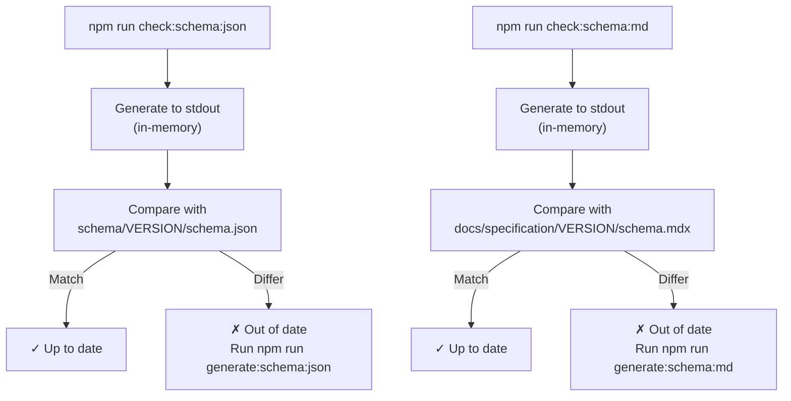
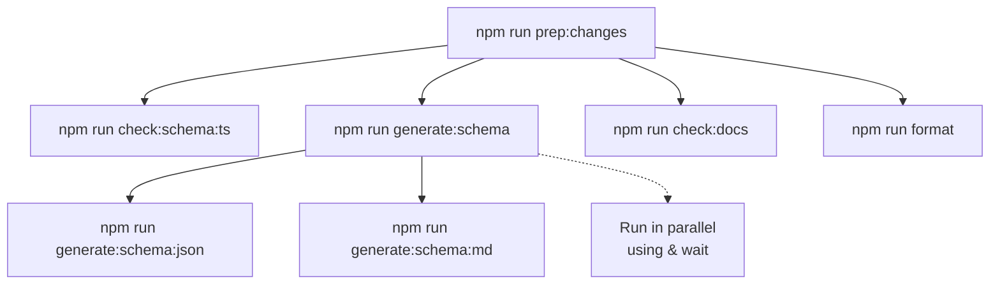

- name: Check TypeScript definitions
  run: npm run check:schema:ts

- name: Check schema.json files are up to date
  run: npm run check:schema:json

- name: Check schema.mdx files are up to date
  run: npm run check:schema:md
```

Sources: [.github/workflows/main.yml:21-28]()

### Check Mode Operation



**Title: CI Validation Check Mode Process**

Check mode generates artifacts in memory and compares them against committed files, failing the build if they differ. This ensures developers cannot forget to regenerate artifacts after schema changes.

### Check Command Implementation

The check commands use the `--check` flag to enable validation mode:

```typescript
// scripts/generate-schemas.ts
const CHECK_MODE = process.argv.includes('--check');

if (CHECK_MODE) {
  // Generate to stdout and compare
  const { stdout: generated } = await execAsync(
    `npx typescript-json-schema ... "${schemaTs}" "*"`
  );
  
  const existingSchema = readFileSync(schemaJson, 'utf-8');
  
  if (existingSchema.trim() !== expectedSchema.trim()) {
    console.error(`✗ Schema ${version} is out of date!`);
    return false;
  }
}
```

Sources: [scripts/generate-schemas.ts:20-87](), [package.json:30-31]()

## npm Scripts Reference

### Complete Script Matrix

| Script | Purpose | Mode | Fails CI? |
|--------|---------|------|-----------|
| `check` | Run all checks | Validation | Yes |
| `check:schema` | Check all schema artifacts | Validation | Yes |
| `check:schema:ts` | Validate TypeScript only | Validation | Yes |
| `check:schema:json` | Validate JSON schemas | Validation | Yes |
| `check:schema:md` | Validate MDX docs | Validation | Yes |
| `check:docs` | Validate documentation | Validation | Yes |
| `generate:schema` | Generate JSON + MDX | Generation | No |
| `generate:schema:json` | Generate JSON schemas | Generation | No |
| `generate:schema:md` | Generate MDX docs | Generation | No |
| `format` | Format markdown files | Modification | No |
| `prep:changes` | Complete validation + generation + format | Both | No |

### Script Dependencies



**Title: npm Script Dependencies and Execution Order**

The `prep:changes` script orchestrates the complete workflow, running TypeScript validation first, then parallel generation, followed by documentation checks and formatting.

Sources: [package.json:23-38]()

## Tool Configuration

### typescript-json-schema Options

The `typescript-json-schema` command uses specific flags to control output:

```bash
npx typescript-json-schema \
  --defaultNumberType integer \    # Numbers default to integer type
  --required \                     # Mark required fields explicitly
  --skipLibCheck \                 # Skip node_modules type checking
  "schema.ts" "*"                  # Export all types
```

These options ensure the generated JSON Schema matches MCP's conventions: numbers are integers by default, required fields are explicit, and library types don't interfere with generation.

Sources: [scripts/generate-schemas.ts:64-65]()

### TypeDoc Configuration

TypeDoc uses a custom plugin to generate Mintlify-compatible MDX:

```bash
typedoc \
  --entryPoints "schema/VERSION/schema.ts" \
  --schemaPageTemplate "schema/VERSION/schema.mdx"
```

The `--schemaPageTemplate` flag points to the template file that provides structure and frontmatter for the generated documentation.

Sources: [package.json:35]()

## Troubleshooting

### Generated Files Are Out of Sync

**Symptom**: CI fails with "Schema X is out of date"

**Solution**:
```bash
npm run generate:schema
git add schema/*/schema.json docs/specification/*/schema.mdx
git commit -m "Regenerate schema artifacts"
```

### TypeScript Validation Fails

**Symptom**: `npm run check:schema:ts` reports type errors

**Solution**:
1. Review TypeScript errors in the output
2. Fix type definitions in `schema/draft/schema.ts`
3. Ensure interfaces extend properly and types are correct
4. Re-run validation: `npm run check:schema:ts`

### JSON Schema Transformations Not Applied

**Symptom**: Modern schema versions still show `definitions` instead of `$defs`

**Solution**:
1. Verify version is listed in `MODERN_SCHEMAS` array in `scripts/generate-schemas.ts`
2. Regenerate: `npm run generate:schema:json`
3. Check generated file uses `$defs` and `https://json-schema.org/draft/2020-12/schema`

### MDX Generation Produces Invalid Output

**Symptom**: TypeDoc fails or generates malformed MDX

**Solution**:
1. Check template file exists: `schema/VERSION/schema.mdx`
2. Ensure template has valid frontmatter
3. Verify TypeDoc version matches `package.json`: `npm list typedoc`
4. Regenerate: `npm run generate:schema:md`

Sources: [scripts/generate-schemas.ts:86-109]()

## File Naming Conventions

### Generated Files Must Not Be Edited

Generated files are marked in `.gitattributes` as `linguist-generated`:

```gitattributes
schema/*/schema.json linguist-generated
docs/specification/*/schema.mdx linguist-generated
```

Additionally, `.prettierignore` excludes generated documentation from formatting:

```
docs/specification/*/schema.mdx
```

**These files must never be edited directly.** All changes must go through the TypeScript source and generation pipeline. Manual edits will be overwritten on the next generation run and will cause CI to fail.

Sources: [package.json:32]()