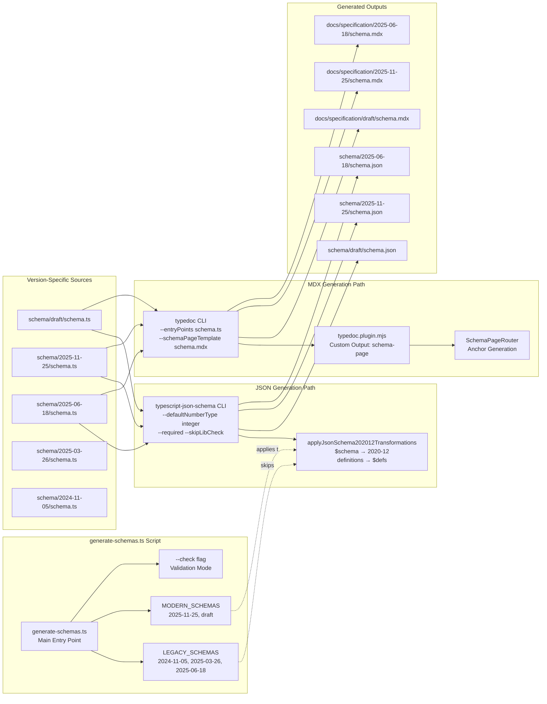
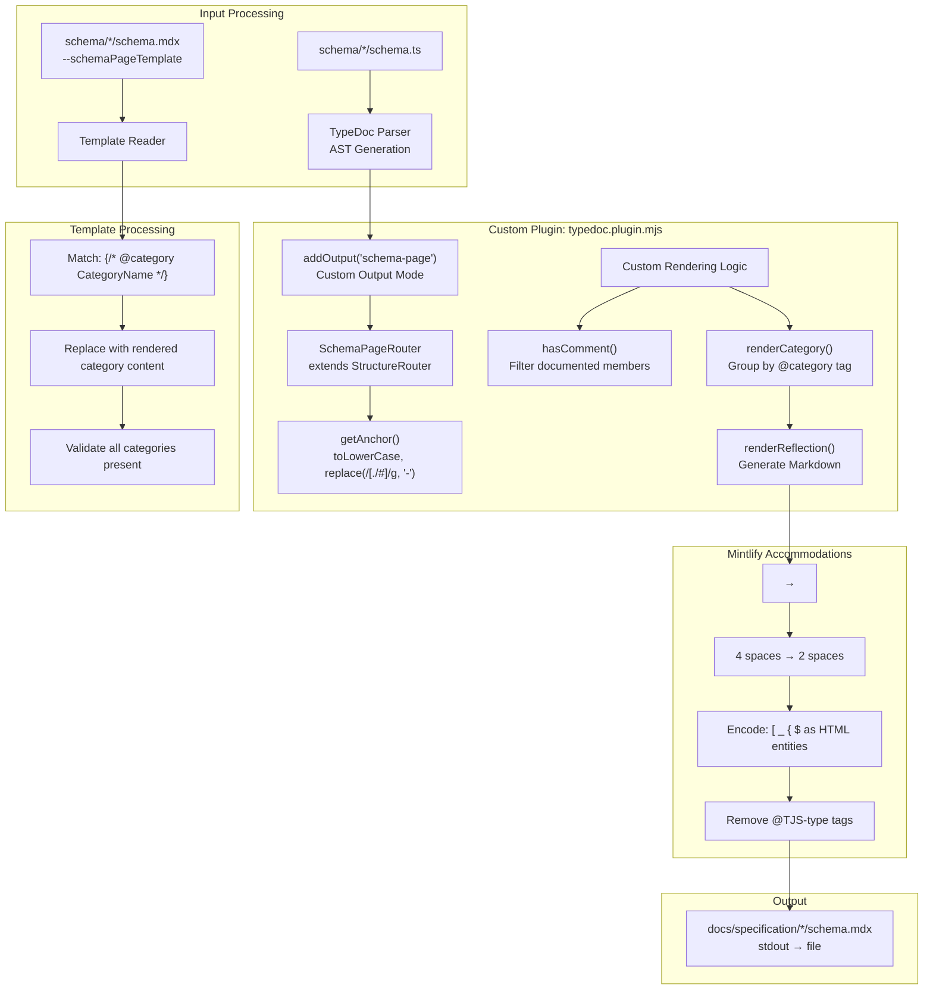
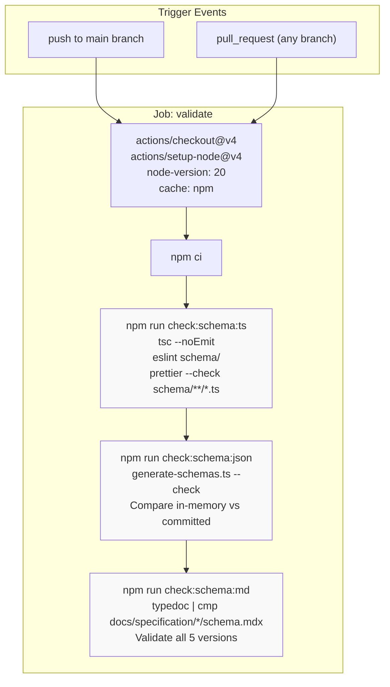
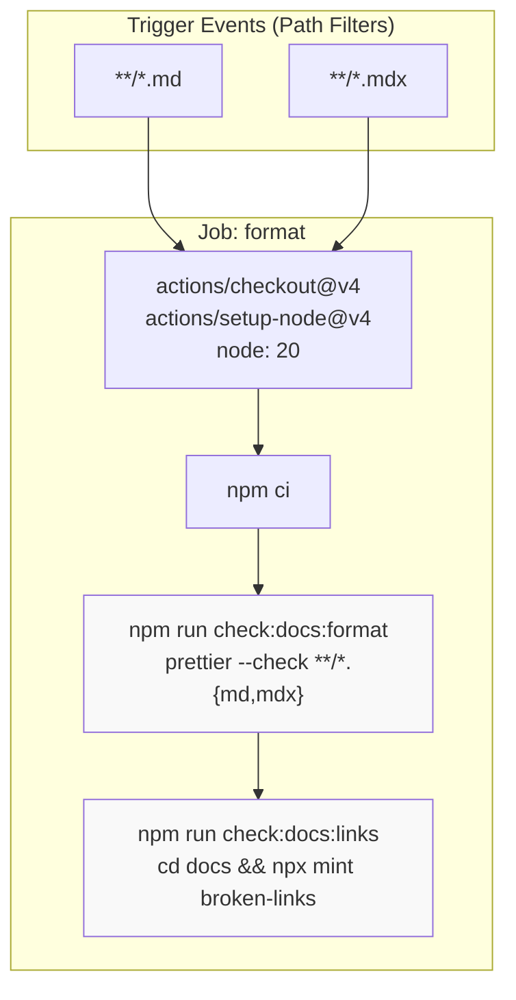

This document describes the automated build system and npm scripts for the MCP specification repository. The build system generates JSON schemas and MDX documentation from TypeScript sources, enforces code quality standards, and validates that all generated artifacts remain synchronized with their sources.

For information about the schema development workflow and how to edit schema sources, see page 7.3. For the documentation publishing system that consumes these build artifacts, see page 7.5.

## npm Scripts Overview

The build system is orchestrated through npm scripts defined in `package.json`. These scripts fall into three categories: generation, formatting, and validation.

**Generation Scripts:**

| Script | Command | Purpose |
|--------|---------|---------|
| `npm run generate` | Runs `generate:schema` and `generate:seps` in parallel | Generate all schema and SEP artifacts |
| `npm run generate:schema` | Runs `generate:schema:json` and `generate:schema:md` in parallel | Generate JSON schemas and MDX documentation |
| `npm run generate:schema:json` | `tsx scripts/generate-schemas.ts` | Generate JSON schemas from TypeScript sources |
| `npm run generate:schema:md` | TypeDoc with `--schemaPageTemplate` for each version | Generate MDX documentation from TypeScript |
| `npm run generate:seps` | `tsx scripts/render-seps.ts` | Render SEP documents from markdown |

**Formatting Scripts:**

| Script | Command | Purpose |
|--------|---------|---------|
| `npm run format` | Runs `format:docs` and `format:schema` in parallel | Format all files |
| `npm run format:docs` | `prettier --write "**/*.{md,mdx}"` | Format markdown and MDX files |
| `npm run format:schema` | `prettier --write "schema/**/*.ts"` | Format TypeScript schema files |

**Validation Scripts:**

| Script | Command | Purpose |
|--------|---------|---------|
| `npm run check` | Runs `check:schema`, `check:docs`, and `check:seps` in sequence | Validate all artifacts |
| `npm run check:schema` | Runs all schema checks in sequence | Validate schema sources and generated artifacts |
| `npm run check:schema:ts` | `tsc --noEmit && eslint schema/ && prettier --check` | Validate TypeScript compilation, linting, and formatting |
| `npm run check:schema:json` | `tsx scripts/generate-schemas.ts --check` | Validate JSON schemas match sources (dry-run) |
| `npm run check:schema:examples` | `tsx scripts/validate-examples.ts` | Validate example JSON files against schemas |
| `npm run check:schema:md` | TypeDoc comparison with `cmp` for each version | Validate MDX documentation matches sources |
| `npm run check:docs` | Runs `check:docs:format`, `check:docs:js-comments`, and `check:docs:links` | Validate documentation quality |
| `npm run check:docs:format` | `prettier --check "**/*.{md,mdx}"` | Validate markdown formatting |
| `npm run check:docs:js-comments` | `tsx scripts/check-mdx-comments.ts` | Detect JS comments in MDX ESM blocks |
| `npm run check:docs:links` | `cd docs && npx mint broken-links` | Validate internal links in documentation |
| `npm run check:seps` | `tsx scripts/render-seps.ts --check` | Validate SEP documents |

**Convenience Scripts:**

| Script | Command | Purpose |
|--------|---------|---------|
| `npm run prep` | `check:schema:ts → generate → check:docs → format` | Full developer workflow before commit |
| `npm run serve:docs` | `cd docs && npx mint dev` | Start local Mintlify documentation server |
| `npm run serve:blog` | `cd blog && hugo serve` | Start local Hugo blog server |

Sources: [package.json:23-45]()

## Build System Architecture

The build system orchestrates three parallel generation pipelines and multiple validation layers to maintain consistency across the repository:

**Build System Flow:**

```mermaid
graph TB
    subgraph "Source Files"
        SchemaTS["schema/*/schema.ts<br/>TypeScript Definitions"]
        SEPFiles["seps/*.md<br/>SEP Documents"]
        DocsContent["docs/**/*.{md,mdx}<br/>Documentation Content"]
    end
    
    subgraph "npm Scripts"
        Check["npm run check"]
        Generate["npm run generate"]
        Prep["npm run prep"]
        
        CheckSchema["check:schema"]
        CheckDocs["check:docs"]
        CheckSEPs["check:seps"]
        GenSchema["generate:schema"]
        GenSEPs["generate:seps"]
        Format["format"]
    end
    
    subgraph "Build Tools"
        TSC["tsc<br/>TypeScript Compiler"]
        ESLint["eslint<br/>Linting"]
        Prettier["prettier<br/>Formatting"]
        GenSchemaScript["generate-schemas.ts<br/>tsx executor"]
        RenderSEPs["render-seps.ts<br/>tsx executor"]
        TypeDoc["typedoc<br/>API Documentation"]
        MintCLI["mint broken-links<br/>Link Validator"]
        CheckMDXComments["check-mdx-comments.ts<br/>MDX Validation"]
        ValidateExamples["validate-examples.ts<br/>JSON Validation"]
    end
    
    subgraph "Generated Artifacts"
        SchemaJSON["schema/*/schema.json"]
        SchemaMDX["docs/specification/*/schema.mdx"]
        SEPRendered["docs/seps/*.mdx"]
        FormattedDocs["Formatted *.{md,mdx}"]
    end
    
    Check --> CheckSchema
    Check --> CheckDocs
    Check --> CheckSEPs
    
    CheckSchema --> TSC
    CheckSchema --> ESLint
    CheckSchema --> GenSchemaScript
    CheckSchema --> ValidateExamples
    CheckSchema --> TypeDoc
    
    CheckDocs --> Prettier
    CheckDocs --> CheckMDXComments
    CheckDocs --> MintCLI
    
    CheckSEPs --> RenderSEPs
    
    Generate --> GenSchema
    Generate --> GenSEPs
    
    GenSchema --> GenSchemaScript
    GenSchema --> TypeDoc
    
    GenSEPs --> RenderSEPs
    
    Prep --> CheckSchema
    Prep --> GenSchema
    Prep --> CheckDocs
    Prep --> Format
    
    SchemaTS --> TSC
    SchemaTS --> ESLint
    SchemaTS --> GenSchemaScript
    SchemaTS --> TypeDoc
    
    SEPFiles --> RenderSEPs
    
    DocsContent --> Prettier
    DocsContent --> CheckMDXComments
    DocsContent --> MintCLI
    
    GenSchemaScript --> SchemaJSON
    TypeDoc --> SchemaMDX
    RenderSEPs --> SEPRendered
    Prettier --> FormattedDocs
```



Sources: [package.json:23-45]()

The system distinguishes between **validation mode** (used by CI) and **generation mode** (used by developers):

| Mode | Entry Point | Purpose | Exit Behavior |
|------|-------------|---------|---------------|
| Validation | `npm run check` | Verify generated artifacts match sources | Exits with error if out of sync |
| Generation | `npm run generate` | Create/update generated artifacts | Writes files to disk |
| Combined | `npm run prep` | Check → Generate → Format → Validate | Full developer workflow |

Sources: [package.json:24-45]()

## Schema Generation Pipeline

The schema generation pipeline transforms TypeScript type definitions into both machine-readable JSON schemas and human-readable MDX documentation. The `npm run generate:schema` command runs two sub-commands in parallel: `generate:schema:json` and `generate:schema:md`.

**Schema Generation Flow:**



Sources: [scripts/generate-schemas.ts:10-148](), [package.json:25-27]()

### JSON Schema Generation

The `generate-schemas.ts` script uses `typescript-json-schema` to generate JSON schemas from TypeScript definitions. It is invoked via `npm run generate:schema:json` which executes `tsx scripts/generate-schemas.ts`.

**Key Implementation Details:**

1. **Parallel Processing**: All schema versions are generated concurrently using `Promise.all()` for performance [scripts/generate-schemas.ts:119-121]()

2. **Version-Specific Transformations**: Modern schemas (2025-11-25, draft) undergo transformations to adopt JSON Schema 2020-12 syntax via the `applyJsonSchema202012Transformations()` function:
   - Replace `$schema` URL from draft-07 to 2020-12 [scripts/generate-schemas.ts:29-32]()
   - Replace `"definitions":` with `"$defs":` [scripts/generate-schemas.ts:34-38]()
   - Replace `#/definitions/` references with `#/$defs/` [scripts/generate-schemas.ts:40-44]()

3. **Legacy Compatibility**: Versions 2024-11-05 through 2025-06-18 retain JSON Schema draft-07 format and skip transformations [scripts/generate-schemas.ts:11, 103-105]()

4. **Check Mode**: When invoked with `--check` flag, compares in-memory generated schemas against committed files without writing to disk [scripts/generate-schemas.ts:20, 57-86]()

Sources: [scripts/generate-schemas.ts:22-110]()

### MDX Documentation Generation

TypeDoc with a custom plugin generates API reference documentation in Mintlify-compatible MDX format. The `npm run generate:schema:md` command uses `find` and `xargs` to invoke TypeDoc for each schema version in parallel.

**MDX Generation Flow:**



Sources: [typedoc.plugin.mjs:1-243](), [package.json:27]()

**Critical Implementation Details:**

1. **Custom Router**: `SchemaPageRouter` generates lowercase, hyphenated anchors compatible with Mintlify's heading ID generation [typedoc.plugin.mjs:34-58]()

2. **Category-Based Rendering**: The `{/* @category Name */}` syntax in templates maps to `@category` tags in TypeScript comments [typedoc.plugin.mjs:104-126]()

3. **Mintlify Parser Workarounds**: Multiple transformations accommodate Mintlify's Markdown parser limitations:
   - Non-breaking spaces (`\u00A0`) encoded as `&nbsp;` [typedoc.plugin.mjs:222]()
   - Square brackets inside HTML tags encoded as `&#x5B;` [typedoc.plugin.mjs:224]()
   - Underscores inside HTML tags encoded as `&#x5F;` [typedoc.plugin.mjs:225]()
   - Curly braces (JSX interpolation) encoded as `&#x7B;` [typedoc.plugin.mjs:226]()
   - Dollar signs encoded as `&#x24;` [typedoc.plugin.mjs:227]()

4. **Validation**: Plugin throws errors if template references categories not present in TypeScript source [typedoc.plugin.mjs:118-123]()

Sources: [typedoc.plugin.mjs:1-243](), [typedoc.config.mjs:1-19]()

## CI/CD Workflows

Two GitHub Actions workflows enforce repository quality standards:

### Main Schema Validation Workflow

The primary CI workflow validates that all generated schema artifacts match their TypeScript sources:



**Sources:** [.github/workflows/main.yml:1-29]()

**Workflow Execution:**

1. **TypeScript Validation**: Verifies type correctness, linting compliance, and formatting [package.json:29]()
2. **JSON Schema Validation**: Runs `generate-schemas.ts --check` to confirm committed JSON schemas match generated output [package.json:30]()
3. **MDX Documentation Validation**: Executes TypeDoc for each version and compares output via `cmp` command [package.json:31]()

Each step must pass for the workflow to succeed. The sequential execution ensures TypeScript errors are caught before expensive schema generation.

**Sources:** [.github/workflows/main.yml:21-28](), [package.json:28-31]()

### Markdown Format Workflow

A separate workflow validates documentation formatting and link integrity:



**Sources:** [.github/workflows/markdown-format.yml:1-32]()

**Key Features:**

1. **Conditional Execution**: Only runs when Markdown files change [.github/workflows/markdown-format.yml:5-11]()
2. **Prettier Enforcement**: Validates consistent formatting across all `.md` and `.mdx` files [.github/workflows/markdown-format.yml:28]()
3. **Link Validation**: Uses Mintlify CLI to detect broken internal links [.github/workflows/markdown-format.yml:31]()
4. **Exclusions**: Generated schema MDX files are excluded from Prettier checks via `--ignore` flag [package.json:32]()

**Sources:** [.github/workflows/markdown-format.yml:1-32](), [package.json:26-27]()

## Validation vs Generation Pattern

The build system implements a clear separation between validation (CI) and generation (local development):

| Aspect | Validation Mode | Generation Mode |
|--------|----------------|-----------------|
| Entry Point | `npm run check` | `npm run generate:schema` |
| Execution | Dry-run, in-memory comparison | Writes files to disk |
| Exit Code | Non-zero if mismatch | Zero on success |
| Performance | Parallel comparison | Parallel generation |
| Use Case | CI enforcement | Developer workflow |

**Implementation Details:**

The `--check` flag controls behavior in `generate-schemas.ts`:

```typescript
// Validation mode: Compare in-memory against committed
if (CHECK_MODE) {
  const existingSchema = readFileSync(schemaJson, 'utf-8');
  const { stdout: generated } = await execAsync(...);
  if (existingSchema.trim() !== expectedSchema.trim()) {
    console.error(`✗ Schema ${version} is out of date!`);
    return false;
  }
}

// Generation mode: Write to disk
else {
  await execAsync(..., `-o "${schemaJson}"`);
  applyJsonSchema202012Transformations(schemaJson);
}
```

**Sources:** [scripts/generate-schemas.ts:20, 52-109]()

The MDX validation uses shell piping to achieve similar behavior:

```bash