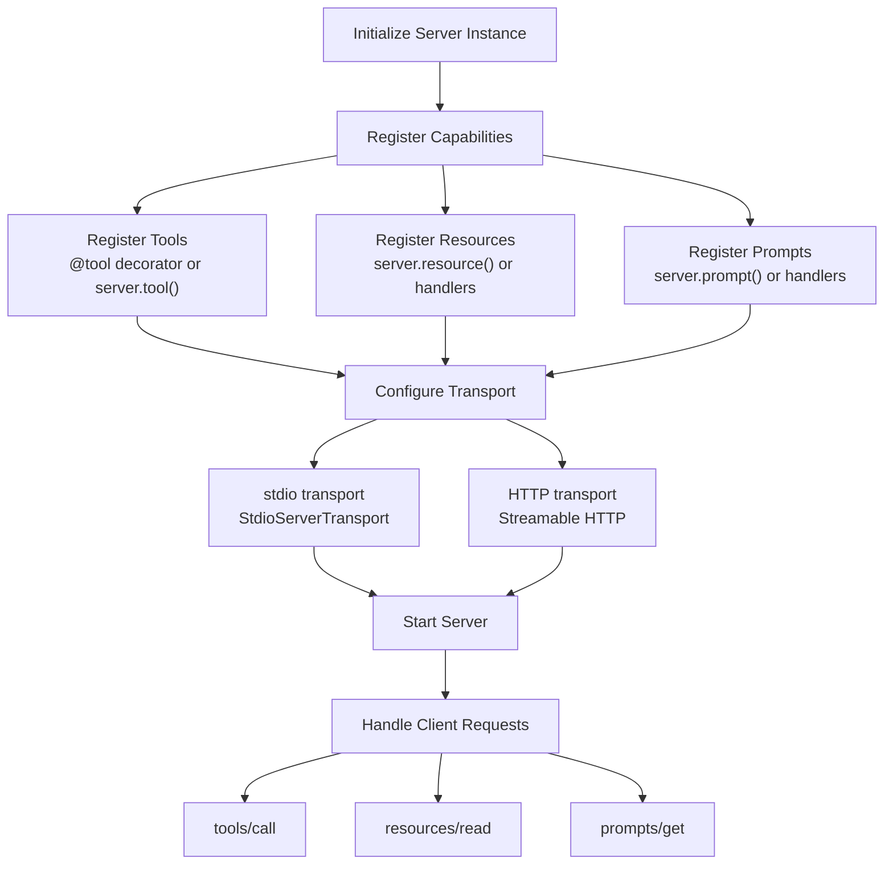
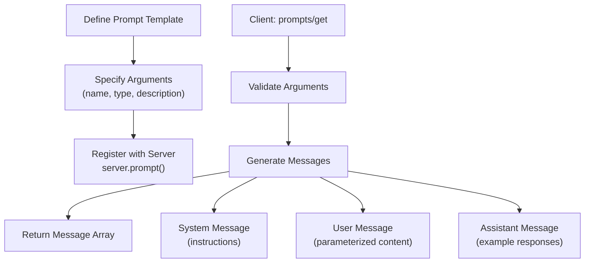
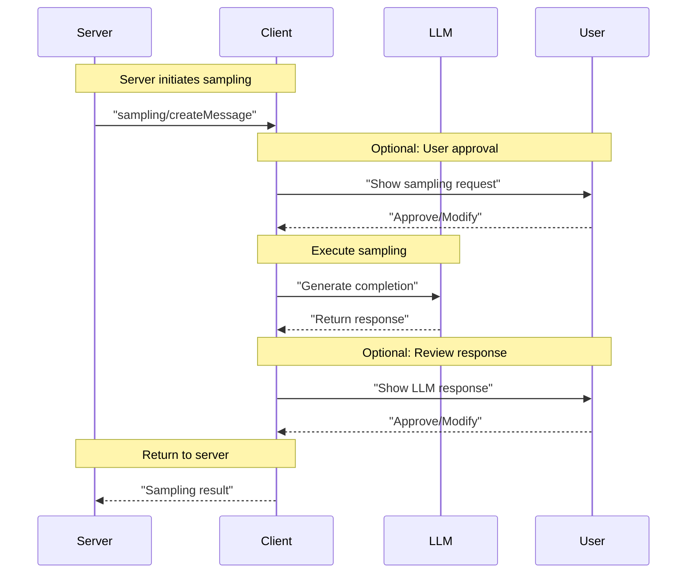
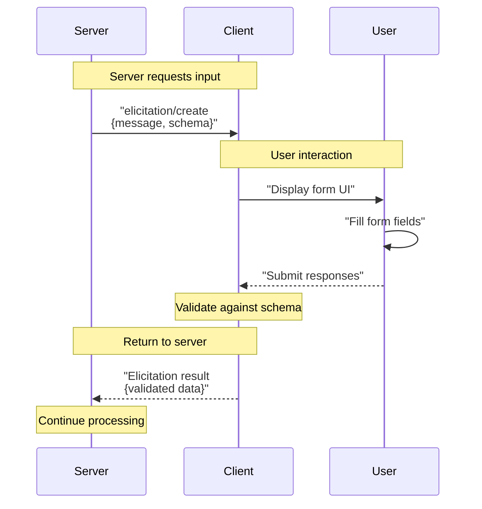

This guide covers the practical implementation patterns for building MCP servers. It demonstrates how to register tools, expose resources, define prompts, and handle client feature requests like sampling and elicitation.

For a complete tutorial building a weather server from scratch, see [Quick Start Guide](#5.1). For conceptual understanding of server capabilities, see [Understanding MCP Servers](#5.3). For SDK-specific APIs, see [SDK Reference](#6).

## Server Implementation Overview

Building an MCP server involves implementing handlers for three core server capabilities and optionally supporting client features. The implementation pattern varies by SDK but follows the same conceptual flow.

### Implementation Flow Diagram



**Code Entity Mapping:**

| Concept | TypeScript SDK | Python SDK | Java SDK |
|---------|---------------|------------|----------|
| Server Instance | `McpServer` or `Server` | `FastMCP` or `Server` | `McpServer` |
| Tool Registration | `server.tool()` | `@mcp.tool()` or `server.add_tool()` | `McpServer.addTool()` |
| Resource Registration | `server.resource()` | `server.add_resource()` | `McpServer.addResource()` |
| Prompt Registration | `server.prompt()` | `server.add_prompt()` | `McpServer.addPrompt()` |
| stdio Transport | `StdioServerTransport` | `stdio_server()` | `StdioServerTransport` |

Sources: [docs/docs/develop/build-server.mdx:138-262](), [docs/docs/develop/build-server.mdx:490-746]()

## Registering Tools

Tools are the primary mechanism for MCP servers to expose executable functionality to clients. Tool registration involves defining the tool's input schema and implementing its execution logic.

### Python Tool Registration Pattern

The Python SDK provides the `@mcp.tool()` decorator for automatic tool registration using FastMCP:

```python
# Using FastMCP decorator pattern
from mcp.server.fastmcp import FastMCP

mcp = FastMCP("server-name")

@mcp.tool()
async def get_forecast(latitude: float, longitude: float) -> str:
    """Get weather forecast for a location.
    
    Args:
        latitude: Latitude of the location
        longitude: Longitude of the location
    """
    # Tool implementation
    return forecast_data
```

The decorator automatically:
- Extracts the input schema from type hints
- Uses the docstring for tool description
- Registers the tool with the server
- Handles argument validation

Sources: [docs/docs/develop/build-server.mdx:194-249]()

### TypeScript Tool Registration Pattern

The TypeScript SDK uses explicit schema definition with Zod:

```typescript
import { McpServer } from "@modelcontextprotocol/sdk/server/mcp.js";
import { z } from "zod";

const server = new McpServer({
  name: "weather",
  version: "1.0.0",
  capabilities: { tools: {} }
});

server.tool(
  "get_forecast",
  "Get weather forecast for a location",
  {
    latitude: z.number().min(-90).max(90).describe("Latitude"),
    longitude: z.number().min(-180).max(180).describe("Longitude")
  },
  async ({ latitude, longitude }) => {
    // Tool implementation
    return {
      content: [{ type: "text", text: forecastData }]
    };
  }
);
```

Sources: [docs/docs/develop/build-server.mdx:592-728]()

### Tool Result Format

Tools must return results in the standardized format:

```typescript
{
  content: [
    {
      type: "text" | "image" | "resource",
      text?: string,        // for text content
      data?: string,        // for image content (base64)
      mimeType?: string,    // for image/resource content
      uri?: string          // for resource content
    }
  ],
  isError?: boolean
}
```

### Tool Naming Convention

Tool names should follow the format: `<domain>_<action>` (e.g., `weather_forecast`, `calendar_create_event`). This helps with discoverability and prevents naming conflicts when multiple servers are connected.

Sources: [docs/docs/develop/build-server.mdx:62]()

## Exposing Resources

Resources provide read-only access to data sources. MCP servers expose resources through URI-based access patterns and optional subscription mechanisms for change notifications.

### Resource Registration and Access Pattern

```mermaid
sequenceDiagram
    participant Client
    participant Server
    participant DataSource["Data Source<br/>(File, DB, API)"]
    
    Note over Client,Server: Resource Discovery
    Client->>Server: "resources/list"
    Server-->>Client: "List of resource URIs"
    
    Note over Client,Server: Resource Access
    Client->>Server: "resources/read {uri}"
    Server->>DataSource: "Fetch data"
    DataSource-->>Server: "Raw data"
    Server->>Server: "Format with MIME type"
    Server-->>Client: "Resource content + metadata"
    
    Note over Client,Server: Change Notifications (Optional)
    Client->>Server: "resources/subscribe {uri}"
    Server-->>Client: "Subscription confirmed"
    DataSource-->>Server: "Data changed"
    Server->>Client: "resources/updated notification"
```

### Python Resource Implementation

```python
@mcp.resource("file://logs/app.log")
def read_log_file() -> str:
    """Application log file"""
    with open("/var/logs/app.log") as f:
        return f.read()

# For dynamic resources with templates
@mcp.resource("weather://forecast/{city}")
def get_city_forecast(city: str) -> str:
    """Weather forecast for a specific city"""
    return fetch_weather_api(city)
```

### TypeScript Resource Implementation

```typescript
server.resource(
  "file://logs/app.log",
  "Application log file",
  "text/plain",
  async () => {
    const content = await fs.readFile("/var/logs/app.log", "utf-8");
    return {
      contents: [{
        uri: "file://logs/app.log",
        mimeType: "text/plain",
        text: content
      }]
    };
  }
);
```

### Resource URI Schemes

| URI Scheme | Purpose | Example |
|------------|---------|---------|
| `file://` | Local filesystem | `file:///Users/name/document.txt` |
| `http://` or `https://` | Web resources | `https://api.example.com/data` |
| Custom schemes | Domain-specific | `db://tables/users`, `config://app/settings` |

### Resource Change Notifications

Servers can notify clients when subscribed resources change:

```python
# Server sends notification
await session.send_resource_updated("file://logs/app.log")
```

Sources: [docs/docs/learn/architecture.mdx:100-138](), [docs/examples.mdx:14-20]()

## Defining Prompts

Prompts provide reusable, parameterized templates for LLM interactions. They help standardize common workflows and demonstrate best practices for using server capabilities.

### Prompt Structure and Generation



### Python Prompt Implementation

```python
@mcp.prompt()
def analyze_logs(time_range: str, severity: str = "error") -> list:
    """Analyze application logs for issues.
    
    Args:
        time_range: Time period to analyze (e.g., "1h", "24h")
        severity: Log severity level to filter
    """
    return [
        {
            "role": "system",
            "content": "You are a log analysis expert. Analyze the provided logs and identify critical issues."
        },
        {
            "role": "user", 
            "content": f"Analyze logs from the last {time_range} with severity {severity} or higher"
        }
    ]
```

### TypeScript Prompt Implementation

```typescript
server.prompt(
  "analyze_logs",
  "Analyze application logs for issues",
  {
    time_range: z.string().describe("Time period (e.g., '1h', '24h')"),
    severity: z.enum(["debug", "info", "warning", "error"]).default("error")
  },
  async ({ time_range, severity }) => {
    return {
      messages: [
        {
          role: "system",
          content: {
            type: "text",
            text: "You are a log analysis expert."
          }
        },
        {
          role: "user",
          content: {
            type: "text", 
            text: `Analyze logs from ${time_range} with ${severity}+`
          }
        }
      ]
    };
  }
);
```

### Prompt Message Roles

| Role | Purpose | Example Usage |
|------|---------|---------------|
| `system` | Define assistant behavior | "You are a helpful coding assistant" |
| `user` | Provide user requests/context | "Analyze this error log" |
| `assistant` | Show example responses | "I found 3 critical errors..." |

### Embedding Resources in Prompts

Prompts can reference resources to provide dynamic context:

```python
return [
    {
        "role": "user",
        "content": {
            "type": "resource",
            "resource": {
                "uri": f"file://logs/{time_range}.log",
                "mimeType": "text/plain"
            }
        }
    }
]
```

Sources: [docs/docs/learn/server-concepts.mdx:175-231](), [docs/docs/learn/architecture.mdx:176-218]()

## Handling Client Features

MCP servers can implement handlers for client-provided capabilities, enabling advanced workflows like LLM sampling and user input elicitation.

### Sampling: Requesting LLM Completions

Sampling allows servers to request LLM completions from the client. This enables agentic workflows where the server delegates reasoning tasks to the LLM.

**Sampling Request Flow:**



**Python Implementation:**

```python
# Request sampling from client
result = await session.create_message(
    messages=[{
        "role": "user",
        "content": "Analyze these 50 flight options and recommend the best one"
    }],
    max_tokens=1500,
    model_preferences={
        "hints": [{"name": "claude-3-5-sonnet"}],
        "intelligencePriority": 0.9
    }
)
```

**TypeScript Implementation:**

```typescript
const result = await session.createMessage({
  messages: [{
    role: "user",
    content: {
      type: "text",
      text: "Analyze these 50 flight options"  
    }
  }],
  maxTokens: 1500,
  modelPreferences: {
    hints: [{ name: "claude-3-5-sonnet" }]
  }
});
```

Sources: [docs/docs/learn/client-concepts.mdx:154-234]()

### Elicitation: Requesting User Input

Elicitation enables servers to pause execution and request specific information from users through structured forms.

**Elicitation Request Flow:**



**Python Implementation:**

```python