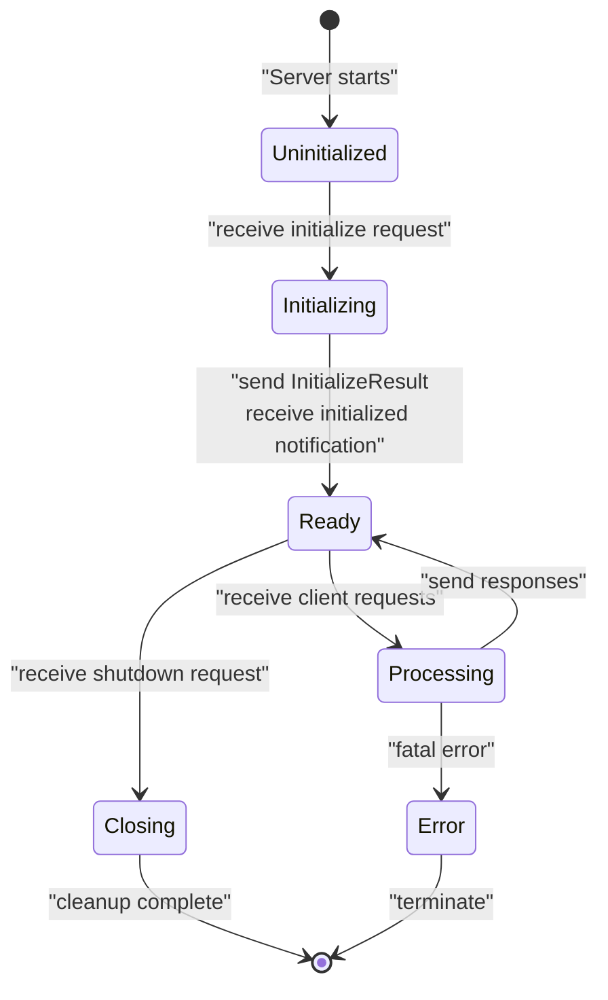
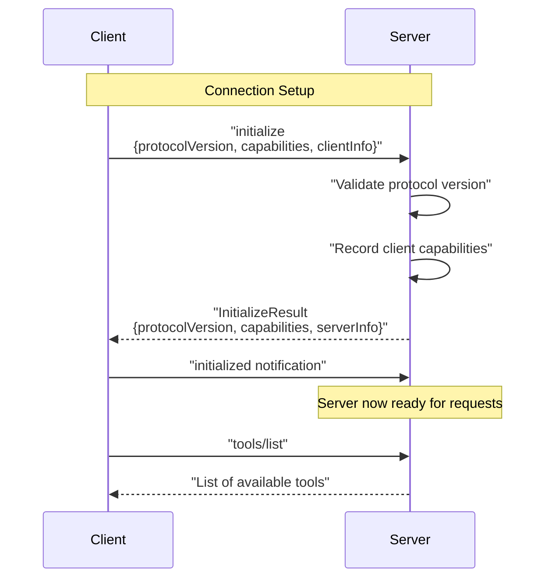
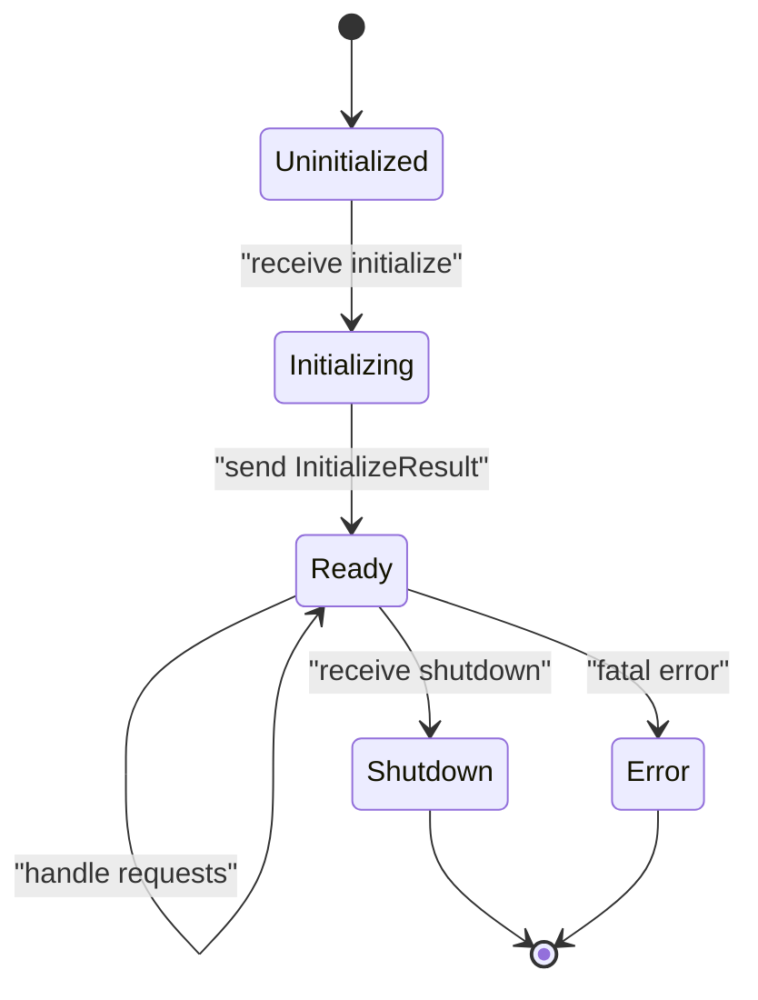
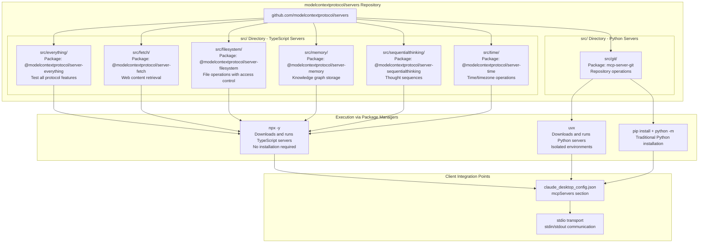

if introspection.aud != "https://myserver.example.com":
    raise Unauthorized("Wrong audience")
```

Sources: [docs/docs/learn/architecture.mdx:89-97]()

## Server Lifecycle Management

MCP servers follow a standardized initialization and shutdown sequence that enables capability negotiation and graceful termination.

### Lifecycle State Diagram



### Initialization Sequence



**Python Lifecycle Handling:**

```python
from mcp.server.fastmcp import FastMCP

mcp = FastMCP("server-name")

# FastMCP handles initialization automatically

# Register shutdown handler
@mcp.shutdown()
async def cleanup():
    # Close connections, save state, etc.
    await db.close()
    logger.info("Server shutdown complete")
```

**TypeScript Lifecycle Handling:**

```typescript
const server = new McpServer({
  name: "server-name",
  version: "1.0.0"
}, {
  capabilities: {
    tools: {},
    resources: {},
    prompts: {}
  }
});

// Lifecycle is handled by SDK
// Implement cleanup on process signals
process.on('SIGINT', async () => {
  await cleanup();
  process.exit(0);
});
```

Sources: [docs/docs/learn/architecture.mdx:106-218]()

### Error Handling Best Practices

**Return Errors in Tool Results:**

```python
@mcp.tool()
async def risky_operation(param: str) -> str:
    try:
        result = await external_api_call(param)
        return result
    except APIError as e:
        # Return error as content with isError flag
        return {
            "content": [{"type": "text", "text": f"API error: {str(e)}"}],
            "isError": True
        }
```

**Proper Exception Handling:**

```typescript
server.tool("process_data", "Process user data", schema, async (args) => {
  try {
    const result = await processData(args);
    return {
      content: [{ type: "text", text: JSON.stringify(result) }]
    };
  } catch (error) {
    return {
      content: [{ 
        type: "text", 
        text: `Processing failed: ${error.message}` 
      }],
      isError: true
    };
  }
});
```

### Server Notifications

Servers can send notifications to inform clients about state changes:

**Resource Update Notifications:**

```python
# Notify clients that a resource changed
await session.send_resource_updated("file://logs/app.log")
```

**Resource List Changes:**

```typescript
// Notify clients to refetch resource list
await session.sendResourcesChanged();
```

**Tool List Changes:**

```python
await session.send_tools_changed()
```

Sources: [docs/docs/learn/architecture.mdx:400-456]()

## Implementation Patterns

### Server Lifecycle Management



### Capability Registration

Most MCP server implementations follow a pattern of registering capabilities during server setup:

1. **Tool Registration**: Define available tools with their schemas
2. **Resource Registration**: Register data sources with metadata
3. **Prompt Registration**: Define message templates with parameters
4. **Handler Binding**: Associate handlers with capability requests

Sources: [docs/docs/tools/inspector.mdx:119-138]()

## Testing and Development

The MCP Inspector provides comprehensive testing capabilities for server development:

- **Connection Testing**: Verify transport layer functionality
- **Capability Testing**: Test tools, resources, and prompts individually
- **Error Scenario Testing**: Validate error handling and edge cases
- **Integration Testing**: End-to-end workflow verification

Sources: [docs/docs/tools/inspector.mdx:1-159]()

# Reference Server Implementations


## Purpose and Scope

This document provides comprehensive documentation of the official reference MCP server implementations maintained in the `modelcontextprotocol/servers` repository. These servers demonstrate core MCP features, SDK usage patterns, and best practices for building production-ready servers. Each reference server showcases different aspects of the protocol: tools, resources, prompts, and various integration patterns.

For information about building custom MCP servers, see [Building MCP Servers](#5.2). For archived and community server implementations, see [Archived and Community Servers](#5.4). For initial setup and execution, see [Quick Start Guide](#5.1).

**Sources:** [docs/examples.mdx:1-24]()

## Reference Server Architecture

The reference servers follow a consistent architectural pattern across TypeScript and Python implementations. Each server provides a focused set of capabilities demonstrating specific MCP features.

**Repository Structure and Package Distribution**



**Sources:** [docs/examples.mdx:8-21](), [docs/examples.mdx:40-55]()

## Server Capability Matrix

The following table summarizes the capabilities exposed by each reference server:

| Server | Tools | Resources | Prompts | Primary Purpose |
|--------|-------|-----------|---------|-----------------|
| Everything | ✅ | ✅ | ✅ | Complete protocol test bed demonstrating all MCP features |
| Fetch | ✅ | ✅ | ❌ | Web content retrieval and conversion for LLM consumption |
| Filesystem | ✅ | ✅ | ❌ | Secure file operations with access control boundaries |
| Git | ✅ | ❌ | ❌ | Repository reading, searching, and manipulation |
| Memory | ✅ | ✅ | ❌ | Knowledge graph-based persistent storage system |
| Sequential Thinking | ✅ | ❌ | ❌ | Dynamic problem-solving through thought sequences |
| Time | ✅ | ❌ | ❌ | Time and timezone conversion operations |

**Sources:** [docs/examples.mdx:12-20]()

## Everything Server

### Purpose

The Everything server serves as the comprehensive reference implementation and test bed for the MCP protocol. It demonstrates the complete feature set: tools, resources, and prompts in a single server implementation. This server is specifically designed for testing and validation rather than production use.

### Package Information

- **Package:** `@modelcontextprotocol/server-everything`
- **Repository:** [modelcontextprotocol/servers/tree/main/src/everything](https://github.com/modelcontextprotocol/servers/tree/main/src/everything)
- **Language:** TypeScript
- **Execution:** `npx -y @modelcontextprotocol/server-everything`

### Capabilities Demonstrated

| Feature Type | What It Demonstrates |
|--------------|---------------------|
| **Tools** | Complete tool registration and execution patterns including input validation |
| **Resources** | Both direct resources and resource templates with URI-based access |
| **Prompts** | Prompt definition with parameter handling and completion |
| **Notifications** | Real-time notification patterns for capability changes |

### Use Cases

- **Protocol conformance testing:** Validate MCP client implementations against all protocol features
- **SDK development:** Reference implementation for new language SDK development
- **Integration testing:** Comprehensive test bed for MCP client-server communication
- **Learning resource:** Demonstrates best practices for implementing all MCP primitives

### Execution Example

```bash