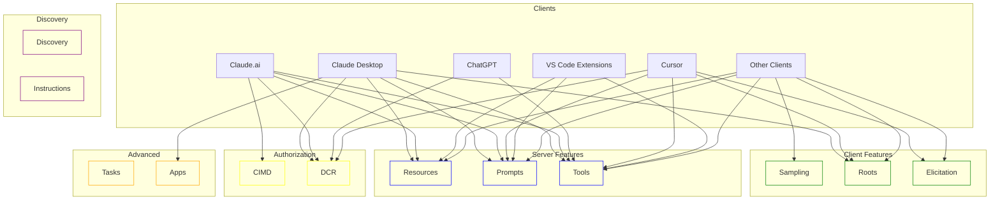
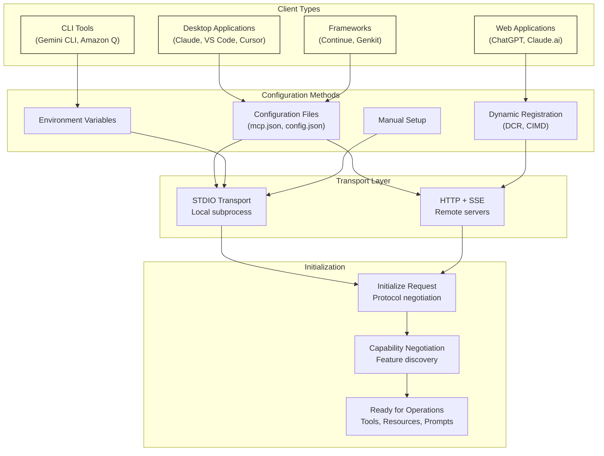
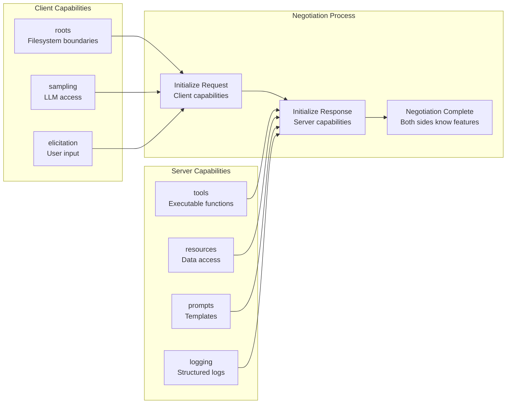
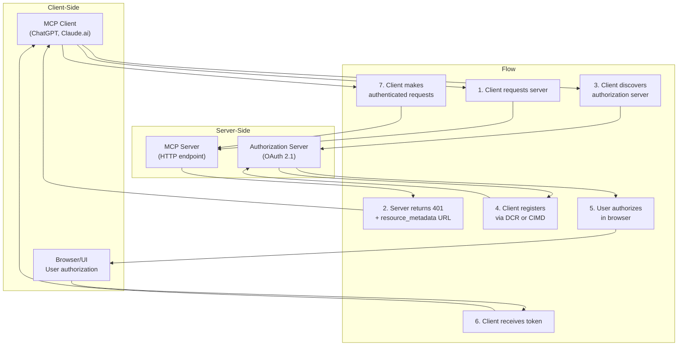
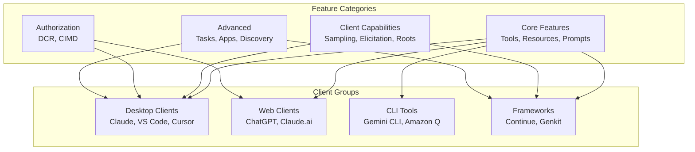

## Purpose and Scope

This page catalogs all known MCP client implementations and documents their supported features through a standardized feature matrix. It serves as a reference for understanding which MCP capabilities each client supports, enabling users to identify compatible clients for their use cases and developers to understand the landscape of MCP client implementations.

For information about how to integrate MCP servers with specific clients, see [Client Integration Patterns](4.2). For details about the protocol features themselves, see [Protocol Specification](2).

## Feature Categories and Badge System

MCP clients support various protocol features, each represented by a colored badge in the client directory. The feature system is defined in [docs/clients.mdx:8-23](), which establishes the complete feature set and their visual categorization.

| Feature Category | Features | Purpose |
|---|---|---|
| **Server Features** (blue) | Resources, Prompts, Tools | Core server-provided capabilities that clients can access |
| **Client Features** (green) | Sampling, Roots, Elicitation | Client-provided capabilities that servers can request |
| **Discovery** (purple) | Discovery, Instructions | Dynamic capability and metadata discovery |
| **Authorization** (yellow) | CIMD, DCR | Client registration and authorization mechanisms |
| **Advanced** (orange) | Tasks, Apps | Long-running operations and interactive interfaces |

### Feature Definitions

**Resources** — Server-exposed data and content accessible via URI-based patterns

**Prompts** — Pre-defined templates for LLM interactions

**Tools** — Executable functions that LLMs can invoke

**Discovery** — Support for tools/prompts/resources changed notifications

**Instructions** — Server-provided guidance for LLMs

**Sampling** — Server-initiated LLM completions (see [Sampling](2.6))

**Roots** — Filesystem boundary definitions (see [Client Features](2.6))

**Elicitation** — User information requests (see [Client Features](2.6))

**CIMD** — Client ID Metadata Document support for authorization

**DCR** — Dynamic Client Registration support for authorization

**Tasks** — Long-running operation tracking (see [Task System](2.7))

**Apps** — Interactive HTML interfaces (see [Extensions Framework](2.8))

Sources: [docs/clients.mdx:8-298]()

## Client Directory Structure

The client directory is implemented as a React component system in [docs/clients.mdx]() that provides:

1. **ClientFilter** component — Enables search and multi-feature filtering
2. **McpClient** component — Renders individual client entries with metadata
3. **FeatureBadge** component — Displays feature support with color coding

### Filter and Search Mechanism

The filtering system uses a shared state store (`filterStore`) that tracks:
- `selectedFeatures` — Array of currently selected feature filters
- `searchText` — Text query for client name matching
- `visibleCount` / `totalCount` — Pagination metrics

Clients are filtered using the `useFilter` hook [docs/clients.mdx:58-79](), which applies both text search and feature matching logic:

```
isVisible = (
  name.toLowerCase().includes(searchText.toLowerCase()) AND
  selectedFeatures.every(feature => supports?.includes(feature))
)
```

Sources: [docs/clients.mdx:30-153]()

## Client Entry Structure

Each client entry contains the following metadata:

| Field | Type | Description |
|---|---|---|
| `name` | string | Display name of the client |
| `homepage` | string | URL to client's main website or repository |
| `supports` | string | Comma-separated list of supported features |
| `sourceCode` | string (optional) | URL to source code repository |
| `instructions` | string or array | Configuration documentation link(s) |
| `children` | markdown | Description and key features |

The `McpClient` component [docs/clients.mdx:156-278]() processes this metadata to:
- Generate a URL-safe slug for anchor linking
- Sort features according to the canonical feature order
- Handle multiple instruction links
- Manage expandable content overflow
- Apply visibility filtering

Sources: [docs/clients.mdx:156-278]()

## Feature Support Matrix

The following diagram shows the relationship between client implementations and their supported features:



**Client Feature Support Overview**

This diagram illustrates representative feature coverage across major client categories. Actual support varies by client implementation.

Sources: [docs/clients.mdx:8-23]()

## Notable Client Implementations

### Major Clients with Comprehensive Support

**Claude Desktop** — Supports Resources, Prompts, Tools, Apps, and DCR. Provides both local server connections and remote server support via custom connectors.

**Claude.ai** — Web-based client supporting Resources, Prompts, Tools, CIMD, and DCR for remote MCP servers.

**ChatGPT** — Supports Tools and DCR for remote server integration.

**Cursor** — IDE-integrated client supporting Prompts, Tools, Roots, Elicitation, and DCR.

### Specialized Clients

**Cline** — VS Code autonomous coding agent with Resources, Tools, and Discovery support.

**Continue** — Open-source code assistant supporting Resources, Prompts, and Tools across VS Code and JetBrains IDEs.

**Amazon Q CLI** — Terminal-based agentic assistant with Prompts and Tools support.

**Amp** — Multiplayer coding tool supporting Resources, Prompts, Tools, and Sampling.

### Framework and Library Clients

**BeeAI Framework** — Agentic workflow framework with native MCP Tool integration.

**Genkit** — Cross-language SDK with genkitx-mcp plugin for consuming MCP servers as client or creating servers from tools/prompts.

**fast-agent** — Python agent framework with full multi-modal support and MCP server deployment capabilities.

Sources: [docs/clients.mdx:309-1500]()

## Client Capability Negotiation

Clients declare their capabilities during the MCP initialization handshake using the `ClientCapabilities` interface [schema/draft/schema.ts:468-567](). The capabilities structure includes:

```
ClientCapabilities {
  roots?: { listChanged?: boolean }
  sampling?: { context?: object, tools?: object }
  elicitation?: { form?: object, url?: object }
  tasks?: { list?: object, cancel?: object, requests?: {...} }
  extensions?: { [key: string]: object }
  experimental?: { [key: string]: object }
}
```

Servers use this information to determine which client-side features they can request. For example, a server can only send sampling requests if the client declares `sampling` capability.

Sources: [schema/draft/schema.ts:468-567]()

## Authorization Support in Clients

Clients support two primary authorization mechanisms:

**CIMD (Client ID Metadata Documents)** — Clients provide pre-configured authorization metadata, enabling servers to discover authorization requirements without additional registration steps.

**DCR (Dynamic Client Registration)** — Clients support OAuth 2.1 Dynamic Client Registration, allowing them to register with authorization servers at runtime.

Both mechanisms are part of the MCP authorization framework. For detailed authorization information, see [OAuth 2.1 Authorization Framework](3.1).

Sources: [docs/clients.mdx:294-295]()

## Transport Support Across Clients

Clients support different transport mechanisms for connecting to MCP servers:

| Transport | Use Case | Clients |
|---|---|---|
| **STDIO** | Local subprocess communication | Most desktop and IDE clients |
| **Streamable HTTP** | Remote server connections | Web-based clients, remote-capable desktop clients |
| **SSE** | Server-sent events streaming | Web clients, some remote clients |

The transport layer is transparent to the feature matrix — clients may support the same features across different transports.

Sources: [docs/clients.mdx]()

## Community-Maintained Client List

The client directory in [docs/clients.mdx]() is maintained by the community. The list includes:

- **~100+ documented clients** spanning various categories
- **Desktop applications** (Claude Desktop, Cursor, VS Code extensions)
- **Web-based clients** (Claude.ai, ChatGPT)
- **IDE integrations** (Continue, Cline, CodeGPT)
- **Framework libraries** (BeeAI, Genkit, fast-agent)
- **Specialized tools** (Amazon Q, Apidog, Chatbox)

Each entry includes:
- Feature support badges
- Configuration instructions
- Source code links (where available)
- Detailed descriptions of capabilities

### Contributing Updates

The community can submit pull requests to update client information at [https://github.com/modelcontextprotocol/modelcontextprotocol/pulls](). Updates should include:

1. Accurate feature support based on current client implementation
2. Links to official documentation or configuration guides
3. Source code repository links where applicable
4. Clear descriptions of key features and integration patterns

Sources: [docs/clients.mdx:299-303]()

## Feature Implementation Patterns

### Server Features Pattern

Clients implementing server features (Resources, Prompts, Tools) follow a discovery-then-use pattern:

1. **Discovery** — Client calls `resources/list`, `prompts/list`, or `tools/list`
2. **Access** — Client calls `resources/read`, `prompts/get`, or `tools/call`
3. **Notifications** — Client optionally subscribes to change notifications

### Client Features Pattern

Servers request client features (Sampling, Elicitation, Roots) through request-response patterns:

1. **Request** — Server sends `sampling/createMessage`, `elicitation/create`, or `roots/list`
2. **User Interaction** — Client presents UI and gathers user input/approval
3. **Response** — Client returns result or error

### Discovery Pattern

Clients supporting Discovery capability receive notifications when server capabilities change:

- `notifications/resources/list_changed`
- `notifications/prompts/list_changed`
- `notifications/tools/list_changed`

Sources: [docs/clients.mdx](), [schema/draft/schema.ts]()

## Filtering and Discovery UI

The client directory provides interactive filtering through the `ClientFilter` component [docs/clients.mdx:82-153](), which enables:

1. **Text search** — Filter clients by name
2. **Feature selection** — Multi-select feature filters with AND logic
3. **Result counting** — Display visible vs. total client count
4. **Filter clearing** — Reset all filters with one action

The filter state is managed through a shared store that updates all `McpClient` components in real-time using the `useFilter` hook.

Sources: [docs/clients.mdx:82-153]()

## Relationship to Other Documentation

This page serves as the entry point for understanding MCP client capabilities. Related pages provide deeper context:

- **[Client Integration Patterns](4.2)** — How to configure specific clients
- **[Protocol Specification](2)** — Details of protocol features
- **[Client Features](2.6)** — Sampling, Elicitation, Roots specifications
- **[Server Features](2.5)** — Tools, Resources, Prompts specifications
- **[Extensions Framework](2.8)** — Apps and authorization extensions
- **[OAuth 2.1 Authorization Framework](3.1)** — Authorization mechanisms

Sources: [docs/clients.mdx]()

# Client Integration Patterns


## Purpose and Scope

This page documents how MCP servers integrate with various client applications. It covers configuration patterns, transport selection, capability negotiation, and client-specific setup procedures. This material focuses on the practical integration of MCP servers into existing client applications.

For information about the MCP client implementations themselves, see [Available SDKs and Language Support](#6.2). For details about building MCP servers, see [Building MCP Servers](#5.1). For authorization patterns, see [OAuth 2.1 Authorization Framework](#3.1).

## Overview of Client Integration

MCP clients connect to servers through standardized transport mechanisms and negotiate capabilities during initialization. The integration pattern depends on the client type, transport mechanism, and whether the server is local (stdio) or remote (HTTP/SSE).



Sources: [docs/clients.mdx:1-300]()

## Configuration Patterns

### Configuration File Format

Most desktop and framework-based clients use a JSON configuration file to define MCP servers. The standard format includes server name, command/URL, arguments, and environment variables.

**Local Server Configuration (STDIO)**

```json
{
  "mcpServers": {
    "filesystem": {
      "command": "npx",
      "args": ["-y", "@modelcontextprotocol/server-filesystem", "/path/to/allowed/files"]
    },
    "memory": {
      "command": "npx",
      "args": ["-y", "@modelcontextprotocol/server-memory"]
    }
  }
}
```

**Remote Server Configuration (HTTP/SSE)**

```json
{
  "mcpServers": {
    "github": {
      "url": "https://mcp-server.example.com",
      "auth": {
        "type": "oauth"
      }
    }
  }
}
```

Sources: [docs/examples.mdx:57-85](), [docs/clients.mdx:705-720]()

### Environment Variable Injection

Clients support passing environment variables to server processes. This is commonly used for API keys, tokens, and configuration parameters.

```json
{
  "mcpServers": {
    "github": {
      "command": "npx",
      "args": ["-y", "@modelcontextprotocol/server-github"],
      "env": {
        "GITHUB_PERSONAL_ACCESS_TOKEN": "<YOUR_TOKEN>"
      }
    }
  }
}
```

Sources: [docs/examples.mdx:76-82]()

## Transport Selection and Setup

The choice of transport mechanism depends on whether the server runs locally or remotely.

### STDIO Transport (Local Servers)

STDIO transport is used for local subprocess-based servers. The client spawns a process and communicates via stdin/stdout with JSON-RPC messages.

**Characteristics:**
- Process-based communication
- No network overhead
- Direct access to local resources
- Suitable for development and local tools

**Client Setup:**
The client specifies a `command` and `args` array that define how to spawn the server process. The client handles process lifecycle management, including startup, shutdown, and error handling.

Sources: [docs/clients.mdx:309-720]()

### HTTP + SSE Transport (Remote Servers)

HTTP with Server-Sent Events (SSE) is used for remote servers. The client makes HTTP requests to the server endpoint and receives streaming responses via SSE.

**Characteristics:**
- Network-based communication
- Suitable for cloud-hosted servers
- Requires authorization (OAuth 2.1)
- Supports multiple concurrent clients

**Client Setup:**
The client specifies a `url` pointing to the remote server endpoint. For protected resources, the client handles OAuth 2.1 authorization flows automatically.

Sources: [docs/clients.mdx:636-737]()

## Capability Negotiation

During initialization, clients and servers exchange capability information to determine which features are supported.



Sources: [docs/sdk/java/mcp-client.mdx:329-339]()

### Client Capability Declaration

Clients declare their capabilities during initialization. These capabilities inform the server about what features the client supports.

| Capability | Purpose | Use Case |
|-----------|---------|----------|
| `roots` | Filesystem boundary definitions | Servers need to know accessible directories |
| `sampling` | Server-initiated LLM completions | Servers can request AI model interactions |
| `elicitation` | User information requests | Servers can ask for user input |

Sources: [docs/sdk/java/mcp-client.mdx:40-59]()

### Server Capability Declaration

Servers declare their capabilities during initialization. These inform the client about what features the server provides.

| Capability | Purpose | Use Case |
|-----------|---------|----------|
| `tools` | Executable functions | LLMs can invoke server-provided tools |
| `resources` | URI-based data access | Clients can retrieve server-provided data |
| `prompts` | Template-based interactions | Clients can use server-provided prompt templates |
| `logging` | Structured log messages | Servers can send logs to clients |

Sources: [docs/sdk/java/mcp-server.mdx:521-532]()

## Client-Specific Integration Patterns

### Claude Desktop

Claude Desktop is the primary desktop client for MCP. It supports local STDIO servers and remote HTTP/SSE servers with full capability support.

**Configuration Location:** `~/.config/Claude/claude_desktop_config.json` (Linux/Mac) or `%APPDATA%\Claude\claude_desktop_config.json` (Windows)

**Supported Features:**
- Resources, Prompts, Tools (full support)
- Apps (interactive HTML interfaces)
- DCR (Dynamic Client Registration)

**Setup Steps:**
1. Create or edit the configuration file
2. Add server entries with `command` and `args` for local servers, or `url` for remote servers
3. Restart Claude Desktop
4. Servers appear in the MCP section of the interface

Sources: [docs/clients.mdx:701-720]()

### VS Code / Cursor

VS Code and Cursor support MCP through extensions and configuration. Both use similar configuration patterns.

**Configuration Location:** `.vscode/settings.json` or client-specific config

**Supported Features:**
- Tools, Resources, Prompts
- Roots (filesystem boundaries)
- Elicitation (user input)
- DCR support

**Setup Steps:**
1. Install the MCP extension (if required)
2. Configure servers in settings or dedicated config file
3. Servers are automatically discovered and available in the editor

Sources: [docs/clients.mdx:830-846]()

### ChatGPT and Claude.ai (Web)

Web-based clients use remote HTTP/SSE servers exclusively. They support dynamic client registration for authorization.

**Supported Features:**
- Tools, Resources, Prompts
- DCR (Dynamic Client Registration)
- CIMD (Client ID Metadata Documents)

**Setup Steps:**
1. Navigate to client settings
2. Add MCP server via connections UI
3. Provide server URL
4. Client handles OAuth authorization automatically

Sources: [docs/clients.mdx:636-737]()

### CLI Tools (Gemini CLI, Amazon Q)

CLI tools support both STDIO and HTTP/SSE transports. Configuration is typically via command-line arguments or environment variables.

**Supported Features:**
- Tools, Prompts
- Instructions (server-provided guidance)
- DCR support

**Setup Steps:**
1. Install the CLI tool
2. Configure servers via config file or environment variables
3. Invoke the tool with server references

Sources: [docs/clients.mdx:975-983](), [docs/clients.mdx:392-413]()

### Framework Integration (Continue, Genkit, BeeAI)

Frameworks provide programmatic APIs for MCP integration. Servers are configured in code or configuration files.

**Integration Pattern:**
Frameworks typically provide:
- Client factory methods
- Transport configuration
- Capability negotiation helpers
- Tool/resource/prompt discovery APIs

**Example Configuration:**
```json
{
  "mcpServers": {
    "memory": {
      "command": "npx",
      "args": ["-y", "@modelcontextprotocol/server-memory"]
    }
  }
}
```

Sources: [docs/clients.mdx:796-811](), [docs/clients.mdx:542-560]()

## Authorization for Remote Servers

Remote servers accessed via HTTP/SSE require authorization. The standard approach uses OAuth 2.1 with automatic client registration.



Sources: [docs/docs/tutorials/security/authorization.mdx:29-134]()

### Dynamic Client Registration (DCR)

DCR allows clients to automatically register themselves with the authorization server without pre-configuration.

**Process:**
1. Client discovers authorization server metadata
2. Client sends registration request to `registration_endpoint`
3. Authorization server returns client credentials
4. Client uses credentials for OAuth flow

**Client Support:**
Clients that support DCR can connect to any remote server without manual setup, as long as the authorization server supports DCR.

Sources: [docs/docs/tutorials/security/authorization.mdx:79-104]()

### Client ID Metadata Documents (CIMD)

CIMD (SEP-991) provides an alternative to DCR where client information is embedded in the client application itself.

**Process:**
1. Client includes pre-configured client metadata
2. Client uses metadata for OAuth flow
3. No registration request needed

**Advantages:**
- Simpler than DCR
- Works with authorization servers that don't support DCR
- Client metadata is static and known in advance

Sources: [docs/docs/tutorials/security/authorization.mdx:79-104]()

## Server Discovery and Listing

Clients discover available servers through configuration files or dynamic discovery mechanisms.

### Configuration-Based Discovery

Most clients read server definitions from configuration files at startup. This is the primary discovery mechanism for local servers.

**Discovery Process:**
1. Client reads configuration file
2. Client parses server entries
3. Client spawns or connects to servers
4. Client calls `initialize` on each server
5. Servers become available in the client UI

### Dynamic Discovery

Some clients support dynamic server discovery through:
- MCP Registry queries
- Authorization server metadata
- Server list endpoints

Sources: [docs/clients.mdx:282-303]()

## Error Handling and Fallback Patterns

Clients implement error handling for common failure scenarios.

### Server Startup Failures

When a local server fails to start:
1. Client logs the error
2. Client marks server as unavailable
3. Client may retry with exponential backoff
4. User is notified in the UI

### Connection Failures

When a remote server is unreachable:
1. Client attempts reconnection
2. Client may use cached capability information
3. Client disables server features if connection fails
4. User is notified of connection status

### Authorization Failures

When authorization fails:
1. Client may retry the OAuth flow
2. Client may prompt user to re-authorize
3. Client disables server access until authorized
4. User is notified of authorization status

Sources: [docs/clients.mdx:1-300]()

## Feature Support Matrix

Different clients support different MCP features. The feature matrix helps developers understand which clients can use their servers.



Sources: [docs/clients.mdx:8-23]()

## Testing Client Integration

### Using MCP Inspector

The MCP Inspector is a debugging tool for testing server integration with clients.

**Features:**
- Connect to local or remote servers
- Test tool execution
- Inspect resource access
- Verify prompt templates
- Debug authorization flows

**Usage:**
```bash
mcp-inspector <server-command> [args...]
```

Sources: [docs/docs/tutorials/security/authorization.mdx:1-50]()

### Configuration Validation

Before deploying a server, validate the configuration:

1. **Syntax Check:** Ensure JSON is valid
2. **Command Verification:** Test that the server command runs
3. **Capability Check:** Verify server responds to `initialize`
4. **Feature Test:** Test each capability (tools, resources, prompts)

### Client-Specific Testing

Test integration with each target client:

1. Add server to client configuration
2. Restart client
3. Verify server appears in UI
4. Test each feature (tools, resources, prompts)
5. Check error handling and logging

Sources: [docs/clients.mdx:1-300]()

## Best Practices for Client Integration

### Configuration Management

- Use environment variables for sensitive data (API keys, tokens)
- Document all required environment variables
- Provide example configuration files
- Support multiple configuration locations

### Error Messages

- Provide clear error messages for startup failures
- Log detailed information for debugging
- Include suggestions for common issues
- Document troubleshooting steps

### Performance Considerations

- Minimize startup time for local servers
- Cache capability information when possible
- Implement connection pooling for remote servers
- Use appropriate timeouts for network operations

### Security

- Never embed secrets in configuration files
- Use OAuth 2.1 for remote server authorization
- Validate server certificates for HTTPS connections
- Implement rate limiting for tool execution

Sources: [docs/docs/tutorials/security/authorization.mdx:1-50]()