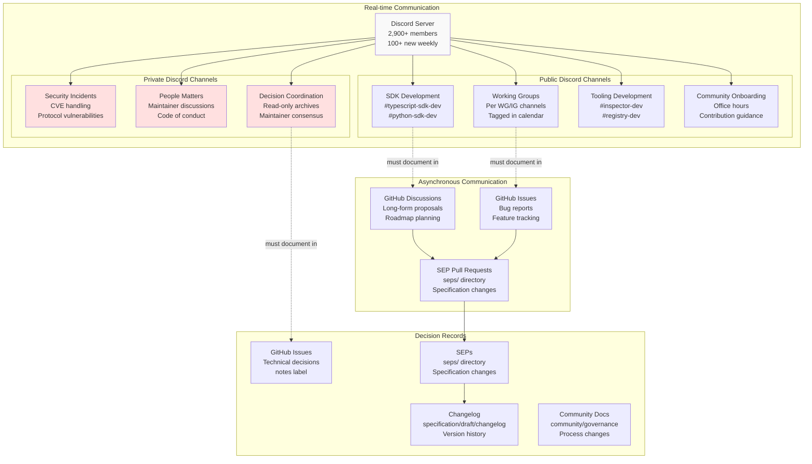
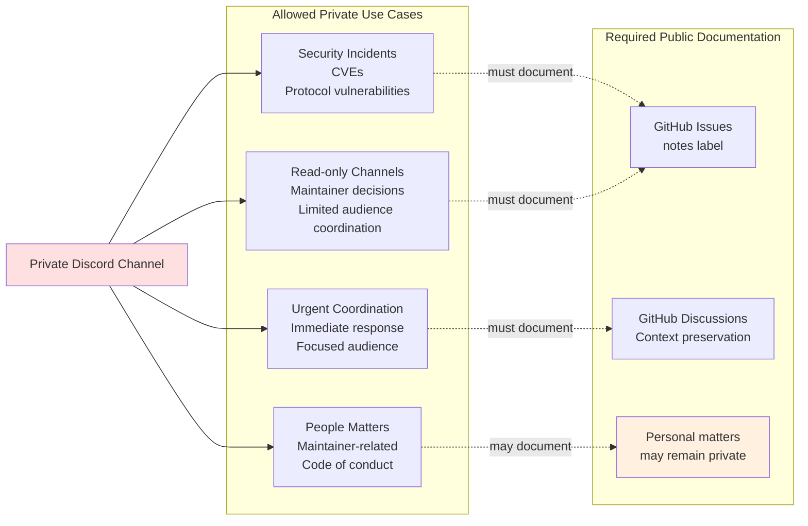
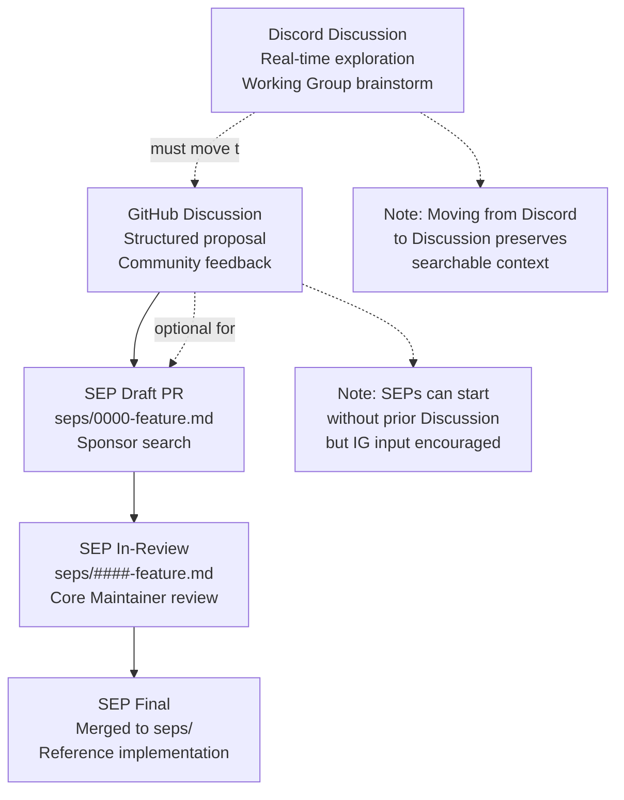

This document describes the communication infrastructure for the Model Context Protocol project, including where community discussions happen, how decisions are documented, and the policies governing transparency. For governance structure and decision-making processes, see [Governance Structure](#7.1). For the SEP proposal process, see [Specification Enhancement Process](#6.2).

## Overview

The MCP project maintains four primary communication channels, each serving distinct purposes in the project lifecycle:

| Channel | Purpose | Formality | Persistence |
|---------|---------|-----------|-------------|
| Discord | Real-time contributor discussions, working group coordination | Informal | Transient |
| GitHub Discussions | Long-form proposals, community consensus-building | Semi-formal | Permanent |
| GitHub Issues | Actionable tasks, bug reports, feature tracking | Formal | Permanent |
| Security Reporting | Private vulnerability disclosure | Formal | Private |

The project serves approximately 2,900+ Discord members with 100+ new contributors joining weekly as of November 2025.

**Sources:** [docs/community/communication.mdx:1-107](), [blog/content/posts/2025-11-25-first-mcp-anniversary.md:122-123]()

## Communication Channel Architecture



**Sources:** [docs/community/communication.mdx:8-107](), [docs/community/governance.mdx:32-34]()

## Discord Server Structure

### Access and Membership

The Discord server is designed for MCP contributors, not general MCP support. Contributors access the server at `https://discord.gg/6CSzBmMkjX` (referenced as `discord-join` link).

### Public Channel Categories

Public channels follow a default-open policy for transparency:

**SDK and Tooling Development:**
- Channels named `#<sdk-name>-sdk-dev` (e.g., `#typescript-sdk-dev`, `#python-sdk-dev`)
- Channels named `#<tool-name>-dev` (e.g., `#inspector-dev`, `#registry-dev`)
- Development occurs entirely in public from ideation through release planning

**Working and Interest Groups:**
- Each WG/IG has a dedicated channel
- Channel names tagged in the public MCP community calendar at `meet.modelcontextprotocol.io`
- Meeting notes published as GitHub Issues with links in respective channels

**Community Onboarding:**
- Office hours coordination
- Contribution guidance
- New contributor onboarding

### Private Channel Policies

Private channels exist only for specific exceptions, with strict transparency requirements:



All technical and governance decisions affecting the community must be documented in GitHub Discussions or Issues, labeled with `notes`. Personal matters related to individual contributors may remain private when appropriate (e.g., personal circumstances, disciplinary actions).

**Sources:** [docs/community/communication.mdx:19-53](), [docs/community/governance.mdx:32-34]()

## GitHub Discussions

### Purpose and Use Cases

GitHub Discussions serves as the structured, long-form discussion forum for project direction and feature proposals:

| Use Case | Description | Example Labels |
|----------|-------------|----------------|
| Roadmap Planning | Project direction, milestone discussions | `roadmap`, `planning` |
| Announcements | Release communications, community updates | `announcement` |
| Consensus Building | Community polls, voting on approaches | `consensus`, `poll` |
| Feature Requests | Proposals with context and rationale | `feature-request` |

Discussions accessed at `https://github.com/modelcontextprotocol/modelcontextprotocol/discussions`.

### Relationship to SEP Process

Significant Discord discussions that lead to potential decisions or proposals must be moved to GitHub Discussions to create a persistent, searchable record. Discussions then promote to SEP pull requests as they mature:



**Sources:** [docs/community/communication.mdx:54-66](), [docs/community/sep-guidelines.mdx:41-42](), [seps/1850-pr-based-sep-workflow.md:13-31]()

## GitHub Issues

### Issue Types and Workflows

GitHub Issues handle actionable development tasks across all MCP repositories:

| Issue Type | Purpose | Labels | Assignment |
|------------|---------|--------|------------|
| Bug Report | Reproducible defects with steps | `bug` | Maintainer triages |
| Documentation | Improvements with specific scope | `docs` | Open contribution |
| CI/CD | Infrastructure, pipeline failures | `ci`, `infrastructure` | Maintainer handles |
| Release Task | Milestone tracking items | `release`, `milestone` | Maintainer coordinates |

### SEP vs Issue Distinction

SEPs are **not** submitted as GitHub Issues. The PR-based SEP workflow introduced in November 2025 (SEP-1850) requires proposals as pull requests to the `seps/` directory:

```