This document details the Model Context Protocol (MCP) connection lifecycle, including the initialization handshake, negotiation of protocol versions and capabilities, and connection termination. For information on the underlying message system, see [JSON-RPC Message System](#2.2). For details on the transport mechanisms, see [Transport Layer](#2.3).

## Lifecycle Phases

The MCP connection lifecycle is divided into three distinct phases:

1.  **Initialization**: Establishes protocol version compatibility, exchanges and negotiates capabilities, and shares implementation details.
2.  **Operation**: Normal protocol communication occurs based on the negotiated capabilities.
3.  **Shutdown**: Graceful termination of the connection.

The following diagram illustrates the high-level flow of these phases:

```mermaid
sequenceDiagram
    participant Client
    participant Server

    box "Initialization Phase"
        activate Client
        Client->>+Server: "initialize request"
        Server-->>Client: "initialize response"
        Client--)Server: "initialized notification"
    end

    box "Operation Phase"
        note over Client,Server: "Normal protocol operations"
    end

    box "Shutdown Phase"
        Client--)-Server: "Disconnect"
        deactivate Server
        note over Client,Server: "Connection closed"
    end
```

Sources: [docs/specification/draft/basic/lifecycle.mdx:16-36]()

### Initialization Handshake

The initialization phase is the first interaction between an MCP client and server. It is initiated by the client sending an `initialize` request.

#### Client's `initialize` Request

The client sends an `initialize` request to the server. This request includes:

*   The latest protocol version supported by the client.
*   The client's capabilities.
*   Information about the client's implementation.

The structure of this request is defined by the `InitializeRequest` interface [schema/draft/schema.ts:403-407]() and `InitializeRequestParams` interface [schema/draft/schema.ts:387-394]().

```json
{
  "jsonrpc": "2.0",
  "id": 1,
  "method": "initialize",
  "params": {
    "protocolVersion": "2025-11-25",
    "capabilities": {
      "roots": {
        "listChanged": true
      },
      "sampling": {},
      "elicitation": {
        "form": {},
        "url": {}
      },
      "tasks": {
        "requests": {
          "elicitation": {
            "create": {}
          },
          "sampling": {
            "createMessage": {}
          }
        }
      }
    },
    "clientInfo": {
      "name": "ExampleClient",
      "title": "Example Client Display Name",
      "version": "1.0.0",
      "description": "An example MCP client application",
      "icons": [
        {
          "src": "https://example.com/icon.png",
          "mimeType": "image/png",
          "sizes": ["48x48"]
        }
      ],
      "websiteUrl": "https://example.com"
    }
  }
}
```

Sources: [docs/specification/draft/basic/lifecycle.mdx:55-98]()

#### Server's `initialize` Response

The server responds to the `initialize` request with its own capabilities and implementation information. The structure of this response is defined by the `InitializeResultResponse` interface [schema/draft/schema.ts:440-448]() and `InitializeResult` interface [schema/draft/schema.ts:417-437]().

```json
{
  "jsonrpc": "2.0",
  "id": 1,
  "result": {
    "protocolVersion": "2025-11-25",
    "capabilities": {
      "logging": {},
      "prompts": {
        "listChanged": true
      },
      "resources": {
        "subscribe": true,
        "listChanged": true
      },
      "tools": {
        "listChanged": true
      },
      "tasks": {
        "list": {},
        "cancel": {},
        "requests": {
          "tools": {
            "call": {}
          }
        }
      }
    },
    "serverInfo": {
      "name": "ExampleServer",
      "title": "Example Server Display Name",
      "version": "1.0.0",
      "description": "An example MCP server providing tools and resources",
      "icons": [
        {
          "src": "https://example.com/server-icon.svg",
          "mimeType": "image/svg+xml",
          "sizes": ["any"]
        }
      ],
      "websiteUrl": "https://example.com/server"
    },
    "instructions": "Optional instructions for the client"
  }
}
```

Sources: [docs/specification/draft/basic/lifecycle.mdx:101-145]()

#### Client's `initialized` Notification

After receiving a successful `initialize` response, the client sends an `initialized` notification to indicate it is ready for normal operations. This notification is defined by the `InitializedNotification` interface [schema/draft/schema.ts:458-461]().

```json
{
  "jsonrpc": "2.0",
  "method": "notifications/initialized"
}
```

Sources: [docs/specification/draft/basic/lifecycle.mdx:148-151]()

During the initialization phase:

*   The client SHOULD NOT send requests other than `ping` requests before the server has responded to the `initialize` request.
*   The server SHOULD NOT send requests other than `ping` and `logging` requests before receiving the `initialized` notification.

Sources: [docs/specification/draft/basic/lifecycle.mdx:159-166]()

### Protocol Version Negotiation

The `protocolVersion` field in the `initialize` request and response facilitates version negotiation.

*   The client MUST send the latest protocol version it supports in the `initialize` request.
*   If the server supports the requested version, it MUST respond with the same version.
*   If the server does not support the requested version, it MUST respond with another protocol version it supports, preferably the latest one.
*   If the client does not support the version specified in the server's response, it SHOULD disconnect.

Sources: [docs/specification/draft/basic/lifecycle.mdx:167-178]()

For HTTP-based transports, the negotiated protocol version MUST be included in the `MCP-Protocol-Version` HTTP header on all subsequent requests. For more details, see [Protocol Version Header](#2.3).

### Capability Negotiation

Client and server capabilities define which optional protocol features are available during the session. These capabilities are exchanged within the `capabilities` field of the `initialize` request and response.

The `ClientCapabilities` interface [schema/draft/schema.ts:466-567]() and `ServerCapabilities` interface [schema/draft/schema.ts:573-684]() define the structure of these capabilities.

The following table summarizes key capabilities:

| Category | Capability     | Description                                                                                                                                                                                                                                                                                                                                                                                                                                                                                                                                                                                                                                                                                                                                                                                                                                                                                                                                                                                                                                                                                                                                                                                                                                                                                                                                                                                                                                                                                                                                                                                                                                                                                                                                                                                                                                                                                                                                                                                                                                                                                                                                                                                                                                                                                                                                                                                                                                                                                                                                                                                                                                                                                                                                                                                                                                                                                                                                                                                                                                                                                                                                                                                                                                                                                                                                                                                                                                                                                                                                                                                                                                                                                                                                                                                                                                                                                                                                                                                                                                                                                                                                                                                                                                                                                                                                                                                                                                                                                                                                                                                                                                                                                                                                                                                                                                                                                                                                                                                                                                                                                                                                                                                                                                                                                                                                                                                                                                                                                                                                                                                                                                                                                                                                                                                                                                                                                                                                                                                                                                                                                                                                                                                                                                                                                                                                                                                                                                                                                                                                                                                                                                                                                                                                                                                                                                                                                                                                                                                                                                                                                                                                                                                                                                                                                                                                                                                                                                                                                                                                                                                                                                                                                                                                                                                                                                                                                                                                                                                                                                                                                                                                                                                                                                                                                                                                                                                                                                                                                                                                                                                                                                                                                                                                                                                                                                                                                                                                                                                                                                                                                                                                                                                                                                                                                                                                                                                                                                                                                                                                                                                                                                                                                                                                                                                                                                                                                                                                                                                                                                                                                                                                                                                                                                                                                                                                                                                                                                                                                                                                                                                                                                                                                                                                                                                                                                                                                                                                                                                                                                                                                                                                                                                                                                                                                                                                                                                                                                                                                                                                                                                                                                                                                                                                                                                                                                                                                                                                                                                                                                                                                                                                                                                                                                                                                                                                                                                                                                                                                                                                                                                                                                                                                                                                                                                                                                                                                                                                                                                                                                                                                                                                                                                                                                                                                                                                                                                                                                                                                                                                                                                                                                                                                                                                                                                                                                                                                                                                                                                                                                                                                                                                                                                                                                                                                                                                                                                                                                                                                                                                                                                                                                                                                                                                                                                                                                                                                                                                                                                                                                                                                                                                                                                                                                                                                                                                                                                                                                                                                                                                                                                                                                                                                                                                                                                                                                                                                                                                                                                                                                                                                                                                                                                                                                                                                                                                                                                                                                                                                                                                                                                                                                                                                                                                                                                                                                                                                                                                                                                                                                                                                                                                                                                                                                                                                                                                                                                                                                                                                                                                                                                                                                                                                                                                                                                                                                                                                                                                                                                                                                                                                                                                                                                                                                                                                                                                                                                                                                                                                                                                                                                                                                                                                                                                                                                                                                                                                                                                                                                                                                                                                                                                                                                                                                                                                                                                                                                                                                                                                                                                                                                                                                                                                                                                                                                                                                                                                                                                                                                                                                                                                                                                                                                                                                                                                                                                                                                                                                                                                                                                                                                                                                                                                                                                                                                                                                                                                                                                                                                                                                                                                                                                                                                                                                                                                                                                                                                                                                                                                                                                                                                                                                                                                                                                                                                                                                                                                                                                                                                                                                                                                                                                                                                                                                                                                                                                                                                                                                                                                                                                                                                                                                                                                                                                                                                                                                                                                                                                                                                                                                                                                                                                                                                                                                                                                                                                                                                                                                                                                                                                                                                                                                                                                                                                                                                                                                                                                                                                                                                                                                                                                                                                                                                                                                                                                                                                                                                                                                                                                                                                                                                                                                                                                                                                                                                                                                                                                                                                                                                                                                                                                                                                                                                                                                                                                                                                                                                                                                                                                                                                                                                                                                                                                                                                                                                                                                                                                                                                                                                                                                                                                                                                                                                                                                                                                                                                                                                                                                                                                                                                                                                                                                                                                                                                                                                                                                                                                                                                                                                                                                                                                                                                                                                                                                                                                                                                                                                                                                                                                                                                                                                                                                                                                                                                                                                                                                                                                                                                                                                                                                                                                                                                                                                                                                                                                                                                                                                                                                                                                                                                                                                                                                                                                                                                                                                                                                                                                                                                                                                                                                                                                                                                                                                                                                                                                                                                                                                                                                                                                                                                                                                                                                                                                                                                                                                                                                                                                                                                                                                                                                                                                                                                                                                                                                                                                                                                                                                                                                                                                                                                                                                                                                                                                                                                                                                                                                                                                                                                                                                                                                                                                                                                                                                                                                                                                                                                                                                                                                                                                                                                                                                                                                                                                                                                                                                                                                                                                                                                                                                                                                                                                                                                                                                                                                                                                                                                                                                                                                                                                                                                                                                                                                                                                                                                                                                                                                                                                                                                                                                                                                                                                                                                                                                                                                                                                                                                                                                                                                                                                                                                                                                                                                                                                                                                                                                                                                                                                                                                                                                                                                                                                                                                                                                                                                                                                                                                                                                                                                                                                                                                                                                                                                                                                                                                                                                                                                                                                                                                                                                                                                                                                                                                                                                                                                                                                                                                                                                                                                                                                                                                                                                                                                                                                                                                                                                                                                                                                                                                                                                                                                                                                                                                                                                                                                                                                                                                                                                                                                                                                                                                                                                                                                                                                                                                                                                                                                                                                                                                                                                                                                                                                                                                                                                                                                                                                                                                                                                                                                                                                                                                                                                                                                                                                                                                                                                                                                                                                                                                                                                                                                                                                                                                                                                                                                                                                                                                                                                                                                                                                                                                                                                                                                                                                                                                                                                                                                                                                                                                                                                                                                                                                                                                                                                                                                                                                                                                                                                                                                                                                                                                                                                                                                                                                                                                                                                                                                                                                                                                                                                                                                                                                                                                                                                                                                                                                                                                                                                                                                                                                                                                                                                                                                                                                                                                                                                                                                                                                                                                                                                                                                                                                                                                                                                                                                                                                                                                                                                                                                                                                                                                                                                                                                                                                                                                                                                                                                                                                                                                                                                                                                                                                                                                                                                                                                                                                                                                                                                                                                                                                                                                                                                                                                                                                                                                                                                                                                                                                                                                                                                                                                                                                                                                                                                                                                                                                                                                                                                                                                                                                                                                                                                                                                                                                                                                                                                                                                                                                                                                                                                                                                                                                                                                                                                                                                                                                                                                                                                                                                                                                                                                                                                                                                                                                                                                                                                                                                                                                                                                                                                                                                                                                                                                                                                                                                                                                                                                                                                                                                                                                                                                                                                                                                                                                                                                                                                                                                                                                                                                                                                                                                                                                                                                                                                                                                                                                                                                                                                                                                                                                                                                                                                                                                                                                                                                                                                                                                                                                                                                                                                                                                                                                                                                                                                                                                                                                                                                                                                                                                                                                                                                                                                                                                                                                                                                                                                                                                                                                                                                                                                                                                                                                                                                                                                                                                                                                                                                                                                                                                                                                                                                                                                                                                                                                                                                                                                                                                                                                                                                                                                                                                                                                                                                                                                                                                                                                                                                                                                                                                                                                                                                                                                                                                                                                                                                                                                                                                                                                                                                                                                                                                                                                                                                                                                                                                                                                                                                                                                                                                                                                                                                                                                                                                                                                                                                                                                                                                                                                                                                                                                                                                                                                                                                                                                                                                                                                                                                                                                                                                                                                                                                                                                                                                                                                                                                                                                                                                                                                                                                                                                                                                                                                                                                                                                                                                                                                                                                                                                                                                                                                                                                                                                                                                                                                                                                                                                                                                                                                                                                                                                                                                                                                                                                                                                                                                                                                                                                                                                                                                                                                                                                                                                                                                                                                                                                                                                                                                                                                                                                                                                                                                                                                                                                                                                                                                                                                                                                                                                                                                                                                                                                                                                                                                                                                                                                                                                                                                                                                                                                                                                                                                                                                                                                                                                                                                                                                                                                                                                                                                                                                                                                                                                                                                                                                                                                                                                                                                                                                                                                                                                                                                                                                                                                                                                                                                                                                                                                                                                                                                                                                                                                                                                                                                                                                                                                                                                                                                                                                                                                                                                                                                                                                                                                                                                                                                                                                                                                                                                                                                                                                                                                                                                                                                                                                                                                                                                                                                                                                                                                                                                                                                                                                                                                                                                                                                                                                                                                                                                                                                                                                                                                                                                                                                                                                                                                                                                                                                                                                                                                                                                                                                                                                                                                                                                                                                                                                                                                                                                                                                                                                                                                                                                                                                                                                                                                                                                                                                                                                                                                                                                                                                                                                                                                                                                                                                                                                                                                                                                                                                                                                                                                                                                                                                                                                                                                                                                                                                                                                                                                                                                                                                                                                                                                                                                                                                                                                                                                                                                                                                                                                                                                                                                                                                                                                                                                                                                                                                                                                                                                                                                                                                                                                                                                                                                                                                                                                                                                                                                                                                                                                                                                                                                                                                                                                                                                                                                                                                                                                                                                                                                                                                                                                                                                                                                                                                                                                                                                                                                                                                                                                                                                                                                                                                                                                                                                                                                                                                                                                                                                                                                                                                                                                                                                                                                                                                                                                                                                                                                                                                                                                                                                                                                                                                                                                                                                                                                                                                                                                                                                                                                                                                                                                                                                                                                                                                                                                                                                                                                                                                                                                                                                                                                                                                                                                                                                                                                                                                                                                                                                                                                                                                                                                                                                                                                                                                                                                                                                                                                                                                                                                                                                                                                                                                                                                                                                                                                                                                                                                                                                                                                                                                                                                                                                                                                                                                                                                                                                                                                                                                                                                                                                                                                                                                                                                                                                                                                                                                                                                                                                                                                                                                                                                                                                                                                                                                                                                                                                                                                                                                                                                                                                                                                                                                                                                                                                                                                                                                                                                                                                                                                                                                                                                                                                                                                                                                                                                                                                                                                                                                                                                                                                                                                                                                                                                                                                                                                                                                                                                                                                                                                                                                                                                                                                                                                                                                                                                                                                                                                                                                                                                                                                                                                                                                                                                                                                                                                                                                                                                                                                                                                                                                                                                                                                                                                                                                                                                                                                                                                                                                                                                                                                                                                                                                                                                                                                                                                                                                                                                                                                                                                                                                                                                                                                                                                                                                                                                                                                                                                                                                                                                                                                                                                                                                                                                                                                                                                                                                                                                                                                                                                                                                                                                                                                                                                                                                                                                                                                                                                                                                                                                                                                                                                                                                                                                                                                                                                                                                                                                                                                                                                                                                                                                                                                                                                                                                                                                                                                                                                                                                                                                                                                                                                                                                                                                                                                                                                                                                                                                                                                                                                                                                                                                                                                                                                                                                                                                                                                                                                                                                                                                                                                                                                                                                                                                                                                                                                                                                                                                                                                                                                                                                                                                                                                                                                                                                                                                                                                                                                                                                                                                                                                                                                                                                                                                                                                                                                                                                                                                                                                                                                                                                                                                                                                                                                                                                                                                                                                                                                                                                                                                                                                                                                                                                                                                                                                                                                                                                                                                                                                                                                                                                                                                                                                                                                                                                                                                                                                                                                                                                                                                                                                                                                                                                                                                                                                                                                                                                                                                                                                                                                                                                                                                                                                                                                                                                                                                                                                                                                                                                                                                                                                                                                                                                                                                                                                                                                                                                                                                                                                                                                                                                                                                                                                                                                                                                                                                                                                                                                                                                                                                                                                                                                                                                                                                                                                                                                                                                                                                                                                                                                                                                                                                                                                                                                                                                                                                                                                                                                                                                                                                                                                                                                                                                                                                                                                                                                                                                                                                                                                                                                                                                                                                                                                                                                                                                                                                                                                                                                                                                                                                                                                                                                                                                                                                                                                                                                                                                                                                                                                                                                                                                                                                                                                                                                                                                                                                                                                                                                                                                                                                                                                                                                                                                                                                                                                                                                                                                                                                                                                                                                                                                                                                                                                                                                                                                                                                                                                                                                                                                                                                                                                                                                                                                                                                                                                                                                                                                                                                                                                                                                                                                                                                                                                                                                                                                                                                                                                                                                                                                                                                                                                                                                                                                                                                                                                                                                                                                                                                                                                                                                                                                                                                                                                                                                                                                                                                                                                                                                                                                                                                                                                                                                                                                                                                                                                                                                                                                                                                                                                                                                                                                                                                                                                                                                                                                                                                                                                                                                                                                                                                                                                                                                                                                                                                                                                                                                                                                                                                                                                                                                                                                                         | Client   | `experimental` | Describes support for non-standard experimental features                                 |
| Server   | `prompts`      | Offers [prompt templates](#2.5)                                                          |
| Server   | `resources`    | Provides readable [resources](#2.5)                                                      |
| Server   | `tools`        | Exposes callable [tools](#2.5)                                                           |
| Server   | `logging`      | Emits structured [log messages](/docs/specification/draft/server/utilities/logging)      |
| Server   | `completions`  | Supports argument [autocompletion](/docs/specification/draft/server/utilities/completion) |
| Server   | `tasks`        | Support for [task-augmented](/docs/specification/draft/basic/utilities/tasks) server requests |
| Server   | `extensions`   | Support for optional [extensions](/docs/extensions/overview) beyond the core protocol    |
| Server   | `experimental` | Describes support for non-standard experimental features                                 |

Sources: [docs/specification/draft/basic/lifecycle.mdx:191-208]()

Capability objects can also describe sub-capabilities, such as:

*   `listChanged`: Indicates support for list change notifications (e.g., for prompts, resources, and tools).
*   `subscribe`: Indicates support for subscribing to individual item changes (e.g., for resources).

#### Extension Negotiation

Clients and servers can negotiate support for optional extensions beyond the core protocol. Extensions are advertised in the `extensions` field of capabilities, which is a map of extension identifiers to per-extension settings objects.

Example client capabilities with extensions:

```json
{
  "capabilities": {
    "roots": {},
    "extensions": {
      "io.modelcontextprotocol/apps": {
        "mimeTypes": ["text/html;profile=mcp-app"]
      }
    }
  }
}
```

Example server capabilities with extensions:

```json
{
  "capabilities": {
    "tools": {},
    "extensions": {
      "io.modelcontextprotocol/apps": {}
    }
  }
}
```

Each extension defines the schema of its settings object; an empty object indicates support with no additional settings. If one party supports an extension but the other does not, the supporting party MUST either revert to core protocol behavior or reject the request with an appropriate error. Extensions SHOULD document their expected fallback behavior.

Sources: [docs/specification/draft/basic/lifecycle.mdx:217-251]()

### Operation Phase

During the operation phase, the client and server exchange messages according to the negotiated capabilities. Both parties MUST respect the negotiated protocol version and only use features for which capabilities have been declared.

Sources: [docs/specification/draft/basic/lifecycle.mdx:253-261]()

### Shutdown Phase

The connection can be terminated by either the client or the server. This typically involves closing the underlying transport layer.

## Cancellation

Either the client or the server can send a `notifications/cancelled` notification to indicate that a previously issued request is being cancelled. This notification is defined by the `CancelledNotification` interface [schema/draft/schema.ts:373-376]() and `CancelledNotificationParams` interface [schema/draft/schema.ts:339-354]().

```json
{
  "jsonrpc": "2.0",
  "method": "notifications/cancelled",
  "params": {
    "requestId": 123,
    "reason": "User requested cancellation"
  }
}
```

Sources: [schema/draft/schema.ts:369-371]()

Key considerations for cancellation:

*   The `requestId` in the notification MUST correspond to an ID of a request previously issued in the same direction.
*   This notification is used for cancelling non-task requests. For task cancellation, the `tasks/cancel` request is used instead.
*   A client MUST NOT attempt to cancel its `initialize` request.
*   The notification indicates that the result will be unused, and associated processing SHOULD cease.

Sources: [schema/draft/schema.ts:340-367]()

## Ping

Either the client or the server can send a `ping` request to check if the other party is still alive. The receiver MUST promptly respond with a `ping` result, or else the connection may be disconnected.

The `PingRequest` interface [schema/draft/schema.ts:809-813]() defines the ping request, and `PingResultResponse` interface [schema/draft/schema.ts:822-826]() defines the response.

```json
{
  "jsonrpc": "2.0",
  "id": 1,
  "method": "ping"
}
```

Sources: [schema/draft/schema.ts:805-807]()

```json
{
  "jsonrpc": "2.0",
  "id": 1,
  "result": {}
}
```

Sources: [schema/draft/schema.ts:817-819]()

## Progress Notifications

The protocol supports out-of-band progress notifications for long-running requests. If a caller requests progress notifications by including a `progressToken` in the `_meta` field of a request, the receiver MAY send `notifications/progress` notifications.

The `ProgressNotification` interface [schema/draft/schema.ts:867-870]() and `ProgressNotificationParams` interface [schema/draft/schema.ts:836-856]() define these notifications.

```json
{
  "jsonrpc": "2.0",
  "method": "notifications/progress",
  "params": {
    "progressToken": "my-progress-token",
    "progress": 50,
    "total": 100,
    "message": "Processing data..."
  }
}
```

Sources: [schema/draft/schema.ts:863-865]()

The `progressToken` from the initial request is used to associate the notification with the ongoing request.

Sources: [schema/draft/schema.ts:837-839]()

## Task System

The Model Context Protocol allows requests to be augmented with tasks, providing a mechanism for long-running operations, polling, and deferred result retrieval. Tasks are uniquely identified by a `taskId`. For a detailed explanation of the task system, refer to [Tasks](/docs/specification/draft/basic/utilities/tasks).

### Task Capabilities

Both clients and servers declare their support for tasks and specific task-augmented operations during initialization.

#### Server Task Capabilities

Servers declare support for tasks via the `ServerCapabilities.tasks` object [schema/draft/schema.ts:648-674]().

| Capability                      | Description                                          |
| :------------------------------ | :--------------------------------------------------- |
| `tasks.list`                    | Server supports the `tasks/list` operation           |
| `tasks.cancel`                  | Server supports the `tasks/cancel` operation         |
| `tasks.requests.tools.call`     | Server supports task-augmented `tools/call` requests |

Sources: [docs/specification/draft/basic/utilities/tasks.mdx:43-48]()

```json
{
  "capabilities": {
    "tasks": {
      "list": {},
      "cancel": {},
      "requests": {
        "tools": {
          "call": {}
        }
      }
    }
  }
}
```

Sources: [docs/specification/draft/basic/utilities/tasks.mdx:49-63]()

#### Client Task Capabilities

Clients declare support for tasks via the `ClientCapabilities.tasks` object [schema/draft/schema.ts:523-560]().

| Capability                              | Description                                                      |
| :-------------------------------------- | :--------------------------------------------------------------- |
| `tasks.list`                            | Client supports the `tasks/list` operation                       |
| `tasks.cancel`                          | Client supports the `tasks/cancel` operation                     |
| `tasks.requests.sampling.createMessage` | Client supports task-augmented `sampling/createMessage` requests |
| `tasks.requests.elicitation.create`     | Client supports task-augmented `elicitation/create` requests     |

Sources: [docs/specification/draft/basic/utilities/tasks.mdx:69-74]()

```json
{
  "capabilities": {
    "tasks": {
      "list": {},
      "cancel": {},
      "requests": {
        "sampling": {
          "createMessage": {}
        },
        "elicitation": {
          "create": {}
        }
      }
    }
  }
}
```

Sources: [docs/specification/draft/basic/utilities/tasks.mdx:76-92]()

### Task Lifecycle Diagram

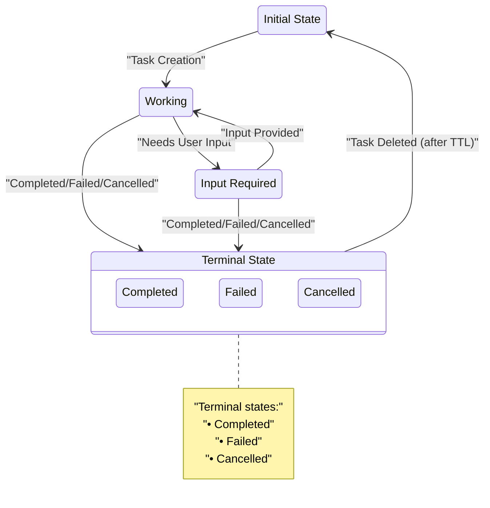
```mermaid
stateDiagram-v2
    state "Initial State" as InitialState
    state "Working" as Working
    state "Input Required" as InputRequired
    state "Terminal State" as TerminalState

    InitialState --> Working: "Task Creation"
    Working --> InputRequired: "Needs User Input"
    Working --> TerminalState: "Completed/Failed/Cancelled"
    InputRequired --> Working: "Input Provided"
    InputRequired --> TerminalState: "Completed/Failed/Cancelled"
    TerminalState --> InitialState: "Task Deleted (after TTL)"

    state TerminalState {
        state "Completed" as Completed
        state "Failed" as Failed
        state "Cancelled" as Cancelled
    }

    note right of TerminalState
        "Terminal states:"
        "• Completed"
        "• Failed"
        "• Cancelled"
    end note
```

Sources: [docs/specification/draft/basic/utilities/tasks.mdx:413-431]()

# Server Features


This document details the various features and capabilities that Model Context Protocol (MCP) servers can implement. These features enable servers to provide rich contextual information and interactive functionalities to MCP clients. For information on client-side capabilities, see [Client Features](#2.6). For an overview of the core protocol, see [Architecture and Core Concepts](#2.1).

## Overview of Server Capabilities

MCP servers declare their supported features during the [Connection Lifecycle and Capabilities](#2.4) initialization phase. This negotiation ensures that both the client and server operate within a mutually understood set of functionalities.

The primary server features include:

*   **Tools**: Executable functions that allow language models to interact with external systems.
*   **Resources**: URI-addressable data that provides context to language models.
*   **Prompts**: Templates for structured messages and instructions for language models.
*   **Logging**: Mechanisms for servers to send structured log messages to clients.
*   **Completion**: Functionality for providing argument autocompletion suggestions.
*   **Tasks**: Support for long-running, asynchronous operations.

The following diagram illustrates the relationship between these server features and the core protocol layer:

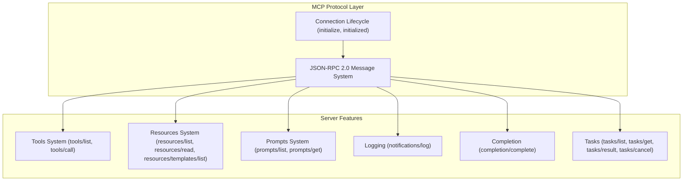
```mermaid
graph TD
    subgraph "MCP Protocol Layer"
        LIFECYCLE["Connection Lifecycle (initialize, initialized)"]
        JSONRPC["JSON-RPC 2.0 Message System"]
    end

    subgraph "Server Features"
        TOOLS["Tools System (tools/list, tools/call)"]
        RESOURCES["Resources System (resources/list, resources/read, resources/templates/list)"]
        PROMPTS["Prompts System (prompts/list, prompts/get)"]
        LOGGING["Logging (notifications/log)"]
        COMPLETION["Completion (completion/complete)"]
        TASKS["Tasks (tasks/list, tasks/get, tasks/result, tasks/cancel)"]
    end

    LIFECYCLE --> JSONRPC
    JSONRPC --> TOOLS
    JSONRPC --> RESOURCES
    JSONRPC --> PROMPTS
    JSONRPC --> LOGGING
    JSONRPC --> COMPLETION
    JSONRPC --> TASKS
```
Sources:
- schema/draft/schema.ts
- docs/specification/draft/basic/lifecycle.mdx
- docs/specification/draft/server/tools.mdx
- docs/specification/draft/server/resources.mdx
- docs/specification/draft/server/prompts.mdx
- docs/specification/draft/basic/utilities/tasks.mdx

## Tools System

The Tools system allows MCP servers to expose executable functions that can be invoked by language models. This enables models to interact with external systems, perform computations, or query data.

### User Interaction Model

Tools are designed to be **model-controlled**. This means that a language model can discover available tools and invoke them automatically based on its understanding of the context and user prompts. However, client applications are encouraged to implement a "human-in-the-loop" mechanism, such as presenting confirmation prompts to the user before executing sensitive operations.

### Capabilities

Servers supporting tools **MUST** declare the `tools` capability during initialization [docs/specification/draft/server/tools.mdx](). The `listChanged` sub-capability indicates whether the server will send notifications when the list of available tools changes.

```json
{
  "capabilities": {
    "tools": {
      "listChanged": true
    }
  }
}
```

### Protocol Messages

#### Listing Tools

Clients discover available tools by sending a `tools/list` request. This operation supports [pagination](#2.5.7).

*   **Request**: `tools/list` ([schema/draft/schema.ts:1600-1603](), `ListToolsRequest`)
*   **Response**: `ListToolsResult` ([schema/draft/schema.ts:1605-1608]()) containing an array of `Tool` objects.

#### Calling Tools

Clients invoke a tool by sending a `tools/call` request.

*   **Request**: `tools/call` ([schema/draft/schema.ts:122-146](), `CallToolRequest`) with the tool's `name` and `arguments`.
*   **Response**: `CallToolResult` ([schema/draft/schema.ts:174-199]()) containing the tool's output, which can include structured or unstructured content. The `isError` field indicates if the tool call resulted in an error.

#### List Changed Notification

If the `listChanged` capability is enabled, the server **SHOULD** send a `notifications/tools/list_changed` notification when the list of available tools changes.

*   **Notification**: `notifications/tools/list_changed` ([schema/draft/schema.ts:1630-1633](), `ToolListChangedNotification`)

### Data Types

*   **Tool**: Defined by `Tool` interface ([schema/draft/schema.ts:1640-1657]()). Includes `name`, `title`, `description`, `inputSchema` (JSON Schema for arguments), `outputSchema` (optional JSON Schema for results), and `icons`.
*   **Tool Result**: Defined by `CallToolResult` interface ([schema/draft/schema.ts:174-199]()). Contains `content` (array of `ContentBlock`s) and optional `structuredContent`.

### Error Handling

Tools use two error reporting mechanisms:

1.  **Protocol Errors**: Standard JSON-RPC errors (e.g., `METHOD_NOT_FOUND` for unknown tools, `INVALID_PARAMS` for malformed requests).
2.  **Tool Execution Errors**: Reported within the `CallToolResult` with `isError: true` and descriptive content. These are intended for language models to self-correct.

Sources:
- schema/draft/schema.ts
- docs/specification/draft/server/tools.mdx

## Resources System

The Resources system allows MCP servers to expose URI-addressable data to clients. This data provides context to language models, such as files, database schemas, or application-specific information.

### User Interaction Model

Resources are designed to be **application-driven**. Host applications determine how to incorporate context based on their needs, such as exposing resources through UI elements or implementing automatic context inclusion.

### Capabilities

Servers supporting resources **MUST** declare the `resources` capability during initialization [docs/specification/draft/server/resources.mdx](). This capability supports two optional features:

*   `subscribe`: Whether the client can subscribe to notifications for changes to individual resources.
*   `listChanged`: Whether the server will send notifications when the list of available resources changes.

```json
{
  "capabilities": {
    "resources": {
      "subscribe": true,
      "listChanged": true
    }
  }
}
```

### Protocol Messages

#### Listing Resources

Clients discover available resources by sending a `resources/list` request. This operation supports [pagination](#2.5.7).

*   **Request**: `resources/list` ([schema/draft/schema.ts:904-907](), `ListResourcesRequest`)
*   **Response**: `ListResourcesResult` ([schema/draft/schema.ts:910-913]()) containing an array of `Resource` objects.

#### Reading Resources

Clients retrieve the contents of a specific resource by sending a `resources/read` request.

*   **Request**: `resources/read` ([schema/draft/schema.ts:999-1002](), `ReadResourceRequest`) with the resource's `uri`.
*   **Response**: `ReadResourceResult` ([schema/draft/schema.ts:1017-1020]()) containing the resource's `contents` (text or binary data).

#### Resource Templates

Servers can expose parameterized resources using URI templates via `resources/templates/list`. Arguments for these templates may be auto-completed through the [Completion](#2.5.6) API. This operation supports [pagination](#2.5.7).

*   **Request**: `resources/templates/list` ([schema/draft/schema.ts:946-949](), `ListResourceTemplatesRequest`)
*   **Response**: `ListResourceTemplatesResult` ([schema/draft/schema.ts:960-963]()) containing an array of `ResourceTemplate` objects.

#### List Changed Notification

If the `listChanged` capability is enabled, the server **SHOULD** send a `notifications/resources/list_changed` notification when the list of available resources changes.

*   **Notification**: `notifications/resources/list_changed` ([schema/draft/schema.ts:1043-1046](), `ResourceListChangedNotification`)

#### Subscriptions

If the `subscribe` capability is enabled, clients can subscribe to individual resource changes.

*   **Subscribe Request**: `resources/subscribe` ([schema/draft/schema.ts:1067-1070](), `SubscribeRequest`) with the resource's `uri`.
*   **Update Notification**: `notifications/resources/updated` ([schema/draft/schema.ts:1118-1121](), `ResourceUpdatedNotification`) sent by the server when a subscribed resource changes.

### Data Types

*   **Resource**: Defined by `Resource` interface ([schema/draft/schema.ts:1140-1154]()). Includes `uri`, `name`, `title`, `description`, `mimeType`, `size`, and `annotations`.
*   **ResourceTemplate**: Defined by `ResourceTemplate` interface ([schema/draft/schema.ts:1160-1174]()). Includes `uriTemplate`, `name`, `title`, `description`, `mimeType`, `inputSchema`, and `annotations`.
*   **Resource Contents**: Can be `TextResourceContents` ([schema/draft/schema.ts:1180-1187]()) or `BlobResourceContents` ([schema/draft/schema.ts:75-99]()).

Sources:
- schema/draft/schema.ts
- docs/specification/draft/server/resources.mdx

## Prompts System

The Prompts system allows MCP servers to expose prompt templates to clients. These templates provide structured messages and instructions for interacting with language models.

### User Interaction Model

Prompts are designed to be **user-controlled**. They are exposed to clients with the intention that users can explicitly select and customize them for use, often through UI elements like slash commands.

### Capabilities

Servers supporting prompts **MUST** declare the `prompts` capability during initialization [docs/specification/draft/server/prompts.mdx](). The `listChanged` sub-capability indicates whether the server will send notifications when the list of available prompts changes.

```json
{
  "capabilities": {
    "prompts": {
      "listChanged": true
    }
  }
}
```

### Protocol Messages

#### Listing Prompts

Clients retrieve available prompts by sending a `prompts/list` request. This operation supports [pagination](#2.5.7).

*   **Request**: `prompts/list` ([schema/draft/schema.ts:1400-1403](), `ListPromptsRequest`)
*   **Response**: `ListPromptsResult` ([schema/draft/schema.ts:1405-1408]()) containing an array of `Prompt` objects.

#### Getting a Prompt

Clients retrieve a specific prompt, potentially with arguments, by sending a `prompts/get` request. Arguments may be auto-completed through the [Completion](#2.5.6) API.

*   **Request**: `prompts/get` ([schema/draft/schema.ts:1420-1423](), `GetPromptRequest`) with the prompt's `name` and optional `arguments`.
*   **Response**: `GetPromptResult` ([schema/draft/schema.ts:1425-1428]()) containing the prompt's `description` and `messages`.

#### List Changed Notification

If the `listChanged` capability is enabled, the server **SHOULD** send a `notifications/prompts/list_changed` notification when the list of available prompts changes.

*   **Notification**: `notifications/prompts/list_changed` ([schema/draft/schema.ts:1448-1451](), `PromptListChangedNotification`)

### Data Types

*   **Prompt**: Defined by `Prompt` interface ([schema/draft/schema.ts:1460-1470]()). Includes `name`, `title`, `description`, `arguments`, and `icons`.
*   **PromptMessage**: Defined by `PromptMessage` interface ([schema/draft/schema.ts:1476-1480]()). Contains `role` and `content` (various content types like text, image, audio, or embedded resources).

Sources:
- schema/draft/schema.ts
- docs/specification/draft/server/prompts.mdx

## Logging

The Logging feature allows MCP servers to send structured log messages to clients. This provides clients with insights into server operations, debugging information, and status updates.

### Capabilities

Servers supporting logging **MUST** declare the `logging` capability during initialization [docs/specification/draft/schema.ts:581-584]().

```json
{
  "capabilities": {
    "logging": {}
  }
}
```

### Protocol Messages

#### Log Notification

Servers send log messages to clients using the `notifications/log` notification.

*   **Notification**: `notifications/log` ([schema/draft/schema.ts:1300-1303](), `LogNotification`) with `level`, `message`, and optional `data`.

#### Setting Log Level

Clients can request the server to set its logging level using the `logging/setLevel` request.

*   **Request**: `logging/setLevel` ([schema/draft/schema.ts:1315-1318](), `SetLevelRequest`) with the desired `level`.
*   **Response**: `EmptyResult` ([schema/draft/schema.ts:330-333]()).

### Data Types

*   **LoggingLevel**: Defined by `LoggingLevel` type ([schema/draft/schema.ts:1280-1290]()). Represents the severity of a log message (e.g., "debug", "info", "error").

Sources:
- schema/draft/schema.ts

## Completion

The Completion feature allows MCP servers to provide argument autocompletion suggestions to clients. This enhances the user experience by guiding them when providing input for tools, prompts, or resource templates.

### Capabilities

Servers supporting completions **MUST** declare the `completions` capability during initialization [schema/draft/schema.ts:589-592]().

```json
{
  "capabilities": {
    "completions": {}
  }
}
```

### Protocol Messages

#### Complete Request

Clients request completion options by sending a `completion/complete` request.

*   **Request**: `completion/complete` ([schema/draft/schema.ts:548-573](), `CompleteRequest`) with the `argument` being completed and a `ref` to the tool, prompt, or resource template.
*   **Response**: `CompleteResult` ([schema/draft/schema.ts:628-661]()) containing an array of `values` (completion suggestions), `total` (total available options), and `hasMore` (if more options exist).

Sources:
- schema/draft/schema.ts

## Tasks

The Tasks system provides a mechanism for handling long-running, asynchronous operations in MCP. This allows clients to initiate an operation and retrieve its result later, without blocking the main communication channel.

### User Interaction Model

Tasks are **requestor-driven**. The party initiating the task (client or server) is responsible for augmenting requests with tasks and polling for their results. Receivers control which requests support task-based execution and manage task lifecycles.

### Capabilities

Servers supporting tasks **MUST** declare the `tasks` capability during initialization [docs/specification/draft/basic/utilities/tasks.mdx](). This capability specifies which server-side requests can be augmented with tasks and whether `tasks/list` and `tasks/cancel` operations are supported.

```json
{
  "capabilities": {
    "tasks": {
      "list": {},
      "cancel": {},
      "requests": {
        "tools": {
          "call": {}
        }
      }
    }
  }
}
```

### Protocol Messages

#### Creating Tasks

To create a task, a requestor sends a request with the `task` field included in the request parameters. The server immediately responds with a `CreateTaskResult`.

*   **Request**: Any request with `task` field in its parameters (e.g., `tools/call` with `TaskAugmentedRequestParams` [schema/draft/schema.ts:71-81]()).
*   **Response**: `CreateTaskResult` ([schema/draft/schema.ts:2000-2003]()) containing `taskId`, `status`, `createdAt`, `lastUpdatedAt`, `ttl`, and `pollInterval`.

#### Getting Tasks

Requestors poll for task completion by sending `tasks/get` requests.

*   **Request**: `tasks/get` ([schema/draft/schema.ts:2015-2018](), `GetTaskRequest`) with the `taskId`.
*   **Response**: `GetTaskResult` ([schema/draft/schema.ts:2020-2023]()) containing the current `Task` state.

#### Retrieving Task Results

After a task completes, its operation result is retrieved via `tasks/result`.

*   **Request**: `tasks/result` ([schema/draft/schema.ts:2035-2038](), `GetTaskPayloadRequest`) with the `taskId`.
*   **Response**: `GetTaskPayloadResult` ([schema/draft/schema.ts:2040-2043]()) containing the actual result of the original operation.

#### Task Status Notification

Receivers **MAY** send `notifications/tasks/status` notifications when a task's status changes.

*   **Notification**: `notifications/tasks/status` ([schema/draft/schema.ts:2055-2058](), `TaskStatusNotification`) with the full `Task` object.

#### Listing Tasks

Requestors can retrieve a list of tasks by sending a `tasks/list` request. This operation supports [pagination](#2.5.7).

*   **Request**: `tasks/list` ([schema/draft/schema.ts:2070-2073](), `ListTasksRequest`)
*   **Response**: `ListTasksResult` ([schema/draft/schema.ts:2075-2078]()) containing an array of `Task` objects.

#### Cancelling Tasks

Requestors can explicitly cancel a task by sending a `tasks/cancel` request.

*   **Request**: `tasks/cancel` ([schema/draft/schema.ts:232-247](), `CancelTaskRequest`) with the `taskId`.
*   **Response**: `CancelTaskResult` ([schema/draft/schema.ts:258-267]()) containing the updated `Task` state (status `cancelled`).

### Data Types

*   **Task**: Defined by `Task` interface ([schema/draft/schema.ts:1960-1970]()). Includes `taskId`, `status`, `statusMessage`, `createdAt`, `lastUpdatedAt`, `ttl`, and `pollInterval`.
*   **TaskStatus**: Defined by `TaskStatus` type ([schema/draft/schema.ts:1976-1982]()). Represents the current state of a task (e.g., "working", "completed", "failed", "cancelled", "input\_required").

### Task Status State Diagram

The lifecycle of a task is governed by specific state transitions:

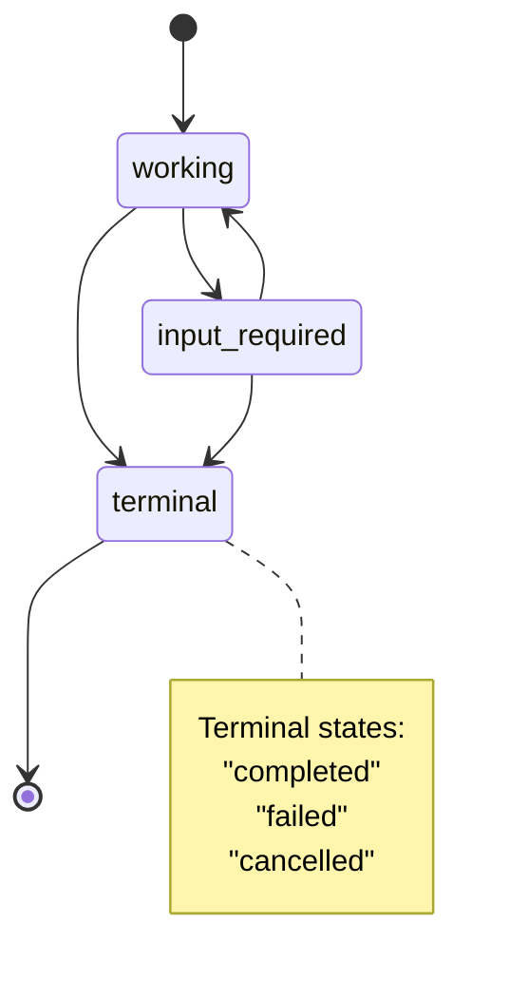
```mermaid
stateDiagram-v2
    [*] --> working

    working --> input_required
    working --> terminal

    input_required --> working
    input_required --> terminal

    terminal --> [*]

    note right of terminal
        Terminal states:
        "completed"
        "failed"
        "cancelled"
    end note
```

Sources:
- schema/draft/schema.ts
- docs/specification/draft/basic/utilities/tasks.mdx

## Pagination

Several server features, such as listing tools, resources, and prompts, support pagination to handle large result sets efficiently.

### Common Parameters

Paginated requests include an optional `cursor` parameter.

*   **Request Parameter**: `cursor` ([schema/draft/schema.ts:883-886](), `Cursor`)
    *   An opaque token representing the current pagination position. If provided, the server returns results starting after this cursor.

### Common Results

Paginated responses include an optional `nextCursor` field.

*   **Result Field**: `nextCursor` ([schema/draft/schema.ts:899-902](), `Cursor`)
    *   An opaque token representing the pagination position after the last returned result. If present, there may be more results available.

### Behavior Requirements

*   Servers **SHOULD** use cursor-based pagination to limit the number of items returned.
*   Servers **MUST** include a `nextCursor` in the response if more items are available.
*   Requestors **MUST** treat cursors as opaque tokens and not attempt to parse or modify them.

Sources:
- schema/draft/schema.ts

# Client Features


## Purpose and Scope

This document covers the capabilities that MCP **clients** expose to **servers**, enabling servers to request operations that require client resources or user interaction. These features are distinct from server features ([2.5](#2.5)), which servers expose to clients.

Client features include:
- **Sampling**: LLM completions/generations requested by servers
- **Elicitation**: User input collection through forms or external URLs
- **Roots**: Filesystem boundary declarations for context scoping
- **Logging**: Server log message routing to client handlers

All client features follow a capability-based security model where clients explicitly declare support during initialization and maintain control over execution with human-in-the-loop approval workflows.

Sources: [docs/specification/draft/client/sampling.mdx:1-37](), [docs/specification/draft/client/elicitation.mdx:1-42](), [schema/draft/schema.ts:302-377]()

## Client Capability Declaration

Clients declare which features they support in the `ClientCapabilities` interface during the initialization handshake. The server receives this declaration in the `initialize` request and adjusts its behavior accordingly.

### ClientCapabilities Structure

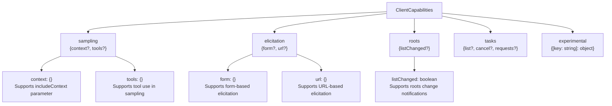
```mermaid
graph TB
    ClientCaps["ClientCapabilities"]
    
    Sampling["sampling<br/>{context?, tools?}"]
    Elicitation["elicitation<br/>{form?, url?}"]
    Roots["roots<br/>{listChanged?}"]
    Tasks["tasks<br/>{list?, cancel?, requests?}"]
    Experimental["experimental<br/>{[key: string]: object}"]
    
    ClientCaps --> Sampling
    ClientCaps --> Elicitation
    ClientCaps --> Roots
    ClientCaps --> Tasks
    ClientCaps --> Experimental
    
    SamplingContext["context: {}<br/>Supports includeContext parameter"]
    SamplingTools["tools: {}<br/>Supports tool use in sampling"]
    
    Sampling --> SamplingContext
    Sampling --> SamplingTools
    
    ElicitForm["form: {}<br/>Supports form-based elicitation"]
    ElicitURL["url: {}<br/>Supports URL-based elicitation"]
    
    Elicitation --> ElicitForm
    Elicitation --> ElicitURL
    
    RootsChanged["listChanged: boolean<br/>Supports roots change notifications"]
    
    Roots --> RootsChanged
```

Sources: [schema/draft/schema.ts:302-377](), [schema/draft/schema.json:302-407]()

### Example Capability Declaration

**Client declaring sampling with tool support:**
```json
{
  "capabilities": {
    "sampling": {
      "tools": {}
    },
    "elicitation": {
      "form": {},
      "url": {}
    },
    "roots": {
      "listChanged": true
    }
  }
}
```

Servers **MUST NOT** send requests for features that clients have not declared support for. For example, a server cannot send `sampling/createMessage` requests with `tools` unless the client declares `sampling.tools` capability.

Sources: [docs/specification/draft/client/sampling.mdx:46-82](), [docs/specification/draft/client/elicitation.mdx:44-73]()

## Sampling

Sampling enables servers to request LLM completions from the client's language model. This allows servers to implement agentic behaviors where LLM calls occur nested inside other MCP operations, while clients maintain full control over model selection, access, and user approval.

### Protocol Flow

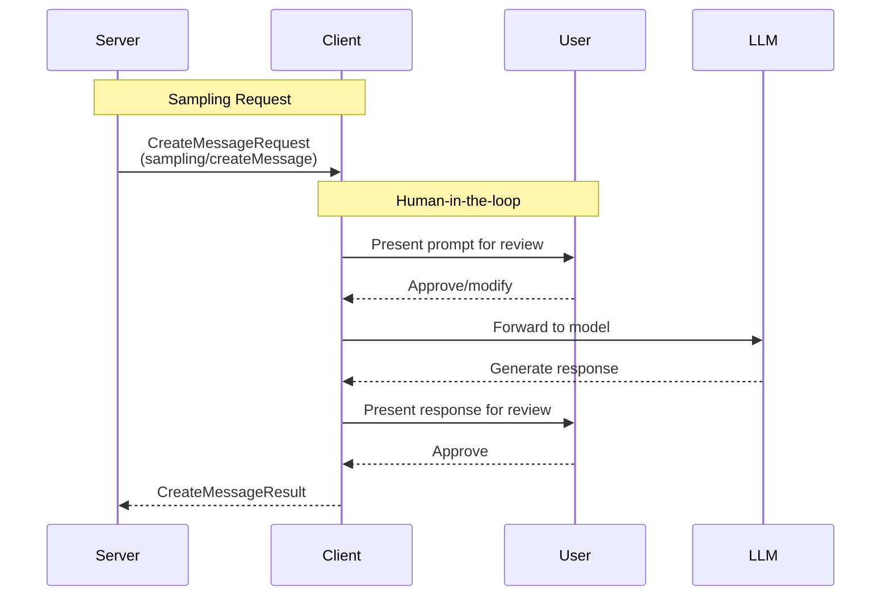
```mermaid
sequenceDiagram
    participant Server
    participant Client
    participant User
    participant LLM

    Note over Server,Client: Sampling Request
    Server->>Client: CreateMessageRequest<br/>(sampling/createMessage)
    
    Note over Client,User: Human-in-the-loop
    Client->>User: Present prompt for review
    User-->>Client: Approve/modify
    
    Client->>LLM: Forward to model
    LLM-->>Client: Generate response
    
    Client->>User: Present response for review
    User-->>Client: Approve
    
    Client-->>Server: CreateMessageResult
```

Sources: [docs/specification/draft/client/sampling.mdx:1-145]()

### CreateMessageRequest Structure

The `CreateMessageRequest` message type defines the sampling request protocol.

**Key fields:**
- `method`: `"sampling/createMessage"`
- `params.messages`: Array of `SamplingMessage` objects containing conversation history
- `params.modelPreferences`: Optional hints for model selection
- `params.systemPrompt`: Optional system prompt
- `params.maxTokens`: Token limit
- `params.tools`: Optional array of tool definitions for agentic sampling
- `params.toolChoice`: Optional tool selection strategy
- `params.includeContext`: Context inclusion mode (`"none"`, `"thisServer"`, `"allServers"`)

Sources: [schema/draft/schema.ts:657-731](), [docs/specification/draft/client/sampling.mdx:93-145]()

### Tools in Sampling

Servers can request that the client's LLM use tools during sampling, enabling multi-turn agentic workflows where the LLM calls tools, receives results, and continues generation.

**Tool-enabled sampling flow:**

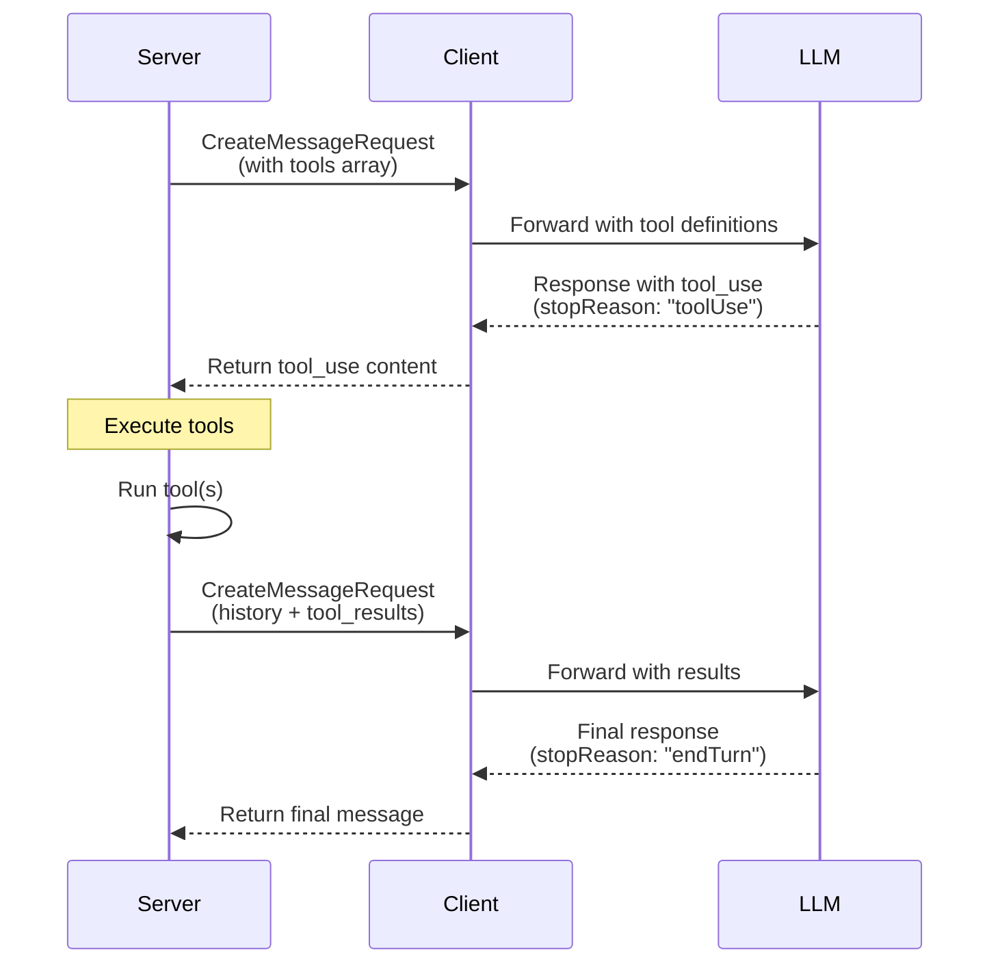
```mermaid
sequenceDiagram
    participant Server
    participant Client
    participant LLM

    Server->>Client: CreateMessageRequest<br/>(with tools array)
    Client->>LLM: Forward with tool definitions
    LLM-->>Client: Response with tool_use<br/>(stopReason: "toolUse")
    Client-->>Server: Return tool_use content
    
    Note over Server: Execute tools
    Server->>Server: Run tool(s)
    
    Server->>Client: CreateMessageRequest<br/>(history + tool_results)
    Client->>LLM: Forward with results
    LLM-->>Client: Final response<br/>(stopReason: "endTurn")
    Client-->>Server: Return final message
```

**Tool definition structure:**
```typescript
{
  "name": "tool_name",
  "description": "Tool description",
  "inputSchema": { /* JSON Schema */ }
}
```

Clients **MUST** declare `sampling.tools` capability to receive tool-enabled requests.

Sources: [docs/specification/draft/client/sampling.mdx:38-264](), [schema/draft/schema.ts:1186-1222]()

### Security and Approval

For trust and safety, there **SHOULD** always be a human in the loop with the ability to deny sampling requests. Implementations **SHOULD**:

- Provide UI for reviewing sampling requests before execution
- Allow users to view and edit prompts
- Present generated responses for review before delivery to server
- Clearly indicate which server is requesting the sampling

Sources: [docs/specification/draft/client/sampling.mdx:16-36]()

## Elicitation

Elicitation enables servers to request additional information from users through the client. It supports two distinct modes with different security characteristics:

- **Form mode**: Structured data collection with optional JSON Schema validation (data visible to client)
- **URL mode**: Out-of-band interactions via external URLs (data **not** visible to client)

### Elicitation Mode Comparison

| Aspect | Form Mode | URL Mode |
|--------|-----------|----------|
| **Data visibility** | Client sees and handles data | Client only sees URL, not data |
| **Use case** | Non-sensitive structured data | Credentials, OAuth, payments |
| **Schema validation** | JSON Schema support | N/A |
| **User experience** | In-client form UI | External browser navigation |
| **Completion notification** | Immediate in response | Optional async notification |

Sources: [docs/specification/draft/client/elicitation.mdx:1-42]()

### Form Mode Elicitation

Form mode allows servers to collect structured data directly through the MCP client with optional JSON Schema validation.

**ElicitRequest structure for form mode:**

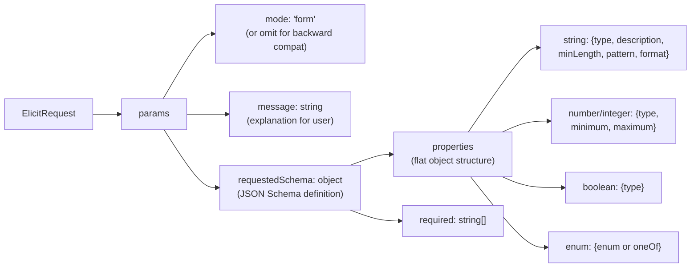
```mermaid
graph LR
    ElicitReq["ElicitRequest"]
    Params["params"]
    
    ElicitReq --> Params
    
    Mode["mode: 'form'<br/>(or omit for backward compat)"]
    Message["message: string<br/>(explanation for user)"]
    Schema["requestedSchema: object<br/>(JSON Schema definition)"]
    
    Params --> Mode
    Params --> Message
    Params --> Schema
    
    Properties["properties<br/>(flat object structure)"]
    Required["required: string[]"]
    
    Schema --> Properties
    Schema --> Required
    
    StringProp["string: {type, description,<br/>minLength, pattern, format}"]
    NumberProp["number/integer: {type,<br/>minimum, maximum}"]
    BoolProp["boolean: {type}"]
    EnumProp["enum: {enum or oneOf}"]
    
    Properties --> StringProp
    Properties --> NumberProp
    Properties --> BoolProp
    Properties --> EnumProp
```

**Form schema restrictions:**
- Flat object structure only (no nested objects)
- Primitive types only: string, number, integer, boolean
- Enum support via `enum` or `oneOf` with `const`
- Supported formats: `email`, `uri`, `date`, `date-time`

**Security requirement:** Servers **MUST NOT** use form mode to request sensitive information such as credentials. Use URL mode instead.

Sources: [docs/specification/draft/client/elicitation.mdx:74-323](), [schema/draft/schema.ts:1746-1839]()

### URL Mode Elicitation

URL mode directs users to external URLs for out-of-band interactions that must not pass through the MCP client. This is essential for auth flows, payment processing, and other sensitive operations.

**ElicitRequest structure for URL mode:**

```typescript
{
  "method": "elicitation/create",
  "params": {
    "mode": "url",
    "elicitationId": "unique-identifier",
    "url": "https://server.example.com/auth",
    "message": "Please authenticate to continue."
  }
}
```

**URL mode flow:**

```mermaid
sequenceDiagram
    participant Server
    participant Client
    participant User
    participant ExternalURL["External URL<br/>(server-controlled)"]

    Server->>Client: ElicitRequest (URL mode)<br/>with elicitationId
    
    Client->>User: Display URL and message<br/>Request navigation consent
    User-->>Client: Approve navigation
    
    Client-->>Server: ElicitResult<br/>(action: "accept")
    
    Note over User,ExternalURL: Out-of-band interaction
    User->>ExternalURL: Navigate to URL
    ExternalURL->>User: Handle auth/payment/etc
    User-->>ExternalURL: Complete interaction
    
    Note over Server: Optional notification
    Server--)Client: ElicitationCompleteNotification
```

**Key characteristics:**
- `elicitationId` uniquely identifies the elicitation session
- Response with `action: "accept"` means user consented to navigation, **not** that interaction completed
- Actual interaction occurs out-of-band
- Server **MAY** send `notifications/elicitation/complete` when interaction finishes
- Clients **MUST** clearly display target domain and gather consent before navigation

Sources: [docs/specification/draft/client/elicitation.mdx:325-513](), [schema/draft/schema.ts:1794-1863]()

### Elicitation Error Handling

When a request cannot be processed until an elicitation completes, servers return a `URLElicitationRequiredError` (error code `-32042`).

**Error structure:**
```json
{
  "code": -32042,
  "message": "URL elicitation required",
  "data": {
    "elicitations": [
      {
        "mode": "url",
        "elicitationId": "...",
        "url": "...",
        "message": "..."
      }
    ]
  }
}
```

Clients **SHOULD** automatically handle this error by presenting the elicitation request(s) to the user.

Sources: [docs/specification/draft/client/elicitation.mdx:419-513](), [schema/draft/schema.ts:182-197]()

## Roots

Roots represent filesystem boundaries that clients can expose to servers, helping scope context and define access boundaries. This feature enables servers to understand which filesystem paths are relevant to the current session.

### Protocol Messages

**ListRootsRequest:**
```typescript
{
  "method": "roots/list"
}
```

**ListRootsResult:**
```typescript
{
  "roots": [
    {
      "uri": "file:///Users/alice/project",
      "name": "My Project"
    }
  ]
}
```

**Root structure:**
- `uri`: Filesystem URI identifying the root location
- `name`: Optional human-readable name for display

Sources: [schema/draft/schema.ts:1873-1905]()

### Root Change Notifications

Clients declaring `roots.listChanged: true` capability can send `RootsListChangedNotification` when the roots list changes.

**RootsListChangedNotification:**
```typescript
{
  "method": "notifications/roots/list_changed",
  "params": {}
}
```

Servers **SHOULD** call `roots/list` again after receiving this notification to get the updated list.

Sources: [schema/draft/schema.ts:1907-1918]()

### Use Cases

Roots are commonly used to:
- Define workspace boundaries in IDE integrations
- Scope resource searches to relevant directories
- Establish trust boundaries for file access
- Provide context about project structure

From the client ecosystem data, roots are supported by:
- VS Code GitHub Copilot (full support)
- Claude Code (full support)
- Cursor, ECA, and others (partial support)

Sources: [docs/clients.mdx:14-111]()

## Logging

Logging enables servers to send log messages to clients for display, debugging, or persistence. Clients control the log level threshold and routing of messages.

### Protocol Messages

**SetLevelRequest** (Client → Server):

Clients send this request to configure the minimum log level they wish to receive.

```typescript
{
  "method": "logging/setLevel",
  "params": {
    "level": "info"  // or "debug", "notice", "warning", "error", etc.
  }
}
```

**LoggingMessageNotification** (Server → Client):

Servers send log messages as notifications.

```typescript
{
  "method": "notifications/message",
  "params": {
    "level": "info",
    "logger": "my-server",
    "data": { /* arbitrary log data */ }
  }
}
```

Sources: [schema/draft/schema.ts:2097-2145]()

### Log Levels

MCP uses syslog severity levels (RFC-5424):

| Level | Numeric Value | Description |
|-------|---------------|-------------|
| `debug` | 7 | Detailed debugging information |
| `info` | 6 | Informational messages |
| `notice` | 5 | Normal but significant conditions |
| `warning` | 4 | Warning conditions |
| `error` | 3 | Error conditions |
| `critical` | 2 | Critical conditions |
| `alert` | 1 | Action must be taken immediately |
| `emergency` | 0 | System is unusable |

Servers **MUST** respect the client's configured log level and only send messages at or above that threshold.

Sources: [schema/draft/schema.ts:2050-2077](), [docs/specification/draft/schema.mdx:61-63]()

### Capability Declaration

Servers declare logging support in `ServerCapabilities`:

```json
{
  "capabilities": {
    "logging": {}
  }
}
```

Sources: [schema/draft/schema.ts:384-455]()

## Security Model and Approval Workflows

All client features follow a defense-in-depth security model with multiple layers of protection.

### Human-in-the-Loop Requirements

**For sampling:**
- There **SHOULD** always be a human in the loop with ability to deny requests
- Users **SHOULD** review and potentially edit prompts before sending
- Users **SHOULD** review generated responses before delivery to server

**For elicitation:**
- Form mode: Users **MUST** review and can modify responses before sending
- URL mode: Users **MUST** consent to navigation and understand target domain
- Clients **MUST** provide clear decline and cancel options

Sources: [docs/specification/draft/client/sampling.mdx:25-36](), [docs/specification/draft/client/elicitation.mdx:30-42]()

### Trust Boundaries

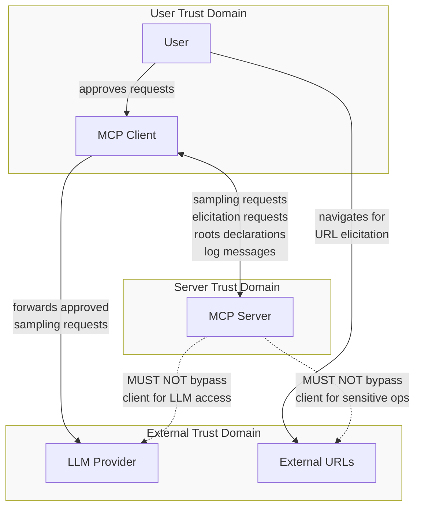
```mermaid
graph TB
    subgraph UserSpace["User Trust Domain"]
        User["User"]
        Client["MCP Client"]
    end
    
    subgraph ServerSpace["Server Trust Domain"]
        Server["MCP Server"]
    end
    
    subgraph ExternalSpace["External Trust Domain"]
        LLM["LLM Provider"]
        ExtURL["External URLs"]
    end
    
    User -->|"approves requests"| Client
    Client <-->|"sampling requests<br/>elicitation requests<br/>roots declarations<br/>log messages"| Server
    Client -->|"forwards approved<br/>sampling requests"| LLM
    User -->|"navigates for<br/>URL elicitation"| ExtURL
    
    Server -.->|"MUST NOT bypass<br/>client for sensitive ops"| ExtURL
    Server -.->|"MUST NOT bypass<br/>client for LLM access"| LLM
    
    style UserSpace fill:#f9f9f9
    style ServerSpace fill:#f9f9f9
    style ExternalSpace fill:#f9f9f9
```

**Key security principles:**

1. **Client mediation**: All sensitive operations flow through the client, not directly between server and external services
2. **Explicit capability declaration**: Servers cannot use features clients haven't declared support for
3. **User consent**: All operations requiring external interaction require explicit user approval
4. **Data minimization**: URL mode elicitation prevents clients from seeing sensitive data
5. **Clear attribution**: Users always know which server is requesting operations

Sources: [docs/specification/draft/client/sampling.mdx:16-36](), [docs/specification/draft/client/elicitation.mdx:28-42]()

### Sensitive Information Handling

**Servers MUST:**
- Use URL mode elicitation (not form mode) for credentials, API keys, and other secrets
- Never request sensitive information through sampling prompts
- Not assume approval means completion for URL mode elicitation

**Clients MUST:**
- Clearly indicate which server is making requests
- Display target domain/host for URL mode elicitation before navigation
- Provide UI for reviewing sampling requests and elicitation forms
- Not send form responses or sampling results without user approval

Sources: [docs/specification/draft/client/elicitation.mdx:30-42]()

## Client Feature Adoption

Based on the client ecosystem data, feature adoption varies significantly:

| Feature | Adoption Rate | Notable Implementations |
|---------|---------------|------------------------|
| **Sampling** | ~15% | AIQL TUUI, fast-agent, Postman, VS Code Copilot |
| **Elicitation** | ~10% | fast-agent, mcp-use, Postman, Tambo, VS Code Copilot |
| **Roots** | ~8% | Claude Code, Cursor, ECA, fast-agent, VS Code Copilot |
| **Instructions** | ~5% | Claude Code, fast-agent, Gemini CLI, VS Code Copilot |

Most MCP clients focus primarily on consuming server features (especially Tools at ~95% adoption) rather than exposing client features to servers. Full-featured clients like VS Code GitHub Copilot and fast-agent support all eight protocol features (8/8), while the majority of clients implement only core server feature consumption.

Sources: [docs/clients.mdx:8-111]()

# Task System and Async Operations


This page documents the MCP task system, which enables asynchronous, long-running operations through a polling-based workflow model. Tasks were introduced in version 2025-11-25 via SEP-1686 and are currently **experimental**.

For information about synchronous request/response patterns, see the base protocol documentation ([2.2](#2.2)). For server features that can be augmented with tasks (tools, etc.), see [2.5](#2.5). For client features that can be augmented with tasks (sampling, elicitation), see [2.6](#2.6).

## Overview

The task system provides a standardized mechanism for representing expensive computations, batch processing, and operations that require user interaction mid-execution. When a request is augmented with a task, the receiver immediately returns a `CreateTaskResult` containing task metadata, rather than blocking until the operation completes. The requestor can then poll for status updates and retrieve results when ready.

Tasks integrate seamlessly with existing MCP features including `tools/call`, `sampling/createMessage`, and `elicitation/create`, allowing servers and clients to implement agentic behaviors with long-running operations.

**Sources:** [docs/specification/draft/basic/utilities/tasks.mdx:1-19](), [blog/content/posts/2025-11-25-first-mcp-anniversary.md:134-158]()

## Architecture

### Requestor-Receiver Model

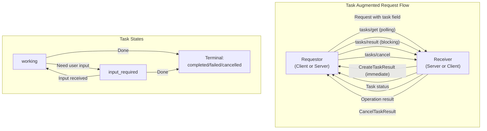
```mermaid
graph TB
    subgraph "Task Augmented Request Flow"
        Requestor["Requestor<br/>(Client or Server)"]
        Receiver["Receiver<br/>(Server or Client)"]
        
        Requestor -->|"Request with task field"| Receiver
        Receiver -->|"CreateTaskResult (immediate)"| Requestor
        
        Requestor -->|"tasks/get (polling)"| Receiver
        Receiver -->|"Task status"| Requestor
        
        Requestor -->|"tasks/result (blocking)"| Receiver
        Receiver -->|"Operation result"| Requestor
        
        Requestor -->|"tasks/cancel"| Receiver
        Receiver -->|"CancelTaskResult"| Requestor
    end
    
    subgraph "Task States"
        working["working"]
        input_required["input_required"]
        terminal["Terminal:<br/>completed/failed/cancelled"]
        
        working -->|"Need user input"| input_required
        working -->|"Done"| terminal
        input_required -->|"Input received"| working
        input_required -->|"Done"| terminal
    end
```

Tasks use directional terminology where the **requestor** sends a task-augmented request and the **receiver** executes it. Either party can be requestor or receiver:
- **Client as requestor**: Augments `tools/call` requests to servers
- **Server as requestor**: Augments `sampling/createMessage` or `elicitation/create` requests to clients

**Sources:** [docs/specification/draft/basic/utilities/tasks.mdx:20-32](), [schema/draft/schema.ts:33-47]()

## Task Augmentation Protocol

### Request Parameters

Task augmentation adds a `task` field to request parameters. The schema definition:

```typescript
// From schema/draft/schema.ts
export interface TaskAugmentedRequestParams extends RequestParams {
  task?: TaskMetadata;
}

export interface TaskMetadata {
  ttl?: number;  // Time-to-live in milliseconds
}
```

For example, augmenting a `tools/call` request:

```json
{
  "jsonrpc": "2.0",
  "id": 1,
  "method": "tools/call",
  "params": {
    "name": "expensive_analysis",
    "arguments": {"dataset": "large.csv"},
    "task": {
      "ttl": 300000
    }
  }
}
```

The receiver immediately returns a `CreateTaskResult`:

```json
{
  "jsonrpc": "2.0",
  "id": 1,
  "result": {
    "task": {
      "taskId": "786512e2-9e0d-44bd-8f29-789f320fe840",
      "status": "working",
      "createdAt": "2025-11-25T10:30:00Z",
      "lastUpdatedAt": "2025-11-25T10:30:00Z",
      "ttl": 300000,
      "pollInterval": 5000
    }
  }
}
```

**Sources:** [schema/draft/schema.ts:33-47](), [docs/specification/draft/basic/utilities/tasks.mdx:123-169](), [schema/draft/schema.json:813-829]()

### Task Object Structure

The `Task` interface from the schema:

```typescript
interface Task {
  taskId: string;                    // Unique identifier
  status: TaskStatus;                // Current state
  statusMessage?: string;            // Human-readable status
  createdAt: string;                 // ISO 8601 timestamp
  lastUpdatedAt: string;             // ISO 8601 timestamp
  ttl: number | null;                // Milliseconds or null for unlimited
  pollInterval?: number;             // Suggested polling interval in ms
}

type TaskStatus = 
  | "working"        // Task executing
  | "input_required" // Needs user/requestor input
  | "completed"      // Successfully finished
  | "failed"         // Error occurred
  | "cancelled";     // Explicitly cancelled
```

**Sources:** [schema/draft/schema.json:215-260](), [docs/specification/draft/basic/utilities/tasks.mdx:402-431]()

## Task Lifecycle Operations

### State Machine Diagram

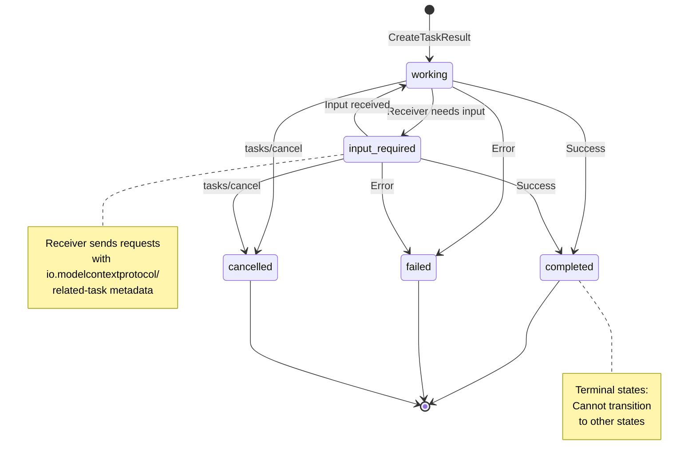
```mermaid
stateDiagram-v2
    [*] --> working : CreateTaskResult
    
    working --> input_required : Receiver needs input
    working --> completed : Success
    working --> failed : Error
    working --> cancelled : tasks/cancel
    
    input_required --> working : Input received
    input_required --> completed : Success
    input_required --> failed : Error
    input_required --> cancelled : tasks/cancel
    
    completed --> [*]
    failed --> [*]
    cancelled --> [*]
    
    note right of completed
        Terminal states:
        Cannot transition
        to other states
    end note
    
    note right of input_required
        Receiver sends requests
        with io.modelcontextprotocol/
        related-task metadata
    end note
```

**Sources:** [docs/specification/draft/basic/utilities/tasks.mdx:402-431](), [schema/draft/schema.json:215-260]()

### Polling with tasks/get

The `tasks/get` request retrieves current task status:

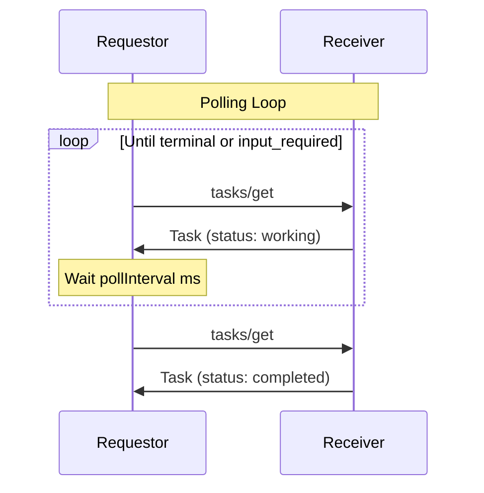
```mermaid
sequenceDiagram
    participant R as Requestor
    participant Recv as Receiver
    
    Note over R,Recv: Polling Loop
    
    loop Until terminal or input_required
        R->>Recv: tasks/get
        Recv->>R: Task (status: working)
        Note over R: Wait pollInterval ms
    end
    
    R->>Recv: tasks/get
    Recv->>R: Task (status: completed)
```

Request schema:

```typescript
interface GetTaskRequest extends JSONRPCRequest {
  method: "tasks/get";
  params: {
    taskId: string;
  };
}
```

Response includes full `Task` object with updated `status`, `lastUpdatedAt`, and potentially revised `ttl` or `pollInterval`.

**Sources:** [docs/specification/draft/basic/utilities/tasks.mdx:184-228](), [schema/draft/schema.json:464-493]()

### Retrieving Results with tasks/result

The `tasks/result` request blocks until the task reaches a terminal state, then returns the underlying operation's result:

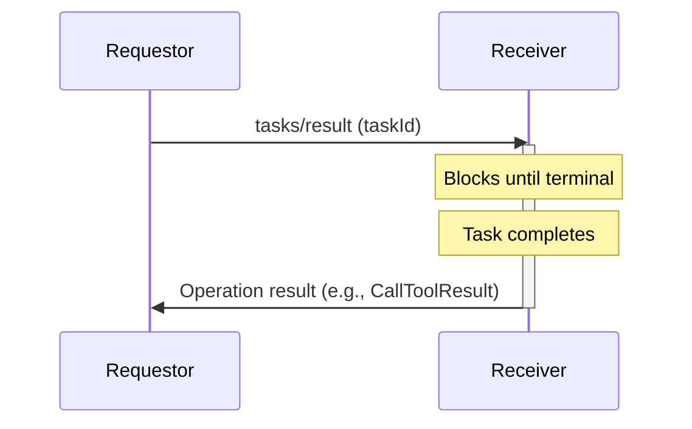
```mermaid
sequenceDiagram
    participant R as Requestor
    participant Recv as Receiver
    
    R->>Recv: tasks/result (taskId)
    activate Recv
    Note over Recv: Blocks until terminal
    Note over Recv: Task completes
    Recv->>R: Operation result (e.g., CallToolResult)
    deactivate Recv
```

For a `tools/call` task, the result is a `CallToolResult`:

```json
{
  "jsonrpc": "2.0",
  "id": 4,
  "result": {
    "content": [{"type": "text", "text": "Analysis complete"}],
    "isError": false,
    "_meta": {
      "io.modelcontextprotocol/related-task": {
        "taskId": "786512e2-9e0d-44bd-8f29-789f320fe840"
      }
    }
  }
}
```

**Important:** The result matches what the underlying request would have returned directly. The `_meta` field includes the `io.modelcontextprotocol/related-task` key associating it with the task.

**Sources:** [docs/specification/draft/basic/utilities/tasks.mdx:230-280](), [schema/draft/schema.json:494-511](), [docs/specification/draft/basic/utilities/tasks.mdx:463-476]()

### Task Cancellation

The `tasks/cancel` request terminates an in-progress task:

```typescript
interface CancelTaskRequest extends JSONRPCRequest {
  method: "tasks/cancel";
  params: {
    taskId: string;
  };
}
```

Response is a `CancelTaskResult` (which extends `Task`) with `status: "cancelled"`. Receivers MUST reject cancellation of already-terminal tasks with error code `-32602` (Invalid params).

**Sources:** [docs/specification/draft/basic/utilities/tasks.mdx:354-386](), [schema/draft/schema.json:215-260](), [docs/specification/draft/basic/utilities/tasks.mdx:494-501]()

### Listing Tasks

The `tasks/list` operation returns paginated task lists:

```typescript
interface ListTasksRequest extends PaginatedRequest {
  method: "tasks/list";
  params?: {
    cursor?: Cursor;
  };
}

interface ListTasksResult extends PaginatedResult {
  tasks: Task[];
  nextCursor?: Cursor;
}
```

All tasks retrievable via `tasks/get` MUST also appear in `tasks/list` results for that requestor.

**Sources:** [docs/specification/draft/basic/utilities/tasks.mdx:308-351](), [schema/draft/schema.json:473-500](), [docs/specification/draft/basic/utilities/tasks.mdx:487-493]()

## Capability Negotiation

### Server Capabilities

Servers declare task support in their `ServerCapabilities` during initialization:

```typescript
interface ServerCapabilities {
  tasks?: {
    list?: object;           // Supports tasks/list
    cancel?: object;         // Supports tasks/cancel
    requests?: {
      tools?: {
        call?: object;       // Supports task-augmented tools/call
      };
    };
  };
}
```

Example declaration:

```json
{
  "capabilities": {
    "tasks": {
      "list": {},
      "cancel": {},
      "requests": {
        "tools": {
          "call": {}
        }
      }
    }
  }
}
```

**Sources:** [docs/specification/draft/basic/utilities/tasks.mdx:36-63](), [schema/draft/schema.ts:429-455]()

### Client Capabilities

Clients declare task support similarly:

```typescript
interface ClientCapabilities {
  tasks?: {
    list?: object;
    cancel?: object;
    requests?: {
      sampling?: {
        createMessage?: object;  // Supports task-augmented sampling
      };
      elicitation?: {
        create?: object;         // Supports task-augmented elicitation
      };
    };
  };
}
```

**Sources:** [docs/specification/draft/basic/utilities/tasks.mdx:65-93](), [schema/draft/schema.ts:342-377]()

### Tool-Level Negotiation

Individual tools can specify task support via `execution.taskSupport`:

| Value | Meaning |
|-------|---------|
| `"forbidden"` or absent | Tool MUST NOT be invoked as task |
| `"optional"` | Tool MAY be invoked as task or normally |
| `"required"` | Tool MUST be invoked as task |

Example tool declaration:

```json
{
  "name": "long_running_analysis",
  "execution": {
    "taskSupport": "required"
  }
}
```

Clients MUST return error `-32601` (Method not found) if attempting task invocation when forbidden, or not using tasks when required.

**Sources:** [docs/specification/draft/basic/utilities/tasks.mdx:109-120]()

## Task Status Notifications

Receivers MAY send `notifications/tasks/status` when task status changes:

```typescript
interface TaskStatusNotification extends JSONRPCNotification {
  method: "notifications/tasks/status";
  params: Task;  // Full task object with updated status
}
```

Example notification:

```json
{
  "jsonrpc": "2.0",
  "method": "notifications/tasks/status",
  "params": {
    "taskId": "786512e2-9e0d-44bd-8f29-789f320fe840",
    "status": "completed",
    "createdAt": "2025-11-25T10:30:00Z",
    "lastUpdatedAt": "2025-11-25T10:50:00Z",
    "ttl": 60000
  }
}
```

**Important:** Requestors MUST NOT rely on receiving these notifications. They are optional and receivers may choose not to send them. Requestors SHOULD continue polling via `tasks/get`.

**Sources:** [docs/specification/draft/basic/utilities/tasks.mdx:283-306](), [docs/specification/draft/basic/utilities/tasks.mdx:477-482]()

## Input Required Status

### Workflow

When a task transitions to `input_required`, the receiver needs additional information from the requestor to continue:

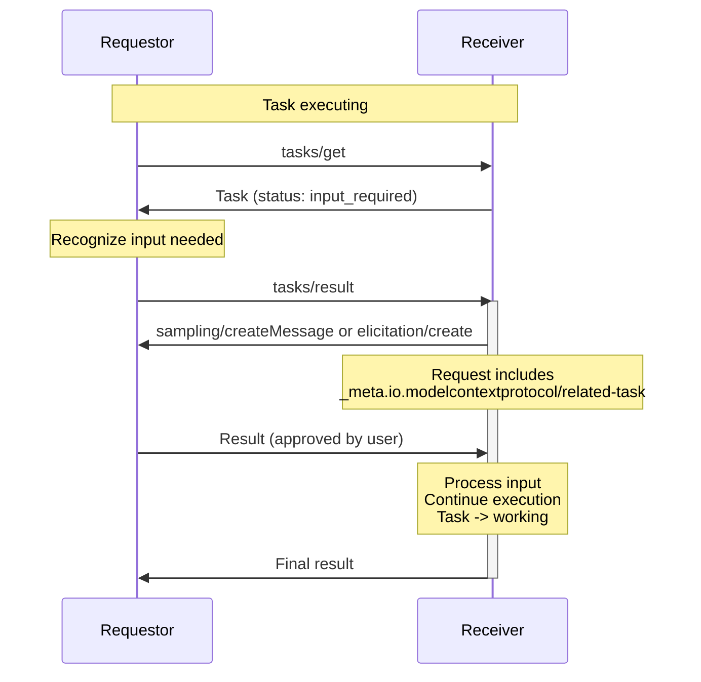
```mermaid
sequenceDiagram
    participant R as Requestor
    participant Recv as Receiver
    
    Note over R,Recv: Task executing
    
    R->>Recv: tasks/get
    Recv->>R: Task (status: input_required)
    
    Note over R: Recognize input needed
    R->>Recv: tasks/result
    activate Recv
    
    Recv->>R: sampling/createMessage or elicitation/create
    Note over Recv: Request includes<br/>_meta.io.modelcontextprotocol/related-task
    
    R->>Recv: Result (approved by user)
    
    Note over Recv: Process input<br/>Continue execution<br/>Task -> working
    
    Recv->>R: Final result
    deactivate Recv
```

The receiver MUST include `io.modelcontextprotocol/related-task` metadata in the request it sends:

```json
{
  "jsonrpc": "2.0",
  "id": 10,
  "method": "sampling/createMessage",
  "params": {
    "_meta": {
      "io.modelcontextprotocol/related-task": {
        "taskId": "786512e2-9e0d-44bd-8f29-789f320fe840"
      }
    },
    "messages": [...]
  }
}
```

**Sources:** [docs/specification/draft/basic/utilities/tasks.mdx:434-453](), [docs/specification/draft/basic/utilities/tasks.mdx:470-476]()

## TTL and Resource Management

### Time-To-Live Semantics

| Field | Type | Description |
|-------|------|-------------|
| `ttl` | `number \| null` | Milliseconds until task expires, or `null` for unlimited |
| `createdAt` | `string` | ISO 8601 timestamp when task was created |
| `lastUpdatedAt` | `string` | ISO 8601 timestamp of last status change |
| `pollInterval` | `number` (optional) | Suggested polling interval in milliseconds |

Behavior requirements:
- Requestors MAY suggest a `ttl` in the initial request
- Receivers MAY override the requested `ttl`
- Receivers MUST include actual `ttl` in responses
- After `ttl` expires, receivers MAY delete task and results regardless of status
- Receivers SHOULD NOT upgrade to SSE streams for `tasks/get` (use for `tasks/result` if needed)

**Sources:** [docs/specification/draft/basic/utilities/tasks.mdx:454-462](), [docs/specification/draft/basic/utilities/tasks.mdx:186-195](), [docs/specification/draft/basic/utilities/tasks.mdx:232-245]()

## Integration with MCP Features

### Task-Augmented Tool Calls

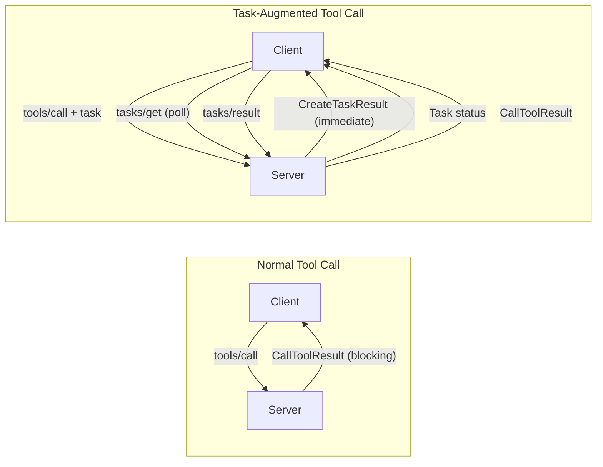
```mermaid
graph LR
    subgraph "Normal Tool Call"
        C1["Client"] -->|"tools/call"| S1["Server"]
        S1 -->|"CallToolResult (blocking)"| C1
    end
    
    subgraph "Task-Augmented Tool Call"
        C2["Client"] -->|"tools/call + task"| S2["Server"]
        S2 -->|"CreateTaskResult (immediate)"| C2
        C2 -->|"tasks/get (poll)"| S2
        S2 -->|"Task status"| C2
        C2 -->|"tasks/result"| S2
        S2 -->|"CallToolResult"| C2
    end
```

The server capability `tasks.requests.tools.call` enables this. The `CallToolRequestParams` interface includes the optional `task` field:

```typescript
interface CallToolRequestParams extends TaskAugmentedRequestParams {
  name: string;
  arguments?: { [key: string]: unknown };
  task?: TaskMetadata;  // Inherited from TaskAugmentedRequestParams
}
```

**Sources:** [schema/draft/schema.ts:1131-1144](), [docs/specification/draft/basic/utilities/tasks.mdx:42-48]()

### Task-Augmented Sampling

Servers can request task-augmented LLM sampling from clients:

```typescript
interface CreateMessageRequestParams {
  messages: SamplingMessage[];
  maxTokens: number;
  task?: TaskMetadata;
  // ... other fields
}
```

This requires client capability `tasks.requests.sampling.createMessage`. Useful for long-running agentic loops where the server needs to implement complex multi-step reasoning.

**Sources:** [schema/draft/schema.ts:683-760](), [docs/specification/draft/basic/utilities/tasks.mdx:69-75]()

### Task-Augmented Elicitation

Similarly, elicitation requests can be task-augmented:

```typescript
interface ElicitRequestParams {
  mode: "form" | "url";
  message: string;
  task?: TaskMetadata;
  // ... mode-specific fields
}
```

Requires client capability `tasks.requests.elicitation.create`.

**Sources:** [schema/draft/schema.json:860-865](), [docs/specification/draft/basic/utilities/tasks.mdx:69-75]()

## Implementation Requirements

### Task ID Management

- Task IDs MUST be strings
- Task IDs MUST be unique among all tasks controlled by the receiver
- Task IDs MUST be generated by the receiver upon task creation
- For `tasks/get`, `tasks/result`, `tasks/cancel`: the `taskId` parameter is the source of truth (receivers MUST ignore `_meta` field)

**Sources:** [docs/specification/draft/basic/utilities/tasks.mdx:396-402](), [docs/specification/draft/basic/utilities/tasks.mdx:470-476]()

### State Transition Rules

Valid transitions:
- From `working`: → `input_required`, `completed`, `failed`, `cancelled`
- From `input_required`: → `working`, `completed`, `failed`, `cancelled`
- Terminal states (`completed`, `failed`, `cancelled`): MUST NOT transition

Receivers MUST enforce these transitions. Invalid transitions should result in protocol errors.

**Sources:** [docs/specification/draft/basic/utilities/tasks.mdx:402-431]()

### Result Behavior

When `tasks/result` is called:
- For non-terminal tasks: MUST block until terminal state reached
- For terminal tasks: MUST return immediately with the result
- The result MUST match what the underlying request would have returned (same structure, error codes, etc.)
- For failed tasks: return as JSON-RPC error response
- MUST include `io.modelcontextprotocol/related-task` metadata in result

**Sources:** [docs/specification/draft/basic/utilities/tasks.mdx:463-469]()

### Error Handling

| Error Code | Scenario |
|------------|----------|
| `-32601` | Method not found - tool requires task augmentation but not used, or vice versa |
| `-32602` | Invalid params - attempting to cancel already-terminal task |

**Sources:** [docs/specification/draft/basic/utilities/tasks.mdx:109-120](), [docs/specification/draft/basic/utilities/tasks.mdx:494-497]()

## Progress Notifications

Task-augmented requests support standard MCP progress notifications. The `progressToken` from the initial request remains valid throughout the task lifetime:

```json
{
  "jsonrpc": "2.0",
  "method": "notifications/progress",
  "params": {
    "progressToken": "token123",
    "progress": 50,
    "total": 100,
    "message": "Processing dataset..."
  }
}
```

**Sources:** [docs/specification/draft/basic/utilities/tasks.mdx:483-486]()

## Message Flow Examples

### Complete Task Lifecycle

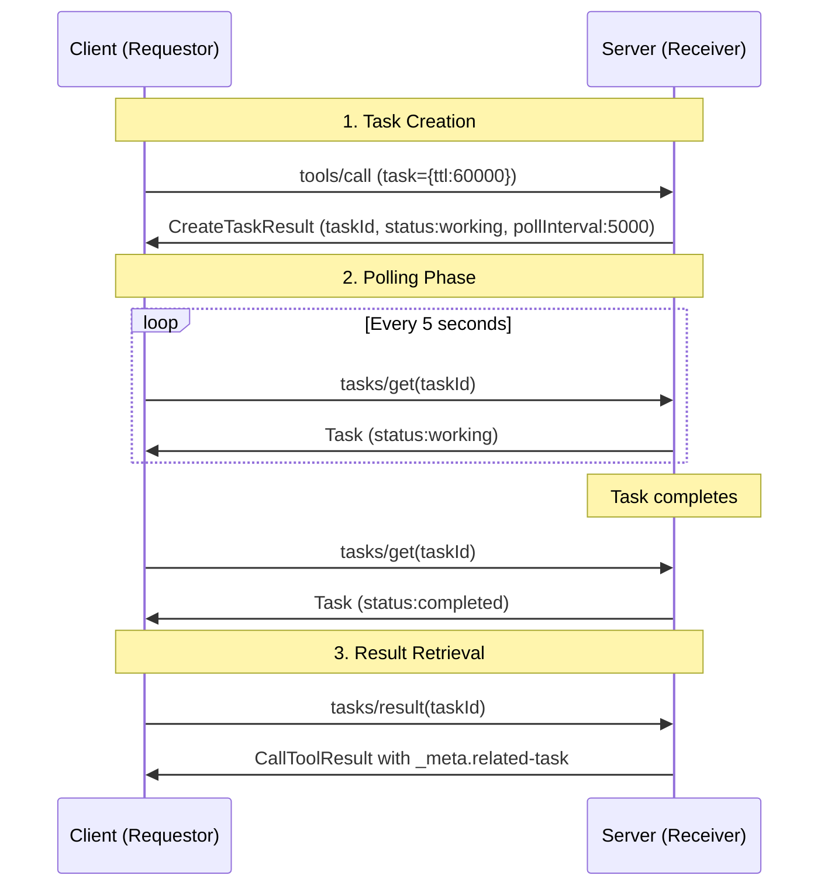
```mermaid
sequenceDiagram
    participant C as Client (Requestor)
    participant S as Server (Receiver)
    
    Note over C,S: 1. Task Creation
    C->>S: tools/call (task={ttl:60000})
    S->>C: CreateTaskResult (taskId, status:working, pollInterval:5000)
    
    Note over C,S: 2. Polling Phase
    loop Every 5 seconds
        C->>S: tasks/get(taskId)
        S->>C: Task (status:working)
    end
    
    Note over S: Task completes
    
    C->>S: tasks/get(taskId)
    S->>C: Task (status:completed)
    
    Note over C,S: 3. Result Retrieval
    C->>S: tasks/result(taskId)
    S->>C: CallToolResult with _meta.related-task
```

**Sources:** [docs/specification/draft/basic/utilities/tasks.mdx:502-595]()

### Input Required Flow

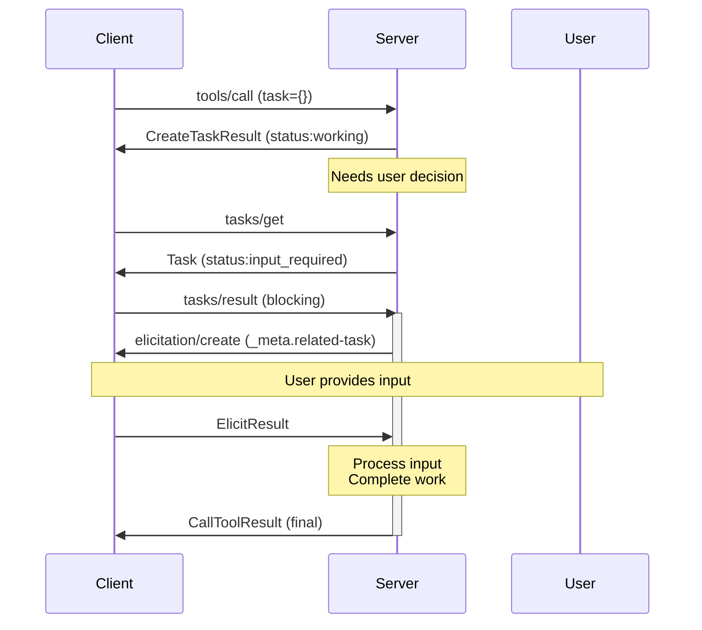
```mermaid
sequenceDiagram
    participant C as Client
    participant S as Server
    participant User
    
    C->>S: tools/call (task={})
    S->>C: CreateTaskResult (status:working)
    
    Note over S: Needs user decision
    
    C->>S: tasks/get
    S->>C: Task (status:input_required)
    
    C->>S: tasks/result (blocking)
    activate S
    
    S->>C: elicitation/create (_meta.related-task)
    Note over C,User: User provides input
    C->>S: ElicitResult
    
    Note over S: Process input<br/>Complete work
    
    S->>C: CallToolResult (final)
    deactivate S
```

**Sources:** [docs/specification/draft/basic/utilities/tasks.mdx:596-674]()

## Schema Type Reference

Key types from the schema:

| Type | File Location | Purpose |
|------|---------------|---------|
| `TaskMetadata` | [schema/draft/schema.ts:46]() | Request augmentation parameters |
| `TaskAugmentedRequestParams` | [schema/draft/schema.ts:37-47]() | Base interface for task requests |
| `Task` | [schema/draft/schema.json:215-260]() | Task state object |
| `CreateTaskResult` | [schema/draft/schema.json:813-829]() | Immediate response to task-augmented request |
| `GetTaskRequest` | [schema/draft/schema.json:464-493]() | Status polling request |
| `GetTaskPayloadRequest` | [schema/draft/schema.json:512-539]() | Result retrieval request (blocking) |
| `CancelTaskRequest` | [schema/draft/schema.json:215-249]() | Cancellation request |
| `ListTasksRequest` | [schema/draft/schema.json:473-500]() | List tasks with pagination |
| `TaskStatusNotification` | [schema/draft/schema.json:421-426]() | Status change notification |

**Sources:** [schema/draft/schema.ts:1-50](), [schema/draft/schema.json:1-100]()