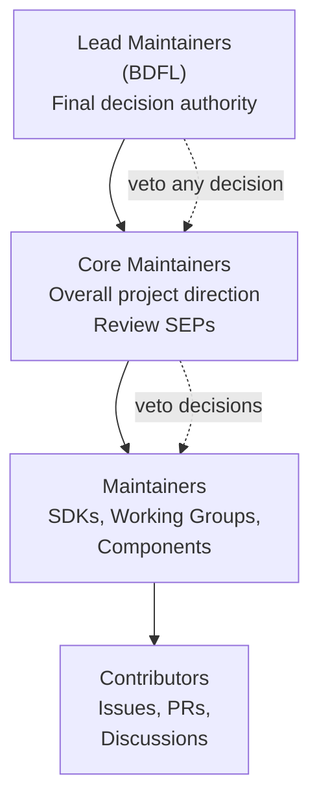
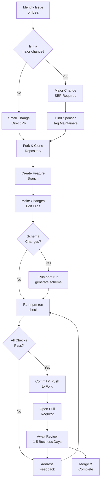
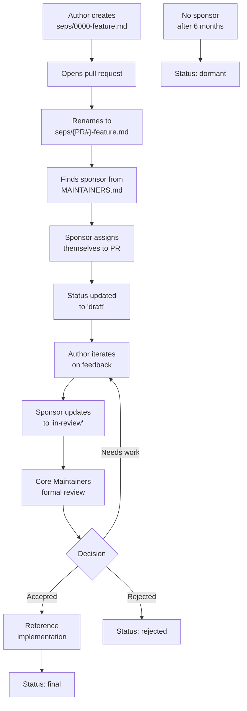
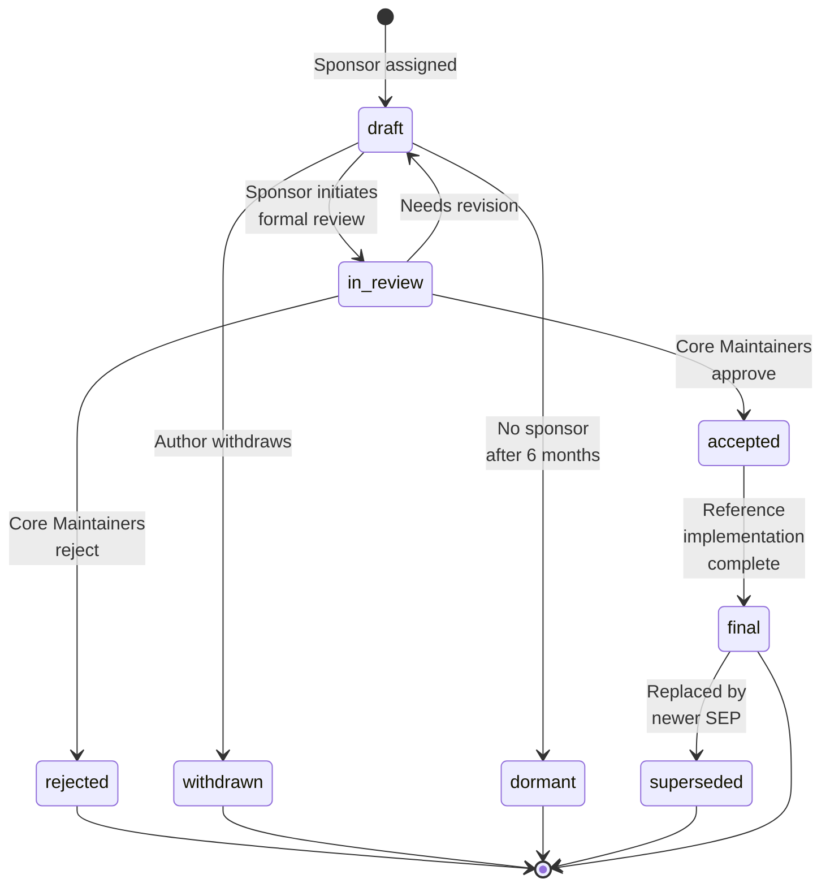
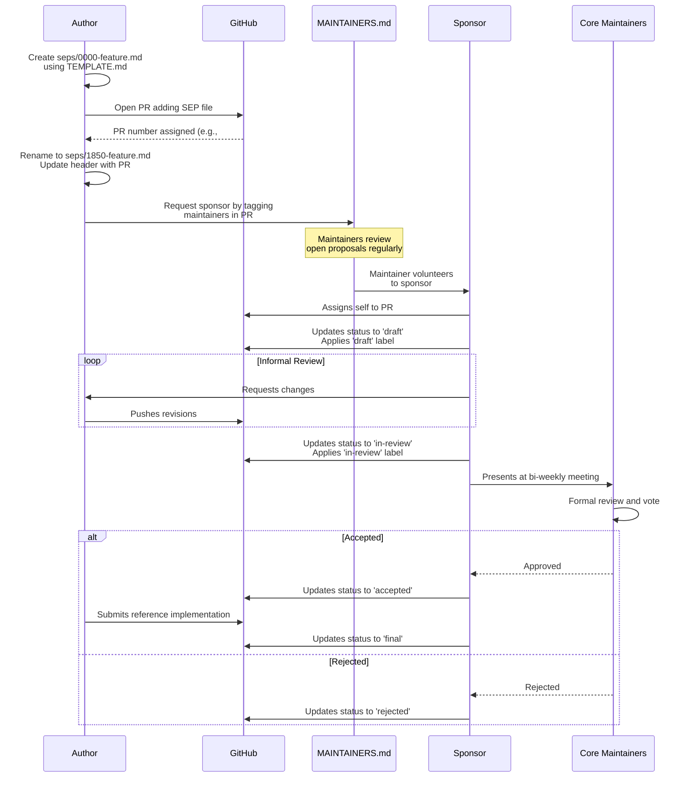
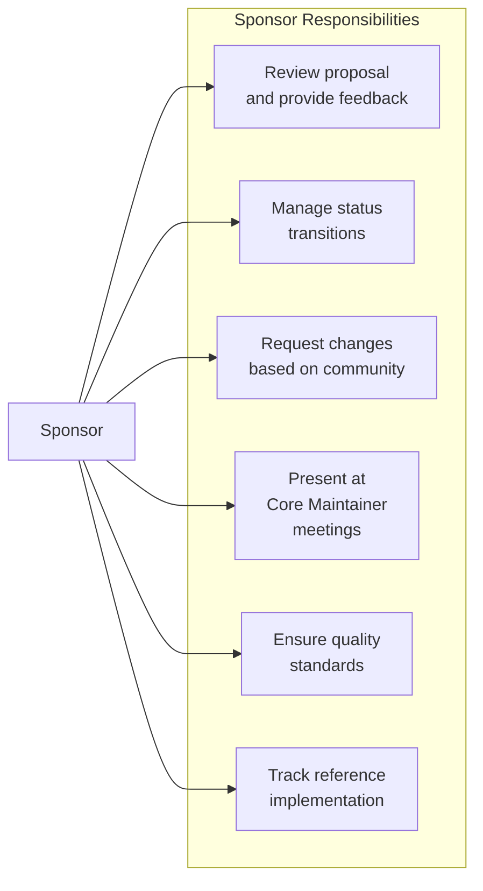
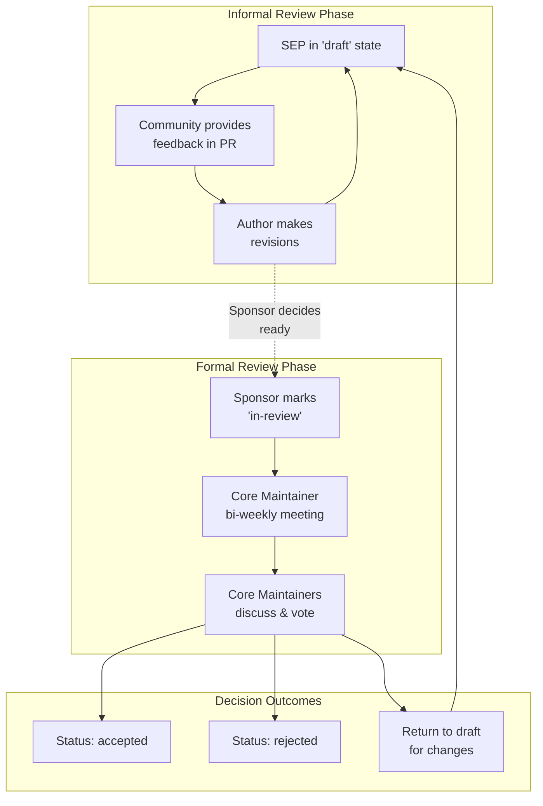
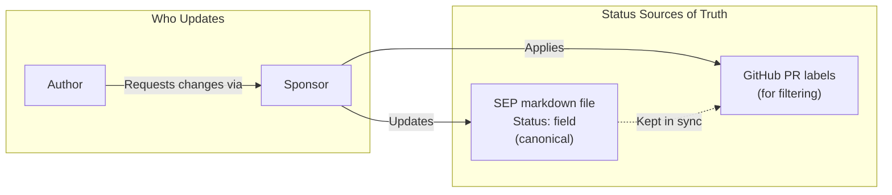

This page explains how to contribute to the Model Context Protocol project, including prerequisites, repository structure, contribution workflows, and the tools and processes used by maintainers and contributors.

**Scope:** This document covers contributions to the core MCP project—the specification, official SDKs, documentation, and governance processes. For information about building MCP servers and clients (rather than contributing to MCP itself), see the [Server Development](#5) and [Client Ecosystem](#4) sections. For details on the SEP (Specification Enhancement Proposal) process specifically, see [Specification Enhancement Process](#7.2). For information about the build system and schema generation, see [Schema Development and Generation](#7.3) and [Build System and Automation](#7.4).

---

## Prerequisites and Setup

### Required Tools

Before contributing, ensure you have the following installed:

| Tool | Version | Purpose |
|------|---------|---------|
| **Git** | Any recent version | Cloning repositories and submitting changes |
| **Node.js** | 24+ | Building, testing, and schema generation |
| **npm** | 11+ | Dependency management (comes with Node.js) |
| **GitHub account** | — | Submitting pull requests and issues |
| **Language tooling** | Varies | For SDK contributions (Python, Rust, Go, etc.) |

Verify your setup:

```bash
node --version  # Should be 24.x or higher
npm --version   # Should be 11.x or higher
git --version   # Any recent version
```

Sources: [docs/community/contributing.mdx:13-28]()

### Repository Structure

MCP spans multiple repositories in the [`modelcontextprotocol`](https://github.com/modelcontextprotocol) GitHub organization:

| Repository | Contents |
|------------|----------|
| `modelcontextprotocol/modelcontextprotocol` | Specification, documentation, SEPs, schema |
| `modelcontextprotocol/typescript-sdk` | TypeScript/JavaScript SDK |
| `modelcontextprotocol/python-sdk` | Python SDK |
| `modelcontextprotocol/go-sdk` | Go SDK |
| `modelcontextprotocol/java-sdk` | Java SDK |
| `modelcontextprotocol/kotlin-sdk` | Kotlin SDK |
| `modelcontextprotocol/csharp-sdk` | C# SDK |
| `modelcontextprotocol/swift-sdk` | Swift SDK |
| `modelcontextprotocol/rust-sdk` | Rust SDK |
| `modelcontextprotocol/ruby-sdk` | Ruby SDK |
| `modelcontextprotocol/php-sdk` | PHP SDK |

The **specification repository** (`modelcontextprotocol/modelcontextprotocol`) is the primary repository for protocol changes, documentation, and SEPs. Most of this guide focuses on contributing to this repository.

Sources: [docs/community/contributing.mdx:35-57]()

---

## Project Roles and Governance

MCP follows a hierarchical governance model with four levels of responsibility:



**Contributor** - Anyone who files issues, submits PRs, or participates in discussions. This is the entry point for all contributors.

**Maintainer** - Stewards specific areas like SDKs, documentation, or Working Groups. Maintainers have write/admin access to their respective repositories and make decisions independently for their areas.

**Core Maintainer** - Guides overall project direction, reviews SEPs, and oversees the specification. Core Maintainers meet bi-weekly to discuss proposals and project direction.

**Lead Maintainer** - Final decision makers (Benevolent Dictator for Life model). Currently: David Soria Parra and Justin Spahr-Summers (inactive).

Find the current list of maintainers in [MAINTAINERS.md](https://github.com/modelcontextprotocol/modelcontextprotocol/blob/main/MAINTAINERS.md).

Sources: [docs/community/governance.mdx:20-84](), [MAINTAINERS.md:1-211]()

---

## Your First Contribution

### Step 1: Set Up Your Environment

**Fork the repository** - Click the **Fork** button on the [specification repository](https://github.com/modelcontextprotocol/modelcontextprotocol) to create your own copy.

**Clone your fork:**

```bash
git clone https://github.com/YOUR-USERNAME/modelcontextprotocol.git
cd modelcontextprotocol
```

**Install dependencies:**

```bash
npm install
```

This installs tools for schema generation, documentation building, and validation.

**Verify everything works:**

```bash
npm run check
```

This runs TypeScript compilation, schema validation, example validation, documentation link checks, and formatting checks. If all pass, your environment is ready.

Sources: [docs/community/contributing.mdx:85-125]()

### Step 2: Find Something to Work On

Good starting points for new contributors:

1. **Documentation improvements** - Fix typos, unclear explanations, broken links, or incomplete examples
2. **Issues labeled `good first issue`** - Tagged in the [specification repo](https://github.com/modelcontextprotocol/modelcontextprotocol/issues?q=is%3Aissue+is%3Aopen+label%3A%22good+first+issue%22)
3. **Schema examples** - Add examples to `schema/draft/examples/` to help developers understand protocol primitives

Sources: [docs/community/contributing.mdx:127-138]()

### Step 3: Make Your Change

**Create a branch:**

```bash
git checkout -b fix/your-description
```

Use a descriptive branch name like `fix/typo-in-tools-doc` or `feat/add-example-for-resources`.

**Make your changes** - Edit relevant files. If editing schema files, run `npm run generate:schema` to regenerate the JSON schema and documentation.

**Run checks:**

```bash
npm run check
```

Fix any issues before committing. Use `npm run format` to auto-fix formatting errors.

**Commit with a clear message:**

```bash
git commit -m "Fix typo in tools documentation"
```

Write concise messages describing what changed and why. Reference issue numbers if applicable (e.g., `Fix typo in tools documentation (#123)`).

Sources: [docs/community/contributing.mdx:140-177]()

### Step 4: Submit a Pull Request

**Push your branch:**

```bash
git push origin fix/your-description
```

**Open a PR on GitHub** - Use the GitHub CLI or navigate to your fork and click **Compare & pull request**.

**Fill in the PR template** - Provide a clear description of your changes and link any related issues.

**Wait for review** - Maintainers typically respond within 1-5 business days.

Sources: [docs/community/contributing.mdx:179-212]()

---

## Types of Contributions

Different contributions follow different processes depending on scope:

### Small Changes (Direct PR)

Submit a pull request directly for:

- Bug fixes and typo corrections
- Documentation improvements (clarity, ambiguity fixes)
- Adding examples to existing features
- Minor schema fixes that don't materially change the specification
- Test improvements

### Major Changes (SEP Required)

Anything that changes the MCP specification requires the [Specification Enhancement Proposal (SEP)](#7.2) process:

- New protocol features or API methods
- Breaking changes to existing behavior
- Changes to message format or schema structure
- New interoperability standards
- Governance or process changes

**Examples requiring SEP:**

- Adding a new RPC method like `tools/execute`
- Changing authentication and authorization mechanisms
- Adding new capability negotiation fields
- Modifying the transport layer specification

Sources: [docs/community/contributing.mdx:231-269]()

---

## Working with the Specification Repository

### Schema Changes

The TypeScript schema (`schema/draft/schema.ts`) is the **source of truth** for the protocol. It defines every message type, request/response structure, and primitive (tools, resources, prompts) that clients and servers exchange. SDK implementers across all languages rely on this schema.

When you run `npm run generate:schema`, it generates:

- The JSON schema (`schema/draft/schema.json`) for validation
- The Schema Reference documentation (`docs/specification/draft/schema.mdx`)

**To modify the schema:**

1. Edit the TypeScript schema in `schema/draft/schema.ts`
2. Add JSON examples in `schema/draft/examples/[TypeName]/` (e.g., `Tool/my-example.json`). Reference them using `@example` + `@includeCode` JSDoc tags.
3. Generate JSON schema and docs: `npm run generate:schema`
4. Validate your changes: `npm run check`

Sources: [docs/community/contributing.mdx:270-314](), [CLAUDE.md:19-34]()

### Documentation Changes

Docs are written in [MDX format](https://mdxjs.com/) (Markdown with JSX components) and powered by [Mintlify](https://mintlify.com/). The `docs/` directory contains:

- `docs/docs/` - Guides and tutorials for getting started and building with MCP
- `docs/specification/` - Formal protocol specification (versioned by date)

**To contribute to documentation:**

1. Start the local docs server: `npm run serve:docs` (launches at `http://localhost:3000` with hot reloading)
2. Edit the relevant `.mdx` files. Use [Mintlify components](https://www.mintlify.com/docs/components) like `<Note>`, `<Tip>`, `<Steps>`, and `<Card>` for richer formatting.
3. Check for issues: `npm run check:docs` (validates formatting, broken links, and common issues)

Sources: [docs/community/contributing.mdx:316-350]()

### Major Protocol Changes

For significant changes, follow the [SEP process](#7.2). Before spending significant time on a spec proposal:

1. **Validate your idea first** - Discuss in an [Interest Group](#8.3) or on [Discord](https://discord.gg/6CSzBmMkjX)
2. **Build a prototype** - Demonstrate practical application of your idea
3. **Find a sponsor** - A maintainer from the [maintainer list](https://github.com/modelcontextprotocol/modelcontextprotocol/blob/main/MAINTAINERS.md) who will champion your proposal
4. **Write the SEP** - Follow the [SEP Guidelines](#7.2)

Sources: [docs/community/contributing.mdx:352-373]()

---

## Working with SDK Repositories

MCP maintains official SDKs in multiple languages. Contributions are welcome—whether fixing bugs, improving performance, adding features, or enhancing documentation.

Each SDK has its own repository, maintainers, and contribution guidelines. Some SDKs are maintained in collaboration with larger partner organizations (Google, Microsoft, JetBrains, etc.), so processes may vary slightly.

### Before Contributing to an SDK

1. **Open an issue first** - Before starting significant work, open an issue to discuss your approach. This avoids duplicate effort and ensures alignment with the SDK's direction.
2. **Join the SDK channel** - Find the relevant channel in [Discord](https://discord.gg/6CSzBmMkjX) (e.g., `#typescript-sdk-dev`, `#python-sdk-dev`)
3. **Read the SDK's CONTRIBUTING.md** - Each repository has specific instructions for setup, coding standards, commit conventions, and PR requirements
4. **Write tests** - All contributions should include appropriate test coverage. Bug fixes should include a test reproducing the issue; new features should have tests covering expected behavior.

Sources: [docs/community/contributing.mdx:375-412]()

---

## Communication and Getting Help

### Communication Channels

| Channel | Purpose | When to Use |
|---------|---------|------------|
| [Discord](https://discord.gg/6CSzBmMkjX) | Real-time discussion | Quick questions, coordination, WG/IG discussions |
| [GitHub Discussions](https://github.com/modelcontextprotocol/modelcontextprotocol/discussions) | Structured discussion | Feature requests, roadmap planning, proposals needing input |
| [GitHub Issues](https://github.com/modelcontextprotocol/modelcontextprotocol/issues) | Actionable tasks | Bug reports with reproducible steps, documentation fixes |
| [Security reports](https://github.com/modelcontextprotocol/modelcontextprotocol/blob/main/SECURITY.md) | Security issues | Vulnerabilities—**never post publicly** |

This separation helps maintainers focus on work ready for implementation while giving ideas room to develop. If unsure whether something is ready to be an issue, start with a discussion.

For protocol discussions, join [Working Group](#8.3) channels like `#auth-wg` or `#server-identity-wg`. For SDK help, find your language's channel (e.g., `#typescript-sdk-dev`).

Sources: [docs/community/communication.mdx:8-17](), [docs/community/contributing.mdx:469-491]()

### Finding a Sponsor for SEPs

A **sponsor** is a Core Maintainer or Maintainer who champions your SEP through the review process. They provide feedback, help refine your proposal, and present it at Core Maintainer meetings.

**Every SEP needs a sponsor to move forward.** SEPs that don't find a sponsor within 6 months are marked as **dormant**. Dormant SEPs aren't rejected outright—they can be revived later if a sponsor is found or the proposal is re-assessed.

**To find a sponsor:**

1. Look at the [maintainer list](https://github.com/modelcontextprotocol/modelcontextprotocol/blob/main/MAINTAINERS.md) to find maintainers working in your area
2. Tag 1-2 relevant maintainers in your PR (don't spam everyone)
3. Post your PR in the relevant Discord channel to increase visibility
4. If no response after 2 weeks, ask in `#general` or reach out to a Core Maintainer

Maintainers review open proposals regularly, but response time varies based on complexity and availability.

Sources: [docs/community/contributing.mdx:493-527]()

---

## Build System and npm Commands

The specification repository uses npm scripts to manage schema generation, documentation building, validation, and formatting. Here are the key commands:

```bash
# Development servers
npm run serve:docs       # Local Mintlify docs server (http://localhost:3000)
npm run serve:blog       # Local Hugo blog server

# Generation (run after editing source files)
npm run generate         # Generate all (schema + SEPs)
npm run generate:schema  # Generate JSON schemas + MDX from TypeScript
npm run generate:seps    # Generate SEP documents

# Formatting
npm run format           # Format all (docs + schema)
npm run format:docs      # Format markdown/MDX files
npm run format:schema    # Format schema TypeScript files

# Checks
npm run check            # Run all checks
npm run check:schema     # Check schema (TS, JSON, examples, MDX)
npm run check:docs       # Check docs (format, comments, links)
npm run check:seps       # Check SEP documents

# Workflow
npm run prep             # Full prep before committing (check, generate, format)
```

**Always run `npm run prep` before committing** to ensure all checks pass, schemas are regenerated, and formatting is correct.

Sources: [CLAUDE.md:44-69]()

---

## Contribution Workflow Diagram



Sources: [docs/community/contributing.mdx:76-212](), [docs/community/sep-guidelines.mdx:42-90]()

---

## Common Issues and Troubleshooting

### `npm run check` fails

**Common causes:**

- **Wrong Node.js version** - Ensure you have Node.js 24+
- **Missing dependencies** - Run `npm install` again
- **Schema out of sync** - Run `npm run generate:schema`
- **Formatting issues** - Run `npm run format` to auto-fix

### My PR has been sitting unnoticed for weeks

1. Ensure all CI checks pass
2. Politely ping the desired reviewer in a comment
3. Ask in the relevant Discord channel
4. For urgent issues, reach out to a Core Maintainer

### I can't find a sponsor for my SEP

1. Make sure your idea has been discussed in Discord or an Interest Group first
2. Proposals with demonstrated community interest are more likely to find sponsors
3. Consider whether your change might be too large—could it be split into smaller SEPs?

### My SEP was rejected

Rejection is not permanent. You have several options:

1. **Address the feedback and resubmit** - Rejection often comes with specific concerns that can be addressed
2. **Discuss in Discord** - Talk with maintainers to better understand the concerns
3. **Try a different approach** - Submit a new SEP addressing the same problem differently
4. **Wait for the right moment** - Circumstances change; an idea rejected today might be welcomed later

Sources: [docs/community/contributing.mdx:529-573]()

---

## Licensing and Code of Conduct

### License

By contributing, you agree that your contributions will be licensed under:

- **Code and specifications**: Apache License 2.0
- **Documentation** (excluding specifications): CC-BY 4.0

See the [LICENSE](https://github.com/modelcontextprotocol/modelcontextprotocol/blob/main/LICENSE) file for details.

### Code of Conduct

All contributors must follow the [Code of Conduct](https://github.com/modelcontextprotocol/modelcontextprotocol/blob/main/CODE_OF_CONDUCT.md). We expect respectful, professional, and inclusive interactions across all channels.

### AI Contributions

We welcome the use of AI tools like Claude or ChatGPT to help with your contributions. If you do use AI assistance, let us know in your pull request or issue—a quick note about how you used it (drafting docs, generating code, brainstorming, etc.) is all we need.

The key is that you understand and can stand behind your contribution:

- **You get it** - You understand what the changes do and can explain them
- **You know why** - You can articulate why the change is needed
- **You've verified it** - You've tested or validated that it works as intended

Sources: [docs/community/contributing.mdx:590-620]()

---

## Related Documentation

For more information on specific topics:

- **SEP Process** - See [Specification Enhancement Process](#7.2) for detailed SEP workflow and guidelines
- **Schema Generation** - See [Schema Development and Generation](#7.3) for schema source-of-truth system and transformations
- **Build System** - See [Build System and Automation](#7.4) for npm scripts and CI/CD workflows
- **Documentation Generation** - See [Documentation Generation System](#7.5) for TypeDoc configuration and Mintlify integration
- **Governance** - See [Governance Structure](#8.1) for decision-making processes and maintainer roles
- **Working Groups** - See [Working Groups and Interest Groups](#8.3) for collaboration structures

# Specification Enhancement Process (SEP)


The Specification Enhancement Process (SEP) is the formal mechanism for proposing, discussing, and documenting changes to the Model Context Protocol. SEPs are design documents stored as markdown files in the [`seps/` directory](https://github.com/modelcontextprotocol/specification/tree/main/seps) and managed through pull requests. This page describes the complete workflow for creating, sponsoring, reviewing, and finalizing SEPs.

For information about the broader governance structure that oversees the SEP process, see [Governance and Stewardship](#7.1). For details on Working Groups and Interest Groups that often generate SEPs, see [Working Groups and Interest Groups](#7.3).

## What is a SEP?

A SEP (Specification Enhancement Proposal) is a design document that provides information to the MCP community or describes a new feature for the Model Context Protocol. SEPs serve three primary functions:

1. **Proposing major new features** with detailed technical specifications
2. **Collecting community input** on protocol design decisions  
3. **Documenting the rationale** behind decisions that shape the protocol

The SEP author is responsible for building consensus within the community and documenting dissenting opinions. The revision history in Git serves as the historical record of the feature proposal.

Sources: [docs/community/sep-guidelines.mdx:8-10](), [seps/1850-pr-based-sep-workflow.md:12-15]()

## When to Use a SEP

Not all changes require a SEP. Regular pull requests are more appropriate for smaller, direct changes. Consider proposing a SEP when your change involves:

| Scenario | Requires SEP | Example |
|----------|--------------|---------|
| New protocol feature or API | Yes | Adding new message types, capabilities, or server features |
| Breaking change | Yes | Non-backwards-compatible modifications to existing behavior |
| Governance/process change | Yes | Altering contribution guidelines or decision-making processes |
| Complex/controversial topic | Yes | Changes with multiple valid solutions requiring community consensus |
| Bug fix | No | Straightforward corrections to existing functionality |
| Documentation improvement | No | Clarifications or examples without semantic changes |
| Minor enhancement | No | Small improvements that don't alter core protocol behavior |

The goal is to reserve the SEP process for changes substantial enough to require broad community discussion, a formal design document, and a historical record of the decision-making process.

Sources: [docs/community/sep-guidelines.mdx:14-28]()

## SEP Types

SEPs are categorized into three types:

**Standards Track**: Describes a new feature or implementation for the Model Context Protocol, or an interoperability standard supported outside the core protocol specification. These are the most common SEPs and directly modify protocol behavior.

**Informational**: Describes a design issue or provides general guidelines to the MCP community without proposing a new feature. Does not represent a community consensus or recommendation.

**Process**: Describes a process surrounding MCP or proposes changes to project processes (like the SEP process itself). Similar to Standards Track but applies to areas other than the protocol.

Examples:
- **Standards Track**: SEP-1686 (Task-based workflows), SEP-991 (Client ID Metadata Documents)
- **Process**: SEP-1850 (PR-based SEP workflow)
- **Informational**: General best practices documents

Sources: [docs/community/sep-guidelines.mdx:29-36](), [blog/content/posts/2025-11-25-first-mcp-anniversary.md:134-240]()

## The PR-Based Workflow

As of November 2025 (SEP-1850), all SEPs are submitted as pull requests containing markdown files. This replaced the previous GitHub Issues-based approach. The PR-based workflow provides:

- **Version control**: Every revision tracked in Git alongside the specification
- **Integrated discussion**: All conversation happens in the pull request thread
- **Automatic numbering**: SEP numbers derive from PR numbers
- **Standard tooling**: Uses GitHub's built-in code review features



**SEP Workflow: From Draft to Final**

The workflow eliminates manual numbering and keeps all proposal content in a single, version-controlled location.

Sources: [seps/1850-pr-based-sep-workflow.md:23-46](), [blog/content/posts/2025-11-28-sep-process-update.md:20-35]()

## SEP States and Lifecycle

SEPs progress through a defined set of states:



**SEP State Transitions**

| State | Meaning | Who Can Change |
|-------|---------|----------------|
| `draft` | Has sponsor, undergoing informal review | Sponsor |
| `in-review` | Ready for formal Core Maintainer review | Sponsor |
| `accepted` | Approved but needs final wording and reference implementation | Sponsor |
| `rejected` | Rejected by Core Maintainers | Sponsor |
| `withdrawn` | Author withdrew the proposal | Author/Sponsor |
| `final` | Finalized with complete reference implementation | Sponsor |
| `superseded` | Replaced by a newer SEP | Sponsor |
| `dormant` | No sponsor found within six months, PR closed | Core Maintainers |

**Key state transition rules:**
- Only the **sponsor** is responsible for updating the SEP status in the markdown file
- PR labels must be kept in sync with the markdown status field
- Authors request status changes through their sponsor rather than modifying directly
- Reference implementations must be complete before `final` status

Sources: [docs/community/sep-guidelines.mdx:83-93](), [seps/1850-pr-based-sep-workflow.md:64-72]()

## File Structure and Location

All SEPs reside in the `seps/` directory of the specification repository with a standardized naming convention:

```
specification/
├── seps/
│   ├── README.md
│   ├── TEMPLATE.md
│   ├── 0000-feature-name.md        # Placeholder during drafting
│   ├── 1850-pr-based-sep-workflow.md
│   ├── 1686-task-workflows.md
│   ├── 991-client-id-metadata.md
│   └── ...
└── schema/
    └── ...
```

**Naming convention**: `{PR-number}-{descriptive-slug}.md`

The PR number becomes the SEP number. Authors start with `0000-` as a placeholder, then rename once the PR is created.

Example file header:

```markdown
# SEP-1850: PR-Based SEP Workflow

- **Status**: Final
- **Type**: Process
- **Created**: 2025-11-20
- **Author(s)**: Nick Cooper (@nickcoai), David Soria Parra (@davidsp)
- **Sponsor**: David Soria Parra (@davidsp)
- **PR**: https://github.com/modelcontextprotocol/specification/pull/1850
```

Sources: [seps/1850-pr-based-sep-workflow.md:33-41](), [seps/TEMPLATE.md:1-10]()

## Authoring a SEP

### Step-by-Step Authoring Workflow



**SEP Authorship and Review Sequence**

### Finding a Sponsor

SEPs require a sponsor from the MCP steering group (maintainer, core maintainer, or lead maintainer). The sponsor ensures the proposal:
- Meets quality standards
- Is actively developed
- Gets presented at Core Maintainer meetings

To find a sponsor:
1. Tag potential sponsors from [MAINTAINERS.md](https://github.com/modelcontextprotocol/modelcontextprotocol/blob/main/MAINTAINERS.md) in your PR
2. Maintainers regularly review open proposals to determine which to sponsor
3. If no sponsor is found within **six months**, Core Maintainers may close the PR and mark it `dormant`

You can also discuss your idea first on [Discord](https://discord.gg/6CSzBmMkjX) or [GitHub Discussions](https://github.com/modelcontextprotocol/modelcontextprotocol/discussions) before drafting a formal SEP.

Sources: [docs/community/sep-guidelines.mdx:42-66](), [seps/1850-pr-based-sep-workflow.md:42-46]()

## The Sponsor Role

The sponsor is a critical figure in the SEP lifecycle. This role must be filled by someone from the MCP steering group (maintainers, core maintainers, or lead maintainers).



**Sponsor Responsibilities**

### Key Sponsor Duties

1. **Status management**: Update the `Status` field in the SEP markdown file and apply matching PR labels
2. **Review coordination**: Facilitate informal review and request changes based on community feedback
3. **Formal review initiation**: Move SEP from `draft` to `in-review` when ready
4. **Core Maintainer liaison**: Present and discuss the proposal at bi-weekly Core Maintainer meetings
5. **Quality assurance**: Ensure the proposal meets SEP standards before advancing
6. **Implementation tracking**: Monitor reference implementation progress before marking `final`

**Important**: Only sponsors should modify the status field and labels. Authors request status changes through their sponsor.

Sources: [seps/1850-pr-based-sep-workflow.md:48-62](), [docs/community/sep-guidelines.mdx:120-130]()

## Review and Approval Process

Core Maintainers review SEPs on a **bi-weekly basis**. For a SEP to be accepted, it must meet:

- **Prototype implementation** demonstrating the proposal
- **Clear benefit** to the MCP ecosystem
- **Community support** and consensus



**SEP Review and Decision Flow**

### Decision Authority

From the governance structure:
- **Core Maintainers** (9 members) review and vote on SEPs
- **Lead Maintainers** (2 BDFLs) can veto any decision
- Consensus is encouraged but not required for votes
- Decision-making should be publicly articulated with clear reasoning

Sources: [docs/community/sep-guidelines.mdx:106-116](), [docs/community/governance.mdx:51-72]()

## Status Management

Status management is a critical sponsor responsibility. The system uses both markdown status fields and PR labels to track SEP state.

### Status Update Mechanism



**Status Management: Canonical Source and Labels**

### Why Both Markdown and Labels?

- **Markdown file** serves as the canonical, version-controlled record
- **PR labels** enable easy filtering and searching for SEPs by status without opening files
- Both must be kept in sync by the sponsor

Available labels match the states: `draft`, `in-review`, `accepted`, `rejected`, `withdrawn`, `final`, `superseded`, `dormant`

Sources: [seps/1850-pr-based-sep-workflow.md:107-117](), [docs/community/sep-guidelines.mdx:95-105]()

## SEP Template and Required Sections

All SEPs must follow a standardized structure defined in [seps/TEMPLATE.md]():

### Required Sections

1. **Preamble**: Title, authors, status, type, PR number
2. **Abstract**: ~200 word description of the technical issue
3. **Motivation**: Why the existing protocol is inadequate; critical for acceptance
4. **Specification**: Detailed technical specification for interoperable implementations
5. **Rationale**: Why design decisions were made, alternatives considered, objections documented
6. **Backward Compatibility**: Description of incompatibilities and migration paths (if applicable)
7. **Reference Implementation**: Link to prototype code; must be complete before `final` status
8. **Security Implications**: Security concerns, attack surfaces, privacy considerations

Example preamble structure:

```markdown