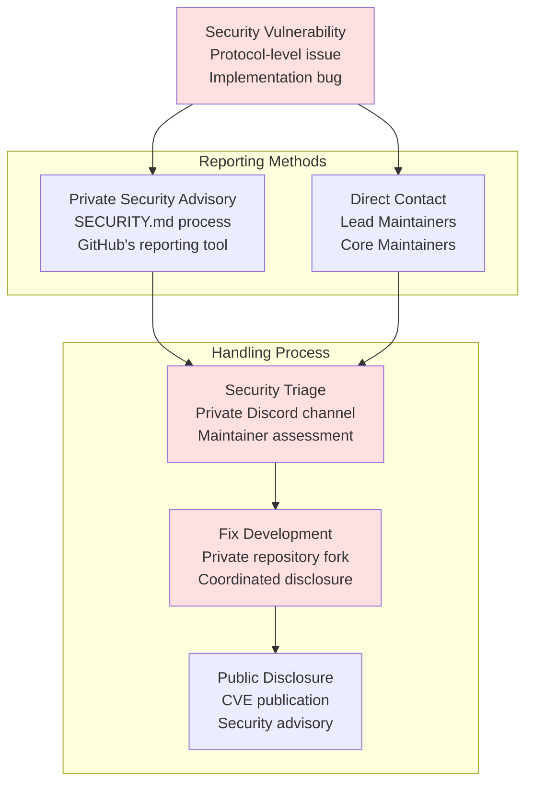
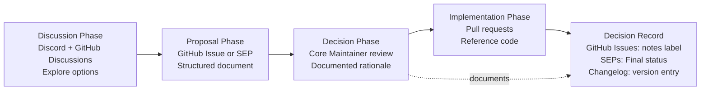
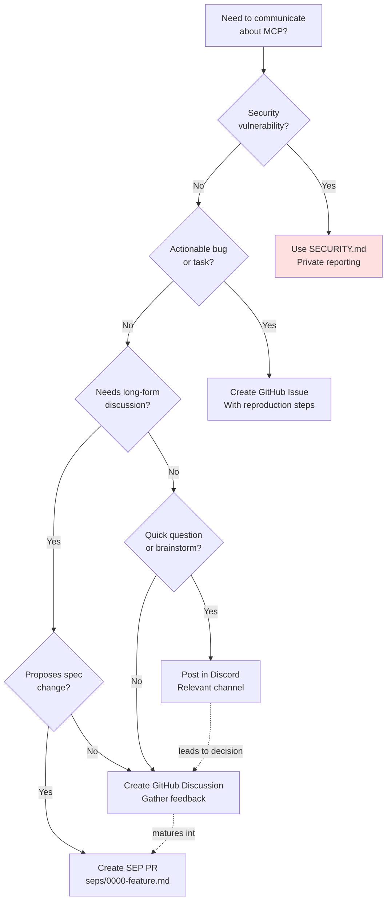
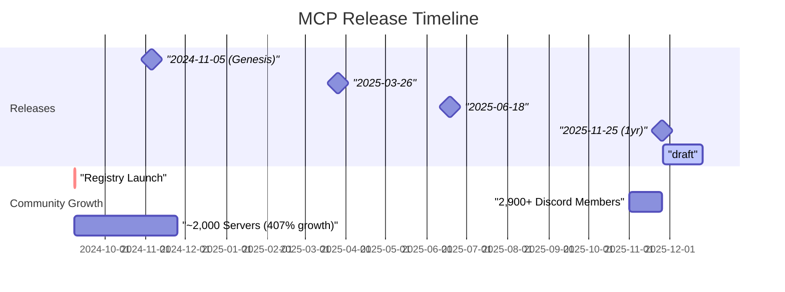
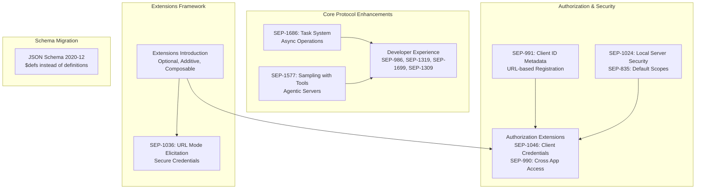
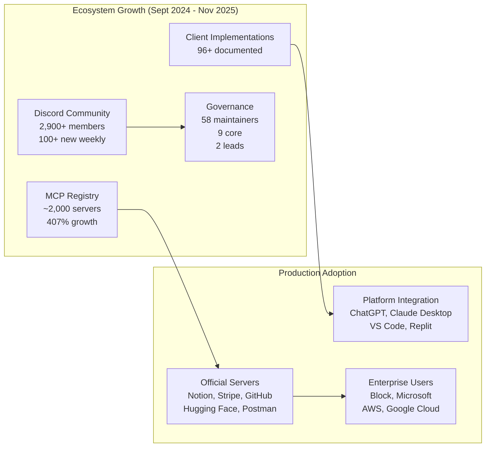

✅ github.com/modelcontextprotocol/specification/tree/main/seps
   seps/0000-your-feature.md → PR → seps/1234-your-feature.md
```

Repositories without GitHub Discussions enabled should use Issues for feature requests and proposals as a fallback.

**Sources:** [docs/community/communication.mdx:67-79](), [seps/1850-pr-based-sep-workflow.md:1-46](), [blog/content/posts/2025-11-28-sep-process-update.md:7-35]()

## Security Reporting Process

### Private Disclosure Mechanism

Security issues must never be posted publicly. The project maintains a formal security reporting process:



**Process Location:** [SECURITY.md](https://github.com/modelcontextprotocol/modelcontextprotocol/blob/main/SECURITY.md) in the specification repository.

**Responsible Disclosure Guidelines:**
1. Do not open public issues for security vulnerabilities
2. Use GitHub's private security advisory feature or email maintainers directly
3. Allow reasonable time for fixes before public disclosure
4. Follow CVE coordination for protocol-level vulnerabilities

**Sources:** [docs/community/communication.mdx:81-88]()

## Decision Record System

### Documentation Requirements

All MCP decisions are documented and captured in public channels, following a structured record-keeping system:

| Decision Type | Record Location | Format | Labels |
|---------------|----------------|--------|--------|
| Technical Decisions | GitHub Issues | Issue description with rationale | `decision`, `notes` |
| Specification Changes | SEP files in `seps/` | Markdown with status field | Per SEP status |
| Version Changes | `specification/draft/changelog` | Markdown changelog entries | N/A |
| Process Changes | `docs/community/` | MDX documentation pages | N/A |
| Governance Updates | GitHub Issues + SEPs | Combined issue + SEP | `governance` |

### Decision Record Structure

When documenting decisions, maintainers preserve context following this structure:

```markdown
## Decision: [Brief Title]

**Decision Makers:** [@maintainer1, @maintainer2]

**Background Context:**
[Why this decision was needed, what problem it solves]

**Options Considered:**
1. Option A: [Description + pros/cons]
2. Option B: [Description + pros/cons]
3. Option C: [Description + pros/cons]

**Chosen Approach:** Option B

**Rationale:**
[Why Option B was selected over alternatives]

**Implementation Steps:**
1. [Concrete action items]
2. [With responsible parties]
3. [And timelines]

**Related Links:**
- SEP: #[number]
- Discussion: [link]
- Implementation PR: #[number]
```

### Decision Flow



### Accessing Decision Records

**Technical Decisions:**
```
https://github.com/modelcontextprotocol/modelcontextprotocol/issues?q=label:notes
```

**Specification Changes:**
```
https://github.com/modelcontextprotocol/specification/tree/main/seps
https://modelcontextprotocol.io/specification/draft/changelog
```

**Process/Governance:**
```
https://modelcontextprotocol.io/community/governance
https://github.com/modelcontextprotocol/modelcontextprotocol/issues?q=label:governance
```

**Sources:** [docs/community/communication.mdx:89-105](), [docs/community/governance.mdx:81-82]()

## Code of Conduct and Moderation

All communication across all channels is governed by the project's Code of Conduct:

**Location:** [CODE_OF_CONDUCT.md](https://github.com/modelcontextprotocol/modelcontextprotocol/blob/main/CODE_OF_CONDUCT.md)

**Expectations:**
- Respectful, professional, and inclusive interactions
- Vendor-neutral discussions (avoid marketing/sales)
- Focus on specification development, not product support
- No general MCP support questions in contributor Discord

**Moderation Team:** See [Community Moderators](#7.2) in the maintainers directory. As of October 2025, community moderators include:
- Ola Hungerford (@olaservo)
- Cliff Hall (@cliffhall)
- Shaun Smith (@evalstate)
- Jonathan Hefner (@jonathanhefner)
- Tadas Antanavicius (@tadasant)

**Sources:** [docs/community/communication.mdx:17-18](), [MAINTAINERS.md:113-120](), [docs/community/communication.mdx:37-39]()

## Meeting Calendar and Coordination

### Public Meeting Calendar

All Working Group and Interest Group meetings are published at `meet.modelcontextprotocol.io`. WG/IG facilitators are responsible for:

1. Publishing meeting schedules in advance
2. Tagging meetings with topic and channel name (e.g., `auth-ig`, `agents-wg`)
3. Posting meeting notes as GitHub Issues or public Google Docs
4. Linking notes in respective Discord channels

### Core Maintainer Meetings

Core Maintainers meet bi-weekly to discuss proposals and project direction. Notes on proposals are made public via GitHub Issues with the `notes` label. The group strives to meet in person every 3-6 months.

**Sources:** [docs/community/working-interest-groups.mdx:24-30](), [docs/community/governance.mdx:127-129]()

## Channel Selection Guide

### Decision Tree for Channel Selection



**Sources:** [docs/community/communication.mdx:8-88]()

## Anti-Patterns to Avoid

### Common Communication Mistakes

| Anti-Pattern | Why It's Wrong | Correct Approach |
|--------------|----------------|------------------|
| Posting SEPs as Issues | SEPs require PR-based workflow since Nov 2025 | Create PR to `seps/` directory |
| Discussing decisions only in Discord | Discord is transient, not searchable | Move to GitHub Discussion/Issue |
| Public security bug reports | Exposes users to risk | Use SECURITY.md private reporting |
| Marketing products in Discord | Contributor Discord is vendor-neutral | Focus on specification, not sales |
| Asking general MCP support questions | Discord is for contributors, not users | Read documentation, use product support |
| Private technical discussions | Violates transparency requirement | Use public channels + document decisions |

**Sources:** [docs/community/communication.mdx:37-53](), [blog/content/posts/2025-11-28-sep-process-update.md:1-68]()

# Release History and Roadmap


This document chronicles the evolution of the Model Context Protocol through its major releases, documenting the key features and Specification Enhancement Proposals (SEPs) introduced in each version. It also outlines the protocol's versioning scheme, release cadence, and future roadmap.

For information about the governance structure that oversees these releases, see [Governance Structure](#7.1). For details on the SEP process itself, see [Specification Enhancement Process](#6.2).

## Versioning Scheme

MCP uses a **date-based versioning scheme** in YYYY-MM-DD format. Each version identifier represents the date of the last breaking change to the protocol, not necessarily the date of every modification. This scheme ensures:

- Clear chronological ordering of protocol versions
- Explicit indication of compatibility boundaries
- Predictable version negotiation during the [initialization phase](#2.4)

The versioning scheme distinguishes between:
- **Legacy versions** (2024-11-05 through 2025-06-18): Use JSON Schema draft-07
- **Modern versions** (2025-11-25 onward): Use JSON Schema 2020-12 with updated terminology

The special version identifier `draft` represents active development and may change without notice.

**Sources:** [blog/content/posts/2025-11-25-first-mcp-anniversary.md:1-272](), [docs/specification/draft/changelog.mdx:1-34]()

## Release Cadence

MCP follows a **quarterly release cadence**, delivering major protocol updates approximately every three months. This rhythm balances the need for protocol stability with the pace of innovation in the ecosystem.



**Sources:** [blog/content/posts/2025-11-25-first-mcp-anniversary.md:28-129]()

## Release History Overview

| Version | Release Date | Major Features | Breaking Changes | Notable SEPs |
|---------|-------------|----------------|------------------|--------------|
| **2024-11-05** | November 5, 2024 | Initial protocol release, stdio and HTTP+SSE transports, basic tools/resources/prompts | N/A (Genesis) | N/A |
| **2025-03-26** | March 26, 2025 | Stability improvements, ecosystem growth | Minor refinements | Various |
| **2025-06-18** | June 18, 2025 | Streamable HTTP transport, improved session management | Replaced HTTP+SSE with Streamable HTTP | Transport redesign |
| **2025-11-25** | November 25, 2025 | Tasks, simplified auth, sampling with tools, extensions | JSON Schema 2020-12 migration | SEP-1686, SEP-991, SEP-1577 |
| **draft** | Active Development | PR-based SEP workflow, ongoing refinements | TBD | SEP-1850 |

**Sources:** [blog/content/posts/2025-11-25-first-mcp-anniversary.md:130-272](), [docs/specification/draft/changelog.mdx:1-34]()

## Version 2024-11-05 (Genesis Release)

**Release Date:** November 5, 2024

The genesis release of MCP established the foundational protocol architecture. Announced in [Anthropic's original blog post](https://www.anthropic.com/news/model-context-protocol), this version introduced:

### Core Architecture
- **JSON-RPC 2.0 foundation**: Request/response/notification message types
- **stdio transport**: Local subprocess communication via stdin/stdout
- **HTTP+SSE transport**: Remote server support with Server-Sent Events
- **Initialization lifecycle**: `initialize` request, capability negotiation, `initialized` notification

### Server Features
- **Tools**: Executable functions with JSON Schema input/output definitions
- **Resources**: Contextual data with URI templates and subscriptions
- **Prompts**: Structured message templates with arguments

### Client Features
- **Sampling**: LLM completion requests (without tool support initially)
- **Logging**: Structured log message delivery from servers

### Versioning
- Protocol version negotiation during initialization
- JSON Schema draft-07 for message validation

**Sources:** [blog/content/posts/2025-11-25-first-mcp-anniversary.md:10-18]()

## Version 2025-03-26

**Release Date:** March 26, 2025

This release focused on stability improvements and ecosystem consolidation as adoption accelerated. While specific SEPs are not individually documented for this version, the focus was on:

- Refinements to existing features based on early production deployments
- Clarifications in specification language
- Minor bug fixes and edge case handling
- Continued support for growing server ecosystem

**Sources:** [blog/content/posts/2025-11-25-first-mcp-anniversary.md:28-29]()

## Version 2025-06-18

**Release Date:** June 18, 2025

This release introduced a major transport layer redesign, replacing the deprecated HTTP+SSE transport with the more flexible Streamable HTTP transport.

### Major Changes

#### Streamable HTTP Transport
Replaced the separate SSE and POST endpoints of the HTTP+SSE transport with a unified **MCP endpoint** supporting both POST and GET methods:

- **Single endpoint**: Both POST (client-to-server) and GET (server-to-client) on same URL
- **Optional SSE streaming**: Servers can stream multiple messages or return single JSON responses
- **Session management**: `MCP-Session-Id` header for stateful connections
- **Resumability**: Event IDs enable stream resumption after disconnections
- **Server-initiated closure**: Servers can close connections with `retry` field for client polling
- **Protocol version header**: `MCP-Protocol-Version` header on all requests

The transport supports multiple concurrent streams and provides improved connection management.

#### Security Enhancements
- **Origin validation**: MUST validate `Origin` header to prevent DNS rebinding attacks
- **Localhost binding**: SHOULD bind to 127.0.0.1 for local servers
- **Proper authentication**: SHOULD implement authentication for all connections

### Backwards Compatibility
Servers can maintain both old HTTP+SSE endpoints and new Streamable HTTP endpoint. Clients can probe with POST to `InitializeRequest` and fall back to GET for old-style servers.

**Sources:** [docs/specification/2025-06-18/basic/transports.mdx:1-323](), [docs/specification/draft/basic/transports.mdx:54-63]()

## Version 2025-11-25 (First Anniversary Release)

**Release Date:** November 25, 2025

The one-year anniversary release delivered major enhancements across task management, authorization, and agentic capabilities. This version marked the transition to JSON Schema 2020-12 and introduced the extensions framework.



### Task-Based Workflows (SEP-1686)

Introduced a new abstraction for tracking long-running server operations. Tasks are **experimental** in this release to allow real-world validation.

**Task States:**
- `working`: Operation in progress
- `input_required`: Needs user/client input
- `completed`: Successfully finished
- `failed`: Operation failed
- `cancelled`: Explicitly cancelled

**Capabilities:**
- **Active polling**: Clients query task status via `tasks/get`
- **Result retrieval**: Access completed task results after request completion
- **Lifecycle management**: Cancel operations via `tasks/cancel` request
- **Session isolation**: Security boundaries with session-based access control

**Use Cases:**
- Healthcare data analysis processing hundreds of thousands of data points
- Enterprise automation with multi-step workflows
- Long-running code migration tools
- Test execution platforms with streaming logs
- Deep research tools spawning multiple agents
- Multi-agent concurrent systems

**Sources:** [blog/content/posts/2025-11-25-first-mcp-anniversary.md:134-159]()

### Simplified Authorization (SEP-991)

Replaced the complex Dynamic Client Registration (DCR) requirement with **Client ID Metadata Documents**, a URL-based registration approach from the [OAuth Client ID Metadata Documents draft](https://datatracker.ietf.org/doc/html/draft-ietf-oauth-client-id-metadata-document-00).

**Problem Solved:**
In MCP's unbounded client-server ecosystem, pre-registration is impractical and DCR adds significant complexity requiring authorization server support or custom OAuth proxies.

**Solution:**
Clients provide a URL as their client ID, pointing to a JSON document describing client properties. This enables:
- Self-describing clients without registration flows
- No authorization server DCR support required
- Simplified deployment for both clients and servers
- Backward compatibility with existing systems

**Sources:** [blog/content/posts/2025-11-25-first-mcp-anniversary.md:160-171]()

### Security and Enterprise Features

#### SEP-1024: Client Security Requirements
Defines security requirements for clients when installing local MCP servers, addressing local server compromise scenarios.

#### SEP-835: Default Scopes
Establishes default scope definitions in the authorization specification, providing standard permission sets.

#### Authorization Extensions
Introduced two new authorization extensions under the broader extensions framework:

**SEP-1046: OAuth Client Credentials**
Supports machine-to-machine authorization flows using OAuth 2.0 client credentials grant.

**SEP-990: Enterprise IdP Policy Controls (Cross App Access)**
Enables single sign-on within enterprises—users authenticate to the MCP client once and gain access to all authorized servers without additional prompts.

**Sources:** [blog/content/posts/2025-11-25-first-mcp-anniversary.md:172-210]()

### URL Mode Elicitation (SEP-1036)

Addresses secure credential collection by allowing servers to redirect users to browser-based OAuth flows instead of handling credentials directly in the client.

**Use Cases:**
- Secure API key and password collection (credentials never transit MCP client)
- External OAuth flows (servers obtain third-party authorization without token passthrough)
- PCI-compliant payment processing

**Flow:**
1. Server sends URL via elicitation request
2. Client provides affordance for user to open URL
3. User completes flow in browser
4. Server receives tokens directly from authorization endpoint
5. No credentials pass through MCP client

**Sources:** [blog/content/posts/2025-11-25-first-mcp-anniversary.md:211-226]()

### Sampling with Tools (SEP-1577)

Extended the sampling capability to support tool calling, enabling servers to implement agentic loops using the client's LLM capabilities.

**New Capabilities:**
- **Tool definitions in sampling requests**: Servers include tool schemas
- **Tool choice behavior**: Specify required, auto, or no tool usage
- **Server-side agent loops**: Sophisticated multi-step reasoning
- **Parallel tool calls**: Concurrent tool execution support
- **Context control**: Deprecating ambiguous `includeContext` parameter in favor of explicit capability declarations

**Example Use Case:**
A research server spawns multiple internal agents, coordinates their work, and delivers coherent results using only standard MCP primitives—no custom scaffolding needed.

**Sources:** [blog/content/posts/2025-11-25-first-mcp-anniversary.md:227-241]()

### Extensions Framework

Introduces **extensions** as components operating outside the core specification, providing a flexible mechanism for specialized capabilities without requiring full protocol integration.

**Extension Properties:**
- **Optional**: Implementors choose whether to adopt
- **Additive**: Do not modify or break core protocol functionality
- **Composable**: Multiple extensions can coexist without conflicts
- **Independently versioned**: Follow core MCP versioning cycle but may adopt independent versioning

Examples:
- [MCP Apps Extension](https://blog.modelcontextprotocol.io/posts/2025-11-21-mcp-apps/)
- Authorization extensions (Client Credentials, Cross App Access)
- URL Mode Elicitation

**Sources:** [blog/content/posts/2025-11-25-first-mcp-anniversary.md:185-210]()

### Developer Experience Improvements

#### SEP-986: Standardized Tool Names
Defines standardized format for tool naming conventions.

#### SEP-1319: Decoupled Request Payload
Decouples request payload definitions from RPC method definitions for cleaner schema organization.

#### SEP-1699: SSE Polling via Server-Side Disconnect
Improves Streamable HTTP connection management by allowing servers to explicitly close connections with retry hints.

#### SEP-1309: Improved Specification Version Management
Enhances SDK version management to better track protocol versions.

**Sources:** [blog/content/posts/2025-11-25-first-mcp-anniversary.md:242-250]()

### JSON Schema Migration

Transitioned from JSON Schema draft-07 to **JSON Schema 2020-12**, adopting updated terminology:
- `$defs` instead of `definitions`
- Updated meta-schema references
- Improved schema composition

Legacy versions (2024-11-05 through 2025-06-18) remain on draft-07 for backward compatibility.

**Sources:** [docs/specification/draft/changelog.mdx:1-34]()

## Current Development (draft)

The `draft` version represents active protocol development and contains changes not yet frozen in a dated release.

### SEP-1850: PR-Based SEP Workflow

Formalizes a new SEP process using GitHub Pull Requests:
- **Markdown files**: SEPs stored in `seps/` directory
- **PR-derived numbering**: SEP numbers automatically assigned from PR numbers
- **Sponsor responsibilities**: Clear sponsor role from steering group
- **Status management**: PR labels track SEP states (draft, in-review, accepted, final)

This replaces the previous issue-based SEP workflow with a more structured, code-review-style process.

**Sources:** [docs/specification/draft/changelog.mdx:28-29]()

### Utility Protocol Enhancements

Recent additions to protocol utilities:

#### Cancellation
Optional cancellation of in-progress requests via `notifications/cancelled`. For task-augmented requests, use `tasks/cancel` instead.

#### Ping
Lightweight keep-alive mechanism allowing either party to verify connection health with empty `ping` request and response.

**Sources:** [docs/specification/draft/basic/utilities/cancellation.mdx:1-87](), [docs/specification/draft/basic/utilities/ping.mdx:1-69]()

## Future Roadmap

The protocol's evolution priorities for upcoming releases focus on production readiness and ecosystem maturity.

### Reliability and Observability
- Enhanced debugging capabilities for complex MCP deployments
- Standardized monitoring and metrics collection
- Better error reporting and diagnostics
- Connection health tracking

### Server Composition
- Patterns for combining multiple servers
- Server-to-server communication primitives
- Delegation and proxying mechanisms
- Composite capability advertisement

### Security Model Refinement
- Expanded enterprise security controls
- Additional authorization extension patterns
- Improved scope management
- Enhanced audit logging

### Community-Driven Features
The roadmap emphasizes that future evolution will be shaped by:
- Production deployment feedback
- Real-world use case analysis
- Community-submitted SEPs
- SDK developer input
- Client and server implementer needs

The protocol aims to remain **stable, secure, and simple** while scaling to meet enterprise requirements.

**Sources:** [blog/content/posts/2025-11-25-first-mcp-anniversary.md:251-264]()

## Release Metrics and Adoption

The following metrics demonstrate the protocol's trajectory:



**Key Milestones:**
- **2,900+ Discord members** with 100+ joining weekly
- **~2,000 servers** in registry (407% growth since September 2024)
- **96+ client implementations** with varying feature support
- **58 maintainers** including 9 core and 2 lead maintainers
- **17 SEPs** processed in approximately one quarter's time

**Sources:** [blog/content/posts/2025-11-25-first-mcp-anniversary.md:28-127]()

## Version Comparison Matrix

| Feature | 2024-11-05 | 2025-03-26 | 2025-06-18 | 2025-11-25 | draft |
|---------|------------|------------|------------|------------|-------|
| **stdio Transport** | ✓ | ✓ | ✓ | ✓ | ✓ |
| **HTTP+SSE Transport** | ✓ | ✓ | Deprecated | Removed | Removed |
| **Streamable HTTP Transport** | ✗ | ✗ | ✓ | ✓ | ✓ |
| **JSON Schema Version** | draft-07 | draft-07 | draft-07 | 2020-12 | 2020-12 |
| **Tools** | ✓ | ✓ | ✓ | ✓ | ✓ |
| **Resources** | ✓ | ✓ | ✓ | ✓ | ✓ |
| **Prompts** | ✓ | ✓ | ✓ | ✓ | ✓ |
| **Sampling (basic)** | ✓ | ✓ | ✓ | ✓ | ✓ |
| **Sampling with Tools** | ✗ | ✗ | ✗ | ✓ | ✓ |
| **Tasks** | ✗ | ✗ | ✗ | ✓ (Experimental) | ✓ (Experimental) |
| **Client ID Metadata Documents** | ✗ | ✗ | ✗ | ✓ | ✓ |
| **Extensions Framework** | ✗ | ✗ | ✗ | ✓ | ✓ |
| **URL Mode Elicitation** | ✗ | ✗ | ✗ | ✓ | ✓ |
| **Cancellation** | Basic | Basic | Basic | Enhanced | Enhanced |
| **Ping** | ✗ | ✗ | ✓ | ✓ | ✓ |
| **SEP Process** | Issue-based | Issue-based | Issue-based | Issue-based | PR-based (SEP-1850) |

**Sources:** [blog/content/posts/2025-11-25-first-mcp-anniversary.md:130-272](), [docs/specification/draft/changelog.mdx:1-34]()