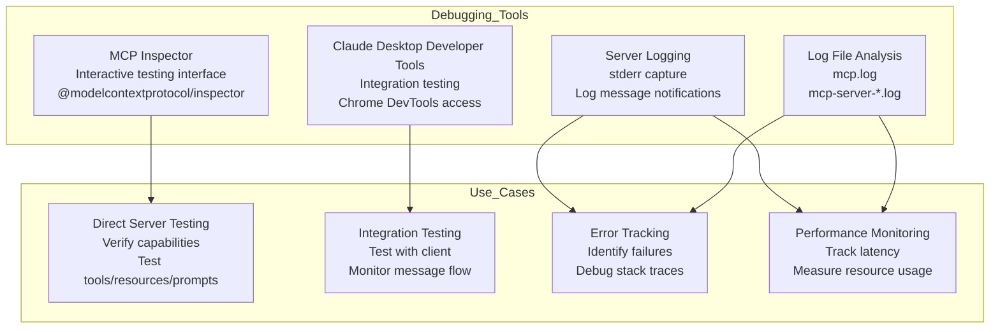
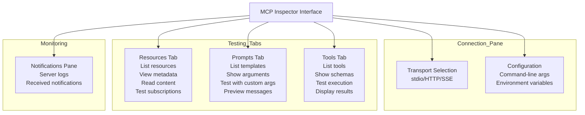
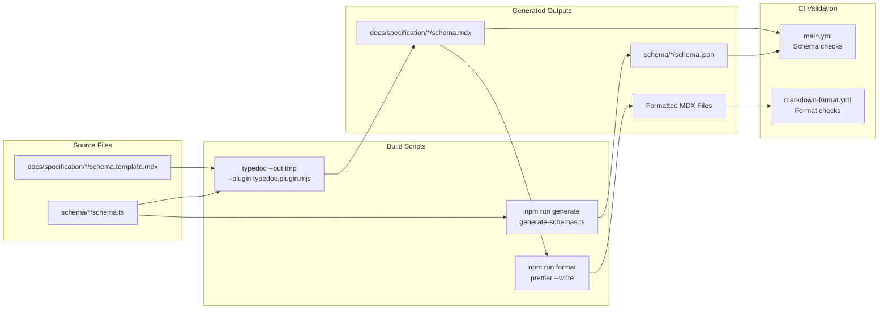

This document covers the debugging techniques, tools, and utilities available for developing and troubleshooting MCP servers and clients. It includes guidance on using the MCP Inspector, analyzing logs, leveraging Chrome DevTools, and addressing common issues during development.

For information about the MCP Inspector specifically, see [page 9.1](9.1). For the broader development guide and build system, see [page 7](7).

## Debugging Tools Overview

MCP provides several tools and techniques for debugging at different levels:



**Debugging Workflow:**

1. **Initial Development**: Use MCP Inspector for basic testing and capability verification
2. **Integration Testing**: Test in Claude Desktop with log monitoring
3. **Error Investigation**: Analyze logs and use Chrome DevTools for client-side issues
4. **Performance Analysis**: Monitor message exchanges and operation timing

**Sources:** [docs/docs/tools/inspector.mdx:1-160](), [docs/legacy/tools/debugging.mdx:1-295]()

## MCP Inspector

The MCP Inspector is an interactive developer tool for testing and debugging MCP servers. It provides a web-based interface for direct server interaction without requiring a full client application.

### Installation and Usage

The Inspector runs via `npx` without requiring installation:

```bash
npx @modelcontextprotocol/inspector <command>
```

**Common usage patterns:**

| Use Case | Command |
|----------|---------|
| Test npm package | `npx @modelcontextprotocol/inspector npx @modelcontextprotocol/server-filesystem /path` |
| Test PyPI package | `npx @modelcontextprotocol/inspector uvx mcp-server-git --repository ~/code` |
| Test local TypeScript | `npx @modelcontextprotocol/inspector node path/to/server/index.js args...` |
| Test local Python | `npx @modelcontextprotocol/inspector uv --directory path/to/server run package-name args...` |

**Sources:** [docs/docs/tools/inspector.mdx:1-76]()

### Inspector Features

The Inspector interface provides several tabs for comprehensive server testing:



**Key capabilities:**

- **Resources Tab**: List all available resources, inspect metadata (MIME types, descriptions), read resource content, test subscription mechanisms
- **Prompts Tab**: Display prompt templates, show argument requirements, test prompts with custom parameters, preview generated messages
- **Tools Tab**: List available tools with schemas, test tool execution with custom inputs, display execution results
- **Notifications Pane**: View all server logs and notifications in real-time

**Sources:** [docs/docs/tools/inspector.mdx:78-116]()

### Development Workflow with Inspector

The Inspector supports an iterative development cycle:

1. **Initial Development**
   - Launch Inspector with your server
   - Verify basic connectivity
   - Check capability negotiation

2. **Iterative Testing**
   - Make server code changes
   - Rebuild the server
   - Reconnect the Inspector
   - Test affected features
   - Monitor message exchanges

3. **Edge Case Testing**
   - Test invalid inputs
   - Test missing arguments
   - Test concurrent operations
   - Verify error handling

**Sources:** [docs/docs/tools/inspector.mdx:117-138]()

## Claude Desktop Debugging

Claude Desktop provides built-in tools for debugging MCP server integrations.

### Checking Server Status

The Claude Desktop interface displays server connection status and available capabilities:

1. Click the MCP plug icon to view:
   - Connected servers
   - Available prompts and resources

2. Click the "Search and tools" slider icon to view:
   - Tools made available to the model

**Sources:** [docs/legacy/tools/debugging.mdx:33-44]()

### Viewing Logs

Claude Desktop writes MCP-related logs to platform-specific directories:

| Platform | Log Location |
|----------|--------------|
| macOS | `~/Library/Logs/Claude/` |
| Windows | `%APPDATA%\Claude\logs\` |

**Log files:**

- `mcp.log`: General MCP connection events and failures
- `mcp-server-SERVERNAME.log`: stderr output from named server

**Viewing logs in real-time:**

```bash
# macOS/Linux
tail -n 20 -f ~/Library/Logs/Claude/mcp*.log

# Windows
type "%APPDATA%\Claude\logs\mcp*.log"
```

**Sources:** [docs/legacy/tools/debugging.mdx:46-60]()

### Chrome DevTools Integration

Access Chrome's developer tools inside Claude Desktop to investigate client-side errors:

1. Enable DevTools by creating `developer_settings.json`:

```bash
echo '{"allowDevTools": true}' > ~/Library/Application\ Support/Claude/developer_settings.json
```

2. Open DevTools with `Command-Option-Shift-i`

**DevTools windows:**

- Main content window: Application UI
- App title bar window: Window chrome

**Useful panels:**

- **Console**: Inspect client-side errors and warnings
- **Network**: Inspect message payloads and connection timing

**Sources:** [docs/legacy/tools/debugging.mdx:62-79]()

## Common Issues and Troubleshooting

### Working Directory Issues

When using MCP servers with Claude Desktop, the working directory may be undefined (like `/` on macOS) since Claude Desktop can be started from anywhere.

**Solution**: Always use absolute paths in configuration and `.env` files:

```json
{
  "command": "npx",
  "args": [
    "-y",
    "@modelcontextprotocol/server-filesystem",
    "/Users/username/data"
  ]
}
```

Instead of relative paths like `./data`.

**Sources:** [docs/legacy/tools/debugging.mdx:86-109]()

### Environment Variables

MCP servers inherit only a subset of environment variables automatically: `USER`, `HOME`, and `PATH`.

To override defaults or provide custom variables, specify an `env` key in `claude_desktop_config.json`:

```json
{
  "myserver": {
    "command": "mcp-server-myapp",
    "env": {
      "MYAPP_API_KEY": "some_key"
    }
  }
}
```

**Sources:** [docs/legacy/tools/debugging.mdx:111-126]()

### Server Initialization Problems

Common initialization issues:

| Problem | Cause | Solution |
|---------|-------|----------|
| Server not found | Incorrect executable path | Use absolute path for `command` |
| Missing files | Required files not present | Verify all dependencies installed |
| Permission denied | Insufficient permissions | Check file permissions and ownership |
| Configuration error | Invalid JSON syntax | Validate JSON structure |
| Missing variables | Environment variables not set | Add to `env` key in config |

**Sources:** [docs/legacy/tools/debugging.mdx:128-146]()

### Connection Problems

When servers fail to connect:

1. Check Claude Desktop logs for error messages
2. Verify server process is running
3. Test standalone with MCP Inspector
4. Verify protocol compatibility

**Sources:** [docs/legacy/tools/debugging.mdx:148-155]()

## Styling System

Custom CSS provides Mintlify-specific styling for schema pages, feature matrices, and section numbering.

### CSS Architecture

The styling system is organized into functional sections:

```mermaid
graph TB
    StyleCSS["docs/style.css<br/>Custom Styles"]
    
    subgraph "Base Styles"
        FontMono["--font-mono<br/>JetBrains Mono + fallbacks"]
        Headings["h5/h6 font-weight<br/>500/400"]
    end
    
    subgraph "Feature Matrix Styles"
        TableLayout["table-layout: fixed<br/>font-size: 0.75rem"]
        CellAlign["text-align: center<br/>padding: 0.25rem"]
        FirstCol["First column left-align"]
    end
    
    subgraph "Section Numbering"
        EnableFlag["#enable-section-numbers<br/>display: none"]
        Counters["h2-h6 counters<br/>Hierarchical numbering"]
        BeforeContent["::before pseudo-elements<br/>counter() content"]
    end
    
    subgraph "Schema Reference Styles"
        SchemaFlag["#schema-reference<br/>display: none"]
        TSDComment["tsd-comment margin<br/>First/last child"]
        TSDSignature["tsd-signature styling<br/>Code block appearance"]
        TSDMember["tsd-member layout<br/>Property formatting"]
        HideElements["Hidden elements<br/>anchor-icon/tag/sources"]
    end
    
    StyleCSS --> FontMono
    StyleCSS --> Headings
    StyleCSS --> TableLayout
    StyleCSS --> CellAlign
    StyleCSS --> FirstCol
    StyleCSS --> EnableFlag
    StyleCSS --> Counters
    StyleCSS --> BeforeContent
    StyleCSS --> SchemaFlag
    StyleCSS --> TSDComment
    StyleCSS --> TSDSignature
    StyleCSS --> TSDMember
    StyleCSS --> HideElements
```



**Sources:** [docs/style.css:1-207]()

### Schema Reference Styling

The schema reference pages generated by TypeDoc require extensive custom styling to match Mintlify's design:

**TypeDoc Signature Blocks:**

The `.tsd-signature` class styles TypeScript type signatures to match Mintlify's code blocks:

| Property | Value | Purpose |
|----------|-------|---------|
| `font-family` | `var(--font-mono)` | Monospace font from Mintlify theme |
| `font-size` | `0.875rem` | Match Mintlify code size |
| `margin` | `1.25rem 0` | Vertical spacing |
| `border` | `1px solid` with light-dark color | Border matching Mintlify |
| `border-radius` | `1rem` | Rounded corners |
| `padding` | `1rem 0.875rem` | Internal spacing |

**Syntax Highlighting Colors:**

Light and dark mode colors for TypeScript elements:

- `.tsd-signature-keyword`: `rgb(207, 34, 46)` light / `#9CDCFE` dark
- `.tsd-kind-interface`, `.tsd-kind-type-alias`: `rgb(149, 56, 0)` light / `#4EC9B0` dark
- `.tsd-signature-type`: `rgb(5, 80, 174)` light / `#DCDCAA` dark

**Member Layout:**

Property documentation uses indented layout with monospace headings:

- `[data-typedoc-h="3"]`: Property names in monospace with `scroll-margin-top: 8rem`
- Comments and type declarations indented `1.25rem`
- `[data-typedoc-h="4"]`: Hidden (redundant "Type declaration" headers)
- `[data-typedoc-h="5"]`: Nested property names with subtle background

**Hidden Elements:**

TypeDoc elements not needed in Mintlify context:
- `.tsd-anchor-icon`: Internal TypeDoc anchors
- `.tsd-tag`: JSDoc tag badges
- `.tsd-signature`: Within member context (shown separately)
- `.tsd-sources`: Source file locations

**Sources:** [docs/style.css:104-206]()

### Feature Support Matrix Styling

The client feature support matrix on `clients.mdx` uses custom table styling:

- Table wrapper: `#feature-support-matrix-wrapper`
- Fixed layout with small font: `table-layout: fixed; font-size: 0.75rem`
- Centered cells: `text-align: center; padding: 0.25rem`
- First column left-aligned: Client names

This creates a compact, scannable comparison table.

**Sources:** [docs/style.css:13-30]()

### Section Numbering System

Optional hierarchical section numbering is enabled via CSS counters when a page includes `<div id="enable-section-numbers">`:

**Counter Hierarchy:**

The system maintains six counter levels (`h2-counter` through `h6-counter`) that reset appropriately:
- `h2` resets `h3-h6`
- `h3` resets `h4-h6`
- `h4` resets `h5-h6`
- `h5` resets `h6`

**Number Generation:**

`::before` pseudo-elements prepend hierarchical numbers:
- `h2`: `"1. "`
- `h3`: `"1.1 "`
- `h4`: `"1.1.1 "`
- `h5`: `"1.1.1.1 "`
- `h6`: `"1.1.1.1.1 "`

Numbers also appear in the table of contents via `#table-of-contents li[data-depth="N"] a::before` selectors.

**Usage:**

Pages include `<div id="enable-section-numbers" style="display: none;"></div>` to activate numbering. The div is hidden but its presence triggers the `:has()` selector.

**Sources:** [docs/style.css:33-100]()

## Build Pipeline Integration

The documentation systems integrate with the repository's build pipeline through npm scripts and CI workflows.

### Generation Workflow



**Key npm scripts:**

| Script | Command | Purpose |
|--------|---------|---------|
| `generate` | Runs `generate-schemas.ts` | Generate JSON schemas and MDX templates |
| `format` | `prettier --write docs/` | Format all documentation files |
| `check:format` | `prettier --check docs/` | Validate formatting in CI |

**CI Workflows:**

- `.github/workflows/main.yml`: Validates generated schemas match committed files
- `.github/workflows/markdown-format.yml`: Ensures consistent formatting

**Exclusions:**

Generated files are excluded from manual editing:
- `.prettierignore`: Excludes `docs/specification/*/schema.md` and `.mdx`
- `.gitattributes`: Marks schema files as `linguist-generated=true`

**Sources:** [.prettierignore:1-3](), [.gitattributes:1-5](), Diagram 6 from high-level overview

### TypeDoc Configuration

TypeDoc is configured through `typedoc.config.mjs`:

```javascript
{
  out: "tmp",  // Temporary output (stdout captures actual output)
  excludeInternal: true,
  excludeTags: ["@format", "@maximum", "@minimum", "@TJS-type"],
  disableSources: true,
  logLevel: "Error",
  plugin: ["./typedoc.plugin.mjs"]
}
```

The `schema-page` output format is registered by the plugin and set as default. The `schemaPageTemplate` option points to version-specific template files:

```bash
typedoc \
  --schemaPageTemplate docs/specification/2025-11-25/schema.template.mdx \
  schema/2025-11-25/schema.ts
```

Output is written to stdout and redirected to the final `.mdx` file.

**Sources:** [typedoc.config.mjs:1-19](), [typedoc.plugin.mjs:31]()

## URL and Redirect Management

The redirect system ensures stable URLs while supporting evolving documentation structure.

### Latest Version Redirects

The primary redirect pattern handles versioned specification access:

```json
{
  "source": "/specification/latest",
  "destination": "/specification/2025-11-25",
  "permanent": false
}
```

The non-permanent redirect allows updating the target version without breaking external links. The pattern-based redirect handles sub-paths:

```json
{
  "source": "/specification/latest/:slug*",
  "destination": "/specification/2025-11-25/:slug*",
  "permanent": false
}
```

This enables `/specification/latest/basic/lifecycle` to resolve to the current version's lifecycle documentation.

### Legacy Path Redirects

Additional redirects maintain backward compatibility for renamed or relocated content:

| Old Path | New Path | Type |
|----------|----------|------|
| `/tutorials/building-a-client` | `/docs/develop/build-client` | Permanent |
| `/quickstart` | `/docs/develop/build-server` | Permanent |
| `/docs/concepts/architecture` | `/docs/learn/architecture` | Permanent |
| `/docs/concepts/elicitation` | `/specification/2025-06-18/client/elicitation` | Permanent |
| `/docs/concepts/*` | Various specification/docs paths | Permanent |
| `/introduction` | `/docs/getting-started/intro` | Permanent |

These permanent redirects help maintain SEO and prevent broken external links from previous documentation structures.

**Sources:** [docs/docs.json:368-455]()

---

This technical infrastructure enables the MCP project to maintain high-quality, multi-versioned documentation with clear separation between technical specifications (Mintlify) and community announcements (Hugo blog). The TypeDoc plugin bridges TypeScript type definitions and human-readable documentation, while the styling system ensures visual consistency across generated and hand-written content.