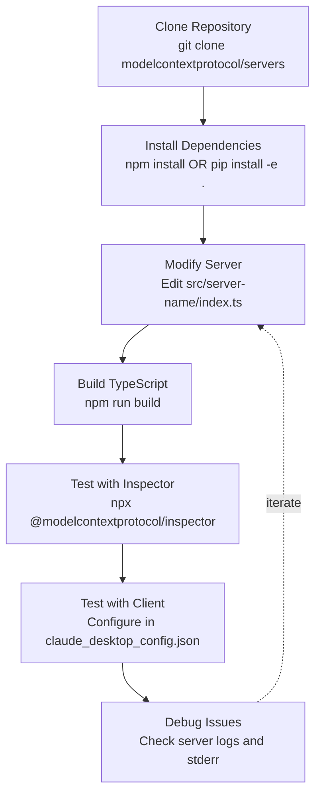

npx -y @modelcontextprotocol/server-filesystem /path/to/directory
```

### Python Server Execution

```bash
# Using uvx (recommended)
uvx mcp-server-git

# Using pip installation
pip install mcp-server-git
python -m mcp_server_git
```

**Sources:** [docs/examples.mdx:66-81]()

## Testing and Development

### Using Reference Servers for Testing

Reference servers provide a stable foundation for validating MCP implementations:

| Testing Purpose | How Reference Servers Help |
|----------------|---------------------------|
| **Protocol Conformance** | Validate client implementations against known-good server behavior |
| **Feature Verification** | Test client support for tools, resources, and prompts using servers that fully implement each feature |
| **SDK Validation** | Verify SDK functionality in different languages against reference implementations |
| **Integration Testing** | Test client-server communication patterns and error handling |
| **Performance Benchmarking** | Establish baseline performance metrics for MCP operations |

### Development Workflow



### Local Development Setup

**Clone and install reference servers:**

```bash
# Clone the repository
git clone https://github.com/modelcontextprotocol/servers.git
cd servers

# Install dependencies (TypeScript servers)
npm install

# Build TypeScript servers
npm run build

# For Python servers
cd src/git
pip install -e .
```

**Testing with MCP Inspector:**

The MCP Inspector provides interactive testing of server implementations:

```bash