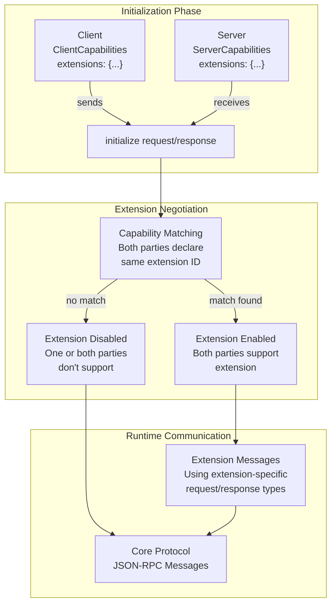
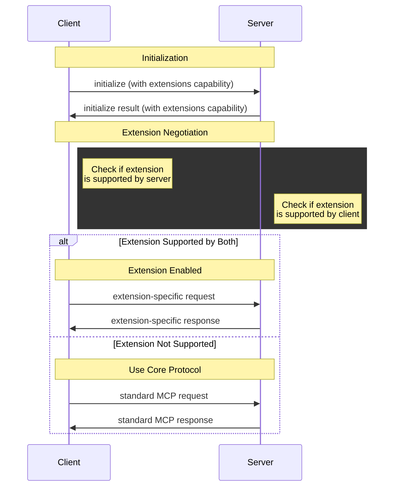
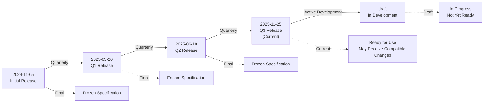
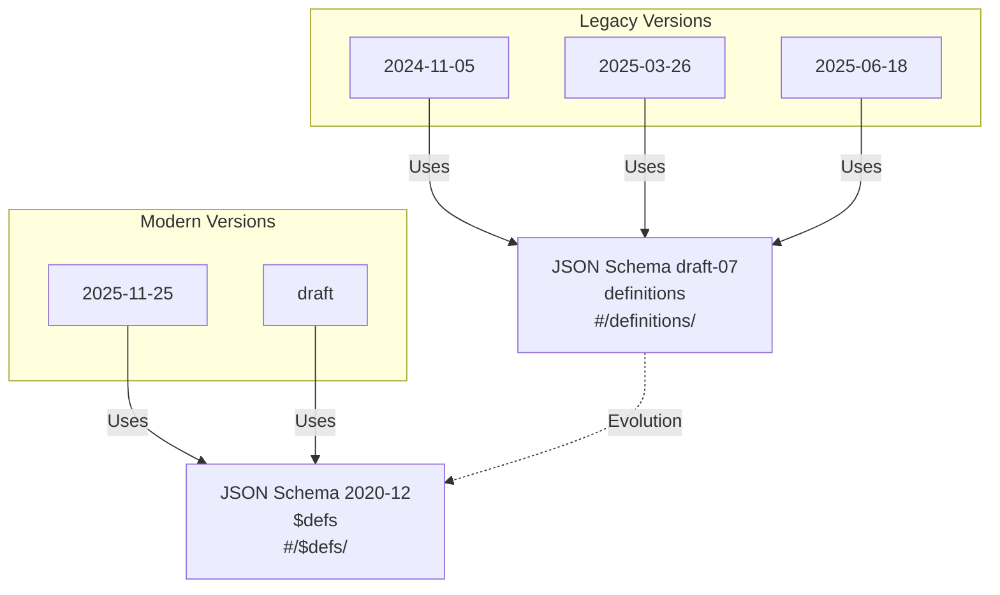
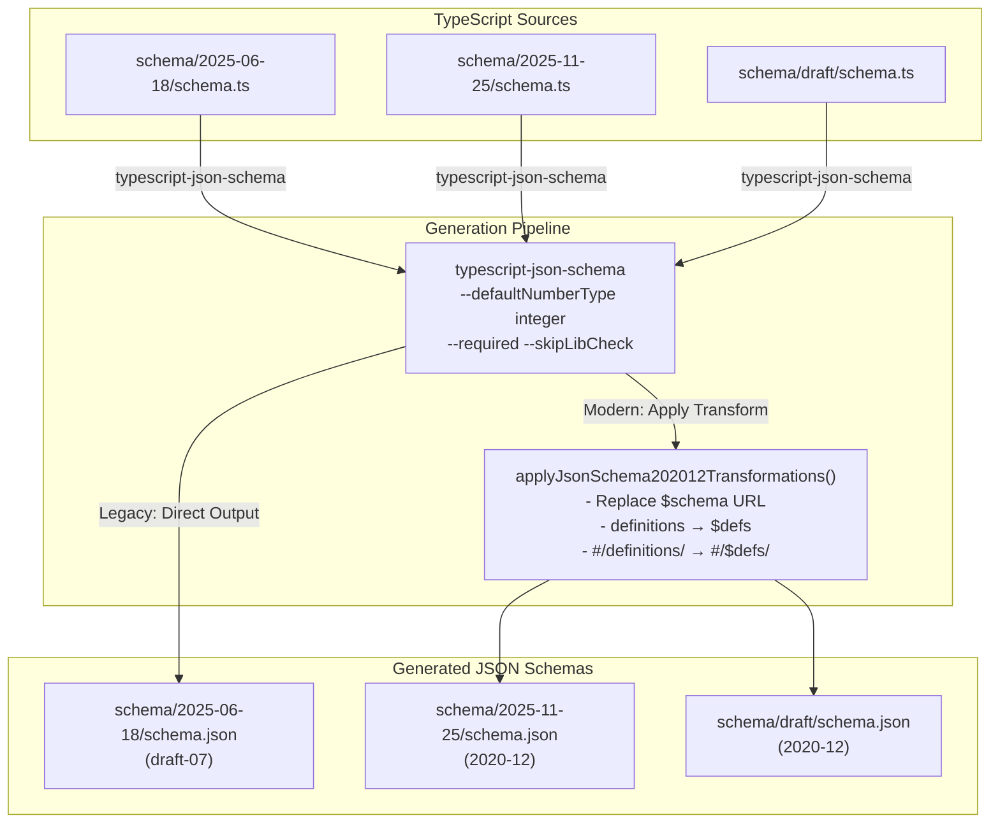
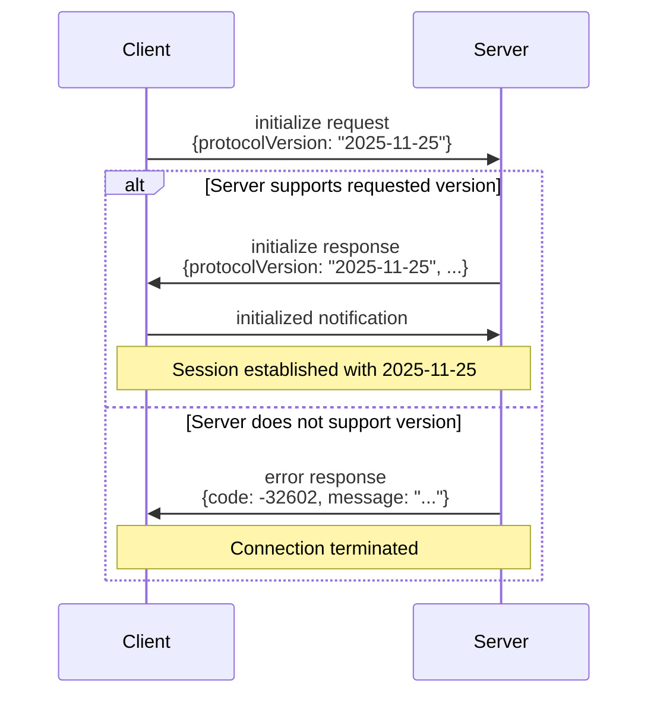

## Purpose and Scope

This page documents the Extensions Framework for the Model Context Protocol (MCP), which provides a standardized mechanism for extending MCP with optional, composable capabilities beyond the core protocol. The framework defines how extensions are identified, governed, implemented, and negotiated between clients and servers.

The Extensions Framework enables the MCP ecosystem to evolve while maintaining core protocol stability. It establishes clear processes for both official extensions (maintained by MCP maintainers) and experimental extensions (incubation pathways for community collaboration).

For information about the core protocol specification, see [Protocol Specification](#2). For details about specific authorization extensions, see [Authorization and Security](#3). For information about MCP Apps (an official extension), see the [MCP Apps documentation](https://github.com/modelcontextprotocol/ext-apps).

## Extension Identification and Naming

Extensions are identified using a unique extension identifier with the format `{vendor-prefix}/{extension-name}`. The vendor prefix should be a reversed domain name that the extension author owns or controls, following Java package naming conventions. For example:

- `io.modelcontextprotocol/oauth-client-credentials` (official MCP extension)
- `com.example/websocket-transport` (third-party extension)

Extension identifiers follow the same naming rules as `_meta` keys [schema/draft/schema.ts:20-34](), with the requirement that the prefix is mandatory. Breaking changes must use a new identifier (e.g., `io.modelcontextprotocol/oauth-client-credentials-v2`), where a breaking change is defined as any modification that would cause existing compliant implementations to fail or behave incorrectly.

Sources: [seps/2133-extensions.md:20-30]()

## Extension Types

The Extensions Framework defines three categories of extensions:

### Official Extensions

Official extensions are maintained within the MCP GitHub organization and are officially developed and recommended by MCP maintainers. They use the `io.modelcontextprotocol` vendor prefix.

**Extension Repository Structure:**
- Located at `https://github.com/modelcontextprotocol/ext-{category}` (e.g., `ext-auth`, `ext-apps`)
- Created at core maintainers' discretion to group extensions by area
- Each repository has a `MAINTAINERS.md` file identifying repository maintainers
- Maintainers are appointed by core maintainers and responsible for day-to-day governance
- Extensions should have an associated working group or interest group

**Extension Specifications:**
- Versioned specification documents within extension repositories
- Must use the same language as the core specification (RFC 2119 / BCP 14)
- Should be worded as if they were part of the core specification

Core maintainers retain ultimate authority over official extensions, including the ability to modify, deprecate, or remove any extension.

### Experimental Extensions

Experimental extensions provide an incubation pathway for Working Groups and Interest Groups to prototype ideas and collaborate before formal SEP submission. They allow cross-company collaboration under neutral governance with clear anti-trust protection.

**Experimental Repository Structure:**
- Located at `https://github.com/modelcontextprotocol/experimental-ext-{name}`
- Any maintainer may create an experimental extension repository while the associated SEP is in draft state
- Must be associated with a Working Group or Interest Group
- Must clearly indicate experimental/non-official status in README
- Published packages must use naming that clearly indicates experimental status
- Core maintainers retain oversight and can archive or remove repositories

**Graduation Path:**
- To graduate to official status, the standard SEP process (Extensions Track) applies
- The experimental repository and reference implementations may be referenced in the SEP
- Once approved, the extension moves to an official extension repository

### Unofficial Extensions

Unofficial extensions are not recognized by MCP governance and may be introduced and governed by developers outside the MCP organization. They use vendor prefixes other than `io.modelcontextprotocol`.

Sources: [seps/2133-extensions.md:36-64]()

## Extension Capability Negotiation

Extensions are negotiated during the MCP initialization handshake through the `extensions` field in client and server capabilities. Both `ClientCapabilities` and `ServerCapabilities` include an optional `extensions` object [schema/draft/schema.ts:559-566]() and [schema/draft/schema.ts:675-683]().

### Capability Declaration

Extensions are declared as a map where keys are extension identifiers and values are per-extension settings objects:

```json
{
  "capabilities": {
    "extensions": {
      "io.modelcontextprotocol/apps": {
        "mimeTypes": ["text/html;profile=mcp-app"]
      },
      "io.modelcontextprotocol/oauth-client-credentials": {}
    }
  }
}
```

An empty object indicates support with no settings. Clients and servers must only use extensions that have been declared by both parties.

### Extension Settings

Extensions may have settings that are sent in client/server messages for fine-grained configuration. For example, the MCP Apps extension includes `mimeTypes` to specify supported MIME types [schema/draft/examples/ClientCapabilities/extensions-ui-mime-types.json]().

Sources: [schema/draft/schema.ts:559-566](), [schema/draft/schema.ts:675-683](), [schema/draft/examples/ClientCapabilities/extensions-ui-mime-types.json](), [schema/draft/examples/ServerCapabilities/extensions-ui.json]()

## Official Extensions

### MCP Apps Extension

The MCP Apps extension (`io.modelcontextprotocol/apps`) enables servers to deliver interactive user interfaces to hosts. This extension introduces:

- **UI Resources**: Predeclared resources using the `ui://` URI scheme
- **Resource Discovery**: Tools reference UI resources via metadata
- **Bi-directional Communication**: UI iframes communicate with hosts using standard MCP JSON-RPC protocol
- **Security Model**: Mandatory iframe sandboxing with auditable communication

The initial specification focuses on HTML content (`text/html;profile=mcp-app`) with extensibility for future formats. Full specification is maintained in the [ext-apps repository](https://github.com/modelcontextprotocol/ext-apps).

### Authorization Extensions

Authorization extensions extend MCP's OAuth 2.1-based authorization system with additional capabilities:

- **OAuth Client Credentials** (`io.modelcontextprotocol/oauth-client-credentials`): Supports machine-to-machine authorization flows
- **Enterprise Managed Authorization** (`io.modelcontextprotocol/enterprise-managed-authorization`): Enables enterprise IdP policy controls during MCP OAuth flows

These extensions are maintained in the [ext-auth repository](https://github.com/modelcontextprotocol/ext-auth).

Sources: [seps/1865-mcp-apps-interactive-user-interfaces-for-mcp.md:18-82](), [docs/community/seps/2133-extensions.mdx:55-67]()

## Extension Lifecycle

### Creation Phase

Extensions may optionally begin as experimental extensions to facilitate prototyping and collaboration before formal submission. This incubation period is encouraged but not required.

To become an official extension, extensions are created via a SEP in the main MCP repository using the standard SEP guidelines with a new type: **Extensions Track**. This type follows the same review and acceptance process as Standards Track SEPs but clearly indicates the proposal is for an extension rather than a core protocol addition.

**Extension SEP Requirements:**
- Should be discussed and iterated on in a relevant working group prior to submission
- Must have at least one reference implementation in an official SDK prior to review
- May reference an existing experimental extension repository and implementations developed during incubation
- Will be reviewed by Core Maintainers, who have final authority over inclusion as an Official Extension

### Implementation Phase

Once approved, the extension author should produce a PR that:
1. Introduces the extension to the appropriate extension repository
2. Adds reference in the main specification
3. Includes reference implementations in official SDKs

### Maintenance Phase

Day-to-day governance is delegated to extension repository maintainers, but core maintainers retain ultimate authority over official extensions.

Sources: [seps/2133-extensions.md:66-80]()

## Extension Framework Architecture

The following diagram illustrates how extensions fit into the MCP protocol architecture and how they are negotiated:



Sources: [schema/draft/schema.ts:559-566](), [schema/draft/schema.ts:675-683]()

## Extension Message Flow

The following diagram shows how extension-specific messages are processed within the MCP protocol:



Sources: [schema/draft/schema.ts:387-436]()

## Extension Settings and Configuration

Extensions may include settings that are sent in client/server messages for fine-grained configuration. Settings are passed as values in the `extensions` capability object during initialization.

### Example: MCP Apps MIME Type Configuration

The MCP Apps extension allows clients to declare supported MIME types:

```json
{
  "capabilities": {
    "extensions": {
      "io.modelcontextprotocol/apps": {
        "mimeTypes": ["text/html;profile=mcp-app", "text/html"]
      }
    }
  }
}
```

Servers can then use this information to determine which content types to use when delivering UI resources.

### Example: Empty Settings

Extensions that don't require configuration use an empty object:

```json
{
  "capabilities": {
    "extensions": {
      "io.modelcontextprotocol/oauth-client-credentials": {}
    }
  }
}
```

Sources: [schema/draft/examples/ClientCapabilities/extensions-ui-mime-types.json](), [schema/draft/examples/ServerCapabilities/extensions-ui.json]()

## Extension Governance and SEP Process

Extensions are governed through the Specification Enhancement Proposal (SEP) process. SEP-2133 established the Extensions Framework itself, and subsequent extensions follow the Extensions Track type within the SEP process.

### SEP-2133: Extensions Framework

SEP-2133 (Final status) established the lightweight framework for extending MCP through optional, composable extensions. It defines:

- Extension identification and naming conventions
- Official vs. experimental vs. unofficial extension categories
- Governance model and authority structure
- Lifecycle from creation through maintenance
- Capability negotiation mechanism

### Extensions Track SEPs

Extensions Track SEPs follow the same review and acceptance process as Standards Track SEPs but are specifically for extension proposals. Recent Extensions Track SEPs include:

- **SEP-1865**: MCP Apps - Interactive User Interfaces for MCP (Final)

Sources: [seps/2133-extensions.md](), [docs/community/seps/2133-extensions.mdx](), [docs/community/seps/index.mdx:21]()

## Extension Implementation Patterns

### Declaring Extension Support

Implementations declare extension support in their capabilities during initialization:

**Server declaring MCP Apps support:**
```json
{
  "capabilities": {
    "extensions": {
      "io.modelcontextprotocol/apps": {}
    }
  }
}
```

**Client declaring MCP Apps support with MIME types:**
```json
{
  "capabilities": {
    "extensions": {
      "io.modelcontextprotocol/apps": {
        "mimeTypes": ["text/html;profile=mcp-app"]
      }
    }
  }
}
```

### Checking Extension Support

After initialization, implementations should check if both parties support an extension before using extension-specific features:

1. Check if extension ID exists in peer's `capabilities.extensions`
2. If present, extension is supported
3. If absent, extension is not supported; use core protocol only
4. If extension has settings, use those settings to configure behavior

### Handling Unsupported Extensions

If an implementation receives a request for an unsupported extension, it should:

1. Return a `METHOD_NOT_FOUND` error (code -32601) if the request method is extension-specific
2. Fall back to core protocol behavior if applicable
3. Never assume an extension is supported without explicit capability declaration

Sources: [schema/draft/schema.ts:559-566](), [schema/draft/schema.ts:675-683]()

## Extension Repository Structure

Official extension repositories follow a standardized structure:

```
ext-{category}/
├── MAINTAINERS.md              # Repository maintainers
├── specification/
│   ├── draft/
│   │   └── {extension-name}.mdx # Extension specification
│   └── {version}/
│       └── {extension-name}.mdx # Versioned specification
├── README.md                    # Repository overview
└── {language}-sdk/              # Reference implementations
    ├── src/
    └── tests/
```

**Key Files:**

- `MAINTAINERS.md`: Lists maintainers appointed by core maintainers
- `specification/draft/{extension-name}.mdx`: Current extension specification
- Reference implementations in official SDKs (TypeScript, Python, Java, etc.)

Experimental extension repositories use the `experimental-ext-` prefix and must clearly indicate their non-official status.

Sources: [seps/2133-extensions.md:36-50]()

## Extension Versioning and Breaking Changes

Extensions use semantic versioning principles. Breaking changes require a new extension identifier:

- **Non-breaking changes**: Can be made within the same extension identifier
- **Breaking changes**: Require a new identifier (e.g., `io.modelcontextprotocol/oauth-client-credentials-v2`)

**Breaking Change Definition:**
- Removing or renaming fields
- Changing field types
- Altering the semantics of existing behavior
- Adding new required fields

This approach ensures backward compatibility and allows implementations to support multiple versions of an extension simultaneously.

Sources: [seps/2133-extensions.md:30]()

## Extension Discovery and Documentation

Extensions are documented in the main MCP specification and in extension-specific repositories. The documentation site includes:

- **Extensions Overview**: High-level introduction to the Extensions Framework
- **Official Extensions**: Documentation for each official extension
- **Extension Repositories**: Links to GitHub repositories for each extension

The MCP Registry may also include information about extensions supported by registered servers.

Sources: [docs/docs.json:69-88]()

# Protocol Versioning


This document describes how the Model Context Protocol manages protocol versions, including the versioning scheme, version states, JSON Schema version evolution, and the version negotiation process between clients and servers.

For information about the lifecycle and capability negotiation that occurs during initialization (where version negotiation takes place), see [Lifecycle and Capabilities](#2.4). For details about the schema system itself and message types, see [Schema System and Message Types](#2.2).

## Version Format and Semantics

MCP uses a date-based version identifier following the format `YYYY-MM-DD`, which indicates the last date that backwards-incompatible changes were made to the protocol. This format provides an intuitive understanding of when the protocol specification was frozen.

Critically, the protocol version is **not incremented for backwards-compatible changes**. This design decision allows the protocol to receive incremental improvements, bug fixes, and new optional features while preserving interoperability between clients and servers that support the same base version.

The version string appears in several key contexts:
- Protocol initialization messages during the handshake
- JSON Schema `$id` fields in generated schema files
- Documentation URLs and directory structures
- SDK version compatibility declarations

Sources: [docs/specification/versioning.mdx:7-15]()

## Version Timeline



**Version Evolution Timeline**

The protocol has followed a quarterly release cadence since the initial release in November 2024, with each release representing a point where breaking changes were consolidated.

Sources: [blog/content/posts/2025-11-25-first-mcp-anniversary.md:260]()

## Version States

Protocol revisions are marked with one of three states that indicate their maturity and intended usage:

| State | Description | Example Use |
|-------|-------------|-------------|
| **Draft** | In-progress specifications not yet ready for consumption. Active development occurs here. | `schema/draft/schema.ts` |
| **Current** | The current protocol version, ready for production use. May continue to receive backwards-compatible changes. | `schema/2025-11-25/schema.ts` |
| **Final** | Past, complete specifications that will not be changed. Maintained for backwards compatibility. | `schema/2025-06-18/schema.ts` |

The **current** protocol version is `2025-11-25`, established in the November 2025 specification release. This version introduced significant features including task-based workflows, simplified authorization flows with Client ID Metadata Documents, and sampling with tools.

Sources: [docs/specification/versioning.mdx:18-27]()

## JSON Schema Version Evolution

A significant aspect of protocol versioning is the evolution of the underlying JSON Schema standard used to define message formats. The protocol's schema definitions have transitioned from JSON Schema draft-07 to JSON Schema 2020-12.

### Legacy Schema Versions

The following protocol versions use **JSON Schema draft-07**:

- `2024-11-05` - Initial release
- `2025-03-26` - Q1 2025 release  
- `2025-06-18` - Q2 2025 release

These versions use the older schema format with:
- `$schema: "http://json-schema.org/draft-07/schema#"`
- Type definitions under `"definitions"`
- References using `#/definitions/`

### Modern Schema Versions

Starting with the Q3 2025 release, the protocol adopted **JSON Schema 2020-12**:

- `2025-11-25` - Q3 2025 release (current)
- `draft` - Active development

Modern versions use:
- `$schema: "https://json-schema.org/draft/2020-12/schema"`
- Type definitions under `"$defs"` (the new standard term)
- References using `#/$defs/`



**JSON Schema Version Mapping**

This transition was necessary to adopt modern JSON Schema features and align with current industry standards. The schema generation pipeline automatically handles the differences between legacy and modern formats.

Sources: [scripts/generate-schemas.ts:10-14]()

## Schema Generation Pipeline

The repository maintains TypeScript schemas as the canonical source of truth, with automated generation of JSON Schema files for machine consumption. The generation process differs based on whether a version is legacy or modern.



**Schema Generation Architecture**

The generation script distinguishes between version classes:

```typescript
// From scripts/generate-schemas.ts
const LEGACY_SCHEMAS = ['2024-11-05', '2025-03-26', '2025-06-18'];
const MODERN_SCHEMAS = ['2025-11-25', 'draft'];
```

For modern schemas, transformations are applied to convert the draft-07 output from `typescript-json-schema` into 2020-12 format:

```typescript
function applyJsonSchema202012Transformations(schemaPath: string): void {
  let content = readFileSync(schemaPath, 'utf-8');
  
  // Replace $schema URL
  content = content.replace(
    /http:\/\/json-schema\.org\/draft-07\/schema#/g,
    'https://json-schema.org/draft/2020-12/schema'
  );
  
  // Replace "definitions": with "$defs":
  content = content.replace(/"definitions":/g, '"$defs":');
  
  // Replace #/definitions/ with #/$defs/
  content = content.replace(/#\/definitions\//g, '#/$defs/');
  
  writeFileSync(schemaPath, content, 'utf-8');
}
```

Sources: [scripts/generate-schemas.ts:10-47]()

## Version Negotiation Process

Version negotiation between clients and servers occurs during protocol initialization. Both parties communicate their supported protocol versions and must agree on a single version to use for the session.



**Version Negotiation Sequence**

The negotiation process follows these rules:

1. **Client Proposal**: The client initiates negotiation by sending an `initialize` request containing its preferred `protocolVersion` string
2. **Server Validation**: The server checks whether it supports the requested version
3. **Agreement**: If supported, the server responds with the same version string in the `initialize` response, establishing agreement
4. **Rejection**: If not supported, the server returns an error, and the client may attempt with a different version or terminate the connection

Clients and servers **MAY** support multiple protocol versions simultaneously, implementing version-specific behavior as needed. However, they **MUST** agree on exactly one version for each session.

The protocol provides appropriate error handling when version negotiation fails, allowing clients to gracefully terminate connections when compatibility cannot be established.

Sources: [docs/specification/versioning.mdx:29-38]()

## Schema Directory Structure

The repository organizes schemas by version in a predictable directory structure:

```
schema/
├── 2024-11-05/
│   ├── schema.ts          # TypeScript source (canonical)
│   ├── schema.json        # Generated JSON Schema (draft-07)
│   └── schema.mdx         # Template for documentation generation
├── 2025-03-26/
│   ├── schema.ts
│   ├── schema.json        # Generated JSON Schema (draft-07)
│   └── schema.mdx
├── 2025-06-18/
│   ├── schema.ts
│   ├── schema.json        # Generated JSON Schema (draft-07)
│   └── schema.mdx
├── 2025-11-25/
│   ├── schema.ts
│   ├── schema.json        # Generated JSON Schema (2020-12)
│   └── schema.mdx
└── draft/
    ├── schema.ts
    ├── schema.json        # Generated JSON Schema (2020-12)
    └── schema.mdx
```

Each version directory contains:

- **`schema.ts`**: TypeScript type definitions - the canonical source of truth
- **`schema.json`**: Generated JSON Schema for machine validation and tooling
- **`schema.mdx`**: Template used to generate human-readable documentation via TypeDoc

The generated documentation appears in the corresponding documentation directory:

```
docs/specification/
├── 2024-11-05/
│   └── schema.mdx         # Generated from TypeScript
├── 2025-03-26/
│   └── schema.mdx
├── 2025-06-18/
│   └── schema.mdx
├── 2025-11-25/
│   └── schema.mdx
└── draft/
    └── schema.mdx
```

Sources: [README.md:11-13](), [package.json:31-35]()

## Working with Schema Versions

### Referencing Versions in Code

When implementing clients or servers, reference the specific protocol version being implemented:

```typescript
// Client initialization
const initializeRequest = {
  jsonrpc: "2.0",
  method: "initialize",
  params: {
    protocolVersion: "2025-11-25",
    capabilities: { /* ... */ },
    clientInfo: { /* ... */ }
  }
};
```

### Validation Against Schema Files

The generated JSON Schema files in `schema/*/schema.json` can be used with standard JSON Schema validators for runtime validation:

```typescript
import Ajv from 'ajv';
import schema from './schema/2025-11-25/schema.json';

const ajv = new Ajv();
const validate = ajv.compile(schema);
const valid = validate(message);
```

### Generating Schemas

To regenerate all JSON Schema files after modifying TypeScript sources:

```bash
npm run generate:schema:json
```

This runs the generation script in parallel for all versions. To verify that committed schemas match the TypeScript sources:

```bash
npm run check:schema:json
```

The check command is used in CI to ensure schemas stay synchronized with their TypeScript definitions.

Sources: [package.json:33-34](), [scripts/generate-schemas.ts:115-143]()

## Multi-Version Support Patterns

Implementations that need to support multiple protocol versions can use version-specific logic:

```typescript
class MCPClient {
  private protocolVersion: string;
  
  async connect(preferredVersion: string = "2025-11-25") {
    const response = await this.negotiate(preferredVersion);
    this.protocolVersion = response.protocolVersion;
  }
  
  private isFeatureSupported(feature: string): boolean {
    const versionMap = {
      "tasks": ["2025-11-25", "draft"],
      "elicitation": ["2025-11-25", "draft"],
      "sampling_with_tools": ["2025-11-25", "draft"]
    };
    
    return versionMap[feature]?.includes(this.protocolVersion) ?? false;
  }
}
```

This pattern allows implementations to gracefully degrade functionality based on the negotiated protocol version, maintaining compatibility with older servers while supporting newer features when available.

Sources: [docs/specification/versioning.mdx:32-38](), [blog/content/posts/2025-11-25-first-mcp-anniversary.md:130-264]()

## Version Release Cadence

MCP follows a quarterly release cadence, with major versions released approximately every three months:

| Quarter | Release Date | Version | Key Features |
|---------|--------------|---------|--------------|
| Q4 2024 | 2024-11-05 | Initial | Foundation protocol |
| Q1 2025 | 2025-03-26 | First update | Refinements |
| Q2 2025 | 2025-06-18 | Mid-year | Additional capabilities |
| Q3 2025 | 2025-11-25 | Current | Tasks, simplified auth, sampling with tools |

Between releases, the `draft` version receives active development for features targeted at the next release. Once a version is released, it moves from "draft" to "current" state, and the previous "current" version becomes "final."

This cadence allows the protocol to evolve based on real-world deployment feedback while maintaining stability for production implementations.

Sources: [blog/content/posts/2025-11-25-first-mcp-anniversary.md:253-263]()