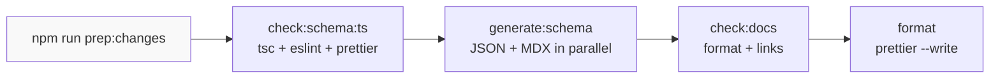
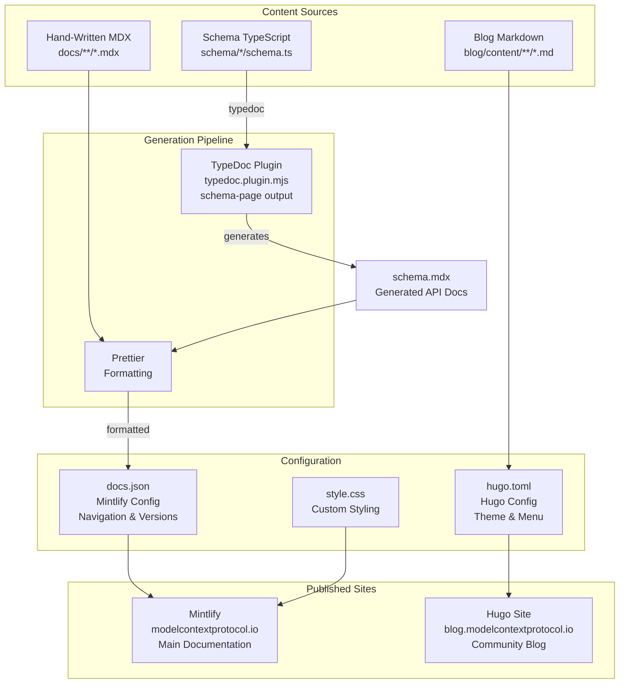
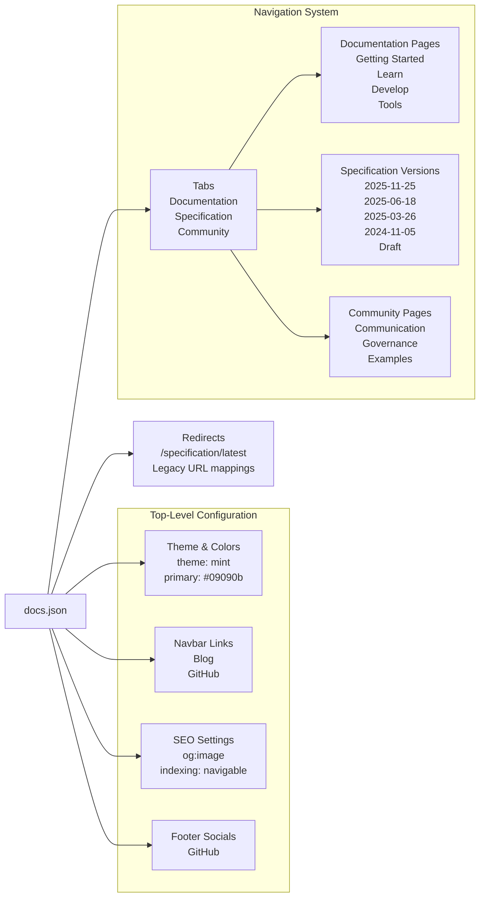
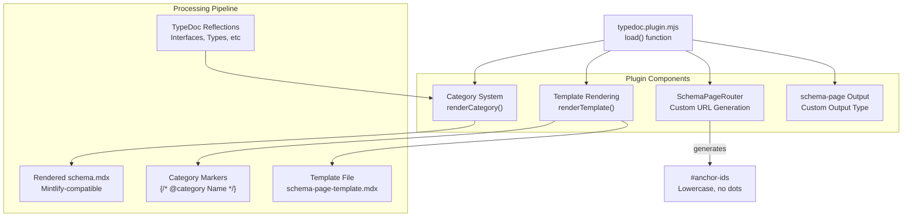
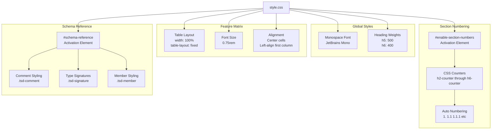
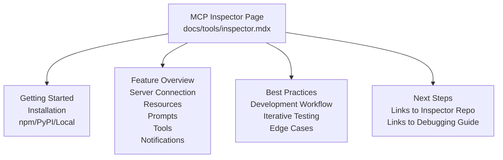

typedoc --entryPoints "${f%.mdx}.ts" --schemaPageTemplate "$f" | \
  cmp docs/specification/$(basename -- $(dirname -- "$f"))/schema.mdx -
```

**Sources:** [package.json:31]()

## Developer Workflow Integration

The build system provides a convenience script that orchestrates the complete development workflow:



**Sources:** [package.json:36]()

**Typical Development Flow:**

1. Edit TypeScript schema sources in `schema/draft/schema.ts`
2. Run `npm run prep:changes` to:
   - Validate TypeScript compilation and linting
   - Regenerate JSON and MDX artifacts
   - Validate documentation formatting and links
   - Auto-format all Markdown files
3. Review generated changes in `schema/draft/schema.json` and `docs/specification/draft/schema.mdx`
4. Commit all changes together (sources + generated artifacts)

**Sources:** [CONTRIBUTING.md:42-76]()

## Build Tool Configuration

### Prettier Configuration

Prettier enforces consistent formatting with repository-specific overrides:

```json
{
  "overrides": [
    {
      "files": "*.{md,mdx}",
      "options": {
        "proseWrap": "preserve"
      }
    }
  ]
}
```

The `proseWrap: "preserve"` setting prevents Prettier from reflowing prose, which is critical for Markdown files where line breaks may have semantic meaning.

**Sources:** [package.json:13-22]()

### TypeDoc Configuration

TypeDoc is configured to produce clean output for the custom plugin:

```javascript
{
  out: "tmp",
  excludeInternal: true,
  excludeTags: ["@format", "@maximum", "@minimum", "@TJS-type"],
  disableSources: true,
  logLevel: "Error",
  plugin: ["./typedoc.plugin.mjs"]
}
```

**Key Settings:**

- `excludeTags`: Removes TypeScript JSON Schema annotations from generated docs [typedoc.config.mjs:7-12]()
- `disableSources`: Omits source file links since generated MDX doesn't support them [typedoc.config.mjs:13]()
- `logLevel: "Error"`: Reduces noise during generation [typedoc.config.mjs:14]()

**Sources:** [typedoc.config.mjs:4-16]()

### ESLint Configuration

The repository uses a modern flat config with TypeScript support:

```javascript
// Inferred from devDependencies
{
  parser: "@typescript-eslint/parser",
  plugins: ["@typescript-eslint", "prettier"],
  extends: [
    "@eslint/js",
    "typescript-eslint",
    "eslint-config-prettier"
  ]
}
```

**Sources:** [package.json:41-52]()

## Tools and Dependencies

| Tool | Version | Purpose |
|------|---------|---------|
| `typescript` | ^5.6.2 | TypeScript compiler and type checking |
| `typescript-json-schema` | ^0.65.1 | Generate JSON schemas from TypeScript types |
| `typedoc` | ^0.28.14 | Generate API documentation from TypeScript |
| `tsx` | ^4.19.1 | Execute TypeScript scripts directly (used for generate-schemas.ts) |
| `prettier` | ^3.6.2 | Code formatting |
| `eslint` | ^9.8.0 | Linting |
| `typescript-eslint` | ^8.0.0 | TypeScript-specific linting rules |
| `glob` | ^11.1.0 | File pattern matching (used in generate-schemas.ts) |
| `ajv` | ^8.17.1 | JSON Schema validation |

**Node.js Requirement:** The build system requires Node.js 20 or higher [package.json:10-12]()

**Sources:** [package.json:40-56]()

## Performance Characteristics

The build system employs several optimization strategies:

1. **Parallel Schema Generation**: All 5 schema versions (draft, 2025-11-25, 2025-06-18, 2025-03-26, 2024-11-05) are generated concurrently [scripts/generate-schemas.ts:119-121, 135-137]()

2. **Parallel MDX Generation**: Uses shell `xargs -P 0` for maximum parallelism [package.json:35]()

3. **Incremental Validation**: CI runs three separate check steps, allowing early failure on TypeScript errors before expensive schema generation [.github/workflows/main.yml:21-28]()

4. **Path-Based Triggers**: Markdown validation workflow only runs when documentation files change [.github/workflows/markdown-format.yml:5-11]()

**Typical Execution Times:**
- `npm run check:schema:ts`: ~5-10 seconds (TypeScript compilation + linting)
- `npm run check:schema:json`: ~15-20 seconds (5 schemas in parallel)
- `npm run check:schema:md`: ~20-25 seconds (5 MDX generations in parallel)

**Sources:** [scripts/generate-schemas.ts:33-35, 119-121](), [package.json:33-35]()

# Documentation System


## Purpose and Scope

The documentation system implements a dual-track publishing architecture that serves both technical reference documentation and community blog content. Mintlify powers the main documentation site at `modelcontextprotocol.io`, while Hugo with the PaperMod theme hosts the blog at `blog.modelcontextprotocol.io`. This page covers the configuration, generation pipelines, multi-version navigation, and styling systems that make up the documentation infrastructure.

For information about the build system and CI/CD workflows that validate and generate documentation artifacts, see [Build System and CI/CD](#6.4). For details on the schema generation process itself, see [Schema Development Workflow](#6.3).

## Architecture Overview

The documentation system consists of two independent publishing tracks with distinct toolchains and content types:



**Sources:** [docs/docs.json:1-462](), [blog/hugo.toml:1-71](), [typedoc.plugin.mjs:1-243](), [docs/style.css:1-207]()

## Mintlify Main Documentation

### Configuration Structure

The `docs.json` file serves as the central configuration for the Mintlify documentation site. It defines theme colors, navigation structure, multi-version support, and URL redirects.



**Sources:** [docs/docs.json:1-462]()

### Theme Configuration

The theme is configured with minimal, monochrome colors optimized for technical documentation:

| Property | Value | Purpose |
|----------|-------|---------|
| `$schema` | `https://mintlify.com/docs.json` | Schema validation |
| `theme` | `"mint"` | Base theme selection |
| `colors.primary` | `"#09090b"` | Near-black primary color |
| `colors.light` | `"#FAFAFA"` | Light mode background |
| `colors.dark` | `"#09090b"` | Dark mode background |
| `favicon` | `"/favicon.svg"` | Site icon |
| `logo.light` | `"/logo/light.svg"` | Light mode logo |
| `logo.dark` | `"/logo/dark.svg"` | Dark mode logo |

**Sources:** [docs/docs.json:2-10](), [docs/docs.json:353-356]()

### Tab-Based Navigation

The navigation system uses a three-tab structure to organize different content types:

```mermaid
graph TD
    Root["Navigation Root"]
    
    subgraph "Documentation Tab"
        GetStarted["Get started<br/>intro"]
        AboutMCP["About MCP<br/>architecture<br/>server-concepts<br/>client-concepts<br/>versioning"]
        Develop["Develop with MCP<br/>connect servers<br/>build server/client<br/>SDK<br/>Security"]
        Tools["Developer tools<br/>inspector"]
    end
    
    subgraph "Specification Tab"
        V20251125["2025-11-25 (latest)<br/>Base Protocol<br/>Client/Server Features"]
        V20250618["2025-06-18<br/>Base Protocol<br/>Client/Server Features"]
        V20250326["2025-03-26"]
        V20241105["2024-11-05"]
        Draft["Draft<br/>Active Development"]
    end
    
    subgraph "Community Tab"
        Communication["Communication"]
        Governance["Governance<br/>SEP Guidelines<br/>Working Groups"]
        Examples["Roadmap<br/>Clients<br/>Examples"]
    end
    
    Root --> GetStarted
    Root --> AboutMCP
    Root --> Develop
    Root --> Tools
    
    Root --> V20251125
    Root --> V20250618
    Root --> V20250326
    Root --> V20241105
    Root --> Draft
    
    Root --> Communication
    Root --> Governance
    Root --> Examples
```



The navigation is defined using nested page groups in [docs/docs.json:23-351](). Each tab contains a hierarchical structure of page groups and individual pages.

**Sources:** [docs/docs.json:23-351]()

### Multi-Version Specification Support

The Specification tab implements version-based navigation where each version is a complete, independent documentation tree:

```json
{
  "tab": "Specification",
  "versions": [
    {
      "version": "Version 2025-11-25 (latest)",
      "pages": [
        "specification/2025-11-25/index",
        "specification/2025-11-25/changelog",
        {
          "group": "Base Protocol",
          "pages": ["specification/2025-11-25/basic/index", ...]
        }
      ]
    }
  ]
}
```

Each version directory (`specification/2025-11-25/`, `specification/draft/`, etc.) contains a complete set of documentation files including:
- Index and changelog
- Architecture documentation
- Base protocol specification
- Client and server features
- Auto-generated schema reference (`schema.mdx`)

**Sources:** [docs/docs.json:64-321]()

### Redirect System

The redirect system handles both version aliasing and legacy URL migrations:

| Source | Destination | Type | Purpose |
|--------|-------------|------|---------|
| `/specification/latest` | `/specification/2025-11-25` | Version alias | Points to current stable |
| `/specification/latest/:slug*` | `/specification/2025-11-25/:slug*` | Version alias | Preserves deep links |
| `/quickstart` | `/docs/develop/build-server` | Legacy URL | Content reorganization |
| `/docs/concepts/*` | `/specification/*/` or `/docs/learn/*` | Legacy URL | Content split |

The redirects support wildcard patterns using `:slug*` syntax for path preservation. The `permanent: false` flag indicates these are temporary redirects that may change as versions evolve.

**Sources:** [docs/docs.json:368-455]()

## Hugo Blog System

### Blog Configuration

The blog uses Hugo static site generator with the PaperMod theme. The configuration is significantly simpler than the main documentation:

```mermaid
graph TB
    HugoTOML["hugo.toml"]
    
    subgraph "Site Settings"
        BaseURL["baseURL<br/>blog.modelcontextprotocol.io"]
        Title["title<br/>Model Context Protocol Blog"]
        Theme["theme<br/>github.com/adityatelange/hugo-PaperMod"]
    end
    
    subgraph "Content Settings"
        Pagination["pagerSize: 5"]
        Author["author: The MCP project"]
        HomeInfo["homeInfoParams<br/>Latest updates message"]
    end
    
    subgraph "PaperMod Settings"
        ThemeToggle["disableThemeToggle: false"]
        Features["ShowReadingTime: true<br/>ShowPostNavLinks: true<br/>ShowBreadCrumbs: true<br/>ShowCodeCopyButtons: true"]
        RSS["ShowFullTextinRSS: true"]
    end
    
    subgraph "Menu"
        MenuDocs["Documentation Link"]
        MenuGitHub["GitHub Link"]
    end
    
    subgraph "Markup"
        Highlight["Syntax Highlighting<br/>style: monokai"]
        Goldmark["goldmark.renderer<br/>unsafe: true"]
    end
    
    HugoTOML --> BaseURL
    HugoTOML --> Title
    HugoTOML --> Theme
    HugoTOML --> Pagination
    HugoTOML --> Author
    HugoTOML --> HomeInfo
    HugoTOML --> ThemeToggle
    HugoTOML --> Features
    HugoTOML --> RSS
    HugoTOML --> MenuDocs
    HugoTOML --> MenuGitHub
    HugoTOML --> Highlight
    HugoTOML --> Goldmark
```



**Sources:** [blog/hugo.toml:1-71]()

### Theme and Appearance

The blog uses PaperMod theme imported as a Hugo module:

```toml
theme = 'github.com/adityatelange/hugo-PaperMod'

[module]
  [[module.imports]]
    path = 'github.com/adityatelange/hugo-PaperMod'
```

Key PaperMod features enabled:
- Theme toggle (light/dark mode)
- Reading time estimation
- Post navigation links
- Breadcrumb navigation
- Code copy buttons
- Full RSS feed text

**Sources:** [blog/hugo.toml:5-5](), [blog/hugo.toml:18-33](), [blog/hugo.toml:68-71]()

### Menu Configuration

The blog menu provides cross-navigation to the main documentation site:

```toml
[[menu.main]]
  identifier = "docs"
  name = "Documentation"
  url = "https://modelcontextprotocol.io/docs"
  weight = 10

[[menu.main]]
  identifier = "github"
  name = "GitHub"
  url = "https://github.com/modelcontextprotocol"
  weight = 20
```

**Sources:** [blog/hugo.toml:47-58]()

### Syntax Highlighting

Markdown code blocks use Monokai color scheme with automatic language detection:

```toml
[markup.highlight]
  guessSyntax = true
  style = "monokai"
```

The `unsafe: true` option in the Goldmark renderer allows raw HTML in Markdown content, enabling rich formatting when needed.

**Sources:** [blog/hugo.toml:60-67]()

## Schema Documentation Pipeline

### TypeDoc Configuration

The TypeDoc configuration defines how TypeScript schema definitions are processed into documentation:

```javascript
/** @type {Partial<import("typedoc").TypeDocOptions>} */
const config = {
  out: "tmp",
  excludeInternal: true,
  excludeTags: ["@format", "@maximum", "@minimum", "@TJS-type"],
  disableSources: true,
  logLevel: "Error",
  plugin: ["./typedoc.plugin.mjs"],
};
```

Key settings:
- **`excludeInternal`**: Hides internal implementation details
- **`excludeTags`**: Filters JSON Schema-specific tags from documentation
- **`disableSources`**: Omits source file links (not relevant for published docs)
- **`plugin`**: Loads custom schema-page plugin

**Sources:** [typedoc.config.mjs:4-16]()

### Custom TypeDoc Plugin Architecture

The custom plugin (`typedoc.plugin.mjs`) implements a specialized renderer that outputs Mintlify-compatible Markdown instead of HTML:



**Sources:** [typedoc.plugin.mjs:1-243]()

### Schema Page Router

The `SchemaPageRouter` class extends TypeDoc's default router to generate Mintlify-compatible anchor links:

```javascript
class SchemaPageRouter extends typedoc.StructureRouter {
  getFullUrl(target) {
    return "#" + this.getAnchor(target);
  }

  getAnchor(target) {
    if (target instanceof typedoc.DeclarationReflection &&
        target.kindOf(typedoc.ReflectionKind.Property) &&
        !hasComment(target)) {
      return "";
    } else {
      // Must use `toLowerCase()` because Mintlify generates lower case IDs
      return super.getFullUrl(target)
        .replace(".html", "")
        .replaceAll(/[./#]/g, "-")
        .toLowerCase();
    }
  }
}
```

This transformation ensures that:
- Properties without comments don't generate anchors
- Anchors are lowercase (Mintlify requirement)
- Special characters (`.`, `/`, `#`) are replaced with hyphens
- HTML file extensions are removed

**Sources:** [typedoc.plugin.mjs:34-58]()

### Template-Based Rendering

The plugin uses a template file with category markers that get replaced with generated content:

```markdown
{/* @category Common Types */}

{/* @category `initialize` */}

{/* @category Tool Messages */}
```

The `renderTemplate()` function processes these markers:

1. Finds all reflections matching each category
2. Sorts reflections by a category-specific order (e.g., Request before Response)
3. Renders each reflection using TypeDoc's default theme
4. Replaces the marker with rendered content

If a category exists in the TypeScript schema but isn't in the template, an error is thrown to prevent missing documentation.

**Sources:** [typedoc.plugin.mjs:98-126](), [typedoc.plugin.mjs:176-192]()

### Mintlify Compatibility Transformations

The plugin applies several transformations to make TypeDoc output compatible with Mintlify's Markdown parser:

```javascript
// Convert <hN> elements to <div> for data attributes
content = content
  .replaceAll(/<h([1-6])/g, `<div data-typedoc-h="$1"`)
  .replaceAll(/<\/h[1-6]>/g, `</div>`);

// Reduce code block indent
content = content.replaceAll("\u00A0\u00A0", "\u00A0");

// Accommodate Mintlify's broken Markdown parser
content = content
  .replaceAll("\u00A0", "&nbsp;")          // Encode non-breaking spaces
  .replaceAll(/\n+</g, " <")               // Newlines around tags
  .replaceAll("[", "&#x5B;")               // Escape brackets
  .replaceAll("_", "&#x5F;")               // Escape underscores
  .replaceAll("{", "&#x7B;")               // Escape braces
  .replaceAll("$", "&#x24;");              // Escape dollar signs
```

These transformations address various parser issues in Mintlify while maintaining semantic correctness.

**Sources:** [typedoc.plugin.mjs:213-228]()

### Reflection Ordering

The plugin implements custom ordering for RPC method categories to ensure logical documentation flow:

```javascript
function getReflectionOrder(category, reflection1, reflection2) {
  let order = 0;

  if (isRpcMethodCategory(category)) {
    order ||= +reflection2.name.endsWith("Request") 
            - +reflection1.name.endsWith("Request");
    order ||= +reflection2.name.endsWith("RequestParams") 
            - +reflection1.name.endsWith("RequestParams");
    order ||= +reflection2.name.endsWith("Result") 
            - +reflection1.name.endsWith("Result");
    // ... notifications, etc.
  }

  order ||= reflection1.name.localeCompare(reflection2.name);
  return order;
}
```

This ensures Request types appear before Result types, which appear before Notification types, providing intuitive ordering for protocol message documentation.

**Sources:** [typedoc.plugin.mjs:136-157]()

## Styling and Customization

### Custom CSS Architecture

The `style.css` file provides custom styling that extends Mintlify's default theme:



**Sources:** [docs/style.css:1-207]()

### Monospace Font Configuration

The custom monospace font is configured to match Mintlify's theme system:

```css
#content-area {
  --font-mono: var(--font-jetbrains-mono), ui-monospace, SFMono-Regular, 
               Menlo, Monaco, Consolas, "Liberation Mono", "Courier New", monospace;
}
```

This uses Mintlify's CSS custom properties for theme consistency.

**Sources:** [docs/style.css:1-3]()

### Feature Support Matrix Styling

Special styling for the client feature support matrix table:

```css
#feature-support-matrix-wrapper table {
  width: 100%;
  table-layout: fixed;
  font-size: 0.75rem;
}

#feature-support-matrix-wrapper td:first-child,
#feature-support-matrix-wrapper th:first-child {
  text-align: left;  /* Client column left-aligned */
}
```

This creates a compact, fixed-width table optimized for displaying the 96+ clients and their feature support levels.

**Sources:** [docs/style.css:13-30]()

### Automatic Section Numbering

The CSS implements automatic hierarchical section numbering using CSS counters:

```css
body:has(#enable-section-numbers) {
  #content-area,
  #table-of-contents {
    counter-reset: h2-counter h3-counter h4-counter h5-counter h6-counter;
  }

  #content-area h2[id]::before {
    counter-increment: h2-counter;
    content: counter(h2-counter) ". ";
  }

  #content-area h3[id]::before {
    counter-increment: h3-counter;
    content: counter(h2-counter) "." counter(h3-counter) " ";
  }
  
  /* ... continues for h4, h5, h6 */
}
```

The numbering is activated by including an element with `id="enable-section-numbers"` in the page. This provides hierarchical numbering (1, 1.1, 1.1.1, etc.) while maintaining semantic HTML structure.

**Sources:** [docs/style.css:33-100]()

### Schema Reference Styling

Schema reference pages receive specialized styling for TypeDoc-generated content:

```css
body:has(#schema-reference) {
  .tsd-signature {
    font-family: var(--font-mono);
    font-size: 0.875rem;
    margin: 1.25rem 0;
    border: 1px solid;
    border-color: light-dark(rgb(var(--gray-950)/.1), rgba(255, 255, 255, 0.1));
    border-radius: 1rem;
    padding: 1rem 0.875rem;
  }

  .tsd-signature-keyword {
    color: light-dark(rgb(207, 34, 46), #9CDCFE);
  }

  .tsd-kind-interface {
    color: light-dark(rgb(149, 56, 0), #4EC9B0);
  }
}
```

This provides syntax highlighting for TypeScript type signatures using the `light-dark()` CSS function for automatic theme support.

**Sources:** [docs/style.css:104-206]()

## Content Management

### Generated Content Markers

The repository uses `.gitattributes` to mark generated files for language statistics exclusion:

```
schema/*/schema.json linguist-generated=true
docs/specification/*/schema.md linguist-generated=true
docs/specification/*/schema.mdx linguist-generated=true
```

This ensures GitHub doesn't count auto-generated documentation in repository language statistics.

**Sources:** [.gitattributes:1-5]()

### Formatting Exclusions

The `.prettierignore` file prevents Prettier from modifying generated schema documentation:

```
docs/specification/*/schema.md
docs/specification/*/schema.mdx
```

This is critical because:
1. Generated files should match their generation pipeline output exactly
2. Manual formatting changes would be overwritten on regeneration
3. CI validation checks for exact matches between committed and generated files

**Sources:** [.prettierignore:1-3]()

### Content Organization Pattern

The documentation follows a clear separation between generated and hand-written content:

| Content Type | Location | Source | Formatting |
|--------------|----------|--------|------------|
| Hand-written guides | `docs/**/*.mdx` | Authors | Prettier-formatted |
| Generated schema docs | `docs/specification/*/schema.mdx` | TypeDoc plugin | Unformatted (excluded) |
| Generated JSON schemas | `schema/*/schema.json` | typescript-json-schema | Unformatted (excluded) |
| Blog posts | `blog/content/**/*.md` | Authors | Hugo-processed |
| Static assets | `blog/static/**/*` | Various | Unprocessed |

**Sources:** [.prettierignore:1-3](), [.gitattributes:1-5]()

## Inspector Documentation Integration

The Inspector tool documentation demonstrates the integration between different documentation systems:

```markdown
The [MCP Inspector](https://github.com/modelcontextprotocol/inspector) is an 
interactive developer tool for testing and debugging MCP servers. While the 
[Debugging Guide](/legacy/tools/debugging) covers the Inspector as part of 
the overall debugging toolkit, this document provides a detailed exploration...
```

The documentation uses:
- External links to GitHub repositories: `[MCP Inspector](https://github.com/...)`
- Internal cross-references to other pages: `[Debugging Guide](/legacy/tools/debugging)`
- Mintlify components like `<Frame>`, `<Tabs>`, and `<CardGroup>`

**Sources:** [docs/docs/tools/inspector.mdx:1-159]()

### Inspector Features Documentation Structure

The Inspector documentation follows a hierarchical structure:



**Sources:** [docs/docs/tools/inspector.mdx:1-159]()

## Multi-Site Coordination

### Cross-Site Navigation

The two documentation sites maintain bidirectional links:

**Blog → Main Docs:**
```toml
[[menu.main]]
  identifier = "docs"
  name = "Documentation"
  url = "https://modelcontextprotocol.io/docs"
```

**Main Docs → Blog:**
```json
{
  "navbar": {
    "links": [
      {
        "label": "Blog",
        "href": "https://blog.modelcontextprotocol.io"
      }
    ]
  }
}
```

**Sources:** [blog/hugo.toml:47-51](), [docs/docs.json:11-22]()

### Asset Management

Static assets are organized separately for each site:

| Asset Type | Blog Location | Main Docs Location | Format |
|------------|--------------|-------------------|---------|
| Favicon | `blog/static/favicon.svg` | `/favicon.svg` | SVG |
| Logo | N/A | `/logo/light.svg`, `/logo/dark.svg` | SVG |
| OG Image | `blog/static/og-image.png` | Mintlify CDN | PNG |
| Post Images | `blog/static/posts/images/*` | N/A | Various |

The blog's `static/` directory is served at the site root, while Mintlify manages assets through its platform.

**Sources:** [blog/static/og-image.png:1](), [blog/hugo.toml:35-36](), [docs/docs.json:10-10]()

### Version URL Patterns

The documentation system uses consistent URL patterns across versions:

```
/specification/2025-11-25/index
/specification/2025-11-25/basic/lifecycle
/specification/2025-11-25/server/tools
/specification/2025-11-25/schema

/specification/2025-06-18/index
/specification/2025-06-18/basic/lifecycle
/specification/2025-06-18/server/tools
/specification/2025-06-18/schema

/specification/latest  -> redirects to 2025-11-25
```

Each version maintains identical path structures, ensuring consistent deep linking across versions.

**Sources:** [docs/docs.json:66-169]()