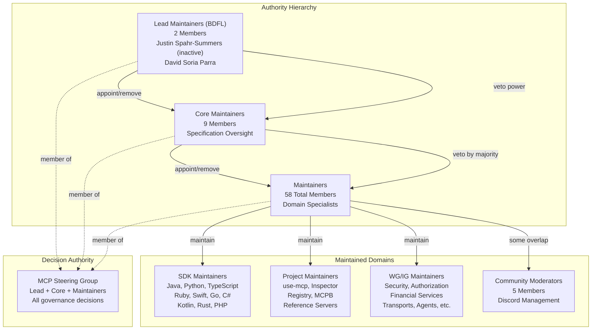
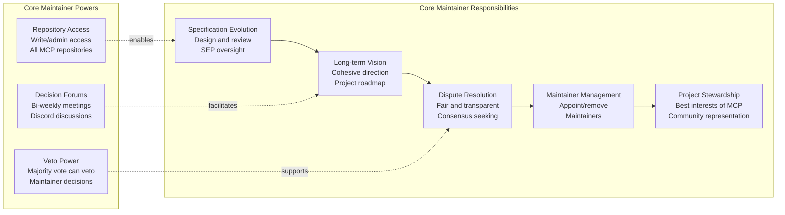
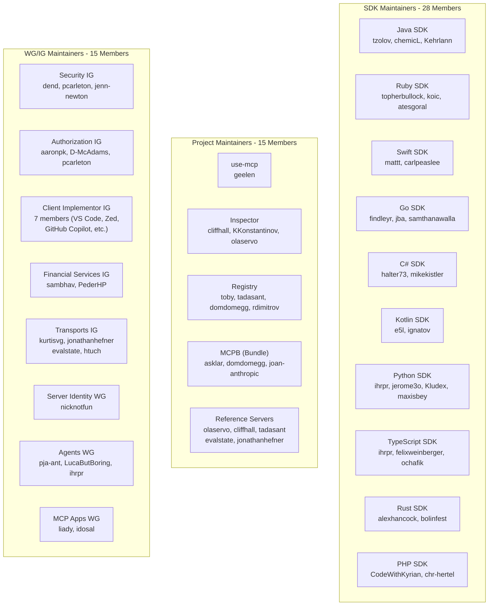
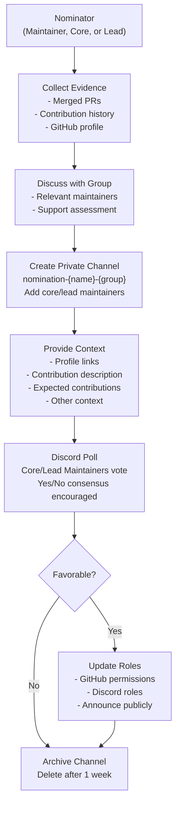
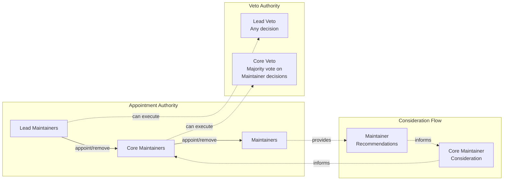
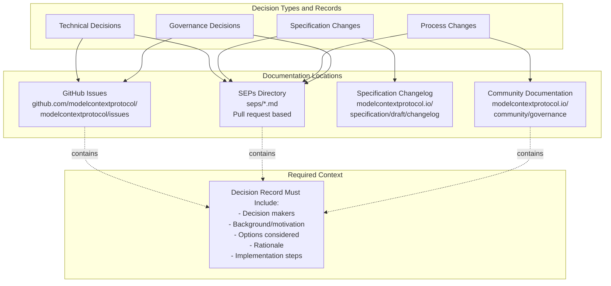
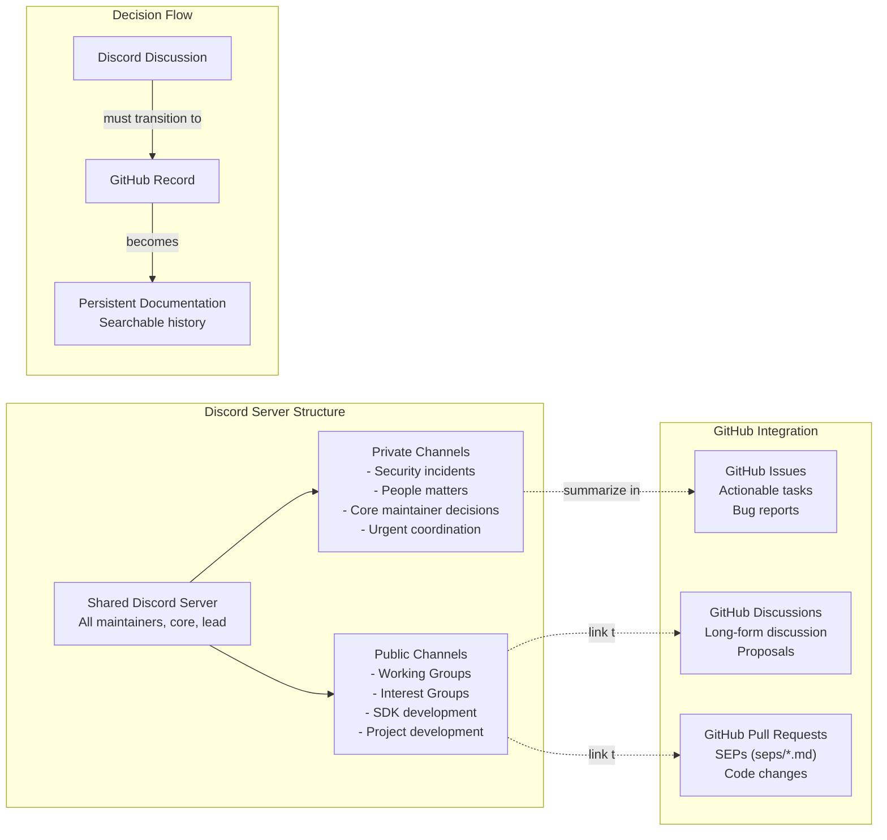
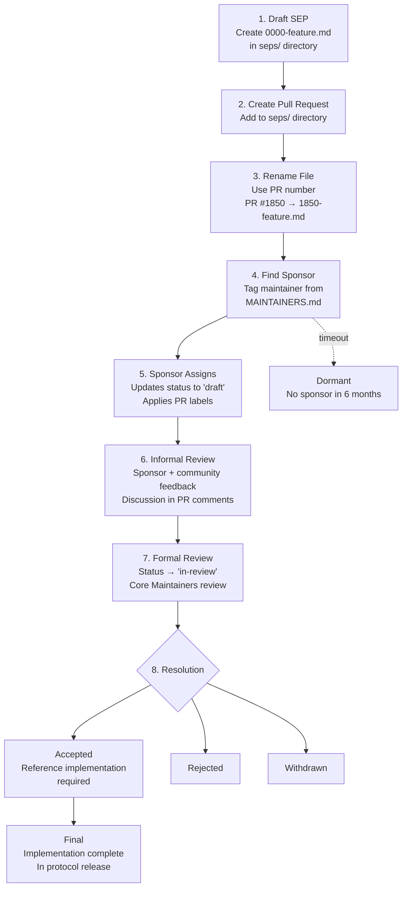

This document describes the hierarchical governance model for the Model Context Protocol project, including the roles, responsibilities, and authority relationships between Lead Maintainers, Core Maintainers, and Maintainers. For the complete list of current maintainers, see [Maintainers Directory](#7.2). For information about Working Groups and Interest Groups, see [Working Groups and Interest Groups](#7.3). For SEP procedures, see [Specification Enhancement Process](#6.2).

## Purpose and Scope

The MCP project adopts a three-tier hierarchical governance structure similar to Python, PyTorch, and other major open source projects. This structure ensures clear decision-making authority while enabling distributed maintenance across multiple domains (SDKs, projects, working groups). The governance model balances the need for decisive leadership with community participation and transparent processes.

## Hierarchical Authority Model

The governance structure consists of three levels of maintainership, each with distinct responsibilities and authority:

**Sources:** [docs/community/governance.mdx:20-78](), [MAINTAINERS.md:7-175]()

The governance hierarchy implements a clear chain of authority with explicit veto powers. Lead Maintainers can veto any decision by Core Maintainers or Maintainers. Core Maintainers can veto decisions by Maintainers through majority vote. This structure is often referred to as "Benevolent Dictator for Life" (BDFL) in open source governance.

## Governance Roles and Responsibilities

### Lead Maintainers

The two Lead Maintainers serve as the ultimate decision-makers for the MCP project:

| Current Lead Maintainers | Status |
|-------------------------|--------|
| David Soria Parra | Active |
| Justin Spahr-Summers | Currently Inactive |

**Authority:**
- Veto power over any decision by Core Maintainers or Maintainers
- Confirm or remove Core Maintainers
- Administrator access to all infrastructure (Discord, GitHub organizations, repositories)
- Ultimate responsibility for project direction

**Decision-Making:**
- Must publicly articulate decisions with clear reasoning
- Part of the Core Maintainer group
- Expected to meet with other maintainer groups every 3-6 months

**Sources:** [docs/community/governance.mdx:65-72](), [MAINTAINERS.md:7-10]()

### Core Maintainers

Nine Core Maintainers provide specification oversight and strategic direction:

**Current Core Maintainers (9 members):**
- Inna Harper
- Basil Hosmer
- Paul Carleton
- Nick Cooper
- Nick Aldridge
- Che Liu
- Den Delimarsky
- (2 positions not listed individually)

**Key Responsibilities:**
- Deep understanding of MCP specification required
- Design, review, and steer specification evolution
- Articulate long-term vision
- Mediate contentious issues
- Appoint or remove Maintainers
- Manage SEP process and reviews

**Decision Process:**
- Bi-weekly meetings for proposals and voting
- Private Discord channel for coordination
- Can use public Discord for smaller proposals
- Must document decisions publicly
- Attempt to meet in person every 3-6 months

**Sources:** [docs/community/governance.mdx:51-63](), [docs/community/governance.mdx:172-180]()

### Maintainers

58 Maintainers manage specific components, working groups, and interest groups:

**Maintainer Categories:**

| Category | Count | Examples |
|----------|-------|----------|
| SDK Maintainers | 28 | Java (3), Python (4), TypeScript (3), Ruby (3), Swift (2), Go (3), C# (2), Kotlin (2), Rust (2), PHP (2) |
| Project Maintainers | 15 | Inspector (3), Registry (4), Reference Servers (5), use-mcp (1), MCPB (3) |
| WG/IG Maintainers | 15 | Security IG (3), Authorization IG (3), Client Implementor IG (7), Financial Services IG (2), Transports IG (4), Server Identity WG (1), Agents WG (3), MCP Apps WG (2) |
| Community Moderators | 5 | olaservo, cliffhall, evalstate, jonathanhefner, tadasant |

**Key Responsibilities:**
- Thoughtful engagement with community contributors
- Maintain and improve their area of the MCP project
- Support documentation, roadmaps, and adjacent parts
- Present community ideas to Core Maintainers
- Independent decision-making for their domains
- Can defer or escalate to Core Maintainers when needed

**Authority:**
- Write and/or admin access to their respective repositories
- May adopt own rules and procedures for decisions
- Expected to make decisions independently

**Sources:** [docs/community/governance.mdx:36-50](), [MAINTAINERS.md:22-175]()

## Maintainer Appointment and Removal

### Nomination Process

The maintainer nomination process follows a structured workflow defined in the governance documentation:

**Nomination Requirements:**
- Membership given to individuals (not companies) on merit basis
- Must demonstrate strong expertise through contributions, reviews, discussions
- Must align with overall MCP principles and direction
- No term limits for maintainers or core maintainers
- Light criteria for moving to 'emeritus' status after long inactivity periods

**Information to Include:**
- GitHub profile link, LinkedIn profile link, Discord username
- Target maintainer group(s)
- Agreement from existing group members
- Description of contributions to date with links
- Expected future contributions and capacity
- Current employer and motivations
- Any other relevant context

**Sources:** [docs/community/governance.mdx:150-171](), [docs/community/governance.mdx:136-149]()

### Authority Flow

**Removal Process:**
- Core Maintainers responsible for adding/removing Maintainers
- Lead Maintainers responsible for adding/removing Core Maintainers
- Core Maintainers take consideration of existing maintainers into account
- No formal reason required for removal
- Can happen "at any time and without reason"

**Sources:** [docs/community/governance.mdx:145-149](), [docs/community/governance.mdx:47-48]()

## Decision-Making Process

### Decision Venues

The MCP project uses multiple venues for different types of decisions:

| Venue | Purpose | Frequency | Participants |
|-------|---------|-----------|--------------|
| Core Maintainer Meetings | Proposals, voting, project direction | Bi-weekly | Core + Lead Maintainers |
| Discord (Shared Server) | Smaller proposals, async discussion | Ongoing | All Maintainers, Core, Lead |
| GitHub Issues | Actionable tasks, bug reports, feature tracking | Ongoing | All contributors |
| GitHub Discussions | Structured long-form discussion | Ongoing | All contributors |
| SEP Pull Requests | Specification changes | Per proposal | All contributors, reviewed by Core |
| Private Discord Channels | Security, people matters, urgent coordination | As needed | Limited access |

**Meeting Structure:**
- Core maintainer group meets bi-weekly
- Lead, core, and maintainer groups attempt to meet in person every 3-6 months
- Working Groups and Interest Groups maintain their own schedules (published on [meet.modelcontextprotocol.io](https://meet.modelcontextprotocol.io/))

**Sources:** [docs/community/governance.mdx:74-77](), [docs/community/governance.mdx:126-133](), [docs/community/communication.mdx:9-54]()

### Decision Recording

All decisions are documented and made publicly available:

**Transparency Requirements:**
- All technical and governance decisions affecting the community must be documented
- Must be recorded in GitHub Discussions and/or Issues
- Private channel discussions must be summarized publicly (except for security and people matters)
- Discord discussions leading to decisions must be moved to GitHub for persistent record
- Meeting notes must be published (usually as GitHub issues or public Google Docs)

**Sources:** [docs/community/communication.mdx:89-105](), [docs/community/governance.mdx:32-34](), [docs/community/communication.mdx:42-53]()

## Communication Channels

### Technical Governance Channels

The governance process uses a shared Discord server for coordination:

**Discord Usage:**
- Technical governance facilitated through shared Discord
- Each maintainer group can choose additional channels
- All decisions and supporting discussions must be recorded transparently
- Private channels only for: security incidents, people matters, read-only decision channels, urgent coordination requiring focused response

**GitHub Usage:**
- GitHub Issues for bug reports, feature tracking, development tasks
- GitHub Discussions for structured long-form discussion, roadmap planning, feature requests
- SEP proposals submitted as pull requests to `seps/` directory (not as issues)
- Security issues use private reporting process in [SECURITY.md](https://github.com/modelcontextprotocol/modelcontextprotocol/blob/main/SECURITY.md)

**Sources:** [docs/community/governance.mdx:32-34](), [docs/community/communication.mdx:19-54](), [docs/community/communication.mdx:56-80]()

## Specification Enhancement Process (SEP)

The SEP process is the primary mechanism for proposing major protocol changes. As of November 2025, SEPs use a pull request-based workflow:

**SEP Workflow:**
1. Draft SEP as markdown file: `seps/0000-feature-title.md`
2. Create pull request to `seps/` directory
3. Rename file using PR number (e.g., PR #1850 becomes `seps/1850-feature-title.md`)
4. Find sponsor from maintainer list
5. Sponsor assigns themselves and updates status to `draft`
6. Informal review with community feedback
7. Sponsor moves to `in-review` for formal Core Maintainer review
8. Core Maintainers accept, reject, or request revision
9. If accepted, complete reference implementation
10. Sponsor updates to `final` when implementation is incorporated

**SEP States:**
- `draft`: Proposal with sponsor, undergoing informal review
- `in-review`: Ready for formal Core Maintainer review
- `accepted`: Accepted by Core Maintainers, reference implementation pending
- `rejected`: Rejected by Core Maintainers
- `withdrawn`: Withdrawn by author
- `final`: Reference implementation complete and incorporated
- `superseded`: Replaced by newer SEP
- `dormant`: No sponsor found within six months

**Sponsor Responsibilities:**
- Review proposal and provide feedback
- Request changes based on community input
- **Update SEP status** in markdown file and PR labels
- Initiate formal review when ready
- Present at Core Maintainer meetings
- Ensure quality standards are met
- Track reference implementation progress

**Sources:** [docs/community/sep-guidelines.mdx:43-66](), [docs/community/sep-guidelines.mdx:83-94](), [docs/community/sep-guidelines.mdx:120-130](), [seps/1850-pr-based-sep-workflow.md:1-181]()

## Legal and Policy Framework

The MCP project operates under the Linux Foundation Projects umbrella:

| Aspect | Policy |
|--------|--------|
| Legal Entity | Model Context Protocol, a Series of LF Projects, LLC |
| Trademark Policy | https://www.lfprojects.org/policies/ |
| Governance Changes | Must be approved by LF Projects, LLC |
| Copyright | Contributors retain copyright as independent works |
| Code License | Apache License, Version 2.0 |
| Specification License | Apache License, Version 2.0 |
| Documentation License | Creative Commons Attribution 4.0 International |
| Alternative Licenses | Core Maintainers may approve exceptions on case-by-case basis |

**Key Principles:**
- Membership is for individuals, not companies
- No seats reserved for specific companies
- Maintainers act in the best interests of the protocol and open source community
- No requirement to assign copyrights to the project
- All governance policies located at https://www.lfprojects.org/policies/

**Sources:** [GOVERNANCE.md:1-11](), [docs/community/governance.mdx:8-18](), [docs/community/governance.mdx:30-31]()

## File References

The governance structure is defined and documented in the following files:

| File | Purpose | Key Sections |
|------|---------|--------------|
| [MAINTAINERS.md:1-181]() | Official list of all current maintainers | Lead Maintainers (7-10), Core Maintainers (12-20), SDK Maintainers (22-79), Project Maintainers (80-112), WG/IG Maintainers (121-175) |
| [docs/community/governance.mdx:1-185]() | Comprehensive governance documentation | Technical Governance (20-78), Maintainer roles (36-72), Decision Process (74-77), SEP Process (115-124), Nomination Process (136-171) |
| [GOVERNANCE.md:1-11]() | LF Projects policies and legal framework | General project policies, licensing, copyright |
| [docs/community/sep-guidelines.mdx:1-142]() | SEP submission guidelines | SEP format (68-79), SEP states (83-94), Sponsor role (120-130) |
| [seps/1850-pr-based-sep-workflow.md:1-185]() | Current SEP workflow specification | PR-based workflow (32-72), Status management (109-117) |
| [docs/community/working-interest-groups.mdx:1-130]() | Working and Interest Group structure | IG expectations (31-60), WG expectations (71-100), Facilitator role (108-114) |
| [docs/community/communication.mdx:1-107]() | Communication channel policies | Discord (19-54), GitHub usage (56-80), Decision records (89-105) |