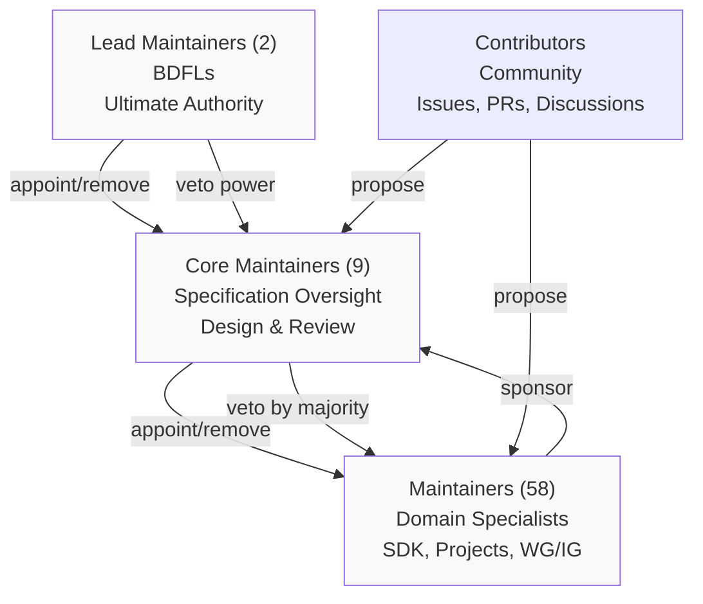
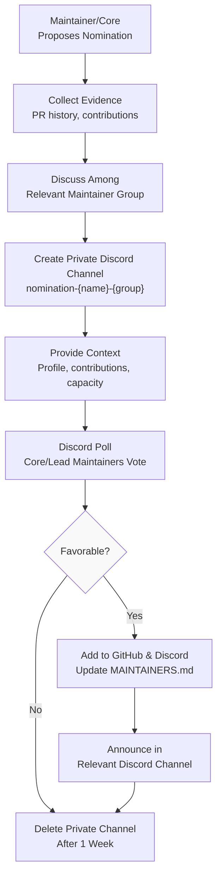
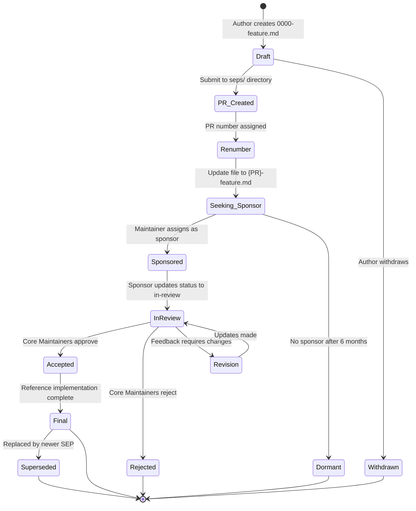
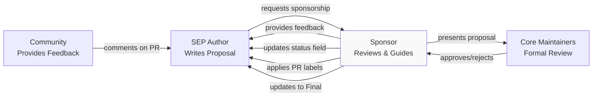
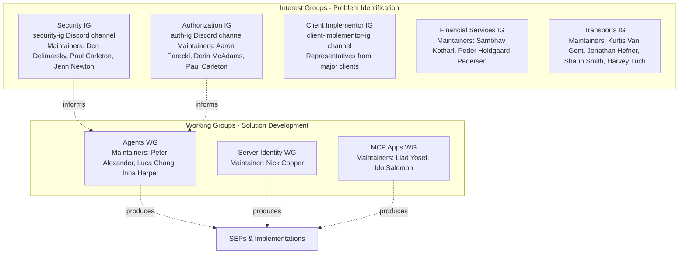
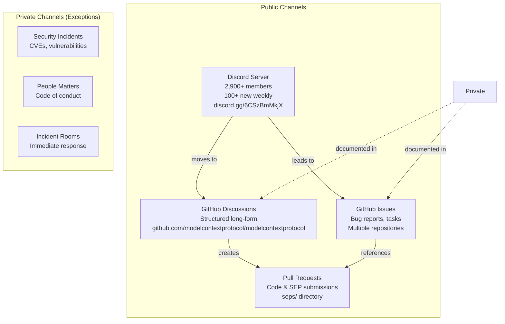
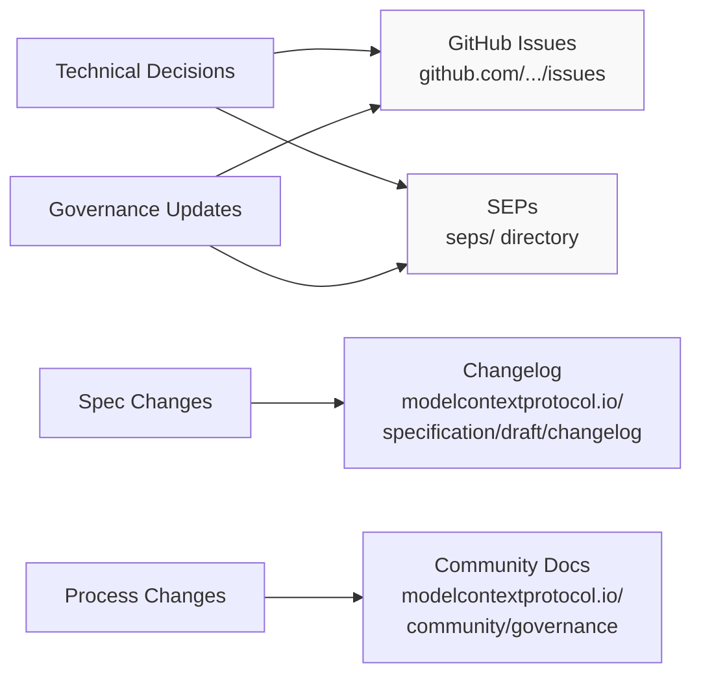
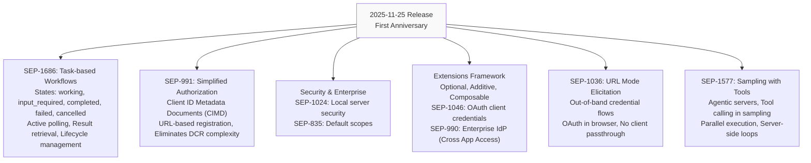
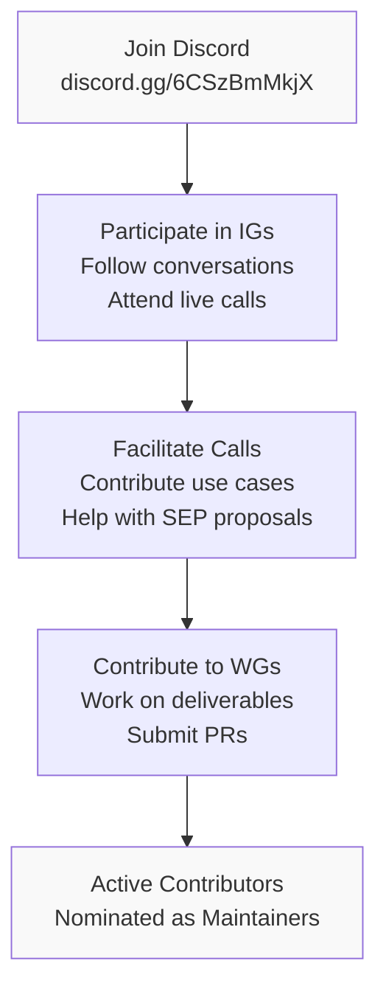

This page documents the Model Context Protocol's governance structure, community organization, and the processes for proposing and implementing changes to the specification. It covers the maintainer hierarchy, the Specification Enhancement Proposal (SEP) workflow, Working Groups and Interest Groups, communication channels, and the project's release history.

For technical contribution guidelines including schema development and build processes, see [Development Guide](#6).

## Governance Structure

MCP adopts a hierarchical governance model inspired by Python, PyTorch, and similar open-source projects. The structure balances community input with decision-making efficiency through three tiers of leadership.

### Hierarchy Overview



**Sources:** [docs/community/governance.mdx:20-71](), [MAINTAINERS.md:1-180](), [blog/content/posts/2025-11-25-first-mcp-anniversary.md:32-58]()

### Lead Maintainers (BDFLs)

The two Lead Maintainers serve as Benevolent Dictators for Life (BDFLs):
- **David Soria Parra** (`@dsp-ant`)
- **Justin Spahr-Summers** (`@jspahrsummers`, currently inactive)

Lead Maintainers have ultimate veto authority over all decisions and are responsible for:
- Confirming or removing Core Maintainers
- Administrator access to all infrastructure (GitHub organizations, Discord, communication channels)
- Public articulation of decision-making and rationale

**Sources:** [MAINTAINERS.md:7-10](), [docs/community/governance.mdx:65-72]()

### Core Maintainers

The Core Maintainers team consists of 9 members with deep understanding of the protocol specification:

| Name | GitHub Handle |
|------|---------------|
| Inna Harper | `@ihrpr` |
| Basil Hosmer | `@bhosmer-ant` |
| Paul Carleton | `@pcarleton` |
| Nick Cooper | `@nicknotfun` |
| Nick Aldridge | `@000-000-000-000-000` |
| Che Liu | - |
| Den Delimarsky | `@localden` |

Core Maintainers are responsible for:
- Designing, reviewing, and steering specification evolution
- Articulating long-term vision
- Mediating disputes and making decisive choices
- Appointing/removing Maintainers
- Veto power over Maintainer decisions by majority vote

Core Maintainers meet bi-weekly to discuss proposals and vote on SEPs. They generally use the same contribution mechanisms (pull requests) as external contributors.

**Sources:** [MAINTAINERS.md:12-21](), [docs/community/governance.mdx:51-64](), [docs/community/governance.mdx:172-184]()

### Maintainers

The project has 58 Maintainers organized into three categories:

#### SDK Maintainers

Responsible for language-specific SDK implementations:
- **Java SDK**: Christian Tzolov, Dariusz Jędrzejczyk, Daniel Garnier-Moiroux
- **Ruby SDK**: Topher Bullock, Koichi Ito, Ateş Göral
- **Swift SDK**: Matt Zmuda, Carl Peaslee
- **Go SDK**: Rob Findley, Jonathan Amsterdam, Sam Thanawalla
- **C# SDK**: Stephan Halter, Mike Kistler
- **Kotlin SDK**: Leonid Stashevsky, Sergey Ignatov
- **Python SDK**: Inna Harper, Jerome Swannack, Marcelo Trylesinski, Max Isbey
- **TypeScript SDK**: Inna Harper, Felix Weinberger, Olivier Chafik
- **Rust SDK**: Alex Hancock, Michael Bolin
- **PHP SDK**: Kyrian Obikwelu, Christopher Hertel

#### Project Maintainers

Maintain specific MCP ecosystem projects:
- **use-mcp**: Glen Maddern
- **Inspector**: Cliff Hall, Konstantin Konstantinov, Ola Hungerford
- **Registry**: Toby Padilla, Tadas Antanavicius, Adam Jones, Radoslav Dimitrov
- **MCPB (Model Context Protocol Bundle)**: Alexander Sklar, Adam Jones, Joan Xie
- **Reference Servers**: Ola Hungerford, Cliff Hall, Tadas Antanavicius, Shaun Smith, Jonathan Hefner

#### Working Group/Interest Group Maintainers

Lead focused collaborative efforts:
- **Security Interest Group**: Den Delimarsky, Paul Carleton, Jenn Newton
- **Authorization Interest Group**: Aaron Parecki, Darin McAdams, Paul Carleton
- **Client Implementor Interest Group**: Representatives from major clients (Goose, Zed, VS Code, Codex, GitHub Copilot, Cursor)
- **Financial Services Interest Group**: Sambhav Kothari, Peder Holdgaard Pedersen
- **Transports Interest Group**: Kurtis Van Gent, Jonathan Hefner, Shaun Smith, Harvey Tuch
- **Server Identity Working Group**: Nick Cooper
- **Agents Working Group**: Peter Alexander, Luca Chang, Inna Harper
- **MCP Apps Working Group**: Liad Yosef, Ido Salomon

**Sources:** [MAINTAINERS.md:22-175](), [docs/community/governance.mdx:36-49]()

### Nomination and Removal Process



Maintainers can be appointed or removed at any time by Core/Lead Maintainers. The nomination process defined in [docs/community/governance.mdx:150-171]() requires:
1. Evidence of contributions (merged PRs)
2. Support from existing maintainer group
3. Private Discord channel for discussion
4. Vote by Core/Lead Maintainers
5. Documentation update in `MAINTAINERS.md`

Membership is for individuals, not companies, ensuring maintainers act in the protocol's best interests.

**Sources:** [docs/community/governance.mdx:136-171](), [MAINTAINERS.md:176-180]()

## Decision-Making Process

### Meeting Cadence

- **Core Maintainer Meetings**: Bi-weekly to discuss proposals, vote on SEPs, and address project direction
- **In-Person Meetings**: Lead, Core, and Maintainers meet every 3-6 months for deeper collaboration
- **Working Group Meetings**: Published on [meet.modelcontextprotocol.io](https://meet.modelcontextprotocol.io/)

Meeting notes for technical decisions are made public on GitHub or Discord.

**Sources:** [docs/community/governance.mdx:73-78](), [docs/community/governance.mdx:127-134](), [docs/community/working-interest-groups.mdx:25-30]()

### Transparency Requirements

All technical and governance decisions must be:
- Documented publicly in GitHub Discussions, Issues, or SEPs
- Labeled with `notes` for decision records
- Made available on Discord's public channels

Private channels exist only for:
- Security incidents (CVEs, vulnerabilities)
- People matters (code of conduct, maintainer discussions)
- Matters requiring immediate focused response

**Sources:** [docs/community/communication.mdx:41-54](), [docs/community/governance.mdx:32-35]()

## Specification Enhancement Proposal (SEP) Process

The SEP process is the primary mechanism for proposing major changes to the MCP specification. As of November 2025, SEPs follow a PR-based workflow defined in SEP-1850.

### SEP Workflow



**Sources:** [seps/1850-pr-based-sep-workflow.md:1-181](), [docs/community/sep-guidelines.mdx:43-66]()

### SEP Anatomy

Each SEP file in the `seps/` directory follows this structure:

```markdown
# SEP-{NUMBER}: {Title}

- **Status**: Draft | In-Review | Accepted | Rejected | Withdrawn | Final | Superseded | Dormant
- **Type**: Standards Track | Informational | Process
- **Created**: YYYY-MM-DD
- **Author(s)**: Name <email> (@github-username)
- **Sponsor**: @github-username
- **PR**: https://github.com/modelcontextprotocol/specification/pull/{NUMBER}

## Abstract
## Motivation
## Specification
## Rationale
## Backward Compatibility
## Security Implications
## Reference Implementation
```

**File Structure:** [seps/TEMPLATE.md:1-86](), [seps/1850-pr-based-sep-workflow.md:83-106]()

**Sources:** [docs/community/sep-guidelines.mdx:68-80](), [seps/README.md:1-4]()

### SEP Types

| Type | Purpose | Example |
|------|---------|---------|
| **Standards Track** | New protocol features or changes | SEP-1686 (Tasks), SEP-991 (Auth) |
| **Informational** | Design issues, guidelines, recommendations | - |
| **Process** | Changes to governance or contribution processes | SEP-1850 (PR-based workflow) |

**Sources:** [docs/community/sep-guidelines.mdx:29-36]()

### Sponsor Responsibilities

A Sponsor (Core Maintainer or Maintainer) champions the SEP through review:



Sponsors are responsible for:
- Reviewing proposals and requesting changes
- **Managing status transitions** in both the SEP markdown file and PR labels
- Presenting SEPs at Core Maintainer meetings
- Ensuring quality standards before advancement
- Tracking reference implementation completion

**Sources:** [seps/1850-pr-based-sep-workflow.md:48-63](), [docs/community/sep-guidelines.mdx:120-130]()

### Recent SEP Evolution

The PR-based workflow was formalized in SEP-1850 (November 2025) to address issues with the previous GitHub Issues-based approach:

**Problems Solved:**
- Scattered content across issues, documents, and PRs
- Difficult multi-contributor collaboration
- Limited version control
- Unclear status management

**New Approach:**
- SEPs live in `seps/{NUMBER}-{slug}.md` as canonical source
- PR number becomes SEP number (eliminates manual bookkeeping)
- Git provides full revision history
- Status tracked in both markdown file and PR labels

**Sources:** [seps/1850-pr-based-sep-workflow.md:16-31](), [blog/content/posts/2025-11-28-sep-process-update.md:1-69]()

### SEP Acceptance Criteria

For a SEP to reach `Final` status:
- Prototype implementation demonstrating the proposal
- Clear benefit to the MCP ecosystem
- Community support and consensus
- Reference implementation complete and incorporated into the specification

**Sources:** [docs/community/sep-guidelines.mdx:107-117]()

## Working Groups and Interest Groups

MCP collaboration is organized through two complementary structures introduced in SEP-1302.

### Structure Comparison

| Aspect | Interest Groups (IGs) | Working Groups (WGs) |
|--------|----------------------|---------------------|
| **Purpose** | Identify and discuss problems | Develop concrete solutions |
| **Output** | Problem articulation, discussions | SEPs, implementations |
| **Lifecycle** | No expiration while active | Ends when deliverables complete |
| **Formation** | Majority vote by community moderators | Majority vote by community moderators |
| **Requirements** | Regular meetings OR Discord activity | Active SEP/PR OR project maintenance |

**Sources:** [docs/community/working-interest-groups.mdx:1-116]()

### Interest Groups



**Sources:** [docs/community/working-interest-groups.mdx:31-70](), [MAINTAINERS.md:121-175]()

### Creation Process

To create a new WG or IG:
1. Fill out template in `#wg-ig-group-creation` Discord channel
2. Community moderators call for vote in `#community-moderators`
3. Majority approval over 72 hours
4. Core/Lead Maintainers have veto power
5. Public Discord channel created
6. Meetings published on [meet.modelcontextprotocol.io](https://meet.modelcontextprotocol.io/)

**Template Fields:**
- Facilitator(s) (self-nominated, informal role)
- Maintainer(s) (optional, official MCP steering group representative)
- For IGs: Related groups and differentiation
- For WGs: First Issue/PR/SEP to work on

**Sources:** [docs/community/working-interest-groups.mdx:50-107]()

### Governance Principles

All WGs and IGs must:
- Document their contribution process
- Maintain transparent communication
- Make decisions publicly (publish meeting notes)
- Default to GitHub PRs/Issues and public Discord channels

**Sources:** [docs/community/working-interest-groups.mdx:91-108]()

## Communication Channels

### Channel Matrix



**Sources:** [docs/community/communication.mdx:1-107]()

### Discord Server

The MCP Discord is designed for **contributors**, not general user support. Structure:

**Public Channels (Default):**
- SDK development (`#typescript-sdk-dev`, etc.)
- Working/Interest Group channels
- Project development (`#inspector-dev`, `#registry-dev`)
- Community onboarding
- Office hours

**Private Channels (Exceptions):**
- Security incidents
- Maintainer coordination
- People matters (code of conduct)

**Key Rules:**
- Avoid service/product marketing
- No MCP user support (use documentation and GitHub Discussions)
- All technical decisions must be documented publicly
- Private channels are temporary "incident rooms"

**Sources:** [docs/community/communication.mdx:19-56]()

### Decision Record Storage



**Sources:** [docs/community/communication.mdx:89-97]()

## Release History and Cadence

### Quarterly Release Cycle

MCP follows a quarterly release cadence with versions named `YYYY-MM-DD` representing the date of the last breaking change:

| Version | Date | Key Features |
|---------|------|-------------|
| 2024-11-05 | Nov 2024 | Initial release |
| 2025-03-26 | Mar 2025 | - |
| 2025-06-18 | Jun 2025 | JSON Schema draft-07 (legacy) |
| **2025-11-25** | Nov 2025 | Tasks (SEP-1686), Simplified Auth (SEP-991), Sampling with Tools (SEP-1577) |
| Draft | Ongoing | Active development |

**Sources:** [blog/content/posts/2025-11-25-first-mcp-anniversary.md:130-265]()

### 2025-11-25 Release Highlights



**Sources:** [blog/content/posts/2025-11-25-first-mcp-anniversary.md:130-251]()

### Community Growth Metrics

**As of November 2025:**

- **58 Maintainers** supporting 9 Core/Lead Maintainers
- **2,900+ contributors** in Discord
- **100+ new contributors** joining weekly
- **~2,000 servers** in MCP Registry (407% growth since September 2024)
- **96+ clients** documented
- **17 SEPs** delivered in approximately one quarter

**Sources:** [blog/content/posts/2025-11-25-first-mcp-anniversary.md:122](), [blog/content/posts/2025-11-25-first-mcp-anniversary.md:28]()

## Legal and Licensing

MCP is established as **Model Context Protocol a Series of LF Projects, LLC**. Key policies:

- **Code License**: Apache License, Version 2.0 for all code and specification contributions
- **Documentation License**: Creative Commons Attribution 4.0 International (excluding specifications)
- **Copyright**: Contributors retain copyright as independent works; no assignment required
- **Alternative Licenses**: Core Maintainers may approve exceptions on a case-by-case basis
- **Governance Changes**: Must be approved by both the maintainer process and LF Projects, LLC

Full policies at [lfprojects.org/policies](https://www.lfprojects.org/policies/)

**Sources:** [docs/community/governance.mdx:8-18](), [GOVERNANCE.md:1-12]()

## Getting Involved

### Contribution Path



**Sources:** [docs/community/working-interest-groups.mdx:117-126]()

### Key Resources

- **Governance Documentation**: [modelcontextprotocol.io/community/governance](https://modelcontextprotocol.io/community/governance)
- **SEP Guidelines**: [modelcontextprotocol.io/community/sep-guidelines](https://modelcontextprotocol.io/community/sep-guidelines)
- **Discord**: [discord.gg/6CSzBmMkjX](https://discord.gg/6CSzBmMkjX)
- **GitHub**: [github.com/modelcontextprotocol](https://github.com/modelcontextprotocol)
- **Meeting Calendar**: [meet.modelcontextprotocol.io](https://meet.modelcontextprotocol.io/)
- **Maintainer List**: [MAINTAINERS.md](https://github.com/modelcontextprotocol/modelcontextprotocol/blob/main/MAINTAINERS.md)

**Sources:** [docs/community/communication.mdx:10-16](), [docs/community/working-interest-groups.mdx:25-30]()