## Purpose and Scope

This page documents the JSON-RPC 2.0 message system that forms the foundation of the Model Context Protocol. It covers the structure and semantics of the three core message types (requests, responses, and notifications), error handling, metadata systems, and the ID requirements that enable bidirectional communication between MCP clients and servers.

For information about how messages are transported over the wire, see [Transport Layer](#2.3). For details on how messages are exchanged during connection setup and capability negotiation, see [Connection Lifecycle and Capabilities](#2.4).

## Core Message Types

MCP uses JSON-RPC 2.0 as specified in [https://www.jsonrpc.org/specification](https://www.jsonrpc.org/specification). All messages exchanged between clients and servers **MUST** be valid JSON-RPC 2.0 objects encoded as UTF-8.

The protocol defines three message types, represented by the union type [schema/draft/schema.ts:8-11]():

```
JSONRPCMessage = JSONRPCRequest | JSONRPCNotification | JSONRPCResponse
```

### Requests

A **request** is a message that expects a response. Both clients and servers can send requests to each other, enabling bidirectional communication.

**Structure** [schema/draft/schema.ts:158-161]():

| Field | Type | Required | Description |
|-------|------|----------|-------------|
| `jsonrpc` | string | Yes | **MUST** be `"2.0"` |
| `id` | string \| number | Yes | Unique identifier for this request within the session |
| `method` | string | Yes | The name of the method to invoke |
| `params` | object | No | Parameters for the method |

**Key requirements:**

- The `id` field **MUST NOT** be `null` (unlike base JSON-RPC 2.0)
- The `id` **MUST NOT** have been previously used by the requestor within the same session
- The `id` can be any string or number value

**Example:**

```json
{
  "jsonrpc": "2.0",
  "id": 1,
  "method": "tools/call",
  "params": {
    "name": "get_weather",
    "arguments": {
      "city": "Paris"
    }
  }
}
```

Sources: [schema/draft/schema.ts:158-161](), [docs/specification/2025-06-18/basic/index.mdx:37-51]()

### Responses

A **response** is sent in reply to a request. It contains either a successful result or an error, but never both.

**Structure** [schema/draft/schema.ts:177-199]():

| Field | Type | Required | Description |
|-------|------|----------|-------------|
| `jsonrpc` | string | Yes | **MUST** be `"2.0"` |
| `id` | string \| number | Yes | **MUST** match the ID of the request being answered |
| `result` | object | Conditional | The result of the operation (if successful) |
| `error` | Error | Conditional | Error information (if failed) |

**Key requirements:**

- Either `result` or `error` **MUST** be present, but not both
- The `id` **MUST** match the request ID exactly
- Results can follow any JSON object structure
- Errors **MUST** include a code and message

**Successful response example:**

```json
{
  "jsonrpc": "2.0",
  "id": 1,
  "result": {
    "content": [
      {
        "type": "text",
        "text": "Current weather in Paris: 18°C, partly cloudy"
      }
    ],
    "isError": false
  }
}
```

**Error response example:**

```json
{
  "jsonrpc": "2.0",
  "id": 1,
  "error": {
    "code": -32601,
    "message": "Method not found",
    "data": {
      "method": "unknown_method"
    }
  }
}
```

Sources: [schema/draft/schema.ts:177-199](), [docs/specification/2025-06-18/basic/index.mdx:57-78]()

### Notifications

A **notification** is a one-way message that does not expect a response. Either party can send notifications.

**Structure** [schema/draft/schema.ts:168-170]():

| Field | Type | Required | Description |
|-------|------|----------|-------------|
| `jsonrpc` | string | Yes | **MUST** be `"2.0"` |
| `method` | string | Yes | The name of the notification |
| `params` | object | No | Parameters for the notification |

**Key requirements:**

- **MUST NOT** include an `id` field
- The receiver **MUST NOT** send a response
- Notifications are fire-and-forget messages

**Example:**

```json
{
  "jsonrpc": "2.0",
  "method": "notifications/initialized",
  "params": {}
}
```

Sources: [schema/draft/schema.ts:168-170](), [docs/specification/2025-06-18/basic/index.mdx:85-95]()

## Error Handling

MCP defines a set of standard JSON-RPC error codes and additional implementation-specific codes for protocol-level errors.

### Standard Error Codes

[schema/draft/schema.ts:201-206]() defines the standard JSON-RPC 2.0 error codes:

| Code | Name | Description |
|------|------|-------------|
| `-32700` | `PARSE_ERROR` | Invalid JSON was received by the server |
| `-32600` | `INVALID_REQUEST` | The request object is not a valid JSON-RPC request |
| `-32601` | `METHOD_NOT_FOUND` | The requested method does not exist or is not available |
| `-32602` | `INVALID_PARAMS` | Invalid method parameters or malformed arguments |
| `-32603` | `INTERNAL_ERROR` | Internal error on the receiver |

### Error Object Structure

[schema/draft/schema.ts:131-144]() defines the error object:

```typescript
interface Error {
  code: number;           // Error code (integer)
  message: string;        // Short description (single sentence recommended)
  data?: unknown;         // Additional error information (optional)
}
```

**Example error with additional data:**

```json
{
  "code": -32602,
  "message": "Invalid parameters",
  "data": {
    "reason": "Unknown tool name",
    "toolName": "nonexistent_tool"
  }
}
```

### MCP-Specific Error Codes

MCP defines implementation-specific error codes in the range `[-32000, -32099]` for protocol-level errors:

| Code | Name | Usage |
|------|------|-------|
| `-32042` | `URL_ELICITATION_REQUIRED` | Server requires user interaction via URL mode elicitation before the request can be processed |

[schema/draft/schema.ts:301-322]() defines the `URLElicitationRequiredError` structure, which includes a list of required elicitations in the error data.

Sources: [schema/draft/schema.ts:131-144](), [schema/draft/schema.ts:201-206](), [schema/draft/schema.ts:301-322]()

## Request and Response Parameters

### RequestParams and RequestMetaObject

All request parameters extend [schema/draft/schema.ts:89-91]() `RequestParams`:

```typescript
interface RequestParams {
  _meta?: RequestMetaObject;
}
```

The `_meta` field is optional and carries request-specific metadata. [schema/draft/schema.ts:46-51]() defines `RequestMetaObject`:

```typescript
interface RequestMetaObject extends MetaObject {
  progressToken?: ProgressToken;
}
```

The `progressToken` field allows requestors to request out-of-band progress notifications. If specified, the receiver **SHOULD** send `notifications/progress` messages with this token to associate progress updates with the original request.

### Result Structure

All successful responses contain a [schema/draft/schema.ts:123-126]() `Result` object:

```typescript
interface Result {
  _meta?: MetaObject;
  [key: string]: unknown;
}
```

Results can contain any JSON object structure, with an optional `_meta` field for metadata.

### MetaObject and Key Naming Rules

[schema/draft/schema.ts:37]() defines `MetaObject` as a simple record type. However, [schema/draft/schema.ts:18-34]() specifies strict naming rules for keys in `_meta` fields:

**Valid key format:** `[prefix/]name`

**Prefix rules:**
- Optional; if specified, must be labels separated by dots (`.`), followed by a slash (`/`)
- Labels must start with a letter and end with a letter or digit
- Interior characters may be letters, digits, or hyphens (`-`)
- Any prefix containing `modelcontextprotocol` or `mcp` is **reserved** for MCP use
  - Examples: `modelcontextprotocol.io/`, `mcp.dev/`, `api.modelcontextprotocol.org/`

**Name rules:**
- Unless empty, must start and end with alphanumeric characters (`[a-z0-9A-Z]`)
- Interior characters may be alphanumeric, hyphens (`-`), underscores (`_`), or dots (`.`)

**Example valid keys:**
- `progressToken` (no prefix)
- `custom/myKey` (custom prefix)
- `io.modelcontextprotocol/relatedTask` (reserved MCP prefix)

Sources: [schema/draft/schema.ts:37](), [schema/draft/schema.ts:18-34](), [schema/draft/schema.ts:46-51]()

## Message Flow Patterns

### Request-Response Pattern

The standard synchronous pattern where a requestor sends a request and waits for a response:

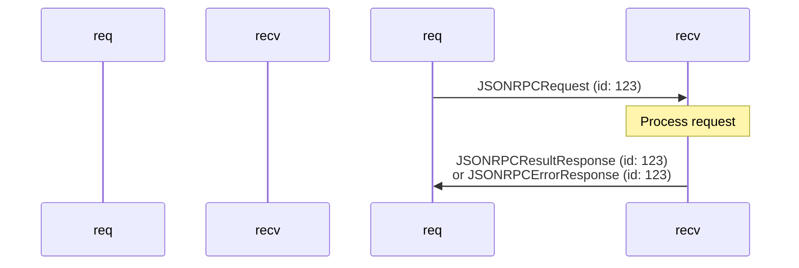

### Notification Pattern

One-way messages that do not expect responses:

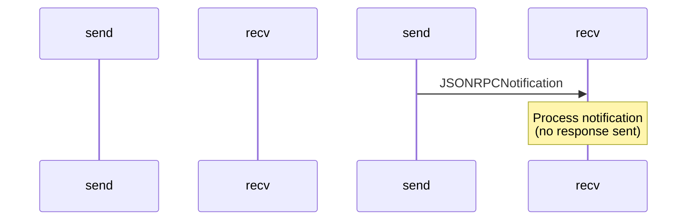

### Bidirectional Communication

MCP enables both clients and servers to send requests to each other:

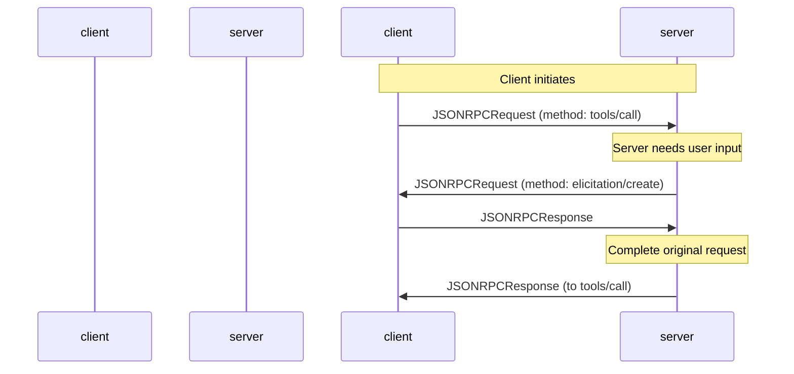

Sources: [docs/specification/draft/client/elicitation.mdx:450-495]()

## Message Type Mapping

The following diagram maps protocol method names to their corresponding message types and code entities:

```mermaid
graph TB
    subgraph "Client-Initiated Requests"
        CR1["initialize"]
        CR2["resources/list, resources/read"]
        CR3["prompts/list, prompts/get"]
        CR4["tools/list, tools/call"]
        CR5["completion/complete"]
        CR6["tasks/get, tasks/list, tasks/cancel"]
    end
    
    subgraph "Server-Initiated Requests"
        SR1["sampling/createMessage"]
        SR2["elicitation/create"]
    end
    
    subgraph "Notifications (Either Direction)"
        N1["notifications/initialized"]
        N2["notifications/progress"]
        N3["notifications/cancelled"]
        N4["notifications/resources/list_changed"]
        N5["notifications/prompts/list_changed"]
        N6["notifications/tools/list_changed"]
        N7["notifications/tasks/status"]
    end
    
    subgraph "Code Entities"
        REQ["JSONRPCRequest<br/>id: RequestId<br/>method: string<br/>params: RequestParams"]
        RESP["JSONRPCResponse<br/>id: RequestId<br/>result or error"]
        NOTIF["JSONRPCNotification<br/>method: string<br/>params: NotificationParams<br/>no id field"]
    end
    
    CR1 --> REQ
    CR2 --> REQ
    CR3 --> REQ
    CR4 --> REQ
    CR5 --> REQ
    CR6 --> REQ
    SR1 --> REQ
    SR2 --> REQ
    
    REQ --> RESP
    
    N1 --> NOTIF
    N2 --> NOTIF
    N3 --> NOTIF
    N4 --> NOTIF
    N5 --> NOTIF
    N6 --> NOTIF
    N7 --> NOTIF
```

Sources: [schema/draft/schema.ts:8-11](), [schema/draft/schema.ts:158-161](), [schema/draft/schema.ts:168-170]()

## Progress Notifications

Requestors can request out-of-band progress updates for long-running operations by including a `progressToken` in the request's `_meta` field.

[schema/draft/schema.ts:836-857]() defines `ProgressNotificationParams`:

```typescript
interface ProgressNotificationParams extends NotificationParams {
  progressToken: ProgressToken;  // Must match the token from the request
  progress: number;              // Current progress value
  total?: number;                // Total progress (if known)
  message?: string;              // Optional status message
}
```

**Example progress notification:**

```json
{
  "jsonrpc": "2.0",
  "method": "notifications/progress",
  "params": {
    "progressToken": "task-123",
    "progress": 50,
    "total": 100,
    "message": "Processing file 50 of 100"
  }
}
```

**Request with progress token:**

```json
{
  "jsonrpc": "2.0",
  "id": 1,
  "method": "tools/call",
  "params": {
    "name": "batch_process",
    "arguments": {},
    "_meta": {
      "progressToken": "task-123"
    }
  }
}
```

Sources: [schema/draft/schema.ts:836-857](), [schema/draft/schema.ts:46-51]()

## Cancellation

Either party can cancel an in-progress request by sending a `notifications/cancelled` notification [schema/draft/schema.ts:341-376]():

```typescript
interface CancelledNotificationParams extends NotificationParams {
  requestId?: RequestId;  // ID of the request to cancel
  reason?: string;        // Optional cancellation reason
}
```

**Example cancellation:**

```json
{
  "jsonrpc": "2.0",
  "method": "notifications/cancelled",
  "params": {
    "requestId": 123,
    "reason": "User requested cancellation"
  }
}
```

**Key requirements:**

- The `requestId` **MUST** correspond to a request previously issued in the same direction
- The `initialize` request **MUST NOT** be cancelled by clients
- For task-augmented requests, use `tasks/cancel` request instead
- Receivers **SHOULD** stop processing and free resources
- Receivers **MAY** ignore cancellations if the request is unknown or already completed

Sources: [schema/draft/schema.ts:341-376](), [docs/specification/draft/basic/utilities/cancellation.mdx]()

## Pagination

List operations support cursor-based pagination through [schema/draft/schema.ts:881-887]() `PaginatedRequestParams`:

```typescript
interface PaginatedRequestParams extends RequestParams {
  cursor?: Cursor;  // Opaque pagination token
}
```

Paginated results include [schema/draft/schema.ts:895-901]() `PaginatedResult`:

```typescript
interface PaginatedResult extends Result {
  nextCursor?: Cursor;  // Token for next page (if more results available)
}
```

**Example paginated request:**

```json
{
  "jsonrpc": "2.0",
  "id": 1,
  "method": "resources/list",
  "params": {
    "cursor": "eyJwYWdlIjogMn0="
  }
}
```

**Example paginated response:**

```json
{
  "jsonrpc": "2.0",
  "id": 1,
  "result": {
    "resources": [
      { "uri": "file:///path/to/file1", "name": "file1" },
      { "uri": "file:///path/to/file2", "name": "file2" }
    ],
    "nextCursor": "eyJwYWdlIjogM30="
  }
}
```

Sources: [schema/draft/schema.ts:881-887](), [schema/draft/schema.ts:895-901]()

## Task-Augmented Requests

Task-augmented requests enable long-running operations with deferred result retrieval. [schema/draft/schema.ts:72-82]() defines `TaskAugmentedRequestParams`:

```typescript
interface TaskAugmentedRequestParams extends RequestParams {
  task?: TaskMetadata;  // If specified, request is task-augmented
}
```

When a request includes a `task` field, the receiver returns a `CreateTaskResult` immediately instead of the actual operation result. The actual result is retrieved later via `tasks/result`.

**Example task-augmented request:**

```json
{
  "jsonrpc": "2.0",
  "id": 1,
  "method": "tools/call",
  "params": {
    "name": "long_running_operation",
    "arguments": {},
    "task": {
      "ttl": 60000
    }
  }
}
```

**Immediate response (not the actual result):**

```json
{
  "jsonrpc": "2.0",
  "id": 1,
  "result": {
    "task": {
      "taskId": "abc-123",
      "status": "working",
      "createdAt": "2025-11-25T10:30:00Z",
      "lastUpdatedAt": "2025-11-25T10:30:00Z",
      "ttl": 60000,
      "pollInterval": 5000
    }
  }
}
```

For detailed information about task lifecycle and polling, see [Task System and Async Operations](#2.7).

Sources: [schema/draft/schema.ts:72-82](), [docs/specification/draft/basic/utilities/tasks.mdx]()

## Implementation Considerations

### ID Management

- Requestors **MUST** ensure IDs are unique within a session
- IDs can be strings or numbers
- Common patterns: sequential integers (1, 2, 3...) or UUIDs
- Receivers **MUST** preserve the ID in responses to enable correlation

### Ordering Guarantees

- JSON-RPC does not guarantee message ordering
- Requestors **MUST** use IDs to correlate responses with requests
- Responses may arrive out of order

### Error Recovery

- Receivers **SHOULD** validate request structure before processing
- Receivers **SHOULD** return appropriate error codes for invalid requests
- Requestors **SHOULD** implement timeout mechanisms for requests

### Metadata Usage

- Use `_meta` for protocol-level metadata only
- Follow the key naming rules strictly
- Avoid assuming values at reserved keys
- Document custom metadata keys in your implementation

Sources: [schema/draft/schema.ts:1-200](), [docs/specification/2025-06-18/basic/index.mdx]()

# Transport Layer


## Purpose and Scope

The transport layer defines how JSON-RPC messages are physically transmitted between MCP clients and servers. This page covers the two standard transport mechanisms (stdio and Streamable HTTP), their message exchange patterns, session management, and transport-specific constraints.

For protocol message types and structure, see [Schema System and Message Types](#2.2). For lifecycle initialization that occurs after transport establishment, see [Lifecycle and Capabilities](#2.4). For HTTP-specific authorization, see [OAuth 2.1 Authorization Framework](#3.1).

**Sources:** [docs/specification/draft/basic/transports.mdx:1-20]()

## Transport Mechanisms

MCP defines two standard transports for carrying UTF-8 encoded JSON-RPC messages:

| Transport | Use Case | Connection Model | Bidirectional |
|-----------|----------|------------------|---------------|
| **stdio** | Local servers as subprocesses | Client launches server process | Yes (stdin/stdout) |
| **Streamable HTTP** | Remote servers with multiple clients | Server runs independently | Yes (POST/GET + SSE) |

Clients **SHOULD** support stdio whenever possible. Implementations **MAY** also create custom transports following the same JSON-RPC message patterns.

**Sources:** [docs/specification/draft/basic/transports.mdx:10-20](), [docs/specification/draft/basic/index.mdx:28-46]()

## stdio Transport

### Architecture

In the stdio transport, the client launches the MCP server as a subprocess and communicates via standard streams.

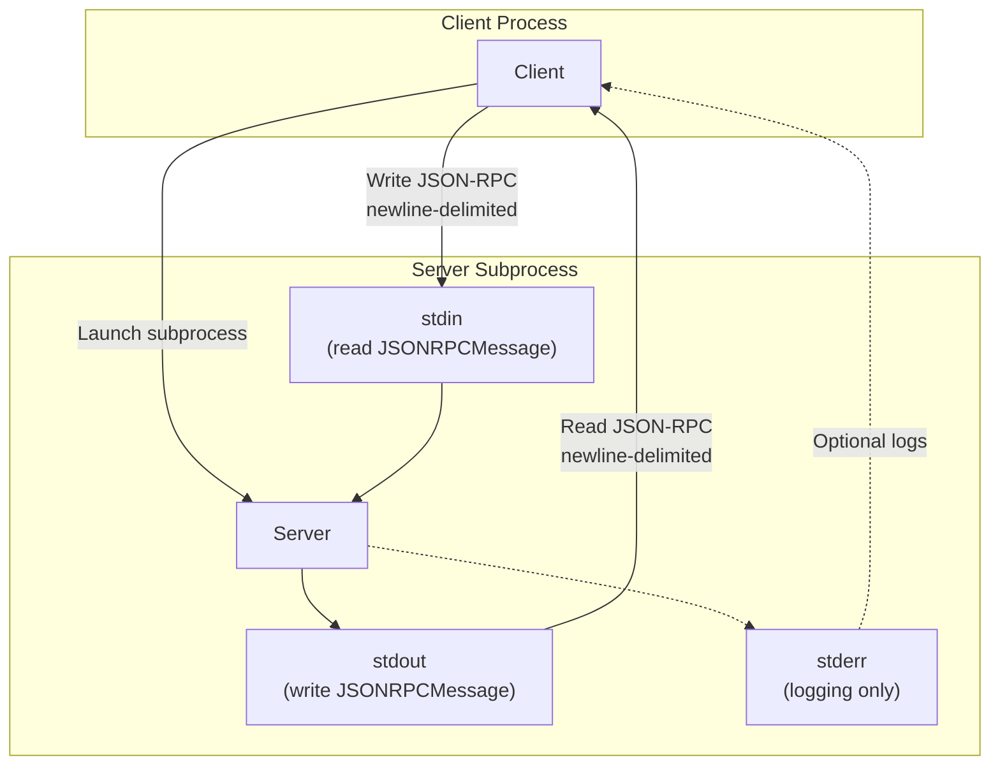

**Sources:** [docs/specification/draft/basic/transports.mdx:22-52]()

### Message Exchange Protocol

**Message Format:**
- Each message **MUST** be a complete `JSONRPCRequest`, `JSONRPCNotification`, or `JSONRPCResponse`
- Messages are newline-delimited (`\n`)
- Messages **MUST NOT** contain embedded newlines
- All messages **MUST** be UTF-8 encoded

**Stream Usage:**
- **stdin**: Server reads JSON-RPC messages from client
- **stdout**: Server writes JSON-RPC messages to client  
- **stderr**: Server **MAY** write UTF-8 logging output (informational, debug, error messages)

**Constraints:**
- Server **MUST NOT** write non-MCP content to stdout
- Client **MUST NOT** write non-MCP content to server's stdin
- Client **MAY** capture, forward, or ignore stderr output
- Client **SHOULD NOT** treat stderr output as error conditions

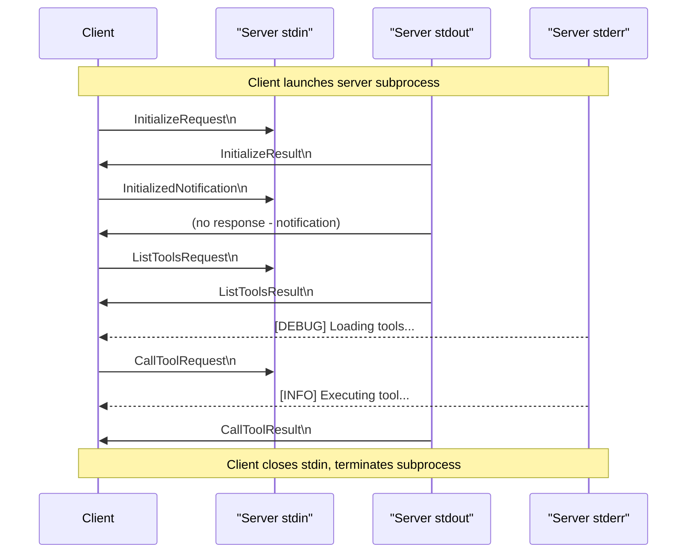

**Sources:** [docs/specification/draft/basic/transports.mdx:26-38](), [schema/draft/schema.ts:8-11]()

### Lifecycle

The stdio transport lifecycle follows the subprocess model:

1. **Launch**: Client spawns server as child process
2. **Exchange**: Bidirectional JSON-RPC message flow via stdin/stdout
3. **Termination**: Client closes stdin and terminates subprocess

The server process lifetime is bound to the client process. When the client terminates or closes stdin, the server **SHOULD** gracefully shutdown.

**Sources:** [docs/specification/draft/basic/transports.mdx:39-52]()

## Streamable HTTP Transport

### Architecture

In Streamable HTTP transport, the server operates as an independent HTTP service that can handle multiple concurrent client connections. The transport uses HTTP POST for client messages and optionally uses Server-Sent Events (SSE) for streaming server responses.

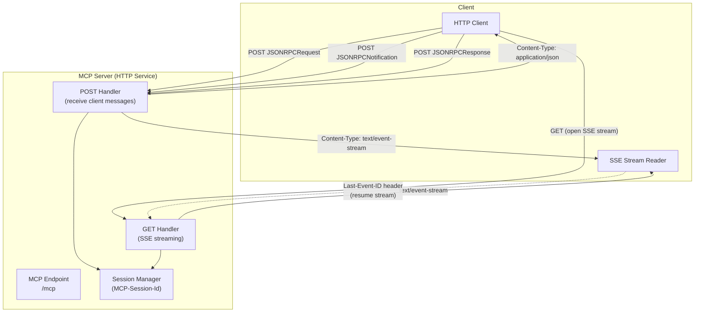

**Sources:** [docs/specification/draft/basic/transports.mdx:54-76]()

### HTTP Endpoint Requirements

Servers **MUST** provide a single HTTP endpoint path (the **MCP endpoint**) that supports both POST and GET methods. For example: `https://example.com/mcp` or `http://localhost:8080/mcp`.

**Headers:**
- `Content-Type: application/json` for JSON responses
- `Content-Type: text/event-stream` for SSE streams
- `Accept: application/json, text/event-stream` from client
- `MCP-Session-Id` for session tracking (optional)
- `MCP-Protocol-Version` for version negotiation
- `Last-Event-ID` for stream resumption (optional)

**Sources:** [docs/specification/draft/basic/transports.mdx:70-74](), [docs/specification/draft/basic/transports.mdx:195-230]()

### Security Requirements

Servers **MUST** implement these security measures:

1. **Origin Validation**: Validate the `Origin` header to prevent DNS rebinding attacks
   - If `Origin` is present and invalid, return HTTP 403 Forbidden
   - Response body **MAY** contain a JSON-RPC error response with no `id`

2. **Local Binding**: When running locally, bind only to `127.0.0.1`, not `0.0.0.0`

3. **Authentication**: Implement proper authentication for all connections (see [OAuth 2.1 Authorization Framework](#3.1))

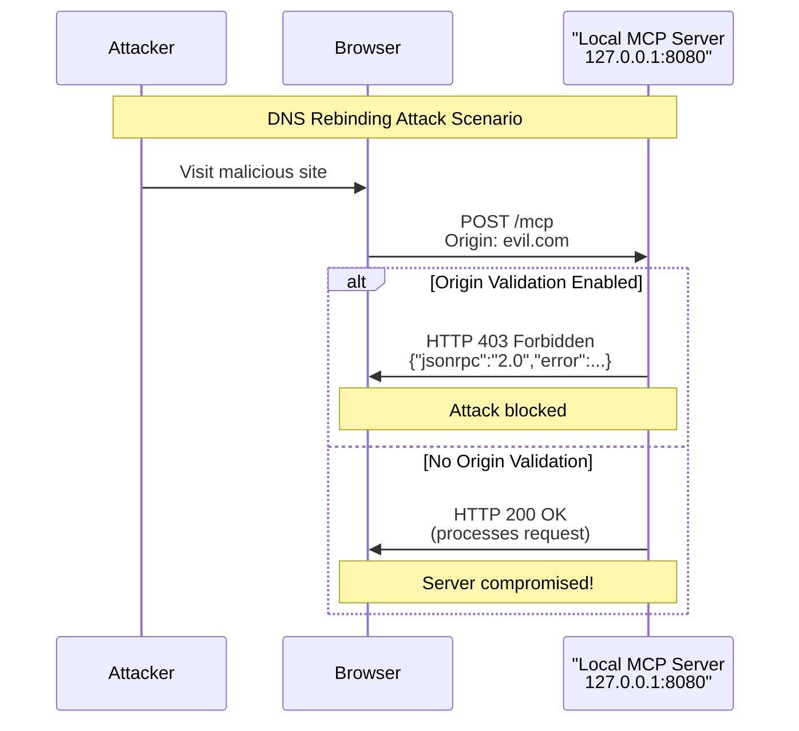

**Sources:** [docs/specification/draft/basic/transports.mdx:76-86]()

### Sending Messages to Server (HTTP POST)

Every JSON-RPC message from client to server **MUST** be a new HTTP POST request.

**Request Flow:**

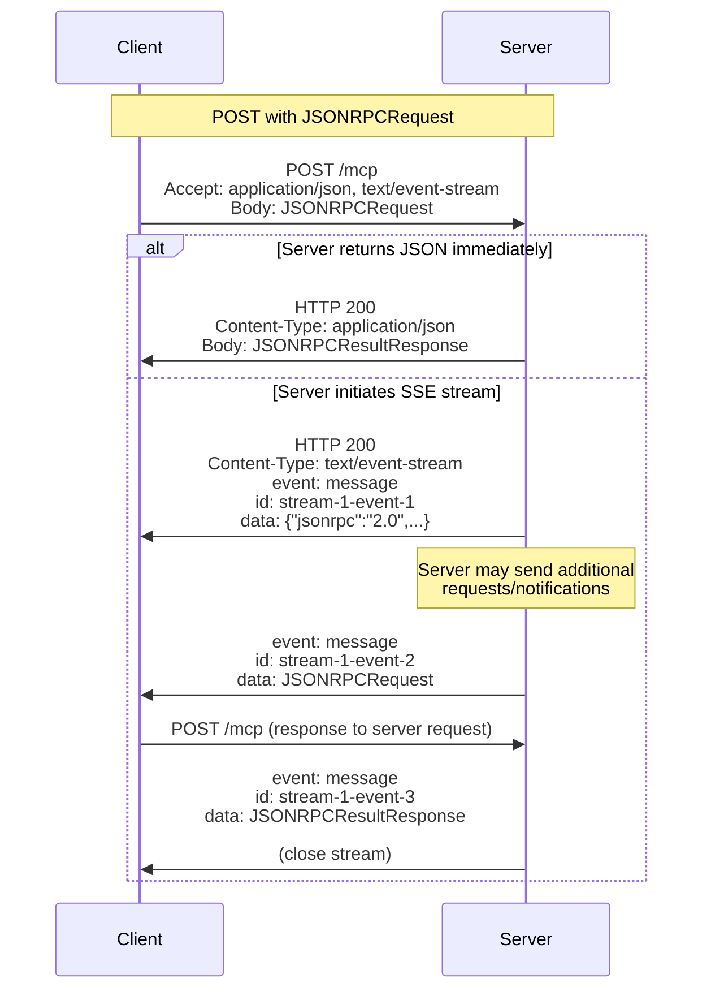

**Notification/Response Handling:**

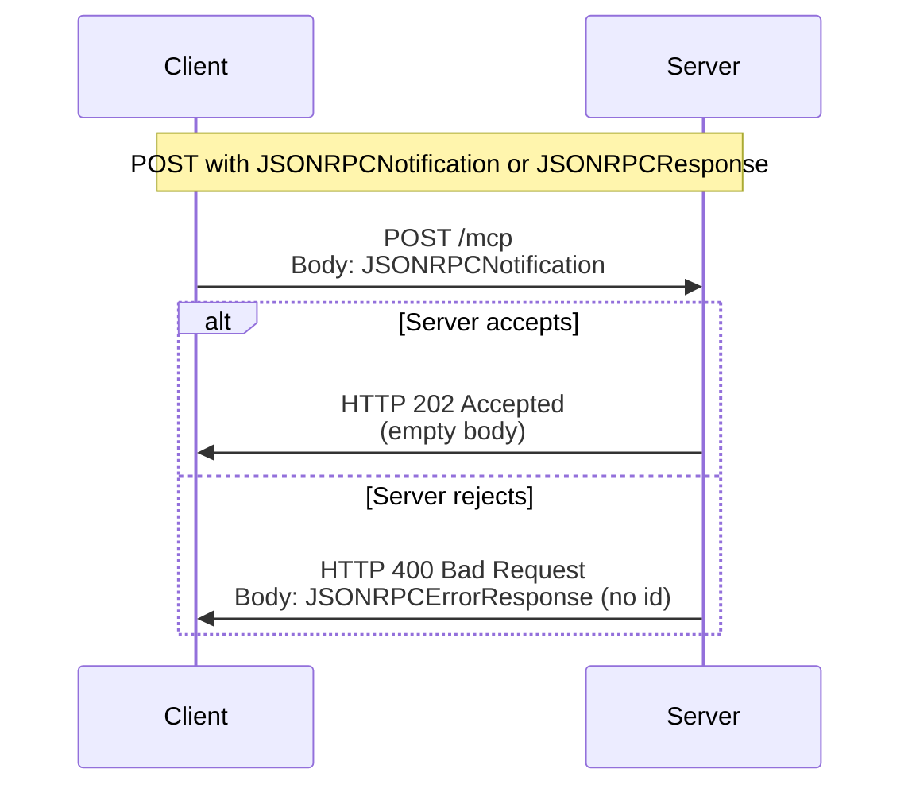

**Requirements:**

1. Client **MUST** include `Accept: application/json, text/event-stream` header
2. Body **MUST** be a single `JSONRPCRequest`, `JSONRPCNotification`, or `JSONRPCResponse`
3. For notifications/responses:
   - Success: HTTP 202 Accepted with no body
   - Failure: HTTP error status with optional JSON-RPC error response (no `id`)
4. For requests, server **MUST** return either:
   - `Content-Type: application/json` with single JSON object
   - `Content-Type: text/event-stream` to initiate SSE stream
5. Client **MUST** support both response types

**Sources:** [docs/specification/draft/basic/transports.mdx:88-134]()

### SSE Stream Lifecycle

When server initiates an SSE stream for a request:

1. Server **SHOULD** immediately send an SSE event with event ID and empty data field (primes reconnection)
2. Server **MAY** close the connection (not stream) after sending an event ID
   - Allows avoiding long-lived connections
   - Client **SHOULD** then "poll" by reconnecting
3. If closing connection early, server **SHOULD** send `retry` field before closing
   - Client **MUST** respect `retry` value (milliseconds before reconnect)
4. Stream **SHOULD** eventually include `JSONRPCResultResponse` or `JSONRPCErrorResponse` for the request
5. Server **MAY** send additional `JSONRPCRequest` or `JSONRPCNotification` messages before the response
   - These **SHOULD** relate to the originating request
6. Server **MAY** terminate stream if session expires
7. After sending final response, server **SHOULD** terminate stream
8. Disconnection **SHOULD NOT** be interpreted as cancellation
   - To cancel, client **SHOULD** send explicit `CancelledNotification`

**Sources:** [docs/specification/draft/basic/transports.mdx:107-134]()

### Listening for Messages from Server (HTTP GET)

Clients **MAY** open an SSE stream without sending a request first, allowing the server to push messages.

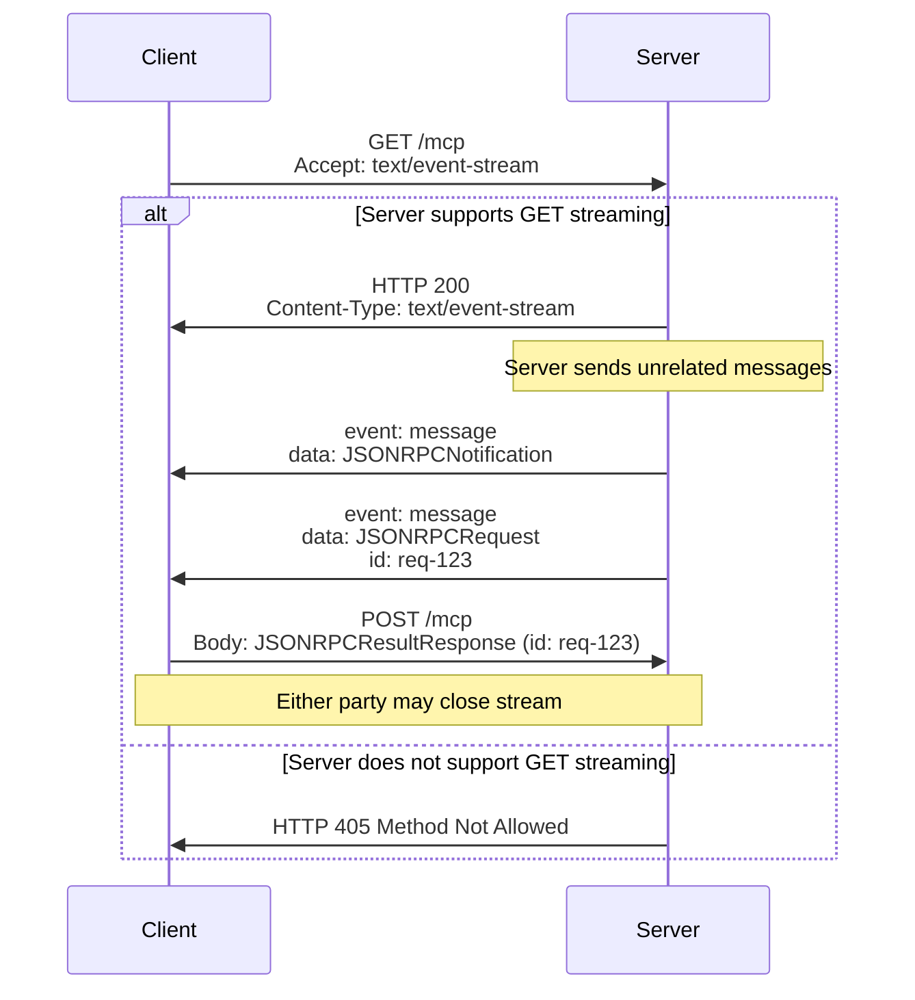

**Requirements:**

1. Client **MUST** include `Accept: text/event-stream` header
2. Server **MUST** either:
   - Return `Content-Type: text/event-stream` and open stream
   - Return HTTP 405 Method Not Allowed
3. If streaming:
   - Server **MAY** send `JSONRPCRequest` or `JSONRPCNotification` messages
   - Messages **SHOULD** be unrelated to concurrent client requests
   - Server **MUST NOT** send `JSONRPCResponse` unless resuming a previous stream
   - Server **MAY** close stream at any time
   - Client **MAY** close stream at any time
4. If closing connection without terminating stream, follow same polling behavior as POST

**Sources:** [docs/specification/draft/basic/transports.mdx:136-157]()

### Multiple Concurrent Connections

**Requirements:**

1. Client **MAY** maintain multiple SSE streams simultaneously
2. Server **MUST** send each JSON-RPC message on only one stream
   - **MUST NOT** broadcast same message across multiple streams
3. Risk of message loss **MAY** be mitigated via resumability

This pattern allows clients to:
- Keep one long-lived GET stream for server-initiated messages
- Use POST-initiated streams for request/response pairs
- Maintain separate streams for different logical operations

**Sources:** [docs/specification/draft/basic/transports.mdx:159-165]()

### Resumability and Redelivery

Servers **MAY** implement resumable streams to handle disconnections gracefully.

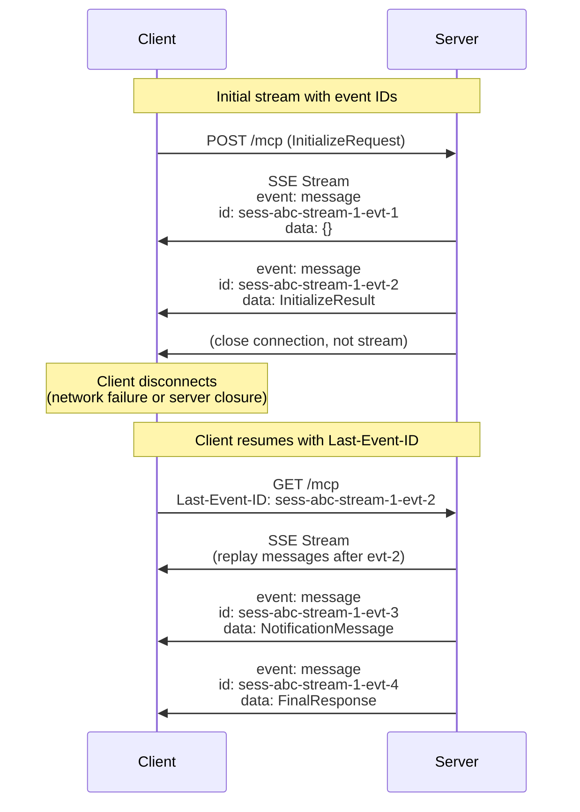

**Event ID Format:**

1. Servers **MAY** attach `id` field to SSE events per [SSE standard](https://html.spec.whatwg.org/multipage/server-sent-events.html#event-stream-interpretation)
2. If present, ID **MUST** be globally unique across all streams within the session (or per client if no session management)
3. Event IDs **SHOULD** encode information identifying the originating stream
   - Example: `sess-{sessionId}-stream-{streamId}-evt-{eventNum}`

**Resumption Protocol:**

1. Client issues HTTP GET with `Last-Event-ID` header containing last received event ID
2. Server **MAY** replay messages sent after that event ID on the same stream
3. Server **MUST NOT** replay messages from different streams
4. Applies to streams initiated via POST or GET - resumption is always via GET with `Last-Event-ID`

Event IDs act as per-stream cursors, not global broadcast IDs.

**Sources:** [docs/specification/draft/basic/transports.mdx:167-193]()

### Session Management

An MCP session consists of logically related interactions beginning with initialization. Sessions support stateful server implementations.

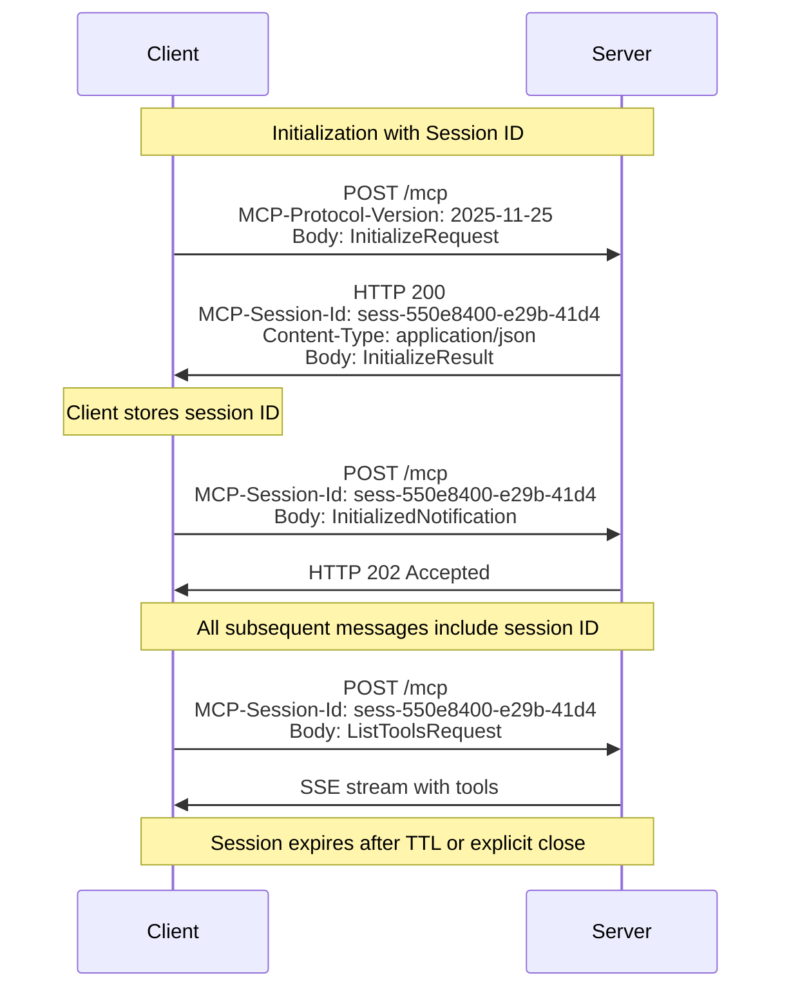

**Session ID Requirements:**

1. Server **MAY** assign session ID at initialization by including `MCP-Session-Id` header on `InitializeResult` response
2. Session ID **SHOULD** be globally unique and cryptographically secure (UUID, JWT, cryptographic hash)
3. Session ID **MUST** only contain visible ASCII characters (0x21 to 0x7E)
4. Client **MUST** handle session ID securely (see [Session Hijacking mitigations](#3.2))

**Session Usage:**

1. If `MCP-Session-Id` returned during initialization, client **MUST** include it in `MCP-Session-Id` header on all subsequent HTTP requests
2. Server **SHOULD** validate session ID on all requests:
   - Unknown/invalid/expired ID: Return HTTP 404 Not Found with JSON-RPC error
   - Prevents session hijacking and replay attacks
3. Server **SHOULD** implement session timeouts
4. Server **MAY** destroy session immediately when receiving new `InitializeRequest` for same session

**Sources:** [docs/specification/draft/basic/transports.mdx:195-230]()

### Protocol Version Negotiation

The `MCP-Protocol-Version` header enables version negotiation between client and server.

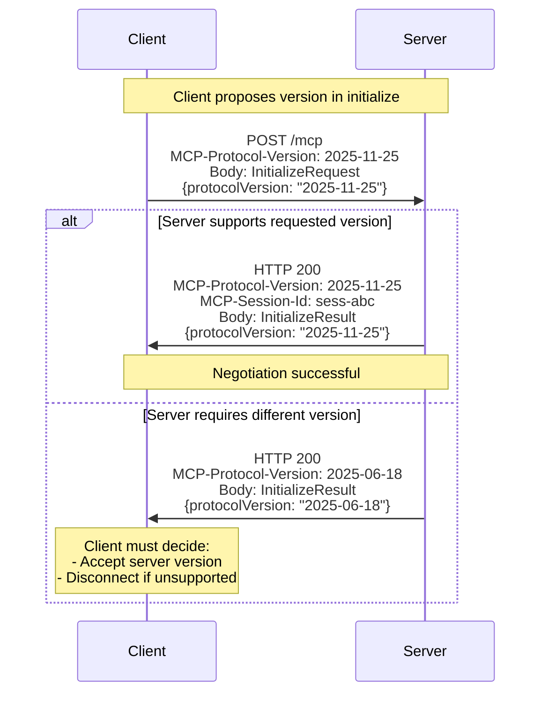

**Requirements:**

1. Client **SHOULD** include `MCP-Protocol-Version` header on initialization request
   - Value **MUST** match `protocolVersion` in `InitializeRequest` body
2. Server **MUST** return `MCP-Protocol-Version` header on `InitializeResult` response
   - Value **MUST** match `protocolVersion` in `InitializeResult` body
3. Server **MAY** reject incompatible protocol versions with HTTP 400 Bad Request
4. For all subsequent requests in session:
   - Client **MUST** include `MCP-Protocol-Version` header with negotiated version
   - Server **MAY** validate version header consistency

Version format follows `YYYY-MM-DD` pattern for releases or `DRAFT-YYYY-vN` for drafts (see [Protocol Versioning](#2.8)).

**Sources:** [docs/specification/draft/basic/transports.mdx:231-254]()

## Message Flow Comparison

The following diagram illustrates the key differences between stdio and Streamable HTTP transports:

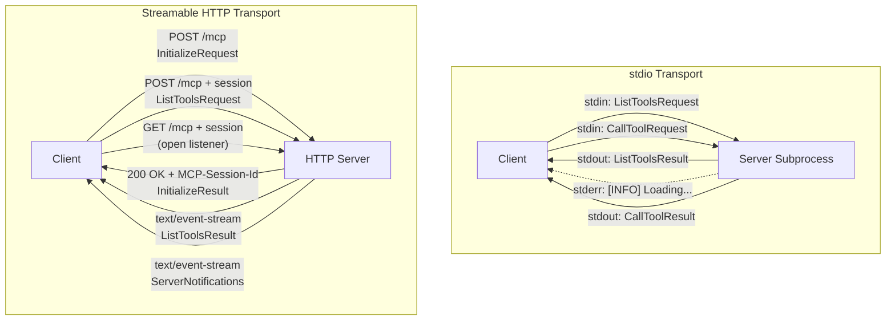

**Sources:** [docs/specification/draft/basic/transports.mdx:1-254]()

## Transport Selection Guidelines

| Consideration | stdio | Streamable HTTP |
|--------------|-------|-----------------|
| **Use Case** | Local tools, desktop integrations | Remote services, multi-client servers |
| **Lifecycle** | Bound to client process | Independent server process |
| **Authentication** | Environment variables, process isolation | OAuth 2.1 (see [#3](#3)) |
| **Network** | No network exposure | Requires network configuration |
| **State** | Session exists while subprocess runs | Explicit session management |
| **Bidirectional** | Native via stdin/stdout | Requires SSE streaming |
| **Client Support** | **SHOULD** be supported | Optional |

**Recommendations:**

- Use **stdio** for:
  - Local development tools
  - Desktop application integrations
  - Single-client scenarios
  - Minimal network attack surface

- Use **Streamable HTTP** for:
  - Cloud-hosted services
  - Multi-tenant servers
  - Web-based clients
  - Services requiring complex authentication

**Sources:** [docs/specification/draft/basic/transports.mdx:10-20](), [docs/specification/draft/basic/index.mdx:98-125]()

## Custom Transports

Implementations **MAY** create custom transports following these principles:

1. **Message Format**: Use JSON-RPC 2.0 with UTF-8 encoding
2. **Message Types**: Support `JSONRPCRequest`, `JSONRPCNotification`, `JSONRPCResponse`
3. **Bidirectionality**: Support messages in both directions
4. **Session Management**: Define clear session lifecycle
5. **Error Handling**: Map transport errors to JSON-RPC errors appropriately

Custom transports might include:
- WebSocket-based transports
- gRPC adaptations
- IPC mechanisms (named pipes, Unix domain sockets)
- Message queue systems

**Sources:** [docs/specification/draft/basic/transports.mdx:10-20]()

## Error Handling and Edge Cases

**Transport-Level Errors:**

| Error Condition | stdio | Streamable HTTP |
|----------------|-------|-----------------|
| **Connection Loss** | Process termination | Reconnect with `Last-Event-ID` |
| **Invalid Message** | Log to stderr, continue | HTTP 400 Bad Request |
| **Session Expired** | N/A (subprocess lifecycle) | HTTP 404 Not Found |
| **Origin Violation** | N/A | HTTP 403 Forbidden |
| **Unsupported Method** | N/A | HTTP 405 Method Not Allowed |

**Race Conditions:**

1. **Disconnection during request**: Client **SHOULD** send explicit `CancelledNotification`, not rely on disconnection
2. **Multiple responses**: Server **MUST** send only one response per request ID
3. **Stream closure**: Either party **MAY** close streams, requiring graceful handling

**Sources:** [docs/specification/draft/basic/transports.mdx:76-134](), [docs/specification/draft/basic/utilities/cancellation.mdx:1-87]()