This page documents the current roster of maintainers across the Model Context Protocol project, organized by their areas of responsibility. The MCP project maintains three primary categories of maintainers: **SDK Maintainers** (covering 10 language implementations with 25 maintainers), **Project Maintainers** (covering 4 core projects with 12 maintainers), and **Working Group/Interest Group Maintainers** (covering 7 active groups).

For information about maintainer roles, responsibilities, and the governance hierarchy, see [Governance Structure](#8.1). For details about the WG/IG lifecycle, creation process, and expectations, see [Working Groups and Interest Groups](#8.3).

**Note:** This roster is maintained in [MAINTAINERS.md:1-167]() and was last updated October 15, 2025.

## Maintainer Hierarchy

The MCP steering group consists of lead maintainers, core maintainers, and specialized maintainers organized by their domain expertise:

### Maintainer Hierarchy with Current Members

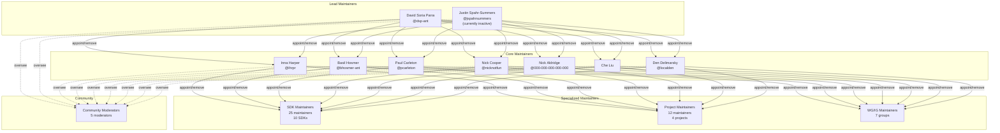

**Sources:** [MAINTAINERS.md:7-21](), [docs/community/governance.mdx:10-16]()

## SDK Maintainers

SDK maintainers are responsible for implementing and maintaining the Model Context Protocol specification in their respective programming languages. Each SDK operates as an independent repository with its own contribution process and release cycle.

### SDK Maintainer Distribution

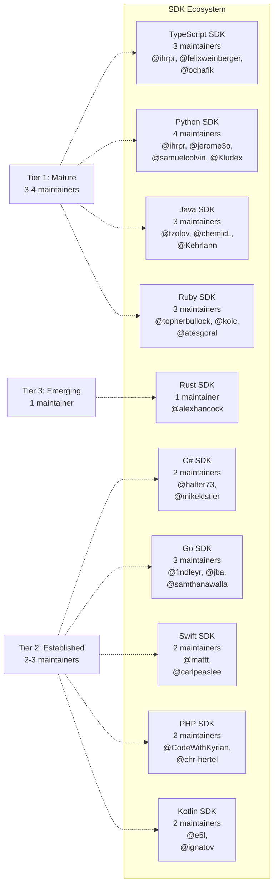

**Sources:** [MAINTAINERS.md:22-78]()

### SDK Maintainer Details

| SDK | Maintainers | GitHub Handles |
|-----|-------------|----------------|
| **TypeScript** | 3 | Inna Harper (@ihrpr), Felix Weinberger (@felixweinberger), Olivier Chafik (@ochafik) |
| **Python** | 4 | Inna Harper (@ihrpr), Jerome Swannack (@jerome3o), Samuel Colvin (@samuelcolvin), Marcelo Trylesinski (@Kludex) |
| **Java** | 3 | Christian Tzolov (@tzolov), Dariusz Jędrzejczyk (@chemicL), Daniel Garnier-Moiroux (@Kehrlann) |
| **Ruby** | 3 | Topher Bullock (@topherbullock), Koichi Ito (@koic), Ateş Göral (@atesgoral) |
| **Go** | 3 | Rob Findley (@findleyr), Jonathan Amsterdam (@jba), Sam Thanawalla (@samthanawalla) |
| **Swift** | 2 | Matt Zmuda (@mattt), Carl Peaslee (@carlpeaslee) |
| **C#** | 2 | Stephan Halter (@halter73), Mike Kistler (@mikekistler) |
| **Kotlin** | 2 | Leonid Stashevsky (@e5l), Sergey Ignatov (@ignatov) |
| **PHP** | 2 | Kyrian Obikwelu (@CodeWithKyrian), Christopher Hertel (@chr-hertel) |
| **Rust** | 1 | Alex Hancock (@alexhancock) |

**Sources:** [MAINTAINERS.md:22-78]()

## Project Maintainers

Project maintainers oversee specific infrastructure and tooling projects within the MCP ecosystem. These projects provide essential functionality for the broader community.

### Project Maintainer Structure

```mermaid
graph TB
    subgraph "Core Projects"
        USEMCP["use-mcp<br/>React hooks library"]
        INSPECTOR["Inspector<br/>Developer testing tool"]
        REGISTRY["Registry<br/>Server discovery"]
        REFSERV["Reference Servers<br/>Example implementations"]
    end
    
    subgraph "use-mcp Maintainers"
        USEMCP_M1["Glen Maddern<br/>@geelen"]
    end
    
    subgraph "Inspector Maintainers"
        INSP_M1["Ola Hungerford<br/>@olaservo"]
        INSP_M2["Cliff Hall<br/>@cliffhall"]
    end
    
    subgraph "Registry Maintainers"
        REG_M1["Toby Padilla<br/>@toby"]
        REG_M2["Tadas Antanavicius<br/>@tadasant"]
        REG_M3["Adam Jones<br/>@domdomegg"]
        REG_M4["Radoslav Dimitrov<br/>@rdimitrov"]
    end
    
    subgraph "Reference Servers Maintainers"
        REF_M1["Ola Hungerford<br/>@olaservo"]
        REF_M2["Cliff Hall<br/>@cliffhall"]
        REF_M3["Tadas Antanavicius<br/>@tadasant"]
        REF_M4["Shaun Smith<br/>@evalstate"]
        REF_M5["Jonathan Hefner<br/>@jonathanhefner"]
    end
    
    USEMCP --> USEMCP_M1
    INSPECTOR --> INSP_M1 & INSP_M2
    REGISTRY --> REG_M1 & REG_M2 & REG_M3 & REG_M4
    REFSERV --> REF_M1 & REF_M2 & REF_M3 & REF_M4 & REF_M5
```

**Sources:** [MAINTAINERS.md:79-104]()

### Project Details

| Project | Purpose | Maintainers | Count |
|---------|---------|-------------|-------|
| **use-mcp** | React hooks library for MCP integration | Glen Maddern | 1 |
| **Inspector** | Interactive developer tool for testing MCP servers | Ola Hungerford, Cliff Hall | 2 |
| **Registry** | Centralized server discovery and listing service | Toby Padilla, Tadas Antanavicius, Adam Jones, Radoslav Dimitrov | 4 |
| **Reference Servers** | Example MCP server implementations (filesystem, git, memory, etc.) | Ola Hungerford, Cliff Hall, Tadas Antanavicius, Shaun Smith, Jonathan Hefner | 5 |

**Sources:** [MAINTAINERS.md:79-104]()

## Working Group and Interest Group Maintainers

Working Groups (WGs) and Interest Groups (IGs) organize collaborative efforts around specific topics. While facilitators can be informal community members, maintainers provide official representation from the MCP steering group.

### Working and Interest Group Structure

```mermaid
graph TB
    subgraph "Interest Groups (Exploration)"
        SEC_IG["Security IG<br/>Protocol security<br/>best practices"]
        AUTH_IG["Authorization IG<br/>OAuth 2.1<br/>implementation"]
        CLIENT_IG["Client Implementor IG<br/>Client development<br/>coordination"]
        FIN_IG["Financial Services IG<br/>Enterprise adoption"]
        TRANS_IG["Transports IG<br/>Transport layer<br/>enhancements"]
    end
    
    subgraph "Working Groups (Deliverables)"
        IDENT_WG["Server Identity WG<br/>Server identification<br/>SEPs"]
        AGENTS_WG["Agents WG<br/>Agentic workflows<br/>SEPs"]
    end
    
    subgraph "Security IG Maintainers"
        SEC_M1["Den Delimarsky<br/>@dend"]
        SEC_M2["Paul Carleton<br/>@pcarleton"]
        SEC_M3["Jenn Newton<br/>@jenn-newton"]
    end
    
    subgraph "Authorization IG Maintainers"
        AUTH_M1["Aaron Parecki<br/>@aaronpk"]
        AUTH_M2["Darin McAdams<br/>@D-McAdams"]
        AUTH_M3["Paul Carleton<br/>@pcarleton"]
    end
    
    subgraph "Client Implementor IG"
        CLIENT_M1["Alex Hancock - Goose"]
        CLIENT_M2["Ben Brandt - Zed"]
        CLIENT_M3["Connor Peet - VS Code"]
        CLIENT_M4["Gabriel Peal - Codex"]
        CLIENT_M5["Jun Han - JetBrains"]
        CLIENT_M6["Tyler Leonhardt - VS Code"]
        CLIENT_M7["Michael Feldstein - Cursor"]
    end
    
    subgraph "Financial Services IG"
        FIN_M1["Sambhav Kothari<br/>@sambhav"]
    end
    
    subgraph "Transports IG Maintainers"
        TRANS_M1["Kurtis Van Gent<br/>@kurtisvg"]
        TRANS_M2["Jonathan Hefner<br/>@jonathanhefner"]
        TRANS_M3["Shaun Smith<br/>@evalstate"]
        TRANS_M4["Harvey Tuch<br/>@htuch"]
    end
    
    subgraph "Server Identity WG"
        IDENT_M1["Nick Cooper<br/>@nicknotfun"]
    end
    
    subgraph "Agents WG Maintainers"
        AGENTS_M1["Peter Alexander<br/>@pja-ant"]
        AGENTS_M2["Luca Chang<br/>@LucaButBoring"]
        AGENTS_M3["Inna Harper<br/>@ihrpr"]
    end
    
    SEC_IG --> SEC_M1 & SEC_M2 & SEC_M3
    AUTH_IG --> AUTH_M1 & AUTH_M2 & AUTH_M3
    CLIENT_IG --> CLIENT_M1 & CLIENT_M2 & CLIENT_M3 & CLIENT_M4 & CLIENT_M5 & CLIENT_M6 & CLIENT_M7
    FIN_IG --> FIN_M1
    TRANS_IG --> TRANS_M1 & TRANS_M2 & TRANS_M3 & TRANS_M4
    IDENT_WG --> IDENT_M1
    AGENTS_WG --> AGENTS_M1 & AGENTS_M2 & AGENTS_M3
```

**Sources:** [MAINTAINERS.md:113-161]()

### Working and Interest Group Details

| Group Type | Name | Focus | Maintainers | Count |
|------------|------|-------|-------------|-------|
| **IG** | Security | Protocol security, vulnerability management | Den Delimarsky, Paul Carleton, Jenn Newton | 3 |
| **IG** | Authorization | OAuth 2.1 implementation, token management | Aaron Parecki, Darin McAdams, Paul Carleton | 3 |
| **IG** | Client Implementor | Client development coordination, protocol representatives | Alex Hancock (Goose), Ben Brandt (Zed), Connor Peet (VS Code), Gabriel Peal (Codex), Jun Han (JetBrains), Tyler Leonhardt (VS Code), Michael Feldstein (Cursor) | 7 |
| **IG** | Financial Services | Enterprise adoption, compliance | Sambhav Kothari | 1 |
| **IG** | Transports | Transport layer enhancements (STDIO, HTTP, WebSocket) | Kurtis Van Gent, Jonathan Hefner, Shaun Smith, Harvey Tuch | 4 |
| **WG** | Server Identity | Server identification mechanisms, SEP development | Nick Cooper | 1 |
| **WG** | Agents | Agentic workflows, multi-agent coordination | Peter Alexander, Luca Chang, Inna Harper | 3 |

**Sources:** [MAINTAINERS.md:113-161]()

**Note:** The Client Implementor Interest Group members serve as protocol representatives for their respective clients. For client-specific issues, users should use official support channels for each product rather than contacting these maintainers directly [MAINTAINERS.md:129-131]().

## Community Moderators

Community Moderators handle day-to-day management of community spaces, including Discord moderation, facilitating discussions, and ensuring adherence to the Code of Conduct.

### Current Community Moderators

| Name | GitHub Handle |
|------|---------------|
| Ola Hungerford | @olaservo |
| Cliff Hall | @cliffhall |
| Shaun Smith | @evalstate |
| Jonathan Hefner | @jonathanhefner |
| Tadas Antanavicius | @tadasant |

**Sources:** [MAINTAINERS.md:105-111]()

## Maintainer Responsibilities by Domain

Different maintainer types have distinct responsibilities within the MCP ecosystem:

### Responsibility Matrix

```mermaid
graph TB
    subgraph "SDK Maintainers"
        SDK_R1["Implementation of<br/>MCP specification"]
        SDK_R2["Language-specific APIs"]
        SDK_R3["Release management"]
        SDK_R4["SDK documentation"]
    end
    
    subgraph "Project Maintainers"
        PROJ_R1["Tool development"]
        PROJ_R2["Infrastructure maintenance"]
        PROJ_R3["User documentation"]
        PROJ_R4["Community support"]
    end
    
    subgraph "WG/IG Maintainers"
        WG_R1["Facilitate discussions"]
        WG_R2["SEP sponsorship"]
        WG_R3["Meeting coordination"]
        WG_R4["Deliverable tracking"]
    end
    
    subgraph "Core Responsibilities (All)"
        CORE_R1["Community engagement"]
        CORE_R2["Code reviews"]
        CORE_R3["Mentoring contributors"]
        CORE_R4["Alignment with<br/>MCP philosophy"]
    end
    
    SDK_R1 & SDK_R2 & SDK_R3 & SDK_R4 --> CORE_R1 & CORE_R2 & CORE_R3 & CORE_R4
    PROJ_R1 & PROJ_R2 & PROJ_R3 & PROJ_R4 --> CORE_R1 & CORE_R2 & CORE_R3 & CORE_R4
    WG_R1 & WG_R2 & WG_R3 & WG_R4 --> CORE_R1 & CORE_R2 & CORE_R3 & CORE_R4
```

**Sources:** [docs/community/governance.mdx:24-37]()

### General Maintainer Responsibilities

All maintainers across SDKs, projects, and working groups share these core expectations [docs/community/governance.mdx:28-34]():

- **Thoughtful and productive engagement** with community contributors
- **Maintaining and improving** their respective area of the MCP project
- **Supporting documentation**, roadmaps, and adjacent parts of the MCP project
- **Presenting ideas** from community to core maintainers

## Maintainer Appointment Process

Maintainers can only be appointed and removed by core maintainers or lead maintainers at any time and without requiring justification [docs/community/governance.mdx:35-36](). The nomination process follows a structured workflow defined in [docs/community/governance.mdx:138-158]().

### Nomination Workflow

| Step | Actor | Action | Location |
|------|-------|--------|----------|
| 1 | Nominator | Collect evidence of contributions (merged PRs, reviews) | Local preparation |
| 2 | Nominator | Discuss with existing maintainers in relevant group | Discord/private discussion |
| 3 | Nominator | Request private channel creation via Community Moderator or Core Maintainer | Discord DM |
| 4 | Core/Lead | Create `nomination-{name}-{group}` private channel | Discord |
| 5 | Nominator | Provide context: GitHub profile, group(s), contributions, capacity | Discord channel |
| 6 | Core/Lead | Create Discord Poll for Yes/No vote | Discord channel |
| 7 | Core/Lead | Discuss and vote (consensus encouraged, not required) | Discord channel |
| 8 | Admin | Update GitHub and Discord roles if approved | GitHub, Discord |
| 9 | Nominator | Announce new maintainership in relevant public channel | Discord |
| 10 | Admin | Delete nomination channel after one week | Discord |

**Sources:** [docs/community/governance.mdx:138-158]()

## WG/IG Facilitators vs Maintainers

The distinction between facilitators and maintainers in Working Groups and Interest Groups [MAINTAINERS.md:113-115]():

| Role | Status | Requirements | Responsibilities |
|------|--------|--------------|-----------------|
| **Facilitator** | Informal, self-nominated | None | Shepherd discussions, organize meetings |
| **Maintainer** | Official MCP steering group representative | Appointed by core/lead maintainers | Sponsor SEPs, advocate for initiatives, maintain deliverables |

**Note:** A facilitator role does **not** automatically grant maintainership status across the MCP organization [docs/community/working-interest-groups.mdx:108-110]().

## Active Group Communication

All active Working Groups and Interest Groups publish their meeting schedules on the public MCP community calendar at [meet.modelcontextprotocol.io](https://meet.modelcontextprotocol.io/). Each group maintains a dedicated Discord channel in the MCP Contributor Discord server [docs/community/working-interest-groups.mdx:25-29]().

For information about creating new groups, lifecycle management, and meeting expectations, see [Working Groups and Interest Groups](#8.3).

**Sources:** [docs/community/working-interest-groups.mdx:1-130](), [MAINTAINERS.md:1-167](), [docs/community/governance.mdx:1-173]()

# Working Groups and Interest Groups

This document describes the collaborative group structures within the Model Context Protocol's governance: **Working Groups** (WGs) and **Interest Groups** (IGs). These groups facilitate focused discussions, problem identification, and deliverable production within specific areas of the MCP ecosystem.

For information about the overall governance structure and maintainer hierarchy, see [Governance Structure](#7.1). For communication channels used by these groups, see [Communication Channels](#7.4). For the process of proposing specification changes, see [Specification Enhancement Process (SEP)](#6.2).

## Purpose and Scope

Working Groups and Interest Groups exist to:

- Facilitate high-signal spaces for focused discussions among contributors who opt into notifications, expertise sharing, and regular meetings
- Establish clear expectations and leadership roles to guide collaborative efforts
- Enable meaningful contributions and knowledge sharing in specific MCP sub-topics
- Produce concrete deliverables (SEPs, implementations, maintained projects)

Sources: [docs/community/working-interest-groups.mdx:16-22]()

## Interest Groups vs Working Groups

### Interest Groups (IGs)

**Goal**: Facilitate discussion and knowledge-sharing among MCP contributors who share interests in a specific MCP sub-topic or context. Primary focus is on identifying and gathering problems that may be worth addressing through SEPs or other community artifacts.

**Key Characteristics**:
- Problem identification and exploration
- Open discussion format
- No strict deliverable requirements
- Can inform Working Group creation
- No expiration date if active

**Examples**:
- Security in MCP
- Auth in MCP
- Using MCP in enterprise settings
- Tooling and practices for hosting MCP servers
- Tooling and practices for implementing MCP clients

Sources: [docs/community/working-interest-groups.mdx:31-49]()

### Working Groups (WGs)

**Goal**: Facilitate collaboration within the MCP community on a SEP, a themed series of SEPs, or an otherwise officially endorsed project.

**Key Characteristics**:
- Deliverable-focused (SEPs or maintained projects)
- Progress tracking requirements
- Clear work items (Issues/PRs)
- Retirement when objectives complete
- May maintain long-term projects (SDKs, Inspector, Registry)

**Examples**:
- Registry
- Inspector
- Tool Filtering
- Server Identity
- Agents Working Group

Sources: [docs/community/working-interest-groups.mdx:71-88]()

## Group Structure and Roles

### Facilitators vs Maintainers

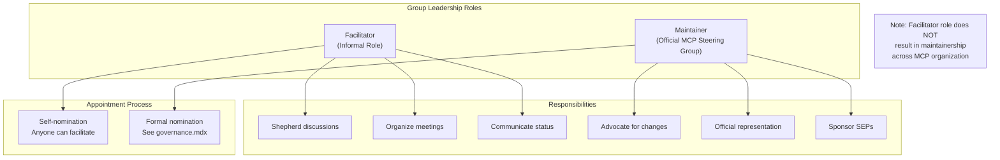

**Facilitator**: Informal role responsible for helping shepherd discussions and collaboration within an IG or WG. Anyone can self-nominate. Does not confer maintainership status in the MCP organization.

**Maintainer**: Official representative from the MCP steering group. Not required for every group but helps advocate for specific changes or initiatives. May sponsor SEPs and has formal authority.

Sources: [docs/community/working-interest-groups.mdx:108-115](), [docs/community/governance.mdx:24-36]()

## Lifecycle Management

### Creation Workflow

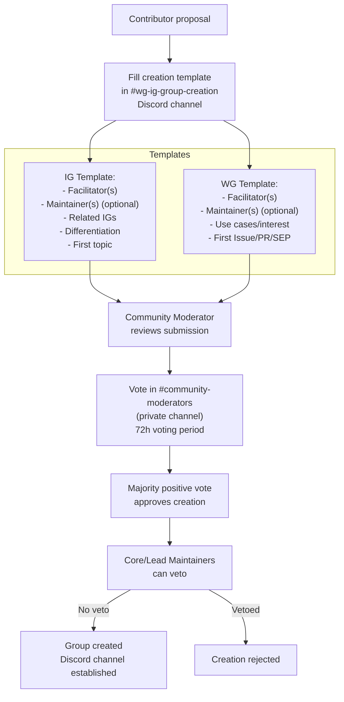

Sources: [docs/community/working-interest-groups.mdx:50-58](), [docs/community/working-interest-groups.mdx:89-99]()

### Creation Templates

#### Interest Group Creation Template

| Field | Description |
|-------|-------------|
| Facilitator(s) | Person(s) responsible for organizing |
| Maintainer(s) | Optional official MCP steering group representative |
| Related IGs | Other IGs with potentially similar goals/discussions |
| Differentiation | How this IG differs from related IGs |
| First Topic | Initial discussion topic for the IG |

Sources: [docs/community/working-interest-groups.mdx:61-68]()

#### Working Group Creation Template

| Field | Description |
|-------|-------------|
| Facilitator(s) | Person(s) responsible for organizing |
| Maintainer(s) | Optional official MCP steering group representative |
| Use Cases/Interest | Explanation of need, ideally from IG discussion (not required) |
| First Issue/PR/SEP | Initial work item the WG will pursue |

Sources: [docs/community/working-interest-groups.mdx:101-107]()

### Operating Requirements

#### Interest Group Requirements

- Regular conversations in the Interest Group Discord channel
- **AND/OR** a recurring live meeting regularly attended by members
- Meeting dates/times published on [MCP community calendar](https://meet.modelcontextprotocol.io/)
- Meeting tags include topic and channel name (e.g., `auth-ig`)
- Notes publicly shared after meetings as GitHub issue or public Google Doc

Sources: [docs/community/working-interest-groups.mdx:35-41]()

#### Working Group Requirements

- Meaningful progress towards at least one SEP or spec-related implementation **OR** maintenance responsibilities for a project
- Facilitators track progress and communicate status when appropriate
- Meeting dates/times published on [MCP community calendar](https://meet.modelcontextprotocol.io/)
- Meeting tags include topic and channel name (e.g., `agents-wg`)
- Notes publicly shared after meetings as GitHub issue or public Google Doc

Sources: [docs/community/working-interest-groups.mdx:75-81]()

### Retirement Conditions

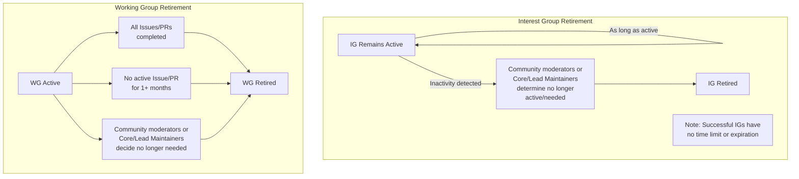

**Interest Group Retirement**:
- Retired only when community moderators or Core/Lead Maintainers determine it's no longer active and/or needed
- No expiration date as long as active and maintained

**Working Group Retirement**:
- Community moderators or Core/Lead Maintainers decide it is no longer active/needed
- **OR** No active Issue/PR for a month or more
- **OR** Completed all Issues/PRs it intended to pursue

Sources: [docs/community/working-interest-groups.mdx:56-60](), [docs/community/working-interest-groups.mdx:97-100]()

## Current Working Groups and Interest Groups

### Active Interest Groups

The following Interest Groups are documented in [MAINTAINERS.md:121-160]():

| Interest Group | Discord Channel | Maintainers | Purpose |
|----------------|-----------------|-------------|---------|
| Security Interest Group | `#security-ig` | Den Delimarsky, Paul Carleton, Jenn Newton | Security topics in MCP |
| Authorization Interest Group | `#auth-ig` | Aaron Parecki, Darin McAdams, Paul Carleton | Authorization and OAuth 2.1 implementation |
| Client Implementor Interest Group | `#client-implementors-ig` | Alex Hancock (Goose), Ben Brandt (Zed), Connor Peet (VS Code), Gabriel Peal (Codex), Jun Han (GitHub Copilot), Tyler Leonhardt (VS Code), Michael Feldstein (Cursor) | MCP protocol representatives for clients |
| Financial Services Interest Group | `#financial-services-ig` | Sambhav Kothari, Peder Holdgaard Pedersen | MCP in financial services context |
| Transports Interest Group | `#transports-ig` | Kurtis Van Gent, Jonathan Hefner, Shaun Smith, Harvey Tuch | Transport layer topics |

**Note**: Client Implementor Interest Group members serve as MCP protocol representatives for their respective clients. For client-specific issues, use official support channels provided by each product.

Sources: [MAINTAINERS.md:125-160]()

### Active Working Groups

The following Working Groups are documented in [MAINTAINERS.md:161-175]():

| Working Group | Discord Channel | Maintainers | Deliverable Focus |
|---------------|-----------------|-------------|-------------------|
| Server Identity Working Group | `#server-identity-wg` | Nick Cooper | Server identity specifications |
| Agents Working Group | `#agents-wg` | Peter Alexander, Luca Chang, Inna Harper | Agentic workflows and agent-related SEPs |
| MCP Apps Working Group | `#mcp-apps-wg` | Liad Yosef, Ido Salomon | MCP application development |

Sources: [MAINTAINERS.md:161-175]()

### Project Maintainers (Long-term Working Groups)

These maintainers are responsible for ongoing MCP projects documented in [MAINTAINERS.md:80-112](). While not formally designated as "Working Groups," they function similarly by maintaining specific deliverables:

| Project | Repository/Scope | Maintainers | Description |
|---------|------------------|-------------|-------------|
| use-mcp | React integration | Glen Maddern | React hooks for MCP integration |
| Inspector | `@modelcontextprotocol/inspector` | Cliff Hall, Konstantin Konstantinov, Ola Hungerford | Interactive developer tool for testing MCP servers |
| Registry | MCP server discovery | Toby Padilla, Tadas Antanavicius, Adam Jones, Radoslav Dimitrov | MCP server registry and discovery platform |
| MCPB (Model Context Protocol Bundle) | Packaging system | Alexander Sklar, Adam Jones, Joan Xie | MCP server bundling and distribution |
| Reference Servers | Official examples | Ola Hungerford, Cliff Hall, Tadas Antanavicius, Shaun Smith, Jonathan Hefner | Maintained reference server implementations |

Sources: [MAINTAINERS.md:80-112]()

## Communication and Meeting Infrastructure

### Meeting Calendar

All Interest Group and Working Group meetings are published on the public MCP community calendar at [meet.modelcontextprotocol.io](https://meet.modelcontextprotocol.io/).

Facilitators are responsible for:
- Posting meeting schedules in advance
- Tagging meetings with primary topic and channel name
- Ensuring discoverability for community participation

Sources: [docs/community/working-interest-groups.mdx:25-30]()

### Communication Channels

#### Discord Channel Structure

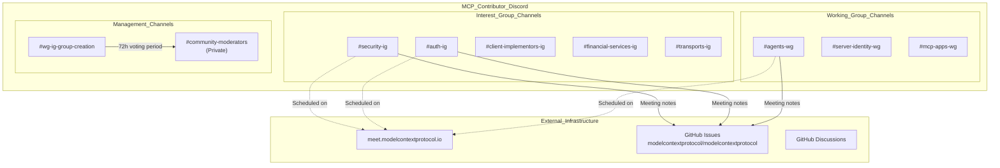

**Discord Infrastructure**:
- **MCP Contributor Discord**: `discord.gg/6CSzBmMkjX` as specified in [docs/community/communication.mdx:26]()
- Each WG/IG has a dedicated public channel with standardized naming: `#{topic}-{ig|wg}`
- **Creation channel**: `#wg-ig-group-creation` for submitting proposals per [docs/community/working-interest-groups.mdx:52]()
- **Private voting**: `#community-moderators` channel for 72-hour voting period per [docs/community/working-interest-groups.mdx:53]()

**Meeting Infrastructure**:
- **Public calendar**: `meet.modelcontextprotocol.io` as specified in [docs/community/working-interest-groups.mdx:27]()
- **Meeting notes**: Posted to GitHub Issues in `modelcontextprotocol/modelcontextprotocol` repository
- Example meeting notes: [github.com/modelcontextprotocol/modelcontextprotocol/issues/1629](https://github.com/modelcontextprotocol/modelcontextprotocol/issues/1629)
- Meeting tags format: `{topic}-{ig|wg}` per [docs/community/working-interest-groups.mdx:39]()

Sources: [docs/community/working-interest-groups.mdx:25-30](), [docs/community/working-interest-groups.mdx:39-41](), [docs/community/working-interest-groups.mdx:52-58](), [docs/community/communication.mdx:19-27](), [MAINTAINERS.md:125-175]()

## Relationship to Governance Structure

### Integration with MCP Steering Group

#### Maintainer Hierarchy and WG/IG Assignments

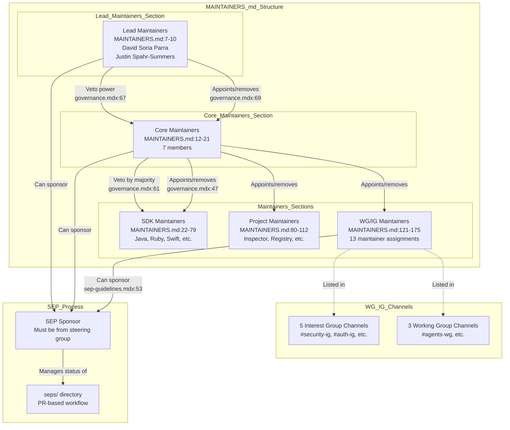

**Maintainer Structure in MAINTAINERS.md**:

The [MAINTAINERS.md]() file documents the complete maintainer hierarchy across different sections:

| Section | Line Range | Count | Description |
|---------|------------|-------|-------------|
| Lead Maintainers | 7-10 | 2 | Ultimate authority (BDFLs) |
| Core Maintainers | 12-21 | 7 | Specification oversight |
| SDK Maintainers | 22-79 | 30+ | Language-specific SDK maintenance |
| Project Maintainers | 80-112 | 15+ | Inspector, Registry, MCPB, etc. |
| Community Moderators | 113-120 | 5 | Discord and community management |
| WG/IG Maintainers | 121-175 | 13 assignments | Working and Interest Group leadership |

**Key Points**:

1. **WG/IG Maintainers section spans lines 121-175** of MAINTAINERS.md with 13 maintainer assignments across 8 groups
2. **Not all Maintainers lead WG/IGs** - only a subset have WG/IG assignments in this section
3. **Facilitators do not automatically become Maintainers** - facilitator role is informal per [docs/community/working-interest-groups.mdx:110]()
4. **Lead and Core Maintainers can veto** WG/IG creation or modify facilitator/maintainer lists at any time per [docs/community/working-interest-groups.mdx:54]()
5. **WG/IG Maintainers can sponsor SEPs** from the `seps/` directory as part of the PR-based workflow per [docs/community/sep-guidelines.mdx:53]()

Sources: [docs/community/governance.mdx:22-30](), [docs/community/governance.mdx:47](), [docs/community/governance.mdx:61](), [docs/community/governance.mdx:67-69](), [docs/community/working-interest-groups.mdx:108-115](), [docs/community/sep-guidelines.mdx:53](), [MAINTAINERS.md:1-175]()

### Governance Principles for WG/IGs

All groups must adhere to core governance principles:

1. **Clear contribution and decision-making processes**
2. **Open communication and transparent decisions**
3. **Document their contribution process**
4. **Maintain transparent communication**
5. **Make decisions publicly** (groups must publish meeting notes and proposals)

**Default processes for groups without specified procedures**:
- GitHub pull requests and issues for contributions
- A public channel in the official MCP Contributor Discord

Sources: [docs/community/governance.mdx:79-96]()

## Relationship to SEP Process

### WG/IG Role in Specification Enhancement

#### SEP Workflow Integration

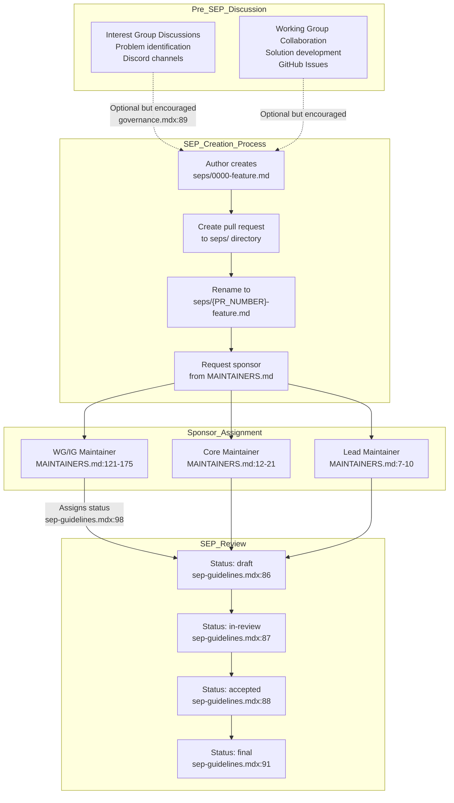

Participation in an Interest Group or Working Group is **not required** to:
- Start a Working Group
- Create a SEP in the `seps/` directory

However, building consensus within IGs and WGs provides benefits as noted in [docs/community/governance.mdx:84-90]():

**Interest Groups**:
- Help identify problems worth addressing through SEPs
- Validate that proposed SEPs align with protocol needs
- Provide community support when justifying WG formation
- Enable collaborative exploration before formal proposals

**Working Groups**:
- Facilitate collaboration on specific SEPs or themed series of SEPs
- Provide structure for producing SEP deliverables tracked via GitHub Issues
- Enable coordinated reference implementations
- May maintain projects resulting from accepted SEPs

**SEP Sponsorship Process**:
1. All SEPs must have a sponsor from the MCP steering group per [docs/community/sep-guidelines.mdx:53]()
2. Sponsor must be Maintainer, Core Maintainer, or Lead Maintainer listed in [MAINTAINERS.md]()
3. WG/IG Maintainers listed in [MAINTAINERS.md:121-175]() can sponsor SEPs emerging from their groups
4. Sponsor is responsible for updating SEP status in markdown file per [docs/community/sep-guidelines.mdx:97-104]()
5. SEPs without sponsor for 6 months are marked `dormant` per [docs/community/sep-guidelines.mdx:66]()

Sources: [docs/community/working-interest-groups.mdx:7-13](), [docs/community/working-interest-groups.mdx:69-70](), [docs/community/governance.mdx:84-90](), [docs/community/governance.mdx:116-122](), [docs/community/sep-guidelines.mdx:53](), [docs/community/sep-guidelines.mdx:66](), [docs/community/sep-guidelines.mdx:86-91](), [docs/community/sep-guidelines.mdx:97-104](), [MAINTAINERS.md:121-175]()

## Contributor On-ramp

The WG/IG structure provides a clear path for community contribution:

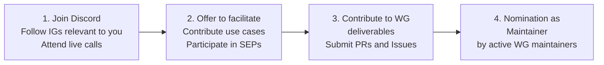

**Path to Contribution**:

1. **Join and observe**: Join the [Discord](https://discord.gg/6CSzBmMkjX), follow conversations in relevant IGs, attend live calls at [meet.modelcontextprotocol.io](https://meet.modelcontextprotocol.io/)
2. **Participate actively**: Offer to facilitate calls, contribute use cases in SEP proposals
3. **Produce work**: Contribute to WG deliverables, submit PRs and work on issues
4. **Maintainer nomination**: Active and valuable contributors will be nominated by WG maintainers as new maintainers

Sources: [docs/community/working-interest-groups.mdx:118-126]()

## Transparency and Decision Recording

All WG/IG decisions affecting the community must be documented publicly:

**Required documentation**:
- Meeting notes posted to GitHub Issues or public Google Docs
- Technical decisions recorded in GitHub Issues and SEPs
- Governance decisions captured in community documentation

**Private discussions** (e.g., in Discord) that lead to potential decisions or proposals **must be moved** to GitHub Discussions or GitHub Issues to create a persistent, searchable record.

Sources: [docs/community/communication.mdx:48-54](), [docs/community/communication.mdx:88-104]()