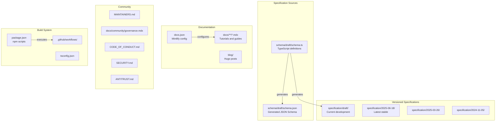
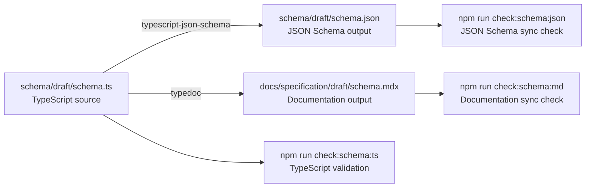
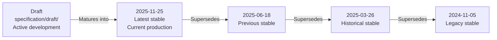
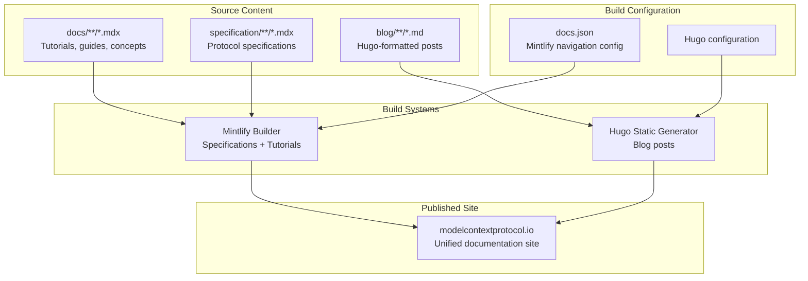
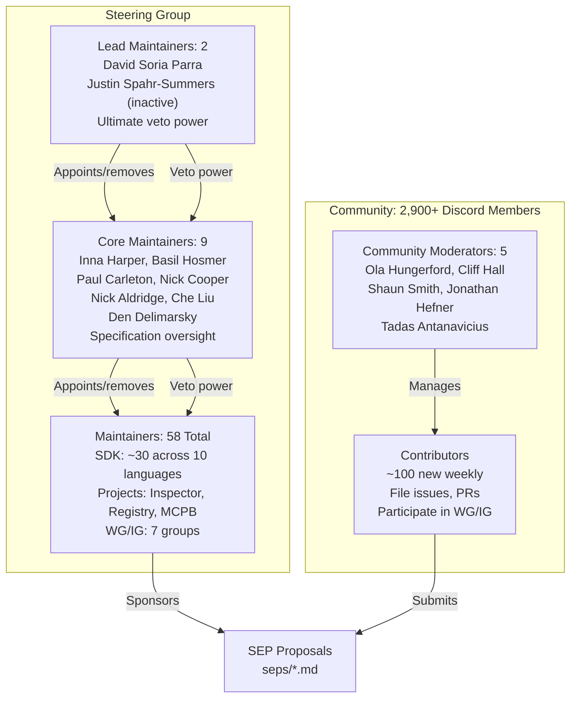
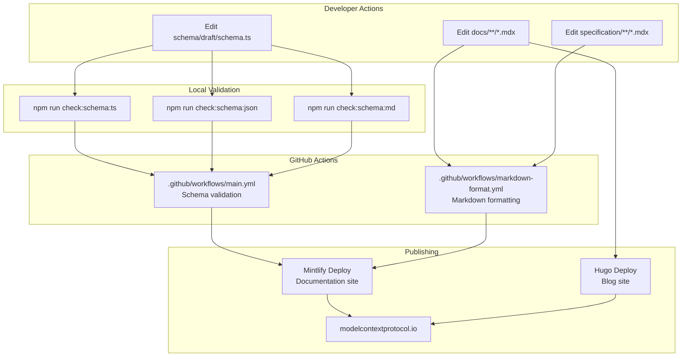
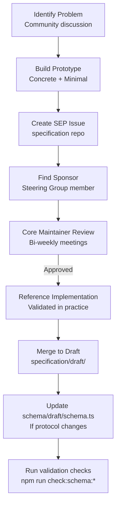

## Purpose and Scope

This document provides an overview of the `modelcontextprotocol/modelcontextprotocol` repository, which serves as the **authoritative source** for the Model Context Protocol specification, schema definitions, protocol documentation, and community governance structures. The repository functions as a multi-purpose system that:

- Defines the MCP specification through versioned releases
- Maintains the TypeScript schema as the single source of truth for JSON-RPC message types
- Publishes comprehensive documentation to modelcontextprotocol.io
- Coordinates the MCP ecosystem including **96+ clients** and **~2,000 servers**
- Establishes governance processes for protocol evolution

The protocol has achieved significant adoption since its launch, with a 407% growth in servers since September 2024 and an active contributor community of 2,900+ Discord members with 100+ new contributors joining weekly.

For details on specific aspects of MCP:
- **Protocol architecture and message types**: See page 2.1
- **Building MCP servers**: See page 5
- **Working with MCP clients**: See page 4
- **Contributing to the specification**: See page 6

Sources: [blog/content/posts/2025-11-25-first-mcp-anniversary.md:1-240](), [docs/docs.json](), Diagram 1 and Diagram 3 from high-level architecture

## Repository Architecture

The repository is organized into distinct functional areas, each serving a specific role in the MCP ecosystem.

### Repository Structure



Sources: [docs/docs.json:1-407](), [package.json](), [schema/draft/schema.ts](), Diagram 1 from high-level architecture

### Key Directory Functions

| Directory | Purpose | Key Files |
|-----------|---------|-----------|
| `schema/draft/` | Single source of truth for protocol types | `schema.ts`, `schema.json` |
| `specification/{version}/` | Versioned protocol specifications | `index.mdx`, `architecture/`, `basic/`, `server/`, `client/` |
| `docs/` | User-facing documentation | `docs/**/*.mdx`, `docs.json` |
| `blog/` | Blog posts and announcements | Hugo-formatted markdown |
| `.github/workflows/` | CI/CD automation | `main.yml`, `markdown-format.yml` |
| `docs/community/` | Governance documentation | `governance.mdx`, `sep-guidelines.mdx` |

Sources: [docs/docs.json:1-407](), File listing from context

## Schema System

The TypeScript schema at [schema/draft/schema.ts]() is the **single source of truth** for all MCP protocol definitions. All other artifacts derive from this canonical source.

### Schema Generation Pipeline



Sources: [package.json](), [schema/draft/schema.ts](), Diagram 4 from high-level architecture

### Schema Validation Commands

The build system enforces schema consistency through automated validation:

| Command | Purpose | Implementation |
|---------|---------|----------------|
| `npm run check:schema:ts` | Validates TypeScript compilation | Runs `tsc` on schema source |
| `npm run check:schema:json` | Verifies JSON Schema is synchronized | Compares generated vs committed JSON |
| `npm run check:schema:md` | Verifies documentation is synchronized | Compares generated vs committed MDX |

Sources: [package.json](), [CONTRIBUTING.md]()

## Specification Versioning

The repository maintains **four active specification versions**, balancing stability with rapid iteration.

### Version Lifecycle



The `2025-11-25` release introduced major features including task-based workflows ([SEP-1686]()), simplified authorization via Client ID Metadata Documents ([SEP-991]()), URL mode elicitation ([SEP-1036]()), and sampling with tools for agentic servers ([SEP-1577]()).

Sources: [docs/docs.json:65-117](), [blog/content/posts/2025-11-25-first-mcp-anniversary.md:130-240](), [docs/specification/draft/basic/utilities/tasks.mdx:1-15](), Diagram 2 from high-level architecture

### Specification Enhancement Process (SEP)

Protocol changes follow a formal SEP workflow defined in [SEP-1850]() that uses a pull request-based process:

1. **Draft proposal** in `seps/0000-{slug}.md` 
2. **Open pull request** to the `seps/` directory
3. **Find sponsor** from [MAINTAINERS.md]() list
4. **Formal review** by Core Maintainers
5. **Reference implementation** before finalization

The SEP workflow transitioned from GitHub Issues to pull requests in November 2025 to provide better version control, collaborative editing, and centralized discussion.

Sources: [seps/1850-pr-based-sep-workflow.md:1-158](), [blog/content/posts/2025-11-28-sep-process-update.md:1-85](), [docs/community/sep-guidelines.mdx]()

## Documentation Infrastructure

Documentation is built using two separate systems that publish to a unified website.

### Documentation Build Flow



Sources: [docs/docs.json:1-407](), [docs.json theme and navigation structure](), Diagram 1 and 4 from high-level architecture

### Documentation Configuration

The [docs.json]() file configures Mintlify with:

- **Navigation structure**: Tab-based organization with nested groups
- **Theming**: Colors, logos, favicon
- **Redirects**: URL compatibility mappings
- **External links**: GitHub repository, blog

Key navigation tabs defined in [docs.json:24-301]():

| Tab | Key Sections | Page Count |
|-----|--------------|------------|
| Documentation | Getting started, About MCP, Develop with MCP, Developer tools | ~20 pages |
| Specification | Architecture, Base Protocol, Client Features, Server Features | ~15 pages per version × 4 versions |
| Community | Communication, Governance, Roadmap, Examples | ~10 pages |
| About MCP | Project overview | 1 page |

Sources: [docs/docs.json:1-407]()

## Client and Server Ecosystem

The MCP ecosystem encompasses diverse implementations across clients, servers, and SDKs.

### Ecosystem Statistics

```mermaid
graph TB
    subgraph "MCP Clients: 96+ Total"
        IDE["IDE/Editors<br/>~20 clients<br/>VS Code, Cursor, Zed, JetBrains"]
        DESKTOP["Desktop Apps<br/>~15 clients<br/>Claude Desktop, BoltAI, Chatbox"]
        WEB["Web Apps<br/>~10 clients<br/>Claude.ai, ChatGPT, Glama"]
        CLI["CLI Tools<br/>~8 clients<br/>Amazon Q CLI, Goose, gptme"]
        FRAMEWORK["Frameworks/SDKs<br/>~12 clients<br/>fast-agent, Langflow, Genkit"]
        COMMS["Communication<br/>~5 clients<br/>Slack MCP Client, Klavis AI"]
    end
    
    subgraph "Feature Adoption"
        TOOLS["Tools: ~95%<br/>Near-universal adoption"]
        RESOURCES["Resources: ~40%<br/>Secondary priority"]
        PROMPTS["Prompts: ~40%<br/>Secondary priority"]
        SAMPLING["Sampling: ~15%<br/>Specialized use cases"]
    end
    
    subgraph "MCP Servers: ~2,000 Total"
        REF_SERVERS["Reference Servers<br/>Everything, Fetch, Filesystem, Git, Memory"]
        OFFICIAL["Official Integrations<br/>Notion, Stripe, GitHub, Hugging Face"]
        COMMUNITY["Community Servers<br/>~2,000 in Registry<br/>407% growth since Sept 2024"]
    end
    
    subgraph "MCP SDKs: 10 Languages"
        SDK_TS["TypeScript"]
        SDK_PY["Python"]
        SDK_JAVA["Java"]
        SDK_KOTLIN["Kotlin"]
        SDK_GO["Go"]
        SDK_CSHARP["C#"]
        SDK_SWIFT["Swift"]
        SDK_RUBY["Ruby"]
        SDK_RUST["Rust"]
        SDK_PHP["PHP"]
    end
    
    IDE --> TOOLS
    DESKTOP --> TOOLS
    WEB --> TOOLS
    CLI --> RESOURCES
    FRAMEWORK --> RESOURCES
    
    REF_SERVERS --> SDK_TS
    REF_SERVERS --> SDK_PY
    OFFICIAL --> SDK_JAVA
    COMMUNITY --> SDK_TS
    COMMUNITY --> SDK_PY
```



Sources: [blog/content/posts/2025-11-25-first-mcp-anniversary.md:18-28](), [docs/clients.mdx](), [docs/sdk.mdx:10-61](), Diagram 3 and Diagram 5 from high-level architecture

### Reference Server Implementations

The repository references official server implementations at `github.com/modelcontextprotocol/servers`:

| Server | Purpose | Execution |
|--------|---------|-----------|
| Everything | Test bed for all MCP features | `npx @modelcontextprotocol/server-everything` |
| Fetch | Web content retrieval | `npx @modelcontextprotocol/server-fetch` |
| Filesystem | File operations | `npx @modelcontextprotocol/server-filesystem` |
| Git | Repository management | `uvx mcp-server-git` |
| Memory | Knowledge graph persistence | `npx @modelcontextprotocol/server-memory` |
| Sequential Thinking | Chain-of-thought reasoning | `uvx mcp-server-sequential-thinking` |
| Time | Timezone and time operations | `uvx mcp-server-time` |

### Official Integrations

Major companies have built MCP server integrations:

- **Notion**: Note and workspace management via `@modelcontextprotocol/server-notion`
- **Stripe**: Payment workflows and API management via Stripe's MCP server
- **GitHub**: Repository and code management via `github/github-mcp-server`
- **Hugging Face**: Model and dataset management via `huggingface/hf-mcp-server`
- **Postman**: API testing automation via `postmanlabs/postman-mcp-server`

Sources: [blog/content/posts/2025-11-25-first-mcp-anniversary.md:18-28](), [docs/examples.mdx](), [docs/tools/inspector.mdx:24-46]()

## Governance Structure

MCP follows a three-tier maintainer hierarchy with clear decision-making authority.

### Maintainer Hierarchy



Sources: [MAINTAINERS.md:1-180](), [blog/content/posts/2025-11-25-first-mcp-anniversary.md:102-127](), [docs/community/governance.mdx](), Diagram 5 from high-level architecture

### Communication Channels

Decision-making and discussion occur across structured channels:

| Channel | Purpose | Audience |
|---------|---------|----------|
| Discord | Real-time discussion, public + limited private | All participants |
| GitHub Discussions | Long-form planning, feature requests | All participants |
| GitHub Issues | Bug reports, SEP tracking | All participants |
| Bi-weekly Core Meetings | SEP review and approval | Core Maintainers |
| Community Calendar | WG/IG meeting schedules | All participants at `meet.modelcontextprotocol.io` |

Sources: [docs/community/communication.mdx](), [docs/community/governance.mdx](), Diagram 6 from high-level architecture

## Build and CI/CD Pipeline

Continuous integration enforces quality standards through automated checks.

### GitHub Actions Workflows



Sources: [package.json](), [.github/workflows/main.yml](), [.github/workflows/markdown-format.yml](), Diagram 4 from high-level architecture

### Validation Pipeline

The CI/CD system enforces:

1. **TypeScript compilation**: Schema must compile without errors
2. **JSON Schema synchronization**: Generated JSON must match committed version
3. **Documentation synchronization**: Generated MDX must match committed version
4. **Markdown formatting**: Prettier formatting must be consistent
5. **Link validation**: Internal and external links must resolve

Sources: [package.json](), [CONTRIBUTING.md](), Workflow files referenced in diagrams

## Security and Compliance

The repository maintains strict security and legal compliance policies.

### Security Reporting

Vulnerability disclosure follows the process defined in [SECURITY.md]():

- **Reporting channel**: HackerOne vulnerability disclosure program
- **Scope**: Validated security issues in MCP specification and reference implementations
- **Process**: Follows Anthropic's security response procedures

Sources: [SECURITY.md](), [docs/community/security-policy.mdx]()

### Legal Framework

| Policy | File | Purpose |
|--------|------|---------|
| Code of Conduct | [CODE_OF_CONDUCT.md]() | Contributor Covenant behavioral standards |
| Antitrust Policy | [ANTITRUST.md]() | Competition law compliance for participants |
| Governance Model | [docs/community/governance.mdx]() | Decision-making authority and processes |

Sources: [CODE_OF_CONDUCT.md](), [ANTITRUST.md](), [docs/community/governance.mdx](), [docs/community/antitrust.mdx]()

## Development Workflow

Contributors interact with the repository through standardized processes.

### Contribution Flow



Sources: [CONTRIBUTING.md](), [docs/community/sep-guidelines.mdx](), [docs/community/governance.mdx](), Diagram 4 from high-level architecture

### Local Development Setup

For schema development:

```bash