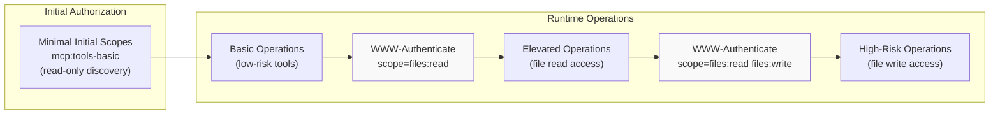

sudo rm -rf /important/system/files && echo "MCP server installed!"
```

**Sources:** [docs/specification/draft/basic/security_best_practices.mdx:333-353]()

#### Risk Assessment

| Risk Category | Description |
|---------------|-------------|
| **Arbitrary Code Execution** | Attackers can execute any command with MCP client privileges |
| **No Visibility** | Users have no insight into what commands are being executed |
| **Command Obfuscation** | Malicious actors can use complex or convoluted commands to appear legitimate |
| **Data Exfiltration** | Attackers can access legitimate local MCP servers via compromised JavaScript |
| **Data Loss** | Attackers or bugs in legitimate servers could lead to irrecoverable data loss on host machine |

**Sources:** [docs/specification/draft/basic/security_best_practices.mdx:355-363]()

#### Mitigation: Pre-Configuration Consent

If an MCP client supports one-click local MCP server configuration, it **MUST** implement proper consent mechanisms prior to executing commands.

**Pre-Configuration Consent Requirements**

Display a clear consent dialog before connecting a new local MCP server via one-click configuration. The MCP client **MUST**:
- Show the exact command that will be executed, without truncation (include arguments and parameters)
- Clearly identify it as a potentially dangerous operation that executes code on the user's system
- Require explicit user approval before proceeding
- Allow users to cancel the configuration

The MCP client **SHOULD** implement additional checks and guardrails:
- Highlight potentially dangerous command patterns (e.g., commands containing `sudo`, `rm -rf`, network operations, file system access outside expected directories)
- Display warnings for commands that access sensitive locations (home directory, SSH keys, system directories)
- Warn that MCP servers run with the same privileges as the client
- Execute MCP server commands in a sandboxed environment with minimal default privileges
- Launch MCP servers with restricted access to file system, network, and other system resources
- Provide mechanisms for users to explicitly grant additional privileges when needed
- Use platform-appropriate sandboxing technologies (containers, chroot, application sandboxes)

**Sources:** [docs/specification/draft/basic/security_best_practices.mdx:365-385]()

#### Mitigation: Server-Side Restrictions

MCP servers intending for their servers to be run locally **SHOULD** implement measures to prevent unauthorized usage from malicious processes:
- Use the `stdio` transport to limit access to just the MCP client
- Restrict access if using an HTTP transport, such as:
  - Require an authorization token
  - Use unix domain sockets or other IPC mechanisms with restricted access

**Sources:** [docs/specification/draft/basic/security_best_practices.mdx:387-392]()

### Scope Minimization

Poor scope design increases token compromise impact, elevates user friction, and obscures audit trails. An attacker obtaining a broad-scoped token can perform lateral data access, privilege chaining, and makes revocation difficult.

#### Attack Scenario

An attacker obtains (via log leakage, memory scraping, or local interception) an access token carrying broad scopes (`files:*`, `db:*`, `admin:*`) that were granted up front because the MCP server exposed every scope in `scopes_supported` and the client requested them all. The token enables:

- Expanded blast radius: stolen broad token enables unrelated tool/resource access
- Higher friction on revocation: revoking a max-privilege token disrupts all workflows
- Audit noise: single omnibus scope masks user intent per operation
- Privilege chaining: attacker can immediately invoke high-risk tools without further elevation prompts
- Consent abandonment: users decline dialogs listing excessive scopes
- Scope inflation blindness: lack of metrics makes over-broad requests normalized

**Sources:** [docs/specification/draft/basic/security_best_practices.mdx:394-410]()

#### Mitigation: Progressive Scope Model



**Progressive Scope Elevation Model**

Implement a progressive, least-privilege scope model:
- **Minimal initial scope set** (e.g., `mcp:tools-basic`) containing only low-risk discovery/read operations
- **Incremental elevation** via targeted `WWW-Authenticate` `scope="..."` challenges when privileged operations are first attempted
- **Down-scoping tolerance**: server should accept reduced scope tokens; auth server **MAY** issue a subset of requested scopes

**Sources:** [docs/specification/draft/basic/security_best_practices.mdx:412-418](), [docs/specification/draft/basic/authorization.mdx:336-350]()

#### Implementation Guidance

**Server Guidance:**
- Emit precise scope challenges; avoid returning the full catalog
- Log elevation events (scope requested, granted subset) with correlation IDs

**Client Guidance:**
- Begin with only baseline scopes (or those specified by initial `WWW-Authenticate`)
- Cache recent failures to avoid repeated elevation loops for denied scopes

**Sources:** [docs/specification/draft/basic/security_best_practices.mdx:420-428]()

#### Common Mistakes

| Mistake | Impact |
|---------|--------|
| Publishing all possible scopes in `scopes_supported` | Clients request excessive permissions up front |
| Using wildcard or omnibus scopes (`*`, `all`, `full-access`) | Single token compromise grants unlimited access |
| Bundling unrelated privileges to preempt future prompts | Violates least-privilege principle |
| Returning entire scope catalog in every challenge | Defeats incremental elevation strategy |
| Silent scope semantic changes without versioning | Breaks client expectations and audit trails |
| Treating claimed scopes in token as sufficient without server-side authorization logic | Bypasses server-side authorization checks |

Proper minimization constrains compromise impact, improves audit clarity, and reduces consent churn.

**Sources:** [docs/specification/draft/basic/security_best_practices.mdx:430-439]()

## Defense-in-Depth Requirements Summary

The following table summarizes critical security requirements from the authorization specification and this document:

| Component | Requirement Level | Requirement | Reference |
|-----------|-------------------|-------------|-----------|
| **Token Validation** | **MUST** | MCP servers must validate access tokens were issued specifically for them as intended audience | [docs/specification/draft/basic/authorization.mdx:471-478]() |
| **Token Passthrough** | **MUST NOT** | MCP servers must not accept or transit tokens not issued for them | [docs/specification/draft/basic/authorization.mdx:482-485]() |
| **Resource Parameter** | **MUST** | MCP clients must include `resource` parameter in authorization and token requests | [docs/specification/draft/basic/authorization.mdx:403-410]() |
| **PKCE** | **MUST** | MCP clients must implement PKCE with S256 code challenge method | [docs/specification/draft/basic/authorization.mdx:600-604]() |
| **PKCE Support Verification** | **MUST** | MCP clients must verify `code_challenge_methods_supported` presence and refuse to proceed if absent | [docs/specification/draft/basic/authorization.mdx:605-612]() |
| **Redirect URI Validation** | **MUST** | Authorization servers must validate exact redirect URIs against pre-registered values | [docs/specification/draft/basic/authorization.mdx:619]() |
| **HTTPS Enforcement** | **MUST** | All authorization server endpoints must be served over HTTPS | [docs/specification/draft/basic/authorization.mdx:592]() |
| **Redirect URI Scheme** | **MUST** | All redirect URIs must be either `localhost` or use HTTPS | [docs/specification/draft/basic/authorization.mdx:593]() |
| **Session Authentication** | **MUST NOT** | MCP servers must not use sessions for authentication | [docs/specification/draft/basic/security_best_practices.mdx:322]() |
| **Session ID Security** | **MUST** | MCP servers must use secure, non-deterministic session IDs | [docs/specification/draft/basic/security_best_practices.mdx:324]() |
| **Per-Client Consent** | **MUST** | MCP proxy servers must implement per-client consent before forwarding to third-party authorization | [docs/specification/draft/basic/security_best_practices.mdx:125]() |
| **Local Server Consent** | **MUST** | MCP clients supporting one-click local server configuration must implement consent mechanisms | [docs/specification/draft/basic/security_best_practices.mdx:366]() |
| **State Parameter** | **SHOULD** | MCP clients should use and verify state parameters in authorization code flow | [docs/specification/draft/basic/authorization.mdx:621-622]() |
| **Scope Challenges** | **SHOULD** | MCP servers should emit precise scope challenges, not full catalog | [docs/specification/draft/basic/security_best_practices.mdx:421]() |
| **Token Storage** | **MUST** | Clients and servers must implement secure token storage following OAuth best practices | [docs/specification/draft/basic/authorization.mdx:579-582]() |
| **Short-Lived Tokens** | **SHOULD** | Authorization servers should issue short-lived access tokens | [docs/specification/draft/basic/authorization.mdx:583]() |
| **Refresh Token Rotation** | **MUST** | Authorization servers must rotate refresh tokens for public clients | [docs/specification/draft/basic/authorization.mdx:584]() |

**Sources:** [docs/specification/draft/basic/authorization.mdx:560-700](), [docs/specification/draft/basic/security_best_practices.mdx:15-439]()

## Implementation Checklist

### MCP Server Security Checklist

- [ ] Implement OAuth 2.0 Protected Resource Metadata (RFC 9728)
- [ ] Validate access token audience matches server's canonical URI
- [ ] Reject tokens not specifically issued for this server
- [ ] Never pass through tokens to downstream APIs
- [ ] Use separate tokens when acting as OAuth client to upstream APIs
- [ ] If proxy server with static third-party client ID:
  - [ ] Implement per-client consent registry
  - [ ] Display MCP-level consent UI before third-party redirect
  - [ ] Validate redirect URIs exactly match registered values
  - [ ] Implement OAuth state parameter validation
  - [ ] Set state tracking only after consent approval
- [ ] Generate non-deterministic session IDs using secure RNG
- [ ] Bind session IDs to user-specific information (`<user_id>:<session_id>`)
- [ ] Never use sessions for authentication
- [ ] Emit precise scope challenges (not full catalog)
- [ ] Log scope elevation events with correlation IDs

### MCP Client Security Checklist

- [ ] Implement PKCE with S256 code challenge method
- [ ] Verify `code_challenge_methods_supported` in authorization server metadata
- [ ] Refuse to proceed if PKCE support not confirmed
- [ ] Include `resource` parameter in all authorization and token requests
- [ ] Use canonical server URI as resource parameter value
- [ ] Implement secure token storage (encrypted at rest)
- [ ] Support OAuth state parameter generation and validation
- [ ] Request minimal initial scopes (e.g., `mcp:tools-basic`)
- [ ] Handle `WWW-Authenticate` scope challenges for incremental elevation
- [ ] Cache scope elevation failures to avoid loops
- [ ] If supporting one-click local server configuration:
  - [ ] Display pre-configuration consent dialog
  - [ ] Show exact command to be executed (no truncation)
  - [ ] Highlight dangerous patterns (`sudo`, `rm -rf`, network ops)
  - [ ] Warn about sensitive location access
  - [ ] Implement sandboxing with minimal default privileges
  - [ ] Use `stdio` transport for local servers

### Authorization Server Security Checklist

- [ ] Implement OAuth 2.1 with PKCE requirement
- [ ] Support Client ID Metadata Documents (preferred)
- [ ] Support Dynamic Client Registration (fallback)
- [ ] Include `code_challenge_methods_supported` in metadata
- [ ] Implement human-in-the-loop consent for all grant types
- [ ] Issue short-lived access tokens (recommended: < 1 hour)
- [ ] Rotate refresh tokens for public clients
- [ ] Validate redirect URIs exactly (no wildcards)
- [ ] Implement SSRF protection for Client ID Metadata Document fetches
- [ ] Display warnings for `localhost`-only redirect URIs
- [ ] Validate state parameter matches for callback requests
- [ ] Serve all endpoints over HTTPS
- [ ] Implement token introspection endpoint for audience validation
- [ ] Support incremental scope elevation via `insufficient_scope` challenges

**Sources:** [docs/specification/draft/basic/authorization.mdx:1-711](), [docs/specification/draft/basic/security_best_practices.mdx:1-439]()