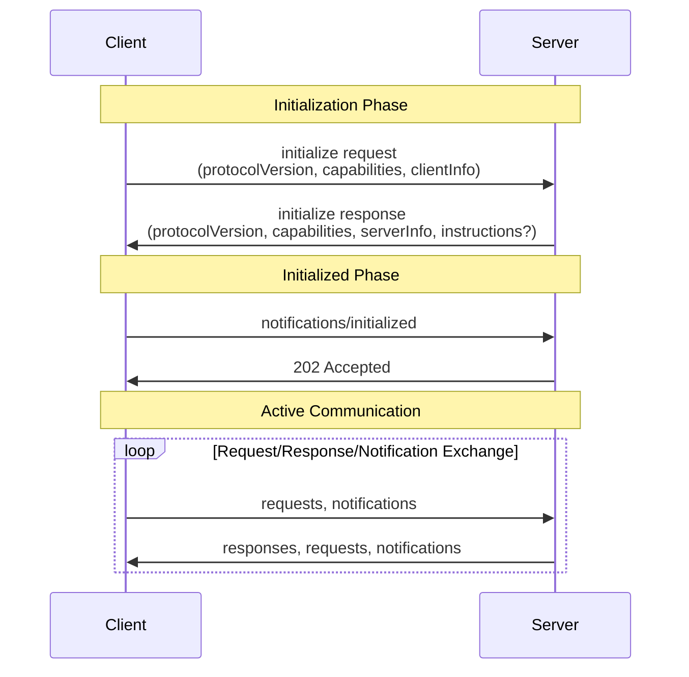
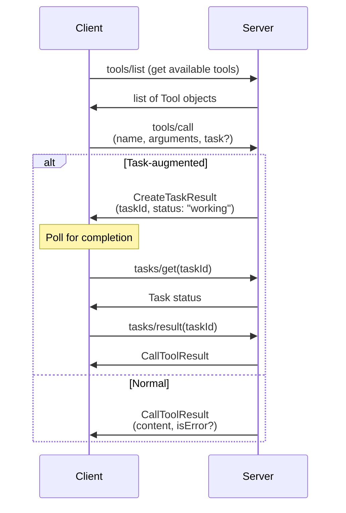
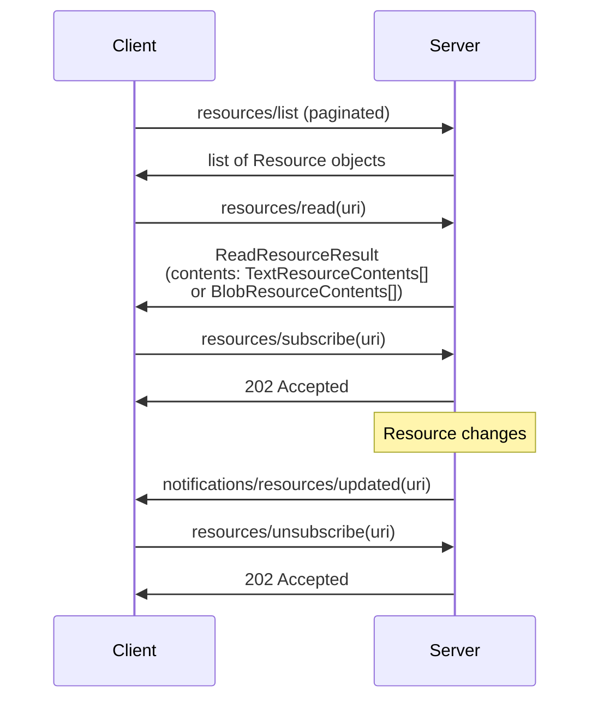
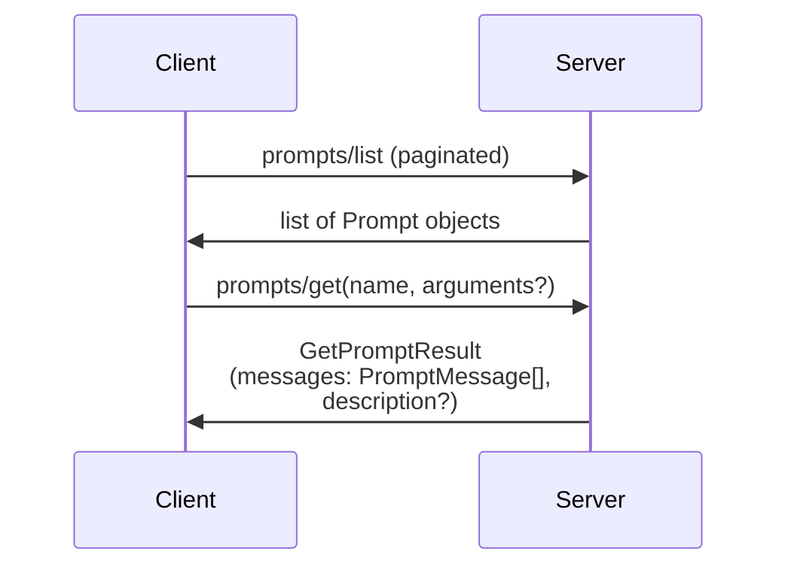
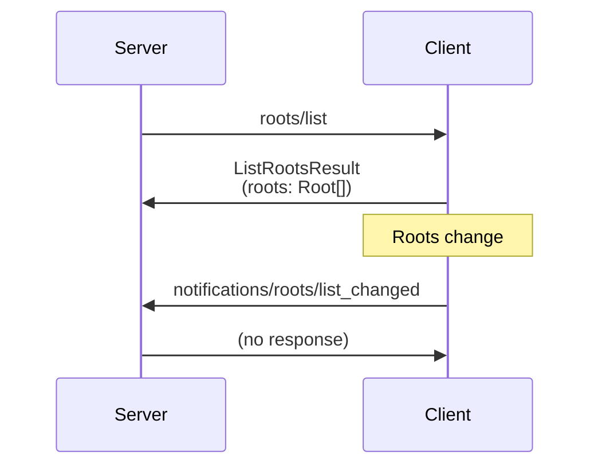
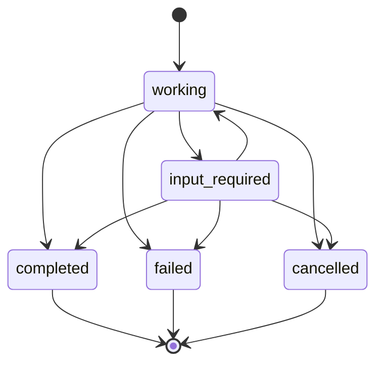
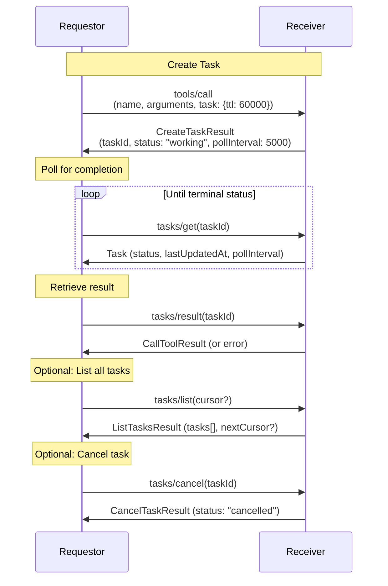
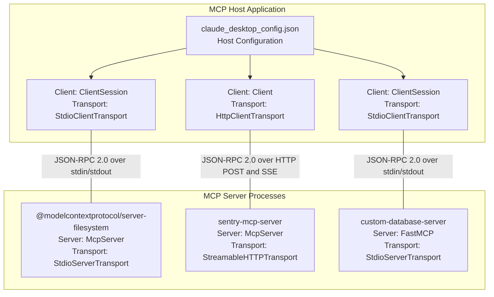
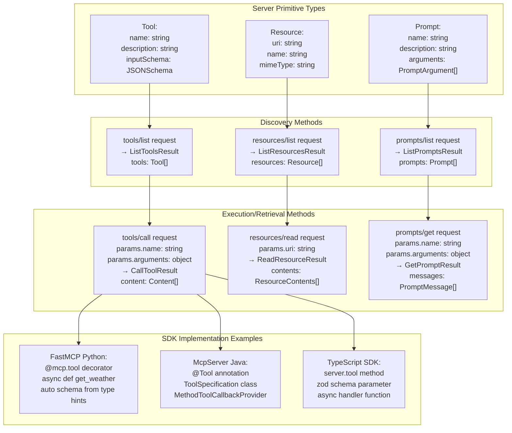
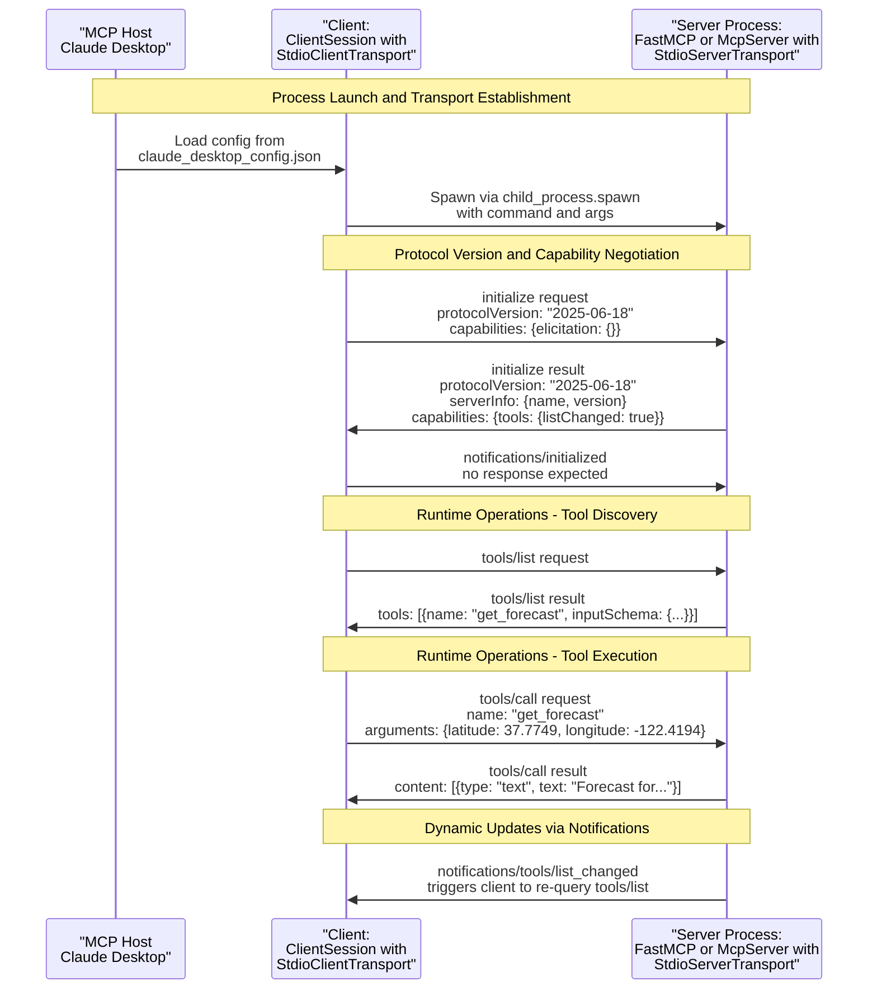

## Purpose and Scope

This page documents the Model Context Protocol (MCP) specification—the authoritative definition of how clients and servers communicate. It covers the core messaging system, transport mechanisms, connection lifecycle, and protocol features that enable bidirectional interaction between MCP clients and servers.

This page focuses on the **protocol layer itself**: message types, encoding, transport, and capability negotiation. For information about implementing servers, see [Server Development](#5). For information about client implementations, see [Client Ecosystem](#4). For authorization and security mechanisms, see [Authorization and Security](#3).

## Overview: Protocol Architecture

MCP is built on three foundational layers:

1. **JSON-RPC 2.0 Message System**: All communication uses JSON-RPC 2.0 for encoding requests, responses, and notifications
2. **Transport Layer**: Messages are transmitted via stdio (subprocess) or Streamable HTTP (remote)
3. **Connection Lifecycle**: Clients and servers negotiate capabilities during initialization and maintain sessions

The protocol is **bidirectional**—both clients and servers can initiate requests and send notifications. This enables servers to request LLM sampling from clients, ask for user input via elicitation, and access filesystem roots.

Sources: [schema/draft/schema.ts:1-16](), [docs/specification/draft/basic/transports.mdx:1-20]()

## JSON-RPC Message System

### Message Types

MCP defines three JSON-RPC message types, all encoded as UTF-8 JSON:

| Message Type | Direction | Expects Response | Structure |
|---|---|---|---|
| **Request** | Either direction | Yes | `{jsonrpc: "2.0", id, method, params?}` |
| **Response** | Either direction | No | `{jsonrpc: "2.0", id, result or error}` |
| **Notification** | Either direction | No | `{jsonrpc: "2.0", method, params?}` |

Key constraints:
- Request IDs **MUST** be string or number (never `null`)
- IDs **MUST NOT** be reused within the same session
- Responses **MUST** include either `result` or `error`, never both
- Notifications **MUST NOT** include an ID

Sources: [schema/draft/schema.ts:8-199](), [docs/specification/draft/basic/index.mdx:27-95]()

### Error Handling

MCP defines standard JSON-RPC error codes plus implementation-specific codes:

| Error Code | Name | Usage |
|---|---|---|
| `-32700` | `PARSE_ERROR` | Invalid JSON received |
| `-32600` | `INVALID_REQUEST` | Request structure invalid |
| `-32601` | `METHOD_NOT_FOUND` | Method not supported or capability not declared |
| `-32602` | `INVALID_PARAMS` | Parameters invalid (unknown tool, invalid cursor, etc.) |
| `-32603` | `INTERNAL_ERROR` | Unexpected server error |
| `-32042` | `URL_ELICITATION_REQUIRED` | URL mode elicitation needed (implementation-specific) |

Sources: [schema/draft/schema.ts:201-297]()

### Metadata System (`_meta`)

All requests, responses, and notifications **MAY** include a `_meta` field for attaching metadata. Key names follow a reserved prefix system:

- **Prefix format**: `label.label.label/` (labels separated by dots, followed by slash)
- **Reserved prefixes**: Any prefix containing `modelcontextprotocol` or `mcp` is reserved for MCP use
- **Name format**: Alphanumeric start/end, may contain hyphens, underscores, dots

Example reserved keys:
- `modelcontextprotocol.io/key`
- `mcp.dev/key`
- `io.modelcontextprotocol/related-task`

Request metadata can include `progressToken` to request out-of-band progress notifications.

Sources: [schema/draft/schema.ts:18-51](), [docs/specification/draft/basic/index.mdx:123-150]()

## Transport Layer

### stdio Transport

In stdio transport, the client launches the MCP server as a subprocess:

```
Client Process
    ↓ (launches)
Server Process
    ↑ stdin (client writes JSON-RPC messages)
    ↓ stdout (server writes JSON-RPC messages)
    ↓ stderr (optional logging, ignored by protocol)
```

**Message framing**: Messages are delimited by newlines. Each message is a complete JSON-RPC object on a single line (no embedded newlines).

**Constraints**:
- Server **MUST NOT** write non-MCP data to stdout
- Client **MUST NOT** write non-MCP data to stdin
- Server **MAY** write logging to stderr (client may ignore)

Sources: [docs/specification/draft/basic/transports.mdx:22-52]()

### Streamable HTTP Transport

In Streamable HTTP, the server is an independent process handling multiple client connections via HTTP:

```
Client                          Server
  │                               │
  ├─ POST /mcp (request)         │
  │  Accept: application/json,   │
  │           text/event-stream  │
  │                               │
  ├─────────────────────────────→ │
  │                               │
  │ ← Content-Type: text/event-stream (SSE stream)
  │   or Content-Type: application/json (single response)
  │
  ├─ GET /mcp (listen)           │
  │  Accept: text/event-stream   │
  │                               │
  ├─────────────────────────────→ │
  │                               │
  │ ← Content-Type: text/event-stream (server notifications)
```

**Key features**:

- **POST requests**: Client sends JSON-RPC request, server responds with either:
  - `Content-Type: text/event-stream` (SSE stream with multiple messages)
  - `Content-Type: application/json` (single JSON response)
- **GET requests**: Client opens SSE stream to receive server-initiated notifications
- **Session management**: Server **MAY** assign `MCP-Session-Id` header for stateful sessions
- **Resumability**: SSE events **MAY** include IDs for resuming after disconnection using `Last-Event-ID` header

**Security requirements**:
- Servers **MUST** validate `Origin` header to prevent DNS rebinding attacks
- Servers **SHOULD** bind to localhost (127.0.0.1) when running locally
- Servers **SHOULD** implement proper authentication

Sources: [docs/specification/draft/basic/transports.mdx:54-227]()

## Connection Lifecycle and Capabilities

### Initialization Handshake

The connection lifecycle follows this sequence:



**Initialize Request** [schema/draft/schema.ts:387-407]():
- `protocolVersion`: Latest protocol version client supports (e.g., `"DRAFT-2026-v1"`)
- `capabilities`: Client capabilities object
- `clientInfo`: Implementation metadata (name, version, description, icons)

**Initialize Response** [schema/draft/schema.ts:417-448]():
- `protocolVersion`: Server's chosen protocol version (client must support or disconnect)
- `capabilities`: Server capabilities object
- `serverInfo`: Implementation metadata
- `instructions?`: Optional workflow instructions for the model

**Initialized Notification** [schema/draft/schema.ts:458-461]():
- Sent by client after receiving initialize response
- Signals that client is ready for normal communication

Sources: [schema/draft/schema.ts:378-461](), [docs/specification/draft/basic/lifecycle.mdx]()

### Capability Negotiation

Capabilities are declared during initialization and determine which protocol features are supported:

**Client Capabilities** [schema/draft/schema.ts:468-567]():

| Capability | Purpose |
|---|---|
| `roots` | Client can list filesystem roots |
| `roots.listChanged` | Client supports root list change notifications |
| `sampling` | Client can invoke LLM sampling |
| `sampling.tools` | Client supports tool use in sampling |
| `sampling.context` | Client supports context inclusion (soft-deprecated) |
| `elicitation` | Client supports user input requests |
| `elicitation.form` | Client supports form mode elicitation |
| `elicitation.url` | Client supports URL mode elicitation |
| `tasks` | Client supports task-augmented requests |
| `tasks.list` | Client supports `tasks/list` operation |
| `tasks.cancel` | Client supports `tasks/cancel` operation |
| `tasks.requests.sampling.createMessage` | Client supports task-augmented sampling |
| `tasks.requests.elicitation.create` | Client supports task-augmented elicitation |
| `extensions` | Client supports optional extensions |

**Server Capabilities** [schema/draft/schema.ts:574-684]():

| Capability | Purpose |
|---|---|
| `logging` | Server can send log messages to client |
| `completions` | Server supports argument autocompletion |
| `prompts` | Server offers prompt templates |
| `prompts.listChanged` | Server supports prompt list change notifications |
| `resources` | Server offers resources to read |
| `resources.subscribe` | Server supports resource subscription |
| `resources.listChanged` | Server supports resource list change notifications |
| `tools` | Server offers tools to call |
| `tools.listChanged` | Server supports tool list change notifications |
| `tasks` | Server supports task-augmented requests |
| `tasks.list` | Server supports `tasks/list` operation |
| `tasks.cancel` | Server supports `tasks/cancel` operation |
| `tasks.requests.tools.call` | Server supports task-augmented tool calls |
| `extensions` | Server supports optional extensions |

**Capability Enforcement**: Requestors **SHOULD** only use features if the receiver declared support. Receivers **MUST** return `-32601 (METHOD_NOT_FOUND)` if a capability-dependent request is received without declaration.

Sources: [schema/draft/schema.ts:468-684]()

## Server Features

### Tools

Tools are functions that servers expose for clients to call. Clients invoke tools via `tools/call` requests.

**Tool Definition** [schema/draft/schema.ts]:
- `name`: Unique identifier
- `description`: Human-readable description
- `inputSchema`: JSON Schema defining tool arguments
- `annotations?`: Optional metadata (audience, priority)
- `execution.taskSupport?`: Whether tool supports task augmentation (`"required"`, `"optional"`, `"forbidden"`)

**Tool Call Flow**:



**Tool Result** [schema/draft/schema.ts]:
- `content`: Array of content blocks (text, image, audio, resource links)
- `isError?`: Whether tool execution failed (default: false)
- `structuredContent?`: Optional structured result object

Sources: [schema/draft/schema.ts]() (tool-related types)

### Resources

Resources are URI-based data that servers expose for clients to read. Clients can subscribe to resource updates.

**Resource Definition**:
- `uri`: Unique URI identifier
- `name`: Display name
- `description?`: Human-readable description
- `mimeType?`: MIME type of resource content
- `annotations?`: Optional metadata

**Resource Access Flow**:



**Resource Content Types**:
- `TextResourceContents`: `{uri, text, mimeType?}`
- `BlobResourceContents`: `{uri, blob (base64), mimeType?}`

Sources: [schema/draft/schema.ts]() (resource-related types)

### Prompts

Prompts are reusable templates that servers expose. Clients can retrieve prompt instances with arguments.

**Prompt Definition**:
- `name`: Unique identifier
- `description?`: Human-readable description
- `arguments?`: Array of prompt arguments with JSON Schema definitions

**Prompt Retrieval Flow**:



**Prompt Message**:
- `role`: `"user"` or `"assistant"`
- `content`: Content block (text, image, audio, resource link, embedded resource)

Sources: [schema/draft/schema.ts]() (prompt-related types)

### Logging

Servers can send log messages to clients via `notifications/logging` notifications.

**Log Levels** (syslog severity):
- `"debug"`, `"info"`, `"notice"`, `"warning"`, `"error"`, `"critical"`, `"alert"`, `"emergency"`

**Log Notification**:
```json
{
  "jsonrpc": "2.0",
  "method": "notifications/logging",
  "params": {
    "level": "info",
    "logger": "server-name",
    "data": "Log message text"
  }
}
```

Clients can set the logging level via `logging/setLevel` request.

Sources: [schema/draft/schema.ts]() (logging-related types)

### Completions

Servers can provide argument autocompletion suggestions via `completion/complete` requests.

**Completion Request**:
- `ref`: Reference to a prompt or resource template
- `argument`: Argument name and partial value
- `context?`: Additional context (previously-resolved variables)

**Completion Result**:
- `completion.values`: Array of completion strings (max 100)
- `completion.total?`: Total number of completions available
- `completion.hasMore?`: Whether more completions exist

Sources: [schema/draft/schema.ts]() (completion-related types)

## Client Features

### Sampling (LLM Access)

Servers can request LLM sampling from clients via `sampling/createMessage` requests. This allows servers to leverage AI capabilities without API keys.

**Sampling Request** [docs/specification/draft/client/sampling.mdx]:

```json
{
  "jsonrpc": "2.0",
  "id": 1,
  "method": "sampling/createMessage",
  "params": {
    "messages": [
      {
        "role": "user",
        "content": {
          "type": "text",
          "text": "What is the capital of France?"
        }
      }
    ],
    "modelPreferences": {
      "hints": [{"name": "claude-3-sonnet"}],
      "costPriority": 0.3,
      "intelligencePriority": 0.8,
      "speedPriority": 0.5
    },
    "temperature": 0.1,
    "systemPrompt": "You are a helpful assistant.",
    "maxTokens": 100
  }
}
```

**Sampling Response**:

```json
{
  "jsonrpc": "2.0",
  "id": 1,
  "result": {
    "role": "assistant",
    "content": {
      "type": "text",
      "text": "The capital of France is Paris."
    },
    "model": "claude-3-sonnet-20240307",
    "stopReason": "endTurn"
  }
}
```

**Tool Use in Sampling**: Servers can include `tools` array and `toolChoice` to enable LLM tool use:

```json
{
  "tools": [
    {
      "name": "get_weather",
      "description": "Get current weather for a city",
      "inputSchema": {
        "type": "object",
        "properties": {
          "city": {"type": "string"}
        },
        "required": ["city"]
      }
    }
  ],
  "toolChoice": {"mode": "auto"}
}
```

LLM can respond with `ToolUseContent` blocks, which server executes and returns via `ToolResultContent` in next message.

Sources: [docs/specification/draft/client/sampling.mdx](), [schema/draft/schema.ts]() (sampling-related types)

### Elicitation (User Input)

Servers can request user input from clients via `elicitation/create` requests. Two modes supported:

**Form Mode**: In-band structured data collection with JSON Schema validation

```json
{
  "jsonrpc": "2.0",
  "id": 1,
  "method": "elicitation/create",
  "params": {
    "mode": "form",
    "message": "Please provide your GitHub username",
    "requestedSchema": {
      "type": "object",
      "properties": {
        "username": {"type": "string"}
      },
      "required": ["username"]
    }
  }
}
```

**URL Mode**: Out-of-band interaction via URL navigation (for sensitive data)

```json
{
  "jsonrpc": "2.0",
  "id": 2,
  "method": "elicitation/create",
  "params": {
    "mode": "url",
    "elicitationId": "550e8400-e29b-41d4-a716-446655440000",
    "url": "https://example.com/auth",
    "message": "Please authorize access to your account"
  }
}
```

**Elicitation Response Actions**:
- `action: "accept"`: User approved (form mode includes `content` with data)
- `action: "decline"`: User explicitly declined
- `action: "cancel"`: User dismissed without explicit choice

**URL Elicitation Completion**: Server **MAY** send `notifications/elicitation/complete` when out-of-band interaction finishes.

Sources: [docs/specification/draft/client/elicitation.mdx](), [schema/draft/schema.ts]() (elicitation-related types)

### Roots (Filesystem Boundaries)

Clients can expose filesystem roots (directories) that servers can access. Servers request roots via `roots/list` request.

**Root Definition**:
- `uri`: Directory URI (e.g., `file:///home/user/project`)
- `name`: Display name

**Roots List Flow**:



Sources: [schema/draft/schema.ts]() (roots-related types)

## Task System and Async Operations

Tasks enable long-running, durable operations with polling and deferred result retrieval. Introduced in protocol version 2025-11-25 (experimental).

### Task Lifecycle



**Task States**:
- `working`: Task is executing
- `input_required`: Task needs additional input from requestor
- `completed`: Task finished successfully
- `failed`: Task encountered error
- `cancelled`: Task was cancelled

### Task-Augmented Request Flow



**Task Metadata**: All task-related messages include `io.modelcontextprotocol/related-task` in `_meta` field with `taskId`.

**Task Notifications**: Receiver **MAY** send `notifications/tasks/status` when task status changes.

**TTL and Resource Management**:
- Requestor **MAY** specify `ttl` (time-to-live in milliseconds)
- Receiver **MAY** override requested TTL
- After TTL expires, receiver **MAY** delete task and results

Sources: [docs/specification/draft/basic/utilities/tasks.mdx](), [schema/draft/schema.ts]() (task-related types)

## Extensions Framework

Extensions allow optional protocol features beyond core MCP. Declared in capabilities during initialization.

**Extension Declaration**:

```json
{
  "capabilities": {
    "extensions": {
      "io.modelcontextprotocol/apps": {},
      "io.modelcontextprotocol/oauth-client-credentials": {}
    }
  }
}
```

**Official Extensions**:
- `io.modelcontextprotocol/apps`: MCP Apps (interactive UIs)
- `io.modelcontextprotocol/oauth-client-credentials`: OAuth 2.1 client credentials flow

**Extension Naming**: Extensions use reverse-domain naming (e.g., `io.modelcontextprotocol/feature-name`).

Sources: [schema/draft/schema.ts:559-566, 675-683]()

## Protocol Versioning

MCP uses date-based versioning: `YYYY-MM-DD` format.

**Current Versions**:
- `2024-11-05`: Initial release (JSON Schema draft-07)
- `2025-03-26`: Updates (JSON Schema draft-07)
- `2025-06-18`: Updates (JSON Schema draft-07)
- `2025-11-25`: Tasks introduced (JSON Schema 2020-12)
- `draft`: Development version (JSON Schema 2020-12)

**Version Negotiation**:
- Client sends `protocolVersion` in initialize request
- Server responds with chosen `protocolVersion`
- Client **MUST** disconnect if it cannot support server's version

**Backward Compatibility**: Older clients can connect to servers supporting newer versions if server chooses an older protocol version.

Sources: [schema/draft/schema.ts:14](), [docs/specification/draft/changelog.mdx]()

## Utilities

### Progress Notifications

Requestors can request out-of-band progress updates via `progressToken` in `_meta`:

```json
{
  "jsonrpc": "2.0",
  "id": 1,
  "method": "tools/call",
  "params": {
    "name": "long_operation",
    "arguments": {},
    "_meta": {
      "progressToken": "progress-123"
    }
  }
}
```

Receiver sends progress updates via `notifications/progress`:

```json
{
  "jsonrpc": "2.0",
  "method": "notifications/progress",
  "params": {
    "progressToken": "progress-123",
    "progress": 50,
    "total": 100,
    "message": "Processing item 50 of 100"
  }
}
```

Sources: [schema/draft/schema.ts:836-870]()

### Cancellation

Either party can cancel in-progress requests via `notifications/cancelled`:

```json
{
  "jsonrpc": "2.0",
  "method": "notifications/cancelled",
  "params": {
    "requestId": "123",
    "reason": "User requested cancellation"
  }
}
```

**Constraints**:
- Cannot cancel `initialize` request
- For task-augmented requests, use `tasks/cancel` instead
- Receiver **SHOULD** stop processing and free resources
- Receiver **MAY** ignore if request already completed

Sources: [docs/specification/draft/basic/utilities/cancellation.mdx](), [schema/draft/schema.ts:341-376]()

### Ping

Either party can send `ping` request to verify connection health:

```json
{
  "jsonrpc": "2.0",
  "id": "123",
  "method": "ping"
}
```

Receiver **MUST** respond promptly with empty result:

```json
{
  "jsonrpc": "2.0",
  "id": "123",
  "result": {}
}
```

Sources: [docs/specification/draft/basic/utilities/ping.mdx](), [schema/draft/schema.ts:809-824]()

## Schema Definition and Generation

The protocol specification is defined in TypeScript source files and automatically generated into JSON Schema and documentation.

**Schema Source** [schema/draft/schema.ts:1-152.84]():
- TypeScript interfaces define all message types
- JSDoc comments provide descriptions
- `@category` tags organize types
- Examples embedded via `@includeCode` directives

**Generated Artifacts**:
- `schema/draft/schema.json`: JSON Schema 2020-12 (machine-readable)
- `docs/specification/draft/schema.mdx`: Generated documentation (human-readable)

**Build Process**:
- `typescript-json-schema` generates JSON Schema from TypeScript
- Custom transformations update `$schema` URL and rename `definitions` to `$defs`
- TypeDoc plugin generates Mintlify-compatible MDX documentation
- Examples validated against generated schemas

Sources: [schema/draft/schema.ts](), [schema/draft/schema.json](), [docs/specification/draft/schema.mdx]()

# Architecture


This document provides a comprehensive technical overview of the Model Context Protocol (MCP) architecture, covering the client-server model, protocol layers, schema-driven design, and transport mechanisms that enable AI applications to integrate with external data sources and tools.

For implementation-specific guidance, see [Server Development](#4). For client ecosystem details, see [Client Ecosystem](#3). For transport protocol specifics, see [Transport Layer](#2.4).

## Overview

MCP implements a schema-driven client-server architecture where AI applications (hosts) establish connections to external services (servers) through dedicated client components. The protocol is built on JSON-RPC 2.0 foundations with a two-layer design: a data layer defining message semantics and primitives, and a transport layer handling message exchange between participants.

The architecture is designed for modularity and extensibility. The TypeScript schema at `schema/draft/schema.ts` serves as the single source of truth, generating both `schema/draft/schema.json` (JSON Schema) and specification documentation. This schema-first approach ensures consistency across multiple language SDKs including TypeScript, Python, Java, C#, Go, Rust, Swift, Ruby, PHP, and Kotlin.

Sources: [schema/draft/schema.ts](), [docs/docs/learn/architecture.mdx:1-26](), [docs.json:1-50]()

## Client-Server Topology

### Participant Roles

MCP defines three key participants in its architecture:

| Participant | Role | Responsibility |
|-------------|------|----------------|
| **MCP Host** | AI application coordinator | Manages multiple MCP clients and orchestrates overall functionality |
| **MCP Client** | Connection manager | Maintains one-to-one connection with a specific MCP server |
| **MCP Server** | Context provider | Exposes tools, resources, and prompts to clients |

### Connection Architecture

**MCP Client-Server Connection Architecture**



Each MCP client maintains a dedicated one-to-one connection with its corresponding server. This design ensures isolation between different server connections and enables the host to manage multiple context sources independently. The `Client` or `ClientSession` class manages protocol-level communication, while transport classes (`StdioClientTransport`, `HttpClientTransport`) handle the underlying message exchange mechanism.

Sources: [docs/docs/learn/architecture.mdx:28-58](), [docs/docs/develop/build-client.mdx:86-149](), [docs/docs/develop/build-server.mdx:497-512]()

## Protocol Layers

### Data Layer Protocol

The data layer implements JSON-RPC 2.0 based communication with schema-driven message validation. TypeScript definitions in `schema/draft/schema.ts` generate `schema/draft/schema.json` (JSON Schema) for cross-language implementation consistency. The schema defines all request types, result types, notification types, and error codes used in the protocol.

**MCP Protocol Message Architecture**

```mermaid
graph TB
    subgraph SCHEMA["Schema Layer"]
        SchemaTS["schema/draft/schema.ts<br/>TypeScript source of truth"]
        SchemaJSON["schema/draft/schema.json<br/>Generated JSON Schema"]
        ValidationLayer["SDK Validation<br/>zod TypeScript, Pydantic Python"]
    end
    
    subgraph LIFECYCLE["Lifecycle Management"]
        InitializeRequest["InitializeRequest<br/>protocolVersion: 2025-06-18<br/>capabilities: object"]
        InitializeResult["InitializeResult<br/>serverInfo: Implementation<br/>capabilities: ServerCapabilities"]
        InitializedNotification["InitializedNotification<br/>method: notifications/initialized"]
    end
    
    subgraph SERVERFEATURES["Server Primitives"]
        ToolsListRequest["ListToolsRequest<br/>method: tools/list"]
        CallToolRequest["CallToolRequest<br/>method: tools/call<br/>params.name, params.arguments"]
        ListResourcesRequest["ListResourcesRequest<br/>method: resources/list"]
        ReadResourceRequest["ReadResourceRequest<br/>method: resources/read<br/>params.uri"]
        ListPromptsRequest["ListPromptsRequest<br/>method: prompts/list"]
        GetPromptRequest["GetPromptRequest<br/>method: prompts/get<br/>params.name, params.arguments"]
    end
    
    subgraph CLIENTFEATURES["Client Primitives"] 
        CreateMessageRequest["CreateMessageRequest<br/>method: sampling/createMessage<br/>params.messages, params.maxTokens"]
        ListRootsRequest["ListRootsRequest<br/>method: roots/list"]
        CreateElicitationRequest["CreateElicitationRequest<br/>method: elicitation/create"]
    end
    
    SchemaTS --> SchemaJSON
    SchemaJSON --> ValidationLayer
    ValidationLayer --> InitializeRequest
    ValidationLayer --> ToolsListRequest
    ValidationLayer --> CreateMessageRequest
```

Sources: [schema/draft/schema.ts](), [docs/docs/learn/architecture.mdx:79-104](), [docs.json:215-265]()

### Transport Layer

The transport layer abstracts communication details through standardized interfaces, enabling the same protocol implementation across different connection methods:

| Transport | Implementation Classes | Use Case | Message Format | Connection Method |
|-----------|----------------------|----------|----------------|------------------|
| **Stdio** | `StdioServerTransport`, `StdioClientTransport` | Local processes on same machine | JSON-RPC 2.0 over stdin/stdout | Process spawning via `child_process.spawn()` (Node.js) or `subprocess` (Python) |
| **HTTP** | `StreamableHTTPTransport`, `HttpClientTransport` | Remote servers over network | JSON-RPC 2.0 over HTTP POST with SSE streaming | HTTP connections with OAuth 2.1 authorization |

**Transport Implementation Architecture**

```mermaid
graph TB
    subgraph TRANSPORTS["Transport Implementations"]
        StdioServerTransport["StdioServerTransport<br/>Reads from process.stdin<br/>Writes to process.stdout"]
        StdioClientTransport["StdioClientTransport<br/>Uses child_process.spawn<br/>Manages server subprocess"]
        StreamableHTTPTransport["StreamableHTTPTransport<br/>HTTP POST endpoint<br/>SSE for server-to-client"]
        HttpClientTransport["HttpClientTransport<br/>fetch for requests<br/>EventSource for SSE"]
    end
    
    subgraph SESSIONS["Protocol Sessions"] 
        ServerSession["Server: uses session.send_request<br/>Handles incoming via setRequestHandler"]
        ClientSession["Client: uses session.request<br/>Handles responses and notifications"]
    end
    
    subgraph PROTOCOLS["Core Protocol Layer"]
        Protocol["Protocol class<br/>JSON-RPC 2.0 message framing"]
        MessageHandler["Request routing:<br/>tools/list → ListToolsRequestSchema<br/>tools/call → CallToolRequestSchema"]
        ErrorHandler["ErrorCode enum:<br/>ParseError -32700<br/>MethodNotFound -32601"]
    end
    
    StdioServerTransport --> ServerSession
    StdioClientTransport --> ClientSession
    StreamableHTTPTransport --> ServerSession
    HttpClientTransport --> ClientSession
    
    ServerSession --> Protocol
    ClientSession --> Protocol
    Protocol --> MessageHandler
    Protocol --> ErrorHandler
```

Sources: [docs/docs/learn/architecture.mdx:89-98](), [docs/docs/develop/build-client.mdx:126-160](), [docs/docs/develop/build-server.mdx:493-512]()

## Core Primitives

### Server-Exposed Primitives

MCP servers expose three core primitive types through standardized request/response patterns. Each primitive type supports discovery via `*/list` methods and execution/retrieval via specific methods:

**Server Primitive Architecture and Implementation Patterns**



### Client-Exposed Primitives

MCP clients expose primitives that enable servers to request additional capabilities:

| Primitive | Request Method | Purpose | Control Model | Capability Key |
|-----------|---------------|---------|---------------|----------------|
| **Sampling** | `sampling/createMessage` | Request LLM completions with messages and model preferences | Server-initiated, client approves | `capabilities.sampling` |
| **Elicitation** | `elicitation/create` | Request structured user input with schema validation | Server-initiated, user provides data | `capabilities.elicitation` |  
| **Roots** | `roots/list` | Query filesystem access boundaries | Client-managed, server queries | `capabilities.roots` |

Sources: [docs/docs/learn/architecture.mdx:110-133](), [docs/docs/learn/server-concepts.mdx:12-31](), [docs/docs/learn/client-concepts.mdx:10-18](), [schema/draft/schema.ts]()


## Message Flow and Lifecycle

### Initialization Sequence with Capability Negotiation

**MCP Protocol Lifecycle Implementation**



### Request-Response Patterns

The protocol implements several standardized message exchange patterns defined in the JSON Schema:

1. **Request-Response Pattern**: All method calls use JSON-RPC 2.0 with unique `id` field for correlation. Examples: `tools/list`, `tools/call`, `resources/read`, `prompts/get`
2. **Notification Pattern**: One-way messages without `id` field for events that don't require responses. Examples: `notifications/initialized`, `notifications/tools/list_changed`, `notifications/resources/updated`
3. **Error Responses**: Failed requests return error objects with `code` (integer) and `message` (string) fields instead of result objects

Sources: [docs/docs/learn/architecture.mdx:142-232](), [docs/docs/develop/build-server.mdx:142-194](), [schema/draft/schema.ts]()


## Transport Implementation Details

### Stdio Transport Implementation

Local MCP servers use stdio transport for high-performance, low-latency communication through process pipes:

**Stdio Transport Architecture**

```mermaid
graph TB
    subgraph HOSTPROCESS["Host Process: Claude Desktop"]
        ConfigFile["claude_desktop_config.json<br/>mcpServers configuration"]
        StdioClientTransport["StdioClientTransport class<br/>spawns subprocess via:<br/>child_process.spawn"]
    end
    
    subgraph SERVERPROCESS["Server Process: Python/Node/Java"] 
        StdioServerTransport["StdioServerTransport class<br/>reads from: process.stdin<br/>writes to: process.stdout"]
        ServerImpl["Server implementation:<br/>FastMCP Python<br/>McpServer TypeScript<br/>McpServer Java"]
    end
    
    subgraph COMMUNICATION["Message Communication"]
        JSONRPCMessages["JSON-RPC 2.0 Messages<br/>newline-delimited format"]
        StdinChannel["stdin stream<br/>Client to Server:<br/>requests and notifications"]
        StdoutChannel["stdout stream<br/>Server to Client:<br/>responses and notifications"]
        StderrChannel["stderr stream<br/>Server logging:<br/>never used for protocol"]
    end
    
    ConfigFile --> StdioClientTransport
    StdioClientTransport ---|"spawn command + args"| StdioServerTransport
    StdioServerTransport --> ServerImpl
    
    StdioClientTransport <--> JSONRPCMessages
    StdioServerTransport <--> JSONRPCMessages
    JSONRPCMessages --> StdinChannel
    JSONRPCMessages --> StdoutChannel
    StdioServerTransport -.->|"logging only"| StderrChannel
```

**Key Implementation Characteristics:**
- **Message Framing**: Newline-delimited JSON-RPC 2.0 messages over stdin/stdout
- **Process Management**: Servers launched via `child_process.spawn()` (Node.js) or `subprocess.Popen()` (Python) with configured command and args
- **Error Isolation**: stderr reserved for logging only, never corrupts JSON-RPC message stream
- **Working Directory**: May be undefined (e.g., `/` on macOS), requiring absolute paths in configuration

### HTTP Transport Implementation  

Remote MCP servers use HTTP with Server-Sent Events for web-accessible integration:

- **Client-to-Server Messages**: HTTP POST requests with JSON-RPC 2.0 payload to configured endpoint URL
- **Server-to-Client Messages**: Server-Sent Events (SSE) for streaming responses and notifications
- **Authentication**: OAuth 2.1 authorization framework with bearer tokens in `Authorization` header
- **Session Management**: Can be stateless with token-based auth or stateful with session cookies

**Configuration Examples:**

```json
// claude_desktop_config.json - Stdio Transport
{
  "mcpServers": {
    "weather": {
      "command": "uv",
      "args": ["--directory", "/absolute/path/to/weather", "run", "weather.py"],
      "env": {
        "API_KEY": "secret_key_value"
      }
    }
  }
}
```

```json  
// Custom Connector Configuration - HTTP Transport
{
  "customConnectors": {
    "remote-service": {
      "url": "https://api.service.com/mcp",
      "headers": {
        "Authorization": "Bearer oauth_access_token"
      }
    }
  }
}
```

Sources: [docs/docs/learn/architecture.mdx:89-98](), [docs/docs/develop/build-server.mdx:256-327](), [docs/docs/develop/connect-local-servers.mdx:49-125](), [docs/legacy/tools/debugging.mdx:86-109]()

## Implementation Components

### Core Classes and Interfaces

The MCP architecture is implemented through several key abstractions:

| Component | Purpose | Key Methods |
|-----------|---------|-------------|
| `Protocol` | Message handling | `request()`, `notification()`, `setRequestHandler()` |
| `ClientSession` | Client-side connection | `initialize()`, `list_tools()`, `call_tool()` |
| `ServerSession` | Server-side connection | `send_log_message()`, request handlers |
| `Transport` | Communication layer | `start()`, `send()`, `close()` |

### Error Handling

MCP implements standardized error codes following JSON-RPC 2.0:

```typescript
enum ErrorCode {
  ParseError = -32700,
  InvalidRequest = -32600,
  MethodNotFound = -32601,
  InvalidParams = -32602,
  InternalError = -32603,
}
```

Sources: [docs/legacy/concepts/architecture.mdx:194-207](), [docs/legacy/concepts/architecture.mdx:97-102]()