@mcp.tool()
async def new_tool_name(param: str) -> str:
    """Tool description"""
    # Tool implementation
    return f"Result: {param}"
```

**Sources:** [docs/examples.mdx:1-24](), [docs/docs/develop/connect-local-servers.mdx:226-263]()

## Additional Resources

### Server Repository

The complete reference server implementations are maintained in the official repository:
- **Repository:** `github.com/modelcontextprotocol/servers`
- **Active servers:** `src/` directory
- **Documentation:** Repository README and individual server documentation

### Related Documentation

- **Official integrations:** Company-maintained MCP servers for specific platforms
- **Community servers:** Community-contributed MCP server implementations
- **GitHub Discussions:** Community engagement and support

For information about archived servers and community implementations, see [Archived and Community Servers](#5.4).

**Sources:** [docs/examples.mdx:54-61](), [docs/examples.mdx:113-118]()

# Server Capabilities Deep Dive


This document provides detailed technical guidance for implementing MCP server capabilities. It covers the protocol message structures, data types, and implementation requirements for exposing tools, resources, prompts, and supporting features. For general server development workflows, see [Building MCP Servers](#5.1). For examples of complete server implementations, see [Reference Server Implementations](#5.2).

## Capability Declaration

Servers declare their supported capabilities during initialization through the `ServerCapabilities` interface. Each capability is optional and determines which protocol features the server can support during the session.

### ServerCapabilities Structure

The complete capability structure is defined in [schema/draft/schema.ts:384-455]() and includes:

```typescript
interface ServerCapabilities {
  experimental?: { [key: string]: object };
  logging?: object;
  completions?: object;
  prompts?: {
    listChanged?: boolean;
  };
  resources?: {
    subscribe?: boolean;
    listChanged?: boolean;
  };
  tools?: {
    listChanged?: boolean;
  };
  tasks?: {
    list?: object;
    cancel?: object;
    requests?: {
      tools?: {
        call?: object;
      };
    };
  };
}
```

These capabilities are returned in the `InitializeResult` message [schema/draft/schema.ts:277-291]().

**Capability Declaration Flow:**

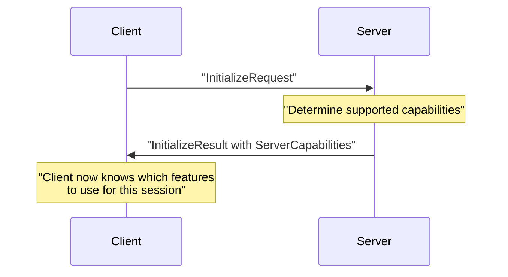

Sources: [schema/draft/schema.ts:384-455](), [docs/specification/draft/basic/lifecycle.mdx:40-147]()

## Tools Capability

Tools enable servers to expose executable functions that can be invoked by language models. The tools capability involves tool discovery, invocation, and result handling.

### Tool Discovery and Invocation

**Protocol Message Flow:**

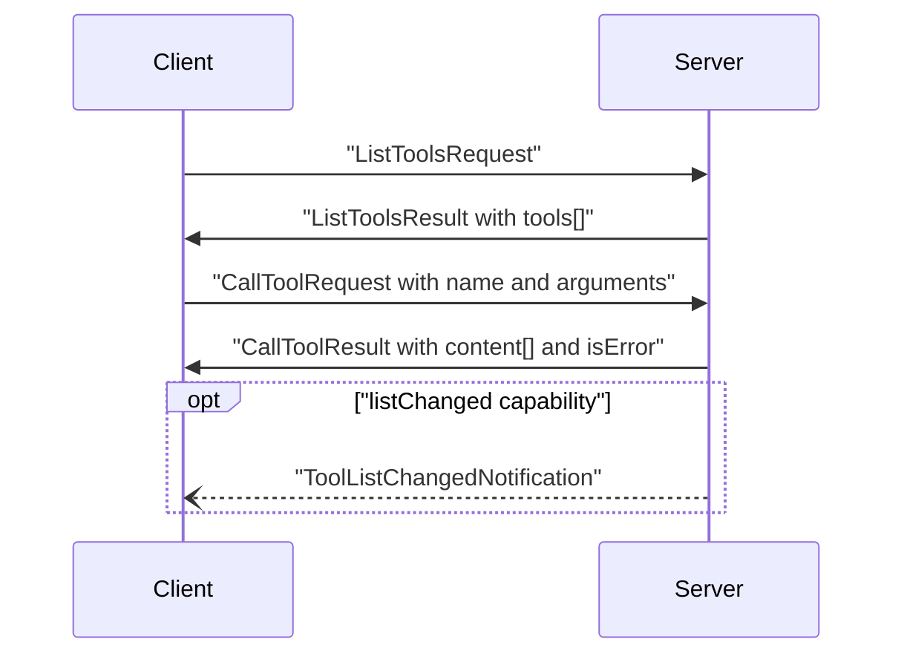

Sources: [docs/specification/draft/server/tools.mdx:57-185](), [schema/draft/schema.ts:1078-1151]()

### Tool Definition Structure

The `Tool` interface [schema/draft/schema.ts:1152-1268]() defines a tool with:

| Field | Type | Required | Description |
|-------|------|----------|-------------|
| `name` | `string` | Yes | Unique identifier (1-128 chars, alphanumeric + `_`, `-`, `.`) |
| `title` | `string` | No | Human-readable display name |
| `description` | `string` | No | Functionality description for LLMs |
| `inputSchema` | `ToolInputSchema` | Yes | JSON Schema for parameters |
| `outputSchema` | `object` | No | JSON Schema for structured results |
| `annotations` | `ToolAnnotations` | No | Behavioral metadata |
| `execution` | `ToolExecution` | No | Execution settings including task support |
| `icons` | `Icon[]` | No | Display icons |

**Input Schema Requirements:**

The `inputSchema` field [schema/draft/schema.ts:1177-1183]() must be a valid JSON Schema object. For tools with no parameters:

```typescript
// Recommended: explicitly reject any properties
{ "type": "object", "additionalProperties": false }

// Alternative: accept any object
{ "type": "object" }
```

Sources: [schema/draft/schema.ts:1152-1268](), [docs/specification/draft/server/tools.mdx:189-226]()

### Tool Annotations

The `ToolAnnotations` interface [schema/draft/schema.ts:1270-1304]() provides behavioral hints:

```typescript
interface ToolAnnotations {
  title?: string;
  audience?: Role[];
  destructive?: boolean;
  idempotent?: boolean;
}
```

These annotations are **untrusted metadata** and clients must validate them [docs/specification/draft/server/tools.mdx:209-212]().

### Tool Execution Settings

The `ToolExecution` interface [schema/draft/schema.ts:1306-1348]() controls execution behavior:

```typescript
interface ToolExecution {
  requiresConfirmation?: boolean;
  taskSupport?: "required" | "optional" | "forbidden";
}
```

The `taskSupport` field enables fine-grained control over task augmentation for specific tools [docs/specification/draft/basic/utilities/tasks.mdx:109-120]().

Sources: [schema/draft/schema.ts:1306-1348](), [docs/specification/draft/basic/utilities/tasks.mdx:109-120]()

### Tool Invocation

**CallToolRequest Structure:**

```typescript
interface CallToolRequest extends JSONRPCRequest {
  method: "tools/call";
  params: CallToolRequestParams;
}

interface CallToolRequestParams extends TaskAugmentedRequestParams {
  name: string;
  arguments?: { [key: string]: unknown };
  task?: TaskMetadata;  // Optional task augmentation
}
```

Defined in [schema/draft/schema.ts:126-184]().

### Tool Results

**CallToolResult Structure:**

The `CallToolResult` interface [schema/draft/schema.ts:185-214]() returns:

```typescript
interface CallToolResult extends Result {
  content: ContentBlock[];           // Unstructured content
  structuredContent?: { [key: string]: unknown };  // Optional structured data
  isError?: boolean;                 // Error flag (default: false)
}
```

**Content Type Hierarchy:**

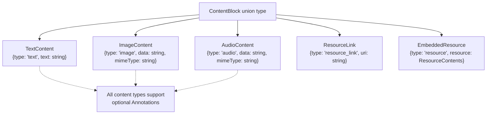

Sources: [schema/draft/schema.ts:638-656](), [schema/draft/schema.ts:1350-1406]()

### Error Handling

Tools use two distinct error mechanisms [docs/specification/draft/server/tools.mdx:450-467]():

1. **Protocol Errors**: JSON-RPC errors for structural issues
   - Unknown tool names
   - Malformed requests
   - Server errors

2. **Tool Execution Errors**: Reported via `isError: true` in `CallToolResult`
   - API failures
   - Input validation errors
   - Business logic errors

Tool execution errors should be returned in the `content` field to allow LLMs to self-correct.

**Error Response Example:**

```json
{
  "jsonrpc": "2.0",
  "id": 4,
  "result": {
    "content": [{
      "type": "text",
      "text": "Invalid departure date: must be in the future"
    }],
    "isError": true
  }
}
```

Sources: [docs/specification/draft/server/tools.mdx:450-498]()

### Task-Augmented Tool Calls

When `ServerCapabilities.tasks.requests.tools.call` is declared [schema/draft/schema.ts:443-452](), clients may augment `tools/call` requests with the `task` parameter [schema/draft/schema.ts:175-178]().

The server returns `CreateTaskResult` immediately [schema/draft/schema.ts:813-829]() instead of blocking:

```typescript
interface CreateTaskResult {
  task: Task;
  _meta?: {
    "io.modelcontextprotocol/model-immediate-response"?: string;
  };
}
```

The actual `CallToolResult` is retrieved later via `tasks/result` [docs/specification/draft/basic/utilities/tasks.mdx:240-280]().

Sources: [schema/draft/schema.ts:813-829](), [docs/specification/draft/basic/utilities/tasks.mdx:123-182]()

## Resources Capability

Resources expose contextual data to clients through a URI-based addressing scheme. The capability supports resource discovery, retrieval, templates, and change notifications.

### Resource Lifecycle

**Protocol Message Flow:**

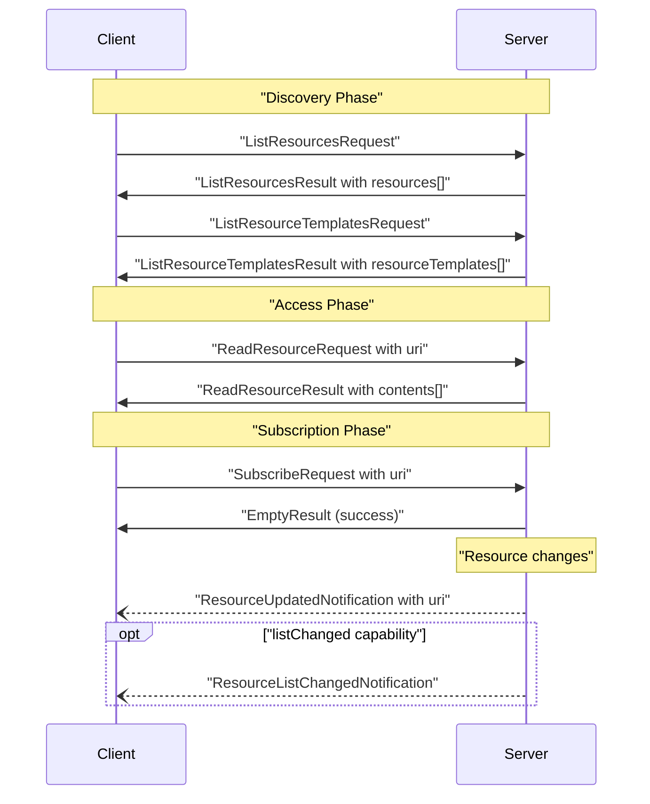

Sources: [docs/specification/draft/server/resources.mdx:86-280](), [schema/draft/schema.ts:647-794]()

### Resource Definition Structure

The `Resource` interface [schema/draft/schema.ts:800-836]() defines:

```typescript
interface Resource extends BaseMetadata, Icons {
  uri: string;              // RFC 3986 URI
  name: string;             // Identifier
  title?: string;           // Display name
  description?: string;     // LLM hint
  mimeType?: string;        // Content type
  annotations?: Annotations;
  size?: number;            // Bytes (pre-encoding)
  _meta?: { [key: string]: unknown };
}
```

**Annotations Field:**

The `Annotations` interface [schema/draft/schema.json:4-26]() provides contextual hints:

| Field | Type | Description |
|-------|------|-------------|
| `audience` | `Role[]` | Intended consumers: `["user"]`, `["assistant"]`, or both |
| `priority` | `number` | Importance (0.0-1.0), where 1.0 is "required" |
| `lastModified` | `string` | ISO 8601 timestamp |

Sources: [schema/draft/schema.ts:800-836](), [schema/draft/schema.json:4-26]()

### Resource Templates

The `ResourceTemplate` interface [schema/draft/schema.ts:843-872]() enables parameterized resources:

```typescript
interface ResourceTemplate extends BaseMetadata, Icons {
  uriTemplate: string;      // RFC 6570 URI template
  name: string;
  title?: string;
  description?: string;
  mimeType?: string;
  annotations?: Annotations;
  _meta?: { [key: string]: unknown };
}
```

Templates use URI template syntax like `file:///{path}` where `{path}` is a variable. Arguments can be auto-completed via the completion API [docs/specification/draft/server/utilities/completion.mdx]().

Sources: [schema/draft/schema.ts:843-872](), [docs/specification/draft/server/resources.mdx:168-209]()

### Resource Contents

**Content Types:**

Resources return either text or binary data via the `ResourceContents` union:

```typescript
interface TextResourceContents extends ResourceContents {
  text: string;
}

interface BlobResourceContents extends ResourceContents {
  blob: string;  // Base64-encoded
}
```

Defined in [schema/draft/schema.ts:879-917]().

**ReadResourceResult Structure:**

```typescript
interface ReadResourceResult extends Result {
  contents: (TextResourceContents | BlobResourceContents)[];
}
```

The server may return multiple content items for a single URI [schema/draft/schema.ts:721-723]().

Sources: [schema/draft/schema.ts:879-917](), [schema/draft/schema.ts:721-723]()

### Resource Subscriptions

When `ServerCapabilities.resources.subscribe` is declared [schema/draft/schema.ts:409-412](), clients can subscribe to resource updates:

**Subscribe Flow:**

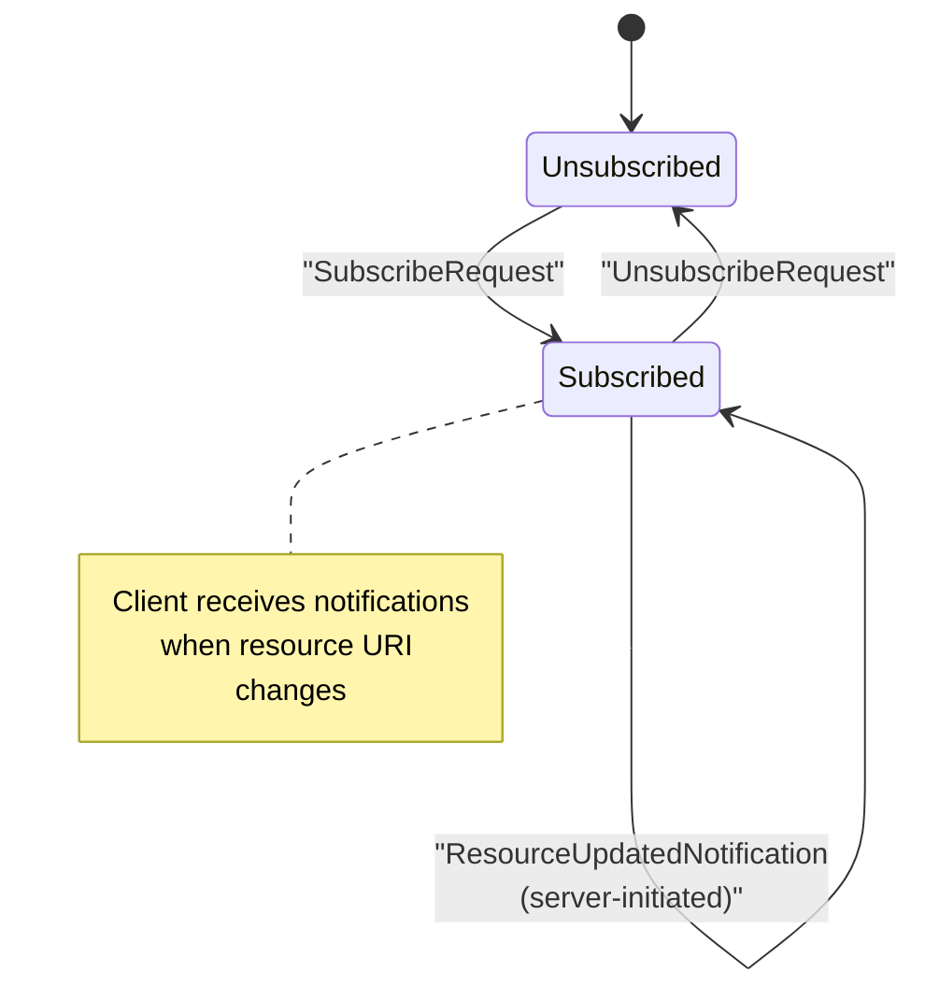

The `ResourceUpdatedNotification` [schema/draft/schema.ts:790-793]() includes the updated URI, which may be a sub-resource of the subscribed URI.

Sources: [schema/draft/schema.ts:746-793](), [docs/specification/draft/server/resources.mdx:223-251]()

### Common URI Schemes

The protocol defines standard URI schemes [docs/specification/draft/server/resources.mdx:351-417]():

| Scheme | Use Case | Example |
|--------|----------|---------|
| `file://` | Local filesystem | `file:///path/to/file.txt` |
| `https://` | Remote HTTP resources | `https://api.example.com/data` |
| Custom schemes | Server-specific resources | `database://table/column` |

Servers should use standard schemes where possible but may define custom schemes for domain-specific resources.

Sources: [docs/specification/draft/server/resources.mdx:351-417]()

## Prompts Capability

Prompts expose template-based message structures that clients can retrieve and customize with arguments. They are designed for user-initiated workflows [docs/specification/draft/server/prompts.mdx:14-28]().

### Prompt Discovery and Retrieval

**Protocol Message Flow:**

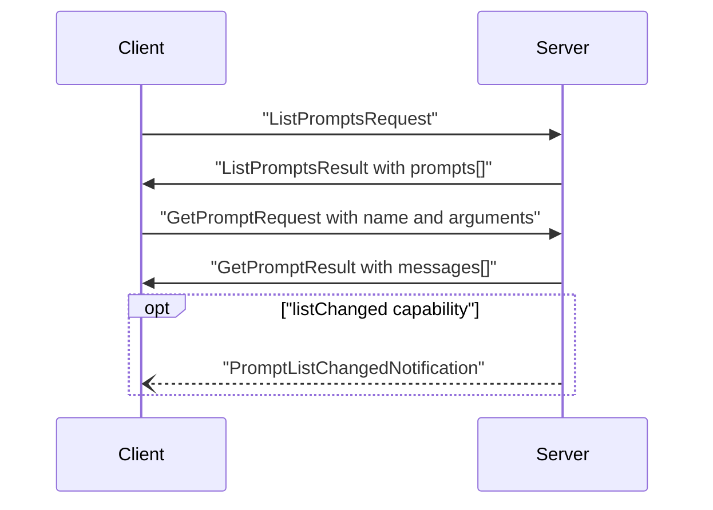

Sources: [docs/specification/draft/server/prompts.mdx:48-175](), [schema/draft/schema.ts:919-1076]()

### Prompt Definition Structure

The `Prompt` interface [schema/draft/schema.ts:982-997]() defines:

```typescript
interface Prompt extends BaseMetadata, Icons {
  name: string;              // Unique identifier
  title?: string;            // Display name
  description?: string;      // Purpose description
  arguments?: PromptArgument[];
  icons?: Icon[];
  _meta?: { [key: string]: unknown };
}
```

**Prompt Arguments:**

The `PromptArgument` interface [schema/draft/schema.ts:1004-1013]() specifies template parameters:

```typescript
interface PromptArgument extends BaseMetadata {
  name: string;
  title?: string;
  description?: string;
  required?: boolean;
}
```

Arguments may be auto-completed through the completion API [docs/specification/draft/server/utilities/completion.mdx]().

Sources: [schema/draft/schema.ts:982-1013](), [docs/specification/draft/server/prompts.mdx:180-189]()

### Prompt Messages

**GetPromptResult Structure:**

```typescript
interface GetPromptResult extends Result {
  description?: string;
  messages: PromptMessage[];
}
```

**PromptMessage Structure:**

```typescript
interface PromptMessage {
  role: Role;               // "user" | "assistant"
  content: ContentBlock;
}
```

Defined in [schema/draft/schema.ts:969-976]() and [schema/draft/schema.ts:1030-1033]().

**Content Types in Prompts:**

Prompt messages support the same `ContentBlock` union as tool results [schema/draft/schema.ts:638-656]():

- `TextContent`: Plain text messages [schema/draft/schema.ts:1350-1357]()
- `ImageContent`: Base64-encoded images [schema/draft/schema.ts:1359-1373]()
- `AudioContent`: Base64-encoded audio [schema/draft/schema.ts:1375-1389]()
- `EmbeddedResource`: Server-managed content [schema/draft/schema.ts:1054-1067]()

All content types support optional `Annotations` [schema/draft/schema.json:4-26]().

Sources: [schema/draft/schema.ts:969-976](), [schema/draft/schema.ts:1030-1033](), [schema/draft/schema.ts:638-656]()

## Supporting Capabilities

### Completion API

When `ServerCapabilities.completions` is declared [schema/draft/schema.ts:394-396](), the server supports argument auto-completion for prompts and resource templates.

**CompleteRequest Structure:**

```typescript
interface CompleteRequest extends JSONRPCRequest {
  method: "completion/complete";
  params: CompleteRequestParams;
}

interface CompleteRequestParams extends RequestParams {
  ref: PromptReference | ResourceTemplateReference;
  argument: {
    name: string;
    value: string;
  };
  context?: {
    arguments?: { [key: string]: string };
  };
}
```

The `ref` field [schema/draft/schema.ts:584-593]() is a discriminated union:

```typescript
type PromptReference = {
  type: "ref/prompt";
  name: string;
}

type ResourceTemplateReference = {
  type: "ref/resource_template";
  uriTemplate: string;
}
```

**CompleteResult Structure:**

```typescript
interface CompleteResult {
  completion: {
    values: string[];       // Max 100 items
    total?: number;         // Total available
    hasMore?: boolean;      // More results available
  };
}
```

Defined in [schema/draft/schema.ts:513-637]().

Sources: [schema/draft/schema.ts:513-637](), [docs/specification/draft/server/utilities/completion.mdx]()

### Logging Capability

When `ServerCapabilities.logging` is declared [schema/draft/schema.ts:391-393](), the server can emit structured log messages to the client.

**LoggingMessageNotification Structure:**

```typescript
interface LoggingMessageNotification extends JSONRPCNotification {
  method: "notifications/message";
  params: LoggingMessageNotificationParams;
}

interface LoggingMessageNotificationParams extends NotificationParams {
  level: LoggingLevel;
  logger?: string;
  data: unknown;
}

type LoggingLevel = 
  | "debug" | "info" | "notice" | "warning" 
  | "error" | "critical" | "alert" | "emergency";
```

The logging levels map to syslog severities (RFC 5424) [schema/draft/schema.ts:1408-1425]().

Clients control the minimum log level via `SetLevelRequest` [schema/draft/schema.ts:1427-1471]().

Sources: [schema/draft/schema.ts:1408-1471](), [docs/specification/draft/server/utilities/logging.mdx]()

### Task Support for Server Requests

When `ServerCapabilities.tasks.requests.tools.call` is declared [schema/draft/schema.ts:443-452](), the server supports task-augmented tool calls.

**Task Capability Structure:**

```typescript
interface ServerCapabilities {
  tasks?: {
    list?: object;          // Supports tasks/list
    cancel?: object;        // Supports tasks/cancel
    requests?: {
      tools?: {
        call?: object;      // tools/call can be task-augmented
      };
    };
  };
}
```

**Task State Machine:**

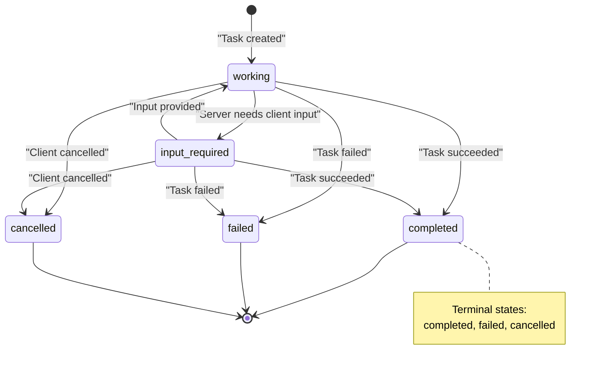

**Task Interface:**

```typescript
interface Task {
  taskId: string;
  status: "working" | "input_required" | "completed" | "failed" | "cancelled";
  statusMessage?: string;
  createdAt: string;        // ISO 8601
  lastUpdatedAt: string;    // ISO 8601
  ttl: number | null;       // Milliseconds or null for unlimited
  pollInterval?: number;    // Suggested polling interval (ms)
}
```

Defined in [schema/draft/schema.ts:1473-1548]().

Sources: [schema/draft/schema.ts:1473-1548](), [docs/specification/draft/basic/utilities/tasks.mdx:388-431]()

## Capability Negotiation Patterns

### Declaring Multiple Capabilities

A server typically declares multiple capabilities in its `InitializeResult`:

```json
{
  "protocolVersion": "2025-11-25",
  "capabilities": {
    "tools": {
      "listChanged": true
    },
    "resources": {
      "subscribe": true,
      "listChanged": true
    },
    "prompts": {
      "listChanged": true
    },
    "logging": {},
    "completions": {},
    "tasks": {
      "list": {},
      "cancel": {},
      "requests": {
        "tools": {
          "call": {}
        }
      }
    }
  },
  "serverInfo": {
    "name": "example-server",
    "version": "1.0.0"
  }
}
```

### Conditional Feature Support

Servers should check client capabilities before using optional features:

| Server Feature | Requires Client Capability |
|----------------|---------------------------|
| Task-augmented tools | `ClientCapabilities.tasks.requests.tools.call` |
| Sampling with tools | `ClientCapabilities.sampling.tools` |
| Context inclusion | `ClientCapabilities.sampling.context` |
| Elicitation requests | `ClientCapabilities.elicitation` |

Defined in [schema/draft/schema.ts:302-377]().

Sources: [schema/draft/schema.ts:277-455](), [docs/specification/draft/basic/lifecycle.mdx:186-213]()

# Server Registry and Community Servers


The MCP Registry is the central index for discovering and publishing MCP servers. Since its launch in September 2024, the registry has grown to nearly 2,000 entries, representing a 407% growth rate from its initial batch of servers. This explosive growth demonstrates MCP's rapid adoption across the developer community.

This page explains the MCP Registry, the distinction between reference, official, and community servers, and provides guidelines for publishing and discovering servers in the ecosystem.

For building new servers, see [Building MCP Servers](#5.1). For implementation details of reference servers, see [Reference Server Implementations](#5.2).

## Server Categories

The MCP ecosystem organizes servers into three distinct categories based on maintenance and ownership:

| Category | Maintainer | Count | Characteristics |
|----------|-----------|-------|-----------------|
| **Reference Servers** | MCP Core Team | 7 active | Demonstrate SDK features, actively maintained, production-quality |
| **Official Integrations** | Platform Companies | Dozens | Company-maintained, platform-specific, first-party support |
| **Community Servers** | Independent Developers | ~2,000 | Varying quality and maintenance, diverse implementations |

**Sources**: [blog/content/posts/2025-11-25-first-mcp-anniversary.md:28](), [docs/examples.mdx:8-34]()

## Reference Servers

Reference servers are maintained by the MCP Core Team and demonstrate SDK capabilities. These 7 actively maintained servers serve as canonical examples of MCP implementations:

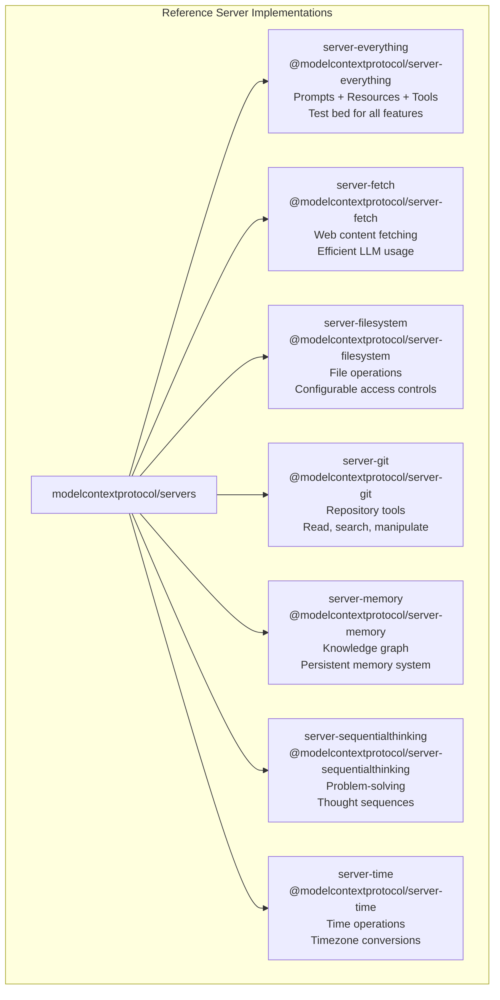

**Diagram: Reference Server Implementations in modelcontextprotocol/servers**

Reference servers are distributed as npm packages (TypeScript) or Python packages and can be executed directly via `npx` or `uvx`. For detailed implementation guidance, see [Reference Server Implementations](#5.2).

**Sources**: [docs/examples.mdx:12-20]()

## Official Integrations

Official integrations are MCP servers maintained by companies for their own platforms. Examples include:

- **Notion**: [github.com/makenotion/notion-mcp-server](https://github.com/makenotion/notion-mcp-server) - Manage notes and databases
- **Stripe**: [docs.stripe.com/mcp#tools](https://docs.stripe.com/mcp#tools) - Payment workflow automation
- **GitHub**: [github.com/github/github-mcp-server](https://github.com/github/github-mcp-server) - Engineering process automation
- **Hugging Face**: [github.com/huggingface/hf-mcp-server](https://github.com/huggingface/hf-mcp-server) - Model management and dataset search
- **Postman**: [github.com/postmanlabs/postman-mcp-server](https://github.com/postmanlabs/postman-mcp-server) - API testing workflows

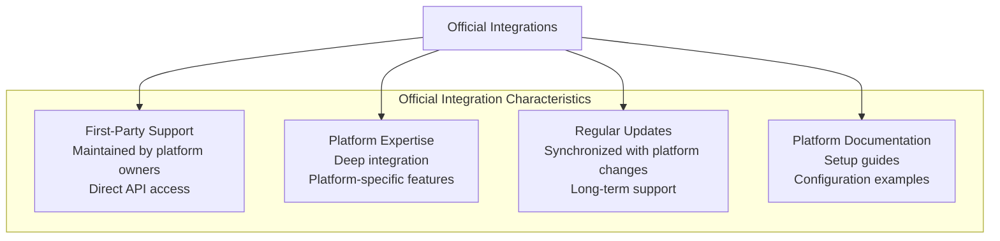

**Diagram: Characteristics of Official Integration Servers**

Official integrations are listed in the [modelcontextprotocol/servers](https://github.com/modelcontextprotocol/servers) repository under the "Official Integrations" section. These servers benefit from direct platform knowledge and are typically maintained alongside the platforms themselves.

**Sources**: [blog/content/posts/2025-11-25-first-mcp-anniversary.md:22-27](), [docs/examples.mdx:28-30]()

## The MCP Registry

The MCP Registry launched in September 2024 as the central index for discovering MCP servers. The registry provides a searchable database of community-contributed servers across all domains.

### Registry Growth and Adoption

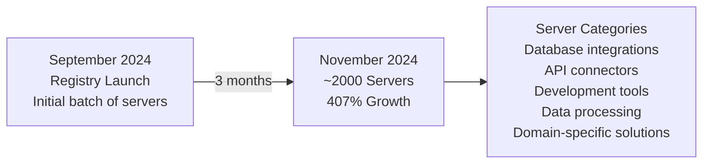

**Diagram: MCP Registry Growth Timeline**

Key metrics:
- **Launch**: September 2024
- **Current size**: ~2,000 servers (as of November 2024)
- **Growth rate**: 407% from initial batch
- **Diversity**: Servers span databases, APIs, tools, data processing, and specialized domains

**Sources**: [blog/content/posts/2025-11-25-first-mcp-anniversary.md:28]()

### Registry Structure

The MCP Registry serves as:

1. **Discovery platform**: Searchable index of available servers
2. **Quality signal**: Listed servers meet basic publication criteria
3. **Community showcase**: Demonstrates ecosystem breadth and creativity
4. **Integration hub**: Central location for finding solutions to specific needs

The registry complements the `modelcontextprotocol/servers` repository, which contains reference implementations and links to official integrations. The registry itself focuses on community-contributed servers across the broader ecosystem.

**Sources**: [blog/content/posts/2025-11-25-first-mcp-anniversary.md:28]()

## Community Servers

Community servers are independently developed and maintained by MCP ecosystem contributors. With ~2,000 servers in the registry, the community has created implementations across virtually every domain.

### Community Server Characteristics

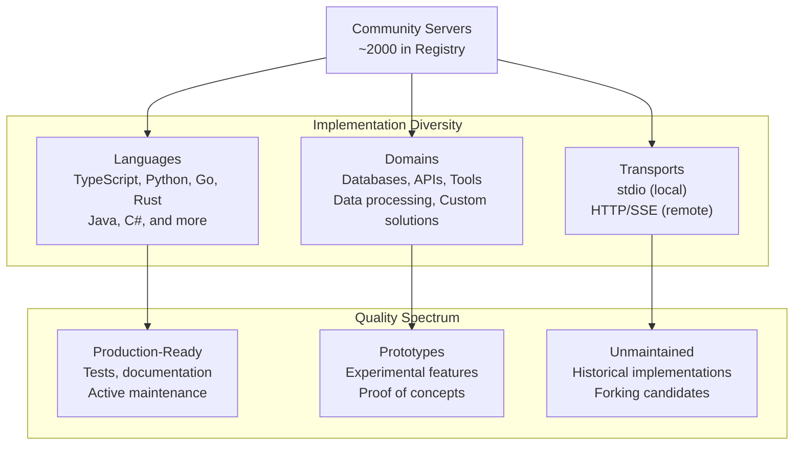

**Diagram: Community Server Diversity and Quality Spectrum**

**Sources**: [blog/content/posts/2025-11-25-first-mcp-anniversary.md:28](), [docs/examples.mdx:32-34]()

### Discovery Mechanisms

Find community servers through multiple channels:

| Channel | Description | Best For |
|---------|-------------|----------|
| **MCP Registry** | Searchable index at [registry URL] | Browsing by category, keyword search |
| **servers Repository** | [github.com/modelcontextprotocol/servers](https://github.com/modelcontextprotocol/servers) Community section | Curated popular servers, official links |
| **GitHub Discussions** | [github.com/orgs/modelcontextprotocol/discussions](https://github.com/orgs/modelcontextprotocol/discussions) | New server announcements, community feedback |
| **Discord** | MCP community Discord server | Real-time discovery, implementation help |

**Sources**: [docs/examples.mdx:32-34]()

### Evaluation Criteria

When selecting community servers, evaluate:

1. **Maintenance status**: Recent commits, active issue responses
2. **Documentation**: Setup instructions, configuration examples, API documentation
3. **Security**: Code review for credential handling, input validation, dependency security
4. **Testing**: Unit tests, integration tests, test coverage
5. **License**: MIT, Apache 2.0, or compatible license for your use case
6. **Community**: GitHub stars, forks, contributor count, issue activity

**Sources**: [docs/examples.mdx:32-34]()

## Publishing Servers to the Registry

Publishing your server to the MCP Registry makes it discoverable to the broader community.

### Publication Guidelines

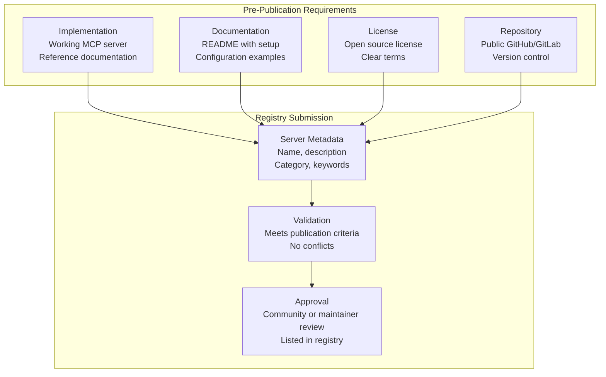

**Diagram: Server Publication Process Flow**

### Metadata Requirements

Servers in the registry include:

- **Name**: Unique identifier for the server
- **Description**: Clear explanation of functionality
- **Category**: Database, API, Tool, Data Processing, or Custom
- **Language**: Primary implementation language
- **Transport**: stdio, HTTP/SSE, or both
- **Repository URL**: Link to source code
- **Package URL**: npm, PyPI, or other package manager link
- **Keywords**: Searchable terms for discovery

### Quality Standards

Published servers should meet minimum quality standards:

1. **Functionality**: Server implements at least one MCP capability (tools, resources, or prompts)
2. **Documentation**: README explains installation, configuration, and usage
3. **Security**: No hardcoded credentials, proper input validation
4. **License**: Open source license compatible with community use
5. **Versioning**: Semantic versioning for releases

**Sources**: [blog/content/posts/2025-11-25-first-mcp-anniversary.md:28]()

## Discovering and Using Servers

### Installation Methods

Servers can be executed using language-specific package managers:

**TypeScript/JavaScript Servers** (via `npx`):
```bash