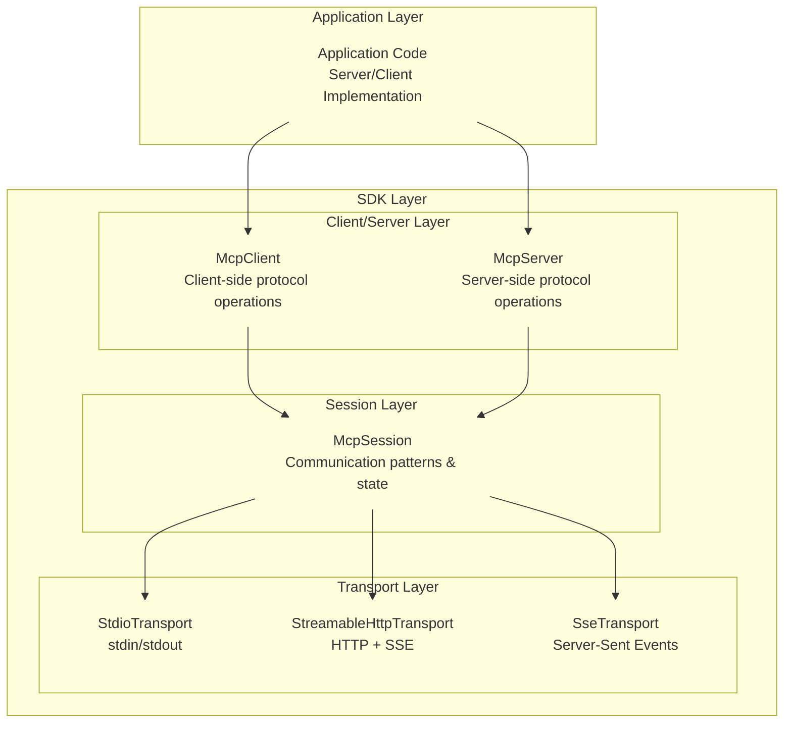
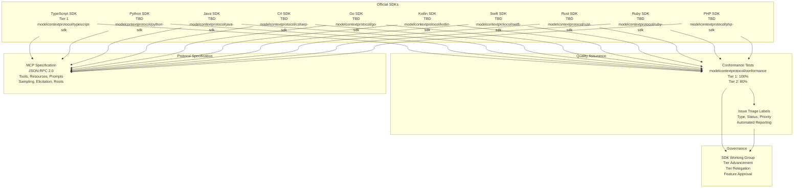
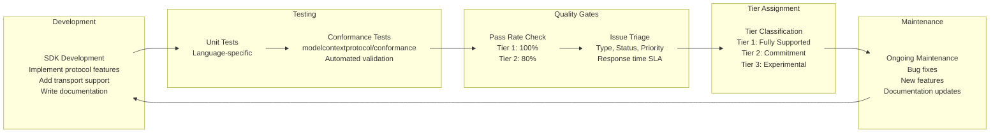

npx -y @modelcontextprotocol/server-filesystem /allowed/path
```

**Python Servers** (via `uvx` or `pip`):
```bash
# Using uvx (recommended)
uvx mcp-server-git

# Using pip
pip install mcp-server-git
python -m mcp_server_git
```

**Other Languages**:
- **Go**: Build and run binary directly
- **Rust**: `cargo run` or distribute compiled binary
- **Java/Kotlin**: Package as JAR and execute via `java -jar`

**Sources**: [docs/examples.mdx:38-55]()

### Client Configuration

Configure servers in MCP clients like Claude Desktop by adding entries to the configuration file:

```json
{
  "mcpServers": {
    "memory": {
      "command": "npx",
      "args": ["-y", "@modelcontextprotocol/server-memory"]
    },
    "filesystem": {
      "command": "npx",
      "args": [
        "-y",
        "@modelcontextprotocol/server-filesystem",
        "/path/to/allowed/files"
      ]
    },
    "github": {
      "command": "npx",
      "args": ["-y", "@modelcontextprotocol/server-github"],
      "env": {
        "GITHUB_PERSONAL_ACCESS_TOKEN": "<YOUR_TOKEN>"
      }
    }
  }
}
```

**Configuration Structure**:
- **command**: Executable (`npx`, `uvx`, `python`, `node`, binary path)
- **args**: Command-line arguments including package name or script path
- **env**: Environment variables for API keys and configuration

**Sources**: [docs/examples.mdx:57-84]()

## Archived Servers

Some servers have been archived and moved to [github.com/modelcontextprotocol/servers-archived](https://github.com/modelcontextprotocol/servers-archived). These implementations are no longer actively maintained and serve as historical reference only.

### Why Servers Are Archived

Servers may be archived due to:
- Maintenance burden requiring ongoing API updates
- Security concerns with external integrations
- Better suited as community-maintained projects
- Superseded by improved implementations

⚠️ **Warning**: Archived servers may contain outdated dependencies, security vulnerabilities, or protocol incompatibilities. Use them as reference implementations for building new servers, not for production deployments.

### Notable Archived Servers

The archived repository includes servers for:
- **Databases**: PostgreSQL, SQLite
- **Development Tools**: GitHub, GitLab, Sentry
- **Web Automation**: Puppeteer, Brave Search
- **Communication**: Slack, Google Maps
- **AI Tools**: EverArt, AWS Knowledge Base Retrieval

For current alternatives, search the MCP Registry or community servers section. Many archived server functionalities have been reimplemented by the community with modern dependencies and improved features.

**Sources**: [docs/examples.mdx:22-24]()

## Additional Resources

### Community Engagement

- **GitHub Discussions**: https://github.com/orgs/modelcontextprotocol/discussions
- **MCP Servers Repository**: https://github.com/modelcontextprotocol/servers
- **Servers Archived Repository**: https://github.com/modelcontextprotocol/servers-archived
- **Discord Community**: Real-time discussions about server implementations

### Related Documentation

- [Building MCP Servers](#5.2): Guide to implementing custom servers
- [Reference Server Implementations](#5.3): Current actively maintained servers
- [Quick Start Guide](#5.1): Getting started with MCP servers and Claude configuration

**Sources**: [docs/examples.mdx:113-117]()

# SDK Ecosystem


## Purpose and Scope

This document describes the MCP SDK ecosystem: the collection of official language-specific SDKs that enable developers to build MCP clients and servers. It covers the tier classification system that establishes quality and maintenance expectations, the available SDKs across 10+ languages, conformance testing mechanisms, and the development guidelines for SDK maintainers.

For information about building MCP servers and clients using these SDKs, see [Building MCP Servers](#5.1) and [Building MCP Clients](#5.1). For governance and community structure around SDK development, see [Governance and Community](#8). For protocol specification details that SDKs implement, see [Protocol Specification](#2).

## Overview

The MCP SDK ecosystem provides standardized implementations of the Model Context Protocol across multiple programming languages. Each SDK enables developers to:

- Create MCP servers that expose tools, resources, and prompts
- Build MCP clients that connect to any MCP server
- Support local (stdio) and remote (HTTP/SSE) transport protocols
- Maintain protocol compliance with type safety

The ecosystem is organized into three tiers based on feature completeness, maintenance commitment, and documentation quality. This tiering system helps developers choose the right SDK for their needs and provides SDK maintainers with a clear path to improving adoption expectations.

## SDK Tier System

The MCP SDK Tiering System establishes three classification levels for official and community SDKs:

### Tier 1: Fully Supported

Tier 1 SDKs provide complete protocol implementation including all non-experimental features and optional capabilities. They require:

- **100% conformance test pass rate** against applicable required tests
- **New protocol features** implemented before or concurrent with spec version releases (timeline agreed per release)
- **Issue triage** within 2 business days
- **Critical bug resolution** (P0 issues) within 7 days
- **Stable release** with clear versioning (e.g., version 1.0.0 or higher)
- **Comprehensive documentation** with examples for all features
- **Published dependency update policy**
- **Published roadmap** with concrete implementation steps

### Tier 2: Commitment to Full Support

Tier 2 SDKs are actively maintained and working toward full protocol specification support. They require:

- **80% conformance test pass rate** against applicable required tests
- **New protocol features** implemented within 6 months of spec release
- **Issue triage** within one month
- **Critical bug resolution** within two weeks
- **At least one stable release**
- **Basic documentation** covering core features
- **Published dependency update policy**
- **Published plan** toward Tier 1 or explanation for remaining Tier 2

### Tier 3: Experimental

Tier 3 SDKs are experimental, partially implemented, or specialized. They have:

- **No minimum conformance requirement**
- **No timeline commitment** for new features
- **No issue triage requirement**
- **No critical bug resolution requirement**
- **No stable release requirement**
- **No documentation minimum**

Experimental features (such as Tasks) and protocol extensions (such as MCP Apps) are not required for any tier.

Sources: [docs/community/sdk-tiers.mdx:1-142]()

## Conformance Testing

All SDKs are evaluated using automated conformance tests that validate protocol support against published specifications. The conformance test suite is located in the [modelcontextprotocol/conformance](https://github.com/modelcontextprotocol/conformance) repository.

### Conformance Scoring

Conformance scores are calculated against **applicable required tests only**:

- Tests for the specification version the SDK targets
- Excluding tests marked as pending or skipped
- Excluding tests for experimental features
- Excluding legacy backward-compatibility tests (unless the SDK claims legacy support)

Tier requirements:
- **Tier 1**: 100% conformance required
- **Tier 2**: 80% conformance required
- **Tier 3**: No minimum requirement

### Tier Advancement and Relegation

SDK maintainers can request tier advancement by:

1. Self-assessing against tier requirements
2. Opening an issue in the [modelcontextprotocol/modelcontextprotocol](https://github.com/modelcontextprotocol/modelcontextprotocol) repository with supporting evidence
3. Passing automated conformance testing
4. Receiving approval from SDK Working Group maintainers

An SDK may be moved to a lower tier if existing conformance tests on the latest stable release fail continuously for 4 weeks:

- **Tier 1 → Tier 2**: Any conformance test fails
- **Tier 2 → Tier 3**: More than 20% of conformance tests fail

Sources: [docs/community/sdk-tiers.mdx:59-98]()

## Issue Triage Labels

SDK repositories must use consistent labels to enable automated reporting on issue handling metrics. Tier calculations use these metrics to measure triage response times and critical bug resolution times.

### Type Labels (pick one)

| Label | Description |
|-------|-------------|
| `bug` | Something isn't working |
| `enhancement` | Request for new feature |
| `question` | Further information requested |

Repositories using [GitHub's native issue types](https://docs.github.com/en/issues/tracking-your-work-with-issues/using-issues/managing-issue-types-in-an-organization) satisfy this requirement without needing type labels.

### Status Labels (pick one)

| Label | Description |
|-------|-------------|
| `needs confirmation` | Unclear if still relevant |
| `needs repro` | Insufficient information to reproduce |
| `ready for work` | Has enough information to start |
| `good first issue` | Good for newcomers |
| `help wanted` | Contributions welcome from those familiar with codebase |

### Priority Labels (only if actionable)

| Label | Description |
|-------|-------------|
| `P0` | Critical: core functionality failures or high-severity security |
| `P1` | Significant bug affecting many users |
| `P2` | Moderate issues, valuable feature requests |
| `P3` | Nice to haves, rare edge cases |

**P0 (Critical)** issues are:

- **Security vulnerabilities** with CVSS score ≥ 7.0 (High or Critical severity)
- **Core functionality failures** that prevent basic MCP operations: connection establishment, message exchange, or use of core primitives (tools, resources, prompts)

Sources: [docs/community/sdk-tiers.mdx:99-142]()

## Available SDKs

The following table lists all official SDKs with their current tier status and repository locations:

| SDK | Repository | Tier Status |
|-----|-----------|-------------|
| TypeScript | [modelcontextprotocol/typescript-sdk](https://github.com/modelcontextprotocol/typescript-sdk) | Tier 1 |
| Python | [modelcontextprotocol/python-sdk](https://github.com/modelcontextprotocol/python-sdk) | TBD |
| Java | [modelcontextprotocol/java-sdk](https://github.com/modelcontextprotocol/java-sdk) | TBD |
| C# | [modelcontextprotocol/csharp-sdk](https://github.com/modelcontextprotocol/csharp-sdk) | TBD |
| Go | [modelcontextprotocol/go-sdk](https://github.com/modelcontextprotocol/go-sdk) | TBD |
| Kotlin | [modelcontextprotocol/kotlin-sdk](https://github.com/modelcontextprotocol/kotlin-sdk) | TBD |
| Swift | [modelcontextprotocol/swift-sdk](https://github.com/modelcontextprotocol/swift-sdk) | TBD |
| Rust | [modelcontextprotocol/rust-sdk](https://github.com/modelcontextprotocol/rust-sdk) | TBD |
| Ruby | [modelcontextprotocol/ruby-sdk](https://github.com/modelcontextprotocol/ruby-sdk) | TBD |
| PHP | [modelcontextprotocol/php-sdk](https://github.com/modelcontextprotocol/php-sdk) | TBD |

Official tier assignments will be published February 23, 2026. See [SDK Tiering System](#sdk-tier-system) for details.

Sources: [docs/docs/sdk.mdx:1-24]()

## SDK Architecture and Common Patterns

All official SDKs follow a consistent layered architecture that separates concerns across protocol, session, and transport layers. This architecture enables language-specific idioms while maintaining protocol compliance.

### Layered Architecture



**Diagram: SDK Layered Architecture**

Sources: [docs/sdk/java/mcp-overview.mdx:49-77]()

### Core SDK Components

Each SDK provides:

1. **Client Implementation** (`McpClient` or language equivalent)
   - Establishes connections with MCP servers
   - Handles capability negotiation
   - Manages tool discovery and execution
   - Accesses resources and prompts
   - Supports optional features (sampling, elicitation, roots)

2. **Server Implementation** (`McpServer` or language equivalent)
   - Accepts client connections
   - Negotiates capabilities
   - Exposes tools, resources, and prompts
   - Handles logging and progress tracking
   - Manages concurrent client connections

3. **Transport Implementations**
   - **Stdio**: For local process-based communication
   - **Streamable HTTP**: For remote HTTP-based communication with bidirectional streaming
   - **SSE**: For Server-Sent Events streaming

4. **Type-Safe Protocol Bindings**
   - JSON-RPC message serialization/deserialization
   - Request/response correlation
   - Error handling with standard error codes
   - Notification handling

### Synchronous and Asynchronous APIs

Most SDKs provide both synchronous and asynchronous programming models to accommodate different application architectures:

- **Sync API**: Blocking calls suitable for imperative code
- **Async API**: Non-blocking calls using language-native async patterns (Promises, Futures, Coroutines, etc.)

Sources: [docs/sdk/java/mcp-overview.mdx:49-77](), [docs/sdk/java/mcp-client.mdx:14-150](), [docs/sdk/java/mcp-server.mdx:14-107]()

## SDK Feature Support Matrix

The following table shows which MCP features are supported across different SDK tiers:

| Feature | Tier 1 | Tier 2 | Tier 3 | Notes |
|---------|--------|--------|--------|-------|
| **Core Protocol** | ✓ | ✓ | Partial | JSON-RPC, lifecycle, capabilities |
| **Tools** | ✓ | ✓ | Partial | Tool discovery and execution |
| **Resources** | ✓ | ✓ | Partial | URI-based resource access |
| **Prompts** | ✓ | ✓ | Partial | Prompt templates and execution |
| **Sampling** | ✓ | ✓ | Optional | Server-initiated LLM requests |
| **Elicitation** | ✓ | ✓ | Optional | User input collection |
| **Roots** | ✓ | ✓ | Optional | Filesystem boundary definitions |
| **Logging** | ✓ | ✓ | Optional | Structured logging to clients |
| **Progress** | ✓ | ✓ | Optional | Long-running operation tracking |
| **Completion** | ✓ | ✓ | Optional | Argument autocompletion |
| **Tasks** | Optional | Optional | Optional | Experimental feature |
| **MCP Apps** | Optional | Optional | Optional | Extension feature |

Sources: [docs/community/sdk-tiers.mdx:19-29]()

## SDK Development Guidelines

### Transport Selection

SDKs should provide implementations for:

1. **Stdio Transport** (required)
   - Uses standard input/output for communication
   - Ideal for local processes
   - Efficient for same-machine communication
   - Simple process management

2. **Streamable HTTP Transport** (required)
   - Uses HTTP with optional Server-Sent Events for streaming
   - HTTP POST for client-to-server messages
   - GET/SSE for server-to-client streaming
   - Suitable for remote scenarios

3. **SSE Transport** (optional)
   - Server-Sent Events for unidirectional server-to-client streaming
   - Useful for specific deployment patterns

### Message Handling Best Practices

1. **Request Processing**
   - Validate inputs thoroughly
   - Use type-safe schemas
   - Handle errors gracefully
   - Implement timeouts

2. **Progress Reporting**
   - Use progress tokens for long operations
   - Report progress incrementally
   - Include total progress when known

3. **Error Management**
   - Use appropriate error codes from the specification
   - Include helpful error messages
   - Clean up resources on errors
   - Distinguish between protocol errors and application errors

### Documentation Requirements

Tier 1 SDKs must provide:
- Installation and setup instructions
- Quick-start examples for clients and servers
- API reference documentation
- Examples for all major features
- Transport selection guidance
- Error handling patterns
- Security best practices

Tier 2 SDKs must provide:
- Installation instructions
- Basic API documentation
- Core feature examples
- Common patterns

Sources: [docs/legacy/concepts/architecture.mdx:288-362]()

## SDK Implementation Reference: Java SDK

The Java SDK serves as a reference implementation demonstrating the layered architecture and feature completeness expected of Tier 1 SDKs.

### Java SDK Structure

The Java SDK is organized into modules:

- **Core Module** (`io.modelcontextprotocol.sdk:mcp`)
  - `McpClient` and `McpServer` implementations
  - Stdio, Streamable HTTP, and SSE transports
  - No external web framework dependencies

- **Spring WebFlux Module** (`io.modelcontextprotocol.sdk:mcp-spring-webflux`)
  - WebFlux-based client and server transports
  - Reactive HTTP streaming
  - Optional for Spring Framework users

- **Spring WebMVC Module** (`io.modelcontextprotocol.sdk:mcp-spring-webmvc`)
  - WebMVC-based server transports
  - Servlet-based HTTP streaming
  - Optional for Spring Framework users

- **Test Module** (`io.modelcontextprotocol.sdk:mcp-test`)
  - Testing utilities and support

### Java Client Implementation

The Java SDK provides both synchronous and asynchronous client APIs. The sync API uses `McpSyncClient` [docs/sdk/java/mcp-client.mdx:41-91]() while the async API uses `McpAsyncClient` [docs/sdk/java/mcp-client.mdx:95-150]().

Key client capabilities:

- **Tool Execution**: `listTools()` and `callTool(name, params)`
- **Resource Access**: `listResources()` and `readResource(uri)`
- **Prompt System**: `listPrompts()` and `executePrompt(name, params)`
- **Roots Management**: `addRoot()`, `removeRoot()`, `rootsListChangedNotification()`
- **Sampling Support**: Register sampling handler via `sampling(handler)`
- **Elicitation Support**: Register elicitation handler via `elicitation(handler)`
- **Change Notifications**: Register consumers for tools, resources, and prompts changes
- **Logging**: Register logging consumer and set logging level
- **Progress**: Register progress consumer for operation tracking

### Java Server Implementation

The Java SDK provides both synchronous and asynchronous server APIs. The sync API uses `McpSyncServer` [docs/sdk/java/mcp-server.mdx:37-58]() while the async API uses `McpAsyncServer` [docs/sdk/java/mcp-server.mdx:73-104]().

Key server capabilities:

- **Tool Registration**: `addTool(toolSpecification)` with handler
- **Resource Registration**: `addResource(resourceSpecification)` with handler
- **Prompt Registration**: `addPrompt(promptSpecification)` with handler
- **Capability Configuration**: `ServerCapabilities` builder for resources, tools, prompts, logging, completions
- **Transport Support**: Stdio, Streamable HTTP, SSE with Spring WebFlux/WebMVC options

### Java Transport Implementations

The Java SDK provides multiple transport options:

**Stdio Transport** [docs/sdk/java/mcp-server.mdx:117-133]()
- `StdioServerTransportProvider` for servers
- `StdioClientTransport` for clients
- Bidirectional JSON-RPC over stdin/stdout

**Streamable HTTP Transport** [docs/sdk/java/mcp-server.mdx:135-244]()
- `WebFluxStreamableServerTransportProvider` (WebFlux)
- `WebMvcStreamableServerTransportProvider` (WebMVC)
- `HttpServletStreamableServerTransportProvider` (Servlet)
- `HttpClientStreamableHttpTransport` (client)
- `WebClientStreamableHttpTransport` (client with WebClient)

**Stateless Streamable HTTP Transport** [docs/sdk/java/mcp-server.mdx:175-219]()
- `WebFluxStatelessServerTransport` (WebFlux)
- `WebMvcStatelessServerTransport` (WebMVC)
- `HttpServletStatelessServerTransport` (Servlet)
- For cloud-native deployments without session state

**SSE Transport** [docs/sdk/java/mcp-server.mdx:220-243]()
- `WebFluxSseServerTransportProvider` (WebFlux)
- `WebMvcSseServerTransportProvider` (WebMVC)
- `HttpServletSseServerTransportProvider` (Servlet)
- Server-Sent Events for unidirectional streaming

Sources: [docs/sdk/java/mcp-overview.mdx:1-196](), [docs/sdk/java/mcp-client.mdx:1-598](), [docs/sdk/java/mcp-server.mdx:1-800]()

## SDK Ecosystem Diagram



**Diagram: SDK Ecosystem Overview**

Sources: [docs/docs/sdk.mdx:1-24](), [docs/community/sdk-tiers.mdx:1-142]()

## SDK Development Workflow



**Diagram: SDK Development and Tier Assignment Workflow**

Sources: [docs/community/sdk-tiers.mdx:59-98]()

## Getting Started with SDKs

Each SDK provides the same core functionality but follows the idioms and best practices of its language. All SDKs support:

- Creating MCP servers that expose tools, resources, and prompts
- Building MCP clients that can connect to any MCP server
- Local (stdio) and remote (HTTP/SSE) transport protocols
- Protocol compliance with type safety

To get started:

1. **Choose your language** from the [Available SDKs](#available-sdks) table
2. **Visit the SDK repository** for installation instructions and documentation
3. **Review the [Building MCP Servers](#5.1) guide** for server development patterns
4. **Review the [Building MCP Clients](#5.1) guide** for client development patterns
5. **Use the [MCP Inspector](#9.1)** for testing and debugging during development

Sources: [docs/docs/sdk.mdx:1-52]()