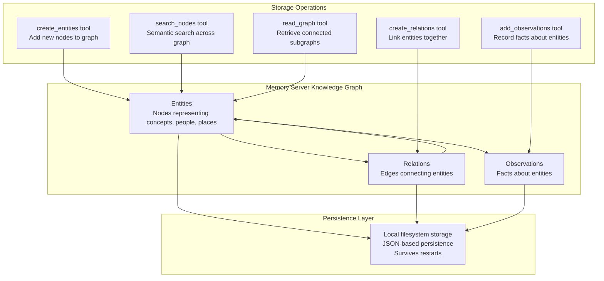
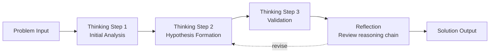
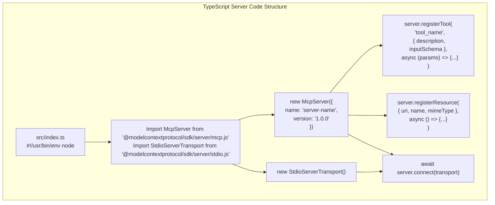
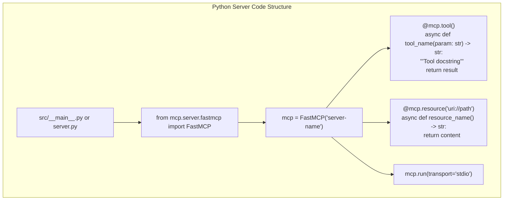

```

**File Content Retrieval:**
```python
# Reads file content at specific commit
# Supports any commit reference (SHA, branch, tag)
# Returns decoded text content
```

### Execution Methods

**uvx (recommended):**
```bash
uvx mcp-server-git
```
- Automatically creates isolated Python environment
- Downloads and installs dependencies
- No manual dependency management

**pip installation:**
```bash
pip install mcp-server-git
python -m mcp_server_git
```
- Installs into current Python environment
- Requires manual dependency management
- Useful for customization and development

### Configuration Pattern

```json
{
  "mcpServers": {
    "git": {
      "command": "uvx",
      "args": ["mcp-server-git"]
    }
  }
}
```

**Sources:** [docs/examples.mdx:17](), [docs/examples.mdx:48-55]()

## Memory Server

### Purpose

The Memory server implements a knowledge graph-based persistent memory system. It allows LLMs to store and retrieve information across sessions, maintaining context, learned facts, and relationships between entities. This enables continuity in conversations and accumulation of domain knowledge over time.

### Package Information

- **Package:** `@modelcontextprotocol/server-memory`
- **Repository:** [modelcontextprotocol/servers/tree/main/src/memory](https://github.com/modelcontextprotocol/servers/tree/main/src/memory)
- **Language:** TypeScript
- **Execution:** `npx -y @modelcontextprotocol/server-memory`

### Knowledge Graph Architecture



### Capabilities

| Tool | Purpose | Example Use |
|------|---------|------------|
| `create_entities` | Add new entities to knowledge graph | Create "User's favorite restaurants" entity |
| `create_relations` | Define relationships between entities | Link "John" -[likes]-> "Italian food" |
| `add_observations` | Record facts about entities | Note "User prefers morning meetings" |
| `search_nodes` | Semantic search across knowledge graph | Find all entities related to "travel" |
| `read_graph` | Retrieve entity and its connections | Get complete user preferences subgraph |
| `open_nodes` | Get detailed entity information | Retrieve all facts about specific entity |
| `delete_entities` | Remove entities from graph | Clear outdated information |

### Resources

The server exposes the knowledge graph as a resource:

- **Resource URI:** `memory://graph`
- **Content:** Complete knowledge graph state
- **Format:** JSON representation of nodes, edges, and observations
- **Updates:** Resource change notifications when graph is modified

### Persistence Model

**Storage location:** Knowledge graph persists to local filesystem between sessions

**Data format:** JSON-based storage enabling:
- Session continuity
- Knowledge accumulation over time
- Cross-conversation context preservation
- User preference learning

### Use Cases

- **Personal assistant memory:** Remember user preferences, habits, and context
- **Project knowledge:** Accumulate information about ongoing projects
- **Relationship tracking:** Maintain understanding of entity connections
- **Learning conversations:** Build knowledge incrementally across sessions

### Configuration Pattern

```json
{
  "mcpServers": {
    "memory": {
      "command": "npx",
      "args": ["-y", "@modelcontextprotocol/server-memory"]
    }
  }
}
```

### Execution Example

```bash
# Run directly with npx
npx -y @modelcontextprotocol/server-memory

# The server creates a local knowledge graph
# Data persists across restarts in ~/.mcp-memory/
```

**Sources:** [docs/examples.mdx:18](), [docs/examples.mdx:62-67]()

## Sequential Thinking Server

### Purpose

The Sequential Thinking server provides dynamic and reflective problem-solving capabilities through structured thought sequences. It enables LLMs to break down complex problems into explicit reasoning steps, making the problem-solving process transparent and verifiable. This server demonstrates how MCP can support cognitive patterns and meta-reasoning.

### Package Information

- **Package:** `@modelcontextprotocol/server-sequentialthinking`
- **Repository:** [modelcontextprotocol/servers/tree/main/src/sequentialthinking](https://github.com/modelcontextprotocol/servers/tree/main/src/sequentialthinking)
- **Language:** TypeScript
- **Execution:** `npx -y @modelcontextprotocol/server-sequentialthinking`

### Thinking Process Model



### Capabilities

| Tool | Purpose | Reasoning Pattern |
|------|---------|------------------|
| `sequential_thinking` | Create sequential thought chain | Break complex problem into steps |
| `add_thought` | Append reasoning step | Build on previous thoughts |
| `revise_thought` | Modify earlier reasoning | Correct logical errors |
| `branch_thinking` | Explore alternative paths | Consider multiple approaches |
| `reflect_on_thinking` | Evaluate reasoning quality | Meta-cognitive analysis |

### Thought Chain Structure

**Each thought includes:**
- **Step number:** Position in reasoning sequence
- **Content:** The reasoning or observation
- **Confidence:** Certainty level of this step
- **Dependencies:** References to previous steps
- **Branches:** Alternative reasoning paths explored

### Use Cases

- **Complex problem decomposition:** Break multi-step problems into manageable pieces
- **Transparent reasoning:** Make LLM's thought process visible and auditable
- **Error correction:** Enable revision of faulty reasoning steps
- **Exploratory thinking:** Try multiple solution approaches systematically
- **Teaching and learning:** Demonstrate structured problem-solving methodology

### Example Thinking Sequence

```json
{
  "thoughts": [
    {
      "step": 1,
      "content": "Identify the core problem: optimizing database queries",
      "confidence": 0.9
    },
    {
      "step": 2,
      "content": "Consider three approaches: indexing, query rewriting, caching",
      "confidence": 0.8,
      "dependencies": [1]
    },
    {
      "step": 3,
      "content": "Evaluate indexing impact: most direct solution",
      "confidence": 0.85,
      "dependencies": [2]
    }
  ]
}
```

### Configuration Pattern

```json
{
  "mcpServers": {
    "sequential-thinking": {
      "command": "npx",
      "args": ["-y", "@modelcontextprotocol/server-sequentialthinking"]
    }
  }
}
```

### Execution Example

```bash
# Run directly with npx
npx -y @modelcontextprotocol/server-sequentialthinking

# The server provides tools for structured reasoning
# Each thought is tracked and can be revised
```

**Sources:** [docs/examples.mdx:19]()

## Time Server

### Purpose

The Time server provides time and timezone conversion capabilities, enabling LLMs to perform temporal calculations, timezone conversions, and date/time operations accurately. This server demonstrates how MCP can provide deterministic, factual tools that complement LLM capabilities.

### Package Information

- **Package:** `@modelcontextprotocol/server-time`
- **Repository:** [modelcontextprotocol/servers/tree/main/src/time](https://github.com/modelcontextprotocol/servers/tree/main/src/time)
- **Language:** TypeScript
- **Execution:** `npx -y @modelcontextprotocol/server-time`

### Capabilities

| Tool | Purpose | Example Use |
|------|---------|------------|
| `get_current_time` | Get current time in any timezone | "What time is it in Tokyo?" |
| `convert_time` | Convert between timezones | "Convert 3pm PST to EST" |
| `add_time` | Add duration to timestamp | "What's the date 30 days from now?" |
| `subtract_time` | Calculate time difference | "How many hours until deadline?" |
| `format_time` | Format timestamp in various formats | "Show date in ISO 8601 format" |
| `parse_time` | Parse human-readable time strings | "Parse 'next Tuesday at 2pm'" |

### Timezone Support

**Comprehensive timezone database:**
- All IANA timezone identifiers (e.g., `America/New_York`, `Europe/London`)
- Common timezone abbreviations (EST, PST, GMT, UTC)
- Daylight saving time handling
- Historical timezone rule application

### Time Arithmetic Operations

**Supported duration units:**
- Seconds, minutes, hours
- Days, weeks, months, years
- Mixed units (e.g., "2 hours and 30 minutes")

**Operations handle:**
- Daylight saving time transitions
- Month boundaries (varying lengths)
- Leap years
- Timezone offset changes

### Use Cases

- **Scheduling assistance:** Calculate meeting times across timezones
- **Deadline tracking:** Compute time remaining until deadlines
- **Historical queries:** Convert dates/times from different eras
- **Calendar operations:** Add/subtract durations for planning
- **Time-sensitive operations:** Ensure accurate temporal logic

### Configuration Pattern

```json
{
  "mcpServers": {
    "time": {
      "command": "npx",
      "args": ["-y", "@modelcontextprotocol/server-time"]
    }
  }
}
```

### Execution Example

```bash
# Run directly with npx
npx -y @modelcontextprotocol/server-time

# The server provides accurate time operations
# All calculations use system timezone by default
```

**Sources:** [docs/examples.mdx:20]()

## Server Implementation Patterns

**TypeScript Server Implementation Pattern**



**Python Server Implementation Pattern (FastMCP)**



**Sources:** [docs/docs/develop/build-server.mdx:495-510](), [docs/docs/develop/build-server.mdx:144-159](), [docs/docs/develop/build-server.mdx:590-643](), [docs/docs/develop/build-server.mdx:194-212]()

## Configuration with MCP Clients

### Claude Desktop Integration

Reference servers are configured through the `claude_desktop_config.json` file. The configuration specifies the execution command, arguments, and optional environment variables for each server.

**Configuration file locations:**
- **macOS:** `~/Library/Application Support/Claude/claude_desktop_config.json`
- **Windows:** `%APPDATA%\Claude\claude_desktop_config.json`

#### Basic Configuration Structure

```json
{
  "mcpServers": {
    "server-name": {
      "command": "npx",
      "args": ["-y", "@modelcontextprotocol/server-*"],
      "env": {
        "ENV_VAR": "value"
      }
    }
  }
}
```

#### Complete Multi-Server Example

```json
{
  "mcpServers": {
    "memory": {
      "command": "npx",
      "args": ["-y", "@modelcontextprotocol/server-memory"]
    },
    "filesystem": {
      "command": "npx",
      "args": [
        "-y",
        "@modelcontextprotocol/server-filesystem",
        "/Users/username/Desktop",
        "/Users/username/Documents"
      ]
    },
    "git": {
      "command": "uvx",
      "args": ["mcp-server-git"]
    },
    "time": {
      "command": "npx",
      "args": ["-y", "@modelcontextprotocol/server-time"]
    }
  }
}
```

### Configuration Parameters

| Parameter | Required | Description | Example Values |
|-----------|----------|-------------|----------------|
| `command` | Yes | Package manager or executable path | `npx`, `uvx`, `/usr/local/bin/node` |
| `args` | Yes | Array of command-line arguments | `["-y", "@modelcontextprotocol/server-memory"]` |
| `env` | No | Environment variables (credentials, config) | `{"API_KEY": "secret"}` |

### Environment Variable Usage

Environment variables in the `env` object are passed to the server process:

```json
{
  "mcpServers": {
    "custom-server": {
      "command": "npx",
      "args": ["-y", "mcp-server-custom"],
      "env": {
        "API_KEY": "your-api-key",
        "API_ENDPOINT": "https://api.example.com",
        "LOG_LEVEL": "debug"
      }
    }
  }
}
```

**Security note:** Avoid committing configuration files with secrets to version control. Use environment variable expansion or secret management tools for production deployments.

### Path Specifications

**Absolute paths are required** for filesystem arguments:

```json
{
  "filesystem": {
    "command": "npx",
    "args": [
      "-y",
      "@modelcontextprotocol/server-filesystem",
      "/Users/username/Documents"  // Must be absolute
    ]
  }
}
```

**Platform-specific paths:**

| Platform | Path Format | Example |
|----------|-------------|---------|
| macOS/Linux | POSIX paths with forward slashes | `/Users/username/Desktop` |
| Windows | Backslashes (escaped in JSON) or forward slashes | `C:\\Users\\username\\Desktop` or `C:/Users/username/Desktop` |

**Sources:** [docs/examples.mdx:58-85](), [docs/docs/develop/connect-local-servers.mdx:82-147]()

## Package Distribution

### TypeScript Servers

TypeScript-based reference servers are distributed via npm and executed directly using `npx`:

- **Package prefix:** `@modelcontextprotocol/server-*`
- **Execution:** `npx -y @modelcontextprotocol/server-<name>`
- **Installation:** Not required (npx downloads on demand)

### Python Servers

Python-based reference servers are distributed via PyPI and executed using `uvx` or `pip`:

- **Package prefix:** `mcp-server-*`
- **Execution (uvx):** `uvx mcp-server-<name>`
- **Execution (pip):** `pip install mcp-server-<name>` then `python -m mcp_server_<name>`

**Sources:** [docs/examples.mdx:64-81]()

## Direct Execution

### TypeScript Server Execution

```bash