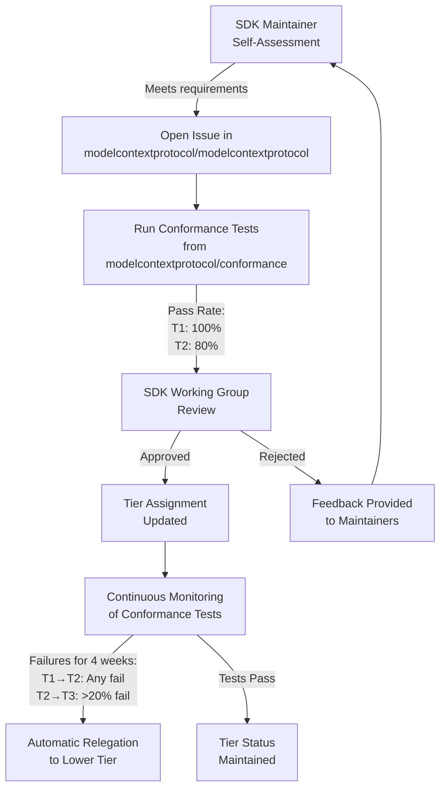
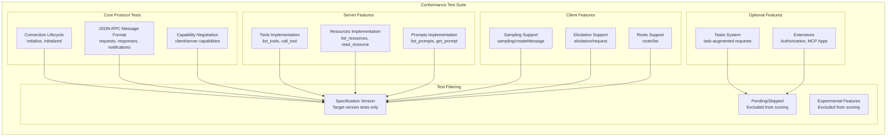
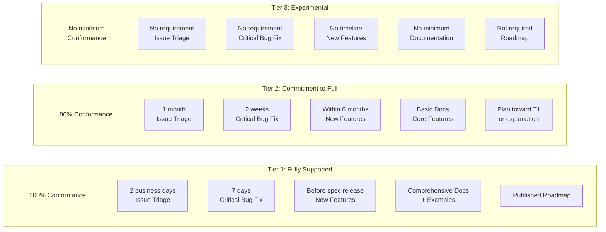
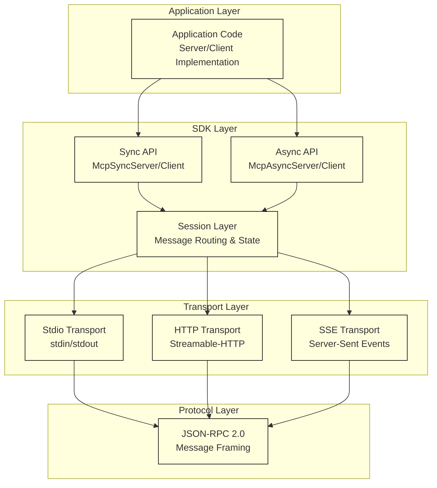
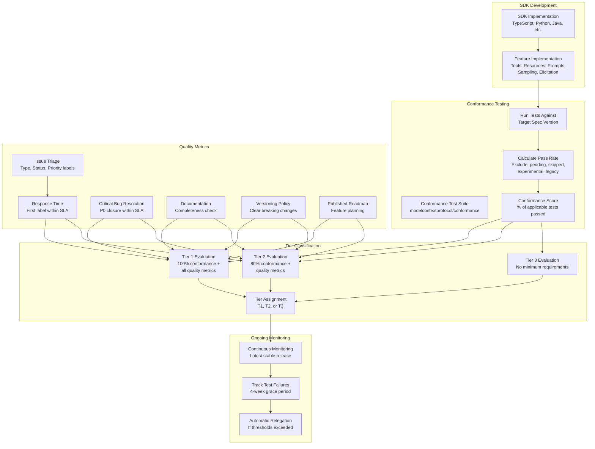

## Purpose and Scope

This document explains the MCP SDK Tier System, which classifies official SDKs into three tiers based on feature completeness, protocol support, and maintenance commitments. The tier system provides clear expectations for SDK users and maintainers, establishes advancement criteria, and defines quality metrics through conformance testing.

For information about available SDKs and their current tier assignments, see [Available SDKs and Language Support](#6.2). For details on conformance testing methodology and quality metrics, see [Conformance Testing and Quality Metrics](#6.3).

## Overview

The SDK Tier System establishes three classification levels that reflect the maturity and completeness of MCP implementations across different programming languages:

- **Tier 1**: Fully supported SDKs with complete protocol implementation
- **Tier 2**: Actively-maintained SDKs working toward full protocol support
- **Tier 3**: Experimental, partially implemented, or specialized SDKs

Experimental features (such as Tasks) and protocol extensions (such as MCP Apps) are not required for any tier.

Sources: [docs/community/sdk-tiers.mdx:19-29]()

## Tier Requirements

The following table defines the specific requirements for each tier across multiple dimensions:

| Requirement | Tier 1: Fully Supported | Tier 2: Commitment to Full Support | Tier 3: Experimental |
|---|---|---|---|
| **Conformance Tests** | 100% pass rate | 80% pass rate | No minimum |
| **New Protocol Features** | Before new spec version release, timeline agreed per release based on feature complexity | Within 6 months | No timeline commitment |
| **Issue Triage** | Within 2 business days | Within a month | No requirement |
| **Critical Bug Resolution** | Within 7 days | Within two weeks | No requirement |
| **Stable Release** | Required with clear versioning | At least one stable release | Not required |
| **Documentation** | Comprehensive with examples for all features | Basic documentation covering core features | No minimum |
| **Dependency Policy** | Published update policy | Published update policy | Not required |
| **Roadmap** | Published roadmap | Published plan toward Tier 1 or explanation for remaining Tier 2 | Not required |

### Key Definitions

**Issue Triage** means labeling and determining whether an issue is valid, not resolving the issue itself.

**Critical Bug** refers to P0 issues, which are defined as:
- Security vulnerabilities with CVSS score ≥ 7.0 (High or Critical severity)
- Core functionality failures that prevent basic MCP operations: connection establishment, message exchange, or use of core primitives (tools, resources, prompts)

**Stable Release** is a published version explicitly marked as production-ready (e.g., version `1.0.0` or higher without pre-release identifiers like `-alpha`, `-beta`, or `-rc`).

**Clear Versioning** means following idiomatic versioning patterns with documented breaking change policies, so users can understand compatibility expectations when upgrading.

**Roadmap** outlines concrete steps and work items that track implementation of required MCP specification components (non-experimental features and optional capabilities), giving users visibility into upcoming feature support.

Sources: [docs/community/sdk-tiers.mdx:31-57]()

## Conformance Testing

All SDKs are evaluated using automated conformance tests that validate protocol support against published specifications. The conformance test suite is maintained in the [modelcontextprotocol/conformance](https://github.com/modelcontextprotocol/conformance) repository.

### Conformance Scoring

SDKs receive a conformance score based on test results:

- **Tier 1**: 100% conformance required
- **Tier 2**: 80% conformance required
- **Tier 3**: No minimum requirement

Conformance scores are calculated against **applicable required tests** only:

- Tests for the specification version the SDK targets
- Excluding tests marked as pending or skipped
- Excluding tests for experimental features
- Excluding legacy backward-compatibility tests (unless the SDK claims legacy support)

Conformance testing validates that SDKs correctly implement the protocol by running standardized test scenarios and checking protocol message exchanges.

Sources: [docs/community/sdk-tiers.mdx:59-78]()

## Tier Advancement

SDK maintainers can request tier advancement by following this process:

1. **Self-assess** against tier requirements
2. **Open an issue** in the [modelcontextprotocol/modelcontextprotocol](https://github.com/modelcontextprotocol/modelcontextprotocol) repository with supporting evidence
3. **Pass automated conformance testing** with the required pass rate for the target tier
4. **Receive approval** from SDK Working Group maintainers

The SDK Working Group reviews advancement requests and makes final tier assignments.

Sources: [docs/community/sdk-tiers.mdx:80-89]()

## Tier Relegation

An SDK may be moved to a lower tier if existing conformance tests on the latest stable release fail continuously for 4 weeks:

- **Tier 1 → Tier 2**: Any conformance test fails
- **Tier 2 → Tier 3**: More than 20% of conformance tests fail

This mechanism ensures that tier assignments reflect the actual current state of SDK implementations.

Sources: [docs/community/sdk-tiers.mdx:91-97]()

## Issue Triage Labels

SDK repositories must use consistent labels to enable automated reporting on issue handling metrics. Tier calculations use these metrics to measure triage response times (time from issue creation to first label) and critical bug resolution times (time from P0 label to issue close).

### Type Labels (pick one)

| Label | Description |
|---|---|
| `bug` | Something isn't working |
| `enhancement` | Request for new feature |
| `question` | Further information requested |

Repositories using [GitHub's native issue types](https://docs.github.com/en/issues/tracking-your-work-with-issues/using-issues/managing-issue-types-in-an-organization) satisfy this requirement without needing type labels.

### Status Labels (pick one)

Use these exact label names across all repositories to enable consistent reporting and analysis:

| Label | Description |
|---|---|
| `needs confirmation` | Unclear if still relevant |
| `needs repro` | Insufficient information to reproduce |
| `ready for work` | Has enough information to start |
| `good first issue` | Good for newcomers |
| `help wanted` | Contributions welcome from those familiar with codebase |

### Priority Labels (only if actionable)

| Label | Description |
|---|---|
| `P0` | Critical: core functionality failures or high-severity security |
| `P1` | Significant bug affecting many users |
| `P2` | Moderate issues, valuable feature requests |
| `P3` | Nice to haves, rare edge cases |

**P0 (Critical)** issues are:

- **Security vulnerabilities** with CVSS score ≥ 7.0 (High or Critical severity)
- **Core functionality failures** that prevent basic MCP operations: connection establishment, message exchange, or use of core primitives (tools, resources, prompts)

Sources: [docs/community/sdk-tiers.mdx:99-142]()

## Tier System Timeline

The SDK Tier System follows a specific rollout timeline:

- **January 23, 2026**: Conformance tests available
- **February 23, 2026**: Official SDK tiering published

Between these dates, SDK maintainers can work with the Conformance Testing working group to adopt the tests and set up GitHub issue tracking with the standardized labels defined above.

Sources: [docs/community/sdk-tiers.mdx:8-17]()

## SDK Tier Advancement Workflow

The following diagram illustrates the process for SDK tier advancement and potential relegation:



Sources: [docs/community/sdk-tiers.mdx:80-97]()

## Conformance Test Categories

The conformance test suite validates SDKs across multiple protocol dimensions. Tests are organized by specification version and feature area:



Sources: [docs/community/sdk-tiers.mdx:59-78]()

## Tier Requirements by Maintenance Dimension

The following diagram maps tier requirements across different maintenance and quality dimensions:



Sources: [docs/community/sdk-tiers.mdx:31-57]()

## Integration with SDK Working Group

The SDK Tier System is managed by the SDK Working Group, which is part of the MCP governance structure. The working group:

- Reviews tier advancement requests
- Monitors conformance test results
- Manages tier relegations
- Coordinates with SDK maintainers
- Publishes official tier assignments

For information about the broader governance structure and how working groups operate, see [Governance and Community](#8).

Sources: [docs/community/sdk-tiers.mdx:80-89](), [MAINTAINERS.md]()

# Available SDKs and Language Support


## Purpose and Scope

This page catalogs the official Model Context Protocol (MCP) SDKs across multiple programming languages, their tier classifications, feature support, and documentation links. It serves as a reference for developers choosing an SDK for building MCP clients or servers.

For information about SDK tier requirements and advancement criteria, see [SDK Tier System](#6.1). For conformance testing details and quality metrics, see [Conformance Testing and Quality Metrics](#6.3).

## SDK Overview

The MCP ecosystem provides official SDKs in 10 programming languages, each implementing the complete MCP specification with language-specific idioms and best practices. All SDKs support:

- Creating MCP servers that expose tools, resources, and prompts
- Building MCP clients that connect to any MCP server
- Local (stdio) and remote (HTTP/SSE) transport protocols
- Protocol compliance with type safety

The following table summarizes all available SDKs:

| Language | Repository | Tier Status | Key Features |
|----------|-----------|-------------|--------------|
| TypeScript | [modelcontextprotocol/typescript-sdk](https://github.com/modelcontextprotocol/typescript-sdk) | Tier 1 | Full protocol support, reference implementation |
| Python | [modelcontextprotocol/python-sdk](https://github.com/modelcontextprotocol/python-sdk) | TBD | FastMCP framework, async/sync APIs |
| Java | [modelcontextprotocol/java-sdk](https://github.com/modelcontextprotocol/java-sdk) | TBD | Spring integration, reactive support |
| C# | [modelcontextprotocol/csharp-sdk](https://github.com/modelcontextprotocol/csharp-sdk) | TBD | .NET ecosystem integration |
| Go | [modelcontextprotocol/go-sdk](https://github.com/modelcontextprotocol/go-sdk) | TBD | Concurrent server support |
| Kotlin | [modelcontextprotocol/kotlin-sdk](https://github.com/modelcontextprotocol/kotlin-sdk) | TBD | JVM interoperability |
| Swift | [modelcontextprotocol/swift-sdk](https://github.com/modelcontextprotocol/swift-sdk) | TBD | Apple platform support |
| Rust | [modelcontextprotocol/rust-sdk](https://github.com/modelcontextprotocol/rust-sdk) | TBD | Memory safety, performance |
| Ruby | [modelcontextprotocol/ruby-sdk](https://github.com/modelcontextprotocol/ruby-sdk) | TBD | Rails integration |
| PHP | [modelcontextprotocol/php-sdk](https://github.com/modelcontextprotocol/php-sdk) | TBD | Web framework compatibility |

Sources: [docs/docs/sdk.mdx:1-22]()

## TypeScript SDK (Tier 1)

The TypeScript SDK serves as the reference implementation and is the most feature-complete. It provides both client and server implementations with full protocol support.

**Repository**: [modelcontextprotocol/typescript-sdk](https://github.com/modelcontextprotocol/typescript-sdk)

**Key Characteristics**:
- 100% conformance test pass rate (Tier 1 requirement)
- Synchronous and asynchronous APIs
- Comprehensive documentation with examples
- Active maintenance and rapid feature adoption
- Used as reference for other SDK implementations

**Transport Support**:
- Stdio (local process communication)
- Streamable HTTP (remote connections)
- Server-Sent Events (SSE)

**Core Classes**:
- `Server`: Implements server-side protocol operations
- `Client`: Implements client-side protocol operations
- `StdioServerTransport`: Stdio-based server transport
- `StdioClientTransport`: Stdio-based client transport

Sources: [docs/docs/sdk.mdx:10-12]()

## Python SDK

The Python SDK provides a production-ready implementation with both synchronous and asynchronous support through the FastMCP framework.

**Repository**: [modelcontextprotocol/python-sdk](https://github.com/modelcontextprotocol/python-sdk)

**Key Characteristics**:
- FastMCP framework for simplified server development
- Async/await support for concurrent operations
- Type hints for better IDE support
- Integration with popular Python frameworks

**Transport Support**:
- Stdio (local process communication)
- Streamable HTTP (remote connections)
- SSE streaming

**Core Modules**:
- `mcp.server`: Server implementation
- `mcp.client`: Client implementation
- `mcp.server.fastmcp`: FastMCP framework for rapid development

Sources: [docs/docs/sdk.mdx:13](), [docs/docs/tutorials/security/authorization.mdx:617-814]()

## Java SDK

The Java SDK provides comprehensive support for both synchronous and asynchronous programming paradigms, with optional Spring Framework integration.

**Repository**: [modelcontextprotocol/java-sdk](https://github.com/modelcontextprotocol/java-sdk)

**Key Characteristics**:
- Dual sync/async APIs via `McpSyncServer`/`McpAsyncServer` and `McpSyncClient`/`McpAsyncClient`
- Spring Framework integration (optional)
- Reactive support via Project Reactor
- Multiple transport implementations without external dependencies

**Transport Support**:
- Stdio (core module)
- Streamable HTTP (core module, Spring WebFlux, Spring WebMVC, Servlet)
- SSE (core module, Spring WebFlux, Spring WebMVC, Servlet)

**Core Classes** [docs/sdk/java/mcp-overview.mdx:1-196]():
- `McpServer`: Server factory for creating sync/async servers
- `McpClient`: Client factory for creating sync/async clients
- `StdioServerTransportProvider`: Stdio transport for servers
- `StdioClientTransport`: Stdio transport for clients
- `WebFluxStreamableServerTransportProvider`: WebFlux-based Streamable HTTP server
- `HttpClientStreamableHttpTransport`: JDK HttpClient-based Streamable HTTP client
- `WebFluxSseClientTransport`: WebFlux-based SSE client

**Dependencies**:
- Core: `io.modelcontextprotocol.sdk:mcp`
- Optional Spring WebFlux: `io.modelcontextprotocol.sdk:mcp-spring-webflux`
- Optional Spring WebMVC: `io.modelcontextprotocol.sdk:mcp-spring-webmvc`

Sources: [docs/sdk/java/mcp-overview.mdx:1-196](), [docs/sdk/java/mcp-client.mdx:1-327](), [docs/sdk/java/mcp-server.mdx:1-520]()

## C# SDK

The C# SDK provides .NET ecosystem integration with support for both .NET Framework and .NET Core.

**Repository**: [modelcontextprotocol/csharp-sdk](https://github.com/modelcontextprotocol/csharp-sdk)

**Key Characteristics**:
- Native .NET async/await support
- Integration with ASP.NET Core
- Type-safe protocol implementation

Sources: [docs/docs/sdk.mdx:15]()

## Go SDK

The Go SDK emphasizes concurrent server support and efficient resource utilization.

**Repository**: [modelcontextprotocol/go-sdk](https://github.com/modelcontextprotocol/go-sdk)

**Key Characteristics**:
- Goroutine-based concurrency
- Minimal dependencies
- High-performance server implementations

Sources: [docs/docs/sdk.mdx:16]()

## Kotlin SDK

The Kotlin SDK provides JVM interoperability with Java SDK components while leveraging Kotlin language features.

**Repository**: [modelcontextprotocol/kotlin-sdk](https://github.com/modelcontextprotocol/kotlin-sdk)

**Key Characteristics**:
- Full interoperability with Java SDK
- Coroutine support for async operations
- Idiomatic Kotlin syntax

Sources: [docs/docs/sdk.mdx:17]()

## Swift SDK

The Swift SDK enables MCP integration on Apple platforms including macOS, iOS, and other Apple operating systems.

**Repository**: [modelcontextprotocol/swift-sdk](https://github.com/modelcontextprotocol/swift-sdk)

**Key Characteristics**:
- Native Swift async/await support
- Apple platform integration
- Type-safe protocol implementation

Sources: [docs/docs/sdk.mdx:18]()

## Rust SDK

The Rust SDK prioritizes memory safety and performance with zero-cost abstractions.

**Repository**: [modelcontextprotocol/rust-sdk](https://github.com/modelcontextprotocol/rust-sdk)

**Key Characteristics**:
- Memory safety without garbage collection
- High-performance implementations
- Minimal runtime overhead

Sources: [docs/docs/sdk.mdx:19]()

## Ruby SDK

The Ruby SDK integrates with the Ruby on Rails ecosystem and popular Ruby frameworks.

**Repository**: [modelcontextprotocol/ruby-sdk](https://github.com/modelcontextprotocol/ruby-sdk)

**Key Characteristics**:
- Rails framework integration
- Idiomatic Ruby patterns
- Gem-based distribution

Sources: [docs/docs/sdk.mdx:20]()

## PHP SDK

The PHP SDK provides web framework compatibility for PHP-based applications.

**Repository**: [modelcontextprotocol/php-sdk](https://github.com/modelcontextprotocol/php-sdk)

**Key Characteristics**:
- Laravel and Symfony integration
- Composer package management
- Web server compatibility

Sources: [docs/docs/sdk.mdx:21]()

## SDK Feature Matrix

The following diagram shows the relationship between SDKs, their tier classifications, and supported protocol features:

```mermaid
graph TB
    subgraph "Tier 1: Fully Supported"
        TS["TypeScript SDK<br/>100% Conformance<br/>Reference Implementation"]
    end
    
    subgraph "Tier 2: Commitment to Full Support"
        PY["Python SDK<br/>80%+ Conformance<br/>FastMCP Framework"]
        JAVA["Java SDK<br/>80%+ Conformance<br/>Spring Integration"]
        CS["C# SDK<br/>80%+ Conformance<br/>.NET Integration"]
    end
    
    subgraph "Tier 3: Experimental/Specialized"
        GO["Go SDK<br/>Concurrent Focus"]
        KT["Kotlin SDK<br/>JVM Interop"]
        SW["Swift SDK<br/>Apple Platforms"]
        RS["Rust SDK<br/>Performance Focus"]
        RB["Ruby SDK<br/>Rails Integration"]
        PHP["PHP SDK<br/>Web Framework"]
    end
    
    subgraph "Protocol Features"
        CORE["Core: Tools, Resources,<br/>Prompts, Lifecycle"]
        OPT["Optional: Sampling,<br/>Elicitation, Roots"]
        EXT["Extensions: Tasks,<br/>MCP Apps, Authorization"]
    end
    
    TS --> CORE
    TS --> OPT
    TS --> EXT
    
    PY --> CORE
    PY --> OPT
    JAVA --> CORE
    JAVA --> OPT
    CS --> CORE
    CS --> OPT
    
    GO --> CORE
    KT --> CORE
    SW --> CORE
    RS --> CORE
    RB --> CORE
    PHP --> CORE
    
    style TS fill:none,stroke:black
    style PY fill:none,stroke:black
    style JAVA fill:none,stroke:black
    style CS fill:none,stroke:black
    style GO fill:none,stroke:black
    style KT fill:none,stroke:black
    style SW fill:none,stroke:black
    style RS fill:none,stroke:black
    style RB fill:none,stroke:black
    style PHP fill:none,stroke:black
```



**SDK Tier Classification and Feature Support**

Sources: [docs/community/sdk-tiers.mdx:1-142]()

## Transport Implementation Coverage

Different SDKs support different transport mechanisms. The following table shows transport availability:

| Transport | TypeScript | Python | Java | C# | Go | Kotlin | Swift | Rust | Ruby | PHP |
|-----------|-----------|--------|------|----|----|--------|-------|------|------|-----|
| Stdio | ✓ | ✓ | ✓ | ✓ | ✓ | ✓ | ✓ | ✓ | ✓ | ✓ |
| Streamable HTTP | ✓ | ✓ | ✓ | ✓ | ✓ | ✓ | ✓ | ✓ | ✓ | ✓ |
| SSE | ✓ | ✓ | ✓ | ✓ | ✓ | ✓ | ✓ | ✓ | ✓ | ✓ |

All SDKs support the three primary transport mechanisms defined in the MCP specification. Transport selection depends on deployment requirements: stdio for local process communication, and HTTP-based transports for remote connections.

Sources: [docs/sdk/java/mcp-overview.mdx:31-46]()

## SDK Architecture Pattern

All SDKs follow a consistent layered architecture pattern:



**Layered SDK Architecture Pattern**

All SDKs implement this consistent architecture:
- **Application Layer**: Developer code using the SDK
- **SDK Layer**: Sync/async APIs and session management
- **Transport Layer**: Protocol-specific communication mechanisms
- **Protocol Layer**: JSON-RPC 2.0 message handling

Sources: [docs/sdk/java/mcp-overview.mdx:49-77]()

## Getting Started with SDKs

Each SDK provides language-specific installation and quickstart documentation:

**TypeScript**:
```bash
npm install @modelcontextprotocol/sdk
```

**Python**:
```bash
pip install mcp
```

**Java** (Maven):
```xml
<dependency>
    <groupId>io.modelcontextprotocol.sdk</groupId>
    <artifactId>mcp</artifactId>
</dependency>
```

**Java** (Gradle):
```groovy
implementation platform("io.modelcontextprotocol.sdk:mcp")
```

For language-specific setup instructions, visit the SDK repository for your chosen language.

Sources: [docs/sdk/java/mcp-overview.mdx:78-196]()

## SDK Maintenance and Support

SDK maintenance follows the tier system defined in [SDK Tier System](#6.1):

- **Tier 1 SDKs**: 100% conformance test pass rate, critical bugs resolved within 7 days, new protocol features implemented before spec release
- **Tier 2 SDKs**: 80% conformance test pass rate, critical bugs resolved within 2 weeks, new protocol features within 6 months
- **Tier 3 SDKs**: No minimum conformance requirement, experimental or specialized implementations

Official tier assignments were published February 23, 2026. SDKs are evaluated using automated conformance tests that validate protocol support against published specifications.

Sources: [docs/community/sdk-tiers.mdx:1-142]()

## Next Steps

- **Build a Server**: See [Building MCP Servers](#5.1) for step-by-step guides in your chosen language
- **Build a Client**: See [Building MCP Clients](#5.1) for client implementation patterns
- **Understand Tiers**: See [SDK Tier System](#6.1) for tier requirements and advancement criteria
- **Test Conformance**: See [Conformance Testing and Quality Metrics](#6.3) for testing procedures

# Conformance Testing and Quality Metrics


## Purpose and Scope

This page documents the conformance testing framework used to evaluate MCP SDK implementations against the protocol specification. It covers the automated test suite, pass rate requirements for SDK tier classification, issue triage labeling standards, and quality metrics used to assess SDK maintenance and feature completeness.

For information about the SDK tier system itself and advancement/relegation criteria, see [SDK Tier System](6.1). For details on available SDKs and their current tier status, see [Available SDKs and Language Support](6.2).

## Overview

Conformance testing is the primary mechanism for objectively measuring whether an SDK correctly implements the MCP protocol. The test suite validates protocol compliance by running standardized scenarios and checking message exchanges against the specification. SDKs receive a conformance score based on test results, which directly influences tier classification and maintenance expectations.

**Key principles:**

- Tests are specification-driven and version-specific
- Scores exclude experimental features and pending tests
- Tier requirements: Tier 1 requires 100% pass rate, Tier 2 requires 80%
- Conformance testing is automated and reproducible across all SDKs

Sources: [docs/community/sdk-tiers.mdx:59-78]()

## Conformance Test Suite

### Test Repository and Structure

The conformance test suite is maintained in the `modelcontextprotocol/conformance` repository. Tests are organized by protocol version and feature area, allowing SDKs to target specific specification versions while maintaining backward compatibility validation.

**Test organization:**

- Tests grouped by specification version (e.g., `2024-11-05`, `2025-11-25`, `draft`)
- Feature-specific test suites (core protocol, tools, resources, prompts, sampling, etc.)
- Markers for test status: `pending`, `skipped`, `experimental`
- Legacy backward-compatibility tests (optional for SDKs claiming legacy support)

### Applicable Test Calculation

Conformance scores are calculated against **applicable required tests only**, excluding:

- Tests for specification versions the SDK does not target
- Tests marked as `pending` or `skipped`
- Tests for experimental features (e.g., Tasks, MCP Apps)
- Legacy backward-compatibility tests (unless the SDK explicitly claims legacy support)

This ensures fair comparison between SDKs targeting different protocol versions and feature sets.

Sources: [docs/community/sdk-tiers.mdx:69-75]()

## Pass Rate Requirements by Tier

| Tier | Conformance Requirement | Timeline for New Features | Issue Triage | Critical Bug Resolution |
|------|------------------------|--------------------------|--------------|------------------------|
| **Tier 1** | 100% pass rate | Before spec release (timeline agreed per release) | Within 2 business days | Within 7 days |
| **Tier 2** | 80% pass rate | Within 6 months | Within a month | Within two weeks |
| **Tier 3** | No minimum | No timeline commitment | No requirement | No requirement |

**Tier 1 SDKs** must pass all applicable conformance tests without exception. This ensures users can rely on complete protocol support.

**Tier 2 SDKs** may have up to 20% of applicable tests failing, allowing for gradual feature implementation while maintaining a commitment to full support.

**Tier 3 SDKs** have no conformance requirement, reflecting their experimental or specialized nature.

Sources: [docs/community/sdk-tiers.mdx:33-42]()

## Issue Triage Labels

SDK repositories must use consistent labels to enable automated reporting on issue handling metrics. These labels track triage response times and critical bug resolution times, which are measured as part of tier evaluation.

### Type Labels (pick one)

| Label | Description |
|-------|-------------|
| `bug` | Something isn't working |
| `enhancement` | Request for new feature |
| `question` | Further information requested |

Repositories using GitHub's native issue types satisfy this requirement without needing explicit type labels.

### Status Labels (pick one)

| Label | Description |
|-------|-------------|
| `needs confirmation` | Unclear if still relevant |
| `needs repro` | Insufficient information to reproduce |
| `ready for work` | Has enough information to start |
| `good first issue` | Good for newcomers |
| `help wanted` | Contributions welcome from those familiar with codebase |

These labels must use exact names across all repositories to enable consistent automated reporting.

### Priority Labels (only if actionable)

| Label | Description |
|-------|-------------|
| `P0` | Critical: core functionality failures or high-severity security |
| `P1` | Significant bug affecting many users |
| `P2` | Moderate issues, valuable feature requests |
| `P3` | Nice to haves, rare edge cases |

**P0 (Critical) issues** are defined as:

- **Security vulnerabilities** with CVSS score ≥ 7.0 (High or Critical severity)
- **Core functionality failures** that prevent basic MCP operations: connection establishment, message exchange, or use of core primitives (tools, resources, prompts)

**Issue Triage** means labeling and determining whether an issue is valid, not necessarily resolving it. Triage response time is measured from issue creation to first label application.

**Critical Bug Resolution** time is measured from P0 label application to issue closure.

Sources: [docs/community/sdk-tiers.mdx:99-142]()

## Tier Advancement Process

SDK maintainers can request tier advancement by:

1. **Self-assess** against tier requirements
2. **Open an issue** in the `modelcontextprotocol/modelcontextprotocol` repository with supporting evidence:
   - Conformance test results
   - Documentation of feature completeness
   - Issue triage metrics
   - Maintenance commitment evidence
3. **Pass automated conformance testing** against the target tier's pass rate requirement
4. **Receive approval** from SDK Working Group maintainers

The SDK Working Group reviews advancement requests and makes final tier assignments. Advancement typically occurs during scheduled review periods aligned with specification releases.

Sources: [docs/community/sdk-tiers.mdx:80-89]()

## Tier Relegation

An SDK may be automatically moved to a lower tier if existing conformance tests on the latest stable release fail continuously for 4 weeks:

- **Tier 1 → Tier 2**: Any conformance test fails
- **Tier 2 → Tier 3**: More than 20% of conformance tests fail

This automatic relegation ensures tier classifications remain accurate and users can trust tier assignments. SDK maintainers are notified when tests begin failing and have the 4-week grace period to fix issues before relegation occurs.

Sources: [docs/community/sdk-tiers.mdx:91-97]()

## Quality Metrics and Maintenance Commitments

Beyond conformance testing, tier classification considers several quality metrics that reflect maintenance commitment and user experience:

### Documentation Requirements

| Tier | Requirement |
|------|-------------|
| **Tier 1** | Comprehensive documentation with examples for all features |
| **Tier 2** | Basic documentation covering core features |
| **Tier 3** | No minimum |

Tier 1 SDKs must provide complete documentation enabling users to understand and use all protocol features. Tier 2 SDKs must document core functionality. Documentation quality is evaluated during tier advancement reviews.

### Versioning and Release Policy

| Tier | Requirement |
|------|-------------|
| **Tier 1** | Published update policy with clear versioning (e.g., semantic versioning) |
| **Tier 2** | Published update policy with clear versioning |
| **Tier 3** | Not required |

**Clear Versioning** means following idiomatic versioning patterns with documented breaking change policies, so users can understand compatibility expectations when upgrading.

**Stable Release** is a published version explicitly marked as production-ready (e.g., version `1.0.0` or higher without pre-release identifiers like `-alpha`, `-beta`, or `-rc`).

### Roadmap and Feature Planning

| Tier | Requirement |
|------|-------------|
| **Tier 1** | Published roadmap |
| **Tier 2** | Published plan toward Tier 1 or explanation for remaining Tier 2 |
| **Tier 3** | Not required |

**Roadmap** outlines concrete steps and work items that track implementation of required MCP specification components (non-experimental features and optional capabilities), giving users visibility into upcoming feature support.

Sources: [docs/community/sdk-tiers.mdx:33-57]()

## Conformance Testing Workflow

The following diagram illustrates how conformance testing integrates with the SDK tier system and quality evaluation:



Sources: [docs/community/sdk-tiers.mdx]()

## Conformance Test Execution

The following diagram shows how conformance tests are executed and how results map to SDK tier requirements:

```mermaid
graph LR
    subgraph "Test Execution"
        SDK_IMPL["SDK Under Test<br/>e.g., python-sdk,<br/>typescript-sdk"]
        TEST_RUNNER["Test Runner<br/>Execute conformance<br/>test suite"]
        SPEC_VERSION["Target Spec Version<br/>2024-11-05, 2025-11-25,<br/>draft, etc."]
    end
    
    subgraph "Test Filtering"
        ALL_TESTS["All Tests in Suite"]
        FILTER_VERSION["Filter by<br/>Spec Version"]
        FILTER_STATUS["Exclude:<br/>pending, skipped"]
        FILTER_EXPERIMENTAL["Exclude:<br/>experimental features"]
        FILTER_LEGACY["Exclude:<br/>legacy tests<br/>unless claimed"]
        APPLICABLE["Applicable Tests<br/>for Scoring"]
    end
    
    subgraph "Results"
        PASSED["Passed Tests"]
        FAILED["Failed Tests"]
        CALC_RATE["Pass Rate %<br/>= Passed / Applicable"]
    end
    
    subgraph "Tier Mapping"
        RATE_100["100% Pass Rate"]
        RATE_80_99["80-99% Pass Rate"]
        RATE_BELOW_80["Below 80% Pass Rate"]
        TIER_1["Tier 1 Eligible<br/>+ quality metrics"]
        TIER_2["Tier 2 Eligible<br/>+ quality metrics"]
        TIER_3["Tier 3<br/>No minimum"]
    end
    
    SDK_IMPL --> TEST_RUNNER
    SPEC_VERSION --> TEST_RUNNER
    TEST_RUNNER --> ALL_TESTS
    
    ALL_TESTS --> FILTER_VERSION
    FILTER_VERSION --> FILTER_STATUS
    FILTER_STATUS --> FILTER_EXPERIMENTAL
    FILTER_EXPERIMENTAL --> FILTER_LEGACY
    FILTER_LEGACY --> APPLICABLE
    
    APPLICABLE --> PASSED
    APPLICABLE --> FAILED
    
    PASSED --> CALC_RATE
    FAILED --> CALC_RATE
    
    CALC_RATE --> RATE_100
    CALC_RATE --> RATE_80_99
    CALC_RATE --> RATE_BELOW_80
    
    RATE_100 --> TIER_1
    RATE_80_99 --> TIER_2
    RATE_BELOW_80 --> TIER_3
```



Sources: [docs/community/sdk-tiers.mdx:59-78]()

## Integration with Build System

Conformance testing is integrated into the specification repository's build system. The `npm run check` command includes schema validation and can be extended to run conformance tests:

- `npm run check:schema` - Validates schema generation and examples
- `npm run check:docs` - Validates documentation formatting and links
- `npm run check:seps` - Validates SEP documents

SDK repositories should integrate conformance testing into their CI/CD pipelines to continuously validate protocol compliance.

Sources: [package.json:32-42]()

## Reporting and Transparency

Conformance test results are published to enable transparency:

- **Public test results** for each SDK and specification version
- **Tier assignments** published with supporting evidence
- **Failure tracking** for SDKs approaching relegation thresholds
- **Metrics dashboards** showing issue triage and resolution times

This transparency allows users to make informed decisions about SDK selection and helps maintainers understand where improvements are needed.

## Best Practices for SDK Maintainers

### Achieving Tier 1 Status

1. **Implement all non-experimental features** from the target specification version
2. **Achieve 100% conformance** on applicable tests
3. **Establish clear issue triage process** with consistent labeling
4. **Maintain SLA compliance** for response times and critical bug resolution
5. **Publish comprehensive documentation** with examples for all features
6. **Adopt semantic versioning** with clear breaking change policies
7. **Publish a roadmap** showing planned feature implementations
8. **Create stable releases** (e.g., `1.0.0` or higher)

### Maintaining Tier Status

1. **Monitor conformance test results** continuously
2. **Respond to test failures** within the 4-week grace period
3. **Maintain issue triage SLAs** consistently
4. **Update documentation** when features change
5. **Communicate roadmap changes** to users
6. **Plan for new specification versions** before release

### Handling Test Failures

When conformance tests fail:

1. **Identify root cause** - Protocol implementation bug or test issue?
2. **Create issue** with `P0` label if core functionality affected
3. **Develop fix** and validate against test suite
4. **Update documentation** if behavior changed
5. **Release update** and verify test passage

Sources: [docs/community/sdk-tiers.mdx]()

## Related Resources

- [SDK Tier System](6.1) - Detailed tier requirements and advancement process
- [Available SDKs and Language Support](6.2) - Current SDK catalog and tier status
- [Protocol Specification](2) - Complete MCP protocol documentation
- [Contributing to MCP](7.1) - How to contribute to the specification repository

# Development Guide


This guide introduces developers to contributing to the Model Context Protocol specification repository. It covers setting up your development environment, understanding the build system, and navigating the contribution workflows.

For detailed information about specific topics:
- Contribution policies and code review process: see [Contributing Guidelines](#6.1)
- Proposing protocol changes via SEPs: see [Specification Enhancement Process](#6.2)
- Working with TypeScript schemas: see [Schema Development Workflow](#6.3)
- Build scripts and CI pipelines: see [Build System and CI/CD](#6.4)
- Documentation infrastructure: see [Documentation System](#6.5)

For governance and community structure, see [Governance and Community](#7).

## Repository Structure

The specification repository is organized into distinct subsystems, each with specific responsibilities:

```mermaid
graph TB
    subgraph "Protocol Definition"
        SchemaDir["schema/<br/>TypeScript definitions<br/>5 versions"]
        DraftSchema["schema/draft/schema.ts<br/>Active development"]
        StableSchema["schema/2025-11-25/schema.ts<br/>Current stable"]
    end
    
    subgraph "Generated Artifacts"
        JSONSchemas["schema/*/schema.json<br/>Machine-readable"]
        MDXSchemas["docs/specification/*/schema.mdx<br/>Human-readable API docs"]
    end
    
    subgraph "Documentation"
        DocsDir["docs/<br/>Mintlify MDX files"]
        DocsJSON["docs.json<br/>Site configuration"]
        StyleCSS["docs/style.css<br/>Custom styling"]
    end
    
    subgraph "Blog"
        BlogContent["blog/content/<br/>Hugo markdown posts"]
        HugoConfig["blog/hugo.toml<br/>Hugo configuration"]
    end
    
    subgraph "SEPs"
        SEPsDir["seps/<br/>Enhancement proposals"]
        SEPTemplate["seps/TEMPLATE.md"]
    end
    
    subgraph "Build System"
        PackageJSON["package.json<br/>npm scripts"]
        GenScript["scripts/generate-schemas.ts<br/>Schema generation"]
        CIMain[".github/workflows/main.yml<br/>Schema validation"]
        CIMd[".github/workflows/markdown-format.yml<br/>Doc validation"]
    end
    
    DraftSchema --> GenScript
    StableSchema --> GenScript
    GenScript --> JSONSchemas
    GenScript --> MDXSchemas
    
    PackageJSON --> GenScript
    PackageJSON --> DocsDir
    PackageJSON --> BlogContent
    
    CIMain --> GenScript
    CIMd --> DocsDir
    CIMd --> SEPsDir
```



**Repository Layout:**

| Directory | Purpose | Generated? |
|-----------|---------|------------|
| `schema/*/` | TypeScript protocol definitions (5 versions) | No |
| `schema/*/schema.json` | JSON Schema output for validation | Yes |
| `docs/specification/*/schema.mdx` | API reference documentation | Yes |
| `docs/` | Mintlify documentation pages (MDX) | No |
| `blog/` | Hugo blog with PaperMod theme | No |
| `seps/` | Specification Enhancement Proposals | No |
| `scripts/` | Build automation scripts | No |
| `.github/workflows/` | CI/CD pipeline definitions | No |

Sources: [CONTRIBUTING.md:1-185](), [package.json:1-57](), [scripts/generate-schemas.ts:1-149]()

## Development Environment Setup

### Prerequisites

The following software is required:

- **Node.js 20 or above** (specified in [package.json:11-12]())
- **npm** (included with Node.js)
- **nvm** (optional, for managing Node versions)
- **TypeScript** (dev dependency)
- **Mintlify CLI** (optional, for local documentation preview)
- **Hugo** (optional, for blog development)

### Installation

```bash