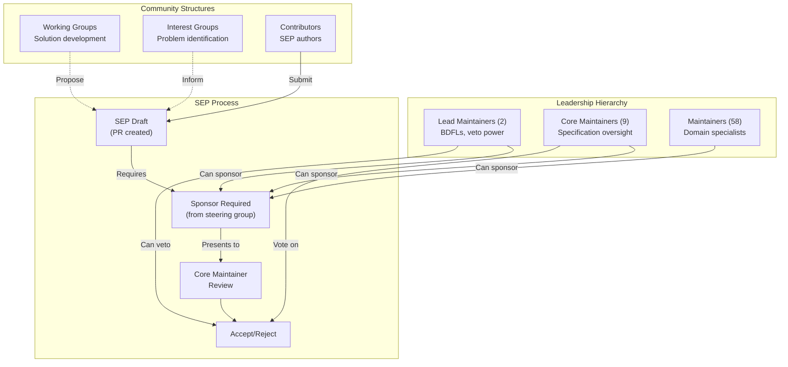

- **Status**: Draft | In-Review | Accepted | Rejected | Withdrawn | Final | Superseded | Dormant
- **Type**: Standards Track | Informational | Process
- **Created**: YYYY-MM-DD
- **Author(s)**: Name <email> (@github-username)
- **Sponsor**: @github-username (or "None" if seeking sponsor)
- **PR**: https://github.com/modelcontextprotocol/specification/pull/{NUMBER}
```

### Critical Section: Motivation

SEP submissions without sufficient motivation may be rejected outright. This section must clearly explain why the existing protocol specification is inadequate and what problem the SEP solves.

Sources: [docs/community/sep-guidelines.mdx:68-80](), [seps/TEMPLATE.md:1-85]()

## Relationship to Governance

The SEP process integrates tightly with MCP's governance structure:



**SEP Process Within Governance Structure**

### Steering Group and Sponsorship

The **MCP steering group** consists of:
- Lead Maintainers (2)
- Core Maintainers (9)  
- Maintainers (58)

Only members of the steering group can act as SEP sponsors. See [MAINTAINERS.md](https://github.com/modelcontextprotocol/modelcontextprotocol/blob/main/MAINTAINERS.md) for the complete list.

### Working and Interest Groups

While participation in Working Groups (WGs) or Interest Groups (IGs) is not required to submit a SEP, building consensus within these groups can:
- Justify the formation of a WG
- Strengthen a SEP's chances of success
- Ensure proposals align with community needs

Many successful SEPs originate from IG discussions identifying problems, then WG collaboration developing solutions.

Sources: [docs/community/governance.mdx:20-28](), [docs/community/working-interest-groups.mdx:6-13](), [MAINTAINERS.md:1-180]()

## Recent SEP Examples

The November 2025 (2025-11-25) specification release included several major SEPs that demonstrate the process in action:

| SEP | Title | Type | Impact |
|-----|-------|------|--------|
| [1850](https://github.com/modelcontextprotocol/specification/pull/1850) | PR-Based SEP Workflow | Process | Changed how SEPs are submitted (this document) |
| [1686](https://github.com/modelcontextprotocol/modelcontextprotocol/issues/1686) | Task-based Workflows | Standards Track | Added async operation tracking to protocol |
| [991](https://github.com/modelcontextprotocol/modelcontextprotocol/pull/1296) | Client ID Metadata Documents | Standards Track | Simplified authorization via URL-based client registration |
| [1577](https://github.com/modelcontextprotocol/modelcontextprotocol/issues/1577) | Sampling with Tools | Standards Track | Enabled agentic server patterns |
| [1024](https://github.com/modelcontextprotocol/modelcontextprotocol/issues/1024) | Client Security Requirements | Standards Track | Security requirements for local server installation |
| [1046](https://github.com/modelcontextprotocol/modelcontextprotocol/issues/1046) | OAuth Client Credentials | Standards Track | Machine-to-machine authorization extension |

These SEPs progressed from community identification of needs → Working Group development → formal proposal → Core Maintainer acceptance → implementation → final status.

Sources: [blog/content/posts/2025-11-25-first-mcp-anniversary.md:134-210]()

## Communication Channels

Discuss SEPs and get help through:

- **Discord**: [MCP Contributor Discord](https://discord.gg/6CSzBmMkjX) - Real-time discussion in Working/Interest Group channels
- **GitHub Discussions**: [modelcontextprotocol/modelcontextprotocol](https://github.com/modelcontextprotocol/modelcontextprotocol/discussions) - Structured, long-form discussion
- **GitHub Issues**: For actionable tasks and feature tracking
- **SEP PRs**: All formal SEP discussion happens in pull request comments

Do not post security issues publicly. Follow [SECURITY.md](https://github.com/modelcontextprotocol/modelcontextprotocol/blob/main/SECURITY.md) for responsible disclosure.

Sources: [docs/community/communication.mdx:8-79]()

## Legacy and Migration

Prior to November 2025 (SEP-1850), SEPs were tracked as GitHub Issues. Existing issue-based SEPs remain valid with their original issue numbers. Future SEPs must use the PR-based workflow described in this document.

To migrate an existing issue-based SEP to the new process:
1. Create a markdown file using the SEP template starting with `0000-`
2. Copy and adapt proposal content
3. Submit a pull request to `seps/`
4. Rename file using the new PR number
5. Close the original issue with a link to the new PR

The new PR gets a fresh SEP number. Historical context from the issue should be summarized in the new SEP or referenced via links.

Sources: [blog/content/posts/2025-11-28-sep-process-update.md:53-63](), [seps/1850-pr-based-sep-workflow.md:118-170]()