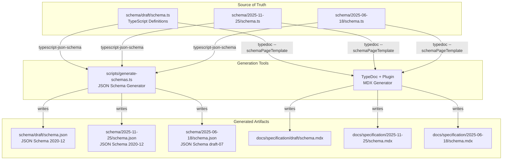
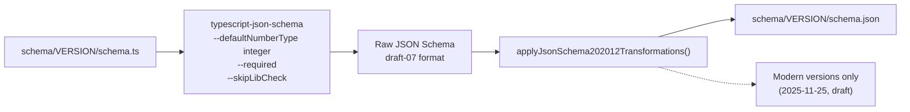
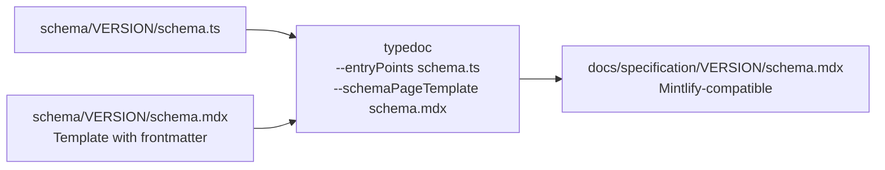
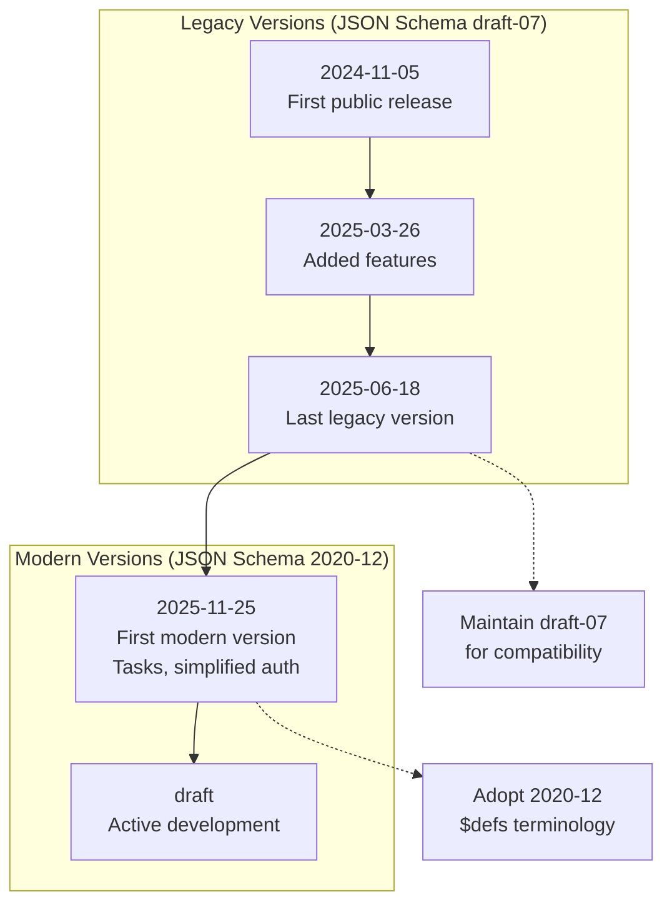
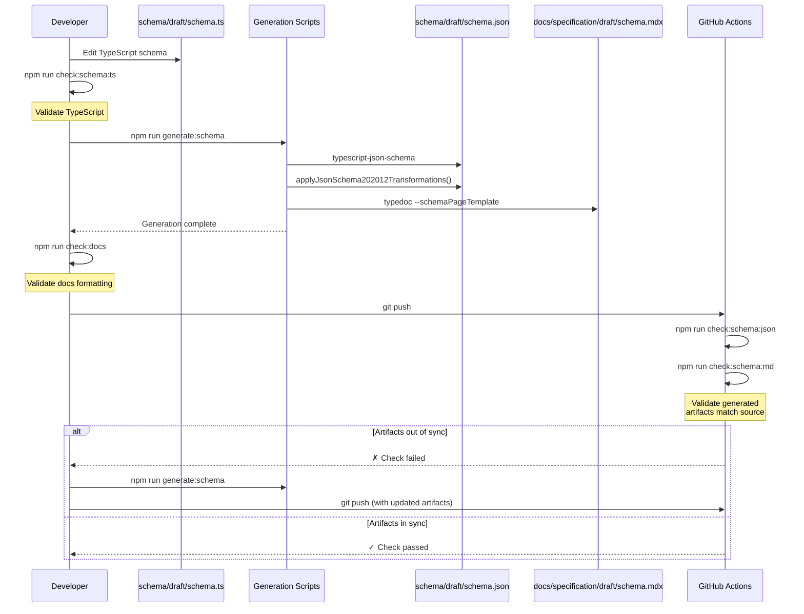

This document covers the technical workflow for developing and maintaining the MCP protocol schemas. It explains how to edit TypeScript schema definitions, generate derived artifacts (JSON Schema and MDX documentation), and validate changes through CI/CD.

For information about the protocol specification content itself, see [Schema System and Message Types](#2.2). For build system details beyond schema generation, see [Build System and CI/CD](#6.4).

## Purpose and Scope

The schema development workflow manages the transformation of canonical TypeScript schemas into multiple generated artifacts:

- **TypeScript schemas** (`schema/*/schema.ts`) are the single source of truth
- **JSON schemas** (`schema/*/schema.json`) are generated for machine consumption and tooling
- **MDX documentation** (`docs/specification/*/schema.mdx`) is generated for human-readable API reference

This document covers editing TypeScript schemas, running generation tools, understanding version-specific transformations, and validating that generated artifacts remain synchronized with the source.

## Schema System Architecture



**Title: Schema Generation Pipeline Architecture**

The schema system consists of versioned TypeScript source files that are transformed through two parallel generation pipelines. The `typescript-json-schema` tool extracts JSON Schema definitions for validation and tooling, while TypeDoc with a custom plugin generates human-readable MDX documentation for the website.

Sources: [scripts/generate-schemas.ts:1-149](), [package.json:33-35]()

## Editing TypeScript Schemas

### Source Files Location

TypeScript schemas are located in version-specific directories:

```
schema/
├── draft/schema.ts           # Active development version
├── 2025-11-25/schema.ts      # Current stable (modern)
├── 2025-06-18/schema.ts      # Previous version (legacy)
├── 2025-03-26/schema.ts      # Earlier version (legacy)
└── 2024-11-05/schema.ts      # Earlier version (legacy)
```

**Active development occurs in `schema/draft/schema.ts`**. When a new protocol version is released, the draft schema is copied to a dated directory and frozen.

Sources: [scripts/generate-schemas.ts:10-17]()

### TypeScript Schema Structure

The TypeScript schema defines the protocol using standard TypeScript interfaces and type aliases:

```typescript
// Example from schema/draft/schema.ts
export interface JSONRPCRequest extends Request {
  jsonrpc: typeof JSONRPC_VERSION;
  id: RequestId;
}

export interface InitializeRequest extends JSONRPCRequest {
  method: "initialize";
  params: InitializeRequestParams;
}
```

Key patterns used in the schema:

| Pattern | Purpose | Example |
|---------|---------|---------|
| `interface` | Define protocol message structures | `InitializeRequest`, `InitializeResult` |
| `type` unions | Define discriminated unions | `JSONRPCMessage`, `ContentBlock` |
| `const` types | Define literal values | `method: "initialize"` |
| TSDoc comments | Document types for generation | `/** Description */` |
| `@category` tags | Organize generated docs | `@category "initialize"` |

Sources: [schema/draft/schema.ts:1-150](), [schema/draft/schema.ts:242-270]()

### Validation During Editing

To validate TypeScript syntax and type correctness while editing:

```bash
npm run check:schema:ts
```

This command runs three checks:

1. **TypeScript compilation** (`tsc --noEmit`) - Validates type correctness without generating output
2. **ESLint** - Enforces code quality rules
3. **Prettier** - Validates code formatting

Sources: [package.json:29]()

## Generation Pipeline

### JSON Schema Generation



**Title: JSON Schema Generation Process**

The `typescript-json-schema` tool extracts JSON Schema definitions from TypeScript interfaces. For modern schema versions, the output is transformed from JSON Schema draft-07 to 2020-12 format.

#### Transformation Details

For modern schemas (`2025-11-25` and `draft`), three transformations are applied:

| Transformation | Draft-07 Format | 2020-12 Format |
|----------------|-----------------|----------------|
| Schema URI | `http://json-schema.org/draft-07/schema#` | `https://json-schema.org/draft/2020-12/schema` |
| Definitions key | `"definitions":` | `"$defs":` |
| Definition references | `#/definitions/` | `#/$defs/` |

Legacy schemas (`2024-11-05`, `2025-03-26`, `2025-06-18`) maintain draft-07 format for backward compatibility.

Sources: [scripts/generate-schemas.ts:10-14](), [scripts/generate-schemas.ts:23-47]()

### MDX Documentation Generation



**Title: MDX Documentation Generation Process**

TypeDoc processes TypeScript source files and uses a custom template (`schema.mdx`) to generate Mintlify-compatible MDX documentation. The template includes frontmatter and structure, while TypeDoc populates it with type information and descriptions.

#### Template Structure

Each version directory contains a `schema.mdx` template:

```
schema/draft/schema.mdx       # Template for draft version
schema/2025-11-25/schema.mdx  # Template for 2025-11-25 version
```

The generated output is written to:

```
docs/specification/draft/schema.mdx
docs/specification/2025-11-25/schema.mdx
```

Sources: [package.json:35]()

### Running Generation Commands

| Command | Purpose | When to Use |
|---------|---------|-------------|
| `npm run generate:schema` | Generate both JSON and MDX | After editing TypeScript schemas |
| `npm run generate:schema:json` | Generate JSON schemas only | Testing JSON transformations |
| `npm run generate:schema:md` | Generate MDX documentation only | Testing documentation output |
| `npm run check:schema` | Validate without generating | Pre-commit validation |

The `generate:schema` command runs both JSON and MDX generation in parallel using shell background jobs (`&` and `wait`).

Sources: [package.json:33-35]()

## Version Management

### Legacy vs Modern Schemas



**Title: Schema Version Evolution and JSON Schema Dialect Split**

The schema version split occurred at `2025-11-25` when the protocol adopted JSON Schema 2020-12. Earlier versions remain frozen in draft-07 format to preserve backward compatibility for existing implementations.

### Version-Specific Constants

The `generate-schemas.ts` script maintains two arrays defining which transformation pipeline to use:

```typescript
// Legacy schemas remain as JSON Schema draft-07
const LEGACY_SCHEMAS = ['2024-11-05', '2025-03-26', '2025-06-18'];

// Modern schemas use JSON Schema 2020-12
const MODERN_SCHEMAS = ['2025-11-25', 'draft'];
```

Sources: [scripts/generate-schemas.ts:10-14]()

### Adding a New Version

When releasing a new protocol version:

1. **Copy draft schema to dated directory**:
   ```bash
   cp -r schema/draft schema/YYYY-MM-DD
   ```

2. **Update version constants** in `scripts/generate-schemas.ts`:
   ```typescript
   const MODERN_SCHEMAS = ['2025-11-25', 'YYYY-MM-DD', 'draft'];
   ```

3. **Generate artifacts for new version**:
   ```bash
   npm run generate:schema
   ```

4. **Update documentation navigation** in `docs.json` to include the new version

Sources: [scripts/generate-schemas.ts:10-17]()

## Development Workflow

### Complete Development Cycle



**Title: Complete Schema Development and Validation Workflow**

The workflow ensures that all generated artifacts remain synchronized with the TypeScript source. CI validation catches any cases where generated files were not committed after source changes.

### Recommended Development Steps

1. **Make changes to TypeScript schema**:
   ```bash
   # Edit schema/draft/schema.ts
   vim schema/draft/schema.ts
   ```

2. **Validate TypeScript**:
   ```bash
   npm run check:schema:ts
   ```

3. **Generate artifacts**:
   ```bash
   npm run generate:schema
   ```

4. **Validate all changes**:
   ```bash
   npm run check:docs
   npm run format
   ```

5. **Or run everything at once**:
   ```bash
   npm run prep:changes
   ```

The `prep:changes` command is a convenience script that runs the complete validation and generation pipeline.

Sources: [package.json:36]()

## CI/CD Validation

### GitHub Actions Workflow

The CI pipeline validates schema consistency through three checks:

```yaml