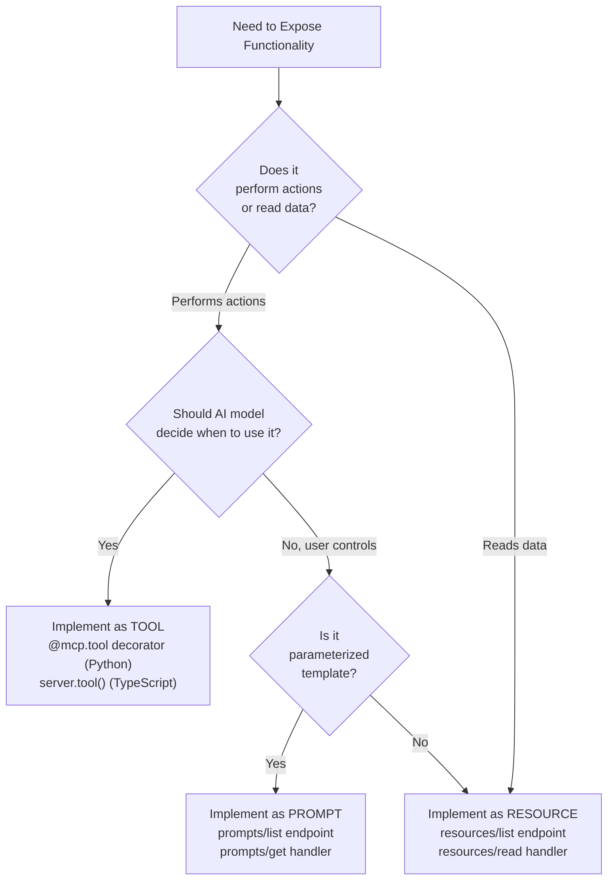
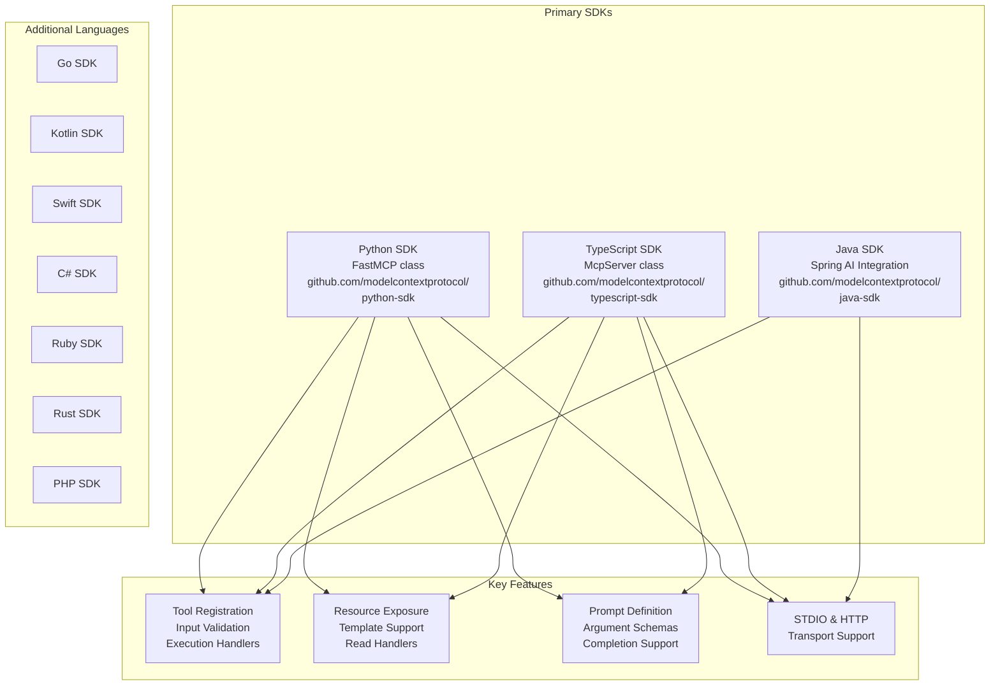
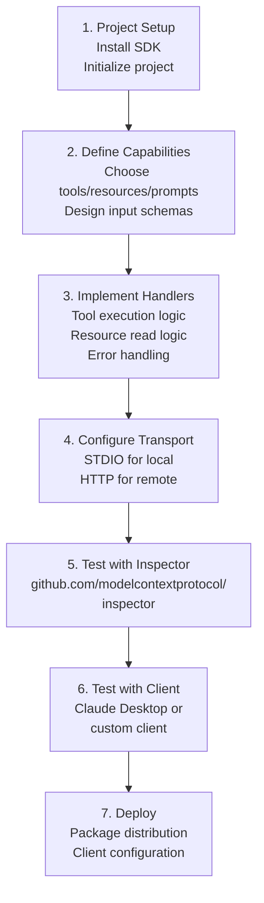
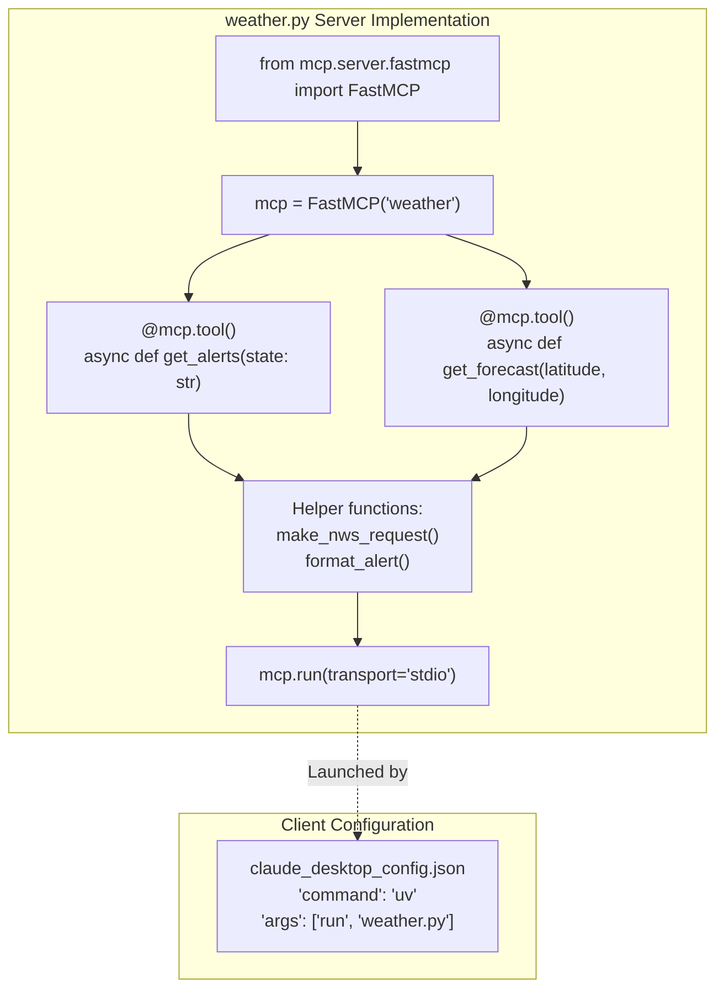
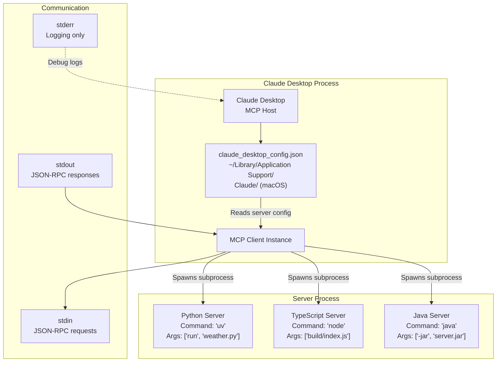

MCP servers are lightweight, domain-focused programs that expose specific capabilities—tools, resources, and prompts—to AI applications through a standardized protocol. This page introduces the server development ecosystem, the philosophy of composable servers, and guides you to detailed implementation resources.

The MCP server ecosystem has grown explosively, with approximately 2,000 servers in the [MCP Registry](https://mcp.run) as of November 2025—a 407% growth since September 2024. This includes official integrations from companies like Notion, Stripe, GitHub, Hugging Face, and Postman, alongside thousands of community-contributed servers.

For client-side development, see [Build an MCP Client](#4).

## Server Development Philosophy

MCP servers follow a **domain-focused, composable** design philosophy:

**Domain-Focused:** Each server specializes in a specific domain or service rather than attempting to provide general-purpose functionality. For example:
- A weather server focuses solely on weather data and forecasts
- A filesystem server provides file operations within specified boundaries
- A GitHub server handles repository interactions

**Composable:** Servers are designed to work together, allowing AI applications to combine multiple specialized servers to accomplish complex tasks. A travel planning application might connect to:
- A calendar server (availability)
- A flights server (booking)
- A weather server (destination forecasts)
- An email server (confirmations)

This approach reduces complexity, improves maintainability, and enables rapid ecosystem growth through specialization.

## The MCP Server Ecosystem

The server ecosystem consists of three tiers, each serving different purposes:

**Server Ecosystem Structure:**

```mermaid
graph TB
    subgraph "Reference Servers"
        REF_EVERYTHING["Everything Server<br/>modelcontextprotocol/servers<br/>/src/everything"]
        REF_FILESYSTEM["Filesystem Server<br/>modelcontextprotocol/servers<br/>/src/filesystem"]
        REF_GIT["Git Server<br/>modelcontextprotocol/servers<br/>/src/git"]
        REF_MEMORY["Memory Server<br/>modelcontextprotocol/servers<br/>/src/memory"]
    end
    
    subgraph "Official Integrations"
        OFF_NOTION["Notion MCP Server<br/>makenotion/notion-mcp-server"]
        OFF_STRIPE["Stripe MCP Server<br/>stripe.com/mcp"]
        OFF_GITHUB["GitHub MCP Server<br/>github/github-mcp-server"]
        OFF_HF["Hugging Face MCP<br/>huggingface/hf-mcp-server"]
    end
    
    subgraph "Community Servers"
        COMM_COUNT["~2000 Servers<br/>MCP Registry<br/>407% growth since Sept 2024"]
        COMM_EXAMPLES["Examples:<br/>Blender, Databases,<br/>APIs, Custom Tools"]
    end
    
    subgraph "SDK Layer"
        SDK_PYTHON["Python SDK<br/>FastMCP class<br/>mcp.server module"]
        SDK_TS["TypeScript SDK<br/>McpServer class<br/>@modelcontextprotocol/sdk"]
        SDK_JAVA["Java SDK<br/>Spring AI MCP<br/>@Tool annotations"]
        SDK_OTHER["Go, Kotlin, Swift<br/>C#, Ruby, Rust, PHP"]
    end
    
    REF_EVERYTHING --> SDK_PYTHON
    REF_FILESYSTEM --> SDK_TS
    REF_GIT --> SDK_TS
    REF_MEMORY --> SDK_TS
    
    OFF_NOTION --> SDK_TS
    OFF_STRIPE --> SDK_TS
    OFF_GITHUB --> SDK_TS
    OFF_HF --> SDK_PYTHON
    
    COMM_COUNT --> SDK_PYTHON
    COMM_COUNT --> SDK_TS
    COMM_COUNT --> SDK_JAVA
    COMM_COUNT --> SDK_OTHER
```



**Sources:** [blog/content/posts/2025-11-25-first-mcp-anniversary.md:18-28](), [docs/examples.mdx:8-34]()

### Reference Servers

Official examples demonstrating protocol features and best practices. These servers serve as learning resources and SDK usage examples:

| Server | Purpose | Location |
|--------|---------|----------|
| **Everything** | Test server with all features (tools, resources, prompts) | `modelcontextprotocol/servers/src/everything` |
| **Fetch** | Web content retrieval and markdown conversion | `modelcontextprotocol/servers/src/fetch` |
| **Filesystem** | Secure file operations with access controls | `modelcontextprotocol/servers/src/filesystem` |
| **Git** | Repository management and history | `modelcontextprotocol/servers/src/git` |
| **Memory** | Knowledge graph-based persistent storage | `modelcontextprotocol/servers/src/memory` |
| **Sequential Thinking** | Problem-solving through thought sequences | `modelcontextprotocol/servers/src/sequentialthinking` |
| **Time** | Timezone and time conversion utilities | `modelcontextprotocol/servers/src/time` |

See [Reference Server Implementations](#5.2) for detailed documentation.

**Sources:** [docs/examples.mdx:10-21]()

### Official Integrations

Company-maintained servers for their platforms and services:

- **Notion** - Note and workspace management (`makenotion/notion-mcp-server`)
- **Stripe** - Payment workflow automation (`docs.stripe.com/mcp`)
- **GitHub** - Repository operations and engineering automation (`github/github-mcp-server`)
- **Hugging Face** - Model management and dataset search (`huggingface/hf-mcp-server`)
- **Postman** - API testing workflows (`postmanlabs/postman-mcp-server`)

**Sources:** [blog/content/posts/2025-11-25-first-mcp-anniversary.md:20-26]()

### Community Servers

The community has built approximately 2,000 servers indexed in the [MCP Registry](https://mcp.run), covering diverse use cases:

- Database integrations (PostgreSQL, SQLite, MySQL, MongoDB)
- Cloud platforms (AWS, Azure, Google Cloud)
- Development tools (Docker, Kubernetes, CI/CD)
- Communication (Slack, Discord, Teams)
- Productivity (Google Drive, Dropbox, calendars)
- Specialized tools (Blender 3D, data analysis, monitoring)

Registry growth: **407% increase** since September 2024.

See [Server Registry and Community Servers](#5.4) for discovery and contribution guidelines.

**Sources:** [blog/content/posts/2025-11-25-first-mcp-anniversary.md:28]()

## Server Capabilities Overview

MCP servers expose three types of capabilities:

| Capability | Control | Description | Example Use Case |
|------------|---------|-------------|------------------|
| **Tools** | Model | Executable functions the AI can invoke | `search_flights`, `create_calendar_event` |
| **Resources** | Application | Read-only data sources for context | `file:///docs/api.md`, `calendar://events/2024` |
| **Prompts** | User | Reusable interaction templates | `plan_vacation`, `summarize_meeting` |

**Capability Decision Flow:**



For detailed capability implementation, see [Server Capabilities Deep Dive](#5.3).

**Sources:** [docs/docs/learn/server-concepts.mdx:10-19]()

## Building Your First Server

### SDK Selection

MCP provides official SDKs in multiple languages, all offering full protocol support:



Choose based on your preferred language and deployment environment. See [Building MCP Servers](#5.1) for language-specific quickstarts.

**Sources:** [docs/docs/sdk.mdx:9-72]()

### Development Workflow

**Typical server development process:**



**Example: Weather Server Structure (Python)**



See [Building MCP Servers](#5.1) for complete quickstart tutorials including:
- Python FastMCP quickstart
- TypeScript SDK quickstart  
- Java Spring AI quickstart

**Sources:** [docs/docs/develop/build-server.mdx:1-262]()

## Server Execution and Deployment

### Local Deployment (STDIO Transport)

Most MCP servers use STDIO transport for local execution. The MCP host (e.g., Claude Desktop) launches the server as a subprocess and communicates via stdin/stdout.

**Server Launch Configuration:**



**Configuration Example (`claude_desktop_config.json`):**

```json
{
  "mcpServers": {
    "weather": {
      "command": "uv",
      "args": ["--directory", "/absolute/path/to/weather", "run", "weather.py"]
    },
    "filesystem": {
      "command": "npx",
      "args": ["-y", "@modelcontextprotocol/server-filesystem", "/Users/username/Documents"]
    }
  }
}
```

**Critical Requirement:** STDIO servers must **never write to stdout** except for JSON-RPC messages. All logging must use stderr.

**Sources:** [docs/docs/develop/build-server.mdx:44-95](), [docs/docs/develop/build-server.mdx:277-353]()

### Remote Deployment (HTTP Transport)

Remote servers use HTTP POST for requests and Server-Sent Events (SSE) for streaming. They require OAuth 2.1 authorization for security.

See [Connect to Remote MCP Servers](#5) for HTTP server configuration and authorization setup.

**Sources:** [docs/docs/develop/connect-remote-servers.mdx:1-10]()

### Package Distribution

**NPM (TypeScript):**

```bash
npm publish @modelcontextprotocol/server-name
# Users install via:
npx -y @modelcontextprotocol/server-name
```

**PyPI (Python):**

```bash