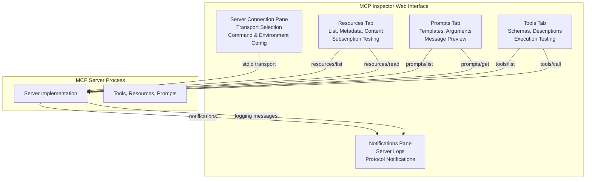
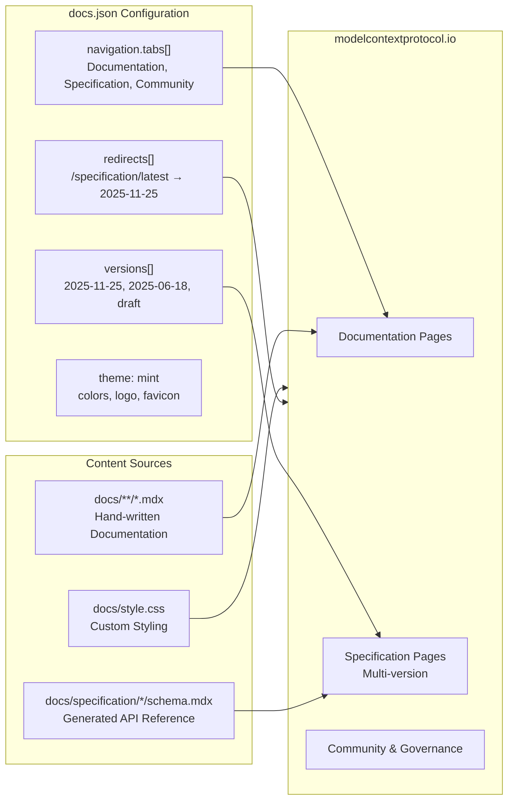
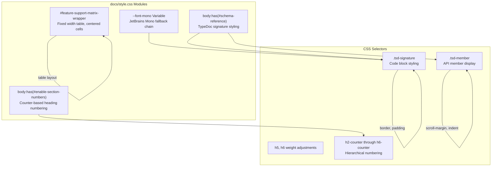
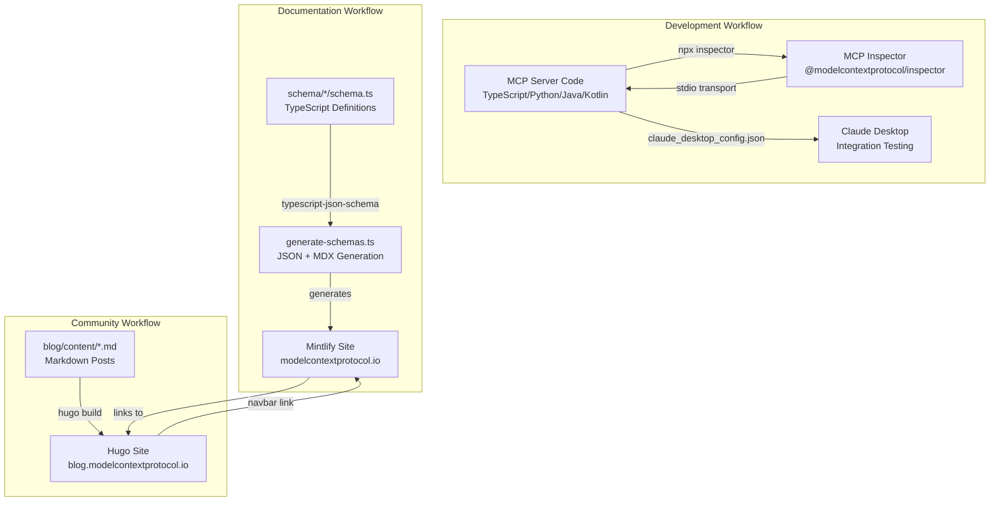
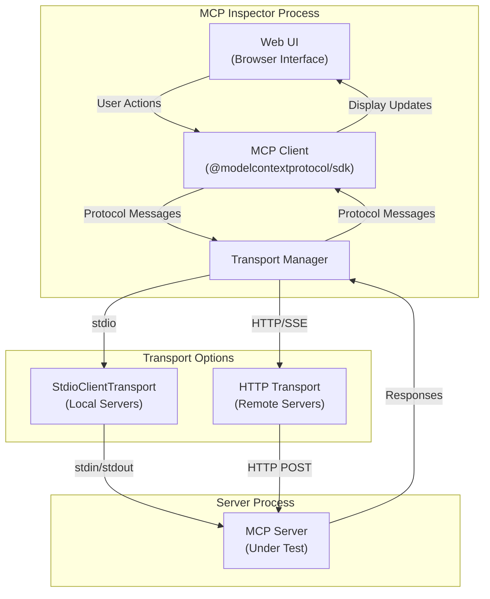
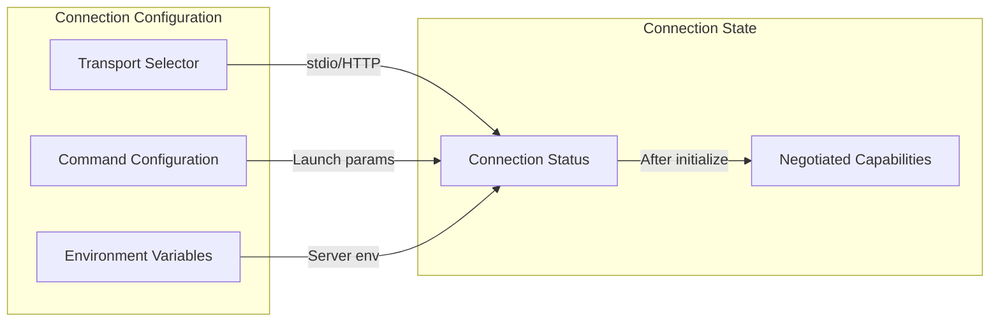
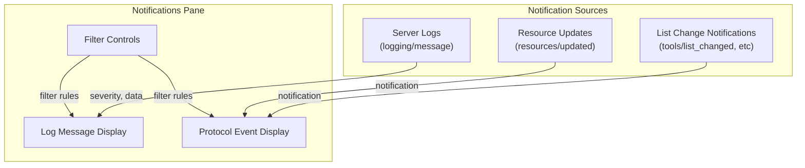
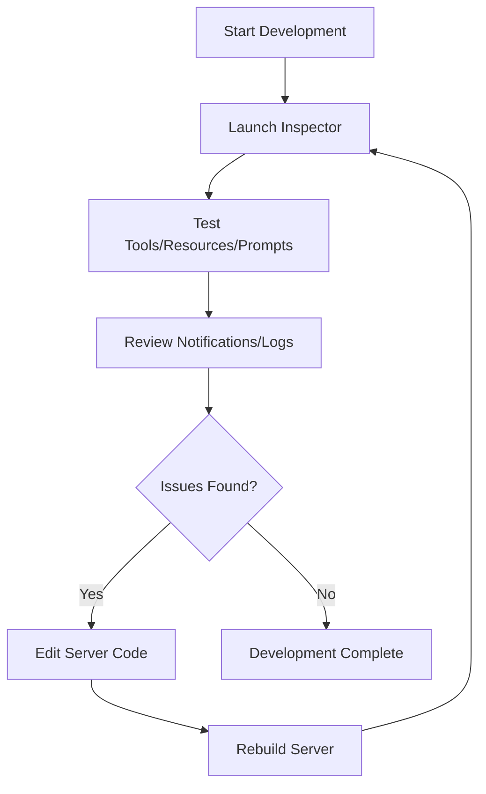

This document provides an overview of the developer tools that support Model Context Protocol development, testing, and documentation. The MCP ecosystem includes two primary categories of tools: the **MCP Inspector** for interactive server testing and debugging, and the **Documentation/Blog Systems** for publishing protocol specifications and community updates.

For detailed information about contributing to the MCP specification itself, see [Development Guide](#6). For information about building MCP servers and clients, see [Server Development](#5) and [Client Ecosystem](#4).

## Overview

The MCP tooling ecosystem serves two distinct purposes:

1. **Development and Testing Tools**: The MCP Inspector enables interactive testing of MCP servers during development, providing real-time feedback on server capabilities, tool execution, resource access, and protocol compliance.

2. **Documentation and Publishing Infrastructure**: A dual-platform publishing system maintains technical documentation (via Mintlify) and community announcements (via Hugo blog), with automated generation pipelines that keep documentation synchronized with the canonical TypeScript schema definitions.

These tools are documented in detail in subsections:
- [MCP Inspector](#8.1) - Interactive server testing tool
- [Documentation and Blog Systems](#8.2) - Publishing infrastructure

## MCP Inspector

The MCP Inspector is a command-line tool that provides an interactive web interface for testing MCP servers. It acts as a lightweight MCP client, allowing developers to exercise server capabilities without integrating with a full-featured client application.

### Purpose and Use Cases

The Inspector serves as the primary development tool for:
- **Initial server development**: Testing basic connectivity and capability negotiation
- **Feature verification**: Validating that tools, resources, and prompts work as expected
- **Debugging**: Inspecting request/response payloads and monitoring server notifications
- **Integration testing**: Verifying server behavior before deploying to production clients

### Execution Model

The Inspector is distributed as an npm package `@modelcontextprotocol/inspector` and runs via `npx` without requiring installation:

```bash
npx @modelcontextprotocol/inspector <command> <args>
```

It supports two primary execution modes:
1. **Package execution**: Testing published npm or PyPI packages using `npx` or `uvx` commands
2. **Local development**: Testing local servers using `node` or `uv` commands

The Inspector launches the specified server as a subprocess using the stdio transport and provides a web interface (typically on `http://localhost:5173`) for interaction.

Sources: [docs/docs/tools/inspector.mdx:1-76]()

### Interface Components



**Inspector Interface Architecture**

The Inspector provides five primary interface components that map directly to MCP protocol features:

1. **Server Connection Pane**: Configures transport, command-line arguments, and environment variables for server launch
2. **Resources Tab**: Tests `resources/list` and `resources/read` endpoints, displays MIME types and resource content
3. **Prompts Tab**: Tests `prompts/list` and `prompts/get` endpoints, allows argument customization
4. **Tools Tab**: Tests `tools/list` and `tools/call` endpoints, validates input schemas and execution results
5. **Notifications Pane**: Displays server logs and protocol notifications in real-time

Sources: [docs/docs/tools/inspector.mdx:78-115]()

### Integration with Development Workflow

The Inspector is typically used in iterative development cycles:

1. Make changes to server code
2. Rebuild the server (if necessary)
3. Launch Inspector with the server
4. Test affected features through the web interface
5. Monitor notifications and logs for errors
6. Repeat

For debugging more complex integration issues, developers use the Inspector in combination with Claude Desktop logging and Chrome DevTools, as documented in the debugging guide.

Sources: [docs/docs/tools/inspector.mdx:117-138](), [docs/legacy/tools/debugging.mdx:1-295]()

## Documentation and Publishing Systems

The MCP repository maintains two separate publishing systems that serve distinct audiences and content types:

### Mintlify Documentation Platform

Mintlify serves the main technical documentation at `modelcontextprotocol.io`, including:
- Protocol specifications across multiple versions
- Developer guides and tutorials
- SDK documentation
- Client and server examples

The platform is configured via `docs.json`, which defines navigation structure, versioning, redirects, and styling.



**Mintlify Configuration and Content Flow**

Sources: [docs/docs.json:1-462]()

### Hugo Blog Platform

Hugo serves the blog at `blog.modelcontextprotocol.io` using the PaperMod theme. The blog publishes:
- Release announcements
- Protocol evolution updates
- Community spotlights
- Implementation showcases

Configuration is managed via `hugo.toml`:

| Configuration Key | Purpose | Value/Notes |
|------------------|---------|-------------|
| `baseURL` | Site URL | `https://blog.modelcontextprotocol.io/` |
| `theme` | Hugo theme | `github.com/adityatelange/hugo-PaperMod` |
| `pagination.pagerSize` | Posts per page | 5 |
| `params.ShowReadingTime` | Display read time | `true` |
| `params.ShowCodeCopyButtons` | Code block copying | `true` |
| `params.ShowFullTextinRSS` | RSS feed content | `true` (full text) |
| `markup.highlight.style` | Syntax theme | `monokai` |

The blog includes navigation links to the main documentation site and GitHub repository, creating a cohesive web presence.

Sources: [blog/hugo.toml:1-71]()

### Custom Styling System

The documentation platform uses a custom CSS file that provides:

1. **Schema Reference Styling**: Custom rendering for TypeDoc-generated schema documentation, including syntax highlighting for TypeScript types and interfaces
2. **Feature Matrix Tables**: Specialized styling for the client feature support matrix with fixed-width layout
3. **Section Numbering**: Automatic hierarchical section numbering for headings (enabled by `#enable-section-numbers` element)

Key styling patterns:



**CSS Architecture and Selector Hierarchy**

The styling system uses feature-detection selectors (`body:has(#enable-section-numbers)`, `body:has(#schema-reference)`) to apply styles only when specific marker elements are present, allowing different styling behaviors for different page types.

Sources: [docs/style.css:1-207]()

### Generated vs. Hand-Written Content

The documentation system distinguishes between generated and hand-written content through Git attributes and Prettier ignore rules:

**Generated Files** (marked as `linguist-generated=true`):
- `schema/*/schema.json` - JSON Schema definitions
- `docs/specification/*/schema.md` - Markdown schema documentation  
- `docs/specification/*/schema.mdx` - MDX schema documentation

These files are excluded from Prettier formatting and language statistics to prevent manual editing.

**Hand-Written Files**:
- `docs/**/*.mdx` (excluding generated schema files)
- `blog/content/**/*.md`
- Configuration files (`docs.json`, `hugo.toml`)

Sources: [.gitattributes:1-5](), [.prettierignore:1-3]()

## Tool Integration Architecture



**MCP Tools Ecosystem Integration**

The tools ecosystem supports three parallel workflows:

1. **Development Workflow**: Inspector enables rapid iteration on server code with immediate feedback
2. **Documentation Workflow**: Automated generation ensures specifications stay synchronized with schema definitions
3. **Community Workflow**: Blog platform maintains community engagement through announcements and updates

These workflows are independent but interconnected - Inspector validates servers against specifications maintained in Mintlify, while the blog announces new protocol versions that developers test with the Inspector.

Sources: [docs/docs.json:1-462](), [blog/hugo.toml:1-71](), [docs/docs/tools/inspector.mdx:1-159]()

## Navigation and Cross-References

The documentation platform implements a sophisticated navigation and redirect system:

### Multi-Version Specification Support

The `docs.json` configuration defines separate navigation trees for each protocol version:
- `2025-11-25` (latest) - Current stable version with tasks support
- `2025-06-18` - Previous stable version
- `2025-03-26` - Historical version
- `2024-11-05` - Original public release
- `draft` - Active development version

Each version maintains its own complete specification tree, allowing users to reference specific protocol versions for compatibility.

### URL Redirect System

The redirect system handles URL migrations and provides convenience aliases:

```
/specification/latest → /specification/2025-11-25
/quickstart → /docs/develop/build-server
/legacy/tools/inspector → /docs/tools/inspector
```

Redirects use wildcard patterns (`/specification/latest/:slug*`) to preserve deep links when redirecting version-specific pages.

Sources: [docs/docs.json:368-454]()

## Asset Management

Both documentation systems manage static assets:

### Mintlify Assets
- **Favicon**: `/favicon.svg` (SVG format for scalability)
- **Logos**: Light and dark variants (`/logo/light.svg`, `/logo/dark.svg`)
- **OpenGraph Image**: Social media preview image for link sharing
- **Screenshots**: Inspector interface image at `/images/mcp-inspector.png`

### Hugo Blog Assets
- **Favicon**: `blog/static/favicon.svg` (same branding as main docs)
- **OpenGraph Image**: `blog/static/og-image.png` (PNG format, 1200x630px)
- **Theme Assets**: PaperMod theme provides built-in icons and styling

The shared favicon ensures consistent branding across both platforms.

Sources: [docs/docs.json:353-361](), [blog/hugo.toml:35-36](), [blog/static/favicon.svg:1-12]()

## Best Practices for Tool Usage

### Inspector Development Patterns

1. **Incremental Testing**: Test individual features (tools, resources, prompts) in isolation before integration
2. **Environment Configuration**: Use absolute paths in server commands to avoid working directory issues
3. **Notification Monitoring**: Watch the notifications pane for server errors and warnings during testing
4. **Edge Case Validation**: Test with invalid inputs, missing arguments, and concurrent operations

### Documentation Development Patterns

1. **Version Awareness**: Always specify which protocol version documentation applies to
2. **Generated File Discipline**: Never manually edit files marked `linguist-generated=true`
3. **Link Validation**: Use `mint broken-links` command to detect broken internal links
4. **Custom Styling**: Add page-specific styles only when necessary, preferring Mintlify defaults

### Integration Workflow

The typical development cycle integrates both tools:

1. Write server code implementing MCP features
2. Test with Inspector to validate basic functionality
3. Update documentation to reflect new capabilities
4. Generate schema documentation via `npm run generate`
5. Test integration with Claude Desktop
6. Publish blog post announcing new features

This workflow ensures servers are tested, documented, and announced in a coordinated manner.

Sources: [docs/docs/tools/inspector.mdx:117-138](), [docs/legacy/tools/debugging.mdx:206-227]()

## Related Pages

For detailed information about each tool:
- [MCP Inspector](#8.1) - Comprehensive Inspector guide with usage examples
- [Documentation and Blog Systems](#8.2) - Technical reference for publishing infrastructure

For related development topics:
- [Development Guide](#6) - Contributing to the MCP specification
- [Build System and CI/CD](#6.4) - Automated validation and generation
- [Documentation System](#6.5) - Architecture of the documentation pipeline

# MCP Inspector


The MCP Inspector is an interactive developer tool for testing and debugging MCP servers during development. It provides a graphical interface for discovering server capabilities, executing tools, reading resources, testing prompts, and monitoring server behavior without requiring integration with a production MCP client.

For information about broader debugging strategies and using the Inspector as part of a complete debugging workflow, see [Debugging Guide](#6.4).

## Purpose and Scope

The Inspector serves as a standalone MCP client implementation with developer-focused features. Its primary purposes are:

- **Server validation**: Verify that an MCP server correctly implements the protocol specification
- **Interactive testing**: Manually test tools, resources, and prompts before client integration
- **Development iteration**: Rapidly test changes during server development without restarting a full client application
- **Protocol debugging**: Inspect message exchanges and server behavior at the protocol level

The Inspector is not intended for production use or end-user interactions. It is exclusively a development and testing tool for server authors.

## Architecture and Design

### Inspector as MCP Client



**Inspector Architecture Overview**

Sources: [docs/docs/tools/inspector.mdx:1-159](), [docs/docs/learn/architecture.mdx:1-464]()

The Inspector implements a complete MCP client using the `@modelcontextprotocol/sdk` package. It initializes connections to test servers using either `StdioClientTransport` for local servers or HTTP transport for remote servers. The web-based UI translates user interactions into protocol messages and displays server responses.

### Protocol Message Flow

```mermaid
sequenceDiagram
    participant User
    participant Inspector["MCP Inspector<br/>(Client)"]
    participant Server["Test Server"]
    
    Note over User,Server: Connection Phase
    User->>Inspector: npx @modelcontextprotocol/inspector <command>
    Inspector->>Server: Launch server process
    Inspector->>Server: initialize request
    Server-->>Inspector: initialize response<br/>(capabilities)
    Inspector->>Server: initialized notification
    
    Note over User,Server: Discovery Phase
    Inspector->>Server: tools/list
    Server-->>Inspector: tools array
    Inspector->>Server: resources/list
    Server-->>Inspector: resources array
    Inspector->>Server: prompts/list
    Server-->>Inspector: prompts array
    
    Note over User,Server: Interactive Testing Phase
    User->>Inspector: Click tool execution
    Inspector->>Server: tools/call
    Server-->>Inspector: tool result
    Inspector->>User: Display result
    
    User->>Inspector: Read resource
    Inspector->>Server: resources/read
    Server-->>Inspector: resource contents
    Inspector->>User: Display contents
```

**Inspector Protocol Interaction Sequence**

Sources: [docs/docs/tools/inspector.mdx:1-159](), [docs/docs/learn/architecture.mdx:146-463]()

## Installation and Execution

The Inspector requires no installation and runs directly through `npx`:

```bash
npx @modelcontextprotocol/inspector <command> [args...]
```

### Execution Patterns by Server Type

| Server Type | Command Pattern | Example |
|------------|----------------|---------|
| npm package | `npx @modelcontextprotocol/inspector npx <package>` | `npx @modelcontextprotocol/inspector npx @modelcontextprotocol/server-filesystem /path` |
| PyPI package | `npx @modelcontextprotocol/inspector uvx <package>` | `npx @modelcontextprotocol/inspector uvx mcp-server-git --repository ~/repo.git` |
| Local TypeScript | `npx @modelcontextprotocol/inspector node <path>` | `npx @modelcontextprotocol/inspector node ./build/index.js` |
| Local Python | `npx @modelcontextprotocol/inspector uv --directory <dir> run <script>` | `npx @modelcontextprotocol/inspector uv --directory ./server run server.py` |

Sources: [docs/docs/tools/inspector.mdx:9-76]()

The first argument to the Inspector is the command to launch the server, and subsequent arguments are passed to that server. The Inspector automatically handles process management and transport setup.

## Feature Overview

### Server Connection Pane



**Server Connection Configuration Flow**

Sources: [docs/docs/tools/inspector.mdx:86-90]()

The connection pane allows configuration of:

- **Transport mechanism**: Selection between stdio (local servers) and Streamable HTTP (remote servers)
- **Command-line arguments**: Customization of server launch parameters
- **Environment variables**: Definition of environment variables passed to the server process

For stdio transport, the Inspector launches the server as a subprocess and manages the stdin/stdout communication channels. For HTTP transport, it connects to a running remote server endpoint.

### Resources Tab

The Resources tab provides interfaces for:

| Feature | Operation | Protocol Method |
|---------|-----------|----------------|
| Resource listing | Display all available resources | `resources/list` |
| Metadata display | Show MIME types and descriptions | Included in list response |
| Content inspection | Read and display resource contents | `resources/read` |
| Template discovery | List resource templates with parameters | `resources/templates/list` |
| Subscription testing | Subscribe to resource updates | `resources/subscribe` |

Sources: [docs/docs/tools/inspector.mdx:91-96]()

When a resource is selected, the Inspector issues a `resources/read` request with the resource URI and displays the returned contents formatted according to the declared MIME type. For resource templates, the Inspector provides input fields for template parameters.

### Prompts Tab

The Prompts tab enables:

| Feature | Operation | Protocol Method |
|---------|-----------|----------------|
| Prompt discovery | List all available prompts | `prompts/list` |
| Argument inspection | Display required and optional arguments | Included in list response |
| Argument entry | Provide custom values for prompt arguments | User input form |
| Message preview | Display generated message structures | `prompts/get` |

Sources: [docs/docs/tools/inspector.mdx:98-104]()

Prompt testing workflow:
1. Select a prompt from the list
2. Inspect required arguments and their schemas
3. Enter argument values in provided input fields
4. Execute `prompts/get` request with provided arguments
5. View the generated message structure that would be sent to an LLM

### Tools Tab

The Tools tab provides:

| Feature | Operation | Protocol Method |
|---------|-----------|----------------|
| Tool listing | Display all available tools | `tools/list` |
| Schema inspection | View tool input schemas | Included in list response |
| Input construction | Build tool arguments from schema | User input form |
| Tool execution | Invoke tools with provided inputs | `tools/call` |
| Result display | Show tool execution results | Display call response |

Sources: [docs/docs/tools/inspector.mdx:106-111]()

The tool execution flow:
1. Select a tool from the available list
2. Inspect the `inputSchema` JSON Schema definition
3. Construct arguments matching the schema (the Inspector provides form inputs based on schema types)
4. Execute `tools/call` with the tool name and arguments
5. Display the result content array returned by the server

### Notifications Pane



**Notification Flow in Inspector**

Sources: [docs/docs/tools/inspector.mdx:113-116]()

The Notifications pane displays:

- **Log messages**: Server-sent logging messages via `logging/message` notifications, categorized by severity level (debug, info, warning, error)
- **Protocol notifications**: Real-time notifications such as `tools/list_changed`, `resources/list_changed`, `prompts/list_changed`, and `resources/updated`

This pane is essential for debugging because it captures all server-initiated communications, including error messages and state change announcements.

## Development Workflow Integration

### Iterative Testing Pattern



**Inspector Development Iteration Cycle**

Sources: [docs/docs/tools/inspector.mdx:119-138](), [docs/legacy/tools/debugging.mdx:206-227]()

The Inspector integrates into the development workflow at multiple stages:

1. **Initial development**: Verify basic connectivity and capability negotiation during initial server implementation
2. **Feature development**: Test each new tool, resource, or prompt as it is implemented
3. **Edge case testing**: Validate error handling, invalid inputs, and boundary conditions
4. **Protocol compliance**: Ensure correct message formats and response structures

### Testing Checklist

When using the Inspector during development:

| Test Category | Test Items |
|--------------|------------|
| **Connection** | Server launches successfully<br/>Initialization completes<br/>Capabilities negotiated correctly |
| **Discovery** | All tools listed<br/>All resources listed<br/>All prompts listed |
| **Tools** | Input schemas valid<br/>Tool execution succeeds<br/>Results formatted correctly<br/>Error handling works |
| **Resources** | URIs resolve correctly<br/>Content returned matches MIME type<br/>Templates accept parameters<br/>Subscriptions work |
| **Prompts** | Arguments validated<br/>Messages generated correctly<br/>Output suitable for LLM |
| **Error Handling** | Invalid inputs rejected<br/>Error messages clear<br/>Server remains stable |

Sources: [docs/docs/tools/inspector.mdx:119-138]()

## Common Usage Patterns

### Pattern: Tool Development and Testing

```typescript
// Server development sequence for new tool
1. Implement tool in server code
2. Build server: npm run build
3. Launch Inspector: npx @modelcontextprotocol/inspector node build/index.js
4. Navigate to Tools tab
5. Verify tool appears in list
6. Click tool to view input schema
7. Enter test inputs
8. Execute tool
9. Verify result structure and content
10. Check Notifications pane for any errors
```

Sources: [docs/docs/tools/inspector.mdx:119-138](), [docs/docs/develop/build-server.mdx:1-1441]()

### Pattern: Resource Template Testing

For servers implementing resource templates:

1. Navigate to Resources tab in Inspector
2. Locate template-based resources (those with parameters)
3. Click to view template URI pattern (e.g., `file:///{path}`)
4. Enter parameter values in provided inputs
5. Execute read operation
6. Verify content matches expected data for those parameters
7. Test parameter completion if implemented
8. Test multiple parameter combinations

Sources: [docs/docs/tools/inspector.mdx:91-96](), [docs/docs/learn/server-concepts.mdx:98-174]()

### Pattern: Notification Debugging

When debugging server behavior:

1. Launch Inspector with server
2. Open Notifications pane immediately
3. Perform actions in other tabs (execute tools, read resources)
4. Monitor notifications for:
   - Log messages indicating internal server state
   - Error messages from failed operations
   - List change notifications when capabilities update
   - Resource update notifications when data changes
5. Use log messages to trace execution flow
6. Identify issues from error severity logs

Sources: [docs/docs/tools/inspector.mdx:113-116](), [docs/legacy/tools/debugging.mdx:156-205]()

## Best Practices

### Inspector Usage Guidelines

**During development**:
- Launch Inspector early to verify basic server functionality before implementing complex features
- Test each new capability immediately after implementation
- Keep Inspector open during development for rapid testing after rebuilds
- Use the Notifications pane to identify issues before they manifest as failures

**Edge case testing**:
- Provide invalid inputs to tools to verify error handling
- Test missing required arguments in prompts
- Attempt to read non-existent resources
- Test concurrent operations if server supports them

**Before client integration**:
- Execute complete test suite through Inspector
- Verify all tools produce expected output formats
- Confirm resources return correct MIME types
- Test prompts generate valid message structures

Sources: [docs/docs/tools/inspector.mdx:119-138]()

### Inspector Limitations

The Inspector has specific limitations:

| Limitation | Description | Workaround |
|------------|-------------|------------|
| **No sampling support** | Cannot test `sampling/createMessage` requests | Test sampling features in a full client implementation |
| **No elicitation support** | Cannot test `elicitation/request` features | Verify elicitation with a client that supports it |
| **Manual testing only** | No automated test execution | Use SDK test utilities for automated testing |
| **Single server focus** | Tests one server at a time | Test multi-server scenarios in client applications |

Sources: [docs/docs/tools/inspector.mdx:1-159](), [docs/legacy/concepts/sampling.mdx:1-249]()

### Complementary Tools

The Inspector works alongside other debugging tools:

- **Claude Desktop logs** (`~/Library/Logs/Claude/mcp*.log`): Verify server behavior in production client
- **Chrome DevTools** (in Claude Desktop): Debug client-side integration issues
- **Server-side logging**: Add custom logging to server implementation for detailed traces
- **SDK test utilities**: Automate regression testing after manual verification with Inspector

Sources: [docs/legacy/tools/debugging.mdx:1-295]()

## Next Steps

After using the Inspector for development:

- **Integrate with Claude Desktop**: Configure server in `claude_desktop_config.json` for real-world testing (see [Connect to Local Servers](#8.1))
- **Test remote deployment**: Deploy server to remote host and test with HTTP transport
- **Implement automated tests**: Create test suites using SDK test utilities
- **Review debugging guide**: Consult broader debugging strategies for production issues (see [Debugging Guide](#6.4))

Sources: [docs/docs/tools/inspector.mdx:140-159](), [docs/docs/develop/connect-local-servers.mdx:1-336]()