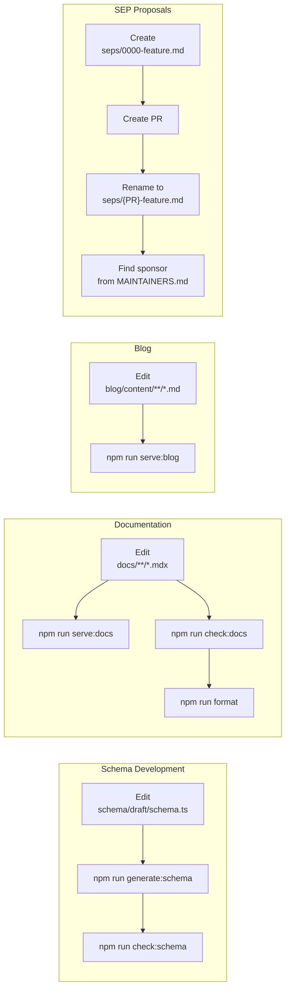
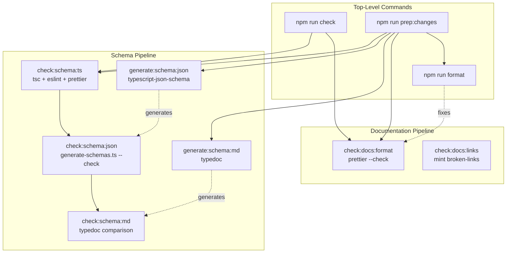

npm run check
```

The `npm run check` command [package.json:24]() runs all validation checks to ensure your environment is correctly configured.

Sources: [CONTRIBUTING.md:8-34](), [package.json:10-12]()

### Verification

After installation, verify that all systems work correctly:

```bash
# Validate TypeScript schema definitions
npm run check:schema:ts

# Check generated JSON schemas match source
npm run check:schema:json

# Check generated MDX docs match source
npm run check:schema:md

# Validate documentation formatting
npm run check:docs:format

# Check for broken internal links
npm run check:docs:links
```

All checks should pass without errors. If any checks fail, the output will indicate which files need attention.

Sources: [package.json:23-31](), [CONTRIBUTING.md:44-54]()

## Development Workflows

The repository supports four primary development workflows:



### Schema Development Workflow

When modifying protocol definitions:

1. Edit TypeScript definitions in `schema/draft/schema.ts` only
2. **Do not** manually edit `schema/draft/schema.json` or `docs/specification/draft/schema.mdx`
3. Run `npm run generate:schema` to regenerate artifacts [package.json:33-35]()
4. Verify changes with `npm run check:schema` [package.json:28]()

For detailed information about the schema generation pipeline and version management, see [Schema Development Workflow](#6.3).

### Documentation Workflow

When updating documentation:

1. Edit MDX files in `docs/` directory
2. Preview locally with `npm run serve:docs` [package.json:37]()
3. Check formatting with `npm run check:docs:format` [package.json:26]()
4. Validate links with `npm run check:docs:links` [package.json:27]()
5. Auto-fix formatting with `npm run format` [package.json:32]()

For documentation infrastructure details, see [Documentation System](#6.5).

### Blog Workflow

When creating blog posts:

1. Add markdown files to `blog/content/posts/`
2. Preview with `npm run serve:blog` [package.json:38]()
3. Format is validated by the same `check:docs:format` script

### SEP Proposal Workflow

When proposing protocol changes:

1. Draft SEP as `seps/0000-feature-name.md` using [seps/TEMPLATE.md]()
2. Create pull request to add file
3. Update SEP number in file and filename to match PR number
4. Request sponsor from [MAINTAINERS.md:1-181]()
5. Iterate on feedback in PR comments

For complete SEP process details, see [Specification Enhancement Process](#6.2).

Sources: [CONTRIBUTING.md:42-86](), [package.json:23-38](), [seps/1850-pr-based-sep-workflow.md:1-185]()

## Build System Overview

The build system uses npm scripts to orchestrate TypeScript compilation, schema generation, documentation validation, and formatting:



### Available Scripts

| Command | Purpose | Mode |
|---------|---------|------|
| `npm run check` | Run all validation checks | Validation |
| `npm run check:schema` | Validate schema files | Validation |
| `npm run check:schema:ts` | Check TypeScript syntax | Validation |
| `npm run check:schema:json` | Verify JSON schemas are current | Validation |
| `npm run check:schema:md` | Verify MDX docs are current | Validation |
| `npm run check:docs` | Validate documentation | Validation |
| `npm run check:docs:format` | Check markdown formatting | Validation |
| `npm run check:docs:links` | Find broken links | Validation |
| `npm run generate:schema` | Generate JSON + MDX schemas | Generation |
| `npm run generate:schema:json` | Generate JSON schemas | Generation |
| `npm run generate:schema:md` | Generate MDX documentation | Generation |
| `npm run format` | Auto-fix markdown formatting | Generation |
| `npm run prep:changes` | Full validation + generation + format | Combined |
| `npm run serve:docs` | Preview documentation locally | Development |
| `npm run serve:blog` | Preview blog locally | Development |

Sources: [package.json:23-38]()

### Schema Generation Pipeline

The `generate-schemas.ts` script [scripts/generate-schemas.ts:1-149]() generates JSON schemas and MDX documentation from TypeScript source:

**Version Handling:**

```typescript
// Legacy versions use JSON Schema draft-07
const LEGACY_SCHEMAS = ['2024-11-05', '2025-03-26', '2025-06-18'];

// Modern versions use JSON Schema 2020-12
const MODERN_SCHEMAS = ['2025-11-25', 'draft'];
```

**Generation Process:**

1. For each schema version in `schema/*/schema.ts`
2. Run `typescript-json-schema` to produce JSON Schema [scripts/generate-schemas.ts:93-96]()
3. For modern versions, apply transformations [scripts/generate-schemas.ts:103-104]():
   - Replace `http://json-schema.org/draft-07/schema#` with `https://json-schema.org/draft/2020-12/schema`
   - Replace `"definitions":` with `"$defs":`
   - Replace `#/definitions/` with `#/$defs/`
4. Run TypeDoc to generate MDX API documentation [package.json:35]()

**Check Mode:**

When run with `--check` flag [scripts/generate-schemas.ts:20](), the script validates that committed files match what would be generated, preventing forgotten regeneration.

For detailed schema workflow information, see [Schema Development Workflow](#6.3).

Sources: [scripts/generate-schemas.ts:1-149](), [package.json:30-35]()

### CI/CD Validation

Two GitHub Actions workflows enforce code quality:

#### Main Validation Workflow

[.github/workflows/main.yml:1-29]() runs on every push and pull request:

```yaml
- Check TypeScript definitions (check:schema:ts)
- Check schema.json files are up to date (check:schema:json)
- Check schema.mdx files are up to date (check:schema:md)
```

This ensures that generated artifacts are never committed without regenerating from source.

#### Markdown Format Workflow

[.github/workflows/markdown-format.yml:1-32]() runs when `.md` or `.mdx` files change:

```yaml
- Check markdown formatting (check:docs:format)
- Check markdown links (check:docs:links)
```

This maintains consistent documentation style and prevents broken internal links.

For complete CI/CD details, see [Build System and CI/CD](#6.4).

Sources: [.github/workflows/main.yml:1-29](), [.github/workflows/markdown-format.yml:1-32]()

## Quick Reference

### Common Development Commands

```bash
# Before starting work
git checkout -b feature/your-feature-name
npm install

# Schema development
npm run check:schema:ts              # Validate TypeScript
npm run generate:schema              # Regenerate JSON + MDX
npm run check:schema                 # Verify everything matches

# Documentation development
npm run serve:docs                   # Preview at localhost
npm run check:docs:format            # Check formatting
npm run format                       # Auto-fix formatting
npm run check:docs:links             # Find broken links

# Before committing
npm run prep:changes                 # All checks + generate + format

# Full validation
npm run check                        # Run all checks
```

### Pre-Commit Checklist

Before submitting a pull request:

- [ ] Run `npm run prep:changes` to generate artifacts and validate
- [ ] All CI checks pass locally
- [ ] Changes follow existing code style
- [ ] Generated files (`schema.json`, `schema.mdx`) are included if schema changed
- [ ] Documentation updated if behavior changed
- [ ] Links tested if documentation changed
- [ ] SEP filed if protocol change is substantial (see [SEP Guidelines](#6.2))

### File Modification Rules

| File Pattern | Can Edit Directly? | Generation Command |
|-------------|-------------------|-------------------|
| `schema/*/schema.ts` | ✅ Yes | N/A |
| `schema/*/schema.json` | ❌ No | `npm run generate:schema:json` |
| `docs/specification/*/schema.mdx` | ❌ No | `npm run generate:schema:md` |
| `docs/**/*.mdx` (other) | ✅ Yes | N/A |
| `blog/content/**/*.md` | ✅ Yes | N/A |
| `seps/**/*.md` | ✅ Yes | N/A |

**Never manually edit generated files.** The CI pipeline will reject PRs where generated files don't match their source.

Sources: [CONTRIBUTING.md:42-76](), [package.json:23-38]()

### Getting Help

- **Discord**: For real-time contributor discussion: [Community Communication](#7.4)
- **GitHub Discussions**: For structured questions: https://github.com/modelcontextprotocol/modelcontextprotocol/discussions
- **GitHub Issues**: For bug reports and feature requests
- **SEP Process**: For protocol changes: [Specification Enhancement Process](#6.2)
- **Maintainers**: Listed in [MAINTAINERS.md:1-181]()

For community communication guidelines and governance structure, see [Governance and Community](#7).

Sources: [docs/community/communication.mdx:1-107](), [CONTRIBUTING.md:1-185]()