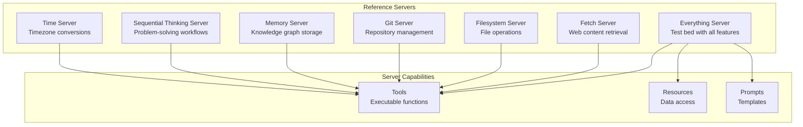

type "%APPDATA%\Claude\logs\mcp*.log"
```

**Sources:** [docs/docs/develop/connect-local-servers.mdx:202-249]()

## Reference Server Implementations

The MCP repository includes reference servers that demonstrate protocol features and SDK usage.

### Active Reference Servers



**Sources:** [docs/examples.mdx:8-21]()

### Everything Server

Comprehensive test server implementing all MCP features. Used for protocol validation and SDK testing.

**Location:** `https://github.com/modelcontextprotocol/servers/tree/main/src/everything`

**Features:**
- Example tools with various input schemas
- Resource implementations (direct and templates)
- Prompt templates with parameters
- Notification support

**Sources:** [docs/examples.mdx:14]()

### Filesystem Server

Provides secure file operations with configurable access controls. Demonstrates resource boundaries and tool permission patterns.

**Location:** `https://github.com/modelcontextprotocol/servers/tree/main/src/filesystem`

**Capabilities:**
- File reading and writing
- Directory navigation
- File search by name and content
- Move and rename operations

**Usage:**

```bash
npx -y @modelcontextprotocol/server-filesystem /path/to/allowed/directory
```

**Configuration in Claude Desktop:**

[docs/docs/develop/connect-local-servers.mdx:92-127]()

**Sources:** [docs/examples.mdx:16](), [docs/docs/develop/connect-local-servers.mdx:89-147]()

### Git Server

Provides tools for reading, searching, and manipulating Git repositories.

**Location:** `https://github.com/modelcontextprotocol/servers/tree/main/src/git`

**Capabilities:**
- Repository status and history
- Branch operations
- Commit information
- File diff generation

**Sources:** [docs/examples.mdx:17]()

### Memory Server

Knowledge graph-based persistent memory system for AI interactions.

**Location:** `https://github.com/modelcontextprotocol/servers/tree/main/src/memory`

**Capabilities:**
- Entity storage and retrieval
- Relationship management
- Graph traversal
- Semantic search

**Usage:**

```bash
npx -y @modelcontextprotocol/server-memory
```

**Sources:** [docs/examples.mdx:18]()

### Fetch Server

Web content fetching and conversion optimized for LLM consumption.

**Location:** `https://github.com/modelcontextprotocol/servers/tree/main/src/fetch`

**Capabilities:**
- HTML to markdown conversion
- Content extraction
- Metadata parsing
- URL validation

**Sources:** [docs/examples.mdx:15]()

### Archived Servers

Historical reference servers moved to `https://github.com/modelcontextprotocol/servers-archived`. These are no longer actively maintained but provide implementation examples:

- **PostgreSQL Server** - Read-only database access with schema inspection
- **SQLite Server** - Database interaction and business intelligence
- **GitHub Server** - Repository management and GitHub API integration
- **Slack Server** - Channel management and messaging
- **Google Drive Server** - File access and search

[docs/examples.mdx:22-53]()

**Sources:** [docs/examples.mdx:22-53]()

## Server Execution Patterns

### Running Reference Servers

**TypeScript servers via npx:**

```bash
npx -y @modelcontextprotocol/server-memory
```

The `-y` flag automatically confirms package installation.

**Python servers via uvx:**

```bash
uvx mcp-server-git
```

Alternative using pip:

```bash
pip install mcp-server-git
python -m mcp_server_git
```

[docs/examples.mdx:62-81]()

**Sources:** [docs/examples.mdx:62-81]()

### Server Entry Points

**Python server structure:**

[docs/docs/develop/build-server.mdx:255-262]()

- `FastMCP` instance initialization
- Tool/resource/prompt registration
- `mcp.run(transport='stdio')` to start server

**TypeScript server structure:**

[docs/docs/develop/build-server.mdx:732-746]()

- `McpServer` instance with capabilities
- Tool registration via `server.tool()`
- `StdioServerTransport` connection
- Async `server.connect()` to start

**Sources:** [docs/docs/develop/build-server.mdx:253-262](), [docs/docs/develop/build-server.mdx:732-746]()

## Testing and Deployment

### Testing with MCP Inspector

The MCP Inspector is an interactive developer tool for testing MCP servers:

**Features:**
- Resource inspection
- Prompt testing
- Tool execution
- Log and notification viewing

**Location:** `https://github.com/modelcontextprotocol/inspector`

**Sources:** [docs/docs/learn/architecture.mdx:19]()

### Testing with Claude Desktop

Claude Desktop provides a complete integration environment for testing local MCP servers:

1. Configure server in `claude_desktop_config.json`
2. Restart Claude Desktop
3. Verify server indicator appears (hammer icon in input box)
4. Test tool execution with approval dialogs

[docs/docs/develop/build-server.mdx:268-353]()

**Troubleshooting:**

- Check logs at `~/Library/Logs/Claude/mcp*.log` (macOS) or `%APPDATA%\Claude\logs` (Windows)
- Verify absolute paths in configuration
- Test server execution manually from command line

[docs/docs/develop/connect-local-servers.mdx:202-249]()

**Sources:** [docs/docs/develop/build-server.mdx:268-353](), [docs/docs/develop/connect-local-servers.mdx:202-265]()

### Building Custom Servers

For custom server development, start with the quickstart tutorials:

- Python: [docs/docs/develop/build-server.mdx:33-353]()
- TypeScript: [docs/docs/develop/build-server.mdx:356-815]()
- Java: [docs/docs/develop/build-server.mdx:817-1134]()

**Development workflow:**

1. Install SDK for chosen language
2. Define tools with input schemas
3. Implement tool execution handlers
4. Configure transport (STDIO or HTTP)
5. Test with MCP Inspector or Claude Desktop
6. Deploy via client configuration

**Best practices:**

- Use descriptive tool names following format: `category_action` (e.g., `weather_get_forecast`)
- Provide detailed descriptions for AI model understanding
- Implement proper error handling
- Log to stderr only (for STDIO servers)
- Validate inputs using JSON Schema
- Request user approval for destructive operations

[docs/docs/develop/build-server.mdx:57-63]()

**Sources:** [docs/docs/develop/build-server.mdx:1-1134]()

### SDK-Specific Considerations

**Python (FastMCP):**
- Automatic schema generation from type hints
- Decorator-based tool registration
- Async/await required for handlers
- `uv` for dependency management

**TypeScript:**
- Explicit Zod schema definitions
- Type-safe tool handlers
- Compile step required (`npm run build`)
- Node.js 16+ required

**Java (Spring AI MCP):**
- Auto-configuration via Spring Boot
- Annotation-based tool definitions
- STDIO and SSE transport options
- Integration with Spring AI ChatClient

**Sources:** [docs/docs/develop/build-server.mdx:77-1134](), [docs/docs/sdk.mdx:1-90]()

## Server Distribution

### NPM Package Distribution (TypeScript)

TypeScript servers can be published as npm packages for easy distribution:

```json
{
  "name": "@modelcontextprotocol/server-name",
  "bin": {
    "server-name": "./build/index.js"
  },
  "files": ["build"]
}
```

Users install and run via npx:

```bash
npx -y @modelcontextprotocol/server-name
```

**Sources:** [docs/examples.mdx:66-70]()

### PyPI Package Distribution (Python)

Python servers can be published to PyPI for distribution:

```bash
pip install mcp-server-name
python -m mcp_server_name
```

Or using uvx for isolated execution:

```bash
uvx mcp-server-name
```

**Sources:** [docs/examples.mdx:73-81]()

### Environment Variables

Servers requiring API keys or credentials use environment variables passed through client configuration:

```json
{
  "mcpServers": {
    "server-name": {
      "command": "npx",
      "args": ["-y", "@modelcontextprotocol/server-name"],
      "env": {
        "API_KEY": "secret-value",
        "BASE_URL": "https://api.example.com"
      }
    }
  }
}
```

[docs/examples.mdx:86-111]()

**Sources:** [docs/examples.mdx:86-111]()