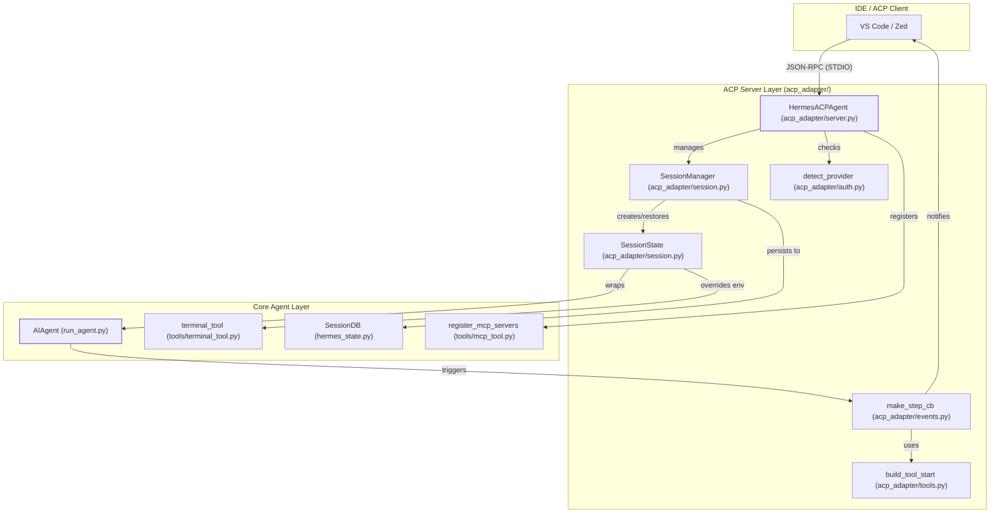
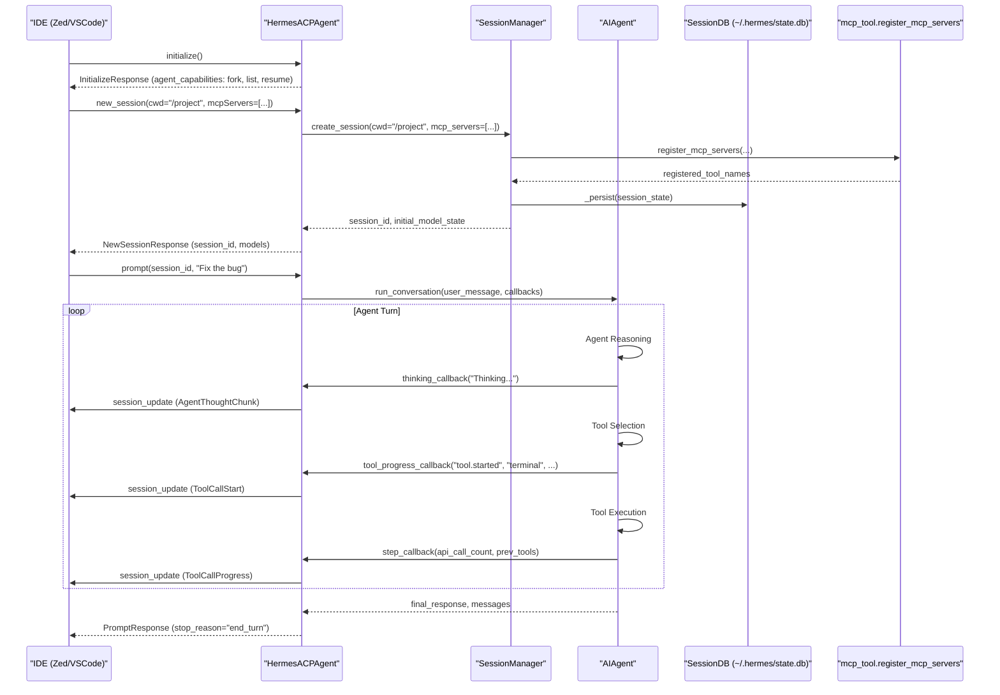

Hermes Agent implements the **Agent Client Protocol (ACP)**, a standardized communication layer that allows the agent to function as a backend for AI-native editors and IDEs. By running as an ACP server, Hermes provides its full suite of self-improvement capabilities, toolsets, and persistent memory to environments like VS Code and Zed.

## Overview and Architecture

The ACP integration is centered around the `HermesACPAgent` class [acp_adapter/server.py:157-218](), which implements the `acp.Agent` interface. This server translates ACP lifecycle events (initialization, authentication, session management) into internal `AIAgent` operations.

### Data Flow

When an IDE connects to Hermes via ACP, the following flow occurs:

1.  **Initialization**: The client sends an `initialize` request. Hermes responds with its capabilities, including session forking, listing, and resumption [acp_adapter/server.py:223-266]().
2.  **Session Creation**: The client requests a `new_session`, `load_session`, or `resume_session`, providing a working directory (`cwd`) [acp_adapter/server.py:283-359]().
3.  **Prompt Execution**: The client sends a prompt. The `HermesACPAgent` extracts text from ACP content blocks via `_extract_text` [acp_adapter/server.py:221-238](), retrieves or restores the `SessionState` [acp_adapter/session.py:170-184](), and executes the agent loop in a `ThreadPoolExecutor` [acp_adapter/server.py:85-85]().
4.  **Streaming Updates**: During execution, callbacks created via `acp_adapter.events` capture tool progress, thinking blocks, and assistant messages, sending them back to the IDE as ACP session updates via `run_coroutine_threadsafe` [acp_adapter/events.py:31-41]().

### System Component Mapping

The following diagram bridges the Agent Client Protocol concepts to the specific Python entities in the codebase.

**Diagram: ACP to Code Entity Mapping**

Sources: [acp_adapter/server.py:157-218](), [acp_adapter/session.py:170-184](), [acp_adapter/events.py:31-41](), [acp_adapter/session.py:39-71](), [acp_adapter/tools.py:21-51](), [acp_adapter/server.py:400-409]()

## Session Management

ACP sessions are managed by a thread-safe `SessionManager` [acp_adapter/session.py:187-207](). Unlike standard CLI sessions, ACP sessions are explicitly tied to an editor's working directory (`cwd`) and are persisted to the shared `SessionDB` (`~/.hermes/state.db`) so they survive process restarts and are searchable via `session_search` [acp_adapter/session.py:1-8]().

### Session Persistence and Recovery

When a session is created, its `cwd` is registered with the terminal tool via `_register_task_cwd` [acp_adapter/session.py:123-138]() to ensure environment overrides are applied to sub-processes. This is particularly important for Windows Subsystem for Linux (WSL) environments, where Windows drive paths need to be translated to WSL mount paths (e.g., `E:\Projects` to `/mnt/e/Projects`) [acp_adapter/session.py:39-71](). If a client attempts to `get_session` for an ID not in memory, the manager transparently restores it from the database using `_restore` [acp_adapter/session.py:211-222]().

### Session Lifecycle Functions

| Function | File:Line | Description |
| :--- | :--- | :--- |
| `create_session` | [acp_adapter/session.py:209-222]() | Initializes a new `SessionState`, fresh `AIAgent`, and persists to DB. |
| `fork_session` | [acp_adapter/session.py:243-277]() | Deep-copies a session's history into a new ID with a fresh agent instance. |
| `list_sessions` | [acp_adapter/session.py:279-314]() | Merges in-memory and persisted sessions into a unified list. |
| `cancel` | [acp_adapter/server.py:361-370]() | Triggers `cancel_event` to stop execution for a specific session. |
| `_translate_acp_cwd` | [acp_adapter/session.py:39-54]() | Converts Windows drive paths to WSL mount paths if Hermes is running in WSL. |

Sources: [acp_adapter/session.py:187-314](), [acp_adapter/server.py:361-370](), [acp_adapter/session.py:39-54](), [acp_adapter/session.py:123-138]()

## IDE Integration Flow

**Diagram: IDE Integration Sequence**

Sources: [acp_adapter/server.py:223-266](), [acp_adapter/session.py:209-222](), [acp_adapter/events.py:47-101](), [acp_adapter/events.py:128-174](), [acp_adapter/server.py:400-409]()

## Implementation Details

### Content Extraction and Tool Mapping
The server handles multiple ACP content types via `_extract_text` [acp_adapter/server.py:221-238](), concatenating all text blocks found in a prompt while ignoring non-text blocks. For multimodal prompts, `_content_blocks_to_openai_user_content` [acp_adapter/server.py:240-275]() converts ACP blocks into an OpenAI-compatible format, preserving pure text prompts as strings for legacy compatibility. Hermes tool names are mapped to ACP `ToolKind` (e.g., `read_file` -> `read`, `terminal` -> `execute`) using `TOOL_KIND_MAP` [acp_adapter/tools.py:21-51]() to provide semantic context to the IDE.

### MCP Server Integration
Hermes supports registering ACP-provided MCP servers during session initialization [acp_adapter/server.py:400-409](). This allows the IDE to pass its own MCP server configurations (stdio or HTTP) to the agent, which then registers these as toolsets (e.g., `mcp-test-fs`) and refreshes its tool surface [acp_adapter/session.py:140-156]().

### Authentication and Runtime Detection
Hermes utilizes `detect_provider()` [acp_adapter/auth.py:54-54]() to identify existing runtime credentials (e.g., Anthropic, OpenAI) via the `acp_adapter.auth` utility. If credentials are found, the server exposes them as an `AuthMethodAgent` during initialization [acp_adapter/server.py:268-281]().

### Display and Output Redirection
Since ACP reserves `stdout` for JSON-RPC frames, any incidental CLI or status output from the `AIAgent` must be redirected. The `_acp_stderr_print` function routes such output to `stderr` [acp_adapter/session.py:112-119](). Tool titles are dynamically built via `build_tool_title` [acp_adapter/tools.py:91-180]() to provide human-readable summaries of tool arguments (e.g., truncating long terminal commands). For `patch` operations, `build_tool_start` [acp_adapter/tools.py:183-220]() produces `FileEditToolCallContent` providing structured diffs to the client.

### Slash Commands and Queued Prompts
The `HermesACPAgent` supports several slash commands, including `/steer`, `/queue`, `/model`, `/tools`, `/context`, `/reset`, `/compact`, and `/version` [acp_adapter/server.py:411-411]().
*   `/steer` allows injecting guidance into a currently running agent turn or replaying an interrupted prompt with new guidance [tests/acp_adapter/test_acp_commands.py:118-131](). If the session is idle, `/steer` acts as a regular prompt [tests/acp_adapter/test_acp_commands.py:151-168]().
*   `/queue` adds a prompt to a session's `queued_prompts` list, to be executed after the current turn finishes [tests/acp_adapter/test_acp_commands.py:171-182](). The agent automatically drains these queued prompts after completing its current task [tests/acp_adapter/test_acp_commands.py:185-199]().
*   `/compact` triggers context compression, similar to the CLI command. The server provides feedback on message and token count changes.

Sources: [acp_adapter/server.py:221-275](), [acp_adapter/tools.py:21-344](), [acp_adapter/server.py:400-409](), [acp_adapter/session.py:140-156](), [acp_adapter/auth.py:54-54](), [acp_adapter/server.py:268-281](), [acp_adapter/session.py:112-119](), [acp_adapter/server.py:411-411](), [tests/acp_adapter/test_acp_commands.py:118-199]()