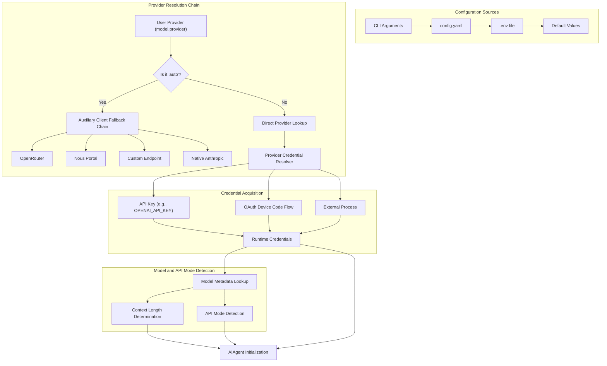
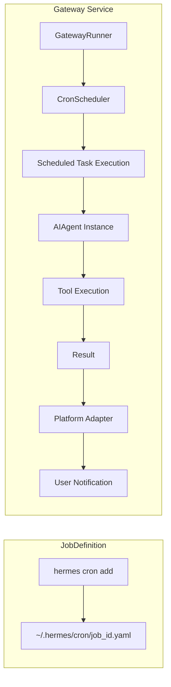
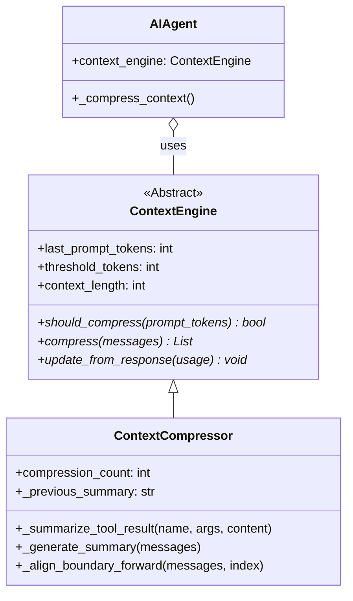
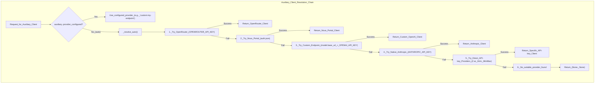
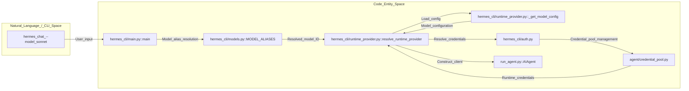
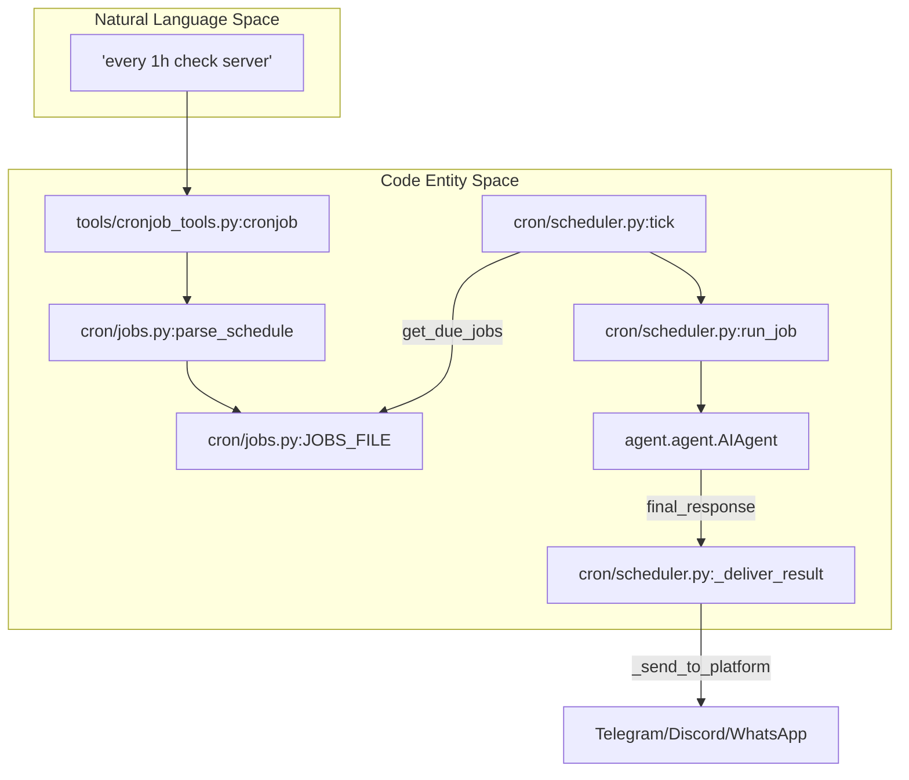
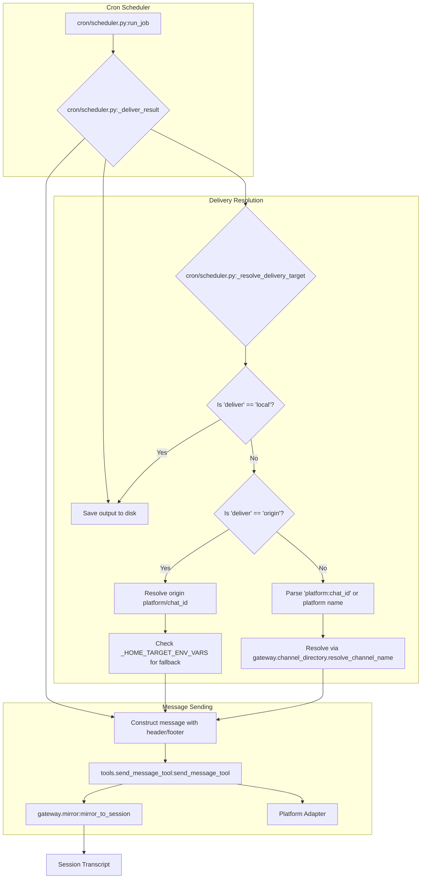
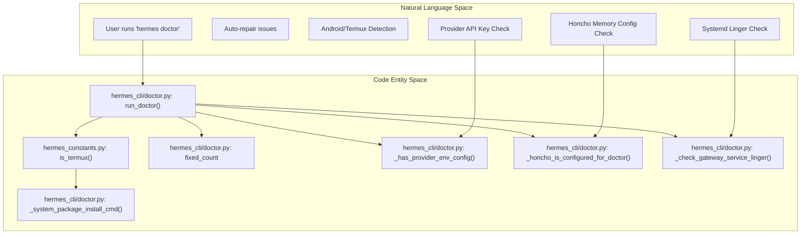
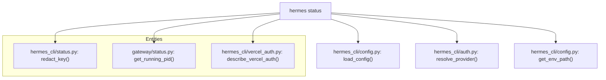
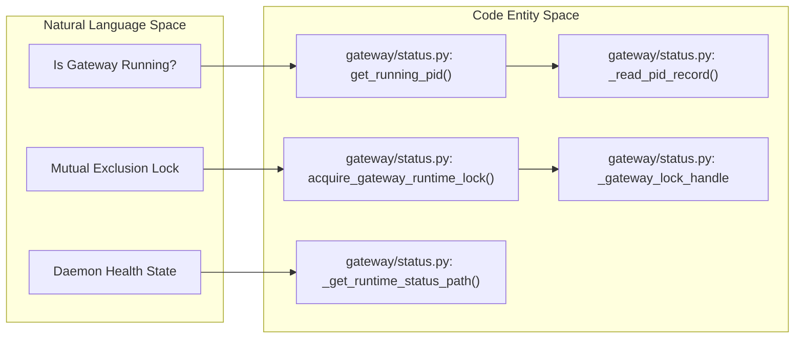

This section covers advanced features and internal systems that extend Hermes Agent's capabilities beyond basic conversation loops. These topics are relevant for power users, system administrators, and developers working on the codebase.

For core agent functionality, see [Core Agent](#4). For tool configuration, see [Tool System](#5). For memory systems, see [Memory and Sessions](#4.3) and [Honcho Integration](#4.4).

---

## Context Compression

Context compression automatically manages conversation length by summarizing middle turns when approaching the model's token limit. This prevents context overflow errors and reduces API costs while preserving conversation continuity.

### Architecture

The compression system tracks actual token usage from API responses and triggers summarization when crossing a configurable threshold (defaulting to 0.75). It preserves the system prompt, recent turns, and conversation structure while condensing middle history into a summary message using a specialized handoff template [agent/context_compressor.py:38-51]().

**Context Compression Flow**
```mermaid
graph TB
    subgraph "TokenTracking"
        [APIResponse] --> [ExtractTokens]
        [ExtractTokens] --> [UpdateCounter]
    end

    subgraph "CompressionTrigger"
        [UpdateCounter] --> [CheckThreshold]
        ["get_model_context_length"] --> [CheckThreshold]
        [ThresholdPercent] --> [CheckThreshold]
    end

    subgraph "PreservationStrategy"
        [CheckThreshold] -->|"threshold exceeded"| [PruneToolResults]
        [PruneToolResults] --> [ProtectHeadTail]
    end

    subgraph "Summarization"
        [ProtectHeadTail] --> [BuildSummarizationPrompt]
        [BuildSummarizationPrompt] --> ["agent.auxiliary_client.call_llm"]
        ["agent.auxiliary_client.call_llm"] --> [GenerateSummary]
    end

    subgraph "ContextRebuild"
        [GenerateSummary] --> [InsertSummaryPrefix]
        [InsertSummaryPrefix] --> [DropMiddleTurns]
        [DropMiddleTurns] --> [RebuildMessagesArray]
    end

    ["get_model_context_length"] -- "Resolves limit" --> [CheckThreshold]
    ["agent.auxiliary_client.call_llm"] -- "Executes summary" --> [GenerateSummary]
```
**Sources:** [agent/context_compressor.py:1-51](), [agent/model_metadata.py:28-32]()

### ContextCompressor Class

The `ContextCompressor` class handles all compression logic, implementing the `ContextEngine` interface [agent/context_engine.py:27-27](). It calculates a summary budget proportional to the compressed content, typically using a 0.20 ratio [agent/context_compressor.py:57-57]().

| Property | Type | Description |
|----------|------|-------------|
| `threshold_percent` | `float` | Compression trigger threshold. |
| `protect_first_n` | `int` | Number of initial turns to preserve. |
| `protect_last_n` | `int` | Number of recent turns to preserve. |
| `context_length` | `int` | Resolved via `get_model_context_length` [agent/context_compressor.py:28-32](). |

**Key Methods:**
- `_truncate_tool_call_args_json()`: Truncates large tool arguments to save space before summarization [agent/context_compressor.py:178-178]().
- `_strip_image_parts_from_parts()`: Prunes old screenshots from history to save context space [agent/context_compressor.py:153-175]().

**Sources:** [agent/context_compressor.py:54-178](), [agent/context_engine.py:27-27]()

For details, see [Context Compression](#10.1).

---

## Provider Runtime Resolution

Provider runtime resolution determines which LLM provider and credentials to use at agent initialization time. This system supports multiple authentication methods, automatic fallbacks, and per-task provider overrides via an auxiliary client router [agent/auxiliary_client.py:1-41]().

### Resolution Logic

The system resolves credentials by checking explicit requests, persisted configuration, and environment variables. The `PROVIDER_REGISTRY` defines known OAuth and API-key providers [hermes_cli/auth.py:149-192](). The `AIAgent` class handles model normalization, stripping provider prefixes for native models while retaining them for aggregators like OpenRouter [run_agent.py:10-21]().

**Provider and Credential Resolution**

**Sources:** [hermes_cli/auth.py:149-192](), [agent/auxiliary_client.py:1-41](), [run_agent.py:10-21]()

### API Mode Detection

The `api_mode` determines how messages and tool calls are formatted. Hermes supports several modes, including `chat_completions` and `codex_responses`. The system automatically detects the appropriate mode based on the base URL; for instance, GitHub Copilot endpoints use `copilot` specific logic [hermes_cli/auth.py:185-192]().

### Key Components
- `PROVIDER_REGISTRY`: Defines known inference providers and their auth types [hermes_cli/auth.py:149-192]().
- `_PROVIDER_ALIASES`: Maps common aliases (e.g., "grok" to "xai") for consistent resolution [agent/auxiliary_client.py:131-162]().
- `_normalize_aux_provider`: Normalizes provider names, resolving "main" to the user's primary provider [agent/auxiliary_client.py:165-182]().

For details, see [Provider Runtime Resolution](#10.2).

---

## Cron and Scheduled Tasks

The cron system allows scheduling arbitrary agent tasks with platform-specific delivery. Jobs run unattended and can send results to any configured messaging platform via the gateway.

### Job Management and Scheduling
The CLI provides commands to manage the cron lifecycle [hermes_cli/main.py:17-19](). The `GatewayRunner` manages the lifecycle of these tasks, ensuring they are executed even if the primary CLI is not active [gateway/run.py:1-14]().

**Gateway and Cron Architecture**

**Sources:** [hermes_cli/main.py:17-19](), [gateway/run.py:1-14]()

For details, see [Cron and Scheduled Tasks](#10.3).

---

## Diagnostic Tools

Hermes provides built-in diagnostic commands for troubleshooting configuration, connectivity, and system state.

- `hermes doctor`: Checks configuration and dependencies [hermes_cli/main.py:20-20]().
- `hermes status`: Shows status of all components [hermes_cli/main.py:16-16]().
- `hermes config`: Displays the current configuration resolved from various sources [hermes_cli/config.py:1-13]().

**Sources:** [hermes_cli/main.py:16-20](), [hermes_cli/config.py:1-13]()

For details, see [Diagnostic Tools](#10.4).

---

## RL Training Environments

Hermes integrates with RL training frameworks like Atropos via specialized environment wrappers.

- `HermesAgentBaseEnv`: Base environment for training.
- `Trajectory Management`: Systems for collecting execution paths. The `save_trajectory` utility persists these paths for training data generation [run_agent.py:184-187]().

**Sources:** [run_agent.py:184-187]()

For details, see [RL Training Environments](#10.5).

---

## ACP Server and IDE Integration

The Agent Client Protocol (ACP) allows Hermes to be used as a backend for IDEs like VS Code and Zed.

- `hermes acp`: Runs Hermes as an ACP server [hermes_cli/main.py:40-40]().
- `HermesACPAgent`: Specialized agent for IDE sessions, handling file operations within the editor's context.

**Sources:** [hermes_cli/main.py:40-40]()

For details, see [ACP Server and IDE Integration](#10.6).

---

## Plugins and Memory Providers

Hermes supports a plugin-based architecture for extending context management and memory.

- `ContextEngine`: ABC for pluggable context management implementations [agent/context_compressor.py:27-27]().
- `MemoryProvider`: Interface for implementing custom memory backends.

**Specialty Plugins:**
Configuration for various plugins is managed via environment keys [hermes_cli/config.py:98-147]().
- **Observability**: Langfuse integration [hermes_cli/config.py:135-146]().
- **Entertainment**: Spotify integration [hermes_cli/auth.py:95-112]().

**Sources:** [agent/context_compressor.py:27-27](), [hermes_cli/config.py:98-147](), [hermes_cli/auth.py:95-112]()

For details, see [Plugins and Memory Providers](#10.7).

---

## Internationalization (i18n)

Hermes Agent supports internationalization to provide a localized user experience.

- **Supported Languages**: Includes `en`, `zh`, `ja`, `de`, `es`, `fr`, `tr`, `uk`, `it`, `ko`, `pt`, `ru`, and more.
- **Implementation**: Uses the `t` function for localized string retrieval [gateway/run.py:53-53]().

**Sources:** [gateway/run.py:53-53]()

For details, see [Internationalization (i18n)](#10.8).

# Context Compression


This page documents the context compression system in Hermes Agent. Context compression automatically reduces conversation history to fit within model context limits while preserving conversation continuity and task state.

For information about the conversation loop and message handling, see [Core Agent: Conversation Loop](). For prompt construction and caching, see [Core Agent: Context and Prompt Management]().

---

## Purpose and Scope

The context compression system solves the problem of conversations exceeding model context limits. As agent conversations grow through repeated tool calls and responses, the token count can exceed the model's maximum context length (typically 128k-1M tokens for modern models). Rather than truncating history or failing requests, Hermes implements surgical compression that:

1.  **Preserves critical context** — System prompts, initial user exchanges, and the most recent turns remain intact. [agent/context_compressor.py:11-12]()
2.  **Maintains conversation flow** — The agent continues working seamlessly after compression using a structured "handoff summary" that describes completed work and current state. [agent/context_compressor.py:14-16]()
3.  **Reduces costs** — Compressed contexts use fewer input tokens by pruning old tool outputs before they are even sent to the summarizer. [agent/context_compressor.py:18-19]()
4.  **Enables long-running sessions** — Conversations can continue indefinitely by sliding the compression window and iteratively updating summaries. [agent/context_compressor.py:16-16]()

The system is primarily implemented in the `ContextCompressor` class, which inherits from the `ContextEngine` base class. [agent/context_compressor.py:54-54](), [agent/context_engine.py:32-32]()

**Sources:** [agent/context_compressor.py:1-20](), [agent/context_compressor.py:54-63]()

---

## System Architecture

Hermes employs a pluggable context engine architecture. While `ContextCompressor` is the default, the system supports third-party engines via a plugin system defined in `plugins/context_engine/`. [agent/context_engine.py:1-10]()

### Context Management Flow
The following diagram illustrates how the `ContextCompressor` bridges the high-level conversation state with the low-level message list and model constraints.

**Context Compression Data Flow**
```mermaid
graph TB
    subgraph "AIAgent Loop (run_agent.py)"
        [AIAgent] --> [run_conversation]
        [run_conversation] --> [build_api_kwargs]
    end
    
    subgraph "Compression Logic (agent/context_compressor.py)"
        [ContextCompressor] --> [get_model_context_length]
        [ContextCompressor] --> [call_llm]
        [ContextCompressor] --> [prune_old_tool_results]
    end
    
    subgraph "Data Structures"
        MsgList["Message List"] -- "List[Dict]" --> Summary["Summary Message"]
        Summary -- "SUMMARY_PREFIX" --> MsgList
    end
    
    [run_conversation] -->|"should_compress()"| [ContextCompressor]
    [ContextCompressor] --> [get_model_context_length]
    [ContextCompressor] --> [prune_old_tool_results]
    [prune_old_tool_results] --> MsgList
    
    [ContextCompressor] -->|"Generate Summary"| [call_llm]
    [call_llm] --> Summary
    Summary -->|"Injected into"| MsgList
    MsgList --> [build_api_kwargs]
```
**Sources:** [agent/context_compressor.py:54-91](), [agent/context_engine.py:32-61](), [agent/context_compressor.py:26-33]()

---

## Model Context Discovery

Before compression can occur, the system must determine the model's limits. `ContextCompressor` initializes these values using `get_model_context_length`. [agent/context_compressor.py:116-120]()

1.  **Explicit Config**: Uses `config_context_length` if provided in the agent configuration or `config.yaml`. [agent/context_compressor.py:118-118]()
2.  **Metadata Resolution**: Queries `agent.model_metadata` to resolve limits based on the model name and provider. [agent/context_compressor.py:29-33]()
3.  **Dynamic Thresholding**: The `threshold_tokens` (trigger point for compression) is calculated as a percentage of the total `context_length`. [agent/context_compressor.py:90-90]()
4.  **Runtime Updates**: If the agent switches models or activates a fallback, `update_model()` recalculates the context length and thresholds. [agent/context_compressor.py:76-91]()

**Sources:** [agent/context_compressor.py:76-91](), [agent/context_compressor.py:116-121](), [agent/model_metadata.py:28-33]()

---

## Compression Strategy: Surgical Compaction

The `ContextCompressor` uses a "head-middle-tail" strategy to ensure the agent never loses its original instructions or its most recent context. [agent/context_compressor.py:57-63]()

### 1. Tool Output Pruning (Pre-pass)
Before LLM summarization, the compressor performs a cheap pre-pass via `_summarize_tool_result`. This replaces large tool outputs (like file reads or terminal logs) with descriptive 1-line placeholders (e.g., `[terminal] ran npm test -> exit 0`) to save summarizer context. [agent/context_compressor.py:321-340]()

### 2. Message Partitioning
| Segment | Logic | Purpose |
| :--- | :--- | :--- |
| **Protected Head** | First `protect_first_n` messages (Default: 3) | Keeps the system prompt and the initial user exchange. [agent/context_compressor.py:111-111]() |
| **Compacted Middle** | Turns between Head and Tail | Summarized into a single structured message. [agent/context_compressor.py:61-61]() |
| **Protected Tail** | Last `protect_last_n` messages or `tail_token_budget` | Keeps the most recent context (by default ~20% of window) for immediate continuity. [agent/context_compressor.py:60-60](), [agent/context_compressor.py:126-126]() |

### 3. Iterative Summary Generation
The `_generate_summary` method uses an auxiliary model to create a structured summary containing tracking for Resolved/Pending questions and "Remaining Work". [agent/context_compressor.py:8-10](), [agent/context_compressor.py:348-370]()

*   **Iterative Updates**: If a previous summary exists in `_previous_summary`, the summarizer is instructed to update the existing summary rather than starting over, preserving long-term state across multiple compactions. [agent/context_compressor.py:12-12](), [agent/context_compressor.py:149-149]()
*   **Handoff Prefix**: All summaries are prepended with `SUMMARY_PREFIX` to inform the agent that context compaction has occurred and that it should treat the summary as background reference, not active instructions. [agent/context_compressor.py:37-51]()
*   **Multimodal Support**: The compressor estimates token costs for images using `_IMAGE_TOKEN_ESTIMATE` (1600 tokens) to ensure multi-image conversations trigger compression accurately. [agent/context_compressor.py:71-75]()

**Sources:** [agent/context_compressor.py:8-12](), [agent/context_compressor.py:37-51](), [agent/context_compressor.py:57-63](), [agent/context_compressor.py:71-75](), [agent/context_compressor.py:111-111](), [agent/context_compressor.py:149-149](), [agent/context_compressor.py:321-370]()

---

## Configuration and Thresholds

Compression behavior is controlled via the `ContextCompressor` constructor, which derives budgets from the model's context length.

| Parameter | Default | Description |
| :--- | :--- | :--- |
| `threshold_percent` | `0.75` | Triggers compression when prompt tokens reach 75% of context. [agent/context_engine.py:59-59]() |
| `protect_first_n` | `3` | Number of messages to preserve at the start. [agent/context_engine.py:60-60]() |
| `protect_last_n` | `6` | Minimum number of recent messages to preserve. [agent/context_engine.py:61-61]() |
| `_SUMMARY_RATIO` | `0.20` | Percentage of compressed content allocated for the summary. [agent/context_compressor.py:57-57]() |

### Token Budgets
*   **Tail Token Budget**: Derived as a proportion of the threshold to ensure the "tail" of the conversation fits alongside the new summary. [agent/context_compressor.py:125-126]()
*   **Summary Ceiling**: Absolute ceiling for summary length (Default: 12,000 tokens) via `_SUMMARY_TOKENS_CEILING`. [agent/context_compressor.py:59-59](), [agent/context_compressor.py:127-129]()

**Sources:** [agent/context_compressor.py:57-59](), [agent/context_compressor.py:125-130](), [agent/context_engine.py:59-61]()

---

## Implementation Reference

### Class Hierarchy and Relationships

**Code Entity Relationships**

**Sources:** [agent/context_compressor.py:54-54](), [agent/context_engine.py:32-32]()

### Key Internal Methods
*   `should_compress(prompt_tokens)` [agent/context_compressor.py:157](): Checks if the current token count exceeds `threshold_tokens`. [agent/context_compressor.py:157-161]()
*   `_align_boundary_forward` [agent/context_compressor.py:286](): A safety utility that ensures compression boundaries don't split "atomic" message blocks, such as a tool call and its immediate response. [agent/context_compressor.py:286-302]()
*   `_find_tail_cut_by_tokens` [agent/context_compressor.py:239](): Calculates how many messages to keep at the end of the conversation to stay within the `tail_token_budget`. [agent/context_compressor.py:239-255]()
*   `on_session_reset` [agent/context_compressor.py:69](): Clears the `_previous_summary` and internal counters when a new conversation starts. [agent/context_compressor.py:69-75]()
*   `has_content_to_compress` [agent/context_engine.py:110](): A preflight check used by the gateway `/compress` command to determine if there is enough history to justify a compression call. [agent/context_engine.py:110-121]()

**Sources:** [agent/context_compressor.py:54-75](), [agent/context_compressor.py:157-161](), [agent/context_compressor.py:239-255](), [agent/context_compressor.py:286-302](), [agent/context_engine.py:32-61](), [agent/context_engine.py:110-121]()

# Provider Runtime Resolution


Provider runtime resolution is the system that determines which LLM provider to use for a request and obtains the necessary credentials, base URLs, and model configurations at execution time. This enables dynamic provider switching, multi-credential failover, and automatic fallback chains without hardcoded dependencies.

For provider authentication setup and OAuth flows, see **2.3 Authentication and Providers**. For model catalog management and validation, see **2.4 Model Selection and Management**.

## Overview

The resolution system operates in multiple stages:

1.  **Provider Selection** — Determine which provider (`openrouter`, `nous`, `openai-codex`, `zai`, etc.) is requested [hermes_cli/main.py:290-293]().
2.  **Credential Resolution** — Obtain API keys, OAuth tokens, or session credentials from environment variables, persistent storage, or credential pools [agent/credential_pool.py:1-2]().
3.  **Base URL Resolution** — Determine the API endpoint URL, accounting for provider defaults and custom overrides [hermes_cli/auth.py:181-210]().
4.  **API Mode Detection** — Determine the communication protocol (e.g., standard `chat_completions`, `anthropic_messages`, or `codex_responses`) [hermes_cli/runtime_provider.py:61-86]().
5.  **Client Construction** — Build an `OpenAI` or `Anthropic` client instance configured with the resolved parameters.

Two separate resolution chains exist:
*   **Main client** — Used for primary agent conversations, resolved via `resolve_runtime_provider()` [hermes_cli/runtime_provider.py:211-285]().
*   **Auxiliary clients** — Used for side tasks like context compression and vision, resolved via `resolve_provider_client()` [agent/auxiliary_client.py:562-737]().

Sources: [hermes_cli/main.py:290-293](), [agent/credential_pool.py:1-2](), [hermes_cli/auth.py:181-210](), [hermes_cli/runtime_provider.py:61-86](), [hermes_cli/runtime_provider.py:211-285](), [agent/auxiliary_client.py:562-737]()

## Provider Normalization

### Canonical Provider IDs and Aliases

The resolution system uses canonical IDs defined in the `PROVIDER_REGISTRY` [hermes_cli/auth.py:149-210](). Input aliases are mapped to these canonical IDs via `_PROVIDER_ALIASES` [agent/auxiliary_client.py:131-162]().

| Input Alias | Canonical Provider |
| :--- | :--- |
| `glm`, `z-ai`, `zhipu` | `zai` [agent/auxiliary_client.py:139-141]() |
| `kimi`, `moonshot` | `kimi-coding` [agent/auxiliary_client.py:142-143]() |
| `minimax-china`, `minimax_cn` | `minimax-cn` [agent/auxiliary_client.py:148-149]() |
| `claude`, `claude-code` | `anthropic` [agent/auxiliary_client.py:150-151]() |
| `github`, `github-copilot`, `github-model`, `github-models` | `copilot` [agent/auxiliary_client.py:152-155]() |
| `google`, `google-gemini`, `google-ai-studio` | `gemini` [agent/auxiliary_client.py:132-134]() |
| `x-ai`, `x.ai`, `grok` | `xai` [agent/auxiliary_client.py:135-137]() |

Sources: [hermes_cli/auth.py:149-210](), [agent/auxiliary_client.py:131-162]()

### Model Aliases and Direct Mappings

The system supports two types of aliases to simplify model selection:
1.  **Model Identity Aliases**: Maps short names (e.g., `sonnet`, `gpt`) to vendor/family identities in the `models.dev` catalog [hermes_cli/models.py:200-249]().
2.  **Direct Aliases**: Exact model+provider+base_url mappings that bypass catalog resolution, useful for local servers [hermes_cli/models.py:251-262]().

Sources: [hermes_cli/models.py:200-262]()

## Credential Pool and Failover

Hermes implements a persistent multi-credential pool to handle rate limits and credit exhaustion automatically [agent/credential_pool.py:1-2]().

### Pool Strategies
Users can configure how the agent selects from multiple credentials for a single provider using `credential_pool_strategies` in `config.yaml` [hermes_cli/setup.py:46-49]():
*   `fill_first`: Use the highest priority available credential until exhausted.
*   `round_robin`: Rotate through credentials.
*   `random`: Random selection.
*   `least_used`: Select the credential with the lowest `request_count`.

### Exhaustion and Cooldown
When a request fails with HTTP 429 (Rate Limit) or 402 (Payment Required), the credential is marked as `exhausted` [agent/credential_pool.py:50-51](). It enters a cooldown period (default 1 hour) before being retried [agent/credential_pool.py:72-73]().

Sources: [agent/credential_pool.py:50-73](), [agent/credential_pool.py:89-114](), [hermes_cli/setup.py:46-49]()

## Auxiliary Client Resolution

Auxiliary tasks use a shared resolution router to pick the best available backend based on a priority chain [agent/auxiliary_client.py:7-24]().

### Auxiliary Client Resolution Logic

Title: Auxiliary Client Resolution Flow

Sources: [agent/auxiliary_client.py:7-41](), [agent/auxiliary_client.py:562-737](), [agent/auxiliary_client.py:1268-1320]()

## Implementation Details

### API Mode Detection
The `_detect_api_mode_for_url` function [hermes_cli/runtime_provider.py:61-86]() determines the transport protocol based on the resolved base URL:
*   `codex_responses`: For `api.openai.com` and `api.x.ai` endpoints, which require the Responses API for GPT-5.x tool calls with reasoning [agent/codex_responses_adapter.py:165-170]().
*   `anthropic_messages`: For URLs ending in `/anthropic` or Kimi Code's `/coding` endpoint, indicating Anthropic Messages protocol compatibility [agent/anthropic_adapter.py:1-11]().
*   `chat_completions`: Default for other OpenAI-compatible endpoints [agent/transports/chat_completions.py:1-10]().

The `_copilot_runtime_api_mode` function [hermes_cli/runtime_provider.py:149-165]() specifically handles Copilot, leveraging `copilot_model_api_mode` from `hermes_cli.models` to determine the correct API mode based on the model name and API key.

### Multi-Source Token Resolution
Specialized handlers resolve tokens for different auth types:
*   **Nous Portal**: `resolve_nous_runtime_credentials()` [hermes_cli/auth.py:440-524]() manages `agent_key` minting.
*   **OAuth**: `resolve_codex_runtime_credentials()` [hermes_cli/auth.py:535-612](), `resolve_qwen_runtime_credentials()` [hermes_cli/auth.py:614-691](), and `resolve_gemini_oauth_runtime_credentials()` [hermes_cli/auth.py:693-776]() handle refreshing device/external tokens.
*   **API Key Providers**: `resolve_api_key_provider_credentials()` [hermes_cli/auth.py:823-900]() retrieves API keys from environment variables or `auth.json`.
*   **External Processes**: `resolve_external_process_provider_credentials()` [hermes_cli/auth.py:778-821]() spawns background processes (e.g., for `copilot-acp`).

Sources: [hermes_cli/runtime_provider.py:61-86](), [hermes_cli/runtime_provider.py:149-165](), [hermes_cli/auth.py:440-900]()

## Runtime Resolution Flow

This diagram bridges the CLI command space to the internal resolution entities.

Title: CLI to Runtime Resolution Mapping

Sources: [hermes_cli/main.py:290-293](), [hermes_cli/models.py:200-249](), [hermes_cli/runtime_provider.py:211-285](), [hermes_cli/runtime_provider.py:110-129](), [hermes_cli/auth.py:440-900](), [agent/credential_pool.py:125-158]()

# Cron and Scheduled Tasks


The cron system in Hermes Agent enables scheduled task automation with natural-language job definitions. Jobs are managed through a unified tool interface or CLI, executed automatically by the gateway daemon, and deliver results to configured platforms. This system provides unattended execution of recurring agent workflows—daily reports, periodic backups, monitoring checks, or any task expressible as an agent prompt.

---

## Job Structure and Storage

Cron jobs are stored as JSON objects in `~/.hermes/cron/jobs.json` [cron/jobs.py:39](). Execution output is saved locally to `~/.hermes/cron/output/{job_id}/{timestamp}.md` [cron/jobs.py:45]().

### Job Schema
| Field | Type | Description |
|-------|------|-------------|
| `id` | `str` | Unique UUID for the job [cron/jobs.py:109](). |
| `name` | `str` | Human-readable job name or derived label [cron/jobs.py:123](). |
| `prompt` | `str` | The natural-language instruction given to the agent [cron/jobs.py:110](). |
| `schedule` | `dict` | Structured schedule: `kind` (once/interval/cron) and `display` [cron/jobs.py:184-222](). |
| `enabled` | `bool` | Activation state [cron/jobs.py:128](). |
| `next_run_at` | `str` | ISO 8601 timestamp of next execution [cron/jobs.py:236](). |
| `deliver` | `str` | Delivery target (e.g., "local", "origin", "telegram") [cron/scheduler.py:147-158](). |
| `repeat` | `dict` | Repetition state: `times` (limit) and `completed` [tools/cronjob_tools.py:118-124](). |
| `skills` | `list` | List of skills to load before execution [cron/jobs.py:70](). |
| `script` | `str` | Path to a script to execute instead of a prompt [cron/jobs.py:114](). |
| `workdir` | `str` | Working directory for the execution [website/docs/user-guide/features/cron.md:94](). |
| `model` | `str` | Override the default model for this job [tools/cronjob_tools.py:151](). |
| `provider` | `str` | Override the default provider for this job [tools/cronjob_tools.py:151](). |
| `enabled_toolsets` | `list` | List of toolsets to enable for this job [cron/scheduler.py:75](). |

### Schedule Types
The system parses schedules via `parse_schedule` [cron/jobs.py:184]():
1.  **Intervals**: "every 30m", "every 2h" [cron/jobs.py:207-214]().
2.  **Cron Expressions**: Standard 5-field syntax (requires `croniter`) [cron/jobs.py:219-231]().
3.  **One-shot Durations**: "30m", "1d" (runs once after duration) [cron/jobs.py:253-260]().
4.  **ISO Timestamps**: "2026-02-03T14:00" [cron/jobs.py:237-250]().

**Sources:** [cron/jobs.py:37-260](), [tools/cronjob_tools.py:117-174]()

---

## Execution Architecture

The gateway daemon calls `tick()` every 60 seconds from a background thread [cron/scheduler.py:4-5](). A file-based lock at `~/.hermes/cron/.tick.lock` ensures only one process runs the scheduler at a time [cron/scheduler.py:144]().

### Data Flow: Schedule to Execution

**Sources:** [cron/scheduler.py:4-144](), [tools/cronjob_tools.py:10-32](), [cron/jobs.py:24-26]()

### Job Execution Process
When a job is due, `run_job` [cron/scheduler.py:536]() initializes a fresh `AIAgent`:
1.  **Session Isolation**: Each run uses a unique `session_id` prefixed with `cron_{job_id}_` [cron/scheduler.py:560]().
2.  **Platform Context**: The agent's platform is set to `"cron"` [cron/scheduler.py:558]().
3.  **Toolset Resolution**: `_resolve_cron_enabled_toolsets` [cron/scheduler.py:58]() determines available toolsets. It prioritizes per-job `enabled_toolsets` [cron/scheduler.py:75](), then platform-specific "cron" tools [cron/scheduler.py:80]().
4.  **Silent Mode**: A system hint `SILENT_MARKER` (`[SILENT]`) [cron/scheduler.py:129]() is used. If the agent response starts with this marker, delivery is suppressed but output is saved for audit [cron/scheduler.py:129-130]().
5.  **Result Delivery**: Final responses are routed via `_deliver_result` [cron/scheduler.py:417]().

**Sources:** [cron/scheduler.py:58-86](), [cron/scheduler.py:129-130](), [cron/scheduler.py:417-430](), [cron/scheduler.py:536-565]()

---

## Delivery and Gateway Integration

### Delivery Resolution
The `_resolve_delivery_target` function determines where output goes [cron/scheduler.py:255]():
-   **`local`**: No external delivery; output saved to disk only [cron/scheduler.py:284]().
-   **`origin`**: Routes back to the platform and `chat_id` that created the job, preserving `thread_id` [cron/scheduler.py:286-292](). If the origin is missing, it falls back to configured home channels [cron/scheduler.py:293-308]().
-   **`platform:chat_id`**: Explicit routing (e.g., `telegram:-10012345`). Supports human-friendly labels via `resolve_channel_name` [cron/scheduler.py:311-340]().
-   **Platform Name**: Falls back to environment variables like `TELEGRAM_HOME_CHANNEL` via `_get_home_target_chat_id` [cron/scheduler.py:265-275]().

### Delivery Data Flow

**Sources:** [cron/scheduler.py:255-415](), [gateway/channel_directory.py:1-19](), [tools/send_message_tool.py:148-155](), [gateway/mirror.py:1-15]()

### Result Wrapping
Delivered content is wrapped with a header indicating the task name and a footer clarifying that the interactive agent has no visibility into the cron response [cron/scheduler.py:504-511](). This behavior can be disabled via `cron.wrap_response: false` in `config.yaml` [cron/scheduler.py:497-502]().

**Sources:** [cron/scheduler.py:255-415](), [cron/scheduler.py:497-511]()

---

## Security and Constraints

### Prompt Scanning
Cron prompts are scanned for critical threats during creation and execution [tools/cronjob_tools.py:72]().
-   **Patterns**: Blocks "ignore previous instructions", secret exfiltration via `curl`/`wget` targeting non-allowlisted hosts, and destructive commands like `rm -rf /` [tools/cronjob_tools.py:41-64]().
-   **Invisible Characters**: Blocks unicode characters used for prompt injection (e.g., zero-width spaces `\u200b`) [tools/cronjob_tools.py:66-69]().
-   **Runtime Blocking**: `CronPromptInjectionBlocked` is raised if the fully-assembled prompt (including skill content) trips the scanner at execution time [cron/scheduler.py:45-55]().

### Permissions
Directories and job files are restricted to owner-only access (0700/0600) on supported platforms using `_secure_dir` and `_secure_file` [cron/jobs.py:134-150]().

**Sources:** [tools/cronjob_tools.py:41-94](), [cron/jobs.py:134-157](), [cron/scheduler.py:45-55]()

---

## CLI and Tool Usage

### Unified Tool Interface
The `cronjob` tool provides a compressed action-oriented interface for agents [tools/cronjob_tools.py:1-6]().

| Action | Purpose |
|--------|---------|
| `create` | Schedules a new job with prompt/skills [tools/cronjob_tools.py:24](). |
| `list` | Lists jobs (filtered by `include_disabled`) [tools/cronjob_tools.py:26](). |
| `update` | Modifies schedule, prompt, or delivery [tools/cronjob_tools.py:32](). |
| `pause`/`resume` | Toggles job execution [tools/cronjob_tools.py:28-30](). |
| `trigger` | Forces an immediate run [tools/cronjob_tools.py:31](). |

### CLI Commands
The `hermes cron` subcommand handles standalone management.
-   `hermes cron list`: Displays a formatted table of active jobs, including next run times and delivery targets [website/docs/user-guide/features/cron.md:173]().
-   `hermes cron status`: Checks if the gateway daemon is running (required for automatic execution) [website/docs/user-guide/features/cron.md:178]().
-   `hermes cron tick`: Manually triggers the scheduler to run due jobs once [website/docs/user-guide/features/cron.md:179]().

**Sources:** [tools/cronjob_tools.py:23-33](), [website/docs/user-guide/features/cron.md:160-185]()

# Diagnostic Tools


Hermes Agent provides a suite of diagnostic utilities for validating system configuration, troubleshooting environment issues, and monitoring service health. These tools range from `hermes doctor` for deep environment validation to `hermes status` for component overviews and runtime state.

---

## Overview

The diagnostic system provides visibility into the agent's runtime environment, authentication state, and service health.

| Command | Purpose | Implementation File |
|---------|---------|---------------------|
| `hermes doctor` | Comprehensive system health check and auto-repair. | [hermes_cli/doctor.py:1-5]() |
| `hermes status` | Quick overview of components, auth, and gateway. | [hermes_cli/status.py:1-5]() |
| `hermes debug share` | Collects logs/sysinfo and uploads to a paste service. | [hermes_cli/debug.py:1-12]() |
| `gateway status` | Internal PID and state tracking for the daemon. | [gateway/status.py:1-12]() |

Sources: [hermes_cli/doctor.py:1-5](), [hermes_cli/status.py:1-5](), [hermes_cli/debug.py:1-12](), [gateway/status.py:1-12]()

---

## Doctor Command Architecture

The `hermes doctor` command performs a multi-stage validation of the Python environment, configuration files, and system services. It is designed to be "Termux-aware," adjusting its recommendations based on whether it detects an Android environment [hermes_cli/doctor.py:60-61]().

### Natural Language to Code Entity Mapping: Doctor

Sources: [hermes_cli/doctor.py:60-61](), [hermes_cli/doctor.py:67-73](), [hermes_cli/doctor.py:103-105](), [hermes_cli/doctor.py:108-116](), [hermes_cli/doctor.py:168-169]()

### Internal Logic and Auto-Fix
The command tracks issues in two lists: `issues` (fixable) and `manual_issues`.
- **Environment Loading:** It explicitly loads environment variables from `~/.hermes/.env` to ensure API key checks are accurate [hermes_cli/doctor.py:22-24]().
- **Gateway Linger:** On Linux, it verifies if systemd "linger" is enabled so the gateway survives SSH logouts [hermes_cli/doctor.py:168-199]().
- **Tool Availability:** The `_apply_doctor_tool_availability_overrides` function handles special cases like `kanban` (runtime-gated for worker processes) and `honcho` (available if configured, even without an active session) [hermes_cli/doctor.py:137-152]().
- **API Key Probing:** It builds a list of providers to check by iterating through `_PROVIDER_ENV_HINTS` [hermes_cli/doctor.py:33-57]() and verifying their presence in the `.env` file [hermes_cli/doctor.py:103-105]().

Sources: [hermes_cli/doctor.py:22-24](), [hermes_cli/doctor.py:33-57](), [hermes_cli/doctor.py:103-105](), [hermes_cli/doctor.py:137-152](), [hermes_cli/doctor.py:168-199]()

---

## Status and Auth Diagnostics

The `hermes status` command provides a high-level summary of the agent's current configuration and connectivity.

### Status Information Flow

Sources: [hermes_cli/status.py:15-21](), [hermes_cli/status.py:90-118](), [hermes_cli/status.py:126-148](), [hermes_cli/status.py:182-188]()

### Key Components Monitored:
- **Environment:** Project root, Python version, and `.env` file presence [hermes_cli/status.py:103-110]().
- **API Keys:** Redacted display of configured keys for OpenRouter, OpenAI, Anthropic, and various search/browser providers [hermes_cli/status.py:126-174](). It uses `agent.redact.mask_secret` for safe display [hermes_cli/status.py:30-39]().
- **Auth Providers:** Detailed status for Nous Portal, OpenAI Codex, and Qwen [hermes_cli/status.py:182-188]().
- **Gateway Runtime:** Uses `gateway/status.py` to check for active PIDs and service state [hermes_cli/gateway.py:47-62]().

Sources: [hermes_cli/status.py:30-39](), [hermes_cli/status.py:103-110](), [hermes_cli/status.py:126-174](), [hermes_cli/status.py:182-188](), [hermes_cli/gateway.py:47-62]()

---

## Debugging Utilities (`hermes debug`)

The `hermes debug` command provides tools for collecting and sharing diagnostic information, primarily through the `share` subcommand.

### `hermes debug share`
This command uploads system information and recent log files to a public paste service (paste.rs or dpaste.com) and provides a shareable URL [hermes_cli/debug.py:4-12]().

#### Implementation Details:
- **Redaction:** By default, log content is run through `agent.redact.redact_sensitive_text` before upload to prevent credential leakage [hermes_cli/debug.py:6-11]().
- **Snapshotting:** `_capture_log_snapshot` reads log files (up to 512KB) and captures the "tail" for quick review [hermes_cli/debug.py:49](). It is resilient to log rotation, checking for `.1` files if the primary log is empty [hermes_cli/debug.py:340-341]().
- **Expiration:** Pastes are configured to auto-delete after 6 hours [hermes_cli/debug.py:52]().
- **Cleanup:** Deletion is driven by a "pending" file at `~/.hermes/pastes/pending.json` [hermes_cli/debug.py:59-73](). The gateway's cron ticker or opportunistic CLI runs trigger `_sweep_expired_pastes` to reap old pastes [hermes_cli/debug.py:126-170]().

Sources: [hermes_cli/debug.py:4-12](), [hermes_cli/debug.py:49-52](), [hermes_cli/debug.py:59-73](), [hermes_cli/debug.py:126-170]()

---

## Gateway Status Tracking

The `gateway/status.py` module manages the runtime state of the gateway daemon using PID files and mutual exclusion locks.

### Process Identification
The gateway uses a JSON-formatted PID file at `{HERMES_HOME}/gateway.pid` [gateway/status.py:44-47](). This file contains:
- The process ID (PID) [gateway/status.py:176]().
- The "kind" (`hermes-gateway`) [gateway/status.py:177]().
- The command-line arguments (`argv`) used to start it [gateway/status.py:178]().
- The kernel start time (to detect PID recycling) [gateway/status.py:179]().

### Liveness Validation
To confirm a gateway is truly running, `_looks_like_gateway_process` inspects `/proc/<pid>/cmdline` (on Linux) for patterns like `hermes gateway` or `gateway/run.py` [gateway/status.py:139-152]().

### Natural Language to Code Entity Mapping: Gateway Status

Sources: [gateway/status.py:36-37](), [gateway/status.py:44-60](), [gateway/status.py:139-152](), [gateway/status.py:174-180](), [gateway/status.py:216-217]()

---

## Troubleshooting Summary Table

| Symptom | Diagnostic Step | Implementation Reference |
|---------|-----------------|--------------------------|
| **Gateway won't start** | Check for stale lock/PID files. | [gateway/status.py:216-225]() |
| **API keys not working** | Run `hermes status` to see if they are detected. | [hermes_cli/status.py:126-174]() |
| **Gateway stops on SSH exit** | Run `hermes doctor` to check systemd linger. | [hermes_cli/doctor.py:168-199]() |
| **Tool missing in doctor** | Check `_apply_doctor_tool_availability_overrides`. | [hermes_cli/doctor.py:137-152]() |
| **Leaked credentials in logs** | Use `hermes debug share` (auto-redacts). | [hermes_cli/debug.py:6-11]() |
| **Stale pastebin links** | Run `hermes debug` to trigger a sweep. | [hermes_cli/debug.py:126-170]() |

Sources: [hermes_cli/doctor.py:137-152](), [hermes_cli/doctor.py:168-199](), [hermes_cli/status.py:126-174](), [hermes_cli/debug.py:6-11](), [hermes_cli/debug.py:126-170](), [gateway/status.py:216-225]()