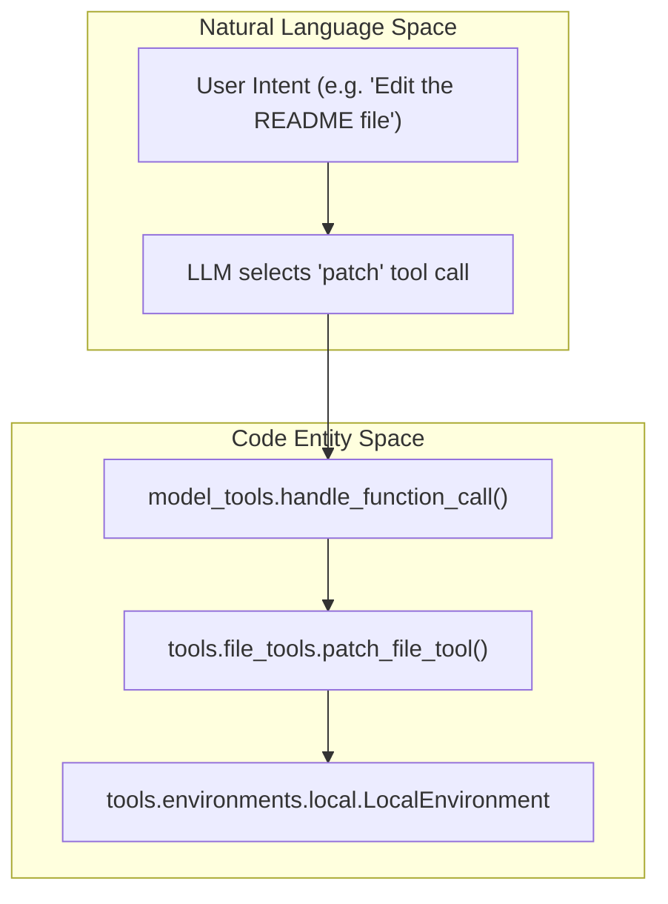
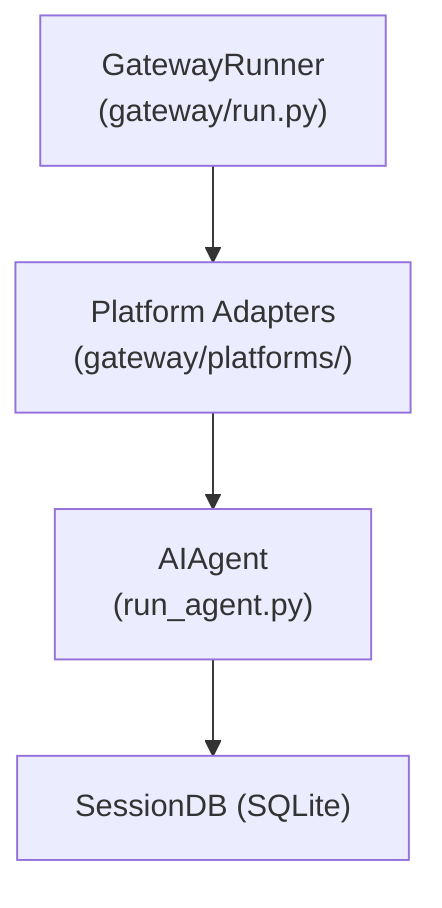

## Purpose and Scope

This document describes the high-level architecture of the Hermes Agent system, focusing on the core three-tier architecture, the major subsystems, and their interactions. Hermes Agent is designed as a self-improving AI agent framework that orchestrates conversations with user input, calls external tools, and manages backend executions autonomously. This page details the implementation components, data flow, and key classes/functions.

The Hermes Agent architecture is organized into three primary tiers:

1.  **User Interface Layer**: Interactive frontends including the CLI (terminal interface), the Messaging Gateway (platform adapters for Telegram, Discord, etc.), Web UI (dashboard), and batch processing runners.
2.  **Core Agent Layer**: The central `AIAgent` class orchestrates conversations, manages context and memory, and invokes external tools. Supporting utilities include prompt building, memory management, context compression, and auxiliary LLM clients.
3.  **Tool & Execution Layer**: A modular, extensible tool system with a registry and discovery mechanism. Tools implement specific functionalities such as terminal commands, file operations, web scraping, code execution, and delegation via subagents. Execution environments abstract over local, containerized, and cloud backends.

---

## Core Architecture Components

### System Overview Diagram

```mermaid
graph TB
    classDef layer fill:#f9f9f9,stroke:#333,stroke-width:1px;

    subgraph "User Interface Layer":::layer
        CLI["HermesCLI<br/>(cli.py)"]
        GatewayRunner["GatewayRunner<br/>(gateway/run.py)"]
        BatchRunner["BatchRunner<br/>(batch_runner.py)"]
        WebUI["Web Server<br/>(hermes_cli/web_server.py)"]
    end

    subgraph "Core Agent Layer":::layer
        AIAgent["AIAgent<br/>(run_agent.py)"]
        ContextCompressor["ContextCompressor<br/>(agent/context_compressor.py)"]
        MemoryStore["MemoryProvider<br/>(agent/memory_manager.py)"]
        AuxiliaryClient["AuxiliaryClient<br/>(agent/auxiliary_client.py)"]
    end

    subgraph "Tool & Execution Layer":::layer
        ToolRegistry["ToolRegistry<br/>(model_tools.py)"]
        ModelTools["model_tools.py<br/>handle_function_call()"]
        TerminalTool["terminal_tool<br/>(tools/terminal_tool.py)"]
        FileTools["file_tools<br/>(tools/file_tools.py)"]
        WebTools["web_tools<br/>(tools/web_tools.py)"]
        BrowserTool["browser_tool<br/>(tools/browser_tool.py)"]
        CodeExecutionTool["execute_code<br/>(tools/code_execution_tool.py)"]
        DelegateTool["delegate_task<br/>(tools/delegate_tool.py)"]
        EnvBackends["Execution Environments<br/>(tools/environments/)"]
    end

    subgraph "Platform Adapters"
        TelegramAdapter["TelegramAdapter<br/>(gateway/platforms/telegram.py)"]
        DiscordAdapter["DiscordAdapter<br/>(gateway/platforms/discord.py)"]
        SlackAdapter["SlackAdapter<br/>(gateway/platforms/slack.py)"]
    end

    subgraph "Configuration & State"
        ConfigLoader["load_config()<br/>(hermes_cli/config.py)"]
        SessionStore["SessionStore<br/>(gateway/session.py)"]
        SessionDB["SessionDB (SQLite)<br/>(hermes_state.py)"]
    end


    CLI --> AIAgent
    GatewayRunner --> AIAgent
    BatchRunner --> AIAgent
    WebUI --> AIAgent

    AIAgent --> ModelTools
    AIAgent --> ContextCompressor
    AIAgent --> AuxiliaryClient
    AIAgent --> SessionDB

    ModelTools --> ToolRegistry

    ToolRegistry --> TerminalTool
    ToolRegistry --> FileTools
    ToolRegistry --> WebTools
    ToolRegistry --> BrowserTool
    ToolRegistry --> CodeExecutionTool
    ToolRegistry --> DelegateTool

    GatewayRunner --> TelegramAdapter
    GatewayRunner --> DiscordAdapter
    GatewayRunner --> SlackAdapter

    CLI --> ConfigLoader

    CodeExecutionTool -.->|spawns| AIAgent
    DelegateTool -.->|spawns| AIAgent

    TerminalTool --> EnvBackends
```

This diagram shows the layered organization from user interfaces through the core agent and finally to the tool and execution infrastructure. Platform adapters allow launching Hermes conversations on external messaging platforms. Configuration is loaded from files and environment variables to configure agent behavior and toolsets.

**Sources:** [run_agent.py:17-21](), [cli.py:9-14](), [gateway/run.py:1-14](), [README.md:15-27](), [model_tools.py:5-10]().

---

## AIAgent: Central Orchestrator

The `AIAgent` class (defined in `run_agent.py`) is the core orchestrator of the Hermes Agent system. It manages conversation lifecycles, invokes LLM providers for message generation and tool calling, manages context windows, and handles persistence of session state.

### Key Attributes and Initialization

*   `self.model`: The chosen model identifier string (e.g., `"anthropic/claude-opus-4.6"`). Controls which LLM provider and model are used. [run_agent.py:19-20]()
*   `self.max_iterations`: Thread-safe counter tracking the remaining LLM turns allowed for this conversation, shared with any spawned subagents to prevent runaway loops. [run_agent.py:135-136]()
*   `self.session_id`: Unique identifier for this conversation session. Used for SQLite session persistence and memory management. [run_agent.py:53]()

### Agent Lifecycle Patterns

*   **CLI**: The CLI instantiates a persistent `AIAgent` instance per terminal session, reusing it across multiple turns of the interactive chat. [cli.py:9-14]()
*   **Gateway**: The gateway maintains an LRU cache of `AIAgent` instances keyed by user and chat platform. Agents are evicted after inactivity timeout (`_AGENT_CACHE_IDLE_TTL_SECS`) to conserve resources. [gateway/run.py:57-62]()
*   **Subagents**: The `delegate_task` tool spawns isolated `AIAgent` instances, passing the parent's iteration budget to enforce query count limits across agent hierarchy. [run_agent.py:135-136]()

**Sources:** [run_agent.py:17-21](), [gateway/run.py:57-62](), [cli.py:9-14]().

---

## Tool System Architecture

Hermes Agent uses a modular, decoupled tool system enabling easy tool discovery, registration, and execution in the agent orchestration layer.

### Tool Discovery and Registry

*   Tool modules register themselves with the central `ToolRegistry` during import via calls to `registry.register()`. This yields a runtime catalog of available tool functions. [run_agent.py:122-127]()
*   The `model_tools.py` module imports all tool modules dynamically to trigger registration. It provides key functions like `get_tool_definitions()` to filter tools by enabled toolsets and `handle_function_call()` to route LLM function call requests to the appropriate implementation. [run_agent.py:122-127]()
*   Toolsets are composable groups of tools, allowing for category-based activation (e.g., `web`, `terminal`, `browser`). [cli.py:10]()

### Function Call Flow



*   The agent receives a user natural language input.
*   The LLM parses it into a JSON tool call (e.g., `patch`).
*   `handle_function_call()` routes it to the correct Python handler. [run_agent.py:125]()
*   The handler invokes the corresponding environment or system (e.g., local shell, Docker container).
*   Results are returned to the agent for inclusion in the conversation.

**Sources:** [run_agent.py:122-127](), [cli.py:10]().

---

## Execution Environments

Tools that require external execution often delegate to terminal or process backends abstracted by the environment layer in `tools/environments/`.

| Backend | Implementation | Description |
| :--- | :--- | :--- |
| Local | `LocalEnvironment` | Runs commands directly on the host machine. [README.md:25]() |
| Docker | `DockerEnvironment` | Runs commands inside an isolated container. [README.md:25]() |
| SSH | `SSHEnvironment` | Remote execution via SSH connection. [hermes_cli/config.py:129]() |
| Modal | `ModalEnvironment` | Serverless cloud execution backend. [README.md:25]() |
| Daytona | `DaytonaEnvironment` | Cloud development environment backend. [README.md:25]() |
| Vercel Sandbox | `VercelSandboxEnvironment` | Cloud microVM execution backend. [README.md:25]() |
| Singularity | `SingularityEnvironment` | Containerized execution with Singularity. [README.md:25]() |

*   The specific backend for terminal tools is chosen based on configuration in `~/.hermes/config.yaml`. [hermes_cli/config.py:5]()
*   Execution environments support configuration such as working directory, resource limits, and environment variables. [hermes_cli/config.py:129-130]()

**Sources:** [README.md:25](), [hermes_cli/config.py:129-130]().

---

## Conversation Loop and Data Flow

The core conversational logic is implemented in the `AIAgent` class. This class manages the full interactive exchange cycle between the user, the LLM, and the tool system.

```mermaid
sequenceDiagram
    participant UI as "User Interface (CLI / Gateway)"
    participant Agent as "run_agent.AIAgent"
    participant LLM as "LLM Provider (OpenRouter/Anthropic/...)"
    participant Tools as "model_tools.handle_function_call()"

    UI->>Agent: run_conversation(prompt)
    Agent->>Agent: sanitize_context()
    loop until completion
        Agent->>LLM: send messages + tool schemas
        LLM-->>Agent: tool call JSON or normal response
        alt tool call
            Agent->>Tools: handle_function_call()
            Tools-->>Agent: tool call result
            Agent->>Agent: append result to messages
        else normal response
            Agent-->>UI: final response text
            break
        end
    end
```

### Prompt Assembly

Prompts are dynamically constructed from multiple components and combined into the chat messages sent to the LLM.

*   **Identity / Persona**: Loaded from `SOUL.md` files specifying the agent's personality via `load_soul_md()`. [run_agent.py:163]()
*   **Memory Context**: Relevant past session data and user profile information injected via `build_memory_context_block()`. [run_agent.py:141]()
*   **Context Files**: Workspace files included in prompts via `build_context_files_prompt()`. [run_agent.py:163]()
*   **Skill Descriptions**: Documentation and usage guidelines of installed tools or skills prepended via `build_skills_system_prompt()`. [run_agent.py:163]()

**Sources:** [run_agent.py:141](), [run_agent.py:163]().

---

## Messaging Gateway Architecture

Hermes supports multi-platform messaging via the gateway subsystem. It enables users to interact with the agent from Telegram, Discord, Slack, WhatsApp, Signal, and more.

*   The gateway run loop is managed by the `GatewayRunner` class in `gateway/run.py`. [gateway/run.py:6]()
*   Platform-specific adapters handle API communication, message formatting, and session routing. [gateway/run.py:5-6]()
*   Sessions and conversations persist in SQLite, facilitating conversation continuity and memory across platforms. [gateway/run.py:92-93]()
*   The gateway bridges `config.yaml` and `.env` settings to maintain consistent behavior across different messaging platforms. [hermes_cli/config.py:1-6]()



**Sources:** [gateway/run.py:1-6](), [hermes_cli/config.py:1-6]().

---

## References

| Component/Feature | Location |
| :--- | :--- |
| Core Agent (`AIAgent`) | [run_agent.py:17-21]() |
| CLI Interface | [cli.py:1-13]() |
| Messaging Gateway | [gateway/run.py:1-14]() |
| Tool System & Registry | [run_agent.py:122-127]() |
| Configuration | [hermes_cli/config.py:1-13]() |
| Auth & Providers | [hermes_cli/auth.py:1-14]() |

**Sources:** [run_agent.py](), [cli.py](), [gateway/run.py](), [hermes_cli/config.py](), [hermes_cli/auth.py]()