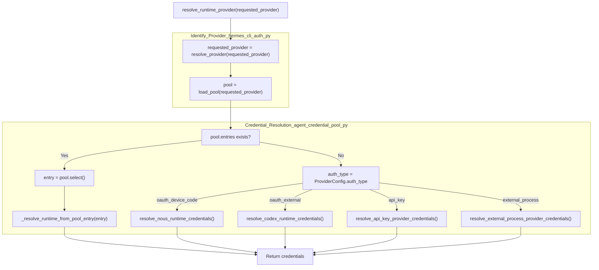
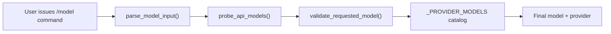

This page documents the authentication system that enables Hermes Agent to connect to Large Language Model (LLM) inference providers. It covers the provider registry, OAuth flows, API key management, credential storage, provider resolution logic, and the auto-detection system.

**Scope**: This page focuses on authentication and provider selection for the **primary inference provider**. For information about auxiliary models used by tools (vision analysis, web scraping, context compression), see [Auxiliary Client (4.5)]().

---

## Overview

Hermes Agent supports a wide range of inference providers through a unified authentication system that handles:

1.  **OAuth Device Code Flows** — Used primarily for Nous Portal authentication where a device code is obtained and authorized via browser [hermes_cli/auth.py:750-845]().
2.  **OAuth External Flows** — Delegated authentication via external CLI tools or browser-based redirects, used by OpenAI Codex, Qwen, and Google Gemini providers [hermes_cli/auth.py:890-1110]().
3.  **API Key Authentication** — Direct API key providers including OpenRouter, Google AI Studio, Z.AI/GLM, Kimi/Moonshot, MiniMax, Alibaba, DeepSeek, xAI, and others [hermes_cli/auth.py:613-689]().
4.  **External Process Providers** — Local or specialized backends using Agent Client Protocol (ACP) for communication, e.g., GitHub Copilot ACP [hermes_cli/auth.py:720-735]().
5.  **Provider Resolution Chain** — Automatic selection of the active provider based on config, environment, and auth state [hermes_cli/runtime_provider.py:237-331]().
6.  **Credential Pooling** — Supports multiple credentials per provider with failover, rotation, and status tracking implemented in the `CredentialPool` system [agent/credential_pool.py:1-35]().

---

## Provider Registry and Models

Hermes Agent maintains a **provider registry** via the `PROVIDER_REGISTRY` dictionary defined in `hermes_cli/auth.py`, containing `ProviderConfig` dataclasses that describe each known provider's authentication type, base URLs, and environment variables for API keys [hermes_cli/auth.py:115-220]().

The canonical provider IDs and their authentication schemes include:

-   **Nous Portal** (`nous`) — OAuth device code [hermes_cli/auth.py:150-158]().
-   **OpenAI Codex** (`openai-codex`) — OAuth external flow [hermes_cli/auth.py:159-164]().
-   **Copilot** (`copilot`) — API key [hermes_cli/auth.py:185-192]().
-   **Google Gemini** (`google-gemini-cli`) — OAuth external [hermes_cli/auth.py:171-176]().
-   **Anthropic** (`anthropic`) — API key [hermes_cli/auth.py:199-204]().
-   **Kimi/Moonshot** (`kimi-coding`) — API key [hermes_cli/auth.py:205-210]().
-   **OpenRouter** (`openrouter`) — API key [hermes_cli/auth.py:217-220]().

### Model Catalogs

Model catalogs curated per provider are declared statically and updated from external sources in `hermes_cli/models.py`. These allow the system and user interfaces like `hermes setup` to display valid model options [hermes_cli/models.py:30-145]().

| Provider ID      | Example Models                            | Notes                               |
| ---------------- | ----------------------------------------- | ----------------------------------- |
| `nous`           | `moonshotai/kimi-k2.6`, `claude-opus-4.7` | Nous Portal preferred models        |
| `copilot`        | `gpt-5.4`, `claude-sonnet-4.6`            | GitHub Copilot and ACP              |
| `anthropic`      | `claude-opus-4.7`, `claude-sonnet-4.6`    | Direct Anthropic API                |
| `openai-codex`   | Various codex models                      | OAuth authenticated OpenAI Codex    |
| `kimi-coding`    | `kimi-k2.6`, `kimi-k2-turbo-preview`      | Kimi / Moonshot family              |
| `zai`            | `glm-5.1`, `glm-4.5-flash`                | Z.AI GLM                            |

Sources: [hermes_cli/auth.py:115-220](), [hermes_cli/models.py:30-145]()

---

## Provider Resolution Chain

Hermes uses a resolution chain to determine which provider and credentials to use at runtime, leveraging config files, environment variables, and authentication state.

### Key Functions and Classes

-   `resolve_provider(requested: Optional[str]) -> str`: Determines the preferred provider ID based on explicit request, config, or detected active provider [hermes_cli/auth.py:440-460]().
-   `load_pool(provider: str) -> CredentialPool`: Loads credential pools from persisted storage to support rotation and failover [agent/credential_pool.py:40-100]().
-   `resolve_runtime_provider(requested_provider: Optional[str]) -> dict`: Central function that finally resolves runtime credentials (API keys, tokens, endpoints) for the selected provider [hermes_cli/runtime_provider.py:237-331]().
-   `_resolve_runtime_from_pool_entry()`: Internal helper that maps a `PooledCredential` to the expected runtime dict format [hermes_cli/runtime_provider.py:179-235]().

### Resolution Logic Diagram

"Runtime Provider Resolution Flow"

Sources: [hermes_cli/runtime_provider.py:237-331](), [agent/credential_pool.py:40-100](), [hermes_cli/auth.py:440-460]()

---

## Authentication Implementation Details

### OAuth Device Code Flow (Nous Portal)

-   Implemented primarily in `_login_nous()` [hermes_cli/auth.py:750-845]().
-   Steps:
    1.  CLI fetches a device code and verification URI from `/oauth/device-authorization`.
    2.  User visits provided URL and enters the device code, authenticating the agent.
    3.  CLI polls the token endpoint every second up to a timeout.
    4.  On success, OAuth tokens and refresh tokens are stored in `auth.json`.
    5.  At runtime, `resolve_nous_runtime_credentials()` calls `_mint_nous_agent_key()` to obtain short-lived inference keys for API calls [hermes_cli/auth.py:927-975]().

### OAuth External Flows (OpenAI Codex, Qwen, Google Gemini)

-   Delegates token storage and expiry management to external CLI tools or browser sessions.
-   `resolve_codex_runtime_credentials()` reads tokens and refreshes if needed; supports the OpenAI Responses API for GPT-5.x tool calls [hermes_cli/auth.py:1047-1064]().
-   `resolve_gemini_oauth_runtime_credentials()` handles Google's Cloud Code Assist authentication [hermes_cli/auth.py:1104-1121]().

### API Key Providers

-   Function `resolve_api_key_provider_credentials()` scans environment variables specified in the provider config's `api_key_env_vars` for API keys [hermes_cli/auth.py:613-644]().
-   Special case for Anthropic reads credentials from `~/.claude/.credentials.json` if a `ANTHROPIC_API_KEY` or equivalent is not available [hermes_cli/auth.py:646-689]().

Sources: [hermes_cli/auth.py:613-1121]()

---

## Auto-Detection and Probing

Hermes Agent supports auto-detection of models and providers, especially useful for local servers and custom endpoints.

### Local Model Auto-Detection

-   `_auto_detect_local_model()` queries `/v1/models` of a local or custom base URL [hermes_cli/runtime_provider.py:89-107]().
-   If exactly one model is found, it is auto-selected as the default for that endpoint.

### Model Validation Chain

-   When the user requests a model change via `/model`, the request is parsed using `parse_model_input()` which extracts provider and model [hermes_cli/models.py:186-215]().
-   `probe_api_models()` attempts to fetch live models from the provider API to confirm model presence [hermes_cli/models.py:233-255]().

"Model Selection and Probing"

Sources: [hermes_cli/runtime_provider.py:89-107](), [hermes_cli/models.py:186-255]()

---

## Data Flow: Credential Storage and Persistence

### Files and Their Purpose

| Location                         | Entity           | Purpose                                                                         |
| -------------------------------- | ---------------- | ------------------------------------------------------------------------------- |
| `~/.hermes/auth.json`            | `AuthStore`      | Persistent OAuth tokens, active provider state, refresh tokens [hermes_cli/auth.py:8-14]() |
| `~/.hermes/credential_pool.json` | `CredentialPool` | Credentials pools for rotation and failover [agent/credential_pool.py:1-10]()   |
| `~/.hermes/.env`                 | Env Vars         | API keys for providers like OpenRouter, GLM, Anthropic [hermes_cli/config.py:139]() |
| `~/.hermes/config.yaml`          | `Config`         | User preferences including default model and provider [hermes_cli/config.py:134]() |

### Concurrency Safety

Access to `auth.json` and `credential_pool.json` is protected by multi-platform advisory file locking using `fcntl` on Unix and `msvcrt` on Windows. This prevents data races across CLI, gateway, and long-running processes [hermes_cli/auth.py:50-58]().

Sources: [hermes_cli/auth.py:8-58](), [agent/credential_pool.py:1-10](), [hermes_cli/config.py:134-146]()