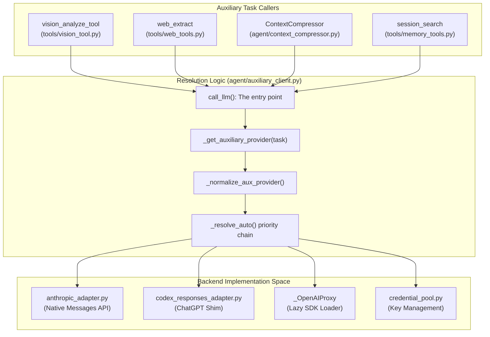
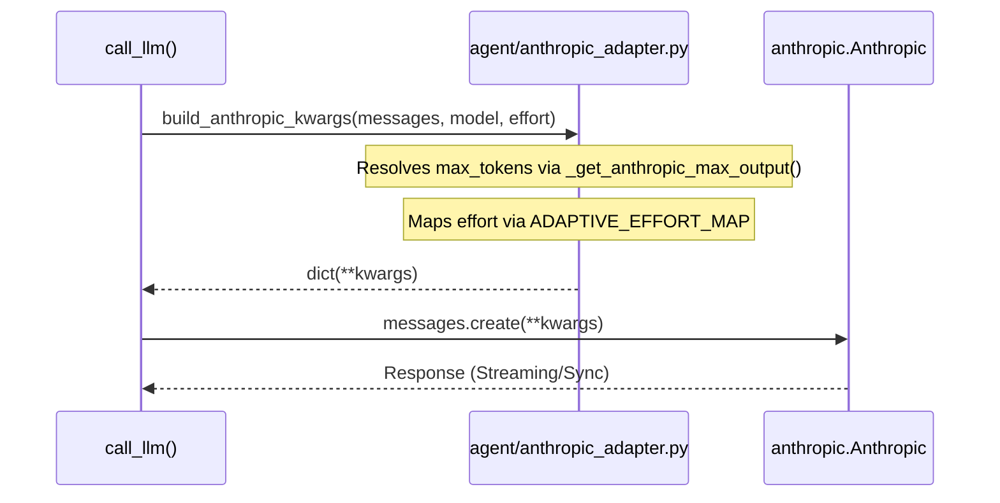

## Purpose and Scope

The auxiliary client is a centralized subsystem designed to handle auxiliary large language model (LLM) invocations for side tasks that are distinct from the primary conversation model. These side tasks include:

- **Text-focused auxiliary tasks** such as web content extraction, session search, and session context compression.
- **Vision or multimodal auxiliary tasks** such as image analysis for vision tools and browser screenshot understanding.

The auxiliary client system provides a unified provider resolution chain and client instantiation logic, enabling shared and consistent fallback behavior across different consumers. This shields main agent conversation workloads and their context windows from heavy summarization or specialized processing demands, offloading these to cheaper or task-specialized backends.

It supports a wide variety of providers including OpenRouter, Nous Portal OAuth, local/self-hosted custom endpoints, OpenAI Codex OAuth, native Anthropic, and direct API-key providers such as Google Gemini, Kimi/Moonshot, and MiniMax. The system also handles transparent payment/credit exhaustion fallbacks by retrying with the next available provider.

**Sources:** [agent/auxiliary_client.py:1-41](), [agent/auxiliary_client.py:43-51]()

---

## Architecture Overview

The auxiliary client provides a centralized provider routing and fallback system for auxiliary LLM invocations. Instead of each tool or side task implementing its own provider and credential resolution, this system allows all auxiliary consumers to reuse a common resolution chain which selects the best available backend per task type and configured overrides.

### Diagram: Task to Provider Resolution to Backend Clients

This diagram bridges the high-level tasks to the specific code entities responsible for resolution and execution.

**Sources:** [agent/auxiliary_client.py:7-41](), [agent/auxiliary_client.py:165-183](), [agent/auxiliary_client.py:100-107]()

---

## Provider Resolution Chain

### Automatic Provider Resolution

The auxiliary client implements `_resolve_auto()` which attempts the following provider priorities in order for text tasks:

| Priority | Provider         | Credential / Config Source                          | Implementation Detail                                            |
|----------|------------------|---------------------------------------------------|------------------------------------------------------------------|
| 1        | Main Provider    | `_read_main_provider()`                           | Uses `AIAgent`'s primary model/provider [agent/auxiliary_client.py:174-182]() |
| 2        | OpenRouter       | `OPENROUTER_API_KEY`                              | Resolves via `OPENROUTER_BASE_URL` [agent/auxiliary_client.py:10-10]() |
| 3        | Nous Portal      | `~/.hermes/auth.json`                             | Uses `ProviderConfig` for "nous" [hermes_cli/auth.py:150-158]() |
| 4        | Custom Endpoint  | `OPENAI_BASE_URL` + `OPENAI_API_KEY`              | OpenAI-compatible `custom` mode [agent/auxiliary_client.py:12-12]() |
| 5        | Native Anthropic | `ANTHROPIC_API_KEY`                               | Direct integration via `anthropic_adapter.py` [agent/anthropic_adapter.py:7-11]() |
| 6        | Direct API Key   | `z.ai`, `Kimi`, `MiniMax` keys                    | Direct API key providers [agent/auxiliary_client.py:14-14]() |

Vision/Multimodal task provider resolution prioritize supported vision backends like OpenRouter, Nous Portal, and Native Anthropic. [agent/auxiliary_client.py:17-23]()

**Sources:** [agent/auxiliary_client.py:7-15](), [agent/auxiliary_client.py:131-162](), [hermes_cli/auth.py:149-164]()

---

## Client Types and Adapters

### Anthropic Native Adapter

Hermes Agent includes a native adapter for Anthropic's Messages API in `agent/anthropic_adapter.py`. This adapter translates Hermes's internal OpenAI message format to Anthropic's message schema.

**Key Logic:**

- **Reasoning Effort**: Maps `reasoning_effort` to `output_config.effort` using `ADAPTIVE_EFFORT_MAP`. [agent/anthropic_adapter.py:56-63]()
- **Thinking Budget**: Defines character/token limits for extended thinking via `THINKING_BUDGET`. [agent/anthropic_adapter.py:47-47]()
- **Output Limits**: `_get_anthropic_max_output()` performs substring matching against `_ANTHROPIC_OUTPUT_LIMITS` to find the correct token ceiling for date-stamped model IDs. [agent/anthropic_adapter.py:119-137]()
- **Sampling Guard**: `_NO_SAMPLING_PARAMS_SUBSTRINGS` identifies models (like Opus 4.7) that return HTTP 400 if `temperature` or `top_p` are provided. [agent/anthropic_adapter.py:76-78]()

### Diagram: Anthropic Adapter Data Flow

**Sources:** [agent/anthropic_adapter.py:47-63](), [agent/anthropic_adapter.py:119-137](), [agent/anthropic_adapter.py:166-170]()

---

### OpenAI Proxy Implementation

To reduce startup latency, the `OpenAI` client is not imported at the module level. Instead, a lazy proxy is used.

- **`_OpenAIProxy`**: A class that implements `__call__` to import `openai.OpenAI` only when the client is instantiated. [agent/auxiliary_client.py:81-100]()
- **`_load_openai_cls()`**: Caches the imported class to ensure subsequent calls are fast. [agent/auxiliary_client.py:72-78]()

**Sources:** [agent/auxiliary_client.py:72-100]()

---

## Smart Routing and Fallbacks

### Credential Pool Integration

The auxiliary client leverages `agent/credential_pool.py` to manage multiple keys for the same provider.

- **`load_pool()`**: Loads credentials from `~/.hermes/credentials.json`. [agent/auxiliary_client.py:102-102]()
- **Provider Aliases**: The system normalizes provider names (e.g., `google` -> `gemini`, `claude` -> `anthropic`) to ensure configuration keys match internal registries. [agent/auxiliary_client.py:131-162]()

### Payment and Error Handling Fallback

The `call_llm()` entry point is designed to be robust against transient provider failures:

1. It classifies API errors using `agent/error_classifier.py`.
2. If an error is classified as a credit exhaustion (HTTP 402) or a rate limit, the client can be re-resolved to the next provider in the `_resolve_auto()` chain.
3. This is particularly useful for tasks like `compression` which must succeed to prevent context window overflow.

**Sources:** [agent/auxiliary_client.py:36-41](), [agent/error_classifier.py:140-145]()

---