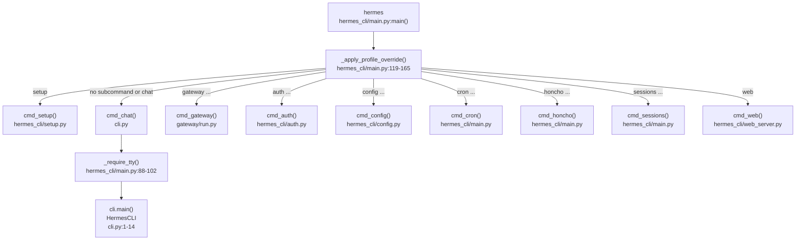
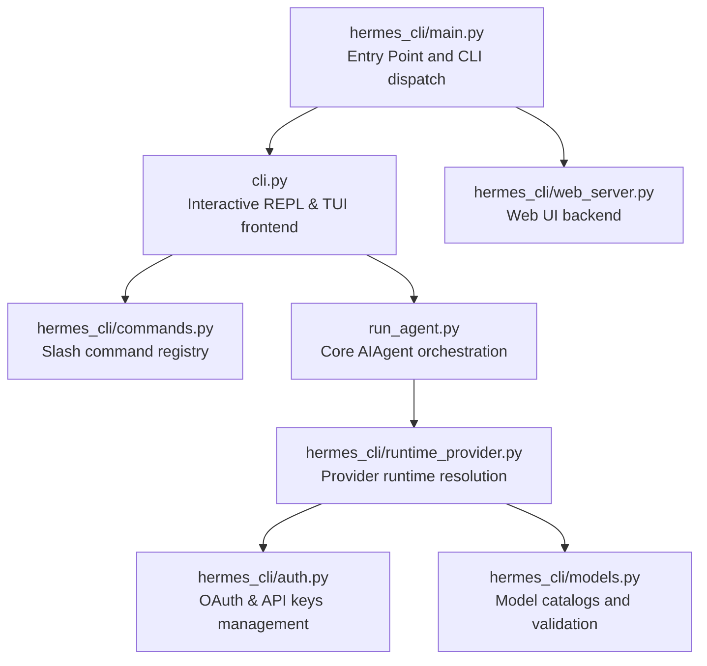
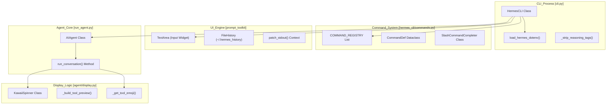
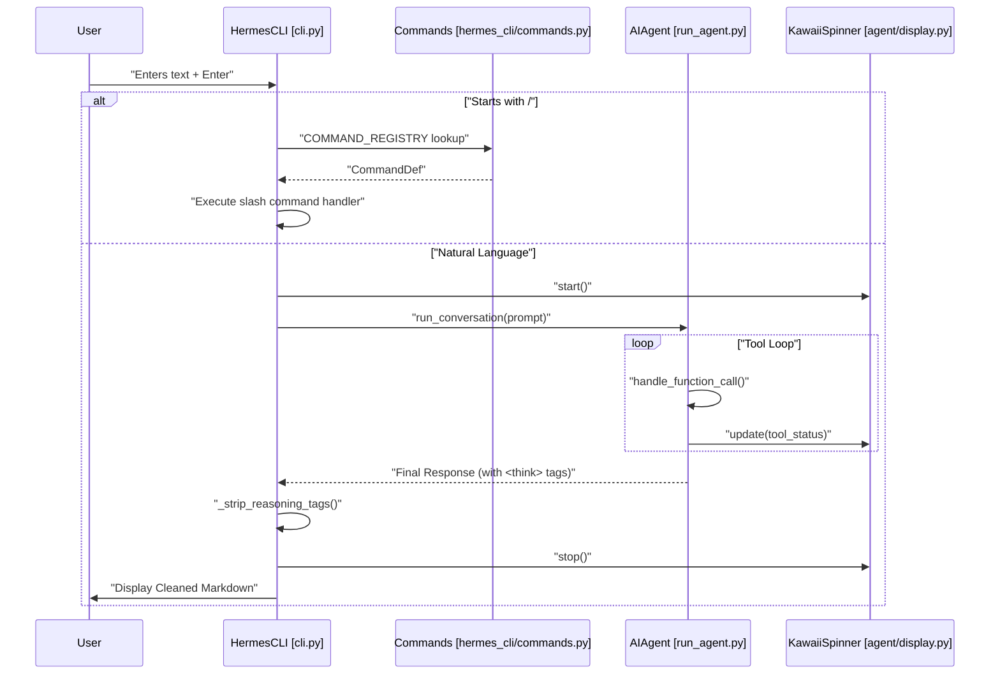
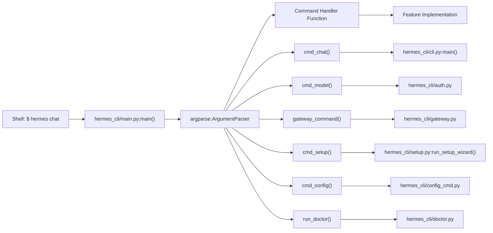
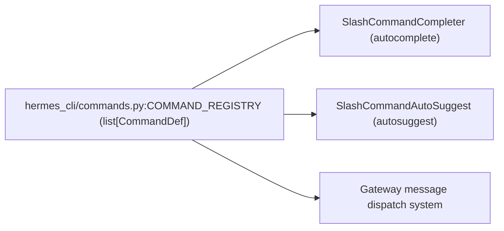

This page provides a high-level overview of the Hermes Agent command-line interface (CLI). It covers the main entry point, operating modes, configuration hierarchy, subcommand groups, and the key components bridging user interaction with the core AI agent orchestration and multi-provider runtime resolution. Detailed technical information and usage instructions for each subtopic are provided in dedicated child pages linked below.

## Entry Point

The primary CLI entry point for Hermes Agent is the `hermes` executable, which corresponds to the `hermes_cli/main.py` module. Its `main()` function builds a hierarchical `argparse` command parser and dispatches subcommands to handler functions prefixed with `cmd_` [hermes_cli/main.py:1-44]().

Before argument parsing, a specialized profile override system processes the `--profile` or `-p` flags to correctly set the `HERMES_HOME` environment variable for configuration isolation [hermes_cli/main.py:119-165](). This ensures that all imported modules that cache the home path operate on the intended profile directory.

**Dispatcher Architecture**



Sources: [hermes_cli/main.py:1-44](), [hermes_cli/main.py:88-102](), [hermes_cli/main.py:119-165](), [gateway/run.py:1-14](), [cli.py:1-14]()

---

## Operating Modes

The Hermes CLI supports three primary frontend modes under the `chat` subcommand (also the default when running just `hermes`) [cli.py:1-14]():

| Mode                | Invocation                      | Description                                                              |
|---------------------|--------------------------------|--------------------------------------------------------------------------|
| **Interactive CLI**  | `hermes` or `hermes chat`       | Launches the `HermesCLI` class using `prompt_toolkit`. Features include a fixed input area, multiline input support, syntax highlighting, and persistent session history. |
| **Interactive TUI**  | `hermes --tui`                  | Launches a React Ink-based Terminal User Interface (TUI) frontend offering enhanced mouse support, JSON-RPC gateway integration, and visual task monitoring. |
| **Single-query**     | `hermes chat -q "your query"`  | Sends a single query directly to `AIAgent.run_conversation()`, streams the raw response to stdout, then exits immediately. Useful for scripting or automation. |

Internally, the `HermesCLI` class in `cli.py` wraps the `AIAgent` class defined in `run_agent.py` to orchestrate conversations, handle model provider runtime resolution, and perform tool calls.

For robustness in headless environments or when running subagents in threads, Hermes wraps standard output and error with a `_SafeWriter` that suppresses broken pipe errors, preventing crashes during output writes [run_agent.py:193-195]().

**Interaction Flow**

```mermaid
flowchart LR
    USER_IN["User Input"]
    CLI_OBJ["HermesCLI\ncli.py"]
    AGENT["AIAgent\nrun_agent.py"]
    RUNTIME["runtime_provider.py\nresolve_runtime_provider()"]
    POOL["CredentialPool\nagent/credential_pool.py"]
    TOOLS["model_tools.py\nTool Management"]

    USER_IN --> CLI_OBJ
    CLI_OBJ -->|run_conversation()| AGENT
    AGENT --> RUNTIME
    RUNTIME --> POOL
    AGENT --> TOOLS
```

Sources: [cli.py:1-14](), [run_agent.py:193-195](), [run_agent.py:105-116]()

---

## Configuration Hierarchy

Hermes CLI configuration is layered to enable flexible environment and user overrides [hermes_cli/config.py:1-13]():

1.  **Command-line arguments:** Highest precedence for overrides per invocation (e.g., `--model`, `--provider`).
2.  **User configuration file:** `~/.hermes/config.yaml`, storing all non-secret settings [hermes_cli/config.py:5]().
3.  **Environment file:** `~/.hermes/.env`, for secrets including API keys and tokens [hermes_cli/config.py:6]().
4.  **Built-in defaults:** Hardcoded fallback values for safe operation [hermes_cli/config.py:136]().

The `hermes setup` wizard guides users interactively through configuring AI providers, models, terminal backends (local, Docker, SSH, Modal, Daytona, Singularity), and messaging platform integrations [hermes_cli/setup.py:1-10]().

The configuration system supports environment variable substitution with `${VAR_NAME}` style references inside `config.yaml` [website/docs/user-guide/configuration.md:58-72]().

For more on configuration commands and best practices, see [Command Reference](#3.2).

Sources: [hermes_cli/config.py:1-13](), [website/docs/user-guide/configuration.md:58-72](), [hermes_cli/setup.py:1-12]()

---

## Subcommand Groups

The CLI commands are organized into functional groups, each handled by dedicated modules or functions [hermes_cli/main.py:1-44]():

| Subcommand      | Handler              | Purpose                                              |
|-----------------|----------------------|-----------------------------------------------------|
| `chat`          | `cmd_chat`           | Interactive chat REPL or single-query requests, integrating with the `HermesCLI` prompt and `AIAgent` engines [cli.py:1-14]() |
| `setup`         | `cmd_setup`          | Interactive setup wizard for initial configuration [hermes_cli/setup.py:1-12]() |
| `config`        | `cmd_config`         | Inspect and modify `config.yaml` and `.env` files [hermes_cli/config.py:1-13]() |
| `auth`          | `cmd_auth`           | Manage authentication providers and OAuth flows [hermes_cli/auth.py:1-14]() |
| `gateway`       | `cmd_gateway`        | Run and manage messaging platform gateway adapters [gateway/run.py:1-14]() |
| `web`           | `cmd_web`            | Launch the React-backed Web UI Dashboard [hermes_cli/main.py:34]() |
| `skills`        | `cmd_skills`         | Manage agent skills, including browsing and installation [hermes_cli/main.py:41]() |
| `sessions`      | `cmd_sessions`       | Browse, export, and manage conversation session history [hermes_cli/main.py:41]() |
| `honcho`        | `cmd_honcho`         | Configure and manage Honcho AI memory integration [hermes_cli/main.py:21-36]() |

### Slash Commands in Interactive Chat

Within the interactive chat mode, a rich set of slash commands (e.g., `/new`, `/model`, `/status`) is implemented centrally in a `COMMAND_REGISTRY` [hermes_cli/commands.py:64](). This registry serves as the authoritative source for CLI autocomplete, gateway command dispatch, and platform-specific help messages [hermes_cli/commands.py:1-9]().

For detailed documentation of slash commands and interactive controls, see the child page [Interactive Chat](#3.1).

Sources: [hermes_cli/main.py:1-44](), [hermes_cli/commands.py:1-9](), [hermes_cli/commands.py:64]()

---

## Module Layout and Integration

The CLI system bridges the user-facing command-line interface with the kernel of agent orchestration, multi-provider runtime resolution, and tool execution.



Sources: [hermes_cli/main.py:1-44](), [hermes_cli/commands.py:1-9](), [run_agent.py:1-21](), [hermes_cli/auth.py:1-14]()

---

## Child Pages

For detailed explanations and usage instructions, please refer to the following child pages:

-   [Interactive Chat](#3.1) — Covers the interactive REPL mode, slash commands, session management, and conversation controls.
-   [Command Reference](#3.2) — Provides a comprehensive reference for all Hermes subcommands, including `chat`, `model`, `gateway`, `setup`, `config`, `skills`, and `sessions`.
-   [TUI (Terminal User Interface)](#3.3) — Documents the React Ink-based TUI frontend (`--tui` flag), its JSON-RPC gateway server, components, and how it differs from the traditional `prompt_toolkit` interface.
-   [Web UI Dashboard](#3.4) — Details the `hermes web` command, the FastAPI backend (`hermes_cli/web_server.py`), and the React-based dashboard for managing configurations, sessions, cron jobs, skills, analytics, and API keys through a web browser.

---

Sources:
- [hermes_cli/main.py:1-165]()
- [cli.py:1-14]()
- [run_agent.py:1-21, 193-195]()
- [hermes_cli/config.py:1-13]()
- [hermes_cli/commands.py:1-9, 64]()
- [hermes_cli/setup.py:1-12]()
- [website/docs/user-guide/configuration.md:1-112]()

# Interactive Chat


This page documents the interactive terminal chat experience provided by the Hermes Agent CLI. It covers the REPL architecture, `prompt_toolkit` integration, slash commands, and session management.

---

## Component Architecture

The interactive chat is managed primarily by the `HermesCLI` class in `cli.py`. It orchestrates the lifecycle of a conversation by bridging user input to the `AIAgent` core [cli.py:1-13]().

1.  **TUI layer** — Uses `prompt_toolkit` to manage a fixed input widget (`TextArea`) at the bottom of the terminal with scrolling output above [cli.py:58-64]().
2.  **Branding/display layer** — `hermes_cli/banner.py` renders the ASCII logo and version labels [cli.py:93-93]().
3.  **Command layer** — `hermes_cli/commands.py` provides a central `COMMAND_REGISTRY` for slash commands and tab-completion [hermes_cli/commands.py:64-111]().
4.  **Agent layer** — `AIAgent` (from `run_agent.py`) handles the conversation logic and tool execution [run_agent.py:18-20]().

**Diagram 1: Interactive Chat Component Map**



Sources: [cli.py:58-64](), [cli.py:108-110](), [cli.py:123-192](), [hermes_cli/commands.py:64-111](), [run_agent.py:122-127](), [run_agent.py:171-176]()

---

## REPL Flow and Input Handling

The CLI uses an asynchronous REPL loop. `patch_stdout()` is used to ensure that background updates (like the agent's spinner or tool progress) do not corrupt the user's input line [cli.py:57-57](). The interface supports multi-line input via `Shift+Enter` or `Ctrl+Enter` aliases [cli.py:74-80]().

**Diagram 2: Input-to-Agent Execution Flow**



Sources: [cli.py:58-64](), [cli.py:123-192](), [hermes_cli/commands.py:40-61](), [run_agent.py:122-127](), [run_agent.py:171-176]()

---

## Slash Commands

Commands are defined in `hermes_cli/commands.py` and categorized for the help system. The `COMMAND_REGISTRY` is the single source of truth for the CLI, gateway, and autocomplete [hermes_cli/commands.py:64-111]().

### Session & Control Commands
| Command | Alias | Description |
| :--- | :--- | :--- |
| `/new` | `/reset` | Start a new session (fresh ID + history) [hermes_cli/commands.py:66-67]() |
| `/retry` | - | Retry the last message (resend to agent) [hermes_cli/commands.py:78-78]() |
| `/undo` | - | Remove the last user/assistant exchange [hermes_cli/commands.py:79-79]() |
| `/rollback` | - | List or restore filesystem checkpoints [hermes_cli/commands.py:88-89]() |
| `/background`| `/bg` | Run a prompt in the background [hermes_cli/commands.py:97-98]() |
| `/stop` | - | Kill all running background processes [hermes_cli/commands.py:92-92]() |

### Configuration & UI Commands
| Command | Alias | Description |
| :--- | :--- | :--- |
| `/personality`| - | Set a predefined personality [hermes_cli/commands.py:126-127]() |
| `/model` | `/provider` | Switch model for this session [hermes_cli/commands.py:121-122]() |
| `/reasoning` | - | Manage reasoning effort and display [hermes_cli/commands.py:138-140]() |
| `/config` | - | Show current configuration [hermes_cli/commands.py:119-120]() |
| `/yolo` | - | Toggle YOLO mode (skip approvals) [hermes_cli/commands.py:136-137]() |

Sources: [hermes_cli/commands.py:64-111]()

---

## Session Management and Persistence

Interactive mode ensures continuity through several mechanisms:

1.  **Trajectory Logging:** Every conversation turn can be saved as a trajectory via `_save_trajectory_to_file` for later inspection or training [run_agent.py:184-187]().
2.  **History:** Input history is persisted in `~/.hermes_history` via `prompt_toolkit.history.FileHistory` [cli.py:55-55]().
3.  **Environment Loading:** The CLI loads `.env` from `~/.hermes/.env` first, then project root as a fallback via `load_hermes_dotenv` [cli.py:106-111]().
4.  **Context Compression:** `ContextCompressor` monitors context window usage and triggers summarization based on thresholds [run_agent.py:160-160]().

### Runtime Provider Resolution
When a session starts or a model is switched, the system resolves credentials and configuration. This checks:
1.  **Config Precedence:** CLI arguments → `config.yaml` → `.env` → defaults. The `hermes_cli.config` module handles this hierarchy [hermes_cli/config.py:1-13]().
2.  **API Keys:** Secrets are specifically routed to `.env` while settings go to `config.yaml` [hermes_cli/config.py:54-105]().
3.  **Timeouts:** Provider-specific and model-specific timeouts (e.g., `request_timeout_seconds`) are applied at runtime using `get_provider_request_timeout` and `get_provider_stale_timeout` [run_agent.py:106-109]().
4.  **API Mode Detection:** The `_detect_api_mode_for_url` function in `hermes_cli/runtime_provider.py` automatically determines the correct API mode (e.g., `codex_responses`, `anthropic_messages`) based on the resolved base URL [hermes_cli/runtime_provider.py:62-87](). This ensures compatibility with various LLM endpoints.
5.  **Local Model Detection:** For local servers like Ollama or LM Studio, `_auto_detect_local_model` queries the `/v1/models` endpoint to automatically select the loaded model if only one is available [hermes_cli/runtime_provider.py:89-108]().

Sources: [cli.py:55-55](), [cli.py:106-111](), [run_agent.py:106-109](), [run_agent.py:160-160](), [run_agent.py:184-187](), [hermes_cli/config.py:1-13](), [hermes_cli/config.py:54-105](), [hermes_cli/runtime_provider.py:62-87](), [hermes_cli/runtime_provider.py:89-108]()

# Command Reference


This page documents all `hermes` terminal commands — the subcommands you run from your shell to configure, manage, and interact with Hermes Agent.

**Scope:** Covers the command-line interface (CLI) exposed by the `hermes` executable. For slash commands used inside interactive chat sessions (like `/help`, `/model`, `/tools`), see [Interactive Chat](3.1).

Related resources include the [Environment Variables Reference](website/docs/reference/environment-variables.md)() and the [CLI Commands Reference](website/docs/reference/cli-commands.md)().

---

## Command Entry Point

All Hermes commands start with the `hermes` executable, which is installed as a Python console script invoking `hermes_cli.main:main()`. [hermes_cli/main.py:1-44]()

Before parsing CLI arguments, the entrypoint checks for profile selection using arguments or the sticky default profile saved in `~/.hermes/active_profile` and sets `HERMES_HOME` accordingly via `_apply_profile_override()` [hermes_cli/main.py:119-156](). This ensures all config and state reads respect the active profile.

### CLI Dispatch: Natural Language to Code Mapping

**Sources:** [hermes_cli/main.py:5-44](), [hermes_cli/main.py:119-156](), [website/docs/reference/cli-commands.md:13-29]()

---

## Command Hierarchy

`hermes` uses Python's `argparse` subparsers for command nesting. Below is the top-level hierarchy of commands and select subcommands.

### Command Structure Diagram

```mermaid
graph TB
  hermes["hermes_cli/main.py:main()"]

  hermes --> chat["chat"]
  hermes --> model["model"]
  hermes --> gateway["gateway"]
  hermes --> setup["setup"]
  hermes --> whatsapp["whatsapp"]
  hermes --> login["login"]
  hermes --> logout["logout"]
  hermes --> status["status"]
  hermes --> cron["cron"]
  hermes --> doctor["doctor"]
  hermes --> config["config"]
  hermes --> pairing["pairing"]
  hermes --> skills["skills"]
  hermes --> honcho["honcho"]
  hermes --> acp["acp"]
  hermes --> tools["tools"]
  hermes --> sessions["sessions"]
  hermes --> insights["insights"]
  hermes --> claw["claw"]
  hermes --> version["version"]
  hermes --> update["update"]
  hermes --> uninstall["uninstall"]

  gateway --> gw_run["run"]
  gateway --> gw_start["start"]
  gateway --> gw_stop["stop"]
  gateway --> gw_restart["restart"]
  gateway --> gw_status["status"]
  gateway --> gw_install["install"]
  gateway --> gw_uninstall["uninstall"]
  gateway --> gw_setup["setup"]

  setup --> setup_model["model"]
  setup --> setup_terminal["terminal"]
  setup --> setup_gateway["gateway"]
  setup --> setup_tools["tools"]
  setup --> setup_agent["agent"]

  config --> config_show["show"]
  config --> config_edit["edit"]
  config --> config_set["set"]
  config --> config_path["path"]
  config --> config_env_path["env-path"]
  config --> config_check["check"]
  config --> config_migrate["migrate"]

  cron --> cron_list["list"]
  cron --> cron_status["status"]
  cron --> cron_tick["tick"]

  pairing --> pairing_list["list"]
  pairing --> pairing_approve["approve"]
  pairing --> pairing_revoke["revoke"]
  pairing --> pairing_clear["clear-pending"]
```

**Sources:** [hermes_cli/main.py:5-44](), [website/docs/reference/cli-commands.md:30-55]()

---

## Global Options

Global flags modify behavior across subcommands. The `--accept-hooks` flag is attached to every agent subparser to auto-approve shell hooks [hermes_cli/main.py:74-85]().

| Option | Type | Description | Code Reference |
|--------|------|-------------|----------------|
| `--version`, `-V` | Flag | Show version and exit | [website/docs/reference/cli-commands.md:23]() |
| `--profile <name>`, `-p` | String | Select which Hermes profile to use. | [hermes_cli/main.py:126-135]() |
| `--resume <session>`, `-r` | String | Resume a previous session by ID or title. | [website/docs/reference/cli-commands.md:25]() |
| `--continue [name]`, `-c`| Optional String | Resume the most recent session. | [website/docs/reference/cli-commands.md:26]() |
| `--worktree`, `-w` | Flag | Start in an isolated git worktree. | [website/docs/reference/cli-commands.md:27]() |
| `--yolo` | Flag | Bypass dangerous-command approval prompts. | [website/docs/reference/cli-commands.md:28]() |
| `--accept-hooks` | Flag | Auto-approve unseen shell hooks. | [hermes_cli/main.py:78-84]() |
| `--tui` | Flag | Launch the React Ink-based TUI. | [website/docs/reference/cli-commands.md:32]() |

**Sources:** [hermes_cli/main.py:55-85](), [website/docs/reference/cli-commands.md:19-34]()

---

## Core Commands

### `hermes chat`

Primary interactive or one-shot chat interface. It invokes `hermes_cli/cli.py:main()` which handles the REPL, prompt_toolkit layout, and tool previews [cli.py:1-45]().

- **Implementation flow:** `cmd_chat()` [hermes_cli/main.py:5-7]() → `cli.py`.
- **Key Features:**
  - One-shot queries via `-q` / `--query`.
  - Model/Provider overrides via `--model` and `--provider`.
  - Toolset selection via `-t` / `--toolsets`.
  - Context length auto-detection and display [cli.py:93]().

**Sources:** [hermes_cli/main.py:5-7](), [cli.py:1-100](), [website/docs/reference/cli-commands.md:75-111]()

---

### `hermes model`

Interactive provider and model selection wizard.

- **Implementation:** Dispatches to `hermes_cli/auth.py` for credential management and `hermes_cli/models.py` for catalog browsing.
- **Catalogs:** Maintains curated lists for OpenRouter [hermes_cli/models.py:34-67](), Vercel AI Gateway [hermes_cli/models.py:76-92](), and OpenAI Codex [hermes_cli/models.py:97-105]().
- **Resolution:** Uses `fetch_model_metadata` to determine context limits and pricing [agent/model_metadata.py:152-160]().

**Sources:** [hermes_cli/auth.py:149-192](), [hermes_cli/models.py:1-150](), [website/docs/reference/cli-commands.md:112-134]()

---

### `hermes gateway`

Manage the messaging gateway service for multi-platform integration.

- **Implementation:** `gateway_command()` in `hermes_cli/gateway.py` handles lifecycle.
- **Subcommands:** `run` (foreground), `start`/`stop` (daemon service), `status`, `install` (systemd/launchd), and `setup`.
- **Freshness Gate:** Uses `_AUTO_CONTINUE_FRESHNESS_SECS_DEFAULT` (1 hour) to decide if interrupted turns should auto-resume [gateway/run.py:106-155]().

**Sources:** [gateway/run.py:1-106](), [hermes_cli/main.py:8-13]()

---

### `hermes setup`

An interactive setup wizard for initial configuration.

- **Implementation:** `run_setup_wizard()` in `hermes_cli/setup.py`.
- **Modules:**
  1. Model & Provider [hermes_cli/setup.py:5]()
  2. Terminal Backend [hermes_cli/setup.py:6]()
  3. Agent Settings [hermes_cli/setup.py:7]()
  4. Messaging Platforms [hermes_cli/setup.py:8]()
  5. Tools [hermes_cli/setup.py:9]()

**Sources:** [hermes_cli/setup.py:1-30](), [hermes_cli/main.py:14]()

---

### `hermes config`

View and manage Hermes configuration files.

- **Storage:** Primary config in `~/.hermes/config.yaml`, secrets in `~/.hermes/.env` [hermes_cli/config.py:4-6]().
- **Precedence:** CLI args → `config.yaml` → `.env` → Defaults [website/docs/user-guide/configuration.md:47-53]().
- **Validation:** `_warn_config_parse_failure()` ensures users are notified of YAML errors [hermes_cli/config.py:37-71]().

**Sources:** [hermes_cli/config.py:1-150](), [website/docs/user-guide/configuration.md:26-43]()

---

### `hermes honcho`

Manage Honcho AI memory integration.

- **Capabilities:** Mapping directories to sessions, setting peer names (User/AI), configuring dialectic reasoning levels, and managing token budgets [hermes_cli/main.py:21-36]().

**Sources:** [hermes_cli/main.py:21-36]()

---

## Natural Language to Code Bridge: Slash Commands Registry

Slash commands used inside chat (e.g., `/new`, `/background`) are defined centrally in `hermes_cli.commands.COMMAND_REGISTRY`.

### Slash Command Registry: Code Entity View


**Key Command Definitions:**
- `/new`: Starts fresh session [hermes_cli/commands.py:66]().
- `/background` (alias `/bg`): Runs prompt in background [hermes_cli/commands.py:97]().
- `/model`: Switches model for the current session [hermes_cli/commands.py:121]().
- `/yolo`: Toggles skip-approval mode [hermes_cli/commands.py:136]().

**Sources:** [hermes_cli/commands.py:40-150]()

---

## Command Reference Table

| Command | Implementation | Description |
|---------|----------------|-------------|
| `chat` | `hermes_cli/cli.py` | Interactive agent chat |
| `model` | `hermes_cli/auth.py` | Manage LLM providers/models |
| `gateway`| `gateway/run.py` | Run messaging bridge |
| `setup` | `hermes_cli/setup.py`| Run interactive wizard |
| `config` | `hermes_cli/config.py`| Edit/Show configuration |
| `honcho` | `hermes_cli/main.py` | Configure AI memory |
| `doctor` | `hermes_cli/doctor.py`| Diagnostic checks |
| `sessions`| `hermes_cli/main.py` | Browse session history |

**Sources:** [hermes_cli/main.py:1-44](), [website/docs/reference/cli-commands.md:33-78]()