The Hermes Agent framework provides advanced capabilities for programmatic tool interaction and external tool discovery. This is achieved through two primary mechanisms: the **Code Execution Sandbox** for programmatic tool calling (PTC) and the **Model Context Protocol (MCP)** for integrating external tool servers.

## 1. Code Execution Sandbox (Programmatic Tool Calling)

The code execution sandbox enables the LLM to write Python scripts that call Hermes tools programmatically via RPC, collapsing multi-step tool chains into a single inference turn. This reduces context window usage by preventing intermediate tool results from entering the conversation history. [tools/code_execution_tool.py:3-25]()

### 1.1 Architecture and Data Flow

The `execute_code` tool allows the LLM to generate a Python script that calls whitelisted tools through an RPC bridge. Only the script's stdout is returned to the LLM—intermediate tool results never enter the context window. The system supports two transports: **Local (UDS/TCP)** and **Remote (File-based)** for environments like Docker or SSH. [tools/code_execution_tool.py:8-29]()

**Programmatic Tool Calling (PTC) Flow**
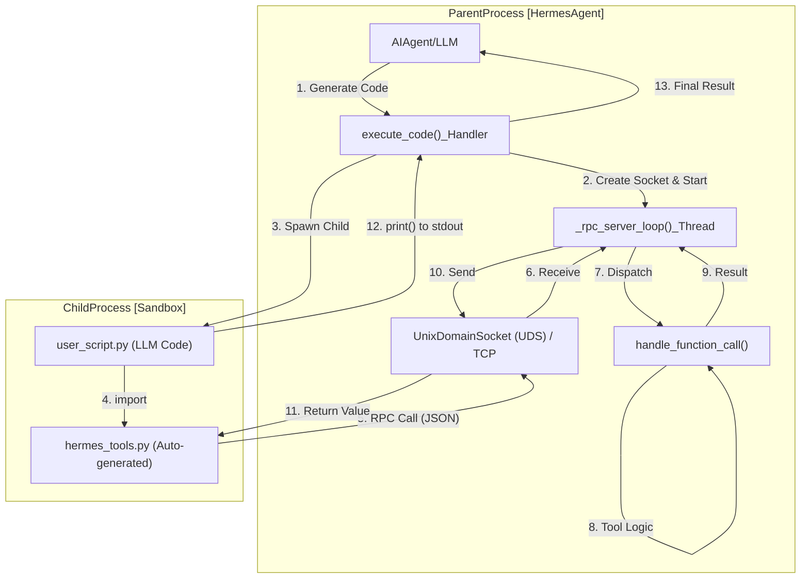
**Sources:** [tools/code_execution_tool.py:8-25](), [tools/code_execution_tool.py:386-420]()

### 1.2 Tool Stub Generation
The `generate_hermes_tools_module` function builds the source code for a `hermes_tools.py` module. This module contains stubs that map Python function calls to JSON-RPC requests. [tools/code_execution_tool.py:130-162]()

The sandbox supports a specific subset of tools defined in `SANDBOX_ALLOWED_TOOLS`:
*   `web_search`, `web_extract`
*   `read_file`, `write_file`, `search_files`, `patch`
*   `terminal`

**Sources:** [tools/code_execution_tool.py:56-68](), [tools/code_execution_tool.py:184-230]()

### 1.3 Security and Resource Limits
The sandbox enforces several security boundaries and resource constraints:
*   **Platform Support:** While initially designed for POSIX (UDS), it falls back to loopback TCP for the sandbox RPC transport on Windows, making `execute_code` available on every platform Hermes runs on. [tools/code_execution_tool.py:50-54]()
*   **Timeout:** Default execution limit of 300 seconds (`DEFAULT_TIMEOUT`). [tools/code_execution_tool.py:71]()
*   **Call Volume:** Default maximum of 50 tool calls per script execution (`DEFAULT_MAX_TOOL_CALLS`). [tools/code_execution_tool.py:72]()
*   **Output Capping:** Stdout is capped at 50 KB (`MAX_STDOUT_BYTES`) and Stderr at 10 KB (`MAX_STDERR_BYTES`). [tools/code_execution_tool.py:73-74]()
*   **Environment Scrubbing:** The `_scrub_child_env` function produces a safe environment by blocking secret-substring names (KEY, TOKEN, SECRET, etc.) and allowing only safe prefixes or essential OS variables. [tools/code_execution_tool.py:118-153]()

**Sources:** [tools/code_execution_tool.py:52-75](), [tools/code_execution_tool.py:118-153]()

---

## 2. Model Context Protocol (MCP) Integration

Hermes Agent connects to external MCP servers via stdio, HTTP, or SSE transport, discovers their tools, and registers them into the `ToolRegistry`. [tools/mcp_tool.py:3-7]()

### 2.1 MCP Architecture
A dedicated background event loop (`_mcp_loop`) runs in a daemon thread. Each MCP server runs as a long-lived asyncio Task (`MCPServerTask`) on this loop. [tools/mcp_tool.py:60-64]()

**MCP Client Integration System**
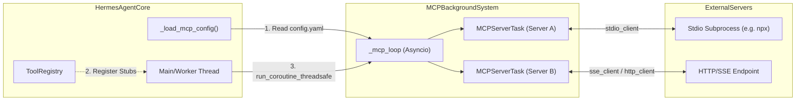
**Sources:** [tools/mcp_tool.py:60-75](), [tools/mcp_tool.py:116-149](), [tests/tools/test_mcp_tool.py:55-85]()

### 2.2 Schema Mapping and Tool Registration
Tools discovered from MCP servers are converted into the agent's internal tool schema via `_convert_mcp_schema`. [tools/mcp_tool.py:221-226]()
*   **Prefixing:** Tool names are prefixed with `mcp_{server_name}_`. [tools/mcp_tool.py:228-240]()
*   **Normalization:** The `_normalize_mcp_input_schema` function ensures schemas conform to expectations, such as rewriting `$ref` from `#/definitions` to `#/$defs`. [tools/mcp_tool.py:242-260]()
*   **Logging:** Subprocess stderr is redirected to `~/.hermes/logs/mcp-stderr.log` to prevent TUI corruption. [tools/mcp_tool.py:106-112]()

**Sources:** [tools/mcp_tool.py:221-260](), [tests/tools/test_mcp_tool.py:90-110](), [tests/tools/test_mcp_tool.py:189-198]()

### 2.3 OAuth 2.1 Support
For MCP servers requiring browser-based authentication, `mcp_oauth.py` implements OAuth 2.1 with PKCE. [tools/mcp_oauth.py:3-19]()
*   **Persistence:** Tokens and client info are stored in `~/.hermes/mcp-tokens/` with 0o600 permissions. [tools/mcp_oauth.py:101-112](), [tools/mcp_oauth.py:165-174]()
*   **Interaction:** Spawns an ephemeral localhost server to capture codes and raises `OAuthNonInteractiveError` in non-TTY environments. [tools/mcp_oauth.py:16-17](), [tools/mcp_oauth.py:83-85]()

**Sources:** [tools/mcp_oauth.py:3-33](), [tools/mcp_oauth.py:165-206](), [tools/mcp_oauth.py:83-85]()

---

## 3. Credential Pooling and Failover

The agent manages LLM provider credentials via a persistent `PooledCredential` system, allowing for automatic failover and rotation. [agent/credential_pool.py:1-14]()

### 3.1 Pool Strategies and Selection
The `PooledCredential` class tracks status (OK/Exhausted) and usage metrics. [agent/credential_pool.py:93-116]() Selection strategies include:
*   `fill_first`: Use the highest priority available credential. [agent/credential_pool.py:59]()
*   `round_robin`: Rotate through available credentials. [agent/credential_pool.py:60]()
*   `least_used`: Select based on `request_count`. [agent/credential_pool.py:62]()

**Credential Selection Flow**
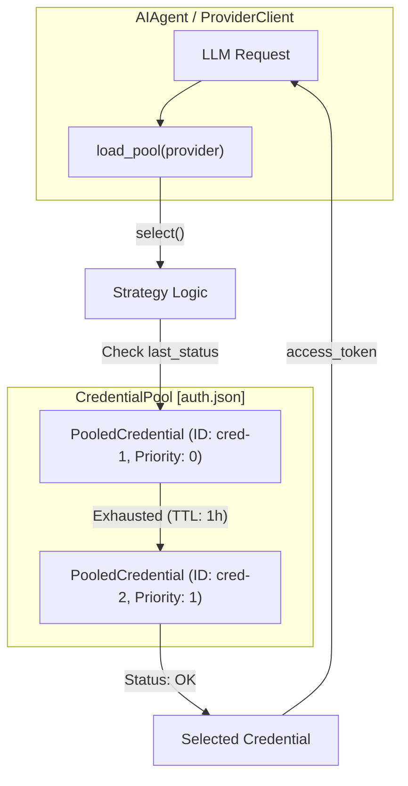
**Sources:** [agent/credential_pool.py:59-68](), [agent/credential_pool.py:93-116](), [tests/agent/test_credential_pool.py:17-60]()

### 3.2 Exhaustion and Recovery
Credentials that return 401 (Auth Failed), 429 (Rate Limited), or 402 (Billing) are marked as `STATUS_EXHAUSTED`. [agent/credential_pool.py:51-52]()
*   **TTL-based Recovery:** Credentials automatically return to `STATUS_OK` after a cooldown (5 mins for 401, 1 hour for 429/402). [agent/credential_pool.py:74-76]()
*   **Manual Override:** Re-adding a credential via `hermes auth add` clears suppressions and exhaustion statuses. [hermes_cli/auth_commands.py:177-181]()

**Sources:** [agent/credential_pool.py:70-77](), [hermes_cli/auth_commands.py:177-190](), [tests/agent/test_credential_pool.py:182-215]()

# Subagent Delegation


This page documents the `delegate_task` tool, which spawns child `AIAgent` instances with isolated context, restricted toolsets, and dedicated terminal sessions. The system supports both single-task and parallel batch delegation modes, with configurable progress reporting for CLI and messaging gateway environments.

---

## Overview

The `delegate_task` tool allows an agent to spawn one or more child agents to work on tasks in completely isolated contexts. This is useful for:

- **Reasoning-heavy subtasks** that would flood the parent's context window with intermediate tool calls.
- **Parallel independent workstreams** (e.g., researching multiple topics simultaneously).
- **Zero-context-cost workflows** where only the final summary matters to the parent.

Each subagent receives:
- A fresh conversation with no parent history [tools/delegate_tool.py:9-10]().
- Its own `task_id` which creates an isolated terminal session and file operations cache [tools/delegate_tool.py:11-11]().
- A restricted toolset (certain tools like `delegate_task` itself are always blocked to prevent recursive delegation) [tools/delegate_tool.py:41-49]().
- A focused system prompt built from the delegated goal and context [tools/delegate_tool.py:12-13](), [tools/delegate_tool.py:646-679]().

The parent's context only sees the delegation call and the final summary—never the child's intermediate reasoning or tool results [tools/delegate_tool.py:15-16]().

Sources: [tools/delegate_tool.py:1-17]()

---

## Tool Schema and Registration

The `delegate_task` tool is registered in the `delegation` toolset with two operational modes:

- **Single Task Mode**: Provide `goal` (+ optional `context`, `toolsets`) [tools/delegate_tool.py:1012-1019]().
- **Batch Mode**: Provide `tasks` array for parallel execution [tools/delegate_tool.py:1020-1025]().

### Delegation Logic Flow

Title: "Delegation Tool Architecture"
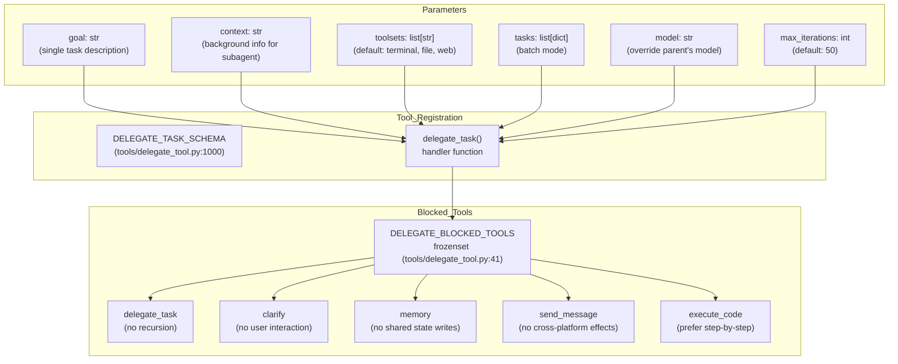

**Blocked Tools Rationale**:

| Tool | Reason for Blocking |
|---|---|
| `delegate_task` | Prevents recursive delegation beyond `MAX_DEPTH` (default 1) [tools/delegate_tool.py:43-43](), [tools/delegate_tool.py:129-129](). |
| `clarify` | Subagents cannot interact with the user as no interactive callback is available [tools/delegate_tool.py:44-44](). |
| `memory` | Prevents concurrent writes to shared `MEMORY.md` / `USER.md` [tools/delegate_tool.py:45-45](). |
| `send_message` | Prevents uncontrolled cross-platform side effects [tools/delegate_tool.py:46-46](). |
| `execute_code` | Encourages explicit step-by-step reasoning instead of opaque scripting [tools/delegate_tool.py:47-47](). |

Sources: [tools/delegate_tool.py:41-49](), [tools/delegate_tool.py:1000-1110]()

---

## Subagent Isolation Architecture

Each child agent is spawned with complete isolation from the parent's runtime state.

Title: "Subagent Isolation and Data Flow"
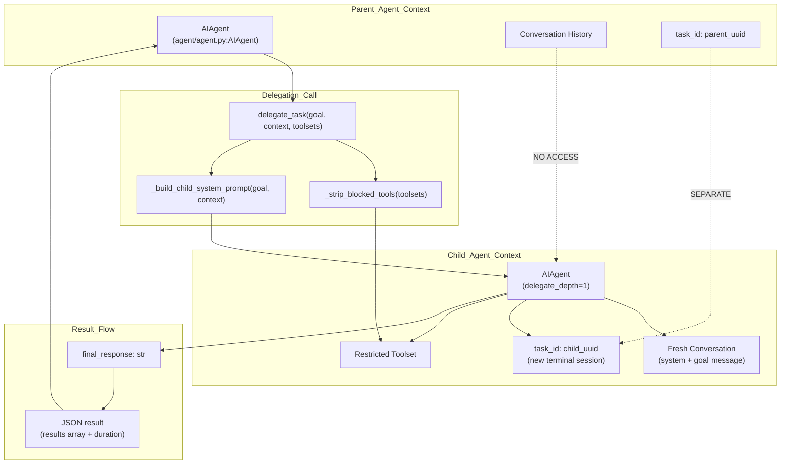

**Isolation Mechanisms**:

1.  **Context Isolation**: `skip_context_files=True` and `skip_memory=True` ensures children start with a clean slate [tools/delegate_tool.py:843-845]().
2.  **Session Isolation**: Each child gets a unique `task_id`, creating a separate terminal session and file operations cache [tools/delegate_tool.py:837-837]().
3.  **Toolset Restriction**: `_strip_blocked_tools()` removes the blocked tools from any requested toolsets [tools/delegate_tool.py:718-724]().
4.  **Credential Overrides**: Subagents can be routed to different models/providers than the parent via configuration or direct tool parameters [tools/delegate_tool.py:795-799]().

Sources: [tools/delegate_tool.py:718-845](), [tools/delegate_tool.py:646-679]()

---

## Single vs Batch Mode

### Single Task Mode
Spawns one child agent, blocks until completion, and returns a JSON summary [tools/delegate_tool.py:901-970]().

### Batch Mode (Parallel)
Spawns multiple child agents in parallel using `ThreadPoolExecutor` [tools/delegate_tool.py:27-31](). The maximum concurrency is determined by `delegation.max_concurrent_children` in config (default 3) [tools/delegate_tool.py:128-128](). Results are returned in input order after all children complete [tools/delegate_tool.py:972-996]().

Title: "Parallel Delegation Sequence"
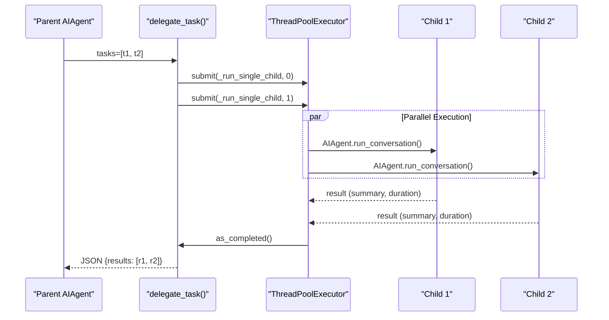

Sources: [tools/delegate_tool.py:901-996]()

---

## Progress Reporting Architecture

Progress reporting relays child events to the parent's display (CLI or Gateway).

Title: "Progress Relay Data Flow"
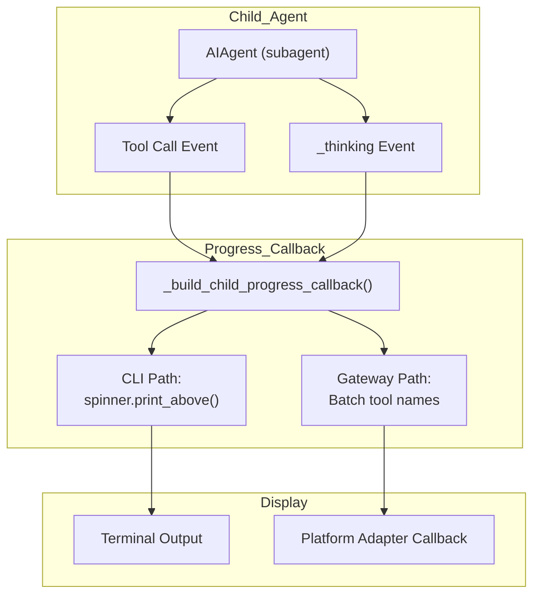

### CLI Path: Tree View Display
When the parent agent has a `_delegate_spinner` (CLI context), child tool calls are printed above the spinner using `KawaiiSpinner.print_above()` [tools/delegate_tool.py:736-737](), [tests/agent/test_subagent_progress.py:46-50]().
- Thinking events (`_thinking`) show reasoning previews to indicate activity [tools/delegate_tool.py:750-769]().

### Gateway Path: Batched Tool Names
When the parent agent has a `tool_progress_callback` (gateway context), tool names are batched and relayed [tools/delegate_tool.py:747-748](). Thinking events are relayed as `subagent.thinking` events [tools/delegate_tool.py:770-773]().

Sources: [tools/delegate_tool.py:726-788](), [tests/agent/test_subagent_progress.py:46-50]()

---

## Iteration Budget Sharing

Subagents operate under a constrained iteration budget:
-   **Default Limit**: Children are restricted to 50 iterations by default [tools/delegate_tool.py:603-603]().
-   **Depth Limit**: Recursion is capped by `MAX_DEPTH` (default 1) [tools/delegate_tool.py:129-129]().

### Subagent Approval Handling
Subagents run in worker threads where standard interactive `input()` would deadlock the parent TUI [tools/delegate_tool.py:54-58]().
- **Auto-Deny (Default)**: Dangerous commands in subagents are denied automatically to prevent deadlocks [tools/delegate_tool.py:68-79]().
- **Auto-Approve (Opt-in)**: Can be enabled via `delegation.subagent_auto_approve` for headless environments [tools/delegate_tool.py:82-92]().

### Interrupt Propagation
The parent maintains an `_active_subagents` dictionary protected by `_active_subagents_lock` [tools/delegate_tool.py:147-150](). When the parent is interrupted, the interrupt propagates to all active children, triggering an immediate shutdown of the subagent conversation loops [tools/delegate_tool.py:932-937]().

Sources: [tools/delegate_tool.py:129-129](), [tools/delegate_tool.py:147-150](), [tools/delegate_tool.py:603-603](), [tools/delegate_tool.py:932-937](), [tools/delegate_tool.py:54-92]()

# Other Tools


This page documents auxiliary tools that support specialized agent capabilities: persistent memory, image generation, mixture of agents for complex reasoning, session search, skill management, and browser automation.

---

## Memory and Session Search

Hermes provides two distinct layers of conversation recall: file-backed curated memory (`MEMORY.md`/`USER.md`) and semantic search over SQLite transcripts.

### Curated Memory Tools
The `memory` tool manages bounded, file-backed storage that persists across sessions. It uses a **frozen snapshot pattern**: entries are loaded into the system prompt at session start [tools/memory_tool.py:126-142]() and remain stable to preserve the prefix cache. Mid-session writes update the disk immediately but do not mutate the current session's system prompt [tools/memory_tool.py:11-14]().

| Action | Implementation | Purpose |
|:---|:---|:---|
| `add` | `MemoryStore.add_entry()` | Append observation to `MEMORY.md` or `USER.md` |
| `replace` | `MemoryStore.replace_entry()` | Substring match and update an existing entry |
| `remove` | `MemoryStore.remove_entry()` | Delete an entry via substring matching |
| `read` | `MemoryStore._render_block()` | Return live state from disk |

**Security Scanning:** All memory writes pass through `_scan_memory_content()` [tools/memory_tool.py:92-104](), which blocks prompt injection patterns (e.g., "ignore previous instructions") and exfiltration attempts (e.g., `curl` with environment variables) [tools/memory_tool.py:67-83]().

Sources: [tools/memory_tool.py:1-142](), [tools/memory_tool.py:67-104]()

### Session Search Tool
The `session_search_tool` provides long-term conversation recall by searching past session transcripts in SQLite via FTS5 [tools/session_search_tool.py:12-18]().

**Session Search Data Flow**
```mermaid
flowchart TD
    "session_search_tool(query)" --> FTS["FTS5 Search\nRank messages by relevance"]
    FTS --> TRUNC["_truncate_around_matches()\nCenter ~100k chars on query"]
    TRUNC --> SUM["async_call_llm()\nAuxiliary LLM call (summarization)"]
    SUM --> OUT["JSON Summary Results\nMetadata + Focused Recap"]
```
1. **FTS5 Search**: Finds matching messages ranked by relevance.
2. **Context Truncation**: To fit LLM context windows, transcripts are centered around query matches using `_truncate_around_matches` [tools/session_search_tool.py:113-186]().
3. **Auxiliary Summarization**: Uses `async_call_llm` [tools/session_search_tool.py:27]() with a focused summarization prompt to generate a factual recap of the past interaction, preserving specific details like commands or paths.
4. **Concurrency**: Concurrency for summarization is bounded via `_get_session_search_max_concurrency` [tools/session_search_tool.py:32-50]().

Sources: [tools/session_search_tool.py:1-186](), [tests/tools/test_session_search.py:1-187]()

---

## Media and Browser Tools

### Image Generation
The `image_generate_tool` uses the **FAL model catalog** to support multiple models including FLUX 2 Pro, GPT-Image 1.5, and Nano Banana Pro [tools/image_generation_tool.py:92-191]().
- **Payload Translation**: `_build_fal_payload()` (referenced in implementation) maps unified inputs (prompt, aspect_ratio) to model-specific schemas and filters against a `supports` whitelist [tools/image_generation_tool.py:12-14]().
- **Upscaling**: Gated per-model via the `upscale` flag; typically enabled for FLUX 2 Pro via FAL's Clarity Upscaler [tools/image_generation_tool.py:115-140]().
- **Lazy Loading**: `fal_client` is imported lazily to prevent CLI cold-start latency [tools/image_generation_tool.py:32-57]().

**FAL Model Catalog Structure**
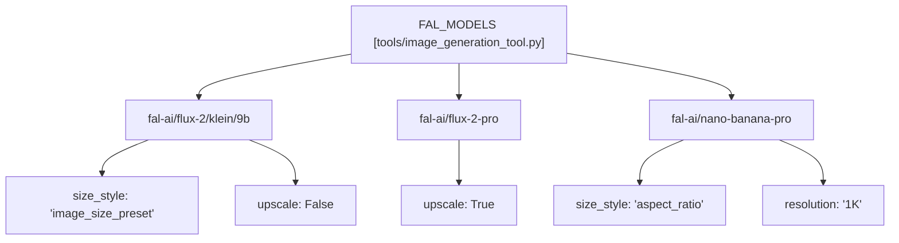
Each model entry in `FAL_MODELS` [tools/image_generation_tool.py:92-191]() defines its display name, performance characteristics, pricing, supported size styles, default parameters, and a whitelist of supported input keys (`supports`).

Sources: [tools/image_generation_tool.py:1-191](), [tests/tools/test_image_generation.py:1]()

---

## Advanced Reasoning and Skills

### Mixture of Agents (MoA)
The `mixture_of_agents_tool` implements a layered LLM architecture to solve complex reasoning tasks [tools/mixture_of_agents_tool.py:5-17]().

**MoA Execution Flow**
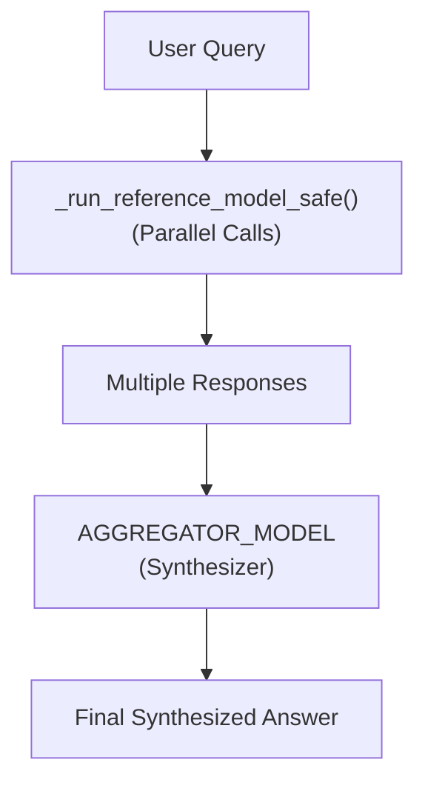
- **Parallelism**: Reference models are queried concurrently. Each call is wrapped in a safe runner for retry logic and graceful failure handling.
- **Aggregation**: A high-capability aggregator model synthesizes the diverse responses into a high-quality output using a specific research-backed prompt.

Sources: [tools/mixture_of_agents_tool.py:1-17](), [acp_adapter/tools.py:77]()

### Skill Management and Security
The `skill_manager_tool` allows the agent to create, update, and delete skills in `~/.hermes/skills/` [tools/skill_manager_tool.py:3-33]().

**Skill Guard Static Analysis**
Every skill is scanned by `_security_scan_skill` [tools/skill_manager_tool.py:78-102]().
- **Threat Patterns**: Detection is performed via `tools.skills_guard` [tools/skill_manager_tool.py:53]().
- **Validation**: Enforces strict naming (`_validate_name` [tools/skill_manager_tool.py:178-190]()), category (`_validate_category` [tools/skill_manager_tool.py:193-200]()), and YAML frontmatter requirements (`_validate_frontmatter` [tools/skill_manager_tool.py:203-209]()). Path traversal is prevented by `_validate_file_path` [tools/skill_manager_tool.py:212-218]().
- **Pinned Skills**: The `_pinned_guard` function [tools/skill_manager_tool.py:137-162]() prevents agents from deleting skills that have been explicitly pinned by the user via `hermes curator pin`.

**Skill Management Operations**
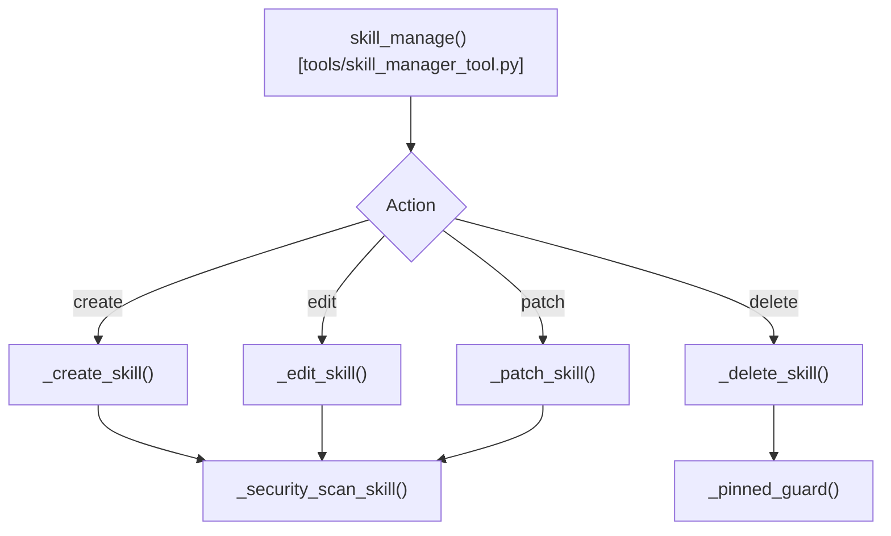
The `skill_manage` tool orchestrates these operations, ensuring all validations and security checks are performed before modifying skill files [tools/skill_manager_tool.py:1-209]().

Sources: [tools/skill_manager_tool.py:1-218](), [tests/tools/test_skill_manager_tool.py:1-203]()

---

## ACP Integration and Session Management

Hermes exposes these tools via the **Agent Client Protocol (ACP)**, allowing IDEs like Zed to interact with the agent's session state and toolset [acp_adapter/server.py:1-36]().

### ACP Tool Mapping
The `acp_adapter/tools.py` module maps internal Hermes tool names to ACP `ToolKind` categories [acp_adapter/tools.py:21-56]().

| Hermes Tool | ACP ToolKind | Implementation |
|:---|:---|:---|
| `terminal`, `execute_code` | `execute` | [acp_adapter/tools.py:28-30]() |
| `read_file`, `skill_view` | `read` | [acp_adapter/tools.py:23,33]() |
| `write_file`, `skill_manage` | `edit` | [acp_adapter/tools.py:24,35]() |
| `web_search`, `web_extract` | `fetch` | [acp_adapter/tools.py:37-38]() |
| `session_search` | `read` (mapped via logic) | [acp_adapter/tools.py:127-129]() |

### Session Persistence
The `SessionManager` [acp_adapter/session.py:186-203]() ensures that ACP sessions are backed by `SessionDB` (`~/.hermes/state.db`) [acp_adapter/session.py:1-8]().
- **WSL Translation**: When running in WSL, Windows paths sent by the IDE are translated to `/mnt/` paths via `_translate_acp_cwd` [acp_adapter/session.py:39-54]().
- **Forking**: Sessions can be forked, deep-copying the history into a new `SessionState` [acp_adapter/session.py:170-184]().

Sources: [acp_adapter/server.py:1-58](), [acp_adapter/tools.py:1-175](), [acp_adapter/session.py:1-203](), [tests/acp/test_server.py:1-192]()

# Execution Environments


## Purpose and Scope

Execution Environments provide an abstraction layer that allows the terminal tool to execute commands in different backends, from direct local execution to isolated containers and remote cloud sandboxes. This system enables Hermes to adapt its execution strategy based on security requirements, resource constraints, and deployment scenarios.

The environment system is primarily utilized by the `terminal_tool` [tools/terminal_tool.py:23-31]() and file tools, which delegate to the terminal's execution layer. This abstraction ensures that the agent can interact with the filesystem and shell consistently, regardless of whether it is running on a developer's laptop, in a Docker container, or in a serverless cloud sandbox.

---

## Environment Selection

The environment backend is selected via the `TERMINAL_ENV` environment variable [tools/terminal_tool.py:8-12](). The `_create_environment` factory function [tools/terminal_tool.py:463-513]() resolves the requested environment type and instantiates the corresponding backend class.

| Backend | Value | Implementation Class | Use Case |
|---------|-------|----------------------|----------|
| Local | `local` | `LocalEnvironment` | Direct host execution (fastest) |
| Docker | `docker` | `DockerEnvironment` | Isolated containers with hardened security |
| SSH | `ssh` | `SSHEnvironment` | Remote execution via SSH connection |
| Modal | `modal` | `ModalEnvironment` | Serverless cloud sandboxes (scalable) |
| Daytona | `daytona` | `DaytonaEnvironment` | Cloud development workspaces |
| Singularity | `singularity` | `SingularityEnvironment` | HPC containers (research clusters) |
| Vercel | `vercel_sandbox` | `VercelSandboxEnvironment` | Cloud sandboxes with Node/Python runtimes |

**Sources:** [tools/terminal_tool.py:8-15](), [tools/terminal_tool.py:463-513]()

---

## Environment Lifecycle

### Creation and Caching

Environments are created lazily on the first command execution and cached per `task_id` to enable session persistence. The lifecycle is managed by global state dictionaries in `tools/terminal_tool.py` that track active instances and their last activity timestamps.

**Environment Management Diagram**
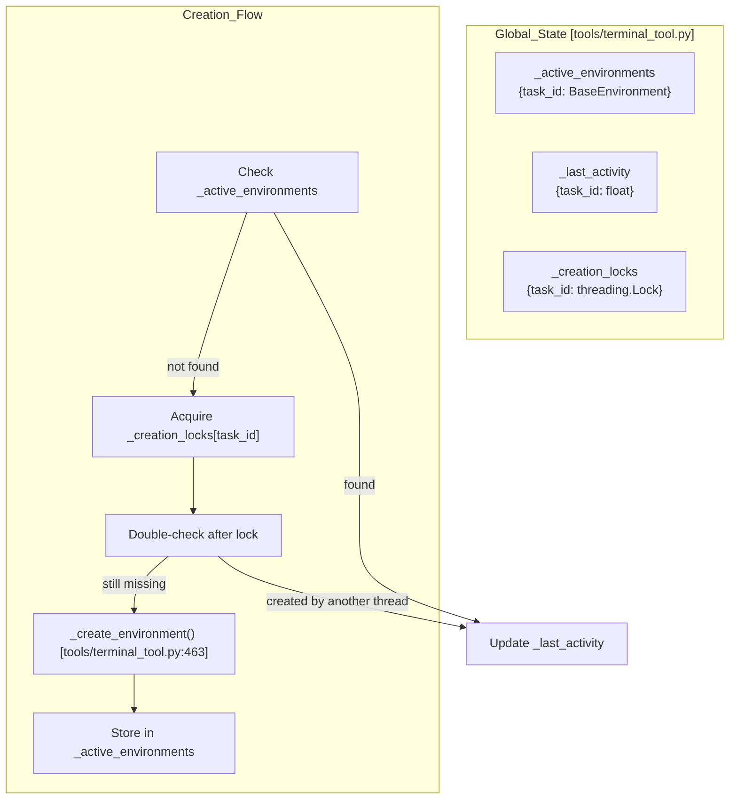

The per-task lock (`_creation_locks`) [tools/terminal_tool.py:403-406]() prevents race conditions where concurrent tool calls for the same `task_id` would create duplicate sandboxes.

For details, see [Environment Abstraction](#6.1).

**Sources:** [tools/terminal_tool.py:399-406](), [tools/terminal_tool.py:886-960]()

### Activity Tracking and Expiry

A background cleanup thread (`_cleanup_thread_worker`) [tools/terminal_tool.py:603-682]() runs every 60 seconds to terminate environments inactive for longer than `TERMINAL_LIFETIME_SECONDS` (default 300s). Environments with active background processes have their timestamps automatically refreshed to prevent premature termination [tools/terminal_tool.py:667-682]().

**Sources:** [tools/terminal_tool.py:603-682](), [tools/terminal_tool.py:667-682]()

---

## Configuration and Isolation

### Resource Limits and Images

The system supports granular control over container resources and images via environment variables.

| Variable | Default | Description |
|----------|---------|-------------|
| `TERMINAL_DOCKER_IMAGE` | `nikolaik/python-nodejs:python3.11-nodejs20` | Default Docker image [tools/terminal_tool.py:466]() |
| `TERMINAL_TIMEOUT` | `180` | Command timeout in seconds [tools/terminal_tool.py:481]() |
| `TERMINAL_CONTAINER_CPU` | `1` | CPU cores for containers [tools/terminal_tool.py:484]() |
| `TERMINAL_CONTAINER_MEMORY` | `5120` | Memory in MB [tools/terminal_tool.py:487]() |
| `TERMINAL_CONTAINER_PERSISTENT` | `true` | Enable persistent filesystem [tools/terminal_tool.py:493]() |

**Sources:** [tools/terminal_tool.py:463-513]()

### Environment Sanitization

To prevent sensitive Hermes credentials (like LLM API keys) from leaking into the execution environment, the `LocalEnvironment` and `DockerEnvironment` implement a blocklist system.

**Secret Sanitization Flow**
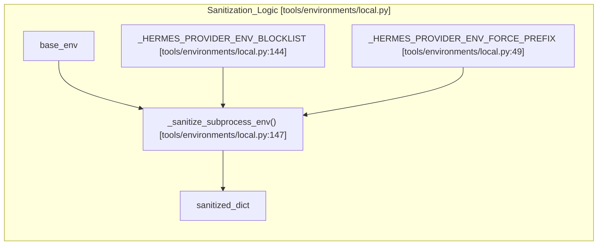

The blocklist is derived from registered providers to ensure new secrets are automatically protected [tools/environments/local.py:52-141](). Users can override this using the `_HERMES_FORCE_` prefix for specific variables [tools/environments/local.py:163-167]().

**Sources:** [tools/environments/local.py:49-144](), [tools/environments/local.py:147-175](), [tools/environments/docker.py:18-19]()

---

## Backend Implementations

All Hermes execution backends inherit from the `BaseEnvironment` abstract class [tools/environments/base.py:213-222](). This base class defines a unified spawn-per-call model where every command spawns a fresh `bash -c` process but maintains state through session snapshots [tools/environments/base.py:3-7]().

### Backend Highlights

- **LocalEnvironment**: Executes directly on the host but uses `_sanitize_subprocess_env` to filter secrets [tools/environments/local.py:147-175]().
- **DockerEnvironment**: Hardened with `_BASE_SECURITY_ARGS` [tools/environments/docker.py:159-169]() including `cap-drop ALL`, `no-new-privileges`, and PID limits.
- **SSHEnvironment**: Uses `ControlMaster` for connection persistence [tools/environments/ssh.py:85-87]() and `FileSyncManager` [tools/environments/ssh.py:72-78]() to sync credentials and skills to the remote host.
- **ModalEnvironment**: Executes via native `modal.Sandbox` in cloud environments. Supports filesystem snapshots [tools/environments/modal.py:177-185]() that are restored on subsequent sessions for the same `task_id`.
- **DaytonaEnvironment**: Uses the Daytona Python SDK [tools/environments/daytona.py:65-119]() to run commands in cloud sandboxes, supporting persistent workspaces across sessions.
- **SingularityEnvironment**: Optimized for HPC clusters using namespaces for isolation and writable overlays for persistence [tools/environments/singularity.py:65-69]().

**Execution Interface Diagram**
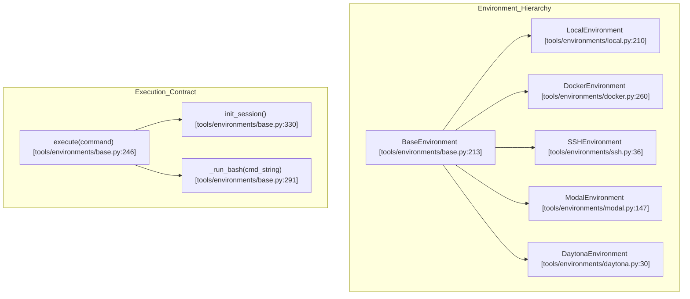

For details, see [Backend Implementations](#6.2).

**Sources:** [tools/environments/base.py](), [tools/environments/local.py](), [tools/environments/docker.py](), [tools/environments/ssh.py](), [tools/environments/modal.py](), [tools/environments/daytona.py]()

---

## Background Processes

Background tasks (spawned via `terminal(background=true)`) are managed by the `ProcessRegistry` [tools/process_registry.py:135-143](). These processes execute through the environment interface, meaning they run inside the sandbox (Docker, Modal, etc.) unless `TERMINAL_ENV=local` [tools/process_registry.py:12-14]().

- **Output Buffering**: Tracks rolling output windows (default 200KB) [tools/process_registry.py:57]().
- **Persistence**: Supports crash recovery via a JSON checkpoint file `processes.json` [tools/process_registry.py:54]().
- **Notification**: Can trigger agent notifications on completion or when output matches specific patterns [tools/process_registry.py:113-115]().

**Sources:** [tools/process_registry.py:1-30](), [tools/process_registry.py:54-60]()

---

## File and Credential Synchronization

Remote backends (SSH, Modal, Daytona) lack access to host files. The `FileSyncManager` [tools/environments/file_sync.py]() ensures that necessary credentials, skills, and cache files are available in the sandbox.

- **Credentials and Skills**: The system iterates through local `.hermes` directories to sync them to the remote environment [tools/environments/ssh.py:72-74](), [tools/environments/daytona.py:133-139]().
- **Bulk Transfers**: Backends implement optimized bulk upload/download (e.g., tar-over-SSH or multipart HTTP) to handle hundreds of files efficiently [tools/environments/ssh.py:158-168](), [tools/environments/daytona.py:149-154]().

**Sources:** [tools/environments/ssh.py:158-168](), [tools/environments/daytona.py:149-170](), [tools/environments/modal.py:173-174]()