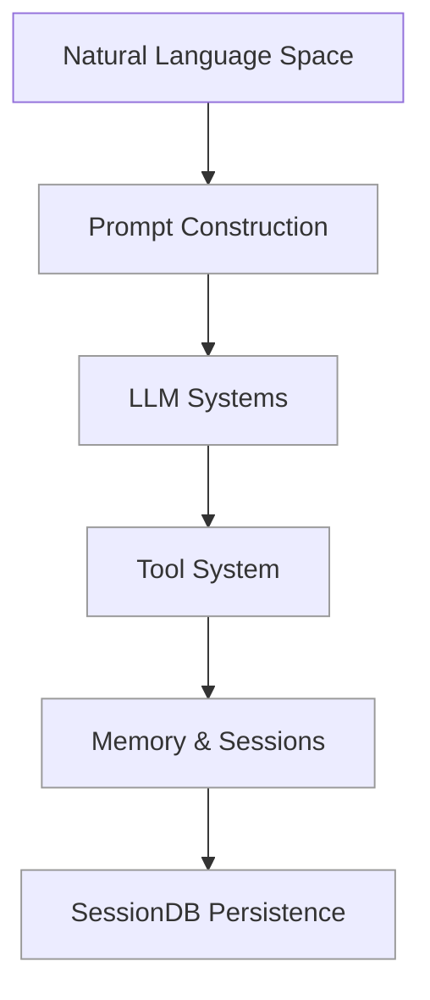
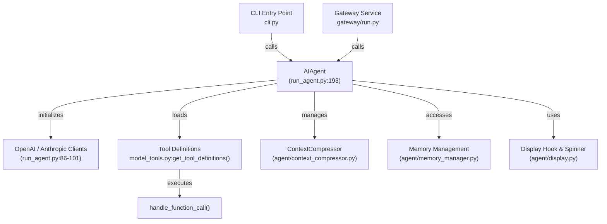
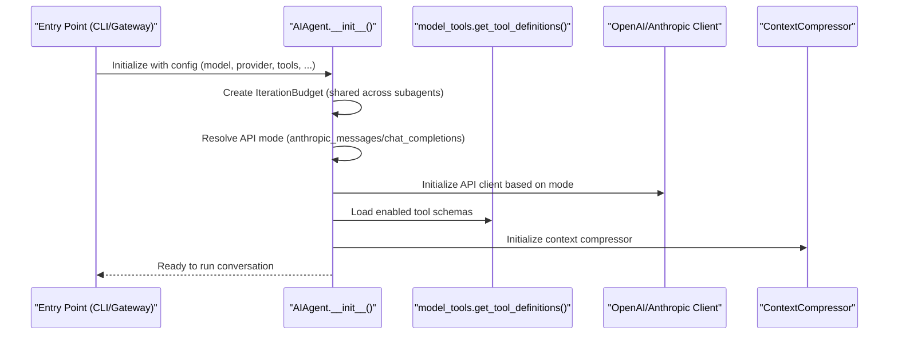
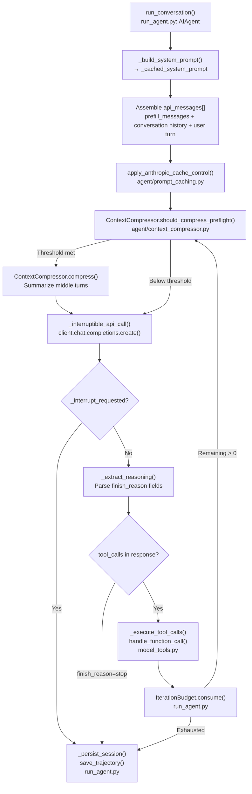
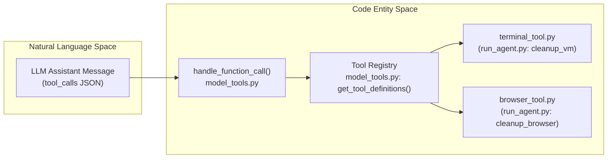

The Core Agent is the central orchestration component of Hermes Agent, implemented by the `AIAgent` class in [run_agent.py:193-2144](). It manages the complete lifecycle of AI-powered conversations, coordinating LLM interactions, tool execution, context management, memory, and session persistence. All entry points — including the CLI, Gateway service, and Batch Runner — instantiate an `AIAgent` and call its `run_conversation()` method to perform conversation tasks.

This page provides a high-level overview of the `AIAgent` class structure, its initialization, core responsibilities, and how it connects the natural language conversation space to code entities managing tools and memory subsystems.

## Purpose and Scope

The Core Agent serves as the unified interface for all conversation flows within Hermes Agent. It abstracts complexity such as:

- Selecting and managing LLM providers and their clients (OpenRouter, Anthropic, OpenAI, etc.) [run_agent.py:86-101]()
- Discovering, enabling, and dispatching tools through the centralized tool system [run_agent.py:122-127]()
- Maintaining conversation context, system prompts, and user memory [agent/prompt_builder.py:145-164]()
- Handling session persistence including message logging and trajectory management [run_agent.py:184-187]()
- Managing iteration budgets with support for subagent delegation and interrupts [tools/tool_result_storage.py:135-135]()

For detailed technical workflows and component behaviors, see the linked child pages at the end.

Sources: [run_agent.py:1-21](), [run_agent.py:122-127](), [agent/prompt_builder.py:145-164]()

---

## AIAgent Class Overview

The `AIAgent` class is the embodiment of the Core Agent, encapsulating all state and behavior for an AI-driven conversation session. It handles the end-to-end flow starting from initialization through the iterative conversation loop to final response generation.

### Architecture Diagram: Natural Language to Code Entities



This diagram shows how natural language conversation requests flow through prompt construction, are handled by underlying LLM APIs, may trigger tool invocation, and are stored in persistent memory and sessions.

Sources: [run_agent.py:193-2144](), [agent/prompt_builder.py:145-164](), [run_agent.py:184-187]()

---

### Detailed Code Entity Interaction within `AIAgent`



This diagram illustrates major internal components and integrations the `AIAgent` uses during conversation orchestration.

Sources: [run_agent.py:193-2144](), [run_agent.py:122-127](), [agent/context_compressor.py:1-40](), [gateway/run.py:56-62]()

---

## Initialization and Configuration

The constructor `AIAgent.__init__()` supports comprehensive parameters enabling customization for model selection, provider credentials, toolsets availability, session state, prompt injection, and platform hints.

| Configuration Area | Core Parameters | Purpose |
|---|---|---|
| LLM Setup | `model`, `base_url`, `api_key`, `provider` | Specify model identity and connectivity [run_agent.py:193-250]() |
| Tool Management | `enabled_toolsets`, `disabled_toolsets` | Filter enabled / disabled tools [run_agent.py:270-280]() |
| Conversation Control | `max_iterations`, `iteration_budget` | Limit the number of iterative steps and tool calls [run_agent.py:310-320]() |
| Context Augmentation | `ephemeral_system_prompt`, `prefill_messages` | Inject extra system messages or prefill conversation [run_agent.py:330-340]() |
| Persistent Sessions | `session_id`, `session_db` | Enable SQLite-backed session logging [run_agent.py:350-360]() |
| Platform Integration | `platform` | Apply platform-specific message formatting hints [run_agent.py:370-380]() |

Sources: [run_agent.py:193-450](), [cli.py:195-205](), [hermes_cli/config.py:5-13]()

### Initialization Flow



Key components during initialization:

- **IterationBudget** ensures all tool calls and conversation steps remain within configured limits, preventing runaway loops [tools/tool_result_storage.py:135-135]().
- **API Mode detection** chooses between OpenAI-compatible or native Anthropic message protocol clients [hermes_cli/runtime_provider.py:62-86]().
- **Tool loading** dynamically imports and filters tools according to enable/disable lists [run_agent.py:122-127]().
- **Context compression** is prepared in case conversation length approaches model limits [agent/context_compressor.py:1-40]().

Sources: [run_agent.py:86-101](), [agent/context_compressor.py:1-40](), [hermes_cli/runtime_provider.py:62-86]()

---

## Core Responsibilities of `AIAgent`

The `AIAgent` class’s main orchestration pillars are:

### 1. LLM Communication

`AIAgent` abstracts interactions with diverse LLM providers, crafting prompt payloads and executing chat completions requests. It supports OpenAI-style chat completions and native Anthropic message API protocols transparently, switching clients based on configuration [run_agent.py:86-101]().

LLM responses are parsed for direct textual answers or function/tool call requests. LLM invocation also respects rate limits, retries, and backoff strategies [agent/retry_utils.py:1-10]().

For detailed provider integration, see [Auxiliary Client](#4.5).

Sources: [run_agent.py:86-101](), [agent/retry_utils.py:1-10]()

### 2. Tool Orchestration

Tools are discovered at startup via the centralized tool registry (`get_tool_definitions()`). The agent manages runtime tool availability, filters based on user configuration, and handles dispatching function call requests extracted from LLM responses [run_agent.py:122-127]().

It supports advanced tools like:
- `skill_manage`: manages skills plugins.
- `delegate_task`: spawns subagents with shared iteration budgets for delegation.
- File and terminal tools.

All tool invocation flows funnel through `handle_function_call()` [run_agent.py:125]().

For conversation dynamics including tool calling, iteration budgets, and interrupts, see [Conversation Loop](#4.1).

Sources: [run_agent.py:122-127](), [hermes_cli/commands.py:64-107]()

### 3. Context Management

`AIAgent` constructs the conversation context dynamically for each turn. It builds system and user prompts using persona metadata from `SOUL.md`, skills system prompts, and context files [agent/prompt_builder.py:163-164]().

The agent automatically triggers context compression when token usage nears model context window limits, utilizing `ContextCompressor` [agent/context_compressor.py:1-40]().

For prompt-building strategies, see [Context and Prompt Management](#4.2).

Sources: [agent/prompt_builder.py:163-164](), [agent/context_compressor.py:1-40]()

### 4. Session State and Memory Management

Conversations are logged persistently into a SQLite SessionDB for search, replay, and trajectory logging [hermes_cli/auth.py:1-14](). The agent integrates local memory files (`MEMORY.md`, `USER.md`) and supports richer "AI-native" memory via the Honcho system [hermes_cli/main.py:21-36]().

Memory updates and session persistence happen incrementally during conversation turns. This enables longitudinal context beyond immediate chat history.

For detailed coverage of session formats, persistence, and Honcho integration, see [Memory and Sessions](#4.3) and [Honcho Integration](#4.4).

Sources: [hermes_cli/main.py:21-36](), [hermes_cli/auth.py:1-14]()

### 5. Iteration Budgeting and Interrupt Handling

The `IterationBudget` mechanism is central to controlling conversation depth and subagent delegation. It tracks credit usage across multiple threads and async workers, preventing infinite loops or infinite tool-call cascades [tools/tool_result_storage.py:135-135]().

The agent respects interrupt signals to cancel long-running or stalled operations cleanly [run_agent.py:136]().

For the iterative conversation workflow and budget mechanisms, see [Conversation Loop](#4.1).

Sources: [tools/tool_result_storage.py:135-135](), [run_agent.py:136]()

---

## Integration Points Summary

`AIAgent` acts as a nexus integrating these critical subsystems:

| Subsystem | Description | Related Files / Modules |
|---|---|---|
| Tool System | Tool discovery, filtering, and management | `model_tools.py`, `tools/` |
| Memory | Local memory files and AI-native memory integration via Honcho | `agent/memory_manager.py`, `run_agent.py` |
| Session Persistence | SQLite-backed session and message logging | `hermes_cli/auth.py`, `run_agent.py` |
| LLM Provider Clients| OpenAI/anthropic clients, specialized adapters | `run_agent.py:86-101`, `agent/` |
| Prompt/Context | System and user prompt construction, dynamic injection | `agent/prompt_builder.py`, `agent/context_compressor.py` |
| Display/UI Hooks | Spinners, message status callbacks for CLI and Gateway | `agent/display.py`, `run_agent.py` |

Sources: [run_agent.py:122-127](), [agent/display.py:171-176](), [hermes_cli/auth.py:1-14]()

---

## Child Pages

For detailed technical deep dives on specific Core Agent aspects, see:

- [Conversation Loop](#4.1) — Iterative conversation flow, tool calling, iteration budgeting, and interrupt handling
- [Context and Prompt Management](#4.2) — System prompt construction, persona files (`SOUL.md`), context file usage, and dynamic prompt injection
- [Memory and Sessions](#4.3) — SQLite session persistence, trajectory logging, memory file formats (`MEMORY.md`, `USER.md`), and session search indexing
- [Honcho Integration](#4.4) — AI-native memory system, HonchoSessionManager, write frequency modes, prefetch pipelines, and dialectic queries
- [Auxiliary Client](#4.5) — Auxiliary LLM client system for side tasks such as vision, compression, web extraction. Resolution of providers for auxiliary requests.

---

This page establishes the structural and functional overview of the Core Agent embodied in the `AIAgent` class. It bridges natural language interactions to concrete code modules managing provider clients, tools, and memory systems — ensuring conversations proceed smoothly with stateful context and resource control.

Sources: [run_agent.py:1-2144](), [cli.py:1-192](), [gateway/run.py:1-183]()

# Conversation Loop


This page describes the internal mechanics of the `AIAgent` class's `run_conversation()` method, detailing how the agent orchestrates iterative interactions, including system prompt construction, message assembly, integration of tool calls, iteration budget management, and interrupt handling.

---

## Overview

All user interactions with Hermes Agent—whether through the CLI, messaging gateways, or batch processing—are funneled into the pivotal method:

```python
AIAgent.run_conversation(user_message: str, conversation_history: List[Dict], ...) -> Dict
```

This method, implemented in [`run_agent.py:8440-9120`](), manages an iterative loop that continues until one of the following conditions is met:

- The AI model returns a final answer with no further tool calls.
- The iteration budget is exhausted.
- An interrupt is received signaling user or system cancellation.

The conversation loop drives the agent’s reasoning by alternating between LLM message generation and tool execution. It integrates context compression, message caching, and reasoning extraction to efficiently manage history and model calls.

**Conversation Loop — Code Entity Map**



Sources: [`run_agent.py:140-160`](), [`agent/context_compressor.py:1-18`](), [`agent/prompt_caching.py:1-10`]()

---

## Iteration Budget and Interrupts

The conversation loop is tightly regulated by an iteration budget, preventing runaway or infinite reasoning loops, and by an interrupt mechanism that allows user or system aborts.

### Iteration Budget

The `IterationBudget` class, defined in [`run_agent.py:4615-4680`](), manages turn consumption:

- **Thread-safe counter:** Initialized with a maximum budget (default 90 for parent agents).
- **Consumption:** Each tool invocation consumes one unit on the budget via `consume()`. If zero is reached, the conversation loop ends gracefully using `enforce_turn_budget()` [`tools/tool_result_storage.py:135`]().
- **Refund:** Programmatic tool calls like `execute_code` can call `refund()` to return budget units when internal reasoning steps should not count against the user-facing iteration limit.
- **Subagent Management:** Subagents can receive smaller budgets and perform nested tool calls independent of the parent's budget constraints.

### Interrupt Handling

The interrupt system allows graceful termination via:

- A shared flag `_interrupt_requested` tracked in `AIAgent`.
- The interrupt flag is checked regularly during API calls inside `_interruptible_api_call()` or `_interruptible_streaming_api_call()`.
- When an interrupt is detected (e.g., user pressing `Ctrl+C` in CLI, or gateway receiving a `/stop` command), `set_interrupt()` [`tools/interrupt.py:136`]() triggers propagation of the interrupt to all active child agents and tools.
- Tool execution is promptly stopped, outputs are finalized, and the loop cleans up.

Sources: [`run_agent.py:4615-4680`](), [`tools/tool_result_storage.py:135-136`](), [`tools/interrupt.py:136`]()

---

## Message Assembly and Prompt Caching

Before every API call, the agent composes the `api_messages[]` — a list of message objects forming the conversation context for the LLM prompt.

### Message Composition

- **System Identity:** Injected first, built by `_build_system_prompt()` and cached as `_cached_system_prompt`. This includes persona (`SOUL.md`), toolset hints, and reasoning guidance [`run_agent.py:163-164`]().
- **Ephemeral Messages:** Prefill messages are loaded optionally for session setup or testing from JSON files.
- **Conversation History:** Persistent history from the session SQLite database is appended, including prior user and assistant messages.
- **User Message:** The current user input is appended last as the final `user` role message.

### Provider-Specific Role Handling

- Models like GPT-5 and Codex use the `developer` role in lieu of `system` due to updated OpenAI guidelines. This is handled pragmatically in `_build_api_kwargs()` ensuring compatibility.
- The system prompt and messages are sanitized and filtered to remove reasoning blocks before final display using `_strip_reasoning_tags()` [`cli.py:123-192`]().

### Anthropic Cache Control

- For Anthropic-based models, `apply_anthropic_cache_control()` [`agent/prompt_caching.py:1-10`]() injects special `cache_control` sections into the system message and recent chat turns.
- This optimizes latency and cost by enabling fine-grained caching in Anthropic's API during long tool-calling sessions.

Sources: [`run_agent.py:163-164`](), [`cli.py:123-192`](), [`agent/prompt_caching.py:1-10`]()

---

## Tool Execution Flow

When the LLM responds with `tool_calls` in its output JSON, the agent transitions to the tool execution phase.

### Dispatching Tool Calls

- **Agent Loop Tools:** Certain internal tools (e.g., "memory") interact directly with the agent state.
- **Standard Tools:** General tools are passed to `handle_function_call()` in `model_tools.py` which looks up the registered toolset and executes the requested tool asynchronously [`run_agent.py:122-127`]().
  
The agent attempts parallel execution of tool calls unless safety flags dictate serialized invocation.

### Integration with Tool Registry and Backends

- The `handle_function_call()` refers to the tool registry fetched via `get_tool_definitions()` and dispatches calls to appropriate tool implementations.
- Examples of integrated tools include the terminal (`tools/terminal_tool.py`) and browser automation (`tools/browser_tool.py`), both of which expose cleanup hooks invoked after conversation ends [`run_agent.py:128-137`]().

### Mapping Natural Language to Code Space for Tools



Sources: [`run_agent.py:122-137`](), [`model_tools.py:122-127`]()

---

## Response Parsing and Reasoning

The agent supports in-depth response parsing with native reasoning extraction for advanced models.

### Reasoning Extraction

- Some models annotate output with `reasoning_content` or `reasoning` JSON fields.
- The agent’s reasoning extraction logic picks these apart from the main content to support internal evaluations or visualizations.
- Reasoning effort can be managed explicitly via slash commands like `/reasoning`, altering request parameters to the LLM [`hermes_cli/commands.py:138-140`]().

### Cleaning Output for Display

- The CLI uses `_strip_reasoning_tags()` [`cli.py:123-192`]() to remove embedded reasoning tags such as `<think>` ensuring the user output remains clean and focused.
- This function also strips XML-like tool call artifacts potentially emitted by some models.

Sources: [`hermes_cli/commands.py:138-140`](), [`cli.py:123-192`]()

---

## Persistence and Cleanup

Upon conversation loop exit (completion, error, or interrupt), the agent performs necessary cleanup and persistence steps.

### Trajectory Logging

- The entire turn trajectory, including user messages, assistant responses, tool calls, and tool results, is saved persistently.
- This is done via `_save_trajectory_to_file()` [`run_agent.py:184-187`]().

### Environment and Client Cleanup

- Terminal execution environments created during the session are cleaned up by calling `cleanup_vm()` [`run_agent.py:128`]().
- Similarly, active browser instances are closed via `cleanup_browser()` [`run_agent.py:137`]() to prevent resource leaks.

Sources: [`run_agent.py:128-137`](), [`run_agent.py:184-187`]()

---