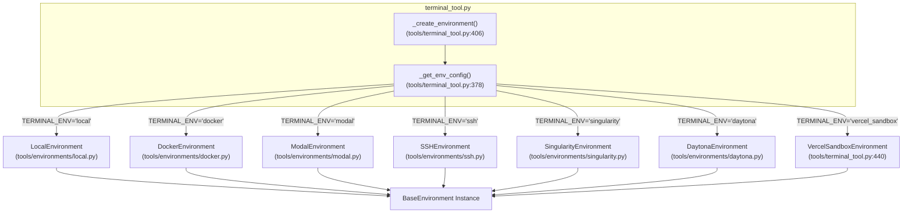
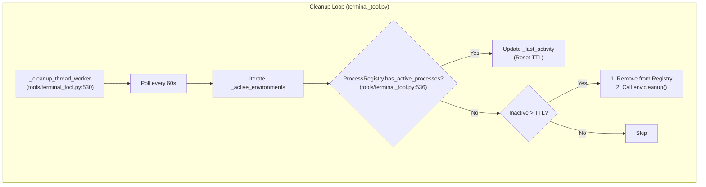
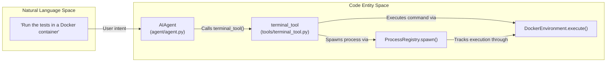
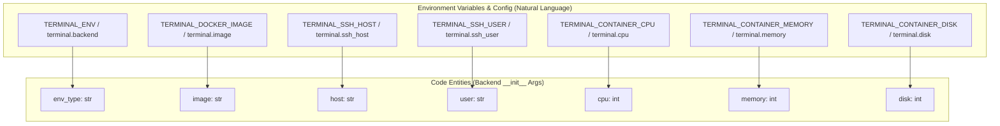
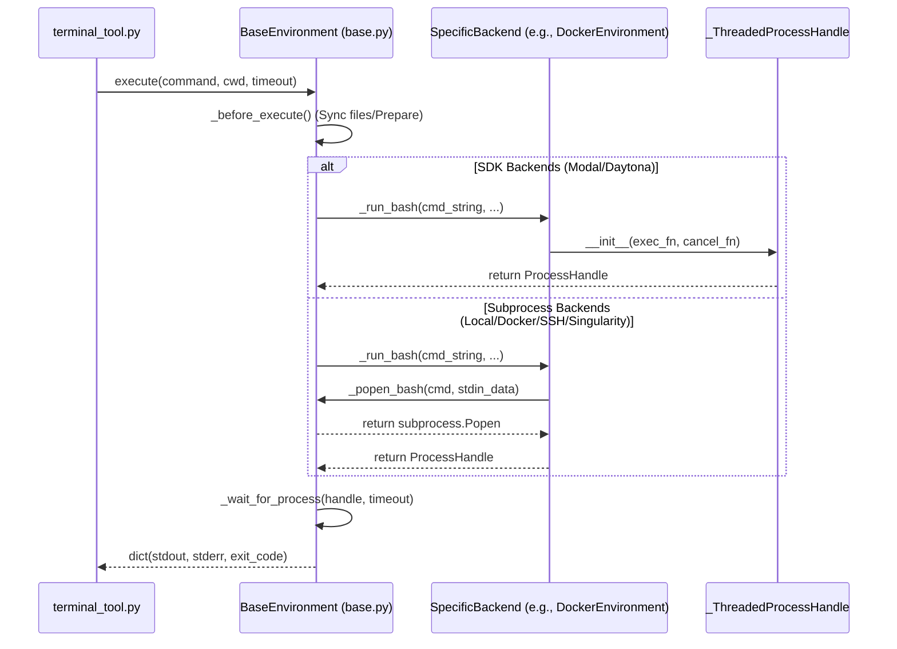
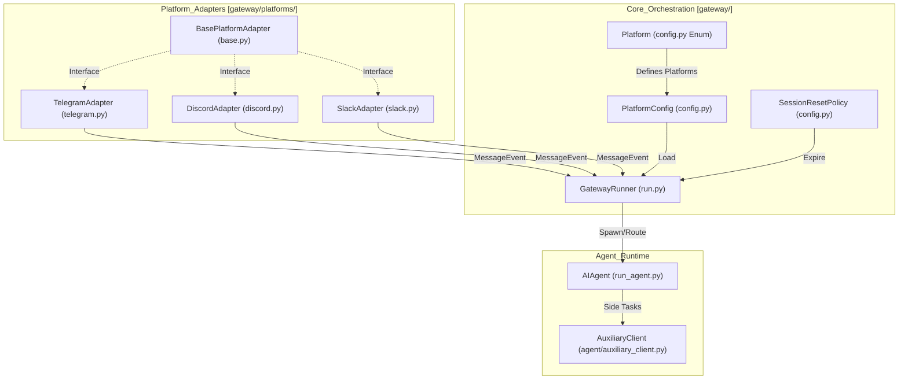

## Purpose and Scope

This page documents the environment abstraction layer that enables Hermes Agent to execute commands and manipulate files across multiple execution backends (local, Docker, Modal, SSH, Singularity, Daytona, and Vercel Sandbox) through a unified interface. This abstraction allows tools like `terminal`, `read_file`, `write_file`, `patch`, and `search_files` to work identically regardless of where the code runs.

The abstraction provides:
- **Unified Interface**: A common set of methods for command execution and cleanup defined in the `BaseEnvironment` abstract base class [tools/environments/base.py:19-21]().
- **Lifecycle Management**: Automated creation, caching, and background reaping of inactive environments via a background cleanup thread [tools/terminal_tool.py:530-631]().
- **Session Reuse**: Persistent state (CWD, environment variables, shell variables) across multiple tool calls within the same task using a "spawn-per-call" model with session snapshot sourcing [tools/environments/base.py:3-7]().
- **Security Isolation**: Per-task sandboxed execution and environment variable sanitization to prevent sensitive Hermes-internal credentials from leaking into subprocesses [tools/environments/local.py:147-175](), [tools/environments/docker.py:159-169]().

**Sources:** [tools/environments/base.py:1-21](), [tools/terminal_tool.py:530-631](), [tools/environments/local.py:147-175](), [tools/environments/docker.py:159-169]()

---

## The BaseEnvironment Interface

All execution environments implement a minimal interface consisting of core methods defined in the `BaseEnvironment` class.

| Method | Signature | Purpose |
|--------|-----------|---------|
| `execute()` | `execute(command: str, cwd: str = None, timeout: int = None, stdin_data: str = None) -> dict` | Execute a shell command and return a dictionary containing `output` and `returncode` [tools/environments/base.py:214-219]() (implementation in subclasses). |
| `cleanup()` | `cleanup() -> None` | Release resources, such as stopping containers, closing SSH ControlMaster sockets, or terminating sandboxes [tools/environments/base.py:216-216](). |

### Implementation Details
- **`ProcessHandle` Protocol**: Backends return a `ProcessHandle` (like `subprocess.Popen`) or a `_ThreadedProcessHandle` for SDK-based backends (Modal, Daytona) to provide a consistent polling and wait interface [tools/environments/base.py:187-202]().
- **Heredoc Support**: Some backends like `ModalEnvironment` use a "heredoc" mode for `stdin_data` to pass multi-line strings into cloud sandboxes [tools/environments/modal.py:154-154]().
- **Activity Monitoring**: The `touch_activity_if_due` function allows long-running executions to report liveness to the gateway, preventing session timeouts during heavy computation [tools/environments/base.py:55-79]().

**Sources:** [tools/environments/base.py:187-219](), [tools/environments/modal.py:154-154](), [tools/environments/base.py:55-79]()

---

## Environment Factory and Configuration

### Factory Pattern
The `_create_environment()` function in `terminal_tool.py` serves as the central factory. It resolves the backend type from the `TERMINAL_ENV` variable and instantiates the specific implementation class [tools/terminal_tool.py:406-454]().

#### Environment Resolution Flow

**Sources:** [tools/terminal_tool.py:406-454]()

### Configuration Resolution
Configuration follows a strict hierarchy:
1. **Per-task overrides**: Set via `register_task_env_overrides()`, used for specific tasks or benchmarks [tools/terminal_tool.py:378-395]().
2. **Environment Variables**: `TERMINAL_ENV`, `TERMINAL_DOCKER_IMAGE`, `TERMINAL_SSH_HOST`, etc. [tools/terminal_tool.py:8-14]().
3. **Defaults**: Hardcoded fallbacks (e.g., `local` backend) [tools/terminal_tool.py:11-11]().

**Sources:** [tools/terminal_tool.py:8-14](), [tools/terminal_tool.py:378-454]()

---

## Environment Lifecycle Management

### Creation and Caching
Environments are created on-demand and stored in a global `_active_environments` registry, keyed by `task_id`. To prevent race conditions where multiple tool calls attempt to spawn the same sandbox simultaneously, a `_creation_locks` dictionary provides per-task synchronization [tools/terminal_tool.py:359-365]().

### Automatic Cleanup and Reaping
A background thread, `_cleanup_thread_worker`, periodically scans active environments to reap those that have exceeded their idle TTL [tools/terminal_tool.py:530-631]().

#### Environment Cleanup Flow

**Key Behaviors:**
- **Background Process Protection**: If the `ProcessRegistry` reports active background tasks for a `task_id`, the environment is kept alive regardless of tool inactivity [tools/terminal_tool.py:536-544]().
- **Non-blocking Teardown**: `env.cleanup()` is called outside the global lock to prevent slow container shutdowns from blocking the entire system [tools/terminal_tool.py:560-592]().
- **Disk Usage Warnings**: The tool monitors total disk usage of hermes-related scratch directories and warns when thresholds are exceeded [tools/terminal_tool.py:184-209]().

**Sources:** [tools/terminal_tool.py:184-209](), [tools/terminal_tool.py:530-631]()

---

## Execution Backend Implementations

| Backend | Class | Characteristics |
|---------|-------|-----------------|
| **Local** | `LocalEnvironment` | Runs on host. Uses `_find_bash` for execution [tools/environments/local.py:178-201](). Filters internal credentials via `_HERMES_PROVIDER_ENV_BLOCKLIST` [tools/environments/local.py:144-148](). |
| **Docker** | `DockerEnvironment` | Security-hardened with `_BASE_SECURITY_ARGS` (`cap-drop ALL`, `no-new-privileges`, PID limits) [tools/environments/docker.py:159-169](). Supports both `docker` and `podman` [tools/environments/docker.py:101-143](). |
| **Modal** | `ModalEnvironment` | Cloud-based execution via native Modal Sandboxes [tools/environments/modal.py:147-152](). Supports filesystem snapshots stored in `modal_snapshots.json` [tools/environments/modal.py:34-43](). |
| **SSH** | `SSHEnvironment` | Remote execution via `ControlMaster` persistence [tools/environments/ssh.py:36-43](). Uses hashed socket IDs to fit macOS path limits [tools/environments/ssh.py:63-66](). |
| **Singularity** | `SingularityEnvironment` | Hardened with `--containall` and capability dropping [tools/environments/singularity.py:156-162](). Uses writable overlay directories for persistence [tools/environments/singularity.py:186-191](). |
| **Daytona** | `DaytonaEnvironment` | Cloud-based execution using the Daytona Python SDK. Supports persistent sandboxes that can be stopped and resumed [tools/environments/daytona.py:30-50](). |
| **Vercel Sandbox** | `VercelSandboxEnvironment` | Cloud-based execution in Vercel's serverless function environment. Requires specific Vercel credentials and runtime configuration [tools/terminal_tool.py:128-181](). |

**Sources:** [tools/environments/docker.py:101-169](), [tools/environments/modal.py:34-152](), [tools/environments/ssh.py:36-66](), [tools/environments/singularity.py:156-191](), [tools/environments/daytona.py:30-50](), [tools/terminal_tool.py:128-181]()

---

## File Synchronization and Credentials

Remote backends (Docker, Modal, SSH, Daytona, Vercel Sandbox) create sandboxes with no host files. The framework provides specialized logic to bridge this gap.

- **`FileSyncManager`**: A shared utility used by SSH, Modal, and Daytona backends to manage uploading and deleting files on the remote side [tools/environments/ssh.py:72-79](), [tools/environments/modal.py:173-174](), [tools/environments/daytona.py:133-140]().
- **Credential Passthrough**: `credential_files.py` manages a registry of files (like API tokens) that must be synced into the sandbox [tools/environments/modal.py:189-216]().
- **Environment Passthrough**: Skills can declare `required_environment_variables`, which are allowed through sandbox scrubbing via the `is_env_passthrough` check in `_sanitize_subprocess_env` [tools/environments/local.py:147-160]().

**Sources:** [tools/environments/ssh.py:72-79](), [tools/environments/modal.py:173-216](), [tools/environments/daytona.py:133-140](), [tools/environments/local.py:147-160]()

---

## Tool Integration Flow

The relationship between high-level tools and the environment abstraction is mediated by `terminal_tool` and the `ProcessRegistry`.

#### Terminal Tool Execution Flow

**Sources:** [tools/terminal_tool.py:23-34](), [tools/process_registry.py:135-156](), [tools/environments/docker.py:1-6]()

# Backend Implementations

This page documents the execution environment backends that implement the common `execute()` interface defined in the environment abstraction layer. Each backend provides command execution in a different context: local machine, Docker containers, Singularity containers, Modal cloud sandboxes, remote SSH hosts, or Daytona workspaces.

For the common interface and lifecycle management (environment creation, cleanup, activity tracking), see [6.1 Environment Abstraction](). For details on command execution through the terminal tool and process management, see [5.2 Terminal and File Operations]() and [5.3 Process Management]().

---

## Configuration System

Backend selection and configuration are controlled by environment variables and the `~/.hermes/config.yaml` file [tools/terminal_tool.py:10-15](). The `TERMINAL_ENV` environment variable or the configuration logic determines which backend is instantiated [tools/terminal_tool.py:461-480]().

### Backend Selection

The environment variable or config key controls which backend is instantiated:

| Value | Backend | Use Case |
|-------|---------|----------|
| `local` | `LocalEnvironment` | Direct execution on host machine (default, fastest) [tools/terminal_tool.py:11-11]() |
| `docker` | `DockerEnvironment` | Isolated Docker containers with security hardening [tools/terminal_tool.py:12-12]() |
| `modal` | `ModalEnvironment` | Cloud sandboxes via Modal.com SDK [tools/terminal_tool.py:13-13]() |
| `vercel_sandbox`| `VercelSandboxEnvironment` | Vercel Sandbox cloud sandboxes [tools/terminal_tool.py:14-14]() |
| `ssh` | `SSHEnvironment` | Remote execution over SSH with ControlMaster [tools/environments/ssh.py:1-6]() |
| `daytona` | `DaytonaEnvironment` | Daytona development environment workspaces [tools/environments/daytona.py:1-6]() |
| `singularity` | `SingularityEnvironment` | HPC-friendly containers with overlay filesystems [tools/environments/singularity.py:1-6]() |

### Configuration Variables Mapping

The following diagram maps environment variables and configuration keys to the internal structures used during backend initialization.

"Natural Language Space to Code Entity Space: Configuration Mapping"

Sources: [tools/terminal_tool.py:8-15](), [tools/environments/docker.py:151-167](), [tools/environments/ssh.py:45-51](), [tools/environments/daytona.py:40-50]()

---

## LocalEnvironment

The `LocalEnvironment` backend executes commands directly on the host machine. It is the default option and provides the lowest latency but offers no process or filesystem isolation.

### Key Features
- **Shell Resolution:** On Unix, it searches for `bash` via `shutil.which` or falls back to `/bin/sh` [tools/environments/local.py:178-187](). On Windows, it attempts to find Git Bash [tools/environments/local.py:189-215]().
- **Environment Blocklist:** To prevent leaking sensitive provider keys into the local shell environment, it utilizes `_HERMES_PROVIDER_ENV_BLOCKLIST` which is derived from provider and gateway config [tools/environments/local.py:52-144]().
- **CWD Persistence:** It uses `_resolve_safe_cwd` to recover when a configured directory is deleted, falling back to the nearest ancestor or temp directory [tools/environments/local.py:21-45]().
- **Home Isolation:** Background processes are isolated using a per-profile `HOME` directory via `get_subprocess_home()` to prevent cross-profile state leakage [tools/environments/local.py:170-174]().

Sources: [tools/environments/local.py:1-15](), [tools/environments/local.py:178-215](), [tools/environments/local.py:52-144](), [tools/environments/local.py:21-45]()

---

## DockerEnvironment

The `DockerEnvironment` provides a security-hardened container execution environment.

### Security and Resource Limits
Hermes applies strict security flags to every container:
- **Capability Dropping:** Drops all Linux capabilities (`--cap-drop ALL`) and selectively adds back only `DAC_OVERRIDE`, `CHOWN`, and `FOWNER` [tools/environments/docker.py:159-163]().
- **Privilege Escalation:** Sets `--security-opt no-new-privileges` to prevent binaries from elevating privileges [tools/environments/docker.py:164-164]().
- **Gosu Support:** Adds `SETUID` and `SETGID` capabilities only when the container needs to drop privileges from root to the `hermes` user via `gosu` [tools/environments/docker.py:171-184]().
- **Resource Constraints:** Enforces a PID limit of 256 and mounts size-limited `tmpfs` for `/tmp` (512MB), `/var/tmp` (256MB), and `/run` (64MB) [tools/environments/docker.py:165-168]().

### Runtime Image (Dockerfile)
The standard Hermes image is based on `debian:13.4` [Dockerfile:3]().
- **Process Management:** It uses `tini` as an entrypoint to reap orphaned zombie processes [Dockerfile:13-14]().
- **User Mapping:** The `entrypoint.sh` script can remap the internal `hermes` user UID/GID to match the host user via `HERMES_UID` and `HERMES_GID` [docker/entrypoint.sh:12-23]().
- **Volume Bootstrapping:** It automatically populates the mounted `/opt/data` volume with default `.env`, `config.yaml`, and `SOUL.md` if they are missing [docker/entrypoint.sh:69-82]().

Sources: [tools/environments/docker.py:159-184](), [Dockerfile:3-14](), [docker/entrypoint.sh:12-82]()

---

## SSHEnvironment

The `SSHEnvironment` allows the agent to execute commands on a remote server.

### Connection Persistence
Hermes uses `ControlMaster` to avoid connection overhead [tools/environments/ssh.py:1-6]():
- **ControlPath:** A local socket is created in a temporary directory. The socket filename is a hash of the connection string to ensure it stays under the 104-byte limit on macOS [tools/environments/ssh.py:53-66]().
- **ControlPersist:** Connections are kept alive for 300 seconds [tools/environments/ssh.py:87-87]().

### File Synchronization
The `SSHEnvironment` uses `FileSyncManager` to keep the remote `~/.hermes` directory in sync [tools/environments/ssh.py:71-79]().
- **Bulk Upload:** Uses a streaming `tar` pipe over SSH to transfer hundreds of files in a single TCP stream [tools/environments/ssh.py:158-168]().
- **Bulk Download:** Retrieves the remote state as a tarball for local synchronization [tools/environments/ssh.py:177-183]().

Sources: [tools/environments/ssh.py:53-87](), [tools/environments/ssh.py:71-79](), [tools/environments/ssh.py:158-183]()

---

## DaytonaEnvironment

The `DaytonaEnvironment` integrates with the Daytona cloud platform [tools/environments/daytona.py:1-6]().

### Workspace Management
- **Persistence:** Supports persistent sandboxes that are resumed across sessions based on `task_id` [tools/environments/daytona.py:82-107]().
- **Resource Scaling:** Memory and Disk are converted to GiB and capped to platform limits (e.g., 10GB for disk) [tools/environments/daytona.py:69-77]().
- **Bulk SDK Upload:** Uses `sandbox.fs.upload_files()` to batch file transfers into a single multipart POST request [tools/environments/daytona.py:149-169]().

Sources: [tools/environments/daytona.py:82-107](), [tools/environments/daytona.py:69-77](), [tools/environments/daytona.py:149-169]()

---

## Background Process Registry

The `ProcessRegistry` tracks processes spawned with `background=True` [tools/process_registry.py:2-10]().

### Features
- **Output Buffering:** Maintains a rolling 200KB output window for each background process [tools/process_registry.py:57-57]().
- **Rate-Limited Watchers:** Supports `watch_patterns` that notify the agent when specific output is detected, governed by a per-session and global rate limit [tools/process_registry.py:61-74]().
- **Crash Recovery:** Persists process metadata to `processes.json` to allow the gateway to track processes across restarts [tools/process_registry.py:53-54]().

Sources: [tools/process_registry.py:2-74]()

---

## Execution Flow and Data Path

The following diagram illustrates the path a command takes from the `terminal` tool to a specific backend implementation.

"Code Entity Space: Command Execution Flow"

Sources: [tools/environments/base.py:135-154](), [tools/environments/daytona.py:30-40](), [tools/environments/ssh.py:36-43](), [tools/environments/base.py:187-200]()

# Messaging Gateway

The messaging gateway is a background service that connects Hermes Agent to multiple messaging platforms simultaneously. It runs as a single process that manages platform adapters, routes messages to per-chat agent instances, and persists conversation history across sessions. The gateway is designed to be highly resilient, featuring SSL certificate auto-detection for non-standard systems like NixOS [gateway/run.py:48-85]() and a per-session agent cache with LRU eviction to prevent memory leaks in long-lived processes [gateway/run.py:37-41]().

For information about the CLI interface, see [CLI](#3). For details on how the agent processes conversations, see [Core Agent](#4).

---

## Architecture Overview

The gateway uses a multi-layered architecture where platform-specific adapters normalize incoming traffic into a unified event format, which the `GatewayRunner` then dispatches to specific `AIAgent` instances.

### System Entity Mapping

This diagram maps high-level gateway concepts to the specific Python classes and files that implement them.

**Sources:** [gateway/run.py:37-43](), [gateway/platforms/base.py:19-20](), [gateway/platforms/discord.py:121-135](), [gateway/platforms/telegram.py:202-212](), [gateway/platforms/slack.py:10-20](), [gateway/config.py:82-110](), [agent/auxiliary_client.py:1-15]()

### Key Components

| Component | Code Entity | Responsibility |
|-----------|-------|----------------|
| **Gateway Controller** | `GatewayRunner` | Manages adapter lifecycles, session mapping, and bridging `config.yaml` to environment variables [gateway/run.py:6-41](). |
| **Platform Interface** | `BasePlatformAdapter` | Abstract base class defining methods for message sending, media handling, and message truncation [gateway/platforms/base.py:19-20](). |
| **Discord Handler** | `DiscordAdapter` | Manages Discord-specific logic including threads, voice channel audio capture via `VoiceReceiver`, and allowed mentions [gateway/platforms/discord.py:121-135](). |
| **Telegram Handler** | `TelegramAdapter` | Handles Telegram-specific MarkdownV2 escaping, GFM table wrapping, and forum topic routing [gateway/platforms/telegram.py:99-212](). |
| **Slack Handler** | `SlackAdapter` | Manages Slack-specific logic, including Block Kit parsing via `_extract_text_from_slack_blocks`, slash commands, and thread support [gateway/platforms/slack.py:10-168](). |

**Sources:** [gateway/run.py:6-41](), [gateway/platforms/base.py:19-20](), [gateway/platforms/discord.py:121-135](), [gateway/platforms/telegram.py:99-212](), [gateway/platforms/slack.py:10-168]()

---

## Gateway Architecture

The `GatewayRunner` (defined in `gateway/run.py`) acts as the central nervous system. Upon startup, it resolves the `HERMES_HOME` directory and loads environment variables from `.env` and `config.yaml` [gateway/run.py:90-110](). It specifically bridges terminal configurations (e.g., `TERMINAL_DOCKER_IMAGE`, `TERMINAL_SSH_PORT`) into the process environment so that sub-agents can execute tools in the correct environment [gateway/run.py:125-146]().

The gateway also enforces an idle TTL for sessions (defaulting to 1 hour) to ensure that resources held by `AIAgent` instances—such as LLM clients and tool schemas—are released [gateway/run.py:41-42](). The `hermes gateway` CLI command provides utilities to manage the gateway service, including `run`, `start`, `stop`, `restart`, and `status` [hermes_cli/gateway.py:3-5](). It can manage services via `systemd` on Linux and `launchd` on macOS [hermes_cli/gateway.py:78-129](). Runtime state like PIDs and active agents are tracked in `gateway_state.json` [gateway/status.py:32-193]().

For details on routing, session expiry, and cron integration, see [Gateway Architecture](#7.1).

**Sources:** [gateway/run.py:41-146](), [hermes_cli/gateway.py:3-129](), [gateway/status.py:32-193]()

---

## Platform Adapters

Platform adapters translate platform-specific protocols into a common `MessageEvent`. Each adapter is responsible for handling its own network requirements and message constraints. The `Platform` enum in `gateway/config.py` lists all supported platforms, including built-in ones like `TELEGRAM`, `DISCORD`, `SLACK`, and `WHATSAPP`, as well as dynamically loaded plugin platforms [gateway/config.py:82-150]().

### Platform Capabilities

| Feature | Implementation Detail |
|---------|-----------------------|
| **Voice Capture** | `VoiceReceiver` in `discord.py` decodes Opus to PCM and detects silence to deliver utterances [gateway/platforms/discord.py:121-134](). |
| **Message Formatting** | `_render_table_block_for_telegram` in `telegram.py` converts GFM pipe tables into row groups for mobile readability [gateway/platforms/telegram.py:173-205](). Slack's `_extract_text_from_slack_blocks` handles rich text and nested quotes [gateway/platforms/slack.py:80-168](). |
| **Length Management** | `utf16_len` is used to accurately measure Telegram's 4096-character limit, which counts UTF-16 code units rather than codepoints [gateway/platforms/base.py:112-124](). |
| **Proxy Support** | Adapters use `resolve_proxy_url` and `normalize_proxy_url` to respect network configurations [gateway/platforms/base.py:22-165](). |

For details on specific adapter implementations, see [Platform Adapters](#7.2).

**Sources:** [gateway/config.py:82-150](), [gateway/platforms/discord.py:121-134](), [gateway/platforms/telegram.py:173-205](), [gateway/platforms/slack.py:80-168](), [gateway/platforms/base.py:22-165]()

---

## Session and Media Management

The gateway manages media through a centralized caching system. It provides helper functions like `cache_image_from_bytes`, `cache_audio_from_bytes`, and `cache_document_from_bytes` to store incoming attachments locally before processing [gateway/platforms/base.py:54-75](). The `GatewayRunner` also handles voice mode settings, persisting them in `gateway_voice_mode.json` to maintain user preferences across restarts [tests/gateway/test_voice_command.py:79-153]().

### Auxiliary Services
The gateway relies on the `AuxiliaryClient` to handle non-primary LLM tasks such as:
- **Context Compression:** Summarizing history when sessions grow too large [agent/auxiliary_client.py:3-5]().
- **Vision Analysis:** Processing images sent via messaging apps [agent/auxiliary_client.py:17-24]().
- **Web Extraction:** Scraping URLs shared in chat [agent/auxiliary_client.py:3-5]().

For details on media caching, idle resets, and formatting, see [Session and Media Management](#7.3).

**Sources:** [gateway/platforms/base.py:54-75](), [tests/gateway/test_voice_command.py:79-153](), [agent/auxiliary_client.py:3-24]()

---

## Security and Pairing

The gateway implements a strict security model to prevent unauthorized access to the agent's toolsets (like the terminal).

### Access Controls
- **Allowlists:** Sensitive platforms use configuration to restrict access. For example, the `HomeChannel` class tracks authorized destinations for cron job deliveries [gateway/config.py:185-197]().
- **Credential Management:** API keys for providers (OpenRouter, OpenAI, Anthropic, etc.) are validated and redacted for status displays [hermes_cli/status.py:122-175]().
- **Mention Policies:** Discord bots are configured with `AllowedMentions` to explicitly deny `@everyone` and role pings by default, preventing LLM-triggered mass notifications [gateway/platforms/discord.py:93-125]().
- **DM Pairing:** The gateway supports a `unauthorized_dm_behavior` configuration, defaulting to `pair` to initiate authorization flows [gateway/config.py:59-65]().

For details on the security model and pairing flow, see [Security and Pairing](#7.4).

**Sources:** [gateway/config.py:59-197](), [hermes_cli/status.py:122-175](), [gateway/platforms/discord.py:93-125]()

---
**Sources:**
- [gateway/run.py:37-158]() (GatewayRunner and environment bridging)
- [gateway/platforms/base.py:19-165]() (BasePlatformAdapter and UTF-16 utilities)
- [gateway/platforms/discord.py:86-206]() (DiscordAdapter, VoiceReceiver, and AllowedMentions)
- [gateway/platforms/telegram.py:99-212]() (TelegramAdapter and Markdown/Table formatting)
- [gateway/platforms/slack.py:10-168]() (SlackAdapter and Block Kit extraction)
- [gateway/config.py:59-197]() (Platform enum, HomeChannel, and DM behavior)
- [hermes_cli/status.py:122-175]() (API key management and status display)
- [hermes_cli/gateway.py:3-129]() (Gateway CLI commands and service management)
- [agent/auxiliary_client.py:1-35]() (Auxiliary client resolution and task routing)
- [tests/gateway/test_voice_command.py:79-153]() (Voice mode persistence)
- [gateway/status.py:32-193]() (Runtime status tracking)