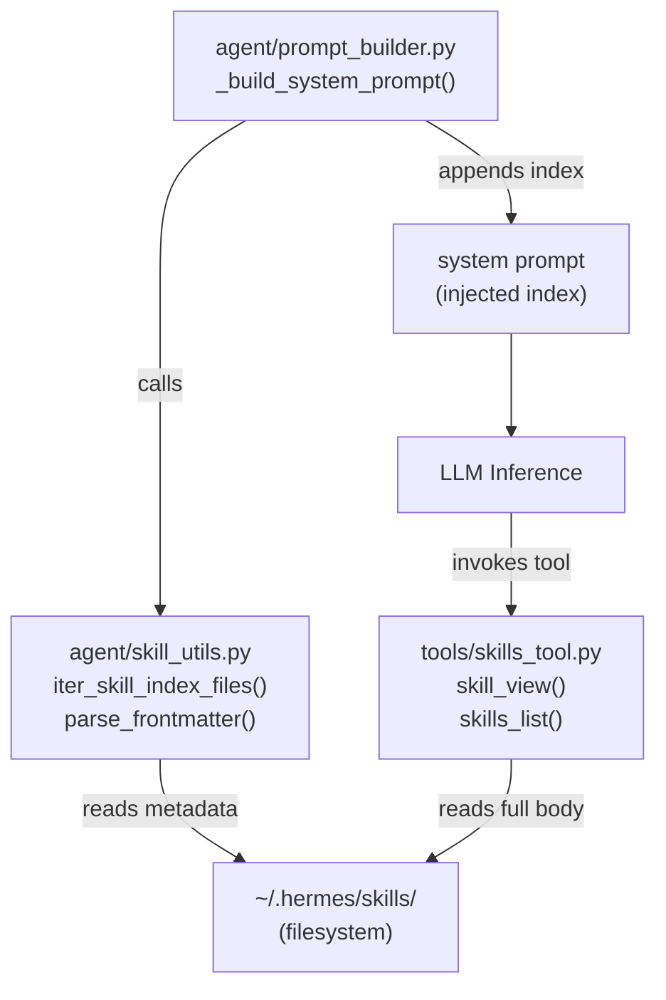
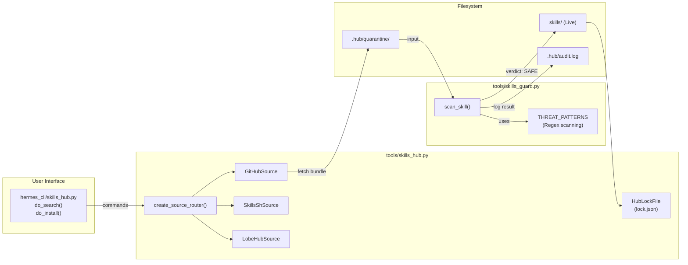
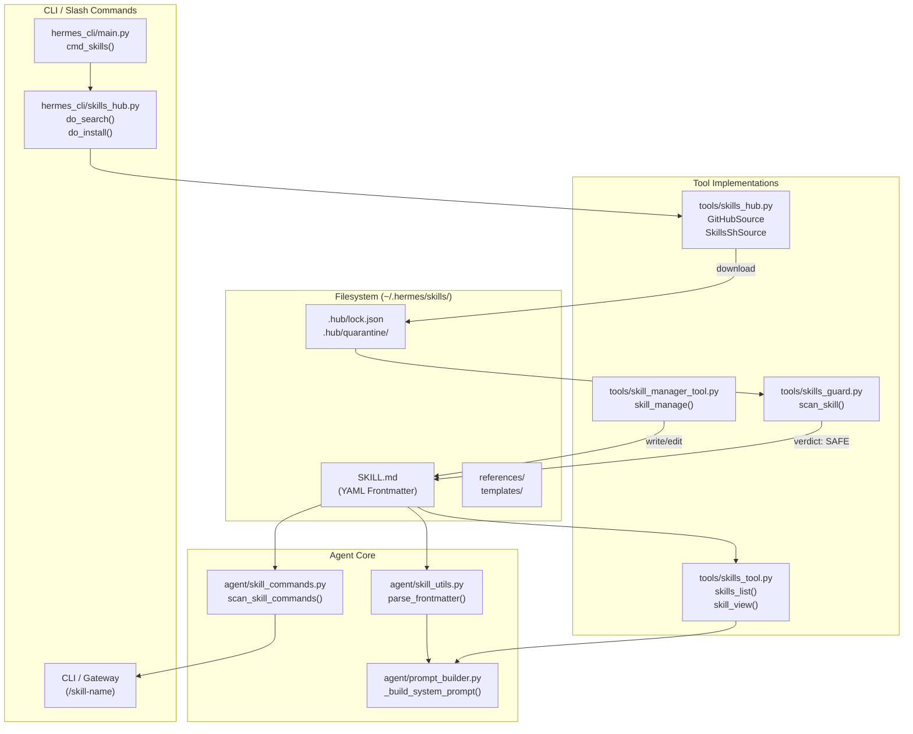

...
```

The frontmatter is parsed by `_parse_frontmatter()` in `tools/skills_tool.py` [tools/skills_tool.py:64-67](). Supporting files under `references/` or `templates/` are accessible via `skill_view(name, file_path)` [tools/skills_tool.py:65-67]().

Sources: [tools/skills_tool.py:28-46](), [tools/skills_tool.py:91-103](), [tools/skills_tool.py:128-138](), [agent/skill_commands.py:102-106]()

---

## System Prompt Integration

At agent startup, the system prompt builder generates a compact skills index. This uses **progressive disclosure**: only minimal metadata (name and truncated description) appears in the main system prompt to save tokens [agent/prompt_builder.py:170-176]().

**Progressive disclosure levels:**

| Level | Tool call | Returns |
|-------|-----------|---------|
| 0 | `skills_list()` | List of all available skills with names and descriptions [tools/skills_tool.py:53-53]() |
| 1 | `skill_view(name)` | Full `SKILL.md` instructions for the specific skill [tools/skills_tool.py:54-54]() |
| 2 | `skill_view(name, path)` | Content of a specific reference, template, or asset file [tools/skills_tool.py:65-67]() |

**Component diagram — skill prompt injection:**



Sources: [agent/prompt_builder.py:170-176](), [tools/skills_tool.py:52-67](), [tools/skills_tool.py:64-67]()

---

## Skills Tools (Agent-Facing)

Two tool modules expose skill access and modification to the agent:

### Read-Only Tools (`tools/skills_tool.py`)

Registered tools that allow the agent to discover and read its own capabilities:

| Tool | Description |
|------|-------------|
| `skills_list` | Returns metadata (Tier 0) for all compatible skills [tools/skills_tool.py:53-53]() |
| `skill_view` | Returns full instructions (Tier 1) or specific files (Tier 2) [tools/skills_tool.py:54-54]() |

These tools respect platform compatibility checks; skills marked for `macos` will not be listed when running on `linux` [tools/skills_tool.py:151-158]().

### Authoring Tool (`tools/skill_manager_tool.py`)

The `skill_manage` tool allows the agent to maintain its own skill library. The agent is encouraged to save new workflows as skills after complex tasks [agent/prompt_builder.py:151-164]().

| Action | Description |
|--------|-------------|
| `create` | Create a new skill directory and `SKILL.md` [tools/skill_manager_tool.py:15-15]() |
| `edit` | Replace the entire content of an existing skill file [tools/skill_manager_tool.py:16-16]() |
| `patch` | Apply targeted search-and-replace edits to a skill [tools/skill_manager_tool.py:17-17]() |
| `delete` | Remove a skill (only permitted for user-created skills) [tools/skill_manager_tool.py:18-18]()

For details on skill creation and security scanning of agent-authored code, see [Skills Management and Security](#8.1).

Sources: [tools/skills_tool.py:52-67](), [tools/skill_manager_tool.py:14-21](), [agent/prompt_builder.py:151-164]()

---

## Skills Hub

The Skills Hub enables installing skills from external registries. This is a **user-driven** system; the agent can see installed skills but cannot search or install new ones from the hub itself [tools/skills_hub.py:5-13]().

### Architecture

The hub uses a "source router" to communicate with different registries (GitHub, `skills.sh`, LobeHub, etc.) and a "quarantine" system for security scanning before installation [tools/skills_hub.py:3-11]().

**Component diagram — Skills Hub:**



Sources: [tools/skills_hub.py:5-14](), [tools/skills_hub.py:46-53](), [hermes_cli/skills_hub.py:109-136](), [tools/skills_guard.py:3-9]()

### Source Adapters

Supported sources include:
- **GitHubSource**: Fetches from any GitHub repository using the Contents API [tools/skills_hub.py:9-9]().
- **SkillsShSource**: Integrates with the `skills.sh` registry, mapping results to prefixed identifiers [tools/skills_hub.py:115-144]().
- **LobeHubSource**: Fetches skills from the LobeHub agent index [tools/skills_hub.py:13-13]().
- **OptionalSkillSource**: Provides "official" but unactivated skills shipped with the repository [tools/skills_hub.py:8-8]().

For details on browsing and installing from the hub, see [Skills Hub](#8.2).

Sources: [tools/skills_hub.py:7-13](), [hermes_cli/skills_hub.py:34-78]()

---

## Code Entity Map

This diagram traces the skills system from the local filesystem through agent tooling to system prompt injection.



Sources: [tools/skills_tool.py:87-89](), [tools/skills_tool.py:64-67](), [hermes_cli/skills_hub.py:34-78](), [tools/skill_manager_tool.py:14-21](), [agent/skill_commands.py:23-27]()