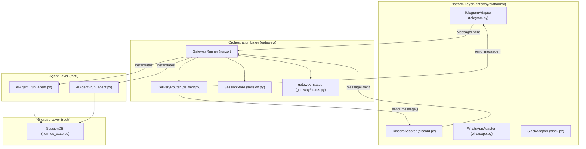
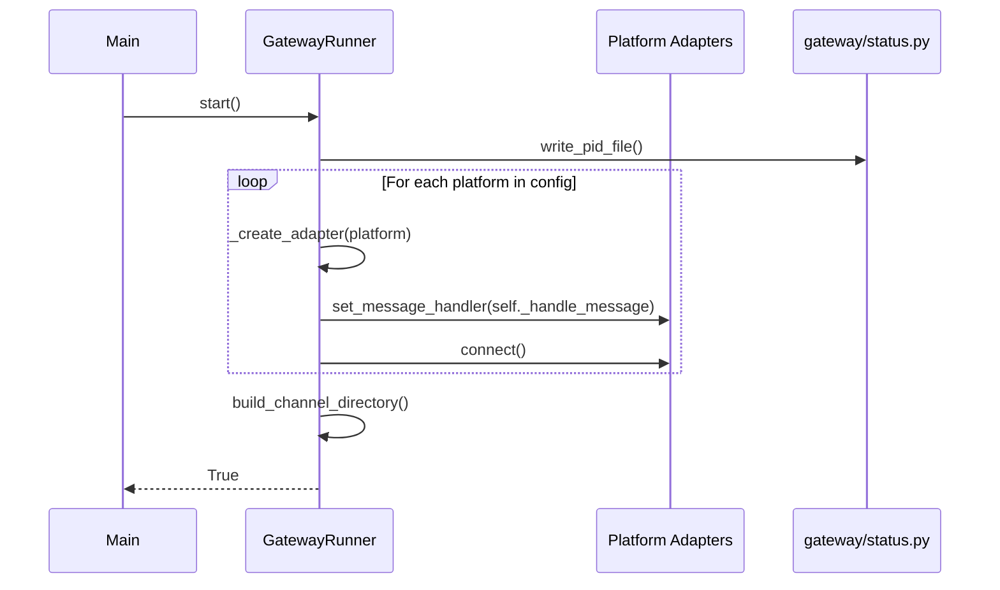

This page documents the `GatewayRunner` class and its role in orchestrating message routing between messaging platforms and the `AIAgent`. The gateway runs as a persistent daemon that connects to multiple platforms (Telegram, Discord, WhatsApp, Slack, Signal, etc.) and manages `AIAgent` instances per session.

**Key architectural difference from CLI**: The CLI maintains a single persistent `AIAgent` instance across multiple conversation turns, while the gateway orchestrates multiple concurrent sessions, instantiating or reusing agents based on incoming `MessageEvent` data [gateway/run.py:775-807](). Session state is preserved by loading conversation history from a SQLite database (`state.db`) and persisting it back at the end of each turn [hermes_state.py:6-15]().

---

## System Overview

The gateway consists of three main layers: platform adapters, the orchestration runner, and the core agent logic.

### Natural Language to Code Entity Mapping
The following diagram bridges the conceptual messaging flow to the specific Python classes and files responsible for execution.

**Sources**: [gateway/run.py:157-936](), [hermes_state.py:116-162](), [gateway/session.py:1-22]()

| Component | Purpose | Location |
|-----------|---------|----------|
| `GatewayRunner` | Main orchestration class, manages platform adapters and message routing | [gateway/run.py:157-936]() |
| `SessionDB` | SQLite-backed session storage with FTS5 search | [hermes_state.py:116-162]() |
| `SessionStore` | Manages session lifecycle and transcript storage logic | [gateway/session.py:10-22]() |
| `AIAgent` | The core agent class that executes the conversation loop | [run_agent.py:165-210]() |
| `SessionSource` | Describes origin metadata (platform, chat_id, user_id) | [gateway/session.py:67-140]() |

---

## GatewayRunner Lifecycle

### Initialization and Process Management
The gateway is designed to be highly portable across Linux (systemd), macOS (launchd), and Windows.

1.  **Process Tracking**: Writes a PID file to `{HERMES_HOME}/gateway.pid` to track the running process [gateway/status.py:44-47]().
2.  **Runtime Status**: Persists health data (active agents, platform states) to `gateway_state.json` [gateway/status.py:58-60]().
3.  **Concurrency Control**: Uses machine-local locks in `XDG_STATE_HOME/hermes/gateway-locks` to prevent multiple instances from competing for the same platform tokens [gateway/status.py:63-69]().

**Sources**: [gateway/status.py:44-69](), [hermes_cli/gateway.py:47-130]()

### Startup Sequence
The `GatewayRunner.start()` method performs the following:

**Sources**: [gateway/run.py:371-469](), [gateway/status.py:216-224]()

Notable startup behaviors:
-   **Service Detection**: The CLI uses `_get_service_pids()` to identify processes managed by systemd or launchd to avoid accidental termination during manual sweeps [hermes_cli/gateway.py:70-130]().
-   **Self-Restart**: Supports `SIGUSR1` signals to trigger asynchronous self-restarts, which is used during `hermes update` [hermes_cli/gateway.py:190-200]().
-   **SSL Cert Detection**: Automatically detects SSL certificates for non-standard systems (like NixOS) before importing HTTP libraries to ensure platform connectivity [gateway/run.py:48-85]().

---

## Message Routing and State

### Session Persistence (SessionDB)
The gateway uses `SessionDB` (SQLite) for all conversation persistence, replacing legacy JSONL files [hermes_state.py:5-15]().
-   **WAL Mode**: Uses `PRAGMA journal_mode=WAL` with a fallback to `DELETE` mode for incompatible filesystems like NFS or SMB [hermes_state.py:128-161]().
-   **FTS5 Search**: Implements a virtual table `messages_fts` for fast full-text search across all session messages [hermes_state.py:10-11]().
-   **Session Chains**: Supports compression-triggered session splitting via `parent_session_id` chains [hermes_state.py:12-13]().

**Sources**: [hermes_state.py:5-15](), [hermes_state.py:128-161]()

### Session Expiry and Cache Management
To maintain stability over long uptimes, the gateway enforces strict memory and session policies:
-   **Agent Cache**: Limits the number of concurrent `AIAgent` instances to 128 using an LRU policy [gateway/run.py:41]().
-   **Idle Eviction**: Agents idle for more than 1 hour (`_AGENT_CACHE_IDLE_TTL_SECS = 3600.0`) are evicted from memory to reclaim resources [gateway/run.py:42]().
-   **Reset Policies**: Supports `daily` (specific hour), `idle` (minutes of inactivity), or `both` reset modes via `SessionResetPolicy` to refresh conversation context [gateway/session.py:59-60]().

**Sources**: [gateway/run.py:36-43](), [gateway/session.py:57-61]()

### Session Context and PII Redaction
The gateway tracks where messages originate using `SessionSource` and builds a dynamic system prompt via `SessionContext` [gateway/session.py:71-193]().

To protect user privacy when using public LLM providers:
-   **Redaction Logic**: On "PII-safe" platforms (WhatsApp, Signal, Telegram, BlueBubbles), the gateway strips phone numbers and replaces user/chat IDs with deterministic 12-char hex hashes [gateway/session.py:34-55]().
-   **Platform Exceptions**: Discord is excluded from redaction because the LLM needs raw IDs to perform mentions (e.g., `<@user_id>`) [gateway/session.py:201-204]().

**Sources**: [gateway/session.py:34-55](), [gateway/session.py:195-204]()

---

## Service Integration and Maintenance

### Service Management
The gateway is managed as a system service across different OS environments:
-   **Systemd**: The CLI generates unit files that support `ExecReload=/bin/kill -USR1 $MAINPID` for graceful restarts [tests/hermes_cli/test_gateway_service.py:109-118]().
-   **Launchd**: The gateway CLI manages macOS launchd labels and supports status monitoring via `launchctl list` [hermes_cli/gateway.py:109-129](). The generated `launchd` plist includes `--replace` to ensure respawned gateways kill stale instances [tests/hermes_cli/test_update_gateway_restart.py:130-149]().
-   **Restart Exit Code**: A specific exit code (`GATEWAY_SERVICE_RESTART_EXIT_CODE = 75`) is used to signal the service manager that a restart was requested by the application logic [hermes_cli/gateway.py:22]().

**Sources**: [hermes_cli/gateway.py:22](), [hermes_cli/gateway.py:109-129](), [tests/hermes_cli/test_gateway_service.py:109-118](), [tests/hermes_cli/test_update_gateway_restart.py:130-149]()

### Cron Scheduler Integration
The gateway integrates with the cron scheduler to deliver scheduled tasks to specific platforms and chats.
-   **Delivery Router**: The `DeliveryRouter` (orchestrated by `GatewayRunner`) is responsible for sending messages to the correct platform adapter [gateway/run.py:157-164]().
-   **Session Source for Cron**: `SessionSource` objects track the origin for cron job delivery, ensuring scheduled messages are sent to the intended chat [gateway/session.py:71-79]().

**Sources**: [gateway/run.py:157-164](), [gateway/session.py:71-79]()

### Status Monitoring
The `hermes gateway status` command provides deep visibility into the running gateway process, including PID, uptime, and active platform connections [hermes_cli/status.py:90-98](). It verifies the integrity of the `.env` file and API keys across all supported providers [hermes_cli/status.py:103-174]().

**Sources**: [hermes_cli/status.py:90-174]()