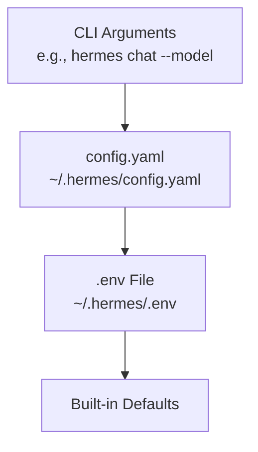
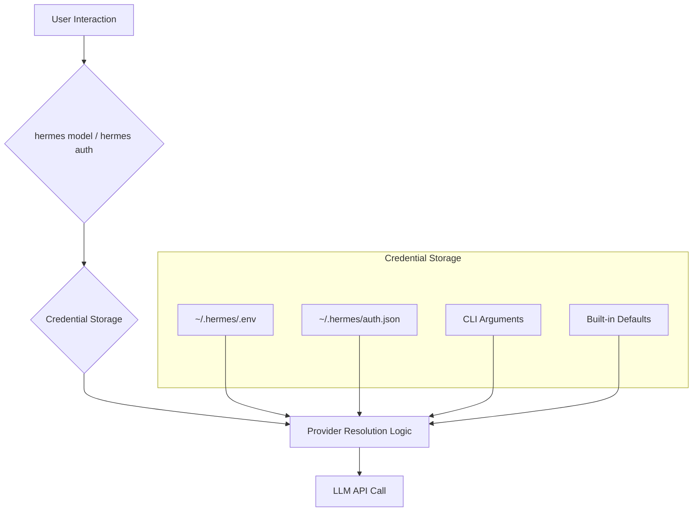
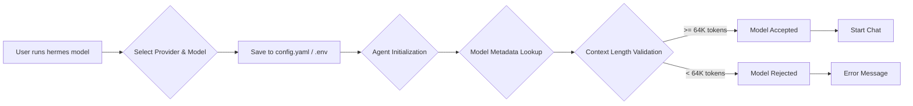
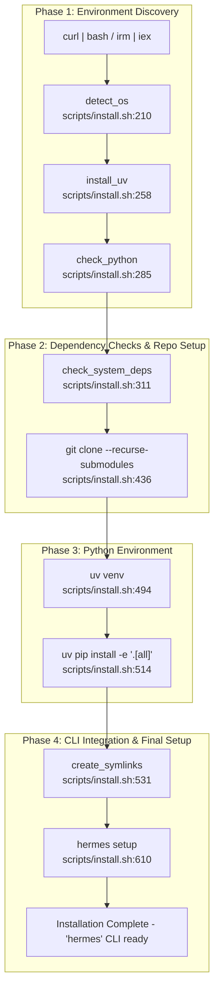
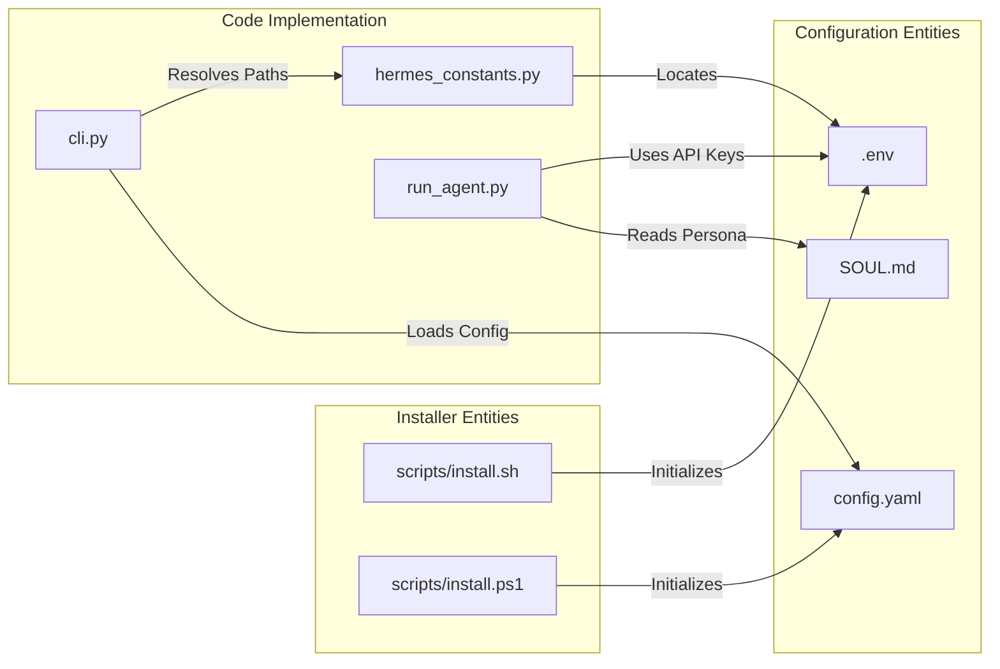
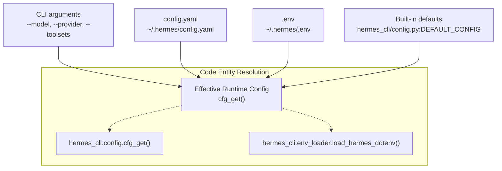
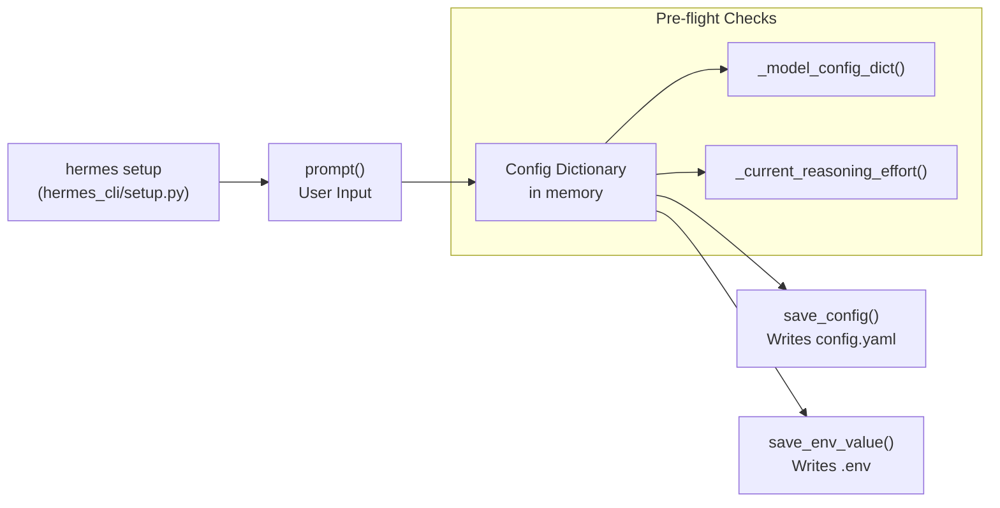

This page provides a high-level guide for installing and configuring Hermes Agent, from initial setup to your first conversation. Hermes is designed for users who live in the terminal but also offers a robust messaging gateway for external platforms.

---

## 2.1 Installation

Hermes Agent is built to be cross-platform, supporting Linux, macOS, WSL2, and Android (via Termux). The primary installation method uses `uv` for fast Python provisioning and dependency management.

*   **Linux / macOS / WSL2**: The `curl | bash` installer [README.md:36-37]() handles platform-specific setup and dependency provisioning [scripts/install.sh:5-10]().
*   **Android / Termux**: A curated `.[termux]` extra is used to avoid incompatible voice dependencies on mobile devices [README.md:53-55]().
*   **Windows**: Native Windows support is in early beta [README.md:40-42](). Users can use a PowerShell one-liner [README.md:45-47]() which bundles a portable **Git Bash** (MinGit) for shell command execution [README.md:49-51]().
*   **Nix**: Support for Nix flakes provides reproducible environments for advanced users.

For details, see [Installation](#2.1).

Sources: [README.md:33-56](), [scripts/install.sh:1-10](), [scripts/install.ps1:1-21]()

---

## 2.2 Configuration and Setup

Hermes stores all user data and settings in the `HERMES_HOME` directory, which defaults to `~/.hermes/` on Linux/macOS/WSL2 and `%LOCALAPPDATA%\hermes` on native Windows [scripts/install.sh:48](), [scripts/install.ps1:19](). Configuration follows a strict hierarchy where CLI arguments override file-based settings.

### Configuration Hierarchy


Sources: [website/docs/user-guide/configuration.md:45-56]()

### The Setup Wizard

The `hermes setup` command launches an interactive wizard [README.md:74]() that configures models, terminal backends, messaging platforms, and tools at once [website/docs/reference/cli-commands.md:43](). Users can also manage settings granularly via the `hermes config` command family [website/docs/reference/cli-commands.md:60](). The `hermes config set` command automatically routes values to the correct file (e.g., API keys to `.env`, other settings to `config.yaml`) [website/docs/user-guide/configuration.md:41-42]().

| File | Contents |
|------|----------|
| `config.yaml` | Non-secret settings (model, terminal, TTS, compression, etc.) [website/docs/user-guide/configuration.md:15]() |
| `.env` | API keys and secrets [website/docs/user-guide/configuration.md:16]() |
| `auth.json` | OAuth provider credentials (Nous Portal, etc.) [website/docs/user-guide/configuration.md:17]() |
| `SOUL.md` | Primary agent identity (slot #1 in system prompt) [website/docs/user-guide/configuration.md:18]() |

For a full reference of configuration keys and the setup process, see [Configuration and Setup](#2.2).

Sources: [website/docs/user-guide/configuration.md:9-24](), [website/docs/reference/cli-commands.md:43-60](), [README.md:74]()

---

## 2.3 Authentication and Providers

Hermes features a multi-provider authentication system that supports OAuth device code flows and traditional API key providers.

1.  **OAuth Flows**: Managed via `hermes auth` [website/docs/reference/cli-commands.md:46](), supporting providers like Nous Portal, OpenAI Codex, and Google Gemini [website/docs/integrations/providers.md:17-41]().
2.  **API Keys**: Configured in `~/.hermes/.env` for providers such as OpenRouter, DeepSeek, and Anthropic [website/docs/reference/environment-variables.md:11-79]().
3.  **Credential Pools**: Supports managing multiple keys per provider with custom selection strategies [website/docs/sidebars.ts:163]().

### Provider Resolution Flow


Sources: [website/docs/user-guide/configuration.md:45-56](), [website/docs/reference/environment-variables.md:7-9](), [website/docs/reference/cli-commands.md:46](), [website/docs/integrations/providers.md:13-43]()

For details on specific provider requirements and OAuth flows, see [Authentication and Providers](#2.3).

---

## 2.4 Model Selection and Management

Hermes maintains a model catalog and provides tools for context length discovery and validation.

*   **Interactive Selection**: The `hermes model` command provides a terminal interface for choosing providers and models [README.md:70](), [website/docs/reference/cli-commands.md:40]().
*   **Context Validation**: Hermes requires a model with at least **64,000 tokens** of context [website/docs/getting-started/quickstart.md:113-114](). Models with smaller windows cannot maintain enough working memory for multi-step tool-calling workflows and will be rejected at startup [website/docs/getting-started/quickstart.md:114-115]().
*   **Auxiliary Clients**: Separate models can be configured for side tasks like vision, compression, or web extraction [website/docs/user-guide/configuration.md:63-65]().

### Model Configuration and Validation


Sources: [README.md:70](), [website/docs/reference/cli-commands.md:40](), [website/docs/getting-started/quickstart.md:113-116](), [website/docs/user-guide/configuration.md:15-16]()

For details on model validation and the model catalog system, see [Model Selection and Management](#2.4).

# Installation


This document explains the installation process for Hermes Agent, detailing installation methods (curl|bash, PowerShell, manual, Nix flake), dependency provisioning, and platform-specific considerations.

---

## Overview

Hermes Agent features a zero-configuration, fully automated installer designed to provision its own isolated Python environment and dependencies to guarantee cross-platform compatibility and minimal system interference. The core installation logic is implemented in two scripts:

- `scripts/install.sh` for POSIX-compliant systems (Linux, macOS, WSL2, Android Termux) [scripts/install.sh:1-15]()
- `scripts/install.ps1` for Windows PowerShell environments [scripts/install.ps1:1-13]()

The installer automates system detection, dependency management (including the `uv` Python package manager), Python environment setup, repository cloning, and CLI integration. For advanced users and automated deployments, Hermes also supports a Nix flake and NixOS modules for declarative installation [nix/nixosModules.nix:1-25]().

### Installation Workflow Summary

The installer executes a structured sequence:

1.  **System Detection:** Determines OS and distribution to tailor installation steps [scripts/install.sh:210-231]().
2.  **`uv` Package Manager Installation:** Provisions `uv`, a fast Python environment and package manager for Hermes [scripts/install.sh:258-278](), [scripts/install.ps1:72-130]().
3.  **Python Provisioning:** Ensures Python 3.11 (or compatible fallback) is present, installing it via `uv` if needed [scripts/install.sh:285-309](), [scripts/install.ps1:132-192]().
4.  **Dependency Checks:** Verifies and installs essential system dependencies such as `git`, `curl`, `ffmpeg`, and `node` [scripts/install.sh:311-399](), [scripts/install.ps1:194-250]().
5.  **Repository Setup**: Clones the Hermes Agent repository with submodules, optionally using SSH or HTTPS URLs based on config [scripts/install.sh:436-482](), [scripts/install.ps1:348-410]().
6.  **Virtual Environment Creation and Dependency Installation:** Uses `uv` to create a Python virtual environment and pip-install the full `.[all]` extras, isolating Hermes runtime dependencies [scripts/install.sh:494-529](), [scripts/install.ps1:412-460]().
7.  **CLI Command Integration:** Creates symlinks to the `hermes` CLI binary in user local bin paths and updates shell configuration files to include it [scripts/install.sh:531-569](), [scripts/install.ps1:462-520]().
8.  **Post-Installation Setup Wizard:** Invokes `hermes setup` interactively to finalize configuration [scripts/install.sh:610-628](), [scripts/install.ps1:564-580]().

Sources: [scripts/install.sh:210-628](), [scripts/install.ps1:72-596]()

---

## Installation Methods

### 1. Quick Install (curl|bash or PowerShell)

#### Linux / macOS / WSL2 / Android (Termux)

Run the POSIX shell install script directly via `curl`:

```bash
curl -fsSL https://raw.githubusercontent.com/NousResearch/hermes-agent/main/scripts/install.sh | bash
```

This script automatically detects platform specifics. For Termux (Android), it uses standard Python virtual environments (`venv`) and pip instead of `uv` due to binary compatibility constraints [scripts/install.sh:69-71](). Use the flags:

-   `--no-venv` to skip virtual environment creation [scripts/install.sh:85-88]().
-   `--skip-setup` to bypass the setup wizard [scripts/install.sh:89-92]().

#### Windows (Native PowerShell) — Early Beta

Use the PowerShell installation command:

```powershell
irm https://raw.githubusercontent.com/NousResearch/hermes-agent/main/scripts/install.ps1 | iex
```

This script detects Windows, installs `uv` if missing, manages Python 3.11 provisioning, and configures the user environment [scripts/install.ps1:15-21](). The installer also handles a portable **MinGit** unpack to `%LOCALAPPDATA%\hermes\git` if no system Git is found, ensuring a functional bash environment for tool execution [scripts/install.ps1:221-250]().

Sources: [scripts/install.sh:8-92](), [scripts/install.ps1:7-250](), [README.md:39-56]()

---

### 2. Manual Installation (Development & Custom Environments)

Developers or advanced users can manually clone and set up Hermes:

```bash
git clone --recurse-submodules https://github.com/NousResearch/hermes-agent.git
cd hermes-agent
# Use uv for environment management
uv venv
source .venv/bin/activate
uv pip install -e ".[all]"
```

The repository includes an `AGENTS.md` guide for developers, noting that `scripts/run_tests.sh` probes for `.venv` or `venv` automatically [AGENTS.md:5-14](). Manual installation is recommended for debugging or when contributing to the core `AIAgent` or tool system [AGENTS.md:84-118]().

Sources: [AGENTS.md:1-120](), [README.md:31-64]()

---

### 3. Nix Flake and NixOS Modules (Declarative Approach)

Hermes Agent supports Nix package manager integration to ease reproducible and declarative installs.

-   **The Nix flake** provides the `default` package, a compiled `tui` package for the Ink/React-based terminal UI [nix/tui.nix:1-41](), and `packages.nix` for managing the full environment [nix/packages.nix:1-26]().
-   **NixOS Module**: Provides two modes—a native systemd service or an OCI container with a persistent writable layer [nix/nixosModules.nix:3-11]().
-   **Container Mode**: Hermes runs from the Nix store bind-mounted read-only, while the writable layer (for `apt` or `pip` installs by the agent) persists across restarts [nix/nixosModules.nix:7-11]().

Example usage for on-demand ad-hoc setup:

```bash
nix run github:NousResearch/hermes-agent -- setup
```

Sources: [nix/nixosModules.nix:1-11](), [nix/tui.nix:1-41](), [nix/packages.nix:1-26]()

---

## Installation Flow Diagrams

### 1. System Provisioning Logic

This diagram traces the high-level flow of the installation process from initial script invocation through system detection, dependency provisioning, environment setup, to a ready-to-use Hermes CLI:



Sources: [scripts/install.sh:210-628](), [scripts/install.ps1:72-596]()

### 2. Installation Code Entity Association Map

This diagram aligns installation paths and configuration files with the specific code entities that manage them:



Sources: [cli.py:1-100](), [hermes_constants.py:1-31](), [run_agent.py:1-118](), [scripts/install.sh:48-49](), [scripts/install.ps1:19-20]()

---

## Dependency Groups (Extras)

Hermes Agent uses `pyproject.toml` to define dependency groups, allowing users to install only the components needed for their use case.

| Extra       | Purpose                     | Key Functionality                                                              |
| :---------- | :-------------------------- | :----------------------------------------------------------------------------- |
| `messaging` | Messaging gateway platforms | Supports Telegram, Discord, Slack, WhatsApp adapters                           |
| `voice`     | Speech-to-text and TTS      | Microphone input and voice output with ffmpeg and TTS backends                 |
| `termux`    | Android compatibility       | Lightweight install avoiding incompatible voice dependencies                   |
| `all`       | Full feature set            | Installs all optional features and heavy dependencies                          |

The automated installer defaults to `.[all]` to ensure all tools and platforms are available [scripts/install.sh:514-529]().

Sources: [scripts/install.sh:514-529](), [Dockerfile:69-79](), [README.md:53-56]()

---

## Platform-Specific Considerations

### Windows

-   **Data Path**: Native Windows install lives under `%LOCALAPPDATA%\hermes`, whereas WSL2 installs under `~/.hermes` [README.md:55-56]().
-   **MinGit**: The installer provisions a portable Git Bash to ensure Hermes has a POSIX-like shell to execute tools [scripts/install.ps1:221-250]().
-   **Beta Status**: Native Windows is in early beta; WSL2 remains the most battle-tested path for Windows users [README.md:39-42]().

### Android (Termux)

-   **Venv Path**: Uses standard Python `venv` + `pip` because `uv` does not currently support Termux's environment [scripts/install.sh:69-71]().
-   **Extras**: Installs `.[termux]` specifically to avoid Android-incompatible voice dependencies [README.md:53-54]().

### Docker

-   **Base Image**: Built on `debian:13.4` with `uv` and `gosu` pre-installed [Dockerfile:1-3]().
-   **Permissions**: The image includes logic to remap the `hermes` user UID/GID at runtime to match the host volume owner [Dockerfile:20-21](), [docker/entrypoint.sh:11-55]().
-   **State**: All state is stored in `/opt/data`, which should be mounted as a persistent volume [Dockerfile:110-112]().

Sources: [README.md:39-56](), [scripts/install.sh:69-71](), [Dockerfile:1-114](), [docker/entrypoint.sh:11-55]()

# Configuration and Setup


This page covers the detailed mechanics of configuration management and setup in Hermes Agent. It explains the layered configuration hierarchy that governs runtime settings, describes the interactive setup wizard, and presents key configuration files integral to the system initialization and environment control.

---

## Directory Structure

Hermes stores all configuration and runtime data in a well-defined user directory, by default `~/.hermes/`. This home directory is configurable via the `HERMES_HOME` environment variable.

The directory structure is automatically created when the Hermes Agent initializes (`ensure_hermes_home` function) and consists of:

```text
~/.hermes/
├── config.yaml          # Main structured configuration (model, terminal, tools, etc.)
├── .env                 # Secrets and API keys (e.g., OPENAI_API_KEY)
├── auth.json            # OAuth credentials (Nous Portal, etc.)
├── SOUL.md              # Primary agent persona (slot #1 in system prompt)
├── memories/            # Persistent memory files (MEMORY.md, USER.md)
├── skills/              # Agent skills (created and managed via skill_manage tool)
├── cron/                # Scheduled jobs configuration
├── sessions/            # Message gateway session storage
├── logs/                # Log files (errors.log, gateway.log, agent.log)
└── active_profile       # Optional sticky profile name for multiple config sets
```

This layout organizes configuration into secrets (`.env`), structured settings (`config.yaml`), and tokens (`auth.json`). User data such as memories and skills have dedicated subdirectories.

Sources: [hermes_cli/config.py:4-13](), [website/docs/user-guide/configuration.md:11-24](), [hermes_cli/main.py:111-120]()

---

## Configuration Hierarchy

Hermes Agent applies settings in a layered precedence order to determine runtime behavior, with later layers overriding earlier ones. The resolution order is:

1.  **Command-Line Interface Arguments** (highest priority): CLI flags such as `--model`, `--provider`, or `--toolsets` override all other sources for a single invocation. [website/docs/user-guide/configuration.md:49]()

2.  **`~/.hermes/config.yaml`**: The primary config file for non-secret settings like models, terminal backends, and agent heuristics. [website/docs/user-guide/configuration.md:50]()

3.  **`~/.hermes/.env`**: Fallback for environment variables; strictly required for secrets like API keys and tokens. [website/docs/user-guide/configuration.md:51]()

4.  **Built-in Defaults**: Hardcoded safe defaults used when no other configuration is found. [website/docs/user-guide/configuration.md:52]()

The following diagram illustrates this priority chain and how it culminates in the runtime configuration resolved by `cfg_get()` and related functions:

**Configuration Priority and Resolution**


### Implementation Highlights

-   **Profile Overrides**: The system intercepts `--profile` or `-p` before any other modules are imported to set the correct `HERMES_HOME`. This is handled in `_apply_profile_override`. [hermes_cli/main.py:119-153]()
-   **Secret Routing**: The `hermes config set` command automatically routes values: API keys (found in `_EXTRA_ENV_KEYS`) go to `.env`, while settings go to `config.yaml`. [hermes_cli/config.py:98-147](), [website/docs/user-guide/configuration.md:41-43]()
-   **Env Substitution**: `config.yaml` supports `${VAR_NAME}` syntax to reference variables from the environment or `.env` file. [website/docs/user-guide/configuration.md:58-72]()
-   **Config Parsing**: The `load_config` function in `hermes_cli/config.py` handles the merging of defaults and expansion of environment variables. It uses `_CONFIG_LOCK` for thread-safe access. [hermes_cli/config.py:95-96]()

Sources: [hermes_cli/main.py:111-165](), [hermes_cli/auth.py:1-14](), [website/docs/user-guide/configuration.md:45-56](), [hermes_cli/config.py:75-96]()

---

## `config.yaml` Reference

The `config.yaml` file governs the structured behavior of the agent.

### Core Configuration Sections

| Section | Description | Key Configuration Keys |
| :--- | :--- | :--- |
| `model` | AI model & provider routing | `default`, `provider`, `base_url` [cli-config.yaml.example:8-46]() |
| `terminal` | Terminal execution backend | `backend`, `cwd`, `docker_image`, `timeout` [website/docs/user-guide/configuration.md:89-97]() |
| `agent` | Agent loop heuristics | `reasoning_effort`, `max_turns` [hermes_cli/setup.py:116-129]() |
| `auxiliary` | Side-task specialized models | `vision`, `compression`, `web_extract` [agent/auxiliary_client.py:32-41]() |
| `providers` | Provider-specific tuning | `request_timeout_seconds`, `stale_timeout_seconds` [website/docs/user-guide/configuration.md:76-82]() |

### Auxiliary Client Overrides

Hermes uses specialized models for tasks like context compression or vision. The `agent/auxiliary_client.py` module handles a complex resolution chain for these tasks, allowing the user to override providers per-task (e.g., using a local model for compression but Anthropic for vision). [agent/auxiliary_client.py:7-41]()

Sources: [website/docs/user-guide/configuration.md:58-97](), [agent/auxiliary_client.py:1-41](), [cli-config.yaml.example:1-97]()

---

## .env File Reference

The `.env` file stores sensitive API keys. Hermes prioritizes `OPENROUTER_API_KEY` for general flexibility.

| Environment Variable | Purpose |
| :--- | :--- |
| `OPENROUTER_API_KEY` | Recommended for multi-model access [cli-config.yaml.example:15]() |
| `ANTHROPIC_API_KEY` | Native Anthropic access [cli-config.yaml.example:18]() |
| `COPILOT_GITHUB_TOKEN` | GitHub Copilot auth (OAuth or PAT) [hermes_cli/auth.py:189-192]() |
| `GOOGLE_API_KEY` | Gemini / AI Studio access [cli-config.yaml.example:21]() |
| `GLM_API_KEY` | z.ai / ZhipuAI GLM models [cli-config.yaml.example:22]() |

Sources: [cli-config.yaml.example:8-46](), [hermes_cli/auth.py:149-200]()

---

## Setup Wizard

The `hermes setup` command launches a modular interactive wizard implemented in `hermes_cli/setup.py`.

### Modular Sections
The wizard is split into independently-runnable sections:
1.  **Model & Provider**: Configures the primary LLM. [hermes_cli/setup.py:5]()
2.  **Terminal Backend**: Configures where commands execute. [hermes_cli/setup.py:6]()
3.  **Agent Settings**: Configures iterations and memory limits. [hermes_cli/setup.py:7]()
4.  **Messaging Platforms**: Configures Telegram, Discord, etc. [hermes_cli/setup.py:8]()
5.  **Tools**: Configures TTS, search, and image generation. [hermes_cli/setup.py:9]()

### Model Discovery Logic
The wizard attempts to fetch live model lists from providers but includes an extensive fallback catalog in `_DEFAULT_PROVIDER_MODELS` if the provider's API is unreachable. [hermes_cli/setup.py:73-113]()

**Setup Wizard Data Flow**


Sources: [hermes_cli/setup.py:1-12,71-113,196-208](), [hermes_cli/main.py:14]()

---

## Terminal Backend Configuration

Hermes supports multiple execution environments via the `terminal.backend` setting.

| Backend | Environment | Use Case |
| :--- | :--- | :--- |
| `local` | Host Machine | Fast, zero-config [website/docs/user-guide/configuration.md:113-120]() |
| `docker` | Container | Secure sandboxing [website/docs/user-guide/configuration.md:126-145]() |
| `ssh` | Remote Server | Remote development [website/docs/user-guide/configuration.md:107]() |
| `modal` | Cloud Sandbox | Ephemeral cloud compute [website/docs/user-guide/configuration.md:108]() |
| `singularity` | HPC Container | High-performance clusters [website/docs/user-guide/configuration.md:111]() |

Sources: [website/docs/user-guide/configuration.md:101-145](), [hermes_cli/setup.py:6]()

---

## Configuration Management Commands

| Command | Action |
| :--- | :--- |
| `hermes config` | View current effective configuration [hermes_cli/main.py:119-120]() |
| `hermes config set KEY VAL` | Update a setting (routes to `.env` or `config.yaml`) [website/docs/user-guide/configuration.md:31]() |
| `hermes config edit` | Opens `config.yaml` in the system editor [website/docs/user-guide/configuration.md:30]() |
| `hermes doctor` | Validates configuration and dependencies [hermes_cli/main.py:20]() |
| `hermes status` | Show status of all components [hermes_cli/main.py:16]() |

Sources: [hermes_cli/main.py:1-60](), [website/docs/user-guide/configuration.md:26-39]()