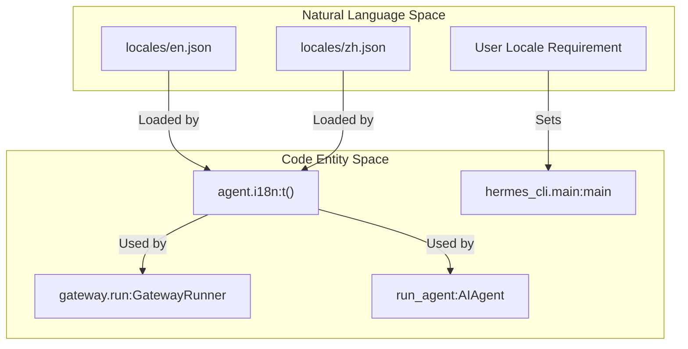

Hermes Agent incorporates a static message catalog system for internationalization (i18n), enabling the application to display messages in multiple languages. This system is primarily used for user-facing prompts in the Command Line Interface (CLI) and replies to slash commands within the messaging gateway.

## Purpose and Scope

The i18n system aims to provide a localized user experience for key interaction points. The current scope of translation includes:
*   **CLI Approval Prompts**: Messages displayed to the user when an agent requests approval for potentially dangerous actions (e.g., shell commands, file modifications).
*   **Gateway Slash-Command Replies**: Standard responses generated by the gateway when users interact with it via slash commands (e.g., `/help`, `/status`, `/usage`).

The system is designed to be lightweight and efficient, relying on static message files rather than dynamic translation services.

## Supported Languages

The following languages are currently supported:

*   English (`en`)
*   Simplified Chinese (`zh`)
*   Traditional Chinese (`zh-hant`)
*   Japanese (`ja`)
*   German (`de`)
*   Spanish (`es`)
*   French (`fr`)
*   Turkish (`tr`)
*   Ukrainian (`uk`)
*   Afrikaans (`af`)
*   Irish (`ga`)
*   Hungarian (`hu`)
*   Italian (`it`)
*   Korean (`ko`)
*   Portuguese (`pt`)
*   Russian (`ru`)

## Static Message Catalog System

The core of the i18n system is a collection of static message files located in the `locales/` directory. Each supported language has its own JSON file containing key-value pairs, where the key is a unique identifier for a message, and the value is the translated string.

### Directory Structure

The `locales/` directory is structured as follows:

```text
locales/
├── en.json
├── zh.json
├── zh-hant.json
├── ja.json
├── de.json
├── es.json
├── fr.json
├── tr.json
├── uk.json
├── af.json
├── ga.json
├── hu.json
├── it.json
├── ko.json
├── pt.json
└── ru.json
```

Sources: `agent/i18n.py` (referenced by `gateway/run.py:53`)

### Message File Format

Each `.json` file contains a dictionary where keys are message identifiers and values are the translated strings. For example, `locales/en.json` might contain:

```json
{
    "cli.approval.shell_command": "The agent wants to run a shell command:",
    "cli.approval.file_write": "The agent wants to write to a file:",
    "gateway.help.message": "Hello! I am Hermes Agent. Here are some commands you can use:",
    "gateway.status.online": "Hermes Agent is online and ready to assist!"
}
```

And `locales/zh.json` would contain the Chinese translations for the same keys.

### Implementation Details

The `agent/i18n.py` module (not shown in full but imported by `gateway/run.py:53` and `run_agent.py`) provides the functionality for loading and retrieving translated messages.

#### `t()` function

The primary interface for retrieving translated messages is the `t()` function. It takes a message key and optional arguments for string formatting. In the gateway, it is used to translate slash command descriptions and system messages.

Sources: `gateway/run.py:53`

### Data Flow

The following diagram illustrates how the `i18n` system bridges Natural Language requirements to the code entities that consume them.


Title: "Natural Language to Code Entity Mapping"

Sources: `gateway/run.py:53`, `hermes_cli/main.py:1-44`, `run_agent.py:122-187`

### Integration with CLI and Gateway

The `t()` function is used throughout the CLI and gateway components to display localized messages.

#### Gateway Example

In `gateway/run.py`, the gateway runner uses `t()` to provide translated feedback for slash commands.

```python
# gateway/run.py:53
from agent.i18n import t
```

Sources: `gateway/run.py:53`

The gateway also handles platform-specific normalization, such as Telegram's strict command naming requirements, which interact with how help text is rendered for the user.

```python