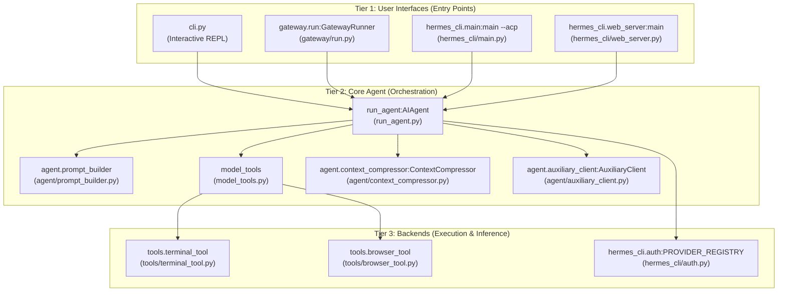

Hermes Agent is a self-improving AI agent framework built by **Nous Research**. It provides a robust conversation loop with tool-calling capabilities, persistent memory, agent-created skills, and deployment across multiple interfaces including CLI, messaging platforms (Telegram, Discord, WhatsApp, etc.), and editor integrations via the Agent Client Protocol (ACP). The system supports any OpenAI-compatible LLM provider and runs commands in local, containerized, or cloud execution environments. [run_agent.py:1-21](), [cli.py:1-14]()

This page introduces the overall architecture, major subsystems, and how they interact. For detailed information about specific subsystems:
- Agent conversation orchestration: [Architecture Overview](#1.1)
- Installation and dependency management: [Project Structure and Dependencies](#1.2)

---

## System Architecture

### Three-Tier Design

Hermes Agent follows a three-tier architecture separating user interfaces, core agent logic, and execution backends. It bridges "Natural Language Space" (user intent) to "Code Entity Space" (tool execution) through a structured registry.

**Architecture Component Mapping**

**Sources:** [run_agent.py:111-175](), [cli.py:1-14](), [gateway/run.py:1-32](), [hermes_cli/main.py:40-44](), [hermes_cli/auth.py:149-195](), [agent/auxiliary_client.py:1-41]()

### Runtime Modes

The system supports several primary runtime modes, each instantiating `AIAgent` with different lifecycle management:

| Mode | Entry Point | Use Case | Session Persistence |
|------|-------------|----------|---------------------|
| **CLI** | `cli.py` | Interactive terminal sessions with TUI | `~/.hermes/sessions/` |
| **Gateway** | `gateway/run.py` | Messaging platforms (Telegram, Discord, etc.) | `~/.hermes/sessions/` |
| **ACP** | `hermes_cli/main.py` | Editor integrations (VS Code, Zed) | Client-managed |
| **Web UI** | `hermes_cli/web_server.py` | Browser-based dashboard and chat | `~/.hermes/sessions/` |

**Sources:** [cli.py:1-14](), [gateway/run.py:1-14](), [run_agent.py:111-125](), [hermes_cli/main.py:1-44]()

---

## Core Components

### AIAgent Class

The `AIAgent` class in `run_agent.py` orchestrates the conversation loop. It manages the iteration budget, tool execution via `handle_function_call`, and state persistence. [run_agent.py:17-21]()

**Execution Flow: Natural Language to Tool Call**

```mermaid
graph LR
    UserMsg["User Message"] --> AIAgent["run_agent:AIAgent.run_conversation()"]
    AIAgent --> Prompt["agent.prompt_builder:build_skills_system_prompt()"]
    Prompt --> LLM["LLM Provider<br/>(hermes_cli.auth:resolve_provider())"]
    LLM --> ToolCall["Tool Call JSON"]
    ToolCall --> Dispatch["model_tools:handle_function_call()"]
    Dispatch --> Tools["tools/ directory"]
    Tools --> Exec["tools.terminal_tool / tools.browser_tool"]
    Exec --> Result["Tool Result String"]
    Result --> AIAgent
```

**Sources:** [run_agent.py:111-116](), [hermes_cli/auth.py:149-195](), [model_tools.py:122-127]()

### Tool and Environment System

Tools are discovered at runtime and registered for LLM use. Execution occurs within abstracted environments (Local, Docker, SSH, Modal, Daytona, etc.) configured in the terminal settings. [hermes_cli/config.py:129-130]()

- **Tool System**: Handled via `model_tools.py`, which provides definitions and execution logic for tools like terminal access, file operations, and web browsing. [run_agent.py:122-127]()
- **Environments**: The terminal backend allows the agent to run commands across diverse backends as configured in the `terminal` block of `config.yaml`. [hermes_cli/config.py:129-130]()

**Sources:** [run_agent.py:111-126](), [hermes_cli/config.py:129-130]()

---

## Memory and Learning

Hermes Agent features a "closed learning loop" where it creates and improves its own capabilities over time.

- **Skills System**: The agent can create new Python-based tools (skills) and manage them via the `skill_manage` tool. [hermes_cli/main.py:17-30]()
- **Persistent Memory**: Uses `MEMORY.md` and `USER.md` files for long-term fact storage and user profiling, with logic managed in `agent/memory_manager.py`. [run_agent.py:141-142]()
- **Honcho Integration**: Supports AI-native memory and user modeling via the Honcho integration for cross-session recall and dialectic queries. [hermes_cli/main.py:21-36]()

**Sources:** [run_agent.py:141-142](), [hermes_cli/main.py:21-36](), [agent/memory_manager.py:1-5]()

---

## Configuration

All persistent configuration and user data live in the `HERMES_HOME` directory (default: `~/.hermes/`). [hermes_cli/config.py:4-13]()

| File | Purpose |
|------|---------|
| `config.yaml` | Primary settings (model, terminal backend, toolsets) |
| `.env` | Secrets and API keys |
| `SOUL.md` | Primary agent identity/persona |
| `auth.json` | OAuth tokens and provider state |

**Sources:** [hermes_cli/config.py:4-13](), [hermes_cli/auth.py:1-14]()

---

## Sub-Pages

For more technical depth, please refer to the following child pages:

- **[Architecture Overview](#1.1)** — Deep dive into the three-tier architecture, the `AIAgent` loop, and tool registry internals.
- **[Project Structure and Dependencies](#1.2)** — Detailed documentation of the directory layout, key files, and the installation ecosystem including Nix support.