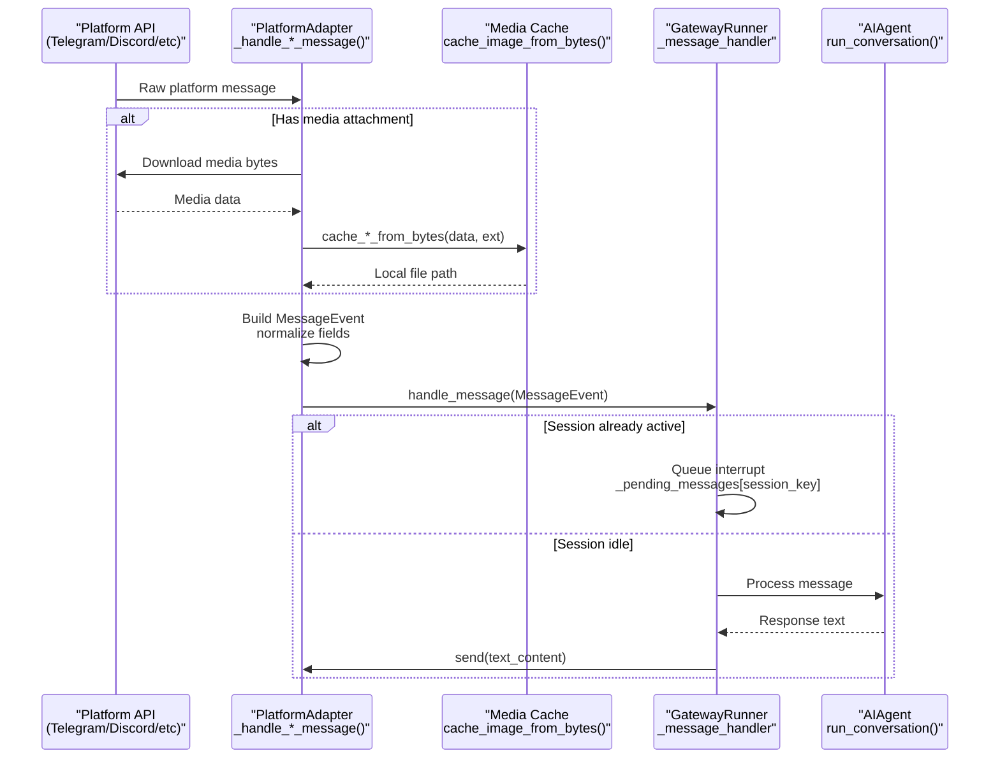
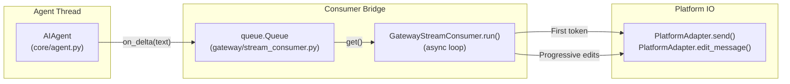
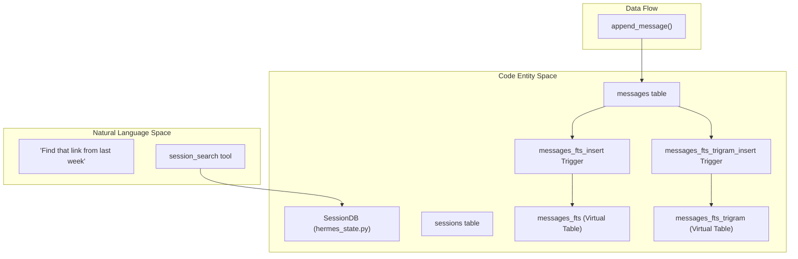
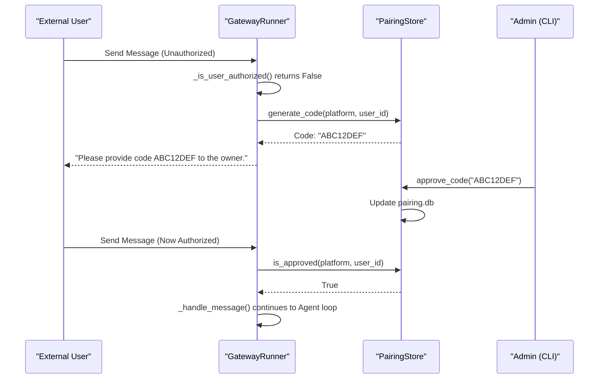
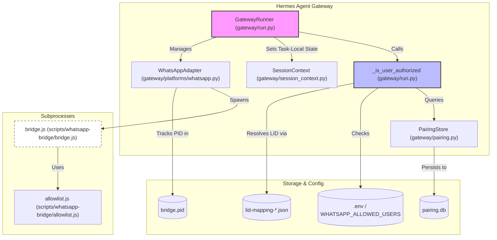

Platform adapters provide a unified interface for integrating Hermes Agent with messaging platforms (Telegram, Discord, WhatsApp, Slack, Signal, Email, Home Assistant, DingTalk, Matrix, Mattermost, SMS, Webhook, API Server, Feishu, Weixin, Bluebubbles, QQBot, Yuanbao, WeCom). Each adapter normalizes platform-specific message formats, handles media attachments, manages authentication, and translates between standard markdown and platform-specific formatting conventions.

For information about the gateway service that orchestrates these adapters, see [7.1 Gateway Architecture](). For session management and routing logic, see [7.3 Session and Media Management]().

---

## Architecture Overview

Platform adapters follow a common inheritance pattern where all concrete implementations extend `BasePlatformAdapter` [gateway/platforms/base.py:333-350](). This abstract base class defines the contract for connecting to platforms, sending/receiving messages, and handling media.

### Platform Class Hierarchy

```mermaid
graph TB
    subgraph "Abstract Layer"
        BasePlatformAdapter["BasePlatformAdapter<br/>(gateway/platforms/base.py)"]
        MessageEvent["MessageEvent<br/>normalized incoming message"]
        SendResult["SendResult<br/>send operation result"]
    end
    
    subgraph "Concrete Adapters"
        TelegramAdapter["TelegramAdapter<br/>(gateway/platforms/telegram.py)"]
        DiscordAdapter["DiscordAdapter<br/>(gateway/platforms/discord.py)"]
        SlackAdapter["SlackAdapter<br/>(gateway/platforms/slack.py)"]
        WhatsAppAdapter["WhatsAppAdapter<br/>(gateway/platforms/whatsapp.py)"]
        MatrixAdapter["MatrixAdapter<br/>(gateway/platforms/matrix.py)"]
        APIServerAdapter["APIServerAdapter<br/>(gateway/platforms/api_server.py)"]
        FeishuAdapter["FeishuAdapter<br/>(gateway/platforms/feishu.py)"]
        WeixinAdapter["WeixinAdapter<br/>(gateway/platforms/weixin.py)"]
        SignalAdapter["SignalAdapter<br/>(gateway/platforms/signal.py)"]
        EmailAdapter["EmailAdapter<br/>(gateway/platforms/email.py)"]
        MattermostAdapter["MattermostAdapter<br/>(gateway/platforms/mattermost.py)"]
        SMSAdapter["SMSAdapter<br/>(gateway/platforms/sms.py)"]
        DingTalkAdapter["DingTalkAdapter<br/>(gateway/platforms/dingtalk.py)"]
        WebhookAdapter["WebhookAdapter<br/>(gateway/platforms/webhook.py)"]
        WeComAdapter["WeComAdapter<br/>(gateway/platforms/wecom.py)"]
        BluebubblesAdapter["BluebubblesAdapter<br/>(gateway/platforms/bluebubbles.py)"]
        QQBotAdapter["QQBotAdapter<br/>(gateway/platforms/qqbot/adapter.py)"]
        TeamsAdapter["TeamsAdapter<br/>(plugins/platforms/teams/adapter.py)"]
    end
    
    subgraph "Support Systems"
        ImageCache["cache_image_from_bytes<br/>(gateway/platforms/base.py)"]
        AudioCache["cache_audio_from_bytes<br/>(gateway/platforms/base.py)"]
        ResponseStore["ResponseStore<br/>(gateway/platforms/api_server.py)"]
        StreamConsumer["GatewayStreamConsumer<br/>(gateway/stream_consumer.py)"]
    end
    
    BasePlatformAdapter --> MessageEvent
    BasePlatformAdapter --> SendResult
    
    TelegramAdapter -. "inherits" .-> BasePlatformAdapter
    DiscordAdapter -. "inherits" .-> BasePlatformAdapter
    SlackAdapter -. "inherits" .-> BasePlatformAdapter
    WhatsAppAdapter -. "inherits" .-> BasePlatformAdapter
    MatrixAdapter -. "inherits" .-> BasePlatformAdapter
    APIServerAdapter -. "inherits" .-> BasePlatformAdapter
    FeishuAdapter -. "inherits" .-> BasePlatformAdapter
    WeixinAdapter -. "inherits" .-> BasePlatformAdapter
    SignalAdapter -. "inherits" .-> BasePlatformAdapter
    EmailAdapter -. "inherits" .-> BasePlatformAdapter
    MattermostAdapter -. "inherits" .-> BasePlatformAdapter
    SMSAdapter -. "inherits" .-> BasePlatformAdapter
    DingTalkAdapter -. "inherits" .-> BasePlatformAdapter
    WebhookAdapter -. "inherits" .-> BasePlatformAdapter
    WeComAdapter -. "inherits" .-> BasePlatformAdapter
    BluebubblesAdapter -. "inherits" .-> BasePlatformAdapter
    QQBotAdapter -. "inherits" .-> BasePlatformAdapter
    TeamsAdapter -. "inherits" .-> BasePlatformAdapter
    
    TelegramAdapter --> ImageCache
    TelegramAdapter --> AudioCache
    APIServerAdapter --> ResponseStore
    BasePlatformAdapter --> StreamConsumer
```



**Sources:** [gateway/platforms/base.py:333-350](), [gateway/platforms/telegram.py:202-212](), [gateway/platforms/discord.py:321-340](), [gateway/platforms/whatsapp.py:134-156](), [gateway/platforms/api_server.py:240-260](), [gateway/platforms/matrix.py:199-220](), [gateway/platforms/slack.py:65-83](), [gateway/platforms/feishu.py:130-141](), [gateway/platforms/weixin.py:58-65]()

---

## BasePlatformAdapter Interface

The `BasePlatformAdapter` class [gateway/platforms/base.py:333-904]() defines the core interface that all platform adapters must implement.

### Abstract Methods

| Method | Purpose | Returns |
|--------|---------|---------|
| `connect()` | Establish connection to platform, start receiving messages | `bool` (success) |
| `disconnect()` | Close connection and cleanup resources | `None` |
| `send(chat_id, content, ...)` | Send a text message to a chat | `SendResult` |
| `get_chat_info(chat_id)` | Retrieve chat metadata (name, type) | `Dict[str, Any]` |

### Optional Override Methods

| Method | Default Behavior | Override Purpose |
|--------|------------------|------------------|
| `edit_message()` | Returns `success=False` | Platform-specific message editing [gateway/platforms/base.py:400-415]() |
| `send_typing()` | No-op | Show typing indicator [gateway/platforms/base.py:388-398]() |
| `send_image()` | Fallback to text URL | Native image attachments [gateway/platforms/base.py:420-435]() |
| `format_message()` | Return content as-is | Platform-specific markdown conversion [gateway/platforms/base.py:440-450]() |

**Sources:** [gateway/platforms/base.py:352-450]()

---

## Message Flow and Normalization

Platform adapters normalize diverse message formats into a common `MessageEvent` structure [gateway/platforms/base.py:272-318]().

### Inbound Message Pipeline



**Sources:** [gateway/platforms/base.py:649-853](), [gateway/platforms/telegram.py:668-791](), [gateway/platforms/discord.py:814-870]()

### MessageEvent Structure

The `MessageEvent` dataclass [gateway/platforms/base.py:272-318]() provides a unified representation:
- **Text extraction:** Adapters extract text from platform-specific fields (e.g., Telegram `message.text` vs `message.caption` [gateway/platforms/telegram.py:668-682]()).
- **Media caching:** Attachments are downloaded to local cache directories to preserve them beyond platform URL expiration [gateway/platforms/base.py:40-46]().
- **Document injection:** Small text files (logs, code, markdown) have their content injected directly into `event.text` to provide context to the LLM [gateway/platforms/telegram.py:791-840]().

---

## Media Handling and Caching

Platform adapters download media to local cache directories to avoid ephemeral URL expiration (e.g., Telegram file URLs expire after ~1 hour).

### Cache Utility Functions

| Function | Purpose | Returns |
|----------|---------|---------|
| `cache_image_from_bytes` | Save image bytes to cache [gateway/platforms/base.py:58-73]() | `str` (absolute path) |
| `cache_image_from_url` | Download and cache image with retries [gateway/platforms/base.py:76-120]() | `str` (absolute path) |
| `cache_audio_from_bytes` | Save audio bytes to cache [gateway/platforms/base.py:160-175]() | `str` |
| `cleanup_image_cache` | Delete cached images older than N hours [gateway/platforms/base.py:123-141]() | `int` (files removed) |

**Sources:** [gateway/platforms/base.py:46-175]()

---

## Platform-Specific Implementations

### Telegram Adapter
The `TelegramAdapter` [gateway/platforms/telegram.py:202-212]() uses `python-telegram-bot`.
- **MarkdownV2 formatting:** Implements `_escape_mdv2` [gateway/platforms/telegram.py:115-117]() and `_render_table_block_for_telegram` [gateway/platforms/telegram.py:173-174]() to handle Telegram's strict formatting requirements.
- **UTF-16 Limits:** Tracks message length in UTF-16 code units (limit 4096) via `utf16_len` [gateway/platforms/base.py:112-124]() to match Telegram's internal counters.
- **Network Fallback:** Includes `TelegramFallbackTransport` [gateway/platforms/telegram_network.py:82-86]() to handle connection issues in restricted regions.

**Sources:** [gateway/platforms/telegram.py:115-174](), [gateway/platforms/base.py:112-124](), [gateway/platforms/telegram_network.py:82-86]()

### Discord Adapter
The `DiscordAdapter` [gateway/platforms/discord.py:321-1038]() uses `discord.py`.
- **Voice Support:** Includes a `VoiceReceiver` class [gateway/platforms/discord.py:128-168]() that captures and decodes Opus audio to PCM from voice channels using NaCl transport and DAVE E2EE.
- **Allowed Mentions:** `_build_allowed_mentions` [gateway/platforms/discord.py:93-125]() explicitly denies `@everyone` and role pings by default.
- **Auto-threading:** Automatically creates threads for long-running conversations in channels.

**Sources:** [gateway/platforms/discord.py:128-168](), [gateway/platforms/discord.py:93-125]()

### Slack Adapter
The `SlackAdapter` [gateway/platforms/slack.py:65-930]() uses `slack-bolt` Socket Mode.
- **Block Kit Parsing:** `_extract_text_from_slack_blocks` [gateway/platforms/slack.py:80-168]() extracts readable text from Slack Block Kit blocks, including nested rich text elements for quoted content.
- **Context Variables:** Uses `_slash_user_id` contextvar [gateway/platforms/slack.py:61-63]() to track slash-command invokers across asynchronous tasks.

**Sources:** [gateway/platforms/slack.py:80-168](), [gateway/platforms/slack.py:61-63]()

### API Server Adapter
The `APIServerAdapter` [gateway/platforms/api_server.py:240-850]() provides an OpenAI-compatible interface.
- **Response Store:** Uses `ResponseStore` [gateway/platforms/api_server.py:125-161]() to maintain conversation state across stateless HTTP requests.
- **Normalization:** `_normalize_chat_content` [gateway/platforms/api_server.py:74-130]() flattens array-based content parts into plain text strings.
- **Multimodal Content:** `_normalize_multimodal_content` [gateway/platforms/api_server.py:141-167]() validates and normalizes multimodal content for vision-capable agents.

**Sources:** [gateway/platforms/api_server.py:125-161](), [gateway/platforms/api_server.py:74-130](), [gateway/platforms/api_server.py:141-167]()

### Matrix Adapter
The `MatrixAdapter` [gateway/platforms/matrix.py:199-1000]() uses the `mautrix` library.
- **Encryption:** Supports optional E2EE and maintains a persistent store for crypto keys in `~/.hermes/platforms/matrix/store` [gateway/platforms/matrix.py:130-132]().
- **Image Filename Heuristics:** `_looks_like_matrix_image_filename` [gateway/platforms/matrix.py:158-181]() identifies when Matrix image `content.body` is just a filename.

**Sources:** [gateway/platforms/matrix.py:130-132](), [gateway/platforms/matrix.py:158-181]()

### Weixin Adapter
The `WeixinAdapter` [gateway/platforms/weixin.py:240-260]() connects to WeChat personal accounts via Tencent's iLink Bot API.
- **Media Encryption:** Media files move through an AES-128-ECB encrypted CDN protocol [gateway/platforms/weixin.py:9-10]().
- **Session Management:** Handles `SESSION_EXPIRED_ERRCODE` and `RATE_LIMIT_ERRCODE` [gateway/platforms/weixin.py:94-108]() to manage iLink API session state.

**Sources:** [gateway/platforms/weixin.py:9-10](), [gateway/platforms/weixin.py:94-108]()

### Feishu Adapter
The `FeishuAdapter` [gateway/platforms/feishu.py:130-141]() supports both WebSocket and Webhook transports.
- **Interactive Cards:** Routes card button-click events as synthetic COMMAND events [gateway/platforms/feishu.py:14]().
- **Identity Model:** Understands Feishu's `open_id`, `user_id`, and `union_id` for user identification [gateway/platforms/feishu.py:19-45]().

**Sources:** [gateway/platforms/feishu.py:14](), [gateway/platforms/feishu.py:19-45]()

### WhatsApp Adapter
The `WhatsAppAdapter` [gateway/platforms/whatsapp.py:134-156]() uses a Node.js bridge pattern.
- **Bridge Support:** Integrates with `whatsapp-web.js` or `Baileys` via a subprocess [gateway/platforms/whatsapp.py:11-13]().
- **Stale Process Cleanup:** `_kill_port_process` [gateway/platforms/whatsapp.py:37-90]() and `_kill_stale_bridge_by_pidfile` [gateway/platforms/whatsapp.py:92-123]() ensure clean restarts.

**Sources:** [gateway/platforms/whatsapp.py:11-13](), [gateway/platforms/whatsapp.py:37-123]()

---

## Streaming Consumer

The `GatewayStreamConsumer` [gateway/stream_consumer.py:77-90]() bridges synchronous agent tool/token deltas to asynchronous platform message edits.

### Stream Consumer Data Flow



**Sources:** [gateway/stream_consumer.py:77-135]()

---

## Security and Redaction

### Access Control and Authentication
Adapters implement platform-specific security layers:
- **Discord:** `_clean_discord_id` [gateway/platforms/discord.py:71-85]() strips mention syntax or prefixes from user IDs.
- **API Server:** Supports opt-in session continuity via `X-Hermes-Session-Id` and long-term memory scoping via `X-Hermes-Session-Key` [gateway/platforms/api_server.py:5-6]().
- **Network Accessibility:** Utility `is_network_accessible` [gateway/platforms/base.py:165-181]() checks if a host binds to non-loopback interfaces.

**Sources:** [gateway/platforms/discord.py:71-85](), [gateway/platforms/api_server.py:5-6](), [gateway/platforms/base.py:165-181]()

# Session and Media Management


**Purpose**: This page documents how the Hermes messaging gateway manages conversational sessions and multi-platform media. It covers session identity via composite keys, persistent storage using SQLite, media caching for vision/audio tools, and the interrupt handling mechanism that allows users to stop or redirect the agent mid-turn.

**Scope**: This document covers the `GatewayRunner`, `SessionDB`, `SessionStore`, and `BasePlatformAdapter` components. For the core conversation logic, see [Core Agent](4.1). For specific platform configurations, see [Platform Adapters](7.2).

---

## Session Identity and Context

The gateway identifies unique conversations using a composite key that incorporates the platform, user, and chat context. This ensures that a single user can maintain distinct conversation states across different groups or DM channels.

### Session Source and Keys
The `SessionSource` dataclass [gateway/session.py:71-155]() tracks the origin of every message. This information is used to route responses, inject context into the system prompt, and track origin for cron job delivery [gateway/session.py:74-79](). A unique `session_key` is typically built following a pattern like `platform:chat_id[:thread_id]` [gateway/session.py:175-176]().

| Component | Description | Example |
|-----------|-------------|---------
| **Platform** | The originating service (Enum) | `telegram`, `discord`, `slack` [gateway/session.py:80]() |
| **Chat ID** | Unique ID for the DM or Group | `-100123456789` (TG), `C12345` (Slack) [gateway/session.py:81]() |
| **Thread ID** | Sub-context for forum topics or threads | Discord Thread ID, Slack `thread_ts` [gateway/session.py:86]() |

### Dynamic Context Injection
To help the agent understand its environment, the `SessionContext` [gateway/session.py:160-192]() is used to build a dynamic system prompt. This prompt informs the agent about:
- Which platform it is currently speaking on [gateway/session.py:98-114]().
- Other connected platforms available for cross-platform messaging [gateway/session.py:170]().
- Human-readable names for the current chat and user [gateway/session.py:122-123]().
- **PII Redaction**: User IDs and phone numbers are hashed for privacy on platforms like Telegram and Signal (`_PII_SAFE_PLATFORMS`), but preserved for Discord to allow the LLM to tag users using real IDs [gateway/session.py:195-204]().

Sources: [gateway/session.py:71-155](), [gateway/session.py:160-192](), [gateway/session.py:175-176](), [gateway/session.py:195-204]()

---

## Session Storage Architecture

Hermes uses a centralized SQLite database for global search, metadata, and message history, replacing legacy per-session JSONL files.

### SQLite State Store (`SessionDB`)
The `SessionDB` class [hermes_state.py:159-205]() manages a SQLite database (`state.db`) located in `~/.hermes/` [hermes_state.py:34](). It uses **WAL (Write-Ahead Logging)** mode for concurrent readers and a single writer [hermes_state.py:10]().

To handle environments where WAL is incompatible (like NFS or SMB), the system falls back to `DELETE` journal mode [hermes_state.py:128-162](). Init errors are captured in `_last_init_error` to provide detailed feedback via slash commands like `/resume` [hermes_state.py:60-102]().

**Key Code Entities in SessionDB**:
- `create_session()`: Initializes a new session record with metadata like `source`, `model`, and `started_at` [hermes_state.py:252-298]().
- `append_message()`: Persists a message (role, content, tool calls) and increments the session's message count [hermes_state.py:421-470]().
- `update_token_counts()`: Atomically increments usage and updates model info if previously null [hermes_state.py:345-419]().

### Full-Text Search (FTS5)
The database includes a virtual table `messages_fts` [hermes_state.py:103-126]() that automatically indexes message content via `AFTER INSERT` triggers on the `messages` table [hermes_state.py:108-110](). This powers the `session_search` tool, allowing the agent to recall information from past conversations. A `messages_fts_trigram` table is also created for CJK substring search [hermes_state.py:132-155]().


**Diagram: Message persistence and FTS5 indexing flow**

Sources: [hermes_state.py:34-155](), [hermes_state.py:159-205](), [hermes_state.py:345-419](), [hermes_state.py:421-470]()

---

## Media Management and Caching

When users send images, audio, or documents, platform adapters download these files to a local cache. This ensures the files remain available for agent tools (like vision or STT) even if platform URLs expire.

### Cache Utilities
Standardized utilities in `gateway/platforms/base.py` facilitate caching:
- `cache_image_from_bytes()`: Saves raw image data [gateway/platforms/base.py:72]().
- `cache_audio_from_bytes()`: Saves raw audio for transcription [gateway/platforms/base.py:73]().
- `cache_document_from_bytes()`: Saves documents while preserving extensions [gateway/platforms/base.py:75]().

### Message Formatting and Cross-Platform Delivery
The `send_message_tool` [tools/send_message_tool.py:148-184]() allows the agent to send messages and media across platforms. It supports a `MEDIA:<local_path>` syntax to attach files [tools/send_message_tool.py:140]().

- **Telegram Retries**: The `_send_telegram_message_with_retry` function handles transient failures (429, 502, 503) with exponential backoff [tools/send_message_tool.py:98-114]().
- **Sanitization**: Error messages returned to the model are sanitized to redact sensitive tokens or API keys [tools/send_message_tool.py:60-65]().

Sources: [gateway/platforms/base.py:72-75](), [tools/send_message_tool.py:60-114](), [tools/send_message_tool.py:148-184]()

---

## Interrupt Handling and Scheduled Jobs

Hermes handles concurrent user input and scheduled tasks using a combination of race guards and a file-based cron scheduler.

### The Session Race Guard
To prevent duplicate agent runs for the same session, the `GatewayRunner` uses a sentinel `_AGENT_PENDING_SENTINEL`. When a message arrives, the runner checks if the session is already active. If setup is in progress, the sentinel is placed in `_running_agents` to ensure concurrent messages are queued rather than spawning a second agent.

```mermaid
graph TD
    A[User Message Arrives] --> B{Is Session Active?};
    B -- "No" --> C[Place _AGENT_PENDING_SENTINEL];
    C --> D[Start Agent Setup (e.g., Vision, STT)];
    D --> E[Run Agent Conversation];
    E --> F[Remove _AGENT_PENDING_SENTINEL];
    F --> G[Send Response];

    B -- "Yes (Sentinel Present)" --> H[Queue Message / Interrupt Agent];
    H --> I[Notify User of Queue/Interrupt];

    subgraph "Code Entity Space"
        GatewayRunner["GatewayRunner (gateway/run.py)"]
        _AGENT_PENDING_SENTINEL["_AGENT_PENDING_SENTINEL (gateway/run.py)"]
        _running_agents["_running_agents (GatewayRunner attribute)"]
    end
```
**Diagram: Session Race Guard Flow**

### Scheduled Jobs (Cron)
Scheduled tasks are managed via the `CronJob` system [cron/jobs.py:1-20]().
- **Storage**: Jobs are stored in `~/.hermes/cron/jobs.json` [cron/jobs.py:39]().
- **Execution**: The `tick()` function in `cron/scheduler.py` runs every 60 seconds [cron/scheduler.py:4-5](). It uses a file lock (`.tick.lock`) to ensure only one scheduler instance runs at a time [cron/scheduler.py:140-144]().
- **Prompt Security**: Cron prompts are scanned for injection and exfiltration patterns via `_scan_cron_prompt` [tools/cronjob_tools.py:72-94]() to prevent malicious skills from exploiting the non-interactive cron agent.

Sources: [cron/jobs.py:1-45](), [cron/scheduler.py:1-15](), [cron/scheduler.py:140-144](), [tools/cronjob_tools.py:72-94]()

# Security and Pairing


This page documents the security architecture, user authorization mechanisms, and session management for the Hermes Agent messaging gateway. It details how the system handles allowlist filtering, the Direct Message (DM) pairing system, and the security model for process isolation and platform-specific safety.

---

## Security Model and Authorization Hierarchy

The Hermes Agent gateway implements a multi-layered authorization system to control access across messaging platforms. Authorization is evaluated by the `GatewayRunner` to determine if an incoming `MessageEvent` should be processed by an agent.

### Authorization Logic

The gateway evaluates access in a specific priority order. This logic ensures that only authorized users can interact with the agent's core capabilities.

| Priority | Check Type | Code Entity / Configuration |
| :--- | :--- | :--- |
| 1 | Global Allow-All | `GatewayConfig.allow_all_users` [gateway/config.py:230-231]() |
| 2 | Platform Enabled | `PlatformConfig.enabled` check [gateway/config.py:146-147]() |
| 3 | DM Pairing | `PairingStore.is_approved(platform, user_id)` [tests/gateway/test_unauthorized_dm_behavior.py:65-66]() |
| 4 | Platform Allowlist | `PlatformConfig.extra["allowed_users"]` [gateway/config.py:158-159]() |
| 5 | Global Allowlist | `GATEWAY_ALLOWED_USERS` environment variable [tests/gateway/test_unauthorized_dm_behavior.py:27]() |
| **Default** | **Deny** | Fallback to `unauthorized_dm_behavior` [gateway/config.py:39-45]() |

### Unauthorized DM Behavior
When an unauthorized user contacts the agent, the behavior is governed by `unauthorized_dm_behavior` [gateway/config.py:39-45]():
- **`ignore`**: The message is silently dropped.
- **`pair`**: The agent responds with a one-time pairing code for the owner to approve via the CLI.

**Sources**: [gateway/config.py:39-45](), [gateway/config.py:144-159](), [gateway/config.py:230-231](), [tests/gateway/test_unauthorized_dm_behavior.py:27-66]()

---

## DM Pairing System

The pairing system provides a secure workflow for granting access to new users without manual configuration file edits.

### Code Generation and Storage
When a pairing request is triggered, the system generates a 12-character alphanumeric code. This code is associated with the platform-specific `user_id` and `user_name`. The `PairingStore` handles the persistence of these codes and the eventual approval state in `pairing.db`.

### Approval Workflow
1.  **Request**: User sends a message; `GatewayRunner` detects unauthorized status and generates a pairing code via `pairing_store.generate_code()` [tests/gateway/test_unauthorized_dm_behavior.py:208-208]().
2.  **CLI Approval**: The administrator approves the code using the CLI (e.g., `hermes gateway pair approve <code>`).
3.  **Persistence**: Once approved, the `user_id` is marked as authorized in the pairing database.

### Code Entity Space: Pairing Flow
The following diagram maps the logical pairing flow to the internal components and classes.


**Sources**: [gateway/config.py:39-45](), [tests/gateway/test_unauthorized_dm_behavior.py:202-215]()

---

## Platform-Specific Security Measures

Each platform adapter implements additional security controls to prevent unintended interactions or data leaks.

### Discord: Mentions and Privacy
Discord bots explicitly manage `AllowedMentions` to prevent LLM-generated text from accidentally triggering `@everyone` or `@here` pings.
- **Default**: `@everyone` and role pings are disabled.
- **Overrides**: Configurable via environment variables like `DISCORD_ALLOW_MENTION_EVERYONE`.

### Telegram: Network and Formatting
The `TelegramAdapter` uses a `MessageDeduplicator` to prevent duplicate processing of messages during network reconnects. It also ensures that raw LLM output doesn't break Telegram's strict MarkdownV2 parsing.

### WhatsApp: Bridge and Allowlist
The WhatsApp integration utilizes a Node.js bridge (`bridge.js`) [scripts/whatsapp-bridge/bridge.js:5-6](). Security is enforced via:
- **Allowlist Filtering**: The bridge uses `matchesAllowedUser` and `parseAllowedUsers` [scripts/whatsapp-bridge/allowlist.js:31]() to filter incoming messages based on the `WHATSAPP_ALLOWED_USERS` environment variable [scripts/whatsapp-bridge/bridge.js:53]().
- **LID Mapping**: For personal accounts using "LID" (Line Identity) identifiers, the gateway resolves these to phone numbers using local JSON mapping files (e.g., `lid-mapping-{phone}.json`) [gateway/platforms/whatsapp.py:92-98](), [tests/gateway/test_unauthorized_dm_behavior.py:77-86]().
- **Process Management**: The adapter kills stale bridge processes using PID files [gateway/platforms/whatsapp.py:92-123]() and can force-terminate process trees using `taskkill` (Windows) or `psutil` (Unix) [gateway/platforms/whatsapp.py:133-178]().

### Signal: Identity Verification
The `SignalAdapter` includes specific logic to recognize Signal service identifiers and implements group allowlist checks via `SIGNAL_GROUP_ALLOWED_USERS`.

**Sources**: [scripts/whatsapp-bridge/bridge.js:5-53](), [scripts/whatsapp-bridge/allowlist.js:31](), [gateway/platforms/whatsapp.py:92-178](), [tests/gateway/test_unauthorized_dm_behavior.py:77-86]()

---

## Session Boundary and Context Security

Hermes ensures that security states (like temporary command approvals) do not leak across session boundaries.

### Approval State Cleanup
When a user switches sessions (e.g., via `/resume` or `/branch`), the `GatewayRunner` explicitly clears session-scoped security states [tests/gateway/test_session_boundary_security_state.py:1-4]():
- **Command Approvals**: Temporary approvals for dangerous tools are revoked [tests/gateway/test_session_boundary_security_state.py:146-148]().
- **YOLO Mode**: "Always approve" (YOLO) mode is disabled for the new session [tests/gateway/test_session_boundary_security_state.py:147]().
- **Pending Prompts**: Any active update or approval prompts are cancelled [tests/gateway/test_session_boundary_security_state.py:149-150]().

### Context Isolation
The gateway uses `contextvars.ContextVar` to maintain session state (Platform, Chat ID, User ID) [gateway/session_context.py:39-57](). This ensures that concurrent messages in different tasks do not clobber each other's environment variables, preventing "routing leaks" where a tool call from User A might otherwise execute in the context of User B [gateway/session_context.py:8-22]().

**Sources**: [tests/gateway/test_session_boundary_security_state.py:1-150](), [gateway/session_context.py:8-57]()

---

## Process and Profile Isolation

Hermes manages security through strict isolation between profiles. Each profile acts as a fully independent instance with its own security context.

### Gateway Process Management
The gateway uses PID files to ensure only one instance of a specific profile's gateway is active.
- **PID Records**: Stored at `{HERMES_HOME}/gateway.pid`.
- **WhatsApp Bridge Isolation**: The WhatsApp Node.js bridge runs as a subprocess with its own port and session directory [scripts/whatsapp-bridge/bridge.js:18-19](), [gateway/platforms/whatsapp.py:125-131]().

### Natural Language Space to Code Entity Space: Gateway Security Model
This diagram illustrates the overall security model of the gateway, connecting high-level concepts to their corresponding code entities.



**Sources**: [gateway/run.py](), [gateway/session_context.py:39-76](), [scripts/whatsapp-bridge/bridge.js:5-53](), [gateway/platforms/whatsapp.py:92-131]()

# Skills System


This page documents the skills system: how skills are structured, stored, and injected into the agent's system prompt; the `skill_manage` tool that allows the agent to author and maintain skills; the Skills Hub infrastructure for installing skills from external registries; and the security scanning pipeline.

For general tool registration and dispatch mechanics, see [Tool Registry and Toolsets](#5.1). For the system prompt construction that consumes skill data, see [Context and Prompt Management](#4.2).

---

## What Skills Are

A **skill** is a directory containing a `SKILL.md` file that provides the agent with procedural knowledge — step-by-step instructions, reference material, templates, and supporting scripts for a specific capability. The agent reads skill content on demand rather than having it always loaded, keeping token usage low [tools/skills_tool.py:9-13]().

Skills are stored in `~/.hermes/skills/`, organized by category. On fresh install, bundled skills from the repo's `skills/` directory are seeded there. Agent-created and hub-installed skills also land in this same directory [tools/skills_tool.py:85-91]().

**Example directory tree:**

```text
~/.hermes/skills/
├── mlops/
│   └── axolotl/
│       ├── SKILL.md             # Main instructions (required)
│       ├── references/          # Supporting documentation
│       ├── templates/           # Output templates
│       └── assets/              # Supplementary files
├── diagramming/
│   └── excalidraw/
│       ├── SKILL.md
│       └── scripts/
│           └── upload.py
├── .hub/                        # Skills Hub state and metadata
│   ├── lock.json                # Tracks provenance
│   ├── quarantine/              # Pending security scan
│   └── audit.log                # Installation history
└── .bundled_manifest            # Tracks seeded bundled skills
```

Sources: [tools/skills_tool.py:14-27](), [tools/skills_tool.py:85-91](), [tools/skills_tool.py:102-102]()

---

## SKILL.md Format

Every skill must have a `SKILL.md` with YAML frontmatter. This format is compatible with the [agentskills.io](https://agentskills.io/specification) open standard [tools/skills_tool.py:28-46]().

**Key frontmatter fields:**
- `name` — skill identifier, max 64 chars [tools/skills_tool.py:91-91]()
- `description` — brief description, max 1024 chars [tools/skills_tool.py:92-92]()
- `platforms` — optional list (e.g., `[macos, linux, windows]`) to restrict compatibility [tools/skills_tool.py:94-100]()
- `required_environment_variables` — list of secrets needed for the skill, supporting prompts and help text [tools/skills_tool.py:128-138]()
- `prerequisites` — legacy support for `env_vars` and `commands` [tools/skills_tool.py:37-40]()
- `metadata.hermes.config` — declares non-secret config settings stored in `config.yaml` [agent/skill_commands.py:102-106]()
- `setup` — metadata for interactive setup, including `help` text and `collect_secrets` definitions [tools/skills_tool.py:181-200]()

```markdown
---
name: excalidraw
description: Create hand-drawn style diagrams using Excalidraw JSON format.
version: 1.0.0
platforms: [macos, linux]
required_environment_variables:
  - name: EXCALIDRAW_API_KEY
    prompt: Enter your Excalidraw API key
metadata:
  hermes:
    config:
      - key: excalidraw.output_dir
        description: Directory to save Excalidraw JSON files
        default: "~/excalidraw-output"
---