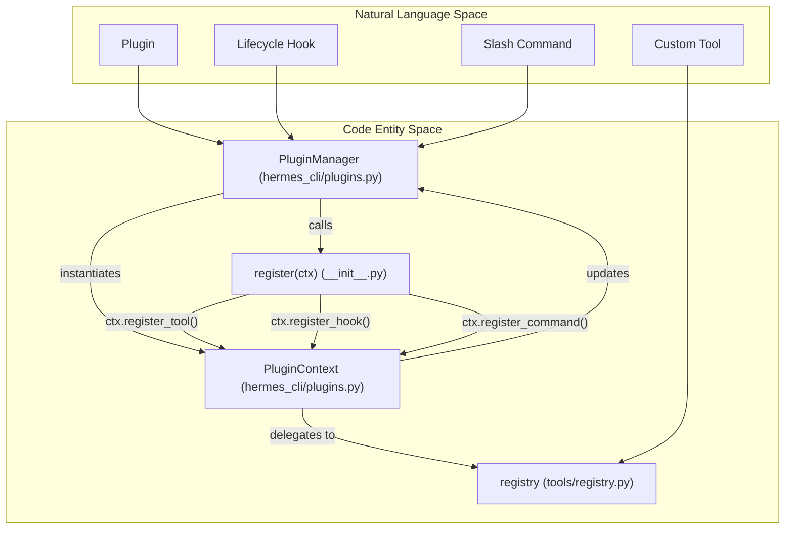
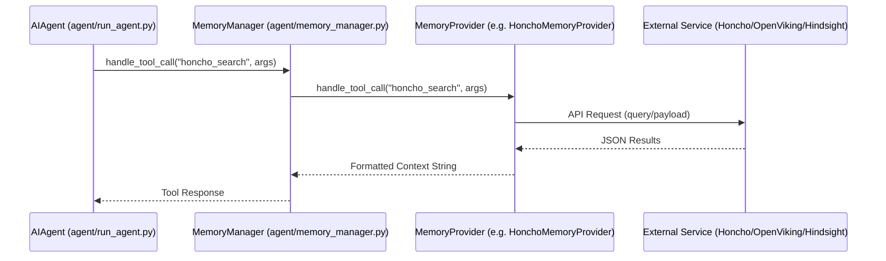
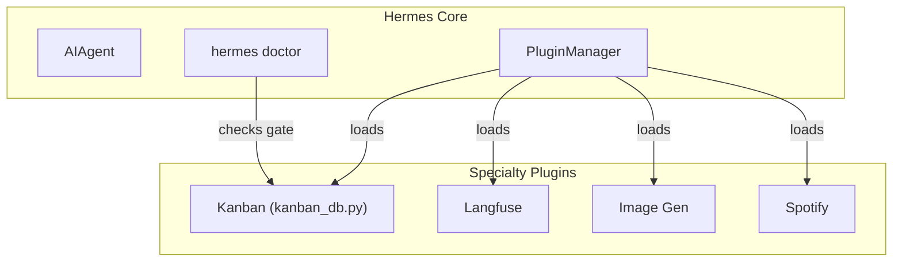

Hermes features a robust plugin architecture that allows for extending the agent's capabilities without modifying the core codebase. This system supports adding custom tools, lifecycle hooks, specialized memory providers, and context compression engines. Memory providers implement a standardized interface to offer advanced storage solutions such as AI-native modeling, vector-based retrieval, or external database integrations.

## Plugin System Architecture

The plugin system is managed by the `PluginManager`, which handles discovery, loading, and registration of extensions [hermes_cli/plugins.py:233-237](). Plugins are opt-in by default and must be explicitly enabled in the configuration [hermes_cli/plugins.py:146-174]().

### Plugin Discovery Sources
Plugins are discovered from four primary sources [hermes_cli/plugins.py:5-14]():

1.  **Bundled Plugins**: Located in `<repo>/plugins/`. Note that `memory/` and `context_engine/` subdirs are excluded from standard discovery as they have their own discovery paths [hermes_cli/plugins.py:7-9]().
2.  **User Plugins**: Located in `~/.hermes/plugins/<name>/` [hermes_cli/plugins.py:10]().
3.  **Project Plugins**: Located in `./.hermes/plugins/<name>/`. These require `HERMES_ENABLE_PROJECT_PLUGINS=true` [hermes_cli/plugins.py:11-12]().
4.  **Pip Plugins**: Packages exposing the `hermes_agent.plugins` entry-point group [hermes_cli/plugins.py:13-14]().

Later sources override earlier ones on name collision, allowing users to override bundled plugins with local versions [hermes_cli/plugins.py:16-17]().

### Plugin Manifest and Structure
Every directory-based plugin must contain a `plugin.yaml` manifest and an `__init__.py` file with a `register(ctx)` function [hermes_cli/plugins.py:19-20]().

| Field | Description |
| :--- | :--- |
| `name` | Unique identifier for the plugin [hermes_cli/plugins.py:183](). |
| `kind` | Plugin category: `standalone` (default), `backend` (tool implementation), or `exclusive` (memory/context) [hermes_cli/plugins.py:192-196](). |
| `requires_env` | Environment variables required for operation [hermes_cli/plugins.py:185](). |
| `provides_tools` | List of tool names registered by the plugin [hermes_cli/plugins.py:186](). |
| `provides_hooks` | List of lifecycle hooks the plugin subscribes to [hermes_cli/plugins.py:187]().

### Lifecycle Hooks
Plugins register callbacks for specific events via `ctx.register_hook()` [hermes_cli/plugins.py:215-219](). Valid hooks include [hermes_cli/plugins.py:128-168]():

*   `pre_tool_call` / `post_tool_call`: Executed around tool invocations.
*   `transform_terminal_output` / `transform_tool_result`: Modifies tool output before the LLM or user sees it.
*   `transform_llm_output`: Replaces LLM response text (useful for personality/vocabulary shifts) [hermes_cli/plugins.py:136]().
*   `pre_llm_call` / `post_llm_call`: Executed around the LLM inference loop.
*   `on_session_start` / `on_session_end` / `on_session_finalize` / `on_session_reset`: Triggered at session lifecycle stages.
*   `pre_gateway_dispatch`: Allows plugins to skip or rewrite incoming messages in the messaging gateway [hermes_cli/plugins.py:153]().
*   `pre_approval_request` / `post_approval_response`: Fired when a dangerous command needs user approval [hermes_cli/plugins.py:166-167]().

### Code Entity Mapping: Plugin Registration
The following diagram illustrates how the `PluginManager` bridges the natural language "Plugin" concept into the `tools.registry` and hook system.

**Title: Plugin Loading and Entity Registration**

Sources: [hermes_cli/plugins.py:196-231](), [hermes_cli/plugins.py:215-219](), [hermes_cli/plugins.py:221-224]()

---

## Memory Providers

Memory Providers are specialized plugins implementing the `MemoryProvider` Abstract Base Class (ABC) [agent/memory_provider.py:34](). They allow Hermes to use structured, searchable, or high-dimensional memory spaces.

### The MemoryProvider Interface
A Memory Provider must implement several key methods to integrate with the `MemoryManager` [agent/memory_manager.py:105-115]():

*   `initialize(session_id, **kwargs)`: Sets up the memory session [agent/memory_provider.py:41]().
*   `prefetch(query)`: Recalls context before a turn starts [agent/memory_provider.py:48]().
*   `sync_turn(user, assistant)`: Persists turns after a response [agent/memory_provider.py:55]().
*   `handle_tool_call(name, args)`: Processes calls to memory-specific tools [agent/memory_provider.py:61]().
*   `get_tool_schemas()`: Returns JSON schemas for tools provided by this memory backend [agent/memory_provider.py:58]().

### Bundled Memory Plugins

| Provider | Implementation | Key Features |
| :--- | :--- | :--- |
| **Honcho** | `HonchoMemoryProvider` [plugins/memory/honcho/__init__.py:230]() | AI-native cross-session user modeling with dialectic reasoning, peer cards, and conclusions [plugins/memory/honcho/__init__.py:1-8](). |
| **Hindsight** | `HindsightMemoryProvider` [plugins/memory/hindsight/__init__.py:209]() | Knowledge graph, entity resolution, and multi-strategy retrieval (cloud/local) [plugins/memory/hindsight/__init__.py:1-6](). |
| **OpenViking** | `OpenVikingMemoryProvider` [plugins/memory/openviking/__init__.py:219]() | Filesystem-style hierarchy (`viking://`), tiered context (L0/L1/L2), and automatic memory extraction [plugins/memory/openviking/__init__.py:1-23](). |
| **Mem0** | `Mem0MemoryProvider` [plugins/memory/mem0/__init__.py:100]() | Server-side LLM fact extraction and deduplication via Mem0 Platform [plugins/memory/mem0/__init__.py:1-4](). |
| **RetainDB** | `RetainDBMemoryProvider` [plugins/memory/retaindb/__init__.py:100]() | Cloud relational storage with crash-safe SQLite write-behind queue [plugins/memory/retaindb/__init__.py:1-13](). |
| **ByteRover** | `ByteRoverProvider` [plugins/memory/byterover/__init__.py:100]() | Local-first vector memory and task tracking [plugins/memory/byterover/__init__.py:1-4](). |
| **Holographic** | `HolographicMemoryProvider` [plugins/memory/holographic/__init__.py:100]() | Simple key-value memory for storing facts [plugins/memory/holographic/__init__.py:1-4](). |

### Data Flow: Memory Tool Invocation
When the agent decides to use a memory tool, the request is routed through the `MemoryManager`.

**Title: Memory Provider Tool Execution Flow**

Sources: [agent/memory_manager.py:105-115](), [plugins/memory/honcho/__init__.py:186-190](), [plugins/memory/openviking/__init__.py:316-320](), [plugins/memory/hindsight/__init__.py:105-109]()

---

## Configuration and Discovery

### Configuration via config.yaml
The active memory provider is defined in `config.yaml`. Only one non-builtin provider can be active at a time [agent/memory_manager.py:153-162]().

```yaml
memory:
  provider: "honcho"      # Selects the active MemoryProvider
  mode: "hybrid"          # context, tools, or hybrid
```

### Honcho Dialectic System
Honcho introduces a "Dialectic" system which reasons about conversation patterns over time. It supports `dialecticDepth` (1-3 passes) to perform self-audits and reconciliation of user facts [website/docs/user-guide/features/honcho.md:85-96](). It also uses "Cold/Warm" prompt selection based on whether prior context exists [website/docs/user-guide/features/honcho.md:64-71]().

### CLI and Setup
*   **Discovery**: `hermes plugins` (interactive) or `hermes plugins list` [hermes_cli/plugins_cmd.py:10-11]().
*   **Memory Setup**: `hermes memory setup` provides an interactive wizard to configure providers and install dependencies via `uv` [hermes_cli/memory_setup.py:58-118]().
*   **Slash Commands**: Plugins can register slash commands (e.g., `/honcho`) that appear in both the CLI and messaging gateways [hermes_cli/plugins.py:221-224]().

Sources: [hermes_cli/plugins.py:124-138](), [agent/memory_manager.py:153-162](), [website/docs/user-guide/features/honcho.md:55-71](), [hermes_cli/memory_setup.py:185-203]()

---

## Specialty Plugins

Hermes includes several specialty plugins that extend capabilities beyond core functions.

### Kanban Board
The Kanban plugin provides a multi-profile, multi-project collaboration board backed by SQLite [hermes_cli/kanban_db.py:1-3]().

*   **Concurrency**: Uses WAL mode and `BEGIN IMMEDIATE` for write transactions, with compare-and-swap (CAS) updates for task status and claim locks [hermes_cli/kanban_db.py:60-66]().
*   **Tools**: Provides tools like `kanban_create_task`, `kanban_update_task`, and `kanban_assign_task` [tools/kanban_tools.py:10-100]().
*   **Worker Gating**: Kanban tools are runtime-gated and loaded only for dispatcher-spawned workers [hermes_cli/doctor.py:132-133]().

### Other Specialty Plugins
*   **Google Meet**: Tools for creating and managing meetings (`google_meet_create_meeting`).
*   **Achievements**: System for tracking and rewarding agent accomplishments.
*   **Observability (Langfuse)**: Integrates with Langfuse for tracing and evaluation.
*   **Image Generation**: Registered via `ctx.register_image_gen_provider()` [website/docs/user-guide/features/plugins.md:111]().
*   **Spotify**: Allows interaction with the Spotify API for music management.

**Title: Specialty Plugin Integration**

Sources: [hermes_cli/doctor.py:119-134](), [website/docs/user-guide/features/plugins.md:94-116]()