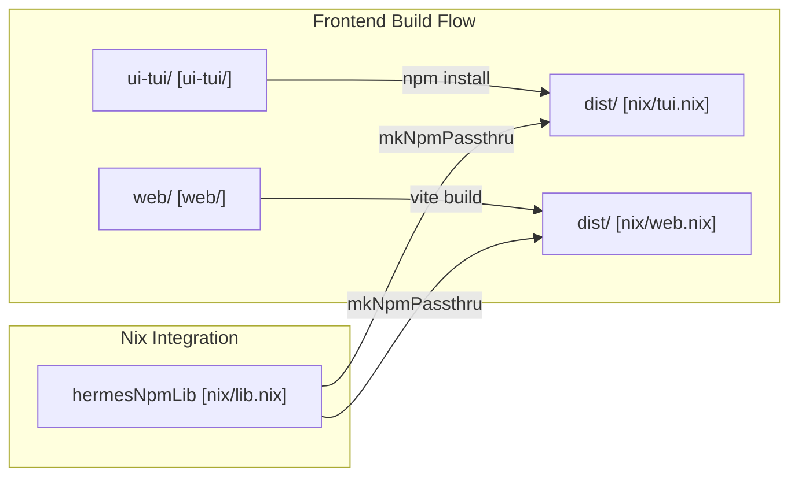

This page documents the repository organization, dependency management, and installation ecosystem of Hermes Agent. It covers the directory layout, key source files, the `uv`-based dependency and Python management system, as well as native multi-platform installation including rich Nix flake support for declarative deployments.

---

## Repository Layout

Hermes Agent follows a modular codebase design with well-defined directory boundaries for CLI, core agent logic, tools, messaging gateways, plugins, skills, and infrastructure components.

### Top-Level Directory Structure and Key Files

The diagram below associates conceptual system components to their corresponding code entities and main source files:

```mermaid
graph TB
    Root["Repository Root"]
    
    Root --> CLI["hermes_cli/ [hermes_cli/]<br/>CLI commands & setup"]
    Root --> Agent["agent/ [agent/]<br/>Agent internals"]
    Root --> Tools["tools/ [tools/]<br/>Tool implementations"]
    Root --> Gateway["gateway/ [gateway/]<br/>Messaging platform adapters"]
    Root --> Cron["cron/ [cron/]<br/>Scheduled tasks"]
    Root --> ACP["acp_adapter/ [acp_adapter/]<br/>IDE integration"]
    Root --> Plugins["plugins/ [plugins/]<br/>Memory & miscellaneous plugins"]
    Root --> Nix["nix/ [nix/]<br/>Nix flake support for deployment"]
    Root --> TUI["ui-tui/ [ui-tui/]<br/>React Ink-based Terminal UI frontend"]

    CLI --> MainPy["main.py [hermes_cli/main.py]<br/>CLI entry point"]
    CLI --> WebServer["web_server.py [hermes_cli/web_server.py]<br/>FastAPI backend for Dashboard"]

    Agent --> RunAgentPy["run_agent.py [run_agent.py]<br/>AIAgent core and conversation loop"]
    Agent --> ModelToolsPy["model_tools.py [model_tools.py]<br/>Tool orchestration"]
    Agent --> StatePy["hermes_state.py [hermes_state.py]<br/>Session and memory persistence"]
    Agent --> LoggingPy["hermes_logging.py [hermes_logging.py]<br/>Logging setup"]    

    Tools --> RegistryPy["registry.py [tools/registry.py]<br/>Central tool registry"]
    Tools --> ToolsetsPy["toolsets.py [toolsets.py]<br/>Toolset definitions"]

    Gateway --> RunPy["run.py [gateway/run.py]<br/>Gateway startup"]
    Gateway --> Platforms["platforms/ [gateway/platforms/]<br/>Platform adapter implementations"]

    TUI --> SrcTSX["src/ [ui-tui/src/]<br/>React Ink frontend source"]

    Plugins --> MemoryPlugins["memory/ [plugins/memory/]<br/>Memory provider plugins"]

    Root --> BatchRunner["batch_runner.py [batch_runner.py]<br/>Parallel trajectory generation"]
```

**Sources:** [AGENTS.md:22-63](), [hermes_cli/__init__.py:1-12]()

---

## Dependency Management

### `uv` Package Manager Ecosystem

Hermes Agent leverages the `uv` package manager for fast and reproducible Python environment management and cross-platform dependency resolution. The installation scripts for Linux/macOS (`install.sh`) and Windows (`install.ps1`) prioritize `uv` for provisioning Python and managing the virtual environment [scripts/install.sh:6-12](), [scripts/install.ps1:5-9]().

- The project requires **Python >= 3.11** [pyproject.toml:10]().
- The `uv.lock` file captures exact dependency versions and resolution markers for different Python environments [uv.lock:1-9]().
- The installer automatically handles `uv` installation if not found on the system [scripts/install.ps1:72-130]().

### Core Dependencies

The pinned set of dependencies defined in `pyproject.toml` ensures security and reliability:

| Category | Key Dependencies | Role |
|----------|------------------|------|
| **Core LLM** | `openai`, `anthropic` | LLM client integration and protocol handling [pyproject.toml:15-16]() |
| **Logic/Data** | `pydantic`, `jinja2`, `pyyaml` | Data validation, prompt templating, and configuration parsing [pyproject.toml:22-26]() |
| **CLI/UI** | `prompt_toolkit`, `rich`, `fire` | Interactive REPL, terminal formatting, and CLI command generation [pyproject.toml:18-28]() |
| **Networking** | `httpx[socks]`, `requests` | HTTP client for tool calling and API interactions [pyproject.toml:19-24]() |
| **Tools** | `exa-py`, `firecrawl-py`, `parallel-web` | Web search and content extraction tools [pyproject.toml:30-32]() |
| **Scheduling** | `croniter` | Logic for natural language cron and interval jobs [pyproject.toml:35]() |
| **System** | `psutil` | Cross-platform process and PID management [pyproject.toml:51]() |

### Optional Features as Extras

Hermes supports modular installation via PEP 508 extras.

| Extra | Description | Notable Dependencies |
|-------|-------------|----------------------|
| `messaging` | Multi-platform adapters | `python-telegram-bot`, `discord.py`, `slack-bolt` [pyproject.toml:60]() |
| `voice` | Local STT & Transcription | `faster-whisper`, `sounddevice`, `numpy` [pyproject.toml:66-72]() |
| `web` | Dashboard & Web UI | `fastapi`, `uvicorn` [pyproject.toml:139]() |
| `rl` | Training Environments | `atroposlib`, `tinker`, `wandb` [pyproject.toml:140-146]() |
| `honcho` | AI-native Memory | `honcho-ai` [pyproject.toml:77]() |
| `all` | Full Installation | Aggregates most features including `voice`, `mcp`, and `messaging` [pyproject.toml:148-185]() |

**Sources:** [pyproject.toml:13-185](), [uv.lock:1-25]()

---

## Installation and Multi-Platform Support

### Nix and NixOS Native Support

Hermes Agent offers advanced integration with Nix and NixOS to enable declarative and reproducible deployment configurations.

#### NixOS Module Modes
The NixOS module supports two modes of operation [nix/nixosModules.nix:1-11]():
1. **Native systemd service:** Runs directly on the host system.
2. **Container mode:** Runs inside an OCI container (Docker/Podman) with a persistent writable layer for `apt`, `pip`, and `npm` installs [nix/nixosModules.nix:5-18]().

#### Container Provisioning
The container entrypoint script bootstraps a complete toolchain on first boot:
- Provisions `nodejs` (Node 22 via NodeSource) and `npm` [nix/nixosModules.nix:134-145]().
- Installs the `uv` Python manager [nix/nixosModules.nix:153-157]().
- Configures `sudo` for agent self-modification [nix/nixosModules.nix:148-152]().

### Frontend Builds (NPM/Nix)

The project includes two primary web/TUI frontends managed via NPM and Nix:

1. **TUI (`ui-tui/`):** A React Ink-based interface. It uses `@hermes/ink` as a file-based dependency [ui-tui/package-lock.json:11](). The Nix build uses `buildNpmPackage` and ensures `@hermes/ink` is correctly symlinked [nix/tui.nix:15-41]().
2. **Web Dashboard (`web/`):** A Vite/React frontend. The Nix build compiles TypeScript and produces the `dist/` directory [nix/web.nix:15-31]().

**Sources:** [nix/nixosModules.nix:1-157](), [nix/tui.nix:1-41](), [ui-tui/package-lock.json:1-41]()

---

## Project Entry Points

Key command-line entry points registered through `pyproject.toml` [pyproject.toml:168-171]():

| Command | Entry Point | Purpose |
|---------|-------------|---------|
| `hermes` | `hermes_cli.main:main` | Primary CLI and interactive chat interface |
| `hermes-agent` | `run_agent:main` | Direct invocation of the core agent logic |
| `hermes-acp` | `acp_adapter.entry:main` | Agent Client Protocol server for IDEs |

**Sources:** [pyproject.toml:168-171](), [hermes_cli/__init__.py:1-12]()