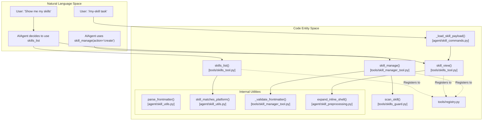
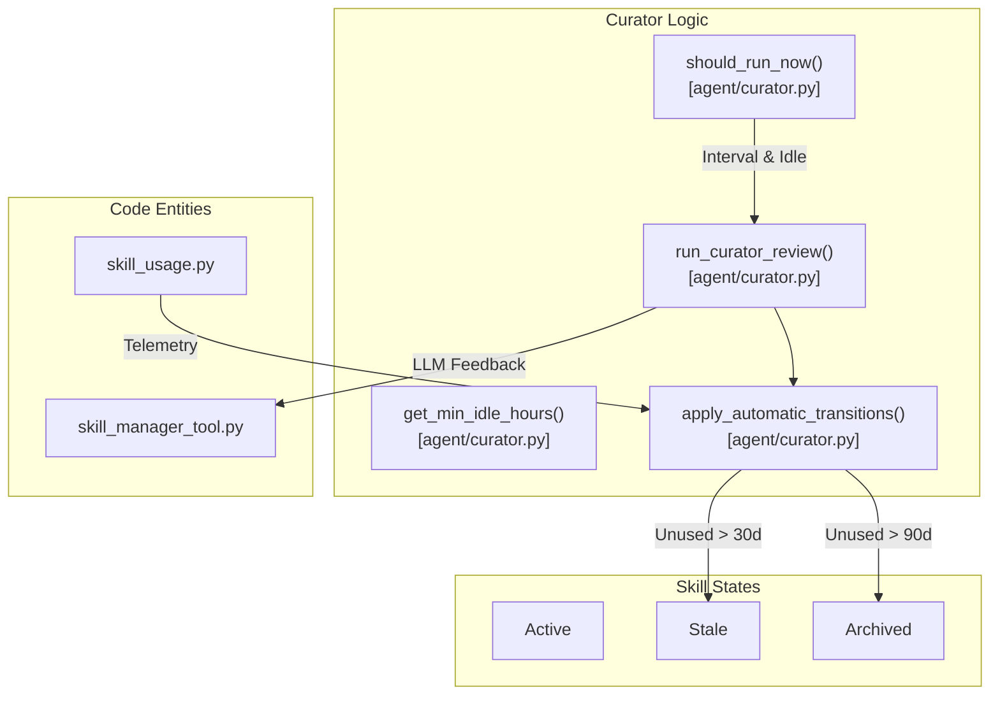
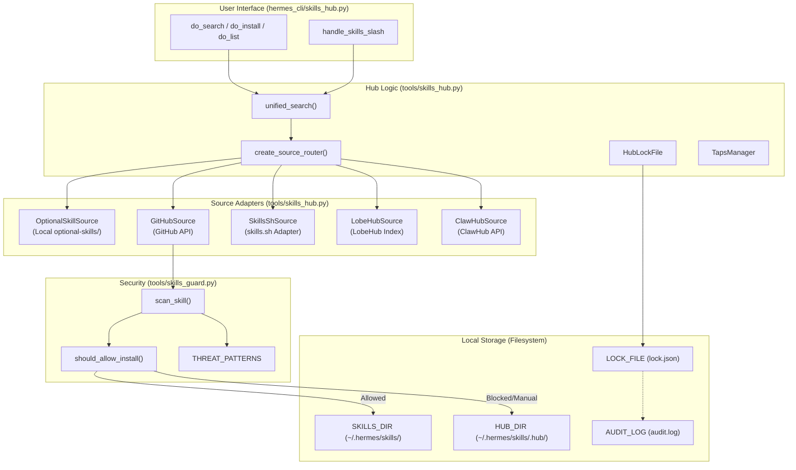
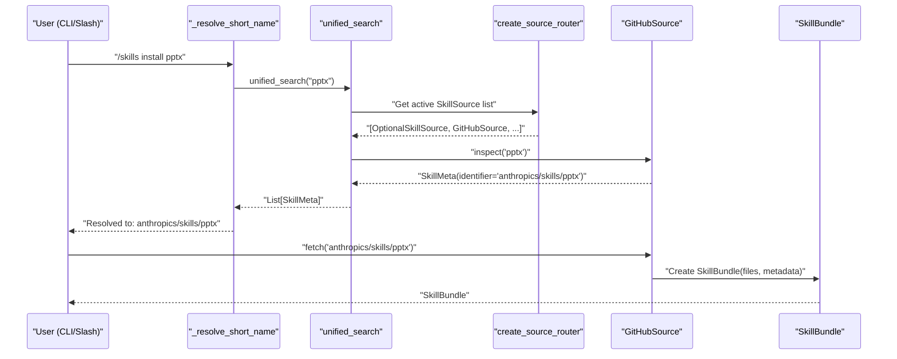
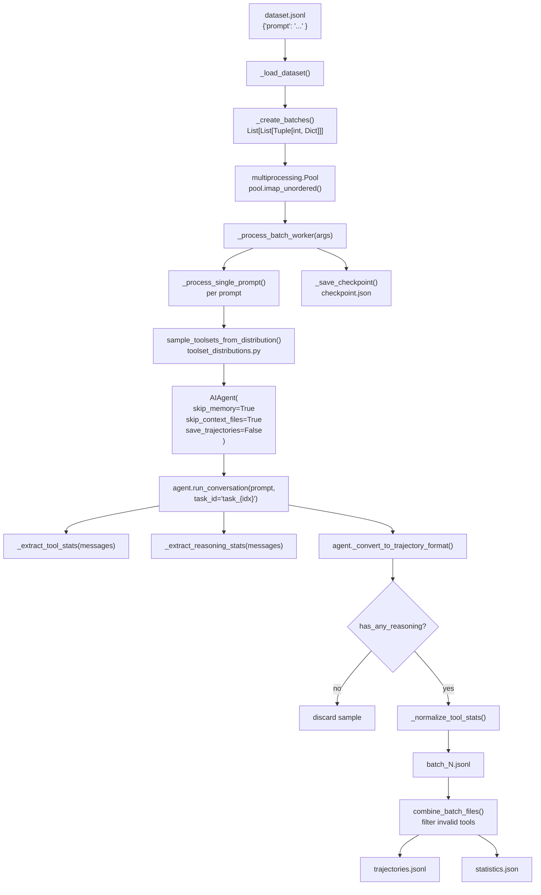
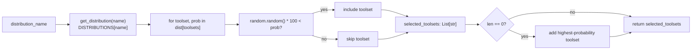
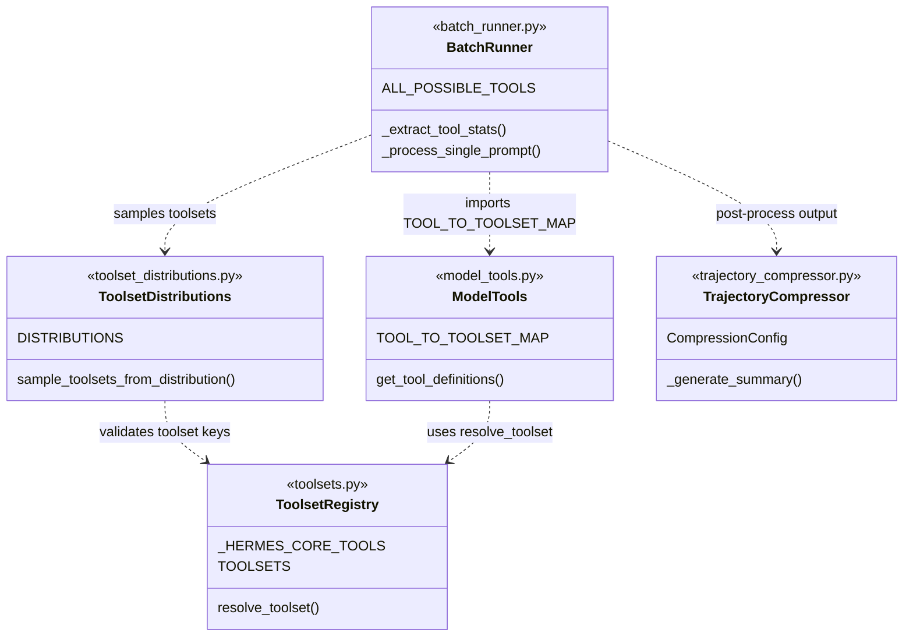
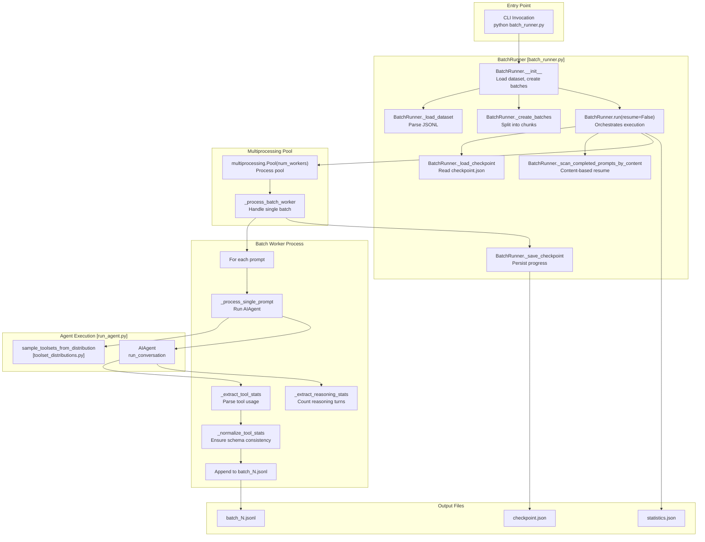
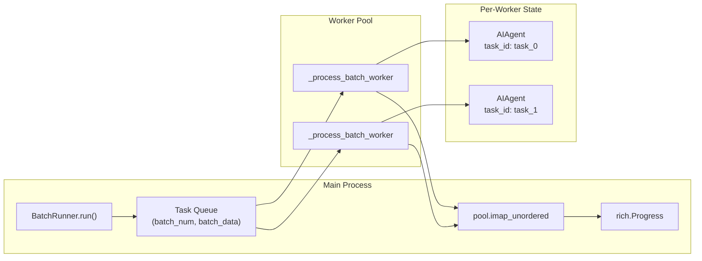

This page documents the skills management system, which allows the agent to create, modify, and delete skills—reusable procedural knowledge for recurring task types. Skills are the agent's "how-to" memory: they capture proven approaches, workflows, and solutions that can be applied to similar problems in the future.

For information about discovering and installing community skills from the hub, see **8.2 Skills Hub**. This page focuses on programmatic management, security scanning, and the underlying synchronization mechanisms.

---

## Purpose and Scope

The skills system provides:
- **Programmatic skill creation**: The agent can create new skills based on successful task completions, turning successful approaches into reusable procedural knowledge [tools/skill_manager_tool.py:3-6]().
- **Modification operations**: Create, edit, patch, or delete skills via the `skill_manage` tool [tools/skill_manager_tool.py:14-20]().
- **Security scanning**: Automatic regex-based static analysis of all skill content before installation or update via `Skills Guard` [tools/skill_manager_tool.py:52-56]().
- **Supporting files**: References, templates, scripts, and assets alongside `SKILL.md` [tools/skills_tool.py:14-26]().
- **Validation**: Strict name, frontmatter, and platform compatibility constraints [tools/skill_manager_tool.py:178-195]().
- **Synchronization**: Automatic seeding and updating of bundled skills from the repository to the user directory [tools/skills_sync.py:3-7]().

All skills reside in a single location (`~/.hermes/skills/`) and follow a standardized structure with YAML frontmatter [tools/skills_tool.py:87-91]().

**Sources:** [tools/skill_manager_tool.py:3-20](), [tools/skill_manager_tool.py:52-56](), [tools/skill_manager_tool.py:178-195](), [tools/skills_tool.py:14-26](), [tools/skills_tool.py:87-91](), [tools/skills_sync.py:3-7]()

---

## Skills Directory Structure

All skills are stored in `SKILLS_DIR` (`~/.hermes/skills/`) with optional category subdirectories [tools/skills_tool.py:87-88](). This directory is the single source of truth for agent edits, hub installs, and bundled skills [tools/skills_tool.py:85-87]().

```text
~/.hermes/skills/
├── .bundled_manifest         # Tracks hashes of synced bundled skills
├── my-skill/
│   ├── SKILL.md              # Required: main skill definition
│   ├── references/           # Optional: Supporting documentation
│   ├── templates/            # Optional: Templates for output
│   ├── scripts/              # Optional: Helper scripts
│   └── assets/               # Optional: Supplementary files
└── category-name/
    └── another-skill/
        └── SKILL.md
```

**Sources:** [tools/skills_tool.py:14-26](), [tools/skills_tool.py:85-89](), [tools/skill_manager_tool.py:108-109]()

### SKILL.md Format

Every skill must have a `SKILL.md` file with YAML frontmatter followed by markdown content [tools/skills_tool.py:28-50](). The `skill_manage` tool validates these fields during creation [tools/skill_manager_tool.py:119-151]().

| Field | Requirement | Description |
| :--- | :--- | :--- |
| `name` | Required | Max 64 chars, lowercase alphanumeric + hyphens [tools/skill_manager_tool.py:111, 168, 178-189]() |
| `description` | Required | Max 1024 chars [tools/skills_tool.py:93, 112]() |
| `platforms` | Optional | List of `macos`, `linux`, `windows` [tools/skills_tool.py:95-101]() |
| `prerequisites` | Optional | Declares env vars and commands needed for setup [tools/skills_tool.py:37-40]() |
| `metadata.hermes` | Optional | Declares tags and related skills [tools/skills_tool.py:42-46]() |

**Sources:** [tools/skills_tool.py:28-50](), [tools/skill_manager_tool.py:111-112](), [tools/skill_manager_tool.py:168-189](), [tools/skills_tool.py:93-101]()

---

## Skill Management Tools

The primary programmatic interfaces for skills are `skills_list` and `skill_view`, which implement a "progressive disclosure" architecture to save context tokens [tools/skills_tool.py:9-13]().

### Tool Implementation and Flow

The following diagram bridges the agent's intent to the underlying code entities that perform file operations and security checks.



**Sources:** [tools/skills_tool.py:52-67](), [tools/skill_manager_tool.py:14-20](), [agent/skill_commands.py:53-73](), [agent/skill_utils.py:18-26](), [agent/skill_preprocessing.py:15-19]()

---

## Security and Injection Scanning

Hermes implements multiple layers of security to prevent prompt injection and malicious activity via skills and context files.

### Context Content Scanning
Before files like `AGENTS.md`, `SOUL.md`, or `.cursorrules` are injected into the system prompt, they are scanned for threat patterns [agent/prompt_builder.py:31-34]().

- **Threat Patterns**: Regex patterns detect instructions to ignore previous rules, hide information, or exfiltrate secrets via `curl` [agent/prompt_builder.py:36-47]().
- **Invisible Characters**: Detection of zero-width spaces and other invisible Unicode characters used for obfuscation [agent/prompt_builder.py:49-52]().
- **Blocking**: If a threat is detected, the content is blocked and replaced with a warning in the system prompt [agent/prompt_builder.py:69-71]().

**Sources:** [agent/prompt_builder.py:31-73]()

### Skills Guard and Agent-Created Skills
Agent-created skills can be optionally scanned via `Skills Guard` if `skills.guard_agent_created` is enabled [tools/skill_manager_tool.py:59-66]().

- **Automatic Blocking**: If the scanner finds dangerous patterns (e.g., shell injection in a skill script), the `skill_manage` operation is blocked [tools/skill_manager_tool.py:87-92]().
- **Memory Scanning**: Content written to `MEMORY.md` or `USER.md` is also scanned for similar injection/exfiltration payloads [tools/memory_tool.py:62-83]().

**Sources:** [tools/skill_manager_tool.py:59-102](), [tools/memory_tool.py:62-104]()

---

## Curator: Skill Lifecycle Management

The `Curator` is a background orchestrator that maintains the agent-created skill collection [agent/curator.py:1-7]().



- **Automatic Transitions**: Skills unused for 30 days are marked `stale`; after 90 days, they are moved to `.archive/` [agent/curator.py:56-60]().
- **Pinning**: Users can "pin" skills via `hermes curator pin <name>` to prevent automatic archiving or deletion [tools/skill_manager_tool.py:137-143]().
- **Background Review**: The curator spawns an auxiliary agent to review skills for consolidation or improvement [agent/curator.py:9-12]().

**Sources:** [agent/curator.py:1-60](), [tools/skill_manager_tool.py:137-143]()

---

## Character and Token Limits

To maintain efficiency and prevent context overflow, the system enforces strict limits:

- **Skill Name**: Max 64 characters [tools/skill_manager_tool.py:111]().
- **Skill Description**: Max 1024 characters [tools/skill_manager_tool.py:112]().
- **Skill Content**: Max 100,000 characters (~36k tokens) [tools/skill_manager_tool.py:164]().
- **Supporting Files**: Max 1 MiB per file [tools/skill_manager_tool.py:165]().
- **Context Files**: Files like `AGENTS.md` are truncated if they exceed `CONTEXT_FILE_MAX_CHARS` [agent/prompt_builder.py:116-125]().

**Sources:** [tools/skill_manager_tool.py:111-165](), [agent/prompt_builder.py:116-125]()

# Skills Hub


The Skills Hub is a **user-driven** discovery and installation system for extending Hermes Agent capabilities. It connects to multiple registries—including official optional skills, GitHub repositories, the `skills.sh` marketplace, and `ClawHub`—and provides a unified interface for searching, installing, and managing skills.

**Key Principle:** The Skills Hub is exclusively user-operated. Agents cannot autonomously install, modify, or delete skills from the hub. Users manage the library via the `hermes skills` CLI or `/skills` slash commands. Once installed, skills are available to agents via the progressive disclosure system.

**Security Model:** Every skill from an external source is passed through the `Skills Guard` scanner. Dangerous patterns (e.g., exfiltration, prompt injection, destructive commands) trigger blocks or require explicit user overrides based on the source's trust level.

## Architecture Overview

The Skills Hub architecture bridges the gap between remote registries and the local `~/.hermes/skills/` directory.

**Skills Hub System Architecture**


Sources: [tools/skills_hub.py:1-14](), [hermes_cli/skills_hub.py:1-11](), [tools/skills_guard.py:1-23]()

**Skill Resolution Data Flow**

This diagram illustrates how a user-provided short name (e.g., "pptx") is resolved to a specific code entity (a `SkillBundle`) and eventually written to the `SKILLS_DIR`.


Sources: [hermes_cli/skills_hub.py:34-79](), [tools/skills_hub.py:1145-1155]()

**Key Code Entities:**

| Entity | File | Role |
| :--- | :--- | :--- |
| `SkillSource` | [tools/skills_hub.py:24-24]() | Abstract base class for all registry adapters. |
| `GitHubAuth` | [tools/skills_hub.py:171-171]() | Manages GitHub API tokens via env vars, `gh` CLI, or Apps. |
| `HubLockFile` | [tools/skills_hub.py:844-844]() | Tracks the source, hash, and version of installed hub skills. |
| `TapsManager` | [tools/skills_hub.py:1010-1010]() | Manages custom user-added GitHub repositories (Taps). |
| `SkillMeta` | [tools/skills_hub.py:68-68]() | Minimal metadata returned by search results. |
| `SkillBundle` | [tools/skills_hub.py:83-83]() | Container for downloaded skill files and metadata. |

Sources: [tools/skills_hub.py:68-81](), [tools/skills_hub.py:83-91](), [tools/skills_hub.py:171-184](), [tools/skills_hub.py:844-844](), [tools/skills_hub.py:1010-1010]()

## Source Adapters

The hub uses a pluggable adapter system to fetch skills. The `create_source_router` function initializes the active adapters [tools/skills_hub.py:1145-1155]().

### GitHub Adapter
The `GitHubSource` fetches skills from any GitHub repository using the Contents API [tools/skills_hub.py:307-310]().
*   **Authentication:** Managed by `GitHubAuth`, prioritizing `GITHUB_TOKEN` or `gh auth token` [tools/skills_hub.py:171-178]().
*   **Trust Resolution:** Repositories like `openai/skills` and `anthropics/skills` are automatically marked as `trusted` [tools/skills_guard.py:39-39]().

### skills.sh Adapter
`SkillsShSource` acts as a proxy for the `skills.sh` marketplace [tools/skills_hub.py:537-540](). It searches the marketplace index and delegates the actual file fetching to `GitHubSource` once the underlying repository is identified [tools/skills_hub.py:623-630]().

### ClawHub and LobeHub Adapters
*   `ClawHubSource` connects to the ClawHub API to search and fetch skills, supporting both search endpoints and exact slug lookups [tools/skills_hub.py:656-665]().
*   `LobeHubSource` fetches a remote JSON index of skills and filters them based on the query [tools/skills_hub.py:461-470]().

### Optional Skills
`OptionalSkillSource` provides access to the `optional-skills/` directory included in the Hermes repository [tools/skills_hub.py:245-250](). These are considered `builtin` and bypass standard security scanning [tools/skills_guard.py:43-43](). Official optional skills include specialized integrations like `honcho` and `solana` [website/docs/reference/optional-skills-catalog.md:35-42]().

Sources: [tools/skills_hub.py:245-250](), [tools/skills_hub.py:307-310](), [tools/skills_hub.py:461-470](), [tools/skills_hub.py:537-540](), [tools/skills_hub.py:623-630](), [tools/skills_hub.py:656-665](), [tools/skills_guard.py:39-39](), [tools/skills_guard.py:43-43](), [website/docs/reference/optional-skills-catalog.md:30-43]()

## Security and Scanning

The `Skills Guard` system performs static analysis on every downloaded skill.

### Scanning Logic
The `scan_skill` function iterates through all files in a downloaded bundle [tools/skills_guard.py:330-340]().
1.  **Threat Patterns:** Uses regex to detect exfiltration (e.g., `curl` with env vars), prompt injection (e.g., "ignore previous instructions"), and destructive commands [tools/skills_guard.py:86-179]().
2.  **Invisible Characters:** Checks for homoglyph attacks or invisible Unicode characters used to obfuscate code [tools/skills_guard.py:193-199]().
3.  **Verdict:** Produces a verdict of `safe`, `caution`, or `dangerous` [tools/skills_guard.py:280-289]().

### Installation Policy
The `INSTALL_POLICY` determines if a skill can be installed based on its `trust_level` and `verdict` [tools/skills_guard.py:41-51]().

| Trust Level | Safe | Caution | Dangerous |
| :--- | :--- | :--- | :--- |
| `builtin` | Allow | Allow | Allow |
| `trusted` | Allow | Allow | Block |
| `community` | Allow | Block | Block |
| `agent-created`| Allow | Allow | Ask |

Sources: [tools/skills_guard.py:41-51](), [tools/skills_guard.py:86-179](), [tools/skills_guard.py:193-199](), [tools/skills_guard.py:280-289](), [tools/skills_guard.py:330-340]()

## Skill Distribution and Metadata

Skills are distributed as directories containing a mandatory `SKILL.md` file.

### Metadata and Configuration
The YAML frontmatter in `SKILL.md` [skills/autonomous-ai-agents/hermes-agent/SKILL.md:1-13]() controls how the skill is surfaced and executed:
*   **Name and Description:** Used for search and agent discovery [tools/skills_hub.py:69-72]().
*   **Tags:** Facilitate categorization and filtering in the hub [tools/skills_hub.py:78-78]().
*   **Trust Levels:** Metadata helps determine if a skill is `trusted` or `community` based on its source repository [tools/skills_guard.py:39-39]().
*   **Platforms:** Skills can specify compatibility (e.g., `linux`, `macos`, `windows`) [skills/autonomous-ai-agents/hermes-agent/SKILL.md:7-7]().

### The Hub State
The hub manages its internal state in `~/.hermes/skills/.hub/`:
*   **lock.json:** Maps installed skills to their source and content hash [tools/skills_hub.py:51-51]().
*   **audit.log:** Records every installation and security scan result [tools/skills_hub.py:53-53]().
*   **quarantine/**: Temporary storage for skills awaiting scan results or user approval [tools/skills_hub.py:52-52]().
*   **taps.json:** Stores the list of user-added GitHub repositories [tools/skills_hub.py:54-54]().

Sources: [tools/skills_hub.py:48-55](), [tools/skills_hub.py:69-81](), [tools/skills_guard.py:39-39](), [skills/autonomous-ai-agents/hermes-agent/SKILL.md:1-13]()

## CLI and Slash Commands

The `hermes_cli/skills_hub.py` module provides the implementation for both CLI subcommands and interactive slash commands.

| Command | Function |
| :--- | :--- |
| `_resolve_short_name` | Resolves a short name (e.g. 'pptx') to a full identifier [hermes_cli/skills_hub.py:34-40]() |
| `do_search` | Searches registries via `unified_search` and displays a Rich table [hermes_cli/skills_hub.py:110-136]() |
| `do_install` | Orchestrates fetch -> quarantine -> scan -> install flow [hermes_cli/skills_hub.py:243-260]() |
| `do_list` | Lists installed skills, distinguishing between hub, builtin, and local [hermes_cli/skills_hub.py:408-415]() |
| `do_update` | Checks for updates for all hub-installed skills [hermes_cli/skills_hub.py:643-655]() |
| `do_tap` | Adds a new GitHub repository to the search index [hermes_cli/skills_hub.py:734-740]() |

Sources: [hermes_cli/skills_hub.py:1-11](), [hermes_cli/skills_hub.py:34-79](), [hermes_cli/skills_hub.py:109-136](), [hermes_cli/skills_hub.py:243-260](), [hermes_cli/skills_hub.py:408-415](), [hermes_cli/skills_hub.py:643-655](), [hermes_cli/skills_hub.py:734-740]()

# Batch Processing


This page covers the parallel data generation pipeline used to run the Hermes agent across large prompt datasets, producing trajectory files for model training. It describes `BatchRunner`, toolset distributions, the checkpointing system, output formats, and the post-processing pipeline.

For details on the trajectory compression algorithm (token budgeting, summarization, `TrajectoryCompressor`), see [Data Generation and Trajectories](#9.3). For the agent conversation loop that each worker invokes, see [Core Agent](#4).

---

## Overview

The batch processing system runs `AIAgent` in parallel across a JSONL prompt dataset, saves per-prompt conversation trajectories, and aggregates tool usage and reasoning statistics. It is the primary mechanism for generating supervised fine-tuning data.

**Entry point:** `batch_runner.py` [batch_runner.py:1-21](), invoked via `python batch_runner.py` or imported as `BatchRunner`.

**Supporting modules:**
- `toolset_distributions.py` — defines named probability distributions over toolsets [toolset_distributions.py:1-20]()
- `model_tools.py` — provides `TOOL_TO_TOOLSET_MAP` for tool discovery and statistics normalization [model_tools.py:14-20](), [batch_runner.py:61-65]()
- `toolsets.py` — defines the core toolset groupings used in distributions [toolsets.py:78-220]()
- `trajectory_compressor.py` — post-processes trajectories to fit within context windows [trajectory_compressor.py:1-31]()
- `mini_swe_runner.py` — specialized runner for software engineering tasks using sandboxed environments [mini_swe_runner.py:1-27]()

Sources: [batch_runner.py:1-21](), [toolset_distributions.py:1-20](), [model_tools.py:14-20](), [batch_runner.py:61-65](), [toolsets.py:78-220](), [trajectory_compressor.py:1-31](), [mini_swe_runner.py:1-27]()

---

## BatchRunner Pipeline

### Architecture

The `BatchRunner` utilizes `multiprocessing.Pool` to parallelize agent execution [batch_runner.py:41](). Each worker process instantiates an `AIAgent` with specific flags to ensure session isolation and prevent persistent state (like `MEMORY.md`) from contaminating training data [batch_runner.py:334-457]().

**BatchRunner Pipeline**



Sources: [batch_runner.py:231-331](), [batch_runner.py:334-457](), [batch_runner.py:739-912](), [run_agent.py:120-150]()

For details, see [Batch Runner](#9.1).

---

## Toolset Distributions

`toolset_distributions.py` defines probability configurations [toolset_distributions.py:29-220](). Each distribution maps toolset names to an independent inclusion probability (0–100%). On each prompt, `sample_toolsets_from_distribution()` rolls independently for each toolset [toolset_distributions.py:247-288]().

**Distribution Sampling Logic**



Sources: [toolset_distributions.py:247-288]()

For details, see [Toolset Distributions](#9.2).

---

## Checkpointing and Resume

The runner tracks completed prompts to support fault-tolerant resumption. Resume matches on **prompt text content** rather than indices, making it robust to dataset reordering [batch_runner.py:661-703]().

- **`checkpoint.json`** stores: `run_name`, `completed_prompts` (indices), `batch_stats`, and `last_updated` [batch_runner.py:739-812]().
- Failed prompts (where `result["success"]` is `False`) are not recorded as completed and will be retried [batch_runner.py:440-457]().

Sources: [batch_runner.py:661-703](), [batch_runner.py:739-812](), [batch_runner.py:440-457]()

---

## Statistics and Normalization

### Tool Stats (`_extract_tool_stats`)

The runner walks the `messages` list to increment usage counts [batch_runner.py:125-158](). Success is determined by the absence of an `"error"` field in tool responses, with special handling for terminal tool responses (nested content) and JSON success flags [batch_runner.py:160-188](). Stats are normalized via `_normalize_tool_stats()` using `ALL_POSSIBLE_TOOLS` (derived from `TOOL_TO_TOOLSET_MAP`) to ensure a consistent schema for HuggingFace datasets [batch_runner.py:61-98]().

### Reasoning Stats (`_extract_reasoning_stats`)

The system identifies reasoning via `<REASONING_SCRATCHPAD>` tags or native thinking tokens extracted from the assistant messages [batch_runner.py:195-228](). Trajectories without reasoning are discarded to maintain dataset quality [batch_runner.py:387-393]().

Sources: [batch_runner.py:125-158](), [batch_runner.py:160-188](), [batch_runner.py:61-98](), [batch_runner.py:195-228](), [batch_runner.py:387-393]()

For details, see [Data Generation and Trajectories](#9.3).

---

## Execution Configuration Space

The batch processing system bridges high-level tool configuration defined in `hermes_cli/tools_config.py` with the runtime toolset resolution in `toolsets.py`.

**Tool Mapping and Configuration**



Sources: [batch_runner.py:55-65](), [toolset_distributions.py:50-54](), [model_tools.py:14-20](), [toolsets.py:78-220](), [trajectory_compressor.py:83-124]()

---

## Usage Examples

**Basic batch run:**
```bash
python batch_runner.py \
  --dataset_file=data/prompts.jsonl \
  --batch_size=10 \
  --run_name=science_run \
  --distribution=science \
  --num_workers=4
```

**Resuming an interrupted run:**
```bash
python batch_runner.py \
  --dataset_file=data/prompts.jsonl \
  --batch_size=10 \
  --run_name=science_run \
  --resume
```

**Compressing generated trajectories:**
```bash
python trajectory_compressor.py \
  --input=data/science_run \
  --target_max_tokens=16000 \
  --summarization_model=google/gemini-3-flash-preview
```

Sources: [batch_runner.py:14-21](), [trajectory_compressor.py:16-30]()

# Batch Runner


The Batch Runner provides parallel batch processing capabilities for running the `AIAgent` across multiple prompts from datasets. It supports checkpoint-based resumption, tool usage statistics aggregation, probabilistic toolset sampling, and trajectory collection in the proper format for training and evaluation.

For information about toolset distributions used by the Batch Runner, see section 9.2. For trajectory format and data generation, see section 9.3.

**Sources:** [batch_runner.py:1-21]()

---

## BatchRunner Class

The `BatchRunner` class manages the complete lifecycle of batch processing operations. It handles dataset loading, batch creation, parallel execution via multiprocessing, checkpoint persistence, and statistics aggregation.

### Initialization Parameters

| Parameter | Type | Default | Description |
|-----------|------|---------|-------------|
| `dataset_file` | `str` | required | Path to JSONL file with `prompt` field |
| `batch_size` | `int` | required | Number of prompts per batch |
| `run_name` | `str` | required | Name for checkpointing and output |
| `distribution` | `str` | `"default"` | Toolset distribution name |
| `max_iterations` | `int` | `10` | Max agent iterations per prompt |
| `model` | `str` | `"claude-opus-4-20250514"` | Model identifier |
| `num_workers` | `int` | `4` | Parallel worker processes |
| `ephemeral_system_prompt` | `str` | `None` | System prompt NOT saved to trajectories |
| `max_samples` | `int` | `None` | Limit dataset to first N samples |
| `prefill_messages` | `List[Dict]` | `None` | Few-shot priming messages |

The constructor validates the distribution using `validate_distribution` [toolset_distributions.py:42](), creates the output directory structure at `data/{run_name}`, and prepares batches indexed with original dataset positions [batch_runner.py:511-619]().

**Sources:** [batch_runner.py:511-619](), [toolset_distributions.py:42-43]()

---

## System Architecture

The following diagram bridges the high-level Batch Runner concepts with the specific code entities that implement them.

### Batch Runner Logic Flow



**Sources:** [batch_runner.py:511-1036](), [batch_runner.py:231-508]()

---

## Multiprocessing and Isolation

The Batch Runner uses Python's `multiprocessing.Pool` to execute batches in parallel across multiple worker processes [batch_runner.py:870-916]().

### Worker Pool Configuration

Tasks are submitted via `pool.imap_unordered()` for efficient non-blocking execution with automatic result ordering. Each prompt is processed with a unique `task_id` formatted as `task_{prompt_index}` [batch_runner.py:303-308]().



### Task Isolation
The unique `task_id` ensures:
- Separate execution environments for terminal tools [batch_runner.py:231-251]().
- Per-task container image overrides via `register_task_env_overrides` [batch_runner.py:252-300]().
- No cross-contamination between concurrent executions.

**Sources:** [batch_runner.py:870-916](), [batch_runner.py:231-308]()

---

## Checkpoint and Resume System

The checkpoint system provides fault tolerance. The `_scan_completed_prompts_by_content()` method provides robust resume by matching prompt text rather than indices, allowing recovery even if the dataset order changes [batch_runner.py:712-754]().

### Checkpoint File Structure
Located at `data/{run_name}/checkpoint.json`, it tracks `completed_prompts` (indices) and `batch_stats` [batch_runner.py:667-691](). It uses an atomic write pattern to ensure the file is never left in a partially-written state [batch_runner.py:796-833]().

**Sources:** [batch_runner.py:667-833](), [batch_runner.py:712-754]()

---

## Toolset Distribution Sampling

Each prompt independently samples toolsets from the specified distribution using `sample_toolsets_from_distribution` [batch_runner.py:303-308]().

| Distribution | Description | Sources |
|--------------|-------------|---------|
| `default` | All tools available 100% of the time | [toolset_distributions.py:31-42]() |
| `image_gen` | Focus on image generation and vision | [toolset_distributions.py:45-54]() |
| `research` | Web research and browser automation | [toolset_distributions.py:57-66]() |
| `terminal_tasks`| Terminal and file tools focus | [toolset_distributions.py:196-206]() |
| `browser_tasks` | Browser-focused distribution | [toolset_distributions.py:186-193]() |

**Sources:** [toolset_distributions.py:29-245](), [batch_runner.py:303-308]()

---

## Statistics Extraction

The Batch Runner extracts comprehensive statistics to track tool usage and reasoning quality.

### Tool Statistics
The `_extract_tool_stats()` function parses message history to compute `count`, `success`, and `failure` for each tool [batch_runner.py:125-192]().
- **Success Detection:** The system checks for non-null error fields and valid JSON content [batch_runner.py:166-186](). It specifically handles terminal tool responses wrapped in a `content` field [batch_runner.py:177-182]().
- **Normalization:** `_normalize_tool_stats()` [batch_runner.py:71-98]() and `_normalize_tool_error_counts()` [batch_runner.py:101-122]() ensure all tools in `ALL_POSSIBLE_TOOLS` [batch_runner.py:65]() are present in the output JSONL to prevent schema mismatches in downstream datasets. `ALL_POSSIBLE_TOOLS` is auto-derived from `TOOL_TO_TOOLSET_MAP` in `model_tools.py` [model_tools.py:14]() and includes all tools registered in the `tools.registry` [model_tools.py:30]().

### Reasoning Coverage
The `_extract_reasoning_stats()` function checks for `<REASONING_SCRATCHPAD>` or native thinking tokens in assistant turns [batch_runner.py:195-228](). Samples with `has_any_reasoning: false` are discarded to ensure quality [batch_runner.py:439-444]().

**Sources:** [batch_runner.py:54-228](), [batch_runner.py:439-444](), [model_tools.py:14](), [model_tools.py:30]()

---

## Output and Trajectories

Trajectories are saved in `batch_N.jsonl` files using a standard format:

```json
{
  "prompt_index": 42,
  "conversations": [
    {"from": "system", "value": "..."},
    {"from": "human", "value": "..."},
    {"from": "gpt", "value": "..."}
  ],
  "metadata": { "model": "claude-opus-4", "batch_num": 3 },
  "tool_stats": { "terminal": {"count": 3, "success": 3, "failure": 0} },
  "completed": true
}
```

Final aggregated metrics are stored in `statistics.json` [batch_runner.py:962-1016]().

**Sources:** [batch_runner.py:457-467](), [batch_runner.py:962-1016]()